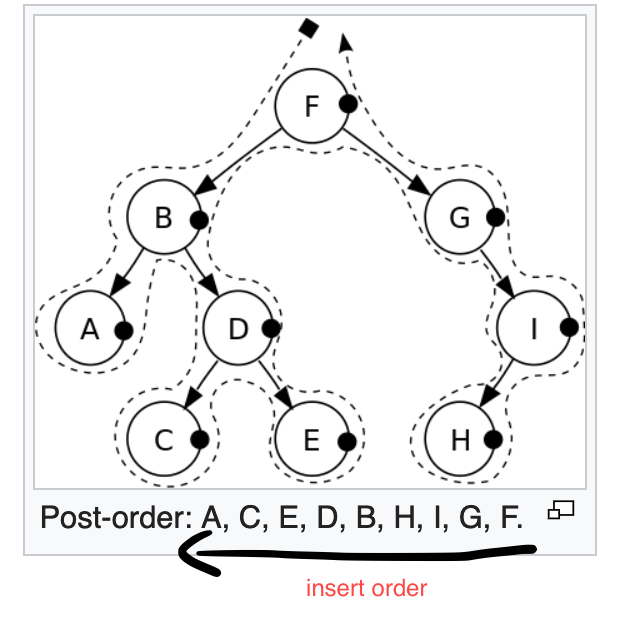
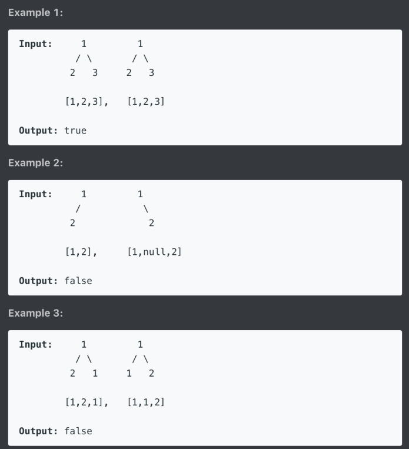
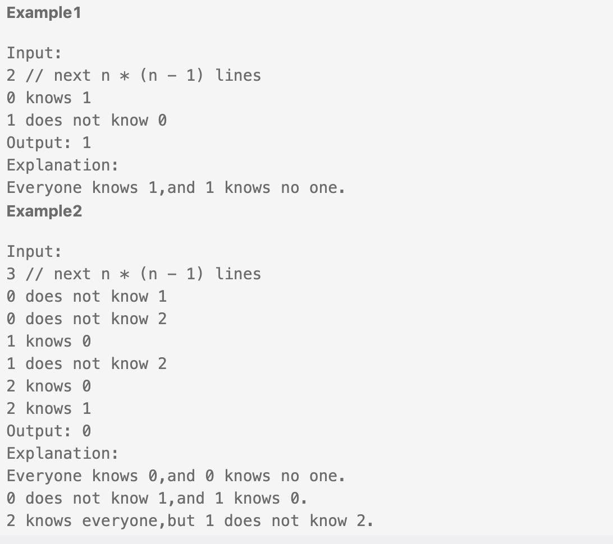
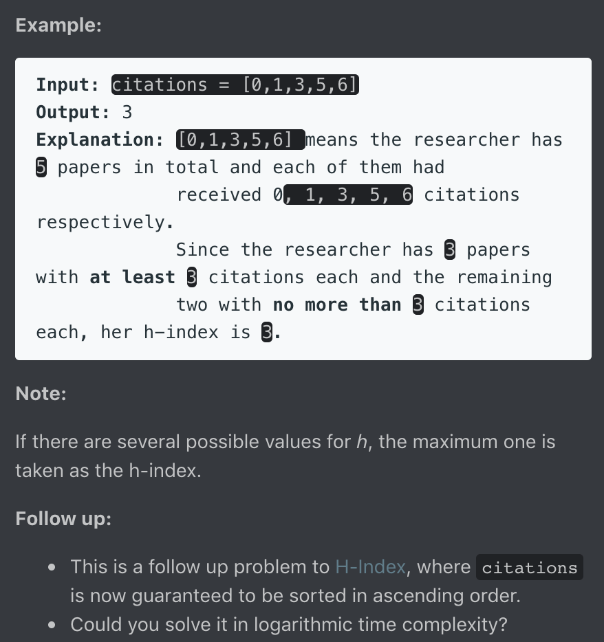

Leetcode note
===
1. [Backtrack problem 演算法整理](https://leetcode.com/problems/subsets/discuss/27281/A-general-approach-to-backtracking-questions-in-Java-(Subsets-Permutations-Combination-Sum-Palindrome-Partitioning))
2. 動態規劃(DP)講解：https://www.jianshu.com/p/a7741619dd58
4. 未解題目：
- 943, 996, 37, 212(used tree), 126(disgust), 675, 131(DP), 93(DP), 282(Hard), 968, 979, 99(Morris Traversal螺紋二叉樹),
- Binary Search: { 981(BS), 378(Binary Search Solution), 668(same as 378), 778, 174, 875, 719, 786, 4 }
- $$$$$$$$$$$$$: { Array:(244, 245, )}

---
## Trick
1. two dimension array to one dimension: MxN -> A[i/N][i%N] = number i elem in array
2. unordered_map 是 HashMap，插入和查詢的時間複雜度都是O(1)，但是裡面的映射對兒是無序的。
3. map 是 TreeMap，插入和查詢的時間複雜度都是O(lgn)，但裡面的映射對兒可以按照key值排序，還可以自定義排序方法。 同理set, unordered_set
4. 無條件進位 k = (k+1)/2 例題23
5. if (k++ > 0) -> 先判斷k是否大於零, 再++; if (++k > 0) -> 先++再判斷是否大於零

## 複習
1. priority_queue 的宣告, 如何客製化比較法？
2. string to int, int to string?
3. how to use substr?
4. how to initialize 2-D vector
---

## 17. Letter Combinations of a Phone Number
Given a string containing digits from 2-9 inclusive, return all possible letter combinations that the number could represent.

A mapping of digit to letters (just like on the telephone buttons) is given below. Note that 1 does not map to any letters.


Example:

Input: "23"
Output: ["ad", "ae", "af", "bd", "be", "bf", "cd", "ce", "cf"].

### 思路
input不知道會有多少數值，因此不能使用迴圈解 -> 遞迴解
字串走訪使用『範圍for』，char in string 搭配遞迴來窮舉所有可能解(dfs)

### Code
``` c++
vector<string> letterCombinations(string digits) {
        if (digits.empty()) return {};

        unordered_map<char, string> num_to_char {{'2', "abc"}, {'3', "def"}, {'4', "ghi"}, {'5', "jkl"}, {'6', "mno"}, {'7', "pqrs"}, {'8', "tuv"}, {'9', "wxyz"}};
        vector<string> result;
        string combination(digits.length(), ' ');
        letterCombinations(digits, combination, 0, num_to_char, result);
        return result;
    }

    void letterCombinations(string digits, string& combination, int idx,  unordered_map<char, string>& num_to_char, vector<string>& result)
    {
        if (idx == digits.length()){
            result.push_back(combination);
            return;
        }

        for (char c : num_to_char[digits[idx]]){
            combination[idx] = c;
            letterCombinations(digits, combination, idx + 1, num_to_char, result);
        }
    }
```

---


## 39. Combination Sum
Given a set of candidate numbers (candidates) (without duplicates) and a target number (target), find all unique combinations in candidates where the candidate numbers sums to target.

The same repeated number may be chosen from candidates unlimited number of times.

Note:

All numbers (including target) will be positive integers.
The solution set must not contain duplicate combinations.
Example 1:

Input: candidates = [2,3,6,7], target = 7,
A solution set is:
[
  [7],
  [2,2,3]
]
Example 2:

Input: candidates = [2,3,5], target = 8,
A solution set is:
[
  [2,2,2,2],
  [2,3,3],
  [3,5]
]
### 思路
排列問題走dfs，『狀態需紀錄』(只能向後看)
組合問題需考慮重複數字不同順序(也須向前看)
因為數字可重複，在擴張時要將自己也考慮進可能值中
在dfs迴圈當中，可用預處理直接結束該輪(不用push再pop)
與#17不同點，#17是直接取代該值(push&pop一起做)，而此題有push因此在走到底後要pop

### Code
``` c++
class Solution {
public:
    vector<vector<int>> combinationSum(vector<int>& candidates, int target) {
        vector<vector<int>> answer;
        vector<int> comb;
        sort(candidates.begin(), candidates.end());
        dfs(candidates, target, answer, comb, 0);

        return answer;
    }
private:
    void dfs(vector<int>& candidates, int target, vector<vector<int>>& answer, vector<int>& comb, int status){
        if (target == 0){
            answer.push_back(comb);
            return;
        }
        for (int i = status; i < candidates.size(); ++i){
            if (target < candidates[i]) break; //在push前進行預篩選
            comb.push_back(candidates[i]);
            /*for (vector<int>::const_iterator it = comb.begin(); it != comb.end(); ++it){
                cout << *it << ' ';
            }
            cout << endl;*/
            dfs(candidates, target - candidates[i], answer, comb, i); //用i來控制『只向自己跟後面看』
            comb.pop_back();
        }
    }


};
```


---

## 40. Combination Sum II

Given a collection of candidate numbers (candidates) and a target number (target), find all unique combinations in candidates where the candidate numbers sums to target.

Each number in candidates may only be used once in the combination.

Note:

All numbers (including target) will be positive integers.
The solution set must not contain duplicate combinations.
Example 1:

Input: candidates = [10,1,2,7,6,1,5], target = 8,
A solution set is:
[
  [1, 7],
  [1, 2, 5],
  [2, 6],
  [1, 1, 6]
]
Example 2:

Input: candidates = [2,5,2,1,2], target = 5,
A solution set is:
[
  [1,2,2],
  [5]
]

### 思路

1. 每個數字只能用一次，因此次態status要+1
2. Candidate中有重複的數字，因此向後看時會出現重複的數組情形
經觀察發現，不要讓重複數組情形出現的最好方式就是『此路不通時不走此路』
在pop_back之後就可以確定此路不通or已走過此路
因此用一while判斷式去過濾與當前走過的路，
而為不影響使用重複的節點的可能性，判斷式也應當放在pop_back之後

### Code
``` c++
class Solution {
public:
    vector<vector<int>> combinationSum2(vector<int>& candidates, int target) {
        vector<vector<int>> ans;
        vector<int> comb;
        sort(candidates.begin(), candidates.end());
        dfs(candidates, target, ans, comb, 0);
        return ans;
    }
private:
    void dfs(vector<int>& candidates, int target, vector<vector<int>>& ans, vector<int>& comb, int status){
        if (target == 0){
            ans.push_back(comb);
            return;
        }
        int layer = status;
        for (int i = status; i < candidates.size(); ++i){
            if (target < candidates[i]) break;
            comb.push_back(candidates[i]);
            dfs(candidates, target-candidates[i], ans, comb, i+1);
            comb.pop_back();
            while (i+1<candidates.size() && candidates[i]==candidates[i+1]) i++; //放pop_back之後
        }
    }
};
```

---

## 77. Combination
Given two integers n and k, return all possible combinations of k numbers out of 1 ... n.

Example:

Input: n = 4, k = 2
Output:
[
  [2,4],
  [3,4],
  [2,3],
  [1,2],
  [1,3],
  [1,4],
]

### 思路

排列組合問題老樣子走dfs
且只能向後看，因此次態的status要+1
因為沒有重複數字，向後看時不必討論是否出現重複解

### Code
``` c++
class Solution {
public:
    vector<vector<int>> combine(int n, int k) {
        vector<int> comb;
        vector<vector<int>> ans;
        dfs(comb, ans, n, k, 1);
        return ans;
    }
private:
    void dfs(vector<int>& comb, vector<vector<int>>& ans, int n, int k, int status){
        if (comb.size() == k){
            ans.push_back(comb);
            return;
        }
        for ( int i=status; i <= n; ++i){
            comb.push_back(i);
            dfs(comb, ans, n, k, i+1);
            comb.pop_back();
        }
    }
};
```

---

## 78. Subsets
Given a set of distinct integers, nums, return all possible subsets (the power set).

Note: The solution set must not contain duplicate subsets.

Example:

Input: nums = [1,2,3]
Output:
[
  [3],
  [1],
  [2],
  [1,2,3],
  [1,3],
  [2,3],
  [1,2],
  []
]

### 思路
不必設終止條件，純粹dfs走訪就能解
### Code
``` c++
class Solution {
public:
    vector<vector<int>> subsets(vector<int>& nums) {
        vector<vector<int>> ans;
        vector<int> comb;
        //ans.push_back(comb);
        dfs(nums, ans, comb, 0, 1);
        return ans;
    }
private:
    void dfs(vector<int>& nums, vector<vector<int>>& ans, vector<int>& comb, int status, int level){
        //if (comb.size() == level){
            ans.push_back(comb);
            /*for(vector<int>::iterator it=comb.begin(); it!=comb.end(); ++it){
                cout << *it << " ";
            }
            cout << endl;*/
       //     return;
        //}
        //for( int j = level; j <= nums.size(); ++j){
             for (int i = status; i < nums.size(); ++i){
                 comb.push_back(nums[i]);
                 dfs(nums, ans, comb, i+1, 0);
                 comb.pop_back();
            }
       // }

    }
};
```
---

## 90. Subsets II
Given a collection of integers that might contain duplicates, nums, return all possible subsets (the power set).

Note: The solution set must not contain duplicate subsets.

Example:

Input: [1,2,2]
Output:
[
  [2],
  [1],
  [1,2,2],
  [2,2],
  [1,2],
  []
]
### 思路
求子集合還是單存dfs走訪且不用設限制，
處理重複元素的處理，在pop_back後檢查下個元素重複的可能性
### Code
``` c++
class Solution {
public:
    vector<vector<int>> subsetsWithDup(vector<int>& nums) {
        vector<vector<int>> ans;
        vector<int> comb;
        sort(nums.begin(), nums.end());
        dfs(nums, ans, comb, 0);
        return ans;
    }
private:
    void dfs(vector<int>& nums, vector<vector<int>>& ans, vector<int>& comb, int status){
        ans.push_back(comb);
        for (int i=status; i < nums.size(); i++){
            comb.push_back(nums[i]);
            dfs(nums, ans, comb, i+1);
            comb.pop_back();
            while(i+1 < nums.size() && nums[i] == nums[i+1])    i++;
        }
    }
};
```

---


## 216. Combination Sum III
Find all possible combinations of k numbers that add up to a number n, given that only numbers from 1 to 9 can be used and each combination should be a unique set of numbers.

Note:

All numbers will be positive integers.
The solution set must not contain duplicate combinations.
Example 1:

Input: k = 3, n = 7
Output: [[1,2,4]]
Example 2:

Input: k = 3, n = 9
Output: [[1,2,6], [1,3,5], [2,3,4]]
### 思路


### Code
``` c++
class Solution {
public:
    vector<vector<int>> combinationSum3(int k, int n) {
        vector<vector<int>> ans;
        vector<int> comb;
        dfs(ans, comb, k, n, 1);
        return ans;
    }
private:
    void dfs(vector<vector<int>>& ans, vector<int>& comb, int k, int n, int status){
        if (comb.size() == k && n == 0){
            ans.push_back(comb);
            return;
        }
        for (int i=status; i<10; i++){
            //cout << "n: "<< n << endl;
            if (n - i < 0)   break;
            comb.push_back(i);
            /*for(vector<int>::iterator it=comb.begin(); it!=comb.end(); it++){
                cout<< *it << " ";
            }
            cout << endl;*/
            dfs(ans, comb, k, n-i, i+1);
            comb.pop_back();
        }
    }
};
```

---


## 46. Permutations
Given a collection of distinct integers, return all possible permutations.

Example:

Input: [1,2,3]
Output:
[
  [1,2,3],
  [1,3,2],
  [2,1,3],
  [2,3,1],
  [3,1,2],
  [3,2,1]
]
### 思路

permutation用dfs方式去解，
在set裡搜尋時要從頭開始找起，
因此需要maintain一個table記錄著元素用過與否
### Code
``` c++
class Solution {
public:
    vector<vector<int>> permute(vector<int>& nums) {
        vector<vector<int>> ans;
        vector<int> comb;
        vector<bool> utable;
        for(int i=0; i<nums.size(); i++){
            utable.push_back(false);
        }
        dfs(nums, ans, comb, utable);
        return ans;
    }
private:
    void dfs(vector<int>& nums, vector<vector<int>>& ans, vector<int>& comb, vector<bool>& utable){
        if(comb.size() == nums.size()){
            ans.push_back(comb);
            return;
        }
        for(int i = 0; i<nums.size(); i++){
            if(utable[i]) continue;
            comb.push_back(nums[i]);
            utable[i] = true;
            /*for(vector<int>::iterator it=comb.begin(); it!=comb.end(); it++){
                cout<< *it << " ";
            }
            cout << endl;*/
            dfs(nums, ans, comb, utable);
            utable[i] = false;
            comb.pop_back();
        }
    }
};
```

---

## 784. Letter Case Permutation
Given a string S, we can transform every letter individually to be lowercase or uppercase to create another string.  Return a list of all possible strings we could create.

Examples:
Input: S = "a1b2"
Output: ["a1b2", "a1B2", "A1b2", "A1B2"]

Input: S = "3z4"
Output: ["3z4", "3Z4"]

Input: S = "12345"
Output: ["12345"]
Note:

S will be a string with length between 1 and 12.
S will consist only of letters or digits.
### 思路

用dfs走訪，
注意要將改過的字串修正回來，
不然這棵樹將只會走一邊(另一端子樹沒有建立)
### Code
``` c++
class Solution {
public:
    vector<string> letterCasePermutation(string S) {
        vector<string> ans;
        dfs(ans, S, 0);
        return ans;
    }
private:
    void dfs(vector<string>& ans, string S, int status){
        ans.push_back(S);
        for (int i=status; i < S.length(); i++){
            if (isalpha(S[i])){
                if (isupper(S[i]))  S[i] = tolower(S[i]);
                else S[i] = toupper(S[i]);
                dfs(ans, S, i+1);

                // 要考慮到另一邊的子樹
                if (isupper(S[i]))  S[i] = tolower(S[i]);
                else S[i] = toupper(S[i]);
            }
        }
    }
};
```

---

## 22. Generate Parentheses
Given n pairs of parentheses, write a function to generate all combinations of well-formed parentheses.

For example, given n = 3, a solution set is:

[
  "((()))",
  "(()())",
  "(())()",
  "()(())",
  "()()()"
]
### 思路
Backtrack 的精髓就是現在這個解在backtrack之後可以發展出其他可能的解
Recursion 考慮的三要素：Coice, Constrain, Goal
Choice: place ( 或 )
Constrain: 左刮不能超過n個, 在組合中左刮一定要大於等於右刮
Goal: 左右刮都用盡

Note:
1. 在遞迴中狀態都必須是“可回溯的"
 e.g. 不會有 dfs(str += "(" )，因為當+=的時候，已經破壞這個狀態了
2. 只有在有一個集合set必須去走訪時，才需要用到for(純粹的遞迴式不一定要存在for的)

### Code
``` c++
class Solution {
public:
    vector<string> generateParenthesis(int n) {
        vector<string> ans;
        //string comb = "";
        //int left, right = n;
        dfs(ans, "", n, n);
        return ans;
    }
private:
    void dfs(vector<string>& ans, string comb, int left,int right){
        /*
            We can add this answer and then backtrack so the previous call can exhaust
            more possibilities and express more answers...and then return to its caller,
            etc. etc.
            Yeah...this is what backtracking is all about.
        */
        if (left == 0 && right == 0){
            ans.push_back(comb);
            return;
        }
        if (left > 0)   dfs(ans, comb + "(", left-1, right); // 只要左有剩就可以放左
        if (right > left)   dfs(ans, comb + ")", left, right-1); // 一定要有一個open left才能配個右
    }
};
```

---

## 301. Remove Invalid Parentheses
Remove the minimum number of invalid parentheses in order to make the input string valid. Return all possible results.

Note: The input string may contain letters other than the parentheses ( and ).

Example 1:

Input: "()())()"
Output: ["()()()", "(())()"]
Example 2:

Input: "(a)())()"
Output: ["(a)()()", "(a())()"]
Example 3:

Input: ")("
Output: [""]
### 思路

### Code
``` c++
class Solution {
public:
    vector<string> removeInvalidParentheses(string s) {
        int left, right = 0;
        vector<string> ans;
        getRemoveCount(s, left, right);
        dfs(ans, left, right, s, 0);
        if(ans.size() == 0) ans.push_back("");
        return ans;
    }

private:
    void getRemoveCount(string s, int& left, int& right){
        // 計算總共要刪除多少個左右括號 前綴右括號&後綴左括號
        for (char ch: s){
            if (ch == '('){
                left ++;
            }
            if (ch == ')'){
                if (left == 0){ // 沒有左括號可以匹配
                    right ++;
                }
                else{
                    left --;
                }
            }
        }
        cout << left << " " << right << endl;
    }
    bool isValid(string comb){
        int left, right = 0;
        for (char ch: comb){
            if (ch == '('){
                left ++;
            }
            if (ch == ')'){
                if (left == 0){ // 沒有左括號可以匹配
                    right ++;
                }
                else{
                    left --;
                }
            }
        }
        return (left == 0 && right == 0);
    }
    void dfs(vector<string>& ans, int left,int right, string comb, int status){
        if (left == 0 && right == 0){
            cout << comb << endl;
            if (isValid(comb)){
                ans.push_back(comb);
            }
            return;
        }

        for (int i = status; i < comb.length(); ++i){
            if (i > 0 && comb[i] == comb[i-1])    continue;

            if(comb[i] == '(' || comb[i] == ')'){
                string curr = comb;
                curr.erase(i,1);

                if (comb[i] == ')' && right > 0){
                    dfs(ans, left, right-1, curr, i);
                }
                else if (comb[i] == '(' && left > 0){
                    dfs(ans, left-1, right, curr, i);
                }
            }
        }
    }
};

```

---

## 51. N-Queens
The n-queens puzzle is the problem of placing n queens on an n×n chessboard such that no two queens attack each other.


Given an integer n, return all distinct solutions to the n-queens puzzle.

Each solution contains a distinct board configuration of the n-queens' placement, where 'Q' and '.' both indicate a queen and an empty space respectively.

Example:

Input: 4
Output: [
 [".Q..",  // Solution 1
  "...Q",
  "Q...",
  "..Q."],

 ["..Q.",  // Solution 2
  "Q...",
  "...Q",
  ".Q.."]
]
Explanation: There exist two distinct solutions to the 4-queens puzzle as shown above.
### 思路
首先必須選擇以column或以role來當作遞迴的標準

1. Recursion三要素: Choice, Constrain, Goal
    i. Choice: Place Q or .
    ii. Constrain: 不能讓皇后衝突
    iii. Goal: 固定邊走訪完畢

2. Previous State: 如果會更改遞迴內元素的狀態，必須在return後做恢復上一態
    i. 不會更改的例子: [Leetcode 22](https://hackmd.io/qdDOkynCRfm597nZHVg-cQ?both#22-Generate-Parentheses)
4. 矩陣內135度方向元素(x,y)，x+y = x1+y1
5. 矩陣內45度方向元素(x,y)，x-y = x1-y1
### Code
``` c++
class Solution {
public:
    vector<vector<string>> solveNQueens(int n) {
        vector<string> comb(n, string(n, '.'));
        vector<vector<string>> ans;
        backtrack(n, comb, ans, 0);
        return ans;
    }

private:
    void backtrack(int n, vector<string> comb, vector<vector<string>>& ans, int row){
        if (row == n){
            ans.push_back(comb);
            return;
        }
        for (int col=0; col<n; ++col){
            if( check(comb, row, col, n) ){
                comb[row][col] = 'Q';
                backtrack(n, comb, ans, row+1);
                comb[row][col] = '.'; // reset to previous state
            }
        }
    }

    bool check(vector<string> comb, int row, int col, int n){
        // check row
        for (int i=0; i<n; ++i){
            if (i == col)   continue;
            if (comb[row][i] == 'Q')    return false;
        }

        // check col
        for (int i=0; i<n; ++i){
            if (i == row)   continue;
            if (comb[i][col] == 'Q')    return false;
        }

        // check diag
        for (int i=0; i<n; ++i){
            if (i == row) continue;

            // check diag+ 斜率為正的對角 row+col (1,2) -> (0,3), (2,1), (3,0)
            if ( (row+col-i) >= 0 && (row+col-i) < n){
                if ( comb[i][row+col-i] == 'Q' )    return false;
            }

            // check diag- 斜率為負的對角 row-col (1,2) -> (0,1), (2,3)
            // i - x = row - col => x = i-row+col
            if ( (i-row+col) >= 0 && (i-row+col) < n){
                if ( comb[i][i-row+col] == 'Q')     return false;
            }
        }
        return true;
    }

};
```
---

## 79. Word Search(Medium) ｜ 4/1

Given a 2D board and a word, find if the word exists in the grid.

The word can be constructed from letters of sequentially adjacent cell, where "adjacent" cells are those horizontally or vertically neighboring. The same letter cell may not be used more than once.

Example:

board =
[
  ['A','B','C','E'],
  ['S','F','C','S'],
  ['A','D','E','E']
]

Given word = "ABCCED", return true.
Given word = "SEE", return true.
Given word = "ABCB", return false.
### 思路
1. 雖adjacent cell表示相鄰的字，但若整個字串都要adjacent的話，則概念就轉化成 "一筆畫" 連完字串
2. 一筆畫的概念就能夠使用遞迴的解法，這個字在這個位置存在的情況下去看上下左右是否存在下個字，遇到死路就回到上一步繼續找其他方向
3. Main function: 找起點
4. 用過的不能再用：標記為'#'，若是不歸路 要改回原來的字
### Code
``` c++
class Solution {
public:
    bool exist(vector<vector<char>>& board, string word) {
        int m = board.size(), n = board[0].size();
        // Loop-searching for the start of the seq
        for (int i=0; i<m; i++){
            for (int j=0; j<n; j++){
                if ( search( board, word, 0, i, j ) ) return true;
            }
        }
        return false;
    }

private:
    bool search( vector<vector<char>>& board, string word, int idx, int i, int j){
        if (idx == word.size()) return true;
        int m = board.size(), n = board[0].size();
        if ( i<0 || j<0 || i>=m || j>=n || board[i][j] != word[idx])  return false;
        char temp_char = board[i][j];
        board[i][j] = '#';
        bool res = search( board, word, idx+1, i-1, j) ||
                    search( board, word, idx+1, i+1, j)||
                    search( board, word, idx+1, i, j-1)||
                    search( board, word, idx+1, i, j+1);
        board[i][j] = temp_char;    // search fail then backtrack
        return res;
    }

};
```


---

## 127. Word Ladder(Medium) ｜ 4/1

Given two words (beginWord and endWord), and a dictionary's word list, find the length of shortest transformation sequence from beginWord to endWord, such that:

Only one letter can be changed at a time.
Each transformed word must exist in the word list. Note that beginWord is not a transformed word.
Note:

Return 0 if there is no such transformation sequence.
All words have the same length.
All words contain only lowercase alphabetic characters.
You may assume no duplicates in the word list.
You may assume beginWord and endWord are non-empty and are not the same.
Example 1:

Input:
beginWord = "hit",
endWord = "cog",
wordList = ["hot","dot","dog","lot","log","cog"]

Output: 5

Explanation: As one shortest transformation is "hit" -> "hot" -> "dot" -> "dog" -> "cog",
return its length 5.
Example 2:

Input:
beginWord = "hit"
endWord = "cog"
wordList = ["hot","dot","dog","lot","log"]

Output: 0

Explanation: The endWord "cog" is not in wordList, therefore no possible transformation.
### 思路


### Code
``` c++
class Solution {
public:
    int ladderLength(string beginWord, string endWord, vector<string>& wordList) {
        unordered_set<string> wordset(wordList.begin(), wordList.end());
        if (!wordset.count(endWord))    return 0;
        unordered_map<string, int> pathCnt;
        pathCnt[beginWord] = 1;

        queue<string> word_need2Cnt;
        word_need2Cnt.push(beginWord);

        while(!word_need2Cnt.empty()){
            string word = word_need2Cnt.front(); word_need2Cnt.pop();
            for (int i=0; i<word.length(); i++){
                for (char c='a'; c <= 'z'; c++){
                    string new_word = word;
                    new_word[i] = c;

                    if ( wordset.count(new_word) && new_word == endWord)    return  pathCnt[word]+1;
                    if ( wordset.count(new_word) && !pathCnt.count(new_word)){
                        pathCnt[new_word] = pathCnt[word] +1;
                        word_need2Cnt.push(new_word);
                    }
                }
            }

        }
        return 0;
    }
};
```

因為使用BFS，可以不需要用hashmap來存path count
BFS如同漣漪般向外擴散，同一層的所有可能字的path count皆為相同
因此只需要採用迴圈去計數即可
但須注意用過的元素必須從字典裡刪除，避免出現無限迴圈的情形

``` c++
class Solution {
public:
    int ladderLength(string beginWord, string endWord, vector<string>& wordList) {
        unordered_set<string> wordSet(wordList.begin(), wordList.end());
        if (!wordSet.count(endWord)) return 0;
        queue<string> q{{beginWord}};
        int res = 0;
        while (!q.empty()) {
            for (int k = q.size(); k > 0; --k) {
                string word = q.front(); q.pop();
                if (word == endWord) return res + 1;
                for (int i = 0; i < word.size(); ++i) {
                    string newWord = word;
                    for (char ch = 'a'; ch <= 'z'; ++ch) {
                        newWord[i] = ch;
                        if (wordSet.count(newWord) && newWord != word) {
                            q.push(newWord);
                            wordSet.erase(newWord); // 用過的元素必須要清掉，否則會陷入無限迴圈
                        }   
                    }
                }
            }
            ++res;
        }
        return 0;
    }
};
```
使用雙向BFS 尋找中間點
要進行BFS前先進行判斷哪條可以進行比較少的判斷

``` c++
class Solution {
public:
    int ladderLength(string beginWord, string endWord, vector<string>& wordList) {
        unordered_set<string> wordset(wordList.begin(), wordList.end());
        unordered_set<string> headset, tailset, *phead, *ptail;
        if (wordset.find(endWord) == wordset.end())    return 0;
        headset.insert(beginWord);
        tailset.insert(endWord);
        int ladder = 2;

        while (!headset.empty() && !tailset.empty()){ // NOTE: is "&&" rather than "||"
            // Use the less size set to first bfs
            if (headset.size() < tailset.size()){
                phead = &headset;
                ptail = &tailset;
            }
            else{
                phead = &tailset;
                ptail = &headset;
            }
            unordered_set<string> newWord2insert2wordset;
            for (auto it = phead -> begin(); it != phead -> end(); it++){
                string word = *it;
                for (int i=0; i<word.size(); i++){
                    char tempchar = word[i];
                    for (int j=0; j<26; j++){
                        word[i] = 'a' + j;
                        if ( ptail -> find(word) != ptail -> end()){
                            return ladder;
                        }
                        if ( wordset.find(word) != wordset.end()){
                            newWord2insert2wordset.insert(word);
                            wordset.erase(word); // ERASE!
                        }
                    }
                    word[i] = tempchar;
                }
            }
            ladder++;
            phead -> swap(newWord2insert2wordset);
        }
        return 0;
    }
};
```
---

## 752. Open the Lock(Medium)｜ 4/7
You have a lock in front of you with 4 circular wheels. Each wheel has 10 slots: '0', '1', '2', '3', '4', '5', '6', '7', '8', '9'. The wheels can rotate freely and wrap around: for example we can turn '9' to be '0', or '0' to be '9'. Each move consists of turning one wheel one slot.

The lock initially starts at '0000', a string representing the state of the 4 wheels.

You are given a list of deadends dead ends, meaning if the lock displays any of these codes, the wheels of the lock will stop turning and you will be unable to open it.

Given a target representing the value of the wheels that will unlock the lock, return the minimum total number of turns required to open the lock, or -1 if it is impossible.

Example 1:
Input: deadends = ["0201","0101","0102","1212","2002"], target = "0202"
Output: 6
Explanation:
A sequence of valid moves would be "0000" -> "1000" -> "1100" -> "1200" -> "1201" -> "1202" -> "0202".
Note that a sequence like "0000" -> "0001" -> "0002" -> "0102" -> "0202" would be invalid,
because the wheels of the lock become stuck after the display becomes the dead end "0102".
Example 2:
Input: deadends = ["8888"], target = "0009"
Output: 1
Explanation:
We can turn the last wheel in reverse to move from "0000" -> "0009".
Example 3:
Input: deadends = ["8887","8889","8878","8898","8788","8988","7888","9888"], target = "8888"
Output: -1
Explanation:
We can't reach the target without getting stuck.
Example 4:
Input: deadends = ["0000"], target = "8888"
Output: -1
Note:
The length of deadends will be in the range [1, 500].
target will not be in the list deadends.
Every string in deadends and the string target will be a string of 4 digits from the 10,000 possibilities '0000' to '9999'.
### 思路

0. 與#127概念類似
1. 雙向BFS解
2. Number to string
    code[i] = ((temp[i] - '0') + 10 + j) % 10 + '0';
### Code
``` c++
class Solution {
public:
    int openLock(vector<string>& deadends, string target) {
        if (deadset.find("0000") != deadset.end())  return -1;
        unordered_set<string> headset, tailset, visited, *phead, *ptail;
        unordered_set<string> deadset(deadends.begin(), deadends.end());
        int res=0;
        headset.insert("0000");
        visited.insert("0000");
        tailset.insert(target);


        while ( !headset.empty() && !tailset.empty()){
            unordered_set<string> branch;
            if (headset.size() < tailset.size()){
                phead = &headset;
                ptail = &tailset;
            }
            else{
                phead = &tailset;
                ptail = &headset;
            }

            for (auto it = phead -> begin(); it != phead -> end(); it++){
                string code = *it;
                for (int i=0; i<4; i++){
                    string temp = code;
                    for (int j=-1; j<=1; j++){
                        if (j == 0)    continue; // ignore the visited one
                        code[i] = ((temp[i] - '0') + 10 + j) % 10 + '0';

                        if (ptail -> find(code) != ptail -> end() )   return res+1;
                        if (deadset.find(code) == deadset.end() && visited.find(code) == visited.end()){
                            branch.insert(code);
                            visited.insert(code);
                        }

                    } // end of +/- 1
                    code = temp;
                } // end of modify each char
            } // end of headset
            res++;
            phead -> swap(branch);
        }
        return -1;
    }
};
```

---

## 542. 01 Matrix (Medium)｜ 4/7
Given a matrix consists of 0 and 1, find the distance of the nearest 0 for each cell.

The distance between two adjacent cells is 1.
Example 1:
Input:

0 0 0
0 1 0
0 0 0
Output:
0 0 0
0 1 0
0 0 0
Example 2:
Input:

0 0 0
0 1 0
1 1 1
Output:
0 0 0
0 1 0
1 2 1
Note:
The number of elements of the given matrix will not exceed 10,000.
There are at least one 0 in the given matrix.
The cells are adjacent in only four directions: up, down, left and right.
### 思路
1. 比較直覺的方式：使用BFS去尋找最短路徑
2.
### Code
用BFS找最短路徑
``` c++
class Solution {
public:
    vector<vector<int>> updateMatrix(vector<vector<int>>& matrix) {
        int m = matrix.size(), n = matrix[0].size();
        int dirs[5] = {0, -1, 0, 1, 0}; // simple way to record of direction matrix (0,-1) for left ; (-1,0) for down; (0,1) for right ; (1,0) for up
        queue<pair<int, int>> points2calc;

        for (int i=0; i<m; i++){
            for (int j=0; j<n; j++){
                if (matrix[i][j] == 0){
                    points2calc.push({i,j});    // BFS from 0
                }
                else if (matrix[i][j] == 1){
                    matrix[i][j] = 201; // num of elements given matrix not exceed 10000, thus the maximum of the possible distance which is diagonal points would not exceed 200 (100+100)
                }
            }
        }


        while (!points2calc.empty()){
            auto t = points2calc.front(); points2calc.pop();
            for (int i=0; i<4; i++){
                int x = t.first + dirs[i];
                int y = t.second + dirs[i+1];

            //  (x,y) > (t.f,t.s)+1 means there is a shortter path value (t.f,t.s)+1 ,thus applied to it. Then push into queue to update neiborhood value.
                if (x>=0 && y>=0 && x<m && y<n &&
                    matrix[x][y] > matrix[t.first][t.second] + 1){
                    matrix[x][y] = matrix[t.first][t.second] + 1;
                    points2calc.push({x,y});
                }
            }
        }

        return matrix;
    }
};
```

使用兩階段比較法(牛B):
```class Solution {
public:
    vector<vector<int>> updateMatrix(vector<vector<int>>& matrix) {
        int m = matrix.size(), n = matrix[0].size();
        vector<vector<int>> res(m, vector<int>(n, INT_MAX - 1));
        // 比較左&上 從左上走到右下
        for (int i = 0; i < m; ++i) {
            for (int j = 0; j < n; ++j) {
                if (matrix[i][j] == 0) res[i][j] = 0;
                else {
                    if (i > 0) res[i][j] = min(res[i][j], res[i - 1][j] + 1);
                    if (j > 0) res[i][j] = min(res[i][j], res[i][j - 1] + 1);
                }
            }
        }
        // 比較右&下 從右下走到左上
        // 到第二階段，若值已經為0或1則不可能找到更短的距離因此不用更新
        for (int i = m - 1; i >= 0; --i) {
            for (int j = n - 1; j >= 0; --j) {
                if (res[i][j] != 0 && res[i][j] != 1) {
                    if (i < m - 1) res[i][j] = min(res[i][j], res[i + 1][j] + 1);
                    if (j < n - 1) res[i][j] = min(res[i][j], res[i][j + 1] + 1);
                }
            }
        }
        return res;
    }
};
```

---

## 934. Shortest Bridge(Medium)｜ 4/7
In a given 2D binary array A, there are two islands.  (An island is a 4-directionally connected group of 1s not connected to any other 1s.)

Now, we may change 0s to 1s so as to connect the two islands together to form 1 island.

Return the smallest number of 0s that must be flipped.  (It is guaranteed that the answer is at least 1.)


Example 1:

Input: [[0,1],[1,0]]
Output: 1
Example 2:

Input: [[0,1,0],[0,0,0],[0,0,1]]
Output: 2
Example 3:

Input: [[1,1,1,1,1],[1,0,0,0,1],[1,0,1,0,1],[1,0,0,0,1],[1,1,1,1,1]]
Output: 1


Note:

1 <= A.length = A[0].length <= 100
A[i][j] == 0 or A[i][j] == 1
### 思路


### Code
``` c++
class Solution {
public:
    int shortestBridge(vector<vector<int>>& A) {
        // identify the other island
        for (int i=0, found=0; !found && i<A.size(); i++){
            for (int j=0; !found && j<A[0].size(); j++){
                found = paint(A, i, j);
            }
        }

        for (int cl=2; ;cl++){
            for (int i=0, found=0; !found && i<A.size(); i++){
                for (int j=0; !found && j<A[0].size(); j++){
                    if (cl == A[i][j] && (expand(A, i-1, j, cl) || expand(A, i, j-1, cl)
                                    || expand(A, i+1, j, cl) || expand(A, i, j+1, cl)) )
                    {
                        return cl-2;
                    }
                }
            }
        }
    }

private:
    int paint(vector<vector<int>>& A, int i, int j){
        if (i<0 || j<0 || i>= A.size() || j>= A[0].size() || A[i][j] != 1)   return 0;
        A[i][j] = 2;
        return 1 + paint(A, i-1, j) + paint(A, i, j-1) + paint(A, i+1, j) + paint(A, i, j+1);
    }

    bool expand(vector<vector<int>>& A, int i, int j, int cl){
        if (i<0 || j<0 || i>= A.size() || j>= A[0].size())  
            return false;
        if (A[i][j] == 0)    
            A[i][j] = cl+1;
        return A[i][j] == 1;
    }
};
```
---
## 698. Partition to K Equal Sum Subsets(Medium)｜ 4/8
Given an array of integers nums and a positive integer k, find whether it's possible to divide this array into k non-empty subsets whose sums are all equal.


Example 1:

Input: nums = [4, 3, 2, 3, 5, 2, 1], k = 4
Output: True
Explanation: It's possible to divide it into 4 subsets (5), (1, 4), (2,3), (2,3) with equal sums.


Note:

1 <= k <= len(nums) <= 16.
0 < nums[i] < 10000.
### 思路
首先判斷sum是否能整除k，不能整除的話直接返回false。然後需要一個visited數組來記錄哪些數組已經被選中了，然後調用遞歸函數，我們的目標是組k個子集合，是的每個子集合之和為target = sum/k。我們還需要變量start，表示從數組的某個位置開始查找，curSum為當前子集合之和，在遞歸函數中，如果k=1，說明此時只需要組一個子集合，那麼當前的就是了，直接返回true。如果curSum等於target了，那麼我們再次調用遞歸，此時傳入k-1，start和curSum都重置為0，因為我們當前又找到了一個和為target的子集合，要開始繼續找下一個。否則的話就從start開始遍曆數組，如果當前數字已經訪問過了則直接跳過，否則標記為已訪問。然後調用遞歸函數，k保持不變，因為還在累加當前的子集合，start傳入i+1，curSum傳入curSum+nums[i]，因為要累加當前的數字，如果遞歸函數返回true了，則直接返回true。否則就將當前數字重置為未訪問的狀態繼續遍歷
一些優化：比如先給數組按從大到小的順序排個序，然後在遞歸函數中，我們可以直接判斷，如果curSum大於target了，直接返回false，因為題目中限定了都是正數，並且我們也給數組排序了，後面的數字只能更大
### Code
``` c++
class Solution {
public:
    bool canPartitionKSubsets(vector<int>& nums, int k) {
        int sum = accumulate(nums.begin(), nums.end(), 0);
        if (sum % k != 0)   return false;
        sort(nums.begin(), nums.end(), greater<int>());
        vector<bool> visited(nums.size(), false);
        return dfs(nums, visited, sum/k, 0, 0, k);
    }
    bool dfs(vector<int>& nums, vector<bool>& visited, int target, int curSum, int idx, int goal){
        if (goal == 1)          return true;
        if (curSum > target)    return false;
        if (curSum == target)   return dfs(nums, visited, target, 0, 0, goal-1);
        for (int i=idx; i<nums.size(); ++i){
            if (visited[i])     continue;
            visited[i] = true;
            if (dfs(nums, visited, target, curSum + nums[i], i+1, goal) )
                return true;
            visited[i] = false;
        }
        return false;
    }      
};
```

---
## 93. Restore IP Addresses｜ 4/9
Given a string containing only digits, restore it by returning all possible valid IP address combinations.

Example:

Input: "25525511135"
Output: ["255.255.11.135", "255.255.111.35"]
### 思路
**1. 只要遇到字符串的子序列或配准問題首先考慮動態規劃DP**
**2. 只要遇到需要求出所有可能情況首先考慮用遞歸。**

這道題並非是求字符串的子序列或配准問題，更符闔第二種情況，所以我們要用遞歸來解。我們用k來表示當前還需要分的段數，如果k = 0，則表示三個點已經加入完成，四段已經形成，若這時字符串剛好為空，則將當前分好的結果保存。若k != 0, 則對於每一段，我們分別用一位，兩位，三位來嘗試，分別判斷其合不合法，如果合法，則調用遞歸繼續分剩下的字符串，最終和求出所有合法組合
### Code
``` c++

class Solution {
public:
    vector<string> restoreIpAddresses(string s) {
        vector<string> res;
        dfs(s, 0, "", res);
        return res;
    }
private:
    void dfs(string s, int cnt, string comb, vector<string>& res){
        if (cnt == 4){
            if (s.empty())  res.push_back(comb);
        }
      /*if (cnt == 4 && s.empty()){
          res.push_back(comb);
        }*/
        if (s.size() > (4-cnt)*3)   return;
        if (s.size() < (4-cnt))     return;
        // possibility of digit from 1~3
        for (int i=1; i<4; i++){
            if (s.size() < i)   break;
            int val = atoi(s.substr(0, i).c_str());
            if (val > 255 || i != to_string(val).size()) // val>255 or val = 01, 001, 011
                continue;
            dfs(s.substr(i), cnt+1, comb + s.substr(0, i) + (cnt==3 ? "":"."), res);
        }
    }
};
```
---
## 241. Different Ways to Add Parentheses(Medium)｜ 4/10
Given a string of numbers and operators, return all possible results from computing all the different possible ways to group numbers and operators. The valid operators are +, - and *.

Example 1:

Input: "2-1-1"
Output: [0, 2]
Explanation:
((2-1)-1) = 0
(2-(1-1)) = 2
Example 2:

Input: "2*3-4*5"
Output: [-34, -14, -10, -10, 10]
Explanation:
(2*(3-(4*5))) = -34
((2*3)-(4*5)) = -14
((2*(3-4))*5) = -10
(2*((3-4)*5)) = -10
(((2*3)-4)*5) = 10


### 思路


### Code
``` c++
class Solution {
public:
    vector<int> diffWaysToCompute(string input) {
        unordered_map<string, vector<int>> cache;
        return dfs_dp(input, cache);
    }

    vector<int> dfs_dp(string input, unordered_map<string, vector<int>>& cache){
        vector<int> res;
        for (int i=0; i<input.size(); i++){
            char c = input[i];
            if (c == '+' || c == '-' || c == '*'){
                vector<int> left, right;
                string substr;
                substr = input.substr(0,i);
                if (cache.find(substr) != cache.end())
                    left = cache[substr];
                else
                    left = dfs_dp(substr, cache);

                substr = input.substr(i+1);
                if (cache.find(substr) != cache.end())
                    right = cache[substr];
                else
                    right = dfs_dp(substr, cache);

                // implement 笛卡爾積
                for (auto l : left){
                    for (auto r : right){
                        if (c == '+')   res.push_back( l+r );
                        if (c == '-')   res.push_back( l-r );
                        if (c == '*')   res.push_back( l*r );
                    }
                }
            } // end of if op
        }// end of string walk-through

        // the input only consist integer, return int
        if(res.empty())
            res.push_back(atoi(input.c_str()));
        cache[input] = res;
        return res;
    }
};
```

---
## !95. Unique Binary Search Trees II(Medium)｜ 4/22

### 4/28 review(X)
```c++
for(l:left){
    for(r:right){
        ...
    }
}
```
### 思路

如下圖，我們讓1~n的每個數當當看root，並回傳所有可能解
程式碼方面:
直覺的，i是root，而start ~ i-1是左子樹，i+1 ~ end 是右子樹
而左右子樹都可以再分別遞迴下去做切割成左及右子樹
當無法再切割時(start > end)時，就是NULL的狀態


### Code
``` c++
/**
 * Definition for a binary tree node.
 * struct TreeNode {
 *     int val;
 *     TreeNode *left;
 *     TreeNode *right;
 *     TreeNode(int x) : val(x), left(NULL), right(NULL) {}
 * };
 */
class Solution {
public:
    vector<TreeNode*> generateTrees(int n) {
        if (n == 0)  return { };
        return generateTreesDFS(1, n);
    }

    vector<TreeNode*> generateTreesDFS(int start, int end){
        vector<TreeNode*> subtree;
        if (start > end){
            subtree.push_back(NULL);
        }
        else{
            for (int i=start; i<= end; ++i){
                vector<TreeNode*> left = generateTreesDFS( start, i-1 );
                vector<TreeNode*> right = generateTreesDFS( i+1, end );
                for (auto l:left){
                    for (auto r:right){
                        TreeNode* node = new TreeNode(i);   // generate the (sub)root
                        node -> left = l;
                        node -> right = r;
                        subtree.push_back(node);
                    }
                }
            } // end of start-to-end walkthrough
        }
        return subtree;
    }
};
```

---
## !842. Split Array into Fibonacci Sequence(Medium)｜ 4/22
Given a string S of digits, such as S = "123456579", we can split it into a Fibonacci-like sequence [123, 456, 579].

Formally, a Fibonacci-like sequence is a list F of non-negative integers such that:

0 <= F[i] <= 2^31 - 1, (that is, each integer fits a 32-bit signed integer type);
F.length >= 3;
and F[i] + F[i+1] = F[i+2] for all 0 <= i < F.length - 2.
Also, note that when splitting the string into pieces, each piece must not have extra leading zeroes, except if the piece is the number 0 itself.

Return any Fibonacci-like sequence split from S, or return [] if it cannot be done.

Example 1:

Input: "123456579"
Output: [123,456,579]
Example 2:

Input: "11235813"
Output: [1,1,2,3,5,8,13]
Example 3:

Input: "112358130"
Output: []
Explanation: The task is impossible.
Example 4:

Input: "0123"
Output: []
Explanation: Leading zeroes are not allowed, so "01", "2", "3" is not valid.
Example 5:

Input: "1101111"
Output: [110, 1, 111]
Explanation: The output [11, 0, 11, 11] would also be accepted.
Note:

1 <= S.length <= 200
S contains only digits.
### 4/28 review(X)

### 思路
符合題意的數列其實可能不止一種，但是本題就讓返回一個就行了。不管返回幾個，總之不是求極值，DP在這裡就不好使了，只能用遞歸了，由於不知道如何分割，所以肯定需要遍歷所有的情況。我們用一個數組out來記錄已經組成的序列，用結果res來保存結果。當out數組的個數大於等於3，並且已經遍歷完了字符串S，那麼此時就是可以把out數組中的內存賦值給結果res了，那麼之後只要檢測結果res不為空時，直接返回就可以了，這是個很好的剪枝操作，因為此題只需要一個正確答案即可

現在來考慮遞歸函數的主體該怎麼寫，既然不知道要如何分割，那麼就要嘗試所有的情況，一個數字，兩個數字，一直到末尾，那麼就可以遍歷字符串S，然後取子串即可。但從什麼位置開始呢，每次都從頭嗎，這道題都數字不能重複使用，所以應該用個變量start來記錄當前遍歷到的位置，那麼我們從start位置起，每次取 i-start+1 長度的子串 cur，此時在轉為int之前，需要先處理leading zeros的情況，判斷若cur長度大於1，且首字符為0，直接break，還就是若cur的長度大於10，也break，為啥呢？因為整型的最大值是 2147483647，只有10位，所以當cur長度大於10時，一定會溢出。當cur長度為10時，也有可能溢出，這個在之後處理。好，現在將cur轉為長整型 long，因為長度為10也可能溢出，所以要先轉為長整型，然後在判斷若大於整型最大值 INT_MAX，直接break。接下來就要考慮是否要加入out數組了，當out數字的個數不到2個的時候，我們可以直接加入當前數字，若大於等於2個，需要考慮是否滿足斐波納切數列的性質，即當前數字是否等於前兩個數字之和，滿足的話才加入，不然就跳過，注意這裡不能直接break，因為之後的數字也許可能滿足要求。加入out數組之後，就可以調用遞歸了，此時起始位置傳入 i+1，之後再恢復out的狀態即可
### Code
``` c++
class Solution {
public:
    vector<int> splitIntoFibonacci(string S) {
        vector<int> out, res;
        recursion(S, 0, out, res);
        return res;
    }

private:
    void recursion(string S, int start, vector<int>& out, vector<int>& res) {
        // as long as finding one solution, return
        if (!res.empty())    return;
        // out is more than three elements, and we walkthrough whole string, out is the result
        if (out.size() >= 3 && start >= S.length()){
            res = out;  return;
        }
        for (int i=start; i<S.length(); i++){
            // select at least 1 digit, but increasible depends on the increasing i in for-loop
            string s = S.substr(start, i-start+1);
            // leading zero or overflow with (longer)larger than INT_MAX(2147483647)
            if ( (s.length() > 1 && s[0] == '0'))  break;
            long num = stol(s);
            if (num >= INT_MAX) break;
            // if it is not an Feb seq, note: we shouldn't break here, cuz the possib of 下個數字的與當前數字的組合
            if (out.size() >= 2 && num != (long)out[out.size() - 1] + out[out.size() -2])   continue;
            out.push_back(num);
            recursion(S, i+1, out, res);
            out.pop_back();
        }
    }
};
```

---
## !94. Binary Tree Inorder Traversal｜ 4/22
Given a binary tree, return the inorder traversal of its nodes' values.

Example:

Input: [1,null,2,3]
   1
    \
     2
    /
   3

Output: [1,3,2]
Follow up: Recursive solution is trivial, could you do it iteratively?
### 4/28 review

### 思路
Pre-order: Duplicate binary tree
In-order: Binary search tree
Post-order: Delete binary tree
__Binary tree ~> DFS ~> stack__
=> __Travesal order == code order__
公式：
``` c++
while(p||!stack.empty()){
    if(p){
        stack.push(p);
        // traversal order...
        // ...
    }
    else{
        p = stack.top(); stack.pop();
        /// traversal order...
        // ...
    }
}
```

空間複雜度更低的方法：Morris Traversal(不使用stack全部使用pointer)
### Code
``` c++
/**
 * Definition for a binary tree node.
 * struct TreeNode {
 *     int val;
 *     TreeNode *left;
 *     TreeNode *right;
 *     TreeNode(int x) : val(x), left(NULL), right(NULL) {}
 * };
 */
class Solution {
public:
    vector<int> inorderTraversal(TreeNode* root) {
        vector<int> res;
        stack<TreeNode*> stack;
        TreeNode* p = root;
        while(p || !stack.empty()){
            if(p){
                stack.push(p);
                p = p -> left;
            }
            else{
                p = stack.top(); stack.pop();
                res.push_back(p->val);
                p = p -> right;
            }
        }
        return res;
    }
};
```
---
## @144. Binary Tree Preorder Traversal｜ 4/22
Given a binary tree, return the preorder traversal of its nodes' values.

Example:

Input: [1,null,2,3]
   1
    \
     2
    /
   3

Output: [1,2,3]
Follow up: Recursive solution is trivial, could you do it iteratively?

### 4/29 review
### 思路
children是vector型態直接用for迴圈走訪
與#589 的比較：589這題最大的不同是我們必須一次將所有的children全部放進stack裡，因此程式與輸出value的順序必須顛倒(因為stack的性質)
而#144: 一次push一個節點進stack，在下一次的迴圈我們希望輸出的value就是top，因此程式與輸出value的順序要一樣
### Code
``` c++
/**
 * Definition for a binary tree node.
 * struct TreeNode {
 *     int val;
 *     TreeNode *left;
 *     TreeNode *right;
 *     TreeNode(int x) : val(x), left(NULL), right(NULL) {}
 * };
 */
class Solution {
public:
    vector<int> preorderTraversal(TreeNode* root) {
        vector<int> res;
        stack<TreeNode*> stack;
        TreeNode* p = root;
        while (!stack.empty() || p){
            if (p){
                stack.push(p);
                res.push_back(p->val);
                p = p->left;
            }
            else{
                p = stack.top();    stack.pop();
                p = p->right;
            }
        }
        return res;
    }
};
```
---
## @145. Binary Tree Postorder Traversal｜ 4/22
Given a binary tree, return the postorder traversal of its nodes' values.

Example:

Input: [1,null,2,3]
   1
    \
     2
    /
   3

Output: [3,2,1]
Follow up: Recursive solution is trivial, could you do it iteratively?

### 4/29 review
### 思路
post traversal order: left->right->root
 can't directly code it cuz there are no pointer p in the else statement
 hence, reverse the traversal order to [root->right->left]
 and also reverse the push_back order in vector ( insert from begin )


### Code
``` c++
/**
 * Definition for a binary tree node.
 * struct TreeNode {
 *     int val;
 *     TreeNode *left;
 *     TreeNode *right;
 *     TreeNode(int x) : val(x), left(NULL), right(NULL) {}
 * };
 */
/*
traversal order: left->right->root
 can't directly code it cuz the pointer will lose his parents
 hence, reverse the traversal order to [root->right->left]
 and also reverse the push_back order in vector ( insert from begin )
*/
class Solution {
public:
    vector<int> postorderTraversal(TreeNode* root) {
        vector<int> res;
        stack<TreeNode*> stack;
        TreeNode* p = root;
        while(p || !stack.empty()){
            if(p){
                stack.push(p);
                res.insert(res.begin(), p->val);
                p = p->right;
            }
            else{
                p = stack.top();    stack.pop();
                p = p->left;
            }
        }
        return res;
    }
};
```
---
## !589. N-ary Tree Preorder Traversal｜ 4/23
Given an n-ary tree, return the preorder traversal of its nodes' values.

For example, given a 3-ary tree:


Return its preorder traversal as: [1,3,5,6,2,4].

### 4/29 review
### 思路
children是vector型態直接用for迴圈走訪
與#144 的比較：這題最大的不同是我們必須一次將所有的children全部放進stack裡，因此程式與輸出value的順序必須顛倒(因為stack的性質)
而#144: 一次push一個節點進stack，在下一次的迴圈我們希望輸出的value就是top，因此程式與輸出value的順序要一樣
### Code
``` c++
/*
// Definition for a Node.
class Node {
public:
    int val;
    vector<Node*> children;

    Node() {}

    Node(int _val, vector<Node*> _children) {
        val = _val;
        children = _children;
    }
};
*/
// root, left, right
class Solution {
public:
    vector<int> preorder(Node* root) {
        if (!root)  return { };
        vector<int> res;
        stack<Node*> stack;
        stack.push(root);
        while(!stack.empty()){
            Node* p = stack.top(); stack.pop();
            res.push_back(p->val);
            // suppose the children vector order is left and right
            // with the stack, should push right first cuz we want left out first
            for(int i=p->children.size()-1; i>=0; i--){
                stack.push(p->children[i]);
            }
        }
        return res;
    }
};
```
---
## @590. N-ary Tree Postorder Traversal｜ 4/23
Given an n-ary tree, return the postorder traversal of its nodes' values.

For example, given a 3-ary tree:


Return its postorder traversal as: [5,6,3,2,4,1].


Note:

Recursive solution is trivial, could you do it iteratively?

### 4/29 review
### 思路
children是vector型態直接用for迴圈走訪即可
post order使用反轉手法
### Code
``` c++
/*
// Definition for a Node.
class Node {
public:
    int val;
    vector<Node*> children;

    Node() {}

    Node(int _val, vector<Node*> _children) {
        val = _val;
        children = _children;
    }
};
*/
// left, right, root ->(reverse)-> root, right, left
//
class Solution {
public:
    vector<int> postorder(Node* root) {
        if(!root)   return { };
        vector<int> res;
        stack<Node*> stack;
        stack.push(root);
        while (!stack.empty()){
            Node* p = stack.top(); stack.pop();
            res.insert(res.begin(), p->val); // could use push_back and reverse the res before return it.
            // want right come-out first so left first in
            for (int i=0; i< p->children.size(); i++){
                stack.push(p->children[i]);
            }
        }
        return res;
    }
};
```

---
## @100. Same Tree｜ 4/23
Given two binary trees, write a function to check if they are the same or not.

Two binary trees are considered the same if they are structurally identical and the nodes have the same value.


### 4/29 review
### 思路
iterative的手法，前中後序接可以應用來比較

### Code
Recursive
``` c++
class Solution {
public:
    bool isSameTree(TreeNode *p, TreeNode *q) {
        if (!p && !q) return true;
        if ((p && !q) || (!p && q) || (p->val != q->val)) return false;
        return isSameTree(p->left, q->left) && isSameTree(p->right, q->right);
    }
};
```

Iterative(faster)
``` c++
/**
 * Definition for a binary tree node.
 * struct TreeNode {
 *     int val;
 *     TreeNode *left;
 *     TreeNode *right;
 *     TreeNode(int x) : val(x), left(NULL), right(NULL) {}
 * };
 */
class Solution {
public:
    bool isSameTree(TreeNode* p, TreeNode* q) {
        stack<TreeNode*> stack;
        stack.push(p), stack.push(q);
        while(!stack.empty()){
            q = stack.top();  stack.pop();
            p = stack.top();  stack.pop();
            if (!p && !q)   continue;
            if ((!p && q) || (p && !q) || (p->val != q->val) )    return false;
            // 在前面兩個if完全過濾掉p的child有NULL的情形了，所以這邊才能放心push Note: stack can't push NULL
            stack.push(p->right), stack.push(q->right);
            stack.push(p->left), stack.push(q->left);
        }
        return true;
    }
};
```
---
## @101. Symmetric Tree｜ 4/23
Given a binary tree, check whether it is a mirror of itself (ie, symmetric around its center).

For example, this binary tree [1,2,2,3,4,4,3] is symmetric:


### 思路
切割成左右子樹比較
直覺上使用queue來處理
實測:Queue的速度比Stack快很多

### Code
Recursive
``` c++
class Solution {
public:
    bool isSymmetric(TreeNode* root) {
        if (!root) return true;
        return isSymmetric(root->left, root->right);
    }
    bool isSymmetric(TreeNode* left, TreeNode* right) {
        if (!left && !right) return true;
        if (left && !right || !left && right || left->val != right->val) return false;
        return isSymmetric(left->left, right->right) && isSymmetric(left->right, right->left);
    }

};
```
Iterative
``` c++
/**
 * Definition for a binary tree node.
 * struct TreeNode {
 *     int val;
 *     TreeNode *left;
 *     TreeNode *right;
 *     TreeNode(int x) : val(x), left(NULL), right(NULL) {}
 * };
 */
class Solution {
public:
    bool isSymmetric(TreeNode* root) {
        if(!root)   return true;
        TreeNode* left = root->left;
        TreeNode* right = root->right;
        queue<TreeNode*> queue;
        queue.push(left), queue.push(right);
        while(!queue.empty()){
            left = queue.front(); queue.pop();
            right = queue.front(); queue.pop();
            if (!left && !right)    continue;
            if ((!left && right) || (left &&!right) || (left->val != right->val) )  return false;
            queue.push(left->left), queue.push(right->right);
            queue.push(left->right),queue.push(right->left);
        }
        return true;
    }
};
```
---
## @104. Maximum Depth of Binary Tree｜ 4/23
Given a binary tree, find its maximum depth.

The maximum depth is the number of nodes along the longest path from the root node down to the farthest leaf node.

Note: A leaf is a node with no children.

Example:

Given binary tree [3,9,20,null,null,15,7]

return its depth = 3
### 4/29 review
### 思路

使用層序遍歷二叉樹，然後計數總層數，即為二叉樹的最大深度
### Code
Recursive
``` c++
class Solution {
public:
    int maxDepth(TreeNode* root) {
        if (!root) return 0;
        return 1 + max(maxDepth(root->left), maxDepth(root->right));
    }
};

```
Iterative
``` c++

class Solution {
public:
    int maxDepth(TreeNode* root) {
        if(!root)   
            return 0;
        int res = 0;
        // We need to consider all the node in the layer, hence BFS
        queue<TreeNode*> queue;
        queue.push(root);
        while (!queue.empty()){
            ++res;
            // shouldn't inc counter if in the same layer, hence recourd their children & pop them all out
            for (int i=0, n=queue.size(); i<n; ++i){
        //  for (int i=0, i<queue.size(); ++i)  errors happen cuz the inc of queue.size()
        //  for (int i=queue.size(); i>0; i--)  THIS would be the safetest
                TreeNode* t = queue.front();   
                queue.pop();
                if(t->left)  
                    queue.push(t->left);
                if(t->right)
                    queue.push(t->right);
            }
        }
        return res;
    }
};

```
---
## *110. Balanced Binary Tree｜ 4/24
### 4/29 review
### 思路

### Code
Solution1: calculate all the nodes
``` c++
/**
 * Definition for a binary tree node.
 * struct TreeNode {
 *     int val;
 *     TreeNode *left;
 *     TreeNode *right;
 *     TreeNode(int x) : val(x), left(NULL), right(NULL) {}
 * };
 */
class Solution {
public:
    bool isBalanced(TreeNode* root) {
        if (!root)  return true;
        if (abs(getDepth(root->left) - getDepth(root->right)) > 1)   return false;
        // need to check every node in this tree is all balanced tree, hence recursive it
        return isBalanced(root->left) && isBalanced(root->right);
    }

    int getDepth(TreeNode* root){
        if (!root)  return 0;
        return 1 + max(getDepth(root->left), getDepth(root->right));
    }
};
```
Solution2 做了一些計算上的優化
``` c++
/**
 * Definition for a binary tree node.
 * struct TreeNode {
 *     int val;
 *     TreeNode *left;
 *     TreeNode *right;
 *     TreeNode(int x) : val(x), left(NULL), right(NULL) {}
 * };
 */
class Solution {
public:
    bool isBalanced(TreeNode* root) {
        if (checkDepth(root) == -1) return false;
        return true;
    }
    int checkDepth(TreeNode* root){
        if (!root)  return 0;   // the depth of leaf child is zero
        // 只要一發現左右子樹有不平衡的狀況，直接返回-1，省去計算深度的步驟
        int left = checkDepth(root->left);
        if (left == -1) return -1;
        int right = checkDepth(root->right);
        if (right == -1)    return -1;
        // 精髓在此，把計算深度的過程放在最後面，只有當左右子樹都是平衡的情況下才有計算具體深度的必要
        if (abs(left-right) > 1)    return -1;
        return 1 + max(left, right);
    }
};
```
---
## @111. Minimum Depth of Binary Tree｜ 4/24
Given a binary tree, find its minimum depth.

The minimum depth is the number of nodes along the shortest path from the root node down to the nearest leaf node.

Note: A leaf is a node with no children.

Example:

Given binary tree [3,9,20,null,null,15,7],

return its minimum depth = 2.

### 4/29 review

### 思路
Iterative的方法還是比Recursive快上不少
我們迭代來做，層序遍歷，記錄遍歷的層數，一旦我們遍歷到第一個葉結點，就將當前層數返回，即為二叉樹的最小深度
### Code
Recursive
``` c++
/**
 * Definition for a binary tree node.
 * struct TreeNode {
 *     int val;
 *     TreeNode *left;
 *     TreeNode *right;
 *     TreeNode(int x) : val(x), left(NULL), right(NULL) {}
 * };
 */
class Solution {
public:
    int minDepth(TreeNode* root) {
        if (!root)  return 0;
        if (!root->left)    return 1+minDepth(root->right);
        if (!root->right)   return 1+minDepth(root->left);
        return 1 + min(minDepth(root->left), minDepth(root->right));
    }
};
```
Iterative
``` c++
/**
 * Definition for a binary tree node.
 * struct TreeNode {
 *     int val;
 *     TreeNode *left;
 *     TreeNode *right;
 *     TreeNode(int x) : val(x), left(NULL), right(NULL) {}
 * };
 */
class Solution {
public:
    int minDepth(TreeNode* root) {
        if (!root)  return 0;
        int res = 0;
        queue<TreeNode*> queue;
        queue.push(root);
        while (!queue.empty()){
            res++;
            for (int i=queue.size(); i>0; i--){
                TreeNode* p = queue.front();  queue.pop();
                if (!p->left && !p->right)  return res; // in BFS, the first leaf we met is ans
                if (p->left)    queue.push(p->left);
                if (p->right)   queue.push(p->right);
            }
        }
        return -1;
    }
};
```
---
## *572. Subtree of Another Tree｜ 4/24
Given two non-empty binary trees s and t, check whether tree t has exactly the same structure and node values with a subtree of s. A subtree of s is a tree consists of a node in s and all of this node's descendants. The tree s could also be considered as a subtree of itself.


### 思路

### Code
Recursive
``` c++
/**
 * Definition for a binary tree node.
 * struct TreeNode {
 *     int val;
 *     TreeNode *left;
 *     TreeNode *right;
 *     TreeNode(int x) : val(x), left(NULL), right(NULL) {}
 * };
 */
class Solution {
public:
    bool isSubtree(TreeNode* s, TreeNode* t) {
        if (!s) return false;
        if (isSame(s, t))   return true;
        return isSubtree(s->left, t) || isSubtree(s->right, t);
    }
    bool isSame(TreeNode* s, TreeNode* t){
        if (!s && !t)   return true;
        if ((!s && t) || (s && !t)) return false;
        if (s->val != t->val)   return false;
        return isSame(s->left, t->left) && isSame(s->right, t->right);
    }
};
```

---
## @965. Univalued Binary Tree｜ 4/24
A binary tree is univalued if every node in the tree has the same value.

Return true if and only if the given tree is univalued.


### 思路

### Code
``` c++
/**
 * Definition for a binary tree node.
 * struct TreeNode {
 *     int val;
 *     TreeNode *left;
 *     TreeNode *right;
 *     TreeNode(int x) : val(x), left(NULL), right(NULL) {}
 * };
 */
class Solution {
public:
    bool isUnivalTree(TreeNode* root) {
        if (!root)  return true;
        if (root->left && root->val != root->left->val) return false;
        if (root->right && root->val != root->right->val) return false;
        return isUnivalTree(root->left) && isUnivalTree(root->right);

    }
};
```
---
## @102. Binary Tree Level Order Traversal｜ 4/25
Given a binary tree, return the level order traversal of its nodes' values. (ie, from left to right, level by level).

For example:


### 思路
Level order BFS
### Code
Iterative
``` c++
/**
 * Definition for a binary tree node.
 * struct TreeNode {
 *     int val;
 *     TreeNode *left;
 *     TreeNode *right;
 *     TreeNode(int x) : val(x), left(NULL), right(NULL) {}
 * };
 */
class Solution {
public:
    vector<vector<int>> levelOrder(TreeNode* root) {
        if (!root)  return {};
        vector<vector<int>> res;
        queue<TreeNode*> queue;
        queue.push(root);
        while(!queue.empty()){
            vector<int> thisLevel;
            for (int i=queue.size(); i>0; i--){
                TreeNode* p = queue.front();  queue.pop();
                thisLevel.push_back(p->val);

                if(p->left) queue.push(p->left);
                if(p->right)    queue.push(p->right);
            }
            res.push_back(thisLevel);
        }
        return res;
    }
};
```

Recursive:
``` c++
/**
 * Definition for a binary tree node.
 * struct TreeNode {
 *     int val;
 *     TreeNode *left;
 *     TreeNode *right;
 *     TreeNode(int x) : val(x), left(NULL), right(NULL) {}
 * };
 */
class Solution {
public:
    vector<vector<int>> levelOrder(TreeNode* root) {
        vector<vector<int>> res;
        recursion(root, 0, res);
        return res;
    }
private:
    void recursion(TreeNode* root, int level, vector<vector<int>>& res){
        if (!root)  return;
        if (res.size() == level)    res.push_back({});  // give new level a room
        res[level].push_back(root->val);
        recursion(root->left, level+1, res);
        recursion(root->right, level+1, res);
    }
};
```

---
## @107. Binary Tree Level Order Traversal II｜ 4/25
Given a binary tree, return the bottom-up level order traversal of its nodes' values. (ie, from left to right, level by level from leaf to root).

For example:
Given binary tree [3,9,20,null,null,15,7],


### 思路

### Code
Iterative:

``` c++
// 參考 #102 將push_back改成insert
```
Recursive:

``` c++
// 參考 #102 在return res之前將vector reverse
```
---
## @429. N-ary Tree Level Order Traversal｜ 4/25
Given an n-ary tree, return the level order traversal of its nodes' values. (ie, from left to right, level by level).

For example, given a 3-ary tree:


### 思路

### Code
``` c++
/*
// Definition for a Node.
class Node {
public:
    int val;
    vector<Node*> children;

    Node() {}

    Node(int _val, vector<Node*> _children) {
        val = _val;
        children = _children;
    }
};
*/
class Solution {
public:
    vector<vector<int>> levelOrder(Node* root) {
        if(!root)   return {};
        vector<vector<int>> res;
        queue<Node*> queue;
        queue.push(root);
        while (!queue.empty()){
            vector<int> oneLevel;
            for (int i=queue.size(); i>0; --i){
                root = queue.front(); queue.pop();
                oneLevel.push_back(root->val);
                if (!root->children.empty()){
                    for (auto child : root->children)   queue.push(child);
                }
            }
            res.push_back(oneLevel);
        }
        return res;
    }
};
```
---
## @872. Leaf-Similar Trees｜ 4/25
Consider all the leaves of a binary tree.  From left to right order, the values of those leaves form a leaf value sequence.

For example, in the given tree above, the leaf value sequence is (6, 7, 4, 9, 8).

Two binary trees are considered leaf-similar if their leaf value sequence is the same.

Return true if and only if the two given trees with head nodes root1 and root2 are leaf-similar.


### 思路

### Code
``` c++
/**
 * Definition for a binary tree node.
 * struct TreeNode {
 *     int val;
 *     TreeNode *left;
 *     TreeNode *right;
 *     TreeNode(int x) : val(x), left(NULL), right(NULL) {}
 * };
 */
class Solution {
public:
    bool leafSimilar(TreeNode* root1, TreeNode* root2) {
        string s1, s2;
        dfs(root1, s1);
        dfs(root2, s2);
        return s1==s2;
    }
private:
    void dfs(TreeNode* root, string& seq){
        if (!root)  return;
        if (!root->left && !root->right)    seq += to_string(root->val) + "# ";
        else{
            dfs(root->left, seq);
            dfs(root->right, seq);
        }
    }
};
```
---
## *987. Vertical Order Traversal of a Binary Tree｜ 4/25
Given a binary tree, return the vertical order traversal of its nodes values.

For each node at position (X, Y), its left and right children respectively will be at positions (X-1, Y-1) and (X+1, Y-1).

Running a vertical line from X = -infinity to X = +infinity, whenever the vertical line touches some nodes, we report the values of the nodes in order from top to bottom (decreasing Y coordinates).

If two nodes have the same position, then the value of the node that is reported first is the value that is smaller.

Return an list of non-empty reports in order of X coordinate.  Every report will have a list of values of nodes.


### 5/6 review
採用第二種寫法
學習到：
1. struct 重新賦予x, y值的手法
2. for迴圈走訪map的pair手法
3. append a vector to another vector的手法(vA.back().insert(vA.back().end(), vB.begin(), vB.end()))
### 思路
利用map去紀錄所有資料
### Code
直覺的寫法
``` c++
/**
 * Definition for a binary tree node.
 * struct TreeNode {
 *     int val;
 *     TreeNode *left;
 *     TreeNode *right;
 *     TreeNode(int x) : val(x), left(NULL), right(NULL) {}
 * };
 */
class Solution {
public:
    vector<vector<int>> verticalTraversal(TreeNode* root) {
        vector<vector<int>> ans;
        int h_dist = 0, v_dist = 0;
        queue< pair<TreeNode*, pair<int, int>> > q; // queue of Node and (x,y)
        map<int, vector<pair<int, int>>> outMap;  // map of output order map<h_dist, vector<v_dist, val>>
        q.push(make_pair(root, make_pair(h_dist, v_dist))); // pushinto queue & init root to (0, 0)
        while(!q.empty()){
            /* update the map */
            auto front = q.front();     q.pop();
            auto node = front.first;      //get node
            auto curDis = front.second;    // get posi
            h_dist = curDis.first;
            v_dist = curDis.second;

            outMap[h_dist].push_back(make_pair(v_dist, node->val)); // update the output map

            /* update the queue */
            if (node->left) q.push( make_pair(node->left, make_pair(h_dist-1, v_dist+1)));
            if (node->right) q.push( make_pair(node->right, make_pair(h_dist+1, v_dist+1)));
        }

        ans.resize(outMap.size());  // give our answer vector enough space
        int index=0;

        for (auto elem: outMap){    // each round is the elem with same h_dist
            auto row_vec = elem.second;     // get the vector(v_dsit, val) in outMap
            sort(row_vec.begin(), row_vec.end()); // sort by the v_dist (if same, then by val)

            for (auto value: row_vec){
                ans[index].push_back(value.second);
            }
            index++;
        }

        return ans;
    }
};
```
利用structure 以及 map<x,map<y, vector(val)>
insert from back = push_back
``` c++
class Solution {
    struct Node {
        TreeNode* n;
        int x, y;
    };
public:
    vector<vector<int>> verticalTraversal(TreeNode* root) {
        vector<vector<int>> ans;
        map<int, map<int, vector<int>>> mp;
        queue<Node*> q;
        q.push(new Node{root, 0, 0});
        while(!q.empty()) {
            Node* node = q.front();
            q.pop();
            if(node->n->left) q.push(new Node{node->n->left, node->x - 1, node->y + 1});
            if(node->n->right) q.push(new Node{node->n->right, node->x + 1, node->y + 1});
            mp[node->x][node->y].push_back(node->n->val);
        }
        for(pair<int, map<int, vector<int>>> p1 : mp) {
            ans.push_back({}); // assign a room from back
            for(pair<int, vector<int>> p2 : p1.second) {
                vector<int> v = p2.second; // vector with all node which has same (x, y)
                sort(v.begin(), v.end());
                ans.back().insert(ans.back().end(), v.begin(), v.end());
            //  ans的最後面.插入(從ans最後面的最後面插入, value.begin()~end());
            // (即是指前面的room)
            }
        }
        return ans;
    }
};
```
---
## *814. Binary Tree Pruning｜ 4/30
We are given the head node root of a binary tree, where additionally every node's value is either a 0 or a 1.

Return the same tree where every subtree (of the given tree) not containing a 1 has been removed.

(Recall that the subtree of a node X is X, plus every node that is a descendant of X.)


### 思路
對於例子2來說，如果移除了第三行的3個葉結點後，那麼第二行的那個值為0的結點也變成了葉結點，繼續移除即可，所以與其找值全為0的子樹，我們可以不斷的移除值為0的葉結點，全都移除後那麼值全為0的子樹也就都被移除了。
對於玩二叉樹的題，十有八九都是用遞歸，所以我們應該首先就考慮遞歸的解法，然後再想按什麼順序來遍歷二叉樹呢？層序，先序，中序，還是後序？根據這道題的特點，我們要從末尾來一層一層的移除值為0的葉結點，所以天然時候用後序遍歷。分別對左右子結點調用遞歸函數，此時判斷，如果當前結點是值為0的葉結點，那麼移除該結點，即返回空，否則返回原結點即可
### Code
``` c++
/**
 * Definition for a binary tree node.
 * struct TreeNode {
 *     int val;
 *     TreeNode *left;
 *     TreeNode *right;
 *     TreeNode(int x) : val(x), left(NULL), right(NULL) {}
 * };
 */
class Solution {
public:
    TreeNode* pruneTree(TreeNode* root) {
        if (!root)  return NULL;
        root->left = pruneTree(root->left);
        root->right = pruneTree(root->right);
        return (!root->left && !root->right && root->val == 0)? NULL:root;
    }
};
```
---
## *669. Trim a Binary Search Tree｜ 4/30
Given a binary search tree and the lowest and highest boundaries as L and R, trim the tree so that all its elements lies in [L, R] (R >= L). You might need to change the root of the tree, so the result should return the new root of the trimmed binary search tree.


### 思路
正確方法其實應該是在遍歷的過程中就修改二叉樹，移除不合題意的結點。當然對於二叉樹的題，十有八九都是要用遞歸來解的。首先判斷如果root為空，那麼直接返回空即可。然後就是要看根結點是否在範圍內，如果根結點值小於L，那麼返回對其右子結點調用遞歸函數的值；如果根結點大於R，那麼返回對其左子結點調用遞歸函數的值。如果根結點在範圍內，將其左子結點更新為對其左子結點調用遞歸函數的返回值，同樣，將其右子結點更新為對其右子結點調用遞歸函數的返回值。最後返回root即可
### Code
``` c++
/**
 * Definition for a binary tree node.
 * struct TreeNode {
 *     int val;
 *     TreeNode *left;
 *     TreeNode *right;
 *     TreeNode(int x) : val(x), left(NULL), right(NULL) {}
 * };
 */
class Solution {
public:
    TreeNode* trimBST(TreeNode* root, int L, int R) {
        if (!root)  return NULL;
        root->left = trimBST(root->left, L, R); // 遞迴走訪到葉節點
        root->right = trimBST(root->right, L, R);
        if (root->val < L)  return trimBST(root->right, L, R); // 修正節點，如果小於min，就要更正成右邊節點
        if (root->val > R)  return trimBST(root->left, L, R);
        return root;
    }
};
```
---
## *112. Path Sum｜ 4/30
Given a binary tree and a sum, determine if the tree has a root-to-leaf path such that adding up all the values along the path equals the given sum.

Note: A leaf is a node with no children.


### 思路

### Code
Recursive:
``` c++
/**
 * Definition for a binary tree node.
 * struct TreeNode {
 *     int val;
 *     TreeNode *left;
 *     TreeNode *right;
 *     TreeNode(int x) : val(x), left(NULL), right(NULL) {}
 * };
 */
class Solution {
public:
    bool hasPathSum(TreeNode* root, int sum) {
        if (!root)  return false;
        if (!root->left && !root->right && root->val == sum)    return true;
        return hasPathSum(root->left, sum - root->val) || hasPathSum(root->right, sum - root->val);
    }
};
```
Iterative:

---
## @113. Path Sum II｜ 4/30
Given a binary tree and a sum, find all root-to-leaf paths where each path's sum equals the given sum.

Note: A leaf is a node with no children.


### 思路
找所有解，使用遞迴就對了！
### Code
Recursive:
``` c++
/**
 * Definition for a binary tree node.
 * struct TreeNode {
 *     int val;
 *     TreeNode *left;
 *     TreeNode *right;
 *     TreeNode(int x) : val(x), left(NULL), right(NULL) {}
 * };
 */
class Solution {
public:
    vector<vector<int>> pathSum(TreeNode* root, int sum) {
        vector<vector<int>> res;
        vector<int> comb;
        dfs(root, sum, res, comb);
        return res;
    }
    void dfs(TreeNode* root, int sum, vector<vector<int>>& res, vector<int>& comb){
        if (!root)  return;
        comb.push_back(root->val);

        if (!root->left && !root->right && root->val == sum){
            res.push_back(comb);
            /*comb.pop_back(); */
            //return;      這裡不能return! 會少了pop_back()，加上面那一行就會過
        }
        dfs(root->left, sum - root->val, res, comb);
        dfs(root->right, sum - root->val, res, comb);
        comb.pop_back();
    }
};
```
Iterative:

---
## *437. Path Sum III｜ 5/1
You are given a binary tree in which each node contains an integer value.

Find the number of paths that sum to a given value.

The path does not need to start or end at the root or a leaf, but it must go downwards (traveling only from parent nodes to child nodes).

The tree has no more than 1,000 nodes and the values are in the range -1,000,000 to 1,000,000.


### 思路
我們可以用遞歸來做，相當於先序遍歷二叉樹，對於每一個節點都有記錄了一條從根節點到當前節點到路徑，同時用一個變量curSum記錄路徑節點總和，然後我們看curSum和sum是否相等，相等的話結果res加1，不等的話我們來繼續查看子路徑和有沒有滿足題意的，做法就是每次去掉一個節點，看路徑和是否等於給定值，注意最後必須留一個節點，不能全去掉了，因為如果全去掉了，路徑之和為0，而如果假如給定值剛好為0的話就會有問題
__key: 維護一個從root到curNode的vector__

### 5/6review
錯誤：在寫的時候並沒有使用curSum去紀錄，而是直接對sum去做扣值
直接對sum去做扣值並沒有辦法去進行每次去掉一個節點的動作

### Code
``` c++
/**
 * Definition for a binary tree node.
 * struct TreeNode {
 *     int val;
 *     TreeNode *left;
 *     TreeNode *right;
 *     TreeNode(int x) : val(x), left(NULL), right(NULL) {}
 * };
 */
class Solution {
public:
    int pathSum(TreeNode* root, int sum) {
        vector<TreeNode*> path;
        int cnter = 0;
        recur(root, sum, 0, cnter, path);
        return cnter;
    }

    void recur(TreeNode* node, int sum, int curSum, int& cnter, vector<TreeNode*>& path){
        if (!node)  return;
        curSum += node->val;
        path.push_back(node);   // construct a path from root to leaf
        if (curSum == sum)  cnter++;
        // check the curSum == sum if we remove some node in past path
        int temp = curSum; // we don't want to change the curSum, make a copy for it
        for (int i=0; i < path.size() -1; i++){  // we shouldn't remove current node, if the curSum=0 and curNode also is zero will comes out with problem
            temp -= path[i]->val;
            if (temp == sum)  cnter++;
        }
        // recursion
        recur(node->left, sum, curSum, cnter, path);
        recur(node->right, sum, curSum, cnter, path);
        path.pop_back();
    }
};

```
---
## @543. Diameter of Binary Tree｜ 5/1


### 思路
拆解題目後：求根結點的左右兩個子樹的深度之和
但題目並不限定一定要通過root，
因此我們可以直接參考方法2，
在計算深度時同時紀錄最深的節點，
透過方法3的hashmap可以去除重複計算的情形。

可以從方法1歸納出：當不限於root時，就是recursive main function with root->left and root->right

### Code
多此一舉用了兩個recursive，過不了測資
``` c++
/**
 * Definition for a binary tree node.
 * struct TreeNode {
 *     int val;
 *     TreeNode *left;
 *     TreeNode *right;
 *     TreeNode(int x) : val(x), left(NULL), right(NULL) {}
 * };
 */
class Solution {
public:
    int diameterOfBinaryTree(TreeNode* root) {
        if(!root)   return 0;
        int res = getDeep(root->left) + getDeep(root->right); // assume the longest path
        // but the answer not limited to path the root
        return max(res, max(diameterOfBinaryTree(root->left), diameterOfBinaryTree(root->right)));     
    }
    int getDeep(TreeNode* node){
        if(!node)   return 0;
        if(deepOFnode.count(node))  return deepOFnode[node];
        int h = 1 + max(getDeep(node->left), getDeep(node->right));
        return deepOFnode[node] = h;
    }
private:
    unordered_map<TreeNode*, int> deepOFnode; // use hash map to record the deep of particular node to avoid duplicate computation
};
```
將兩個Recursive合併成一個，計算深度時順便存下最深
``` c++
/*
 * Definition for a binary tree node.
 * struct TreeNode {
 *     int val;
 *     TreeNode *left;
 *     TreeNode *right;
 *     TreeNode(int x) : val(x), left(NULL), right(NULL) {}
 * };
 */
class Solution {
public:
    int diameterOfBinaryTree(TreeNode* root) {
        int res=0;
        getDepth(root, res);
        return res;
    }
    int getDepth(TreeNode* node, int& res){
        if(!node)   return 0;
        int left = getDepth(node->left, res);
        int right = getDepth(node->right, res);
        res = max(res, left+right); // record the Max depth
        return 1 + max(left, right); // count the Depth
    }
};
```
利用hash map優化這個方法
``` c++
/**
 * Definition for a binary tree node.
 * struct TreeNode {
 *     int val;
 *     TreeNode *left;
 *     TreeNode *right;
 *     TreeNode(int x) : val(x), left(NULL), right(NULL) {}
 * };
 */
class Solution {
public:
    unordered_map<TreeNode*, int> deepOFnode;
    int diameterOfBinaryTree(TreeNode* root) {
        int res=0;
        getDepth(root, res);
        return res;
    }
    int getDepth(TreeNode* node, int& res){
        if(!node)   return 0;
        if (deepOFnode.count(node)) return deepOFnode[node];
        int left = getDepth(node->left, res);
        int right = getDepth(node->right, res);
        res = max(res, left+right); // record the Max depth
        return deepOFnode[node] = 1 + max(left, right); // count the Depth
    }
};
```
---
## *687. Longest Univalue Path｜ 5/1
Given a binary tree, find the length of the longest path where each node in the path has the same value. This path may or may not pass through the root.

The length of path between two nodes is represented by the number of edges between them.


### 思路
解法1的思路：


解法2思路：


### Code
這個方法與上題的方法相似，是由父親節點往下看
``` c++
/**
 * Definition for a binary tree node.
 * struct TreeNode {
 *     int val;
 *     TreeNode *left;
 *     TreeNode *right;
 *     TreeNode(int x) : val(x), left(NULL), right(NULL) {}
 * };
 */
class Solution {
public:
    int longestUnivaluePath(TreeNode* root) {
        int res=0;
        getDepth(root, res); // use this func to "update" the max depth of each node, 同時, update the max depth of this tree
        return res;
    }
    int getDepth(TreeNode* node, int& res){
        if (!node)  return 0;
        int left = getDepth(node->left, res);
        int right = getDepth(node->right, res);
        left = (node->left && node->left->val == node->val) ? left+1:0;
        right = (node->right && node->right->val == node->val) ? right+1:0;
        res = max(res, left+right); // the longest path is the node's left + right
        return max(left, right);
    }
};
```
而這個方法是由子結點往父親節點看，回傳值包含父親節點
```c++
class Solution {
public:
    int longestUnivaluePath(TreeNode* root) {
        int res = 0;
        getDepth(root, res, root->val);
        return res;
    }
    int getDepth(TreeNode* node, int& res, int parentVal){
        if (!node)  return 0;
        int left = getDepth(node->left, res, node->val);// 其左邊孩子如果包含自己可以多長
        int right = getDepth(node->right, res, node->val);
        res = max(res, left+right);
        if (node->val == parentVal)
            return max(left, right)+1; //Note: we return the value which include the parent node if they are the same
        else
            return 0;
    }
};
```
---
## *124. Binary Tree Maximum Path Sum｜ 5/1
Given a non-empty binary tree, find the maximum path sum.

For this problem, a path is defined as any sequence of nodes from some starting node to any node in the tree along the parent-child connections. The path must contain at least one node and does not need to go through the root.


### 5/6review
在宣告result時要宣告成INT_MIN來防止[-3] 這種testcase

### 思路


### Code
``` c++
/**
 * Definition for a binary tree node
 * struct TreeNode {
 *     int val;
 *     TreeNode *left;
 *     TreeNode *right;
 *     TreeNode(int x) : val(x), left(NULL), right(NULL) {}
 * };
 */
class Solution {
public:
    int maxPathSum(TreeNode* root) {
        int res = INT_MIN;
        findMaxPath(root, res);
        return res;
    }

    int findMaxPath(TreeNode* node, int& res){
        if (!node)  return 0;
        int left = max(findMaxPath(node->left, res), 0);    //如果左邊的值有比0大，才加上去，否則寧可不加
        int right = max(findMaxPath(node->right, res), 0);

        res = max( res, left+right+ node->val);
        return max(left, right) + node->val;
    }
};
```
---
## @129. Sum Root to Leaf Numbers｜ 5/3
Given a binary tree containing digits from 0-9 only, each root-to-leaf path could represent a number.

An example is the root-to-leaf path 1->2->3 which represents the number 123.

Find the total sum of all root-to-leaf numbers.

Note: A leaf is a node with no children.


### 思路
這道求根到葉節點數字之和的題跟之前的求 Path Sum 很類似，都是利用DFS遞歸來解，這道題由於不是單純的把各個節點的數字相加，而是每遇到一個新的子結點的數字，要把父結點的數字擴大10倍之後再相加。
### Code
Recursive:
``` c++
/**
 * Definition for a binary tree node.
 * struct TreeNode {
 *     int val;
 *     TreeNode *left;
 *     TreeNode *right;
 *     TreeNode(int x) : val(x), left(NULL), right(NULL) {}
 * };
 */
class Solution {
public:
    int sumNumbers(TreeNode* root) {
        int sum=0;
        sum = sumOFroot(root, sum);
        return sum;
    }

    int sumOFroot(TreeNode* p, int sum){
        if (!p)  return 0;
        sum = sum * 10 + p->val;
        if (!p->left && !p->right)  return sum;
        else    return sumOFroot(p->left, sum) + sumOFroot(p->right, sum);
    }
};
```
Iterative:
``` c++
/**
 * Definition for a binary tree node.
 * struct TreeNode {
 *     int val;
 *     TreeNode *left;
 *     TreeNode *right;
 *     TreeNode(int x) : val(x), left(NULL), right(NULL) {}
 * };
 */
class Solution {
public:
    int sumNumbers(TreeNode* root) {
        int sum=0;
        stack<TreeNode*> stack;
        stack.push(root);
        while(!stack.empty()){
            TreeNode* p = stack.top(); stack.pop();
            if (!p->left && !p->right)  
                sum += p->val;
            if (p->right){
                p->right->val += p->val*10;
                stack.push(p->right);
            }
            if (p->left){
                p->left->val += p->val* 10;
                stack.push(p->left);
            }
        }
        return sum;
    }
};
```
---
## @257. Binary Tree Paths｜ 5/3
Given a binary tree, return all root-to-leaf paths.

Note: A leaf is a node with no children.


FB interview: recursive way may cause overflow when tree is super large.
Can you do it with iterative way?

### 思路
在遞歸函數中，當我們遇到葉結點的時候，即沒有左右子結點，那麼此時一條完整的路徑已經形成了，我們加上當前的葉結點後存入結果res中，然後回溯。注意這裡結果res需要reference，而out是不需要引用的，不然回溯回去還要刪除新添加的結點，很麻煩。為了減少判斷空結點的步驟，我們在調用遞歸函數之前都檢驗一下非空即可
### Code
Recursive:
``` c++
/**
 * Definition for a binary tree node.
 * struct TreeNode {
 *     int val;
 *     TreeNode *left;
 *     TreeNode *right;
 *     TreeNode(int x) : val(x), left(NULL), right(NULL) {}
 * };
 */
class Solution {
public:
    vector<string> binaryTreePaths(TreeNode* root) {
        if (!root)  return {};
        vector<string> res;
        dfs(root, res, "");
        return res;
    }
    void dfs(TreeNode* p, vector<string>& res, string out){
        if (!p->left && !p->right){
            res.push_back(out + to_string(p->val));
            return;
        }
        if (p->left)    dfs(p->left, res, out + to_string(p->val) + "->");
        if (p->right)   dfs(p->right, res, out + to_string(p->val) + "->");
    }
};
```

Iterative:
```c
class Solution {
public:
    vector<string> binaryTreePaths(TreeNode* root) {
        vector<string> res;
        if (!root)  return res;
        stack<TreeNode*> s;
        stack<string> ss;

        s.push(root);
        ss.push(to_string(root->val));

        while (!s.empty()){
            TreeNode* cur = s.top(); s.pop();
            string str = ss.top(); ss.pop();

            if (!cur->left && !cur->right){
                res.push_back(str);
                continue;
            }
            if (cur->left){
                s.push(cur->left);
                ss.push( str + "->" + to_string(cur->left->val));
            }
            if (cur->right){
                s.push(cur->right);
                ss.push( str + "->" + to_string(cur->right->val));
            }
        }
        return res;
    }

};
```
---
## 236. Lowest Common Ancestor of a Binary Tree｜ 5/28
Given a binary tree, find the lowest common ancestor (LCA) of two given nodes in the tree.

According to the definition of LCA on Wikipedia: “The lowest common ancestor is defined between two nodes p and q as the lowest node in T that has both p and q as descendants (where we allow a node to be a descendant of itself).”


### 思路
由題可知，p和q只有三種情況
1. p q 分別在左和右，那此輪recursive的root便為解
2. p q 都在左，那我們便只需要找出p和q最高的位置，也就是遞迴第一個碰到p or q的root，此時left便等於該root，且right必為空
3. p q 都在右，(同上)，right便等於該root，且left必為空
### Code
``` c++
class Solution {
public:
    TreeNode* lowestCommonAncestor(TreeNode* root, TreeNode* p, TreeNode* q) {
        if (!root || root == p || root == q)    return root; // search
        TreeNode* left = lowestCommonAncestor(root->left, p, q);
        TreeNode* right = lowestCommonAncestor(root->right, p, q);
        if (left && right)  return root;
        return left ? left:right;   // if left exist, return left or otherwise
    }
};
```
---
## 235. Lowest Common Ancestor of a Binary Search Tree｜ 5/28
Given a binary search tree (BST), find the lowest common ancestor (LCA) of two given nodes in the BST.

According to the definition of LCA on Wikipedia: “The lowest common ancestor is defined between two nodes p and q as the lowest node in T that has both p and q as descendants (where we allow a node to be a descendant of itself).”


### 思路
因為是二元搜尋樹，因此判斷 p q 條件容易許多
若中間節點大於p跟q，表示pq均落在左子樹
若中間結點小於p跟q，表示pq均落在右子數
反之 p q 分布於左右兩邊，則此種情況，中間節點即為解
### Code
``` c++
class Solution {
public:
    TreeNode* lowestCommonAncestor(TreeNode* root, TreeNode* p, TreeNode* q) {
        if (!root)  return NULL;

        // if the root val larger than p or q, means that p and q both in the left tree
        if (root->val > max(p->val, q->val))
            return lowestCommonAncestor(root->left, p, q);

        // Otherwise
        if (root->val < min(p->val, q->val))
            return lowestCommonAncestor(root->right, p, q);

        return root;
    }
};
```
---
## 297. Serialize and Deserialize Binary Tree｜ 5/28
Serialization is the process of converting a data structure or object into a sequence of bits so that it can be stored in a file or memory buffer, or transmitted across a network connection link to be reconstructed later in the same or another computer environment.

Design an algorithm to serialize and deserialize a binary tree. There is no restriction on how your serialization/deserialization algorithm should work. You just need to ensure that a binary tree can be serialized to a string and this string can be deserialized to the original tree structure.


### 思路
先序遍歷的遞歸解法，非常的簡單易懂，我們需要接入輸入和輸出字符串流istringstream和ostringstream，對於序列化，我們從根節點開始，如果節點存在，則將值存入輸出字符串流，然後分別對其左右子節點遞歸調用序列化函數即可。對於去序列化，我們先讀入第一個字符，以此生成一個根節點，然後再對根節點的左右子節點遞歸調用去序列化函數即可
### Code
``` c++
class Codec {
public:

    // Encodes a tree to a single string.
    string serialize(TreeNode* root) {
        ostringstream out;
        serialize(root, out);
        return out.str();
    }

    // Decodes your encoded data to tree.
    TreeNode* deserialize(string data) {
        istringstream in(data);
        return deserialize(in);
    }

private:
    void serialize(TreeNode* root, ostringstream& out){
        if (!root)  out << "# ";
        else{
            out << root->val << " ";
            serialize(root->left, out);
            serialize(root->right, out);
        }
        //return out.str(); // call by refrence will reduce time and space
    }

    TreeNode* deserialize(istringstream& in){
        string val;
        in >> val;
        if (val == "#") return nullptr;
        TreeNode* root = new TreeNode(stoi(val));
        // istringstream will automatically move forward
        root->left = deserialize(in);
        root->right = deserialize(in);
        return root;
    }
};

// Your Codec object will be instantiated and called as such:
// Codec codec;
// codec.deserialize(codec.serialize(root));
```
---
## 508. Most Frequent Subtree Sum｜ 5/28
Given the root of a tree, you are asked to find the most frequent subtree sum. The subtree sum of a node is defined as the sum of all the node values formed by the subtree rooted at that node (including the node itself). So what is the most frequent subtree sum value? If there is a tie, return all the values with the highest frequency in any order.


### 思路
根據subsum tree的定義可以發現，這棵樹由底下往上建可以減少重複運算的機會
因此在走訪這棵樹時我們採取post order。
函數回傳sum值，並recursive往上建樹，同時更新sum值出現頻率的map。
最後回到main function再根據頻率去更新res，即可求出答案。
(max count的計算可在函數中完成或者等到回main再求出)

### Code
``` c++
class Solution {
public:
    vector<int> findFrequentTreeSum(TreeNode* root) {
        vector<int> res;
        map<int, int> m;    // sum to cnt
        int cnt = 0;
        postorder(root, m, cnt);
        for (pair<int, int> i : m){
            if (i.second == cnt){
                res.push_back(i.first);
            }
        }
        return res;
    }
    int postorder(TreeNode* root, map<int, int>& m, int& cnt){
        if (!root)  return 0;
        int left = postorder(root->left, m, cnt);
        int right = postorder(root->right, m, cnt);
        int sum = left + right + root->val;
        cnt = max(cnt, ++m[sum]);
        return sum;
    }
};
```

優化：在跑完post order後再來將max cnt求出，減少function內的參數

``` c++
class Solution {
public:
    vector<int> findFrequentTreeSum(TreeNode* root) {
        vector<int> res;
        map<int, int> m;    // sum to cnt
        //int cnt = 0;
        postorder(root, m);
        int cnt = -1;
        for (pair<int, int> i : m){    // get the max count
            if (i.second > cnt) cnt = i.second;
        }
        //postorder(root, m, cnt);
        for (pair<int, int> i : m){
            if (i.second == cnt){
                res.push_back(i.first);
            }
        }
        return res;
    }
    int postorder(TreeNode* root, map<int,int>& m){
    //int postorder(TreeNode* root, map<int, int>& m, int& cnt){
        if (!root)  return 0;
        int left = postorder(root->left, m);
        int right = postorder(root->right, m);
        int sum = left + right + root->val;
        //cnt = max(cnt, ++m[sum]);
        m[sum] ++;
        return sum;
    }
};
```

---

## 337. House Robber III｜ 5/29
The thief has found himself a new place for his thievery again. There is only one entrance to this area, called the "root." Besides the root, each house has one and only one parent house. After a tour, the smart thief realized that "all houses in this place forms a binary tree". It will automatically contact the police if two directly-linked houses were broken into on the same night.

Determine the maximum amount of money the thief can rob tonight without alerting the police.


### 思路
這題要求的其實本質上是sum of subtree，
只是這裡的sum有點限制。
這裡的限制所帶出來的概念就是，
選擇此root，或者選擇left or right。
這個概念可以運用到所有節點上，如何選擇才會讓這個sum最大。
因此比較的點落在：
1. root + left的left + left的right + right的left + right的right
    v.s.
2. left + right
並且在遞迴過程中，都會用一個hash map記錄怎麼選擇對於該節點會是最大的結果
並且讓樹由下往上生成，即可求解。
### Code
``` c++
class Solution {
public:
    int rob(TreeNode* root) {
        unordered_map<TreeNode*, int> cache;  // cache of max_val of each node as root
        return getMax(root, cache);
    }

    int getMax(TreeNode* node, unordered_map<TreeNode*, int>& cache){
        if (!node)  return 0;
        if (cache.count(node)) return cache[node];
        int val = 0;
        if (node->left){
            val += getMax(node->left->left, cache) + getMax(node->left->right, cache);
        }
        if (node->right){
            val += getMax(node->right->left, cache) + getMax(node->right->right, cache);
        }
        val = max( val+node->val , getMax(node->left, cache) + getMax(node->right, cache));
        cache[node] = val;
        return val;
    }
};
```
---

## 98. Validate Binary Search Tree｜ 5/30
Given a binary tree, determine if it is a valid binary search tree (BST).

Assume a BST is defined as follows:

-   The left subtree of a node contains only nodes with keys **less than** the node's key.
-   The right subtree of a node contains only nodes with keys **greater than** the node's key.
-   Both the left and right subtrees must also be binary search trees.


### 思路
這道驗證二叉搜索樹有很多種解法，可以利用它本身的性質來做，即左<根<右，也可以通過利用中序遍歷結果為有序數列來做，下面我們先來看最簡單的一種，就是利用其本身性質來做，初始化時帶入系統最大值和最小值，在遞歸過程中換成它們自己的節點值，用long代替int就是為了包括int的邊界條件

### Code
runtime: 8ms
``` c++
/**
 * Definition for a binary tree node.
 * struct TreeNode {
 *     int val;
 *     TreeNode *left;
 *     TreeNode *right;
 *     TreeNode(int x) : val(x), left(NULL), right(NULL) {}
 * };
 */
class Solution {
public:
    bool isValidBST(TreeNode* root) {
        return validation(root, LONG_MIN, LONG_MAX);
    }
    bool validation(TreeNode* root, long min, long max){
        if (!root)  return true;
        else if (root->val <= min || root->val >= max)   return false;  // should larger than the lbnd you set and smaller than the upbnd you set
        else return validation(root->left, min, root->val) && validation(root->right, root->val, max); // as for left, shouldn't larger than the root itself, so change the upbnd to root
    }
};
```
24 ms
runtime 差三倍只差在有沒有用else if 跟 else

``` c++

/**
 * Definition for a binary tree node.
 * struct TreeNode {
 *     int val;
 *     TreeNode *left;
 *     TreeNode *right;
 *     TreeNode(int x) : val(x), left(NULL), right(NULL) {}
 * };
 */
class Solution {
public:
    bool isValidBST(TreeNode* root) {
        return validation(root, LONG_MIN, LONG_MAX);
    }
    bool validation(TreeNode* root, long min, long max){
        if (!root)  return true;
        if (root->val <= min || root->val >= max)   return false;  // should larger than the lbnd you set and smaller than the upbnd you set
        return validation(root->left, min, root->val) && validation(root->right, root->val, max); // as for left, shouldn't larger than the root itself, so change the upbnd to root
    }
};
```
---
## 530. Minimum Absolute Difference in BST｜ 5/30
Given a binary search tree with non-negative values, find the minimum absolute difference between values of any two nodes.


### 思路
這道題給了我們一棵二叉搜索樹，讓我們求任意個節點值之間的最小絕對差。由於BST的左<根<右的性質可知，如果按照中序遍歷會得到一個有序數組，那麼最小絕對差肯定在相鄰的兩個節點值之間產生。所以我們的做法就是對BST進行中序遍歷，然後當前節點值和之前節點值求絕對差並更新結果res。這裡需要注意的就是在處理第一個節點值時，由於其沒有前節點，所以不能求絕對差。這裡我們用變量pre來表示前節點值，這裡由於題目中說明了所以節點值不為負數，所以我們給pre初始化-1，這樣我們就知道pre是否存在。如果沒有題目中的這個非負條件，那麼就不能用int變量來，必須要用指針，通過來判斷是否為指向空來判斷前結點是否存在。還好這裡簡化了問題，用-1就能搞定了

### Code
``` c++
class Solution {
public:
    int getMinimumDifference(TreeNode* root) {
        int res = INT_MAX, pre = -1;
        inorder(root, pre, res);
        return res;
    }
    void inorder(TreeNode* root, int& pre, int& res){
        if (!root)  return;
        inorder(root->left, pre, res);
        if (pre != -1)  res = min(res, root->val-pre); // there are no pre in the first round
        pre = root->val;
        inorder(root->right, pre, res);
    }
};
```

---
## 700. Search in a Binary Search Tree｜ 6/3
Given the root node of a binary search tree (BST) and a value. You need to find the node in the BST that the node's value equals the given value. Return the subtree rooted with that node. If such node doesn't exist, you should return NULL.

### 思路
BST 性質
這不就是一個天然的二分麼，當仁不讓的二分搜索法呼之慾出啊～
### Code

``` c
class Solution {
public:
    TreeNode* searchBST(TreeNode* root, int val) {
        if (!root)  return NULL;
        if (root->val == val)   return root;
        return val >= root->val ? searchBST(root->right, val) : searchBST(root->left, val);
    }
};
```
---

## 701. Insert into a Binary Search Tree｜ 6/3
Given the root node of a binary search tree (BST) and a value to be inserted into the tree, insert the value into the BST. Return the root node of the BST after the insertion. It is guaranteed that the new value does not exist in the original BST.

Note that there may exist multiple valid ways for the insertion, as long as the tree remains a BST after insertion. You can return any of them.

### 思路
這道題讓我們在二叉搜索樹中插入結點，當前還需要保持二叉搜索樹的性質，那麼插入結點的方式就有多種，就像題目中給的那個例子。結點5可以有不同的方法，但是很顯然，放在結點7的左子結點比代替結點4成為根結點要來的簡單許多。怎麼簡單我們就怎麼來，所以還是按照簡單的來吧。由於二叉搜索樹自帶二分的性質，那麼首先根結點比較，如果大於根結點值的話，說明肯定要插入到右子樹中。所以接下來跟7比較，對於遞歸函數來說，結點7也可以當作是一個新的根結點，那麼由於結點7的值大於目標值5，所以要去其左子樹，我們發現其左子結點為空，那麼我們就可以根據目標值來生成一個新的結點，然後連到結點7的左子樹上即可。那麼在遞歸函數中，首先判斷當前結點是否為空，為空的話就新建一個結點返回。否則就判斷當前結點值是否大於目標值，是的話就對左子結點調用遞歸函數，並將返回值賦給當前結點的左子結點，否則就對右子結點調用遞歸函數，並將返回值賦給當前結點的右子結點，最後返回當前結點即可
### Code
Recursive:
``` c
class Solution {
public:
    TreeNode* insertIntoBST(TreeNode* root, int val) {
        if (!root)  return new TreeNode(val);
        if (root->val > val) root->left = insertIntoBST(root->left, val); // should assign to root->left here, therefore the tree can be updated
        if (root->val < val) root->right = insertIntoBST(root->right, val);
        return root;
    }
};
```

Iterative:
``` c
class Solution {
public:
    TreeNode* insertIntoBST(TreeNode* root, int val) {
        if (!root)  return NULL;
        TreeNode* cur = root;
        while(true){
            if (val > cur->val){
                if (!cur->right){
                    cur->right = new TreeNode(val);
                    break;
                }
                else    cur = cur->right;
            }
            else{
                if (!cur->left){
                    cur->left = new TreeNode(val);
                    break;
                }
                else    cur = cur->left;
            }
        }
        return root;
    }
};

```

---
## 230. Kth Smallest Element in a BST｜ 6/3
Given a binary search tree, write a function kthSmallest to find the kth smallest element in it.

Note:
You may assume k is always valid, 1 ≤ k ≤ BST's total elements.

### 思路
search in BST -> INORDER
both Recursive use counting way to find the answer
1. Recursive use counting-down way. Counting til zero, then returning that answer back to every state.
2. Iterative use counting-up way. Counting til k, then break the while-loop.
3. Divide and Conquer way is the optimal solution. If the k <= the number of node in the left tree means ans is on the left tree.
   if k > the number of node in the left tree means ans is on the right tree. if k = count + 1 means the root of this state is the ans.
4. Follow UP: 這道題的Follow up中說假設該BST被修改的很頻繁，而且查找第k小元素的操作也很頻繁，問我們如何優化。其實最好的方法還是像上面的解法那樣利用分治法來快速定位目標所在的位置，但是每個遞歸都遍歷左子樹所有結點來計算個數的操作並不高效，所以我們應該修改原樹結點的結構，使其保存包括當前結點和其左右子樹所有結點的個數，這樣我們使用的時候就可以快速得到任何左子樹結點總數來幫我們快速定位目標值了。

### Code
Recursive:
``` c
class Solution {
public:
    int kthSmallest(TreeNode* root, int k) {
        return kthSmallestDFS(root, k);
    }
    int kthSmallestDFS(TreeNode* root, int& k){
        if (!root)  return -1;
        int val = kthSmallestDFS(root->left, k);
        if (k == 0) // have already find it from last state, so store at val, and return the same val to each of the previous state
            return val;
        if (--k == 0)   // this state find the answer, so return the last state
            return root->val;
        return kthSmallestDFS(root->right, k);
    }
};
```

Iterative:
```c
class Solution {
public:
    int kthSmallest(TreeNode* root, int k) {
        stack<TreeNode*> s;
        TreeNode* p = root;
        int cnt = 0;
        while(p || !s.empty()){
            while(p){
                s.push(p);
                p = p->left;
            }
            p = s.top(); s.pop();
            if (++cnt == k) return p->val;
            p = p->right;
        }
        return -1;
    }

};
```

Divide&Conquer:
```c
class Solution {
public:
    int kthSmallest(TreeNode* root, int k) {
        int cnt = countnode(root->left); // count the number of the node in left tree
        if (k <= cnt){  // means the target is on the left tree
            return kthSmallest(root->left, k);
        }
        else if (k > cnt+1){ // means the target is on the right tree
            return kthSmallest(root->right, k - cnt - 1);
        }
        else return root->val; // k = cnt + 1 is the answer
    }
    int countnode(TreeNode* t){
        if (!t) return 0;
        else return 1 + countnode(t->left) + countnode(t->right);
    }

};
```

Follow up:
      What if the BST is modified (insert/delete operations) often and you need to find the kth smallest frequently?
      How would you optimize the kthSmallest routine?

```c
class Solution {
public:
    struct MyTreeNode{
        int val;
        int count; // counting the total of child-nodes this node have
        MyTreeNode* left;
        MyTreeNode* right;
        MyTreeNode(int x): val(x), count(1), left(NULL), right(NULL){}
    };

    MyTreeNode* build(TreeNode* root){
        if (!root)  return NULL;
        MyTreeNode* node = new MyTreeNode(root->val);
        node->left = build(root->left);
        node->right = build(root->right);
        if (root->left)     node->count += node->left->count;
        if (root->right)    node->count += node->right->count;
        return node;
    }

    int kthSmallest(TreeNode* root, int k) {
        MyTreeNode* node = build(root); // updating node->count
        return dfs(node, k);
    }
    int dfs(MyTreeNode* node, int k){
        // step1: locate the ans -> left tree node counts
        if (node->left){
            int cnt = node->left->count;
            if (k <= cnt) {
                return dfs(node->left, k);
            }
            else if (k > cnt + 1){
                return dfs(node->right, k-cnt-1);
            }
            else return node->val;   // k = cnt + 1
        }
        else{
            if (k == 1) return node->val;
            else return dfs(node->right, k-1);
        }
    }
};
```

---
## 99. Recover Binary Search Tree｜ 6/13
Two elements of a binary search tree (BST) are swapped by mistake.
Recover the tree without changing its structure.


### 思路
We aren't actually swapping the node, what contains in nodes is not only the val but also the link,
the left and right pointer. At this point, we don't want to break the structure of the tree
by swapping the nodes directly. Instead, we only swap the value. Spcificaly, we need to list to do so.
First is the list which can memorize the tree's structure. And the second is the list to memorize
the value of the tree's order. Just before the end of the program, we sort the value list and assign
to the First list. And the first list is the final answer.

### Code
``` c
class Solution {
public:
    void recoverTree(TreeNode* root) {
        vector<TreeNode*> tree;
        vector<int> vals;
        inorder(root, tree, vals);
        sort(vals.begin(), vals.end());
        for (int i=0; i<vals.size(); i++){
            tree[i]->val = vals[i];
        }
    }
    void inorder(TreeNode* root, vector<TreeNode*>& tree, vector<int>& vals){
        if(!root)   return;
        inorder(root->left, tree, vals);
        tree.push_back(root);
        vals.push_back(root->val);
        inorder(root->right, tree, vals);
    }
};
```

---
## (?)108. Convert Sorted Array to Binary Search Tree｜ 6/12
Given an array where elements are sorted in ascending order, convert it to a height balanced BST.
For this problem, a height-balanced binary tree is defined as a binary tree in which the depth of the two subtrees of every node never differ by more than 1.

### 思路
Based on the inorder of BST, we can get a sequential numbers.
So if we pick the center of a sequential number, we can get a height-balanced tree.
And recursively use this strategy to the left tree and the right one.

### Code
``` c
class Solution {
public:
    TreeNode* sortedArrayToBST(vector<int>& nums) {
        return recursive(nums, 0, nums.size()-1);
    }
    TreeNode* recursive(vector<int>& nums, int left, int right){
        if (left > right)   return NULL;
        int mid = left + (right - left) / 2;
        TreeNode* node = new TreeNode(nums[mid]);
        node->left = recursive(nums, left, mid-1);
        node->right = recursive(nums, mid+1, right);
        return node;
    }
};
```
---
## 501. Find Mode in Binary Search Tree｜ 6/12
Given a binary search tree (BST) with duplicates, find all the mode(s) (the most frequently occurred element) in the given BST.

Assume a BST is defined as follows:

The left subtree of a node contains only nodes with keys less than or equal to the node's key.
The right subtree of a node contains only nodes with keys greater than or equal to the node's key.
Both the left and right subtrees must also be binary search trees.

### 思路
There are two solution.
First is use the hashmap to memorize the frequency of each number.
As for the follow up we should use the optimal of space solution.
We should give up the hashmap.
Thus, we should consider the attributes of the BST.
If we travel the tree with inorder, the number would be sequential.
Which means we can expect the same value number sequentially shows up,
when we travel the BST.
Specificly, we should use a "pre" to memorize the last node,
and comparing to the node in this state.
If same, than add 1 to the count, if not assign 1 to the count.
Meanwhile, we should also update the max count.
If larger, we clear the ans vector and push the new max into the ans vector.
If same large, we just push the new max into the ans vector.

### Code
``` c
class Solution {
public:
    vector<int> findMode(TreeNode* root) {
        vector<int> ans;
        int count = 1;
        int max = 0;
        TreeNode* pre = NULL;
        findmostfreq(root, ans, pre, count, max);
        return ans;
    }

    void findmostfreq(TreeNode* node, vector<int>& ans, TreeNode*& pre, int& count, int& max){
        if (!node)  return;
        findmostfreq(node->left, ans, pre, count, max);
        if (pre){
            count = (node->val == pre->val) ?  count+1 : 1;
        }
        if (count >= max){
            if (count > max)    ans.clear();
            ans.push_back(node->val);
            max = count;
        }
        pre = node;
        findmostfreq(node->right, ans, pre, count, max);
    }
};
```
---
## 450. Delete Node in a BST｜ 6/14
Given a root node reference of a BST and a key, delete the node with the given key in the BST. Return the root node reference (possibly updated) of the BST.

Basically, the deletion can be divided into two stages:

Search for a node to remove.
If the node is found, delete the node.
Note: Time complexity should be O(height of tree).

### 思路
steps of delete: 1.locate the object 2.replace the object with suitable node
1. locate the object: if-else statement with BST attrb
2. replace:
   the rule of replace:
   if the left and right of the object doesn't exsist -> assign the object to NULL and done
   if left or right exist -> assign to the exist node
   !! if left and right exist -> assign to the smallest node in the right tree !!

### Code
``` c
class Solution {
public:
    TreeNode* deleteNode(TreeNode* root, int key) {
        if (!root)   return NULL;
        if (key > root->val){
            root->right = deleteNode(root->right, key);
        }
        else if (key < root->val){
            root->left = deleteNode(root->left, key);
        }
        else{ // if locate the key, then do some replace
            if (!root->left || !root->right){  // combine rule 1 and 2 in same if
                root = (root->left)? root->left:root->right; // if both doesn't exist still sutible to assign to NULL
            }
            else {
                TreeNode* Rnode = root->right;
                while (Rnode->left)   Rnode = Rnode->left;    // locate the smallest node in the right tree
                root->val = Rnode->val;
                root->right = deleteNode(root->right, Rnode->val); // delete the smallest node in right tree
            }

        }
        return root;
    }
};
```
---

## ***[Start of the Binary Search]***
### Conclusion
https://www.cnblogs.com/grandyang/p/6854825.html
Case of the Exception of the Range: Leetcode: 108, 34
- What is the sign of Binary Search question:
  1. limitation of the time complexity O(log(n))
  2. given an (part of) sorted array

- Properties of Binary search
  1. if the the counts of array elems is even, then we pick the lower of the center

(?) This rule is questionable !!!, just pick up a way and try with simple data [], [1], [1,2] ... etc.
actually it depends on how you set r:
if you set r to len(nums), then you use while __l < r__. when l == r, the search space becomes empty.
if you set r to len(nums)-1(inclusive), then you should use while __l <= r__. when l > r, the search space becomes empty.
because eventually you need the while loop to be terminated with an empty range.


---
## 704. Binary Search｜ 6/15
Given a sorted (in ascending order) integer array nums of n elements and a target value, write a function to search target in nums. If target exists, then return its index, otherwise return -1.


### 思路

最基礎的Binary Search

### Code
``` c
class Solution {
public:
    int search(vector<int>& nums, int target) {
        if (nums.empty())   return -1;
        int left=0, right=nums.size();
        while (right > left){
            int mid = left + (right-left)/2;
            if (nums[mid] == target)    return mid;
            else if (nums[mid] > target){
                // means target is on the right of the mid
                right = mid;
            }
            else{
                left = mid + 1;
            }
        }
        // if (nums[left] != target)   return -1;
        // else return left;
        return -1;
    }
};
```
---
## 35. Search Insert Position｜ 6/14
Given a sorted array and a target value, return the index if the target is found. If not, return the index where it would be if it were inserted in order.

You may assume no duplicates in the array.

### 思路
We can use binary seach.
Use while-loop is okay here no need the recursion


### Code
``` c
class Solution {
public:
    int searchInsert(vector<int>& nums, int target) {
        if (target > nums.back())   return nums.size();
        else{
            int left = 0, right = nums.size();
            while (right > left){ // stop at right = left
                int mid = left + (right-left)/2;
                if (nums[mid] == target) return mid;
                else if (nums[mid] > target){
                    right = mid;
                }
                else    left = mid + 1;
            }
            return left;
        }
    }
};
```
---
## 34. Find First and Last Position of Element in Sorted Array｜ 6/15
Given an array of integers nums sorted in ascending order, find the starting and ending position of a given target value.

Your algorithm's runtime complexity must be in the order of O(log n).

If the target is not found in the array, return [-1, -1].

### 思路
This question asks us to find the head and the end of the sequential target
We can solve this by two ways
1. Find the target, then goes both side til encounter the difference ( O(n) )
2. use 2 Binary search to find head and the end. ( O(log(n)) )
We implement way2.

Step1: find the head or the begin of the range
  1. if A[mid] < target -> i = mid+1 (the head is on the right of the mid)
  2. if A[mid] > target -> j = mid-1 (the head is on the left of the mid)
  3. if A[mid] = target -> j = mid (the head is on the left of OR at the mid)
  Note: We can combine 2 and 3 to one equation
  If A[mid] >= target, j = mid;
        -----------------
        Surprisingly, 1 and 2* are the only logic you need to put in loop while (i < j).
        When the while loop terminates (i == j), the value of i/j is where the start of the range is. Why?

        No matter what the sequence originally is, as we narrow down the search range,
        eventually we will be at a situation where there are only two elements in the search range.
        Suppose our target is 5, then we have only 7 possible cases:
                 i j
        case 1: [5 7] (A[i] = target < A[j])
        case 2: [5 5] (A[i] = target = A[j])
        case 3: [5 3] (A[i] = target > A[j]) => this can't happen in while(i<j)
        case 4: [3 5] (A[j] = target > A[i])
        case 5: [3 7] (A[i] < target < A[j])
        case 6: [3 4] (A[i] < A[j] < target)
        case 7: [6 7] (target < A[i] < A[j])

        For case 1, 2, if we follow the above rule, since mid = i => A[mid] = target in these cases, then we would set j = mid. Now the loop terminates and i and j both point to the first 5.
        For case 4, since A[mid] < target, then set i = mid+1. The loop terminates and both i and j point to 5.
        For all other cases, by the time the loop terminates, A[i] is not equal to 5. So we can easily know 5 is not in the sequence if the comparison fails.
        -----------------
Step2: find the end of the range
  1. if A[mid] < target -> i = mid+1 (the end is on the right of the mid)
  2. if A[mid] > target -> j = mid-1 (the end is on the left of the mid)
  3. if A[mid] = target -> i = mid (the end is on the right of OR at the mid)
  Note: We can combine 1 and 3 to one equation
  If A[mid] <= target, then i = mid; HOWEVER it will caused problem:

This case will cause problem [5 7], target = 5
Now A[mid] = 5, then according to rule 2, we set i = mid. This practically does nothing because i is already equal to mid. As a result, the search range is not moved at all!

The solution is by using a small trick:
instead of calculating mid as mid = i+(j-i)/2, we now do: i + (j-i+1)/2
    When we use mid = i+(j-i)/2, the mid is rounded to the lowest integer.
    In other words, mid is always __biased towards the left__.
    So in order to keep the search range moving, make sure the new i is set to something different than mid
    Therefore, i + (j-i+1)/2 , __biased towards the right__

### Code
``` c
class Solution {
public:
    vector<int> searchRange(vector<int>& nums, int target) {
        vector<int> res(2, -1);
        if (nums.empty())    return res;
        int left = 0, right = nums.size() - 1;
        // Search the head of the range
        while (left < right){
            int mid = left + (right-left)/2;
            if (nums[mid] < target){ // the head of range is on right
                left = mid + 1;
            }
            else{ // equation 2+3 -> nums[mid] >= mid
                right = mid;
            }
        }
        if (nums[left] != target)   return res; // can't find any target
        else res[0] = left;

        // Search the end of the range
        right = nums.size() -1; // reset the right position
        while (left < right){
            int mid = left + (right-left+1)/2; // BIASED TOWAEDS THE RIGHT to avoid stuck by the i==mid
            if (nums[mid] > target){ // the end of range is on the left
                right = mid - 1;
            }
            else{ // equation 1+3 -> nums[mid] >= mid
                left = mid;
            }
        }
        res[1] = right;

        return res;
    }
};
```
---
## 33. Search in Rotated Sorted Array｜ 6/17
Suppose an array sorted in ascending order is rotated at some pivot unknown to you beforehand.

(i.e., [0,1,2,4,5,6,7] might become [4,5,6,7,0,1,2]).

You are given a target value to search. If found in the array return its index, otherwise return -1.

You may assume no duplicate exists in the array.

Your algorithm's runtime complexity must be in the order of O(log n).


### 思路
Ascending order is the important rule in Binary Search,
we have to find it out to enhance our efficient.
if we listed all the possibility of the rotation
0　　1　　2　　 4　　5　　6　　7

7　　0　　1　　 2　　4　　5　　6

6　　7　　0　　 1　　2　　4　　5

5　　6　　7　　 0　　1　　2　　4

4　　5　　6　　7　　0　　1　　2

2　　4　　5　　6　　7　　0　　1

1　　2　　4　　5　　6　　7　　0

0　　1　　2　　__4__　　_5_　　_6_　　_7_

7　　0　　1　　__2__　　_4_　　_5_　　_6_

6　　7　　0　　__1__　　_2_　　_4_　　_5_

5　　6　　7　　__0__　　_1_　　_2_　　_4_

_4_　　_5_　　_6_　　__7__　　0　　1　　2

_2_　　_4_　　_5_　　__6__　　7　　0　　1

_1_　　_2_　　_4_　　__5__　　6　　7　　0
we can find out:
 if the middle of the array if smaller than the rightest element
 then the right of the array is ascending order; otherwise the left is ascending order.
 therefore we can find if the target is in the ascending area,
 to decide whether the target is in the left or the right side of the array.

### Code
``` c
class Solution {
public:
    int search(vector<int>& nums, int target) {
        int left = 0, right = nums.size()-1; // have to use nums.size()-1 because we will access the right elem
        while (left <= right){               // have to use <=, because we use inclusive in the right elem
            int mid = left + (right-left)/2;
            if (nums[mid] == target)    return mid;
            else if (nums[mid] < nums[right]){   // check if the right part is ascending
                if (target <= nums[right] && target > nums[mid]){ // check if target is fall in right part
                    left = mid + 1;
                }
                else{
                    right = mid-1;
                }
            }
            else{   // left part is ascending order
                if (target >= nums[left] && target < nums[mid]){ // check if target is fall in left part
                    right = mid-1;
                }
                else{
                    left = mid +1;
                }
            }
        }
        return -1;
    }
};
```
---
## 81. Search in Rotated Sorted Array II｜ 6/17
Suppose an array sorted in ascending order is rotated at some pivot unknown to you beforehand.

(i.e., [0,0,1,2,2,5,6] might become [2,5,6,0,0,1,2]).

You are given a target value to search. If found in the array return true, otherwise return false.

### 思路
the approach we use here is to find the ascending part
but the duplicate elem will affect this search approach
like the case [3,1,1], target=3 will return false,
because it will assume the left part is ascending, but can't find elem, so it stops and return false
Therefore, the direct way here is to remove the duplicate elem which show at leftest and the rightest,
then our approach work same well here.
Specifically, we eliminate all of the rightest duplicate item.

### Code
``` c
class Solution {
public:
    bool search(vector<int>& nums, int target) {
        int left = 0, right = nums.size()-1; // have to use nums.size()-1 because we will access the right elem
        while (left <= right){               // have to use <=, because we use inclusive in the right elem
            int mid = left + (right-left)/2;
            if (nums[mid] == target)    return true;
            else if (nums[mid] < nums[right]){   // check if the right part is ascending
                if (target <= nums[right] && target > nums[mid]){ // check if target is fall in right part
                    left = mid + 1;
                }
                else{
                    right = mid-1;
                }
            }
            else if (nums[mid] > nums[right]){   // left part is ascending order
                if (target >= nums[left] && target < nums[mid]){ // check if target is fall in left part
                    right = mid-1;
                }
                else{
                    left = mid +1;
                }
            }
            else{
                --right; // eleminate the rightest duplicate item until all gone
            }
        }
        return false;
    }
};
```
---
## 153. Find Minimum in Rotated Sorted Array｜ 6/17
Suppose an array sorted in ascending order is rotated at some pivot unknown to you beforehand.

(i.e.,  [0,1,2,4,5,6,7] might become  [4,5,6,7,0,1,2]).

Find the minimum element.

You may assume no duplicate exists in the array.


### 思路
We can find out the smallest elem at the reverting point or the decending point
like [2,3,4,5,1], from 2~5 is ascending, but 5,1 is the steep, the cliff
Then that is where the local max, min happened.
This rule is acceptable except [1,2,3,4,5], so return nums[0] if we can't find cliff.

Code:
right will be accessed, so the initialize should be n-1
mid should be included in next interation, so right = mid

### Code
``` c
class Solution {
public:
    int findMin(vector<int>& nums) {
        int left = 0, right = nums.size()-1, n = nums.size();
        while (left < right){
            int mid = left + (right-left)/2;
            if (mid+1 < n && nums[mid] > nums[mid+1]){ // nums[mid+1] is always larger than num[mids] except the reverting point
                return nums[mid+1];
            }  
            else if (nums[mid] > nums[right]) { // the min falls on right
                left = mid + 1;
            }
            else{
                right = mid; // should include the mid point; otherwise will fail at like this [4,5,1,2,3]
            }
        }
        return nums[0];
    }
};
```
---
## 154. Find Minimum in Rotated Sorted Array II｜ 6/17
Suppose an array sorted in ascending order is rotated at some pivot unknown to you beforehand.

(i.e.,  [0,1,2,4,5,6,7] might become  [4,5,6,7,0,1,2]).

Find the minimum element.

The array may contain duplicates.

### 思路
The follow-up of 153, the solution is same as 81(follow-up of 33)
Duplicate item will destroy the judgement of left or right,
therefore we eleminate the duplicate item

### Code
``` c
class Solution {
public:
    int findMin(vector<int>& nums) {
        int left = 0, right = nums.size()-1, n = nums.size();
        while (left < right){
            int mid = left + (right-left)/2;
            if (mid+1 < n && nums[mid] > nums[mid+1]){ // nums[mid+1] is always larger than num[mids] except the reverting point
                return nums[mid+1];
            }  
            else if (nums[mid] > nums[right]) { // the min falls on right
                left = mid + 1;
            }
            else if (nums[mid] < nums[left]){
                right = mid; // should include the mid point; otherwise will fail at like this [4,5,1,2,3]
            }
            else    right--;
        }
        return nums[0];
    }
};
```
---
## 162. Find Peak Element｜ 6/18
A peak element is an element that is greater than its neighbors.
Given an input array nums, where nums[i] ≠ nums[i+1], find a peak element and return its index.
The array may contain multiple peaks, in that case return the index to any one of the peaks is fine.
You may imagine that nums[-1] = nums[n] = -∞.

### 思路
The peak might happen at the location where the number "start" to descend in an ascending order sorted array
thus, we should find the n where is nums[n] > nums[n+1]
However, we should care about the border of the array

### Code
``` c
class Solution {
public:
    int findPeakElement(vector<int>& nums) {
        if (nums.size() == 1)   return 0;
        else{
            for (int i=0; i<nums.size()-1; i++){ // shouldn't let let nums[i] = last elem of nums
                if (nums[i] > nums[i+1])    return i;
            }
            return nums.size()-1;  // assumed nums[n] = INT_MIN by question
        }
    }
};
```
---
## 852. Peak Index in a Mountain Array｜ 6/18
Let's call an array A a mountain if the following properties hold:

A.length >= 3
There exists some 0 < i < A.length - 1 such that A[0] < A[1] < ... A[i-1] < A[i] > A[i+1] > ... > A[A.length - 1]
Given an array that is definitely a mountain, return any i such that A[0] < A[1] < ... A[i-1] < A[i] > A[i+1] > ... > A[A.length - 1].


### 思路
just another way to describe the sorted array peak question like 162

### Code
``` c
class Solution {
public:
    int peakIndexInMountainArray(vector<int>& A) {
        for (int i=0; i < A.size(); i++){
            if (A[i] > A[i+1])  return i;
        }
        return -1;
    }
};
```
---
## 69. Sqrt(x)｜ 6/18
Implement int sqrt(int x).

Compute and return the square root of x, where x is guaranteed to be a non-negative integer.

Since the return type is an integer, the decimal digits are truncated and only the integer part of the result is returned.

### 思路
Back to the native method of finding sqrt(x) is n^2 = x,
and keep trying the nearest n until n^2 is next to it.
Btw. the question asks us to find nearlest number which no larger than x
Therefore, the question can become find the largest n satisfied n^2 <= x
We can use Binary search to approach the nearlest n.

### Code
``` c
class Solution {
public:
    int mySqrt(int x) {
        if (x<=1)   return x;
        int left = 0, right = x;
        while (left < right){
            int mid = left + (right-left)/2;
            if (x/mid == mid)    return mid;
            else if (x/mid > mid){
                left = mid+1;
            }
            else {
                right = mid;
            }
        }
        return right-1; // testing with simple testcase to decide whether minus one or not
    }
};
```
---
## 74. Search a 2D Matrix｜ 7/2
Write an efficient algorithm that searches for a value in an m x n matrix. This matrix has the following properties:

Integers in each row are sorted from left to right.
The first integer of each row is greater than the last integer of the previous row.

### 思路
It is S-shape sequence.
We can turn 2-D Matrix Search into 1-D by adopt this rule:
arr[i/n][i%n] => number i element in 1D

1. left = 0, right = n
2. left < right
3. left = mid + 1, right = mid

### Code
``` c
class Solution {
public:
    bool searchMatrix(vector<vector<int>>& matrix, int target) {
        if (matrix.empty() || matrix[0].empty())    return false;
        if (target < matrix[0][0] || target > matrix.back().back()) return false;
        int m = matrix.size(), n = matrix[0].size();

        int left = 0, right = m*n;
        while (left < right) {
            int mid = left + (right - left)/2;
            if (matrix[mid / n][mid % n] == target)   return true;
            else{
                if (matrix[mid / n][mid % n] < target) {
                    left = mid+1;
                }
                else {
                    right = mid;
                }
            }
        }
        return false;
    }
};
```
---
## 378. Kth Smallest Element in a Sorted Matrix｜ 7/2
Given a n x n matrix where each of the rows and columns are sorted in ascending order, find the kth smallest element in the matrix.

Note that it is the kth smallest element in the sorted order, not the kth distinct element.


### 思路
This question is different from above, it is not S-shape Sequence.
Therefore, we cannot use 2D to 1D array transformation.

Solution A uses priority_queue to deal with this problem,
because it is definitely a priority_queue properties question.
priority_queue in c++ can automatically sort the queue whenever you push into it.
This properties can make sure the very top of the queue is the largest element in every loop,
then we use size limitation to find the Top-k elements in the array.


### Code
Sol A, Priority Queue:
``` c
class Solution {
public:
    int kthSmallest(vector<vector<int>>& matrix, int k) {
        priority_queue<int> pq;
        for (int i=0; i<matrix.size(); i++){
            for (int j=0; j<matrix[0].size(); j++){
                pq.push(matrix[i][j]);
                if (pq.size() > k)  pq.pop();
            }
        }
        return pq.top();
    }
};
```

Sol B, Binary Search:

---

## ***[Start of the Linked List]***
### Dummy Node
Dummy node 是鏈表問題中一個重要的技巧，中文翻譯叫「啞節點」或者「假人頭結點」。

Dummy node 是一個虛擬節點，也可以認為是標竿節點。
Dummy node 就是在鏈表表頭 head 前加一個節點指向 head，即 dummy -> head。
Dummy node 的使用多針對單向鏈表沒有前向指標的問題，保證鏈表的 head 不會在刪除操作中遺失。
除此之外，還有一種用法比較少見，就是使用 dummy node 來進行head的刪除操作，
比如 Remove Duplicates From Sorted List II，
一般的方法current = current.next 是無法刪除 head 元素的，所以這個時候如果有一個dummy node在head的前面。

所以，當鏈表的 head 有可能變化（被修改或者被刪除）時，使用 dummy node 可以簡化程式碼及很多邊界情況的處理，最終返回 dummy.next 即新的鏈表。

---
## 2. Add Two Numbers｜ 7/3
You are given two non-empty linked lists representing two non-negative integers. The digits are stored in reverse order and each of their nodes contain a single digit. Add the two numbers and return it as a linked list.

You may assume the two numbers do not contain any leading zero, except the number 0 itself.

### 思路
We consider to use dummy head if the head of the list may modify or delete.
We don't do any action on dummy, instead we do that on the pointer cur.
We need to consider the inbalance digits situation between two list,
 if the digit not exist we assign it with zero.
We count the carry with /10, and count the result with %10.
Finally, move forward the cur, and the two digits.
Note that we should check the digit exist before moving two lists.

Think about the edge case:
    99 + 01 = 901           // Carry
    99 + 1  = 99 + 10 = 001 // Unequal count between two list
    [] + 99 = 00 + 99 = 99  // Empty list


### Code
``` c
/**
 * Definition for singly-linked list.
 * struct ListNode {
 *     int val;
 *     ListNode *next;
 *     ListNode(int x) : val(x), next(NULL) {}
 * };
 */
/*
    edge case:
    99 + 01 = 901           // Carry
    99 + 1  = 99 + 10 = 001 // Unequal count between two list
    [] + 99 = 00 + 99 = 99  // Empty list
*/
class Solution {
public:
    ListNode* addTwoNumbers(ListNode* l1, ListNode* l2) {
        ListNode* dummy = new ListNode(-1); // A ListNode type pointer to a dummy node -1.
        ListNode* cur = dummy; // use a pointer to move tho the list
        int carry = 0;
        while (l1 || l2){
            int val1 = l1 ? l1->val : 0;
            int val2 = l2 ? l2->val : 0;
            int sum = val1 + val2 + carry;
            carry = sum/10;
            cur -> next = new ListNode(sum % 10);
            cur = cur->next; // cur move to next
             list move next
            if (l1) l1 = l1->next;
            if (l2) l2 = l2->next;
        }
        // deal with edge case1
        if (carry == 1) cur->next = new ListNode(1);
        return dummy->next;
    }
};
```
---
## 445. Add Two Numbers II｜ 7/3
You are given two non-empty linked lists representing two non-negative integers.
The most significant digit comes first and each of their nodes contain a single digit.
Add the two numbers and return it as a linked list.

You may assume the two numbers do not contain any leading zero, except the number 0 itself.

Follow up:
What if you cannot modify the input lists? In other words, reversing the lists is not allowed.


### 思路
If we reverse the linked list, this question is as same as the #2.
However, we use stack to solve this question.
We first push all the node into each stack, cuz stack operation is like the plus op.
Different here is we have to insert from the front.
To implement insert from the front, we use the concept of swap.
res is the list we keep growing from the front.
We let head->next = res, then res = head.
By doing this, res will add the head->val at the front of it every loop.
We now can let head->val be the carry, if it is existed, to deal with 99 + 1 = 100
Note that, we don't want 098 as the answer
, we need to let output ignore the head in this case by return res->next.


Edge case:
    [1] + [2,3,4] = [1,0,0] + [2,3,4] = [3,3,4]
    [1] + [9,9] = [1,0] + [9,9] = [1,0,9]

### Code
``` c
class Solution {
public:
    ListNode* addTwoNumbers(ListNode* l1, ListNode* l2) {
        stack<int> s1, s2;
        while (l1){
            s1.push(l1->val);
            l1 = l1->next;
        }
        while (l2){
            s2.push(l2->val);
            l2 = l2->next;
        }
        int sum = 0;
        ListNode* res = new ListNode(0);
        while (!s1.empty() || !s2.empty()){
            if (!s1.empty())    { sum += s1.top();    s1.pop(); }
            if (!s2.empty())    { sum += s2.top();    s2.pop(); }
            res->val = sum%10;
            ListNode* head = new ListNode(sum/10); // node to insert from front (培養)
            head->next = res; // put the whole body of answer after the head node (寄生)
            res = head; // swap it (佔為己有)
            sum /= 10; // keep the carry to next round
        }
        return res->val == 0 ? res->next : res;

    }
};
```
---
## 24. Swap Nodes in Pairs｜ 7/4
Given a linked list, swap every two adjacent nodes and return its head.

You may not modify the values in the list's nodes, only nodes itself may be changed.

Example:

Given 1->2->3->4, you should return the list as 2->1->4->3.

### 思路
We need to modify the head, therfore use a dummy head.
We used pre as the cursor, pre->next and pre->next->next is the target to swap.

Swap process is as below:


Plus step 5, move the cursor to next swap target.

### Code
``` c
/*
* Definition for singly-linked list.
* struct ListNode {
*     int val;
*     ListNode *next;
*     ListNode(int x) : val(x), next(NULL) {}
* };
*/
/*
   node temp
   temp = head -> next
   head -> next = temp -> next
   temp -> next = head
   head = temp
   ... /move the cursor
*/
class Solution {
public:
   ListNode* swapPairs(ListNode* head) {
       ListNode* dummy = new ListNode(-1);
       ListNode* pre = dummy; // pre->next == head
       dummy->next = head;
       while (pre->next && pre->next->next){
           ListNode* temp = pre->next->next;   // temp = 2
           pre->next->next = temp -> next;     // 1.next = 3
           temp -> next = pre->next;           // 2.next = 1
           pre->next = temp;                   // head = 2
           pre = temp->next;                   // move the cursor
       }
       return dummy->next;
   }
};
```
---
## 206. Reverse Linked List｜ 8/13
Reverse a singly linked list.


### 思路
Recursive is much harder to imagine with.
1. Keep asking the next node to give me the reverse to myself.
2. If bump into the situation which no one answer it, he will start to return himself.
3. If someone receieve the return reply, he'll ask that adding the next pointer of his next, to point to him.
4. e.g. We are now at 3, 3 recieve the return from 4, which is itself, 'then' it opperates like: 1->2->3-> 4 --> NULL => 1->2->3 <-- 4 NULL
5. But remember, we still have the link 3 -> 4, we need to release it
6. Return the reverse list results to the upper caller.

### Code
Iterative:
``` c
class Solution {
public:
    ListNode* reverseList(ListNode* head) {
        ListNode* newHead = NULL;
        while (head){
            // Record the node that will be replaced
            // the head will be replaced, and we'll lose the link of the next node
            ListNode* temp = head->next;
            head->next = newHead;
            newHead = head;
            head = temp; // the next iteration
        }
        return newHead;
    }
};
```

Recursively:
```c
class Solution {
public:
    ListNode* reverseList(ListNode* head) {
        if (!head || !head->next)   return head; // if no one is your next, then return yourself
        ListNode* newHead = reverseList(head->next);
        head->next->next = head; // POINT your NEXT, to me
        head->next = NULL; // I'm now releasing you
        return newHead;
    }
};
```
---
## 141. Linked List Cycle｜ 7/4
Given a linked list, determine if it has a cycle in it.

To represent a cycle in the given linked list, we use an integer pos which represents the position (0-indexed) in the linked list where tail connects to. If pos is -1, then there is no cycle in the linked list.


### 思路

利用快慢指針，如果有環，快指針一定會追上慢指針
while( fast && fast->next )，why use fast and fast->next?
if we want to write something, we need to make sure it exist.
we write fast at " fast = "
and write fast->next at "fast->next->next"

### Code
``` c
class Solution {
public:
    bool hasCycle(ListNode* head) {
        ListNode* slow = head;
        ListNode* fast = head;
        while (fast && fast->next) {
            slow = slow->next;
            fast = fast->next->next;
            if (slow == fast) return true;
        }
        return false;
    }
};
```
---
## 142. Linked List Cycle II｜ 7/5
Given a linked list, return the node where the cycle begins. If there is no cycle, return null.

To represent a cycle in the given linked list, we use an integer pos which represents the position (0-indexed) in the linked list where tail connects to. If pos is -1, then there is no cycle in the linked list.

Note: Do not modify the linked list.


### 思路


假設快慢指針第一次相遇在Z點，
根據推導就可以打出 a = c，
利用這個性質我們將slow拉回原點出發，fast則停留在Z點
兩者一次走一步，第一次相遇的點便是環開始的位置。

遇到Y前的一個節點的next將他等於NULL，就解除環了。

透過 a = c 這個性質我們還能求出環的長度。

[詳細](https://www.cnblogs.com/hiddenfox/p/3408931.html)

### Code
``` c
class Solution {
public:
    ListNode* detectCycle(ListNode* head) {
        ListNode* slow = head;
        ListNode* fast = head;
        while (true){
            if (!fast || !fast->next)   return NULL;
            fast = fast->next->next;
            slow = slow->next;
            if (fast == slow)   break; // Point Z
        }
        // fast and slow both stop at point Z
        // bcuz a = c, we let fast start from point Z
        // and slow start from X
        // the point they met is the point Y, where the answer is
        slow = head;
        while (fast != slow){
            slow = slow->next;
            fast = fast->next;
        }
        return fast; // or slow
    }
};
```
---
## 21. Merge Two Sorted Lists｜ 7/5
Merge two sorted linked lists and return it as a new list.
The new list should be made by splicing together the nodes of the first two lists.

Example:

Input: 1->2->4, 1->3->4
Output: 1->1->2->3->4->4

### 思路
Understand with Solution1 (Iterative Way). And learn to write Solution2 (Recursive Way).

### Code
Solution1:
``` c
class Solution {
public:
    ListNode* mergeTwoLists(ListNode* l1, ListNode* l2) {
        ListNode* dummy = new ListNode(-1);
        ListNode* cur = dummy;
        while (l1 && l2) {
            if (l1->val < l2->val) {
                cur -> next = l1;
                l1 = l1->next;
            } else{
                cur -> next = l2;
                l2 = l2->next;
            }
            cur = cur->next;
        }
        // Remain List
        if (l1)   cur -> next = l1;
        if (l2)   cur -> next = l2;
        return dummy->next;
    }
};
```

Solution2:

``` c
class Solution {
public:
    ListNode* mergeTwoLists(ListNode* l1, ListNode* l2) {
      if (!l1) return l2;
      if (!l2) return l1;
      if (l1->val < l2->val) {
          l1->next = mergeTwoLists(l1->next, l2);
          return l1;
      } else {
          l2->next = mergeTwoLists(l1, l2->next);
          return l2;
      }
    }
};
```

---
## 23. Merge k Sorted Lists｜ 7/5
Merge k sorted linked lists and return it as one sorted list. Analyze and describe its complexity.

### 思路

- Sol 1: Merge two list is easier to solve, so here we use divide and conquer to do.
  HOW TO DIVIDE?
    We did DIVIDE and MERGE together here.
    We don't want to use any other space for storing merged data.
    So, who split it, is the whom will store it.
    We calculate the size of the lists after doing this process. (int k)
    And use this size as the iterating numbers for split and merge.
    

- Sol 2: Priority Queue
  We don't push all the nodes into the queue one times, we push the head of the list instead.
  See this discussion for why.
  


### Code
Solution1 (Divide and Conquer) beat 99%:
``` c
class Solution {
public:
    ListNode* mergeKLists(vector<ListNode*>& lists) {
        if (lists.empty())  return NULL;
        int n = lists.size(), k = n;
        while ( n > 1 ){
            k = (k+1) / 2;
            for (int i=0; i < n/2; i++){
                lists[i] = mergeTwolists(lists[i], lists[i+k]);
            }
            n = k; // next merge iteration
        }
        return lists[0];
    }

    ListNode* mergeTwolists(ListNode* a, ListNode* b){
        ListNode* dummy = new ListNode(-1);
        ListNode* cur = dummy;
        while ( a && b ) {
            if ( a->val < b->val ){
                cur->next = a;
                a = a->next;
            }
            else {
                cur->next = b;
                b = b->next;
            }
            cur = cur->next;
        } // end if one lists is end
        // add remain nodes
        if ( a )    cur->next = a;
        if ( b )    cur->next = b;
        return dummy->next;
    }
};
```

Another Divide and Conquer way
``` c
class Solution {
public:
    ListNode* mergeKLists(vector<ListNode*>& lists) {
        return helper(lists, 0, (int)lists.size() - 1);
    }
    ListNode* helper(vector<ListNode*>& lists, int start, int end) {
        if (start > end) return NULL;
        if (start == end) return lists[start];
        int mid = start + (end - start) / 2;
        ListNode* left = helper(lists, start, mid);
        ListNode* right = helper(lists, mid + 1, end);
        return mergeTwoLists(left, right);
    }
    ListNode* mergeTwolists(ListNode* a, ListNode* b){
        ... // same as above
    }
};
```

Solution2 (priority_queue):
``` c
class Solution {
public:
    ListNode* mergeKLists(vector<ListNode*>& lists) {
        auto cmp = [](ListNode* &a, ListNode* &b){
            return a->val > b->val;
        };
        priority_queue<ListNode*, vector<ListNode*>, decltype(cmp) > q(cmp);

        // only push the head of each list, cuz of the efficiency
        for (auto node : lists) {
            if (node)   q.push(node);
        }

        ListNode* dummy = new ListNode(-1);
        ListNode* cur = dummy;
        while (!q.empty()){
            auto t = q.top(); q.pop();
            cur->next = t;
            cur = cur->next;
            if (cur->next)  q.push(cur->next); // push the next possible smaller num into queue
        }
        return dummy->next;
    }
};
```
---
## 147. Insertion Sort List｜ 7/8
Sort a linked list using insertion sort.


Algorithm of Insertion Sort:

Insertion sort iterates, consuming one input element each repetition, and growing a sorted output list.
At each iteration, insertion sort removes one element from the input data, finds the location it belongs within the sorted list, and inserts it there.
It repeats until no input elements remain.

### 思路
cur is the cursor to move tho the list.
pre is the cursor to find the position to insert.

cur.val should always < cur->next.val, OR we will exchange.
pre will find a pos, where the pre->next.val > inserting value.


### Code
``` c
class Solution {
public:
    ListNode* insertionSortList(ListNode* head) {
        ListNode* dummy = new ListNode(-1);
        dummy->next = head;
        ListNode* pre = dummy;
        ListNode* cur = dummy->next;

        while (cur) {
            // value exchange
            if (cur->next && cur->next->val < cur->val){ // cur->next should be relocate (is inserting value)
                // locating the pos to insert in from head
                while ( pre->next && pre->next->val < cur->next->val ) {
                    pre = pre->next;
                } // pre -> next is the pos to insert in

                ListNode* temp = pre->next; // original node
                pre->next = cur->next;
                cur->next = cur->next->next;
                pre->next->next = temp;
                pre = dummy; // return pre to the front
            }
            else {  // cur iterating
                cur = cur->next;
            }
        }
        return dummy->next;
    }
};
```
---
## 148. Sort List｜ 7/9
Sort a linked list in O(n log n) time using constant space complexity.


### 思路


常見排序方法有很多，插入排序，選擇排序，堆排序，快速排序，冒泡排序，歸併排序，桶排序等等。。它們的時間複雜度不盡相同，而這裡題目限定了時間必須為O(nlgn)，符合要求只有快速排序，歸併排序，堆排序，而根據單鏈表的特點，最適於用歸併排序。為啥呢？這是由於鏈表自身的特點決定的，由於不能通過坐標來直接訪問元素，所以快排什麼的可能不太容易實現（但是被評論區的大神們打臉，還是可以實現的），堆排序的話，如果讓新建結點的話，還是可以考慮的，若只能交換結點，最好還是不要用。而歸併排序（又稱混合排序）因其可以利用遞歸來交換數字，天然適合鏈表這種結構。
併排序的核心是一個 merge() 函數，其主要是合併兩個有序鏈表，這個在 LeetCode 中也有單獨的題目 Merge Two Sorted Lists。由於兩個鏈表是要有序的才能比較容易 merge，那麼對於一個無序的鏈表，如何才能拆分成有序的兩個鏈表呢？我們從簡單來想，什麼時候兩個鏈表一定都是有序的？就是當兩個鏈表各只有一個結點的時候，一定是有序的。而歸併排序的核心其實是分治法 Divide and Conquer，就是將鏈表從中間斷開，分成兩部分，左右兩邊再分別調用排序的遞歸函數 sortList()，得到各自有序的鏈表後，再進行 merge()，這樣整體就是有序的了。因為子鏈表的遞歸函數中還是會再次拆成兩半，當拆到鏈表只有一個結點時，無法繼續拆分了，而這正好滿足了前面所說的“一個結點的時候一定是有序的”，這樣就可以進行 merge 了。然後再回溯回去，每次得到的都是有序的鏈表，然後進行 merge，直到還原整個長度。這裡將鏈表從中間斷開的方法，採用的就是快慢指針，大家可能對快慢指針找鏈表中的環比較熟悉，其實找鏈表中的中點同樣好使，因為快指針每次走兩步，慢指針每次走一步，當快指針到達鏈表末尾時，慢指針正好走到中間位置

### Code
``` c
class Solution {
public:
    ListNode* sortList(ListNode* head) {
        if (!head || !head->next)   return head; // split the list until rest one point
        ListNode* slow = head;
        ListNode* fast = head;
        ListNode* pre = head;

        while (fast && fast->next){
            pre = slow; // record the last state of slow
            slow = slow->next;
            fast = fast->next->next;
        }
        pre->next = NULL; // So, head~pre->next is front part of list, and slow is the rest
        return merge(sortList(head), sortList(slow));
    }
    ListNode* merge(ListNode* l1, ListNode* l2) {
        if (!l1)    return l2;
        if (!l2)    return l1;

        if (l1->val < l2->val){
            l1->next = merge(l1->next, l2);
            return l1;
        } else{
            l2->next = merge(l1, l2->next);
            return l2;
        }
    }
};
```
---
## 707. Design Linked List｜ 7/11
Design your implementation of the linked list. You can choose to use the singly linked list or the doubly linked list. A node in a singly linked list should have two attributes: val and next. val is the value of the current node, and next is a pointer/reference to the next node. If you want to use the doubly linked list, you will need one more attribute prev to indicate the previous node in the linked list. Assume all nodes in the linked list are 0-indexed.

Implement these functions in your linked list class:

get(index) : Get the value of the index-th node in the linked list. If the index is invalid, return -1.
addAtHead(val) : Add a node of value val before the first element of the linked list. After the insertion, the new node will be the first node of the linked list.
addAtTail(val) : Append a node of value val to the last element of the linked list.
addAtIndex(index, val) : Add a node of value val before the index-th node in the linked list. If index equals to the length of linked list, the node will be appended to the end of linked list. If index is greater than the length, the node will not be inserted.
deleteAtIndex(index) : Delete the index-th node in the linked list, if the index is valid.

### 思路

Design your Node structure first.

### Code
``` c
class MyLinkedList {
private:
    struct Node{
        int val;
        Node* next;
        Node(int x, Node* n): val(x), next(n) {}
    };
    Node* head;
    Node* tail;
    int size;
public:
    /** Initialize your data structure here. */
    MyLinkedList() {
        // Used the structure we define above
        head = NULL;
        size = 0;
    }

    /** Get the value of the index-th node in the linked list. If the index is invalid, return -1. */
    int get(int index) {
        if ( index < 0 || index >= size)    return -1;
        Node* cur = head;
        for (int i=0; i < index; i++)    cur = cur->next;
        return cur->val;
    }

    /** Add a node of value val before the first element of the linked list. After the insertion, the new node will be the first node of the linked list. */
    void addAtHead(int val) {
        Node* t = new Node(val, head); // t->val = val, t->next = head
        head = t;
        ++ size;
    }

    /** Append a node of value val to the last element of the linked list. */
    void addAtTail(int val) {
        Node* cur = head;
        while (cur->next)   cur = cur->next;
        cur->next = new Node(val, NULL);
        ++ size;
    }

    /** Add a node of value val before the index-th node in the linked list. If index equals to the length of linked list, the node will be appended to the end of linked list. If index is greater than the length, the node will not be inserted. */
    void addAtIndex(int index, int val) {
        if (index < 0 || index >= size)  return;
        else if (index == 0) return addAtHead(val);
        else if (index == size-1)  return addAtTail(val);
        else{
            Node* cur = head;
            for (int i=0; i < index-1; i++)   cur = cur->next;
            Node* temp = new Node(val, cur->next);
            cur->next = temp;
            ++ size;
        }

    }

    /** Delete the index-th node in the linked list, if the index is valid. */
    void deleteAtIndex(int index) {
        if (index < 0 || index >= size)  return;
        else{
            Node* dummy = new Node(-1, head);
            Node* cur = dummy;
            for (int i=0; i<index; i++) cur = cur->next;
            // after for-loop deleting target is cur->next
            cur->next = cur->next->next;
            -- size;
        }
    }
};

/**
 * Your MyLinkedList object will be instantiated and called as such:
 * MyLinkedList* obj = new MyLinkedList();
 * int param_1 = obj->get(index);
 * obj->addAtHead(val);
 * obj->addAtTail(val);
 * obj->addAtIndex(index,val);
 * obj->deleteAtIndex(index);
 */
```
---
## ***[Start of the Array]***
很少考: 118, 119, 169, 229, 219, 220
需訂閱: 244, 245
---
## 27. Remove Element｜ 7/11
Given an array nums and a value val, remove all instances of that value in-place and return the new length.

Do not allocate extra space for another array, you must do this by modifying the input array in-place with O(1) extra memory.

The order of elements can be changed. It doesn't matter what you leave beyond the new length.


### 思路
回傳的int會拿來當讀取這個陣列的元素數量
like [1,2,2,2,2,2] Output: [2,2,2,2,2]
like [1,2,2,2,2,1] Output: [2,2,2,2]

### Code
``` c
class Solution {
public:
    int removeElement(vector<int>& nums, int val) {
        int res = 0;
        for (int i=0; i< nums.size(); i++){
            if (nums[i] != val) nums[res++] = nums[i];
        }
        return res;
    }
};
```
---
## 26. Remove Duplicates from Sorted Array｜ 7/11
Given a sorted array nums, remove the duplicates in-place such that each element appear only once and return the new length.

Do not allocate extra space for another array, you must do this by modifying the input array in-place with O(1) extra memory.


### 思路
 remember to put on the last element in the list
 which is definetly will be miss by comparsion
 no matter what the last two element is the same or not

### Code
``` c
class Solution {
public:
    int removeDuplicates(vector<int>& nums) {
        if (nums.empty())   return 0;
        int res = 0;
        for (int i=0; i < nums.size() -1; i++){
            if (nums[i] != nums[i+1])   nums[res++] = nums[i];
        }
        // put on the last element in the last
        nums[res++] = nums[nums.size()-1];
        return res;
    }
};
```
---
## 80. Remove Duplicates from Sorted Array II｜ 7/12
Given a sorted array nums, remove the duplicates in-place such that duplicates appeared at most __twice__ and return the new length.

Do not allocate extra space for another array, you must do this by modifying the input array in-place with O(1) extra memory.


### 思路
Considering add elem into array, except for different element circumstance,
we have to find out the other circumstance to make sure we got __twice__.
The First i == i+1 is the circumstance we look for, so we use a flag to distinguish it.

### Code
``` c
class Solution {
public:
    int removeDuplicates(vector<int>& nums) {
        if (nums.empty())   return 0;
        int res=0;
        bool isExist = false;
        for (int i=0; i < nums.size()-1; i++){
            if (nums[i] != nums[i+1]){
                nums[res++] = nums[i];
                isExist = false;
            }
            else{
                if (!isExist){ // if i == i+1 but is the first two elem
                    nums[res++] = nums[i];
                    isExist = true;
                }
            }
        }
        nums[res++] = nums[nums.size()-1]; // add the last elem
        return res;
    }
};
```
---
## 277. Find the Celebrity($ Lint: 645)｜ 7/12
Suppose you are at a party with n people (labeled from 0 to n - 1) and among them, there may exist one celebrity. The definition of a celebrity is that all the other n - 1 people know him/her but he/she does not know any of them.

Now you want to find out who the celebrity is or verify that there is not one. The only thing you are allowed to do is to ask questions like: "Hi, A. Do you know B?" to get information of whether A knows B. You need to find out the celebrity (or verify there is not one) by asking as few questions as possible (in the asymptotic sense).

You are given a helper function bool knows(a, b) which tells you whether A knows B. Implement a function int findCelebrity(n), your function should minimize the number of calls to knows.

Notice
There will be exactly one celebrity if he/she is in the party.
Return the celebrity's label if there is a celebrity in the party. If there is no celebrity, return -1
### 思路


### Code
``` c
// Forward declaration of the knows API.
bool knows(int a, int b);

class Solution {
public:

     // * @param n a party with n people
     // * @return the celebrity's label or -1

    int findCelebrity(int n) {
        int cnt_false = 0;
        int cnt_true = 0;
        for (int i=0; i<n; i++){ // named i as celebrity
            // check false
            for (int j=0; j<n; j++){
                if (i==j)   continue;
                if (knows(i,j)){    // i knows anyone then i is not
                    cnt_false = 0;
                    break;
                }
                else cnt_false++;
            }
            if (cnt_false != n-1)   continue;

            for (int j=0; j<n; j++){
                if (i==j)   continue;
                if (!knows(j,i)){
                    cnt_true = 0;
                    break;
                }
                else cnt_true++;
            }
            if (cnt_true == n-1)    return i;
        }
        return -1;
    }
};
```
---
## 189. Rotate Array｜ 7/12
Given an array, rotate the array to the right by k steps, where k is non-negative.


### 思路
為了讓取代的動作能夠持續地進行,
當我們這個state取代了某個數,
某個數就是下一輪即將取代別人的數.


How to change the elem?

    idx -> (idx + k) % n

Note: be careful for deadlock like
     e.g. [1,2,3,4] k=2
     start at idx = 0
     i=0: idx = 2
     i=1: idx = 0  // we can increase from 0 to 1 to avoid deadlock
     i=2: idx = 2
         .....

### Code
空間複雜度(1)的方法：
``` c
class Solution {
public:
    void rotate(vector<int>& nums, int k) {
        if (nums.empty() || k % nums.size() == 0)   return;
        int now = 0, next = nums[0], start = 0, idx = 0, n = nums.size();
        for (int i=0; i<n; i++){
            now = next; // assign the replacing value for this round
            idx = (idx+k) % n; // calc the position to be replaced
            next = nums[idx]; // stored the replaced value, which will be used for next round
            nums[idx] = now; // replacing the value

            // deadlock avoidance
            if (idx == start){
                start++;
                idx = start;
                next = nums[idx];
            }
        }
    }
};
```

時間複雜度低的方法：
``` c
class Solution {
public:
    void rotate(vector<int>& nums, int k) {
        vector<int> t = nums;
        for (int i = 0; i < nums.size(); ++i) {
            nums[(i + k) % nums.size()] = t[i];
        }
    }
};
```
---
## 41. First Missing Positive｜ 7/12


### 思路
We can't sort or find because of O(n) time limit.
So we use swap and array's index to solve.
We can know which is the least elem by refering to the index.
value 1 should be put at index = 0, value 5 at idx=4
value k at idx = nums[k-1]
after the positioning, we can find out the least postive int by walking through.

Note: might consider the range of the array otherwise overflowing.

### Code
``` c
class Solution {
public:
    int firstMissingPositive(vector<int>& nums) {
        int n = nums.size();
        for (int i=0; i<n; i++){
            while (nums[i] > 0 && nums[i] <= n && nums[i] != nums[nums[i]-1]){
                swap (nums[i], nums[nums[i] -1]);
            } // positioning elem which >0 and <n at the 'right' position

        }
        for (int i=0; i<n; i++){
            if (nums[i] != i+1) return i+1;
        }
        return n+1;
    }
};
```
---
## 299. Bulls and Cows｜ 7/15
You are playing the following Bulls and Cows game with your friend: You write down a number and ask your friend to guess what the number is. Each time your friend makes a guess, you provide a hint that indicates how many digits in said guess match your secret number exactly in both digit and position (called "bulls") and how many digits match the secret number but locate in the wrong position (called "cows"). Your friend will use successive guesses and hints to eventually derive the secret number.

Write a function to return a hint according to the secret number and friend's guess, use A to indicate the bulls and B to indicate the cows.

Please note that both secret number and friend's guess may contain duplicate digits.

### 思路
We firstly defined the conduct of the secret and guess in the map:
  - for secret: We Count it, so used the 'add' operation to define.
  - for guess : We Use it, so used the 'minus' operation to define.

Therefore, we can use only one for-loop to solve this question.
After the bull determine, we do the cow determine.
In the i round:
    If the number of the scret in the map is smaller than 0,
    means it showed in the guess before. We add the cows.
    But don't forget to Count or add to map.

    if the number of the guess in the map is larger than 0,
    means it showed in the secret before. We also add the cows.
    But don't forget to Use or minus to map.

Note:
remind, if (k++ > 0) , equal to determine if k is larger than 0 and no matter what the result is k+=1 after the determination.
remind, if (++k > 0) , equal to do k+=1 first, and determine if the k+=1 is larger than 0

### Code
Advanced way:
``` c
class Solution {
public:
    string getHint(string secret, string guess) {
        int bull = 0, cow = 0;
        int m[10] = {0}; // question assumed all the input is digit
        for (int i=0; i < secret.size(); i++){
            if (secret[i] == guess[i])  bull++;
            else{
                if ( m[secret[i]-'0']++ < 0 ) cow++; // if showed in the guess before
                if ( m[guess[i]-'0']-- > 0 )  cow++; // if showed in the secret before
            }
        }
        return to_string(bull) + "A" + to_string(cow) + "B" ;
    }
};
```

Basic way:
``` c
class Solution {
public:
    string getHint(string secret, string guess) {
        int m[256] = {0}, bulls = 0, cows = 0;
        for (int i = 0; i < secret.size(); ++i) {
            if (secret[i] == guess[i]) ++bulls;
            else ++m[secret[i]];
        }
        for (int i = 0; i < secret.size(); ++i) {
            if (secret[i] != guess[i] && m[guess[i]]) {
                ++cows;
                --m[guess[i]];
            }
        }
        return to_string(bulls) + "A" + to_string(cows) + "B";
    }
};
```
---
## 134. Gas Station｜ 7/16
There are N gas stations along a circular route, where the amount of gas at station i is gas[i].

You have a car with an unlimited gas tank and it costs cost[i] of gas to travel from station i to its next station (i+1). You begin the journey with an empty tank at one of the gas stations.

Return the starting gas station's index if you can travel around the circuit once in the clockwise direction, otherwise return -1.

Note:

If there exists a solution, it is guaranteed to be unique.
Both input arrays are non-empty and have the same length.
Each element in the input arrays is a non-negative integer.


### 思路
Assumed that we walk from station 0 to 3, then blocked at 4,
We don't have to try to start from point 1 or 2 or 3, CUZ:
the past path gives us more gas to pass the 4, but we still fail,
then start from 1,2,3 means we have less gas than start from 0.
Therefore, everytime we met the failure circumstance,
we start from the next station of the failure station.


If we start from 4 then We don't need to back to walk through 0123,
we just need to make sure the total fuel minus total cost of gas is >= 0,
if it is true, then sure the circuit is true; otherwise is false.


### Code
``` c
class Solution {
public:
    int canCompleteCircuit(vector<int>& gas, vector<int>& cost) {
        int net = 0; // net profit n. 淨利 (or total)
        int sum = 0; // current sum of net fuel
        int start = 0; // the start of path
        for (int i=0; i< gas.size(); i++){
            net += gas[i] - cost[i];
            sum += gas[i] - cost[i];
            if (sum < 0){
                start = i+1;
                sum = 0;
            }
        }
        return (net >= 0) ? start : -1;
    }
};
```
---
## 274. H-Index｜ 7/16
Given an array of citations (each citation is a non-negative integer) of a researcher, write a function to compute the researcher's h-index.

According to the definition of h-index on Wikipedia: "A scientist has index h if h of his/her N papers have at least h citations each, and the other N − h papers have no more than h citations each."

### 思路
按照如下方法確定某人的H指數：
1、將其發表的所有SCI論文按被引次數從高到低排序；
2、從前往後查找排序後的列表，直到某篇論文的序號大於該論文被引次數。所得序號減一即為H指數。
我也就沒多想，直接按照上面的方法寫出了代碼：

### Code
``` c
class Solution {
public:
    int hIndex(vector<int>& citations) {
        sort(citations.begin(), citations.end(), greater<int>());
        for (int i=0; i < citations.size(); i++){
            if ( i >= citations[i]) return i;
        }
        return citations.size();
    }
};
```
---
## 275. H-Index II｜ 7/16
Given an array of citations sorted in ascending order (each citation is a non-negative integer) of a researcher, write a function to compute the researcher's h-index.

According to the definition of h-index on Wikipedia: "A scientist has index h if h of his/her N papers have at least h citations each, and the other N − h papers have no more than h citations each."

### 思路
This is the question of the #274,
O(log(n)) implies we should use binary search to solve this.

According to 274, this question should solve by sort from greater to smaller,
however we are given the opposite of it, therefore we can prefix the return with 'len - x'

### Code
``` c
class Solution {
public:
    int hIndex(vector<int>& citations) {
        int len = citations.size(), left = 0, right = len-1;
        while (left <= right) {
            int mid = 0.5 * (left+right);
            if (len - mid == citations[mid])  return len - mid;
            else if (len - mid > citations[mid])  left = mid + 1;
            else right = mid - 1;
        }
        return len - left;
    }
};
```
---
## 243. Shortest Word Distance ($)｜ 7/17
Given a list of words and two words word1 and word2, return the shortest distance between these two words in the list.

For example,
Assume that words = ["practice", "makes", "perfect", "coding", "makes"].

Given word1 = “coding”, word2 = “practice”, return 3.
Given word1 = "makes", word2 = "coding", return 1.

Note:
You may assume that word1 does not equal to word2, and word1 and word2 are both in the list.


### 思路
1. Naive solution is to memorize the index of each words.

2. We can optimize our solution with only one for-loop,
To do so, we can't memorize the index of each matching words,
instead we should calculate the min distance when we walk through the array.

We need two value to calculate the min distance, but we can use "i" as one value.
therefore, we just need to allocate one other variable idx.

### Code

Naive Solution:
``` c
class Solution {
public:
    int shortestDistance(vector<string>& words, string word1, string word2) {
        vector<int> idx1, idx2;
        int res = INT_MAX;
        for (int i=0; i < words.size(); i++){
          if (words[i] == word1)  idx1.push_back(i);
          else if (words[i] == word2) idx2.push_back(i);
        }

        for (int i=0; i < idx1.size(); i++){
          for (int j=0; j < idx2.size(); j++){
            res = min(res, abs(idx1[i]-idx2[j]));
          }
        }
        return res;
    }
};
```

Optimize Solution:
``` c
class Solution {
public:
    int shortestDistance(vector<string>& words, string word1, string word2) {
        int idx = -1, res = INT_MAX;
        for (int i=0; i < words.size(); i++){
          if (words[i] == word1 || words[i] == word2){
            if (idx != -1 && words[i] != words[idx]){
              res = min(res, i - idx );
            }
            idx = i; // update the idx fowardly
          }
        }
        return res;
    }
};

```
---
## 217. Contains Duplicate｜ 7/18
Given an array of integers, find if the array contains any duplicates.

Your function should return true if any value appears at least twice in the array, and it should return false if every element is distinct.


### 思路
Sort Solution 99% for time, 99% for space

### Code
Hash map solution:
``` c
class Solution {
public:
    bool containsDuplicate(vector<int>& nums) {
        unordered_map<int, int> m;
        for (int i=0; i < nums.size(); i++){
            if (m.find(nums[i]) != m.end()) return true;
            ++ m[nums[i]];
        }
        return false;
    }
};
```

Sort solution:
class Solution {
public:
    bool containsDuplicate(vector<int>& nums) {
        if (nums.empty())   return false;
        sort(nums.begin(), nums.end());
        for (int i=0; i<nums.size()-1; i++){
            if (nums[i] == nums[i+1])   return true;
        }
        return false;
    }
};
---
## 55. Jump Game｜ 8/8
Given an array of non-negative integers, you are initially positioned at the first index of the array.

Each element in the array represents your maximum jump length at that position.

Determine if you are able to reach the last index.

### 思路
1. We care about the farthest distance we can reach.
2. the goal distance is n-1
3. how to determine that we can't walk further? next point's idx > max reach right now

We keep checking if we reach the goal in every iteration,
we can stop looping if 1. we reach the goal, or 2. we can't move.
we keep updating the farthest position in every iteration.

### Code
``` c
bool canJump(vector<int>& nums) {
    int n = nums.size(), reach = 0;
    for (int i=0; i < n-1; i++) {
        if (i > reach || reach >= n-1)  break;
        reach = max(reach, i+nums[i]);
    }
    return reach >= n-1;
}
```
---
## 45. Jump Game II｜ 8/10
Given an array of non-negative integers, you are initially positioned at the first index of the array.

Each element in the array represents your maximum jump length at that position.

Your goal is to reach the last index in the minimum number of jumps.

### 思路
We should use the Greedy's opinion to solve this question.
Predict the farthest destination this step can be (if not reach the goal).
Then calculate if there is opportunity to goal in next step between the last farthest step to this farthest step.
If there is, then the solution is don't go that far in this step, shorten it then move with the goal process.
If there is not, we still can find the farthest position we can reach.


### Code
``` c
class Solution {
public:
    int jump(vector<int>& nums) {
        int n = nums.size();
        int cur = 0, res = 0, i = 0;
        while (i < n-1){
            res ++;
            int pre = cur; // setting the limitation of distance can walk
            for (; i <= pre; i++){
                cur = max(cur, i+nums[i]); // walk through, get the max distance it can reach for next round
                if (cur >= n-1) return res;
            }
        }
        return res; // question assume always reach the last index
    }
};
```
---
## ***[Start to preparing for FB interview]***
src 1: https://docs.google.com/document/d/1dlUOwN6ybeFb6PVMJdQF0QXoV6XYgchRhajNgu_LaRs/
from : https://www.1point3acres.com/bbs/interview/facebook-software-engineer-499038.html

重複出現: 273, 143, 253, 278, 560, 116, 117, 160
之後要重做: 34, 297, 101, 21. 23, 543, 243, 301(Hard)

---
## 273. Integer to English Words｜ 8/10
Convert a non-negative integer to its english words representation. Given input is guaranteed to be less than 2^31 - 1.


Follow up:
what if we want to print the number in reverse order without reversing the number itself.
For example, in this case : 124 will be given as input and output should be four hundred twenty one?
Constraint here is you are not allowed to reverse the number.

### 思路
Easy solution:
very easy!

Difficult solution:
1. 2^10 is 1000, 2^30 is 1000^3, num not greater than trillion, we can used up to billion
2. 3-digit each time -> translate 3-digit
    list the basic translation: 1~19 and 20~90
    deal with tenth number first, then put on hundred number
    deal with 0, 00, 000 case
        1. used ""
        2. res = t > 19 ? v2[t/10] + " " + v1[d] : v1[t]; -> WRONG; redundant space if d=0

3. check if the back has space
4. check if the input is zero

### Code
Directly & easy & fast solution:
``` c
class Solution {
 public:
    string digits[20] = {"Zero", "One", "Two", "Three", "Four", "Five", "Six", "Seven", "Eight", "Nine", "Ten", "Eleven", "Twelve", "Thirteen", "Fourteen", "Fifteen", "Sixteen", "Seventeen", "Eighteen", "Nineteen"};
    string tens[10] = {"Zero", "Ten", "Twenty", "Thirty", "Forty", "Fifty", "Sixty", "Seventy", "Eighty", "Ninety"};

    string int2string(int n) {
        if (n >= 1000000000) {
            return int2string(n / 1000000000) + " Billion" + int2string(n % 1000000000);
        } else if (n >= 1000000) {
            return int2string(n / 1000000) + " Million" + int2string(n % 1000000);
        } else if (n >= 1000) {
            return int2string(n / 1000) + " Thousand" + int2string(n % 1000);
        } else if (n >= 100) {
            return int2string(n / 100) + " Hundred" + int2string(n % 100);
        } else if (n >= 20) {
            return  " " + tens[n / 10] + int2string(n % 10);
        } else if (n >= 1) {
            return " " + digits[n];
        } else {
            return "";
        }
    }

    string numberToWords(int num) {
        if (num == 0) {
            return "Zero";
        } else {
            string ret = int2string(num);
            return ret.substr(1, ret.length() - 1);
        }
    }
};
```

Difficult strategy:
``` c
class Solution {
public:
    string numberToWords(int num) {
        if (num == 0)   return "Zero";
        string res = transHundred(num % 1000);
        vector<string> v = {"Thousand", "Million", "Billion"};
        for (int i=0; i<3; i++){
            num /= 1000;
            res = num % 1000 ? transHundred(num % 1000) + " " + v[i] + " "+ res : res;
        }
        if (res.back() == ' ')  res.pop_back();
        return res;
    }

    string transHundred(int num){
        vector<string> v1 = {"", "One", "Two", "Three", "Four", "Five", "Six", "Seven", "Eight", "Nine", "Ten", "Eleven", "Twelve", "Thirteen", "Fourteen", "Fifteen", "Sixteen", "Seventeen", "Eighteen", "Nineteen"};
        vector<string> v2 = {"","", "Twenty", "Thirty", "Forty", "Fifty", "Sixty", "Seventy", "Eighty", "Ninety"};

        int h = num/100; // hundred digit: 0~9
        int t = num % 100; // ten number: 0~99
        int d = num % 10; // digit: 0~9
        string res;

        // deal with ten number
        res = t > 19 ? v2[t/10] + (d ? " " + v1[d] : "")  : v1[t];
        // put hundred number up
        if (h > 0)  
            res = v1[h] + " Hundred" + (t ? " "+ res : "");
        return res;
    }
};
```

Follow up:
```c
class Solution {

    private final String[] belowTen = new String[] {"", "One", "Two", "Three", "Four", "Five", "Six", "Seven", "Eight", "Nine"};
    private final String[] belowTwenty = new String[] {"Ten", "Eleven", "Twelve", "Thirteen", "Fourteen", "Fifteen", "Sixteen", "Seventeen", "Eighteen", "Nineteen"};
    private final String[] belowHundred = new String[] {"", "Ten", "Twenty", "Thirty", "Forty", "Fifty", "Sixty", "Seventy", "Eighty", "Ninety"};

    public String numberToWords(int num) {
        if(num == 0) {
            return "Zero";
        }
        return helper(num);
    }
    public String helper(int num) {
        String result = "";
        int length = (num+"").length();
        if(num < 10) {
            return belowTen[num];
        }
        else if(length < 3) {
            int d1 = num/10 , d2 = num%10;
            if(d2 == 1) {
            	return belowTwenty[d2];
            }
            else {
                result = belowHundred[d2] + " " + belowTen[d1];
            }
        }
        else if(length == 3) {
        		result = helper(num%10) + " Hundred " + helper(num/10);
        }
        else if(length == 4) {
        		result = belowTen[num%10] + " Thousand " + helper(num/10);
        }
        else if(length == 5) {
        		result = helper(num%100) + " Thousand " + helper(num/100);
        }
        else if(length == 6) {
        		result = helper(num%1000) + " Thousand " + helper(num/1000);
        }
        else if(length == 7) {
        		result = belowTen[num%10] + " Million " + helper(num/10);
        }
        else if(length == 8) {
        		result = helper(num%100) + " Million " + helper(num/100);
        }
        else if(length == 9) {
    			result = helper(num%1000) + " Million " + helper(num/1000);
        }
        else if(length == 10) {
    			result = belowTen[num%10] + " Billion " + helper(num/10);
        }
        else if(length == 11) {
    			result = helper(num%100) + " Billion " + helper(num/100);
        }
        else if(length == 12) {
			    result = helper(num%1000) + " Billion " + helper(num/1000);
        }
        return result.trim();
    }
}
```
---
## 257. Binary Tree Paths
Asking for iterative way in interview.
---
## 57. Insert Interval｜ 7/18
Given a set of non-overlapping intervals, insert a new interval into the intervals (merge if necessary).

You may assume that the intervals were initially sorted according to their start times.

### 思路

這道題讓我們在一系列非重疊的區間中插入一個新的區間，可能還需要和原有的區間合併，我們可以對給定的區間集進行一個一個的遍歷比較，那麼會有兩種情況，重疊或是不重疊，不重疊的情況最好，直接將新區間插入到對應的位置即可，重疊的情況比較複雜，有時候會有多個重疊，我們需要更新新區間的範圍以便包含所有重疊，之後將新區間加入結果 res，最後將後面的區間再加入結果 res 即可。具體思路是，我們用一個變量 cur 來遍歷區間，如果當前 cur 區間的結束位置小於要插入的區間的起始位置的話，說明沒有重疊，則將 cur 區間加入結果 res 中，然後 cur 自增1。直到有 cur 越界或有重疊 while 循環退出，然後再用一個 while 循環處理所有重疊的區間，每次用取兩個區間起始位置的較小值，和結束位置的較大值來更新要插入的區間，然後 cur 自增1。直到 cur 越界或者沒有重疊時 while 循環退出。之後將更新好的新區間加入結果 res，然後將 cur 之後的區間再加入結果 res 中即可，

### Code
``` c
class Solution {
public:
    vector<vector<int>> insert(vector<vector<int>>& intervals, vector<int>& newInterval) {
        vector<vector<int>> res;
        vector<int> cur;
        int left=0, n = intervals.size();

        for (int i=0; i<n; i++){
            cur = intervals[i];
            if (newInterval[0] > cur[1]){ // the interval which don't need combination and smaller than newInterval
                left++;
                res.push_back(cur);
            }
            else if (newInterval[1] < cur[0]){ // the interval which don't need combination and larger than newInterval
                continue;
            }
            else{   // combination the interval
                left++;
                newInterval[0] = min(newInterval[0], cur[0]);
                newInterval[1] = max(newInterval[1], cur[1]);
            }
        }
        res.push_back(newInterval);
        for (int i=left; i<n; i++){ // push no combination and larger interval
            res.push_back(intervals[i]);
        }
        return res;
    }
};
```
---
## 766. Toeplitz Matrix｜ 8/11
A matrix is Toeplitz if every diagonal from top-left to bottom-right has the same element.

Now given an M x N matrix, return True if and only if the matrix is Toeplitz.


Note:

matrix will be a 2D array of integers.
matrix will have a number of rows and columns in range [1, 20].
matrix[i][j] will be integers in range [0, 99].

Follow up:

What if the matrix is stored on disk, and the memory is limited such that you can only load at most one row of the matrix into the memory at once?
What if the matrix is so large that you can only load up a partial row into the memory at once?

### 思路


### Code
Directly Solution:
``` c
class Solution {
public:
    bool isToeplitzMatrix(vector<vector<int>>& matrix) {
        int m = matrix.size(), n = matrix[0].size();
        for (int i=0; i< m-1; i++){
            for (int j=0; j< n-1; j++){
                if (matrix[i][j] != matrix[i+1][j+1]) return false;
            }
        }
        return true;
    }
};
```

Load two row solution:
```c
class Solution {
  public:
      bool isToeplitzMatrix(vector<vector<int>>& matrix) {
        int m = matrix.size();
        for(int i = 0; i < m-1; ++i ){
          vector<int> m1 = matrix[i];
          vector<int> m2 = matrix[i+1];
          m1.pop_back();
          m2.erase(m2.begin());
          if(m1!=m2) return false;
        }         
        return true;
      }
   };
```
---
## 143. Reorder List(高頻難題!!)｜ 8/12
Given a singly linked list L: L0→L1→…→Ln-1→Ln,
reorder it to: L0→Ln→L1→Ln-1→L2→Ln-2→…

You may not modify the values in the list's nodes, only nodes itself may be changed.


### 思路
The directly think of way is divided into three steps:
a. find out the mid
b. reverse the nodes after mid
c. insert to the front one intervally

The nodes after the mid need to be reversely add to the front list between original nodes
We can use the stack to imprement the "reverse" idea (First-in-last-out)
We can know exactly how much nodes need to be reversely added by getting the middle index of the stack.

### Code
```c
class Solution {
public:
    void reorderList(ListNode* head) {
        if (!head || !head->next || !head->next->next)  return; // testcase: 1 => 1, 1->2 => 1->2
        // use the slow fast pointer to find the mid point
        ListNode* slow = head;
        ListNode* fast = head;
        while (fast->next && fast->next->next){
            slow = slow->next;
            fast = fast->next->next;
        }
        // reverse the list after mid
        ListNode* mid = slow->next;
        slow->next = NULL; // cut off the post-mid list, and add an NULL to list head
        // Now, we have two list: a. head, b. mid
        // Then, we're going to reverse the list mid

        ListNode* insertingList = NULL; // need a new head for reversed list
        while (mid){
            ListNode* temp = mid->next;
            mid->next = insertingList;
            insertingList = mid;
            mid = temp;
        }
        // insert insertingList intervally to the front list(which is head list)
        while (insertingList && head){
            ListNode* next = head->next; // record the inserted node
            head->next = insertingList;  // replace with inserted node
            insertingList = insertingList->next; // iterating the next inserting node of insertingList
            head->next->next = next; // re-connected the head list
            head = next;// iterating the next inserted point of head
        }

    }
};
```

``` c
class Solution {
public:
    void reorderList(ListNode* head) {
        stack<ListNode*> s;
        ListNode* cur = head;
        while (cur){
            s.push(cur);
            cur = cur->next;
        }
        cur = head; // used to point the inserting pos
        int needReverse = (s.size()-1)/2;
        while (needReverse-- > 0){
            ListNode* top = s.top(); s.pop();
            ListNode* next = cur->next; // record the next of inserting point
            cur->next = top; // insert to the point
            top->next = next; // rebuild the link
            cur = next; // move to next inserting point
        }
        s.top()->next = NULL; // required this or it'll form circle
    }
};
```
---
## 67. Add Binary｜ 8/13
Given two binary strings, return their sum (also a binary string).

The input strings are both non-empty and contains only characters 1 or 0.

### 思路
1. should be the same Length
2. insert from front
3. deal with the carry

### Code
``` c
class Solution {
public:
    string addBinary(string a, string b) {
        string res;
        int na = a.length();
        int nb = b.length();
        int n = max(na, nb);
        if (na > nb){
            for (int i=0; i < na - nb; i++) b.insert(b.begin(), '0');
        }
        else if (nb > na){
            for (int i=0; i < nb - na; i++) a.insert(a.begin(), '0');
        }
        bool carry = false;
        for (int i = n-1; i >= 0; i--){
            int sum = 0;
            if (carry){
                sum = ( (a[i]-'0') + (b[i]-'0') + 1);
            }
            else{
                sum = ( (a[i]-'0') + (b[i]-'0'));
            }

            if (sum == 0){
                res.insert(res.begin(), '0');
                carry = false;
            }
            else if (sum == 1){
                res.insert(res.begin(), '1');
                carry = false;
            }
            else if (sum == 2){
                res.insert(res.begin(), '0');
                carry = true;
            }
            else if (sum == 3){
                res.insert(res.begin(), '1');
                carry = true;
            }
        }
        if (carry)  res.insert(res.begin(), '1');
        return res;
    }
};
```
---
## 76. Minimum Window Substring｜ 8/15
Given a string S and a string T, find the minimum window in S which will contain all the characters in T in complexity O(n).


### 思路
目前在腦子一片漿糊的情況下，我們還是從簡單的例子來分析吧，題目例子中的S有點長，換個短的 S = "ADBANC"，T = "ABC"，那麼肉眼遍歷一遍S唄，首先第一個是A，嗯很好，T中有，第二個是D，T中沒有，不理它，第三個是B，嗯很好，T中有，第四個又是A，多了一個，禮多人不怪嘛，收下啦，第五個是N，一邊涼快去，第六個終於是C了，那麼貌似好像需要整個S串，其實不然，注意之前有多一個A，就算去掉第一個A，也沒事，因為第四個A可以代替之，第二個D也可以去掉，因為不在T串中，第三個B就不能再去掉了，不然就沒有B了。所以最終的答案就"BANC"了。通過上面的描述，你有沒有發現一個有趣的現象，先擴展，再收縮，就好像一個窗口一樣，先擴大右邊界，然後再收縮左邊界，上面的例子中右邊界無法擴大了後才開始收縮左邊界，實際上對於複雜的例子，有可能是擴大右邊界，然後縮小一下左邊界，然後再擴大右邊界等等。這就很像一個不停滑動的窗口了，這就是大名鼎鼎的滑動窗口 Sliding Window 了，簡直是神器啊，能解很多子串，子數組，子序列等等的問題，是必須要熟練掌握的啊！

- 先掃瞄一遍T，把對應的字符及其出現的次數存到 HashMap 中。

- 然後開始遍歷S，就把遍歷到的字母對應的 HashMap 中的 value 減一，如果減1後仍大於等於0，cnt 自增1。

- 如果 cnt 等於T串長度時，開始循環，紀錄一個字串並更新最小字串值。然後將子窗口的左邊界向右移，如果某個移除掉的字母是T串中不可缺少的字母，那麼 cnt 自減1，表示此時T串並沒有完全匹配。


### Code
``` c
/*
The sliding window strategy to solve:
  Current size of the window: right bound - left bound + 1
  The min size of the string: minStr
  The counter to make sure our window contain the string t: cnt
  The current left bound: left
  The current right bound: i
*/  
class Solution {
public:
    string minWindow(string s, string t) {
        unordered_map<char, int> windowMap;
        string res = "";
        int minStr = INT_MAX;
        int cnt = 0;
        int left = 0;

        for (char c : t)    windowMap[c]++; // initial our window, telling what we lack now; See The status of Map in note
        for (int i=0; i < s.size(); i++){   // Walk through the string s, broaden & shorten our window at the same time
            // broaden our right-side
            if (-- windowMap[s[i]] >= 0)    cnt++;  // update the current map and cnt

            // if our current window include all the character we require
            while (cnt == t.size()){
                // record the current string if it is shorter than past one
                if (minStr > (i - left + 1) ){
                    minStr = i-left+1;
                    res = s.substr(left, minStr);
                }

                // start to shorten from left
                if (++ windowMap[s[left]] > 0)  cnt--; // means the window lack the required char; after cnt--, we will begin to broaden our right
                left++;
            }
        }
        return res;

    }
};
```
---
## 349. Intersection of Two Arrays｜ 8/15
Given two arrays, write a function to compute their intersection.

### 思路
用Hashtable 去操作元素是否存在，以及各數為何
新增進res後可以將映射值還原成0，來避免下次的新增

### Code
``` c
class Solution {
public:
    vector<int> intersection(vector<int>& nums1, vector<int>& nums2) {
        vector<int> res;
        unordered_map<int, int> nums1_map;
        for (int i: nums1)   nums1_map[i]++;
        for (int i=0; i < nums2.size(); i++){
            if (-- nums1_map[nums2[i]] >= 0){
                res.push_back(nums2[i]);
                nums1_map[nums2[i]] = 0; // eliminate redundant element
            }
        }
        return res;
    }
};
```

unordered_set solution
``` c
class Solution {
public:
    vector<int> intersection(vector<int>& nums1, vector<int>& nums2) {
        unordered_set<int> m(nums1.begin(), nums1.end());
        vector<int> res;
        for (auto a : nums2)
            if (m.count(a)) {
                res.push_back(a);
                m.erase(a);
            }
        return res;
    }
};
```
---
## 15. 3Sum｜ 8/18
Given an array nums of n integers, are there elements a, b, c in nums such that a + b + c = 0? Find all unique triplets in the array which gives the sum of zero.

Note:

The solution set must not contain duplicate triplets.

### 思路
對原數組進行排序，然後開始遍歷排序後的數組，這裡注意不是遍歷到最後一個停止，而是到倒數第三個就可以了。這裡可以先做個剪枝優化，就是當遍歷到正數的時候就 break，為啥呢，因為數組現在是有序的了，如果第一個要 fix 的數就是正數了，則後面的數字就都是正數，就永遠不會出現和為0的情況了。然後還要加上重複就跳過的處理，處理方法是從第二個數開始，如果和前面的數字相等，就跳過，因為不想把相同的數字fix兩次。對於遍歷到的數，用0減去這個 fix 的數得到一個 target，然後只需要再之後找到兩個數之和等於 target 即可。用兩個指針分別指向 fix 數字之後開始的數組首尾兩個數，如果兩個數和正好為 target，則將這兩個數和 fix 的數一起存入結果中。然後就是跳過重複數字的步驟了，兩個指針都需要檢測重複數字。如果兩數之和小於 target，則將左邊那個指針i右移一位，使得指向的數字增大一些。同理，如果兩數之和大於 target，則將右邊那個指針j左移一位，使得指向的數字減小一些

### Code
``` c
class Solution {
public:
    vector<vector<int>> threeSum(vector<int>& nums) {
        vector<vector<int>> res;
        sort(nums.begin(), nums.end());
        if (nums.size() < 3 || nums.back() < 0 || nums.front() > 0)   return res;

        for (int i=0; i < nums.size() - 2; i++){
            if (nums[i] > 0) break;
            if (i-1 >= 0 && nums[i] == nums[i-1])   continue;
            int target = 0 - nums[i]; // fix one nums and calculate the target of other two sum

            // use two pointer to converage and find if meet the target
            int left = i+1;
            int right = nums.size() - 1;
            while (left < right){
                int sum = nums[left] + nums[right];
                if (sum < target)   left += 1;
                else if (sum > target)   right -= 1;
                else {
                    vector<int> comb;
                    comb.push_back(nums[left]);
                    comb.push_back(nums[i]);
                    comb.push_back(nums[right]);
                    res.push_back(comb);

                    // 思考: 為什麼可以只在裡面做檢查就好
                    while (left < right && nums[left] == nums[left+1])  left++;
                    while (left < right && nums[right] == nums[right-1])    right--;
                    left++;
                    right--;
                } // end of else
            }// end of two pointer
        } // end of for
        return res;
    }
};
```
---
## 253. Meeting Rooms II  ($)｜ 8/18
Given an array of meeting time intervals consisting of start and end times [[s1,e1],[s2,e2],...] (si < ei), find the minimum number of conference rooms required.


### 思路
Note how to use Map to make O(N^2) solution to N!
with same solving idea.


### Code
O(N^2) Solution:
``` c
/**
 * Definition of Interval:
 * classs Interval {
 *     int start, end;
 *     Interval(int start, int end) {
 *         this->start = start;
 *         this->end = end;
 *     }
 * }
 */
class Solution {
public:

    int minMeetingRooms(vector<Interval> &intervals) {
        if (intervals.size() <= 1)  return intervals.size();
        int n = intervals.size();
        int max_unit = INT_MIN;

        int res = INT_MIN;
        // find Max time unit
        for (int i=0; i<n; i++){
            max_unit = max(max_unit, intervals[i].end);
        }
        int timeunit[max_unit] = {0};
        // find Max number in the unit while go through each interval
        for (int i=0; i<n; i++){
            for (int j=intervals[i].start; j < intervals[i].end; j++){
                timeunit[j] ++;
                res = max(res, timeunit[j]);
            }
        }
        return res;
    }
};
```

O(n) solution:
```c
class Solution {
public:

    int minMeetingRooms(vector<Interval> &intervals) {
        if (intervals.size() <= 1)  return intervals.size();
        map<int, int> time_unit; // will auto sort
        for (auto i: intervals ){
            time_unit[i.start]++; // open room at this time
            time_unit[i.end]--;   // close room at this time
        }

        int openedRoom = 0;
        int res = 0;
        for (auto t : time_unit){
            res = max(res, openedRoom += t.second);
        }
        return res;
    }
};
```
---
## 278. First Bad Version｜ 8/18
You are a product manager and currently leading a team to develop a new product. Unfortunately, the latest version of your product fails the quality check. Since each version is developed based on the previous version, all the versions after a bad version are also bad.

Suppose you have n versions [1, 2, ..., n] and you want to find out the first bad one, which causes all the following ones to be bad.

You are given an API bool isBadVersion(version) which will return whether version is bad. Implement a function to find the first bad version. You should minimize the number of calls to the API.


### 思路
Use Binary search to solve.
if mid is bad, search its left. otherwise, search its right.
0 and n should be included.

### Code
``` c
// Forward declaration of isBadVersion API.
bool isBadVersion(int version);

class Solution {
public:
    int firstBadVersion(int n) {
        int left = 0, right = n;
        while (left < right) {
            int mid = left + (right-left)/2;
            if (isBadVersion(mid)) {
                if (mid > 0 && !isBadVersion(mid-1))    return mid;
                else    right = mid;
            }
            else {
                if (mid < n && isBadVersion(mid+1))     return mid+1;
                else    left = mid;
            }
        }
        return left;
    }
};
```
---
## 263. Graph Valid Tree｜ 8/19
Given n nodes labeled from 0 to n - 1 and a list of undirected edges (each edge is a pair of nodes), write a function to check whether these edges make up a valid tree.

For example:

Given n = 5 and edges = [[0, 1], [0, 2], [0, 3], [1, 4]], return true.

Given n = 5 and edges = [[0, 1], [1, 2], [2, 3], [1, 3], [1, 4]], return false.

Hint:

Given n = 5 and edges = [[0, 1], [1, 2], [3, 4]], what should your return? Is this case a valid tree?
According to the definition of tree on Wikipedia: “a tree is an undirected graph in which any two vertices are connected by exactly one path. In other words, any connected graph without simple cycles is a tree.”
Note: you can assume that no duplicate edges will appear in edges. Since all edges are undirected, [0, 1] is the same as [1, 0] and thus will not appear together in edges.
### 思路
find out how the false happened by graph.


_|0|1|2|3|_
0|_|T|_|_|_
1|_|_|T|T|_  conflict!
2|_|_|_|T|_  here !!
3| | | | |_

Note: "HOW to initiate the 2-D array!" => use memset(arr, value, n*n*sizeof(arr))
### Code
``` c
bool validTree(int n, vector<vector<int>> &edges) {
        if (n > 1 && edges.empty())  return false;
        bool check[n+1][n+1];
        memset(check, false, n+1*n+1*sizeof(check));
        for (int i=0; i<edges.size(); i++){
            int first = edges[i][0] + 1;
            int second = edges[i][1] + 1;
            if (first > second) swap(first,second);
            if ((first+1< n+1 && check[first+1][second]) || (first -1 > 1 && check[first-1][second])){
                return false;
            }
            check[first][second] = true;
        }
        return true;
    }
```
---
## 類似263
给一个TreeNode[], 检查是否能形成一颗无cycle的树，可以的话返回root，否则返回null
我用的hashmap存了每个的parent，面完了回想一下不需要hashmap，hashset就可以。
第二题我是这么想的，把node array中的所有node过一遍，current node的两个child如果不是null的话放在hashset里面，
iterate through的过程中如果有child已经在hashset中，证明这个child有两个parent返回null,
node array过完一遍后检查hashset，因为node[]包含的是所有node，检查有哪些没有在hashset里面（没有parent的node），
如果只有一个，那这个就是root
如果一个都没有，那就是有cycle
如果多于1个，就是有好几个root，不是single tree

---
## 791. Custom Sort String｜ 8/19
S and T are strings composed of lowercase letters. In S, no letter occurs more than once.

S was sorted in some custom order previously. We want to permute the characters of T so that they match the order that S was sorted. More specifically, if x occurs before y in S, then x should occur before y in the returned string.

Return any permutation of T (as a string) that satisfies this property.

### 思路
Need to know how many char in a string -> use unordered_map;
technique here: string(int n, char c) -> string s = string(2,'A') => "AA"

Clarify your concept: unordered_map no auto sort for sure

  PLUS: NO guarantee your input order is the output order EITHER!
### Code
``` c
class Solution {
public:
    string customSortString(string S, string T) {
        string res = "";
        unordered_map<char, int> m;
        for (char t: T) m[t]++;     // record the count of c in T
        for (char s: S){
            res += string(m[s], s);
            m[s] = 0;
        }
        for (auto a: m){
            res += string(a.second, a.first);
        }
        return res;
    }
};
```
---
## 173. Binary Search Tree Iterator｜ 8/21
Implement an iterator over a binary search tree (BST). Your iterator will be initialized with the root node of a BST.

Calling next() will return the next smallest number in the BST.

### 思路
這道題主要就是考二叉樹的中序遍歷的非遞歸形式，需要額外定義一個棧來輔助，二叉搜索樹的建樹規則就是左<根<右，用中序遍歷即可從小到大取出所有節點。

Way 1, 參考 https://leetcode.com/problems/binary-tree-inorder-traversal/ 的做法
Way 2, 更加快速
### Code
``` c
class BSTIterator {
private:
    TreeNode* cur;
    stack<TreeNode*> sta;

public:
    BSTIterator(TreeNode* root) {
        cur = root;
    }

    // return the next smallest number
    int next() {
        while (cur){
            sta.push(cur);
            cur = cur->left;
        }
        cur = sta.top(); sta.pop();
        int value = cur->val;
        cur = cur->right;
        return value;
    }

    // return whether we have a next smallest number
    bool hasNext() {
        return cur || !sta.empty();
    }
};
```

Better way:

```c
class BSTIterator {
private:
    stack<TreeNode*> sta;

public:
    BSTIterator(TreeNode* root) {
        findLeft(root);
    }

    // return the next smallest number
    int next() {
        TreeNode* top = sta.top(); sta.pop();
        findLeft(top->right);

        return top->val;
    }

    // return whether we have a next smallest number
    bool hasNext() {
        if (sta.empty())  return false;
        else return true;
    }

    // GO EXTREMELY LEFT!
    void findLeft(TreeNode* root){
        while (root){
            sta.push(root);
            root = root->left;
        }
    }
};
```
---
## 101 Symmetric tree
follow up: use iterative to do
---
## 160. Intersection of Two Linked Lists｜ 8/21
Write a program to find the node at which the intersection of two singly linked lists begins.

For example, the following two linked lists:


### 思路

讓兩個節點從同樣剩餘長度的節點再開始比較即可
從例子一中可以看出來，相同的value的節點並不一定是相同的節點
需要考慮題目非input的skipA, skipB

### Code
``` c
class Solution {
public:
    ListNode* getIntersectionNode(ListNode* headA, ListNode* headB) {
        int lengthA = getLength(headA);
        int lengthB = getLength(headB);

        if (lengthA > lengthB)  return findSame(headA, lengthA, headB, lengthB);
        else return findSame(headB, lengthB, headA, lengthA);

    }

    ListNode* findSame(ListNode* longer, int longerint, ListNode* shorter, int shorterint){
        for (int i=0; i < longerint; i++){
            if ( i >= (longerint-shorterint)){
                // start comparing here
                if (!longer || !shorter)    return NULL;
                if (longer == shorter)  return longer;
                else{
                    longer = longer->next;
                    shorter = shorter->next;
                }
            }
            else{
                // let longer iterate first
                if (longer)
                    longer = longer->next;
            }
        }
        return NULL;
    }
    int getLength(ListNode* root){
        int count = 0;
        while (root){
            count ++;
            root = root->next;
        }
        return count;
    }
};
```
---
## 116. Populating Next Right Pointers in Each Node｜ 8/24
You are given a perfect binary tree where all leaves are on the same level, and every parent has two children. The binary tree has the following definition:

struct Node {
  int val;
  Node* left;
  Node* right;
  Node* next;
}
Populate each next pointer to point to its next right node. If there is no next right node, the next pointer should be set to NULL.

Initially, all next pointers are set to NULL.


### 思路
完全二叉樹，所以若節點的左子結點存在的話，其右子節點必定存在，所以左子結點的next指針可以直接指向其右子節點，對於其右子節點的處理方法是，判斷其父節點的next是否為空，若不為空，則指向其next指針指向的節點的左子結點，若為空則指向NULL

p.s. level order should use queue, instead of stack


### Code
``` c
class Solution {
public:
    Node* connect(Node* root) {
        if (!root)  return NULL;
        queue<Node*> que;
        que.push(root);

        while (!que.empty()){
            int levelsize = que.size();
            for (int i=0; i<levelsize; i++){
                Node* cur = que.front(); que.pop();
                if (i < levelsize-1){
                    cur -> next = que.front(); // current node point the next node
                }
                else{
                    cur -> next = NULL;
                }

                // update child node
                if (cur->left)  que.push(cur->left);
                if (cur->right) que.push(cur->right);
            }
        }
        return root;
    }
};
```

Solve without queue:
``` c
/*
  use level->left to iterate the level
  to build the connection with the view of parent (seen from top to down)
*/
class Solution {
public:
    Node* connect(Node* root) {
        if (!root)  return NULL;
        Node* level = root;
        Node* parent = NULL;
        while (level->left){
            parent = level;
            while (parent){
                if (parent->left){
                    parent->left->next = parent->right;
                }
                if (parent->next){
                    parent->right->next = parent->next->left;
                }
                parent = parent->next;
            }
            level = level->left;
        }
        return root;
    }
};
```

Recursive way:
``` c
class Solution {
public:
    Node* connect(Node* root) {
        if (!root)  return NULL;
        if (root->left) root->left->next = root->right;
        if (root->right) root->right->next = root->next? root->next->left : NULL;
        connect(root->left);
        connect(root->right);
        return root;
    }
};
```
---
## 117. Populating Next Right Pointers in Each Node II｜ 8/24
Given a binary tree

struct Node {
  int val;
  Node* left;
  Node* right;
  Node* next;
}
Populate each next pointer to point to its next right node. If there is no next right node, the next pointer should be set to NULL.

Initially, all next pointers are set to NULL.


### 思路

Non-recursive的方法很好解，並且是116&117的通解
要符合題目要求的constant space，就不能用queue
要用dummy node的概念，但我看不懂QAQ
詳情參考 https://www.cnblogs.com/grandyang/p/4290148.html

### Code
``` c
class Solution {
public:
    Node* connect(Node* root) {
        if (!root)  return NULL;
        queue<Node*> que;
        que.push(root);

        while (!que.empty()){
            int levelnodes = que.size();
            for (int i=0; i<levelnodes; i++){
                Node* front = que.front(); que.pop();
                if (i < levelnodes-1){
                    front->next = que.front();
                }
                else {
                    front->next = NULL;
                }

                // Update
                if (front->left)    que.push(front->left);
                if (front->right)   que.push(front->right);
            }
        }

        return root;
    }
};
```
---
## 621. Task Scheduler(unsoloved follow up)｜ 8/26
Given a char array representing tasks CPU need to do. It contains capital letters A to Z where different letters represent different tasks. Tasks could be done without original order. Each task could be done in one interval. For each interval, CPU could finish one task or just be idle.

However, there is a non-negative cooling interval n that means between two same tasks, there must be at least n intervals that CPU are doing different tasks or just be idle.

You need to return the least number of intervals the CPU will take to finish all the given tasks.
### 思路
1.
[AAABBB]
A:3, B:3  Unordered map?
Need sorting => vector<int>

[AAABBBC] n = 2

AB-AB-AB => (2+1)* (3-1)  + 2 = 8

            "AB-" * "2個AB-" + AB

[AAABBBC] n = 3

AB--AB--AB => (3+1)* (3-1)+2 = 10

[AAAAABBBC], n =3

4 * 4 + 1 = 15

Equation: (n+1)* (max_count - 1) + (how_many_max_exist)

=> how_many_char_in_interval * how_many_interval + rest_char

edge case:
[AAABBB] n = 0

Equation: 1*2+2 = 4


- Follow up: return the string
  - https://www.1point3acres.com/bbs/thread-492747-2-1.html
### Code
``` c
class Solution {
public:
    int leastInterval(vector<char>& tasks, int n) {
        // count the char
        vector<int> count(26,0);
        for (char task: tasks){
            count[task-'A'] ++;
        }

        // get the max_count

        // sort the vector, no need to care about relationship btw char<->int
        sort(count.begin(), count.end());
        int max_count = count[25];
        int many_max = 0;
        int lens = tasks.size();
        // find how many same counts of max exist
        for (int i=25; i>=0; i--){
            if (count[i] == max_count)  many_max++;
            else break;
        }
        return max(lens, (n+1) * (max_count - 1) + many_max);   // dealing with edge case (n=0)
    }
};
```

Follow-up:
Without changing the order:
```c
class Solution {
public:
    int leastInterval(vector<char>& tasks, int n) {
        // count the char
        vector<int> count(26,0);
        for (char task: tasks){
            count[task-'A'] ++;
        }

        int max_count = 0;
        int many_max = 0;
        int lens = tasks.size();
        // get the max_count
        for (int i=0; i<26; i++){
            max_count = max(max_count, count[i]);
        }
        // get how many max_count are there in the count
        for (int i=0; i<26; i++){
            if (count[i] == max_count)  many_max++;
        }
        return max(lens, (n+1) * (max_count - 1) + many_max);   // max() is used to deal with edge case (n=0)
    }
};
```
---
## 136. Single Number｜ 8/26
Given a non-empty array of integers, every element appears twice except for one. Find that single one.

Note:

Your algorithm should have a linear runtime complexity. Could you implement it without using extra memory?


### 思路
XOR solution:
{2,1,4,5,2,4,1}
=> ((2^2)^(1^1)^(4^4)^(5)) => (0^0^0^5) => 5.

Note: 2 ^ 1 ^ 2 = (2 ^ 2) ^ 1 = 0 ^ 1.

### Code
``` c
class Solution {
public:
    int singleNumber(vector<int>& nums) {
        if (nums.empty()) return -1;
        unordered_map<int, int> counts; // integer<-> apperance time
        for (int i: nums){
            counts[i] ++;
        }
        for (auto c : counts){
            if (c.second == 1)   return c.first;
        }
        return -1;
    }
};
```

XOR:
```c
class Solution {
public:
    int singleNumber(vector<int>& nums) {
        int res = 0;
        for (int i: nums){
            res = res^i;
        }
        return res;
    }
};
```
---
## 282. Expression Add Operators｜ 8/26
Given a string that contains only digits 0-9 and a target value, return all possibilities to add binary operators (not unary) +, -, or * between the digits so they evaluate to the target value.


### 思路

Note: 需要注意的是，如果輸入為"000",0的話，容易出現以下的錯誤：

Wrong：["0+0+0","0+0-0","0+0*0","0-0+0","0-0-0","0-0*0","0*0+0","0*0-0","0*0*0","0+00","0-00","0*00","00+0","00-0","00*0","000"]

Should eliminate 00 + 00

Correct：["0*0*0","0*0+0","0*0-0","0+0*0","0+0+0","0+0-0","0-0*0","0-0+0","0-0-0"]

### Code
``` c
class Solution {
public:
    vector<string> addOperators(string num, int target) {
        vector<string> res;
        recursive(num, target, 0, 0, "", res);
        return res;
    }

    void recursive(string num, int target, long laststep, long curnum, string out, vector<string>& res){

        if (num.size() == 0 && curnum == target){
            res.push_back(out);  
            return;
        }
        // use substring to walk through each number combination from input
        for (int i=1; i<= num.size(); i++){
            string cur = num.substr(0, i);
            if (cur.size() > 1 && cur[0] == '0')    return; // eliminate edge case "00" + 0
            string next = num.substr(i); // update the new num
            if (out.size() > 0){
                recursive(next, target, +stoll(cur), curnum+stoll(cur), out + "+" + cur, res);
                recursive(next, target, -stoll(cur), curnum-stoll(cur), out + "-" + cur, res);
                recursive(next, target, laststep * stoll(cur), (curnum-laststep) + laststep*stoll(cur), out + "*" + cur, res);
                // Multiplication: 1+2*3 => curnum = (1+2), laststep = +2, the correct sum is (1+2-2) + (2*3)
            }
            else{
                recursive(next, target, stoll(cur), stoll(cur), cur, res);
            }

        }
    }
};
```
---
## 898. LeftMost One (Lintcode) ｜ 8/26

* @param arr: The 2-dimension array
* @return: Return the column the leftmost one is located

### 思路

Haven't write it yet.

Leetcode don't have this question.
Lintcode need to pay.


### Code
``` java
public int getColumn(int[][] arr) {
    int leftMost = arr[0].length - 1;
    for (int r = 0; r < arr.length; r++) {
        // 每行不用从最右找，而是从之前行的left most找
        leftMost = binarySearch(arr[r], leftMost);
        if (leftMost <= 0) {
            return leftMost;
        }
    }
    return leftMost;
}

// 返回当前行的left most
public int binarySearch(int[] arr, int right) {
    int origRight = right;
    int left = 0;
    while (left + 1 < right) {
        int mid = (right - left) / 2 + left;
        if (arr[mid] == 1) {
            right = mid;
        } else {
            left = mid;
        }
    }
    if (arr[left] == 1) {
        return left;
    }
    if (arr[right] == 1) {
        return right;
    }
    return origRight;
}
```
---
## 301. Remove Invalid Parentheses | Re-do it later

In interview: only need to one valid parentheses

### 思路
### Code
``` c
```
---
## 560. Subarray Sum Equals K｜ 8/27
Given an array of integers and an integer k, you need to find the total number of continuous subarrays whose sum equals to k.

Example 1:

Input:nums = [1,1,1], k = 2

Output: 2

Note:

The length of the array is in range [1, 20,000].

The range of numbers in the array is [-1000, 1000] and the range of the integer k is [-1e7, 1e7].

### 思路
反省：要把題目看完整，整數的範圍是什麼
舉testcase的時候也要包含完整

1. 一開始想用queue去解這題，遇到over target的value就pop，但這題用queue完全行不通

2. 也沒辦法用two pointer來解

原因都是：輸入有包含負整數

當你把數pop掉時，未來有可能出現負數使得"你可以不用pop"
如 [1,2,3,4,-3,4,-3] k=7

當你的queue為[4 3 2 1] 你再來就會把1 pop掉，但其實[-3 4 3 2 1] 是個解。

神解法(紀錄曾經走過的路):


### Code
``` c
class Solution {
public:
    int subarraySum(vector<int>& nums, int k) {
        int res = 0;
        int sum = 0;
        unordered_map<int, int> path;
        path[0] = 1; // not eleminate any number, is also a solution, like [0,3,4] k=7

        for (int i=0; i<nums.size(); i++){
            sum += nums[i];
            res += path[sum - k]; // is there any path I can eleminate, to reach target?
            path[sum]++; // added this path
        }
        return res;
    }
};
```
---
## 54. Spiral Matrix｜ 8/28
Given a matrix of m x n elements (m rows, n columns), return all elements of the matrix in spiral order.


### 思路
Trick here: HOW TO INITIALIZE 2-D matrix

=> vector<vector<int>> path(row, vector<int> (column, 0));

本來想要用一個跟matrix一樣大小的二維vector去紀錄曾經走過的路線，

後來發現不用這麼麻煩，因為都是很規律地走。

不過也學習到如何初始化二維vector。

回到這題的思路：

這題的關鍵是，知道何時要轉彎，及更重要的，不再走過重複的點

右下左上的行走，分別是一個迴圈

那剩下的問題就剩下，標記走過的路線及何時停止

當往右走完時，再來要往下走，此時就是標記走過的時機，

方法是將上邊界下移一格，這樣再往上走時就不會再走到剛剛走過的這一條。

同理其他邊界。

如果不該超過的邊界，超過了，就是要break的時候了。

### Code
``` c
/*
    edge case:

    [1],
    [2], => [1,2,3]
    [3]

    [1,2,3] => [1,2,3]
    [] => []
    [2] => [2]
    right -> down -> left -> up
*/
class Solution {
public:
    vector<int> spiralOrder(vector<vector<int>>& matrix) {
        if (matrix.empty() || matrix[0].empty())    return { };
        vector<int> res;
        int row = matrix.size();
        int column = matrix[0].size();

        int bR = column-1, bD = row-1, bL = 0, bU = 0; // set the boundary of each side
        while (true){
            // going right, when we bump into bR, we move the up boundary down.
            for (int i=bL; i <= bR; i++)    res.push_back(matrix[bU][i]);
            if (++bU > bD)  break; // move down the boundary up so that we don't bump into it afterward.

            // going down, when we bump into bD, we move the right boundary left.
            for (int j=bU; j <= bD; j++)    res.push_back(matrix[j][bR]);
            if (--bR < bL)  break;

            // going left, when we bump into bL, we move the down boundary up.
            for (int i=bR; i >= bL; i--)    res.push_back(matrix[bD][i]);
            if (--bD < bU)  break;

            // going up, when we bump into bU, we move the left boundary right.
            for (int j=bD; j >= bU; j--)    res.push_back(matrix[j][bL]);
            if (++bL > bR)  break;
        }
        return res;
    }
};
```
---
## 885. Spiral Matrix III｜ 8/28
On a 2 dimensional grid with R rows and C columns, we start at (r0, c0) facing east.

Here, the north-west corner of the grid is at the first row and column, and the south-east corner of the grid is at the last row and column.

Now, we walk in a clockwise spiral shape to visit every position in this grid.

Whenever we would move outside the boundary of the grid, we continue our walk outside the grid (but may return to the grid boundary later.)

Eventually, we reach all R * C spaces of the grid.

Return a list of coordinates representing the positions of the grid in the order they were visited.


### 思路
1. Right -> Down -> Left -> Up

2. We don't walk for the same steps; our steps inc for each two turn

3. Right * step -> Down * step .....; step += 1 for each two turn.

i. x = [0  ,1  ,0  ,-1]

   y = [1  ,0  ,-1 , 0]

ii. module % 4 => each two turn, cur = (cur+1)%4

ii. when cur is 0 or 2 => we add our step.

iii. for-loop, to express total walk distance

Keep doing this, until the res is full which is R*C big.

### Code
``` c
class Solution {
public:
    vector<vector<int>> spiralMatrixIII(int R, int C, int r0, int c0) {
        vector<vector<int>> res;
        res.push_back({r0, c0}); // the initial step; first time goin to the for-loop need to turn down, so push it first
        int cur=0, step=0;
        int dx[4] = {0, 1, 0, -1};
        int dy[4] = {1, 0, -1, 0};

        while (res.size() < R*C){
            if (cur == 0 || cur == 2)   step++;
            for (int i=0; i<step; i++){
                r0 += dx[cur]; c0 += dy[cur];
                if (r0 >= 0 && r0 < R && c0 >= 0 && c0 < C)
                    res.push_back({r0, c0});
            }
            cur = (cur+1) % 4;
        }
        return res;
    }
};
```
---
## 56. Merge Intervals｜ 8/28
Given a collection of intervals, merge all overlapping intervals.


### 思路

Trick here:
若要排序雙層vector，vector<vector<int>>，default 是按照內層的vector的first element

[[2,5],[1,3]] => [[1,3],[2,5]]

區間合併 基礎題

把第一個區間存入結果中，然後從第二個開始遍歷區間集，如果結果中最後一個區間和遍歷的當前區間無重疊，直接將當前區間存入結果中，如果有重疊，將結果中最後一個區間的 end 值更新為結果中最後一個區間的 end 和當前 end 值之中的較大值，然後繼續遍歷區間集
### Code
``` c
class Solution {
public:
    vector<vector<int>> merge(vector<vector<int>>& intervals) {
        vector<vector<int>> out;
        if (intervals.empty())  return out;
        sort(intervals.begin(), intervals.end());
        out.push_back(intervals[0]);

        for (int i=1; i<intervals.size(); i++){
            if (out.back()[1] < intervals[i][0]){
                out.push_back(intervals[i]);
            }
            else {
                out.back()[1] = max(out.back()[1], intervals[i][1]);
            }
        }
        return out;
    }
};
```
---
## ***[Start to Leetcode on high frequency question on tag:Amazon interview]***
---
## 1. Two Sum｜ 8/29
Given an array of integers, return indices of the two numbers such that they add up to a specific target.

You may assume that each input would have exactly one solution, and you may not use the same element twice.

Example:

Given nums = [2, 7, 11, 15], target = 9,

Because nums[0] + nums[1] = 2 + 7 = 9,

return [0, 1].
### 思路


### Code
``` c
class Solution {
public:
    vector<int> twoSum(vector<int>& nums, int target) {
        vector<int> res;
        unordered_map<int, int> diff_map;
        for (int i=0; i<nums.size(); i++){
            diff_map[nums[i]] = i;
        }

        // can't use same value
        for (int i=0; i<nums.size(); i++){
            int diff = target - nums[i]; // i-1 is the fixed number
            if (diff_map[diff] != 0 && diff_map[diff] != i){
                res.push_back(i);
                res.push_back(diff_map[diff]);
                break;
            }
        }
        return res;
    }
};
```
---
## ***[Start to Leetcode with Python]***
---
## 146. LRU Cache｜ 8/29
Design and implement a data structure for Least Recently Used (LRU) cache. It should support the following operations: get and put.

get(key) - Get the value (will always be positive) of the key if the key exists in the cache, otherwise return -1.
put(key, value) - Set or insert the value if the key is not already present. When the cache reached its capacity, it should invalidate the least recently used item before inserting a new item.

The cache is initialized with a positive capacity.

Follow up:
Could you do both operations in O(1) time complexity?

Example:

### 思路

- 用dummy和tail去指向linklist的頭尾
- 用雙向指針去刪除節點
- 要拿entryFinder的值用 .get(key)
- 刪除entryFinder的值用 del entryFinder[key]


    dummy -> entry -> entry ->entry -> entry(tail)

    entryFinder = { key, {key, value} }

### Code
``` py
'''
    dummy -> entry -> entry ->entry -> entry(tail)
    entryFinder = { key, {key, value} }
'''

class Node:
    def __init__(self, key, value):
        self.key = key
        self.value = value
        self.prev = None
        self.next = None


class LRUCache(object):

    def __init__(self, capacity):
        """
        :type capacity: int
        """
        self.capacity = capacity
        self.size = 0 # Current size of the cache (linklist)
        self.dummy = Node(-1,-1)
        self.tail = self.dummy # Point to the end of list
        self.entryFinder = {} #  { key, {key, value} }

    def get(self, key):
        """
        :type key: int
        :rtype: int
        """
        entry = self.entryFinder.get(key)
        if entry is not None:
            self.renew(entry)
            return entry.value
        else:
            return -1

    def put(self, key, value):
        """
        :type key: int
        :type value: int
        :rtype: None
        """
        entry = self.entryFinder.get(key)
        if entry is None:
            entry = Node(key, value)
            self.entryFinder[key] = entry

            # link new node to the tail of list
            self.tail.next = entry
            entry.prev = self.tail
            self.tail = entry

            # Check if over the capcity
            if self.size < self.capacity:
                self.size += 1
            else:
                # Remove the Node at the most front of the list
                head = self.dummy.next
                if head is not None:
                    self.dummy.next = head.next
                    head.next.prev = self.dummy
                # Remove it from dictionary
                del self.entryFinder[head.key]
        else:
            # Put the renew data, whose key exist but the value update, the the tail of the list
            entry.value = value
            self.renew(entry)

    # Move the used data to the end of the list
    def renew(self, entry):
        if self.tail != entry:
            # delete(jump over) the entry and linked
            prevNode = entry.prev
            nextNode = entry.next
            prevNode.next = nextNode
            nextNode.prev = prevNode

            # link the entry to the tail of the list
            entry.next = None
            self.tail.next = entry
            entry.prev = self.tail
            self.tail = entry
```
---

## 4. Median of Two Sorted Arrays｜ 8/30
There are two sorted arrays nums1 and nums2 of size m and n respectively.

Find the median of the two sorted arrays. The overall run time complexity should be O(log (m+n)).

You may assume nums1 and nums2 cannot be both empty.

Example 1:

nums1 = [1, 3]
nums2 = [2]

The median is 2.0

Example 2:

nums1 = [1, 2]
nums2 = [3, 4]

The median is (2 + 3)/2 = 2.5

### 技巧


>>> word[0:2]  # characters from position 0 (included) to 2 (excluded)
'Py'
>>> word[2:5]  # characters from position 2 (included) to 5 (excluded)
'tho'
Note how the start is always included, and the end always excluded. This makes sure that s[:i] + s[i:] is always equal to s:
>>> word[:2]   # character from the beginning to position 2 (excluded)
'Py'
>>> word[4:]   # characters from position 4 (included) to the end
'on'
>>> word[-2:]  # characters from the second-last (included) to the end
'on'

 +---+---+---+---+---+---+
 | P | y | t | h | o | n |
 +---+---+---+---+---+---+
 0   1   2   3   4   5   6
-6  -5  -4  -3  -2  -1


### 思路

這道題要求兩個已經排好序的數列的中位數。中位數的定義：如果數列有偶數個數，那麼中位數為中間兩個數的平均值；如果數列有奇數個數，那麼中位數為中間的那個數。比如{1，2，3，4，5}的中位數為3。{1，2，3，4，5，6}的中位數為（3+4）/ 2 = 3.5。那麼這題最直接的思路就是將兩個數列合併在一起，然後排序，然後找到中位數就行了。可是這樣最快也要O((m+n)log(m+n))的時間複雜度

首先我們來看如何找到兩個數列的第k小個數，即程序中getKth(A, B , k)函數的實現。用一個例子來說明這個問題：A = {1，3，5，7}；B = {2，4，6，8，9，10}；如果要求第7個小的數，A數列的元素個數為4，B數列的元素個數為6；k/2 = 7/2 = 3，而A中的第3個數A[2]=5；B中的第3個數B[2]=6；而A[2]<B[2]；則A[0]，A[1]，A[2]中必然不可能有第7個小的數。因為A[2]<B[2]，所以比A[2]小的數最多可能為A[0], A[1], B[0], B[1]這四個數，也就是說A[2]最多可能是第5個大的數，由於我們要求的是getKth(A, B, 7)；現在就變成了求getKth(A', B, 4)；即A' = {7}；B不變，求這兩個數列的第4個小的數，因為A[0]，A[1]，A[2]中沒有解，所以我們直接刪掉它們就可以了。


### Code
``` py
class Solution(object):
    def findKth(self, A, B, k):
        lenA = len(A); lenB = len(B)
        # fixed the B is the larger one
        if lenA > lenB:   return self.findKth(B, A, k)

        if lenA == 0:     return B[k-1]
        if k == 1:        return min(A[0], B[0])
        pa = min(k/2, lenA);    pb = k-pa
        if A[pa-1] <= B[pb-1]:
            return self.findKth(A[pa:], B, pb)
        else:
            return self.findKth(A, B[pb:], pa)


    def findMedianSortedArrays(self, nums1, nums2):
        """
        :type nums1: List[int]
        :type nums2: List[int]
        :rtype: float
        """
        lenA = len(nums1); lenB = len(nums2)
        if (lenA+lenB) % 2 == 1:
            return self.findKth(nums1, nums2, (lenA+lenB)/2 +1)
        else:
            return (self.findKth(nums1, nums2, (lenA+lenB)/2) + self.findKth(nums1, nums2, (lenA+lenB)/2+1)) * 0.5
```
---
## 5. Longest Palindromic Substring｜ 8/31

### 思路
中心思想就是用迴圈去找到回文的中心點

並把回文長度分成奇數偶數兩個case去看

Time complexity O(n^n)

最佳解：

馬拉車算法

https://www.cnblogs.com/grandyang/p/4475985.html

### Code
Naive Solution:

``` py
class Solution(object):
    def longestPalindrome(self, s):
        res = ""
        """
        :type s: str
        :rtype: str
        """
        for i in range(len(s)):
            # check odd case
            temp = self.checkLR(s, i, i)
            if len(temp) > len(res):
                res = temp

            # check even case
            temp = self.checkLR(s, i, i+1)
            if len(temp) > len(res):
                res = temp

        return res

    def checkLR(self, s, l, r):
        while l >= 0 and r < len(s) and s[l] == s[r]:
            l -= 1; r += 1
        return s[l+1 : r]

```
---
## 200. Number of Islands｜ 8/31
Given a 2d grid map of '1's (land) and '0's (water), count the number of islands. An island is surrounded by water and is formed by connecting adjacent lands horizontally or vertically. You may assume all four edges of the grid are all surrounded by water.


### 技巧

1. 初始化二維陣列: [[0]* n for i in range m ] -> [[0,0,..n], [0,0,..n]...m]

https://blog.csdn.net/u012814856/article/details/78740043

2. 封裝: dirz = zip([1,0,-1,0], [0,1,0,-1])  -> dirz = [(1,0),(0,1),(-1,0),(0,-1)]

(在pair操作上可以用)

http://www.runoob.com/python/python-func-zip.html

3. 可以直接用 m > k >= 0

4. Use List as Stack: stack用pop()

5. Use List as Queue: queue用pop(0) -> slower than using deque

5. Use deque as Queue: queue = deque([List])
  - from collections import deque
  - queue.append(),   queue.popleft()


### 思路
Naive solution

 v.s.

clean and clear solution

### Code
``` py
class Solution(object):
    def numIslands(self, grid):
        """
        :type grid: List[List[str]]
        :rtype: int
        """
        ans = 0
        if not len(grid):   return ans

        m, n = len(grid), len(grid[0])
        visited = [[False]*n for x in range(m)] # [[False, False, ... n], [False, False, ...n] ... m]
        for x in range(m):
            for y in range(n):
                if grid[x][y] == '1' and not visited[x][y]:
                    ans += 1
                    self.bfs(grid, visited, x, y, m, n)
        return ans

    def bfs(self, grid, visited, x, y, m, n):
        dirz = zip([1,0,-1,0], [0,1,0,-1]) # the direction it walk
        queue = [(x,y)]
        visited[x][y] = True

        while queue:
            front = queue.pop(0)
            for p in dirz:  # why not "for p in range(dirz)"
                # px = p[0]+front[0], py = p[1]+front[1]      Wrong!!
                np = (front[0]+p[0], front[1]+p[1])
                if self.isValid(np, m, n) and not visited[np[0]][np[1]] and grid[np[0]][np[1]] == '1':
                    queue.append(np)
                    visited[np[0]][np[1]] = True

    def isValid(self, np, m, n):
        return m > np[0] >= 0 and n > np[1] >= 0
```

Beautiful code:
```py
class Solution(object):
    def numIslands(self, grid):
        if not grid:
            return 0

        count = 0
        for i in range(len(grid)):
            for j in range(len(grid[0])):
                if grid[i][j] == '1':
                    self.dfs(grid, i, j)
                    count += 1
        return count

    def dfs(self, grid, i, j):
        if i<0 or j<0 or i>=len(grid) or j>=len(grid[0]) or grid[i][j] != '1':
            return
        grid[i][j] = '#'
        self.dfs(grid, i+1, j)
        self.dfs(grid, i-1, j)
        self.dfs(grid, i, j+1)
        self.dfs(grid, i, j-1)
```
---
## 42. Trapping Rain Water｜ 9/1
Given n non-negative integers representing an elevation map where the width of each bar is 1, compute how much water it is able to trap after raining.


### 技巧

從後面loop回來 for(i in range(n-1, -1, -1)) -> 從 arr[n-1] ~ arr[0]

### 思路

我們觀察其中的一個位置，單獨考慮這個位置的容量是多少？

這個位置左邊最高的那個邊(含自己)，和右邊最高的那個邊(含自己)，兩者取小的，

然後再減去本身的大小，那麼結果就是這個位置的容量。所以，

（1）從左向右進行掃瞄，獲取每個位置的左邊最高的邊。

（2）從右向左進行掃瞄，獲取每個位置的右邊最高的邊。

（3）再遍歷一邊，計算出每個位置的容量，累加，即結果。


### Code
``` py
class Solution(object):
    def trap(self, height):
        """
        :type height: List[int]
        :rtype: int
        """
        if not height: return 0

        res, n = 0, len(height)
        left_max = [0] * n # the left highest of the point
        rigt_max = [0] * n # the right hightest of the point

        left_max[0] = height[0] # initialize
        for i in range (1,n):
            left_max[i] = max(left_max[i-1], height[i])

        rigt_max[n-1] = height[n-1]
        for i in range (n-2, -1, -1):
            rigt_max[i] = max(rigt_max[i+1], height[i])

        for i in range (1,n-1):
            res += min(left_max[i], rigt_max[i]) - height[i]

        return res
```
---
## 3. Longest Substring Without Repeating Characters｜ 9/1
Given a string, find the length of the longest substring without repeating characters.


### 技巧

判斷字典裡存不存在:  if s[i] in Dic:  Dic[s[i]] += 1


### 思路

利用字典紀錄目前此char的最高位置

利用滑動窗口原理，並只maintain tail

當 i (head)持續前進，

如果遇到已經存在的，

把前面吃下來，並且移動tail到 重複字元在字典中的位置+1

有可能會讓字串變小，但我們持續記錄最長字串所以無仿

### Code
``` py
class Solution(object):
    def lengthOfLongestSubstring(self, s):
        """
        :type s: str
        :rtype: int
        """
        charPos = {} # maintain the newest position of each char
        tail, ans = 0, 0

        # tail is the end of current str, i is the head
        for i in range(len(s)):
            if s[i] in charPos and tail <= charPos[s[i]]: # avoid move the tail to front
                tail = charPos[s[i]] + 1
            else:
                ans = max(ans, i - tail + 1)

            charPos[s[i]] = i # update the char
        return ans
```

運用enumerate改寫版:
```py
class Solution(object):
    def lengthOfLongestSubstring(self, s):
        """
        :type s: str
        :rtype: int
        """
        charPos = {} # maintain the newest position of each char
        tail, ans = 0, 0

        # tail is the end of current str, i is the head
        for i, c in enumerate(s):
            if c in charPos and tail <= charPos[c]: # avoid move the tail to front
                tail = charPos[c] + 1
            else:
                ans = max(ans, i - tail + 1)

            charPos[c] = i # update the char
        return ans
```
---
## 973. K Closest Points to Origin｜ 9/1
We have a list of points on the plane.  Find the K closest points to the origin (0, 0).

(Here, the distance between two points on a plane is the Euclidean distance.)

You may return the answer in any order.  The answer is guaranteed to be unique (except for the order that it is in.)


### 技巧

終於自己用py寫出一題了！雖然TLE

0. enumerate: 在loop一個iterable的object，導入此函數可以讓你用index去存取
  - for i, point in enumerate(points):
  - print i, point => 0, (0,0)     1,(0,1) ...
  - for i, point in enumerate(points, 1):
  - print i, point => 1, (0,0)     2,(0,1) ...
  - 目前想到可用於陣列向後位移k個單位
  - 在第三題有個示範

1. heapq

2. 把點座標當作是dic的索引: dic[(list[0], list[1])]

3. 最大值: sys.maxint, 最小值: - (sys.maxint) -1

4. for entry in dict


### 思路

實作只取出前K小的數，雖然TLE不過還是可以學習

先取出最小，把最小刪掉，再搜索一次 => O(n!)


### Code
TLE: (75 / 83 test cases passed.)
``` py
class Solution(object):
    def kClosest(self, points, K):
        """
        :type points: List[List[int]]
        :type K: int
        :rtype: List[List[int]]
        """

        ans = []
        dic = {}
        for point in points:
            dic[(point[0], point[1])] = point[0]**2 + point[1]**2

        ansout = (-1,-1)
        for i in range(K):
            smallest = sys.maxint
            for entry in dic:
                if dic[entry] < smallest:
                    smallest = dic[entry]
                    ansout = entry
            ans.append(ansout)
            del dic[ansout]

        return ans
```

Heapq 解法
```py
from heapq import heappush, heappop
class Solution(object):
    def kClosest(self, points, K):
        """
        :type points: List[List[int]]
        :type K: int
        :rtype: List[List[int]]
        """
        heap = []
        for i, point in enumerate(points):
            val = point[0]**2 + point[1]**2
            heappush(heap, (-val, point))
            if i >= K:
                heappop(heap)

        return [e[1] for e in heap]
```
---
## 53. Maximum Subarray｜ 9/2
Given an integer array nums, find the contiguous subarray (containing at least one number) which has the largest sum and return its sum.

Example:

Input: [-2,1,-3,4,-1,2,1,-5,4],

Output: 6

Explanation: [4,-1,2,1] has the largest sum = 6.

Follow up:

If you have figured out the O(n) solution, try coding another solution using the divide and conquer approach, which is more subtle.


### 思路

1, Directly apprach:

Compare this element vs this element + pastMax combination (curSum)


2, Divide and Conquer:

Find the maximum subarray in nums[start ~ mid - 1].

Find the maximum subarray in nums[mid + 1 ~ end].

Find the maximum subarray which includes nums[mid];

Return the max of the above three.

Time complexity: We use O(n) operation and leave two T(n/2) problems.

T(n) = 2T(n/2) + O(n) => T(n) = O(nlogn)

### Code
``` py
class Solution(object):
    def maxSubArray(self, nums):
        """
        :type nums: List[int]
        :rtype: int
        """
        curSum, res = -(sys.maxint)-1, -(sys.maxint)-1 # Or can set as nums[0]
        for num in nums:                               # And loop from nums[1] -> in nums[1:]:
            curSum = max(num+curSum, num)
            res = max(res, curSum)

        return res
```

Divide and Conquer Way:
```py
class Solution(object):
    def maxSubArray(self, nums):
        """
        :type nums: List[int]
        :rtype: int
        """
        return self.DandC(0, len(nums)-1, nums)

    def DandC(self, left, right, nums):

        if left >= right:   return nums[left]
        mid = left + (right-left)/2
        lmax = self.DandC(left, mid, nums) # find max in left
        rmax = self.DandC(mid+1, right, nums) # find max in right

        # find max includes nums[mid]
        mmax, t = nums[mid], nums[mid]
        for i in range(mid-1, left-1, -1):
            t += nums[i]
            mmax = max(mmax, t)

        t = mmax
        for i in range(mid+1, right+1):
            t += nums[i]
            mmax = max(mmax, t)

        return max(lmax, rmax, mmax)
```
---
## 20. Valid Parentheses｜ 9/2
Given a string containing just the characters '(', ')', '{', '}', '[' and ']', determine if the input string is valid.

An input string is valid if:

Open brackets must be closed by the same type of brackets.

Open brackets must be closed in the correct order.

Note that an empty string is also considered valid.


### 技巧

直接判斷dictionary裡面有沒有特定key或value:

- if char in dict.keys():
- if char in dict.values():

### 思路

雙Stack法:

先把原輸入推進inStack中，

再從inStack一個個pop出來，

如果pop出的是後標，先放進outStack中，

如果pop出的是前標，去outStack的頂端看是不是對應的前標，

如果不是，就是invalid

如果inStack run

### Code

雙Stack法:
``` py
class Solution(object):
    def isValid(self, s):
        """
        :type s: str
        :rtype: bool
        """
        if not s: return True
        dic = {'{': '}', '[':']', '(':')' }

        inStack = []
        outStack = []
        for c in s:
            inStack.append(c)

        while inStack:
            out = inStack.pop()
            if out == '}' or out == ']' or out == ')':
                outStack.append(out)
            elif out == '[' or out == '(' or out == '{':
                if not outStack:    return False
                elif outStack.pop() != dic[out]: return False

        if not outStack:
            return True
        else:
            return False
```

大神版：
```py
class Solution:
    # @return a boolean
    def isValid(self, s):
        stack = []
        dict = {"]":"[", "}":"{", ")":"("}
        for char in s:
            if char in dict.values():
                stack.append(char)
            elif char in dict.keys():
                if stack == [] or dict[char] != stack.pop():
                    return False
            else:
                return False
        return stack == []
```

---
## 937. Reorder Log Files｜ 9/2
You have an array of logs.  Each log is a space delimited string of words.

For each log, the first word in each log is an alphanumeric identifier.  Then, either:

Each word after the identifier will consist only of lowercase letters, or;
Each word after the identifier will consist only of digits.
We will call these two varieties of logs letter-logs and digit-logs.  It is guaranteed that each log has at least one word after its identifier.

Reorder the logs so that all of the letter-logs come before any digit-log.  The letter-logs are ordered lexicographically ignoring identifier, with the identifier used in case of ties.  The digit-logs should be put in their original order.

Return the final order of the logs.


### 技巧

1. 客製化sort: list.sort(key=lambda x: {每個在list裡的元素x的排序規則})

2. str.split(): 會依照空格把字串切開，並回傳list格式

3. 思考：sort的順序(如程式碼末端)

### Code
``` py
class Solution(object):
    def reorderLogFiles(self, logs):
        """
        :type logs: List[str]
        :rtype: List[str]
        """
        if not logs:    return []
        letter = []
        digit = []

        for log in logs:
            if log.split()[1].isdigit(): # the first str after the identifier
                digit.append(log)
            else:
                letter.append(log)

        # firstly, sort by context, but
        # if the context is tie, sort by identifier

        # Note: in code, we have to sort by identifier first
        # Otherwise the outcome would reversely as our think
        letter.sort(key = lambda x: x.split()[0] )
        letter.sort(key = lambda x: x.split()[1:])

        return letter+digit

```
---
## 238. Product of Array Except Self｜ 9/2

Given an array nums of n integers where n > 1,  return an array output such that output[i] is equal to the product of all the elements of nums except nums[i].

Example:

Input:  [1,2,3,4]

Output: [24,12,8,6]

Note: Please solve it without division and in O(n).

Follow up:

Could you solve it with constant space complexity? (The output array does not count as extra space for the purpose of space complexity analysis.)
### 思路

__思考如何求出特定的數 A[3]__

對於某一個數字，如果我們知道其前面所有數字的乘積，同時也知道後面所有的數乘積，那麼二者相乘就是我們要的結果，所以我們只要分別創建出這兩個數組即可，分別從數組的兩個方向遍歷就可以分別創建出乘積累積數組。

__如果要求constant space, 表示不能有除了回傳陣列外多餘的陣列__

由於最終的結果都是要乘到結果 res 中，所以可以不用單獨的數組來保存乘積，而是直接累積到結果 res 中，我們先從前面遍歷一遍，將乘積的累積存入結果 res 中，然後從後面開始遍歷，用到一個臨時變量 right，初始化為1，然後每次不斷累積

### Code
``` py
"""
    0 1 2 3 4 5 6 n-1

    A[3] = (A[0]*..A[2]) * (A[4]*...A[n-1])
               fwd              bwd

"""

class Solution(object):
    def productExceptSelf(self, nums):
        """
        :type nums: List[int]
        :rtype: List[int]
        """
        n = len(nums)
        fwd, bwd = [1]*n,[1]*n
        res = []
        for i in range(1, n):
            fwd[i] = fwd[i-1]*nums[i-1]

        for i in range(n-2, -1, -1):
            bwd[i] = bwd[i+1]*nums[i+1]

        for i in range(n):
            res.append(bwd[i]*fwd[i])
        return res
```

Constant space improve:
```py
class Solution(object):
    def productExceptSelf(self, nums):
        """
        :type nums: List[int]
        :rtype: List[int]
        """
        n = len(nums)
        res = [1]*n

        for i in range(1, n):
            res[i] = res[i-1] * nums[i-1]

        afterMult = 1
        for i in range(n-2, -1, -1):
            afterMult *= nums[i+1]
            res[i] *=  afterMult

        return res
```
---
## 7. Reverse Integer｜ 9/4
Given a 32-bit signed integer, reverse digits of an integer.

Example 1:

Input: 123

Output: 321

Example 2:

Input: -123

Output: -321

Example 3:

Input: 120

Output: 21

Note:
Assume we are dealing with an environment which could only store integers within the 32-bit signed integer range: [−231,  231 − 1]. For the purpose of this problem, assume that your function returns 0 when the reversed integer overflows.
### 思路


### Code
My code beat 96%
```py
from collections import deque
class Solution(object):
    def reverse(self, x):
        """
        :type x: int
        :rtype: int
        """
        res = 0
        queue = deque()
        symbol = 1
        if (x<0):
            symbol = -1
            x = -x

        while x != 0:
            queue.append(x%10)
            x /= 10
        while queue:
            res += queue.popleft() * pow(10, len(queue))

        if (res > pow(2,31) - 1 or res < pow(2,31) * -1):    return 0
        else: return res*symbol
```


Super smart:
``` py
class Solution:
    # @return an integer
    def reverse(self, x):
        result = 0

        if x < 0:
            symbol = -1
            x = -x
        else:
            symbol = 1

        while x:
            result = result * 10 + x % 10
            x /= 10

        return 0 if result > pow(2, 31) else result * symbol
```
---
## 121. Best Time to Buy and Sell Stock｜ 9/4
Say you have an array for which the ith element is the price of a given stock on day i.

If you were only permitted to complete at most one transaction (i.e., buy one and sell one share of the stock), design an algorithm to find the maximum profit.

Note that you cannot sell a stock before you buy one.

Example 1:

Input: [7,1,5,3,6,4]

Output: 5

Explanation: Buy on day 2 (price = 1) and sell on day 5 (price = 6), profit = 6-1 = 5.
             Not 7-1 = 6, as selling price needs to be larger than buying price.

Example 2:

Input: [7,6,4,3,1]

Output: 0

Explanation: In this case, no transaction is done, i.e. max profit = 0.
### 思路


### Code
``` py
class Solution(object):
    def maxProfit(self, prices):
        """
        :type prices: List[int]
        :rtype: int
        """
        maxprofit, minPrice = 0, float('inf')
        for price in prices:
            minPrice = min(minPrice, price)
            profit = price - minPrice
            maxprofit = max(maxprofit, profit)
        return maxprofit
```

Almost the same
``` py
class Solution(object):
    def maxProfit(self, prices):
        """
        :type prices: List[int]
        :rtype: int
        """
        maxprofit, minPrice = 0, float('inf')
        for price in prices:
            #minPrice = min(minPrice, price)
            if price < minPrice:
                minPrice = price
            else:
                profit = price - minPrice
                maxprofit = max(maxprofit, profit)
        return maxprofit
```
---
## 289. Game of Life｜ 9/6
According to the Wikipedia's article: "The Game of Life, also known simply as Life, is a cellular automaton devised by the British mathematician John Horton Conway in 1970."

Given a board with m by n cells, each cell has an initial state live (1) or dead (0). Each cell interacts with its eight neighbors (horizontal, vertical, diagonal) using the following four rules (taken from the above Wikipedia article):

1. Any live cell with fewer than two live neighbors dies, as if caused by under-population.

2. Any live cell with two or three live neighbors lives on to the next generation.

3. Any live cell with more than three live neighbors dies, as if by over-population..

4. Any dead cell with exactly three live neighbors becomes a live cell, as if by reproduction.

Write a function to compute the next state (after one update) of the board given its current state. The next state is created by applying the above rules simultaneously to every cell in the current state, where births and deaths occur simultaneously.


Follow up:

Could you solve it in-place? Remember that the board needs to be updated at the same time: You cannot update some cells first and then use their updated values to update other cells.
In this question, we represent the board using a 2D array. In principle, the board is infinite, which would cause problems when the active area encroaches the border of the array. How would you address these problems?

### 思路
"""
    Original thinking:
    Use 2D bool array to record change or not
    can use XOR

    After reading the discussion:
    We need two other states to tag "Change needed status"
    Which is live-to-die and die-to live
    But we should also consider the "states not change"
    so how can we do that? We use "Mod" to do both in a time

    0: mean died, 1 mean alive
    So we want the changed board(not Mod yet) to become the result of Mod we want
    2 % 2 = 0 -> so 2 mean live-to-died
    3 % 2 = 1 -> so 3 mean died-to-live

"""

### Code
``` py
class Solution(object):
    def gameOfLife(self, board):
        """
        :type board: List[List[int]]
        :rtype: None Do not return anything, modify board in-place instead.
        """
        M, N = len(board), len(board[0])
        dx = [1, 1, 0, -1, -1,  0,  1, -1]
        dy = [0, 1, 1,  0, -1, -1, -1,  1]

        for m in range(M):
            for n in range(N):
                count = 0
                for i in range(8):
                    x = m + dx[i]
                    y = n + dy[i]
                    # if is alive in cur state(no matter will die or not)
                    if self.isValid(x,y,M,N) and (board[x][y] == 1 or board[x][y] == 2):
                        count += 1

                # if is alive, but need to die
                if (board[m][n] == 1 or board[m][n] == 2) and (count < 2 or count > 3):
                    board[m][n] = 2
                # if is died, but need to revive
                elif (board[m][n] == 0 or board[m][n] == 3) and (count == 3):
                    board[m][n] = 3
        # mod back to output
        for m in range(M):
            for n in range(N):
                board[m][n] %= 2

    def isValid(self,x, y, M, N):
        return 0 <= x < M and 0 <= y < N
```
---
## 49. Group Anagrams｜ 9/7
Given an array of strings, group anagrams together.


Note:

All inputs will be in lowercase.
The order of your output does not matter.

### 技巧

sort a string in python: sorted_str = "".join(sorted(str))

sorted("apple") => ['a','e','l','p','p']

"-".join(['a','b','c']) => "a-b-c"


### 思路
"""
    We want to sort string.

    but python string is unsortable (list is sortable)

    except using built-in func: sorted(),

    however, it will return list of the char after sort,

    sorted("apple") => ['a','e','l','p','p']

    So, we'd use join(), to help us collect them back to string

    "-".join(['a','b','c']) => "a-b-c"
"""

### Code
``` py
class Solution(object):
    def groupAnagrams(self, strs):
        """
        :type strs: List[str]
        :rtype: List[List[str]]
        """
        _map = {}
        ret = []
        for _str in strs:
            key = "".join(sorted(_str))

            if key in _map.keys():
                _map[key].append(_str)
            else:
                _map[key] = [_str]  # if want to use 'append' should initial first

        #return [entry for entry in _map.values()]  # Can use the code below
        return _map.values()
```

Use defaultdic to assign initial status
``` py
class Solution(object):
    def groupAnagrams(self, strs):
        from collections import defaultdict
        """
        :type strs: List[str]
        :rtype: List[List[str]]
        """
        ret = defaultdict(list)

        for _str in strs:
            key = "".join(sorted(_str))
            ret[key].append(_str)

        return ret.values()
```
---
## 336. Palindrome Pairs｜ 9/9
Given a list of unique words, find all pairs of distinct indices (i, j) in the given list, so that the concatenation of the two words, i.e. words[i] + words[j] is a palindrome.


### 技巧

1. 反轉字串: rev_str = str[::-1]
2. 切割字串:
  - n = len("apple")
  - str[:2] = "ap", str[2:] = "ple"
  - str[:n] = "apple", str[n:] = ""   -> 看起來會overflow但不會. cuz there is a empty char 在字串最後面
3. 少用指定搜尋dic.keys()，會TLE
  - 直接用: if reverse != word and __reverse in dic__:

### 思路


The basic idea is to check each word for prefixes (and suffixes) that are themselves palindromes. If you find a prefix that is a valid palindrome, then the suffix reversed can be paired with the word in order to make a palindrome. It's better explained with an example.

words = ["bot", "t", "to"]
Starting with the string "bot". We start checking all prefixes. If "", "b", "bo", "bot" are themselves palindromes. The empty string and "b" are palindromes. We work with the corresponding suffixes ("bot", "ot") and check to see if their reverses ("tob", "to") are present in our initial word list. If so (like the word to"to"), we have found a valid pairing where the reversed suffix can be prepended to the current word in order to form "to" + "bot" = "tobot".

You can do the same thing by checking all suffixes to see if they are palindromes. If so, then finding all reversed prefixes will give you the words that can be appended to the current word to form a palindrome.

The process is then repeated for every word in the list. Note that when considering suffixes, we explicitly leave out the empty string to avoid counting duplicates. That is, if a palindrome can be created by appending an entire other word to the current word, then we will already consider such a palindrome when considering the empty string as prefix for the other word.

### Code
``` py
class Solution(object):
    def palindromePairs(self, words):
        """
        :type words: List[str]
        :rtype: List[List[int]]
        """

        dic = { }
        ret = []
        for i, word in enumerate(words): #簡寫成 dic = {word: i for i, word in enumerate(words)}
            dic[word] = i

        for i, word in enumerate(words):
            n = len(word)
            for j in range(n+1):
                pre = word[:j] # the current prefix
                suf = word[j:] # the current suffix

                # fix the prefix, find reverse(sufix)
                if self.is_palind(pre):
                    reverse = suf[::-1]
                    if reverse != word and reverse in dic:
                        ret.append([dic[reverse], i])

                # fix the sufix, find reverse(prefix)
                if self.is_palind(suf) and j != n:  # duplicate find the whole word
                    reverse = pre[::-1]
                    if reverse != word and reverse in dic:
                        ret.append([i, dic[reverse]])

        return ret

    def is_palind(self,string):
        return string == string[::-1] # reverse the string
```
---
## 11. Container With Most Water｜ 9/10
Given n non-negative integers a1, a2, ..., an , where each represents a point at coordinate (i, ai). n vertical lines are drawn such that the two endpoints of line i is at (i, ai) and (i, 0). Find two lines, which together with x-axis forms a container, such that the container contains the most water.

Note: You may not slant the container and n is at least 2.


### 思路

Since we know area = length * min (height_a, height_b), to maximize the area we want to maximize both height and length.

Width: We set two pointers, which are initialized as 0 and len(height) - 1 to get the max width.

Height: We move the left pointer and right pointer respectively to search for the next higher height.

有兩種最大值要找的時候，
先固定一種(寬度最大)，
然後一步一步向內縮，
同時持續搜尋最大值
### Code
``` py
class Solution(object):
    def maxArea(self, height):
        """
        :type height: List[int]
        :rtype: int
        """
        j = len(height) - 1
        i = 0
        res = 0
        while i < j:
            res = max(res, min(height[i],height[j]) * (j-i))
            if height[i] < height[j]:
                i+=1
            else:
                j-=1

        return res
```
---
## 10. Regular Expression Matching (HARD)｜ 8/29
Given an input string (s) and a pattern (p), implement regular expression matching with support for '.' and '*'.

'.' Matches any single character.

'*' Matches zero or more of the preceding element.

The matching should cover the entire input string (not partial).

Note:

s could be empty and contains only lowercase letters a-z.

p could be empty and contains only lowercase letters a-z, and characters like . or * .


### 思路
DP

### Code
``` py

```
---
## ***[Start to LinkedIn High Freq]***
---
## 380. Insert Delete GetRandom O(1)｜ 9/10
Design a data structure that supports all following operations in average O(1) time.

insert(val): Inserts an item val to the set if not already present.

remove(val): Removes an item val from the set if present.

getRandom: Returns a random element from current set of elements. Each element must have the same probability of being returned.


### 技巧

1. 字典的set(), get() 都是O(1)
2. 如何刪除一個list只用O(1)複雜度？
  - 多用一個字典紀錄List element的位置
  - 刪除時先找出target的位置
  - 將target位置的值換成List最後一位的值
  - 更新字典中最後一位值的位置, (成原位置的值)
  - Pop list + del 字典的entry
### 思路

### Code
``` py
"""
 Your RandomizedSet object will be instantiated and called as such:
 obj = RandomizedSet()
 param_1 = obj.insert(val)
 param_2 = obj.remove(val)
 param_3 = obj.getRandom()
"""
class RandomizedSet(object):

    def __init__(self):
        """
        Initialize your data structure here.
        """
        self.num = [] # the list of the number
        self.pos = {} # the position of each number in the list


    def insert(self, val):
        """
        Inserts a value to the set. Returns true if the set did not already contain the specified element.
        :type val: int
        :rtype: bool
        """
        if val not in self.pos:
            self.num.append(val)
            self.pos[val] = len(self.num) -1
            return True
        return False


    def remove(self, val):
        """
        Removes a value from the set. Returns true if the set contained the specified element.
        :type val: int
        :rtype: bool
        """
        if val in self.pos:
            idx = self.pos[val] # get the target index
            last = self.num[-1]     # get the last number in the list
            self.num[idx] = last # replace the target with last number
            self.pos[last] = idx # update the position with it's new home

            self.num.pop()  # pop the last elem(which has already moved to new house)
            del self.pos[val]
            return True
        return False


    def getRandom(self):
        """
        Get a random element from the set.
        :rtype: int
        """
        import random
        return random.choice(self.num)
```
---
## 324. Wiggle Sort II｜ 9/18
Given an unsorted array nums, reorder it such that nums[0] < nums[1] > nums[2] < nums[3]....


### 技巧
- 切片(Slice): arr[start:end:inc/dec], 由inc/dec決定方向
  - e.g. nums = [1,2,3,4,5]
    - print(nums)             # 12345
    - print(nums[::2])        # 135
    - print(nums[1::2])       # 24
    - print(nums[mid::-1])    # 321
    - print(nums[:mid:-1])    # 54
  - 關於不指定的部分
    - decrease的狀況
      - 在end不指定, 就是指最前端
      - 在start不指定, 就是指最末端
    - increase的狀況
      - 在end不指定, 就是指最末端
      - 在start不指定, 就是指最前端

- ///////

- 這行：nums[::2], nums[1::2] = nums[mid::-1], nums[:mid:-1]
- 不等於這兩行, why?
- nums[::2] = nums[mid::-1]
- nums[1::2] = nums[:mid:-1]
- 因為當你執行完第一行時，nums裡的值已經被改變了！

### 思路
我們可以先給數組排序，然後在做調整。調整的方法是找到數組的中間的數，相當於把有序數組從中間分成兩部分，然後從前半段的末尾取一個，在從後半的末尾去一個，這樣保證了第一個數小於第二個數，然後從前半段取倒數第二個，從後半段取倒數第二個，這保證了第二個數大於第三個數，且第三個數小於第四個數，以此類推直至都取完


follow-up: T = O(n) -> 不能sort，解法有點複雜...
### Code
``` py
"""
Discuss how to find our mid point:

odd num: 5:  1 2 3 4 5
  odd digit:2   mid at idx= 2 -> 5,4
  even digit:3                -> 3,2,1

even num: 4: 1 2 3 4
  odd digit:  2  mid at idx=1 -> 4,3
  even didgit:2               -> 2,1
"""
class Solution(object):
    def wiggleSort(self, nums):
        """
        :type nums: List[int]
        :rtype: None Do not return anything, modify nums in-place instead.
        """
        mid = (len(nums)+1) / 2 -1 # 4/2=2, 5/2=2 -> floor(5/2)
        nums.sort()
        nums[::2], nums[1::2] = nums[mid::-1], nums[:mid:-1]


```
---
## ***[Start to Twitter High Freq]***
---
## Twitter. New Office Design｜ 9/19

給兩個int陣列分別代表位置 及 高度

pos[1, 10], hight[1, 5]

我們的任務是要在所有填空中回傳最高的填空高度,

填空： 1跟10中間有2~9的空可以填

限制：每個位置的高度，不能超過左右兩邊1

pos'[1,2,3,4,5,6,7,8,9,10]

hig'[1,2,3,4,5,6,7,7,6,5]

回傳 7

[](https://leetcode.com/discuss/interview-question/373110/Twitter-or-OA-2019-or-New-Office-Design)
### 思路
- Naive:
  - 用一個HashMap對應pos跟hight
  - 計算出每個位置, 回傳最高的

- O(n)解法, (假設pos有排序過)
  - The idea is to calculate maxHeight, given two heights and empty slots between them. Two cases :
    - [1] If both heights are same then meet in middle.
    - [2] If they are not same then
        - [2.A] check if we can make it same by advancing smaller height further and then go back to step [1].
        - [2.B] we cannot make it same , then its simply small height + empty slots.
### Code
``` c
int calculateHeight( int dist, int height1, int height2 )
{
    int  minH = min( height1, height2);
    int  maxH = max( height1, height2 );

    if( dist == 0 ) return 0;
    if( dist == 1 ) return minH + 1;

    // if both heights are same then meet in middle
    if(minH == maxH )
    {
        int add = ( dist%2 == 0 ) ? dist/2 : dist/2+1;
        return minH + add;
    }

    // See if we can make the height same
    int delta = maxH-minH;
    if( delta < dist )
    {
        dist -= delta;
        minH += delta;
        int add = ( dist%2 == 0 ) ? dist/2 : dist/2+1;
        return minH+add;
    }

    // for all cases where delta >= dist
    return minH+dist;    
}

int getMaxHeight( const vector<int>& positions, const vector<int>& heights )
{
    if( positions.empty() || heights.empty() || positions.size() != heights.size() )
    {
        return 0;
    }

    int result = 0;
    for(int i=1; i<positions.size(); ++i )
    {
        int currMax = calculateHeight( positions[i]-positions[i-1]-1, heights[i], heights[i-1] );
        result = max( result, currMax);
    }
    return result;
}

int main() {
    cout << getMaxHeight({1,10}, {1,5}) << endl;
    cout << getMaxHeight({1,3,7},{4,3,3}) << endl;
    cout << getMaxHeight({1,2,4,7},{4,5,7,11}) << endl;
}
```

``` py

```
---
## Twitter. Efficient Job Processing Service｜ 8/29


01背包問題的變形
[](https://leetcode.com/discuss/interview-question/374446/Twitter-or-OA-2019-or-Efficient-Job-Processing-Service)
### 思路


### Code
``` py
#!/bin/python3

import math
import os
import random
import re
import sys


#
# Complete the 'maximumTotalWeight' function below.
#
# The function is expected to return an INTEGER.
# The function accepts following parameters:
#  1. INTEGER_ARRAY weights
#  2. INTEGER_ARRAY tasks
#  3. INTEGER p
#

def maximumTotalWeight(weights, tasks, p):
    p = p
    l = len(weights)
    tasks = [2*i for i in tasks]
    K = [[0 for i in range(p+1)] for j in range(l+1)]
    for i in range(l+1):
        for j in range(p+1):
            if i == 0 or j == 0:
                K[i][j] = 0
            elif weights[i-1] <= j:
                K[i][j] = max(tasks[i-1]+K[i-1][j-weights[i-1]], K[i-1][j])
            else:
                K[i][j] = K[i-1][j]
    j = p
    s = 0
    result = K[l][p]
    for i in range(l, 0, -1):
        if result <= 0:
            break
        if result == K[i-1][j]:
            continue
        else:
            s += weights[i-1]
            print(weights[i-1], tasks[i-1])
            result -= tasks[i-1]
            j -= weights[i-1]
    return s


if __name__ == '__main__':
```
---
## Twitter. Game Events｜ 9/20

### 思路
常規表示式的字串處理....

[](https://docs.python.org/2/library/re.html)

先創造一個output字串陣列

針對其中一個事件

用常規表示式加入規則 -> split_event

過濾出可以排序的參數 -> record

把record加入game_details_list然後繼續加入其他事件

依據給訂規則排序 game_details_list 並回傳正確順序的list[]

### Code
``` py
import re


def getEventsOrder(team1, team2, events1, events2):
    # Write your code here
    football = list()
    football.append({"team": team1, "event": events1})
    football.append({"team": team2, "event": events2})

    game_details_list = list()
    original_event = list()
    event_priority = ['G', 'Y', 'R', 'S']

    for f in football:
        for event in f["event"]:
            original_event.append(f["team"]+" "+event)

            # split events string to get details
            pattern = re.compile("([a-zA-Z\s]*)(\d+)[+]?(\d*).([G,Y,R,S])([a-zA-Z\s]*)")
            split_event = pattern.search(event)

            # create a list of format ["team name", "player name", "time", "extra time", "event", "second player name"]
            record = list()
            record.append(f["team"])  # team name
            if split_event:
                record.append(split_event.group(1).strip())  # player name
                record.append(int(split_event.group(2).strip()))  # time
                record.append(int(split_event.group(3).strip()) if len(split_event.group(3).strip()) > 0 else 0)  # extra time
                record.append(event_priority.index(split_event.group(4).strip()))  # event
                record.append(split_event.group(5).strip())  # second player
            game_details_list.append(record)

    # sorting the list to return index position of the sorted list
    new_num_index_sorted = (sorted(range(len(game_details_list)),
                                   key=lambda k: (
                                       game_details_list[k][2],  # time
                                       game_details_list[k][3],  # extra time
                                       game_details_list[k][4],  # event
                                       game_details_list[k][0],  # team name
                                       game_details_list[k][1],  # player name
                                       game_details_list[k][5])))

    # based on the index position, fetching result from original event list and appending in answer
    answer = list()
    for i in new_num_index_sorted:
        answer.append(original_event[i])
    return answer


if __name__ == '__main__':
    team1 = "EDC"
    events1 = ['Name1 12 G', 'FirstName LastName 43 Y']
    team2 = "CDE"
    events2 = ['Name3 45+1 S SubName', 'Name4 46 G']
    getEventsOrder(team1, team2, events1, events2)
```
---
## Twitter. Unique Twitter User Id Set｜ 9/20


### 技巧

直接用 collections 裡的函數 Counter() 當作字典

### 思路

更正idTable裡的數之後，

要把舊的減少，新增加的增加

### Code
``` py
from collections import Counter

def getUniqueUserIdSum(arr):
    idTable = Counter(arr)
    lowestNum = 1
    returnSum = 0
    for i in arr:
        if idTable[i] > 1:
            lowestNum = i + 1
            while idTable[lowestNum] > 0:
                lowestNum += 1
            idTable[lowestNum] += 1
            idTable[i] -= 1
            returnSum += lowestNum
        else:
            returnSum += i
    return returnSum


if __name__ == '__main__':
    print(getUniqueUserIdSum([3,2,1,2,7]))
    print(getUniqueUserIdSum([1,1,1,1,1]))
    print(getUniqueUserIdSum([1,2,3,4,5]))
    print(getUniqueUserIdSum([1,100,1,1]))
    print(getUniqueUserIdSum([12,11,12,11]))
```
---
## Twitter. Partitioning array｜ 9/20

### 思路

 1. make sure numbers.length is divisible by k
 2. no element appears more than numbers.length/k times

### Code
``` py
from collections import Counter

def solve(k, nums):
    if k == 0 or len(nums) == 0:
        return "YES"
    if len(nums)%k != 0:
        return "NO"
    counter = Counter(nums)
    for entry in counter:
        if counter[entry] > len(nums)/k:
            return "NO"
    return "YES"


if __name__ == '__main__':
    print(solve(2,[1,2,3,4]))
    print(solve(2,[1,2,3,3]))
    print(solve(3,[1,2,3,4]))
    print(solve(3,[3,3,3,6,6,6,9,9,9]))
    print(solve(1,[]))
    print(solve(1,[1]))
    print(solve(2,[1,2]))
```
---
## Twitter. Autoscale Policy｜ 9/21


[](https://leetcode.com/discuss/interview-question/376019/Twitter-or-OA-2019-or-Autoscale-Policy)

### 技巧

- String format：
  - Python3
    - print(f'{i}-th second, utility is {A[i]}, instance number before action is {ans}')
  - Python2
    - print('{}-th second, utility is {}, instance number before action is {}'.format(i, A[i], ans))

### 思路

蠻簡單的問題

### Code
``` py
def autoScale(ins, A):
    lim_l, lim_h, th_l, th_h, idle = 1, int(1e8), 25, 60, 10
    i, n, ans = 0, len(A), ins
    while i < n:
        #print(f'{i}-th second, utility is {A[i]}, instance number before action is {ans}')
        print('{}-th second, utility is {}, instance number before action is {}'.format(i, A[i], ans))
        if A[i] < th_l and ans > lim_l:
            ans, i = (ans + 1) // 2, i + idle
        elif A[i] > th_h and ans <= lim_h:
            ans, i = ans * 2, i + idle
        i += 1
    return ans

ins, A = 1, [5, 10, 80]
print(autoScale(ins, A))
```
---
## Twitter. Authentication Tokens｜ 9/21


[](https://leetcode.com/discuss/interview-question/378237/Twitter-or-OA-2019-or-Authentication-Tokens)
### 技巧

- Count-up 特定條件：
  - count = sum(1 for i in values.values() if i >= time)

### 思路

簡單題

### Code
``` py
def numberOfTokens(expiryLimit, commands):
    # Write your code here
    values = dict()
    time = 0

    for c in commands:
        #  extraction values
        action = c[0]
        token_id = c[1]
        time = c[2]

        #  set token
        if action == 0:
            values[token_id] = expiryLimit + time

        #  reset token
        elif action == 1:
            # check if token exists
            if token_id in values.keys():
                expiry_time = values.get(token_id)
                if expiry_time >= time:
                    # ??? why use this ???
                    #values[token_id] = values.get(token_id) + expiryLimit - (expiry_time - time)
                    # instead of this
                    values[token_id] = time + expiryLimit

    # counting values alive after reading all the values
    count = sum(1 for i in values.values() if i >= time)
    return count
```
---
## 532. K-diff Pairs in an Array｜ 9/21
Given an array of integers and an integer k, you need to find the number of unique k-diff pairs in the array. Here a k-diff pair is defined as an integer pair (i, j), where i and j are both numbers in the array and their absolute difference is k.


### 思路
```py
"""
k > 0 -> subtract elem in key -> dic[find(elem+k)] > 0 ? count+1:count
    [3,1,4,1,5], k=2
        '1': 2
        '3': 1
        '4': 1
        '5': 1


k = 0 -> return duplicate elem count/2
    [1,1,2,2,2,3,3,3] -> 3: (1,1), (2,2), (3,3)
    [1,1,1,1,1] -> 1: (1,1)

edge:
    nums = [] or [1]
    k < 0
"""
```
### Code
``` py
from collections import Counter
class Solution(object):
    def findPairs(self, nums, k):
        """
        :type nums: List[int]
        :type k: int
        :rtype: int
        """
        if nums is None or len(nums) == 0 or len(nums) == 1 or k < 0 :
            return 0
        dicNum = Counter(nums)
        ret = 0
        if k == 0:
            for key in dicNum:
                if dicNum[key] >= 2:
                    ret += 1
            return ret
        else:
            for key in dicNum:
                if dicNum[key+k] > 0:
                    ret += 1
            return ret
```
---
## Twitter. Buying Show Tickets｜ 9/21


### 思路

Everyone before Alex will purchase the same amount as Alex or smaller, if their tickets number is smaller.

Everyone after Alex will purchase the amount than Alex or smaller if their number is smaller.

### Code
``` py

def waitingTime(tickets, p):
    if p > len(tickets) or p < 0:
        return -1
    total = tickets[p]
    for i in range(len(tickets)):
        # ppl in front of p
        if i < p:
            if tickets[i] < tickets[p]:
                total += tickets[i]
            else:
                total += tickets[p]
        # ppl behind p
        elif i > p:
            if tickets[i] < tickets[p]:
                total += tickets[i]
            else:
                total += tickets[p] - 1

    return total

if __name__ == '__main__':
    a = waitingTime([2,6,3,4,5],0)
    print(a)
    a = waitingTime([2,6,3,4,5],1)
    print(a)
    a = waitingTime([2,6,3,4,5],2)
    print(a)
    a = waitingTime([2,6,3,4,5],3)
    print(a)
    a = waitingTime([2,6,3,4,5],4)
    print(a)

    a = waitingTime([5,5,2,3],0)
    print(a)
    a = waitingTime([5,5,2,3],1)
    print(a)
    a = waitingTime([5,5,2,3],2)
    print(a)
    a = waitingTime([5,5,2,3],3)
    print(a)
```
---
## Twitter. Weird Faculty｜ 9/22


### 思路

- 一開始想說用二元搜尋，但發現有更簡單，但關鍵是要把0改成-1
- 解法：
  - 把0改成-1
  - 先把分界點設在index 0, left = 0, right = sum(v)
  - 向右移動分界點, 直到 left > right
### Code
``` py
def weirdFaculty(v):
  n = len(v)
  # Convert all the zeros to -1 as the zero gives us the negative score of -1

  for i in range(n):
    if not v[i]:
      v[i] = -1

   # Find the total sum

  rightSum = sum(v)
  leftSum = 0

  # Find the point where left sum is greater than the right sum
  for i in range(n):
    if leftSum > rightSum:
      return i
    leftSum += v[i]
    rightSum -= v[i]
  return n
```
---
## Akuna Capital OA｜ 9/23
選擇題:


程式題:


BADF005D

DF005D to Decimal = 14614741

1+4+6+1+4+7+4+1 = 28

28 to Hex = 1C

1C == BA ? invalid: valid

### 思路


### Code
``` py
"""
Input: BADF005D

DF005D to Decimal = 14614741

1+4+6+1+4+7+4+1 = 28

28 to Hex = 1C

1C == BA ? invalid: valid

"""

def isValid(line):
    if (line == "" or len(line) != 8):
        return False
    first2 = line[:2]
    last6 = line[2:]
    intLast6 = int(last6, 16) # Hex to int
    print intLast6

    sum = 0
    while intLast6 > 0:
        if intLast6 < 10:
            sum += intLast6
            break
        sum += intLast6 % 10
        intLast6 //= 10

    print sum
    first2 = ("0x" + first2).upper()
    last6 = (hex(sum)).upper()

    print ("first2: {}", first2)
    print ("last6: {}", last6)
    print ("-------------")
    return first2 == last6

if __name__ == "__main__":
    print(isValid("BADF00D5"))
    print(isValid("1CC0FfEE"))
    print(isValid("F10235FF"))

```
---
## Twitter. Activate Fountain｜ 9/25

### 技巧
- 兩次sort的先後順序: **先sort 盡量達成的條件, 再sort 必須達成的**
- 宣告二維list: **waterArea = [[0,0] for _ in range(n)]**

### 思路

* After observation of fountain range we can see if we find a fountain that covers max garden then we only add another fountain when previous fountain
* don't cover till this garden point.
* Means;
* Fountain A (x,y)
* and Fountain B (z,m)
* <p>
* if(x<=z and y>=m) then x,y already covering garden till point B
* <p>
* But if Fountain C ( q,r)
* <p>
* if(y < r ) then our fountain (x,y) is not covering till this point, Hence we need to increase its range by making (x,r)
* We don't need to worry about the x to change, since whatever the case, our minimum value in left is always 1, which is start of the garden.
*
* Complexity: O(n*log(n)) / O(n)
*  1 2 3 4 5  6
* [2,1,2,1,2,4] n = 6
*
* [(1,3),(1,3),(1,5),(3,5),(3,6), (2,6)]
*
* [(1,5),(1,3),(1,3),(2,6),(3,6),(3,5)] l = 1 and r = 5; i=0 F=1
* [(1,5),(1,3),(1,3),(2,6),(3,6),(3,5)] l = 1 and r = 5; i=1 {(1,3) is in (1,5)}
* [(1,5),(1,3),(1,3),(2,6),(3,6),(3,5)] l = 1 and r = 5; i=2 {(1,3) is in (1,5)}
* [(1,5),(1,3),(1,3),(2,6),(3,6),(3,5)] l = 1 and r = 6; i=3 {(2,6) is not in (1,5)} F = 2
* [(1,5),(1,3),(1,3),(2,6),(3,6),(3,5)] l = 1 and r = 6; i=4 {(3,6) is in (1,6)}
* [(1,5),(1,3),(1,3),(2,6),(3,6),(3,5)] l = 1 and r = 6; i=5 {(3,5) is in (1,6)}

### Code
``` py
def activateFountains(fountain):
    n = len(fountain)
    waterArea = [[0,0] for _ in range(n)]

    # calculate the most left and right this fountain can be
    for i in range(1,n+1):
        waterArea[i-1][0] = max(i - fountain[i-1], 1) # left-most of waterArea
        waterArea[i-1][1] = min(i+ fountain[i-1], n) # right-most of waterArea

    # two condition,
    # 1. try to have most right
    # 2. must have included the least one, cuz we will not update our left then
    # so we should let our 'must do', become the last sort
    waterArea.sort(key = lambda x: x[1],reverse = True)
    waterArea.sort(key = lambda x: x[0])

    # turn on the 'least left' but also with 'max right'
    minLeft = waterArea[0][0]
    maxRight= waterArea[0][1]
    neededFountain = 1  # cuz we turn it on, we should count from 1

    for i in range(1,n):
        thisLeft = waterArea[i][0]
        thisRight= waterArea[i][1]
        if thisLeft <= minLeft and thisRight >= maxRight:
            continue
        else:
            if thisRight > maxRight:
                maxRight = thisRight
                neededFountain += 1

    return neededFountain

if __name__ == '__main__':
    print(activateFountains([0,0,0,3,0,0,2,0,0]), 2)
    print(activateFountains([2,1,2,1,2,4]), 2)
    print(activateFountains([3,0,2,0,1,0]), 2)
    print(activateFountains([3,0,1,0,1,0]), 2)
    print(activateFountains([3,0,1,0,0,1]), 2)
    print(activateFountains([2,0,2,0,1,0]), 2)
    print(activateFountains([2,0,0,0,0]), 3)
    print(activateFountains([0,0,0,0,0]), 5)
    print(activateFountains([1,2,1]), 1)
    print(activateFountains([0,1,0]), 1)

```
---
