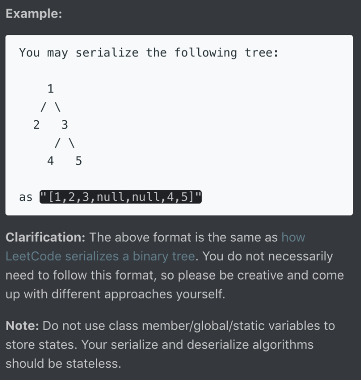
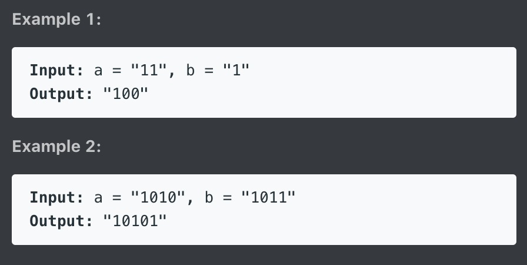
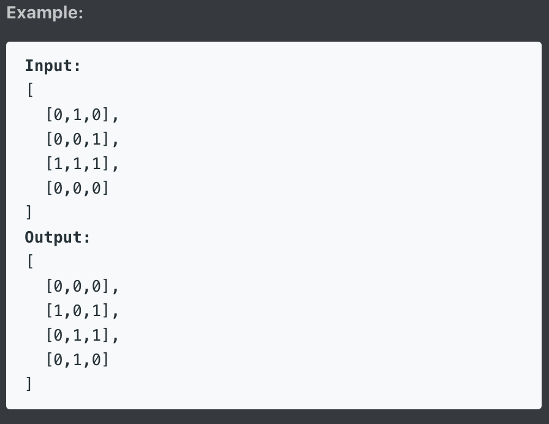
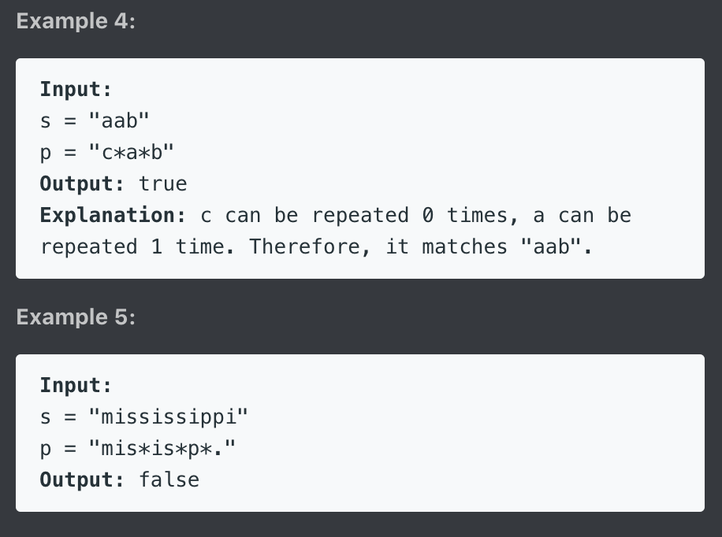
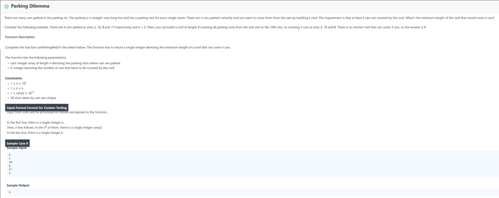
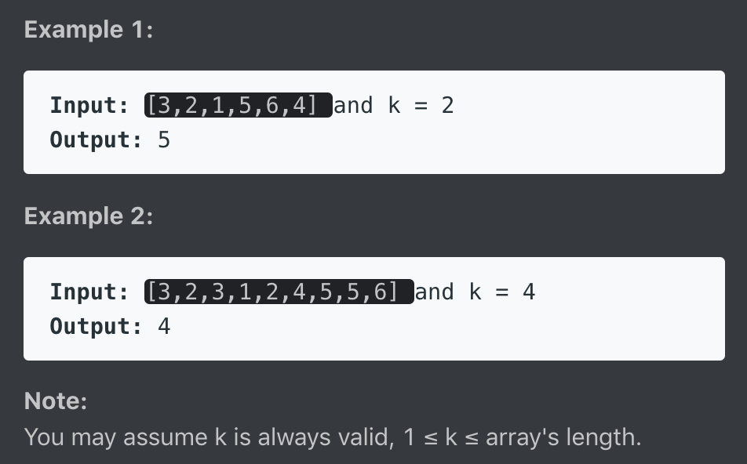
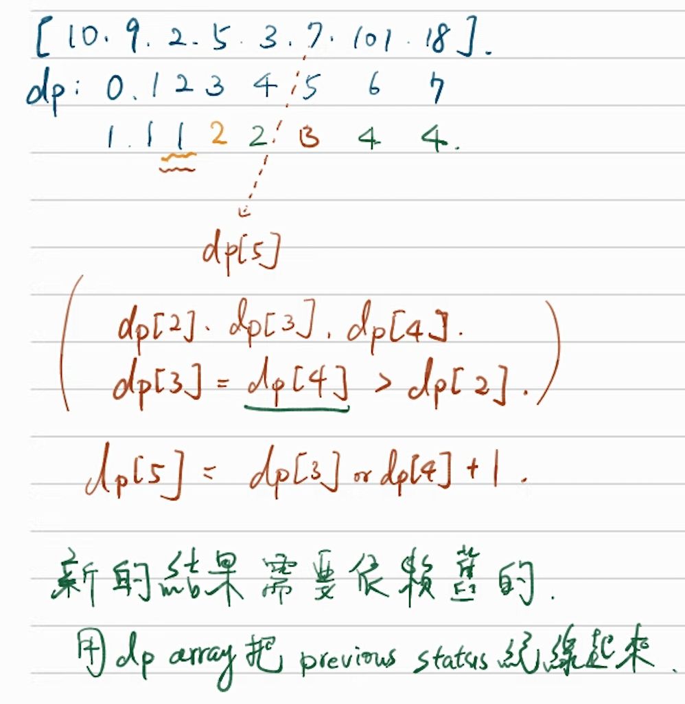
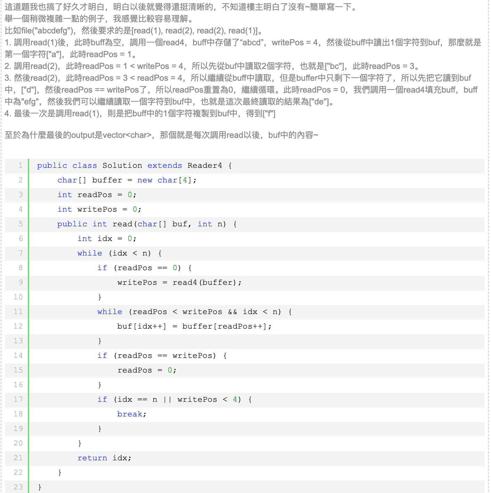
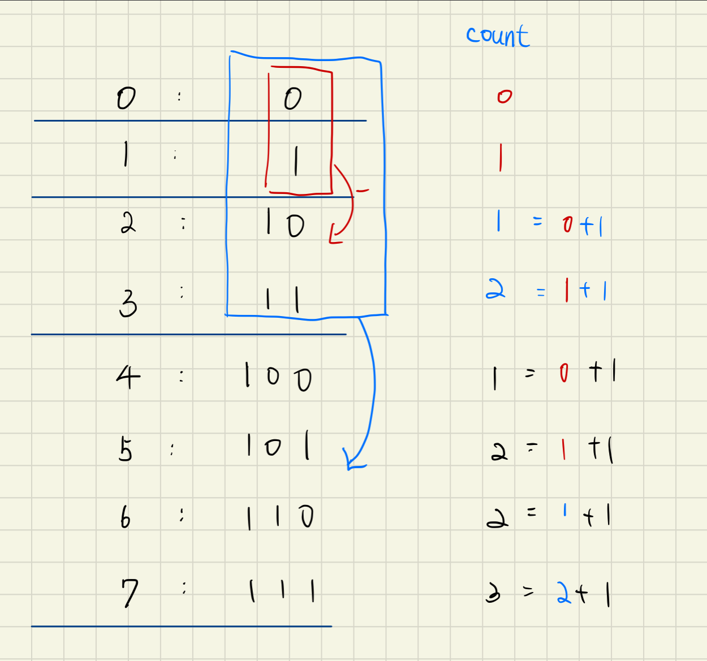
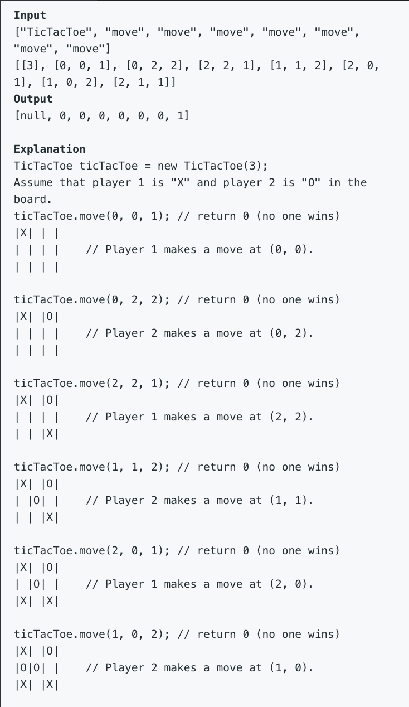

Leetcode note
===
1. [Backtrack problem 演算法整理](https://leetcode.com/problems/subsets/discuss/27281/A-general-approach-to-backtracking-questions-in-Java-(Subsets-Permutations-Combination-Sum-Palindrome-Partitioning))
2. 動態規劃(DP)講解：https://leetcode-cn.com/problems/best-time-to-buy-and-sell-stock-iii/solution/yi-ge-tong-yong-fang-fa-tuan-mie-6-dao-gu-piao-wen/
4. 未解題目：
- 943, 996, 37, 212(used tree), 126(disgust), 675, 131(DP), 93(DP), 282(Hard), 968, 979, 99(Morris Traversal螺紋二叉樹),
- Binary Search: { 981(BS), 378(Binary Search Solution), 668(same as 378), 778, 174, 875, 719, 786, 4 }
- $$$$$$$$$$$$$: { Array:(244, 245, )}

---
## Trick
1. two dimension array to one dimension: MxN -> A[i/N][i%N] = number i elem in array
2. unordered_map 是 HashMap，插入和查詢的時間複雜度都是O(1)，但是裡面的映射對兒是無序的。
3. map 是 TreeMap，插入和查詢的時間複雜度都是O(lgn)，但裡面的映射對兒可以按照key值排序，還可以自定義排序方法。 同理set, unordered_set
4. 無條件進位 k = (k+1)/2 例題23
5. if (k++ > 0) -> 先判斷k是否大於零, 再++; if (++k > 0) -> 先++再判斷是否大於零

## 複習
1. priority_queue 的宣告, 如何客製化比較法？
2. string to int, int to string?
3. how to use substr?
4. how to initialize 2-D vector
---

## 17. Letter Combinations of a Phone Number
Given a string containing digits from 2-9 inclusive, return all possible letter combinations that the number could represent.

A mapping of digit to letters (just like on the telephone buttons) is given below. Note that 1 does not map to any letters.


Example:

Input: "23"
Output: ["ad", "ae", "af", "bd", "be", "bf", "cd", "ce", "cf"].

### 思路
input不知道會有多少數值，因此不能使用迴圈解 -> 遞迴解
字串走訪使用『範圍for』，char in string 搭配遞迴來窮舉所有可能解(dfs)

### Code
``` c++
vector<string> letterCombinations(string digits) {
        if (digits.empty()) return {};

        unordered_map<char, string> num_to_char {{'2', "abc"}, {'3', "def"}, {'4', "ghi"}, {'5', "jkl"}, {'6', "mno"}, {'7', "pqrs"}, {'8', "tuv"}, {'9', "wxyz"}};
        vector<string> result;
        string combination(digits.length(), ' ');
        letterCombinations(digits, combination, 0, num_to_char, result);
        return result;
    }

    void letterCombinations(string digits, string& combination, int idx,  unordered_map<char, string>& num_to_char, vector<string>& result)
    {
        if (idx == digits.length()){
            result.push_back(combination);
            return;
        }

        for (char c : num_to_char[digits[idx]]){
            combination[idx] = c;
            letterCombinations(digits, combination, idx + 1, num_to_char, result);
        }
    }
```

---


## 39. Combination Sum
Given a set of candidate numbers (candidates) (without duplicates) and a target number (target), find all unique combinations in candidates where the candidate numbers sums to target.

The same repeated number may be chosen from candidates unlimited number of times.

Note:

All numbers (including target) will be positive integers.
The solution set must not contain duplicate combinations.
Example 1:

Input: candidates = [2,3,6,7], target = 7,
A solution set is:
[
  [7],
  [2,2,3]
]
Example 2:

Input: candidates = [2,3,5], target = 8,
A solution set is:
[
  [2,2,2,2],
  [2,3,3],
  [3,5]
]
### 思路
排列問題走dfs，『狀態需紀錄』(只能向後看)

組合問題需考慮重複數字不同順序(也須向前看)

因為數字可重複，在擴張時要將自己也考慮進可能值中

在dfs迴圈當中，可用預處理直接結束該輪(不用push再pop)

與#17不同點，#17是直接取代該值(push&pop一起做)，而此題有push因此在走到底後要pop

### Code
``` c++
class Solution {
public:
    vector<vector<int>> combinationSum(vector<int>& candidates, int target) {
        vector<vector<int>> answer;
        vector<int> comb;
        sort(candidates.begin(), candidates.end());
        dfs(candidates, target, answer, comb, 0);

        return answer;
    }
private:
    void dfs(vector<int>& candidates, int target, vector<vector<int>>& answer, vector<int>& comb, int status){
        if (target == 0){
            answer.push_back(comb);
            return;
        }
        for (int i = status; i < candidates.size(); ++i){
            if (target < candidates[i]) break; //在push前進行預篩選
            comb.push_back(candidates[i]);
            /*for (vector<int>::const_iterator it = comb.begin(); it != comb.end(); ++it){
                cout << *it << ' ';
            }
            cout << endl;*/
            dfs(candidates, target - candidates[i], answer, comb, i); //用i來控制『只向自己跟後面看』
            comb.pop_back();
        }
    }
};
```

``` py
class Solution:
    def combinationSum(self, candidates: List[int], target: int) -> List[List[int]]:
        def dfs(targ, ans, index):
            if targ < 0:
                return
            if targ == 0:
                res.append(ans)
                return

            for i in range(index, len(candidates)):
                dfs(targ-candidates[i], ans+[candidates[i]], i)

        res = []
        dfs(target, [], 0)

        return res
```

---

## 40. Combination Sum II

Given a collection of candidate numbers (candidates) and a target number (target), find all unique combinations in candidates where the candidate numbers sums to target.

Each number in candidates may only be used once in the combination.

Note:

All numbers (including target) will be positive integers.
The solution set must not contain duplicate combinations.
Example 1:

Input: candidates = [10,1,2,7,6,1,5], target = 8,
A solution set is:
[
  [1, 7],
  [1, 2, 5],
  [2, 6],
  [1, 1, 6]
]
Example 2:

Input: candidates = [2,5,2,1,2], target = 5,
A solution set is:
[
  [1,2,2],
  [5]
]

### 思路

1. 每個數字只能用一次，因此次態status要+1
2. Candidate中有重複的數字，因此向後看時會出現重複的數組情形
經觀察發現，不要讓重複數組情形出現的最好方式就是『此路不通時不走此路』
在pop_back之後就可以確定此路不通or已走過此路
因此用一while判斷式去過濾與當前走過的路，
而為不影響使用重複的節點的可能性，判斷式也應當放在pop_back之後

### Code
``` c++
class Solution {
public:
    vector<vector<int>> combinationSum2(vector<int>& candidates, int target) {
        vector<vector<int>> ans;
        vector<int> comb;
        sort(candidates.begin(), candidates.end());
        dfs(candidates, target, ans, comb, 0);
        return ans;
    }
private:
    void dfs(vector<int>& candidates, int target, vector<vector<int>>& ans, vector<int>& comb, int status){
        if (target == 0){
            ans.push_back(comb);
            return;
        }
        int layer = status;
        for (int i = status; i < candidates.size(); ++i){
            if (target < candidates[i]) break;
            comb.push_back(candidates[i]);
            dfs(candidates, target-candidates[i], ans, comb, i+1);
            comb.pop_back();
            while (i+1<candidates.size() && candidates[i]==candidates[i+1]) i++; //放pop_back之後
        }
    }
};
```

---

## 77. Combination
Given two integers n and k, return all possible combinations of k numbers out of 1 ... n.

Example:

Input: n = 4, k = 2
Output:
[
  [2,4],
  [3,4],
  [2,3],
  [1,2],
  [1,3],
  [1,4],
]

### 技巧

如果要append一個list進另一個list: outer.append(inner[:])

不加的話會是以位址的方式append

那麼後續再對於這個inner的操作pop(), 都會影響原本的outer_list

### 思路

排列組合問題老樣子走dfs
且只能向後看，因此次態的status要+1
因為沒有重複數字，向後看時不必討論是否出現重複解

### Code
```py
class Solution:
    def combine(self, n: int, k: int):
        if n <= 0 or k <= 0:
            return [[]]
        def find_comb(idx, comb):
            if len(comb) == k:
                ret.append(comb[:])
                return

            for i in range(idx, n + 1):
                comb.append(i)
                find_comb(i + 1, comb)
                comb.pop()

        ret = []
        for i in range(1, n + 1):
            find_comb(i+1, [i])

        return ret
```
``` c++
class Solution {
public:
    vector<vector<int>> combine(int n, int k) {
        vector<int> comb;
        vector<vector<int>> ans;
        dfs(comb, ans, n, k, 1);
        return ans;
    }
private:
    void dfs(vector<int>& comb, vector<vector<int>>& ans, int n, int k, int status){
        if (comb.size() == k){
            ans.push_back(comb);
            return;
        }
        for ( int i=status; i <= n; ++i){
            comb.push_back(i);
            dfs(comb, ans, n, k, i+1);
            comb.pop_back();
        }
    }
};
```

---

## 78. Subsets
Given a set of distinct integers, nums, return all possible subsets (the power set).

Note: The solution set must not contain duplicate subsets.

Example:

Input: nums = [1,2,3]
Output:
[
  [3],
  [1],
  [2],
  [1,2,3],
  [1,3],
  [2,3],
  [1,2],
  []
]

### 思路
不必設終止條件，純粹dfs走訪就能解
### Code

```py
"""
ret = [[1,2,3],[1,2],[1,3],[1]]

cand, idx = [1], 1
    cand, idx = [1,2], 2
        cand, idx = [1,2,3], 3
    cand, idx = [1,3], 3


"""

class Solution:
    def subsets(self, nums: List[int]) -> List[List[int]]:
        ret = []
        ret.append([])
        def recur(cand, idx):
            if idx == len(nums):
                return cand
            for i in range(idx, len(nums)):
                ret.append(recur(cand+[nums[i]], i+1))
            return cand

        for i in range(len(nums)):
            ret.append(recur([nums[i]],i+1))
        return ret
```


``` c++
class Solution {
public:
    vector<vector<int>> subsets(vector<int>& nums) {
        vector<vector<int>> ans;
        vector<int> comb;
        //ans.push_back(comb);
        dfs(nums, ans, comb, 0, 1);
        return ans;
    }
private:
    void dfs(vector<int>& nums, vector<vector<int>>& ans, vector<int>& comb, int status, int level){
        //if (comb.size() == level){
            ans.push_back(comb);
            /*for(vector<int>::iterator it=comb.begin(); it!=comb.end(); ++it){
                cout << *it << " ";
            }
            cout << endl;*/
       //     return;
        //}
        //for( int j = level; j <= nums.size(); ++j){
             for (int i = status; i < nums.size(); ++i){
                 comb.push_back(nums[i]);
                 dfs(nums, ans, comb, i+1, 0);
                 comb.pop_back();
            }
       // }

    }
};
```
---

## 90. Subsets II
Given a collection of integers that might contain duplicates, nums, return all possible subsets (the power set).

Note: The solution set must not contain duplicate subsets.

Example:

Input: [1,2,2]
Output:
[
  [2],
  [1],
  [1,2,2],
  [2,2],
  [1,2],
  []
]
### 思路
求子集合還是單存dfs走訪且不用設限制，
處理重複元素的處理，在pop_back後檢查下個元素重複的可能性
### Code

```py
class Solution:
    def subsetsWithDup(self, nums: List[int]) -> List[List[int]]:
        ret = []
        self.dfs(sorted(nums), ret, [], 0)
        return ret

    def dfs(self,nums, ret, cand, idx):
        ret.append(cand)
        for i in range(idx,len(nums)):
            if i > idx and nums[i] == nums[i-1]:
                continue
            self.dfs(nums,ret, cand+[nums[i]], i+1)
```

``` c++
class Solution {
public:
    vector<vector<int>> subsetsWithDup(vector<int>& nums) {
        vector<vector<int>> ans;
        vector<int> comb;
        sort(nums.begin(), nums.end());
        dfs(nums, ans, comb, 0);
        return ans;
    }
private:
    void dfs(vector<int>& nums, vector<vector<int>>& ans, vector<int>& comb, int status){
        ans.push_back(comb);
        for (int i=status; i < nums.size(); i++){
            comb.push_back(nums[i]);
            dfs(nums, ans, comb, i+1);
            comb.pop_back();
            while(i+1 < nums.size() && nums[i] == nums[i+1])    i++;
        }
    }
};
```

---


## 216. Combination Sum III
Find all possible combinations of k numbers that add up to a number n, given that only numbers from 1 to 9 can be used and each combination should be a unique set of numbers.

Note:

All numbers will be positive integers.
The solution set must not contain duplicate combinations.
Example 1:

Input: k = 3, n = 7
Output: [[1,2,4]]
Example 2:

Input: k = 3, n = 9
Output: [[1,2,6], [1,3,5], [2,3,4]]
### 思路


### Code
``` c++
class Solution {
public:
    vector<vector<int>> combinationSum3(int k, int n) {
        vector<vector<int>> ans;
        vector<int> comb;
        dfs(ans, comb, k, n, 1);
        return ans;
    }
private:
    void dfs(vector<vector<int>>& ans, vector<int>& comb, int k, int n, int status){
        if (comb.size() == k && n == 0){
            ans.push_back(comb);
            return;
        }
        for (int i=status; i<10; i++){
            //cout << "n: "<< n << endl;
            if (n - i < 0)   break;
            comb.push_back(i);
            /*for(vector<int>::iterator it=comb.begin(); it!=comb.end(); it++){
                cout<< *it << " ";
            }
            cout << endl;*/
            dfs(ans, comb, k, n-i, i+1);
            comb.pop_back();
        }
    }
};
```

---


## 46. Permutations
Given a collection of distinct integers, return all possible permutations.

Example:

Input: [1,2,3]
Output:
[
  [1,2,3],
  [1,3,2],
  [2,1,3],
  [2,3,1],
  [3,1,2],
  [3,2,1]
]
### 思路

permutation用dfs方式去解，
在set裡搜尋時要從頭開始找起，
因此需要maintain一個table記錄著元素用過與否
### Code
``` c++
class Solution {
public:
    vector<vector<int>> permute(vector<int>& nums) {
        vector<vector<int>> ans;
        vector<int> comb;
        vector<bool> utable;
        for(int i=0; i<nums.size(); i++){
            utable.push_back(false);
        }
        dfs(nums, ans, comb, utable);
        return ans;
    }
private:
    void dfs(vector<int>& nums, vector<vector<int>>& ans, vector<int>& comb, vector<bool>& utable){
        if(comb.size() == nums.size()){
            ans.push_back(comb);
            return;
        }
        for(int i = 0; i<nums.size(); i++){
            if(utable[i]) continue;
            comb.push_back(nums[i]);
            utable[i] = true;
            /*for(vector<int>::iterator it=comb.begin(); it!=comb.end(); it++){
                cout<< *it << " ";
            }
            cout << endl;*/
            dfs(nums, ans, comb, utable);
            utable[i] = false;
            comb.pop_back();
        }
    }
};
```

---

## 784. Letter Case Permutation
Given a string S, we can transform every letter individually to be lowercase or uppercase to create another string.  Return a list of all possible strings we could create.

Examples:
Input: S = "a1b2"
Output: ["a1b2", "a1B2", "A1b2", "A1B2"]

Input: S = "3z4"
Output: ["3z4", "3Z4"]

Input: S = "12345"
Output: ["12345"]
Note:

S will be a string with length between 1 and 12.
S will consist only of letters or digits.
### 思路

用dfs走訪，
注意要將改過的字串修正回來，
不然這棵樹將只會走一邊(另一端子樹沒有建立)
### Code
``` c++
class Solution {
public:
    vector<string> letterCasePermutation(string S) {
        vector<string> ans;
        dfs(ans, S, 0);
        return ans;
    }
private:
    void dfs(vector<string>& ans, string S, int status){
        ans.push_back(S);
        for (int i=status; i < S.length(); i++){
            if (isalpha(S[i])){
                if (isupper(S[i]))  S[i] = tolower(S[i]);
                else S[i] = toupper(S[i]);
                dfs(ans, S, i+1);

                // 要考慮到另一邊的子樹
                if (isupper(S[i]))  S[i] = tolower(S[i]);
                else S[i] = toupper(S[i]);
            }
        }
    }
};
```

---

## 22. Generate Parentheses
Given n pairs of parentheses, write a function to generate all combinations of well-formed parentheses.

For example, given n = 3, a solution set is:

[
  "((()))",
  "(()())",
  "(())()",
  "()(())",
  "()()()"
]
### 思路
Backtrack 的精髓就是現在這個解在backtrack之後可以發展出其他可能的解
Recursion 考慮的三要素：Coice, Constrain, Goal
Choice: place ( 或 )
Constrain: 左刮不能超過n個, 在組合中左刮一定要大於等於右刮
Goal: 左右刮都用盡

Note:
1. 在遞迴中狀態都必須是“可回溯的"
 e.g. 不會有 dfs(str += "(" )，因為當+=的時候，已經破壞這個狀態了
2. 只有在有一個集合set必須去走訪時，才需要用到for(純粹的遞迴式不一定要存在for的)

### Code
``` c++
class Solution {
public:
    vector<string> generateParenthesis(int n) {
        vector<string> ans;
        //string comb = "";
        //int left, right = n;
        dfs(ans, "", n, n);
        return ans;
    }
private:
    void dfs(vector<string>& ans, string comb, int left,int right){
        /*
            We can add this answer and then backtrack so the previous call can exhaust
            more possibilities and express more answers...and then return to its caller,
            etc. etc.
            Yeah...this is what backtracking is all about.
        */
        if (left == 0 && right == 0){
            ans.push_back(comb);
            return;
        }
        if (left > 0)   dfs(ans, comb + "(", left-1, right); // 只要左有剩就可以放左
        if (right > left)   dfs(ans, comb + ")", left, right-1); // 一定要有一個open left才能配個右
    }
};
```

---

## 301. Remove Invalid Parentheses
Remove the minimum number of invalid parentheses in order to make the input string valid. Return all possible results.

Note: The input string may contain letters other than the parentheses ( and ).

Example 1:

Input: "()())()"
Output: ["()()()", "(())()"]
Example 2:

Input: "(a)())()"
Output: ["(a)()()", "(a())()"]
Example 3:

Input: ")("
Output: [""]
### 思路

### Code
``` c++
class Solution {
public:
    vector<string> removeInvalidParentheses(string s) {
        int left, right = 0;
        vector<string> ans;
        getRemoveCount(s, left, right);
        dfs(ans, left, right, s, 0);
        if(ans.size() == 0) ans.push_back("");
        return ans;
    }

private:
    void getRemoveCount(string s, int& left, int& right){
        // 計算總共要刪除多少個左右括號 前綴右括號&後綴左括號
        for (char ch: s){
            if (ch == '('){
                left ++;
            }
            if (ch == ')'){
                if (left == 0){ // 沒有左括號可以匹配
                    right ++;
                }
                else{
                    left --;
                }
            }
        }
        cout << left << " " << right << endl;
    }
    bool isValid(string comb){
        int left, right = 0;
        for (char ch: comb){
            if (ch == '('){
                left ++;
            }
            if (ch == ')'){
                if (left == 0){ // 沒有左括號可以匹配
                    right ++;
                }
                else{
                    left --;
                }
            }
        }
        return (left == 0 && right == 0);
    }
    void dfs(vector<string>& ans, int left,int right, string comb, int status){
        if (left == 0 && right == 0){
            cout << comb << endl;
            if (isValid(comb)){
                ans.push_back(comb);
            }
            return;
        }

        for (int i = status; i < comb.length(); ++i){
            if (i > 0 && comb[i] == comb[i-1])    continue;

            if(comb[i] == '(' || comb[i] == ')'){
                string curr = comb;
                curr.erase(i,1);

                if (comb[i] == ')' && right > 0){
                    dfs(ans, left, right-1, curr, i);
                }
                else if (comb[i] == '(' && left > 0){
                    dfs(ans, left-1, right, curr, i);
                }
            }
        }
    }
};

```

---

## 51. N-Queens
The n-queens puzzle is the problem of placing n queens on an n×n chessboard such that no two queens attack each other.


Given an integer n, return all distinct solutions to the n-queens puzzle.

Each solution contains a distinct board configuration of the n-queens' placement, where 'Q' and '.' both indicate a queen and an empty space respectively.

Example:

Input: 4
Output: [
 [".Q..",  // Solution 1
  "...Q",
  "Q...",
  "..Q."],

 ["..Q.",  // Solution 2
  "Q...",
  "...Q",
  ".Q.."]
]
Explanation: There exist two distinct solutions to the 4-queens puzzle as shown above.
### 思路
首先必須選擇以column或以role來當作遞迴的標準

1. Recursion三要素: Choice, Constrain, Goal
    i. Choice: Place Q or .
    ii. Constrain: 不能讓皇后衝突
    iii. Goal: 固定邊走訪完畢

2. Previous State: 如果會更改遞迴內元素的狀態，必須在return後做恢復上一態
    i. 不會更改的例子: [Leetcode 22](https://hackmd.io/qdDOkynCRfm597nZHVg-cQ?both#22-Generate-Parentheses)
4. 矩陣內135度方向元素(x,y)，x+y = x1+y1
5. 矩陣內45度方向元素(x,y)，x-y = x1-y1
### Code
``` c++
class Solution {
public:
    vector<vector<string>> solveNQueens(int n) {
        vector<string> comb(n, string(n, '.'));
        vector<vector<string>> ans;
        backtrack(n, comb, ans, 0);
        return ans;
    }

private:
    void backtrack(int n, vector<string> comb, vector<vector<string>>& ans, int row){
        if (row == n){
            ans.push_back(comb);
            return;
        }
        for (int col=0; col<n; ++col){
            if( check(comb, row, col, n) ){
                comb[row][col] = 'Q';
                backtrack(n, comb, ans, row+1);
                comb[row][col] = '.'; // reset to previous state
            }
        }
    }

    bool check(vector<string> comb, int row, int col, int n){
        // check row
        for (int i=0; i<n; ++i){
            if (i == col)   continue;
            if (comb[row][i] == 'Q')    return false;
        }

        // check col
        for (int i=0; i<n; ++i){
            if (i == row)   continue;
            if (comb[i][col] == 'Q')    return false;
        }

        // check diag
        for (int i=0; i<n; ++i){
            if (i == row) continue;

            // check diag+ 斜率為正的對角 row+col (1,2) -> (0,3), (2,1), (3,0)
            if ( (row+col-i) >= 0 && (row+col-i) < n){
                if ( comb[i][row+col-i] == 'Q' )    return false;
            }

            // check diag- 斜率為負的對角 row-col (1,2) -> (0,1), (2,3)
            // i - x = row - col => x = i-row+col
            if ( (i-row+col) >= 0 && (i-row+col) < n){
                if ( comb[i][i-row+col] == 'Q')     return false;
            }
        }
        return true;
    }

};
```
---

## 79. Word Search(Medium) ｜ 4/1

Given a 2D board and a word, find if the word exists in the grid.

The word can be constructed from letters of sequentially adjacent cell, where "adjacent" cells are those horizontally or vertically neighboring. The same letter cell may not be used more than once.

Example:

board =
[
  ['A','B','C','E'],
  ['S','F','C','S'],
  ['A','D','E','E']
]

Given word = "ABCCED", return true.
Given word = "SEE", return true.
Given word = "ABCB", return false.
### 思路
1. 雖adjacent cell表示相鄰的字，但若整個字串都要adjacent的話，則概念就轉化成 "一筆畫" 連完字串
2. 一筆畫的概念就能夠使用遞迴的解法，這個字在這個位置存在的情況下去看上下左右是否存在下個字，遇到死路就回到上一步繼續找其他方向
3. Main function: 找起點
4. 用過的不能再用：標記為'#'，若是不歸路 要改回原來的字
### Code
``` c++
class Solution {
public:
    bool exist(vector<vector<char>>& board, string word) {
        int m = board.size(), n = board[0].size();
        // Loop-searching for the start of the seq
        for (int i=0; i<m; i++){
            for (int j=0; j<n; j++){
                if ( search( board, word, 0, i, j ) ) return true;
            }
        }
        return false;
    }

private:
    bool search( vector<vector<char>>& board, string word, int idx, int i, int j){
        if (idx == word.size()) return true;
        int m = board.size(), n = board[0].size();
        if ( i<0 || j<0 || i>=m || j>=n || board[i][j] != word[idx])  return false;
        char temp_char = board[i][j];
        board[i][j] = '#';
        bool res = search( board, word, idx+1, i-1, j) ||
                    search( board, word, idx+1, i+1, j)||
                    search( board, word, idx+1, i, j-1)||
                    search( board, word, idx+1, i, j+1);
        board[i][j] = temp_char;    // search fail then backtrack
        return res;
    }

};
```


---

## 127. Word Ladder(Medium) ｜ 4/1

Given two words (beginWord and endWord), and a dictionary's word list, find the length of shortest transformation sequence from beginWord to endWord, such that:

Only one letter can be changed at a time.
Each transformed word must exist in the word list. Note that beginWord is not a transformed word.
Note:

Return 0 if there is no such transformation sequence.
All words have the same length.
All words contain only lowercase alphabetic characters.
You may assume no duplicates in the word list.
You may assume beginWord and endWord are non-empty and are not the same.
Example 1:

Input:
beginWord = "hit",
endWord = "cog",
wordList = ["hot","dot","dog","lot","log","cog"]

Output: 5

Explanation: As one shortest transformation is "hit" -> "hot" -> "dot" -> "dog" -> "cog",
return its length 5.
Example 2:

Input:
beginWord = "hit"
endWord = "cog"
wordList = ["hot","dot","dog","lot","log"]

Output: 0

Explanation: The endWord "cog" is not in wordList, therefore no possible transformation.
### 思路


### Code
``` c++
class Solution {
public:
    int ladderLength(string beginWord, string endWord, vector<string>& wordList) {
        unordered_set<string> wordset(wordList.begin(), wordList.end());
        if (!wordset.count(endWord))    return 0;
        unordered_map<string, int> pathCnt;
        pathCnt[beginWord] = 1;

        queue<string> word_need2Cnt;
        word_need2Cnt.push(beginWord);

        while(!word_need2Cnt.empty()){
            string word = word_need2Cnt.front(); word_need2Cnt.pop();
            for (int i=0; i<word.length(); i++){
                for (char c='a'; c <= 'z'; c++){
                    string new_word = word;
                    new_word[i] = c;

                    if ( wordset.count(new_word) && new_word == endWord)    return  pathCnt[word]+1;
                    if ( wordset.count(new_word) && !pathCnt.count(new_word)){
                        pathCnt[new_word] = pathCnt[word] +1;
                        word_need2Cnt.push(new_word);
                    }
                }
            }

        }
        return 0;
    }
};
```

因為使用BFS，可以不需要用hashmap來存path count
BFS如同漣漪般向外擴散，同一層的所有可能字的path count皆為相同
因此只需要採用迴圈去計數即可
但須注意用過的元素必須從字典裡刪除，避免出現無限迴圈的情形

``` c++
class Solution {
public:
    int ladderLength(string beginWord, string endWord, vector<string>& wordList) {
        unordered_set<string> wordSet(wordList.begin(), wordList.end());
        if (!wordSet.count(endWord)) return 0;
        queue<string> q{{beginWord}};
        int res = 0;
        while (!q.empty()) {
            for (int k = q.size(); k > 0; --k) {
                string word = q.front(); q.pop();
                if (word == endWord) return res + 1;
                for (int i = 0; i < word.size(); ++i) {
                    string newWord = word;
                    for (char ch = 'a'; ch <= 'z'; ++ch) {
                        newWord[i] = ch;
                        if (wordSet.count(newWord) && newWord != word) {
                            q.push(newWord);
                            wordSet.erase(newWord); // 用過的元素必須要清掉，否則會陷入無限迴圈
                        }
                    }
                }
            }
            ++res;
        }
        return 0;
    }
};
```
使用雙向BFS 尋找中間點
要進行BFS前先進行判斷哪條可以進行比較少的判斷

``` c++
class Solution {
public:
    int ladderLength(string beginWord, string endWord, vector<string>& wordList) {
        unordered_set<string> wordset(wordList.begin(), wordList.end());
        unordered_set<string> headset, tailset, *phead, *ptail;
        if (wordset.find(endWord) == wordset.end())    return 0;
        headset.insert(beginWord);
        tailset.insert(endWord);
        int ladder = 2;

        while (!headset.empty() && !tailset.empty()){ // NOTE: is "&&" rather than "||"
            // Use the less size set to first bfs
            if (headset.size() < tailset.size()){
                phead = &headset;
                ptail = &tailset;
            }
            else{
                phead = &tailset;
                ptail = &headset;
            }
            unordered_set<string> newWord2insert2wordset;
            for (auto it = phead -> begin(); it != phead -> end(); it++){
                string word = *it;
                for (int i=0; i<word.size(); i++){
                    char tempchar = word[i];
                    for (int j=0; j<26; j++){
                        word[i] = 'a' + j;
                        if ( ptail -> find(word) != ptail -> end()){
                            return ladder;
                        }
                        if ( wordset.find(word) != wordset.end()){
                            newWord2insert2wordset.insert(word);
                            wordset.erase(word); // ERASE!
                        }
                    }
                    word[i] = tempchar;
                }
            }
            ladder++;
            phead -> swap(newWord2insert2wordset);
        }
        return 0;
    }
};
```
---

## 752. Open the Lock(Medium)｜ 4/7
You have a lock in front of you with 4 circular wheels. Each wheel has 10 slots: '0', '1', '2', '3', '4', '5', '6', '7', '8', '9'. The wheels can rotate freely and wrap around: for example we can turn '9' to be '0', or '0' to be '9'. Each move consists of turning one wheel one slot.

The lock initially starts at '0000', a string representing the state of the 4 wheels.

You are given a list of deadends dead ends, meaning if the lock displays any of these codes, the wheels of the lock will stop turning and you will be unable to open it.

Given a target representing the value of the wheels that will unlock the lock, return the minimum total number of turns required to open the lock, or -1 if it is impossible.

Example 1:
Input: deadends = ["0201","0101","0102","1212","2002"], target = "0202"
Output: 6
Explanation:
A sequence of valid moves would be "0000" -> "1000" -> "1100" -> "1200" -> "1201" -> "1202" -> "0202".
Note that a sequence like "0000" -> "0001" -> "0002" -> "0102" -> "0202" would be invalid,
because the wheels of the lock become stuck after the display becomes the dead end "0102".
Example 2:
Input: deadends = ["8888"], target = "0009"
Output: 1
Explanation:
We can turn the last wheel in reverse to move from "0000" -> "0009".
Example 3:
Input: deadends = ["8887","8889","8878","8898","8788","8988","7888","9888"], target = "8888"
Output: -1
Explanation:
We can't reach the target without getting stuck.
Example 4:
Input: deadends = ["0000"], target = "8888"
Output: -1
Note:
The length of deadends will be in the range [1, 500].
target will not be in the list deadends.
Every string in deadends and the string target will be a string of 4 digits from the 10,000 possibilities '0000' to '9999'.
### 思路

0. 與#127概念類似
1. 雙向BFS解
2. Number to string
    code[i] = ((temp[i] - '0') + 10 + j) % 10 + '0';
### Code
``` c++
class Solution {
public:
    int openLock(vector<string>& deadends, string target) {
        if (deadset.find("0000") != deadset.end())  return -1;
        unordered_set<string> headset, tailset, visited, *phead, *ptail;
        unordered_set<string> deadset(deadends.begin(), deadends.end());
        int res=0;
        headset.insert("0000");
        visited.insert("0000");
        tailset.insert(target);


        while ( !headset.empty() && !tailset.empty()){
            unordered_set<string> branch;
            if (headset.size() < tailset.size()){
                phead = &headset;
                ptail = &tailset;
            }
            else{
                phead = &tailset;
                ptail = &headset;
            }

            for (auto it = phead -> begin(); it != phead -> end(); it++){
                string code = *it;
                for (int i=0; i<4; i++){
                    string temp = code;
                    for (int j=-1; j<=1; j++){
                        if (j == 0)    continue; // ignore the visited one
                        code[i] = ((temp[i] - '0') + 10 + j) % 10 + '0';

                        if (ptail -> find(code) != ptail -> end() )   return res+1;
                        if (deadset.find(code) == deadset.end() && visited.find(code) == visited.end()){
                            branch.insert(code);
                            visited.insert(code);
                        }

                    } // end of +/- 1
                    code = temp;
                } // end of modify each char
            } // end of headset
            res++;
            phead -> swap(branch);
        }
        return -1;
    }
};
```

---

## 542. 01 Matrix (Medium)｜ 4/7
Given a matrix consists of 0 and 1, find the distance of the nearest 0 for each cell.

The distance between two adjacent cells is 1.
Example 1:
Input:

0 0 0
0 1 0
0 0 0
Output:
0 0 0
0 1 0
0 0 0
Example 2:
Input:

0 0 0
0 1 0
1 1 1
Output:
0 0 0
0 1 0
1 2 1
Note:
The number of elements of the given matrix will not exceed 10,000.
There are at least one 0 in the given matrix.
The cells are adjacent in only four directions: up, down, left and right.
### 思路
1. 比較直覺的方式：使用BFS去尋找最短路徑
2. 透過已知去拜訪未知, 從0的觀點去看1
    - 用queue將已知的距離記錄起來
        - 先將0記錄起來, 距離為0
        - 將拜訪過的距離放入queue中, 以供後續使用
    - 並且記錄為拜訪過
### Code
bfs
```py
class Solution:
    def updateMatrix(self, matrix: List[List[int]]) -> List[List[int]]:
        r_b, c_b = len(matrix), len(matrix[0])
        queue, visited = [], set()
        for i in range(r_b):
            for j in range(c_b):
                if matrix[i][j] == 0:
                    queue.append((i,j))
                    visited.add((i,j))

        for row, col in queue:
            distance = matrix[row][col] + 1

            for dx, dy in [(1,0), (-1,0), (0,1), (0,-1)]:
                n_x, n_y = row + dx, col + dy # take a look at its neighborhood

                # not in visited means is 1 and not visit before
                if 0 <= n_x < r_b and 0 <= n_y < c_b and (n_x, n_y) not in visited:
                    matrix[n_x][n_y] = distance
                    queue.append((n_x, n_y)) # keep the record of already calculated distance
                    visited.add((n_x, n_y))
        return matrix

```


dfs TLE
```py
class Solution:
    def updateMatrix(self, matrix: List[List[int]]) -> List[List[int]]:
        direction = [(0,1), (1,0), (0,-1), (-1,0)]
        def distance(i, j, count, min_dis):
            if matrix[i][j] == 0:
                return count

            for k in range(len(direction)):
                x, y = i+direction[k][0], j+direction[k][1]
                if 0 <= x < r and 0 <= y < c:
                    if count + 1 < min_dis:
                        min_dis = min(min_dis, distance(x, y, count+1, min_dis))

            return min_dis


        r, c = len(matrix), len(matrix[0])
        for i in range(r):
            for j in range(c):
                if matrix[i][j] == 1:
                    matrix[i][j] = distance(i,j, 0, 201)

        return matrix
```

用BFS找最短路徑
``` c++
class Solution {
public:
    vector<vector<int>> updateMatrix(vector<vector<int>>& matrix) {
        int m = matrix.size(), n = matrix[0].size();
        int dirs[5] = {0, -1, 0, 1, 0}; // simple way to record of direction matrix (0,-1) for left ; (-1,0) for down; (0,1) for right ; (1,0) for up
        queue<pair<int, int>> points2calc;

        for (int i=0; i<m; i++){
            for (int j=0; j<n; j++){
                if (matrix[i][j] == 0){
                    points2calc.push({i,j});    // BFS from 0
                }
                else if (matrix[i][j] == 1){
                    matrix[i][j] = 201; // num of elements given matrix not exceed 10000, thus the maximum of the possible distance which is diagonal points would not exceed 200 (100+100)
                }
            }
        }


        while (!points2calc.empty()){
            auto t = points2calc.front(); points2calc.pop();
            for (int i=0; i<4; i++){
                int x = t.first + dirs[i];
                int y = t.second + dirs[i+1];

            //  (x,y) > (t.f,t.s)+1 means there is a shortter path value (t.f,t.s)+1 ,thus applied to it. Then push into queue to update neiborhood value.
                if (x>=0 && y>=0 && x<m && y<n &&
                    matrix[x][y] > matrix[t.first][t.second] + 1){
                    matrix[x][y] = matrix[t.first][t.second] + 1;
                    points2calc.push({x,y});
                }
            }
        }

        return matrix;
    }
};
```

使用兩階段比較法(牛B):
```class Solution {
public:
    vector<vector<int>> updateMatrix(vector<vector<int>>& matrix) {
        int m = matrix.size(), n = matrix[0].size();
        vector<vector<int>> res(m, vector<int>(n, INT_MAX - 1));
        // 比較左&上 從左上走到右下
        for (int i = 0; i < m; ++i) {
            for (int j = 0; j < n; ++j) {
                if (matrix[i][j] == 0) res[i][j] = 0;
                else {
                    if (i > 0) res[i][j] = min(res[i][j], res[i - 1][j] + 1);
                    if (j > 0) res[i][j] = min(res[i][j], res[i][j - 1] + 1);
                }
            }
        }
        // 比較右&下 從右下走到左上
        // 到第二階段，若值已經為0或1則不可能找到更短的距離因此不用更新
        for (int i = m - 1; i >= 0; --i) {
            for (int j = n - 1; j >= 0; --j) {
                if (res[i][j] != 0 && res[i][j] != 1) {
                    if (i < m - 1) res[i][j] = min(res[i][j], res[i + 1][j] + 1);
                    if (j < n - 1) res[i][j] = min(res[i][j], res[i][j + 1] + 1);
                }
            }
        }
        return res;
    }
};
```

---

## 934. Shortest Bridge(Medium)｜ 4/7
In a given 2D binary array A, there are two islands.  (An island is a 4-directionally connected group of 1s not connected to any other 1s.)

Now, we may change 0s to 1s so as to connect the two islands together to form 1 island.

Return the smallest number of 0s that must be flipped.  (It is guaranteed that the answer is at least 1.)


Example 1:

Input: [[0,1],[1,0]]
Output: 1
Example 2:

Input: [[0,1,0],[0,0,0],[0,0,1]]
Output: 2
Example 3:

Input: [[1,1,1,1,1],[1,0,0,0,1],[1,0,1,0,1],[1,0,0,0,1],[1,1,1,1,1]]
Output: 1


Note:

1 <= A.length = A[0].length <= 100
A[i][j] == 0 or A[i][j] == 1
### 思路


### Code
``` c++
class Solution {
public:
    int shortestBridge(vector<vector<int>>& A) {
        // identify the other island
        for (int i=0, found=0; !found && i<A.size(); i++){
            for (int j=0; !found && j<A[0].size(); j++){
                found = paint(A, i, j);
            }
        }

        for (int cl=2; ;cl++){
            for (int i=0, found=0; !found && i<A.size(); i++){
                for (int j=0; !found && j<A[0].size(); j++){
                    if (cl == A[i][j] && (expand(A, i-1, j, cl) || expand(A, i, j-1, cl)
                                    || expand(A, i+1, j, cl) || expand(A, i, j+1, cl)) )
                    {
                        return cl-2;
                    }
                }
            }
        }
    }

private:
    int paint(vector<vector<int>>& A, int i, int j){
        if (i<0 || j<0 || i>= A.size() || j>= A[0].size() || A[i][j] != 1)   return 0;
        A[i][j] = 2;
        return 1 + paint(A, i-1, j) + paint(A, i, j-1) + paint(A, i+1, j) + paint(A, i, j+1);
    }

    bool expand(vector<vector<int>>& A, int i, int j, int cl){
        if (i<0 || j<0 || i>= A.size() || j>= A[0].size())
            return false;
        if (A[i][j] == 0)
            A[i][j] = cl+1;
        return A[i][j] == 1;
    }
};
```
---
## 698. Partition to K Equal Sum Subsets(Medium)｜ 4/8
Given an array of integers nums and a positive integer k, find whether it's possible to divide this array into k non-empty subsets whose sums are all equal.


Example 1:

Input: nums = [4, 3, 2, 3, 5, 2, 1], k = 4
Output: True
Explanation: It's possible to divide it into 4 subsets (5), (1, 4), (2,3), (2,3) with equal sums.


Note:

1 <= k <= len(nums) <= 16.
0 < nums[i] < 10000.
### 思路
首先判斷sum是否能整除k，不能整除的話直接返回false。然後需要一個visited數組來記錄哪些數組已經被選中了，然後調用遞歸函數，我們的目標是組k個子集合，是的每個子集合之和為target = sum/k。我們還需要變量start，表示從數組的某個位置開始查找，curSum為當前子集合之和，在遞歸函數中，如果k=1，說明此時只需要組一個子集合，那麼當前的就是了，直接返回true。如果curSum等於target了，那麼我們再次調用遞歸，此時傳入k-1，start和curSum都重置為0，因為我們當前又找到了一個和為target的子集合，要開始繼續找下一個。否則的話就從start開始遍曆數組，如果當前數字已經訪問過了則直接跳過，否則標記為已訪問。然後調用遞歸函數，k保持不變，因為還在累加當前的子集合，start傳入i+1，curSum傳入curSum+nums[i]，因為要累加當前的數字，如果遞歸函數返回true了，則直接返回true。否則就將當前數字重置為未訪問的狀態繼續遍歷
一些優化：比如先給數組按從大到小的順序排個序，然後在遞歸函數中，我們可以直接判斷，如果curSum大於target了，直接返回false，因為題目中限定了都是正數，並且我們也給數組排序了，後面的數字只能更大
### Code
``` c++
class Solution {
public:
    bool canPartitionKSubsets(vector<int>& nums, int k) {
        int sum = accumulate(nums.begin(), nums.end(), 0);
        if (sum % k != 0)   return false;
        sort(nums.begin(), nums.end(), greater<int>());
        vector<bool> visited(nums.size(), false);
        return dfs(nums, visited, sum/k, 0, 0, k);
    }
    bool dfs(vector<int>& nums, vector<bool>& visited, int target, int curSum, int idx, int goal){
        if (goal == 1)          return true;
        if (curSum > target)    return false;
        if (curSum == target)   return dfs(nums, visited, target, 0, 0, goal-1);
        for (int i=idx; i<nums.size(); ++i){
            if (visited[i])     continue;
            visited[i] = true;
            if (dfs(nums, visited, target, curSum + nums[i], i+1, goal) )
                return true;
            visited[i] = false;
        }
        return false;
    }
};
```

---
## 93. Restore IP Addresses｜ 4/9
Given a string containing only digits, restore it by returning all possible valid IP address combinations.

Example:

Input: "25525511135"
Output: ["255.255.11.135", "255.255.111.35"]
### 思路
**1. 只要遇到字符串的子序列或配准問題首先考慮動態規劃DP**
**2. 只要遇到需要求出所有可能情況首先考慮用遞歸。**

這道題並非是求字符串的子序列或配准問題，更符闔第二種情況，所以我們要用遞歸來解。我們用k來表示當前還需要分的段數，如果k = 0，則表示三個點已經加入完成，四段已經形成，若這時字符串剛好為空，則將當前分好的結果保存。若k != 0, 則對於每一段，我們分別用一位，兩位，三位來嘗試，分別判斷其合不合法，如果合法，則調用遞歸繼續分剩下的字符串，最終和求出所有合法組合
### Code
``` c++

class Solution {
public:
    vector<string> restoreIpAddresses(string s) {
        vector<string> res;
        dfs(s, 0, "", res);
        return res;
    }
private:
    void dfs(string s, int cnt, string comb, vector<string>& res){
        if (cnt == 4){
            if (s.empty())  res.push_back(comb);
        }
      /*if (cnt == 4 && s.empty()){
          res.push_back(comb);
        }*/
        if (s.size() > (4-cnt)*3)   return;
        if (s.size() < (4-cnt))     return;
        // possibility of digit from 1~3
        for (int i=1; i<4; i++){
            if (s.size() < i)   break;
            int val = atoi(s.substr(0, i).c_str());
            if (val > 255 || i != to_string(val).size()) // val>255 or val = 01, 001, 011
                continue;
            dfs(s.substr(i), cnt+1, comb + s.substr(0, i) + (cnt==3 ? "":"."), res);
        }
    }
};
```
---
## 241. Different Ways to Add Parentheses(Medium)｜ 4/10
Given a string of numbers and operators, return all possible results from computing all the different possible ways to group numbers and operators. The valid operators are +, - and *.

Example 1:

Input: "2-1-1"
Output: [0, 2]
Explanation:
((2-1)-1) = 0
(2-(1-1)) = 2
Example 2:

Input: "2*3-4*5"
Output: [-34, -14, -10, -10, 10]
Explanation:
(2*(3-(4*5))) = -34
((2*3)-(4*5)) = -14
((2*(3-4))*5) = -10
(2*((3-4)*5)) = -10
(((2*3)-4)*5) = 10
**

### 思路


### Code
``` c
class Solution {
public:
    vector<int> diffWaysToCompute(string input) {
        unordered_map<string, vector<int>> cache;
        return dfs_dp(input, cache);
    }

    vector<int> dfs_dp(string input, unordered_map<string, vector<int>>& cache){
        vector<int> res;
        for (int i=0; i<input.size(); i++){
            char c = input[i];
            if (c == '+' || c == '-' || c == '*'){
                vector<int> left, right;
                string substr;
                substr = input.substr(0,i);
                if (cache.find(substr) != cache.end())
                    left = cache[substr];
                else
                    left = dfs_dp(substr, cache);

                substr = input.substr(i+1);
                if (cache.find(substr) != cache.end())
                    right = cache[substr];
                else
                    right = dfs_dp(substr, cache);

                // implement 笛卡爾積
                for (auto l : left){
                    for (auto r : right){
                        if (c == '+')   res.push_back( l+r );
                        if (c == '-')   res.push_back( l-r );
                        if (c == '*')   res.push_back( l*r );
                    }
                }
            } // end of if op
        }// end of string walk-through

        // the input only consist integer, return int
        if(res.empty())
            res.push_back(atoi(input.c_str()));
        cache[input] = res;
        return res;
    }
};
```

---
## !95. Unique Binary Search Trees II(Medium)｜ 4/22

### 4/28 review(X)
```c++
for(l:left){
    for(r:right){
        ...
    }
}
```
### 思路

如下圖，我們讓1~n的每個數當當看root，並回傳所有可能解
程式碼方面:
直覺的，i是root，而start ~ i-1是左子樹，i+1 ~ end 是右子樹
而左右子樹都可以再分別遞迴下去做切割成左及右子樹
當無法再切割時(start > end)時，就是NULL的狀態


### Code
``` c++
/**
 * Definition for a binary tree node.
 * struct TreeNode {
 *     int val;
 *     TreeNode *left;
 *     TreeNode *right;
 *     TreeNode(int x) : val(x), left(NULL), right(NULL) {}
 * };
 */
class Solution {
public:
    vector<TreeNode*> generateTrees(int n) {
        if (n == 0)  return { };
        return generateTreesDFS(1, n);
    }

    vector<TreeNode*> generateTreesDFS(int start, int end){
        vector<TreeNode*> subtree;
        if (start > end){
            subtree.push_back(NULL);
        }
        else{
            for (int i=start; i<= end; ++i){
                vector<TreeNode*> left = generateTreesDFS( start, i-1 );
                vector<TreeNode*> right = generateTreesDFS( i+1, end );
                for (auto l:left){
                    for (auto r:right){
                        TreeNode* node = new TreeNode(i);   // generate the (sub)root
                        node -> left = l;
                        node -> right = r;
                        subtree.push_back(node);
                    }
                }
            } // end of start-to-end walkthrough
        }
        return subtree;
    }
};
```

---
## !842. Split Array into Fibonacci Sequence(Medium)｜ 4/22
Given a string S of digits, such as S = "123456579", we can split it into a Fibonacci-like sequence [123, 456, 579].

Formally, a Fibonacci-like sequence is a list F of non-negative integers such that:

0 <= F[i] <= 2^31 - 1, (that is, each integer fits a 32-bit signed integer type);
F.length >= 3;
and F[i] + F[i+1] = F[i+2] for all 0 <= i < F.length - 2.
Also, note that when splitting the string into pieces, each piece must not have extra leading zeroes, except if the piece is the number 0 itself.

Return any Fibonacci-like sequence split from S, or return [] if it cannot be done.

Example 1:

Input: "123456579"
Output: [123,456,579]
Example 2:

Input: "11235813"
Output: [1,1,2,3,5,8,13]
Example 3:

Input: "112358130"
Output: []
Explanation: The task is impossible.
Example 4:

Input: "0123"
Output: []
Explanation: Leading zeroes are not allowed, so "01", "2", "3" is not valid.
Example 5:

Input: "1101111"
Output: [110, 1, 111]
Explanation: The output [11, 0, 11, 11] would also be accepted.
Note:

1 <= S.length <= 200
S contains only digits.
### 4/28 review(X)

### 思路
符合題意的數列其實可能不止一種，但是本題就讓返回一個就行了。不管返回幾個，總之不是求極值，DP在這裡就不好使了，只能用遞歸了，由於不知道如何分割，所以肯定需要遍歷所有的情況。我們用一個數組out來記錄已經組成的序列，用結果res來保存結果。當out數組的個數大於等於3，並且已經遍歷完了字符串S，那麼此時就是可以把out數組中的內存賦值給結果res了，那麼之後只要檢測結果res不為空時，直接返回就可以了，這是個很好的剪枝操作，因為此題只需要一個正確答案即可

現在來考慮遞歸函數的主體該怎麼寫，既然不知道要如何分割，那麼就要嘗試所有的情況，一個數字，兩個數字，一直到末尾，那麼就可以遍歷字符串S，然後取子串即可。但從什麼位置開始呢，每次都從頭嗎，這道題都數字不能重複使用，所以應該用個變量start來記錄當前遍歷到的位置，那麼我們從start位置起，每次取 i-start+1 長度的子串 cur，此時在轉為int之前，需要先處理leading zeros的情況，判斷若cur長度大於1，且首字符為0，直接break，還就是若cur的長度大於10，也break，為啥呢？因為整型的最大值是 2147483647，只有10位，所以當cur長度大於10時，一定會溢出。當cur長度為10時，也有可能溢出，這個在之後處理。好，現在將cur轉為長整型 long，因為長度為10也可能溢出，所以要先轉為長整型，然後在判斷若大於整型最大值 INT_MAX，直接break。接下來就要考慮是否要加入out數組了，當out數字的個數不到2個的時候，我們可以直接加入當前數字，若大於等於2個，需要考慮是否滿足斐波納切數列的性質，即當前數字是否等於前兩個數字之和，滿足的話才加入，不然就跳過，注意這裡不能直接break，因為之後的數字也許可能滿足要求。加入out數組之後，就可以調用遞歸了，此時起始位置傳入 i+1，之後再恢復out的狀態即可
### Code
``` c++
class Solution {
public:
    vector<int> splitIntoFibonacci(string S) {
        vector<int> out, res;
        recursion(S, 0, out, res);
        return res;
    }

private:
    void recursion(string S, int start, vector<int>& out, vector<int>& res) {
        // as long as finding one solution, return
        if (!res.empty())    return;
        // out is more than three elements, and we walkthrough whole string, out is the result
        if (out.size() >= 3 && start >= S.length()){
            res = out;  return;
        }
        for (int i=start; i<S.length(); i++){
            // select at least 1 digit, but increasible depends on the increasing i in for-loop
            string s = S.substr(start, i-start+1);
            // leading zero or overflow with (longer)larger than INT_MAX(2147483647)
            if ( (s.length() > 1 && s[0] == '0'))  break;
            long num = stol(s);
            if (num >= INT_MAX) break;
            // if it is not an Feb seq, note: we shouldn't break here, cuz the possib of 下個數字的與當前數字的組合
            if (out.size() >= 2 && num != (long)out[out.size() - 1] + out[out.size() -2])   continue;
            out.push_back(num);
            recursion(S, i+1, out, res);
            out.pop_back();
        }
    }
};
```

---
## !94. Binary Tree Inorder Traversal｜ 4/22
Given a binary tree, return the inorder traversal of its nodes' values.

Example:

Input: [1,null,2,3]
   1
    \
     2
    /
   3

Output: [1,3,2]
Follow up: Recursive solution is trivial, could you do it iteratively?
### 4/28 review

### 思路
Pre-order: Duplicate binary tree
In-order: Binary search tree
Post-order: Delete binary tree
__Binary tree ~> DFS ~> stack__
=> __Travesal order == code order__
公式：
``` c++
while(p||!stack.empty()){
    if(p){
        stack.push(p);
        // traversal order...
        // ...
    }
    else{
        p = stack.top(); stack.pop();
        /// traversal order...
        // ...
    }
}
```

空間複雜度更低的方法：Morris Traversal(不使用stack全部使用pointer)
### Code
```py
class Solution:
    def inorderTraversal(self, root: TreeNode) -> List[int]:
        stack = []
        res = []
        p = root

        while p or stack:
            if p:
                stack.append(p)
                p = p.left
            else:
                top = stack.pop()
                res.append(top.val)
                p = top.right

        return res

```
``` c++
/**
 * Definition for a binary tree node.
 * struct TreeNode {
 *     int val;
 *     TreeNode *left;
 *     TreeNode *right;
 *     TreeNode(int x) : val(x), left(NULL), right(NULL) {}
 * };
 */
class Solution {
public:
    vector<int> inorderTraversal(TreeNode* root) {
        vector<int> res;
        stack<TreeNode*> stack;
        TreeNode* p = root;
        while(p || !stack.empty()){
            if(p){
                stack.push(p);
                p = p -> left;
            }
            else{
                p = stack.top(); stack.pop();
                res.push_back(p->val);
                p = p -> right;
            }
        }
        return res;
    }
};
```
---
## @144. Binary Tree Preorder Traversal｜ 4/22
Given a binary tree, return the preorder traversal of its nodes' values.

Example:

Input: [1,null,2,3]
   1
    \
     2
    /
   3

Output: [1,2,3]
Follow up: Recursive solution is trivial, could you do it iteratively?

### 4/29 review
### 思路
children是vector型態直接用for迴圈走訪
與#589 的比較：589這題最大的不同是我們必須一次將所有的children全部放進stack裡，因此程式與輸出value的順序必須顛倒(因為stack的性質)
而#144: 一次push一個節點進stack，在下一次的迴圈我們希望輸出的value就是top，因此程式與輸出value的順序要一樣
### Code
``` c++
/**
 * Definition for a binary tree node.
 * struct TreeNode {
 *     int val;
 *     TreeNode *left;
 *     TreeNode *right;
 *     TreeNode(int x) : val(x), left(NULL), right(NULL) {}
 * };
 */
class Solution {
public:
    vector<int> preorderTraversal(TreeNode* root) {
        vector<int> res;
        stack<TreeNode*> stack;
        TreeNode* p = root;
        while (!stack.empty() || p){
            if (p){
                stack.push(p);
                res.push_back(p->val);
                p = p->left;
            }
            else{
                p = stack.top();    stack.pop();
                p = p->right;
            }
        }
        return res;
    }
};
```
---
## @145. Binary Tree Postorder Traversal｜ 4/22
Given a binary tree, return the postorder traversal of its nodes' values.

Example:

Input: [1,null,2,3]
   1
    \
     2
    /
   3

Output: [3,2,1]
Follow up: Recursive solution is trivial, could you do it iteratively?

### 4/29 review
### 思路
post traversal order: left->right->root
 can't directly code it cuz there are no pointer p in the else statement
 hence, reverse the traversal order to [root->right->left]
 and also reverse the push_back order in vector ( insert from begin )


### Code

```py
class Solution:
    def preorderTraversal(self, root: TreeNode) -> List[int]:
        stack = []
        res = []
        p = root

        while p or stack:
            if p:
                stack.append(p)
                res.append(p.val)
                p = p.left
            else:
                top = stack.pop()
                p = top.right
        return res
```
``` c++
/**
 * Definition for a binary tree node.
 * struct TreeNode {
 *     int val;
 *     TreeNode *left;
 *     TreeNode *right;
 *     TreeNode(int x) : val(x), left(NULL), right(NULL) {}
 * };
 */
/*
traversal order: left->right->root
 can't directly code it cuz the pointer will lose his parents
 hence, reverse the traversal order to [root->right->left]
 and also reverse the push_back order in vector ( insert from begin )
*/
class Solution {
public:
    vector<int> postorderTraversal(TreeNode* root) {
        vector<int> res;
        stack<TreeNode*> stack;
        TreeNode* p = root;
        while(p || !stack.empty()){
            if(p){
                stack.push(p);
                res.insert(res.begin(), p->val);
                p = p->right;
            }
            else{
                p = stack.top();    stack.pop();
                p = p->left;
            }
        }
        return res;
    }
};
```
---
## !589. N-ary Tree Preorder Traversal｜ 4/23
Given an n-ary tree, return the preorder traversal of its nodes' values.

For example, given a 3-ary tree:


Return its preorder traversal as: [1,3,5,6,2,4].

### 4/29 review
### 思路
children是vector型態直接用for迴圈走訪
與#144 的比較：這題最大的不同是我們必須一次將所有的children全部放進stack裡，因此程式與輸出value的順序必須顛倒(因為stack的性質)
而#144: 一次push一個節點進stack，在下一次的迴圈我們希望輸出的value就是top，因此程式與輸出value的順序要一樣
### Code
``` c++
/*
// Definition for a Node.
class Node {
public:
    int val;
    vector<Node*> children;

    Node() {}

    Node(int _val, vector<Node*> _children) {
        val = _val;
        children = _children;
    }
};
*/
// root, left, right
class Solution {
public:
    vector<int> preorder(Node* root) {
        if (!root)  return { };
        vector<int> res;
        stack<Node*> stack;
        stack.push(root);
        while(!stack.empty()){
            Node* p = stack.top(); stack.pop();
            res.push_back(p->val);
            // suppose the children vector order is left and right
            // with the stack, should push right first cuz we want left out first
            for(int i=p->children.size()-1; i>=0; i--){
                stack.push(p->children[i]);
            }
        }
        return res;
    }
};
```
---
## @590. N-ary Tree Postorder Traversal｜ 4/23
Given an n-ary tree, return the postorder traversal of its nodes' values.

For example, given a 3-ary tree:


Return its postorder traversal as: [5,6,3,2,4,1].


Note:

Recursive solution is trivial, could you do it iteratively?

### 4/29 review
### 思路
children是vector型態直接用for迴圈走訪即可
post order使用反轉手法
### Code
``` c++
/*
// Definition for a Node.
class Node {
public:
    int val;
    vector<Node*> children;

    Node() {}

    Node(int _val, vector<Node*> _children) {
        val = _val;
        children = _children;
    }
};
*/
// left, right, root ->(reverse)-> root, right, left
//
class Solution {
public:
    vector<int> postorder(Node* root) {
        if(!root)   return { };
        vector<int> res;
        stack<Node*> stack;
        stack.push(root);
        while (!stack.empty()){
            Node* p = stack.top(); stack.pop();
            res.insert(res.begin(), p->val); // could use push_back and reverse the res before return it.
            // want right come-out first so left first in
            for (int i=0; i< p->children.size(); i++){
                stack.push(p->children[i]);
            }
        }
        return res;
    }
};
```

---
## @100. Same Tree｜ 4/23
Given two binary trees, write a function to check if they are the same or not.

Two binary trees are considered the same if they are structurally identical and the nodes have the same value.


### 4/29 review
### 思路
iterative的手法，前中後序接可以應用來比較

### Code
Recursive
``` c++
class Solution {
public:
    bool isSameTree(TreeNode *p, TreeNode *q) {
        if (!p && !q) return true;
        if ((p && !q) || (!p && q) || (p->val != q->val)) return false;
        return isSameTree(p->left, q->left) && isSameTree(p->right, q->right);
    }
};
```

Iterative(faster)
``` c++
/**
 * Definition for a binary tree node.
 * struct TreeNode {
 *     int val;
 *     TreeNode *left;
 *     TreeNode *right;
 *     TreeNode(int x) : val(x), left(NULL), right(NULL) {}
 * };
 */
class Solution {
public:
    bool isSameTree(TreeNode* p, TreeNode* q) {
        stack<TreeNode*> stack;
        stack.push(p), stack.push(q);
        while(!stack.empty()){
            q = stack.top();  stack.pop();
            p = stack.top();  stack.pop();
            if (!p && !q)   continue;
            if ((!p && q) || (p && !q) || (p->val != q->val) )    return false;
            // 在前面兩個if完全過濾掉p的child有NULL的情形了，所以這邊才能放心push Note: stack can't push NULL
            stack.push(p->right), stack.push(q->right);
            stack.push(p->left), stack.push(q->left);
        }
        return true;
    }
};
```
---
## @101. Symmetric Tree｜ 4/23
Given a binary tree, check whether it is a mirror of itself (ie, symmetric around its center).

For example, this binary tree [1,2,2,3,4,4,3] is symmetric:


### 思路
切割成左右子樹比較
直覺上使用queue來處理
實測:Queue的速度比Stack快很多

### Code
Recursive
``` c++
class Solution {
public:
    bool isSymmetric(TreeNode* root) {
        if (!root) return true;
        return isSymmetric(root->left, root->right);
    }
    bool isSymmetric(TreeNode* left, TreeNode* right) {
        if (!left && !right) return true;
        if (left && !right || !left && right || left->val != right->val) return false;
        return isSymmetric(left->left, right->right) && isSymmetric(left->right, right->left);
    }

};
```
Iterative
``` c++
/**
 * Definition for a binary tree node.
 * struct TreeNode {
 *     int val;
 *     TreeNode *left;
 *     TreeNode *right;
 *     TreeNode(int x) : val(x), left(NULL), right(NULL) {}
 * };
 */
class Solution {
public:
    bool isSymmetric(TreeNode* root) {
        if(!root)   return true;
        TreeNode* left = root->left;
        TreeNode* right = root->right;
        queue<TreeNode*> queue;
        queue.push(left), queue.push(right);
        while(!queue.empty()){
            left = queue.front(); queue.pop();
            right = queue.front(); queue.pop();
            if (!left && !right)    continue;
            if ((!left && right) || (left &&!right) || (left->val != right->val) )  return false;
            queue.push(left->left), queue.push(right->right);
            queue.push(left->right),queue.push(right->left);
        }
        return true;
    }
};
```
---
## @104. Maximum Depth of Binary Tree｜ 4/23
Given a binary tree, find its maximum depth.

The maximum depth is the number of nodes along the longest path from the root node down to the farthest leaf node.

Note: A leaf is a node with no children.

Example:

Given binary tree [3,9,20,null,null,15,7]

return its depth = 3
### 4/29 review
### 思路

使用層序遍歷二叉樹，然後計數總層數，即為二叉樹的最大深度
### Code
Recursive
``` c++
class Solution {
public:
    int maxDepth(TreeNode* root) {
        if (!root) return 0;
        return 1 + max(maxDepth(root->left), maxDepth(root->right));
    }
};

```
Iterative
``` c++

class Solution {
public:
    int maxDepth(TreeNode* root) {
        if(!root)
            return 0;
        int res = 0;
        // We need to consider all the node in the layer, hence BFS
        queue<TreeNode*> queue;
        queue.push(root);
        while (!queue.empty()){
            ++res;
            // shouldn't inc counter if in the same layer, hence recourd their children & pop them all out
            for (int i=0, n=queue.size(); i<n; ++i){
        //  for (int i=0, i<queue.size(); ++i)  errors happen cuz the inc of queue.size()
        //  for (int i=queue.size(); i>0; i--)  THIS would be the safetest
                TreeNode* t = queue.front();
                queue.pop();
                if(t->left)
                    queue.push(t->left);
                if(t->right)
                    queue.push(t->right);
            }
        }
        return res;
    }
};

```
---
## *110. Balanced Binary Tree｜ 4/24
### 4/29 review
### 思路

### Code
Solution1: calculate all the nodes
``` c++
/**
 * Definition for a binary tree node.
 * struct TreeNode {
 *     int val;
 *     TreeNode *left;
 *     TreeNode *right;
 *     TreeNode(int x) : val(x), left(NULL), right(NULL) {}
 * };
 */
class Solution {
public:
    bool isBalanced(TreeNode* root) {
        if (!root)  return true;
        if (abs(getDepth(root->left) - getDepth(root->right)) > 1)   return false;
        // need to check every node in this tree is all balanced tree, hence recursive it
        return isBalanced(root->left) && isBalanced(root->right);
    }

    int getDepth(TreeNode* root){
        if (!root)  return 0;
        return 1 + max(getDepth(root->left), getDepth(root->right));
    }
};
```
Solution2 做了一些計算上的優化
``` c++
/**
 * Definition for a binary tree node.
 * struct TreeNode {
 *     int val;
 *     TreeNode *left;
 *     TreeNode *right;
 *     TreeNode(int x) : val(x), left(NULL), right(NULL) {}
 * };
 */
class Solution {
public:
    bool isBalanced(TreeNode* root) {
        if (checkDepth(root) == -1) return false;
        return true;
    }
    int checkDepth(TreeNode* root){
        if (!root)  return 0;   // the depth of leaf child is zero
        // 只要一發現左右子樹有不平衡的狀況，直接返回-1，省去計算深度的步驟
        int left = checkDepth(root->left);
        if (left == -1) return -1;
        int right = checkDepth(root->right);
        if (right == -1)    return -1;
        // 精髓在此，把計算深度的過程放在最後面，只有當左右子樹都是平衡的情況下才有計算具體深度的必要
        if (abs(left-right) > 1)    return -1;
        return 1 + max(left, right);
    }
};
```
---
## @111. Minimum Depth of Binary Tree｜ 4/24
Given a binary tree, find its minimum depth.

The minimum depth is the number of nodes along the shortest path from the root node down to the nearest leaf node.

Note: A leaf is a node with no children.

Example:

Given binary tree [3,9,20,null,null,15,7],

return its minimum depth = 2.

### 4/29 review

### 思路
Iterative的方法還是比Recursive快上不少
我們迭代來做，層序遍歷，記錄遍歷的層數，一旦我們遍歷到第一個葉結點，就將當前層數返回，即為二叉樹的最小深度
### Code
Recursive
``` c++
/**
 * Definition for a binary tree node.
 * struct TreeNode {
 *     int val;
 *     TreeNode *left;
 *     TreeNode *right;
 *     TreeNode(int x) : val(x), left(NULL), right(NULL) {}
 * };
 */
class Solution {
public:
    int minDepth(TreeNode* root) {
        if (!root)  return 0;
        if (!root->left)    return 1+minDepth(root->right);
        if (!root->right)   return 1+minDepth(root->left);
        return 1 + min(minDepth(root->left), minDepth(root->right));
    }
};
```
Iterative
``` c++
/**
 * Definition for a binary tree node.
 * struct TreeNode {
 *     int val;
 *     TreeNode *left;
 *     TreeNode *right;
 *     TreeNode(int x) : val(x), left(NULL), right(NULL) {}
 * };
 */
class Solution {
public:
    int minDepth(TreeNode* root) {
        if (!root)  return 0;
        int res = 0;
        queue<TreeNode*> queue;
        queue.push(root);
        while (!queue.empty()){
            res++;
            for (int i=queue.size(); i>0; i--){
                TreeNode* p = queue.front();  queue.pop();
                if (!p->left && !p->right)  return res; // in BFS, the first leaf we met is ans
                if (p->left)    queue.push(p->left);
                if (p->right)   queue.push(p->right);
            }
        }
        return -1;
    }
};
```
---
## *572. Subtree of Another Tree｜ 4/24
Given two non-empty binary trees s and t, check whether tree t has exactly the same structure and node values with a subtree of s. A subtree of s is a tree consists of a node in s and all of this node's descendants. The tree s could also be considered as a subtree of itself.


### 思路

### Code
Recursive
``` c++
/**
 * Definition for a binary tree node.
 * struct TreeNode {
 *     int val;
 *     TreeNode *left;
 *     TreeNode *right;
 *     TreeNode(int x) : val(x), left(NULL), right(NULL) {}
 * };
 */
class Solution {
public:
    bool isSubtree(TreeNode* s, TreeNode* t) {
        if (!s) return false;
        if (isSame(s, t))   return true;
        return isSubtree(s->left, t) || isSubtree(s->right, t);
    }
    bool isSame(TreeNode* s, TreeNode* t){
        if (!s && !t)   return true;
        if ((!s && t) || (s && !t)) return false;
        if (s->val != t->val)   return false;
        return isSame(s->left, t->left) && isSame(s->right, t->right);
    }
};
```

---
## @965. Univalued Binary Tree｜ 4/24
A binary tree is univalued if every node in the tree has the same value.

Return true if and only if the given tree is univalued.


### 思路

### Code
``` c++
/**
 * Definition for a binary tree node.
 * struct TreeNode {
 *     int val;
 *     TreeNode *left;
 *     TreeNode *right;
 *     TreeNode(int x) : val(x), left(NULL), right(NULL) {}
 * };
 */
class Solution {
public:
    bool isUnivalTree(TreeNode* root) {
        if (!root)  return true;
        if (root->left && root->val != root->left->val) return false;
        if (root->right && root->val != root->right->val) return false;
        return isUnivalTree(root->left) && isUnivalTree(root->right);

    }
};
```
---
## @102. Binary Tree Level Order Traversal｜ 4/25
Given a binary tree, return the level order traversal of its nodes' values. (ie, from left to right, level by level).

For example:


### 思路
Level order BFS
### Code
Iterative
``` c++
/**
 * Definition for a binary tree node.
 * struct TreeNode {
 *     int val;
 *     TreeNode *left;
 *     TreeNode *right;
 *     TreeNode(int x) : val(x), left(NULL), right(NULL) {}
 * };
 */
class Solution {
public:
    vector<vector<int>> levelOrder(TreeNode* root) {
        if (!root)  return {};
        vector<vector<int>> res;
        queue<TreeNode*> queue;
        queue.push(root);
        while(!queue.empty()){
            vector<int> thisLevel;
            for (int i=queue.size(); i>0; i--){
                TreeNode* p = queue.front();  queue.pop();
                thisLevel.push_back(p->val);

                if(p->left) queue.push(p->left);
                if(p->right)    queue.push(p->right);
            }
            res.push_back(thisLevel);
        }
        return res;
    }
};
```

Recursive:
``` c++
/**
 * Definition for a binary tree node.
 * struct TreeNode {
 *     int val;
 *     TreeNode *left;
 *     TreeNode *right;
 *     TreeNode(int x) : val(x), left(NULL), right(NULL) {}
 * };
 */
class Solution {
public:
    vector<vector<int>> levelOrder(TreeNode* root) {
        vector<vector<int>> res;
        recursion(root, 0, res);
        return res;
    }
private:
    void recursion(TreeNode* root, int level, vector<vector<int>>& res){
        if (!root)  return;
        if (res.size() == level)    res.push_back({});  // give new level a room
        res[level].push_back(root->val);
        recursion(root->left, level+1, res);
        recursion(root->right, level+1, res);
    }
};
```

---
## @107. Binary Tree Level Order Traversal II｜ 4/25
Given a binary tree, return the bottom-up level order traversal of its nodes' values. (ie, from left to right, level by level from leaf to root).

For example:
Given binary tree [3,9,20,null,null,15,7],


### 思路

### Code
Iterative:

``` c++
// 參考 #102 將push_back改成insert
```
Recursive:

``` c++
// 參考 #102 在return res之前將vector reverse
```
---
## @429. N-ary Tree Level Order Traversal｜ 4/25
Given an n-ary tree, return the level order traversal of its nodes' values. (ie, from left to right, level by level).

For example, given a 3-ary tree:


### 思路

### Code
``` c++
/*
// Definition for a Node.
class Node {
public:
    int val;
    vector<Node*> children;

    Node() {}

    Node(int _val, vector<Node*> _children) {
        val = _val;
        children = _children;
    }
};
*/
class Solution {
public:
    vector<vector<int>> levelOrder(Node* root) {
        if(!root)   return {};
        vector<vector<int>> res;
        queue<Node*> queue;
        queue.push(root);
        while (!queue.empty()){
            vector<int> oneLevel;
            for (int i=queue.size(); i>0; --i){
                root = queue.front(); queue.pop();
                oneLevel.push_back(root->val);
                if (!root->children.empty()){
                    for (auto child : root->children)   queue.push(child);
                }
            }
            res.push_back(oneLevel);
        }
        return res;
    }
};
```
---
## @872. Leaf-Similar Trees｜ 4/25
Consider all the leaves of a binary tree.  From left to right order, the values of those leaves form a leaf value sequence.

For example, in the given tree above, the leaf value sequence is (6, 7, 4, 9, 8).

Two binary trees are considered leaf-similar if their leaf value sequence is the same.

Return true if and only if the two given trees with head nodes root1 and root2 are leaf-similar.


### 思路

### Code
``` c++
/**
 * Definition for a binary tree node.
 * struct TreeNode {
 *     int val;
 *     TreeNode *left;
 *     TreeNode *right;
 *     TreeNode(int x) : val(x), left(NULL), right(NULL) {}
 * };
 */
class Solution {
public:
    bool leafSimilar(TreeNode* root1, TreeNode* root2) {
        string s1, s2;
        dfs(root1, s1);
        dfs(root2, s2);
        return s1==s2;
    }
private:
    void dfs(TreeNode* root, string& seq){
        if (!root)  return;
        if (!root->left && !root->right)    seq += to_string(root->val) + "# ";
        else{
            dfs(root->left, seq);
            dfs(root->right, seq);
        }
    }
};
```
---
## *987. Vertical Order Traversal of a Binary Tree｜ 4/25
Given a binary tree, return the vertical order traversal of its nodes values.

For each node at position (X, Y), its left and right children respectively will be at positions (X-1, Y-1) and (X+1, Y-1).

Running a vertical line from X = -infinity to X = +infinity, whenever the vertical line touches some nodes, we report the values of the nodes in order from top to bottom (decreasing Y coordinates).

If two nodes have the same position, then the value of the node that is reported first is the value that is smaller.

Return an list of non-empty reports in order of X coordinate.  Every report will have a list of values of nodes.


### 5/6 review
採用第二種寫法
學習到：
1. struct 重新賦予x, y值的手法
2. for迴圈走訪map的pair手法
3. append a vector to another vector的手法(vA.back().insert(vA.back().end(), vB.begin(), vB.end()))
### 思路
利用map去紀錄所有資料
### Code
直覺的寫法
``` c++
/**
 * Definition for a binary tree node.
 * struct TreeNode {
 *     int val;
 *     TreeNode *left;
 *     TreeNode *right;
 *     TreeNode(int x) : val(x), left(NULL), right(NULL) {}
 * };
 */
class Solution {
public:
    vector<vector<int>> verticalTraversal(TreeNode* root) {
        vector<vector<int>> ans;
        int h_dist = 0, v_dist = 0;
        queue< pair<TreeNode*, pair<int, int>> > q; // queue of Node and (x,y)
        map<int, vector<pair<int, int>>> outMap;  // map of output order map<h_dist, vector<v_dist, val>>
        q.push(make_pair(root, make_pair(h_dist, v_dist))); // pushinto queue & init root to (0, 0)
        while(!q.empty()){
            /* update the map */
            auto front = q.front();     q.pop();
            auto node = front.first;      //get node
            auto curDis = front.second;    // get posi
            h_dist = curDis.first;
            v_dist = curDis.second;

            outMap[h_dist].push_back(make_pair(v_dist, node->val)); // update the output map

            /* update the queue */
            if (node->left) q.push( make_pair(node->left, make_pair(h_dist-1, v_dist+1)));
            if (node->right) q.push( make_pair(node->right, make_pair(h_dist+1, v_dist+1)));
        }

        ans.resize(outMap.size());  // give our answer vector enough space
        int index=0;

        for (auto elem: outMap){    // each round is the elem with same h_dist
            auto row_vec = elem.second;     // get the vector(v_dsit, val) in outMap
            sort(row_vec.begin(), row_vec.end()); // sort by the v_dist (if same, then by val)

            for (auto value: row_vec){
                ans[index].push_back(value.second);
            }
            index++;
        }

        return ans;
    }
};
```
利用structure 以及 map<x,map<y, vector(val)>
insert from back = push_back
``` c++
class Solution {
    struct Node {
        TreeNode* n;
        int x, y;
    };
public:
    vector<vector<int>> verticalTraversal(TreeNode* root) {
        vector<vector<int>> ans;
        map<int, map<int, vector<int>>> mp;
        queue<Node*> q;
        q.push(new Node{root, 0, 0});
        while(!q.empty()) {
            Node* node = q.front();
            q.pop();
            if(node->n->left) q.push(new Node{node->n->left, node->x - 1, node->y + 1});
            if(node->n->right) q.push(new Node{node->n->right, node->x + 1, node->y + 1});
            mp[node->x][node->y].push_back(node->n->val);
        }
        for(pair<int, map<int, vector<int>>> p1 : mp) {
            ans.push_back({}); // assign a room from back
            for(pair<int, vector<int>> p2 : p1.second) {
                vector<int> v = p2.second; // vector with all node which has same (x, y)
                sort(v.begin(), v.end());
                ans.back().insert(ans.back().end(), v.begin(), v.end());
            //  ans的最後面.插入(從ans最後面的最後面插入, value.begin()~end());
            // (即是指前面的room)
            }
        }
        return ans;
    }
};
```
---
## *814. Binary Tree Pruning｜ 4/30
We are given the head node root of a binary tree, where additionally every node's value is either a 0 or a 1.

Return the same tree where every subtree (of the given tree) not containing a 1 has been removed.

(Recall that the subtree of a node X is X, plus every node that is a descendant of X.)


### 思路
對於例子2來說，如果移除了第三行的3個葉結點後，那麼第二行的那個值為0的結點也變成了葉結點，繼續移除即可，所以與其找值全為0的子樹，我們可以不斷的移除值為0的葉結點，全都移除後那麼值全為0的子樹也就都被移除了。
對於玩二叉樹的題，十有八九都是用遞歸，所以我們應該首先就考慮遞歸的解法，然後再想按什麼順序來遍歷二叉樹呢？層序，先序，中序，還是後序？根據這道題的特點，我們要從末尾來一層一層的移除值為0的葉結點，所以天然時候用後序遍歷。分別對左右子結點調用遞歸函數，此時判斷，如果當前結點是值為0的葉結點，那麼移除該結點，即返回空，否則返回原結點即可
### Code
``` c++
/**
 * Definition for a binary tree node.
 * struct TreeNode {
 *     int val;
 *     TreeNode *left;
 *     TreeNode *right;
 *     TreeNode(int x) : val(x), left(NULL), right(NULL) {}
 * };
 */
class Solution {
public:
    TreeNode* pruneTree(TreeNode* root) {
        if (!root)  return NULL;
        root->left = pruneTree(root->left);
        root->right = pruneTree(root->right);
        return (!root->left && !root->right && root->val == 0)? NULL:root;
    }
};
```
---
## *669. Trim a Binary Search Tree｜ 4/30
Given a binary search tree and the lowest and highest boundaries as L and R, trim the tree so that all its elements lies in [L, R] (R >= L). You might need to change the root of the tree, so the result should return the new root of the trimmed binary search tree.


### 思路
正確方法其實應該是在遍歷的過程中就修改二叉樹，移除不合題意的結點。當然對於二叉樹的題，十有八九都是要用遞歸來解的。首先判斷如果root為空，那麼直接返回空即可。然後就是要看根結點是否在範圍內，如果根結點值小於L，那麼返回對其右子結點調用遞歸函數的值；如果根結點大於R，那麼返回對其左子結點調用遞歸函數的值。如果根結點在範圍內，將其左子結點更新為對其左子結點調用遞歸函數的返回值，同樣，將其右子結點更新為對其右子結點調用遞歸函數的返回值。最後返回root即可
### Code
``` c++
/**
 * Definition for a binary tree node.
 * struct TreeNode {
 *     int val;
 *     TreeNode *left;
 *     TreeNode *right;
 *     TreeNode(int x) : val(x), left(NULL), right(NULL) {}
 * };
 */
class Solution {
public:
    TreeNode* trimBST(TreeNode* root, int L, int R) {
        if (!root)  return NULL;
        root->left = trimBST(root->left, L, R); // 遞迴走訪到葉節點
        root->right = trimBST(root->right, L, R);
        if (root->val < L)  return trimBST(root->right, L, R); // 修正節點，如果小於min，就要更正成右邊節點
        if (root->val > R)  return trimBST(root->left, L, R);
        return root;
    }
};
```
---
## *112. Path Sum｜ 4/30
Given a binary tree and a sum, determine if the tree has a root-to-leaf path such that adding up all the values along the path equals the given sum.

Note: A leaf is a node with no children.


### 思路

### Code
Recursive:
``` c++
/**
 * Definition for a binary tree node.
 * struct TreeNode {
 *     int val;
 *     TreeNode *left;
 *     TreeNode *right;
 *     TreeNode(int x) : val(x), left(NULL), right(NULL) {}
 * };
 */
class Solution {
public:
    bool hasPathSum(TreeNode* root, int sum) {
        if (!root)  return false;
        if (!root->left && !root->right && root->val == sum)    return true;
        return hasPathSum(root->left, sum - root->val) || hasPathSum(root->right, sum - root->val);
    }
};
```
Iterative:

---
## @113. Path Sum II｜ 4/30
Given a binary tree and a sum, find all root-to-leaf paths where each path's sum equals the given sum.

Note: A leaf is a node with no children.


### 思路
找所有解，使用遞迴就對了！
### Code
Recursive:
``` c++
/**
 * Definition for a binary tree node.
 * struct TreeNode {
 *     int val;
 *     TreeNode *left;
 *     TreeNode *right;
 *     TreeNode(int x) : val(x), left(NULL), right(NULL) {}
 * };
 */
class Solution {
public:
    vector<vector<int>> pathSum(TreeNode* root, int sum) {
        vector<vector<int>> res;
        vector<int> comb;
        dfs(root, sum, res, comb);
        return res;
    }
    void dfs(TreeNode* root, int sum, vector<vector<int>>& res, vector<int>& comb){
        if (!root)  return;
        comb.push_back(root->val);

        if (!root->left && !root->right && root->val == sum){
            res.push_back(comb);
            /*comb.pop_back(); */
            //return;      這裡不能return! 會少了pop_back()，加上面那一行就會過
        }
        dfs(root->left, sum - root->val, res, comb);
        dfs(root->right, sum - root->val, res, comb);
        comb.pop_back();
    }
};
```
Iterative:

---
## *437. Path Sum III｜ 5/1
You are given a binary tree in which each node contains an integer value.

Find the number of paths that sum to a given value.

The path does not need to start or end at the root or a leaf, but it must go downwards (traveling only from parent nodes to child nodes).

The tree has no more than 1,000 nodes and the values are in the range -1,000,000 to 1,000,000.


### 思路
我們可以用遞歸來做，相當於先序遍歷二叉樹，對於每一個節點都有記錄了一條從根節點到當前節點到路徑，同時用一個變量curSum記錄路徑節點總和，然後我們看curSum和sum是否相等，相等的話結果res加1，不等的話我們來繼續查看子路徑和有沒有滿足題意的，做法就是每次去掉一個節點，看路徑和是否等於給定值，注意最後必須留一個節點，不能全去掉了，因為如果全去掉了，路徑之和為0，而如果假如給定值剛好為0的話就會有問題
__key: 維護一個從root到curNode的vector__

### 5/6review
錯誤：在寫的時候並沒有使用curSum去紀錄，而是直接對sum去做扣值
直接對sum去做扣值並沒有辦法去進行每次去掉一個節點的動作

### Code
``` c++
/**
 * Definition for a binary tree node.
 * struct TreeNode {
 *     int val;
 *     TreeNode *left;
 *     TreeNode *right;
 *     TreeNode(int x) : val(x), left(NULL), right(NULL) {}
 * };
 */
class Solution {
public:
    int pathSum(TreeNode* root, int sum) {
        vector<TreeNode*> path;
        int cnter = 0;
        recur(root, sum, 0, cnter, path);
        return cnter;
    }

    void recur(TreeNode* node, int sum, int curSum, int& cnter, vector<TreeNode*>& path){
        if (!node)  return;
        curSum += node->val;
        path.push_back(node);   // construct a path from root to leaf
        if (curSum == sum)  cnter++;
        // check the curSum == sum if we remove some node in past path
        int temp = curSum; // we don't want to change the curSum, make a copy for it
        for (int i=0; i < path.size() -1; i++){  // we shouldn't remove current node, if the curSum=0 and curNode also is zero will comes out with problem
            temp -= path[i]->val;
            if (temp == sum)  cnter++;
        }
        // recursion
        recur(node->left, sum, curSum, cnter, path);
        recur(node->right, sum, curSum, cnter, path);
        path.pop_back();
    }
};

```
---
## @543. Diameter of Binary Tree｜ 5/1 (W2D4)


### 二刷思路

我們要求的就是某一點的左右子樹 各自的最大深度和，而該點不需要為根節點

使用 post order traversal 去更新父結點的 max_depth

並同時更新全域變數max_path

### 思路
拆解題目後：求根結點的左右兩個子樹的深度之和
但題目並不限定一定要通過root，
因此我們可以直接參考方法2，
在計算深度時同時紀錄最深的節點，
透過方法3的hashmap可以去除重複計算的情形。

可以從方法1歸納出：當不限於root時，就是recursive main function with root->left and root->right

### Code
```py
class Solution:
    def __init__(self):
        self.max_path = 0

    def diameterOfBinaryTree(self, root: TreeNode) -> int:
        self.get_max_depth(root)
        return self.max_path

    def get_max_depth(self, node):
        if not node:
            return 0
        left = self.get_max_depth(node.left)
        right = self.get_max_depth(node.right)
        self.max_path = max(self.max_path, left+right) # update the max val

        return 1 + max(left, right) # return the depth
```
多此一舉用了兩個recursive，過不了測資
``` c++
/**
 * Definition for a binary tree node.
 * struct TreeNode {
 *     int val;
 *     TreeNode *left;
 *     TreeNode *right;
 *     TreeNode(int x) : val(x), left(NULL), right(NULL) {}
 * };
 */
class Solution {
public:
    int diameterOfBinaryTree(TreeNode* root) {
        if(!root)   return 0;
        int res = getDeep(root->left) + getDeep(root->right); // assume the longest path
        // but the answer not limited to path the root
        return max(res, max(diameterOfBinaryTree(root->left), diameterOfBinaryTree(root->right)));
    }
    int getDeep(TreeNode* node){
        if(!node)   return 0;
        if(deepOFnode.count(node))  return deepOFnode[node];
        int h = 1 + max(getDeep(node->left), getDeep(node->right));
        return deepOFnode[node] = h;
    }
private:
    unordered_map<TreeNode*, int> deepOFnode; // use hash map to record the deep of particular node to avoid duplicate computation
};
```
將兩個Recursive合併成一個，計算深度時順便存下最深
``` c++
/*
 * Definition for a binary tree node.
 * struct TreeNode {
 *     int val;
 *     TreeNode *left;
 *     TreeNode *right;
 *     TreeNode(int x) : val(x), left(NULL), right(NULL) {}
 * };
 */
class Solution {
public:
    int diameterOfBinaryTree(TreeNode* root) {
        int res=0;
        getDepth(root, res);
        return res;
    }
    int getDepth(TreeNode* node, int& res){
        if(!node)   return 0;
        int left = getDepth(node->left, res);
        int right = getDepth(node->right, res);
        res = max(res, left+right); // record the Max depth
        return 1 + max(left, right); // count the Depth
    }
};
```
利用hash map優化這個方法
``` c++
/**
 * Definition for a binary tree node.
 * struct TreeNode {
 *     int val;
 *     TreeNode *left;
 *     TreeNode *right;
 *     TreeNode(int x) : val(x), left(NULL), right(NULL) {}
 * };
 */
class Solution {
public:
    unordered_map<TreeNode*, int> deepOFnode;
    int diameterOfBinaryTree(TreeNode* root) {
        int res=0;
        getDepth(root, res);
        return res;
    }
    int getDepth(TreeNode* node, int& res){
        if(!node)   return 0;
        if (deepOFnode.count(node)) return deepOFnode[node];
        int left = getDepth(node->left, res);
        int right = getDepth(node->right, res);
        res = max(res, left+right); // record the Max depth
        return deepOFnode[node] = 1 + max(left, right); // count the Depth
    }
};
```
---
## *687. Longest Univalue Path｜ 5/1
Given a binary tree, find the length of the longest path where each node in the path has the same value. This path may or may not pass through the root.

The length of path between two nodes is represented by the number of edges between them.


### 思路
解法1的思路：


解法2思路：


### Code
這個方法與上題的方法相似，是由父親節點往下看
``` c++
/**
 * Definition for a binary tree node.
 * struct TreeNode {
 *     int val;
 *     TreeNode *left;
 *     TreeNode *right;
 *     TreeNode(int x) : val(x), left(NULL), right(NULL) {}
 * };
 */
class Solution {
public:
    int longestUnivaluePath(TreeNode* root) {
        int res=0;
        getDepth(root, res); // use this func to "update" the max depth of each node, 同時, update the max depth of this tree
        return res;
    }
    int getDepth(TreeNode* node, int& res){
        if (!node)  return 0;
        int left = getDepth(node->left, res);
        int right = getDepth(node->right, res);
        left = (node->left && node->left->val == node->val) ? left+1:0;
        right = (node->right && node->right->val == node->val) ? right+1:0;
        res = max(res, left+right); // the longest path is the node's left + right
        return max(left, right);
    }
};
```
而這個方法是由子結點往父親節點看，回傳值包含父親節點
```c++
class Solution {
public:
    int longestUnivaluePath(TreeNode* root) {
        int res = 0;
        getDepth(root, res, root->val);
        return res;
    }
    int getDepth(TreeNode* node, int& res, int parentVal){
        if (!node)  return 0;
        int left = getDepth(node->left, res, node->val);// 其左邊孩子如果包含自己可以多長
        int right = getDepth(node->right, res, node->val);
        res = max(res, left+right);
        if (node->val == parentVal)
            return max(left, right)+1; //Note: we return the value which include the parent node if they are the same
        else
            return 0;
    }
};
```
---
## *124. Binary Tree Maximum Path Sum｜ 5/1
Given a non-empty binary tree, find the maximum path sum.

For this problem, a path is defined as any sequence of nodes from some starting node to any node in the tree along the parent-child connections. The path must contain at least one node and does not need to go through the root.


### 5/6review
在宣告result時要宣告成INT_MIN來防止[-3] 這種testcase

### 思路


### Code
``` c++
/**
 * Definition for a binary tree node
 * struct TreeNode {
 *     int val;
 *     TreeNode *left;
 *     TreeNode *right;
 *     TreeNode(int x) : val(x), left(NULL), right(NULL) {}
 * };
 */
class Solution {
public:
    int maxPathSum(TreeNode* root) {
        int res = INT_MIN;
        findMaxPath(root, res);
        return res;
    }

    int findMaxPath(TreeNode* node, int& res){
        if (!node)  return 0;
        int left = max(findMaxPath(node->left, res), 0);    //如果左邊的值有比0大，才加上去，否則寧可不加
        int right = max(findMaxPath(node->right, res), 0);

        res = max( res, left+right+ node->val);
        return max(left, right) + node->val;
    }
};
```
---
## @129. Sum Root to Leaf Numbers｜ 5/3
Given a binary tree containing digits from 0-9 only, each root-to-leaf path could represent a number.

An example is the root-to-leaf path 1->2->3 which represents the number 123.

Find the total sum of all root-to-leaf numbers.

Note: A leaf is a node with no children.


### 思路
這道求根到葉節點數字之和的題跟之前的求 Path Sum 很類似，都是利用DFS遞歸來解，這道題由於不是單純的把各個節點的數字相加，而是每遇到一個新的子結點的數字，要把父結點的數字擴大10倍之後再相加。
### Code
Recursive:
``` c++
/**
 * Definition for a binary tree node.
 * struct TreeNode {
 *     int val;
 *     TreeNode *left;
 *     TreeNode *right;
 *     TreeNode(int x) : val(x), left(NULL), right(NULL) {}
 * };
 */
class Solution {
public:
    int sumNumbers(TreeNode* root) {
        int sum=0;
        sum = sumOFroot(root, sum);
        return sum;
    }

    int sumOFroot(TreeNode* p, int sum){
        if (!p)  return 0;
        sum = sum * 10 + p->val;
        if (!p->left && !p->right)  return sum;
        else    return sumOFroot(p->left, sum) + sumOFroot(p->right, sum);
    }
};
```
Iterative:
``` c++
/**
 * Definition for a binary tree node.
 * struct TreeNode {
 *     int val;
 *     TreeNode *left;
 *     TreeNode *right;
 *     TreeNode(int x) : val(x), left(NULL), right(NULL) {}
 * };
 */
class Solution {
public:
    int sumNumbers(TreeNode* root) {
        int sum=0;
        stack<TreeNode*> stack;
        stack.push(root);
        while(!stack.empty()){
            TreeNode* p = stack.top(); stack.pop();
            if (!p->left && !p->right)
                sum += p->val;
            if (p->right){
                p->right->val += p->val*10;
                stack.push(p->right);
            }
            if (p->left){
                p->left->val += p->val* 10;
                stack.push(p->left);
            }
        }
        return sum;
    }
};
```
---
## @257. Binary Tree Paths｜ 5/3
Given a binary tree, return all root-to-leaf paths.

Note: A leaf is a node with no children.


FB interview: recursive way may cause overflow when tree is super large.
Can you do it with iterative way?

### 思路
在遞歸函數中，當我們遇到葉結點的時候，即沒有左右子結點，那麼此時一條完整的路徑已經形成了，我們加上當前的葉結點後存入結果res中，然後回溯。注意這裡結果res需要reference，而out是不需要引用的，不然回溯回去還要刪除新添加的結點，很麻煩。為了減少判斷空結點的步驟，我們在調用遞歸函數之前都檢驗一下非空即可
### Code
Recursive:
``` c++
/**
 * Definition for a binary tree node.
 * struct TreeNode {
 *     int val;
 *     TreeNode *left;
 *     TreeNode *right;
 *     TreeNode(int x) : val(x), left(NULL), right(NULL) {}
 * };
 */
class Solution {
public:
    vector<string> binaryTreePaths(TreeNode* root) {
        if (!root)  return {};
        vector<string> res;
        dfs(root, res, "");
        return res;
    }
    void dfs(TreeNode* p, vector<string>& res, string out){
        if (!p->left && !p->right){
            res.push_back(out + to_string(p->val));
            return;
        }
        if (p->left)    dfs(p->left, res, out + to_string(p->val) + "->");
        if (p->right)   dfs(p->right, res, out + to_string(p->val) + "->");
    }
};
```

Iterative:
```c
class Solution {
public:
    vector<string> binaryTreePaths(TreeNode* root) {
        vector<string> res;
        if (!root)  return res;
        stack<TreeNode*> s;
        stack<string> ss;

        s.push(root);
        ss.push(to_string(root->val));

        while (!s.empty()){
            TreeNode* cur = s.top(); s.pop();
            string str = ss.top(); ss.pop();

            if (!cur->left && !cur->right){
                res.push_back(str);
                continue;
            }
            if (cur->left){
                s.push(cur->left);
                ss.push( str + "->" + to_string(cur->left->val));
            }
            if (cur->right){
                s.push(cur->right);
                ss.push( str + "->" + to_string(cur->right->val));
            }
        }
        return res;
    }

};
```
---
## 236. Lowest Common Ancestor of a Binary Tree｜ 5/28
Given a binary tree, find the lowest common ancestor (LCA) of two given nodes in the tree.

According to the definition of LCA on Wikipedia: “The lowest common ancestor is defined between two nodes p and q as the lowest node in T that has both p and q as descendants (where we allow a node to be a descendant of itself).”


### 思路
由題可知，p和q只有三種情況
1. p q 分別在左和右，那此輪recursive的root便為解
2. p q 都在左，那我們便只需要找出p和q最高的位置，也就是遞迴第一個碰到p or q的root，此時left便等於該root，且right必為空
3. p q 都在右，(同上)，right便等於該root，且left必為空
### Code
``` c++
class Solution {
public:
    TreeNode* lowestCommonAncestor(TreeNode* root, TreeNode* p, TreeNode* q) {
        if (!root || root == p || root == q)    return root; // search
        TreeNode* left = lowestCommonAncestor(root->left, p, q);
        TreeNode* right = lowestCommonAncestor(root->right, p, q);
        if (left && right)  return root;
        return left ? left:right;   // if left exist, return left or otherwise
    }
};
```
---
## 235. Lowest Common Ancestor of a Binary Search Tree｜ 5/28
Given a binary search tree (BST), find the lowest common ancestor (LCA) of two given nodes in the BST.

According to the definition of LCA on Wikipedia: “The lowest common ancestor is defined between two nodes p and q as the lowest node in T that has both p and q as descendants (where we allow a node to be a descendant of itself).”


### 思路
因為是二元搜尋樹，因此判斷 p q 條件容易許多
若中間節點大於p跟q，表示pq均落在左子樹
若中間結點小於p跟q，表示pq均落在右子數
反之 p q 分布於左右兩邊，則此種情況，中間節點即為解
### Code
``` c++
class Solution {
public:
    TreeNode* lowestCommonAncestor(TreeNode* root, TreeNode* p, TreeNode* q) {
        if (!root)  return NULL;

        // if the root val larger than p or q, means that p and q both in the left tree
        if (root->val > max(p->val, q->val))
            return lowestCommonAncestor(root->left, p, q);

        // Otherwise
        if (root->val < min(p->val, q->val))
            return lowestCommonAncestor(root->right, p, q);

        return root;
    }
};
```
---
## 297. Serialize and Deserialize Binary Tree｜ 5/28
Serialization is the process of converting a data structure or object into a sequence of bits so that it can be stored in a file or memory buffer, or transmitted across a network connection link to be reconstructed later in the same or another computer environment.

Design an algorithm to serialize and deserialize a binary tree. There is no restriction on how your serialization/deserialization algorithm should work. You just need to ensure that a binary tree can be serialized to a string and this string can be deserialized to the original tree structure.



### 思路
先序遍歷的遞歸解法，非常的簡單易懂，我們需要接入輸入和輸出字符串流istringstream和ostringstream，對於序列化，我們從根節點開始，如果節點存在，則將值存入輸出字符串流，然後分別對其左右子節點遞歸調用序列化函數即可。對於去序列化，我們先讀入第一個字符，以此生成一個根節點，然後再對根節點的左右子節點遞歸調用去序列化函數即可
### Code
``` c++
class Codec {
public:

    // Encodes a tree to a single string.
    string serialize(TreeNode* root) {
        ostringstream out;
        serialize(root, out);
        return out.str();
    }

    // Decodes your encoded data to tree.
    TreeNode* deserialize(string data) {
        istringstream in(data);
        return deserialize(in);
    }

private:
    void serialize(TreeNode* root, ostringstream& out){
        if (!root)  out << "# ";
        else{
            out << root->val << " ";
            serialize(root->left, out);
            serialize(root->right, out);
        }
        //return out.str(); // call by refrence will reduce time and space
    }

    TreeNode* deserialize(istringstream& in){
        string val;
        in >> val;
        if (val == "#") return nullptr;
        TreeNode* root = new TreeNode(stoi(val));
        // istringstream will automatically move forward
        root->left = deserialize(in);
        root->right = deserialize(in);
        return root;
    }
};

// Your Codec object will be instantiated and called as such:
// Codec codec;
// codec.deserialize(codec.serialize(root));
```
---
## 508. Most Frequent Subtree Sum｜ 5/28
Given the root of a tree, you are asked to find the most frequent subtree sum. The subtree sum of a node is defined as the sum of all the node values formed by the subtree rooted at that node (including the node itself). So what is the most frequent subtree sum value? If there is a tie, return all the values with the highest frequency in any order.


### 思路
根據subsum tree的定義可以發現，這棵樹由底下往上建可以減少重複運算的機會
因此在走訪這棵樹時我們採取post order。
函數回傳sum值，並recursive往上建樹，同時更新sum值出現頻率的map。
最後回到main function再根據頻率去更新res，即可求出答案。
(max count的計算可在函數中完成或者等到回main再求出)

### Code
``` c++
class Solution {
public:
    vector<int> findFrequentTreeSum(TreeNode* root) {
        vector<int> res;
        map<int, int> m;    // sum to cnt
        int cnt = 0;
        postorder(root, m, cnt);
        for (pair<int, int> i : m){
            if (i.second == cnt){
                res.push_back(i.first);
            }
        }
        return res;
    }
    int postorder(TreeNode* root, map<int, int>& m, int& cnt){
        if (!root)  return 0;
        int left = postorder(root->left, m, cnt);
        int right = postorder(root->right, m, cnt);
        int sum = left + right + root->val;
        cnt = max(cnt, ++m[sum]);
        return sum;
    }
};
```

優化：在跑完post order後再來將max cnt求出，減少function內的參數

``` c++
class Solution {
public:
    vector<int> findFrequentTreeSum(TreeNode* root) {
        vector<int> res;
        map<int, int> m;    // sum to cnt
        //int cnt = 0;
        postorder(root, m);
        int cnt = -1;
        for (pair<int, int> i : m){    // get the max count
            if (i.second > cnt) cnt = i.second;
        }
        //postorder(root, m, cnt);
        for (pair<int, int> i : m){
            if (i.second == cnt){
                res.push_back(i.first);
            }
        }
        return res;
    }
    int postorder(TreeNode* root, map<int,int>& m){
    //int postorder(TreeNode* root, map<int, int>& m, int& cnt){
        if (!root)  return 0;
        int left = postorder(root->left, m);
        int right = postorder(root->right, m);
        int sum = left + right + root->val;
        //cnt = max(cnt, ++m[sum]);
        m[sum] ++;
        return sum;
    }
};
```

---

## 337. House Robber III｜ 5/29
The thief has found himself a new place for his thievery again. There is only one entrance to this area, called the "root." Besides the root, each house has one and only one parent house. After a tour, the smart thief realized that "all houses in this place forms a binary tree". It will automatically contact the police if two directly-linked houses were broken into on the same night.

Determine the maximum amount of money the thief can rob tonight without alerting the police.


### 思路
這題要求的其實本質上是sum of subtree，
只是這裡的sum有點限制。
這裡的限制所帶出來的概念就是，
選擇此root，或者選擇left or right。
這個概念可以運用到所有節點上，如何選擇才會讓這個sum最大。
因此比較的點落在：
1. root + left的left + left的right + right的left + right的right
    v.s.
2. left + right
並且在遞迴過程中，都會用一個hash map記錄怎麼選擇對於該節點會是最大的結果
並且讓樹由下往上生成，即可求解。
### Code
``` c++
class Solution {
public:
    int rob(TreeNode* root) {
        unordered_map<TreeNode*, int> cache;  // cache of max_val of each node as root
        return getMax(root, cache);
    }

    int getMax(TreeNode* node, unordered_map<TreeNode*, int>& cache){
        if (!node)  return 0;
        if (cache.count(node)) return cache[node];
        int val = 0;
        if (node->left){
            val += getMax(node->left->left, cache) + getMax(node->left->right, cache);
        }
        if (node->right){
            val += getMax(node->right->left, cache) + getMax(node->right->right, cache);
        }
        val = max( val+node->val , getMax(node->left, cache) + getMax(node->right, cache));
        cache[node] = val;
        return val;
    }
};
```
---

## 98. Validate Binary Search Tree｜ 5/30
Given a binary tree, determine if it is a valid binary search tree (BST).

Assume a BST is defined as follows:

-   The left subtree of a node contains only nodes with keys **less than** the node's key.
-   The right subtree of a node contains only nodes with keys **greater than** the node's key.
-   Both the left and right subtrees must also be binary search trees.


### 思路
這道驗證二叉搜索樹有很多種解法，可以利用它本身的性質來做，即左<根<右，也可以通過利用中序遍歷結果為有序數列來做，下面我們先來看最簡單的一種，就是利用其本身性質來做，初始化時帶入系統最大值和最小值，在遞歸過程中換成它們自己的節點值，用long代替int就是為了包括int的邊界條件

### Code
runtime: 8ms
``` c++
/**
 * Definition for a binary tree node.
 * struct TreeNode {
 *     int val;
 *     TreeNode *left;
 *     TreeNode *right;
 *     TreeNode(int x) : val(x), left(NULL), right(NULL) {}
 * };
 */
class Solution {
public:
    bool isValidBST(TreeNode* root) {
        return validation(root, LONG_MIN, LONG_MAX);
    }
    bool validation(TreeNode* root, long min, long max){
        if (!root)  return true;
        else if (root->val <= min || root->val >= max)   return false;  // should larger than the lbnd you set and smaller than the upbnd you set
        else return validation(root->left, min, root->val) && validation(root->right, root->val, max); // as for left, shouldn't larger than the root itself, so change the upbnd to root
    }
};
```
24 ms
runtime 差三倍只差在有沒有用else if 跟 else

``` c++

/**
 * Definition for a binary tree node.
 * struct TreeNode {
 *     int val;
 *     TreeNode *left;
 *     TreeNode *right;
 *     TreeNode(int x) : val(x), left(NULL), right(NULL) {}
 * };
 */
class Solution {
public:
    bool isValidBST(TreeNode* root) {
        return validation(root, LONG_MIN, LONG_MAX);
    }
    bool validation(TreeNode* root, long min, long max){
        if (!root)  return true;
        if (root->val <= min || root->val >= max)   return false;  // should larger than the lbnd you set and smaller than the upbnd you set
        return validation(root->left, min, root->val) && validation(root->right, root->val, max); // as for left, shouldn't larger than the root itself, so change the upbnd to root
    }
};
```
---
## 530. Minimum Absolute Difference in BST｜ 5/30
Given a binary search tree with non-negative values, find the minimum absolute difference between values of any two nodes.


### 思路
這道題給了我們一棵二叉搜索樹，讓我們求任意個節點值之間的最小絕對差。由於BST的左<根<右的性質可知，如果按照中序遍歷會得到一個有序數組，那麼最小絕對差肯定在相鄰的兩個節點值之間產生。所以我們的做法就是對BST進行中序遍歷，然後當前節點值和之前節點值求絕對差並更新結果res。這裡需要注意的就是在處理第一個節點值時，由於其沒有前節點，所以不能求絕對差。這裡我們用變量pre來表示前節點值，這裡由於題目中說明了所以節點值不為負數，所以我們給pre初始化-1，這樣我們就知道pre是否存在。如果沒有題目中的這個非負條件，那麼就不能用int變量來，必須要用指針，通過來判斷是否為指向空來判斷前結點是否存在。還好這裡簡化了問題，用-1就能搞定了

### Code
``` c++
class Solution {
public:
    int getMinimumDifference(TreeNode* root) {
        int res = INT_MAX, pre = -1;
        inorder(root, pre, res);
        return res;
    }
    void inorder(TreeNode* root, int& pre, int& res){
        if (!root)  return;
        inorder(root->left, pre, res);
        if (pre != -1)  res = min(res, root->val-pre); // there are no pre in the first round
        pre = root->val;
        inorder(root->right, pre, res);
    }
};
```

---
## 700. Search in a Binary Search Tree｜ 6/3
Given the root node of a binary search tree (BST) and a value. You need to find the node in the BST that the node's value equals the given value. Return the subtree rooted with that node. If such node doesn't exist, you should return NULL.

### 思路
BST 性質
這不就是一個天然的二分麼，當仁不讓的二分搜索法呼之慾出啊～
### Code

``` c
class Solution {
public:
    TreeNode* searchBST(TreeNode* root, int val) {
        if (!root)  return NULL;
        if (root->val == val)   return root;
        return val >= root->val ? searchBST(root->right, val) : searchBST(root->left, val);
    }
};
```
---

## 701. Insert into a Binary Search Tree｜ 6/3
Given the root node of a binary search tree (BST) and a value to be inserted into the tree, insert the value into the BST. Return the root node of the BST after the insertion. It is guaranteed that the new value does not exist in the original BST.

Note that there may exist multiple valid ways for the insertion, as long as the tree remains a BST after insertion. You can return any of them.

### 思路
這道題讓我們在二叉搜索樹中插入結點，當前還需要保持二叉搜索樹的性質，那麼插入結點的方式就有多種，就像題目中給的那個例子。結點5可以有不同的方法，但是很顯然，放在結點7的左子結點比代替結點4成為根結點要來的簡單許多。怎麼簡單我們就怎麼來，所以還是按照簡單的來吧。由於二叉搜索樹自帶二分的性質，那麼首先根結點比較，如果大於根結點值的話，說明肯定要插入到右子樹中。所以接下來跟7比較，對於遞歸函數來說，結點7也可以當作是一個新的根結點，那麼由於結點7的值大於目標值5，所以要去其左子樹，我們發現其左子結點為空，那麼我們就可以根據目標值來生成一個新的結點，然後連到結點7的左子樹上即可。那麼在遞歸函數中，首先判斷當前結點是否為空，為空的話就新建一個結點返回。否則就判斷當前結點值是否大於目標值，是的話就對左子結點調用遞歸函數，並將返回值賦給當前結點的左子結點，否則就對右子結點調用遞歸函數，並將返回值賦給當前結點的右子結點，最後返回當前結點即可
### Code
Recursive:
``` c
class Solution {
public:
    TreeNode* insertIntoBST(TreeNode* root, int val) {
        if (!root)  return new TreeNode(val);
        if (root->val > val) root->left = insertIntoBST(root->left, val); // should assign to root->left here, therefore the tree can be updated
        if (root->val < val) root->right = insertIntoBST(root->right, val);
        return root;
    }
};
```

Iterative:
``` c
class Solution {
public:
    TreeNode* insertIntoBST(TreeNode* root, int val) {
        if (!root)  return NULL;
        TreeNode* cur = root;
        while(true){
            if (val > cur->val){
                if (!cur->right){
                    cur->right = new TreeNode(val);
                    break;
                }
                else    cur = cur->right;
            }
            else{
                if (!cur->left){
                    cur->left = new TreeNode(val);
                    break;
                }
                else    cur = cur->left;
            }
        }
        return root;
    }
};

```

---
## 230. Kth Smallest Element in a BST｜ 6/3
Given a binary search tree, write a function kthSmallest to find the kth smallest element in it.

Note:
You may assume k is always valid, 1 ≤ k ≤ BST's total elements.

### 思路
search in BST -> INORDER
both Recursive use counting way to find the answer
1. Recursive use counting-down way. Counting til zero, then returning that answer back to every state.
2. Iterative use counting-up way. Counting til k, then break the while-loop.
3. Divide and Conquer way is the optimal solution. If the k <= the number of node in the left tree means ans is on the left tree.
   if k > the number of node in the left tree means ans is on the right tree. if k = count + 1 means the root of this state is the ans.
4. Follow UP: 這道題的Follow up中說假設該BST被修改的很頻繁，而且查找第k小元素的操作也很頻繁，問我們如何優化。其實最好的方法還是像上面的解法那樣利用分治法來快速定位目標所在的位置，但是每個遞歸都遍歷左子樹所有結點來計算個數的操作並不高效，所以我們應該修改原樹結點的結構，使其保存包括當前結點和其左右子樹所有結點的個數，這樣我們使用的時候就可以快速得到任何左子樹結點總數來幫我們快速定位目標值了。

### Code
Recursive:
``` c
class Solution {
public:
    int kthSmallest(TreeNode* root, int k) {
        return kthSmallestDFS(root, k);
    }
    int kthSmallestDFS(TreeNode* root, int& k){
        if (!root)  return -1;
        int val = kthSmallestDFS(root->left, k);
        if (k == 0) // have already find it from last state, so store at val, and return the same val to each of the previous state
            return val;
        if (--k == 0)   // this state find the answer, so return the last state
            return root->val;
        return kthSmallestDFS(root->right, k);
    }
};
```

Iterative:
```c
class Solution {
public:
    int kthSmallest(TreeNode* root, int k) {
        stack<TreeNode*> s;
        TreeNode* p = root;
        int cnt = 0;
        while(p || !s.empty()){
            while(p){
                s.push(p);
                p = p->left;
            }
            p = s.top(); s.pop();
            if (++cnt == k) return p->val;
            p = p->right;
        }
        return -1;
    }

};
```

Divide&Conquer:
```c
class Solution {
public:
    int kthSmallest(TreeNode* root, int k) {
        int cnt = countnode(root->left); // count the number of the node in left tree
        if (k <= cnt){  // means the target is on the left tree
            return kthSmallest(root->left, k);
        }
        else if (k > cnt+1){ // means the target is on the right tree
            return kthSmallest(root->right, k - cnt - 1);
        }
        else return root->val; // k = cnt + 1 is the answer
    }
    int countnode(TreeNode* t){
        if (!t) return 0;
        else return 1 + countnode(t->left) + countnode(t->right);
    }

};
```

Follow up:
      What if the BST is modified (insert/delete operations) often and you need to find the kth smallest frequently?
      How would you optimize the kthSmallest routine?

```c
class Solution {
public:
    struct MyTreeNode{
        int val;
        int count; // counting the total of child-nodes this node have
        MyTreeNode* left;
        MyTreeNode* right;
        MyTreeNode(int x): val(x), count(1), left(NULL), right(NULL){}
    };

    MyTreeNode* build(TreeNode* root){
        if (!root)  return NULL;
        MyTreeNode* node = new MyTreeNode(root->val);
        node->left = build(root->left);
        node->right = build(root->right);
        if (root->left)     node->count += node->left->count;
        if (root->right)    node->count += node->right->count;
        return node;
    }

    int kthSmallest(TreeNode* root, int k) {
        MyTreeNode* node = build(root); // updating node->count
        return dfs(node, k);
    }
    int dfs(MyTreeNode* node, int k){
        // step1: locate the ans -> left tree node counts
        if (node->left){
            int cnt = node->left->count;
            if (k <= cnt) {
                return dfs(node->left, k);
            }
            else if (k > cnt + 1){
                return dfs(node->right, k-cnt-1);
            }
            else return node->val;   // k = cnt + 1
        }
        else{
            if (k == 1) return node->val;
            else return dfs(node->right, k-1);
        }
    }
};
```

---
## 99. Recover Binary Search Tree｜ 6/13
Two elements of a binary search tree (BST) are swapped by mistake.
Recover the tree without changing its structure.


### 思路
We aren't actually swapping the node, what contains in nodes is not only the val but also the link,
the left and right pointer. At this point, we don't want to break the structure of the tree
by swapping the nodes directly. Instead, we only swap the value. Spcificaly, we need to list to do so.
First is the list which can memorize the tree's structure. And the second is the list to memorize
the value of the tree's order. Just before the end of the program, we sort the value list and assign
to the First list. And the first list is the final answer.

### Code
``` c
class Solution {
public:
    void recoverTree(TreeNode* root) {
        vector<TreeNode*> tree;
        vector<int> vals;
        inorder(root, tree, vals);
        sort(vals.begin(), vals.end());
        for (int i=0; i<vals.size(); i++){
            tree[i]->val = vals[i];
        }
    }
    void inorder(TreeNode* root, vector<TreeNode*>& tree, vector<int>& vals){
        if(!root)   return;
        inorder(root->left, tree, vals);
        tree.push_back(root);
        vals.push_back(root->val);
        inorder(root->right, tree, vals);
    }
};
```

---
## 108. Convert Sorted Array to Binary Search Tree｜ 6/12
Given an array where elements are sorted in ascending order, convert it to a height balanced BST.
For this problem, a height-balanced binary tree is defined as a binary tree in which the depth of the two subtrees of every node never differ by more than 1.

### 思路
Based on the inorder of BST, we can get a sequential numbers.
So if we pick the center of a sequential number, we can get a height-balanced tree.
And recursively use this strategy to the left tree and the right one.

### Code
Naive:
```py
class Solution:
    def sortedArrayToBST(self, nums: List[int]) -> TreeNode:
        return self.recur(nums)

    def recur(self, leaves):
        if len(leaves) == 0:
            return None

        l, r = 0, len(leaves)-1
        mid = l + (r-l)//2
        root = TreeNode(leaves[mid])
        root.left = self.recur(leaves[:mid])
        root.right = self.recur(leaves[mid+1:])

        return root
```

Save Space and Increase Time:
```py
class Solution:
    def sortedArrayToBST(self, nums: List[int]) -> TreeNode:
        def recur(l, r):
            if l > r:
                return None

            mid = l + (r-l)//2
            root = TreeNode(nums[mid])
            root.left = recur(l, mid-1)
            root.right = recur(mid+1, r)

            return root

        return recur(0, len(nums)-1)
```
``` c
class Solution {
public:
    TreeNode* sortedArrayToBST(vector<int>& nums) {
        return recursive(nums, 0, nums.size()-1);
    }
    TreeNode* recursive(vector<int>& nums, int left, int right){
        if (left > right)   return NULL;
        int mid = left + (right - left) / 2;
        TreeNode* node = new TreeNode(nums[mid]);
        node->left = recursive(nums, left, mid-1);
        node->right = recursive(nums, mid+1, right);
        return node;
    }
};
```
---
## 501. Find Mode in Binary Search Tree｜ 6/12
Given a binary search tree (BST) with duplicates, find all the mode(s) (the most frequently occurred element) in the given BST.

Assume a BST is defined as follows:

The left subtree of a node contains only nodes with keys less than or equal to the node's key.
The right subtree of a node contains only nodes with keys greater than or equal to the node's key.
Both the left and right subtrees must also be binary search trees.

### 思路
There are two solution.
First is use the hashmap to memorize the frequency of each number.
As for the follow up we should use the optimal of space solution.
We should give up the hashmap.
Thus, we should consider the attributes of the BST.
If we travel the tree with inorder, the number would be sequential.
Which means we can expect the same value number sequentially shows up,
when we travel the BST.
Specificly, we should use a "pre" to memorize the last node,
and comparing to the node in this state.
If same, than add 1 to the count, if not assign 1 to the count.
Meanwhile, we should also update the max count.
If larger, we clear the ans vector and push the new max into the ans vector.
If same large, we just push the new max into the ans vector.

### Code
``` c
class Solution {
public:
    vector<int> findMode(TreeNode* root) {
        vector<int> ans;
        int count = 1;
        int max = 0;
        TreeNode* pre = NULL;
        findmostfreq(root, ans, pre, count, max);
        return ans;
    }

    void findmostfreq(TreeNode* node, vector<int>& ans, TreeNode*& pre, int& count, int& max){
        if (!node)  return;
        findmostfreq(node->left, ans, pre, count, max);
        if (pre){
            count = (node->val == pre->val) ?  count+1 : 1;
        }
        if (count >= max){
            if (count > max)    ans.clear();
            ans.push_back(node->val);
            max = count;
        }
        pre = node;
        findmostfreq(node->right, ans, pre, count, max);
    }
};
```
---
## 450. Delete Node in a BST｜ 6/14
Given a root node reference of a BST and a key, delete the node with the given key in the BST. Return the root node reference (possibly updated) of the BST.

Basically, the deletion can be divided into two stages:

Search for a node to remove.
If the node is found, delete the node.
Note: Time complexity should be O(height of tree).

### 思路
steps of delete: 1.locate the object 2.replace the object with suitable node
1. locate the object: if-else statement with BST attrb
2. replace:
   the rule of replace:
   if the left and right of the object doesn't exsist -> assign the object to NULL and done
   if left or right exist -> assign to the exist node
   !! if left and right exist -> assign to the smallest node in the right tree !!

### Code
``` c
class Solution {
public:
    TreeNode* deleteNode(TreeNode* root, int key) {
        if (!root)   return NULL;
        if (key > root->val){
            root->right = deleteNode(root->right, key);
        }
        else if (key < root->val){
            root->left = deleteNode(root->left, key);
        }
        else{ // if locate the key, then do some replace
            if (!root->left || !root->right){  // combine rule 1 and 2 in same if
                root = (root->left)? root->left:root->right; // if both doesn't exist still sutible to assign to NULL
            }
            else {
                TreeNode* Rnode = root->right;
                while (Rnode->left)   Rnode = Rnode->left;    // locate the smallest node in the right tree
                root->val = Rnode->val;
                root->right = deleteNode(root->right, Rnode->val); // delete the smallest node in right tree
            }

        }
        return root;
    }
};
```
---

## ***[Start of the Binary Search]***
### Conclusion
https://segmentfault.com/a/1190000016825704

- What is the sign of Binary Search question:
  1. limitation of the time complexity O(log(n))
  2. given an (part of) sorted array

- Properties of Binary search
  1. if the the counts of array elems is even, then we pick the lower of the center(偏左)
  2. 除了查找右邊界的時候是要把mid變成偏右 (原本的mid算法+1)

### Conclusion Update
1. Always use right = len(nums) -1, because you may want to access arr[right]!
2. 最單純的binary search, 查找特定的值:
    - l <= r
    - mid == target: break
    - l = mid + 1
    - r = mid - 1
3. 查找左邊界:
    - l < r
    - l = mid +1
    - **r = mid**
4. 查找右邊界:
    - l < r
    - **mid = l + (r-l)//2 + 1**
    - **l = mid**
    - r = mid - 1
5. 注意查找左右邊界的if判斷式寫法:
    - **if 判斷式均要放 >= or <= 的情形**
    - 詳見LC34三刷code

- 

---
## 704. Binary Search｜ 6/15
Given a sorted (in ascending order) integer array nums of n elements and a target value, write a function to search target in nums. If target exists, then return its index, otherwise return -1.


### 思路

最基礎的Binary Search

### Code
``` c
class Solution {
public:
    int search(vector<int>& nums, int target) {
        if (nums.empty())   return -1;
        int left=0, right=nums.size();
        while (right > left){
            int mid = left + (right-left)/2;
            if (nums[mid] == target)    return mid;
            else if (nums[mid] > target){
                // means target is on the right of the mid
                right = mid;
            }
            else{
                left = mid + 1;
            }
        }
        // if (nums[left] != target)   return -1;
        // else return left;
        return -1;
    }
};
```
---
## 35. Search Insert Position｜ 6/14
Given a sorted array and a target value, return the index if the target is found. If not, return the index where it would be if it were inserted in order.

You may assume no duplicates in the array.

### 思路
We can use binary seach.
Use while-loop is okay here no need the recursion


### Code
```py
class Solution:
def searchInsert(self, nums: List[int], target: int) -> int:
    left, right = 0, len(nums)-1

    while left <= right:
        mid = left + (right-left)//2

        if nums[mid] < target:
            left = mid + 1
        else:
            right = mid - 1

    return left
```
``` c
class Solution {
public:
    int searchInsert(vector<int>& nums, int target) {
        if (target > nums.back())   return nums.size();
        else{
            int left = 0, right = nums.size();
            while (right > left){ // stop at right = left
                int mid = left + (right-left)/2;
                if (nums[mid] == target) return mid;
                else if (nums[mid] > target){
                    right = mid;
                }
                else    left = mid + 1;
            }
            return left;
        }
    }
};
```
---
## 34. Find First and Last Position of Element in Sorted Array｜ 6/15 (BS左右邊界)
Given an array of integers nums sorted in ascending order, find the starting and ending position of a given target value.

Your algorithm's runtime complexity must be in the order of O(log n).

If the target is not found in the array, return [-1, -1].

### 三刷思路

利用Binary search小結的模板公式, 一次AC好用！

注意 if 判斷式是固定寫法！

### 二刷思路更新

其實不需要像下面思考的這麼困難

原本的做法:

先用binary search找到target的前一個節點 -> right

那right+1就是第一個等於target的點

**注意: 如果right+1有可能會越界, 就這個需要檢查而已**

在用另一個binary seach找到大於target的節點 -> left

那left-1就是最後一個等於target的點


### 思路
This question asks us to find the head and the end of the sequential target
We can solve this by two ways
1. Find the target, then goes both side til encounter the difference ( O(n) )
2. use 2 Binary search to find head and the end. ( O(log(n)) )
We implement way2.

Step1: find the head or the begin of the range
  1. if A[mid] < target -> i = mid+1 (the head is on the right of the mid)
  2. if A[mid] > target -> j = mid-1 (the head is on the left of the mid)
  3. if A[mid] = target -> j = mid (the head is on the left of OR at the mid)
  Note: We can combine 2 and 3 to one equation
  If A[mid] >= target, j = mid;
        -----------------
        Surprisingly, 1 and 2* are the only logic you need to put in loop while (i < j).
        When the while loop terminates (i == j), the value of i/j is where the start of the range is. Why?

        No matter what the sequence originally is, as we narrow down the search range,
        eventually we will be at a situation where there are only two elements in the search range.
        Suppose our target is 5, then we have only 7 possible cases:
                 i j
        case 1: [5 7] (A[i] = target < A[j])
        case 2: [5 5] (A[i] = target = A[j])
        case 3: [5 3] (A[i] = target > A[j]) => this can't happen in while(i<j)
        case 4: [3 5] (A[j] = target > A[i])
        case 5: [3 7] (A[i] < target < A[j])
        case 6: [3 4] (A[i] < A[j] < target)
        case 7: [6 7] (target < A[i] < A[j])

        For case 1, 2, if we follow the above rule, since mid = i => A[mid] = target in these cases, then we would set j = mid. Now the loop terminates and i and j both point to the first 5.
        For case 4, since A[mid] < target, then set i = mid+1. The loop terminates and both i and j point to 5.
        For all other cases, by the time the loop terminates, A[i] is not equal to 5. So we can easily know 5 is not in the sequence if the comparison fails.
        -----------------
Step2: find the end of the range
  1. if A[mid] < target -> i = mid+1 (the end is on the right of the mid)
  2. if A[mid] > target -> j = mid-1 (the end is on the left of the mid)
  3. if A[mid] = target -> i = mid (the end is on the right of OR at the mid)
  Note: We can combine 1 and 3 to one equation
  If A[mid] <= target, then i = mid; HOWEVER it will caused problem:

This case will cause problem [5 7], target = 5
Now A[mid] = 5, then according to rule 2, we set i = mid. This practically does nothing because i is already equal to mid. As a result, the search range is not moved at all!

The solution is by using a small trick:
instead of calculating mid as mid = i+(j-i)/2, we now do: i + (j-i+1)/2
    When we use mid = i+(j-i)/2, the mid is rounded to the lowest integer.
    In other words, mid is always __biased towards the left__.
    So in order to keep the search range moving, make sure the new i is set to something different than mid
    Therefore, i + (j-i+1)/2 , __biased towards the right__

### Code
三刷, two binary search with 模板！
```py
class Solution:
    def searchRange(self, nums: List[int], target: int) -> List[int]:
        if not nums:
            return [-1,-1]
        # find left bound
        l, r = 0, len(nums)-1

        while l < r:
            mid = l + (r-l)//2
            if nums[mid] >= target:
                r = mid
            else:
                l = mid+1
        left = l if nums[l] == target else -1

        # find right bound
        l, r = 0, len(nums)-1
        while l < r:
            mid = l + (r-l)//2 +1
            if nums[mid] <= target:
                l = mid
            else:
                r = mid-1
        right = r if nums[r] == target else -1
        return [left, right]
```

Two binary search
```py
class Solution:
  def searchRange(self, nums: List[int], target: int) -> List[int]:

      if len(nums) == 0:
          return [-1,-1]

      # find the start of the target
      # = find the one less than target then plus one. That is the start
      left, right = 0, len(nums)-1

      while left <= right:
          mid = left + (right-left)//2
          if nums[mid] < target:
              left = mid + 1
          else:
              right = mid - 1

      start = right+1
      if start >= len(nums) or nums[start] != target:
          return [-1,-1] # can't find


      # Use another binary search to find the first different int from the num[start]

      left, right = start, len(nums) -1

      while left <= right:
          mid = left + (right-left) //2
          if nums[mid] == target:
              left = mid + 1
          else:
              right = mid - 1
      return [start, left-1]

```

Binary search + Iterating find
```py
class Solution:
    def searchRange(self, nums: List[int], target: int) -> List[int]:

        if len(nums) == 0:
            return [-1,-1]

        # find the start of the target
        # = find the one less than target then plus one. That is the start
        left, right = 0, len(nums)-1

        while left <= right:
            mid = left + (right-left)//2
            if nums[mid] < target:
                left = mid + 1
            else:
                right = mid - 1

        start = right+1
        end = start
        if start >= len(nums) or nums[start] != target:
            return [-1,-1] # can't find

        # iterating to find the position of the end of the target

        for i in range(start+1, len(nums)):
            if nums[i] != nums[start]:
                break
            else:
                end = i

        return [start, end]
```


``` c
class Solution {
public:
    vector<int> searchRange(vector<int>& nums, int target) {
        vector<int> res(2, -1);
        if (nums.empty())    return res;
        int left = 0, right = nums.size() - 1;
        // Search the head of the range
        while (left < right){
            int mid = left + (right-left)/2;
            if (nums[mid] < target){ // the head of range is on right
                left = mid + 1;
            }
            else{ // equation 2+3 -> nums[mid] >= mid
                right = mid;
            }
        }
        if (nums[left] != target)   return res; // can't find any target
        else res[0] = left;

        // Search the end of the range
        right = nums.size() -1; // reset the right position
        while (left < right){
            int mid = left + (right-left+1)/2; // BIASED TOWAEDS THE RIGHT to avoid stuck by the i==mid
            if (nums[mid] > target){ // the end of range is on the left
                right = mid - 1;
            }
            else{ // equation 1+3 -> nums[mid] >= mid
                left = mid;
            }
        }
        res[1] = right;

        return res;
    }
};
```
---
## 33. Search in Rotated Sorted Array｜ 6/17
Suppose an array sorted in ascending order is rotated at some pivot unknown to you beforehand.

(i.e., [0,1,2,4,5,6,7] might become [4,5,6,7,0,1,2]).

You are given a target value to search. If found in the array return its index, otherwise return -1.

You may assume no duplicate exists in the array.

Your algorithm's runtime complexity must be in the order of O(log n).


### 思路
Ascending order is the important rule in Binary Search,
we have to find it out to enhance our efficient.
if we listed all the possibility of the rotation
0　　1　　2　　 4　　5　　6　　7

7　　0　　1　　 2　　4　　5　　6

6　　7　　0　　 1　　2　　4　　5

5　　6　　7　　 0　　1　　2　　4

4　　5　　6　　7　　0　　1　　2

2　　4　　5　　6　　7　　0　　1

1　　2　　4　　5　　6　　7　　0

0　　1　　2　　__4__　　_5_　　_6_　　_7_

7　　0　　1　　__2__　　_4_　　_5_　　_6_

6　　7　　0　　__1__　　_2_　　_4_　　_5_

5　　6　　7　　__0__　　_1_　　_2_　　_4_

_4_　　_5_　　_6_　　__7__　　0　　1　　2

_2_　　_4_　　_5_　　__6__　　7　　0　　1

_1_　　_2_　　_4_　　__5__　　6　　7　　0
we can find out:
 if the middle of the array if smaller than the rightest element
 then the right of the array is ascending order; otherwise the left is ascending order.
 therefore we can find if the target is in the ascending area,
 combining these two conditions, we can finally said that
 to decide whether the target is in the left or the right side of the array.

### Code
Naive solution: find out the rotation point and search in each part
```py
class Solution:
    def search(self, nums, target):

        def find_rotate_index(left, right):
            if nums[left] < nums[right]: # if there is no rotaion
                return 0

            while left <= right:
                pivot = (left + right) // 2
                if nums[pivot] > nums[pivot + 1]:
                    return pivot + 1
                else:
                    if nums[pivot] < nums[left]:
                        right = pivot - 1
                    else:
                        left = pivot + 1

        def search(left, right):
            # search for the target in the ascending order
            while left <= right:
                pivot = (left + right) // 2
                if nums[pivot] == target:
                    return pivot
                else:
                    if target < nums[pivot]:
                        right = pivot - 1
                    else:
                        left = pivot + 1
            return -1

        #  ----- main ----
        n = len(nums)
        if n == 0:
            return -1
        if n == 1:
            return 0 if nums[0] == target else -1

        rotate_index = find_rotate_index(0, n - 1)

        # if array is not rotated, search in the entire array
        if rotate_index == 0:
            return search(0, n - 1)

        if target < nums[0]:
            # search on the right side
            return search(rotate_index, n - 1)
        # search on the left side
        return search(0, rotate_index)
```
```py
class Solution:
    def search(self, nums: List[int], target: int) -> int:
        # first target: find the searching region
        l, r = 0, len(nums)-1

        while l <= r:
            mid = l + (r-l)//2
            if nums[mid] == target:
                return mid

            # to certain it is ascending order
            elif nums[mid] < nums[r]:
                # TODO: Why we need the right bound?
                # Because we have to be certain the target do exist in this range!
                if nums[mid] < target <= nums[r]: # 5 6 7 8 9 1 3, 1
                    l = mid+1
                else:
                    r = mid-1 # the case that target is not in ascending order side
            else:
                if nums[mid] > target and target >= nums[l]:
                    r = mid-1
                else:
                    l = mid+1
        return -1


```
``` c
class Solution {
public:
    int search(vector<int>& nums, int target) {
        int left = 0, right = nums.size()-1; // have to use nums.size()-1 because we will access the right elem
        while (left <= right){               // have to use <=, because we use inclusive in the right elem
            int mid = left + (right-left)/2;
            if (nums[mid] == target)    return mid;
            else if (nums[mid] < nums[right]){   // check if the right part is ascending
                if (target <= nums[right] && target > nums[mid]){ // check if target is fall in right part
                    left = mid + 1;
                }
                else{
                    right = mid-1;
                }
            }
            else{   // left part is ascending order
                if (target >= nums[left] && target < nums[mid]){ // check if target is fall in left part
                    right = mid-1;
                }
                else{
                    left = mid +1;
                }
            }
        }
        return -1;
    }
};
```
---
## 81. Search in Rotated Sorted Array II｜ 6/17
Suppose an array sorted in ascending order is rotated at some pivot unknown to you beforehand.

(i.e., [0,0,1,2,2,5,6] might become [2,5,6,0,0,1,2]).

You are given a target value to search. If found in the array return true, otherwise return false.

### 思路
the approach we use here is to find the ascending part
but the duplicate elem will affect this search approach
like the case [3,1,1], target=3 will return false,
because it will assume the left part is ascending, but can't find elem, so it stops and return false
Therefore, the direct way here is to remove the duplicate elem which show at leftest and the rightest,
then our approach work same well here.
Specifically, we eliminate all of the rightest duplicate item.

### Code
```py
class Solution:
    def search(self, nums: List[int], target: int) -> bool:
        l, r = 0, len(nums)-1

        while l <= r:
            mid = l + (r-l)//2
            if nums[mid] == target:
                return True

            elif nums[mid] < nums[r]:
                # right is ascending
                if nums[mid] < target <= nums[r]:
                    l = mid + 1
                else:
                    r = mid - 1
            elif nums[mid] > nums[r]:
                # left is ascending
                if nums[l] <= target < nums[mid]:
                    r = mid - 1
                else:
                    l = mid + 1
            else: # nums[mid] == nums[r]
                r -= 1
        return False
```
``` c
class Solution {
public:
    bool search(vector<int>& nums, int target) {
        int left = 0, right = nums.size()-1; // have to use nums.size()-1 because we will access the right elem
        while (left <= right){               // have to use <=, because we use inclusive in the right elem
            int mid = left + (right-left)/2;
            if (nums[mid] == target)    return true;
            else if (nums[mid] < nums[right]){   // check if the right part is ascending
                if (target <= nums[right] && target > nums[mid]){ // check if target is fall in right part
                    left = mid + 1;
                }
                else{
                    right = mid-1;
                }
            }
            else if (nums[mid] > nums[right]){   // left part is ascending order
                if (target >= nums[left] && target < nums[mid]){ // check if target is fall in left part
                    right = mid-1;
                }
                else{
                    left = mid +1;
                }
            }
            else{
                --right; // eleminate the rightest duplicate item until all gone
            }
        }
        return false;
    }
};
```
---
## 153. Find Minimum in Rotated Sorted Array｜ 6/17
Suppose an array sorted in ascending order is rotated at some pivot unknown to you beforehand.

(i.e.,  [0,1,2,4,5,6,7] might become  [4,5,6,7,0,1,2]).

Find the minimum element.

You may assume no duplicate exists in the array.


### 思路
We can find out the smallest elem at the reverting point or the decending point
like [2,3,4,5,1], from 2~5 is ascending, but 5,1 is the steep, the cliff
Then that is where the local max, min happened.
This rule is acceptable except [1,2,3,4,5], so return nums[0] if we can't find cliff.

Code:
right will be accessed, so the initialize should be n-1
mid should be included in next interation, so right = mid

### Code
``` c
class Solution {
public:
    int findMin(vector<int>& nums) {
        int left = 0, right = nums.size()-1, n = nums.size();
        while (left < right){
            int mid = left + (right-left)/2;
            if (mid+1 < n && nums[mid] > nums[mid+1]){ // nums[mid+1] is always larger than num[mids] except the reverting point
                return nums[mid+1];
            }
            else if (nums[mid] > nums[right]) { // the min falls on right
                left = mid + 1;
            }
            else{
                right = mid; // should include the mid point; otherwise will fail at like this [4,5,1,2,3]
            }
        }
        return nums[0];
    }
};
```
---
## 154. Find Minimum in Rotated Sorted Array II｜ 6/17
Suppose an array sorted in ascending order is rotated at some pivot unknown to you beforehand.

(i.e.,  [0,1,2,4,5,6,7] might become  [4,5,6,7,0,1,2]).

Find the minimum element.

The array may contain duplicates.

### 思路
The follow-up of 153, the solution is same as 81(follow-up of 33)
Duplicate item will destroy the judgement of left or right,
therefore we eleminate the duplicate item

### Code
``` c
class Solution {
public:
    int findMin(vector<int>& nums) {
        int left = 0, right = nums.size()-1, n = nums.size();
        while (left < right){
            int mid = left + (right-left)/2;
            if (mid+1 < n && nums[mid] > nums[mid+1]){ // nums[mid+1] is always larger than num[mids] except the reverting point
                return nums[mid+1];
            }
            else if (nums[mid] > nums[right]) { // the min falls on right
                left = mid + 1;
            }
            else if (nums[mid] < nums[left]){
                right = mid; // should include the mid point; otherwise will fail at like this [4,5,1,2,3]
            }
            else    right--;
        }
        return nums[0];
    }
};
```
---
## 162. Find Peak Element｜ 6/18
A peak element is an element that is greater than its neighbors.
Given an input array nums, where nums[i] ≠ nums[i+1], find a peak element and return its index.
The array may contain multiple peaks, in that case return the index to any one of the peaks is fine.
You may imagine that nums[-1] = nums[n] = -∞.

### 思路
The peak might happen at the location where the number "start" to descend in an ascending order sorted array
thus, we should find the n where is nums[n] > nums[n+1]
However, we should care about the border of the array

### Code
``` c
class Solution {
public:
    int findPeakElement(vector<int>& nums) {
        if (nums.size() == 1)   return 0;
        else{
            for (int i=0; i<nums.size()-1; i++){ // shouldn't let let nums[i] = last elem of nums
                if (nums[i] > nums[i+1])    return i;
            }
            return nums.size()-1;  // assumed nums[n] = INT_MIN by question
        }
    }
};
```
---
## 852. Peak Index in a Mountain Array｜ 6/18
Let's call an array A a mountain if the following properties hold:

A.length >= 3
There exists some 0 < i < A.length - 1 such that A[0] < A[1] < ... A[i-1] < A[i] > A[i+1] > ... > A[A.length - 1]
Given an array that is definitely a mountain, return any i such that A[0] < A[1] < ... A[i-1] < A[i] > A[i+1] > ... > A[A.length - 1].


### 思路
just another way to describe the sorted array peak question like 162

### Code
``` c
class Solution {
public:
    int peakIndexInMountainArray(vector<int>& A) {
        for (int i=0; i < A.size(); i++){
            if (A[i] > A[i+1])  return i;
        }
        return -1;
    }
};
```
---
## 69. Sqrt(x)｜ 6/18
Implement int sqrt(int x).

Compute and return the square root of x, where x is guaranteed to be a non-negative integer.

Since the return type is an integer, the decimal digits are truncated and only the integer part of the result is returned.

### 思路
Back to the native method of finding sqrt(x) is n^2 = x,
and keep trying the nearest n until n^2 is next to it.
Btw. the question asks us to find nearlest number which no larger than x
Therefore, the question can become find the largest n satisfied n^2 <= x
We can use Binary search to approach the nearlest n.

### Code
``` c
class Solution {
public:
    int mySqrt(int x) {
        if (x<=1)   return x;
        int left = 0, right = x;
        while (left < right){
            int mid = left + (right-left)/2;
            if (x/mid == mid)    return mid;
            else if (x/mid > mid){
                left = mid+1;
            }
            else {
                right = mid;
            }
        }
        return right-1; // testing with simple testcase to decide whether minus one or not
    }
};
```
---
## 74. Search a 2D Matrix｜ 7/2
Write an efficient algorithm that searches for a value in an m x n matrix. This matrix has the following properties:

Integers in each row are sorted from left to right.
The first integer of each row is greater than the last integer of the previous row.

### 思路
It is S-shape sequence.
We can turn 2-D Matrix Search into 1-D by adopt this rule:
arr[i/n][i%n] => number i element in 1D

1. left = 0, right = n
2. left < right
3. left = mid + 1, right = mid

### Code
``` c
class Solution {
public:
    bool searchMatrix(vector<vector<int>>& matrix, int target) {
        if (matrix.empty() || matrix[0].empty())    return false;
        if (target < matrix[0][0] || target > matrix.back().back()) return false;
        int m = matrix.size(), n = matrix[0].size();

        int left = 0, right = m*n;
        while (left < right) {
            int mid = left + (right - left)/2;
            if (matrix[mid / n][mid % n] == target)   return true;
            else{
                if (matrix[mid / n][mid % n] < target) {
                    left = mid+1;
                }
                else {
                    right = mid;
                }
            }
        }
        return false;
    }
};
```
---
## 378. Kth Smallest Element in a Sorted Matrix｜ 7/2
Given a n x n matrix where each of the rows and columns are sorted in ascending order, find the kth smallest element in the matrix.

Note that it is the kth smallest element in the sorted order, not the kth distinct element.


### 思路
This question is different from above, it is not S-shape Sequence.
Therefore, we cannot use 2D to 1D array transformation.

Solution A uses priority_queue to deal with this problem,
because it is definitely a priority_queue properties question.
priority_queue in c++ can automatically sort the queue whenever you push into it.
This properties can make sure the very top of the queue is the largest element in every loop,
then we use size limitation to find the Top-k elements in the array.


### Code
Sol A, Priority Queue:
``` c
class Solution {
public:
    int kthSmallest(vector<vector<int>>& matrix, int k) {
        priority_queue<int> pq;
        for (int i=0; i<matrix.size(); i++){
            for (int j=0; j<matrix[0].size(); j++){
                pq.push(matrix[i][j]);
                if (pq.size() > k)  pq.pop();
            }
        }
        return pq.top();
    }
};
```

Sol B, Binary Search:

---

## ***[Start of the Linked List]***
### Dummy Node
Dummy node 是鏈表問題中一個重要的技巧，中文翻譯叫「啞節點」或者「假人頭結點」。

Dummy node 是一個虛擬節點，也可以認為是標竿節點。
Dummy node 就是在鏈表表頭 head 前加一個節點指向 head，即 dummy -> head。
Dummy node 的使用多針對單向鏈表沒有前向指標的問題，保證鏈表的 head 不會在刪除操作中遺失。
除此之外，還有一種用法比較少見，就是使用 dummy node 來進行head的刪除操作，
比如 Remove Duplicates From Sorted List II，
一般的方法current = current.next 是無法刪除 head 元素的，所以這個時候如果有一個dummy node在head的前面。

所以，當鏈表的 head 有可能變化（被修改或者被刪除）時，使用 dummy node 可以簡化程式碼及很多邊界情況的處理，最終返回 dummy.next 即新的鏈表。

---
## 2. Add Two Numbers｜ 7/3
You are given two non-empty linked lists representing two non-negative integers. The digits are stored in reverse order and each of their nodes contain a single digit. Add the two numbers and return it as a linked list.

You may assume the two numbers do not contain any leading zero, except the number 0 itself.

### 思路
We consider to use dummy head if the head of the list may modify or delete.
We don't do any action on dummy, instead we do that on the pointer cur.
We need to consider the inbalance digits situation between two list,
 if the digit not exist we assign it with zero.
We count the carry with /10, and count the result with %10.
Finally, move forward the cur, and the two digits.
Note that we should check the digit exist before moving two lists.

Think about the edge case:
    99 + 01 = 901           // Carry
    99 + 1  = 99 + 10 = 001 // Unequal count between two list
    [] + 99 = 00 + 99 = 99  // Empty list


### Code
``` c
/**
 * Definition for singly-linked list.
 * struct ListNode {
 *     int val;
 *     ListNode *next;
 *     ListNode(int x) : val(x), next(NULL) {}
 * };
 */
/*
    edge case:
    99 + 01 = 901           // Carry
    99 + 1  = 99 + 10 = 001 // Unequal count between two list
    [] + 99 = 00 + 99 = 99  // Empty list
*/
class Solution {
public:
    ListNode* addTwoNumbers(ListNode* l1, ListNode* l2) {
        ListNode* dummy = new ListNode(-1); // A ListNode type pointer to a dummy node -1.
        ListNode* cur = dummy; // use a pointer to move tho the list
        int carry = 0;
        while (l1 || l2){
            int val1 = l1 ? l1->val : 0;
            int val2 = l2 ? l2->val : 0;
            int sum = val1 + val2 + carry;
            carry = sum/10;
            cur -> next = new ListNode(sum % 10);
            cur = cur->next; // cur move to next
             list move next
            if (l1) l1 = l1->next;
            if (l2) l2 = l2->next;
        }
        // deal with edge case1
        if (carry == 1) cur->next = new ListNode(1);
        return dummy->next;
    }
};
```
---
## 445. Add Two Numbers II｜ 7/3
You are given two non-empty linked lists representing two non-negative integers.
The most significant digit comes first and each of their nodes contain a single digit.
Add the two numbers and return it as a linked list.

You may assume the two numbers do not contain any leading zero, except the number 0 itself.

Follow up:
What if you cannot modify the input lists? In other words, reversing the lists is not allowed.


### 思路
If we reverse the linked list, this question is as same as the #2.
However, we use stack to solve this question.
We first push all the node into each stack, cuz stack operation is like the plus op.
Different here is we have to insert from the front.
To implement insert from the front, we use the concept of swap.
res is the list we keep growing from the front.
We let head->next = res, then res = head.
By doing this, res will add the head->val at the front of it every loop.
We now can let head->val be the carry, if it is existed, to deal with 99 + 1 = 100
Note that, we don't want 098 as the answer
, we need to let output ignore the head in this case by return res->next.


Edge case:
    [1] + [2,3,4] = [1,0,0] + [2,3,4] = [3,3,4]
    [1] + [9,9] = [1,0] + [9,9] = [1,0,9]

### Code
``` c
class Solution {
public:
    ListNode* addTwoNumbers(ListNode* l1, ListNode* l2) {
        stack<int> s1, s2;
        while (l1){
            s1.push(l1->val);
            l1 = l1->next;
        }
        while (l2){
            s2.push(l2->val);
            l2 = l2->next;
        }
        int sum = 0;
        ListNode* res = new ListNode(0);
        while (!s1.empty() || !s2.empty()){
            if (!s1.empty())    { sum += s1.top();    s1.pop(); }
            if (!s2.empty())    { sum += s2.top();    s2.pop(); }
            res->val = sum%10;
            ListNode* head = new ListNode(sum/10); // node to insert from front (培養)
            head->next = res; // put the whole body of answer after the head node (寄生)
            res = head; // swap it (佔為己有)
            sum /= 10; // keep the carry to next round
        }
        return res->val == 0 ? res->next : res;

    }
};
```
---
## 24. Swap Nodes in Pairs｜ 7/4
Given a linked list, swap every two adjacent nodes and return its head.

You may not modify the values in the list's nodes, only nodes itself may be changed.

Example:

Given 1->2->3->4, you should return the list as 2->1->4->3.

### 思路
We need to modify the head, therfore use a dummy head.
We used pre as the cursor, pre->next and pre->next->next is the target to swap.

Swap process is as below:


Plus step 5, move the cursor to next swap target.

### Code
``` c
/*
* Definition for singly-linked list.
* struct ListNode {
*     int val;
*     ListNode *next;
*     ListNode(int x) : val(x), next(NULL) {}
* };
*/
/*
   node temp
   temp = head -> next
   head -> next = temp -> next
   temp -> next = head
   head = temp
   ... /move the cursor
*/
class Solution {
public:
   ListNode* swapPairs(ListNode* head) {
       ListNode* dummy = new ListNode(-1);
       ListNode* pre = dummy; // pre->next == head
       dummy->next = head;
       while (pre->next && pre->next->next){
           ListNode* temp = pre->next->next;   // temp = 2
           pre->next->next = temp -> next;     // 1.next = 3
           temp -> next = pre->next;           // 2.next = 1
           pre->next = temp;                   // head = 2
           pre = temp->next;                   // move the cursor
       }
       return dummy->next;
   }
};
```
---
## 206. Reverse Linked List｜ 8/13
Reverse a singly linked list.


### 思路

二刷：

Python's recursive is much easier!

Iterative是必須在這個loop更新此節點跟下個節點

Recursive的話只需要交換位置就可以了！

Recursive is much harder to imagine with.
1. Keep asking the next node to give me the reverse to myself.
2. If bump into the situation which no one answer it, he will start to return himself.
3. If someone receieve the return reply, he'll ask that adding the next pointer of his next, to point to him.
4. e.g. We are now at 3, 3 recieve the return from 4, which is itself, 'then' it opperates like: 1->2->3-> 4 --> NULL => 1->2->3 <-- 4 NULL
5. But remember, we still have the link 3 -> 4, we need to release it
6. Return the reverse list results to the upper caller.

### Code
Iterative:
``` c
class Solution {
public:
    ListNode* reverseList(ListNode* head) {
        ListNode* newHead = NULL;
        while (head){
            // Record the node that will be replaced
            // the head will be replaced, and we'll lose the link of the next node
            ListNode* temp = head->next;
            head->next = newHead;
            newHead = head;
            head = temp; // the next iteration
        }
        return newHead;
    }
};
```

Recursively:
```c
class Solution {
public:
    ListNode* reverseList(ListNode* head) {
        if (!head || !head->next)   return head; // if no one is your next, then return yourself
        ListNode* newHead = reverseList(head->next);
        head->next->next = head; // POINT your NEXT, to me
        head->next = NULL; // I'm now releasing you
        return newHead;
    }
};
```

``` py
"""
Solved: CAN YOU DO IT WITHOUT RETURN A NEWHEAD, RETURN THE ORIGINAL HEAD?
"""
def reverseList(self, head: ListNode) -> ListNode:
    # 1->2->3->4->5
    newHead = None
    while head:
        temp = head.next # record 2
        head.next = newHead # 1->NULL
        newHead = head # newHead = 1 (the next's parent)
        head = temp # head = 2
    return newHead
```
``` py
def recur_reverseList(self, head, prev):
    if not head:
        return prev

    nex = head.next
    head.next = prev
    return recur_reverseList(nex, head) # Solved: CAN I WRITE IT DIFFERENTLY? Only if you pass the thing you want to maintain into recursive func

    # OR Write it as:
    head = self.recur_reverseList(nex, head)
    print("started to return:", head.val)
    return head
    """
        started to return: 5
        started to return: 5
        started to return: 5
        started to return: 5
        started to return: 5
    """
if __name__ == '__main__':
    recur_reverseList(head, None)
```
---
## 141. Linked List Cycle｜ 7/4
Given a linked list, determine if it has a cycle in it.

To represent a cycle in the given linked list, we use an integer pos which represents the position (0-indexed) in the linked list where tail connects to. If pos is -1, then there is no cycle in the linked list.


### 思路

利用快慢指針，如果有環，快指針一定會追上慢指針
while( fast && fast->next )，why use fast and fast->next?
if we want to write something, we need to make sure it exist.
we write fast at " fast = "
and write fast->next at "fast->next->next"

### Code
``` c
class Solution {
public:
    bool hasCycle(ListNode* head) {
        ListNode* slow = head;
        ListNode* fast = head;
        while (fast && fast->next) {
            slow = slow->next;
            fast = fast->next->next;
            if (slow == fast) return true;
        }
        return false;
    }
};
```
---
## 142. Linked List Cycle II｜ 7/5
Given a linked list, return the node where the cycle begins. If there is no cycle, return null.

To represent a cycle in the given linked list, we use an integer pos which represents the position (0-indexed) in the linked list where tail connects to. If pos is -1, then there is no cycle in the linked list.

Note: Do not modify the linked list.


### 思路


假設快慢指針第一次相遇在Z點，
根據推導就可以打出 a = c，
利用這個性質我們將slow拉回原點出發，fast則停留在Z點
兩者一次走一步，第一次相遇的點便是環開始的位置。

遇到Y前的一個節點的next將他等於NULL，就解除環了。

透過 a = c 這個性質我們還能求出環的長度。

[詳細](https://www.cnblogs.com/hiddenfox/p/3408931.html)

### Code
``` c
class Solution {
public:
    ListNode* detectCycle(ListNode* head) {
        ListNode* slow = head;
        ListNode* fast = head;
        while (true){
            if (!fast || !fast->next)   return NULL;
            fast = fast->next->next;
            slow = slow->next;
            if (fast == slow)   break; // Point Z
        }
        // fast and slow both stop at point Z
        // bcuz a = c, we let fast start from point Z
        // and slow start from X
        // the point they met is the point Y, where the answer is
        slow = head;
        while (fast != slow){
            slow = slow->next;
            fast = fast->next;
        }
        return fast; // or slow
    }
};
```
---
## 21. Merge Two Sorted Lists｜ 7/5
Merge two sorted linked lists and return it as a new list.
The new list should be made by splicing together the nodes of the first two lists.

Example:

Input: 1->2->4, 1->3->4
Output: 1->1->2->3->4->4

### 思路
Understand with Solution1 (Iterative Way). And learn to write Solution2 (Recursive Way).

### Code
Solution1:
``` c
class Solution {
public:
    ListNode* mergeTwoLists(ListNode* l1, ListNode* l2) {
        ListNode* dummy = new ListNode(-1);
        ListNode* cur = dummy;
        while (l1 && l2) {
            if (l1->val < l2->val) {
                cur -> next = l1;
                l1 = l1->next;
            } else{
                cur -> next = l2;
                l2 = l2->next;
            }
            cur = cur->next;
        }
        // Remain List
        if (l1)   cur -> next = l1;
        if (l2)   cur -> next = l2;
        return dummy->next;
    }
};
```

Solution2:

``` c
class Solution {
public:
    ListNode* mergeTwoLists(ListNode* l1, ListNode* l2) {
      if (!l1) return l2;
      if (!l2) return l1;
      if (l1->val < l2->val) {
          l1->next = mergeTwoLists(l1->next, l2);
          return l1;
      } else {
          l2->next = mergeTwoLists(l1, l2->next);
          return l2;
      }
    }
};
```

---
## 23. Merge k Sorted Lists｜ 7/5
Merge k sorted linked lists and return it as one sorted list. Analyze and describe its complexity.

### 思路

- Sol 1: Merge two list is easier to solve, so here we use divide and conquer to do.
  HOW TO DIVIDE?
    We did DIVIDE and MERGE together here.
    We don't want to use any other space for storing merged data.
    So, who split it, is the whom will store it.
    We calculate the size of the lists after doing this process. (int k)
    And use this size as the iterating numbers for split and merge.
    

- Sol 2: Priority Queue
  We don't push all the nodes into the queue one times, we push the head of the list instead.
  See this discussion for why.
  


### Code
Solution1 (Divide and Conquer) beat 99%:
``` c
class Solution {
public:
    ListNode* mergeKLists(vector<ListNode*>& lists) {
        if (lists.empty())  return NULL;
        int n = lists.size(), k = n;
        while ( n > 1 ){
            k = (k+1) / 2;
            for (int i=0; i < n/2; i++){
                lists[i] = mergeTwolists(lists[i], lists[i+k]);
            }
            n = k; // next merge iteration
        }
        return lists[0];
    }

    ListNode* mergeTwolists(ListNode* a, ListNode* b){
        ListNode* dummy = new ListNode(-1);
        ListNode* cur = dummy;
        while ( a && b ) {
            if ( a->val < b->val ){
                cur->next = a;
                a = a->next;
            }
            else {
                cur->next = b;
                b = b->next;
            }
            cur = cur->next;
        } // end if one lists is end
        // add remain nodes
        if ( a )    cur->next = a;
        if ( b )    cur->next = b;
        return dummy->next;
    }
};
```

Another Divide and Conquer way
``` c
class Solution {
public:
    ListNode* mergeKLists(vector<ListNode*>& lists) {
        return helper(lists, 0, (int)lists.size() - 1);
    }
    ListNode* helper(vector<ListNode*>& lists, int start, int end) {
        if (start > end) return NULL;
        if (start == end) return lists[start];
        int mid = start + (end - start) / 2;
        ListNode* left = helper(lists, start, mid);
        ListNode* right = helper(lists, mid + 1, end);
        return mergeTwoLists(left, right);
    }
    ListNode* mergeTwolists(ListNode* a, ListNode* b){
        ... // same as above
    }
};
```

Solution2 (priority_queue):
``` c
class Solution {
public:
    ListNode* mergeKLists(vector<ListNode*>& lists) {
        auto cmp = [](ListNode* &a, ListNode* &b){
            return a->val > b->val;
        };
        priority_queue<ListNode*, vector<ListNode*>, decltype(cmp) > q(cmp);

        // only push the head of each list, cuz of the efficiency
        for (auto node : lists) {
            if (node)   q.push(node);
        }

        ListNode* dummy = new ListNode(-1);
        ListNode* cur = dummy;
        while (!q.empty()){
            auto t = q.top(); q.pop();
            cur->next = t;
            cur = cur->next;
            if (cur->next)  q.push(cur->next); // push the next possible smaller num into queue
        }
        return dummy->next;
    }
};
```
---
## 147. Insertion Sort List｜ 7/8
Sort a linked list using insertion sort.


Algorithm of Insertion Sort:

Insertion sort iterates, consuming one input element each repetition, and growing a sorted output list.
At each iteration, insertion sort removes one element from the input data, finds the location it belongs within the sorted list, and inserts it there.
It repeats until no input elements remain.

### 思路
cur is the cursor to move tho the list.
pre is the cursor to find the position to insert.

cur.val should always < cur->next.val, OR we will exchange.
pre will find a pos, where the pre->next.val > inserting value.


### Code
``` c
class Solution {
public:
    ListNode* insertionSortList(ListNode* head) {
        ListNode* dummy = new ListNode(-1);
        dummy->next = head;
        ListNode* pre = dummy;
        ListNode* cur = dummy->next;

        while (cur) {
            // value exchange
            if (cur->next && cur->next->val < cur->val){ // cur->next should be relocate (is inserting value)
                // locating the pos to insert in from head
                while ( pre->next && pre->next->val < cur->next->val ) {
                    pre = pre->next;
                } // pre -> next is the pos to insert in

                ListNode* temp = pre->next; // original node
                pre->next = cur->next;
                cur->next = cur->next->next;
                pre->next->next = temp;
                pre = dummy; // return pre to the front
            }
            else {  // cur iterating
                cur = cur->next;
            }
        }
        return dummy->next;
    }
};
```
---
## 148. Sort List｜ 7/9
Sort a linked list in O(n log n) time using constant space complexity.


### 思路


常見排序方法有很多，插入排序，選擇排序，堆排序，快速排序，冒泡排序，歸併排序，桶排序等等。。它們的時間複雜度不盡相同，而這裡題目限定了時間必須為O(nlgn)，符合要求只有快速排序，歸併排序，堆排序，而根據單鏈表的特點，最適於用歸併排序。為啥呢？這是由於鏈表自身的特點決定的，由於不能通過坐標來直接訪問元素，所以快排什麼的可能不太容易實現（但是被評論區的大神們打臉，還是可以實現的），堆排序的話，如果讓新建結點的話，還是可以考慮的，若只能交換結點，最好還是不要用。而歸併排序（又稱混合排序）因其可以利用遞歸來交換數字，天然適合鏈表這種結構。
併排序的核心是一個 merge() 函數，其主要是合併兩個有序鏈表，這個在 LeetCode 中也有單獨的題目 Merge Two Sorted Lists。由於兩個鏈表是要有序的才能比較容易 merge，那麼對於一個無序的鏈表，如何才能拆分成有序的兩個鏈表呢？我們從簡單來想，什麼時候兩個鏈表一定都是有序的？就是當兩個鏈表各只有一個結點的時候，一定是有序的。而歸併排序的核心其實是分治法 Divide and Conquer，就是將鏈表從中間斷開，分成兩部分，左右兩邊再分別調用排序的遞歸函數 sortList()，得到各自有序的鏈表後，再進行 merge()，這樣整體就是有序的了。因為子鏈表的遞歸函數中還是會再次拆成兩半，當拆到鏈表只有一個結點時，無法繼續拆分了，而這正好滿足了前面所說的“一個結點的時候一定是有序的”，這樣就可以進行 merge 了。然後再回溯回去，每次得到的都是有序的鏈表，然後進行 merge，直到還原整個長度。這裡將鏈表從中間斷開的方法，採用的就是快慢指針，大家可能對快慢指針找鏈表中的環比較熟悉，其實找鏈表中的中點同樣好使，因為快指針每次走兩步，慢指針每次走一步，當快指針到達鏈表末尾時，慢指針正好走到中間位置

### Code
``` c
class Solution {
public:
    ListNode* sortList(ListNode* head) {
        if (!head || !head->next)   return head; // split the list until rest one point
        ListNode* slow = head;
        ListNode* fast = head;
        ListNode* pre = head;

        while (fast && fast->next){
            pre = slow; // record the last state of slow
            slow = slow->next;
            fast = fast->next->next;
        }
        pre->next = NULL; // So, head~pre->next is front part of list, and slow is the rest
        return merge(sortList(head), sortList(slow));
    }
    ListNode* merge(ListNode* l1, ListNode* l2) {
        if (!l1)    return l2;
        if (!l2)    return l1;

        if (l1->val < l2->val){
            l1->next = merge(l1->next, l2);
            return l1;
        } else{
            l2->next = merge(l1, l2->next);
            return l2;
        }
    }
};
```
---
## 707. Design Linked List｜ 7/11
Design your implementation of the linked list. You can choose to use the singly linked list or the doubly linked list. A node in a singly linked list should have two attributes: val and next. val is the value of the current node, and next is a pointer/reference to the next node. If you want to use the doubly linked list, you will need one more attribute prev to indicate the previous node in the linked list. Assume all nodes in the linked list are 0-indexed.

Implement these functions in your linked list class:

get(index) : Get the value of the index-th node in the linked list. If the index is invalid, return -1.
addAtHead(val) : Add a node of value val before the first element of the linked list. After the insertion, the new node will be the first node of the linked list.
addAtTail(val) : Append a node of value val to the last element of the linked list.
addAtIndex(index, val) : Add a node of value val before the index-th node in the linked list. If index equals to the length of linked list, the node will be appended to the end of linked list. If index is greater than the length, the node will not be inserted.
deleteAtIndex(index) : Delete the index-th node in the linked list, if the index is valid.

### 思路

Design your Node structure first.

### Code
``` c
class MyLinkedList {
private:
    struct Node{
        int val;
        Node* next;
        Node(int x, Node* n): val(x), next(n) {}
    };
    Node* head;
    Node* tail;
    int size;
public:
    /** Initialize your data structure here. */
    MyLinkedList() {
        // Used the structure we define above
        head = NULL;
        size = 0;
    }

    /** Get the value of the index-th node in the linked list. If the index is invalid, return -1. */
    int get(int index) {
        if ( index < 0 || index >= size)    return -1;
        Node* cur = head;
        for (int i=0; i < index; i++)    cur = cur->next;
        return cur->val;
    }

    /** Add a node of value val before the first element of the linked list. After the insertion, the new node will be the first node of the linked list. */
    void addAtHead(int val) {
        Node* t = new Node(val, head); // t->val = val, t->next = head
        head = t;
        ++ size;
    }

    /** Append a node of value val to the last element of the linked list. */
    void addAtTail(int val) {
        Node* cur = head;
        while (cur->next)   cur = cur->next;
        cur->next = new Node(val, NULL);
        ++ size;
    }

    /** Add a node of value val before the index-th node in the linked list. If index equals to the length of linked list, the node will be appended to the end of linked list. If index is greater than the length, the node will not be inserted. */
    void addAtIndex(int index, int val) {
        if (index < 0 || index >= size)  return;
        else if (index == 0) return addAtHead(val);
        else if (index == size-1)  return addAtTail(val);
        else{
            Node* cur = head;
            for (int i=0; i < index-1; i++)   cur = cur->next;
            Node* temp = new Node(val, cur->next);
            cur->next = temp;
            ++ size;
        }

    }

    /** Delete the index-th node in the linked list, if the index is valid. */
    void deleteAtIndex(int index) {
        if (index < 0 || index >= size)  return;
        else{
            Node* dummy = new Node(-1, head);
            Node* cur = dummy;
            for (int i=0; i<index; i++) cur = cur->next;
            // after for-loop deleting target is cur->next
            cur->next = cur->next->next;
            -- size;
        }
    }
};

/**
 * Your MyLinkedList object will be instantiated and called as such:
 * MyLinkedList* obj = new MyLinkedList();
 * int param_1 = obj->get(index);
 * obj->addAtHead(val);
 * obj->addAtTail(val);
 * obj->addAtIndex(index,val);
 * obj->deleteAtIndex(index);
 */
```
---
## ***[Start of the Array]***
很少考: 118, 119, 169, 229, 219, 220
需訂閱: 244, 245
---
## 27. Remove Element｜ 7/11
Given an array nums and a value val, remove all instances of that value in-place and return the new length.

Do not allocate extra space for another array, you must do this by modifying the input array in-place with O(1) extra memory.

The order of elements can be changed. It doesn't matter what you leave beyond the new length.


### 思路
回傳的int會拿來當讀取這個陣列的元素數量
like [1,2,2,2,2,2] Output: [2,2,2,2,2]
like [1,2,2,2,2,1] Output: [2,2,2,2]

### Code
``` c
class Solution {
public:
    int removeElement(vector<int>& nums, int val) {
        int res = 0;
        for (int i=0; i< nums.size(); i++){
            if (nums[i] != val) nums[res++] = nums[i];
        }
        return res;
    }
};
```
---
## 26. Remove Duplicates from Sorted Array｜ 7/11
Given a sorted array nums, remove the duplicates in-place such that each element appear only once and return the new length.

Do not allocate extra space for another array, you must do this by modifying the input array in-place with O(1) extra memory.


### 思路
 remember to put on the last element in the list
 which is definetly will be miss by comparsion
 no matter what the last two element is the same or not

### Code
```py
class Solution:
    def removeDuplicates(self, nums: List[int]) -> int:
        if (len(nums) < 2):
            return len(nums)
        cur, nex = 0, 1
        while nex != len(nums):
            if nums[cur] != nums[nex]:
                nums[cur+1] = nums[nex]
                cur += 1
            else:
                nex += 1
        return cur+1
```
``` c
class Solution {
public:
    int removeDuplicates(vector<int>& nums) {
        if (nums.empty())   return 0;
        int res = 0;
        for (int i=0; i < nums.size() -1; i++){
            if (nums[i] != nums[i+1])   nums[res++] = nums[i];
        }
        // put on the last element in the last
        nums[res++] = nums[nums.size()-1];
        return res;
    }
};
```
---
## 80. Remove Duplicates from Sorted Array II｜ 7/12
Given a sorted array nums, remove the duplicates in-place such that duplicates appeared at most __twice__ and return the new length.

Do not allocate extra space for another array, you must do this by modifying the input array in-place with O(1) extra memory.


### 思路
Considering add elem into array, except for different element circumstance,
we have to find out the other circumstance to make sure we got __twice__.
The First i == i+1 is the circumstance we look for, so we use a flag to distinguish it.

### Code
``` c
class Solution {
public:
    int removeDuplicates(vector<int>& nums) {
        if (nums.empty())   return 0;
        int res=0;
        bool isExist = false;
        for (int i=0; i < nums.size()-1; i++){
            if (nums[i] != nums[i+1]){
                nums[res++] = nums[i];
                isExist = false;
            }
            else{
                if (!isExist){ // if i == i+1 but is the first two elem
                    nums[res++] = nums[i];
                    isExist = true;
                }
            }
        }
        nums[res++] = nums[nums.size()-1]; // add the last elem
        return res;
    }
};
```
---
## 277. Find the Celebrity($ Lint: 645)｜ 7/12
Suppose you are at a party with n people (labeled from 0 to n - 1) and among them, there may exist one celebrity. The definition of a celebrity is that all the other n - 1 people know him/her but he/she does not know any of them.

Now you want to find out who the celebrity is or verify that there is not one. The only thing you are allowed to do is to ask questions like: "Hi, A. Do you know B?" to get information of whether A knows B. You need to find out the celebrity (or verify there is not one) by asking as few questions as possible (in the asymptotic sense).

You are given a helper function bool knows(a, b) which tells you whether A knows B. Implement a function int findCelebrity(n), your function should minimize the number of calls to knows.

Notice
There will be exactly one celebrity if he/she is in the party.
Return the celebrity's label if there is a celebrity in the party. If there is no celebrity, return -1
### 思路


### Code
``` c
// Forward declaration of the knows API.
bool knows(int a, int b);

class Solution {
public:

     // * @param n a party with n people
     // * @return the celebrity's label or -1

    int findCelebrity(int n) {
        int cnt_false = 0;
        int cnt_true = 0;
        for (int i=0; i<n; i++){ // named i as celebrity
            // check false
            for (int j=0; j<n; j++){
                if (i==j)   continue;
                if (knows(i,j)){    // i knows anyone then i is not
                    cnt_false = 0;
                    break;
                }
                else cnt_false++;
            }
            if (cnt_false != n-1)   continue;

            for (int j=0; j<n; j++){
                if (i==j)   continue;
                if (!knows(j,i)){
                    cnt_true = 0;
                    break;
                }
                else cnt_true++;
            }
            if (cnt_true == n-1)    return i;
        }
        return -1;
    }
};
```
---
## 189. Rotate Array｜ 7/12
Given an array, rotate the array to the right by k steps, where k is non-negative.


### 思路
為了讓取代的動作能夠持續地進行,
當我們這個state取代了某個數,
某個數就是下一輪即將取代別人的數.


How to change the elem?

    idx -> (idx + k) % n

Note: be careful for deadlock like
     e.g. [1,2,3,4] k=2
     start at idx = 0
     i=0: idx = 2
     i=1: idx = 0  // we can increase from 0 to 1 to avoid deadlock
     i=2: idx = 2
         .....

### Code
空間複雜度(1)的方法：
``` c
class Solution {
public:
    void rotate(vector<int>& nums, int k) {
        if (nums.empty() || k % nums.size() == 0)   return;
        int now = 0, next = nums[0], start = 0, idx = 0, n = nums.size();
        for (int i=0; i<n; i++){
            now = next; // assign the replacing value for this round
            idx = (idx+k) % n; // calc the position to be replaced
            next = nums[idx]; // stored the replaced value, which will be used for next round
            nums[idx] = now; // replacing the value

            // deadlock avoidance
            if (idx == start){
                start++;
                idx = start;
                next = nums[idx];
            }
        }
    }
};
```

時間複雜度低的方法：
``` c
class Solution {
public:
    void rotate(vector<int>& nums, int k) {
        vector<int> t = nums;
        for (int i = 0; i < nums.size(); ++i) {
            nums[(i + k) % nums.size()] = t[i];
        }
    }
};
```
---
## 41. First Missing Positive｜ 7/12


### 思路
We can't sort or find because of O(n) time limit.
So we use swap and array's index to solve.
We can know which is the least elem by refering to the index.
value 1 should be put at index = 0, value 5 at idx=4
value k at idx = nums[k-1]
after the positioning, we can find out the least postive int by walking through.

Note: might consider the range of the array otherwise overflowing.

### Code
``` c
class Solution {
public:
    int firstMissingPositive(vector<int>& nums) {
        int n = nums.size();
        for (int i=0; i<n; i++){
            while (nums[i] > 0 && nums[i] <= n && nums[i] != nums[nums[i]-1]){
                swap (nums[i], nums[nums[i] -1]);
            } // positioning elem which >0 and <n at the 'right' position

        }
        for (int i=0; i<n; i++){
            if (nums[i] != i+1) return i+1;
        }
        return n+1;
    }
};
```
---
## 299. Bulls and Cows｜ 7/15
You are playing the following Bulls and Cows game with your friend: You write down a number and ask your friend to guess what the number is. Each time your friend makes a guess, you provide a hint that indicates how many digits in said guess match your secret number exactly in both digit and position (called "bulls") and how many digits match the secret number but locate in the wrong position (called "cows"). Your friend will use successive guesses and hints to eventually derive the secret number.

Write a function to return a hint according to the secret number and friend's guess, use A to indicate the bulls and B to indicate the cows.

Please note that both secret number and friend's guess may contain duplicate digits.

### 思路
We firstly defined the conduct of the secret and guess in the map:
  - for secret: We Count it, so used the 'add' operation to define.
  - for guess : We Use it, so used the 'minus' operation to define.

Therefore, we can use only one for-loop to solve this question.
After the bull determine, we do the cow determine.
In the i round:
    If the number of the scret in the map is smaller than 0,
    means it showed in the guess before. We add the cows.
    But don't forget to Count or add to map.

    if the number of the guess in the map is larger than 0,
    means it showed in the secret before. We also add the cows.
    But don't forget to Use or minus to map.

Note:
remind, if (k++ > 0) , equal to determine if k is larger than 0 and no matter what the result is k+=1 after the determination.
remind, if (++k > 0) , equal to do k+=1 first, and determine if the k+=1 is larger than 0

### Code
Advanced way:
``` c
class Solution {
public:
    string getHint(string secret, string guess) {
        int bull = 0, cow = 0;
        int m[10] = {0}; // question assumed all the input is digit
        for (int i=0; i < secret.size(); i++){
            if (secret[i] == guess[i])  bull++;
            else{
                if ( m[secret[i]-'0']++ < 0 ) cow++; // if showed in the guess before
                if ( m[guess[i]-'0']-- > 0 )  cow++; // if showed in the secret before
            }
        }
        return to_string(bull) + "A" + to_string(cow) + "B" ;
    }
};
```

Basic way:
``` c
class Solution {
public:
    string getHint(string secret, string guess) {
        int m[256] = {0}, bulls = 0, cows = 0;
        for (int i = 0; i < secret.size(); ++i) {
            if (secret[i] == guess[i]) ++bulls;
            else ++m[secret[i]];
        }
        for (int i = 0; i < secret.size(); ++i) {
            if (secret[i] != guess[i] && m[guess[i]]) {
                ++cows;
                --m[guess[i]];
            }
        }
        return to_string(bulls) + "A" + to_string(cows) + "B";
    }
};
```
---
## 134. Gas Station｜ 7/16
There are N gas stations along a circular route, where the amount of gas at station i is gas[i].

You have a car with an unlimited gas tank and it costs cost[i] of gas to travel from station i to its next station (i+1). You begin the journey with an empty tank at one of the gas stations.

Return the starting gas station's index if you can travel around the circuit once in the clockwise direction, otherwise return -1.

Note:

If there exists a solution, it is guaranteed to be unique.
Both input arrays are non-empty and have the same length.
Each element in the input arrays is a non-negative integer.


### 思路
Assumed that we walk from station 0 to 3, then blocked at 4,
We don't have to try to start from point 1 or 2 or 3, CUZ:
the past path gives us more gas to pass the 4, but we still fail,
then start from 1,2,3 means we have less gas than start from 0.
Therefore, everytime we met the failure circumstance,
we start from the next station of the failure station.


If we start from 4 then We don't need to back to walk through 0123,
we just need to make sure the total fuel minus total cost of gas is >= 0,
if it is true, then sure the circuit is true; otherwise is false.


### Code
``` c
class Solution {
public:
    int canCompleteCircuit(vector<int>& gas, vector<int>& cost) {
        int net = 0; // net profit n. 淨利 (or total)
        int sum = 0; // current sum of net fuel
        int start = 0; // the start of path
        for (int i=0; i< gas.size(); i++){
            net += gas[i] - cost[i];
            sum += gas[i] - cost[i];
            if (sum < 0){
                start = i+1;
                sum = 0;
            }
        }
        return (net >= 0) ? start : -1;
    }
};
```
---
## 274. H-Index｜ 7/16
Given an array of citations (each citation is a non-negative integer) of a researcher, write a function to compute the researcher's h-index.

According to the definition of h-index on Wikipedia: "A scientist has index h if h of his/her N papers have at least h citations each, and the other N − h papers have no more than h citations each."

### 思路
按照如下方法確定某人的H指數：
1、將其發表的所有SCI論文按被引次數從高到低排序；
2、從前往後查找排序後的列表，直到某篇論文的序號大於該論文被引次數。所得序號減一即為H指數。
我也就沒多想，直接按照上面的方法寫出了代碼：

### Code
``` c
class Solution {
public:
    int hIndex(vector<int>& citations) {
        sort(citations.begin(), citations.end(), greater<int>());
        for (int i=0; i < citations.size(); i++){
            if ( i >= citations[i]) return i;
        }
        return citations.size();
    }
};
```
---
## 275. H-Index II｜ 7/16
Given an array of citations sorted in ascending order (each citation is a non-negative integer) of a researcher, write a function to compute the researcher's h-index.

According to the definition of h-index on Wikipedia: "A scientist has index h if h of his/her N papers have at least h citations each, and the other N − h papers have no more than h citations each."

### 思路
This is the question of the #274,
O(log(n)) implies we should use binary search to solve this.

According to 274, this question should solve by sort from greater to smaller,
however we are given the opposite of it, therefore we can prefix the return with 'len - x'

### Code
``` c
class Solution {
public:
    int hIndex(vector<int>& citations) {
        int len = citations.size(), left = 0, right = len-1;
        while (left <= right) {
            int mid = 0.5 * (left+right);
            if (len - mid == citations[mid])  return len - mid;
            else if (len - mid > citations[mid])  left = mid + 1;
            else right = mid - 1;
        }
        return len - left;
    }
};
```
---
## 243. Shortest Word Distance ($)｜ 7/17
Given a list of words and two words word1 and word2, return the shortest distance between these two words in the list.

For example,
Assume that words = ["practice", "makes", "perfect", "coding", "makes"].

Given word1 = “coding”, word2 = “practice”, return 3.
Given word1 = "makes", word2 = "coding", return 1.

Note:
You may assume that word1 does not equal to word2, and word1 and word2 are both in the list.


### 思路
1. Naive solution is to memorize the index of each words.

2. We can optimize our solution with only one for-loop,
To do so, we can't memorize the index of each matching words,
instead we should calculate the min distance when we walk through the array.

We need two value to calculate the min distance, but we can use "i" as one value.
therefore, we just need to allocate one other variable idx.

### Code

Naive Solution:
``` c
class Solution {
public:
    int shortestDistance(vector<string>& words, string word1, string word2) {
        vector<int> idx1, idx2;
        int res = INT_MAX;
        for (int i=0; i < words.size(); i++){
          if (words[i] == word1)  idx1.push_back(i);
          else if (words[i] == word2) idx2.push_back(i);
        }

        for (int i=0; i < idx1.size(); i++){
          for (int j=0; j < idx2.size(); j++){
            res = min(res, abs(idx1[i]-idx2[j]));
          }
        }
        return res;
    }
};
```

Optimize Solution:
``` c
class Solution {
public:
    int shortestDistance(vector<string>& words, string word1, string word2) {
        int idx = -1, res = INT_MAX;
        for (int i=0; i < words.size(); i++){
          if (words[i] == word1 || words[i] == word2){
            if (idx != -1 && words[i] != words[idx]){
              res = min(res, i - idx );
            }
            idx = i; // update the idx fowardly
          }
        }
        return res;
    }
};

```
---
## 217. Contains Duplicate｜ 7/18
Given an array of integers, find if the array contains any duplicates.

Your function should return true if any value appears at least twice in the array, and it should return false if every element is distinct.


### 思路
Sort Solution 99% for time, 99% for space

### Code
Hash map solution:
``` c
class Solution {
public:
    bool containsDuplicate(vector<int>& nums) {
        unordered_map<int, int> m;
        for (int i=0; i < nums.size(); i++){
            if (m.find(nums[i]) != m.end()) return true;
            ++ m[nums[i]];
        }
        return false;
    }
};
```

Sort solution:
class Solution {
public:
    bool containsDuplicate(vector<int>& nums) {
        if (nums.empty())   return false;
        sort(nums.begin(), nums.end());
        for (int i=0; i<nums.size()-1; i++){
            if (nums[i] == nums[i+1])   return true;
        }
        return false;
    }
};
---
## 55. Jump Game｜ 8/8
Given an array of non-negative integers, you are initially positioned at the first index of the array.

Each element in the array represents your maximum jump length at that position.

Determine if you are able to reach the last index.

### 思路
1. We care about the farthest distance we can reach.
2. the goal distance is n-1
3. how to determine that we can't walk further? next point's idx > max reach right now

We keep checking if we reach the goal in every iteration,
we can stop looping if 1. we reach the goal, or 2. we can't move.
we keep updating the farthest position in every iteration.

### Code
``` c
bool canJump(vector<int>& nums) {
    int n = nums.size(), reach = 0;
    for (int i=0; i < n-1; i++) {
        if (i > reach || reach >= n-1)  break;
        reach = max(reach, i+nums[i]);
    }
    return reach >= n-1;
}
```
---
## 45. Jump Game II｜ 8/10
Given an array of non-negative integers, you are initially positioned at the first index of the array.

Each element in the array represents your maximum jump length at that position.

Your goal is to reach the last index in the minimum number of jumps.

### 思路
We should use the Greedy's opinion to solve this question.
Predict the farthest destination this step can be (if not reach the goal).
Then calculate if there is opportunity to goal in next step between the last farthest step to this farthest step.
If there is, then the solution is don't go that far in this step, shorten it then move with the goal process.
If there is not, we still can find the farthest position we can reach.


### Code
``` c
class Solution {
public:
    int jump(vector<int>& nums) {
        int n = nums.size();
        int cur = 0, res = 0, i = 0;
        while (i < n-1){
            res ++;
            int pre = cur; // setting the limitation of distance can walk
            for (; i <= pre; i++){
                cur = max(cur, i+nums[i]); // walk through, get the max distance it can reach for next round
                if (cur >= n-1) return res;
            }
        }
        return res; // question assume always reach the last index
    }
};
```
---
## ***[Start to preparing for FB interview]***
src 1: https://docs.google.com/document/d/1dlUOwN6ybeFb6PVMJdQF0QXoV6XYgchRhajNgu_LaRs/
from : https://www.1point3acres.com/bbs/interview/facebook-software-engineer-499038.html

重複出現: 273, 143, 253, 278, 560, 116, 117, 160
之後要重做: 34, 297, 101, 21. 23, 543, 243, 301(Hard)

---
## 273. Integer to English Words｜ 8/10
Convert a non-negative integer to its english words representation. Given input is guaranteed to be less than 2^31 - 1.


Follow up:
what if we want to print the number in reverse order without reversing the number itself.
For example, in this case : 124 will be given as input and output should be four hundred twenty one?
Constraint here is you are not allowed to reverse the number.

### 思路
Easy solution:
very easy!

Difficult solution:
1. 2^10 is 1000, 2^30 is 1000^3, num not greater than trillion, we can used up to billion
2. 3-digit each time -> translate 3-digit
    list the basic translation: 1~19 and 20~90
    deal with tenth number first, then put on hundred number
    deal with 0, 00, 000 case
        1. used ""
        2. res = t > 19 ? v2[t/10] + " " + v1[d] : v1[t]; -> WRONG; redundant space if d=0

3. check if the back has space
4. check if the input is zero

### Code
Directly & easy & fast solution:
``` c
class Solution {
 public:
    string digits[20] = {"Zero", "One", "Two", "Three", "Four", "Five", "Six", "Seven", "Eight", "Nine", "Ten", "Eleven", "Twelve", "Thirteen", "Fourteen", "Fifteen", "Sixteen", "Seventeen", "Eighteen", "Nineteen"};
    string tens[10] = {"Zero", "Ten", "Twenty", "Thirty", "Forty", "Fifty", "Sixty", "Seventy", "Eighty", "Ninety"};

    string int2string(int n) {
        if (n >= 1000000000) {
            return int2string(n / 1000000000) + " Billion" + int2string(n % 1000000000);
        } else if (n >= 1000000) {
            return int2string(n / 1000000) + " Million" + int2string(n % 1000000);
        } else if (n >= 1000) {
            return int2string(n / 1000) + " Thousand" + int2string(n % 1000);
        } else if (n >= 100) {
            return int2string(n / 100) + " Hundred" + int2string(n % 100);
        } else if (n >= 20) {
            return  " " + tens[n / 10] + int2string(n % 10);
        } else if (n >= 1) {
            return " " + digits[n];
        } else {
            return "";
        }
    }

    string numberToWords(int num) {
        if (num == 0) {
            return "Zero";
        } else {
            string ret = int2string(num);
            return ret.substr(1, ret.length() - 1);
        }
    }
};
```

Difficult strategy:
``` c
class Solution {
public:
    string numberToWords(int num) {
        if (num == 0)   return "Zero";
        string res = transHundred(num % 1000);
        vector<string> v = {"Thousand", "Million", "Billion"};
        for (int i=0; i<3; i++){
            num /= 1000;
            res = num % 1000 ? transHundred(num % 1000) + " " + v[i] + " "+ res : res;
        }
        if (res.back() == ' ')  res.pop_back();
        return res;
    }

    string transHundred(int num){
        vector<string> v1 = {"", "One", "Two", "Three", "Four", "Five", "Six", "Seven", "Eight", "Nine", "Ten", "Eleven", "Twelve", "Thirteen", "Fourteen", "Fifteen", "Sixteen", "Seventeen", "Eighteen", "Nineteen"};
        vector<string> v2 = {"","", "Twenty", "Thirty", "Forty", "Fifty", "Sixty", "Seventy", "Eighty", "Ninety"};

        int h = num/100; // hundred digit: 0~9
        int t = num % 100; // ten number: 0~99
        int d = num % 10; // digit: 0~9
        string res;

        // deal with ten number
        res = t > 19 ? v2[t/10] + (d ? " " + v1[d] : "")  : v1[t];
        // put hundred number up
        if (h > 0)
            res = v1[h] + " Hundred" + (t ? " "+ res : "");
        return res;
    }
};
```

Follow up:
```c
class Solution {

    private final String[] belowTen = new String[] {"", "One", "Two", "Three", "Four", "Five", "Six", "Seven", "Eight", "Nine"};
    private final String[] belowTwenty = new String[] {"Ten", "Eleven", "Twelve", "Thirteen", "Fourteen", "Fifteen", "Sixteen", "Seventeen", "Eighteen", "Nineteen"};
    private final String[] belowHundred = new String[] {"", "Ten", "Twenty", "Thirty", "Forty", "Fifty", "Sixty", "Seventy", "Eighty", "Ninety"};

    public String numberToWords(int num) {
        if(num == 0) {
            return "Zero";
        }
        return helper(num);
    }
    public String helper(int num) {
        String result = "";
        int length = (num+"").length();
        if(num < 10) {
            return belowTen[num];
        }
        else if(length < 3) {
            int d1 = num/10 , d2 = num%10;
            if(d2 == 1) {
            	return belowTwenty[d2];
            }
            else {
                result = belowHundred[d2] + " " + belowTen[d1];
            }
        }
        else if(length == 3) {
        		result = helper(num%10) + " Hundred " + helper(num/10);
        }
        else if(length == 4) {
        		result = belowTen[num%10] + " Thousand " + helper(num/10);
        }
        else if(length == 5) {
        		result = helper(num%100) + " Thousand " + helper(num/100);
        }
        else if(length == 6) {
        		result = helper(num%1000) + " Thousand " + helper(num/1000);
        }
        else if(length == 7) {
        		result = belowTen[num%10] + " Million " + helper(num/10);
        }
        else if(length == 8) {
        		result = helper(num%100) + " Million " + helper(num/100);
        }
        else if(length == 9) {
    			result = helper(num%1000) + " Million " + helper(num/1000);
        }
        else if(length == 10) {
    			result = belowTen[num%10] + " Billion " + helper(num/10);
        }
        else if(length == 11) {
    			result = helper(num%100) + " Billion " + helper(num/100);
        }
        else if(length == 12) {
			    result = helper(num%1000) + " Billion " + helper(num/1000);
        }
        return result.trim();
    }
}
```
---
## 257. Binary Tree Paths
Asking for iterative way in interview.
---
## 57. Insert Interval｜ 7/18
Given a set of non-overlapping intervals, insert a new interval into the intervals (merge if necessary).

You may assume that the intervals were initially sorted according to their start times.

### 思路

這道題讓我們在一系列非重疊的區間中插入一個新的區間，可能還需要和原有的區間合併，我們可以對給定的區間集進行一個一個的遍歷比較，那麼會有兩種情況，重疊或是不重疊，不重疊的情況最好，直接將新區間插入到對應的位置即可，重疊的情況比較複雜，有時候會有多個重疊，我們需要更新新區間的範圍以便包含所有重疊，之後將新區間加入結果 res，最後將後面的區間再加入結果 res 即可。具體思路是，我們用一個變量 cur 來遍歷區間，如果當前 cur 區間的結束位置小於要插入的區間的起始位置的話，說明沒有重疊，則將 cur 區間加入結果 res 中，然後 cur 自增1。直到有 cur 越界或有重疊 while 循環退出，然後再用一個 while 循環處理所有重疊的區間，每次用取兩個區間起始位置的較小值，和結束位置的較大值來更新要插入的區間，然後 cur 自增1。直到 cur 越界或者沒有重疊時 while 循環退出。之後將更新好的新區間加入結果 res，然後將 cur 之後的區間再加入結果 res 中即可，

### Code
``` c
class Solution {
public:
    vector<vector<int>> insert(vector<vector<int>>& intervals, vector<int>& newInterval) {
        vector<vector<int>> res;
        vector<int> cur;
        int left=0, n = intervals.size();

        for (int i=0; i<n; i++){
            cur = intervals[i];
            if (newInterval[0] > cur[1]){ // the interval which don't need combination and smaller than newInterval
                left++;
                res.push_back(cur);
            }
            else if (newInterval[1] < cur[0]){ // the interval which don't need combination and larger than newInterval
                continue;
            }
            else{   // combination the interval
                left++;
                newInterval[0] = min(newInterval[0], cur[0]);
                newInterval[1] = max(newInterval[1], cur[1]);
            }
        }
        res.push_back(newInterval);
        for (int i=left; i<n; i++){ // push no combination and larger interval
            res.push_back(intervals[i]);
        }
        return res;
    }
};
```
---
## 766. Toeplitz Matrix｜ 8/11
A matrix is Toeplitz if every diagonal from top-left to bottom-right has the same element.

Now given an M x N matrix, return True if and only if the matrix is Toeplitz.


Note:

matrix will be a 2D array of integers.
matrix will have a number of rows and columns in range [1, 20].
matrix[i][j] will be integers in range [0, 99].

Follow up:

What if the matrix is stored on disk, and the memory is limited such that you can only load at most one row of the matrix into the memory at once?
What if the matrix is so large that you can only load up a partial row into the memory at once?

### 思路


### Code
Directly Solution:
``` c
class Solution {
public:
    bool isToeplitzMatrix(vector<vector<int>>& matrix) {
        int m = matrix.size(), n = matrix[0].size();
        for (int i=0; i< m-1; i++){
            for (int j=0; j< n-1; j++){
                if (matrix[i][j] != matrix[i+1][j+1]) return false;
            }
        }
        return true;
    }
};
```

Load two row solution:
```c
class Solution {
  public:
      bool isToeplitzMatrix(vector<vector<int>>& matrix) {
        int m = matrix.size();
        for(int i = 0; i < m-1; ++i ){
          vector<int> m1 = matrix[i];
          vector<int> m2 = matrix[i+1];
          m1.pop_back();
          m2.erase(m2.begin());
          if(m1!=m2) return false;
        }
        return true;
      }
   };
```
---
## 143. Reorder List(高頻難題!!)｜ 8/12
Given a singly linked list L: L0→L1→…→Ln-1→Ln,
reorder it to: L0→Ln→L1→Ln-1→L2→Ln-2→…

You may not modify the values in the list's nodes, only nodes itself may be changed.


### 思路
The directly think of way is divided into three steps:
a. find out the mid
b. reverse the nodes after mid
c. insert to the front one intervally

The nodes after the mid need to be reversely add to the front list between original nodes
We can use the stack to imprement the "reverse" idea (First-in-last-out)
We can know exactly how much nodes need to be reversely added by getting the middle index of the stack.

### Code
```c
class Solution {
public:
    void reorderList(ListNode* head) {
        if (!head || !head->next || !head->next->next)  return; // testcase: 1 => 1, 1->2 => 1->2
        // use the slow fast pointer to find the mid point
        ListNode* slow = head;
        ListNode* fast = head;
        while (fast->next && fast->next->next){
            slow = slow->next;
            fast = fast->next->next;
        }
        // reverse the list after mid
        ListNode* mid = slow->next;
        slow->next = NULL; // cut off the post-mid list, and add an NULL to list head
        // Now, we have two list: a. head, b. mid
        // Then, we're going to reverse the list mid

        ListNode* insertingList = NULL; // need a new head for reversed list
        while (mid){
            ListNode* temp = mid->next;
            mid->next = insertingList;
            insertingList = mid;
            mid = temp;
        }
        // insert insertingList intervally to the front list(which is head list)
        while (insertingList && head){
            ListNode* next = head->next; // record the inserted node
            head->next = insertingList;  // replace with inserted node
            insertingList = insertingList->next; // iterating the next inserting node of insertingList
            head->next->next = next; // re-connected the head list
            head = next;// iterating the next inserted point of head
        }

    }
};
```

``` c
class Solution {
public:
    void reorderList(ListNode* head) {
        stack<ListNode*> s;
        ListNode* cur = head;
        while (cur){
            s.push(cur);
            cur = cur->next;
        }
        cur = head; // used to point the inserting pos
        int needReverse = (s.size()-1)/2;
        while (needReverse-- > 0){
            ListNode* top = s.top(); s.pop();
            ListNode* next = cur->next; // record the next of inserting point
            cur->next = top; // insert to the point
            top->next = next; // rebuild the link
            cur = next; // move to next inserting point
        }
        s.top()->next = NULL; // required this or it'll form circle
    }
};
```
---
## 67. Add Binary｜ 8/13
Given two binary strings, return their sum (also a binary string).

The input strings are both non-empty and contains only characters 1 or 0.

### 思路
1. should be the same Length
2. insert from front
3. deal with the carry

### Code
``` c
class Solution {
public:
    string addBinary(string a, string b) {
        string res;
        int na = a.length();
        int nb = b.length();
        int n = max(na, nb);
        if (na > nb){
            for (int i=0; i < na - nb; i++) b.insert(b.begin(), '0');
        }
        else if (nb > na){
            for (int i=0; i < nb - na; i++) a.insert(a.begin(), '0');
        }
        bool carry = false;
        for (int i = n-1; i >= 0; i--){
            int sum = 0;
            if (carry){
                sum = ( (a[i]-'0') + (b[i]-'0') + 1);
            }
            else{
                sum = ( (a[i]-'0') + (b[i]-'0'));
            }

            if (sum == 0){
                res.insert(res.begin(), '0');
                carry = false;
            }
            else if (sum == 1){
                res.insert(res.begin(), '1');
                carry = false;
            }
            else if (sum == 2){
                res.insert(res.begin(), '0');
                carry = true;
            }
            else if (sum == 3){
                res.insert(res.begin(), '1');
                carry = true;
            }
        }
        if (carry)  res.insert(res.begin(), '1');
        return res;
    }
};
```
---
## 76. Minimum Window Substring｜ 8/15
Given a string S and a string T, find the minimum window in S which will contain all the characters in T in complexity O(n).


### 思路
目前在腦子一片漿糊的情況下，我們還是從簡單的例子來分析吧，題目例子中的S有點長，換個短的 S = "ADBANC"，T = "ABC"，那麼肉眼遍歷一遍S唄，首先第一個是A，嗯很好，T中有，第二個是D，T中沒有，不理它，第三個是B，嗯很好，T中有，第四個又是A，多了一個，禮多人不怪嘛，收下啦，第五個是N，一邊涼快去，第六個終於是C了，那麼貌似好像需要整個S串，其實不然，注意之前有多一個A，就算去掉第一個A，也沒事，因為第四個A可以代替之，第二個D也可以去掉，因為不在T串中，第三個B就不能再去掉了，不然就沒有B了。所以最終的答案就"BANC"了。通過上面的描述，你有沒有發現一個有趣的現象，先擴展，再收縮，就好像一個窗口一樣，先擴大右邊界，然後再收縮左邊界，上面的例子中右邊界無法擴大了後才開始收縮左邊界，實際上對於複雜的例子，有可能是擴大右邊界，然後縮小一下左邊界，然後再擴大右邊界等等。這就很像一個不停滑動的窗口了，這就是大名鼎鼎的滑動窗口 Sliding Window 了，簡直是神器啊，能解很多子串，子數組，子序列等等的問題，是必須要熟練掌握的啊！

- 先掃瞄一遍T，把對應的字符及其出現的次數存到 HashMap 中。

- 然後開始遍歷S，就把遍歷到的字母對應的 HashMap 中的 value 減一，如果減1後仍大於等於0，cnt 自增1。

- 如果 cnt 等於T串長度時，開始循環，紀錄一個字串並更新最小字串值。然後將子窗口的左邊界向右移，如果某個移除掉的字母是T串中不可缺少的字母，那麼 cnt 自減1，表示此時T串並沒有完全匹配。


### Code
``` c
/*
The sliding window strategy to solve:
  Current size of the window: right bound - left bound + 1
  The min size of the string: minStr
  The counter to make sure our window contain the string t: cnt
  The current left bound: left
  The current right bound: i
*/
class Solution {
public:
    string minWindow(string s, string t) {
        unordered_map<char, int> windowMap;
        string res = "";
        int minStr = INT_MAX;
        int cnt = 0;
        int left = 0;

        for (char c : t)    windowMap[c]++; // initial our window, telling what we lack now; See The status of Map in note
        for (int i=0; i < s.size(); i++){   // Walk through the string s, broaden & shorten our window at the same time
            // broaden our right-side
            if (-- windowMap[s[i]] >= 0)    cnt++;  // update the current map and cnt

            // if our current window include all the character we require
            while (cnt == t.size()){
                // record the current string if it is shorter than past one
                if (minStr > (i - left + 1) ){
                    minStr = i-left+1;
                    res = s.substr(left, minStr);
                }

                // start to shorten from left
                if (++ windowMap[s[left]] > 0)  cnt--; // means the window lack the required char; after cnt--, we will begin to broaden our right
                left++;
            }
        }
        return res;

    }
};
```
---
## 349. Intersection of Two Arrays｜ 8/15
Given two arrays, write a function to compute their intersection.

### 思路
用Hashtable 去操作元素是否存在，以及各數為何
新增進res後可以將映射值還原成0，來避免下次的新增

### Code
``` c
class Solution {
public:
    vector<int> intersection(vector<int>& nums1, vector<int>& nums2) {
        vector<int> res;
        unordered_map<int, int> nums1_map;
        for (int i: nums1)   nums1_map[i]++;
        for (int i=0; i < nums2.size(); i++){
            if (-- nums1_map[nums2[i]] >= 0){
                res.push_back(nums2[i]);
                nums1_map[nums2[i]] = 0; // eliminate redundant element
            }
        }
        return res;
    }
};
```

unordered_set solution
``` c
class Solution {
public:
    vector<int> intersection(vector<int>& nums1, vector<int>& nums2) {
        unordered_set<int> m(nums1.begin(), nums1.end());
        vector<int> res;
        for (auto a : nums2)
            if (m.count(a)) {
                res.push_back(a);
                m.erase(a);
            }
        return res;
    }
};
```
---
## 15. 3Sum｜ 8/18
Given an array nums of n integers, are there elements a, b, c in nums such that a + b + c = 0? Find all unique triplets in the array which gives the sum of zero.

Note:

The solution set must not contain duplicate triplets.

### 思路
對原數組進行排序，然後開始遍歷排序後的數組，這裡注意不是遍歷到最後一個停止，而是到倒數第三個就可以了。這裡可以先做個剪枝優化，就是當遍歷到正數的時候就 break，為啥呢，因為數組現在是有序的了，如果第一個要 fix 的數就是正數了，則後面的數字就都是正數，就永遠不會出現和為0的情況了。然後還要加上重複就跳過的處理，處理方法是從第二個數開始，如果和前面的數字相等，就跳過，因為不想把相同的數字fix兩次。對於遍歷到的數，用0減去這個 fix 的數得到一個 target，然後只需要再之後找到兩個數之和等於 target 即可。用兩個指針分別指向 fix 數字之後開始的數組首尾兩個數，如果兩個數和正好為 target，則將這兩個數和 fix 的數一起存入結果中。然後就是跳過重複數字的步驟了，兩個指針都需要檢測重複數字。如果兩數之和小於 target，則將左邊那個指針i右移一位，使得指向的數字增大一些。同理，如果兩數之和大於 target，則將右邊那個指針j左移一位，使得指向的數字減小一些

### Code
``` c
class Solution {
public:
    vector<vector<int>> threeSum(vector<int>& nums) {
        vector<vector<int>> res;
        sort(nums.begin(), nums.end());
        if (nums.size() < 3 || nums.back() < 0 || nums.front() > 0)   return res;

        for (int i=0; i < nums.size() - 2; i++){
            if (nums[i] > 0) break;
            if (i-1 >= 0 && nums[i] == nums[i-1])   continue;
            int target = 0 - nums[i]; // fix one nums and calculate the target of other two sum

            // use two pointer to converage and find if meet the target
            int left = i+1;
            int right = nums.size() - 1;
            while (left < right){
                int sum = nums[left] + nums[right];
                if (sum < target)   left += 1;
                else if (sum > target)   right -= 1;
                else {
                    vector<int> comb;
                    comb.push_back(nums[left]);
                    comb.push_back(nums[i]);
                    comb.push_back(nums[right]);
                    res.push_back(comb);

                    // 思考: 為什麼可以只在裡面做檢查就好
                    while (left < right && nums[left] == nums[left+1])  left++;
                    while (left < right && nums[right] == nums[right-1])    right--;
                    left++;
                    right--;
                } // end of else
            }// end of two pointer
        } // end of for
        return res;
    }
};
```
---
## 253. Meeting Rooms II  ($)｜ 8/18
Given an array of meeting time intervals consisting of start and end times [[s1,e1],[s2,e2],...] (si < ei), find the minimum number of conference rooms required.


### 思路
Note how to use Map to make O(N^2) solution to N!
with same solving idea.


### Code
O(N^2) Solution:
``` c
/**
 * Definition of Interval:
 * classs Interval {
 *     int start, end;
 *     Interval(int start, int end) {
 *         this->start = start;
 *         this->end = end;
 *     }
 * }
 */
class Solution {
public:

    int minMeetingRooms(vector<Interval> &intervals) {
        if (intervals.size() <= 1)  return intervals.size();
        int n = intervals.size();
        int max_unit = INT_MIN;

        int res = INT_MIN;
        // find Max time unit
        for (int i=0; i<n; i++){
            max_unit = max(max_unit, intervals[i].end);
        }
        int timeunit[max_unit] = {0};
        // find Max number in the unit while go through each interval
        for (int i=0; i<n; i++){
            for (int j=intervals[i].start; j < intervals[i].end; j++){
                timeunit[j] ++;
                res = max(res, timeunit[j]);
            }
        }
        return res;
    }
};
```

O(n) solution:
```c
class Solution {
public:

    int minMeetingRooms(vector<Interval> &intervals) {
        if (intervals.size() <= 1)  return intervals.size();
        map<int, int> time_unit; // will auto sort
        for (auto i: intervals ){
            time_unit[i.start]++; // open room at this time
            time_unit[i.end]--;   // close room at this time
        }

        int openedRoom = 0;
        int res = 0;
        for (auto t : time_unit){
            res = max(res, openedRoom += t.second);
        }
        return res;
    }
};
```
---
## 278. First Bad Version｜ 8/18
You are a product manager and currently leading a team to develop a new product. Unfortunately, the latest version of your product fails the quality check. Since each version is developed based on the previous version, all the versions after a bad version are also bad.

Suppose you have n versions [1, 2, ..., n] and you want to find out the first bad one, which causes all the following ones to be bad.

You are given an API bool isBadVersion(version) which will return whether version is bad. Implement a function to find the first bad version. You should minimize the number of calls to the API.


### 思路

典型binary search查找邊界問題:

可用茶左邊或右邊兩種解法來解

### Code

Find Left boarder version:
```py
class Solution:
    def firstBadVersion(self, n):
        """
        :type n: int
        :rtype: int
        """
        l, r = 0, n
        while l < r:
            mid = l + (r-l) // 2
            if isBadVersion(mid):
                r = mid
            else:
                l = mid +1
        return l
```

Find Right boarder version:
```py
class Solution:
    def firstBadVersion(self, n):
        """
        :type n: int
        :rtype: int
        """
        l, r = 0, n
        while l < r:
            mid = l + (r-l) // 2 + 1
            if not isBadVersion(mid):
                l = mid
            else:
                r = mid -1
        return r+1
```

``` c
// Forward declaration of isBadVersion API.
bool isBadVersion(int version);

class Solution {
public:
    int firstBadVersion(int n) {
        int left = 0, right = n;
        while (left < right) {
            int mid = left + (right-left)/2;
            if (isBadVersion(mid)) {
                if (mid > 0 && !isBadVersion(mid-1))    return mid;
                else    right = mid;
            }
            else {
                if (mid < n && isBadVersion(mid+1))     return mid+1;
                else    left = mid;
            }
        }
        return left;
    }
};
```
---
## 263. Graph Valid Tree｜ 8/19
Given n nodes labeled from 0 to n - 1 and a list of undirected edges (each edge is a pair of nodes), write a function to check whether these edges make up a valid tree.

For example:

Given n = 5 and edges = [[0, 1], [0, 2], [0, 3], [1, 4]], return true.

Given n = 5 and edges = [[0, 1], [1, 2], [2, 3], [1, 3], [1, 4]], return false.

Hint:

Given n = 5 and edges = [[0, 1], [1, 2], [3, 4]], what should your return? Is this case a valid tree?
According to the definition of tree on Wikipedia: “a tree is an undirected graph in which any two vertices are connected by exactly one path. In other words, any connected graph without simple cycles is a tree.”
Note: you can assume that no duplicate edges will appear in edges. Since all edges are undirected, [0, 1] is the same as [1, 0] and thus will not appear together in edges.
### 思路
find out how the false happened by graph.


_|0|1|2|3|_
0|_|T|_|_|_
1|_|_|T|T|_  conflict!
2|_|_|_|T|_  here !!
3| | | | |_

Note: "HOW to initiate the 2-D array!" => use memset(arr, value, n*n*sizeof(arr))
### Code
``` c
bool validTree(int n, vector<vector<int>> &edges) {
        if (n > 1 && edges.empty())  return false;
        bool check[n+1][n+1];
        memset(check, false, n+1*n+1*sizeof(check));
        for (int i=0; i<edges.size(); i++){
            int first = edges[i][0] + 1;
            int second = edges[i][1] + 1;
            if (first > second) swap(first,second);
            if ((first+1< n+1 && check[first+1][second]) || (first -1 > 1 && check[first-1][second])){
                return false;
            }
            check[first][second] = true;
        }
        return true;
    }
```
---
## 類似263
给一个TreeNode[], 检查是否能形成一颗无cycle的树，可以的话返回root，否则返回null
我用的hashmap存了每个的parent，面完了回想一下不需要hashmap，hashset就可以。
第二题我是这么想的，把node array中的所有node过一遍，current node的两个child如果不是null的话放在hashset里面，
iterate through的过程中如果有child已经在hashset中，证明这个child有两个parent返回null,
node array过完一遍后检查hashset，因为node[]包含的是所有node，检查有哪些没有在hashset里面（没有parent的node），
如果只有一个，那这个就是root
如果一个都没有，那就是有cycle
如果多于1个，就是有好几个root，不是single tree

---
## 791. Custom Sort String｜ 8/19
S and T are strings composed of lowercase letters. In S, no letter occurs more than once.

S was sorted in some custom order previously. We want to permute the characters of T so that they match the order that S was sorted. More specifically, if x occurs before y in S, then x should occur before y in the returned string.

Return any permutation of T (as a string) that satisfies this property.

### 思路
Need to know how many char in a string -> use unordered_map;
technique here: string(int n, char c) -> string s = string(2,'A') => "AA"

Clarify your concept: unordered_map no auto sort for sure

  PLUS: NO guarantee your input order is the output order EITHER!
### Code
``` c
class Solution {
public:
    string customSortString(string S, string T) {
        string res = "";
        unordered_map<char, int> m;
        for (char t: T) m[t]++;     // record the count of c in T
        for (char s: S){
            res += string(m[s], s);
            m[s] = 0;
        }
        for (auto a: m){
            res += string(a.second, a.first);
        }
        return res;
    }
};
```
---
## 173. Binary Search Tree Iterator｜ 8/21
Implement an iterator over a binary search tree (BST). Your iterator will be initialized with the root node of a BST.

Calling next() will return the next smallest number in the BST.

### 思路
這道題主要就是考二叉樹的中序遍歷的非遞歸形式，需要額外定義一個棧來輔助，二叉搜索樹的建樹規則就是左<根<右，用中序遍歷即可從小到大取出所有節點。

Way 1, 參考 https://leetcode.com/problems/binary-tree-inorder-traversal/ 的做法
Way 2, 更加快速
### Code
``` c
class BSTIterator {
private:
    TreeNode* cur;
    stack<TreeNode*> sta;

public:
    BSTIterator(TreeNode* root) {
        cur = root;
    }

    // return the next smallest number
    int next() {
        while (cur){
            sta.push(cur);
            cur = cur->left;
        }
        cur = sta.top(); sta.pop();
        int value = cur->val;
        cur = cur->right;
        return value;
    }

    // return whether we have a next smallest number
    bool hasNext() {
        return cur || !sta.empty();
    }
};
```

Better way:

```c
class BSTIterator {
private:
    stack<TreeNode*> sta;

public:
    BSTIterator(TreeNode* root) {
        findLeft(root);
    }

    // return the next smallest number
    int next() {
        TreeNode* top = sta.top(); sta.pop();
        findLeft(top->right);

        return top->val;
    }

    // return whether we have a next smallest number
    bool hasNext() {
        if (sta.empty())  return false;
        else return true;
    }

    // GO EXTREMELY LEFT!
    void findLeft(TreeNode* root){
        while (root){
            sta.push(root);
            root = root->left;
        }
    }
};
```
---
## 101 Symmetric tree
follow up: use iterative to do
---
## 160. Intersection of Two Linked Lists｜ 8/21
Write a program to find the node at which the intersection of two singly linked lists begins.

For example, the following two linked lists:


### 技巧

兩個list不一樣是要讓其中一個先走的做法：

```py
for i in range(longerlist.length):
    if i >= longerlist.length - shorterlist.length:
        # comparison here
    else:
        longerlist = longerlist.next
```

### 思路

讓兩個節點從同樣剩餘長度的節點再開始比較即可
從例子一中可以看出來，相同的value的節點並不一定是相同的節點
需要考慮題目非input的skipA, skipB

### Code
``` c
class Solution {
public:
    ListNode* getIntersectionNode(ListNode* headA, ListNode* headB) {
        int lengthA = getLength(headA);
        int lengthB = getLength(headB);

        if (lengthA > lengthB)  return findSame(headA, lengthA, headB, lengthB);
        else return findSame(headB, lengthB, headA, lengthA);

    }

    ListNode* findSame(ListNode* longer, int longerint, ListNode* shorter, int shorterint){
        for (int i=0; i < longerint; i++){
            if ( i >= (longerint-shorterint)){
                // start comparing here
                if (!longer || !shorter)    return NULL;
                if (longer == shorter)  return longer;
                else{
                    longer = longer->next;
                    shorter = shorter->next;
                }
            }
            else{
                // let longer iterate first
                if (longer)
                    longer = longer->next;
            }
        }
        return NULL;
    }
    int getLength(ListNode* root){
        int count = 0;
        while (root){
            count ++;
            root = root->next;
        }
        return count;
    }
};
```
Python
``` py

class Solution(object):
    def getIntersectionNode(self, headA, headB):
        """
        :type head1, head1: ListNode
        :rtype: ListNode
        """
        lengthA = self.getlength(headA)
        lengthB = self.getlength(headB)

        if lengthA >= lengthB:
            return self.getInteraction(headA, headB, lengthA, lengthB)
        else:
            return self.getInteraction(headB, headA, lengthB, lengthA)


    def getInteraction(self, longer, shorter, longl, shortl):
        for i in range(longl):
            if i >= longl-shortl:
                if not longer or not shorter:
                    return None
                if longer == shorter:
                    return longer
                else:
                    longer = longer.next
                    shorter= shorter.next
            else:
                longer = longer.next
        return None


    def getlength(self, node):
        count = 0
        while node:
            count += 1
            node = node.next
        return count
```
---
## 116. Populating Next Right Pointers in Each Node｜ 8/24
You are given a perfect binary tree where all leaves are on the same level, and every parent has two children. The binary tree has the following definition:

struct Node {
  int val;
  Node* left;
  Node* right;
  Node* next;
}
Populate each next pointer to point to its next right node. If there is no next right node, the next pointer should be set to NULL.

Initially, all next pointers are set to NULL.


### 思路
完全二叉樹，所以若節點的左子結點存在的話，其右子節點必定存在，所以左子結點的next指針可以直接指向其右子節點，對於其右子節點的處理方法是，判斷其父節點的next是否為空，若不為空，則指向其next指針指向的節點的左子結點，若為空則指向NULL

p.s. level order should use queue, instead of stack


### Code
``` c
class Solution {
public:
    Node* connect(Node* root) {
        if (!root)  return NULL;
        queue<Node*> que;
        que.push(root);

        while (!que.empty()){
            int levelsize = que.size();
            for (int i=0; i<levelsize; i++){
                Node* cur = que.front(); que.pop();
                if (i < levelsize-1){
                    cur -> next = que.front(); // current node point the next node
                }
                else{
                    cur -> next = NULL;
                }

                // update child node
                if (cur->left)  que.push(cur->left);
                if (cur->right) que.push(cur->right);
            }
        }
        return root;
    }
};
```

Solve without queue:
``` c
/*
  use level->left to iterate the level
  to build the connection with the view of parent (seen from top to down)
*/
class Solution {
public:
    Node* connect(Node* root) {
        if (!root)  return NULL;
        Node* level = root;
        Node* parent = NULL;
        while (level->left){
            parent = level;
            while (parent){
                if (parent->left){
                    parent->left->next = parent->right;
                }
                if (parent->next){
                    parent->right->next = parent->next->left;
                }
                parent = parent->next;
            }
            level = level->left;
        }
        return root;
    }
};
```

Recursive way:
``` c
class Solution {
public:
    Node* connect(Node* root) {
        if (!root)  return NULL;
        if (root->left) root->left->next = root->right;
        if (root->right) root->right->next = root->next? root->next->left : NULL;
        connect(root->left);
        connect(root->right);
        return root;
    }
};
```
---
## 117. Populating Next Right Pointers in Each Node II｜ 8/24
Given a binary tree

struct Node {
  int val;
  Node* left;
  Node* right;
  Node* next;
}
Populate each next pointer to point to its next right node. If there is no next right node, the next pointer should be set to NULL.

Initially, all next pointers are set to NULL.


### 思路

Non-recursive的方法很好解，並且是116&117的通解
要符合題目要求的constant space，就不能用queue
要用dummy node的概念，但我看不懂QAQ
詳情參考 https://www.cnblogs.com/grandyang/p/4290148.html

### Code
``` c
class Solution {
public:
    Node* connect(Node* root) {
        if (!root)  return NULL;
        queue<Node*> que;
        que.push(root);

        while (!que.empty()){
            int levelnodes = que.size();
            for (int i=0; i<levelnodes; i++){
                Node* front = que.front(); que.pop();
                if (i < levelnodes-1){
                    front->next = que.front();
                }
                else {
                    front->next = NULL;
                }

                // Update
                if (front->left)    que.push(front->left);
                if (front->right)   que.push(front->right);
            }
        }

        return root;
    }
};
```
---
## 621. Task Scheduler(unsoloved follow up)｜ 8/26
Given a char array representing tasks CPU need to do. It contains capital letters A to Z where different letters represent different tasks. Tasks could be done without original order. Each task could be done in one interval. For each interval, CPU could finish one task or just be idle.

However, there is a non-negative cooling interval n that means between two same tasks, there must be at least n intervals that CPU are doing different tasks or just be idle.

You need to return the least number of intervals the CPU will take to finish all the given tasks.
### 思路
1.
[AAABBB]
A:3, B:3  Unordered map?
Need sorting => vector<int>

[AAABBBC] n = 2

AB-AB-AB => (2+1)* (3-1)  + 2 = 8

            "AB-" * "2個AB-" + AB

[AAABBBC] n = 3

AB--AB--AB => (3+1)* (3-1)+2 = 10

[AAAAABBBC], n =3

4 * 4 + 1 = 15

Equation: (n+1)* (max_count - 1) + (how_many_max_exist)

=> how_many_char_in_interval * how_many_interval + rest_char

edge case:
[AAABBB] n = 0

Equation: 1*2+2 = 4


- Follow up: return the string
  - https://www.1point3acres.com/bbs/thread-492747-2-1.html
### Code
``` c
class Solution {
public:
    int leastInterval(vector<char>& tasks, int n) {
        // count the char
        vector<int> count(26,0);
        for (char task: tasks){
            count[task-'A'] ++;
        }

        // get the max_count

        // sort the vector, no need to care about relationship btw char<->int
        sort(count.begin(), count.end());
        int max_count = count[25];
        int many_max = 0;
        int lens = tasks.size();
        // find how many same counts of max exist
        for (int i=25; i>=0; i--){
            if (count[i] == max_count)  many_max++;
            else break;
        }
        return max(lens, (n+1) * (max_count - 1) + many_max);   // dealing with edge case (n=0)
    }
};
```

Follow-up:
Without changing the order:
```c
class Solution {
public:
    int leastInterval(vector<char>& tasks, int n) {
        // count the char
        vector<int> count(26,0);
        for (char task: tasks){
            count[task-'A'] ++;
        }

        int max_count = 0;
        int many_max = 0;
        int lens = tasks.size();
        // get the max_count
        for (int i=0; i<26; i++){
            max_count = max(max_count, count[i]);
        }
        // get how many max_count are there in the count
        for (int i=0; i<26; i++){
            if (count[i] == max_count)  many_max++;
        }
        return max(lens, (n+1) * (max_count - 1) + many_max);   // max() is used to deal with edge case (n=0)
    }
};
```
---
## 136. Single Number｜ 8/26
Given a non-empty array of integers, every element appears twice except for one. Find that single one.

Note:

Your algorithm should have a linear runtime complexity. Could you implement it without using extra memory?


### 思路
XOR solution:
{2,1,4,5,2,4,1}
=> ((2^2)^(1^1)^(4^4)^(5)) => (0^0^0^5) => 5.

Note: 2 ^ 1 ^ 2 = (2 ^ 2) ^ 1 = 0 ^ 1.

### Code
``` c
class Solution {
public:
    int singleNumber(vector<int>& nums) {
        if (nums.empty()) return -1;
        unordered_map<int, int> counts; // integer<-> apperance time
        for (int i: nums){
            counts[i] ++;
        }
        for (auto c : counts){
            if (c.second == 1)   return c.first;
        }
        return -1;
    }
};
```

XOR:
```c
class Solution {
public:
    int singleNumber(vector<int>& nums) {
        int res = 0;
        for (int i: nums){
            res = res^i;
        }
        return res;
    }
};
```
---
## 282. Expression Add Operators｜ 8/26
Given a string that contains only digits 0-9 and a target value, return all possibilities to add binary operators (not unary) +, -, or * between the digits so they evaluate to the target value.


### 思路

Note: 需要注意的是，如果輸入為"000",0的話，容易出現以下的錯誤：

Wrong：["0+0+0","0+0-0","0+0*0","0-0+0","0-0-0","0-0*0","0*0+0","0*0-0","0*0*0","0+00","0-00","0*00","00+0","00-0","00*0","000"]

Should eliminate 00 + 00

Correct：["0*0*0","0*0+0","0*0-0","0+0*0","0+0+0","0+0-0","0-0*0","0-0+0","0-0-0"]

### Code
``` c
class Solution {
public:
    vector<string> addOperators(string num, int target) {
        vector<string> res;
        recursive(num, target, 0, 0, "", res);
        return res;
    }

    void recursive(string num, int target, long laststep, long curnum, string out, vector<string>& res){

        if (num.size() == 0 && curnum == target){
            res.push_back(out);
            return;
        }
        // use substring to walk through each number combination from input
        for (int i=1; i<= num.size(); i++){
            string cur = num.substr(0, i);
            if (cur.size() > 1 && cur[0] == '0')    return; // eliminate edge case "00" + 0
            string next = num.substr(i); // update the new num
            if (out.size() > 0){
                recursive(next, target, +stoll(cur), curnum+stoll(cur), out + "+" + cur, res);
                recursive(next, target, -stoll(cur), curnum-stoll(cur), out + "-" + cur, res);
                recursive(next, target, laststep * stoll(cur), (curnum-laststep) + laststep*stoll(cur), out + "*" + cur, res);
                // Multiplication: 1+2*3 => curnum = (1+2), laststep = +2, the correct sum is (1+2-2) + (2*3)
            }
            else{
                recursive(next, target, stoll(cur), stoll(cur), cur, res);
            }

        }
    }
};
```
---
## 898. LeftMost One (Lintcode) ｜ 8/26

* @param arr: The 2-dimension array
* @return: Return the column the leftmost one is located

### 思路

Haven't write it yet.

Leetcode don't have this question.
Lintcode need to pay.


### Code
``` java
public int getColumn(int[][] arr) {
    int leftMost = arr[0].length - 1;
    for (int r = 0; r < arr.length; r++) {
        // 每行不用从最右找，而是从之前行的left most找
        leftMost = binarySearch(arr[r], leftMost);
        if (leftMost <= 0) {
            return leftMost;
        }
    }
    return leftMost;
}

// 返回当前行的left most
public int binarySearch(int[] arr, int right) {
    int origRight = right;
    int left = 0;
    while (left + 1 < right) {
        int mid = (right - left) / 2 + left;
        if (arr[mid] == 1) {
            right = mid;
        } else {
            left = mid;
        }
    }
    if (arr[left] == 1) {
        return left;
    }
    if (arr[right] == 1) {
        return right;
    }
    return origRight;
}
```
---
## 301. Remove Invalid Parentheses | Re-do it later

In interview: only need to one valid parentheses

### 思路
### Code
``` c
```
---
## 560. Subarray Sum Equals K｜ 8/27
Given an array of integers and an integer k, you need to find the total number of continuous subarrays whose sum equals to k.

Example 1:

Input:nums = [1,1,1], k = 2

Output: 2

Note:

The length of the array is in range [1, 20,000].

The range of numbers in the array is [-1000, 1000] and the range of the integer k is [-1e7, 1e7].

### 思路
反省：要把題目看完整，整數的範圍是什麼
舉testcase的時候也要包含完整

1. 一開始想用queue去解這題，遇到over target的value就pop，但這題用queue完全行不通

2. 也沒辦法用two pointer來解

原因都是：輸入有包含負整數

當你把數pop掉時，未來有可能出現負數使得"你可以不用pop"
如 [1,2,3,4,-3,4,-3] k=7

當你的queue為[4 3 2 1] 你再來就會把1 pop掉，但其實[-3 4 3 2 1] 是個解。

神解法(紀錄曾經走過的路):


### Code
``` c
class Solution {
public:
    int subarraySum(vector<int>& nums, int k) {
        int res = 0;
        int sum = 0;
        unordered_map<int, int> path;
        path[0] = 1; // not eleminate any number, is also a solution, like [0,3,4] k=7

        for (int i=0; i<nums.size(); i++){
            sum += nums[i];
            res += path[sum - k]; // is there any path I can eleminate, to reach target?
            path[sum]++; // added this path
        }
        return res;
    }
};
```
---
## 54. Spiral Matrix｜ 8/28
Given a matrix of m x n elements (m rows, n columns), return all elements of the matrix in spiral order.


### 思路
Trick here: HOW TO INITIALIZE 2-D matrix

=> vector<vector<int>> path(row, vector<int> (column, 0));

本來想要用一個跟matrix一樣大小的二維vector去紀錄曾經走過的路線，

後來發現不用這麼麻煩，因為都是很規律地走。

不過也學習到如何初始化二維vector。

回到這題的思路：

這題的關鍵是，知道何時要轉彎，及更重要的，不再走過重複的點

右下左上的行走，分別是一個迴圈

那剩下的問題就剩下，標記走過的路線及何時停止

當往右走完時，再來要往下走，此時就是標記走過的時機，

方法是將上邊界下移一格，這樣再往上走時就不會再走到剛剛走過的這一條。

同理其他邊界。

如果不該超過的邊界，超過了，就是要break的時候了。

### Code
``` c
/*
    edge case:

    [1],
    [2], => [1,2,3]
    [3]

    [1,2,3] => [1,2,3]
    [] => []
    [2] => [2]
    right -> down -> left -> up
*/
class Solution {
public:
    vector<int> spiralOrder(vector<vector<int>>& matrix) {
        if (matrix.empty() || matrix[0].empty())    return { };
        vector<int> res;
        int row = matrix.size();
        int column = matrix[0].size();

        int bR = column-1, bD = row-1, bL = 0, bU = 0; // set the boundary of each side
        while (true){
            // going right, when we bump into bR, we move the up boundary down.
            for (int i=bL; i <= bR; i++)    res.push_back(matrix[bU][i]);
            if (++bU > bD)  break; // move down the boundary up so that we don't bump into it afterward.

            // going down, when we bump into bD, we move the right boundary left.
            for (int j=bU; j <= bD; j++)    res.push_back(matrix[j][bR]);
            if (--bR < bL)  break;

            // going left, when we bump into bL, we move the down boundary up.
            for (int i=bR; i >= bL; i--)    res.push_back(matrix[bD][i]);
            if (--bD < bU)  break;

            // going up, when we bump into bU, we move the left boundary right.
            for (int j=bD; j >= bU; j--)    res.push_back(matrix[j][bL]);
            if (++bL > bR)  break;
        }
        return res;
    }
};
```
---
## 885. Spiral Matrix III｜ 8/28
On a 2 dimensional grid with R rows and C columns, we start at (r0, c0) facing east.

Here, the north-west corner of the grid is at the first row and column, and the south-east corner of the grid is at the last row and column.

Now, we walk in a clockwise spiral shape to visit every position in this grid.

Whenever we would move outside the boundary of the grid, we continue our walk outside the grid (but may return to the grid boundary later.)

Eventually, we reach all R * C spaces of the grid.

Return a list of coordinates representing the positions of the grid in the order they were visited.


### 思路
1. Right -> Down -> Left -> Up

2. We don't walk for the same steps; our steps inc for each two turn

3. Right * step -> Down * step .....; step += 1 for each two turn.

i. x = [0  ,1  ,0  ,-1]

   y = [1  ,0  ,-1 , 0]

ii. module % 4 => each two turn, cur = (cur+1)%4

ii. when cur is 0 or 2 => we add our step.

iii. for-loop, to express total walk distance

Keep doing this, until the res is full which is R*C big.

### Code
``` c
class Solution {
public:
    vector<vector<int>> spiralMatrixIII(int R, int C, int r0, int c0) {
        vector<vector<int>> res;
        res.push_back({r0, c0}); // the initial step; first time goin to the for-loop need to turn down, so push it first
        int cur=0, step=0;
        int dx[4] = {0, 1, 0, -1};
        int dy[4] = {1, 0, -1, 0};

        while (res.size() < R*C){
            if (cur == 0 || cur == 2)   step++;
            for (int i=0; i<step; i++){
                r0 += dx[cur]; c0 += dy[cur];
                if (r0 >= 0 && r0 < R && c0 >= 0 && c0 < C)
                    res.push_back({r0, c0});
            }
            cur = (cur+1) % 4;
        }
        return res;
    }
};
```
---
## 56. Merge Intervals｜ 8/28
Given a collection of intervals, merge all overlapping intervals.


### 思路

Trick here:
若要排序雙層vector，vector<vector<int>>，default 是按照內層的vector的first element

[[2,5],[1,3]] => [[1,3],[2,5]]

區間合併 基礎題

把第一個區間存入結果中，然後從第二個開始遍歷區間集，如果結果中最後一個區間和遍歷的當前區間無重疊，直接將當前區間存入結果中，如果有重疊，將結果中最後一個區間的 end 值更新為結果中最後一個區間的 end 和當前 end 值之中的較大值，然後繼續遍歷區間集
### Code
``` c
class Solution {
public:
    vector<vector<int>> merge(vector<vector<int>>& intervals) {
        vector<vector<int>> out;
        if (intervals.empty())  return out;
        sort(intervals.begin(), intervals.end());
        out.push_back(intervals[0]);

        for (int i=1; i<intervals.size(); i++){
            if (out.back()[1] < intervals[i][0]){
                out.push_back(intervals[i]);
            }
            else {
                out.back()[1] = max(out.back()[1], intervals[i][1]);
            }
        }
        return out;
    }
};
```
---
## ***[Start to Leetcode on high frequency question on tag:Amazon interview]***
---
## 1. Two Sum｜ 8/29
Given an array of integers, return indices of the two numbers such that they add up to a specific target.

You may assume that each input would have exactly one solution, and you may not use the same element twice.

Example:

Given nums = [2, 7, 11, 15], target = 9,

Because nums[0] + nums[1] = 2 + 7 = 9,

return [0, 1].
### 思路


### Code
``` c
class Solution {
public:
    vector<int> twoSum(vector<int>& nums, int target) {
        vector<int> res;
        unordered_map<int, int> diff_map;
        for (int i=0; i<nums.size(); i++){
            diff_map[nums[i]] = i;
        }

        // can't use same value
        for (int i=0; i<nums.size(); i++){
            int diff = target - nums[i]; // i-1 is the fixed number
            if (diff_map[diff] != 0 && diff_map[diff] != i){
                res.push_back(i);
                res.push_back(diff_map[diff]);
                break;
            }
        }
        return res;
    }
};
```
---
## ***[Start to Leetcode with Python]***
---
## 146. LRU Cache｜ 8/29
Design and implement a data structure for Least Recently Used (LRU) cache. It should support the following operations: get and put.

get(key) - Get the value (will always be positive) of the key if the key exists in the cache, otherwise return -1.
put(key, value) - Set or insert the value if the key is not already present. When the cache reached its capacity, it should invalidate the least recently used item before inserting a new item.

The cache is initialized with a positive capacity.

Follow up:
Could you do both operations in O(1) time complexity?

Example:

### 思路

- 用dummy和tail去指向linklist的頭尾
- 用雙向指針去刪除節點
- 要拿entryFinder的值用 .get(key)
- 刪除entryFinder的值用 del entryFinder[key]


    dummy -> entry -> entry ->entry -> entry(tail)

    entryFinder = { key, {key, value} }

### Code
``` py
'''
    dummy -> entry -> entry ->entry -> entry(tail)
    entryFinder = { key, {key, value} }
'''

class Node:
    def __init__(self, key, value):
        self.key = key
        self.value = value
        self.prev = None
        self.next = None


class LRUCache(object):

    def __init__(self, capacity):
        """
        :type capacity: int
        """
        self.capacity = capacity
        self.size = 0 # Current size of the cache (linklist)
        self.dummy = Node(-1,-1)
        self.tail = self.dummy # Point to the end of list
        self.entryFinder = {} #  { key, {key, value} }

    def get(self, key):
        """
        :type key: int
        :rtype: int
        """
        entry = self.entryFinder.get(key)
        if entry is not None:
            self.renew(entry)
            return entry.value
        else:
            return -1

    def put(self, key, value):
        """
        :type key: int
        :type value: int
        :rtype: None
        """
        entry = self.entryFinder.get(key)
        if entry is None:
            entry = Node(key, value)
            self.entryFinder[key] = entry

            # link new node to the tail of list
            self.tail.next = entry
            entry.prev = self.tail
            self.tail = entry

            # Check if over the capcity
            if self.size < self.capacity:
                self.size += 1
            else:
                # Remove the Node at the most front of the list
                head = self.dummy.next
                if head is not None:
                    self.dummy.next = head.next
                    head.next.prev = self.dummy
                # Remove it from dictionary
                del self.entryFinder[head.key]
        else:
            # Put the renew data, whose key exist but the value update, the the tail of the list
            entry.value = value
            self.renew(entry)

    # Move the used data to the end of the list
    def renew(self, entry):
        if self.tail != entry:
            # delete(jump over) the entry and linked
            prevNode = entry.prev
            nextNode = entry.next
            prevNode.next = nextNode
            nextNode.prev = prevNode

            # link the entry to the tail of the list
            entry.next = None
            self.tail.next = entry
            entry.prev = self.tail
            self.tail = entry
```
---

## 4. Median of Two Sorted Arrays｜ 8/30
There are two sorted arrays nums1 and nums2 of size m and n respectively.

Find the median of the two sorted arrays. The overall run time complexity should be O(log (m+n)).

You may assume nums1 and nums2 cannot be both empty.

Example 1:

nums1 = [1, 3]
nums2 = [2]

The median is 2.0

Example 2:

nums1 = [1, 2]
nums2 = [3, 4]

The median is (2 + 3)/2 = 2.5

### 技巧


>>> word[0:2]  # characters from position 0 (included) to 2 (excluded)
'Py'
>>> word[2:5]  # characters from position 2 (included) to 5 (excluded)
'tho'
Note how the start is always included, and the end always excluded. This makes sure that s[:i] + s[i:] is always equal to s:
>>> word[:2]   # character from the beginning to position 2 (excluded)
'Py'
>>> word[4:]   # characters from position 4 (included) to the end
'on'
>>> word[-2:]  # characters from the second-last (included) to the end
'on'

 +---+---+---+---+---+---+
 | P | y | t | h | o | n |
 +---+---+---+---+---+---+
 0   1   2   3   4   5   6
-6  -5  -4  -3  -2  -1


### 思路

Binary Search

- https://www.youtube.com/watch?v=LPFhl65R7ww
- 
- Note in binary search right should be set to m, instead of m-1 because mid could be possibly equal to m (when using up all the element in nums1 or nums1 is empty)
- Note should add the *mid > lo* in the condition to avoid empty or index out of range

Recursive approach

這道題要求兩個已經排好序的數列的中位數。中位數的定義：如果數列有偶數個數，那麼中位數為中間兩個數的平均值；如果數列有奇數個數，那麼中位數為中間的那個數。比如{1，2，3，4，5}的中位數為3。{1，2，3，4，5，6}的中位數為（3+4）/ 2 = 3.5。那麼這題最直接的思路就是將兩個數列合併在一起，然後排序，然後找到中位數就行了。可是這樣最快也要O((m+n)log(m+n))的時間複雜度

首先我們來看如何找到兩個數列的第k小個數，即程序中getKth(A, B , k)函數的實現。用一個例子來說明這個問題：A = {1，3，5，7}；B = {2，4，6，8，9，10}；如果要求第7個小的數，A數列的元素個數為4，B數列的元素個數為6；k/2 = 7/2 = 3，而A中的第3個數A[2]=5；B中的第3個數B[2]=6；而A[2]<B[2]；則A[0]，A[1]，A[2]中必然不可能有第7個小的數。因為A[2]<B[2]，所以比A[2]小的數最多可能為A[0], A[1], B[0], B[1]這四個數，也就是說A[2]最多可能是第5個大的數，由於我們要求的是getKth(A, B, 7)；現在就變成了求getKth(A', B, 4)；即A' = {7}；B不變，求這兩個數列的第4個小的數，因為A[0]，A[1]，A[2]中沒有解，所以我們直接刪掉它們就可以了。


### Code
Binary Search Aproach
```py
def findMedianSortedArrays(self, nums1: List[int], nums2: List[int]) -> float:
    m, n = len(nums1), len(nums2)
    if (m > n):
        return self.findMedianSortedArrays(nums2, nums1)
    half = int((m + n) / 2)
    lo, hi = 0, m # note it's m instead of m-1 bc possible use up nums1
    while lo <= hi:
        i = lo + int((hi - lo) / 2)
        j = half - i
        if i > lo and nums1[i - 1] > nums2[j]:
            hi = i - 1
        elif i < hi and nums2[j - 1] > nums1[i]:
            lo = i + 1
        else:
            # find minRight
            if i == m:
                minRight = nums2[j]
            elif j == n:
                minRight = nums1[i]
            else:
                minRight = min(nums2[j], nums1[i])

            if (m + n) % 2 != 0:  # If there are odd elements.
                return minRight

            # find maxLeft
            if i == 0:
                maxLeft = nums2[j - 1]
            elif j == 0:
                maxLeft = nums1[i - 1]
            else:
                maxLeft = max(nums1[i - 1], nums2[j - 1])

            return (maxLeft + minRight) * 0.5

```

Recursive approach:
``` py
class Solution(object):
    def findKth(self, A, B, k):
        lenA = len(A); lenB = len(B)
        # fixed the B is the larger one
        if lenA > lenB:   return self.findKth(B, A, k)

        if lenA == 0:     return B[k-1]
        if k == 1:        return min(A[0], B[0])
        pa = min(k/2, lenA);    pb = k-pa
        if A[pa-1] <= B[pb-1]:
            return self.findKth(A[pa:], B, pb)
        else:
            return self.findKth(A, B[pb:], pa)


    def findMedianSortedArrays(self, nums1, nums2):
        """
        :type nums1: List[int]
        :type nums2: List[int]
        :rtype: float
        """
        lenA = len(nums1); lenB = len(nums2)
        if (lenA+lenB) % 2 == 1:
            return self.findKth(nums1, nums2, (lenA+lenB)/2 +1)
        else:
            return (self.findKth(nums1, nums2, (lenA+lenB)/2) + self.findKth(nums1, nums2, (lenA+lenB)/2+1)) * 0.5
```
---
## 5. Longest Palindromic Substring｜ 8/31
Given a string s, find the longest palindromic substring in s. You may assume that the maximum length of s is 1000.


### 思路
中心思想就是用迴圈去找到回文的中心點

並把回文長度分成奇數偶數兩個case去看

Time complexity O(n^n)

最佳解：

馬拉車算法

https://www.cnblogs.com/grandyang/p/4475985.html

### Code
Naive Solution:

``` py
class Solution(object):
    def longestPalindrome(self, s):
        res = ""
        """
        :type s: str
        :rtype: str
        """
        for i in range(len(s)):
            # check odd case
            temp = self.checkLR(s, i, i)
            if len(temp) > len(res):
                res = temp

            # check even case
            temp = self.checkLR(s, i, i+1)
            if len(temp) > len(res):
                res = temp

        return res

    def checkLR(self, s, l, r):
        while l >= 0 and r < len(s) and s[l] == s[r]:
            l -= 1; r += 1
        return s[l+1 : r]

```
---
## 200. Number of Islands｜ 8/31
Given a 2d grid map of '1's (land) and '0's (water), count the number of islands. An island is surrounded by water and is formed by connecting adjacent lands horizontally or vertically. You may assume all four edges of the grid are all surrounded by water.


### 技巧

1. 初始化二維陣列: [[0]* n for i in range m ] -> [[0,0,..n], [0,0,..n]...m]

https://blog.csdn.net/u012814856/article/details/78740043

2. 封裝: dirz = zip([1,0,-1,0], [0,1,0,-1])  -> dirz = [(1,0),(0,1),(-1,0),(0,-1)]

(在pair操作上可以用)

http://www.runoob.com/python/python-func-zip.html

3. 可以直接用 m > k >= 0

4. Use List as Stack: stack用pop()

5. Use List as Queue: queue用pop(0) -> slower than using deque

5. Use deque as Queue: queue = deque([List])
  - from collections import deque
  - queue.append(),   queue.popleft()


### 思路
Naive solution

 v.s.

clean and clear solution

### Code
``` py
class Solution(object):
    def numIslands(self, grid):
        """
        :type grid: List[List[str]]
        :rtype: int
        """
        ans = 0
        if not len(grid):   return ans

        m, n = len(grid), len(grid[0])
        visited = [[False]*n for x in range(m)] # [[False, False, ... n], [False, False, ...n] ... m]
        for x in range(m):
            for y in range(n):
                if grid[x][y] == '1' and not visited[x][y]:
                    ans += 1
                    self.bfs(grid, visited, x, y, m, n)
        return ans

    def bfs(self, grid, visited, x, y, m, n):
        dirz = zip([1,0,-1,0], [0,1,0,-1]) # the direction it walk
        queue = [(x,y)]
        visited[x][y] = True

        while queue:
            front = queue.pop(0)
            for p in dirz:  # why not "for p in range(dirz)"
                # px = p[0]+front[0], py = p[1]+front[1]      Wrong!!
                np = (front[0]+p[0], front[1]+p[1])
                if self.isValid(np, m, n) and not visited[np[0]][np[1]] and grid[np[0]][np[1]] == '1':
                    queue.append(np)
                    visited[np[0]][np[1]] = True

    def isValid(self, np, m, n):
        return m > np[0] >= 0 and n > np[1] >= 0
```

Beautiful code:
```py
class Solution(object):
    def numIslands(self, grid):
        if not grid:
            return 0

        count = 0
        for i in range(len(grid)):
            for j in range(len(grid[0])):
                if grid[i][j] == '1':
                    self.dfs(grid, i, j)
                    count += 1
        return count

    def dfs(self, grid, i, j):
        if i<0 or j<0 or i>=len(grid) or j>=len(grid[0]) or grid[i][j] != '1':
            return
        grid[i][j] = '#'
        self.dfs(grid, i+1, j)
        self.dfs(grid, i-1, j)
        self.dfs(grid, i, j+1)
        self.dfs(grid, i, j-1)
```
---
## 42. Trapping Rain Water｜ 9/1
Given n non-negative integers representing an elevation map where the width of each bar is 1, compute how much water it is able to trap after raining.


### 技巧

從後面loop回來 for(i in range(n-1, -1, -1)) -> 從 arr[n-1] ~ arr[0]

### 思路

我們觀察其中的一個位置，單獨考慮這個位置的容量是多少？

這個位置左邊最高的那個邊(含自己)，和右邊最高的那個邊(含自己)，兩者取小的，

然後再減去本身的大小，那麼結果就是這個位置的容量。所以，

（1）從左向右進行掃瞄，獲取每個位置的左邊最高的邊。

（2）從右向左進行掃瞄，獲取每個位置的右邊最高的邊。

（3）再遍歷一邊，計算出每個位置的容量，累加，即結果。


### Code
``` py
class Solution(object):
    def trap(self, height):
        """
        :type height: List[int]
        :rtype: int
        """
        if not height: return 0

        res, n = 0, len(height)
        left_max = [0] * n # the left highest of the point
        rigt_max = [0] * n # the right hightest of the point

        left_max[0] = height[0] # initialize
        for i in range (1,n):
            left_max[i] = max(left_max[i-1], height[i])

        rigt_max[n-1] = height[n-1]
        for i in range (n-2, -1, -1):
            rigt_max[i] = max(rigt_max[i+1], height[i])

        for i in range (1,n-1):
            res += min(left_max[i], rigt_max[i]) - height[i]

        return res
```
---
## 3. Longest Substring Without Repeating Characters｜ 9/1
Given a string, find the length of the longest substring without repeating characters.


### 技巧

判斷字典裡存不存在:  if s[i] in Dic:  Dic[s[i]] += 1


### 思路

利用字典紀錄目前此char的最高位置

利用滑動窗口原理，並只maintain tail

當 i (head)持續前進，

如果遇到已經存在的，

把前面吃下來，並且移動tail到 重複字元在字典中的位置+1

有可能會讓字串變小，但我們持續記錄最長字串所以無仿

### Code
``` py
class Solution(object):
    def lengthOfLongestSubstring(self, s):
        """
        :type s: str
        :rtype: int
        """
        charPos = {} # maintain the newest position of each char
        tail, ans = 0, 0

        # tail is the end of current str, i is the head
        for i in range(len(s)):
            if s[i] in charPos and tail <= charPos[s[i]]: # avoid move the tail to front
                tail = charPos[s[i]] + 1
            else:
                ans = max(ans, i - tail + 1)

            charPos[s[i]] = i # update the char
        return ans
```

運用enumerate改寫版:
```py
class Solution(object):
    def lengthOfLongestSubstring(self, s):
        """
        :type s: str
        :rtype: int
        """
        charPos = {} # maintain the newest position of each char
        tail, ans = 0, 0

        # tail is the end of current str, i is the head
        for i, c in enumerate(s):
            if c in charPos and tail <= charPos[c]: # avoid move the tail to front
                tail = charPos[c] + 1
            else:
                ans = max(ans, i - tail + 1)

            charPos[c] = i # update the char
        return ans
```
---
## 973. K Closest Points to Origin｜ 9/1
We have a list of points on the plane.  Find the K closest points to the origin (0, 0).

(Here, the distance between two points on a plane is the Euclidean distance.)

You may return the answer in any order.  The answer is guaranteed to be unique (except for the order that it is in.)


### 技巧

終於自己用py寫出一題了！雖然TLE

0. enumerate: 在loop一個iterable的object，導入此函數可以讓你用index去存取
  - for i, point in enumerate(points):
  - print i, point => 0, (0,0)     1,(0,1) ...
  - for i, point in enumerate(points, 1):
  - print i, point => 1, (0,0)     2,(0,1) ...
  - 目前想到可用於陣列向後位移k個單位
  - 在第三題有個示範

1. heapq

2. 把點座標當作是dic的索引: dic[(list[0], list[1])]

3. 最大值: sys.maxint, 最小值: - (sys.maxint) -1

4. for entry in dict


### 思路

實作只取出前K小的數，雖然TLE不過還是可以學習

先取出最小，把最小刪掉，再搜索一次 => O(n!)


### Code
TLE: (75 / 83 test cases passed.)
``` py
class Solution(object):
    def kClosest(self, points, K):
        """
        :type points: List[List[int]]
        :type K: int
        :rtype: List[List[int]]
        """

        ans = []
        dic = {}
        for point in points:
            dic[(point[0], point[1])] = point[0]**2 + point[1]**2

        ansout = (-1,-1)
        for i in range(K):
            smallest = sys.maxint
            for entry in dic:
                if dic[entry] < smallest:
                    smallest = dic[entry]
                    ansout = entry
            ans.append(ansout)
            del dic[ansout]

        return ans
```

Heapq 解法
```py
from heapq import heappush, heappop
class Solution(object):
    def kClosest(self, points, K):
        """
        :type points: List[List[int]]
        :type K: int
        :rtype: List[List[int]]
        """
        heap = []
        for i, point in enumerate(points):
            val = point[0]**2 + point[1]**2
            heappush(heap, (-val, point))
            if i >= K:
                heappop(heap)

        return [e[1] for e in heap]
```
---
## 53. Maximum Subarray｜ 9/2
Given an integer array nums, find the contiguous subarray (containing at least one number) which has the largest sum and return its sum.

Example:

Input: [-2,1,-3,4,-1,2,1,-5,4],

Output: 6

Explanation: [4,-1,2,1] has the largest sum = 6.

Follow up:

If you have figured out the O(n) solution, try coding another solution using the divide and conquer approach, which is more subtle.

Follow up:
    - find out the max subarray less than k
        - GO to #363, optimal solution's function.


### 思路

1, Kadne Algorithm:

Compare this element vs this element + pastMax combination (curSum)


2, Divide and Conquer:

Find the maximum subarray in nums[start ~ mid - 1].

Find the maximum subarray in nums[mid + 1 ~ end].

Find the maximum subarray which includes nums[mid];

Return the max of the above three.

Time complexity: We use O(n) operation and leave two T(n/2) problems.

T(n) = 2T(n/2) + O(n) => T(n) = O(nlogn)

3. Follow up:

- 如果數列中含有負數元素，允許返回長度為零的子數列

### Code
Kadane
``` py
class Solution:
    def maxSubArray(self, nums: List[int]) -> int:
        max_global, max_current = nums[0], nums[0]
        for num in nums[1:]:
            max_current = max(num, num + max_current)
            max_global = max(max_current, max_global)
        return max_global
```

Kadane Follow-up
```py
class Solution:
    def maxSubArray(self, nums: List[int]) -> int:
        max_global, max_current = 0, 0
        for num in nums[1:]:
            max_current = max(0, num + max_current)
            max_global = max(max_current, max_global)
        return max_global
```

Divide and Conquer Way:
```py
class Solution(object):
    def maxSubArray(self, nums):
        """
        :type nums: List[int]
        :rtype: int
        """
        return self.DandC(0, len(nums)-1, nums)

    def DandC(self, left, right, nums):

        if left >= right:   return nums[left]
        mid = left + (right-left)/2
        lmax = self.DandC(left, mid, nums) # find max in left
        rmax = self.DandC(mid+1, right, nums) # find max in right

        # find max includes nums[mid]
        mmax, t = nums[mid], nums[mid]
        for i in range(mid-1, left-1, -1):
            t += nums[i]
            mmax = max(mmax, t)

        t = mmax
        for i in range(mid+1, right+1):
            t += nums[i]
            mmax = max(mmax, t)

        return max(lmax, rmax, mmax)
```
---
## 20. Valid Parentheses｜ 9/2
Given a string containing just the characters '(', ')', '{', '}', '[' and ']', determine if the input string is valid.

An input string is valid if:

Open brackets must be closed by the same type of brackets.

Open brackets must be closed in the correct order.

Note that an empty string is also considered valid.


### 技巧

直接判斷dictionary裡面有沒有特定key或value:

- if char in dict.keys():
- if char in dict.values():

### 思路

雙Stack法:

先把原輸入推進inStack中，

再從inStack一個個pop出來，

如果pop出的是後標，先放進outStack中，

如果pop出的是前標，去outStack的頂端看是不是對應的前標，

如果不是，就是invalid

如果inStack run

### Code

雙Stack法:
``` py
class Solution(object):
    def isValid(self, s):
        """
        :type s: str
        :rtype: bool
        """
        if not s: return True
        dic = {'{': '}', '[':']', '(':')' }

        inStack = []
        outStack = []
        for c in s:
            inStack.append(c)

        while inStack:
            out = inStack.pop()
            if out == '}' or out == ']' or out == ')':
                outStack.append(out)
            elif out == '[' or out == '(' or out == '{':
                if not outStack:    return False
                elif outStack.pop() != dic[out]: return False

        if not outStack:
            return True
        else:
            return False
```

大神版：
```py
class Solution:
    # @return a boolean
    def isValid(self, s):
        stack = []
        dict = {"]":"[", "}":"{", ")":"("}
        for char in s:
            if char in dict.values():
                stack.append(char)
            elif char in dict.keys():
                if stack == [] or dict[char] != stack.pop():
                    return False
            else:
                return False
        return stack == []
```

---
## 937. Reorder Log Files｜ 9/2
You have an array of logs.  Each log is a space delimited string of words.

For each log, the first word in each log is an alphanumeric identifier.  Then, either:

Each word after the identifier will consist only of lowercase letters, or;
Each word after the identifier will consist only of digits.
We will call these two varieties of logs letter-logs and digit-logs.  It is guaranteed that each log has at least one word after its identifier.

Reorder the logs so that all of the letter-logs come before any digit-log.  The letter-logs are ordered lexicographically ignoring identifier, with the identifier used in case of ties.  The digit-logs should be put in their original order.

Return the final order of the logs.


### 技巧

1. 客製化sort: list.sort(key=lambda x: {每個在list裡的元素x的排序規則})

2. str.split(): 會依照空格把字串切開，並回傳list格式

3. 思考：sort的順序(如程式碼末端)

### Code
``` py
class Solution(object):
    def reorderLogFiles(self, logs):
        """
        :type logs: List[str]
        :rtype: List[str]
        """
        if not logs:    return []
        letter = []
        digit = []

        for log in logs:
            if log.split()[1].isdigit(): # the first str after the identifier
                digit.append(log)
            else:
                letter.append(log)

        # firstly, sort by context, but
        # if the context is tie, sort by identifier

        # Note: in code, we have to sort by identifier first
        # Otherwise the outcome would reversely as our think
        letter.sort(key = lambda x: x.split()[0] )
        letter.sort(key = lambda x: x.split()[1:])

        return letter+digit

```
---
## 238. Product of Array Except Self｜ 9/2

Given an array nums of n integers where n > 1,  return an array output such that output[i] is equal to the product of all the elements of nums except nums[i].

Example:

Input:  [1,2,3,4]

Output: [24,12,8,6]

Note: Please solve it without division and in O(n).

Follow up:

Could you solve it with constant space complexity? (The output array does not count as extra space for the purpose of space complexity analysis.)
### 思路

__思考如何求出特定的數 A[3]__

對於某一個數字，如果我們知道其前面所有數字的乘積，同時也知道後面所有的數乘積，那麼二者相乘就是我們要的結果，所以我們只要分別創建出這兩個數組即可，分別從數組的兩個方向遍歷就可以分別創建出乘積累積數組。

__如果要求constant space, 表示不能有除了回傳陣列外多餘的陣列__

由於最終的結果都是要乘到結果 res 中，所以可以不用單獨的數組來保存乘積，而是直接累積到結果 res 中，我們先從前面遍歷一遍，將乘積的累積存入結果 res 中，然後從後面開始遍歷，用到一個臨時變量 right，初始化為1，然後每次不斷累積

### Code
``` py
"""
    0 1 2 3 4 5 6 n-1

    A[3] = (A[0]*..A[2]) * (A[4]*...A[n-1])
               fwd              bwd

"""

class Solution(object):
    def productExceptSelf(self, nums):
        """
        :type nums: List[int]
        :rtype: List[int]
        """
        n = len(nums)
        fwd, bwd = [1]*n,[1]*n
        res = []
        for i in range(1, n):
            fwd[i] = fwd[i-1]*nums[i-1]

        for i in range(n-2, -1, -1):
            bwd[i] = bwd[i+1]*nums[i+1]

        for i in range(n):
            res.append(bwd[i]*fwd[i])
        return res
```

Constant space improve:
```py
class Solution(object):
    def productExceptSelf(self, nums):
        """
        :type nums: List[int]
        :rtype: List[int]
        """
        n = len(nums)
        res = [1]*n

        for i in range(1, n):
            res[i] = res[i-1] * nums[i-1]

        afterMult = 1
        for i in range(n-2, -1, -1):
            afterMult *= nums[i+1]
            res[i] *=  afterMult

        return res
```
---
## 7. Reverse Integer｜ 9/4
Given a 32-bit signed integer, reverse digits of an integer.

Example 1:

Input: 123

Output: 321

Example 2:

Input: -123

Output: -321

Example 3:

Input: 120

Output: 21

Note:
Assume we are dealing with an environment which could only store integers within the 32-bit signed integer range: [−231,  231 − 1]. For the purpose of this problem, assume that your function returns 0 when the reversed integer overflows.
### 思路


### Code
My code beat 96%
```py
from collections import deque
class Solution(object):
    def reverse(self, x):
        """
        :type x: int
        :rtype: int
        """
        res = 0
        queue = deque()
        symbol = 1
        if (x<0):
            symbol = -1
            x = -x

        while x != 0:
            queue.append(x%10)
            x /= 10
        while queue:
            res += queue.popleft() * pow(10, len(queue))

        if (res > pow(2,31) - 1 or res < pow(2,31) * -1):    return 0
        else: return res*symbol
```


Super smart:
``` py
class Solution:
    # @return an integer
    def reverse(self, x):
        result = 0

        if x < 0:
            symbol = -1
            x = -x
        else:
            symbol = 1

        while x:
            result = result * 10 + x % 10
            x /= 10

        return 0 if result > pow(2, 31) else result * symbol
```
---
## 121. Best Time to Buy and Sell Stock｜ 9/4
Say you have an array for which the ith element is the price of a given stock on day i.

If you were only permitted to complete at most one transaction (i.e., buy one and sell one share of the stock), design an algorithm to find the maximum profit.

Note that you cannot sell a stock before you buy one.

Example 1:

Input: [7,1,5,3,6,4]

Output: 5

Explanation: Buy on day 2 (price = 1) and sell on day 5 (price = 6), profit = 6-1 = 5.
             Not 7-1 = 6, as selling price needs to be larger than buying price.

Example 2:

Input: [7,6,4,3,1]

Output: 0

Explanation: In this case, no transaction is done, i.e. max profit = 0.
### 思路


### Code
``` py
class Solution(object):
    def maxProfit(self, prices):
        """
        :type prices: List[int]
        :rtype: int
        """
        maxprofit, minPrice = 0, float('inf')
        for price in prices:
            minPrice = min(minPrice, price)
            profit = price - minPrice
            maxprofit = max(maxprofit, profit)
        return maxprofit
```

Almost the same
``` py
class Solution(object):
    def maxProfit(self, prices):
        """
        :type prices: List[int]
        :rtype: int
        """
        maxprofit, minPrice = 0, float('inf')
        for price in prices:
            #minPrice = min(minPrice, price)
            if price < minPrice:
                minPrice = price
            else:
                profit = price - minPrice
                maxprofit = max(maxprofit, profit)
        return maxprofit
```
---
## 289. Game of Life｜ 9/6
According to the Wikipedia's article: "The Game of Life, also known simply as Life, is a cellular automaton devised by the British mathematician John Horton Conway in 1970."

Given a board with m by n cells, each cell has an initial state live (1) or dead (0). Each cell interacts with its eight neighbors (horizontal, vertical, diagonal) using the following four rules (taken from the above Wikipedia article):

1. Any live cell with fewer than two live neighbors dies, as if caused by under-population.

2. Any live cell with two or three live neighbors lives on to the next generation.

3. Any live cell with more than three live neighbors dies, as if by over-population..

4. Any dead cell with exactly three live neighbors becomes a live cell, as if by reproduction.

Write a function to compute the next state (after one update) of the board given its current state. The next state is created by applying the above rules simultaneously to every cell in the current state, where births and deaths occur simultaneously.



Follow up:

Could you solve it in-place? Remember that the board needs to be updated at the same time: You cannot update some cells first and then use their updated values to update other cells.
In this question, we represent the board using a 2D array. In principle, the board is infinite, which would cause problems when the active area encroaches the border of the array. How would you address these problems?

### 思路
"""
    Original thinking:
    Use 2D bool array to record change or not
    can use XOR

    After reading the discussion:
    We need two other states to tag "Change needed status"
    Which is live-to-die and die-to live
    But we should also consider the "states not change"
    so how can we do that? We use "Mod" to do both in a time

    0: mean died, 1 mean alive
    So we want the changed board(not Mod yet) to become the result of Mod we want
    2 % 2 = 0 -> so 2 mean live-to-died
    3 % 2 = 1 -> so 3 mean died-to-live

"""

### Code
``` py
class Solution(object):
    def gameOfLife(self, board):
        """
        :type board: List[List[int]]
        :rtype: None Do not return anything, modify board in-place instead.
        """
        M, N = len(board), len(board[0])
        dx = [1, 1, 0, -1, -1,  0,  1, -1]
        dy = [0, 1, 1,  0, -1, -1, -1,  1]

        for m in range(M):
            for n in range(N):
                count = 0
                for i in range(8):
                    x = m + dx[i]
                    y = n + dy[i]
                    # if is alive in cur state(no matter will die or not)
                    if self.isValid(x,y,M,N) and (board[x][y] == 1 or board[x][y] == 2):
                        count += 1

                # if is alive, but need to die
                if (board[m][n] == 1 or board[m][n] == 2) and (count < 2 or count > 3):
                    board[m][n] = 2
                # if is died, but need to revive
                elif (board[m][n] == 0 or board[m][n] == 3) and (count == 3):
                    board[m][n] = 3
        # mod back to output
        for m in range(M):
            for n in range(N):
                board[m][n] %= 2

    def isValid(self,x, y, M, N):
        return 0 <= x < M and 0 <= y < N
```
---
## 49. Group Anagrams｜ 9/7
Given an array of strings, group anagrams together.


Note:

All inputs will be in lowercase.
The order of your output does not matter.

### 技巧

sort a string in python: sorted_str = "".join(sorted(str))

sorted("apple") => ['a','e','l','p','p']

"-".join(['a','b','c']) => "a-b-c"


### 思路
"""
    We want to sort string.

    but python string is unsortable (list is sortable)

    except using built-in func: sorted(),

    however, it will return list of the char after sort,

    sorted("apple") => ['a','e','l','p','p']

    So, we'd use join(), to help us collect them back to string

    "-".join(['a','b','c']) => "a-b-c"
"""

### Code
``` py
class Solution(object):
    def groupAnagrams(self, strs):
        """
        :type strs: List[str]
        :rtype: List[List[str]]
        """
        _map = {}
        ret = []
        for _str in strs:
            key = "".join(sorted(_str))

            if key in _map.keys():
                _map[key].append(_str)
            else:
                _map[key] = [_str]  # if want to use 'append' should initial first

        #return [entry for entry in _map.values()]  # Can use the code below
        return _map.values()
```

Use defaultdic to assign initial status
``` py
class Solution(object):
    def groupAnagrams(self, strs):
        from collections import defaultdict
        """
        :type strs: List[str]
        :rtype: List[List[str]]
        """
        ret = defaultdict(list)

        for _str in strs:
            key = "".join(sorted(_str))
            ret[key].append(_str)

        return ret.values()
```
---
## 336. Palindrome Pairs｜ 9/9
Given a list of unique words, find all pairs of distinct indices (i, j) in the given list, so that the concatenation of the two words, i.e. words[i] + words[j] is a palindrome.


### 技巧

1. 反轉字串: rev_str = str[::-1]
2. 切割字串:
  - n = len("apple")
  - str[:2] = "ap", str[2:] = "ple"
  - str[:n] = "apple", str[n:] = ""   -> 看起來會overflow但不會. cuz there is a empty char 在字串最後面
3. 少用指定搜尋dic.keys()，會TLE
  - 直接用: if reverse != word and __reverse in dic__:

### 思路


The basic idea is to check each word for prefixes (and suffixes) that are themselves palindromes. If you find a prefix that is a valid palindrome, then the suffix reversed can be paired with the word in order to make a palindrome. It's better explained with an example.

words = ["bot", "t", "to"]
Starting with the string "bot". We start checking all prefixes. If "", "b", "bo", "bot" are themselves palindromes. The empty string and "b" are palindromes. We work with the corresponding suffixes ("bot", "ot") and check to see if their reverses ("tob", "to") are present in our initial word list. If so (like the word to"to"), we have found a valid pairing where the reversed suffix can be prepended to the current word in order to form "to" + "bot" = "tobot".

You can do the same thing by checking all suffixes to see if they are palindromes. If so, then finding all reversed prefixes will give you the words that can be appended to the current word to form a palindrome.

The process is then repeated for every word in the list. Note that when considering suffixes, we explicitly leave out the empty string to avoid counting duplicates. That is, if a palindrome can be created by appending an entire other word to the current word, then we will already consider such a palindrome when considering the empty string as prefix for the other word.

### Code
``` py
class Solution(object):
    def palindromePairs(self, words):
        """
        :type words: List[str]
        :rtype: List[List[int]]
        """

        dic = { }
        ret = []
        for i, word in enumerate(words): #簡寫成 dic = {word: i for i, word in enumerate(words)}
            dic[word] = i

        for i, word in enumerate(words):
            n = len(word)
            for j in range(n+1):
                pre = word[:j] # the current prefix
                suf = word[j:] # the current suffix

                # fix the prefix, find reverse(sufix)
                if self.is_palind(pre):
                    reverse = suf[::-1]
                    if reverse != word and reverse in dic:
                        ret.append([dic[reverse], i])

                # fix the sufix, find reverse(prefix)
                if self.is_palind(suf) and j != n:  # duplicate find the whole word
                    reverse = pre[::-1]
                    if reverse != word and reverse in dic:
                        ret.append([i, dic[reverse]])

        return ret

    def is_palind(self,string):
        return string == string[::-1] # reverse the string
```
---
## 11. Container With Most Water｜ 9/10
Given n non-negative integers a1, a2, ..., an , where each represents a point at coordinate (i, ai). n vertical lines are drawn such that the two endpoints of line i is at (i, ai) and (i, 0). Find two lines, which together with x-axis forms a container, such that the container contains the most water.

Note: You may not slant the container and n is at least 2.


### 思路

Since we know area = length * min (height_a, height_b), to maximize the area we want to maximize both height and length.

Width: We set two pointers, which are initialized as 0 and len(height) - 1 to get the max width.

Height: We move the left pointer and right pointer respectively to search for the next higher height.

有兩種最大值要找的時候，
先固定一種(寬度最大)，
然後一步一步向內縮，
同時持續搜尋最大值
### Code
``` py
class Solution(object):
    def maxArea(self, height):
        """
        :type height: List[int]
        :rtype: int
        """
        j = len(height) - 1
        i = 0
        res = 0
        while i < j:
            res = max(res, min(height[i],height[j]) * (j-i))
            if height[i] < height[j]:
                i+=1
            else:
                j-=1

        return res
```
---
## 10. Regular Expression Matching (HARD)｜ 8/29
Given an input string (s) and a pattern (p), implement regular expression matching with support for '.' and '*'.

'.' Matches any single character.

'*' Matches zero or more of the preceding element.

The matching should cover the entire input string (not partial).

Note:

s could be empty and contains only lowercase letters a-z.

p could be empty and contains only lowercase letters a-z, and characters like . or * .




### 思路
DP

### Code
``` py

```
---
## ***[Start to LinkedIn High Freq]***
---
## 380. Insert Delete GetRandom O(1)｜ 9/10
Design a data structure that supports all following operations in average O(1) time.

insert(val): Inserts an item val to the set if not already present.

remove(val): Removes an item val from the set if present.

getRandom: Returns a random element from current set of elements. Each element must have the same probability of being returned.


### 技巧

1. 字典的set(), get() 都是O(1)
2. 如何刪除一個list只用O(1)複雜度？
  - 多用一個字典紀錄List element的位置
  - 刪除時先找出target的位置
  - 將target位置的值換成List最後一位的值
  - 更新字典中最後一位值的位置, (成原位置的值)
  - Pop list + del 字典的entry
### 思路

### Code
``` py
"""
 Your RandomizedSet object will be instantiated and called as such:
 obj = RandomizedSet()
 param_1 = obj.insert(val)
 param_2 = obj.remove(val)
 param_3 = obj.getRandom()
"""
class RandomizedSet(object):

    def __init__(self):
        """
        Initialize your data structure here.
        """
        self.num = [] # the list of the number
        self.pos = {} # the position of each number in the list


    def insert(self, val):
        """
        Inserts a value to the set. Returns true if the set did not already contain the specified element.
        :type val: int
        :rtype: bool
        """
        if val not in self.pos:
            self.num.append(val)
            self.pos[val] = len(self.num) -1
            return True
        return False


    def remove(self, val):
        """
        Removes a value from the set. Returns true if the set contained the specified element.
        :type val: int
        :rtype: bool
        """
        if val in self.pos:
            idx = self.pos[val] # get the target index
            last = self.num[-1]     # get the last number in the list
            self.num[idx] = last # replace the target with last number
            self.pos[last] = idx # update the position with it's new home

            self.num.pop()  # pop the last elem(which has already moved to new house)
            del self.pos[val]
            return True
        return False


    def getRandom(self):
        """
        Get a random element from the set.
        :rtype: int
        """
        import random
        return random.choice(self.num)
```
---
## 324. Wiggle Sort II｜ 9/18
Given an unsorted array nums, reorder it such that nums[0] < nums[1] > nums[2] < nums[3]....


### 技巧
- 切片(Slice): arr[start:end:inc/dec], **由inc/dec決定方向**
    - e.g. nums = [1,2,3,4,5]
    - Step是正數
        - print(nums)             # 12345
        - print(nums[::2])        # 135
        - print(nums[1::2])       # 24
    - Step是負數
        - counts from the end of the array instead of the beginning. So:
            - a[-2:]   # last two items in the array
            - a[:-2]   # everything except the last two items
            - Similarly, step may be a negative number:

            - a[::-1]    # all items in the array, reversed
            - a[1::-1]   # the first two items, reversed
            - a[:-3:-1]  # the last two items, reversed
            - a[-3::-1]  # everything except the last two items, reversed
            - print(nums[2::-1])    # 321
            - print(nums[:2:-1])    # 54
  - 關於不指定的部分
    - decrease的狀況
      - 在end不指定, 就是指最前端
      - 在start不指定, 就是指最末端
    - increase的狀況
      - 在end不指定, 就是指最末端
      - 在start不指定, 就是指最前端

- ///////

- 這行：nums[::2], nums[1::2] = nums[mid::-1], nums[:mid:-1]
- 不等於這兩行, why?
- nums[::2] = nums[mid::-1]
- nums[1::2] = nums[:mid:-1]
- 因為當你執行完第一行時，nums裡的值已經被改變了！

### 思路
我們可以先給數組排序，然後在做調整。調整的方法是找到數組的中間的數，相當於把有序數組從中間分成兩部分，然後從前半段的末尾取一個，在從後半的末尾去一個，這樣保證了第一個數小於第二個數，然後從前半段取倒數第二個，從後半段取倒數第二個，這保證了第二個數大於第三個數，且第三個數小於第四個數，以此類推直至都取完


follow-up: T = O(n) -> 不能sort，解法有點複雜...
### Code
``` py
"""
Discuss how to find our mid point:

odd num: 5:  1 2 3 4 5
  odd digit:2   mid at idx= 2 -> 5,4
  even digit:3                -> 3,2,1

even num: 4: 1 2 3 4
  odd digit:  2  mid at idx=1 -> 4,3
  even didgit:2               -> 2,1
"""
class Solution(object):
    def wiggleSort(self, nums):
        """
        :type nums: List[int]
        :rtype: None Do not return anything, modify nums in-place instead.
        """
        mid = (len(nums)+1) / 2 -1 # 4/2=2, 5/2=2 -> floor(5/2)
        nums.sort()
        nums[::2], nums[1::2] = nums[mid::-1], nums[:mid:-1]


```
---
## ***[Start to Twitter High Freq]***
---
## Twitter. New Office Design｜ 9/19

給兩個int陣列分別代表位置 及 高度

pos[1, 10], hight[1, 5]

我們的任務是要在所有填空中回傳最高的填空高度,

填空： 1跟10中間有2~9的空可以填

限制：每個位置的高度，不能超過左右兩邊1

pos'[1,2,3,4,5,6,7,8,9,10]

hig'[1,2,3,4,5,6,7,7,6,5]

回傳 7

[](https://leetcode.com/discuss/interview-question/373110/Twitter-or-OA-2019-or-New-Office-Design)
### 思路
- Naive:
  - 用一個HashMap對應pos跟hight
  - 計算出每個位置, 回傳最高的

- O(n)解法, (假設pos有排序過)
  - The idea is to calculate maxHeight, given two heights and empty slots between them. Two cases :
    - [1] If both heights are same then meet in middle.
    - [2] If they are not same then
        - [2.A] check if we can make it same by advancing smaller height further and then go back to step [1].
        - [2.B] we cannot make it same , then its simply small height + empty slots.
### Code
``` c
int calculateHeight( int dist, int height1, int height2 )
{
    int  minH = min( height1, height2);
    int  maxH = max( height1, height2 );

    if( dist == 0 ) return 0;
    if( dist == 1 ) return minH + 1;

    // if both heights are same then meet in middle
    if(minH == maxH )
    {
        int add = ( dist%2 == 0 ) ? dist/2 : dist/2+1;
        return minH + add;
    }

    // See if we can make the height same
    int delta = maxH-minH;
    if( delta < dist )
    {
        dist -= delta;
        minH += delta;
        int add = ( dist%2 == 0 ) ? dist/2 : dist/2+1;
        return minH+add;
    }

    // for all cases where delta >= dist
    return minH+dist;
}

int getMaxHeight( const vector<int>& positions, const vector<int>& heights )
{
    if( positions.empty() || heights.empty() || positions.size() != heights.size() )
    {
        return 0;
    }

    int result = 0;
    for(int i=1; i<positions.size(); ++i )
    {
        int currMax = calculateHeight( positions[i]-positions[i-1]-1, heights[i], heights[i-1] );
        result = max( result, currMax);
    }
    return result;
}

int main() {
    cout << getMaxHeight({1,10}, {1,5}) << endl;
    cout << getMaxHeight({1,3,7},{4,3,3}) << endl;
    cout << getMaxHeight({1,2,4,7},{4,5,7,11}) << endl;
}
```

``` py

```
---
## Twitter. Efficient Job Processing Service｜ 8/29


01背包問題的變形
[](https://leetcode.com/discuss/interview-question/374446/Twitter-or-OA-2019-or-Efficient-Job-Processing-Service)
### 思路


### Code
``` py
"""
Complete the 'maximumTotalWeight' function below.

The function is expected to return an INTEGER.
The function accepts following parameters:
 1. INTEGER_ARRAY weights
 2. INTEGER_ARRAY tasks
 3. INTEGER p
"""
def maximumTotalWeight(weights, tasks, p):
    p = p
    l = len(weights)
    tasks = [2*i for i in tasks]
    K = [[0 for i in range(p+1)] for j in range(l+1)]
    for i in range(l+1):
        for j in range(p+1):
            if i == 0 or j == 0:
                K[i][j] = 0
            elif weights[i-1] <= j:
                K[i][j] = max(tasks[i-1]+K[i-1][j-weights[i-1]], K[i-1][j])
            else:
                K[i][j] = K[i-1][j]
    j = p
    s = 0
    result = K[l][p]
    for i in range(l, 0, -1):
        if result <= 0:
            break
        if result == K[i-1][j]:
            continue
        else:
            s += weights[i-1]
            print(weights[i-1], tasks[i-1])
            result -= tasks[i-1]
            j -= weights[i-1]
    return s


if __name__ == '__main__':
```
---
## Twitter. Game Events｜ 9/20

### 思路
常規表示式的字串處理....

[](https://docs.python.org/2/library/re.html)

先創造一個output字串陣列

針對其中一個事件

用常規表示式加入規則 -> split_event

過濾出可以排序的參數 -> record

把record加入game_details_list然後繼續加入其他事件

依據給訂規則排序 game_details_list 並回傳正確順序的list[]

### Code
``` py
import re


def getEventsOrder(team1, team2, events1, events2):
    # Write your code here
    football = list()
    football.append({"team": team1, "event": events1})
    football.append({"team": team2, "event": events2})

    game_details_list = list()
    original_event = list()
    event_priority = ['G', 'Y', 'R', 'S']

    for f in football:
        for event in f["event"]:
            original_event.append(f["team"]+" "+event)

            # split events string to get details
            pattern = re.compile("([a-zA-Z\s]*)(\d+)[+]?(\d*).([G,Y,R,S])([a-zA-Z\s]*)")
            split_event = pattern.search(event)

            # create a list of format ["team name", "player name", "time", "extra time", "event", "second player name"]
            record = list()
            record.append(f["team"])  # team name
            if split_event:
                record.append(split_event.group(1).strip())  # player name
                record.append(int(split_event.group(2).strip()))  # time
                record.append(int(split_event.group(3).strip()) if len(split_event.group(3).strip()) > 0 else 0)  # extra time
                record.append(event_priority.index(split_event.group(4).strip()))  # event
                record.append(split_event.group(5).strip())  # second player
            game_details_list.append(record)

    # sorting the list to return index position of the sorted list
    new_num_index_sorted = (sorted(range(len(game_details_list)),
                                   key=lambda k: (
                                       game_details_list[k][2],  # time
                                       game_details_list[k][3],  # extra time
                                       game_details_list[k][4],  # event
                                       game_details_list[k][0],  # team name
                                       game_details_list[k][1],  # player name
                                       game_details_list[k][5])))

    # based on the index position, fetching result from original event list and appending in answer
    answer = list()
    for i in new_num_index_sorted:
        answer.append(original_event[i])
    return answer


if __name__ == '__main__':
    team1 = "EDC"
    events1 = ['Name1 12 G', 'FirstName LastName 43 Y']
    team2 = "CDE"
    events2 = ['Name3 45+1 S SubName', 'Name4 46 G']
    getEventsOrder(team1, team2, events1, events2)
```
---
## Twitter. Unique Twitter User Id Set｜ 9/20


### 技巧

直接用 collections 裡的函數 Counter() 當作字典

### 思路

更正idTable裡的數之後，

要把舊的減少，新增加的增加

### Code
``` py
from collections import Counter

def getUniqueUserIdSum(arr):
    idTable = Counter(arr)
    lowestNum = 1
    returnSum = 0
    for i in arr:
        if idTable[i] > 1:
            lowestNum = i + 1
            while idTable[lowestNum] > 0:
                lowestNum += 1
            idTable[lowestNum] += 1
            idTable[i] -= 1
            returnSum += lowestNum
        else:
            returnSum += i
    return returnSum


if __name__ == '__main__':
    print(getUniqueUserIdSum([3,2,1,2,7]))
    print(getUniqueUserIdSum([1,1,1,1,1]))
    print(getUniqueUserIdSum([1,2,3,4,5]))
    print(getUniqueUserIdSum([1,100,1,1]))
    print(getUniqueUserIdSum([12,11,12,11]))
```
---
## Twitter. Partitioning array｜ 9/20

### 思路

 1. make sure numbers.length is divisible by k
 2. no element appears more than numbers.length/k times

### Code
``` py
from collections import Counter

def solve(k, nums):
    if k == 0 or len(nums) == 0:
        return "YES"
    if len(nums)%k != 0:
        return "NO"
    counter = Counter(nums)
    for entry in counter:
        if counter[entry] > len(nums)/k:
            return "NO"
    return "YES"


if __name__ == '__main__':
    print(solve(2,[1,2,3,4]))
    print(solve(2,[1,2,3,3]))
    print(solve(3,[1,2,3,4]))
    print(solve(3,[3,3,3,6,6,6,9,9,9]))
    print(solve(1,[]))
    print(solve(1,[1]))
    print(solve(2,[1,2]))
```
---
## Twitter. Autoscale Policy｜ 9/21


[](https://leetcode.com/discuss/interview-question/376019/Twitter-or-OA-2019-or-Autoscale-Policy)

### 技巧

- String format：
  - Python3
    - print(f'{i}-th second, utility is {A[i]}, instance number before action is {ans}')
  - Python2
    - print('{}-th second, utility is {}, instance number before action is {}'.format(i, A[i], ans))

### 思路

蠻簡單的問題

### Code
``` py
def autoScale(ins, A):
    lim_l, lim_h, th_l, th_h, idle = 1, int(1e8), 25, 60, 10
    i, n, ans = 0, len(A), ins
    while i < n:
        #print(f'{i}-th second, utility is {A[i]}, instance number before action is {ans}')
        print('{}-th second, utility is {}, instance number before action is {}'.format(i, A[i], ans))
        if A[i] < th_l and ans > lim_l:
            ans, i = (ans + 1) // 2, i + idle
        elif A[i] > th_h and ans <= lim_h:
            ans, i = ans * 2, i + idle
        i += 1
    return ans

ins, A = 1, [5, 10, 80]
print(autoScale(ins, A))
```
---
## Twitter. Authentication Tokens｜ 9/21


[](https://leetcode.com/discuss/interview-question/378237/Twitter-or-OA-2019-or-Authentication-Tokens)
### 技巧

- Count-up 特定條件：
  - count = sum(1 for i in values.values() if i >= time)

### 思路

簡單題

### Code
``` py
def numberOfTokens(expiryLimit, commands):
    # Write your code here
    values = dict()
    time = 0

    for c in commands:
        #  extraction values
        action = c[0]
        token_id = c[1]
        time = c[2]

        #  set token
        if action == 0:
            values[token_id] = expiryLimit + time

        #  reset token
        elif action == 1:
            # check if token exists
            if token_id in values.keys():
                expiry_time = values.get(token_id)
                if expiry_time >= time:
                    values[token_id] = time + expiryLimit

    # counting values alive after reading all the values
    count = sum(1 for i in values.values() if i >= time)
    return count
```
---
## 532. K-diff Pairs in an Array｜ 9/21
Given an array of integers and an integer k, you need to find the number of unique k-diff pairs in the array. Here a k-diff pair is defined as an integer pair (i, j), where i and j are both numbers in the array and their absolute difference is k.


### 思路
```py
"""
k > 0 -> subtract elem in key -> dic[find(elem+k)] > 0 ? count+1:count
    [3,1,4,1,5], k=2
        '1': 2
        '3': 1
        '4': 1
        '5': 1


k = 0 -> return duplicate elem count/2
    [1,1,2,2,2,3,3,3] -> 3: (1,1), (2,2), (3,3)
    [1,1,1,1,1] -> 1: (1,1)

edge:
    nums = [] or [1]
    k < 0
"""
```
### Code
``` py
from collections import Counter
class Solution(object):
    def findPairs(self, nums, k):
        """
        :type nums: List[int]
        :type k: int
        :rtype: int
        """
        if nums is None or len(nums) == 0 or len(nums) == 1 or k < 0 :
            return 0
        dicNum = Counter(nums)
        ret = 0
        if k == 0:
            for key in dicNum:
                if dicNum[key] >= 2:
                    ret += 1
            return ret
        else:
            for key in dicNum:
                if dicNum[key+k] > 0:
                    ret += 1
            return ret
```
---
## Twitter. Buying Show Tickets｜ 9/21


### 思路

Everyone before Alex will purchase the same amount as Alex or smaller, if their tickets number is smaller.

Everyone after Alex will purchase the amount than Alex or smaller if their number is smaller.

### Code
``` py

def waitingTime(tickets, p):
    if p > len(tickets) or p < 0:
        return -1
    total = tickets[p]
    for i in range(len(tickets)):
        # ppl in front of p
        if i < p:
            if tickets[i] < tickets[p]:
                total += tickets[i]
            else:
                total += tickets[p]
        # ppl behind p
        elif i > p:
            if tickets[i] < tickets[p]:
                total += tickets[i]
            else:
                total += tickets[p] - 1

    return total

if __name__ == '__main__':
    a = waitingTime([2,6,3,4,5],0)
    print(a)
    a = waitingTime([2,6,3,4,5],1)
    print(a)
    a = waitingTime([2,6,3,4,5],2)
    print(a)
    a = waitingTime([2,6,3,4,5],3)
    print(a)
    a = waitingTime([2,6,3,4,5],4)
    print(a)

    a = waitingTime([5,5,2,3],0)
    print(a)
    a = waitingTime([5,5,2,3],1)
    print(a)
    a = waitingTime([5,5,2,3],2)
    print(a)
    a = waitingTime([5,5,2,3],3)
    print(a)
```
---
## Twitter. Weird Faculty｜ 9/22


### 思路

- 一開始想說用二元搜尋，但發現有更簡單，但關鍵是要把0改成-1
- 解法：
  - 把0改成-1
  - 先把分界點設在index 0, left = 0, right = sum(v)
  - 向右移動分界點, 直到 left > right
### Code
``` py
def weirdFaculty(v):
  n = len(v)
  # Convert all the zeros to -1 as the zero gives us the negative score of -1

  for i in range(n):
    if not v[i]:
      v[i] = -1

   # Find the total sum

  rightSum = sum(v)
  leftSum = 0

  # Find the point where left sum is greater than the right sum
  for i in range(n):
    if leftSum > rightSum:
      return i
    leftSum += v[i]
    rightSum -= v[i]
  return n
```
---
## Akuna Capital OA｜ 9/23
選擇題:


程式題:


BADF005D

DF005D to Decimal = 14614741

1+4+6+1+4+7+4+1 = 28

28 to Hex = 1C

1C == BA ? invalid: valid

### 思路


### Code
``` py
"""
Input: BADF005D

DF005D to Decimal = 14614741

1+4+6+1+4+7+4+1 = 28

28 to Hex = 1C

1C == BA ? invalid: valid

"""

def isValid(line):
    if (line == "" or len(line) != 8):
        return False
    first2 = line[:2]
    last6 = line[2:]
    intLast6 = int(last6, 16) # Hex to int
    print intLast6

    sum = 0
    while intLast6 > 0:
        if intLast6 < 10:
            sum += intLast6
            break
        sum += intLast6 % 10
        intLast6 //= 10

    print sum
    first2 = ("0x" + first2).upper()
    last6 = (hex(sum)).upper()

    print ("first2: {}", first2)
    print ("last6: {}", last6)
    print ("-------------")
    return first2 == last6

if __name__ == "__main__":
    print(isValid("BADF00D5"))
    print(isValid("1CC0FfEE"))
    print(isValid("F10235FF"))

```
---
## Twitter. Activate Fountain｜ 9/25

### 技巧
- 兩次sort的先後順序: **先sort 盡量達成的條件, 再sort 必須達成的**
- 宣告二維list: **waterArea = [[0,0] for _ in range(n)]**

### 思路

* After observation of fountain range we can see if we find a fountain that covers max garden then we only add another fountain when previous fountain
* don't cover till this garden point.
* Means;
* Fountain A (x,y)
* and Fountain B (z,m)
* <p>
* if(x<=z and y>=m) then x,y already covering garden till point B
* <p>
* But if Fountain C ( q,r)
* <p>
* if(y < r ) then our fountain (x,y) is not covering till this point, Hence we need to increase its range by making (x,r)
* We don't need to worry about the x to change, since whatever the case, our minimum value in left is always 1, which is start of the garden.
*
* Complexity: O(n*log(n)) / O(n)
*  1 2 3 4 5  6
* [2,1,2,1,2,4] n = 6
*
* [(1,3),(1,3),(1,5),(3,5),(3,6), (2,6)]
*
* [(1,5),(1,3),(1,3),(2,6),(3,6),(3,5)] l = 1 and r = 5; i=0 F=1
* [(1,5),(1,3),(1,3),(2,6),(3,6),(3,5)] l = 1 and r = 5; i=1 {(1,3) is in (1,5)}
* [(1,5),(1,3),(1,3),(2,6),(3,6),(3,5)] l = 1 and r = 5; i=2 {(1,3) is in (1,5)}
* [(1,5),(1,3),(1,3),(2,6),(3,6),(3,5)] l = 1 and r = 6; i=3 {(2,6) is not in (1,5)} F = 2
* [(1,5),(1,3),(1,3),(2,6),(3,6),(3,5)] l = 1 and r = 6; i=4 {(3,6) is in (1,6)}
* [(1,5),(1,3),(1,3),(2,6),(3,6),(3,5)] l = 1 and r = 6; i=5 {(3,5) is in (1,6)}

### Code
``` py
def activateFountains(fountain):
    n = len(fountain)
    waterArea = [[0,0] for _ in range(n)]

    # calculate the most left and right this fountain can be
    for i in range(1,n+1):
        waterArea[i-1][0] = max(i - fountain[i-1], 1) # left-most of waterArea
        waterArea[i-1][1] = min(i+ fountain[i-1], n) # right-most of waterArea

    # two condition,
    # 1. try to have most right
    # 2. must have included the least one, cuz we will not update our left then
    # so we should let our 'must do', become the last sort
    waterArea.sort(key = lambda x: x[1],reverse = True)
    waterArea.sort(key = lambda x: x[0])

    # turn on the 'least left' but also with 'max right'
    minLeft = waterArea[0][0]
    maxRight= waterArea[0][1]
    neededFountain = 1  # cuz we turn it on, we should count from 1

    for i in range(1,n):
        thisLeft = waterArea[i][0]
        thisRight= waterArea[i][1]
        if thisLeft <= minLeft and thisRight >= maxRight:
            continue
        else:
            if thisRight > maxRight:
                maxRight = thisRight
                neededFountain += 1

    return neededFountain

if __name__ == '__main__':
    print(activateFountains([0,0,0,3,0,0,2,0,0]), 2)
    print(activateFountains([2,1,2,1,2,4]), 2)
    print(activateFountains([3,0,2,0,1,0]), 2)
    print(activateFountains([3,0,1,0,1,0]), 2)
    print(activateFountains([3,0,1,0,0,1]), 2)
    print(activateFountains([2,0,2,0,1,0]), 2)
    print(activateFountains([2,0,0,0,0]), 3)
    print(activateFountains([0,0,0,0,0]), 5)
    print(activateFountains([1,2,1]), 1)
    print(activateFountains([0,1,0]), 1)

```
---
## 739. Daily Temperatures｜ 9/26
Given a list of daily temperatures T, return a list such that, for each day in the input, tells you how many days you would have to wait until a warmer temperature. If there is no future day for which this is possible, put 0 instead.

For example, given the list of temperatures T = [73, 74, 75, 71, 69, 72, 76, 73], your output should be [1, 1, 4, 2, 1, 1, 0, 0].

Note: The length of temperatures will be in the range [1, 30000]. Each temperature will be an integer in the range [30, 100].

### 技巧
- Stack in python:
    - push: stack.insert(0,elem)
    - pop: stack.pop(0)
    - top: stack[0]

### 思路

用到了遞減stack，

把元素擺在裡面，直到遇到比他大的，

再一次讓裡面比較小的全部出去

情境：大哥進監獄，把門打開讓小弟全部出去，再自己進去

### Code
``` py
def findWarmday(temperature):
    nextWarmday = [0 for _ in range(len(temperature))]
    stack = [] # stack for looking for next warmer day

    for i in range(len(temperature)):
        print stack
        while len(stack)!= 0 and temperature[i] > temperature[stack[0]]:
            print("tem[i] > tem[top]", temperature[i], temperature[stack[0]])
            top = stack.pop(0)
            nextWarmday[top] = i - top
        stack.insert(0,i)

    return nextWarmday

if __name__ == "__main__":
    print(findWarmday([73, 74, 75, 71, 69, 72, 76, 73]), [1, 1, 4, 2, 1, 1, 0, 0])
```
---
## 780. Reaching Point｜ 9/27

### 思路

直接看是否是整數倍就可了

用反推的做

目標是(3,5) 前一個狀態是 (3,2)

再前一個狀態是(1,2)

可以用減法，但是取餘數更威猛

2 % 5 = 2

5 % 2 = 1

if x < y 我們去縮小y

if x > y 我們去縮小x

用mod，我們可以一個式子就做完兩件事！

### Code
TLE:
``` py
def ReachingPoint(sx, sy, tx, ty):
    if sx > tx or sy > ty:
         return False
    if sx == tx and sy == ty:
         return True

    if (ReachingPoint(sx+sy, sy, tx, ty)):
        return True
    else:
        return ReachingPoint(sx, sx+sy, tx, ty)
```

Smart - Recursive:
```py
def ReachingPoint(sx, sy, tx, ty):
    if sx > tx or sy > ty:
        return False
    if sx == tx and (ty-sy) % sx == 0:
        return True
    if sy == ty and (tx-sx) % sy == 0:
        return True

    return ReachingPoint(sx, sy, tx%ty, ty%tx)
```

Smart - Iterative:
```py
def ReachingPoint(sx, sy, tx, ty):
    if sx > tx and sy > ty:
        return False
    while (tx >= sx && ty >= sy):
        if (tx > ty):
            tx %= ty
        else:
            ty %= tx
    if tx == sx: return (ty-sy) % sx == 0
    if ty == sy: return (tx-sx) % sy == 0
    return False;
```
---
## 547. Friend Circles｜ 10/2   //TODO Union Find解法
There are N students in a class. Some of them are friends, while some are not. Their friendship is transitive in nature. For example, if A is a direct friend of B, and B is a direct friend of C, then A is an indirect friend of C. And we defined a friend circle is a group of students who are direct or indirect friends.

Given a N*N matrix M representing the friend relationship between students in the class. If M[i][j] = 1, then the ith and jth students are direct friends with each other, otherwise not. And you have to output the total number of friend circles among all the students.


### 思路

盲點：誤以為這題有n*n個人，其實只有n個人

對於某個人，遍歷其好友，然後再遍歷其好友的好友，那麼就能把屬於同一個朋友圈的人都遍歷一遍，同時標記出已經遍歷過的人，然後累積朋友圈的個數，再去對於沒有遍歷到的人在找其朋友圈的人，這樣就能求出個數。

還沒有學習並查集(Union Find)解法
### Code
Recursive:
會超過遞迴限制
``` py

class Solution(object):
    def findCircleNum(self, M):
        """
        :type M: List[List[int]]
        :rtype: int
        """
        n = len(M)
        visited = [False for _ in range(n)]
        count = 0
        for i in range(n):
            if visited[i] == True:
                continue
            self.dfs(M, visited, i)
            count += 1
        return count

    def dfs(self, M, visited, k):
        visited[k] = True
        for i in range(len(M)):
            if M[i][k] != 1 and visited[k] == True:
                continue
            self.dfs(M, visited, i)

```

Recursive:
不會超過遞迴限制！！
```py
class Solution(object):
    def findCircleNum(self, M):
        """
        :type M: List[List[int]]
        :rtype: int
        """
        def dfs(node):
            visited.add(node)
            for friend in xrange(len(M)):
                if M[node][friend] and friend not in visited:
                    dfs(friend)

        circle = 0
        visited = set()
        for node in xrange(len(M)):
            if node not in visited:
                dfs(node)
                circle += 1
        return circle
```

Iterative:
用queue來做，思路差不多
```c
class Solution {
public:
    int findCircleNum(vector<vector<int>>& M) {
        int n = M.size(), res = 0;
        vector<bool> visited(n, false);
        queue<int> q;
        for (int i = 0; i < n; ++i) {
            if (visited[i]) continue;
            q.push(i);
            while (!q.empty()) {
                int t = q.front(); q.pop();
                visited[t] = true;
                for (int j = 0; j < n; ++j) {
                    if (!M[t][j] || visited[j]) continue;
                    q.push(j);
                }
            }
            ++res;
        }
        return res;
    }
};
```

---
## 256. Paint House｜ 10/3
There are a row of n houses, each house can be painted with one of the three colors: red, blue or green. The cost of painting each house with a certain color is different. You have to paint all the houses such that no two adjacent houses have the same color.

The cost of painting each house with a certain color is represented by a n x 3 cost matrix. For example, costs[0][0] is the cost of painting house 0 with color red; costs[1][2] is the cost of painting house 1 with color green, and so on... Find the minimum cost to paint all houses.

Note:
All costs are positive integers.


### 思路

這道題說有n個房子，每個房子可以用紅綠藍三種顏色刷，每個房子的用每種顏色刷的花費都不同，限制條件是相鄰的房子不能用相同的顏色來刷，現在讓我們求刷完所有的房子的最低花費是多少。這題跟House Robber II和House Robber很類似，不過那題不是每個房子都搶，相鄰的房子不搶，而這道題是每個房子都刷，相鄰的房子不能刷同一種顏色。而Paint Fence那道題主要考察我們有多少種刷法，這幾道題很類似，但都不一樣，需要我們分別區分。但是它們的解題思想都一樣，需要用動態規劃Dynamic Programming來做，這道題我們需要維護一個二維的動態數組dp，其中dp[i][j]表示刷到第i+1房子用顏色j的最小花費，遞推式為:

dp[i][j] = dp[i][j] + min(dp[i - 1][(j + 1) % 3], dp[i - 1][(j + 2) % 3])；

**這個也比較好理解，如果當前的房子要用紅色刷，那麼上一個房子只能用綠色或藍色來刷，那麼我們要求刷到當前房子，且當前房子用紅色刷的最小花費就等於當前房子用紅色刷的錢加上刷到上一個房子用綠色和刷到上一個房子用藍色的較小值，這樣當我們算到最後一個房子時，我們只要取出三個累計花費的最小值即可**

### Code
``` py
class Solution(object):
    def minCost(self, costs):
        """
        :type costs: List[List[int]]
        :rtype: int
        """
        if len(costs) == 0 or len(costs[0]) == 0:
            return 0
        dp = costs
        n = len(costs)
        for i in range(1,n):
            for j in range(3):
                dp[i][j] += min(dp[i-1][(j+1)%3], dp[i-1][(j+2)%3])

        return min(dp[n-1][0],min(dp[n-1][1],dp[n-1][2]))
```
---
## Twitter. Parking Dilemma｜ 10/3


有n台車分別停在a, b, c, d四個位置，給定一個目標k台車必須可以被屋頂遮住，

求最小的k

### 思路

先排序，再用滑動視窗解

### Code
``` py
def carParkingRoof(cars, k):
    result = float("inf")

    n = len(cars)
    # Sorting the array.
    cars.sort()

    # Find minimum value among
    # all K size subarray.
    for i in range(n - k + 1):
        result = int(min(result, cars[i + k - 1] - cars[i] + 1))
    return result
```
---
## 647. Palindromic Substrings｜10/3

Given a string, your task is to count how many palindromic substrings in this string.

The substrings with different start indexes or end indexes are counted as different substrings even they consist of same characters.


### 思路

以前找回文的方式：找到中心點後，

l指針向左, r指針向右，找尋其他可能的解

並且奇數回文、偶數回文都要考慮

### Code
``` py
class Solution:
    def countSubstrings(self, s: str) -> int:
        if len(s) <= 1:
            return len(s)

        count = 0
        def checkLR(s, l, r):
            count = 0
            while l >= 0 and r < len(s) and s[l] == s[r]:
                count += 1
                l -= 1; r += 1
            return count

        for i in range(len(s)):

            # odd case
            count += checkLR(s,i,i)

            # even case
            count += checkLR(s,i,i+1)

        return count
```

---
## Twitter. SubPalindrome｜ 10/3

給個字串

回傳他所有的回文子字串，且不能重複


### 技巧

- 自動檢查有沒有重複：set()
    - set.add()

### 思路

與前一提的基本回文找法一樣，並且使用set()去完成

### Code
``` py
class Solution:
    def countSubstrings(self, s: str) -> int:
        if len(s) <= 1:
            return len(s)

        ret = set()
        def checkLR(s, l, r, ret):
            count = 0
            while l >= 0 and r < len(s) and s[l] == s[r]:
                count += 1
                l -= 1; r += 1
                ret.add(s[l+1:r])

        for i in range(len(s)):

            # odd case
            checkLR(s,i,i,ret)

            # even case
            checkLR(s,i,i+1,ret)

        return ret

if __name__ == "__main__":
    s = Solution()
    print(s.countSubstrings("aabaa"))
    print(s.countSubstrings("aabbaa"))
```

---
## Twitter. Restocking the warehouse｜ 10/3

### 思路

easy 就不做了

---
## Twitter. Balanced Sales Array｜ 10/3

### 思路
easy 也不做

---

## Twitter. University Careerfair｜ 10/3


### 技巧

- 把兩個相關的元素綁在一起: zip(list1, list2); in our case: (arrival, duration)
- 兩次sort: key=lambda p: (p[0]+p[1], p[1])
    - sort的結果會是按照p[0]+p[1]去排，如果相同，再用p[1]去牌 <- 這個做法比拆開來做直觀！要學！
    - 回想：兩次sort的先後順序性 -> 次要條件先做, 主要條件後做
        - 所以要拆開來寫的話：
            - key=lambda p: (p[1])
            - key=lambda p: (p[0]+p[1])

### 思路

我在意的是：

你們什麼時候離開？早離開的先排入

如果同時離開？duration短的先排入


### Code
``` py
def universityCareerFair(arrival, duration):
    aux = sorted(
        list(zip(arrival, duration)),       # bind same index in two list into a pair
        key=lambda p: (p[0]+p[1], p[1])     # sort by 1. leave time 2. duration time
    )
    print(aux)
    ans, end = 0, -float('inf')
    for arr, dur in aux:
        if arr >= end:
            ans = ans + 1
            end = arr + dur # 更新時間
    return ans


print(universityCareerFair([1, 3, 3, 5, 7], [2, 2, 1, 2, 1])) # 4
print(universityCareerFair([1, 2], [7, 3])) # 1
print(universityCareerFair([1, 3, 4, 6], [4, 3, 3, 2])) # 2
print(universityCareerFair([1, 2,3,4,5], [3,1,1,1,1])) # 4
```
---
## Twitter_Anagram｜ 10/3
Two words are anagrams of one another if their letters can be rearranged to form the other word.

In this challenge, you will be given a string. You must split it into two contiguous substrings, then determine the minimum number of characters to change to make the two substrings into anagrams of one another.

For example, given the string 'abccde', you would break it into two parts: 'abc' and 'cde'. Note that all letters have been used, the substrings are contiguous and their lengths are equal. Now you can change 'a' and 'b' in the first substring to 'd' and 'e' to have 'dec' and 'cde' which are anagrams. Two changes were necessary.

Function Description

Complete the anagram function in the editor below. It should return the minimum number of characters to change to make the words anagrams, or  if it's not possible.

anagram has the following parameter(s):

s: a string
Input Format

The first line will contain an integer, , the number of test cases.
Each test case will contain a string  which will be concatenation of both the strings described above in the problem.
The given string will contain only characters in the range ascii[a-z].

Constraints


 consists only of characters in the range ascii[a-z].
Output Format

For each test case, print an integer representing the minimum number of changes required to make an anagram. Print  if it is not possible.
### 思路

統計成字典後就是分養樂多的概念：

你一瓶我一瓶，更快的做法是

所以我們不需要在意可以分成兩邊的養樂多，

我們只要在意那些"多出來的"，也就是奇數的

=> sum( each%2 ) / 2

結果我沒有搞清楚題目的意思，題目是說要連續的字串.......

我的作法是全部搞再一起 ==


### 技巧

- Convert a string to a list obj:
    - li = list(str)
- Access Dictionary by index:
    - Counter.most_common()[index]
- 存取字典裡不確定的存不存在的方法:
    - Counter.get(char, 0)
    - 回傳Counter[char], 如果不存在的話回傳0


### Code
字元位置可以調換的：
``` py
from collections import Counter

def anagram(input):
    if len(input)%2 != 0:
        return -1

    li = list(input)
    dic = Counter(li)
    count = 0
    for i in range(len(dic)):
        count += (dic.most_common()[i][1]) % 2
    return count//2


if __name__ == '__main__':

    print(anagram("aaaabbbccd"))#1
    print(anagram("xaxbbbxx"))#1
    print(anagram("xxxbba"))#1
    print(anagram("aaabbb")) #1
    print(anagram("mnop")) #2
    print(anagram("ab")) #1
    print(anagram("xyyx")) #0

```

字元位置固定的：(符合提議的)
```py
def anagram2(input):
    s = input
    l = len(s)
    if l % 2 == 1:
        return -1
    else:
        count = 0
        s1, s2 = Counter(s[:l//2]), Counter(s[l//2:])
        for char in s2:
            current = s2[char] - s1.get(char,0)
            if current > 0:
                count += current
        print(count)
```


---
## Flatiron_RenamePhoto｜ 10/5
輸入：一個超長字符串，包含換行，每行的格式一致為 name + city + date time

輸出：group by city，sort by date time，圖片重新命名為：city+index (按city groupby+時間順序 的第幾個）+ 後綴（.png / .jpg)
           其中，index的格式要 在前面適量的加0. 比如說 這個City一共有10張照片，那麼index為1-9的 分別應該為 01, 02, ... 09
           按input順序 輸出重新命名的名字（合為一個大string輸出）
### 思路

1. 用正規表示式切割出元素
2. 依據地點、時間去排序
3. 加入到key為地點的字典中
4. 重新組裝字串
    - 需要處理補0的部分
    - 假設101，表示這個地點的index需要用到三位去存
    - 1-9 補兩個0, 10-99補一個0, >100 不用補
    - 用兩個counter，一個是總位數，另一個是index i，總位數 - i//10，就可以知道這個index需要補多少零

### 技巧

1. 正則表達式其實不複雜，不要搞得太複雜！
    - patter = re.compile("你要的pattern")
        - pattern 其實不難，就像是我例子中的那樣
    - split_pic = pattern.search(str)
    - 根據你pattern中的()次序找出你要的東西
        - 第一個括號的東西在: split_pic.group(1)


### Code
``` py
import re
def rename(input):
    # Jeff_Taichung_20190804.jpg
    pattern = re.compile("([a-zA-z]+)_([a-zA-z]+)_([\d]+).(.+)")
    detailList = list()
    for pic in li:
        #pic = re.sub('[^a-zA-Z0-9 \n\.]', ' ', pic) # pic = Jeff Taichung 20190804.jpg
        split_pic = pattern.search(pic)
        picDetail = list()
        if split_pic:
            picDetail.append(split_pic.group(2)) # Location
            picDetail.append(split_pic.group(3)) # Time
            picDetail.append(split_pic.group(1)) # Name
            picDetail.append(split_pic.group(4)) # format
        detailList.append(picDetail)

    sortedDetailList = sorted(detailList, key=lambda k: (k[0],k[1]))

    locDic = dict()
    for entry in sortedDetailList:
        if entry[0] in locDic.keys():
            locDic[entry[0]].append(entry)
        else:
            locDic[entry[0]] = []
            locDic[entry[0]].append(entry)

    out = []
    for location in locDic:
        zero_counter = 0
        locCounter = len(locDic[location])
        while locCounter > 0:
            locCounter //= 10
            zero_counter += 1
        pic_counter = 0

        for pic in locDic[location]:
            pic_counter += 1
            num_zero = zero_counter - pic_counter//10
            str_zero = "0" * num_zero
            out.append(pic[0]+"_"+str_zero+str(pic_counter)+"_"+pic[2]+"."+pic[3])
    print(out)

if __name__ == "__main__":
    input = "Jeff_Taichung_20190804.jpg Ian_Taipei_20190801.jpg Eason_Taichung_20190802.png"
    # output: ['Taichung_01_Eason.png', 'Taichung_02_Jeff.jpg', 'Taipei_01_Ian.jpg']
    rename(input)
```
---
## 399. Evaluate Division(*****)｜ 10/7
Equations are given in the format A / B = k, where A and B are variables represented as strings, and k is a real number (floating point number). Given some queries, return the answers. If the answer does not exist, return -1.0.

Example:

Given a / b = 2.0, b / c = 3.0.

queries are: a / c = ?, b / a = ?, a / e = ?, a / a = ?, x / x = ? .

return [6.0, 0.5, -1.0, 1.0, -1.0 ].

The input is: vector<pair<string, string>> equations, vector<double>& values, vector<pair<string, string>> queries , where equations.size() == values.size(), and the values are positive. This represents the equations. Return vector<double>.


### 思路

This code could be more concise.

Put every number into a two-layer dictionary to record it's multiply.

For each query pair, check whether they're in the dictionary or not.

If both exist => solution must exist.

Record the multiply and the number we've visited already, keep seeking the dictionary until find out the solution.

For example:

equation = [["a","e"],["b","e"]], value = [4,3], query = [["a", "b"]]

Construct a dictionary = {"a": {"a":1, "e":4}, "b": {"b":1, "e":3}, "e": {"a": 1/4, "b": 1/3} }

Follow the path: dct["a"] => dct["e"] => dct["b"], we have query [["a", "b"]] = 4 x 1/3 = 4/3

### Code
``` py
class Solution:
    def calcEquation(self, equations: List[List[str]], values: List[float], queries: List[List[str]]) -> List[float]:

        def dfs(a, b, visited):
            if b in mem[a]:
                return mem[a][b]
            for c in mem[a].keys():
                if c not in visited:
                    v = dfs(c, b, visited + [c])
                    if v != -1.0:
                        return mem[a][c] * v
            return -1.0
        mem = collections.defaultdict(dict)
        for i, pair in enumerate(equations):
            a, b, v = pair[0], pair[1], values[i]
            mem[a][b], mem[b][a] = v, 1/v
            mem[a][a], mem[b][b] = 1.0, 1.0
        return [dfs(q[0], q[1], []) if mem[q[0]] and mem[q[1]] else -1.0 for q in queries]
```

```py
class Solution(object):
    def calcEquation(self, equations, values, query):
    	def seeker(a, b, path=[]):
    		# seek the result of a/b
    		if a not in dct.keys() or b not in dct.keys():      # No solution
    			return 0
    		if b in dct[a]:                       # This is it!
    			return dct[a][b]
    		else:                                 # Keep looking for solution
    			tmp = []
    			for c in dct[a].keys():
    				if c not in path and (seeker(c, b, path+[c])):
    					return dct[a][c]*(seeker(c, b, path+[c]))

        dct = {}                              # Put every number into the dict
        for i in xrange(len(equations)):
        	nums = equations[i]
        	div = float(values[i])
        	if nums[0] in dct.keys():
        		dct[nums[0]][nums[1]] = div
        	else:
        		dct[nums[0]] = {nums[0]:1, nums[1]:div}
        	if nums[1] in dct.keys():
        		dct[nums[1]][nums[0]] = 1.0/div
        	else:
        		dct[nums[1]] = {nums[1]:1, nums[0]:1.0/div}

        res = []
        for pair in query:                    # seek the solution
        	if seeker(pair[0], pair[1]):
        		res += seeker(pair[0], pair[1]),
        	else:
        		res += -1,

        return [float(n) for n in res]
```
---
## 695. Max Area of Island｜ 10/8
Given a non-empty 2D array grid of 0's and 1's, an island is a group of 1's (representing land) connected 4-directionally (horizontal or vertical.) You may assume all four edges of the grid are surrounded by water.

Find the maximum area of an island in the given 2D array. (If there is no island, the maximum area is 0.)


### 思路

就是遍歷

注意可以用同個矩陣去省去visited的空間

### Code
``` py
class Solution:
    def maxAreaOfIsland(self, grid: List[List[int]]) -> int:
        def findIsland(i, j, count):
            if grid[i][j] != 1:
                return count
            else:
                count += 1
                grid[i][j] *= -1
                for k in range(4):
                    if 0 <= i+dx[k] < col and 0 <= j+dy[k] < row:
                        count = findIsland(i+dx[k], j+dy[k], count)
                return count


        if len(grid) == 0 or len(grid[0]) == 0:
            return 0
        dx = [1,-1,0,0]
        dy = [0,0,1,-1]
        row, col = len(grid[0]), len(grid)

        maxCount = 0
        for i in range(col):
            for j in range(row):
                if grid[i][j] == 1:
                    maxCount = max(maxCount, findIsland(i,j,0))
        return maxCount

```

Iterative:
```py
class Solution:
    def maxAreaOfIsland(self, grid: List[List[int]]) -> int:

        def bfs(i, j, count):
            queue = [(i,j)]
            grid[i][j] = 0
            while queue:
                i, j = queue.pop(0)
                count += 1
                for dx, dy in ((0,1), (1,0), (0,-1), (-1, 0)):
                    nx, ny = i+dx, j+dy
                    if 0 <= nx < len(grid) and 0 <= ny < len(grid[0]) and grid[nx][ny] == 1:
                        grid[nx][ny] = 0
                        queue.append((nx,ny))
            return count


        res = 0
        for i in range(len(grid)):
            for j in range(len(grid[0])):
                if grid[i][j] == 1:
                    res = max(res, bfs(i,j, 0))
        return res
```


短小精幹....
```py
def maxAreaOfIsland(self, grid):
    m, n = len(grid), len(grid[0])

    def dfs(i, j):
        if 0 <= i < m and 0 <= j < n and grid[i][j]:
            grid[i][j] = 0
            return 1 + dfs(i - 1, j) + dfs(i, j + 1) + dfs(i + 1, j) + dfs(i, j - 1)
        return 0

    areas = [dfs(i, j) for i in range(m) for j in range(n) if grid[i][j]]
    return max(areas) if areas else 0
```
---

## ***[Start Wayfair pre-OA]***

---
## 840. Magic Squares In Grid｜ 10/9
A 3 x 3 magic square is a 3 x 3 grid filled with distinct numbers from 1 to 9 such that each row, column, and both diagonals all have the same sum.

Given an grid of integers, how many 3 x 3 "magic square" subgrids are there?  (Each subgrid is contiguous).


### 思路


### Code
``` py
class Solution:
    def numMagicSquaresInside(self, grid: List[List[int]]) -> int:
        def isValid(i,j):
            exist = set()
            # see if k is only from 1~9 and appear once
            for x in range(i,i+3):
                for y in range(j,j+3):
                    k = grid[x][y]
                    if k < 1 or k > 9 or k in exist:
                        return False
                    exist.add(k)

            if (15 != grid[i][j] + grid[i][j + 1] + grid[i][j + 2]): return False;
            if (15 != grid[i + 1][j] + grid[i + 1][j + 1] + grid[i + 1][j + 2]): return False;
            if (15 != grid[i + 2][j] + grid[i + 2][j + 1] + grid[i + 2][j + 2]): return False;
            if (15 != grid[i][j] + grid[i + 1][j] + grid[i + 2][j]): return False;
            if (15 != grid[i][j + 1] + grid[i + 1][j + 1] + grid[i + 2][j + 1]): return False;
            if (15 != grid[i][j + 2] + grid[i + 1][j + 2] + grid[i + 2][j + 2]): return False;
            if (15 != grid[i][j] + grid[i + 1][j + 1] + grid[i + 2][j + 2]): return False;
            if (15 != grid[i + 2][j] + grid[i + 1][j + 1] + grid[i][j + 2]): return False;
            return True;


        count = 0
        m, n = len(grid), len(grid[0])
        for i in range(m-2):
            for j in range(n-2):
                if grid[i+1][j+1] == 5 and isValid(i,j):
                    count += 1

        return count
```
---
## 443. String Compression｜ 10/11
Given an array of characters, compress it in-place.

The length after compression must always be smaller than or equal to the original array.

Every element of the array should be a character (not int) of length 1.

After you are done modifying the input array in-place, return the new length of the array.


Follow up:
Could you solve it using only O(1) extra space?


### 思路

[a,b,b,b]

[a,b,b]

[a,b]

[a,b,3]

### Code
``` py
class Solution(object):
    def compress(self, chars):
        if len(chars) == 0 or len(chars) == 1:
            return len(chars)

        i = 0
        while i < len(chars)-1:
            count = 1
            while i < len(chars)-1 and chars[i] == chars[i+1]:
                count += 1
                del chars[i]

            if count > 1:
                count = str(count)
                n = len(count)
                for j in range(n):
                    chars.insert(i+1+j, count[j]) #insert the number after the letter
                i += n+1
            else:
                i += 1 # directly move on

        return len(chars)
```
---
## Flatiron. CityNetwork｜ 10/11

給一個城市與城市連結的關係：

[9,1,4,9,0,4,8,9,0,1]

index 為A城市，value為B城市

可以解讀成：0跟9相連、1跟1相連、2跟4相連....

定義首都為，city[i] = i

return 一個distance array

index為與首都的距離，value為距離首都此距離的城市個數

input:   [9, 1, 4, 9, 0, 4, 8, 9, 0, 1]
output:  [1, 1, 3, 2, 3, 0, 0, 0, 0]

### 思路

用queue去解

### Code
``` py
from collections import deque
def network(city):
    res = [0] * (len(city) -1)
    q = deque()
    for i in range(len(city)):
        if city[i] == i:
            q.append(i)
            res[0] = 1

    dis = 1
    while dis < len(city)-2:
        # 設定這次的目標城市(首都)
        num = []
        while q:
            num = num + [q.pop()]

        # 找出與此目標相連的城市(9)
        count = 0
        for i in range(len(num)):
            for j in range(len(city)):
                if city[j] == num[i] and j != num[i]:
                    count += 1 # 計算這個距離的城市個數
                    q.append(j) # 設定下一輪的目標 (9)

        res[dis] = count
        dis += 1
    return res


if __name__ == "__main__":
    print(network([9,1,4,9,0,4,8,9,0,1]))

```
---
## 215. Kth Largest Element in an Array｜ 10/11
Find the kth largest element in an unsorted array. Note that it is the kth largest element in the sorted order, not the kth distinct element.


### 技巧
- heap: import heapq
    - heapq.heapify(nums)
    - list = heapq.nlargest(k, list)

### Code
``` py
import heapq
class Solution:
    def findKthLargest(self, nums: List[int], k: int) -> int:
        heapq.heapify(nums)
        return heapq.nlargest(k, nums)[-1]
```
---
## Wayfair. Upsidedown the '6' and '9'｜ 10/11


## 技巧
python 不能支援string assignment
- astr[i] = "9"    <- Wrong
    - astr = astr[:i] + "9" + astr[i+1:]    <- Correct!

### 思路
把第一個遇到的6換成9就可以了

### Code
``` py
def upsidedown(A):
    astr = str(A)
    for i in range(len((astr))):
        if astr[i] == "6":
            astr = astr[:i] + '9' + astr[i+1:]
            return int(astr)
    return A


if __name__ == '__main__':
    print(upsidedown(99666)) # 99966
    print(upsidedown(696)) # 996
    print(upsidedown(699999999999999999)) # 99999999999999

```
---
## Wayfair. Binary to zero｜ 10/11


### 思路

第一個想法是轉成整數在弄成零，

但仔細觀察之後發現可以使用向右移的觀念。

遇到1的時候要先減一才能右移，零則可以直接移動。

最後一個leading 1只需要減一不需要右移

但要注意leading 1左邊的零是沒意義的所以要判斷掉

### Code
``` py
from collections import Counter
def steps(binary):
    lead = 0
    for i in range(len(binary)):
        if binary[i] == "1":
            lead = i
            break
        if i == len(binary)-1: # input = 00000
            return 0

    li = list(binary[lead:])
    dic = Counter(li)
    return dic['1']*2 + dic['0'] - 1


if __name__ == "__main__":
    print(steps("010100"))

```
---
## 1189. Maximum Number of Balloons｜ 10/11
Given a string text, you want to use the characters of text to form as many instances of the word "balloon" as possible.

You can use each character in text at most once. Return the maximum number of instances that can be formed.


### 思路


### Code
``` py
from collections import Counter
class Solution:
    def maxNumberOfBalloons(self, text: str) -> int:
        dic = Counter(list(text))
        single = min(min(dic['b'], dic['a']), dic['n'])
        double = min(dic['l'], dic['o'])
        return min(single, double//2)
```
---
## 347. Top K Frequent Elements(Heap用法經典題)｜ 10/12
Given a non-empty array of integers, return the k most frequent elements.


### 技巧

- 一行建立 字典的頻率跟數字的pair
    - mydic = [(freq, num) for num, freq in Counter(nums).items()]
- heapq.heappushpop()
- 遞減排序 sorted(arr, key=lambda k:{}, reverse=True)
- Counter(arr).most_common(k)
    - heapq.nlargest(k, arr)

### 思路


### Code

真的練習到heap! 不使用sort, O(n)
``` py
from collections import Counter
import heapq

class Solution:
    def topKFrequent(self, nums: List[int], k: int) -> List[int]:
        mydic = [(freq, num) for num, freq in Counter(nums).items()]
        heap = []
        for entry in mydic:
            # always keep the most common k in heap by keeping the size of the heap
            if len(heap) >= k:
                heapq.heappushpop(heap, entry)
            else:
                heapq.heappush(heap, entry)
        res = [heap[i][1] for i in range(len(heap)) ]
        return res
```

O(nlogn)
``` py
from collections import Counter
class Solution:
    def topKFrequent(self, nums: List[int], k: int) -> List[int]:
        dict = Counter(nums)
        pair = []
        for entry in dict:
            pair.append([entry, dict[entry]])

        sortPair = sorted(pair, key=lambda n:n[1], reverse=True)
        res = []
        for i in range(k):
            res.append(sortPair[i][0])
        return res

```

O(nlogn)
```py
class Solution(object):
    def topKFrequent(self, nums, k):
        return [item[0] for item in collections.Counter(nums).most_common(k)]
```
---
## 239. Sliding Window Maximum(Deque經典題)｜ 10/12
Given an array nums, there is a sliding window of size k which is moving from the very left of the array to the very right. You can only see the k numbers in the window. Each time the sliding window moves right by one position. Return the max sliding window.


Note:
You may assume k is always valid, 1 ≤ k ≤ input array's size for non-empty array.

Follow up:
Could you solve it in linear time?

Hint:

How about using a data structure such as deque (double-ended queue)?

The queue size need not be the same as the window’s size.

Remove redundant elements and the queue should store only elements that need to be considered.
### 思路


### Code
``` py
from collections import deque
class Solution:
    def maxSlidingWindow(self, nums, k):
        orderQueue = deque() # ordered index by importance
        res = []

        for i in range(len(nums)):

            # keep the importance ordered
            while orderQueue and nums[orderQueue[-1]] <= nums[i]:
                orderQueue.pop()

            # append the item
            orderQueue += [i]

            # keep the window size
            if i - orderQueue[0] >= k:
                orderQueue.popleft()

            # append the ans in to return list,
            # don't do this when still initialize the deque
            if i+1 >= k:
                res.append(nums[orderQueue[0]])

        return res
```
---
## Roblox. List Max｜ 10/14

### 思路


### Code
Naive:
``` py
def arrayManipulation(n, queries):
    arr = [0]*n
    for i in queries:
        for j in range(i[0], i[1] + 1):
            arr[j - 1] += i[2]
    return max(arr)
```

Best Solution:
``` py
def arrayManipulation(n, queries):
    arr = [0]*n
    for i in queries:
        arr[i[0] - 1] += i[2]
        if i[1] != len(arr):
            arr[i[1]] -= i[2]
    maxval= 0
    itt =0
    print(arr)
    for q in arr:
        itt += q
        if itt > maxval:
            maxval = itt
    return maxval
```
---
## Roblox. MostCommonSubstring｜ 10/14

### 技巧

- SubString in python: str[start, start+length]
- Counts of distinct char in str: len(set(str))
- Most Frequent var in dic: Counter().most_common(1)

### 思路


### Code
``` py
from collections import Counter

def MostCommonSubstring(str1, nl, xl, xu):
    dic = Counter()
    n = len(str1)
    for i in range(n):
        # i: start pos of substr
        if nl < n-i:
            maxB = xl
        else:
            maxB = n-1

        # j: length of substring
        for j in range(nl,maxB+1):
            if i+j <= n:
                substring = str1[i:i+j]
                distinctCount = len(set(substring))

                if len(substring) >= nl and len(substring) <= xl and distinctCount <= xu:
                    if substring in dic.keys():
                        dic[substring] += 1
                    else:
                        dic[substring] = 1
    print(dic)
    return dic.most_common(1)[0][1]


if __name__ == "__main__":
    print(MostCommonSubstring("abcde", 2, 4, 3))
    print(MostCommonSubstring("abcde", 2, 4, 26))
    print(MostCommonSubstring("ababab", 2, 3, 4))

```
---
## Roblox. Maximum Substring｜ 10/14
For this challenge, a substring is defined as any contiguous group of one or more characters of a string. For example, the unique substrings of 'baca' are [b,ba,bac,baca,a,ac,aca,c,ca]. The list in alphabetical order is [a,ac,aca,b,ba,bac,baca,c,ca]. In this case, the maximum substring alphabetically is 'ca'. Given a string, determine its maximum substring.

### 思路

直接找出所有最大的char的位置

加進去candidate list

再排序一次

### Code
``` py
def maxSubstring(s):
    mxChar = sorted(s, reverse=True)[0]
    cand = []
    for i in range(len(s)):
        if s[i] == mxChar:
            cand.append(s[i:])
    return(sorted(cand, reverse=True)[0])

if __name__ == "__main__":
    maxSubstring("cacbcbcb")
    maxSubstring("baca")

```
---
## Roblox. Segment｜ 10/14

1. 給一個數組arr和一個數x，‍‌‍‍‍‌‍‍‍‍‍‌‌‌‍‍‍‌‍找出所有長度為x的subarray的最小值，返回這些最小值中的最大值
    1. arr = [8,2,4,3]
    2. x = 2
    3. 那麼subarray就是[8,2]和[2,4]和[4,3]，對應的最小值是2, 2, 3，那麼返回值就是3

### 思路
### Code
``` py
def segment(arr, x):
    cand = []
    for i in range(len(arr)-x+1):
        cand.append(arr[i:i+x])

    minCand = []
    for can in cand:
        minCand.append(min(can))
    return max(minCand)

if __name__ == "__main__":
    print(segment([8,2,4,3],2))

```
---
## Roblox. Repeated Word｜ 10/14

找一句話裡第一個重複單詞， 比如 "We work hard because hard work pays", 返回hard，因為是第一個repeated words。這個是case sensitive的
### 思路
### Code
``` py
def RepeatedWord(str):
    dic = dict()
    li = str.split(" ")
    for l in li:
        if l not in dic.keys():
            dic[l] = l
        else:
            return l

if __name__ == "__main__":
    print(RepeatedWord("We work hard because hard work pays")) # hard
    print(RepeatedWord("We work Hard because hard work pays")) # ward

```
---
## Break Palindrome｜ 10/14

給一個palidrome 問怎麼變可以讓palidrome變成非palidrome 並且lexicoorder最小

### 技巧

- increment char: ch = chr(ord(str[i]) + 1)
- 確認是否是回文：
    - isPalind(str): return str == str[::-1]

### 思路
- 更改第一個字元即可，但還是多做了一些防無限迴圈的處理
### Code
``` py
def breakPalind(str):
    i = 0
    while isPalind(str):
        ch = chr(ord(str[i]) + 1)
        str = ch + str[1:]
        if not isPalind(str):
            return str
        elif ch == 'z':
            i += 1
            if i >= len(str):
                return "Unable to find the way to Break Palind"

def isPalind(str):
    return str == str[::-1]

if __name__ == "__main__":
    print(breakPalind("aabbaa"))
    print(breakPalind("aabaa"))

```
---
## Roblox. Prefix to Postfix Conversion｜ 10/14

Prefix : An expression is called the prefix expression if the operator appears in the expression before the operands. Simply of the form (operator operand1 operand2).
Example : *+AB-CD (Infix : (A+B) * (C-D) )

Postfix: An expression is called the postfix expression if the operator appears in the expression after the operands. Simply of the form (operand1 operand2 operator).
Example : AB+CD-* (Infix : (A+B * (C-D) )

Given a Prefix expression, convert it into a Postfix expression.

### 思路

不用先轉成Infix，效率比較好

- Algorithm for Prefix to Postfix:
    - Read the Prefix expression in reverse order (from right to left)
    - If the symbol is an operand, then push it onto the Stack
    - If the symbol is an operator, then pop two operands from the Stack
    - Create a string by concatenating the two operands and the operator after them.
        - string = operand1 + operand2 + operator
    - And push the resultant string back to Stack
    - Repeat the above steps until end of Prefix expression.

### Code
``` py
def prefix2postfix(str):
    stack = []
    operator = ['+', '-', '*', '/']
    for i in range(len(str)-1, -1, -1):
        if str[i] in operator:
            if stack:
                operand1 = stack.pop()
            else:
                print("cannot get op1");break
            if stack:
                operand2 = stack.pop()
            else:
                print("cannot get op2");break

            stack.append(operand1+operand2+str[i])
        else:
            stack.append(str[i])
    if len(stack) == 1:
        return stack[0]
    else:
        print("stack size error")


if __name__ == '__main__':
    print(prefix2postfix("*+AB-CD")) # AB+CD-*
    print(prefix2postfix("*-A/BC-/AKL")) # ABC/-AK/L-*

```
---
## Roblox. Postfix to Prefix｜ 10/14
follow-up
### 思路

### Code
``` py
def postfix2prefix(str):
    stack = []
    operator = ['+', '-', '*', '/']
    for i in range(len(str)):
        if str[i] in operator:
            if stack:
                operand1 = stack.pop()
            else:
                print("cannot get op1");break
            if stack:
                operand2 = stack.pop()
            else:
                print("cannot get op2");break

            stack.append(str[i] + operand2 + operand1)
        else:
            stack.append(str[i])
    if len(stack) == 1:
        return stack[0]
    else:
        print("stack size error")

if __name__ == '__main__':
    print(postfix2prefix("AB+CD-*")) #*+AB-CD
    print(postfix2prefix("ABC/-AK/L-*")) # *-A/BC-/AKL

```
---
## Pre/Post fix to Infix｜ 10/14
### 思路
### Code
``` py
def prefix2infix(str):
    stack = []
    operator = ['+', '-', '*', '/']
    for i in range(len(str)-1,-1,-1):
        if str[i] in operator:
            if stack:
                operand1 = stack.pop()
            else:
                print("cannot get op1");break
            if stack:
                operand2 = stack.pop()
            else:
                print("cannot get op2");break

            stack.append(operand1 + str[i] + operand2)
        else:
            stack.append(str[i])
    if len(stack) == 1:
        return stack[0]
    else:
        print("stack size error")


def postfix2infix(str):
    stack = []
    operator = ['+', '-', '*', '/']
    for i in range(len(str)):
        if str[i] in operator:
            if stack:
                operand1 = stack.pop()
            else:
                print("cannot get op1");break
            if stack:
                operand2 = stack.pop()
            else:
                print("cannot get op2");break

            stack.append(operand2 + str[i] + operand1)
        else:
            stack.append(str[i])
    if len(stack) == 1:
        return stack[0]
    else:
        print("stack size error")

if __name__ == '__main__':
    print(prefix2infix("*+AB-CD")) #((A+B)*(C-D))
    print(postfix2infix("AB+CD-*")) #((A+B)*(C-D))

```
---
## 總結Pre/Post/In Fix 轉換

- Prefix: *+AB-CD
- Postfix: AB+CD-*
- Infix: A+B * C-D

### 共同點:
    - 都可用stack實現
    - 遇到運算子就推進stack
    - 遇到運算元就Pop兩個運算子出來{做點事}，再推回去stack

### 不同點:
    - 從哪個方向讀起:
        - 從有運算子的方向讀
    - 合併運算子及運算元(做點事):
        - 轉Infix:
            - pre2in:
                - op1 + op + op2
            - pos2in:
                - op2 + op + op1
        - Pre/Post直接轉換:
            - pre2post:
                - op1 + op2 + op
            - post2pre:
                - op2 + op1 + op
        - 小節:
            - **不要死記，看著結果順序去思考**:
                - **哪個會先推進stack**
                - **輸出又應該是要長怎樣**
---
## Roblox. Number of subarrays w/ m odd numbers｜ 10/14
Given an array of n elements and an integer m, we need to write a program to find the number of contiguous subarrays in the array which contains exactly m odd numbers.


### 技巧

- inline condition assign(Ternary Operator):
    - total_so_far = m==0 ? 0: 1
    - => total_so_far = 0 if m == 0 else 1

### 思路
- Two pointer 去列舉所有可能解的base
    - 再從base去列舉所有可能解
- start只有遇到超過m個odd的時候需要移動


- another solution: https://www.geeksforgeeks.org/number-subarrays-m-odd-numbers/

### Code
``` py
def getSubarrayCount(a, m):
    start,end = 0, 0
    cnt = 0 # cnt for odd m
    total = 0
    while end < len(a):

        if a[end] % 2 != 0:
            cnt += 1
        end += 1
        while cnt > m:
            if a[start] % 2 != 0:
                cnt -= 1
            start += 1
        #print("start = ", start);print("end = ", end);print("array: ", a[start:end]);print("----")
        if cnt == m:
            #print("in coming!")
            total += getSubcount(a, start, end, m)
            #print(total);print("----")
    return total

def getSubcount(a, start, end, m):
    total_so_far = 0 if m == 0 else 1
    while start<end and a[start] %2 == 0:
        total_so_far += 1
        start += 1
    return total_so_far

if __name__ == '__main__':
    print(getSubarrayCount([2,5,6,9], 2))
    print(getSubarrayCount([2,2,5,6,9,2,11], 2))

```
---
## Roblox. Distinct Pairs｜ 10/14


## 技巧
- get the index of specific item in list:
    - list.index(item,{start}, {end})

### 思路
### Code
``` py
def distinctpair(arr, k):
    res = set()
    for elem in arr:
        if elem > k:
            continue
        if k - elem in arr:
            if k - elem > elem:
                res.add((elem, k - elem))
            else:
                res.add((k - elem, elem))
    return len(res)


if __name__ == '__main__':
    print(distinctpair([5,7,9,13,11,6,6,3,3],12))

```
---
## Roblox. Social Network｜ 10/14


### 技巧

- 不要輕易用int當作key，先轉成str
- 如果要用二維list
    - 先初始化: dic[size] = []
    - 再append: dic[size].append([i])

### 思路

### Code
``` py
def socialnetwork(arr):
    dic = dict()
    out = []
    for i in range(len(arr)):
        size = str(arr[i])
        if size in dic.keys():
            # 如果該group已滿，重新創一個group
            if len(dic[size][-1]) >= arr[i]:
                dic[size].append([i])
            else:
                dic[size][-1].append(i)
        else:
            dic[size] = [] # 二維list初始化
            dic[size].append([i])

        # 如果group已滿，加入輸出list中
        if len(dic[size][-1]) >= arr[i]:
            out.append(dic[size][-1])

    print(sorted(out))


if __name__ == '__main__':
    socialnetwork([2,1,1,2,1]) # 0 3 /n 1 /n 2 /n 4
    print("----")
    socialnetwork([3,3,3,3,3,1,3]) # 0 1 2 /n 3 4 6 /n 5
    print("----")
    socialnetwork([2,2,1,2,2]) # 0 1 /n 3 4 /n 2

```
---
## Google. Largest Subarray Length K｜ 10/17


follow-up: 如果數組可以重複
### 思路

不能重複就是找前k個的最大值，並以他為起點向後推k個回傳

如果數字可以重複就只能土法煉鋼幹

### Code

``` py
"""
https://leetcode.com/discuss/interview-question/352459/
if every elem in A is distinct
if there is duplicate
"""

def largest_subarray_nodup(A, k):
    n = len(A)
    if n == 0 or k <= 0 or k > n:
        return {}
    if k == n:
        return A
    cand = A[:n-k+2]
    start = A.index(max(cand))
    end = start + k
    print(A[start:start+k])

def largest_subarray_wtdup(A, k):
    n = len(A)
    if n == 0 or k <= 0 or k > n:
        return {}
    if k == n:
        return A
    idx, max, = -1, 0
    i = 0
    while i <= n-k:
        if A[i] > max:
            max, idx = A[i], i
        elif A[i] == max:
            # comparing the rest, see if there is bigger elem in subarr start from A[i]
            newidx = i
            oldidx = idx
            while newidx < i+k:
                if A[newidx] > A[oldidx]:
                    idx = i
                    break
                newidx, oldidx = newidx+1, oldidx+1
        i += 1
    print(A[idx:idx+k])


if __name__ == '__main__':
    largest_subarray_nodup([1,4,3,2,5,1], 4) # [4,3,2,5]
    largest_subarray_wtdup([1, 4, 3, 2, 1, 4, 5, 6, 7],4) # [4,5,6,7]
    largest_subarray_wtdup([8,7,6,5,4,3,2,1],4) # [8,7,6,5]
    largest_subarray_wtdup([1,1,1,1,1,1,1],4)

```
---
## Google. Maximum Time｜ 10/17

### 思路


### Code
``` py
def maximum_time(time):
    if time[0] == "2" or time[1] <= "3" or (time[0] == "?" and time[1] == "?"):
        ret = "23:59"
    else:
        ret = "19:59"
    for i in range(len(time)):
        if time[i] != "?":
            ret = ret[:i] + time[i] + ret[i+1:]
    print ret

if __name__ == '__main__':
    maximum_time("23:5?");# 23:59
    maximum_time("2?:22");# 23:22
    maximum_time("0?:??");# 09:59
    maximum_time("1?:??");# 19:59
    maximum_time("?4:??");# 14:59
    maximum_time("?3:??");# 23:59!
    maximum_time("??:??");# 23:59
    maximum_time("?4:5?"); #14:59
    maximum_time("?4:??"); #14:59
    maximum_time("23:5?"); #23:59
    maximum_time("2?:22"); #23:22
    maximum_time("0?:??"); #09:59
    maximum_time("1?:??"); #19:59
    maximum_time("?4:0?"); #14:09
    maximum_time("?9:4?"); #19:49

```
---
#### **Review Tree**
---
## 96. Unique Binary Search Trees｜ 10/18
Given n, how many structurally unique BST's (binary search trees) that store values 1 ... n?


### 思路
The problem is to get the number of unique structurally BST that stores 1...n.

If n = 1, there is only one BST.

If n > 1, each r for 1 <= r <= n can be root. Then the problem is divided into two subproblems

How many structurally unique BST's that store values 1 ... r-1? (subproblem overlap)

How many structurally unique BST's that store values r+1 ... n?

The answer is the same as How many structurally unique BST's that store values 1 ... n-r (subproblem overlap) because values in tree don't matter.

If we define
result[i] as number of unique structurally BST that stores 1...i

then,
result[i] = sum(result[r-1]* result[i-r]) for `1 <= r <= n`

base case result[0] = 1 which represents an empty tree

### Code
``` py
class Solution(object):
    def numTrees(self, n):
        """
        :type n: int
        :rtype: int
        """
        if n == 1:  return 1
        state = [0] * (n+1) # we want state[n] as the answer, so initial to N+1

        state[0] = 1 # initial
        for i in range(1, n+1):
            for r in range(1, i+1):
                state[i] += state[r-1] * state[i-r]

        return state[n]
```
---
## 105. Construct Binary Tree from Preorder and Inorder Traversal｜ 10/18
Given preorder and inorder traversal of a tree, construct the binary tree.

Note:
You may assume that duplicates do not exist in the tree.

For example, given

preorder = [3,9,20,15,7]

inorder = [9,3,15,20,7]


### 思路

解題方向：

找出root, 找出左右子樹

1. preorder的頭一定是root
2. inorder中root以左是左子樹, 以右是右子數


注意:

在找preorder的頭的時候用pop(0), 用[0]遇到空子樹就會gg

傳入inorder的時候也要跳過root (+1)

### Code
``` py
class Solution(object):
    def buildTree(self, preorder, inorder):
        """
        :type preorder: List[int]
        :type inorder: List[int]
        :rtype: TreeNode
        """
        if preorder and inorder:
            root_idx_in_inorder = inorder.index(preorder.pop(0)) # 如果用preorder[0] 在遇到空子樹時會出錯
            root = TreeNode(inorder[root_idx_in_inorder])

            root.left = self.buildTree(preorder[:root_idx_in_inorder], inorder[:root_idx_in_inorder])
            root.right = self.buildTree(preorder[root_idx_in_inorder:], inorder[root_idx_in_inorder+1:])
            return root
```
---
## Google. Compare Strings｜ 10/19 // TODO: More Testcase NEEDED


### 技巧

- 字串計算某字母出現的次數:
    - str.count()
- 回傳此字串中最小的字母
    - min(str)


### 思路

同個概念三種寫法
1. 徒法煉鋼
2. 漂亮解法
3. cache優化法

### Code

徒法煉鋼法:
``` py
def compare_string(A, B):

    freq_count_of_A = [0] * 11 # count of freq 1~10
    res = []
    cache = [0] * 11 # cache for sum of first i value in freq_count_of_A
    A = A.split(",")
    for str in A:
        count = get_smallest_count(str)
        freq_count_of_A[count] += 1

    B = B.split(",")
    for str in B:
        count = get_smallest_count(str)

        if cache[count] == 0:
            sum = 0
            for i in range(1,count):
                sum += freq_count_of_A[i]
            cache[count] = sum
        else:
            sum = cache[count]

        res.append(sum)
    return res

def get_smallest_count(str):
    str = sorted(str)
    i, count = 1, 1
    while i < len(str) and str[i] == str[i-1]:
        count, i = count+1, i+1

    return count

if __name__ == '__main__':
    print(compare_string("abcd,aabc,bd", "aaa,aa"))

```

漂亮的解法
``` py
def solve(A, B):
    wordsA = A.split(",")
    wordsB = B.split(",")
    freqCounter = [0] * 11

    for w in wordsA:
        minFreq = w.count(min(w))
        freqCounter[minFreq] += 1

    toReturn = []
    for w in wordsB:
        minFreq = w.count(min(w))
        toReturn.append(sum(freqCounter[:minFreq]))

    return toReturn
```

漂亮的解法+cache優化
``` py
def better_compare_string(A, B):
    A, B = A.split(","), B.split(",")
    freq_count_of_A, cache = [0] * 11, [0] * 11   # count of freq 1~10, cache for sum of first i value in freq array
    ret = []

    for str in A:
        min_freq = str.count(min(str))
        freq_count_of_A[min_freq] += 1

    for str in B:
        min_freq = str.count(min(str))
        if cache[min_freq] == 0:
            sum_f = sum(freq_count_of_A[:min_freq])
            ret.append(sum_f)
            cache[min_freq] = sum_f
        else:
            ret.append(cache[min_freq])

    return ret

```
---
## Google. Sum Of Leaves｜ 10/19 // TODO: Moris Traversal!

sum of leaf nodes of a binary tree
先寫出recursive DFS，然後問了iterative解法。寫出之後又問兩個解法的space complexity並要求寫出O(1) space解法。卡了一會兒，時間不夠了，在提示（給出helper function signature）下寫出pseudocode

### 思路

Follow-up: 查查Morris traversal，差不多就是那個思路，traverse下去的時候要把left改成parent

### Code
Recursive:
``` py
def add_leaves(root):
    if not root:
        return 0
    if not root.left and not root.right:
        return root.val
    return add_leaves(root.left) + add_leaves(root.right)


if not root:
    return 0
return add_leaves(root)
```

Iterative:
``` py
def iter_add_leaves(root):
    stack = []
    stack.append(root)
    val = 0
    while stack:
        top = stack.pop()
        if not top.left and not top.right:
            val += top.val

        if top.left:
            stack.append(top.left)
        if top.right:
            stack.append(top.right)
    return val
```
---
## 404. Sum of Left Leaves｜ 10/19
Find the sum of all left leaves in a given binary tree.


### 思路

Recursive: 用一個flag去標示是否為左子樹

Iterative: 查看這個節點的未來狀態

### Code
Recursive:
``` py
def sumOfLeftLeaves(self, root: TreeNode) -> int:
    def add_left_leaves(root, isLeft):
        if not root:
            return 0
        if not root.left and not root.right:
            #print(root.val)
            if isLeft:
                return root.val
            else:
                return 0

        return add_left_leaves(root.left, True) + add_left_leaves(root.right, False)

    if not root:   return 0
    val = 0
    return add_left_leaves(root.left, True) + add_left_leaves(root.right, False)
```

Iterative:
``` py
def iter_add_left_leaves(root):
    stack = []
    stack.append(root)
    val = 0
    while stack:
        top = stack.pop()
        if top.left:
            stack.append(top.left)
            if not top.left.left and not top.left.right:
                val += top.left.val

        if top.right:
            stack.append(top.right)
    return val
```
---
## Google. Sum of Sliding Window｜ 10/19

Follow-up: Max of Sliding window

詳情請見 Leetcode 239

### 技巧

記得也要把slice所造成的時間複雜度算進去！

```py
for i in range(len(nums)-k+1):
    res.append(sum(nums[i:i+k]))
```

### Code
Nearly brute force:
**竟然是O(n^2)!!**
因為slice的複雜度是O(k)
``` py
def sumSlidingWindow(self, nums, k):
    res = []
    for i in range(len(nums)-k+1):
        res.append(sum(nums[i:i+k]))
    print(res)
```

Better way (prefix sum):
``` py
def sumSlidingWindow2(self, nums, k):
    curSum = sum(nums[:k])
    res = [curSum]
    stack = [i for i in nums[:k]]
    print(stack)
    for i in range(k,len(nums)):
        num = stack.pop(0)
        curSum = curSum - num + nums[i]
        res.append(curSum)
        stack.append(nums[i])
    print(res)
```
---
## Google. Delete Alternate Linked List｜ 10/19 // Solved: 為什麼可以直接return head，明明沒有修改

刪除節點與節點中間的

https://www.geeksforgeeks.org/delete-alternate-nodes-of-a-linked-list/


### 思路

Keep track of previous of the node to be deleted.

**當你在修改prev.next的時候就等於在修改head.next**

### Code
``` py
def delAlternate(self,head):
    # given 1->2->3->4->5, return 1->3->5
    # given 1->2->3->4 return 1->3
    prev = head
    node = head.next # the node is the one to be deleted
    while prev and node:
        prev.next = node.next
        # free(node)
        prev = prev.next
        if prev:
            node = prev.next
    return head
```

``` py
def recur_delAlternate(self, head):
    if not head:
        return
    node = head.next

    if not node:
        return
    head.next = node.next
    # free node
    self.recur_delAlternate(head.next)
    return head
```
---
## Google. Locate Repeated 3 times or more word｜ 10/20

給一個string: abbbcccc, 標記出 連續重複三次或以上的 字母的初始位置和其實位置;

input: abbbcccc, output: [(1, 3), (4, 7)]

**follow-up**: 給出 一個 string 例如 hellllloooo, 求是否能通過remove 重複的字符得到 一個valid english word (assume we have all the english words)

### 思路

valid english word可以用trie解

https://www.geeksforgeeks.org/trie-insert-and-search/

所有的合法單詞先構建一個Trie, 通過第一問的function可以獲得重複字母的區間, 區間內的所有字符均可以滿足 **取或者不取**, 其它區間內為必須取, 然後用dfs找到是否有取完後tag為true的位置

### Code
``` py
def repeated3ormore(str):
    ret, i = [], 1
    while i < len(str):
        if str[i] == str[i-1]:
            start = i-1
            count = 1
            while i < len(str) and str[i] == str[i-1]:
                count, i = count+1, i+1
            end = i-1
            if count >= 3:
                ret.append((start, end))
        else:
            i += 1
    return ret

if __name__ == '__main__':
    print(repeated3ormore("abbbcccc"))
    print(repeated3ormore("a"))
    print(repeated3ormore("bbb"))
    print(repeated3ormore("abbccccbccc"))
    print(repeated3ormore(""))
```

follow-up, Sample code:
``` py
def dfs(self, s, lis, dic):
    self.dic = dic
    s = list(s)
    def recur(s, lis):
        if ''.join(s) in dic:
            return True
        if lis == []:
            return False
        start, end = lis.pop()
        for i in range(start, end):
            s.pop(start)
            if recur(s, lis):
                return True
        return False

    return recur(s, lis)

if __name__ == '__main__':
    lis = repeated3ormore("heelllloo")
    dic = {"hello"}
    dfs("heelllloo", lis, dic)
```
---
## 167. Two Sum II - Input array is sorted｜ 10/21
Given an array of integers that is already sorted in ascending order, find two numbers such that they add up to a specific target number.

The function twoSum should return indices of the two numbers such that they add up to the target, where index1 must be less than index2.

Note:

Your returned answers (both index1 and index2) are not zero-based.

You may assume that each input would have exactly one solution and you may not use the same element twice.

Example:

Input: numbers = [2,7,11,15], target = 9

Output: [1,2]

Explanation: The sum of 2 and 7 is 9. Therefore index1 = 1, index2 = 2.
### 思路


### Code
``` py
def twoSum(self, numbers: List[int], target: int) -> List[int]:
    n = len(numbers)
    start, end = 0, n-1
    while end > start:
        if numbers[end] + numbers[start] > target:
            end -= 1
        elif numbers[end] + numbers[start] < target:
            start += 1
        else:
            return [start+1, end+1]
    return [-1,-1]
```
---
## Remove the end node from list｜ 10/23

### 思路


### Code
``` py
def removeEnd(self,head):
    if not head or not head.next:    return None
    prev = ListNode(-1)
    prev.next = head
    while head and head.next:
        if not head.next.next:
            head.next = None
        else:
            head = head.next
    return prev.next
```
---
## 19. Remove Nth Node From End of List｜ 10/21
Given a linked list, remove the n-th node from the end of list and return its head.

Example:

Given linked list: 1->2->3->4->5, and n = 2.

After removing the second node from the end, the linked list becomes 1->2->3->5.

Note:

Given n will always be valid.

Follow up:

Could you do this in one pass?
### 思路

只要會刪除到頭節點，

永遠要用一個duminode指著頭節點，

回傳就回傳duminode.next

須考慮這些測資：

[1] 1

[1,2] 2

[1,2,3] 3

**follow-up:**

one-path的方法是先讓快指針走了n步

在開始同時讓快慢指針同時前進

當快指針走到底時，慢指針會剛好指導倒數第n個 linklist[-n]

再將此節點刪除即可

一樣需要用到dummy的觀念

**follow-up-up**

不使用dumy node.....

等於要自己想一個方式處理刪除頭節點的情況

### Code
``` py
class Solution:
    def removeNthFromEnd(self, head: ListNode, n: int) -> ListNode:
        if not head: return head

        size = self.listsize(head)
        target = size - n

        dum = ListNode(-1) # 只要會刪除到頭節點，就要用一個duminode指向頭節點
        dum.next = head
        prev = dum
        while head:
            if target != 0:
                prev = head # move prev
                head = head.next # move cur node
            else:
                prev.next = head.next # delete
                break
            target -= 1
        return dum.next

    def listsize(self, head):
        count = 0
        while head:
            count += 1
            head = head.next
        return count
```

one-path:
``` py
def removeNthFromEnd(self, head, n):
    dummy = ListNode(0)
    dummy.next = head
    fast = slow = dummy
    for _ in xrange(n):
        fast = fast.next
    while fast and fast.next:
        fast = fast.next
        slow = slow.next
    slow.next = slow.next.next
    return dummy.next
```

one-path + space(1)
``` py
class Solution(object):
    def removeNthFromEnd(self, head, n):
        fast, slow = head, head
        for i in range(n):
            fast = fast.next

        if not fast: # deal with head deleting
            return slow.next

        while fast.next:
            fast = fast.next
            slow = slow.next

        slow.next = slow.next.next

        return head
```
---
## 24. Swap Nodes in Pairs｜ 10/22 // TODO: Figure out recursive way
Given a linked list, swap every two adjacent nodes and return its head.

You may not modify the values in the list's nodes, only nodes itself may be changed.

Example:

Given 1->2->3->4, you should return the list as 2->1->4->3.
### 思路

Linked list 修改的總結

1. 先寫出有幾個步驟要做(有幾條link)
2. 考慮哪條link先做(找等號左邊的(被賦值的)，沒有出現在右邊(副職給別人))


**Iterative 到 Recursive其實沒有這麼難！**

iterative的方法理解之後，

轉成recursive其實只是把要更新的值傳進function裡，

比如說這題，Iterative更新的方式是透過 py pre = pre.next.next

那要改成Recursive時只需要把這個步驟傳進Recursive function裡！

-> self.recurSwap(pre.next.next)，其他code都可以不變！！


### Code

Recursive
``` py
class Solution(object):
    def swapPairs(self, head):
        dum = ListNode(-1)
        dum.next = head
        pre = dum
        #self.iterSwap(pre)
        self.recurSwap(pre)
        return dum.next

    def recurSwap(self, pre):
        if not pre:
            return
        if pre.next and pre.next.next:
            first = pre.next
            second = pre.next.next

            pre.next = second
            first.next = second.next
            second.next = first
            self.recurSwap(pre.next.next)

    def iterSwap(self, pre):
        while pre.next and pre.next.next:
            first = pre.next
            second = pre.next.next

            pre.next = second
            first.next = second.next
            second.next = first
            pre = pre.next.next
```

Iterative
``` py
class Solution:
    def swapPairs(self, head: ListNode) -> ListNode:
        dum = ListNode(0)
        dum.next = head
        prev = dum
        while prev.next and prev.next.next:
            first = prev.next
            second = prev.next.next
            prev.next = second
            first.next = second.next
            second.next = first

            prev = prev.next.next
        return dum.next
```
---
## 30. Substring with Concatenation of All Words｜ 10/22
You are given a string, s, and a list of words, words, that are all of the same length. Find all starting indices of substring(s) in s that is a concatenation of each word in words exactly once and without any intervening characters.


### 思路

由i挑選起點, 一次比對一個單詞長度, 每次移動一個單詞

計算總共需要的單詞長度 n

如果j迴圈執行完時，count的長度 等於n

表示這個區間的所有字都符合所需的字

### Code
``` py
from collections import Counter
class Solution:
    def findSubstring(self, s: str, words: List[str]) -> List[int]:
        if not words:   return []
        leng = len(words[0])
        n = len(words)
        words_dic = Counter(words)
        res = []
        print(len(s) - leng*n)
        for i in range(len(s) - leng*n + 1):
            str_map = dict()
            count = 0
            for j in range(n): # 字典裡有幾個單詞
                word = s[i+ j*leng : i+j*leng + leng] # 一次比對一個單詞長度, 每次移動一個單詞
                if word not in words_dic:
                    break
                else:
                    if word not in str_map:
                        str_map[word] = 1
                    else:
                        str_map[word] += 1

                    if str_map[word] > words_dic[word]:
                        break
                count += 1
            if count == n: # find all word
                res.append(i)
        return res
```
---
## 25. Reverse Nodes in k-Group｜ 10/23 // TODO: re-understanding, 好難...

Given a linked list, reverse the nodes of a linked list k at a time and return its modified list.

k is a positive integer and is less than or equal to the length of the linked list. If the number of nodes is not a multiple of k then left-out nodes in the end should remain as it is.

Example:

Given this linked list: 1->2->3->4->5

For k = 2, you should return: 2->1->4->3->5

For k = 3, you should return: 3->2->1->4->5

Note:

Only constant extra memory is allowed.

You may not alter the values in the list's nodes, only nodes itself may be changed.
### 思路

- 如何寫Reverse LinkedList的Template:
    - 找線索, 最後一行通常是移動目標
        - 比如說這題 cur 為下一次循環的判斷
            - cur = last.next <- 永久成立
    - 那麼第一行的開頭就是last.next
    - 後面的推演就如同:
        - while z
            - temp = x (x為第三個節點)
            - x = y
            - y = z
            - z = temp

### Code
``` py
class Solution:
    def reverseKGroup(self, head: ListNode, k: int) -> ListNode:
        if not head:    return head
        dum = ListNode(-1); dum.next = head
        pre, cur = dum, head
        i = 0
        while cur:
            i += 1
            if i % k == 0:
                pre = self.reverseOneGroup(pre, cur.next)
                cur = pre.next
            else:
                cur = cur.next
        return dum.next

    def reverseOneGroup(self, pre, nxt):
        last = pre.next
        cur = last.next

        while cur != nxt:
            last.next = cur.next # cannot use temp here, cuz we have to maintain the start point of reversing
            cur.next = pre.next
            pre.next = cur
            cur = last.next

        return last
```
---
## 237. Delete Node in a Linked List｜ 10/23
Write a function to delete a node (except the tail) in a singly linked list, given only access to that node.

Given linked list -- head = [4,5,1,9], which looks like following:


### 思路

沒有給head, 只給你刪除的節點叫你做操作

那就是把他的值覆蓋掉

並且也把他的next給覆蓋掉

### Code
``` py
def deleteNode(self, node):
    node.val = node.next.val
    node.next = node.next.next
```
---
## 92. Reverse Linked List II｜ 10/27

Reverse a linked list from position m to n. Do it in one-pass.

Note: 1 ≤ m ≤ n ≤ length of list.

Example:

Input: 1->2->3->4->5->NULL, m = 2, n = 4

Output: 1->4->3->2->5->NULL

### 思路

reverse的寫法與上題一樣

但注意停止點應該要用second，

如果用first做停止點, second有機會是Null然後Null.next就爆了

### Code
``` py
class Solution:
    def reverseBetween(self, head: ListNode, m: int, n: int) -> ListNode:
        dum = ListNode(-1)
        dum.next = head
        pre = dum
        k = n-m
        while pre.next:
            m -= 1
            if m == 0:
                end = pre.next
                for _ in range(k+1): # Set the stop point to second
                    end = end.next
                pre = self.reverse(pre,end)
                break
            else:
                pre = pre.next
        return dum.next

    def reverse(self,pre,end):
        first = pre.next
        second = first.next

        while second != end:
            first.next = second.next
            second.next = pre.next
            pre.next = second
            second = first.next
        return second
```
---
## 339. Nested List Weight Sum｜ 10/27
Given a nested list of integers, return the sum of all integers in the list weighted by their depth.

Each element is either an integer, or a list -- whose elements may also be integers or other lists.

Example 1:

Input: [[1,1],2,[1,1]]

Output: 10
Explanation: Four 1's at depth 2, one 2 at depth 1.

Example 2:

Input: [1,[4,[6]]]

Output: 27

Explanation: One 1 at depth 1, one 4 at depth 2, and one 6 at depth 3; 1 + 4*2 + 6*3 = 27.

### 技巧

- in Recursive Part:
    - 注意呼叫遞迴時的sum值要傳現值還是傳0
- in Iterative Part:
    - 兩個有關聯的東西可以使用Tuple
        - 此例: sublist 跟 Depth深度

### 思路

Recursive就是很Naive的思路

Iterative:

概念上就是使用tuple+stack

同一層的元素擁有同樣的深度

所以用Tuple把他們包在一起

### Code
Recursive:
``` py
class Solution:
    def depthSum(self, nestedList: List[NestedInteger]) -> int:
        def dfs(sublist, depth, sum1):
            for ei in sublist:
                if ei.isInteger():
                    sum1 += depth*ei.getInteger()
                else:
                    sum1 = dfs(ei.getList(), depth+1, sum1)
            return sum1

        sum1 = 0 # [[1,1],2,[1,1]]
        for ei in nestedList: #[1,1]
            if ei.isInteger():
                sum1 += ei.getInteger()
            else:
                sum1 += dfs(ei.getList(), 2, 0)
        return sum1
```

Iterative:
``` py
class Solution:
    def depthSum(self, nestedList: List[NestedInteger]) -> int:
        stack = []
        res = 0
        for ei in nestedList:
            stack.append((ei, 1)) # first layer

        while stack:
            top, depth = stack.pop()
            if top.isInteger():
                res += top.getInteger() * depth
            else:
                for ei in top.getList():
                    stack.append((ei, depth+1))
        return res
```
---
## 70. Climbing Stairs｜ 10/28
You are climbing a stair case. It takes n steps to reach to the top.

Each time you can either climb 1 or 2 steps. In how many distinct ways can you climb to the top?

Note: Given n will be a positive integer.

Example 1:

Input: 2

Output: 2

Explanation: There are two ways to climb to the top.

1. 1 step + 1 step

2. 2 steps


Example 2:

Input: 3

Output: 3

Explanation: There are three ways to climb to the top.

1. 1 step + 1 step + 1 step

2. 1 step + 2 steps

3. 2 steps + 1 step


### 技巧

- 導入python 內建的cache:
    - from functools import lru_cache
    - @lru_cache(None)
        - 


### 思路

1. **Top Down** Brute Force, Recursive
找規律, 並記錄

4 = G(3) + G(2)

先知道了4，再從4開始往下拆解


2. **Bottom Up** DP
dp[i] = dp[i-1] + dp[i-2]

不管n是多少，從底下往上建上去


### Code
Brute-force Recursive:
``` py
class Solution:
    def climbStairs(self, n: int) -> int:
        def recur(n):
            if str(n) in dic.keys():
                return dic[str(n)]
            one_step = recur(n-1)
            dic[str(n-1)] = one_step

            two_step = recur(n-2)
            dic[str(n-2)] = two_step

            return one_step+two_step

        dic = dict()
        dic["1"] = 1
        dic["2"] = 2
        print(dic)
        return recur(n)
```
```py
def dp_way(self,n):
    if n == 1:
        return 1
    dp = [0] * n
    dp[0], dp[1] = 1, 2

    for i in range(2, n):
        dp[i] = dp[i-1] + dp[i-2]

    return dp[n-1]
```
---
## 91. Decode Ways｜ 10/28
A message containing letters from A-Z is being encoded to numbers using the following mapping:

'A' -> 1

'B' -> 2

...

'Z' -> 26

Given a non-empty string containing only digits, determine the total number of ways to decode it.

Example 1:

Input: "12"
Output: 2

Explanation: It could be decoded as "AB" (1 2) or "L" (12).

Example 2:

Input: "226"

Output: 3

Explanation: It could be decoded as "BZ" (2 26), "VF" (22 6), or "BBF" (2 2 6).
### 思路

這道題要求解碼方法，跟之前那道 Climbing Stairs 非常的相似，但是還有一些其他的限制條件，比如說一位數時不能為0，兩位數不能大於 26，其十位上的數也不能為0，除去這些限制條件，跟爬梯子基本沒啥區別

dp[i] 表示s中前i個字符組成的子串的解碼方法的個數，長度比輸入數組長多多1，並將 dp[0] 初始化為1

所以0是個很特殊的存在，若當前位置是0，那麼一定無法單獨拆分出來，即不能加上 dp[i-1]，就只能看否跟前一個數字組成大於等於 10 且小於等於 26 的數，能的話可以加上 dp[i-2]，否則就只能保持為0了

### Code
``` py
class Solution:
    def numDecodings(self, s: str) -> int:
        if s[0] == "0": return 0
        dp = [0] * (len(s)+1) # 因為是站在後面往前看, 所以要多一個空間
        dp[0] = 1

        # 站在下一位往前看 所以才會 i-1, 其實意思就是個位數
        for i in range(1,len(s)+1):
            if s[i-1] != "0": # 步伐一步, 個位數為零不能單拆, 但扔然有機會組成10 or 20
                dp[i] += dp[i-1]

            # 加上十位數之後 range必須在10~26之間
            if i > 1 and "10" <= s[i-2:i] and s[i-2:i] <= "26":
                dp[i] += dp[i-2]

        return dp[-1]
```
---
## 202. Happy Number｜ 11/3
(Easy)
Write an algorithm to determine if a number is "happy".

A happy number is a number defined by the following process: Starting with any positive integer, replace the number by the sum of the squares of its digits, and repeat the process until the number equals 1 (where it will stay), or it loops endlessly in a cycle which does not include 1. Those numbers for which this process ends in 1 are happy numbers.


### 思路


### Code
``` py
class Solution:
    def isHappy(self, n: int) -> bool:
        def add(num):
            str_num = str(num)
            total = 0
            if str_num not in dic:
                dic[str_num] = 1

                for c in str_num:
                    total += int(c)*int(c)

                if total == 1:
                    return 0
                return total
            else:
                return -1

        dic = dict()
        status = n
        while status > 0:
            status = add(status)

        if status == 0:
            return True
        else:
            return False
```
---
## 80. Remove Duplicates from Sorted Array II｜ 11/3

Given a sorted array nums, remove the duplicates in-place such that duplicates appeared at most twice and return the new length.

Do not allocate extra space for another array, you must do this by modifying the input array in-place with O(1) extra memory.


### 思路

把何時狀態該如何轉換要想清楚再開始作答！

### Code
``` py
"""
[1,1,2,2,2,3,3]

[1,1,2,2,3,3,3]

"""
class Solution:
    def removeDuplicates(self, nums):
        if (len(nums) < 2):

            return len(nums)
        cur, nex = 0, 1
        counter = 0
        while nex != len(nums):
            if nums[cur] == nums[nex]:
                if counter == 0:
                    counter += 1
                    nums[cur+1] = nums[nex]
                    cur += 1
            else:
                nums[cur + 1] = nums[nex]
                cur += 1
                counter = 0
            nex += 1

        return cur+1
```
---
## 394. Decode String｜ 11/4

Given an encoded string, return its decoded string.

The encoding rule is: k[encoded_string], where the encoded_string inside the square brackets is being repeated exactly k times. Note that k is guaranteed to be a positive integer.

You may assume that the input string is always valid; No extra white spaces, square brackets are well-formed, etc.

Furthermore, you may assume that the original data does not contain any digits and that digits are only for those repeat numbers, k. For example, there won't be input like 3a or 2[4].

Examples:

s = "3[a]2[bc]", return "aaabcbc".

s = "3[a2[c]]", return "accaccacc".

s = "2[abc]3[cd]ef", return "abcabccdcdcdef".

### 思路

DEBUG THIS

### Code
``` py
class Solution:
    def decodeString(self, s: str) -> str:
        int_stack, char_stack = [], []
        int_hold, char_hold = 0, ""
        reading_char = False

        for c in s:
            print(char_stack)
            if c == "[":
                int_stack.append(int_hold)
                int_hold = 0
                if reading_char:
                    char_stack.append(char_hold)
                    char_hold = ""
                    reading_char = False
                else:
                    reading_char = True

            elif c == "]":

                top_int = int_stack.pop()

                temp_str = char_hold * top_int
                if char_stack:
                    top_char = char_stack.pop()
                    temp_str = top_char + temp_str
                    char_hold = temp_str # TODO: DEBUG
                char_stack.append(temp_str)
                reading_char = False

            elif c.isdigit():
                int_hold = int_hold*10 + int(c)
            else:
                char_hold += c

        if len(int_stack) == 0 and len(char_stack) == 1:
            return char_stack.pop()
        else:
            return "WA"
```
---
## Mathwork.Custom Sorted Array｜ 11/12

Given an unsorted array,

Output an array which let all even number before odd number

And return the min move

https://www.geeksforgeeks.org/segregate-even-and-odd-numbers/

### 思路


### Code
``` py
"""
Given an unsorted array,
Output an array which let all even number before odd number
And return the min move

https://www.geeksforgeeks.org/segregate-even-and-odd-numbers/

"""

def even_before_odd(arr):
    print("original",arr)
    l, r = 0, len(arr)-1
    count = 0

    while l < r:

        while arr[l] % 2 == 0 and l < r:
            l += 1

        while arr[r] % 2 != 0 and l < r:
            r -= 1

        if r != l:
            count += 1
            arr[l], arr[r] = arr[r], arr[l]

    print(arr)
    print(count)
    print("---")

if __name__ == '__main__':
    even_before_odd([1,2,3]) # 1
    even_before_odd([1,2,3,4]) # 1
    even_before_odd([1,3,5]) # 0
    even_before_odd([1,3]) # 0
    even_before_odd([1]) # 0
    even_before_odd([2,4]) # 0
    even_before_odd([2,4,1,3]) # 0
    even_before_odd([]) # 0
    even_before_odd([2,4,1,3,6,8,10]) # 2

```
---
## 1130. Minimum Cost Tree From Leaf Values｜ 11/13

Given an array arr of positive integers, consider all binary trees such that:

Each node has either 0 or 2 children;
The values of arr correspond to the values of each leaf in an in-order traversal of the tree.  (Recall that a node is a leaf if and only if it has 0 children.)
The value of each non-leaf node is equal to the product of the largest leaf value in its left and right subtree respectively.
Among all possible binary trees considered, return the smallest possible sum of the values of each non-leaf node.  It is guaranteed this sum fits into a 32-bit integer.


### 技巧

透過index去操作list，

如果牽涉到移除該陣列元素時會很好用！

取得陣列中最小元素：arr.index(min(arr))

操作完後pop掉：arr.pop(idx)

### 思路

最小兩數相乘會有最小結果
### Code
``` py
class Solution:
    def mctFromLeafValues(self, arr: List[int]) -> int:
        res = 0
        while len(arr) > 1:
            min_idx = arr.index(min(arr))
            if 0 < min_idx < len(arr)-1:
                res += min(arr[min_idx-1], arr[min_idx+1]) * arr[min_idx]
            else:
                res += arr[1 if min_idx == 0 else min_idx-1] * arr[min_idx]
            arr.pop(min_idx)
        return res
```
---
## Mathwork. Max Value Among Shortest Distance in a Matrix｜ 11/13

Given a grid with w as width, h as height.
Each cell of the grid represents a potential building lot and we will be adding "n" buildings inside this grid.
The goal is for the furthest of all lots to be as near as possible to a building.
Given an input n, which is the number of buildings to be placed in the lot,
determine the building placement to minimize the distance of the most distant empty lot is from the building.


### 思路


### Code
``` py

```
---
## 300. Longest Increasing Subsequence｜ 11/14
Given an unsorted array of integers, find the length of longest increasing subsequence.

Example:

Input: [10,9,2,5,3,7,101,18]

Output: 4

Explanation: The longest increasing subsequence is [2,3,7,101], therefore the length is 4.

Note:

There may be more than one LIS combination, it is only necessary for you to return the length.
Your algorithm should run in O(n2) complexity.
Follow up: Could you improve it to O(n log n) time complexity?
### 思路

新的結果會需要依賴舊的, 用dp array把previous status 紀錄起來



### Code
``` py
def lengthOfLIS(self, nums: List[int]) -> int:
    dp = [1] * len(nums)
    res = 0
    for i in range(len(nums)):
        for j in range(0, i):
            if nums[j] < nums[i]:
                dp[i] = max(dp[i], dp[j] + 1)

        res = max(res,dp[i])

    return res
```

Using libary (bisect), binary search
```py
class Solution:
    def lengthOfLIS(self, nums: List[int]) -> int:
        n = len(nums)
        inc = [float(inf)]*(n)
        res = 0

        for num in nums:
            x = bisect.bisect_left(inc, num)
            inc[x] = num
            res = max(res, x+1)

        return res
```

Binary search with DP
```py
class Solution(object):
    def lengthOfLIS(self, nums):
        """
        :type nums: List[int]
        :rtype: int
        """
        def bSearch(arr, target):
            i = 0
            j = len(arr)
            while i < j:
                mid = (i+j) / 2
                if arr[mid] == target:
                    return mid
                elif arr[mid] < target:
                    i = mid+1
                else:
                    j = mid
            return i

        if not nums:
            return 0
        rec = [nums[0]]
        for i in range(1, len(nums)):
            index = bSearch(rec, nums[i])
            if index == len(rec):
                rec.append(nums[i])
            else:
                rec[index] = nums[i]
        return len(rec)
```

### Tag: #BinarySearch, #DP, #LIS
---

## ***Trie***

---
## 208. Implement Trie (Prefix Tree)｜ 11/17
Implement a trie with insert, search, and startsWith methods.

Example:

Trie trie = new Trie();

trie.insert("apple");

trie.search("apple");   // returns true

trie.search("app");     // returns false

trie.startsWith("app"); // returns true

trie.insert("app");

trie.search("app");     // returns true

Note:

You may assume that all inputs are consist of lowercase letters a-z.
All inputs are guaranteed to be non-empty strings.
### 思路

Trie 實作:

- 根節點為空
- 每個子結點都包含一個字典裝 (char: TrieNode)
- 每個子結點也包含一個isWord(), 來顯示是否已經形成一個單字

### Code
``` py
class Trie:

    def __init__(self):
        """
        Initialize your data structure here.
        """
        self.root = TrieNode()


    def insert(self, word: str) -> None:
        """
        Inserts a word into the trie.
        """
        cur = self.root
        for c in word:
            if c not in cur.dic.keys():
                cur.dic[c] = TrieNode()
            cur = cur.dic[c]
        cur.isWord = True


    def search(self, word: str) -> bool:
        """
        Returns if the word is in the trie.
        """
        cur = self.root
        for c in word:
            if c not in cur.dic.keys():
                return False
            cur = cur.dic[c]
        if cur.isWord:
            return True
        else:
            return False


    def startsWith(self, prefix: str) -> bool:
        """
        Returns if there is any word in the trie that starts with the given prefix.
        """
        cur = self.root
        for c in prefix:
            if c not in cur.dic.keys():
                return False
            cur = cur.dic[c]
        return True


class TrieNode():

    def __init__(self):
        self.dic = dict()
        self.isWord = False
"""
Your Trie object will be instantiated and called as such:
obj = Trie()
obj.insert(word)
param_2 = obj.search(word)
param_3 = obj.startsWith(prefix)
"""

```
---
## 212. Word Search II｜ 11/18

### 技巧

- 在board裏搜尋出所有字串, 使用next()來取值:
```py
    m, n = len(board), len(board[0])
    for i in range(m):
        #print(board[i].index("a"))
        a = (j for j, n in enumerate(board[i]) if n == "a")
        while a:
            print(next(a)) #
```
### 思路

如果在board中搜尋字串複雜度太高

使用Trie + 反向思考來解

遍歷board裡的所有char 及其鄰居(dfs)

來試圖在Trie中匹配word

使用visited來記錄訪問過的位置及其代表的文字

當搜尋到isEnd()時把走過的字join起來後放進return set()中

### Code
``` py
class Trie:
    def __init__(self):
        self.root = TrieNode()

    def insert(self, word):
        cur = self.root

        for c in word:
            if c not in cur.children:
                cur.children[c] = TrieNode()
            cur = cur.children[c]
        cur.isEnd = True

class TrieNode:
    def __init__(self):
        self.children = dict()
        self.isEnd = False

class Solution:
    def findWords(self, board: List[List[str]], words: List[str]) -> List[str]:

        trie = Trie()
        for word in words:
            trie.insert(word)

        found = set()
        for r in range(len(board)):
            for c in range(len(board[0])):
                self.traverse(trie.root, r, c, found, dict(), board)
        return found


    def traverse(self, trie_node, r, c, found, visited, board):
        if trie_node.isEnd:
            found.add(''.join(visited.values()))

        if r < 0 or r >= len(board) or c < 0 or c >= len(board[0]) or (board[r][c] not in trie_node.children) or (r,c) in visited:
            return

        visited[(r,c)] = board[r][c]
        self.traverse(trie_node.children[board[r][c]], r+1 , c , found, visited, board)
        self.traverse(trie_node.children[board[r][c]], r-1 , c , found, visited, board)
        self.traverse(trie_node.children[board[r][c]], r , c+1 , found, visited, board)
        self.traverse(trie_node.children[board[r][c]], r , c-1 , found, visited, board)
        del visited[(r,c)]
```
---
## 16. 3Sum Closest｜ 11/20

Given an array nums of n integers and an integer target, find three integers in nums such that the sum is closest to target. Return the sum of the three integers. You may assume that each input would have exactly one solution.

Example:

Given array nums = [-1, 2, 1, -4], and target = 1.

The sum that is closest to the target is 2. (-1 + 2 + 1 = 2).

### 思路

跟3Sum一樣的解法

但這題不一定有正確的答案, 只求最接近的

因此需要另一個diff來幫助我們更新當前的closest

還需要一個if來判斷當下該移動left還是移動right

條件就是“下一個可能解會怎麼出現"

### Code
``` py
class Solution:
    def threeSumClosest(self, nums: List[int], target: int) -> int:
        nums = sorted(nums)
        closest = nums[0] + nums[1] + nums[2]
        diff = abs(target - closest)

        for i in range(len(nums) -2):
            l, r = i + 1, len(nums)-1

            while l < r:
                new_sum = nums[i] + nums[l] + nums[r]
                new_diff = abs(target - new_sum)
                if new_diff < diff:
                    closest, diff = new_sum, new_diff

                if new_sum < target:
                    l += 1
                else:
                    r -= 1
        return closest
```
---
## 18. 4Sum｜ 11/20

Given an array nums of n integers and an integer target, are there elements a, b, c, and d in nums such that a + b + c + d = target? Find all unique quadruplets in the array which gives the sum of target.

Note:

The solution set must not contain duplicate quadruplets.

Example:


### 思路
基本上就是3Sum的延伸, 多一層for而已

難度在於該如何跳過重複

排序後要是起點一樣, 搜尋結果就會是一樣的, 因此可以在兩處加上檢查

檢查的概念是, 在第二次循環時, 起點不能跟上一次一樣

1. 在for(i)底下
    - 簡單用i>0就可以
2. 在for(j)底下
    - 不能使用j>0!! 在[0,0,0,0]這個測資會fail
    - 要使用j>i+1, 這個概念才是j的第二次循環

然而這兩個檢查點還不夠,

在while循環l跟r時還是可能會出現此l/r跟上個l/r是一樣的

因此在 total == target 條件底下還要放個跳過重複的循環

Tricky task case:

[-1,0,-5,-2,-2,-4,0,1,-2], t = -9

[0,0,0,0], t = 0

### Code
``` py
class Solution:
    def fourSum(self, nums: List[int], target: int) -> List[List[int]]:
        res = []
        nums = sorted(nums)
        for i in range(len(nums)-3):
            if i > 0 and nums[i] == nums[i-1]: continue
            for j in range(i+1, len(nums)-2):
                if j > i+1 and nums[j] == nums[j-1]: continue

                l, r = j+1, len(nums)-1

                while l < r:
                    total = nums[l] + nums[r] + nums[i] + nums[j]
                    if total == target:
                        comb = [nums[l]] + [nums[r]] + [nums[i]] + [nums[j]]
                        res.append(comb)
                        while l < r and nums[l] == nums[l+1]:   l+=1    # TODO: Tricky!!
                        while l < r and nums[r] == nums[r-1]:   r-=1
                        l += 1
                        r -= 1
                    elif total < target:
                        l += 1
                    else:
                        r -= 1
        return res
```

N-Sum Extendable Solution
``` py
def fourSum(self, nums, target):
    def findNsum(nums, target, N, result, results):
        if len(nums) < N or N < 2 or target < nums[0]*N or target > nums[-1]*N:  # early termination
            return
        if N == 2: # two pointers solve sorted 2-sum problem
            l,r = 0,len(nums)-1
            while l < r:
                s = nums[l] + nums[r]
                if s == target:
                    results.append(result + [nums[l], nums[r]])
                    l += 1
                    while l < r and nums[l] == nums[l-1]:
                        l += 1
                elif s < target:
                    l += 1
                else:
                    r -= 1
        else: # recursively reduce N
            for i in range(len(nums)-N+1):
                if i == 0 or (i > 0 and nums[i-1] != nums[i]):
                    findNsum(nums[i+1:], target-nums[i], N-1, result+[nums[i]], results)

    results = []
    findNsum(sorted(nums), target, 4, [], results)
    return results
```
---
## 31. Next Permutation｜ 11/21

Implement next permutation, which rearranges numbers into the lexicographically next greater permutation of numbers.

If such arrangement is not possible, it must rearrange it as the lowest possible order (ie, sorted in ascending order).

The replacement must be in-place and use only constant extra memory.

Here are some examples. Inputs are in the left-hand column and its corresponding outputs are in the right-hand column.

1,2,3 → 1,3,2

3,2,1 → 1,2,3

1,1,5 → 1,5,1

### 思路

這道題讓我們求下一個排列順序，由題目中給的例子可以看出來，如果給定數組是降序，則說明是全排列的最後一種情況，則下一個排列就是最初始情況，可以參見之前的博客 Permutations。再來看下面一個例子，有如下的一個數組

1　　2　　7　　4　　3　　1

下一個排列為：

1　　3　　1　　2　　4　　7

那麼是如何得到的呢，我們通過觀察原數組可以發現，如果從末尾往前看，數字逐漸變大，到了2時才減小的，然後再從後往前找第一個比2大的數字，是3，那麼我們交換2和3，再把此時3後面的所有數字轉置一下即可，步驟如下：

1　　*2*　　7　　4　　3　　1

1　　*2*　　7　　4　　*3*　　1

1　　*3*　　7　　4　　*2*　　1

1　　3　　*1*　　*2*　　*4*　　*7*
### Code
``` py
class Solution:
    def nextPermutation(self, nums: List[int]) -> None:
        """
        Do not return anything, modify nums in-place instead.
        """
        for i in range(len(nums)-1, -1, -1):
            if i == 0:
                mid = len(nums) // 2
                for j in range(mid):
                    nums[j], nums[-(j+1)] = nums[-(j+1)], nums[j]
            if i >= 0 and nums[i] > nums[i-1]:
                # Step1. Swapping
                for j in range(len(nums)-1, i-1, -1):
                    if nums[j] > nums[i-1]:
                        nums[i-1], nums[j] = nums[j], nums[i-1]
                        break
                # Step2. Reordering after swapping
                swap_times = (len(nums) - i +1) //2
                for j in range(swap_times):
                    nums[i+j], nums[-(j+1)] = nums[-(j+1)], nums[i+j]

                # Step3. Break
                break
```
---
## 32. Longest Valid Parentheses｜ 11/21
Given a string containing just the characters '(' and ')', find the length of the longest valid (well-formed) parentheses substring.

Example 1:

Input: "(()"

Output: 2

Explanation: The longest valid parentheses substring is "()"

Example 2:

Input: ")()())"

Output: 4

Explanation: The longest valid parentheses substring is "()()"
### 思路

是要求"連續合法的括號組合的最長"

反過來思考: 何時被中斷

1. 多餘的左瓜
    - 沒有右瓜可以配對, 在stack中剩下了
2. 多餘的右瓜
    - 沒有左瓜可以配對

那麼標記出多餘的位置就很重要, 因此stack裡放左瓜的index

標記完之後遍歷index_list, 求出最大的連續合法

### Code
``` py
class Solution:
    def longestValidParentheses(self, s: str) -> int:
        stack = []
        idx_list = [0] * len(s)
        for i,p in enumerate(s):
            if p == '(':
                stack.append(i)
            elif p == ')':
                if stack:
                    valid_idx = stack.pop() # matching w/ '('
                    idx_list[valid_idx] = 1 # mark that pos w/ 1
                else:
                    idx_list[i] = -1 # mark as invalid, redundant ')'

        # mark as invalid, redundant '('
        while stack:
            invalid_idx = stack.pop()
            idx_list[invalid_idx] = -1

        counter_list = [0] # initialize inorder to call max()
        counter = 0
        for idx in idx_list:
            if idx < 0:
                counter_list.append(counter) # append current max
                counter = 0 # reset the continuous count
            else:
                if idx == 1:
                    counter += 1

        counter_list.append(counter) # append the rest val in counter
        return max(counter_list)*2
```
---
## 36. Valid Sudoku(合法數獨)｜ 11/21
Determine if a 9x9 Sudoku board is valid. Only the filled cells need to be validated according to the following rules:

Each row must contain the digits 1-9 without repetition.

Each column must contain the digits 1-9 without repetition.

Each of the 9 3x3 sub-boxes of the grid must contain the digits 1-9 without repetition.


### 思路


### Code
``` py
class Solution:
    def isValidSudoku(self, board: List[List[str]]) -> bool:
        if len(board) != 9 or len(board[0]) != 9:   return False

        # Sub-box check
        # Define Center
        center = [(1,1), (1,4), (1,7), (4,1), (4,4), (4,7), (7,1), (7,4), (7,7)]
        # Define Location
        direction = [(0,0), (0,1), (1,0), (0,-1), (-1,0), (1,1), (-1,-1), (1,-1), (-1,1)]
        # Check all Center with direction
        for c in center:
            visited = []
            for d in direction:
                x = c[0] + d[0]
                y = c[1] + d[1]
                if board[x][y] == ".":
                    continue
                if board[x][y] in visited:
                    return False
                else:
                    visited.append(board[x][y])
        # Row check
        for r in range(9):
            visited = []
            for c in range(9):
                if board[r][c] == ".":
                    continue
                if board[r][c] in visited:
                    return False
                else:
                    visited.append(board[r][c])
        # Column check
        for c in range(9):
            visited = []
            for r in range(9):
                if board[r][c] == ".":
                    continue
                if board[r][c] in visited:
                    return False
                else:
                    visited.append(board[r][c])
        return True
```
---
## 37. Sudoku Solver｜ 11/21

解一個數獨

保證有一解

### 思路

TODO: Debug The "ref" in isValid()

iter 時也要return, 這樣才能把所有狀態串在一起

把每個空格帶入數字, 並且視為一個狀態

在遞迴這個狀態之前先去檢查是否Valid, 不Valid直接帶入下個數字

成功走到終點的狀態會全部return True

如果這個狀態在未來的某條路斷了,

要把這個狀態還原成".",

這樣其他狀態的人才能判斷他是".", 並修改他

isValid() 也是一個厲害的寫法 記得看看

### Code
``` py
class Solution:
    def solveSudoku(self, board: List[List[str]]) -> None:
        """
        Do not return anything, modify board in-place instead.
        """
        self.recur(0, 0, board)

    # iter through column order(left2right, up2down)
    def recur(self, r, c, board):
        # Meet Line10, no longer need to validate
        if r == 9:
            return True
        # Meet row end, next line iter
        if c >= 9:
            return self.recur(r+1, 0, board)
        # Not ".", keep iter
        if board[r][c] != ".":
            return self.recur(r, c+1, board)

        # Is ".", Assign 1~9, validate, then iter
        for i in range(1, 10):
            if not self.isValid(r, c, i, board):    continue

            board[r][c] = str(i)

            if self.recur(r,c+1,board):
                return True
            # If invalid clean-up and Assign another num
            board[r][c] = "."
        return False

    def isValid(self, r, c, val, board):
        val = str(val)
        # row
        for i in range(9):
            if board[r][i] == val:
                return False

        # column
        for i in range(9):
            if board[i][c] == val:
                return False
        # 3*3 box
        # Use left corner as reference point
        # Decide where is the section by mod

        #ref = (r%3, c%3)
        row = r - r % 3
        col = c - c % 3
        for i in range(3):
            for j in range(3):
                #if board[i+3*ref[0]][j+3*ref[1]] == val:
                if board[i+row][j+col] == val:
                     return False
        return True

```
---
## 43. Multiply Strings｜ 11/23

Given two non-negative integers num1 and num2 represented as strings, return the product of num1 and num2, also represented as a string.

Example 1:

Input: num1 = "2", num2 = "3"

Output: "6"

Example 2:

Input: num1 = "123", num2 = "456"

Output: "56088"

Note:

The length of both num1 and num2 is < 110.

Both num1 and num2 contain only digits 0-9.

Both num1 and num2 do not contain any leading zero, except the number 0 itself.

You must not use any built-in BigInteger library or convert the inputs to integer directly.


### 技巧

- map(func, list):
    - 功能: 將list(or other iterable)的元素帶入func運算
    - 回傳: 回傳一個map object, 需用一個container去承接
    - 應用: output_list = list(map(func, input_list))
    - 應用2: 將list中所有的int轉為str list
        - product = list(map(str, product[ptr:]))

### 思路

這種運算方式可以用於高位數的運算, 也不會overflow!!!

性質: num1*num2 的位數不會超過len(num1)+len(num2)

如註釋所示 把本來一行的sub_mult 拆成len(num2)行

然後再將pos_num1向左位移一位

簡潔漂亮! 牛逼!

### Code
Elegant Solution
```py
class Solution:
    def multiply(self, num1: str, num2: str) -> str:
        """
        num2:   1 2 3
        num1: x 6 7 8
              --------
                  2 4
                1 6
                8
             (n1_pos--)
                2 1
              1 4
              7
        """
        product = [0] * (len(num1)+len(num2))
        n1_pos = len(product) - 1

        for n1 in num1[::-1]:
            n2_pos = n1_pos
            for n2 in num2[::-1]:
                product[n2_pos] += int(n1) * int(n2) # ability to add the carry bit w/out store it
                product[n2_pos - 1] += product[n2_pos]//10 # carry bit
                product[n2_pos] %= 10 # digit
                n2_pos -= 1 # move from 3 -> 2
            n1_pos -=1

        # remove leading 0
        ptr = 0
        while ptr < len(product)-1 and product[ptr] == 0: # keep at least 1 zero for num1 or num2 = 0
            ptr += 1

        product = list(map(str, product[ptr:])) # map() return a map object, need a container to catch it
        return "".join(product)

```

Naive Elementary school math product
``` py
class Solution:
    def multiply(self, num1: str, num2: str) -> str:
        if num1 == "0" or num2 == "0":
            return "0"
        sub_mult_list = list()
        num1 = list(num1)[::-1]
        num2 = list(num2)[::-1]
        for i, d1 in enumerate(num1):
            sub_mult = []
            carry = 0
            for d2 in num2:
                mul = int(d2) * int(d1) + carry
                digit = mul%10
                carry = mul//10
                sub_mult.insert(0, str(digit))
            if carry != 0:
                sub_mult.insert(0, str(carry))

            # append 0
            for _ in range(i):
                sub_mult.append("0")
            sub_mult_list.append(sub_mult[:])

        # make every sub_mult in sub_mult_list have same digit
        max_lenth = len(sub_mult_list[-1])
        for sub_mult in sub_mult_list:
                while len(sub_mult) != max_lenth:
                    sub_mult.insert(0,"0")

        # add up all of the submult in submultlist
        ret = []
        carry = 0
        for k in range(max_lenth-1, -1, -1):
            add = 0
            add += carry
            for i in range(len(sub_mult_list)):
                add += int(sub_mult_list[i][k])
            digit = add%10
            ret.insert(0,str(digit))

            carry = add//10

        if carry != 0:
            ret.insert(0,str(carry))

        return "".join(ret)

```
---
## 48. Rotate Image｜ 11/23

You are given an n x n 2D matrix representing an image.

Rotate the image by 90 degrees (clockwise).

Note:

You have to rotate the image in-place, which means you have to modify the input 2D matrix directly. DO NOT allocate another 2D matrix and do the rotation.

Example 1:


### 思路


先將矩陣逆時針轉

再180度翻轉

### Code
``` py
class Solution:
    def rotate(self, matrix: List[List[int]]) -> None:
        """
        Step1:        Step2:
              1 4 7         7 4 1
              2 5 8         8 5 2
              3 6 9         9 6 3
        """
        for i in range(len(matrix)):
            for j in range(i+1, len(matrix[0])):
                matrix[i][j], matrix[j][i] = matrix[j][i], matrix[i][j]

        for i in range(len(matrix)):
            matrix[i] = matrix[i][::-1]

```

可將下面的for與上面的合併, 因為搞完第一層之後第一層的元素在下面不會用到了
因此可以直接翻轉
```py
class Solution:
    def rotate(self, matrix: List[List[int]]) -> None:
        """
        i=0:
              7 4 1
              2 5 8
              3 6 9
        """
        for i in range(len(matrix)):
            for j in range(i+1, len(matrix[0])):
                matrix[i][j], matrix[j][i] = matrix[j][i], matrix[i][j]
            matrix[i] = matrix[i][::-1]
```
---
## 59. Spiral Matrix II｜ 11/24
Given a positive integer n, generate a square matrix filled with elements from 1 to n2 in spiral order.

Example:

Input: 3

Output:

[

 [ 1, 2, 3 ],

 [ 8, 9, 4 ],

 [ 7, 6, 5 ]

]
### 思路


### Code
``` py
class Solution:
    def generateMatrix(self, n: int) -> List[List[int]]:
        ret = [[0] * n for _ in range(n)]

        left, up, right, down, num = 0, 0, n-1, n-1, 1

        while left <= right and up <= down:

            for i in range(left, right+1):
                ret[up][i] = num
                num += 1
            up += 1

            for i in range(up, down+1):
                ret[i][right] = num
                num += 1
            right -= 1

            for i in range(right, left-1, -1):
                ret[down][i] = num
                num += 1
            down -= 1

            for i in range(down, up-1, -1):
                ret[i][left] = num
                num += 1
            left += 1

        return ret
```
---
## 61. Rotate List｜ 11/24

Given a linked list, rotate the list to the right by k places, where k is non-negative.

Example 1:

Input: 1->2->3->4->5->NULL, k = 2

Output: 4->5->1->2->3->NULL

Explanation:

rotate 1 steps to the right: 5->1->2->3->4->NULL

rotate 2 steps to the right: 4->5->1->2->3->NULL

Example 2:

Input: 0->1->2->NULL, k = 4

Output: 2->0->1->NULL

Explanation:

rotate 1 steps to the right: 2->0->1->NULL

rotate 2 steps to the right: 1->2->0->NULL

rotate 3 steps to the right: 0->1->2->NULL

rotate 4 steps to the right: 2->0->1->NULL

### 思路

暴力法肯定超時,

又發現會有規律, 所以一定用得到mod,

用mod就得找這個list的長度,

這裡使用一個trick把頭尾接起來.

剩下的就是要找該在何處斷開.

由實驗反推推倒式:

1->2->3->4->5

time 為該斷開的點

k = 2, time = 2

k = 1, time = 3

我們要在前一個點斷開,

所以時機點為( length - k % length ) - 1
### Code
``` py
class Solution:
    def rotateRight(self, head: ListNode, k: int) -> ListNode:
        if k == 0 or not head:
            return head

        length = self.get_list_length(head)
        time = length - k % (length) - 1

        self.connect_tail2head(head)

        for i in range(time):
            head = head.next
        newHead = head.next
        head.next = None

        return newHead

    def connect_tail2head(self, head):
        dum = head
        while head.next:
            head = head.next
        head.next = dum

    def get_list_length(self, head):
        count = 0
        while head:
            count += 1
            head = head.next
        return count
```
---
## 62. Unique Paths｜ 11/25
A robot is located at the top-left corner of a m x n grid (marked 'Start' in the diagram below).

The robot can only move either down or right at any point in time. The robot is trying to reach the bottom-right corner of the grid (marked 'Finish' in the diagram below).

How many possible unique paths are there?


### 思路

非常經典的題型

反覆思考

現態、次態


### Code
``` py
class Solution:
    def uniquePaths(self, m: int, n: int) -> int:
        dp = [[1] * n]*m

        for i in range(1, m):
            for j in range(1, n):
                dp[i][j] = dp[i][j-1] + dp[i-1][j]
        return dp[-1][-1]
```
---
## 63. Unique Paths II｜ 11/25
A robot is located at the top-left corner of a m x n grid (marked 'Start' in the diagram below).

The robot can only move either down or right at any point in time. The robot is trying to reach the bottom-right corner of the grid (marked 'Finish' in the diagram below).

Now consider if some obstacles are added to the grids. How many unique paths would there be?


### 思路


由於我們已經沒有辦法保證直走右或直走下，一定會只有一種解法(有可能出現障礙)

因此所有陣列數值只能初始化為0

意思就是沒有辦法初始化邊界，(邊界在這題也必須重新計算)

因此我們必須將起點往右下移動一個位置即(1,1)，所以陣列得多增加一個空間


### Code
``` py
class Solution:
    def uniquePathsWithObstacles(self, obstacleGrid: List[List[int]]) -> int:
        m, n = len(obstacleGrid), len(obstacleGrid[0])
        if m == 0 or n == 0 or obstacleGrid[0][0] == 1:
            return 0

        dp = [ [0] * (n+1) ] * (m+1)

        for i in range(1, m+1):
            for j in range(1, n+1):
                if i == 1 and j == 1:
                    dp[i][j] = 1
                if obstacleGrid[i-1][j-1] == 1:
                    dp[i][j] = 0
                else:
                    dp[i][j] = dp[i-1][j] + dp[i][j-1]

        return dp[-1][-1]
```
---
## 64. Minimum Path Sum｜ 11/25

Given a m x n grid filled with non-negative numbers, find a path from top left to bottom right which minimizes the sum of all numbers along its path.

Note: You can only move either down or right at any point in time.

Example:


### 思路

DP 思維:

初始化邊界

再寫dp推導式, 也就是把所有能知道的數字填上陣列

像這題，能一路走到右 或 一路走到底, 就是已知, 須先初始化

### Code
``` py
class Solution:
    def minPathSum(self, grid: List[List[int]]) -> int:
        if not grid:
            return 0
        m, n = len(grid), len(grid[0])

        dp = [[0 for _ in range(n)] for _ in range(m)]

        dp[0][0] = grid[0][0]

        for i in range(1, m):
            dp[i][0] = dp[i-1][0] + grid[i][0]

        for j in range(1, n):
            dp[0][j] = dp[0][j-1] + grid[0][j]


        for i in range(1, len(grid)):
            for j in range(1, len(grid[0])):
                dp[i][j] = min(dp[i-1][j], dp[i][j-1]) + grid[i][j]

        return dp[-1][-1]
```
---
## 66. Plus One｜ 11/26
Given a non-empty array of digits representing a non-negative integer, plus one to the integer.

The digits are stored such that the most significant digit is at the head of the list, and each element in the array contain a single digit.

You may assume the integer does not contain any leading zero, except the number 0 itself.

Example 1:

Input: [1,2,3]
Output: [1,2,4]
Explanation: The array represents the integer 123.
Example 2:

Input: [4,3,2,1]
Output: [4,3,2,2]
Explanation: The array represents the integer 4321.
### 思路

Easy.

### Code
``` py
class Solution:
    def plusOne(self, digits: List[int]) -> List[int]:
        if digits[-1] < 9:
            digits[-1] += 1
            return digits

        else:
            carry = 1
            for i in range(len(digits)-1, -1, -1):
                if digits[i] + 1 > 9:
                    digits[i] = 0
                    carry = 1
                else:
                    digits[i] += 1
                    carry = 0
                    break
            if carry == 1:
                digits.insert(0,1)
            return digits
```
---
## 71. Simplify Path｜ 11/26
Given an absolute path for a file (Unix-style), simplify it. Or in other words, convert it to the canonical path.

In a UNIX-style file system, a period . refers to the current directory. Furthermore, a double period .. moves the directory up a level. For more information, see: Absolute path vs relative path in Linux/Unix

Note that the returned canonical path must always begin with a slash /, and there must be only a single slash / between two directory names. The last directory name (if it exists) must not end with a trailing /. Also, the canonical path must be the shortest string representing the absolute path.


### 技巧

- join():
    - "<split_pattern>".join(<Iterable>)
    - 將後面的<Iterable>用split_pattern分開
    - e.g.:
        - "-".join(['1','2','3','4'])
            - "1-2-3-4"
        - "".join(['1','2','3','4'])
            - "1234"

### 思路

使用 split('/'), 把每個item分隔出來

只取我們在意的, folder 及 ..

/folderA/../ 也就等於什麼都沒做, 因此可以把這個概念實踐:

1. 遇到folder就放進stack

2. 遇到 "..", 就把剛放進去的pop出 -> (什麼都沒做)

最後加上leading "/", 及使用"/” 分隔還在stack裡的元素即可

### Code
``` py
class Solution:
    def simplifyPath(self, path: str) -> str:
        stack = []
        for item in path.split('/'):
            # all we care is folder and ..
            # if "..", delete(pop) the last item push into stack
            if item not in ["", ".", ".."]:
                stack.append(item)

            if item == ".." and stack:
                stack.pop()
        return "/" + "/".join(stack)

```
---
## 72. Edit Distance｜ 11/26

Given two words word1 and word2, find the minimum number of operations required to convert word1 to word2.

You have the following 3 operations permitted on a word:

1. Insert a character
2. Delete a character
3. Replace a character


### 思路


這道題讓求從一個字符串轉變到另一個字符串需要的變換步驟，共有三種變換方式，插入一個字符，刪除一個字符，和替換一個字符。題目乍眼一看並不難，但是實際上卻暗藏玄機，對於兩個字符串的比較，一般都會考慮一下用 HashMap 統計字符出現的頻率，但是在這道題卻不可以這麼做，因為字符串的順序很重要。還有一種比較常見的錯誤，就是想當然的認為對於長度不同的兩個字符串，長度的差值都是要用插入操作，然後再對應每位字符，不同的地方用修改操作，但是其實這樣可能會多用操作，因為刪除操作有時同時可以達到修改的效果。比如題目中的例子1，當把 horse 變為 rorse 之後，之後只要刪除第二個r，跟最後一個e，就可以變為 ros。實際上只要三步就完成了，因為刪除了某個字母后，原來左右不相連的字母現在就連一起了，有可能剛好組成了需要的字符串。所以在比較的時候，要嘗試三種操作，因為誰也不知道當前的操作會對後面產生什麼樣的影響。對於當前比較的兩個字符 word1[i] 和 word2[j]，若二者相同，一切好說，直接跳到下一個位置。若不相同，有三種處理方法，首先是直接插入一個 word2[j]，那麼 word2[j] 位置的字符就跳過了，接著比較 word1[i] 和 word2[j+1] 即可。第二個種方法是刪除，即將 word1[i] 字符直接刪掉，接著比較 word1[i+1] 和 word2[j] 即可。第三種則是將 word1[i] 修改為 word2[j]，接著比較 word1[i+1] 和 word[j+1] 即可。分析到這裡，就可以直接寫出遞歸的代碼，但是很可惜會 Time Limited Exceed，所以必須要優化時間複雜度，需要去掉大量的重複計算，這裡使用記憶數組 memo 來保存計算過的狀態，從而可以通過 OJ，注意這裡的 insertCnt，deleteCnt，replaceCnt 僅僅是表示當前對應的位置分別採用了插入，刪除，和替換操作，整體返回的最小距離，後面位置的還是會調用遞歸返回最小的


### Code
TLE解法, Intuitive?
``` py
class Solution:
    def minDistance(self, word1: str, word2: str) -> int:

        m = len(word1)
        n = len(word2)

        if word1 == "":     return n
        if word2 == "":     return m

        if word1[0] == word2[0]:
            return self.minDistance(word1[1:], word2[1:])

        else:
            return 1 + min(self.minDistance(word1, word2[1:]),
                           self.minDistance(word1[1:], word2),
                           self.minDistance(word1[1:], word2[1:]))
```
從Recursive轉換過來的DP, 參考圖
```python
class Solution:
    def minDistance(self, word1: str, word2: str) -> int:
        m = len(word1)
        n = len(word2)

        # Initialize
        dp = [[0 for _ in range(n+1)] for _ in range(m+1)]
        dp[0][0] = 0

        for j in range (1,n+1):         dp[0][j] = j

        for i in range (1, m+1):        dp[i][0] = i

        # DP
        for i in range(1, m+1):
            for j in range(1, n+1):
                if word1[i-1] == word2[j-1]:
                    dp[i][j] = dp[i-1][j-1]
                else:
                    dp[i][j] = 1 + min(dp[i-1][j-1], dp[i][j-1], dp[i-1][j])

        return dp[-1][-1]
```
---
## 73. Set Matrix Zeroes｜ 11/27
Given a m x n matrix, if an element is 0, set its entire row and column to 0. Do it in-place.


### 思路

空間複雜度 mn 的做法: 創一個等同大小的array,並一個一個assign值

空間複雜度 m+n的做法: 各創一個與行、列相同的array, 並只個別紀錄哪行哪列有出現0


### Code
``` py
class Solution:
    def setZeroes(self, matrix: List[List[int]]) -> None:
        """
        Do not return anything, modify matrix in-place instead.
        """
        m, n = len(matrix), len(matrix[0])
        row = [] #3
        col = [] #4

        for i in range(m):
            for j in range(n):
                if matrix[i][j] == 0:
                    row.append(i)
                    col.append(j)

        for zero_index in row:
            for j in range(n):
                matrix[zero_index][j] = 0

        for zero_index in col:
            for i in range(m):
                matrix[i][zero_index] = 0

        return matrix
```
---
## 1087. Brace Expansion｜ 12/1
A string S represents a list of words.

Each letter in the word has 1 or more options.  If there is one option, the letter is represented as is.  If there is more than one option, then curly braces delimit the options.  For example, "{a,b,c}" represents options ["a", "b", "c"].

For example, "{a,b,c}d{e,f}" represents the list ["ade", "adf", "bde", "bdf", "cde", "cdf"].

Return all words that can be formed in this manner, in lexicographical order.


### 思路
Naive:
1. Make "{a,b}c{d,e}f" -> [[a,b],[c],[d,e],[f]]
2. DFS to find solution
3. Fail at "abcdefghijklmnopqrstuvw" testcase

Wonderful Solution:
Using helper function to:
1. fetch out the elem in braces,
2. split out the string before braces
3. split out the string after braces

And recursively bind them in main function until no braces, e.g.:
1. ac{d,e}f
    1. acdf -> return ["acdf"]
    2. acef -> return ["acef"]
2. bc{d,e}f


### Code
Wonderful Solution:
```py
# from functools import lru_cache
class Solution:
    def expand(self, S: str) -> List[str]:
        #self.helper.cache_clear()
        if '{' not in S:
            return [S]
        else:
            a, opts, b = self.helper(S)

            res = []
            for o in opts:
                res += self.expand(a+o+b)
            return res

    #@lru_cache(maxsize=None)
    def helper(self, s):
        i, j = s.index('{'), s.index('}')
        return s[:i], sorted(s[i+1:j].split(',')), s[j+1:]
```

Naive beat 6%:
``` py
class Solution:
    def expand(self, S: str) -> List[str]:
        def find_comb(outer, inner, comb):
            while len(comb) == n:
                ret.add("".join(comb[:]))
                return
            for i in range(outer, len(src)):
                for j in range(inner, len(src[i])):
                    comb.append(src[i][j])
                    find_comb(i+1, 0, comb)
                    comb.pop()
        if '{' not in S:
            return [S]
        src, ret = [], set()
        i = 0
        while i < len(S):
            if S[i] == "{":
                br = []
                i += 1
                while S[i] != '}':
                    if S[i] == ',':
                        i += 1
                        continue
                    br.append(S[i])
                    i += 1
                src.append(br)
            elif S[i] != "}" and S[i] != ",":
                src.append([S[i]])
            i += 1

        n = len(src)
        find_comb(0, 0, [])
        return sorted(ret)
```
---
## 75. Sort Colors｜ 12/1
Given an array with n objects colored red, white or blue, sort them in-place so that objects of the same color are adjacent, with the colors in the order red, white and blue.

Here, we will use the integers 0, 1, and 2 to represent the color red, white, and blue respectively.

Note: You are not suppose to use the library's sort function for this problem.

Example:

Input: [2,0,2,1,1,0]

Output: [0,0,1,1,2,2]

Follow up:

A rather straight forward solution is a two-pass algorithm using counting sort.
First, iterate the array counting number of 0's, 1's, and 2's, then overwrite array with total number of 0's, then 1's and followed by 2's.
Could you come up with a one-pass algorithm using only constant space?
### 思路

如果要one path, 只能使用雙指針來搞

關鍵就是0一定在左, 2一定在右

所以可以使用兩個指針來記錄目前的最左跟最右在哪邊

遇到2就塞到目前的最右, 反之遇到0

注意while的check必須使用right而不是len(nums)

否則會把已經確定位置的2又換到錯的位置

### Code
``` py
class Solution:
    def sortColors(self, nums: List[int]) -> None:
        """
        Do not return anything, modify nums in-place instead.
        """
        # One Path:
        # self.sortColorsOptimap(nums)

        # Two Path:
        num_count_with_index = [0 for i in range(3)]
        for num in nums:
            num_count_with_index[num] += 1

        cur = 0
        for val, count in enumerate(num_count_with_index):
            for i in range(count):
                nums[cur+i] = val
            cur += count

    def sortColorsOptimap(self, nums):
        # One Path
        left, right = 0, len(nums)-1

        cur = 0
        while cur <= right: # Notice! Shouldn't use len(nums)
            if nums[cur] == 0:
                nums[cur], nums[left] = nums[left], nums[cur]
                cur += 1
                left += 1
            elif nums[cur] == 2:
                nums[cur], nums[right] = nums[right], nums[cur]
                right -= 1
            else:
                cur += 1
```
---
## 82. Remove Duplicates from Sorted List II｜ 12/2
Given a sorted linked list, delete all nodes that have duplicate numbers, leaving only distinct numbers from the original list.

Example 1:

Input: 1->2->3->3->4->4->5

Output: 1->2->5

Example 2:

Input: 1->1->1->2->3

Output: 2->3

### 思路
Iterative:

必須站在前一個節點往後看(並記錄這個節點為cur)

如果下兩個節點為一樣時, 進入刪除mode

使用while一直尋找到不同處

並把那個紀錄的cur與不同處連上

最後iterate prev, 就完成了

Recursive:
(no need the dummy node)
我們也可以使用遞歸來做，首先判空，如果 head 為空，直接返回。

然後判斷，若 head 之後的結點存在，且值相等，那麼先進行一個 while 循環，跳過後面所有值相等的結點，到最後一個值相等的點停下。

比如對於例子2來說，head 停在第三個結點1處，

然後對**後面一個結點調用遞歸函數**，即結點2，

這樣做的好處是，返回的值就完全把所有的結點1都刪掉了。

若 head 之後的結點值不同，

那麼還是對 head 之後的結點調用遞歸函數，

將返回值連到 head 的後面，這樣 head 結點還是保留下來了，因為值不同嘛，最後返回 head 即可

### Code
Iterative:
``` py
class Solution:
    def deleteDuplicates(self, head: ListNode) -> ListNode:
        dum = ListNode(-1)
        dum.next = head
        prev = dum
        while prev.next and prev.next.next:
            cur = prev
            if prev.next.val == prev.next.next.val:
                while prev.next.next and prev.next.val == prev.next.next.val:
                    prev = prev.next
                cur.next = prev.next.next
                prev = cur
            else:
                prev = prev.next
        return dum.next
```

Recursive:
```py
class Solution:
    def deleteDuplicates(self, head: ListNode) -> ListNode:
        if not head:
            return head

        if head.next and head.val == head.next.val:
            while head.next and head.val == head.next.val:
                head = head.next
            return self.deleteDuplicates(head.next)

        head.next = self.deleteDuplicates(head.next) # 用這樣串起來的！
        return head
```
---
## 84. Largest Rectangle in Histogram｜ 12/2
Given n non-negative integers representing the histogram's bar height where the width of each bar is 1, find the area of largest rectangle in the histogram.


### 技巧

mono-stack, increase-stack/decrease-stack:
- 自私的新元素會為了自己把所有造成破壞單調性的元素給踢除
- 解決問題的核心就在處理這塊，當前數字如果破壞了單調性，就會觸發處理棧頂元素的操作，而觸發數字有時候是解決問題的一部分
- 線性的時間複雜度是其最大的優勢，每個數字只進棧並處理一次
- 使用: 對於玩數組的題，如果相互之間關聯很大，那麼就可以考慮考慮單調棧能否解題。
    - 如: 使用local max來協助解題的題型
- 模板(以遞增stack舉例):
    - 常常會使用dummy elem協助解, 如此題
```py
def Solution(nums):
    for i in range(nums):
        while stack and heights[stack[-1]] > heights[i]: # trigger of process
            a = stack.pop()
            self.process()
        stack.append(i)

def process():
    # do sth
```

[Grandyang總結](https://www.cnblogs.com/grandyang/p/8887985.html)


### 思路
1. find Local max

每找到一個局部峰值（只要當前的數字大於後面的一個數字，那麼當前數字就看作一個局部峰值，跟前面的數字大小無關），然後向前遍歷所有的值，算出共同的矩形面積，每次對比保留最大值。這裡再說下為啥要從局部峰值處理，看題目中的例子，局部峰值為 2，6，3，我們只需在這些局部峰值出進行處理，為啥不用在非局部峰值處統計呢，這是因為非局部峰值處的情況，後面的局部峰值都可以包括，比如1和5，由於局部峰值6是高於1和5的，所有1和5能組成的矩形，到6這裡都能組成，並且還可以加上6本身的一部分組成更大的矩形，那麼就不用費力氣去再統計一個1和5處能組成的矩形了。

2. 用mono-stack
那麼既然需要用單調棧來做，首先要考慮到底用遞增棧，還是用遞減棧來做。我們想啊，遞增棧是維護遞增的順序，當遇到小於棧頂元素的數就開始處理，而遞減棧正好相反，維護遞減的順序，當遇到大於棧頂元素的數開始處理。那麼根據這道題的特點，我們需要按從高板子到低板子的順序處理，先處理最高的板子，寬度為1，然後再處理旁邊矮一些的板子，此時長度為2，因為之前的高板子可組成矮板子的矩形 ，因此我們需要一個遞增棧，當遇到大的數字直接進棧，而當遇到小於棧頂元素的數字時，就要取出棧頂元素進行處理了，那取出的順序就是從高板子到矮板子了，於是乎遇到的較小的數字只是一個觸發，表示現在需要開始計算矩形面積了，為了使得最後一塊板子也被處理，這裡用了個小 trick，在高度數組最後面加上一個0，這樣原先的最後一個板子也可以被處理了。

### Code
find local max:
``` py
class Solution:
    def largestRectangleArea(self, heights: List[int]) -> int:
        # find local max: larger than the next elem
        # don't need to consider the previous elem, because you walk from there
        res = 0
        for i in range(len(heights)):
            if i+1 < len(heights) and heights[i] <= heights[i+1]:
                continue # Use continue here, because we need to consider the last elem as potential local Max

            minH = heights[i]
            for j in range(i, -1, -1):
                minH = min(minH, heights[j])
                area = minH * (i-j+1)
                res = max(res, area)
        return res
```

Using mono-stack(increased stack):
```py
class Solution:
    def largestRectangleArea(self, heights: List[int]) -> int:
        # find local max: larger than the next elem
        # don't need to consider the previous elem, because you walk from there

        res = 0
        # trick: need to consider the last elem, push 0 (dummy) to the last
        # Also push -1 in stack to indicate the last elem in heights(dummy), heights[-1] = 0
        stack = [-1]
        heights.append(0)

        for i in range(len(heights)):
            while stack and heights[stack[-1]] > heights[i]:
                h = heights[stack.pop()]
                res = self.process(res, h, i, stack[-1])
                # h = heights[stack.pop()]
                # w = i - stack[-1] - 1  # stack[-1] is the height before the one just pop()
                # max_a = max(max_a, h*w)
            stack.append(i)
        return res

    def process(self, res, height, i, j):
        res = max(res, height * (i-j-1))
        return res

```
---
## 86. Partition List｜ 12/3

Given a linked list and a value x, partition it such that **all nodes less than x** come before **nodes greater than or equal to x**.

You should preserve the original relative order of the nodes in each of the two partitions.

Example:

Input: head = 1->4->3->2->5->2, x = 3
Output: 1->2->2->4->3->5

這道題要求我們劃分鏈表，把所有小於給定值的節點都移到前面，大於該值的節點順序不變，相當於一個局部排序的問題。那麼可以想到的一種解法是首先找到第一個大於或等於給定值的節點，用題目中給的例子來說就是先找到4，然後再找小於3的值

### 技巧

在操作list時,

如果head的位置matter的話,

盡量使用cursor去操作list(以面誤動到head了)

像是方法中使用cur, new_cur去操作

而dum, new_dum永遠維持不變

### 思路
分割時,可以真的分割如1. 或者new一個新list來代表分割後的結果

1. 直接斷點法: (複雜)

斷點斷在第一個大於x的點,

分成:前半部(break_p), 後半部(new_head)

並將所有後半部mis-positioned的點放到break_p之後

2. (Better) 直接new一個新的list法:

直接在走訪時操作, 連接到新的list後面

走訪完後, 把兩個list連在一起

### Code
新list法:
``` py
class Solution:
    def partition(self, head: ListNode, x: int) -> ListNode:
        dum, new_dum = ListNode(-1), ListNode(-1)
        dum.next = head

        # Assign the cursor to do the operation
        # => dum, new_dum never move!!
        cur, new_cur = dum, new_dum

        while cur.next:
            if cur.next.val < x:
                new_cur.next = cur.next
                cur.next = cur.next.next

                # move the new_dum cursor
                new_cur = new_cur.next
            else:
                cur = cur.next

        # Connect two list together, Note: still use the cursor to do the op
        new_cur.next = dum.next
        return new_dum.next

```

斷點法:
``` py
class Solution:
    def partition(self, head: ListNode, x: int) -> ListNode:
        dum = ListNode(-1)
        dum.next = head
        prev = dum
        break_p, new_head = None, None

        # find the breaking point, and break the list into two
        while prev.next:
            if prev.next.val >= x:
                break_p = prev
                new_head = prev.next
                break
            else:
                prev = prev.next
        self.arrange(break_p, new_head, x)
        return dum.next

    def arrange(self,break_p, new_head, x):
        # link the misposition node in new_head list to break_p
        while new_head:
            if new_head.next and new_head.next.val < x:
                # keep the status
                b_next = break_p.next
                n_next = new_head.next.next

                # link that node to break_p
                break_p.next = new_head.next
                break_p.next.next = b_next
                break_p = break_p.next # don't forget to move forward the break_p ptr!!

                # fill the removed position
                new_head.next = n_next
            else:
                new_head = new_head.next
```
---
## 85. Maximal Rectangle｜ 12/4
Given a 2D binary matrix filled with 0's and 1's, find the largest rectangle containing only 1's and return its area.

Example:


### 思路
之前找histogram 長方形最大值的延伸版

轉換方法是把每一行看作新的一層, 並往上累加高度

累加高度的方法是：
對於每一個點，如果是 ‘0’，則賦0，如果是 ‘1’，就賦之前的 height 值加上1

### Code
``` py
class Solution(object):
    def maximalRectangle(self, matrix):
        """
        :type matrix: List[List[str]]
        :rtype: int
        """
        if not matrix:   return 0
        row, col = len(matrix), len(matrix[0])
        res, heights = 0, [0 for _ in range(col)]

        for i in range(row):
            for j in range(col):
                heights[j] = (1+heights[j]) if matrix[i][j] != '0' else 0
            res = max(res, self.largestRectangleArea(heights))
        return res

    def largestRectangleArea(self, heights):
        # [3, 1, 3, 2, 2]
        heights = list(map(int, heights))
        max_a = 0
        stack = [-1]
        heights.append(0)
        for i in range(len(heights)):
            if heights[i] < heights[stack[-1]]:
                while stack and heights[i] < heights[stack[-1]]:
                    h = heights[stack.pop()]
                    w = i - stack[-1] - 1
                    max_a = max(max_a, h*w)
            stack.append(i)
        return max_a
```
---
## 88. Merge Sorted Array｜ 12/5
Given two sorted integer arrays nums1 and nums2, merge nums2 into nums1 as one sorted array.

Note:

The number of elements initialized in nums1 and nums2 are m and n respectively.

You may assume that nums1 has enough space (size that is greater or equal to m + n) to hold additional elements from nums2.

Example:

Input:

nums1 = [1,2,3,0,0,0], m = 3

nums2 = [2,5,6],       n = 3

Output: [1,2,2,3,5,6]
### 思路

因為最終size是固定的,

因此從後往前比, 大的就放在最後面


### Code
``` py
class Solution(object):
    def merge(self, nums1, m, nums2, n):
        while m > 0 and n > 0:
            if nums2[n-1] > nums1[m-1]:
                nums1[m+n-1] = nums2[n-1]
                n -= 1
            else:
                nums1[m+n-1] = nums1[m-1]
                m -= 1
        if n > 0:
            nums1[:n] = nums2[:n]
```
精簡版, 加上要更新要把nums2放到nums1後的條件
```py
class Solution(object):
    def merge(self, nums1, m, nums2, n):
        while n > 0:
            if m <= 0 or nums2[n-1] > nums1[m-1]:
                nums1[m+n-1] = nums2[n-1]
                n -= 1
            else:
                nums1[m+n-1] = nums1[m-1]
                m -= 1
```
---
## 97. Interleaving String｜ 12/5
Given s1, s2, s3, find whether s3 is formed by the interleaving of s1 and s2.

Example 1:

Input: s1 = "aabcc", s2 = "dbbca", s3 = "aadbbcbcac"

Output: true

Example 2:

Input: s1 = "aabcc", s2 = "dbbca", s3 = "aadbbbaccc"

Output: false

### 技巧

1. Recursive 思路漏洞:

第一次的寫法:
```py
if m > 0 and s1[0] == s3[0]:
    return self.isInterleave(s1[1:], s2, s3[1:])
if n > 0 and s1[0] == s3[0]:
    return self.isInterleave(s1, s2[1:], s3[1:])
```

並考慮這個case:
```
s1 = aabbc
s2 = abbbc
s3 = abbbc
```
這種方式會造成s1與s3匹配過後發現沒有路了return False

然後就一直return False回上層導致s2與s3沒有機會嘗試到

2. 在用地迴時思考有沒有任何可能可以記錄重複的步驟以至於能優化，

像這題就是以紀錄兩個字串剩餘的長度來達成跳過重複

### 思路

就是遞迴逐一比對, 注意recursive的思路, 以及如何優化遞迴

### Code
在大數據時會TLE
``` py
class Solution:
    def isInterleave(self, s1: str, s2: str, s3: str) -> bool:
        m, n, mn = len(s1), len(s2), len(s3)
        if m + n != mn:
            return False
        if m == 0 and n == 0 and mn == 0:
            return True

        if m > 0 and s1[0] == s3[0]:
            if self.isInterleave(s1[1:], s2, s3[1:]):
                return True
        if n > 0 and s2[0] == s3[0]:
            if self.isInterleave(s1, s2[1:], s3[1:]):
                return True
        return False
```

優化, cache紀錄path
``` py
class Solution:
    def __init__(self):
        self.visited = set()

    def isInterleave(self, s1: str, s2: str, s3: str) -> bool:
        m, n, mn = len(s1), len(s2), len(s3)
        if m + n != mn:
            return False
        if m == 0 and n == 0 and mn == 0:
            return True

        if m > 0 and s1[0] == s3[0]:
            if (m-1, n) not in self.visited:
                self.visited.add((m-1, n))
                if self.isInterleave(s1[1:], s2, s3[1:]):
                    return True
        if n > 0 and s2[0] == s3[0]:
            if (m, n-1) not in self.visited:
                self.visited.add((m, n-1))
                if self.isInterleave(s1, s2[1:], s3[1:]):
                    return True
        return False
```

不使用遞迴, 用stack:
```py
def isInterleave4(self, s1, s2, s3):
    r, c, l= len(s1), len(s2), len(s3)
    if r+c != l:
        return False
    stack, visited = [(0, 0)], set((0, 0))
    while stack:
        x, y = stack.pop()
        if x+y == l:
            return True
        if x+1 <= r and s1[x] == s3[x+y] and (x+1, y) not in visited:
            stack.append((x+1, y)); visited.add((x+1, y))
        if y+1 <= c and s2[y] == s3[x+y] and (x, y+1) not in visited:
            stack.append((x, y+1)); visited.add((x, y+1))
    return False
```
---
## 103. Binary Tree Zigzag Level Order Traversal｜ 12/5
Given a binary tree, return the zigzag level order traversal of its nodes' values. (ie, from left to right, then right to left for the next level and alternate between).

For example:
Given binary tree [3,9,20,null,null,15,7],

    3
   / \
  9  20
    /  \
   15   7

return its zigzag level order traversal as:
[
  [3],
  [20,9],
  [15,7]
]

### 技巧

**層走訪:創空間+層參數**

### 思路

正確的level order走訪:

在push queue的時候多push level的參數,

並用level來決定是否要new一個新的room給this level

### Code
``` py
class Solution:
    def zigzagLevelOrder(self, root: TreeNode) -> List[List[int]]:
        if not root:
            return []
        flag, queue, res = 0, [], []

        queue.append(root);
        res.append([root.val])

        while queue:
            flag += 1 # flag to reverse the level_val
            level, level_val = [], []
            while queue: # to confine in this level
                top = queue.pop(0)
                if top.left:
                    level.append(top.left)
                if top.right:
                    level.append(top.right)

            while level: # repush into the queue for next level
                top = level.pop(0)
                level_val.append(top.val)
                queue.append(top)

            if flag%2 != 0:
                level_val = level_val[::-1]

            if len(level_val) != 0:
                res.append(level_val)
        return res
```

level order精簡版:
```py
class Solution:
    def zigzagLevelOrder(self, root: TreeNode) -> List[List[int]]:
        queue, res = [], []

        queue.append((root, 0));

        while queue:
            top, level = queue.pop(0)

            if top:
                if len(res) < level+1: # new a room for this level
                    res.append([])

                if level % 2 == 0:
                    res[level].append(top.val)
                else:
                    res[level].insert(0,top.val)
                queue.append((top.left, level+1))
                queue.append((top.right, level+1))
        return res
```
---
## 106. Construct Binary Tree from Inorder and Postorder Traversal｜ 12/6
Given inorder and postorder traversal of a tree, construct the binary tree.

Note:
You may assume that duplicates do not exist in the tree.

For example, given


### 思路

- 建樹大前提, 是否能從規則中找到root的位置？
    - 先序: root為第一個元素
    - 後序: root為最後個元素
- 把root位置訂出來後就可以透過中序來拉出左右子樹
- 再來使用左右子樹在中序中的**個數**來把後序也切割成對應的後序
- 遞迴解


### Code
``` py
class Solution:
    def buildTree(self, inorder: List[int], postorder: List[int]) -> TreeNode:
        if not inorder or not postorder:
            return None
        root = ListNode(postorder[-1])
        idx = inorder.index(root.val)
        left_post = postorder[:idx]
        right_post = postorder[idx:-1]
        root.left = self.buildTree(inorder[:idx], left_post)
        root.right = self.buildTree(inorder[idx+1:], right_post)
        return root
```

也可以直接把最後的pop掉
```py
class Solution:
    def buildTree(self, inorder: List[int], postorder: List[int]) -> TreeNode:
        if not inorder or not postorder:
            return None
        root = ListNode(postorder.pop())
        idx = inorder.index(root.val)
        left_post = postorder[:idx]
        right_post = postorder[idx:]
        root.left = self.buildTree(inorder[:idx], left_post)
        root.right = self.buildTree(inorder[idx+1:], right_post)
        return root
```
Iterative: Hard to understand

```py
class Solution:
    def buildTree(self, inorder: List[int], postorder: List[int]) -> TreeNode:
        if not postorder:
            return None

        H = {val:idx for idx, val in enumerate(inorder)}
        stack = []
        root = None
        for node_val in reversed(postorder):
            node = TreeNode(node_val)
            if not stack:
                # only occurs for the postorder[-1], which is the root
                root = node
                stack.append(node)
            else:
                parent = stack[-1]
                if H[node.val] > H[prev.val]:
                    # right subtree of the previous node
                    parent.right = node
                else:
                    # left subtree of the previous node
                    while stack and H[node.val] < H[stack[-1].val]:
                        parent = stack.pop()
                    parent.left = node
                stack.append(node)

        return root
```
---
## 109. Convert Sorted List to Binary Search Tree｜ 12/6
Given a singly linked list where elements are sorted in ascending order, convert it to a height balanced BST.

For this problem, a height-balanced binary tree is defined as a binary tree in which the depth of the two subtrees of every node never differ by more than 1.

Example:


### 技巧

- 找list的中點使用快慢指針

### 思路

- 使用快慢指針來找到List的中點, 即root
- 並分成左list及右List繼續遞迴

### Code
``` py
class Solution:
    def sortedListToBST(self, head: ListNode) -> TreeNode:
        if not head:
            return None
        left, right, root_val = self.partList(head)

        root = TreeNode(root_val)
        root.left = self.sortedListToBST(left)
        root.right = self.sortedListToBST(right)
        return root

    # Part the list into: [Left List][root.val][Right List]
    def partList(self, head):
        if not head:
            return None, None, None
        elif not head.next:
            return None, None, head.val

        # To record the previous node of slow/center, in order to exclude center point in left list
        dum = ListNode(-1)
        dum.next = head

        # Center point(root) would be slow
        slow, fast = head, head
        while fast and fast.next:
            dum = dum.next
            slow = slow.next
            fast = fast.next.next

        root_val = slow.val
        right = slow.next

        dum.next = None # Exclude center point of left list
        left = head
        return left, right, root_val
```

用 pre 改寫slow前一個節點
```py
    def partList(self, head):
        if not head:
            return None, None, None
        elif not head.next:
            return None, None, head.val

        # Don't need to use dum to record the pre of slow
        pre, slow, fast = None, head, head
        while fast and fast.next:
            pre = slow # This line
            slow = slow.next
            fast = fast.next.next

        root_val = slow.val
        right = slow.next

        pre.next = None # This Line
        left = head
        return left, right, root_val
```

精簡寫法:
``` py
# recursively
def sortedListToBST(self, head):
    if not head:
        return
    if not head.next:
        return TreeNode(head.val)

    slow, fast = head, head.next.next
    while fast and fast.next:
        fast = fast.next.next
        slow = slow.next
    # tmp points to root
    tmp = slow.next
    # cut down the left child
    slow.next = None
    root = TreeNode(tmp.val)
    root.left = self.sortedListToBST(head)
    root.right = self.sortedListToBST(tmp.next)
    return root
```
---
## 114. Flatten Binary Tree to Linked List｜ 12/8
Given a binary tree, flatten it to a linked list in-place.

For example, given the following tree:


### 思路

Naive Solution:

先使用pre-order traversal 走過一遍樹

再將root重新產生，依序連上pre_traversal的list,

left為None, right為list的第一個

Replace in place solution:

先檢測其左子結點是否存在，如存在則將根節點和其右子節點斷開，將左子結點及其後面所有結構一起連到原右子節點的位置，把原右子節點連到元左子結點最後面的右子節點之後。


### Code
``` py
class Solution:
    def flatten(self, root: TreeNode) -> None:
        """
        Do not return anything, modify root in-place instead.
        """
        if not root: return None
        pre_list = []
        pre_list = self.pre_trav(root, pre_list)

        root.left = None
        root.right = self.build_new_tree(pre_list[1:])

    def pre_trav(self, root, pre_list):
        stack = []
        p = root
        while p or stack:
            if p:
                pre_list.append(p.val)
                stack.append(p)
                p = p.left
            else:
                top = stack.pop()
                p = top.right
        return pre_list

    def build_new_tree(self, pre_list):
        if not pre_list:
            return
        root = TreeNode(pre_list[0])
        root.left = None
        root.right = self.build_new_tree(pre_list[1:])
        return root
```
Without creating new list:
```py
class Solution:
    def flatten(self, root: TreeNode) -> None:
        while root:
            if root.left:
                node = root.left
                # find the point to connected with old right
                while node.right:
                    node = node.right

                node.right = root.right
                root.right = root.left
                root.left = None
            root = root.right
```
---
## 115. Distinct Subsequences｜ 12/9
Given a string S and a string T, count the number of distinct subsequences of S which equals T.

A subsequence of a string is a new string which is formed from the original string by deleting some (can be none) of the characters without disturbing the relative positions of the remaining characters. (ie, "ACE" is a subsequence of "ABCDE" while "AEC" is not).


### 思路

TODO: Find the way to cached so that will not TLE and WA

Potential Solution:
https://leetcode.com/problems/distinct-subsequences/discuss/147637/DP-Recursion-%2B-Memoization

### Code
TLE (51/63 test pass):
``` py
class Solution:
    def __init__(self):
        self.count = 0

    def numDistinct(self, s: str, t: str) -> int:
        self.isSub(s, t)
        return self.count

    def isSub(self, s, t):
        if not t:
            return True
        if not s:
            return False

        if s[0] == t[0]:
            if self.isSub(s[1:], t[1:]): # use this char
                self.count += 1
            if self.isSub(s[1:], t): # not use this char
                self.count += 1
        else:
            if self.isSub(s[1:], t): # not use this char
                self.count += 1

        return False
```

Cached but WA:
```py
class Solution:
    def __init__(self):
        self.count = 0
        self.path = set()

    def numDistinct(self, s: str, t: str) -> int:
        self.isSub(s, t)
        return self.count

    def isSub(self, s, t):
        if not t:
            return True
        if not s:
            return False
        i, j = len(s), len(t)

        if s[0] == t[0]:
            if (i-1,j-1) not in self.path:
                self.path.add((i-1,j-1))
                if self.isSub(s[1:], t[1:]): # use this char
                    self.count += 1

            if (i-1,j) not in self.path:
                self.path.add((i-1,j))
                if self.isSub(s[1:], t): # not use this char
                    self.count += 1

        else:
            if (i-1, j) not in self.path:
                self.path.add((i-1,j))
                if self.isSub(s[1:], t): # not use this char
                    self.count += 1

        return False
```
---
## 118. Pascal's Triangle｜ 1/26


In Pascal's triangle, each number is the sum of the two numbers directly above it.

Example:

Input: 5
Output:
[
     [1],
    [1,1],
   [1,2,1],
  [1,3,3,1],
 [1,4,6,4,1]
]

### 思路
找規律

### Code
Naive版:
``` py
class Solution:
    def generate(self, numRows: int) -> List[List[int]]:
        if numRows <= 0:
            return []
        ret = [[1]]
        for i in range(1,numRows):
            comb = []
            for j in range(-1, len(ret[i-1])):
                if j == -1 or j == len(ret[i-1])-1:
                    comb.append(1)
                else:
                    comb.append(ret[i-1][j] + ret[i-1][j+1])
            ret.append(comb)
        return ret
```

精簡版
```py
class Solution:
    def generate(self, numRows: int) -> List[List[int]]:
        res = [[1 for _ in range(i+1)] for i in range(numRows)]
        for i in range(2, len(res)):
            for j in range(1, len(res[i-1])):
                res[i][j] = res[i-1][j-1] + res[i-1][j]
        return res
```
---
## 119. Pascal's Triangle II｜ 1/26


### 思路
只維護上一層的數組
### Code
Naive:
``` py
class Solution:
    def getRow(self, rowIndex: int) -> List[int]:
        ret = [1]
        for i in range(1, rowIndex+1):
            new_ret = []
            for j in range(-1, i):
                if j == -1 or j == i-1:
                    new_ret.append(1)
                else:
                    new_ret.append(ret[j] + ret[j+1])
            ret = new_ret
        return ret
```
---
## 120. Triangle｜ 1/26

Given a triangle, find the minimum path sum from top to bottom. Each step you may move to adjacent numbers on the row below.

For example, given the following triangle

[
     [2],
    [3,4],
   [6,5,7],
  [4,1,8,3]
]
The minimum path sum from top to bottom is 11 (i.e., 2 + 3 + 5 + 1 = 11).

Note:

Bonus point if you are able to do this using only O(n) extra space, where n is the total number of rows in the triangle.

### 思路

題目的例子容易引導你到陷阱的方向，greedy無法解這題 即:

第二層是[3,4], 第三層是[9998, 9999, 1], 那在選擇第二層的時候要選4而不是3

因此必須使用DP來解這題

- Top Down:

遇到這層的邊界時直接加上上一層的邊界元素，

否則加上上一層的左右元素，即轉移式

f[i][j] += min(f[i-1][j-1], f[i-1][j])


- Bottom-up: 不修改原數組的Space O(n):

倒過來想的方法:

 在Top down時，可能從上層走到下層的路徑是: 上層元素idx and 上層元素idx+1

 並隨著iteration的推進，有效的最小值會越來越靠近前面

 

 (最後一行DP的 -4是invalid)


### Code
DP Top down, Space O(1)但修改了原數組
``` py
"""
    f[i][j] += min(f[i-1][j-1], f[i-1][j])
"""
class Solution:
    def minimumTotal(self, triangle: List[List[int]]) -> int:
        for i in range(1, len(triangle)):
            for j in range(len(triangle[i])):
                if j == 0:
                    triangle[i][j] += triangle[i-1][j]
                elif j == len(triangle[i])-1:
                    triangle[i][j] += triangle[i-1][j-1]
                else:
                    triangle[i][j] += min(triangle[i-1][j], triangle[i-1][j-1])
        return min(triangle[-1])
```

DP Bottom-up, Space O(n):
```py
class Solution:
    def minimumTotal(self, triangle: List[List[int]]) -> int:
        dp = triangle[-1] # copy the last row and update it
        for i in range(len(triangle)-2, -1, -1): # loop from last two row
            for j in range(len(triangle[i])):
                dp[j] = min(dp[j], dp[j+1]) + triangle[i][j]
        return dp[0]
```
---
## 122. Best Time to Buy and Sell Stock II｜ 1/27
Say you have an array for which the ith element is the price of a given stock on day i.

Design an algorithm to find the maximum profit. You may complete as many transactions as you like (i.e., buy one and sell one share of the stock multiple times).

Note: You may not engage in multiple transactions at the same time (i.e., you must sell the stock before you buy again).

Example 1:

Input: [7,1,5,3,6,4]
Output: 7
Explanation: Buy on day 2 (price = 1) and sell on day 3 (price = 5), profit = 5-1 = 4.
             Then buy on day 4 (price = 3) and sell on day 5 (price = 6), profit = 6-3 = 3.
Example 2:

Input: [1,2,3,4,5]
Output: 4
Explanation: Buy on day 1 (price = 1) and sell on day 5 (price = 5), profit = 5-1 = 4.
             Note that you cannot buy on day 1, buy on day 2 and sell them later, as you are
             engaging multiple transactions at the same time. You must sell before buying again.
Example 3:

Input: [7,6,4,3,1]
Output: 0
Explanation: In this case, no transaction is done, i.e. max profit = 0.


### 思路
因為可以同一天買進賣出，

所以這種情況: [7, 3, 1, 5, 8000, 8001, 4]

可以買1賣5, 買5賣8000, 買8000賣8001; 與買1賣8001是一樣的結果

因此隔日比今日高就可以賣了不需要DP

### Code
``` py
class Solution:
    def maxProfit(self, prices: List[int]) -> int:
        profit = 0
        for i in range(1, len(prices)):
            if prices[i] > prices[i-1]:
                profit += (prices[i] - prices[i-1])
        return profit
```
---
## 123. Best Time to Buy and Sell Stock III｜ 1/28
Say you have an array for which the ith element is the price of a given stock on day i.

Design an algorithm to find the maximum profit. You may complete at most two transactions.

Note: You may not engage in multiple transactions at the same time (i.e., you must sell the stock before you buy again).

Example 1:

Input: [3,3,5,0,0,3,1,4]
Output: 6
Explanation: Buy on day 4 (price = 0) and sell on day 6 (price = 3), profit = 3-0 = 3.
             Then buy on day 7 (price = 1) and sell on day 8 (price = 4), profit = 4-1 = 3.
Example 2:

Input: [1,2,3,4,5]
Output: 4
Explanation: Buy on day 1 (price = 1) and sell on day 5 (price = 5), profit = 5-1 = 4.
             Note that you cannot buy on day 1, buy on day 2 and sell them later, as you are
             engaging multiple transactions at the same time. You must sell before buying again.
Example 3:

Input: [7,6,4,3,1]
Output: 0
Explanation: In this case, no transaction is done, i.e. max profit = 0.


### 思路
DP(Dynamic Programming) 標準思路: https://leetcode-cn.com/problems/best-time-to-buy-and-sell-stock-iii/solution/yi-ge-tong-yong-fang-fa-tuan-mie-6-dao-gu-piao-wen/

筆記整理:


實際操作:


### Code
``` py
class Solution:
    def maxProfit(self, prices: List[int]) -> int:
        if len(prices) == 0:
            return 0
        max_day, max_trans = len(prices), 2

        # initialize
        dp = [[[-(sys.maxsize) for buy in range(2)] for trans in range(max_trans+1)] for _ in range(max_day)]
        for day in range(max_day):
            dp[day][0][0] = 0
            dp[day][0][1] = 0

        for day in range(max_day):
            for trans in range(1, 3):
                if day-1 == -1:
                    #                 = max(dp[-1][k][0], dp[-1][k][1] + prices[day]) = max(0, -undefined)
                    dp[day][trans][0] = 0
                    #                 = max(dp[-1][k][1], dp[-1][k][0] - prices[day]) = max(-undefined, 0 -prices[day])
                    dp[day][trans][1] = - prices[day]
                    continue
                dp[day][trans][0] = max(dp[day-1][trans][0], dp[day-1][trans][1] + prices[day])
                dp[day][trans][1] = max(dp[day-1][trans][1], dp[day-1][trans-1][0] - prices[day])

        return dp[max_day-1][max_trans][0]
```
---
## 139. Word Break｜ 1/29
Given a non-empty string s and a dictionary wordDict containing a list of non-empty words, determine if s can be segmented into a space-separated sequence of one or more dictionary words.

Note:

The same word in the dictionary may be reused multiple times in the segmentation.
You may assume the dictionary does not contain duplicate words.

Example 1:

Input: s = "leetcode", wordDict = ["leet", "code"]
Output: true
Explanation: Return true because "leetcode" can be segmented as "leet code".


Example 2:

Input: s = "applepenapple", wordDict = ["apple", "pen"]
Output: true
Explanation: Return true because "applepenapple" can be segmented as "apple pen apple".
             Note that you are allowed to reuse a dictionary word.

Example 3:

Input: s = "catsandog", wordDict = ["cats", "dog", "sand", "and", "cat"]
Output: false
### 思路

Recursive法:

使用startwith來確定前半已可從字典中拼出, 並且遞迴後半

若後半也可以從遞迴拼出, 則此串即為valid

過程可用cached dict來記錄以這個字串開頭的, 是否會有結果

DP 法:

相同的概念, 但以兩個for迴圈遍歷所有可能


### Code

TLE, 且無法cached的方法
``` py
class Solution:
    def wordBreak(self, s: str, wordDict: List[str]) -> bool:
        return self.recur(s, wordDict, 1)

    def recur(self, totalstr, wordDict, n):
        if not totalstr:
            return True

        if n > len(totalstr):
            return False

        if totalstr[:n] not in wordDict:
            return self.recur(totalstr, wordDict, n+1)
        else:
            if self.recur(totalstr[n:], wordDict, 1):
                return True
            else:
                return self.recur(totalstr, wordDict, n+1)
```

用for遍歷所有word in Dictionary, 而不是使用遞迴的方式
cached的目的不是判斷true, 而是判斷false來剪枝
``` py
class Solution:
    def wordBreak(self, s: str, wordDict: List[str]) -> bool:
        cached = {}
        return self.recur(s, wordDict, cached)

    def recur(self, totalstr, wordDict, cached):
        if not totalstr:
            return True

        if totalstr in cached:
            return cached[totalstr]

        for w in wordDict:
            if totalstr.startswith(w):
                if self.recur(totalstr[len(w):], wordDict, cached):
                    cached[totalstr] = True
                    return True

        cached[totalstr] = False
        return False
```

DP solution, recommended
``` py
class Solution:
    def wordBreak(self, s: str, wordDict: List[str]) -> bool:
        # dp[i] means s[0:i] is in wordDict. Find dp[n+1]
        dp = [False for _ in range(len(s)+1)]
        dp[0] = True

        for end in range(len(s)+1):
            for start in range(end):
                if dp[start] and s[start:end] in wordDict:
                    dp[end] = True
                    break
        return dp[-1]
```
---
## 540. Single Element in a Sorted Array｜ 1/31
You are given a sorted array consisting of only integers where every element appears exactly twice, except for one element which appears exactly once. Find this single element that appears only once.

Example 1:

Input: [1,1,2,3,3,4,4,8,8]
Output: 2
Example 2:

Input: [3,3,7,7,10,11,11]
Output: 10
### 思路

因為這題要求要O(log n)，那肯定是用binary search解

在討論case的時候需要討論mid的位置是偶數還是基數 (當初在解的時候沒有想到)

在宣告left right邊界的時候需想到答案可能會出現在極右, 那right就必須是right-1

還有mid本身就是exception的情框(如果外層if是使用nums[mid]會好處理一點)


### Code
O(log n)
``` py
"""
112334488
112233488
112234455

11223448899
11224455899


"""
class Solution:
    def singleNonDuplicate(self, nums: List[int]) -> int:
        l, r = 0, len(nums)-1

        while r > l: # equal or not?
            mid = l+(r-l)//2
            if mid % 2 == 0:
                if nums[mid-1] == nums[mid]:
                    r = mid-2 # 112
                elif nums[mid+1] != nums[mid]: # !mid+1 and !mid-1
                    return nums[mid]
                else:
                    l = mid+2
            else:
                if nums[mid+1] == nums[mid]:
                    r = mid-1 # 11223
                else:
                    l = mid+1
        return nums[r]
```
---
## 130. Surrounded Regions｜ 2/3
Given a 2D board containing 'X' and 'O' (the letter O), capture all regions surrounded by 'X'.

A region is captured by flipping all 'O's into 'X's in that surrounded region.


### 技巧

判斷區間:

`if (r in [0, len(board)-1] or c in [0, len(board[0])-1])`

### 思路

在Explanation中找到了靈感

如果不看explanation的話思路應該是:

問自己什麼情況下Ｏ要保留，就是跟邊界有聯通的要保留

那就可以從邊界去掃描，針對邊界是O的在對他進行DFS

先把所有他連結的標記成$，最後在遍歷一遍陣列，

將還是O的變為X，將是$變成O，完成。

BFS的解法大同小異，初步將邊界中的O丟入queue中，

將符合條件的更改標記，最後在遍歷，把標記的改回，完成。


### Code
DFS
``` py
class Solution:
    def solve(self, board: List[List[str]]) -> None:
        """
        Do not return anything, modify board in-place instead.
        """
        if not board:
            return
        m, n = len(board), len(board[0])

        # scan top
        for j in range(n):
            if board[0][j] == "O":
                self.dfs(board, 0, j)

        # scan right
        for i in range(m):
            if board[i][n-1] == "O":
                self.dfs(board, i, n-1)

        # scan bottom
        for j in range(n):
            if board[m-1][j] == "O":
                self.dfs(board, m-1, j)

        # scan left
        for i in range(m):
            if board[i][0] == "O":
                self.dfs(board, i, 0)

        # walk through
        for i in range(m):
            for j in range(n):
                if board[i][j] == "O":
                    board[i][j] = "X"
                elif board[i][j] == "$":
                    board[i][j] = "O"

    def dfs(self, board, i, j):
        if board[i][j] == "O":
            board[i][j] = "$"

        if i-1 > 0 and board[i-1][j] == "O":
            self.dfs(board, i-1, j)

        if j-1 > 0 and board[i][j-1] == "O":
            self.dfs(board, i, j-1)

        if i+1 < len(board) and board[i+1][j] == "O":
            self.dfs(board, i+1, j)

        if j+1 < len(board[0]) and board[i][j+1] == "O":
            self.dfs(board, i, j+1)
```

BFS:
```py
def solve(self, board):
    queue = collections.deque([])
    for r in xrange(len(board)):
        for c in xrange(len(board[0])):
            if (r in [0, len(board)-1] or c in [0, len(board[0])-1]) and board[r][c] == "O":
                queue.append((r, c))
    while queue:
        r, c = queue.popleft()
        if 0<=r<len(board) and 0<=c<len(board[0]) and board[r][c] == "O":
            board[r][c] = "$"
            queue.append((r-1, c)); queue.append((r+1, c))
            queue.append((r, c-1)); queue.append((r, c+1))

    for r in xrange(len(board)):
        for c in xrange(len(board[0])):
            if board[r][c] == "O":
                board[r][c] = "X"
            elif board[r][c] == "$":
                board[r][c] = "O"
```
---
## 140. Word Break II(Solution 2 缺優化)｜ 2/5
Given a non-empty string s and a dictionary wordDict containing a list of non-empty words, add spaces in s to construct a sentence where each word is a valid dictionary word. Return all such possible sentences.

Note:

The same word in the dictionary may be reused multiple times in the segmentation.
You may assume the dictionary does not contain duplicate words.
Example 1:

Input:
s = "catsanddog"

wordDict = ["cat", "cats", "and", "sand", "dog"]

Output:
[
  "cats and dog",
  "cat sand dog"
]
Example 2:

Input:
s = "pineapplepenapple"

wordDict = ["apple", "pen", "applepen", "pine", "pineapple"]

Output:
[
  "pine apple pen apple",
  "pineapple pen apple",
  "pine applepen apple"
]
Explanation: Note that you are allowed to reuse a dictionary word.
Example 3:

Input:
s = "catsandog"

wordDict = ["cats", "dog", "sand", "and", "cat"]

Output:
[]
### 思路

找組合的題，十之八九使用遞迴解，並且可以使用cache來優化。

TLE 那個解法也挺好，比較容易想到，仍缺cache優化法。

先把題目簡化成字串 "dogcat", {"dog", "cat"}

我們會先比對dog再比對cat，要是發現結束了，就將單字組拼起來

所以我們必須用一個文字標示結束($)

拼起來的部份是：此單字 + 空格(如果組合單字中的單字不是$) + 組合單字

並遞迴式回傳回去

以題目例子來看:  s = "catsanddog", wordDict = ["cat", "cats", "and", "sand", "dog"]

走到字串最後時 cur_comb = {"$"}，並進入for迴圈，最後res = {dog} 結束，並回傳到上一層

此層當前單字為sand，cur_comb = {"$"} ，將其組合得到res = {sand dog}回傳，

以此類推直到res = {cat sand dog}，此時繼續匹配下一個單字"cats"，並繼續剛剛的步驟直到最上層走完所有字典裡的字

### Code
``` py
class Solution:
    def wordBreak(self, s: str, wordDict: List[str]) -> List[str]:
        return self.find_break(s, wordDict, {})

    def find_break(self, s, wordDict, mem):
        if s in mem:
            return mem[s]
        if s == "":
            return "$"

        res = []
        for word in wordDict:
            if not s.startswith(word):
                continue

            cur_comb = self.find_break(s[len(word):], wordDict, mem)

            for voc in cur_comb:
                res.append(word + (" " if voc != "$" else "") + (voc if voc != "$" else ""))

        mem[s] = res
        return res
```

TLE, but easy
Easy Understand Solution
``` py
class Solution:
    def wordBreak(self, s: str, wordDict: List[str]) -> List[str]:
        res = []
        self.find_res(s, wordDict, '', res)
        return res

    def find_res(self, s, wordDict, path, res):
        if not s:
            res.append(path[:-1]) # excluding the last space
            return

        for i in range(1, len(s)+1):
            if s[:i] in wordDict:
                self.find_res(s[i:], wordDict, path + s[:i] + ' ', res)
        return
```

以wordBreak1 作為剪枝，still TLE
```py
class Solution:
    def wordBreak(self, s: str, wordDict: List[str]) -> List[str]:
        res = []
        self.find_res(s, wordDict, '', res)
        return res

    def find_res(self, s, wordDict, path, res):
        if self.check_s:
            if not s:
                res.append(path[:-1]) # excluding the last space
                return

            for i in range(1, len(s)+1):
                if s[:i] in wordDict:
                    self.find_res(s[i:], wordDict, path + s[:i] + ' ', res)
            return

    # Same as wordBreak1
    def check_s(self, s, wordDict):
        # dp[i]: s[0:i] is in wordDict, find dp[n+1]
        dp = [False for _ in range(len(s)+1)]
        dp[0] = True

        for end in range(len(s)+1):
            for start in range(end):
                if dp[start] and s[start:end] in wordDict:
                    dp[end] = True
                    break
        return dp[-1]
```
---
## 688. Knight Probability in Chessboard｜ 2/6
On an NxN chessboard, a knight starts at the r-th row and c-th column and attempts to make exactly K moves. The rows and columns are 0 indexed, so the top-left square is (0, 0), and the bottom-right square is (N-1, N-1).

A chess knight has 8 possible moves it can make, as illustrated below. Each move is two squares in a cardinal direction, then one square in an orthogonal direction.


Each time the knight is to move, it chooses one of eight possible moves uniformly at random (even if the piece would go off the chessboard) and moves there.

The knight continues moving until it has made exactly K moves or has moved off the chessboard. Return the probability that the knight remains on the board after it has stopped moving.

Example:

Input: 3, 2, 0, 0
Output: 0.0625
Explanation: There are two moves (to (1,2), (2,1)) that will keep the knight on the board.
From each of those positions, there are also two moves that will keep the knight on the board.
The total probability the knight stays on the board is 0.0625.


Note:

N will be between 1 and 25.
K will be between 0 and 100.
The knight always initially starts on the board.
### 思路

Recursive 解，但要想到如何cache

### Code
Naive TLE
``` py
class Solution:
    def __init__(self):
        self.cnt = 0
        self.dirs = [(1,2), (1,-2), (-1,2), (-1,-2), (2,1), (2,-1), (-2,1), (-2,-1)]

    def knightProbability(self, N: int, K: int, r: int, c: int) -> float:
        if K == 0:
            return 1.0
        self.recur(N, K, r, c)
        return self.cnt / (8**K)

    def recur(self, n, k, r, c):
        if k == 0:
            return
        for dir in self.dirs:
            if 0 <= r+dir[0] < n and 0 <= c+dir[1] < n:
                if k == 1:
                    self.cnt += 1
                self.recur(n, k-1, r+dir[0], c+dir[1])
        return
```

Memorization but still very slow (Maybe because still recursive thought return value directly):
```py
class Solution:
    def knightProbability(self, N: int, K: int, r: int, c: int) -> float:
        mem = {}
        return self.recur(N, K, r, c, mem) / 8**K


    def recur(self, n, k, r, c, mem):
        if k == 0:
            return 1.0
        if (k, r, c) in mem:
            return mem[(k,r,c)]

        sm = 0
        for dir in ((1,2), (1,-2), (-1,2), (-1,-2), (2,1), (2,-1), (-2,1), (-2,-1)):
            if 0 <= r+dir[0] < n and 0 <= c+dir[1] < n:
                mem[(k-1, r+dir[0], c+dir[1])] = self.recur(n, k-1, r+dir[0], c+dir[1], mem)
                sm += mem[(k-1, r+dir[0], c+dir[1])]

        return sm
```

Perfect solution without Cache
```py
class Solution:
    def knightProbability(self, N: int, K: int, r: int, c: int) -> float:
        mem = {}
        def recur(k, r, c, P):
            p = 0
            if 0 <= r < N and 0 <= c < N:
                if k < K:
                    for dx, dy in ((1,2), (1,-2), (-1,2), (-1,-2), (2,1), (2,-1), (-2,1), (-2,-1)):
                        nex_x, nex_y = r + dx, c + dy
                        p += recur(k+1, nex_x, nex_y, P/8.0)
                else:
                    p = P
            return p
        return recur(0, r, c, 1.0)
```

Perfect solution with Cache
```py
class Solution:
    def knightProbability(self, N: int, K: int, r: int, c: int) -> float:
        mem = {}
        def recur(k, r, c, P):
            res = 0
            if 0 <= r < N and 0 <= c < N:
                if k < K:
                    for dx, dy in ((1,2), (1,-2), (-1,2), (-1,-2), (2,1), (2,-1), (-2,1), (-2,-1)):
                        nex_x, nex_y = r + dx, c + dy

                        if (nex_x, nex_y, k+1) not in mem:
                            mem[(nex_x, nex_y, k+1)] = recur(k+1, nex_x, nex_y, P/8.0)
                        res += mem[(nex_x, nex_y, k+1)]
                else:
                    res = P
            return res
        return recur(0, r, c, 1.0)
```
---
## 863. All Nodes Distance K in Binary Tree｜ 2/27
We are given a binary tree (with root node root), a target node, and an integer value K.

Return a list of the values of all nodes that have a distance K from the target node.  The answer can be returned in any order.

Example 1:


### 思路
對於這種還能往parent方向走的tree題，最快的方法就是建立一個跟parent的連結

最好的方式是直接在node裡面新增.parrent的參數但是leetcode不給這麼做

那就換一種方式建立一個孩子跟parent的map

並且在dfs的步驟中多一個走訪parent的步驟

### Code
``` py
# Definition for a binary tree node.
# class TreeNode:
#     def __init__(self, x):
#         self.val = x
#         self.left = None
#         self.right = None

class Solution:
    def distanceK(self, root: TreeNode, target: TreeNode, K: int) -> List[int]:
        if not root:    return []
        parent_map = {root: None}
        self.build_parent(root, None, parent_map) # build the map {node: node.parent}

        res, seen = [], []
        self.dfs(target, K, res, seen, parent_map)

        return res

    def dfs(self, root, k, res, seen, parent_map):
        if root in seen or not root:
            return
        else:
            seen.append(root)

        if k == 0:
            res.append(root.val)
        else:
            self.dfs(root.left, k-1, res, seen, parent_map)
            self.dfs(root.right, k-1, res, seen, parent_map)
            self.dfs(parent_map[root], k-1, res, seen, parent_map) # also traverse its parent

    def build_parent(self, root, parent, parent_map):
        if not root:
            return
        parent_map[root] = parent
        self.build_parent(root.left, root, parent_map)
        self.build_parent(root.right, root, parent_map)

```
---
## 138. Copy List with Random Pointer｜ 3/2

A linked list is given such that each node contains an additional random pointer which could point to any node in the list or null.

Return a deep copy of the list.

The Linked List is represented in the input/output as a list of n nodes. Each node is represented as a pair of [val, random_index] where:

val: an integer representing Node.val
random_index: the index of the node (range from 0 to n-1) where random pointer points to, or null if it does not point to any node.


### 思路

簡而言之這題就是要求你要完整(深度)複製一個LinkedList(每個節點都要複製)，

這題的難點是在還必須維繫Random Pointer，也就是新的List中的Random pointer也是指向新的節點

兩種做法：一個使用字典實現，另一個inline 空間複雜度O(1)的做法，

1. 字典做法：

把整個node當作key, value則是新的節點，即 Node(oldnode.val)

並在跑一遍node, 這次則是將所有節點的新節點加上`next`跟`random`

因為我們在上一步已經建立所有舊節點的新位置, 因此這個步驟就使用`dic.get()` 把值叫出來就可了

這邊注意一個trick，使用 dict().get()，來取值，可以避免遇到Null時會出錯

(default dict().get()不到東西時會回傳一個default的值)


2. O(1) 做法:

這邊的trick是直接在old node旁複製一個new node，

原列表(括弧內為random): 1(2) -> 2(3) -> 3(1)

新列表: 1(2) -> 1(null) -> 2(3) -> 2(null) -> 3(1) -> 3(null)

下個步驟就是將上面random為null的部分填上值，值為oldnode的random的下個節點，

這邊就是為什麼我們要把new node建在old node旁邊的原因，有個通則讓random不random

`node.next.random = node.random.next`

最後一個步驟就是將新的節點取出

### Code

``` py
"""
# Definition for a Node.
class Node:
    def __init__(self, val, next, random):
        self.val = val
        self.next = next
        self.random = random
"""
class Solution:
    def copyRandomList(self, head: 'Node') -> 'Node':
        dic = dict()
        node = head
        while node:
            dic[node] = Node(node.val)
            node = node.next

        node = head
        while node:
            dic[node].next = dic.get(node.next)
            dic[node].random = dic.get(node.random)
            node = node.next

        return dic.get(head)
```

O(1) space
```py
"""
# Definition for a Node.
class Node:
    def __init__(self, val, next, random):
        self.val = val
        self.next = next
        self.random = random
"""
class Solution:
    def copyRandomList(self, head: 'Node') -> 'Node':
        if not head: return None
        # copy a new node next to original one
        node = head
        while node:
            new = Node(node.val)
            new.next = node.next
            node.next = new
            node = node.next.next

        # assign correct random pointer
        node = head
        while node:
            if node.random:
                node.next.random = node.random.next # could use .next because the new node is right next to original node
            node = node.next.next

        # create new list
        node = head
        newhead = node.next
        new = newhead
        while new.next:
            node.next = new.next
            new.next = node.next.next
            node = node.next
            new = new.next

        return newhead

```
---
## 137. Single Number II｜ 3/3
Given a non-empty array of integers, every element appears three times except for one, which appears exactly once. Find that single one.

Note:

Your algorithm should have a linear runtime complexity. Could you implement it without using extra memory?

Example 1:

Input: [2,2,3,2]

Output: 3

Example 2:

Input: [0,1,0,1,0,1,99]

Output: 99

### 思路

Go to approach three
https://leetcode.com/problems/single-number-ii/solution/

Only consider one table, do a ^ b


That's already great, so one could detect the bit which appears once, and the bit which appears three times. The problem is to distinguish between these two situations.


### Code
``` py
class Solution:
    def singleNumber(self, nums: List[int]) -> int:
        seen_once = seen_twice = 0

        for num in nums:
            # first appearance:
            # add num to seen_once
            # don't add to seen_twice because of presence in seen_once

            # second appearance:
            # remove num from seen_once
            # add num to seen_twice

            # third appearance:
            # don't add to seen_once because of presence in seen_twice
            # remove num from seen_twice
            seen_once = ~seen_twice & (seen_once ^ num)
            print("once  ", seen_once)
            seen_twice = ~seen_once & (seen_twice ^ num)
            print("twice  ", seen_twice)
        return seen_once
```
---
## 150. Evaluate Reverse Polish Notation｜ 3/3
Evaluate the value of an arithmetic expression in Reverse Polish Notation.

Valid operators are +, -, *, /. Each operand may be an integer or another expression.

Note:

Division between two integers should truncate toward zero.
The given RPN expression is always valid. That means the expression would always evaluate to a result and there won't be any divide by zero operation.


### 思路

唯一要注意的是除法，6//(-132) 在py3 是-1, 但這裡是要為0

### Code
``` py
class Solution:
    def evalRPN(self, tokens: List[str]) -> int:
        stack = []
        op = ["+", "-", "*", "/"]
        while tokens:
            nex = tokens.pop(0)
            if nex in op:
                num2 = int(stack.pop())
                num1 = int(stack.pop())
                if nex == "+":
                    num = num1+num2
                elif nex == "-":
                    num = num1-num2
                elif nex == "*":
                    num = num1*num2
                elif nex == "/":
                    if num1 * num2 < 0 and num1 % num2 != 0:
                        num = num1//num2 + 1
                    else:
                        num = num1//num2
                else:
                    print("op error")
                stack.append(num)
            else:
                stack.append(nex)
        if len(stack) != 1:
            print("error")
        return stack[0]
```
---
## 151. Reverse Words in a String｜ 3/3
Given an input string, reverse the string word by word.


### 技巧

使用`rstrip()` 來刪除字串最後的空白


### Code
``` py
class Solution:
    def reverseWords(self, s: str) -> str:
        temp = ""
        stack = []
        for ch in s:
            if ch == " ":
                if temp != "":
                    stack.append(temp)
                    temp = ""
                continue
            else:
                temp += ch
        if temp != "":
            stack.append(temp)

        res = ""
        while stack:
            res += (stack.pop()) + " "
        return res.rstrip()
```
---
## 152. Maximum Product Subarray｜ 3/3 (使用兩個DP數組)

Given an integer array nums, find the contiguous subarray within an array (containing at least one number) which has the largest product.

Example 1:

Input: [2,3,-2,4]

Output: 6

Explanation: [2,3] has the largest product 6.


Example 2:

Input: [-2,0,-1]

Output: 0

Explanation: The result cannot be 2, because [-2,-1] is not a subarray.
### 思路

一眼就看出是DP題，感覺還跟背包問題有點關係，

但問題的條件沒有像背包問題那麼多(價值, 背包大小)

但複雜的方向是另一種，會有0跟負數的情況，

這種類型的問題沒辦法用一個陣列來記錄所有可能的最優解，

因為*最小的有能在下一個狀態變成最大的*，

因此我們必須使用兩個陣列來分別紀錄，目前的最大跟最小(必須包含當前的數)

即: f[i] 表示子數組 [0, i] 範圍內並且一定包含 nums[i] 數字的最大子數組乘積，g[i] 表示子數組 [0, i] 範圍內並且一定包含 nums[i] 數字的最小子數組乘積

### Code
``` py
class Solution:
    def maxProduct(self, nums: List[int]) -> int:
        pmax, pmin = [], []
        for num in nums:
            if not pmax and not pmin:
                pmax.append(num)
                pmin.append(num)
                continue
            temp_max = max(num * pmin[-1], max(num, num * pmax[-1]))
            temp_min = min(num * pmin[-1], min(num, num * pmax[-1]))
            pmax.append(temp_max)
            pmin.append(temp_min)

        return max(pmax)
```
---
## 156. Binary Tree Upside Down｜ 3/7 (Tree 的右旋) <缺iterative>
Given a binary tree where all the right nodes are either leaf nodes with a sibling (a left node that shares the same parent node) or empty, flip it upside down and turn it into a tree where the original right nodes turned into left leaf nodes. Return the new root.

Example:


### 思路

首先先釐清題目！這題其實就是要我們將這棵樹右旋。

那就可以來思考什麼是右旋，右旋就是左變中，中遍右，右變左。

估計也是使用遞迴/iterative來解決這個問題，首先考慮遞迴。

我們可以先從左下角開始考慮。

程式上沒有所謂的旋轉，竟然知道左下那個節點會變成新的頭，

那我們如果從最左下開始調整，我們便可以利用4底下的 Null node來分別放置5跟2，使其好像旋轉了一般，

因此這時候的樹應該會長成這樣，如圖中的A

在思考時常會以為最後兩行root.left = None, root.right=None，不會造成遺失結點嗎？

但並不會的，我們已經透過把2擺在right就跟之前的節點建立了關聯，並且可以用遞迴迴到上一層

下一層回到舊的跟節點1，重複上面的步驟可以讓1 3 很自然的接到了2的下面。


**結論：樹的旋轉並不是真的選轉，只是將節點接在他該接的位置上而已**

### Code
``` py
class Solution:
    def upsideDownBinaryTree(self, root: TreeNode) -> TreeNode:
        if not root or not root.left:
            return root
        l = root.left # 待會要進行移動的動作，必須將他們與root一樣存起來
        r = root.right
        res = self.upsideDownBinaryTree(l)

        l.left = r
        l.right = root
        root.left = None
        root.right = None
        return res
```
---
## 159. Longest Substring with At Most Two Distinct Characters｜ 3/8
Given a string s , find the length of the longest substring t  that contains at most 2 distinct characters.

Example 1:

Input: "eceba"

Output: 3

Explanation: t is "ece" which its length is 3.

Example 2:

Input: "ccaabbb"

Output: 5

Explanation: t is "aabbb" which its length is 5.

### 思路

維繫字典大小為2

並維繫一個left，來標示目前在字典中的字母，最左邊的位置

Naive 的解法是字典裡存count，然後一個一個移動直到 left_most char 的 count 為零才能刪除，

Optimal 的解法是用字典裡存的 index，每次字典size > 2的時候刪除最小的

### Code

Sliding window (Naive)
``` py
class Solution:
    def lengthOfLongestSubstringTwoDistinct(self, s: str) -> int:
        dic = {}
        left = 0
        res = 0

        for i in range(0, len(s)):
            if s[i] in dic:
                dic[s[i]] += 1
            else:
                dic[s[i]] = 1

            while len(dic) > 2:
                dic[s[left]] -= 1
                if dic[s[left]] == 0:
                    del dic[s[left]]
                left += 1
            res = max(res, i-left + 1)

        return res
```

Sliding window (Optimal)
```py
class Solution:
    def lengthOfLongestSubstringTwoDistinct(self, s: str) -> int:
        if len(s) < 3:
            return len(s)
        left_most_map = {}
        l, r, max_len = 0, 0, 2

        for i, ch in enumerate(s):
            left_most_map[ch] = i
            r += 1

            if len(left_most_map) > 2:
                del_idx = min(left_most_map.values())
                del left_most_map[s[del_idx]]
                l = del_idx+1

            max_len = max(max_len, r-l)
        return max_len
```
---
## 161. One Edit Distance｜ 3/9
Given two strings s and t, determine if they are both one edit distance apart.

Note:

There are 3 possiblities to satisify one edit distance apart:

Insert a character into s to get t

Delete a character from s to get t

Replace a character of s to get t

Example 1:

Input: s = "ab", t = "acb"

Output: true

Explanation: We can insert 'c' into s to get t.

Example 2:

Input: s = "cab", t = "ad"

Output: false

Explanation: We cannot get t from s by only one step.

Example 3:

Input: s = "1203", t = "1213"

Output: true

Explanation: We can replace '0' with '1' to get t.
### 思路


### Code
``` py
class Solution:
    def isOneEditDistance(self, s: str, t: str) -> bool:
        if len(t) > len(s):
            s, t = t, s
        diff = len(s) - len(t)

        if diff >= 2:
            return False
        elif diff == 0 :
            cnt = 0
            for i in range(len(t)):
                if s[i] != t[i]:
                    cnt += 1
            return cnt == 1
        else: # diff == 1
            for j in range(len(t)):
                if s[j] != t[j]:
                    return s[j+1:] == t[j:]
            return True
```
---
## 157. Read N Characters Given Read4｜ 3/9
Given a file and assume that you can only read the file using a given method read4, implement a method to read n characters.


Method read4:

The API read4 reads 4 consecutive characters from the file, then writes those characters into the buffer array buf.

The return value is the number of actual characters read.

Note that read4() has its own file pointer, much like FILE *fp in C.

Definition of read4:

    Parameter:  char[] buf
    Returns:    int

Note: buf[] is destination not source, the results from read4 will be copied to buf[]
Below is a high level example of how read4 works:

File file("abcdefghijk"); // File is "abcdefghijk", initially file pointer (fp) points to 'a'
char[] buf = new char[4]; // Create buffer with enough space to store characters
read4(buf); // read4 returns 4. Now buf = "abcd", fp points to 'e'
read4(buf); // read4 returns 4. Now buf = "efgh", fp points to 'i'
read4(buf); // read4 returns 3. Now buf = "ijk", fp points to end of file

Method read:

By using the read4 method, implement the method read that reads n characters from the file and store it in the buffer array buf. Consider that you cannot manipulate the file directly.

The return value is the number of actual characters read.


### 思路


### Code
``` py
"""
The read4 API is already defined for you.

    @param buf, a list of characters
    @return an integer
    def read4(buf):

# Below is an example of how the read4 API can be called.
file = File("abcdefghijk") # File is "abcdefghijk", initially file pointer (fp) points to 'a'
buf = [' '] * 4 # Create buffer with enough space to store characters
read4(buf) # read4 returns 4. Now buf = ['a','b','c','d'], fp points to 'e'
read4(buf) # read4 returns 4. Now buf = ['e','f','g','h'], fp points to 'i'
read4(buf) # read4 returns 3. Now buf = ['i','j','k',...], fp points to end of file
"""
class Solution:
    def read(self, buf, n):
        """
        :type buf: Destination buffer (List[str])
        :type n: Number of characters to read (int)
        :rtype: The number of actual characters read (int)
        """
        idx = 0 # global idx for how far we write into buf
        while n > 0:
            buf4 = [""] * 4 # the buf we use to catch the data, and use to append to buf
            length = read4(buf4) # read into buf4
            if length == 0:
                return idx
            else:
                # Write into buf directly (we ask to make sure buf contain correct data)
                for i in range(min(length, n)):
                    buf[idx] = buf4[i]
                    idx += 1
                    n -= 1 # the maximum we still can read
        return idx

```
---
## 158. Read N Characters Given Read4 II - Call multiple times｜ 3/9
Given a file and assume that you can only read the file using a given method read4, implement a method read to read n characters. Your method read may be called multiple times.


Method read4:

The API read4 reads 4 consecutive characters from the file, then writes those characters into the buffer array buf.

The return value is the number of actual characters read.

Note that read4() has its own file pointer, much like FILE *fp in C.

Definition of read4:

    Parameter:  char[] buf
    Returns:    int

Note: buf[] is destination not source, the results from read4 will be copied to buf[]
Below is a high level example of how read4 works:

File file("abcdefghijk"); // File is "abcdefghijk", initially file pointer (fp) points to 'a'
char[] buf = new char[4]; // Create buffer with enough space to store characters
read4(buf); // read4 returns 4. Now buf = "abcd", fp points to 'e'
read4(buf); // read4 returns 4. Now buf = "efgh", fp points to 'i'
read4(buf); // read4 returns 3. Now buf = "ijk", fp points to end of file


Method read:

By using the read4 method, implement the method read that reads n characters from the file and store it in the buffer array buf. Consider that you cannot manipulate the file directly.

The return value is the number of actual characters read.

Definition of read:

    Parameters:	char[] buf, int n
    Returns:	int

Note: buf[] is destination not source, you will need to write the results to buf[]


Example 1:

File file("abc");
Solution sol;
// Assume buf is allocated and guaranteed to have enough space for storing all characters from the file.
sol.read(buf, 1); // After calling your read method, buf should contain "a". We read a total of 1 character from the file, so return 1.
sol.read(buf, 2); // Now buf should contain "bc". We read a total of 2 characters from the file, so return 2.
sol.read(buf, 1); // We have reached the end of file, no more characters can be read. So return 0.
Example 2:

File file("abc");
Solution sol;
sol.read(buf, 4); // After calling your read method, buf should contain "abc". We read a total of 3 characters from the file, so return 3.
sol.read(buf, 1); // We have reached the end of file, no more characters can be read. So return 0.


Note:

Consider that you cannot manipulate the file directly, the file is only accesible for read4 but not for read.
The read function may be called multiple times.
Please remember to RESET your class variables declared in Solution, as static/class variables are persisted across multiple test cases. Please see here for more details.
You may assume the destination buffer array, buf, is guaranteed to have enough space for storing n characters.
It is guaranteed that in a given test case the same buffer buf is called by read.
### 思路
這題就是在考JVM 讀檔案的方式，even今天使用者只說要讀3個字元，JVM會從Disk讀取一定的數量，並放在buffer中，這題考的就是你如何設計這個讀取頭

詳見：




### Code
``` py
"""
The read4 API is already defined for you.

    @param buf, a list of characters
    @return an integer
    def read4(buf):

# Below is an example of how the read4 API can be called.
file = File("abcdefghijk") # File is "abcdefghijk", initially file pointer (fp) points to 'a'
buf = [' '] * 4 # Create buffer with enough space to store characters
read4(buf) # read4 returns 4. Now buf = ['a','b','c','d'], fp points to 'e'
read4(buf) # read4 returns 4. Now buf = ['e','f','g','h'], fp points to 'i'
read4(buf) # read4 returns 3. Now buf = ['i','j','k',...], fp points to end of file
"""
class Solution:
    def __init__(self):
        self.readPos = 0
        self.writePos = 0
        self.buffer = ["", "", "", ""]

    def read(self, buf, n):
        """
        :type buf: Destination buffer (List[str])
        :type n: Number of characters to read (int)
        :rtype: The number of actual characters read (int)
        """
        for i in range(n):
            if self.writePos == self.readPos:
                self.readPos = read4(self.buffer)
                self.writePos = 0
                if self.readPos == 0:
                    return i
            buf[i] = self.buffer[self.writePos]
            self.writePos += 1
        return n

```
---
## 163. Missing Ranges｜ 3/10
Given a sorted integer array nums, where the range of elements are in the inclusive range [lower, upper], return its missing ranges.

Example:

Input: nums = [0, 1, 3, 50, 75], lower = 0 and upper = 99,

Output: ["2", "4->49", "51->74", "76->99"]
### 思路


### Code
``` py
class Solution:
    def findMissingRanges(self, nums: List[int], lower: int, upper: int) -> List[str]:

        if not nums or nums[0] != lower:
            nums.insert(0, lower-1)
        nums.append(upper+1)
        res = []

        for i in range(1, len(nums)):
            if nums[i] - nums[i-1] > 1:
                if nums[i]-2 == nums[i-1]:
                    res.append(str(nums[i]-1))
                else:
                    res.append(f"{nums[i-1]+1}->{nums[i]-1}")
        return res
```

Deal with if the uppder is INT_MAX, we cannot add one on it
```py
class Solution:
    def findMissingRanges(self, nums: List[int], lower: int, upper: int) -> List[str]:
        res = []
        next_num = lower

        for i in range(len(nums)):
            if next_num > nums[i]: # not in the range
                continue

            if next_num == nums[i]:
                next_num = nums[i] + 1
                continue

            res = self.get_range(res, next_num, nums[i]-1)
            next_num = nums[i] + 1

        # deal with the last element upper
        if next_num <= upper:
            res = self.get_range(res, next_num, upper)
        return res

    def get_range(self, res, n1, n2):
        if n1 == n2:
            res.append(str(n1))
        else:
            res.append(f"{n1}->{n2}")
        return res
```
---
## 165. Compare Version Numbers｜ 3/10
Compare two version numbers version1 and version2.
If version1 > version2 return 1; if version1 < version2 return -1;otherwise return 0.

You may assume that the version strings are non-empty and contain only digits and the . character.

The . character does not represent a decimal point and is used to separate number sequences.

For instance, 2.5 is not "two and a half" or "half way to version three", it is the fifth second-level revision of the second first-level revision.

You may assume the default revision number for each level of a version number to be 0. For example, version number 3.4 has a revision number of 3 and 4 for its first and second level revision number. Its third and fourth level revision number are both 0.

Example 1:

Input: version1 = "0.1", version2 = "1.1"
Output: -1

Example 2:

Input: version1 = "1.0.1", version2 = "1"
Output: 1

Example 3:

Input: version1 = "7.5.2.4", version2 = "7.5.3"
Output: -1

Example 4:

Input: version1 = "1.01", version2 = "1.001"
Output: 0

Explanation: Ignoring leading zeroes, both “01” and “001" represent the same number “1”

Example 5:

Input: version1 = "1.0", version2 = "1.0.0"
Output: 0

Explanation: The first version number does not have a third level revision number, which means its third level revision number is default to "0"


Note:

Version strings are composed of numeric strings separated by dots . and this numeric strings may have leading zeroes.
Version strings do not start or end with dots, and they will not be two consecutive dots.
### 思路

 用split將所有的數字版號存進list裡，再把兩個list變得一樣長

 最後透過int(str) 來消去leading zero

### Code
``` py
class Solution:
    def compareVersion(self, version1: str, version2: str) -> int:
        num1 = version1.split('.')
        num2 = version2.split('.')
        num1, num2 = self.format_list_size(num1, num2)

        for i in range(len(num1)):
            a, b = int(num1[i]), int(num2[i])
            if a > b:
                return 1
            elif a < b:
                return -1
        return 0

    def format_list_size(self, num1, num2):
        while len(num1) != len(num2):
            if len(num1) > len(num2):
                num2.append('0')
            else:
                num1.append('0')
        return num1, num2
```
---
## 166. Fraction to Recurring Decimal｜ 3/11
Given two integers representing the numerator and denominator of a fraction, return the fraction in string format.

If the fractional part is repeating, enclose the repeating part in parentheses.

Example 1:

Input: numerator = 1, denominator = 2

Output: "0.5"

Example 2:

Input: numerator = 2, denominator = 1

Output: "2"

Example 3:

Input: numerator = 2, denominator = 3

Output: "0.(6)"

### 技巧

- 取代最後面的特定文字: rstrip('char')

### 思路

小數點後的算法：我們要算出小數每一位，採取的方法是每次把餘數乘10，再除以除數，得到的商即為小數的下一位數字。

因此並不會出現小數點後有"235728" 當到第二個2的時候就會開始循環了。

3.14159xxx -> 這個例子不會出現在整數除法當中

### Code
``` py
class Solution:
    def fractionToDecimal(self, numerator: int, denominator: int) -> str:
        n, r = divmod(abs(numerator), abs(denominator))

        sign = "-" if numerator * denominator < 0 else ""
        result = [sign + str(n), '.']
        stack = []

        while r not in stack:
            stack.append(r)
            n, r = divmod(r*10, abs(denominator))
            result.append(str(n))

        idx = stack.index(r) # get what is the position started to repeat in stack
        result.insert(idx+2, '(' ) # insert after quotient and '.', so it's +2
        result.append(')')

        # there is case that will break the while loop with zero repeat, which shouldn be return in answer
        # after replace (0), there is case that is no remainder like 4/2, need to rstrip the '.'
        return ''.join(result).replace('(0)', '').rstrip('.')
```
---
## 179. Largest Number｜ 3/11
Given a list of non negative integers, arrange them such that they form the largest number.

Example 1:

Input: [10,2]

Output: "210"

Example 2:

Input: [3,30,34,5,9]

Output: "9534330"

Note: The result may be very large, so you need to return a string instead of an integer.

### 思路

 (a="2",b="11") a is bigger than b because "211" >"112"

### Code
Prefer this solution
``` py
class Solution:
    def largestNumber(self, nums: List[int]) -> str:
        numStrings = [Comparable(n) for n in nums]
        numStrings.sort()
        output = ''.join((e.value for e in numStrings))
        return output.lstrip('0') or '0'

class Comparable:
    # object that can be sorted thanks to magic methods.
    def __init__(self, num):
        self.value = str(num)
    def __lt__(self, other):
        # '82' is before '824' because '82|824' is greater than '824|82'
        return self.value + other.value > other.value + self.value
```

In python3, you cannot use `cmp`, so it's kinda hard to understand
```py
import functools
class Solution:
    def largestNumber(self, nums: List[int]) -> str:
        num = [str(x) for x in nums]
        num.sort(key = functools.cmp_to_key(lambda b, a: ((a+b)>(b+a))-((a+b)<(b+a)) ))
        return ''.join(num).lstrip('0') or '0'
```


---
## 186. Reverse Words in a String II｜ 3/12
Given an input string , reverse the string word by word.

Example:

Input:  ["t","h","e"," ","s","k","y"," ","i","s"," ","b","l","u","e"]

Output: ["b","l","u","e"," ","i","s"," ","s","k","y"," ","t","h","e"]

Note:

A word is defined as a sequence of non-space characters.

The input string does not contain leading or trailing spaces.

The words are always separated by a single space.

Follow up: Could you do it in-place without allocating extra space?

### 思路


### Code
Using stack:
``` py
class Solution:
    def reverseWords(self, s: List[str]) -> None:
        """
        Do not return anything, modify s in-place instead.
        """
        str1 = ""
        stack = []
        for i in range(len(s)):
            if s[i] == ' ':
                if str1 != "":
                    stack.append(str1)
                stack.append(" ")
                str1 = ""
            else:
                str1 += s[i]
        if str1 != "":
            stack.append(str1)

        i = 0
        while stack:
            word = stack.pop()
            for ch in word:
                s[i] = ch
                i += 1
```

In-place
```py
class Solution:
    def reverseWords(self, s: List[str]) -> None:
        """
        Do not return anything, modify s in-place instead.
        """
        self.reverse(s, 0, len(s)-1)
        idx = 0
        for i in range(len(s)):
            if s[i] == ' ':
                self.reverse(s, idx, i-1)
                idx = i+1
            if i == len(s)-1:
                self.reverse(s, idx, i)

    def reverse(self, s, start, end):
        while end > start:
            s[start], s[end] = s[end], s[start]
            start += 1
            end -= 1
```
---
## 187. Repeated DNA Sequences｜ 3/12
All DNA is composed of a series of nucleotides abbreviated as A, C, G, and T, for example: "ACGAATTCCG". When studying DNA, it is sometimes useful to identify repeated sequences within the DNA.

Write a function to find all the 10-letter-long sequences (substrings) that occur more than once in a DNA molecule.

Example:

Input: s = "AAAAACCCCCAAAAACCCCCCAAAAAGGGTTT"

Output: ["AAAAACCCCC", "CCCCCAAAAA"]
### 思路


### Code
``` py
class Solution:
    def findRepeatedDnaSequences(self, s: str) -> List[str]:
        dic = dict()
        res = set()
        for i in range(len(s)):
            str1 = s[i:i+10]
            if str1 in dic:
                res.add(str1)
            else:
                dic[str1] = 1
        return res
```
---
## 155. Min Stack｜ 3/16

Design a stack that supports push, pop, top, and retrieving the minimum element in constant time.

push(x) -- Push element x onto stack.
pop() -- Removes the element on top of the stack.
top() -- Get the top element.
getMin() -- Retrieve the minimum element in the stack.

### 思路
使用兩個stack，一個keep the order stack, 另一個 min stack

如何main tain min_stack?

push時，當新的value比現在這個value還小時push進min stack

pop時，如果要pop的是最小value，則min stack裡的也要跟著pop

### Code
``` py
class MinStack:

    def __init__(self):
        """
        initialize your data structure here.
        """
        self.stack = []
        self.min_stack = []

    def push(self, x: int) -> None:
        self.stack.append(x)
        if not self.min_stack or x <= self.min_stack[-1]:
            self.min_stack.append(x)

    def pop(self) -> None:
        t = self.stack.pop()
        if t == self.min_stack[-1]:
            self.min_stack.pop()

    def top(self) -> int:
        return self.stack[-1]

    def getMin(self) -> int:
        return self.min_stack[-1]
```
---
## 131. Palindrome Partitioning<Backtrack>｜ 3/16
Given a string s, partition s such that every substring of the partition is a palindrome.

Return all possible palindrome partitioning of s.

Example:

Input: "aab"
Output:
[
  ["aa","b"],
  ["a","a","b"]
]

### 技巧

- Backtracking 時注意`reference`的問題
    - deep copy the whole list: `comb[:]`
    - Reason
        - I have some discussion in other similar issue, and I think the reason should be that `if we use path during the recursive function call, it will use the reference of path, so if path is modified later, the content of res will be updated as well`. Thus we will get empty list in the end. But if we use path[:], it will create a new list and append it to res. The change of path will not affect the content of res

### 思路

Backtracking法: 直接看concise的解法

### Code
Same idea, concise solution
```py
class Solution:
    def partition(self, s: str) -> List[List[str]]:
        res = []
        self.combination(s, [], res)
        return res

    def combination(self, s, path, res):
        if not s:
            res.append(path[:])
            return

        for start in range(1, len(s)+1):
            if not self.isPalin(s[:start]):
                continue
            path.append(s[:start])
            self.combination(s[start:], path, res)
            path.pop()


    def isPalin(self, s):
        return s == s[::-1]
```

Use `int` varible to trace the current position, `Backtracking`
``` py
class Solution:
    def partition(self, s: str) -> List[List[str]]:
        res = []
        comb = []
        self.combination(s, 0, comb, res)
        return res

    def combination(self, s, start, comb, res):
        if start == len(s):
            res.append(comb[:]) # deep copy
            return

        for i in range(start, len(s)):

            if not self.isPalin(s, start, i):
                continue

            comb.append(s[start:i+1])
            self.combination(s, i+1, comb, res)
            comb.pop()


    def isPalin(self, s, start, end):
        while start < end:
            if s[start] != s[end]:
                return False
            else:
                start += 1
                end -= 1
        return True
```
---
## 198. House Robber｜ 3/16 (DP 經典題！打通DP任督二脈)
You are a professional robber planning to rob houses along a street. Each house has a certain amount of money stashed, the only constraint stopping you from robbing each of them is that adjacent houses have security system connected and it will automatically contact the police if two adjacent houses were broken into on the same night.

Given a list of non-negative integers representing the amount of money of each house, determine the maximum amount of money you can rob tonight without alerting the police.

Example 1:

Input: [1,2,3,1]
Output: 4

Explanation: Rob house 1 (money = 1) and then rob house 3 (money = 3).
             Total amount you can rob = 1 + 3 = 4.
Example 2:

Input: [2,7,9,3,1]
Output: 12

Explanation: Rob house 1 (money = 2), rob house 3 (money = 9) and rob house 5 (money = 1).
             Total amount you can rob = 2 + 9 + 1 = 12.

### 技巧

- 如何思考DP題！
    - 題目要我們求出最大值，那我們可以定義dp[i] 為[0, i]區間的最大值
    - 維護一個一位數組 dp，其中 dp[i] 表示 [0, i] 區間可以搶奪的最大值，對當前i來說，有搶和不搶兩種互斥的選擇，不搶即為 dp[i-1]（等價於去掉 nums[i] 只搶 [0, i-1] 區間最大值），搶即為 dp[i-2] + nums[i]（等價於去掉 nums[i-1]）


### 思路

自己想出的dp題！！

靠測資寫出來的, [2,7,9,3,1]

要是靠greedy, 選擇了2跟7的最大值, 就會造成錯誤解

所以正確的方式其實是`max(a[i]+a[i+2], a[i+1])`

可寫出 a[0][0] = 0, a[0][1] = 2

a[1][0] = 2 ( max(a[0][0], a[0][1]) )

a[1][1] = 7 (a[0][0]+7)

a[2][0] = 7, a[2][1] = 2 + 9

由此推理可寫出轉移方程式。

並且透過多一個位置空間來更方便的initial

--

使用一維數組的DP:

維護一個一位數組 dp，其中 dp[i] 表示 [0, i] 區間可以搶奪的最大值，對當前i來說，有搶和不搶兩種互斥的選擇，不搶即為 dp[i-1]（等價於去掉 nums[i] 只搶 [0, i-1] 區間最大值），搶即為 dp[i-2] + nums[i]（等價於去掉 nums[i-1]）

### Code
``` py
class Solution:
    def rob(self, nums: List[int]) -> int:
        if not nums:
            return 0
        dp = [[0 for _ in range(len(nums)+1)] for i in range(len(nums)+1)]

        for i in range(1, len(nums)+1):
            dp[i][0] = max(dp[i-1][0], dp[i-1][1])
            dp[i][1] = dp[i-1][0] + nums[i-1]

        return max(dp[-1][0], dp[-1][1])
```

1-dimension dp
```py
class Solution:
    def rob(self, nums: List[int]) -> int:
        if not nums:
            return 0
        dp = [0 for _ in range(len(nums)+1)]
        dp[0], dp[1] = 0, nums[0]

        for i in range(2, len(nums)+1):
            dp[i] = max(dp[i-1], dp[i-2] + nums[i-1])
        return dp[-1]
```
---
## 199. Binary Tree Right Side View｜ 3/19
Given a binary tree, imagine yourself standing on the right side of it, return the values of the nodes you can see ordered from top to bottom.

Example:

### 思路

Level order traversal

### Code
dfs recursive
``` py
class Solution:
    def rightSideView(self, root: TreeNode) -> List[int]:
        res = []
        lev_node = []
        self.level_trav(root, 0, lev_node)

        for i in range(len(lev_node)):
            res.append(lev_node[i][-1])
        return res

    def level_trav(self, root, level, lev_node):
        if root:
            if level == len(lev_node):
                lev_node.append([])
            lev_node[level].append(root.val)
            self.level_trav(root.left, level+1, lev_node)
            self.level_trav(root.right, level+1, lev_node)
```

bfs iterative
```py
class Solution:
    def rightSideView(self, root: TreeNode) -> List[int]:
        lev_node = []
        queue = [(root, 0)]

        while queue:
            node, level = queue.pop(0)
            if node:
                if len(lev_node) == level:
                    lev_node.append([])
                lev_node[level].append(node.val)
                queue.append((node.left, level+1))
                queue.append((node.right, level+1))
        return [x[-1] for x in lev_node]
```
---
## 201. Bitwise AND of Numbers Range｜ 3/25
Given a range [m, n] where 0 <= m <= n <= 2147483647, return the bitwise AND of all numbers in this range, inclusive.

Example 1:

Input: [5,7]
Output: 4

Example 2:

Input: [0,1]
Output: 0

Explanation:

[5,7] : 101 AND 110 AND 111 = 100 = 4

### 思路

由觀察得知我們要求的就是這個區間裡所有的數的共同left most bit，


然而我們不需要每個數都去考慮，只需考慮區間內的最大跟最小就行了，

因此可以得到將m跟n都同時right shift一位，然後判斷m跟n是否相等，

*並同時紀錄shift的量，if m = n時，此時的shift的量就是右邊該補0的量，*

*補零我們可以使用left shift來達成*

### Code
``` py
class Solution:
    def rangeBitwiseAnd(self, m: int, n: int) -> int:
        shift = 0
        while m < n:
            m = m >> 1
            n = n >> 1
            shift += 1
        return n << shift
```
---
## 203. Remove Linked List Elements｜ 3/25
Remove all elements from a linked list of integers that have value val.

Example:

Input:  1->2->6->3->4->5->6, val = 6

Output: 1->2->3->4->5

### 思路


### Code
``` py
class Solution:
    def removeElements(self, head: ListNode, val: int) -> ListNode:
        dum = ListNode(-1)
        dum.next = head
        cur = dum

        while cur.next:
            if cur.next.val == val:
                cur.next = cur.next.next
            else:
                cur = cur.next
        return dum.next
```
---
## 207. Course Schedule｜ 3/25
There are a total of numCourses courses you have to take, labeled from 0 to numCourses-1.

Some courses may have prerequisites, for example to take course 0 you have to first take course 1, which is expressed as a pair: [0,1]

Given the total number of courses and a list of prerequisite pairs, is it possible for you to finish all courses?


### 思路

Using `checked` as cache, if we don't use it we will encounter the worst case, chain,

which is: 1-2-3-4-5

we visit: 1-2-3-4-5, 2-3-4-5, 3-4-5 ...

so that we use cached to note that there is no cycle in 5, 4, 3, 2, 1

### Code
Backtracking solution to find cycle in graph
``` py
from collections import defaultdict
class Solution:
    def canFinish(self, numCourses: int, prerequisites: List[List[int]]) -> bool:
        courseDict = defaultdict(list)

        for relation in prerequisites:
            cur, prev = relation[0], relation[1]
            courseDict[prev].append(cur)

        path = [False] * numCourses
        checked = [False] * numCourses # using the cache to memorize which node has no cycle

        for course in range(numCourses):
            if self.isCycle(course, path, checked, courseDict):
                return False
        return True


    def isCycle(self, course, path, checked, courseDict):

        if checked[course]:
            return False # this node have been checked, no loop

        # this node have been visited, -> is loop
        if path[course]:
            return True

        path[course] = True

        # check if there's no cycle
        detech = False
        for child in courseDict[course]:
            detech = self.isCycle(child, path, checked, courseDict)
            if detech: # find cycle in one child
                break

        path[course] = False # reset back tracking
        checked[course] = True
        return detech
```
---
## 209. Minimum Size Subarray Sum｜ 3/26
Given an array of n positive integers and a positive integer s, find the minimal length of a contiguous subarray of which the sum ≥ s. If there isn't one, return 0 instead.

Example:

Input: s = 7, nums = [2,3,1,2,4,3]
Output: 2
Explanation: the subarray [4,3] has the minimal length under the problem constraint.

Follow up:
If you have figured out the O(n) solution, try coding another solution of which the time complexity is O(n log n).
### 思路

two solution: 1. two pointer, 2. binary search


### Code
``` py
class Solution:
    def minSubArrayLen(self, s: int, nums: List[int]) -> int:
        if sum(nums) < s:
            return 0
        cur = []
        res = len(nums)
        # add elem until satisfied
        for i, num in enumerate(nums):
            if sum(cur) < s:
                cur.append(num)
            else:
                res = len(cur)
                break

        idx = len(cur)
        # add next elem
        for i in range(idx, len(nums)):
            cur.append(nums[i])
            # try to pop from front until cannot satisfie
            res = self.check_pop(s, cur, res)
        # to check the pop if it's not get into for loop
        res = self.check_pop(s, cur, res)
        return res

    def check_pop(self, s, cur, res):
        while True:
            if sum(cur) - cur[0] >= s:
                cur.pop(0)
            else:
                break
        return min(res, len(cur))
```

Same idea, but using pointer to achieve
```py
class Solution:
    def minSubArrayLen(self, s: int, nums: List[int]) -> int:
        left, right, leng, sums, res = 0, 0, len(nums), 0, len(nums)+1

        while right < leng:
            while s > sums and right < leng:
                sums += nums[right]
                right += 1
            while s <= sums and left < leng: # note here should use <=, or if s==sum, the outer while loop won't stop
                res = min(res, right - left)
                sums -= nums[left]
                left += 1
        return res if res != len(nums) + 1 else 0

```

Binary Search
```py
class Solution:
    def minSubArrayLen(self, s: int, nums: List[int]) -> int:
        if s > sum(nums):
            return 0
        sum_n = [0]
        # create sum array
        for num in nums:
            sum_n.append(sum_n[-1]+num)
        sum_n.pop(0)

        # bin search
        l, r = 0, len(sum_n)-1

        while l < r:
            mid = l + (r-l)//2
            if sum_n[mid] == s:
                r = mid # bc we need to use r afterward, we need to let r reflect the mid
                break
            elif sum_n[mid] > s:
                r = mid
            else:
                l = mid + 1

        res = r+1
        scan_idx = 0
        for i in range(r, len(sum_n)):
            cur = sum_n[i]
            while cur - sum_n[scan_idx] >= s:
                scan_idx += 1
                res = min(res, i-scan_idx+1)
        return res
```
---
## 210. Course Schedule II｜ 3/26 (Unfinished, need Topological sort to solve)
There are a total of n courses you have to take, labeled from 0 to n-1.

Some courses may have prerequisites, for example to take course 0 you have to first take course 1, which is expressed as a pair: [0,1]

Given the total number of courses and a list of prerequisite pairs, return the ordering of courses you should take to finish all courses.

There may be multiple correct orders, you just need to return one of them. If it is impossible to finish all courses, return an empty array.


### 思路

無法使用backtracking 來解這題
### Code
``` py
"""
Backtracking solution is not adoptable to this question.
For this question we need to know the depth of each node, so that we know where to start walking from.
NEED to use Topological Sort
"""

from collections import defaultdict
class Solution:
    def findOrder(self, numCourses: int, prerequisites: List[List[int]]) -> List[int]:
        courseDic = defaultdict(list)
        for relation in prerequisites:
            cur, prev = relation[0], relation[1]
            courseDic[prev].append(cur)

        path, checked, res = [False] * numCourses, [False] * numCourses, set()

        print(courseDic)
        for course in range(numCourses):
            hasCycle, res = self.isCycle(path, checked, res, course, courseDic)
            if hasCycle:
                return []
            if len(res) == numCourses:
                return res
    def isCycle(self, path, checked, res, course, courseDic):
        if path[course]:
            return True, res
        if checked[course]:
            return False, res

        path[course] = True
        hasCycle = False
        temp = res
        temp.add(course)
        for child in courseDic[course]:
            hasCycle, temp = self.isCycle(path, checked, temp, child, courseDic)
            if hasCycle:
                break

        path[course] = False # reset back tracking
        checked[course] = True

        if hasCycle == False:
            res = temp
        return hasCycle, res

```
---
## 204. Count Primes｜ 3/26
Count the number of prime numbers less than a non-negative number, n.

Example:

Input: 10 Output: 4

Explanation: There are 4 prime numbers less than 10, they are 2, 3, 5, 7.
### 思路
從2開始遍歷到n-1, 根據質數的數去把非質數的數標記出來

2, 4, 6, 8; 然後 3, 9

### Code
``` py
class Solution:
    def countPrimes(self, n: int) -> int:
        res = [True] * (n+1)
        cnt = 0
        for i in range(2, n):
            if not res[i]:
                continue
            cnt += 1
            j = 2
            while i*j <= n:
                res[i*j] = False
                j += 1
        return cnt
```
---
## 205. Isomorphic Strings｜ 3/26
Given two strings s and t, determine if they are isomorphic.

Two strings are isomorphic if the characters in s can be replaced to get t.

All occurrences of a character must be replaced with another character while preserving the order of characters. No two characters may map to the same character but a character may map to itself.


### 思路

將其轉換成共同的形式

### Code
``` py
class Solution:
    def isIsomorphic(self, s: str, t: str) -> bool:
        return self.converter(s) == self.converter(t)

    def converter(self, s):
        dic = dict()
        str1 = ""
        for c in s:
            if c not in dic:
                dic[c] = str(len(dic)+1)
            str1 += dic[c]
        return str1
```
---
## 211. Add and Search Word - Data structure design｜ 3/27
Design a data structure that supports the following two operations:

void addWord(word)

bool search(word)

search(word) can search a literal word or a regular expression string containing only letters a-z or .. A . means it can represent any one letter.

Example:

addWord("bad")

addWord("dad")

addWord("mad")

search("pad") -> false

search("bad") -> true

search(".ad") -> true

search("b..") -> true

Note:
You may assume that all words are consist of lowercase letters a-z.
### 思路
使用字典樹實踐

Trie結構: 一個dict{"char": TrieNode}, 一個isWord(bool)

### Code
Trie字典樹:
```py
class TrieNode:
        def __init__(self):
            self.ch_list = {}
            self.isWord = False

class WordDictionary:

    def __init__(self):
        """
        Initialize your data structure here.
        """
        self.root = TrieNode()

    def addWord(self, word: str) -> None:
        """
        Adds a word into the data structure.
        """
        root = self.root
        for ch in word:
            if ch not in root.ch_list:
                root.ch_list[ch] = TrieNode()
            root = root.ch_list[ch]
        root.isWord = True

    def search(self, word: str) -> bool:
        """
        Returns if the word is in the data structure. A word could contain the dot character '.' to represent any one letter.
        """
        return self.search_word(word, self.root)

    def search_word(self, word, root):
        if not word:
            if root.isWord:
                return True
            else:
                return False
        if word[0] == ".":
            for entry in root.ch_list:
                if self.search_word(word[1:], root.ch_list[entry]):
                    return True
            return False
        elif word[0] in root.ch_list:
            return self.search_word(word[1:], root.ch_list[word[0]])
        else:
            return False

# Your WordDictionary object will be instantiated and called as such:
# obj = WordDictionary()
# obj.addWord(word)
# param_2 = obj.search(word)
```

土法煉鋼法:
``` py
class WordDictionary:

    def __init__(self):
        """
        Initialize your data structure here.
        """
        self.dic = dict()

    def addWord(self, word: str) -> None:
        """
        Adds a word into the data structure.
        """
        self.dic[word] = len(word)

    def search(self, word: str) -> bool:
        """
        Returns if the word is in the data structure. A word could contain the dot character '.' to represent any one letter.
        """
        leng = len(word)

        if leng not in self.dic.values():
            return False
        else:

            cand = []
            for key in self.dic:
                if self.dic[key] == leng:
                    cand.append(key)
            return self.find(word, cand, 0)

    def find(self, word, cand, idx):

        if idx == len(word) or len(cand) == 0:
            if len(cand) > 0:
                return True
            else:
                return False

        if word[idx] == '.':
            return self.find(word, cand, idx+1)

        new_cand = []
        for entry in cand:
            if entry[idx] == word[idx]:
                new_cand.append(entry)
        return self.find(word, new_cand, idx+1)

# Your WordDictionary object will be instantiated and called as such:
# obj = WordDictionary()
# obj.addWord(word)
# param_2 = obj.search(word)
```
---
## 213. House Robber II｜ 3/27
You are a professional robber planning to rob houses along a street. Each house has a certain amount of money stashed. All houses at this place are arranged **in a circle.** That means the first house is the neighbor of the last one. Meanwhile, adjacent houses have security system connected and it will automatically contact the police if two adjacent houses were broken into on the same night.

Given a list of non-negative integers representing the amount of money of each house, determine the maximum amount of money you can rob tonight without alerting the police.

Example 1:

Input: [2,3,2]

Output: 3

Explanation: **You cannot rob house 1 (money = 2) and then rob house 3 (money = 2),because they are adjacent houses.**
Example 2:

Input: [1,2,3,1]

Output: 4

Explanation: Rob house 1 (money = 1) and then rob house 3 (money = 3).
             Total amount you can rob = 1 + 3 = 4.
### 思路

處理circle的狀況就是只能取頭，或只能取尾

但需要另外處理只有一間房子的情況(不能去頭 也不能去尾)

### Code
Using two dimension DP
```py
class Solution:
    def rob(self, nums: List[int]) -> int:
        if len(nums) <= 1:
            return nums[0] if len(nums) != 0 else 0
        return max(self.rob_hourse(nums[1:]), self.rob_hourse(nums[:-1]))
    def rob_hourse(self, nums):
        sums = [[0] * 2 for _ in range(len(nums)+1)]
        for i in range(1, (len(nums)+1) ):
            sums[i][0] = max(sums[i-1][0], sums[i-1][1])
            sums[i][1] = sums[i-1][0] + nums[i-1]
        return max(sums[-1][0], sums[-1][1])
```

If not using dp
``` py
class Solution:
    def rob(self, nums: List[int]) -> int:
        if len(nums) <= 1:
            return nums[0] if len(nums) != 0 else 0
        return max(self.rob_hourse(nums[1:]), self.rob_hourse(nums[:-1]))
    def rob_hourse(self, nums):
        rob, notRob = 0, 0
        for num in nums:
            pre_rob = rob
            pre_notRob = notRob

            rob = pre_notRob + num
            notRob = max(pre_rob, pre_notRob)
        return max(rob, notRob)
```
---
## 9. Palindrome Number｜ 3/28
Determine whether an integer is a palindrome. An integer is a palindrome when it reads the same backward as forward.

Example 1:

Input: 121

Output: true

Example 2:

Input: -121

Output: false

Explanation: From left to right, it reads -121. From right to left, it becomes 121-. Therefore it is not a palindrome.

Example 3:

Input: 10

Output: false

Explanation: Reads 01 from right to left. Therefore it is not a palindrome.

Follow up:

Coud you solve it without converting the integer to a string?
### 思路


### Code
``` py
class Solution:
    def isPalindrome(self, x: int) -> bool:
        if x < 0:
            return False
        div = 1
        while x//div >= 10:
            div *= 10

        while x > 0:
            left = x // div
            right = x % 10
            if left != right:
                return False
            x = (x % div) // 10
            div //= 100
        return True
```
---
## 12. Integer to Roman｜ 3/29


Example 5:

Input: 1994
Output: "MCMXCIV"
Explanation: M = 1000, CM = 900, XC = 90 and IV = 4.

### 思路


### Code
``` py
class Solution:
    def intToRoman(self, num: int) -> str:
        roman = [(1000, "M"), (900, "CM"), (500, "D"), (400, "CD"), (100, "C"), (90, "XC"), (50, "L"), (40, "XL"), (10, "X"), (9, "IX"), (5, "V"), (4, "IV"), (1, "I")]

        res = ""
        for val in roman:
            while num >= val[0]:
                num -= val[0]
                res += val[1]
        return res
```
---
## 214. Shortest Palindrome｜ 3/29
Given a string s, you are allowed to convert it to a palindrome by adding characters in front of it. Find and return the shortest palindrome you can find by performing this transformation.

Example 1:

Input: "aacecaaa"

Output: "aaacecaaa"

Example 2:

Input: "abcd"

Output: "dcbabcd"

### 思路

在考慮ex1的時候可以得出我們首先必須把此字串中包含的最長回文先找出來，再進行補全，

那如何找最長回文呢？ 一開始在想方法時覺得太複雜了，如果起點可以是字串中的任何起點的話，

但題目只允許從最前面去補全，這意味著，當我們在找原字串存在的最長回文時**必須要包含第一個字母**，

這樣就簡單許多了，我們依序將後面的字母加到第一個字母後，並紀錄最長的長度

第二個path則是將不全的字串補全，完整的字串則直接返回

### Code
``` py
class Solution:
    def shortestPalindrome(self, s: str) -> str:
        max_palin_leng = 0
        for i in range(len(s)+1):
            max_palin_leng = max(max_palin_leng, self.len_palin(s[:i]))
        if max_palin_leng == len(s):
            return s
        else:
            res_str = s[max_palin_leng:]
            return res_str[::-1] + s

    def len_palin(self, s):
        if s[::1] == s[::-1]:
            return len(s)
        return 0
```
---
## 219. Contains Duplicate II｜ 3/29
Given an array of integers and an integer k, find out whether there are two distinct indices i and j in the array such that nums[i] = nums[j] and the absolute difference between i and j is at most k.

Example 1:

Input: nums = [1,2,3,1], k = 3

Output: true

Example 2:

Input: nums = [1,0,1,1], k = 1

Output: true

Example 3:

Input: nums = [1,2,3,1,2,3], k = 2

Output: false
### 思路

建立元素與idx的hash

再去比較相同hash slot中的idx距離

### Code
``` py
from collections import defaultdict
class Solution:
    def containsNearbyDuplicate(self, nums: List[int], k: int) -> bool:
        num_idx_dict = defaultdict(list)
        for i, num in enumerate(nums):
            num_idx_dict[num].append(i)

        for entry in num_idx_dict:
            if len(num_idx_dict[entry]) < 2:
                continue
            if self.isLessK(num_idx_dict[entry], k):
                return True
        return False

    def isLessK(self, idx_list, k):
        for i in range(len(idx_list)-1):
            if idx_list[i+1] - idx_list[i] <= k:
                return True
        return False
```
---
## 220. Contains Duplicate III｜ 3/30
Given an array of integers, find out whether there are two distinct indices i and j in the array such that the absolute difference between nums[i] and nums[j] is at most t and the absolute difference between i and j is at most k.

Example 1:

Input: nums = [1,2,3,1], k = 3, t = 0

Output: true

Example 2:

Input: nums = [1,0,1,1], k = 1, t = 2

Output: true

Example 3:

Input: nums = [1,5,9,1,5,9], k = 2, t = 3

Output: false

### 技巧

Bucket Sort: 用來快速的將一個陣列分類，並找出特定range的

### 思路
- 用字典分類, 然後再根據key排序, 還是TLE

    - 會在key數量很大時fail

- 使用 TreeSet, or Balanced Binary tree
    - 使用滑動窗口處理index range
    - 再從這個逐漸變大的窗口中找出最大最小，判斷是否在區間內
    - 由於是逐漸擴大的窗口，每個存在tree中的元素都有經過檢驗，因此可以判斷成最大罪小不存在，則就是不存在
    - 詳見 LC 的官方solution

- Bucket Sort + Sliding Window
    - 我們可以先使用滑動窗口來處理index range的問題
    - 剩下的問題就是如何在 constant 時間中在這個window中找出，是否有符合range的數
    - 這時就可以使用 Bucket 法
        - 

### Code
Bucket Sort
```py
class Solution:
    def containsNearbyAlmostDuplicate(self, nums: List[int], k: int, t: int) -> bool:
        if k<0 or t<0:
            return False
        bucket = dict()
        bucket_size = t
        for i, num in enumerate(nums):
            idx = num // bucket_size if bucket_size != 0 else num
            if idx in bucket:
                return True

            # check nearby bucket
            if idx-1 in bucket:
                that = bucket[idx-1]
                if abs(that - num) <= t:
                    return True
            if idx+1 in bucket:
                that = bucket[idx+1]
                if abs(that - num) <= t:
                    return True

            # move the window
            bucket[idx] = num
            if i >= k:
                expired_idx = nums[i-k] // bucket_size if bucket_size != 0 else nums[i-k]
                del bucket[expired_idx] # can delete a bucket bc only alow one elem in a bucket(if there is a num going to same bucket, we return True in advance)
        return False
```

Simplify Version
```py
class Solution:
    def containsNearbyAlmostDuplicate(self, nums: List[int], k: int, t: int) -> bool:
        if k<0 or t<0:
            return False
        bucket = dict()
        bucket_size = t
        for i, num in enumerate(nums):
            idx = num // bucket_size if bucket_size != 0 else num

            for nearby_bucket in (idx-1, idx, idx+1): # rule out the bucket that needed to be looked for
                if nearby_bucket in bucket and abs(bucket[nearby_bucket] - num) <= t:
                    return True

            # move the window
            bucket[idx] = num
            if i >= k:
                expired_idx = nums[i-k] // bucket_size if bucket_size != 0 else nums[i-k]
                del bucket[expired_idx] # can delete a bucket bc only alow one elem in a bucket(if there is a num going to same bucket, we return True in advance)
        return False
```


用字典分類, 然後再根據key排序, 還是TLE

``` py
from collections import defaultdict
class Solution:
    def containsNearbyAlmostDuplicate(self, nums: List[int], k: int, t: int) -> bool:
        if t < 0:
            return False
        num_idx_dict = defaultdict(list)
        for i, num in enumerate(nums):
            num_idx_dict[num].append(i)

        num_idx_list = []
        for entry in num_idx_dict:
            num_idx_list.append((entry, num_idx_dict[entry]))
        num_idx_list = sorted(num_idx_list)

        for i, entry in enumerate(num_idx_list):
            # self find
            if self.isLessK(entry[1], k):
                return True
            # find those idx whose key range is within t
            for j in range(i+1, len(num_idx_list)):
                if num_idx_list[j][0] - entry[0] <= t:
                    idx_list = entry[1] + num_idx_list[j][1]
                    if self.isLessK(sorted(idx_list), k):
                        return True
        return False

    def isLessK(self, idx_list, k):
        for i in range(len(idx_list)-1):
            if idx_list[i+1] - idx_list[i] <= k:
                return True
        return False
```
---
## 221. Maximal Square｜ 3/30
Given a 2D binary matrix filled with 0's and 1's, find the largest square containing only 1's and return its area.

Example:

Input:

1 0 1 0 0

1 0 1 1 1

1 1 1 1 1

1 0 0 1 0

Output: 4
### 思路

相對於之前找最大長方形的題，不曉得哪邊是長哪邊是寬，這題相對好處理

透過正方形的性質 長 = 寬 = 對角線

我們可以透過dp數組紀錄，以這個點為正方形右下角，所可以形成的最大正方形。

那麼我們就需要考慮此點的 [上, 左, 左上] 的dp值，三者取最小


### Code
``` py
class Solution:
    def maximalSquare(self, matrix: List[List[str]]) -> int:
        if not matrix or not matrix[0]:
            return 0
        r, c = len(matrix), len(matrix[0])
        dp = [[0 if matrix[i][j] == '0' else 1 for j in range(c)] for i in range(r)]

        for i in range(1, r):
            for j in range(1, c):
                if dp[i][j] == 1:
                    dp[i][j] = min(dp[i-1][j], dp[i][j-1], dp[i-1][j-1]) + 1

        res = max(max(row) for row in dp)
        return res**2
```
---
## 218. The Skyline Problem｜ 3/31
A city's skyline is the outer contour of the silhouette formed by all the buildings in that city when viewed from a distance. Now suppose you are given the locations and height of all the buildings as shown on a cityscape photo (Figure A), write a program to output the skyline formed by these buildings collectively (Figure B).


Notes:

The number of buildings in any input list is guaranteed to be in the range [0, 10000].

The input list is already sorted in ascending order by the left x position Li.

The output list must be sorted by the x position.

There must be no consecutive horizontal lines of equal height in the output skyline. For instance, [...[2 3], [4 5], [7 5], [11 5], [12 7]...] is not acceptable; the three lines of height 5 should be merged into one in the final output as such: [...[2 3], [4 5], [12 7], ...]

### 思路

1. Divide and conquer
    - Didn't implement myself
2. Max Heap (Priority Queue)
    - 
### Code
Heap
``` py
class Solution:
    def getSkyline(self, buildings: List[List[int]]) -> List[List[int]]:
        # possible corner positions
        position = set([b[0] for b in buildings] + [b[1] for b in buildings])

        hp = [] # heap store current still availible building (-height, right)
        sky = [[-1,0]]
        i = 0
        for p in sorted(position):

            # add the new buildings whose left side is lefter than position p
            # they are candidates for the current highest building
            while i < len(buildings) and buildings[i][0] <= p:
                heappush(hp, (-buildings[i][2], buildings[i][1]) )
                i += 1

            # remove the past buildings whose right side is lefter than position p
            # bc we need to access to the top of the heap(highest existing building) afterwards
            while hp and hp[0][1] <= p:
                heappop(hp)

            # pick the highest existing building at this moment, or 0 for ground
            height = -hp[0][0] if hp else 0
            self.add_sky(p, height, sky)

        return sky[1:]

    def add_sky(self, cur_p, height, sky):
        if height != sky[-1][1]:
            sky.append([cur_p, height])
```

參考：Divide and conquer
```py
class Solution(object):
    def getSkyline(self, blds):
        """
        :type blds: List[List[int]]
        :rtype: List[List[int]]
        """
        if not blds: return []
        if len(blds) == 1: return [[blds[0][0], blds[0][2]], [blds[0][1], 0]]
        mid = len(blds) // 2
        left = self.getSkyline(blds[:mid])
        right = self.getSkyline(blds[mid:])
        return self.merge(left, right)

    def merge(self, left, right):
        h1, h2, res = 0, 0, []
        while left and right:
            if left[0][0] < right[0][0]:
                pos, h1 = left[0]
                left = left[1:]
            elif left[0][0] > right[0][0]:
                pos, h2 = right[0]
                right = right[1:]
            else:
                pos, h1 = left[0]
                h2 = right[0][1]
                left = left[1:]
                right = right[1:]
            H = max(h1, h2)
            if not res or H != res[-1][1]:
                res.append([pos, H])
        if left:
            res += left
        if right:
            res += right
        return res
```
---
# *Heap 用途總結*
- heap 這個資料結構適合處理
    - 動態 新增/移除 的資料, Sweep
    - 同時又必須維持一定的順序
    - 例子:
        - keep track of top 1/3 scores
            - Use two heap, Max heap and min heap
        - 需要多少個月臺來容納火車, 給定每班車的進出時間
    - 設計:
        - Heap要存什麼, 以什麼做為排序基準
        - 什麼情況下可以 push
        - 什麼情況下要 pop
---
## 222. Count Complete Tree Nodes｜ 4/8
Given a complete binary tree, count the number of nodes.

Note:

Definition of a complete binary tree from Wikipedia:
In a complete binary tree every level, except possibly the last, is completely filled, and all nodes in the last level are as far left as possible. It can have between 1 and 2h nodes inclusive at the last level h.


### 技巧

這題的技巧在於如何給定葉節點的index，規劃出從root到此節點的路徑

也是使用二元搜尋法(binary search)!

詳見: 

### 思路

Binary Search:

首先先計算出樹的深度，再透過這個深度去得到這個深度最多有多少個葉節點

然後用二元搜尋法去判斷該節點是否存在

這題的技巧在於如何給定業節點的index，規劃出從root到此節點的路徑

也是使用二元搜尋法!

詳見: 

Naive:

用BFS找出 h-1 層的節點 有多少個孩子

用兩個queue 一個是current層, 另一個是next層

最後計算2^0 + 2^1 + ... 2^(h-1) + 葉節點 = 2^h -1 + 葉

### Code
Binary Search Solution
```py
class Solution:
    def countNodes(self, root: TreeNode) -> int:
        if not root:
            return 0
        d = self.compute_depth(root)
        if d == 0:
            return 1

        l, r = 0, 2**d -1 # the most possible right in the last level
        while l <= r:
            mid = l + (r-l) // 2
            if self.exist(mid, d, root): # find out mid is exist
                l = mid+1
            else:
                r = mid-1
        return (2**d - 1) + l

    def compute_depth(self, node):
        # find out the depth
        d = 0
        while node.left:
            d += 1
            node = node.left
        return d

    def exist(self, idx, d, root):
        # the tricky part of this question
        # using binary search to findout how to walk from root to idx
        l, r = 0, 2**d -1
        for _ in range(d):
            mid = l + (r-l) // 2
            if idx > mid:
                l = mid + 1
                root = root.right
            else:
                r = mid
                root = root.left
        return root is not None

```

Naive Solution
``` py
class Solution:
    def countNodes(self, root: TreeNode) -> int:
        if not root:
            return 0
        cur, nex = [], []
        h = 0
        cur.append((root, h))

        while cur:
            node, h = cur.pop(0)
            if node.left:
                nex.append((node.left, h+1))
            else:
                break
            if node.right:
                nex.append((node.right, h+1))
            else:
                break

            if not cur:
                cur = nex
                nex = []
                h += 1
        return 2 ** (h+1) - 1 + len(nex)
```
---
# Leetcode 30 days challenge
---
## 876. Middle of the Linked List｜ 4/9 (W2D1)
Given a non-empty, singly linked list with head node head, return a middle node of linked list.

If there are two middle nodes, return the second middle node.

Example 1:

Input: [1,2,3,4,5]
Output: Node 3 from this list (Serialization: [3,4,5])
The returned node has value 3.  (The judge's serialization of this node is [3,4,5]).
Note that we returned a ListNode object ans, such that:
ans.val = 3, ans.next.val = 4, ans.next.next.val = 5, and ans.next.next.next = NULL.

Example 2:

Input: [1,2,3,4,5,6]
Output: Node 4 from this list (Serialization: [4,5,6])
Since the list has two middle nodes with values 3 and 4, we return the second one.


Note:

The number of nodes in the given list will be between 1 and 100.
### 思路

快慢指針找到Linkedlist中點

### Code
Optimal
```py
class Solution:
    def middleNode(self, head: ListNode) -> ListNode:
        fast, slow = head, head
        while fast and fast.next:
            slow = slow.next
            fast = fast.next.next
        return slow
```

Naive
``` py
class Solution:
    def middleNode(self, head: ListNode) -> ListNode:
        leng = self.get_len(head)
        target = leng//2 + 1

        for _ in range(target-1):
            head = head.next
        return head

    def get_len(self, head):
        i = 0
        while head:
            i += 1
            head = head.next
        return i
```
---
## 844. Backspace String Compare｜ 4/10 (W2D2)
Given two strings S and T, return if they are equal when both are typed into empty text editors. # means a backspace character.

Example 1:

Input: S = "ab#c", T = "ad#c"
Output: true
Explanation: Both S and T become "ac".

Example 2:

Input: S = "ab##", T = "c#d#"
Output: true
Explanation: Both S and T become "".

Example 3:

Input: S = "a##c", T = "#a#c"
Output: true
Explanation: Both S and T become "c".
### 思路


### Code
``` py
class Solution:
    def backspaceCompare(self, S: str, T: str) -> bool:
        return self.stack_op(S) == self.stack_op(T)
    def stack_op(self, s):
        stack = []
        for c in s:
            if c == '#':
                if not stack:
                    continue
                else:
                    stack.pop()
            else:
                stack.append(c)
        return stack
```
---
## 525. Contiguous Array｜ 4/14 (W2 D6)
Given a binary array, find the maximum length of a contiguous subarray with equal number of 0 and 1.

Example 1:

Input: [0,1]
Output: 2

Explanation: [0, 1] is the longest contiguous subarray with equal number of 0 and 1.


Example 2:

Input: [0,1,0]
Output: 2

Explanation: [0, 1] (or [1, 0]) is a longest contiguous subarray with equal number of 0 and 1.
Note: The length of the given binary array will not exceed 50,000.

### 技巧

- Acumulated Sum 的變形
- Hashmap 快速定位

### 思路

- 

- 初始相法是對的, 累積和, 但這邊用到了稍微不同的技巧
    - 如果遇到零 -1, 遇到一 +1
- 這樣遇到了之前出現過的sum時，可以使用`hash map`來快速定位第一次出現此sum的位置
- 藉由這兩個位置的diff 可以求出此種組合的長度
- 初始化在字典裡放入 (0, -1) 表示: 陣列一開始的和是0, 位置是-1
    - 假設遇到[0,1] 時sum又回到0, 此時index=1, 減去放在字典裡的-1 等於正確答案2
### Code
``` py
class Solution:
    def findMaxLength(self, nums: List[int]) -> int:
        sums = 0
        dic = {0: -1} # initialize with sum=0: index=(-1)
        res = 0

        for i, num in enumerate(nums):
            if num == 0:
                sums -= 1
            else:
                sums += 1
            if sums in dic:
                res = max(res, i-dic[sums])
            else:
                dic[sums] = i
        return res
```
---
## Perform String Shifts｜ 4/15 (W2 D7)
You are given a string s containing lowercase English letters, and a matrix shift, where shift[i] = [direction, amount]:

direction can be 0 (for left shift) or 1 (for right shift).
amount is the amount by which string s is to be shifted.
A left shift by 1 means remove the first character of s and append it to the end.
Similarly, a right shift by 1 means remove the last character of s and add it to the beginning.
Return the final string after all operations.


Example 1:

Input: s = "abc", shift = [[0,1],[1,2]]

Output: "cab"

Explanation:

[0,1] means shift to left by 1. "abc" -> "bca"

[1,2] means shift to right by 2. "bca" -> "cab"

Example 2:

Input: s = "abcdefg", shift = [[1,1],[1,1],[0,2],[1,3]]

Output: "efgabcd"

Explanation:

[1,1] means shift to right by 1. "abcdefg" -> "gabcdef"

[1,1] means shift to right by 1. "gabcdef" -> "fgabcde"

[0,2] means shift to left by 2. "fgabcde" -> "abcdefg"

[1,3] means shift to right by 3. "abcdefg" -> "efgabcd"


Constraints:

1 <= s.length <= 100
s only contains lower case English letters.
1 <= shift.length <= 100
shift[i].length == 2
0 <= shift[i][0] <= 1
0 <= shift[i][1] <= 100
### 思路


### Code
``` py
class Solution:
    def stringShift(self, s: str, shift: List[List[int]]) -> str:
        cnt = 0
        for direction, amount in shift:
            if direction == 0:
                sign = -1
            else:
                sign = 1
            cnt += sign * amount
        cnt %= len(s)
        return s[-cnt:] + s[:-cnt]
```
---
## 223. Rectangle Area｜ 4/10
Find the total area covered by two rectilinear rectangles in a 2D plane.

Each rectangle is defined by its bottom left corner and top right corner as shown in the figure.


### 技巧

找尋四邊形的重疊:
- 

區間重疊:
- 假設 四個區間:(4,6), (7,9), (1,5), (6,7), 判斷是否重疊
    - 先依據區間左端點排序 -> (1,5), (4,6), (6,7), (7,9)
    - 要試下個端點的左 小於 上個端點的右 -> 重疊

### 思路


### Code
``` py
class Solution:
    def computeArea(self, A: int, B: int, C: int, D: int, E: int, F: int, G: int, H: int) -> int:
        left = max(A,E)
        right = max( min(C,G), left)
        bottom = max(B,F)
        top = max(min(D,H), bottom)

        return (C-A)*(D-B) - (right-left)*(top-bottom) + (G-E)*(H-F)
```
---
## 836. Rectangle Overlap｜ 4/10
A rectangle is represented as a list [x1, y1, x2, y2], where (x1, y1) are the coordinates of its bottom-left corner, and (x2, y2) are the coordinates of its top-right corner.

Two rectangles overlap if the area of their intersection is positive.  To be clear, two rectangles that only touch at the corner or edges do not overlap.

Given two (axis-aligned) rectangles, return whether they overlap.

Example 1:

Input: rec1 = [0,0,2,2], rec2 = [1,1,3,3]
Output: true

Example 2:

Input: rec1 = [0,0,1,1], rec2 = [1,0,2,1]
Output: false

Notes:

Both rectangles rec1 and rec2 are lists of 4 integers.
All coordinates in rectangles will be between -10^9 and 10^9.
### 思路


### Code
``` py
class Solution:
    def isRectangleOverlap(self, rec1: List[int], rec2: List[int]) -> bool:
        l = max(rec1[0], rec2[0])
        r = max(min(rec1[2], rec2[2]), l)
        t = max(rec1[1], rec2[1])
        b = max(min(rec1[3], rec2[3]), t)
        return (r-l)*(t-b) != 0
```
---
## 224. Basic Calculator ｜ 4/10

Implement a basic calculator to evaluate a simple expression string.

The expression string may contain open ( and closing parentheses ), the plus + or minus sign -, non-negative integers and empty spaces .

Example 1:

Input: "1 + 1"
Output: 2

Example 2:

Input: " 2-1 + 2 "
Output: 3

Example 3:

Input: "(1+(4+5+2)-3)+(6+8)"
Output: 23

Note:
You may assume that the given expression is always valid.
Do not use the eval built-in library function.

### 技巧

1. 遇到左括號相當於開啟子程序，必須maintain當前結果與left前的sign
2. 遇到右括號相當於結束子程序，將當前的結果與之前存起來的做運算
3. 利用operand 與 +/- 來維持當前結果

### 思路

思考這個例子: 33 - (2+4) + 5

1. 括號會影響減號計算，所以要用stack來處理
2. 數字不只一個位元所以要用operand來記錄當前數字
3. 遇到加減時，相當於當前的operand結束，此時更新sign跟res 並初始化operand
3. 遇到left parentheses(簡稱left) 時需要把目前的結果放進stack裡
    1. 此時必須要記錄left前的 sign, 因此需要一個變量sign來記錄最近一次的加減是什麼
    2. 把當前結果放盡stack之後就視同新的t程序開始, 因此要初始化
4. 遇到right的時候
    1. 表示括號內的程序結束，因此可以更新res
    2. 將新的res的結果 乘上 left旁的 sign
    3. 將上一部更新的res 加上 stack中的先前結果

- Solution2: 通解寫法, 非optimal

### Code
``` py
class Solution:
    def calculate(self, s: str) -> int:
        stack = []
        operand = 0
        sign = 1 # 1 means positive, -1 means negative
        res = 0 # for the ongoing result

        for c in s:
            if c.isdigit():
                operand = 10 * operand +  int(c) # forming the number more than one digit

            elif c == '+' or c == '-':
                res += operand * sign # update the current result with its previous save sign status
                operand = 0
                sign = 1 if c == '+' else -1 # update the current sign status for case if next c is '('

            elif c == '(':
                stack.append(res)
                stack.append(sign) # save the current sign
                # reset everything since will start a new calculation
                res = 0
                operand = 0
                sign = 1

            elif c == ')':
                res += operand * sign
                sign = stack.pop() # the previous sign " - (2+4) "
                res = sign * res + stack.pop()
                operand = 0
                sign = 1

        return res + operand*sign
```

General Solution
```py
class Solution:
    def calculate(self, s: str) -> int:
        res, curRes, num, op = 0, 0, 0, '+'
        i = 0

        while i < len(s):
            c = s[i]
            if c.isdigit():
                num = num*10 + int(c)
            elif c == '(':
                cnt = 0
                for j in range(i, len(s)):
                    if s[j] == '(':
                        cnt += 1
                    if s[j] == ')':
                        cnt -= 1
                    if cnt == 0:
                        break
                num = self.calculate(s[i+1:j])
                i = j


            if c in ['+', '-'] or i == len(s)-1:
                # update curRes
                if op == '+':
                    curRes += num
                elif op == '-':
                    curRes -= num
                res += curRes
                curRes = 0

                # update
                op, num = c, 0

            i += 1
        return res
```
---
## 227. Basic Calculator II｜ 4/14
Implement a basic calculator to evaluate a simple expression string.

The expression string contains only non-negative integers, +, -, *, / operators and empty spaces . The integer division should truncate toward zero.

Example 1:

Input: "3+2*2"
Output: 7

Example 2:

Input: " 3/2 "
Output: 1

Example 3:

Input: " 3+5 / 2 "
Output: 5

Note:

You may assume that the given expression is always valid.

### 技巧

- Python 除法請一律使用 int( a / b ) <- 負數除法也適用
    - a // b 會跟c++的結果不同 e.x: -3 // 2 = -2 instad of -1

### 思路

#### Naive:

- 這題與上一提的不同是這題沒有括號，但必須額外處理乘法除法必須先做的程序

- 用 for or 用 while:
    - 用 while : 可一次將數字讀完但須多處考慮 i 的變化
    - 用 for: 代碼比較漂亮

- 先思考何時停止:
    - 讀到下個 +/-/*// 的時候
    - 讀完運算數字的時候

- 遇到數字:
    - 連續讀到完，並且把數字*sign存進stack
- 遇到加減:
    - 單純變號
- 遇到乘除:
    - 先略過乘除後可能的leading space
    - 讀入下個數字
    - 與stack.top運算後放回stack
- 最後再將stack內的結果全部加起來，完工

#### General:

- 使用暫存器的概念來區分unfinished式子、finished式子
- 就需要curRes 與 previous operator (op) 來記錄這些事
- 如果 c 不是數字，或者是最後的字元
    - 更新暫存器裡的值 with previous operator
        - 如果是加減: 就相當於把 num 搬進去暫存器裡
        - 如果是乘除: 相當於對curRes 做累積乘法與除法
- 如果 c 是 '+', '-' 表示當前式子完成
    - 將暫存器的值，更新到global
- 如果 c 是 '*', '/' 表示當前式子未完成
    - 保留暫存器的值來為往後做累積


### Code
Naive:
``` py
class Solution:
    def calculate(self, s: str) -> int:
        i, operand, sign, stack = 0, 0, 1, []

        while i < len(s):
            if s[i].isdigit():
                while i < len(s) and s[i].isdigit():
                    operand = operand*10 + int(s[i])
                    i += 1
                stack.append(operand * sign)
                operand = 0

            elif s[i] == '+':
                sign = 1
                i += 1
            elif s[i] == '-':
                sign = -1
                i += 1
            elif s[i] == '*' or s[i] == '/':
                op = s[i] # save op
                while not s[i].isdigit(): # eliminate leading space
                    i += 1
                # read next number
                while i < len(s) and s[i].isdigit():
                    operand = operand*10 + int(s[i])
                    i += 1
                operand2 = stack.pop()

                if op == '*':
                    stack.append(operand2 * operand)
                else:
                    stack.append(int(operand2 / operand)) # python 除法請用
                operand = 0
            else:
                i += 1

        res = 0
        while stack: # add up the reamining elem in stack
            res += stack.pop()
        return res
```


General solution
``` py
class Solution:
    def calculate(self, s: str) -> int:
        res, curRes, num, op = 0, 0, 0, '+'

        for i, c in enumerate(s):
            if c.isdigit():
                num = num*10 + int(c)

            if c in ['+', '-', '*', '/'] or i == len(s)-1:
                # update curRes
                if op == '+':
                    curRes += num
                elif op == '-':
                    curRes -= num
                elif op == '*':
                    curRes *= num
                elif op == '/':
                    curRes = int(curRes / num)

                # determine whether update res from curRes
                if c in ['+', '-'] or i == len(s)-1:
                    res += curRes
                    curRes = 0

                # update
                op, num = c, 0
        return res
```
---
## 772. Basic Calculator III｜ 4/14
mplement a basic calculator to evaluate a simple expression string.

The expression string may contain open ( and closing parentheses ), the plus + or minus sign -, non-negative integers and empty spaces .

The expression string contains only non-negative integers, +, -, *, / operators , open ( and closing parentheses ) and empty spaces . The integer division should truncate toward zero.

You may assume that the given expression is always valid. All intermediate results will be in the range of [-2147483648, 2147483647].

Some examples:

"1 + 1" = 2

" 6-4 / 2 " = 4

"2*(5+5*2)/3+(6/2+8)" = 21

"(2+6* 3+5- (3*14/7+2)*5)+3" = -12

### 思路

使用暫存器原理的General Solution

比上題只要將 for loop 改成 while loop,

並使用遞歸將( ) 視為子程序來處理

### Code
``` py
class Solution:
    def calculate(self, s: str) -> int:
        res, curRes, num, op = 0, 0, 0, '+'
        i = 0

        while i < len(s):
            c = s[i]
            if c.isdigit():
                num = num*10 + int(c)
            elif c == '(':
                cnt = 0
                for j in range(i, len(s)):
                    if s[j] == '(':
                        cnt += 1
                    if s[j] == ')':
                        cnt -= 1
                    if cnt == 0:
                        break
                num = self.calculate(s[i+1:j])
                i = j

            if c in ['+', '-', '*', '/'] or i == len(s)-1:
                # update curRes
                if op == '+':
                    curRes += num
                elif op == '-':
                    curRes -= num
                elif op == '*':
                    curRes *= num
                elif op == '/':
                    curRes = int(curRes / num)

                # determine whether update res from curRes
                if c in ['+', '-'] or i == len(s)-1:
                    res += curRes
                    curRes = 0

                # update
                op, num = c, 0

            i += 1
        return res
```
---
## 228. Summary Ranges｜ 4/15
Given a sorted integer array without duplicates, return the summary of its ranges.

Example 1:

Input:  [0,1,2,4,5,7]

Output: ["0->2","4->5","7"]

Explanation: 0,1,2 form a continuous range; 4,5 form a continuous range.
Example 2:

Input:  [0,2,3,4,6,8,9]

Output: ["0","2->4","6","8->9"]

Explanation: 2,3,4 form a continuous range; 8,9 form a continuous range.
### 思路


### Code
``` py
class Solution:
    def summaryRanges(self, nums: List[int]) -> List[str]:
        temp = []
        res = []
        for i in range(len(nums)):
            if not temp:
                temp.append(nums[i])
            else:
                if nums[i] == temp[-1]+1:
                    temp.append(nums[i])
                else:
                    res.append(self.add_res(temp))
                    temp = [nums[i]]
        if temp:
            res.append(self.add_res(temp))
        return res
    def add_res(self, ranges):
        if not ranges:
            return
        elif len(ranges) == 1:
            return str(ranges[0])
        else:
            return str(ranges[0]) + "->" + str(ranges[-1])
```

Two pointer, space optimal
```py
class Solution:
    def summaryRanges(self, nums: List[int]) -> List[str]:
        if not nums:
            return []
        res = []
        start, end = 0, 0
        for i in range(len(nums)-1):
            if nums[i] != nums[i+1]-1:
                res.append(self.add_res(nums[start], nums[i]))
                start = i+1
        res.append(self.add_res(nums[start], nums[-1]))
        return res
    def add_res(self, start, end):
        if start == end:
            return str(start)
        else:
            return str(start) + "->" + str(end)
```
---
## 352. Data Stream as Disjoint Intervals｜ 4/15 (Very good question)
Given a data stream input of non-negative integers a1, a2, ..., an, ..., summarize the numbers seen so far as a list of disjoint intervals.

For example, suppose the integers from the data stream are 1, 3, 7, 2, 6, ..., then the summary will be:

[1, 1]

[1, 1], [3, 3]

[1, 1], [3, 3], [7, 7]

[1, 3], [7, 7]

[1, 3], [6, 7]


Follow up:

What if there are lots of merges and the number of disjoint intervals are small compared to the data stream's size?
### 思路
1. Heap + Set:
- Same idea with LC228, but our goal is to
    1. Keep the order, or at least keep the order of next element
    2. avoid duplicate
- therefore we have solution1,
- and build solution2 with more concise code and at little bit better efficiency
    - store the data with initialized interval
    - try to merge unmerged data into interval

2. Binary Search:
- Find the position to insert
    - the interval whose start is larger than the value
    - then insert in front of it
- Merge with the inserting value with its next interval
- Merge with the previous interval
### Code
Extending with LC228:
``` py
class SummaryRanges:

    def __init__(self):
        self.data = []
        self.seen = set()

    def addNum(self, val: int) -> None:
        if val not in self.seen:
            self.seen.add(val)
            self.data.append(val)

    def getIntervals(self) -> List[List[int]]:
        temp = self.data[:] # avoid pop the real element in self.data
        heapq.heapify(temp)
        ranges = [heapq.heappop(temp)]
        res = []
        while temp:
            nexts = heapq.heappop(temp)
            if ranges[-1]+1 == nexts:
                ranges.append(nexts)
            else:
                res.append(self.build_range(ranges))
                ranges = [nexts]
        res.append(self.build_range(ranges))

        return res

    def build_range(self, ranges):
        if not ranges:
            return
        if len(ranges) == 1:
            return [ranges[0], ranges[0]]
        else:
            return [ranges[0], ranges[-1]]
```

Better One:
```py
class SummaryRanges:

    def __init__(self):
        self.intervals = []
        self.seen = set()

    def addNum(self, val):
        if val not in self.seen:
            self.seen.add(val)
            heapq.heappush(self.intervals, [val, val])

    def getIntervals(self):
        tmp = []

        while self.intervals:
            cur = heapq.heappop(self.intervals)

            if tmp and tmp[-1][1]+1 == cur[0]:
                tmp[-1][1] = cur[1] # merge
            else:
                tmp.append(cur)
        self.intervals = tmp
        return self.intervals
```

Binary Search:
```py
class SummaryRanges:
    def __init__(self):
        self.intervals = []

    def merge(self, idx):
        if idx+1 < len(self.intervals) and idx>=0 and self.intervals[idx+1][0]-self.intervals[idx][1]<=1:
            self.intervals[idx][1] = max(self.intervals[idx][1], self.intervals[idx+1][1])
            self.intervals.pop(idx+1)

    def addNum(self, val: int) -> None:
        l, r = 0, len(self.intervals)-1
        while l<=r:
            mid = (l+r)//2
            if self.intervals[mid][0] >= val:
                r = mid - 1
            else:
                l = mid + 1

        self.intervals.insert(l, [val, val])
        self.merge(l) # merge next [val, val], [next]
        self.merge(l-1) # merge prvious

    def getIntervals(self) -> List[List[int]]:
        return self.intervals
```
---
## 983. Minimum Cost For Tickets｜ 4/26
In a country popular for train travel, you have planned some train travelling one year in advance.  The days of the year that you will travel is given as an array days.  Each day is an integer from 1 to 365.

Train tickets are sold in 3 different ways:

a 1-day pass is sold for costs[0] dollars;
a 7-day pass is sold for costs[1] dollars;
a 30-day pass is sold for costs[2] dollars.
The passes allow that many days of consecutive travel.  For example, if we get a 7-day pass on day 2, then we can travel for 7 days: day 2, 3, 4, 5, 6, 7, and 8.

Return the minimum number of dollars you need to travel every day in the given list of days.


Example 1:

Input: days = [1,4,6,7,8,20], costs = [2,7,15]
Output: 11

Explanation:

For example, here is one way to buy passes that lets you travel your travel plan:
On day 1, you bought a 1-day pass for costs[0] = $2, which covered day 1.
On day 3, you bought a 7-day pass for costs[1] = $7, which covered days 3, 4, ..., 9.
On day 20, you bought a 1-day pass for costs[0] = $2, which covered day 20.
In total you spent $11 and covered all the days of your travel.
Example 2:

Input: days = [1,2,3,4,5,6,7,8,9,10,30,31], costs = [2,7,15]
Output: 17
Explanation:
For example, here is one way to buy passes that lets you travel your travel plan:
On day 1, you bought a 30-day pass for costs[2] = $15 which covered days 1, 2, ..., 30.
On day 31, you bought a 1-day pass for costs[0] = $2 which covered day 31.
In total you spent $17 and covered all the days of your travel.
### 思路
For each day,
If you don't have to travel today, then it's strictly better to wait to buy a pass. If you have to travel today, you have up to 3 choices: you must buy either
a 1-day on 1 day ago, or
a 7-day,on 7 day ago, or
a 30-day, on 30-day pass.

dp(i)=min(dp(i-1)+costs[0],dp(i-7)+costs[1],dp(i-30)+costs[2])

### Code
``` py
class Solution:
    def mincostTickets(self, days, costs):
        days_dict = set(days) # for quick look-up
        dp = [0 for _ in range(days[-1]+1)]

        for i in range(1, days[-1]+1):
            # If the current day is not present in the travel days dictionary, it takes the previous value
            if i not in days_dict:
                dp[i] = dp[i-1]
            else:
                dp[i] = min(
                    # Used max to identify if the index exists
                    dp[max(0,i-1)] + costs[0], # per days value
                    dp[max(0,i-7)] + costs[1], # per 7days value
                    dp[max(0,i-30)]+ costs[2]
                )
        return dp[-1]
```

Optimal(Need understand)
```py
def mincostTickets(self, days, costs):
    validity, days_set= [1,7,30], set(days)
    dp = [0] * (days[-1]+1)
    for day in range(1,days[-1]+1):
        if day not in days_set:
            dp[day] = dp[day-1]
        else:
            least_cost = float('inf')
            for cost,validity_days in zip(costs,validity):
                prev = 0
                if day - validity_days >= 0:
                    prev = dp[day - validity_days]
                least_cost = min(least_cost, cost + prev)
            dp[day] = least_cost
    return dp[-1]
```
---
## 229. Majority Element II｜ 5/28
Given an integer array of size n, find all elements that appear more than ⌊ n/3 ⌋ times.

Note: The algorithm should run in linear time and in O(1) space.

Example 1:

Input: [3,2,3]
Output: [3]
Example 2:

Input: [1,1,1,3,3,2,2,2]
Output: [1,2]
### 思路

摩爾投票法

https://leetcode.com/problems/majority-element-ii/discuss/63520/Boyer-Moore-Majority-Vote-algorithm-and-my-elaboration

KEY: 最多只會有兩個candidate appear more than floor(n/3)

### Code
``` py
class Solution:
    def majorityElement(self, nums: List[int]) -> List[int]:
        # at most two number will appear more than floor(n/3)
        count1, count2, num1, num2 = 0, 0, 0, 1

        # find candidate
        for n in nums:
            if n == num1:
                count1 +=1
            elif n == num2:
                count2 +=1
            elif count1 == 0:
                count1, num1 = 1, n
            elif count2 == 0:
                count2, num2 = 1, n
            else:
                count1, count2 = count1-1, count2-1
        # check if quailfy more than 1/3
        return [n for n in (num1, num2) if nums.count(n) > len(nums)//3]
```
---
## 234. Palindrome Linked List｜ 5/29
Given a singly linked list, determine if it is a palindrome.

Example 1:

Input: 1->2
Output: false
Example 2:

Input: 1->2->2->1
Output: true
Follow up:
Could you do it in O(n) time and O(1) space?
### 思路
不使用stack的:

用快慢指針找到中點後，針對中點後的list去reverse，然後比較

### Code
``` py
class Solution:
    def isPalindrome(self, head: ListNode) -> bool:
        li = []
        while head:
            li.append(head.val)
            head = head.next
        return self.isPalin(li)
    def isPalin(self,li):
        return li[::1] == li[::-1]
```

```py
class Solution:
    def isPalindrome(self, head: ListNode) -> bool:
        if not head:
            return True
        mid = self.getMid(head)
        list2 = self.reverseList(mid.next)

        while head and list2:
            if head.val != list2.val:
                return False
            head = head.next
            list2 = list2.next
        return True


    def getMid(self, head):
        slow, fast = head, head
        while fast.next and fast.next.next:
            slow = slow.next
            fast = fast.next.next
        return slow

    def reverseList(self, head):
        pre = None
        while head:
            nex = head.next
            head.next = pre
            pre = head
            head = nex
        return pre
```
---
## 240. Search a 2D Matrix II｜ 8/29
Write an efficient algorithm that searches for a value in an m x n matrix. This matrix has the following properties:

Integers in each row are sorted in ascending from left to right.
Integers in each column are sorted in ascending from top to bottom.
Example:

Consider the following matrix:

[
  [1,   4,  7, 11, 15],
  [2,   5,  8, 12, 19],
  [3,   6,  9, 16, 22],
  [10, 13, 14, 17, 24],
  [18, 21, 23, 26, 30]
]
Given target = 5, return true.

Given target = 20, return false.

### 思路

從左下開始找，要是比target小就往右，比target大就往上
### Code
``` py
class Solution:
    def searchMatrix(self, matrix: List[List[int]], target: int)-> bool:
        if not len(matrix) or not len(matrix[0]):
			# Quick response for empty matrix
            return False
        h, w = len(matrix), len(matrix[0])
        # Start adaptive search from bottom left corner
        y, x = h-1, 0
        while True:
            if y < 0 or x >= w:
                break
            current = matrix[y][x]
            if target < current:
                # target is smaller, then go up
                y -= 1
            elif target > current:
                # target is larger, then go right
                x += 1
            else:
                # hit target
                return True
        return False
```
---
## 242. Valid Anagram｜ 6/10
Given two strings s and t , write a function to determine if t is an anagram of s.

Example 1:

Input: s = "anagram", t = "nagaram"
Output: true
Example 2:

Input: s = "rat", t = "car"
Output: false
Note:
You may assume the string contains only lowercase alphabets.

Follow up:
What if the inputs contain unicode characters? How would you adapt your solution to such case?

### 思路

記得判斷 s 跟 t 誰大，

不然這個測資就會錯

s = "ab", t = "a"

### Code
``` py
class Solution:
    def isAnagram(self, s: str, t: str) -> bool:
        dic = {}
        if len(s) > len(t):
            s, t = t, s
        for i in s:
            if i not in dic:
                dic[i] = 1
            else:
                dic[i] += 1

        for j in t:
            if j not in dic:
                return False
            else:
                dic[j] -= 1
                if dic[j] < 0:
                    return False
        return True
```
---
## 243. Shortest Word Distance｜ 6/10
Given a list of words and two words word1 and word2, return the shortest distance between these two words in the list.

Example:
Assume that words = ["practice", "makes", "perfect", "coding", "makes"].

Input: word1 = “coding”, word2 = “practice”
Output: 3
Input: word1 = "makes", word2 = "coding"
Output: 1
Note:
You may assume that word1 does not equal to word2, and word1 and word2 are both in the list.
### 思路


### Code
``` py
class Solution:
    def shortestDistance(self, words: List[str], word1: str, word2: str) -> int:
        idx1, idx2 = -1, -1
        res = float(inf)
        for i, word in enumerate(words):
            if word == word1:
                idx1 = i
                if idx1 != -1 and idx2 != -1:
                    res = min(res, abs(idx1 - idx2))
            elif word == word2:
                idx2 = i
                if idx1 != -1 and idx2 != -1:
                    res = min(res, abs(idx1 - idx2))
        return res
```

Same code with 245(more scalable):
```py
class Solution:
    def shortestDistance(self, words: List[str], word1: str, word2: str) -> int:
        idx = -1
        res = float(inf)
        for i, word in enumerate(words):
            if word1 == word or word2 == word:
                if idx != -1 and (word1 == word2 or word != words[idx]):
                    res = min(res, abs(i - idx))
                idx = i
        return res
```
---
## 244. Shortest Word Distance II｜ 6/10
Design a class which receives a list of words in the constructor, and implements a method that takes two words word1 and word2 and return the shortest distance between these two words in the list. Your method will be called repeatedly many times with different parameters.

Example:
Assume that words = ["practice", "makes", "perfect", "coding", "makes"].

Input: word1 = “coding”, word2 = “practice”
Output: 3

Input: word1 = "makes", word2 = "coding"
Output: 1

Note:
You may assume that word1 does not equal to word2, and word1 and word2 are both in the list.
### 思路

將較小的那個往後移一位，使得 res 可能會變小(如果移動後還是比另一個不動的list的元素小)

### Code
``` py
class WordDistance:

    def __init__(self, words: List[str]):
        self.dic = {}
        for i, word in enumerate(words):
            if word not in self.dic:
                self.dic[word] = [i]
            else:
                self.dic[word].append(i)

    def shortest(self, word1: str, word2: str) -> int:
        i, j = 0, 0 # pointer to word1_list, and word2_list
        list1, list2 = self.dic[word1], self.dic[word2]
        res = float(inf)
        while i < len(list1) and j < len(list2):
            res = min(res, abs(list1[i] - list2[j]))
            if list1[i] < list2[j]:
                i += 1
            else:
                j += 1
        return res
```
---
## 245. Shortest Word Distance III｜ 6/11
iven a list of words and two words word1 and word2, return the shortest distance between these two words in the list.

word1 and word2 may be the same and they represent two individual words in the list.

Example:
Assume that words = ["practice", "makes", "perfect", "coding", "makes"].

Input: word1 = “makes”, word2 = “coding”
Output: 1

Input: word1 = "makes", word2 = "makes"
Output: 3

Note:
You may assume word1 and word2 are both in the list.
### 思路


### Code
``` py
class Solution:
    def shortestWordDistance(self, words: List[str], word1: str, word2: str) -> int:
        idx = -1
        res = float(inf)
        for i, word in enumerate(words):
            if word1 == word or word2 == word:
                if idx != -1 and (word1 == word2 or word != words[idx]):
                    res = min(res, abs(i - idx))
                idx = i
        return res
```
---
## 246. Strobogrammatic Number｜ 6/11
A strobogrammatic number is a number that looks the same when rotated 180 degrees (looked at upside down).

Write a function to determine if a number is strobogrammatic. The number is represented as a string.

Example 1:

Input:  "69"
Output: true
Example 2:

Input:  "88"
Output: true
Example 3:

Input:  "962"
Output: false
### 思路

注意test case: 609

### Code
``` py
class Solution:
    def isStrobogrammatic(self, num: str) -> bool:
        dic = {'0': '0', '1': '1', '6': '9', '8': '8', '9': '6'}

        for i, s in enumerate(num):
            if s not in dic or dic[s] != num[len(num) - i -1]:
                return False
        return True
```
---
## 247. Strobogrammatic Number II｜ 6/15
A strobogrammatic number is a number that looks the same when rotated 180 degrees (looked at upside down).

Find all strobogrammatic numbers that are of length = n.

Example:

Input:  n = 2
Output: ["11","69","88","96"]
### 思路

觀察：

n = 0:   none

n = 1:   0, 1, 8

n = 2:   11, 69, 88, 96

n = 3:   101, 609, 808, 906, 111, 619, 818, 916, 181, 689, 888, 986

n = 4:   1001, 6009, 8008, 9006, 1111, 6119, 8118, 9116, 1691, 6699, 8698, 9696, 1881, 6889, 8888, 9886, 1961, 6969, 8968, 9966

n = 2 時是在 n = 0 的元素的左右側加上 [0 0] [1 1] [8 8] [6 9] [9 6]

n = 4 時是在 n = 2 的元素的左右側加上 [0 0] [1 1] [8 8] [6 9] [9 6]

若此 n 為最後一階元素，則不加上 0 0

因此我們可以用遞迴來解，因為必須控制最後一層不加上 0 0，因此我們需要多傳一個本來的 n 作為flag，m 作為增減的標的

### Code
``` py
class Solution:
    def findStrobogrammatic(self, n: int) -> List[str]:
        return self.find(n, n)

    def find(self, m, n):
        if m == 0:
            return [""]
        if m == 1:
            return ["0", "1", "8"]

        base = self.find(m-2, n)
        res = []
        for num in base:
            if m != n:
                res.append("0" + num + "0")
            res.append("1" + num + "1")
            res.append("8" + num + "8")
            res.append("6" + num + "9")
            res.append("9" + num + "6")
        return res
```
---
## 250. Count Univalue Subtrees｜ 6/15
Given a binary tree, count the number of uni-value subtrees.

A Uni-value subtree means all nodes of the subtree have the same value.

Example :

Input:  root = [5,1,5,5,5,null,5]

              5
             / \
            1   5
           / \   \
          5   5   5

Output: 4
### 思路


### Code
``` py
class Solution:
    def __init__(self):
        self.cnt = 0

    def countUnivalSubtrees(self, root: TreeNode) -> int:
        if not root:
            return self.cnt
        if self.isUni(root, root.val):
            self.cnt += 1
        self.countUnivalSubtrees(root.left)
        self.countUnivalSubtrees(root.right)
        return self.cnt

    def isUni(self, node, val):
        if not node:
            return True
        else:
            return node.val == val and self.isUni(node.left, val) and self.isUni(node.right, val)
```

a little bit faster
```py
class Solution:
    def countUnivalSubtrees(self, root: TreeNode) -> int:
        self.cnt = 0
        self.isUni(root)
        return self.cnt

    def isUni(self, root):
        if not root:
            return True
        l, r = self.isUni(root.left), self.isUni(root.right)

        if l and r and (not root.left or root.left.val == root.val) and (not root.right or root.right.val == root.val):
            self.cnt += 1
            return True
        return False
```
---
## 251. Flatten 2D Vector｜ 6/17
Design and implement an iterator to flatten a 2d vector. It should support the following operations: next and hasNext.

Example:

Vector2D iterator = new Vector2D([[1,2],[3],[4]]);

iterator.next(); // return 1

iterator.next(); // return 2

iterator.next(); // return 3

iterator.hasNext(); // return true

iterator.hasNext(); // return true

iterator.next(); // return 4

iterator.hasNext(); // return false


Notes:

Please remember to RESET your class variables declared in Vector2D, as static/class variables are persisted across multiple test cases. Please see here for more details.
You may assume that next() call will always be valid, that is, there will be at least a next element in the 2d vector when next() is called.


Follow up:

As an added challenge, try to code it using only iterators in C++ or iterators in Java.

Seen this question in a real interview before?
### 思路


### Code
``` py
class Vector2D:

    def __init__(self, vec2d):
        self.col = 0
        self.row = 0
        self.vec = vec2d

    # @return {integer}
    def next(self):
        if self.hasNext():
            result = self.vec[self.row][self.col]
            self.col += 1
            return result

    # @return {boolean}
    def hasNext(self):
        while self.row < len(self.vec):
            if self.col < len(self.vec[self.row]):
                return True

            self.col = 0
            self.row += 1

        return False
```
---
## 252. Meeting Rooms｜ 6/17
Given an array of meeting time intervals consisting of start and end times [[s1,e1],[s2,e2],...] (si < ei), determine if a person could attend all meetings.

Example 1:

Input: [[0,30],[5,10],[15,20]]
Output: false
Example 2:

Input: [[7,10],[2,4]]
Output: true

### 思路


### Code
``` py
class Solution:
    def canAttendMeetings(self, intervals: List[List[int]]) -> bool:
        intervals = sorted(intervals, key=lambda x: x[0])
        for i in range(1, len(intervals)):
            if intervals[i-1][1] > intervals[i][0]:
                return False
        return True
```
---
## 253. Meeting Rooms II｜ 6/17

Given an array of meeting time intervals consisting of start and end times [[s1,e1],[s2,e2],...] (si < ei), find the minimum number of conference rooms required.

Example 1:

Input: [[0, 30],[5, 10],[15, 20]]
Output: 2
Example 2:

Input: [[7,10],[2,4]]
Output: 1

### 思路

1. Heap:

heap 裡面放此meeting 的結束時間，
如果下個開始時間彼此結束時間還要早，則必須再開一間

如果比這個時間還要晚，表時timeline已經移動到那個開始時間，則必須pop (否則timeline永遠不會前進)

2. TreeMap:

類似開啟與關閉room的概念，
我們用一個dict當作時間軸，開始會議就在該時間段+1, 關閉則-1

### Code
min Heap:
``` py
import heapq
class Solution:
    def minMeetingRooms(self, intervals: List[List[int]]) -> int:
        if not intervals:
            return 0
        intervals = sorted(intervals, key=lambda x: x[0])
        room = 1
        heap = [intervals[0][1]]
        for i in range(1, len(intervals)):
            if intervals[i][0] < heap[0]:
                room += 1
            else:
                heapq.heappop(heap)
            heapq.heappush(heap,intervals[i][1])
        return room
```

self implement TreeMap:
```py
from collections import defaultdict
class Solution:
    def minMeetingRooms(self, intervals: List[List[int]]) -> int:
        timeline = defaultdict(int)
        room, res = 0, 0
        for i in intervals:
            timeline[i[0]] += 1
            timeline[i[1]] -= 1
        timeline = timeline.items()
        timeline = sorted(timeline) # converting the dict into sorted tuple

        for entry in timeline:
            room += entry[1]
            res = max(res, room)
        return res
```
---
## 254. Factor Combinations｜ 6/18
Numbers can be regarded as product of its factors. For example,

8 = 2 x 2 x 2;
  = 2 x 4.
Write a function that takes an integer n and return all possible combinations of its factors.

Note:

You may assume that n is always positive.
Factors should be greater than 1 and less than n.
Example 1:

Input: 1
Output: []
Example 2:

Input: 37
Output:[]
Example 3:

Input: 12
Output:
[
  [2, 6],
  [2, 2, 3],
  [3, 4]
]
Example 4:

Input: 32
Output:
[
  [2, 16],
  [2, 2, 8],
  [2, 2, 2, 4],
  [2, 2, 2, 2, 2],
  [2, 4, 4],
  [4, 8]
]
### 思路

方法一：backtracking 時只向後看避免重複，另外題目不允許 [[]], 與 [n]，所以我們在push進去res的時候要判斷一下

方法二：

以12為例，當第一段我們發現 12 % 2 == 0 的時候就可以把 [2,6] 放進去了，

然後再進去backtrack 6，這種方式我們只需要 loop 到 sqrt(n)

### Code
Backtracking
``` py
class Solution:
    def getFactors(self, n: int) -> List[List[int]]:
        self.res = []
        self.helper(n, 2, [])
        return self.res

    def helper(self, n, start, comb):
        if n == 1:
            if len(comb) > 1: # not allow empty or [n]
                self.res.append(comb)
            return

        for i in range(start, n+1):
            if n % i == 0:
                self.helper( n//i, i, comb+[i])
```

Faster backtracking
```py
class Solution:
    def getFactors(self, n: int) -> List[List[int]]:
        self.res = []
        self.helper(n, 2, [])
        return self.res

    def helper(self, n, start, comb):
        if n == 1:
            if len(comb) > 1: # not allow empty or [n]
                self.res.append(comb)
            return

        for i in range(start, int(math.sqrt(n+1))+1): # 還有loop的數量
            if n % i == 0:
                self.res.append(comb + [i, n//i]) # 只有這裡不一樣！
                self.helper( n//i, i, comb+[i])
```
---
## 255. Verify Preorder Sequence in Binary Search Tree｜ 6/18
Given an array of numbers, verify whether it is the correct preorder traversal sequence of a binary search tree.

You may assume each number in the sequence is unique.

Consider the following binary search tree:


### 思路

當前節點的值一定大於其左子樹中任何一個節點值，而且其右子樹中的任何一個節點值都不能小於當前節點值，可以用這個性質來驗證，

先設一個最小值 low，然後遍曆數組，如果當前值小於這個最小值 low，返回 false，對於根節點，將其壓入棧中，然後往後遍歷，*如果遇到的數字比棧頂元素小，說明是其左子樹的點*，繼續壓入棧中，直到遇到的數字比棧頂元素大，那麼就是右邊的值了，需要找到是哪個節點的右子樹，所以更新 low 值並刪掉棧頂元素，然後繼續和下一個棧頂元素比較，如果還是大於，則繼續更新 low 值和刪掉棧頂，直到棧為空或者當前棧頂元素大於當前值停止，壓入當前值，這樣如果遍歷完整個數組之前都沒有返回 false 的話，最後返回 true 即可

### Code

Using stack
``` py
class Solution:
    def verifyPreorder(self, preorder: List[int]) -> bool:
        if not preorder:
            return True
        low = -float(inf)
        stack = [preorder[0]] # we keep the root and its left child in the stack

        for i in range(1, len(preorder)):
            num = preorder[i]
            if num < low:
                return False

            while stack and stack[-1] < num:
                low = stack.pop()
            stack.append(num)
        return True
```

Without stack but using stack concept
```py
class Solution:
    def verifyPreorder(self, preorder: List[int]) -> bool:
        if not preorder:
            return True
        low, ptr = -float(inf), -1 # ptr is for implement the top of the stack

        for num in preorder:
            if low > num:
                return False
            while ptr >= 0 and num > preorder[ptr]:
                low = preorder[ptr]
                ptr -= 1
            ptr += 1
            preorder[ptr] = num # will be different when going to different sub tree
        return True
```
---
## 258. Add Digits｜ 6/18
Given a non-negative integer num, repeatedly add all its digits until the result has only one digit.

Example:

Input: 38
Output: 2
Explanation: The process is like: 3 + 8 = 11, 1 + 1 = 2.
             Since 2 has only one digit, return it.
Follow up:
Could you do it without any loop/recursion in O(1) runtime?
### 思路

1~9 -> 1~9
10~18 -> 1~9

### Code
``` py
class Solution:
    def addDigits(self, num: int) -> int:
        return (num-1)%9 +1 if num != 0 else 0
```
---
## 259. 3Sum Smaller｜ 6/18
Given an array of n integers nums and a target, find the number of index triplets i, j, k with 0 <= i < j < k < n that satisfy the condition nums[i] + nums[j] + nums[k] < target.

Example:

Input: nums = [-2,0,1,3], and target = 2
Output: 2
Explanation: Because there are two triplets which sums are less than 2:
             [-2,0,1]
             [-2,0,3]
Follow up: Could you solve it in O(n2) runtime?

### 思路

`cnt += (end - start)`

Explain: 如果此start 搭配此end 是小的，那麼搭配 end-1, end-2 ... start+1 都會是小的

Then start 往上調一格


### Code
``` py
def solution(nums, target):
    class Solution:
    def threeSumSmaller(self, nums: List[int], target: int) -> int:
        cnt = 0
        nums = sorted(nums)
        for i in range(len(nums)-2):
            num = nums[i]
            new_target = target - num
            start, end = i+1, len(nums)-1
            while end > start:
                if nums[start] + nums[end] < new_target:
                    cnt += (end-start)
                    start += 1
                else:
                    end -= 1
        return cnt

```
---
## 249. Group Shifted Strings｜ 7/11


計算每個字串的偏移量

### 思路

相同偏移量的字串相當於跟首字母差距一樣的字串

deal with ["abc","am"] -> 在每個字母差值背後加上一個分隔號

deal with ["az", "ba"] -> 把每個負數的偏移量加上26

### Code
``` py
class Solution:
    def groupStrings(self, strings: List[str]) -> List[List[str]]:
        dic = dict()
        for s in strings:
            thisDelta = self.getDif(s)
            if thisDelta not in dic:
                dic[thisDelta] = [s]
            else:
                dic[thisDelta].append(s)
        return [val for val in dic.values()]

    def getDif(self, s):
        base = ord(s[0])
        delta = ""
        for c in s:
            diff = ord(c) - base
            delta += str(diff) if diff > 0 else str(diff+26)
            delta += ','
        return delta
```
---
## 261. Graph Valid Tree｜ 7/11
Given n nodes labeled from 0 to n-1 and a list of undirected edges (each edge is a pair of nodes), write a function to check whether these edges make up a valid tree.

Example 1:

Input: n = 5, and edges = [[0,1], [0,2], [0,3], [1,4]]

Output: true

Example 2:

Input: n = 5, and edges = [[0,1], [1,2], [2,3], [1,3], [1,4]]

Output: false

Note: you can assume that no duplicate edges will appear in edges. Since all edges are undirected, [0,1] is the same as [1,0] and thus will not appear together in edges.
### 思路

用 DFS 來做，根據 pair 來建立一個圖的結構，用鄰接鏈表來表示，還需要一個一位數組v來記錄某個結點是否被訪問過，然後用 DFS 來搜索結點0，遍歷的思想是，當 DFS 到某個結點，先看當前結點是否被訪問過，如果已經被訪問過，說明環存在，直接返回 false，如果未被訪問過，現在將其狀態標記為已訪問過，然後到鄰接鏈表裡去找跟其相鄰的結點繼續遞歸遍歷，注意還需要一個變量 pre 來記錄上一個結點，以免回到上一個結點，這樣遍歷結束後，就把和結點0相鄰的節點都標記為 true，然後再看v裡面是否還有沒被訪問過的結點，如果有，則說明圖不是完全連通的，返回 false，反之返回 true

Iterative ：
沒有標記 pre ，作法是每次新增 neibor 後則要從 neibor 的map裡面移除掉自己，以免重複拜訪

Union Find:

Union Find 在這邊的應用就是找出共同的root 並assign給該root!

如果再 find 的過程中發現該edge的x跟y同屬於同個 group，表示環存在

比如: 0 <-> 1, 1 <-> 2 => 經過union find 之後會變成 0 <-> 1, 0 <-> 2

root_x = Find(0) = 0
root_y = Find(1) = 1
Union( root_x, root_y ) => {1: 0}: (1的root是0)

root_x = Find(1) = 0
root_y = Find(2) = 2
Union( root_x, root_y ) => {1: 0, 2: 0}: (1的root是0, 2的root是0)


### Code
dfs:
``` py
from collections import defaultdict
class Solution:
    def validTree(self, n: int, edges: List[List[int]]) -> bool:
        maps = defaultdict(list)
        visit = defaultdict(lambda: False)
        for e in edges:
            maps[e[0]].append(e[1])
            maps[e[1]].append(e[0])
        if not self.dfs(maps, visit, 0, -1):
            return False
        for a in range(n):
            if not visit[a]:
                return False
        return True

    def dfs(self, maps, visit, cur, pre):
        if visit[cur]:
            return False
        visit[cur] = True
        for e in maps[cur]:
            if e != pre:
                if not self.dfs(maps, visit, e, cur):
                    return False
        return True
```

dfs with iterative:
```py
from collections import defaultdict
class Solution:
    def validTree(self, n: int, edges: List[List[int]]) -> bool:
        maps = defaultdict(set)
        for e in edges:
            maps[e[0]].add(e[1])
            maps[e[1]].add(e[0])
        stack = [0]
        visit = set()

        while stack:
            e = stack.pop()
            if e in visit:
                return False
            visit.add(e)
            for neibor in maps[e]:
                stack.append(neibor)
                maps[neibor].remove(e)
        return True if len(visit) == n else False
```

Union Find:
```py
class Solution:
    def validTree(self, n: int, edges: List[List[int]]) -> bool:
        if len(edges) != n-1:
            return False

        self.roots = [-1 for _ in range(n)]
        for x, y in edges:
            root_x = self.find(x)
            root_y = self.find(y)
            if root_x == root_y:
                return False
            self.roots[root_x] = root_y # union
        return True

    def find(self, node):
        while self.roots[node] != -1:
            node = self.roots[node] # recursively find the root
        return node
```
---
## 263. Ugly Number｜ 7/13
Write a program to check whether a given number is an ugly number.

Ugly numbers are positive numbers whose prime factors only include 2, 3, 5.

Example 1:

Input: 6
Output: true
Explanation: 6 = 2 × 3
Example 2:

Input: 8
Output: true
Explanation: 8 = 2 × 2 × 2
Example 3:

Input: 14
Output: false
Explanation: 14 is not ugly since it includes another prime factor 7.
Note:

1 is typically treated as an ugly number.
Input is within the 32-bit signed integer range: [−2^31,  2^31 − 1].
### 思路


### Code
``` py
class Solution:
    def isUgly(self, num: int) -> bool:
        if num == 0:
            return False
        while num != 0:
            if num % 5 == 0:
                num = num //5
            elif num % 3 == 0:
                num = num // 3
            elif num % 2 == 0:
                num = num //2
            else:
                return num == 1

        return True
```
---
## 264. Ugly Number II｜ 7/13

Write a program to find the n-th ugly number.

Ugly numbers are positive numbers whose prime factors only include 2, 3, 5.

Example:

Input: n = 10

Output: 12

Explanation: 1, 2, 3, 4, 5, 6, 8, 9, 10, 12 is the sequence of the first 10 ugly numbers.

Note:

1 is typically treated as an ugly number.
n does not exceed 1690.
### 思路

heap:

第 n 個數，就想到使用 heap

但注意必須使用一個 seen 去追蹤哪些數被加進去 dic 過


DP:

使用三個指標去 maintain 三個被取出的位置，

要求的醜陋數就是從已經生成的序列中取出來的，每次都從三個列表中取出當前最小的那個加入序列，來形成醜陋數列

### Code
min heap solution:

O (n log n)
``` py
import heapq
class Solution:
    def nthUglyNumber(self, n: int) -> int:
        heap = [1]
        seen = {1}
        for _ in range(1,n):
            top = heapq.heappop(heap)

            for i in [2, 3, 5]:
                new_ugly = top * i
                if new_ugly not in seen:
                    heapq.heappush(heap, new_ugly)
                    seen.add(new_ugly)
        return heapq.heappop(heap)
```

dp solution:
O (n)
```py
def nthUglyNumber(self, n):
   if n <= 0:
       return 0
   ugly = [1] * n
   i2 = i3 = i5 = 0
   for i in xrange(1, n):
       ugly[i] = min(ugly[i2]*2, ugly[i3]*3, ugly[i5]*5)
       if ugly[i] == ugly[i2]*2:
           i2 += 1
       if ugly[i] == ugly[i3]*3:
           i3 += 1
       if ugly[i] == ugly[i5]*5:
           i5 += 1
   return ugly[-1]
```
---
## 266. Palindrome Permutation｜ 7/19
Given a string, determine if a permutation of the string could form a palindrome.

Example 1:

Input: "code"
Output: false

Example 2:

Input: "aab"
Output: true

Example 3:

Input: "carerac"
Output: true
### 思路


### Code
``` py
from collections import defaultdict
class Solution:
    def canPermutePalindrome(self, s: str) -> bool:
        counter = defaultdict(int)
        for c in s:
            if counter[c] == 0:
                counter[c] += 1
            else:
                counter[c] -= 1
        sums = 0
        for e in counter.values():
            sums += e
        return sums == 1 or sums == 0
```
---
## 267. Palindrome Permutation II｜ 7/19

Given a string s, return all the palindromic permutations (without duplicates) of it. Return an empty list if no palindromic permutation could be form.

Example 1:

Input: "aabb"
Output: ["abba", "baab"]
Example 2:

Input: "abc"
Output: []

### 思路

"aabbccc"

1. 找出生成回文的前段的元素 -> "abc"
    1. 需注意若是奇數字段的次數大於1, 需加入"一些"進入元素list中
2. 從元素去生成組合 -> ["abc", "acb", "bca", "bac", "cab", "cba"]
    1. 用 set() 去避免重複的組合生成
3. 組合成回文字段 -> ["abcccba", acbcbca ...]


### Code
``` py
from collections import Counter
class Solution:
    def generatePalindromes(self, s: str) -> List[str]:
        counter = Counter(s)
        if len(counter) <= 1:
            return [s]
        is_odd_palin = False
        li, res = [], [] # list for generating palin combination

        # Step1: generate the element to produce combination
        for entry in counter:
            counts = counter[entry]
            if counts % 2 != 0:
                if is_odd_palin: # can't form any palin if more than one odd counts appear
                    return []
                else:
                    if counts >= 1: # should add into palin combination list
                        li += [entry for _ in range(counts // 2)] # aaaaa -> aa, mid: a
                    mid = entry
                    is_odd_palin = True
            else:
                li += [entry for _ in range(counts // 2)] # aaaabbbb -> aabb

        # Step2
        gen_palin = self.genComb(li) # return the combination

        # Step3
        for p in gen_palin:
            if is_odd_palin:
                res.append(p+mid+p[::-1])
            else:
                res.append(p+p[::-1])
        return res

    def genComb(self,li): # generating combination
        if len(li) == 1:
            return li
        res = set()
        for i, c in enumerate(li):
            li.pop(i)
            child = self.genComb(li)
            for str in child:
                res.add(c+str)
            li.insert(i, c)
        return res
```
---
## 268. Missing Number｜ 7/19

Given an array containing n distinct numbers taken from 0, 1, 2, ..., n, find the one that is missing from the array.

Example 1:

Input: [3,0,1]
Output: 2
Example 2:

Input: [9,6,4,2,3,5,7,0,1]
Output: 8
Note:
Your algorithm should run in linear runtime complexity. Could you implement it using only constant extra space complexity?


### 思路

- Counting sort solution:

Since all numbers are unique, we can try placing each number at its correct place, for example, placing 0 at index 0, placing 1 at index 1, and so on.

Once we have every number in its correct place, we can iterate the array to find the index which does not have the correct number, and that index will be our missing number.

- Sum solution:

道題給我們n個數字，是0到n之間的數但是有一個數字去掉了，讓我們尋找這個數字，要求線性的時間複雜度和常數級的空間複雜度。那麼最直觀的一個方法是用等差數列的求和公式求出0到n之間所有的數字之和，然後再遍曆數組算出給定數字的累積和，然後做減法，差值就是丟失的那個數字，參見代碼如下

- 如果給定的數組是排序過的，使用binary search解

### Code
Counting sort solution:
``` py
class Solution:
    def missingNumber(self, nums: List[int]) -> int:
        i = 0
        while i < len(nums):
            num = nums[i]
            if num == i or num == len(nums):
                i += 1
            else:
                nums[i], nums[num] = nums[num], nums[i]
        for i in range(len(nums)):
            if nums[i] != i:
                return i
        return len(nums)
```

Sum solution:
```py
class Solution:
    def missingNumber(self, nums: List[int]) -> int:
        sums = 0
        n = len(nums)
        for num in nums:
            sums += num
        actual_sum = ((1 + n) * n) // 2
        return actual_sum - sums
```

Binary Search:
```py
class Solution:
    def missingNumber(self, nums: List[int]) -> int:
        nums = sorted(nums)
        l, r = 0, len(nums)
        while l < r:
            mid = l +(r-l)//2
            if mid < nums[mid]:
                r = mid
            else:
                l = mid+1
        return l
```
---
## 269. Alien Dictionary｜ 8/1
There is a new alien language which uses the latin alphabet. However, the order among letters are unknown to you. You receive a list of non-empty words from the dictionary, where words are sorted lexicographically by the rules of this new language. Derive the order of letters in this language.

Example 1:

Input:
[
  "wrt",
  "wrf",
  "er",
  "ett",
  "rftt"
]

Output: "wertf"
Example 2:

Input:
[
  "z",
  "x"
]

Output: "zx"
Example 3:

Input:
[
  "z",
  "x",
  "z"
]

Output: ""

Explanation: The order is invalid, so return "".
Note:

You may assume all letters are in lowercase.
If the order is invalid, return an empty string.
There may be multiple valid order of letters, return any one of them is fine.
### 思路
待完成

### Code
``` py
from collections import defaultdict
class Solution:
    def alienOrder(self, words: List[str]) -> str:
        queue, self.order = [], ""
        degree = defaultdict(int)
        graph = set()
        ch = set()

        # build the char set
        for word in words:
            for c in word:
                ch.add(c)

        base = words[0]
        for word in words[1:]:
            start, end = self.buildGraph(base, word)
            graph.add((start, end))
            base = word

        # calculate the degree
        for start, end in graph:
            degree[end] += 1

        # push head into queue
        for c in ch:
            if degree[c] == 0: # head
                queue.append(c)
                self.order += c

        self.findPath(graph, queue, degree)

        return self.order if len(self.order) == len(ch) else ""

    def buildGraph(self, word1, word2):
        while word1 and word2:
            if word1[0] == word2[0]:
                word1, word2 = word1[1:], word2[1:]
            else:
                break
        if word1 != word2 and len(word1) != 0 and len(word2) != 0:
            return word1[0], word2[0]
        else:
            return word1, word2

    def findPath(self, graph, queue, degree):
        while queue:
            top = queue.pop(0)
            for start, end in graph:
                if start == top:
                    degree[end] -= 1
                    if degree[end] == 0:
                        queue.append(end)
                        self.order += end
```
---
## 270. Closest Binary Search Tree Value｜ 8/1
Given a non-empty binary search tree and a target value, find the value in the BST that is closest to the target.

Note:

Given target value is a floating point.
You are guaranteed to have only one unique value in the BST that is closest to the target.
Example:

Input: root = [4,2,5,1,3], target = 3.714286

    4
   / \
  2   5
 / \
1   3

Output: 4
### 思路
如果這個節點比跟結點小，可能的解一定是在其左，否則其右

### Code
``` py
class Solution:
    def closestValue(self, root: TreeNode, target: float) -> int:
        res = [-1, float('inf')]
        while root:
            diff = abs(target - root.val)
            if diff < res[1]:
                res = [root.val, diff]
            if target < root.val:
                root = root.left
            else:
                root = root.right
        return res[0]
```
---
## 705. Design HashSet｜ 8/11
Design a HashSet without using any built-in hash table libraries.

To be specific, your design should include these functions:

add(value): Insert a value into the HashSet.
contains(value) : Return whether the value exists in the HashSet or not.
remove(value): Remove a value in the HashSet. If the value does not exist in the HashSet, do nothing.

Example:

MyHashSet hashSet = new MyHashSet();
hashSet.add(1);
hashSet.add(2);
hashSet.contains(1);    // returns true
hashSet.contains(3);    // returns false (not found)
hashSet.add(2);
hashSet.contains(2);    // returns true
hashSet.remove(2);
hashSet.contains(2);    // returns false (already removed)

Note:

All values will be in the range of [0, 1000000].
The number of operations will be in the range of [1, 10000].
Please do not use the built-in HashSet library.
### 思路
考實作一個 Hash set 使用bucket chaning

### Code
``` py
class ListNode(object):
    def __init__(self,key,next):
        self.key = key
        self.next = next

class MyHashSet(object):

    def __init__(self):
        """
        Initialize your data structure here.
        """
        self.size = 10000
        self.buckets = [None]*self.size

    def add(self, key):
        """
        :type key: int
        :rtype: None
        """
        bucketCode = key % self.size
        cur = self.buckets[bucketCode]
        if not cur:
            self.buckets[bucketCode] = ListNode(key, None)
            return
        if cur.key == key:
            return
        while cur:
            if cur.key == key:
                return
            if not cur.next:
                cur.next = ListNode(key,None)
                return
            if cur.next:
                cur = cur.next
        return

    def remove(self, key):
        """
        :type key: int
        :rtype: None
        """
        bucketCode = key % self.size
        cur = self.buckets[bucketCode]
        if not cur:
            return
        if cur.key == key:
            self.buckets[bucketCode] = cur.next
        while cur.next:
            if cur.next.key == key:
                cur.next = cur.next.next
                return
            cur = cur.next
        return


    def contains(self, key):
        """
        Returns true if this set contains the specified element
        :type key: int
        :rtype: bool
        """
        bucketCode = key % self.size
        cur = self.buckets[bucketCode]
        while cur:
            if cur.key == key:
                return True
            cur = cur.next
        return False
```
---
## 271. Encode and Decode Strings｜ 8/11
Design an algorithm to encode a list of strings to a string. The encoded string is then sent over the network and is decoded back to the original list of strings.

Machine 1 (sender) has the function:

string encode(vector<string> strs) {
  // ... your code
  return encoded_string;
}
Machine 2 (receiver) has the function:
vector<string> decode(string s) {
  //... your code
  return strs;
}
So Machine 1 does:

string encoded_string = encode(strs);
and Machine 2 does:

vector<string> strs2 = decode(encoded_string);
strs2 in Machine 2 should be the same as strs in Machine 1.

Implement the encode and decode methods.


Note:

The string may contain any possible characters out of 256 valid ascii characters. Your algorithm should be generalized enough to work on any possible characters.
Do not use class member/global/static variables to store states. Your encode and decode algorithms should be stateless.
Do not rely on any library method such as eval or serialize methods. You should implement your own encode/decode algorithm.
### 思路

split it with non ascii chr: chr(257)
### Code
``` py
class Codec:
    def encode(self, strs):
        """Encodes a list of strings to a single string.
        :type strs: List[str]
        :rtype: str
        """
        if len(strs) == 0:
            return chr(258)

        return chr(257).join(x for x in strs)


    def decode(self, s):
        """Decodes a single string to a list of strings.
        :type s: str
        :rtype: List[str]
        """
        if s == chr(258):
            return []
        return s.split(chr(257))
```
---
## 277. Find the Celebrity｜ 8/11
Suppose you are at a party with n people (labeled from 0 to n - 1) and among them, there may exist one celebrity. The definition of a celebrity is that all the other n - 1 people know him/her but he/she does not know any of them.

Now you want to find out who the celebrity is or verify that there is not one. The only thing you are allowed to do is to ask questions like: "Hi, A. Do you know B?" to get information of whether A knows B. You need to find out the celebrity (or verify there is not one) by asking as few questions as possible (in the asymptotic sense).

You are given a helper function bool knows(a, b) which tells you whether A knows B. Implement a function int findCelebrity(n). There will be exactly one celebrity if he/she is in the party. Return the celebrity's label if there is a celebrity in the party. If there is no celebrity, return -1.


### 思路

設定候選人 res 為0，原理是先遍歷一遍，對於遍歷到的人i，若候選人 res 認識i，則將候選人 res 設為i，完成一遍遍歷後，來檢測候選人 res 是否真正是名人，如果判斷不是名人，則返回 -1，如果並沒有衝突，返回 res

注意測資 [[1,0],[0,1]]

### Code
``` py
class Solution:
    def findCelebrity(self, n: int) -> int:
        res = 0
        for i in range(1,n):
            if knows(res, i):
                res = i
        for i in range(n):
            if (knows(res, i) or not knows(i, res)) and res != i:
                return -1
        return res
```
---
## 279. Perfect Squares｜ 8/12
Given a positive integer n, find the least number of perfect square numbers (for example, 1, 4, 9, 16, ...) which sum to n.

Example 1:

Input: n = 12
Output: 3
Explanation: 12 = 4 + 4 + 4.
Example 2:

Input: n = 13
Output: 2
Explanation: 13 = 4 + 9.

### 思路
dp[i] 可以去更新 dp[i + j*j]

### Code
``` py
class Solution:
    def numSquares(self, n: int) -> int:
        dp = [float("inf") for _ in range(n+1)]
        dp[0], dp[1] = 0, 1
        for i in range(n):
            for j in range(1, n):
                if i + j*j > n:
                    break
                dp[i+j*j] = min(dp[i+j*j], dp[i]+1)
        return dp[n]
```

數學解法(參考):
```c
class Solution {
public:
    int numSquares(int n) {
        while (n % 4 == 0) n /= 4;
        if (n % 8 == 7) return 4;
        for (int a = 0; a * a <= n; ++a) {
            int b = sqrt(n - a * a);
            if (a * a + b * b == n) {
                return !!a + !!b;
            }
        }
        return 3;
    }
};
```
---
## 280. Wiggle Sort｜ 8/12
Given an unsorted array nums, reorder it in-place such that nums[0] <= nums[1] >= nums[2] <= nums[3]....

Example:

Input: nums = [3,5,2,1,6,4]

Output: One possible answer is [3,5,1,6,2,4]
### 思路

n log n:

在第一個數後 2跟3調換 4跟5調換

3 5 2 1 4 6

1 2 3 4 5 6

1 3 2 5 4 6


O(n):

經觀察知，

n = odd 時，nums[n] >= nums[n-1]

n = even 時，nums[n] <= nums[n-1]

### Code
O(nlog(n))
``` py
def wiggleSort(self, nums: List[int]) -> None:
    nums[:] = sorted(nums)
    for i in range(1, len(nums)-1, 2):
        nums[i], nums[i+1] = nums[i+1], nums[i]
```

O(n)
```py
def wiggleSort(self, nums: List[int]) -> None:
    if len(nums) <= 1:
        return
    for i in range(1, len(nums)):
        if (i % 2 == 0 and nums[i-1] < nums[i]) or (i % 2 == 1 and nums[i-1] > nums[i]):
            nums[i-1], nums[i] = nums[i], nums[i-1]
```

---
## 275. H-Index II｜ 8/13
Given an array of citations sorted in ascending order (each citation is a non-negative integer) of a researcher, write a function to compute the researcher's h-index.

According to the definition of h-index on Wikipedia: "A scientist has index h if h of his/her N papers have at least h citations each, and the other N − h papers have no more than h citations each."

Example:

Input: citations = [0,1,3,5,6]
Output: 3
Explanation: [0,1,3,5,6] means the researcher has 5 papers in total and each of them had
             received 0, 1, 3, 5, 6 citations respectively.
             Since the researcher has 3 papers with at least 3 citations each and the remaining
             two with no more than 3 citations each, her h-index is 3.
Note:

If there are several possible values for h, the maximum one is taken as the h-index.

Follow up:

This is a follow up problem to H-Index, where citations is now guaranteed to be sorted in ascending order.
Could you solve it in logarithmic time complexity?

直接套入公式:
這道題讓我們求H指數，這個質數是用來衡量研究人員的學術水平的質數，定義為一個人的學術文章有n篇分別被引用了n次，那麼H指數就是n。而且wiki上直接給出了算法，可以按照如下方法確定某人的H指數：1、將其發表的所有SCI論文按被引次數從高到低排序；2、從前往後查找排序後的列表，直到某篇論文的序號大於該論文被引次數。所得序號減一即為H指數。
### 思路

1. 根據公式由高到低排序，以及序號的關係，必須用 `長度-此題index` 來實現
2. 根據描述，歸類此題為尋找左邊界題
3. 帶入模板，最後回傳 長度-序號

注意此題，宣告right 的地方必須設為len(ci), 跟模板: len(ci)-1 不一樣

如不修正，也能通過大部分的側資，但測資 [0,0] 會fail

### Code
``` py
def hIndex(self, ci: List[int]) -> int:
    if not ci:
        return 0
    if len(ci) == 1:
        if ci[0] != 0:
            return 1
        else:
            return 0

    l, r, n = 0, len(ci), len(ci)
    while l < r:
        mid = l + (r-l)//2
        h = n-mid
        if h <= ci[mid]:
            r = mid
        else:
            l = mid+1
    return n-l
```
---
## 281. Zigzag Iterator｜ 8/14

Given two 1d vectors, implement an iterator to return their elements alternately.
Example:

Input:
v1 = [1,2]
v2 = [3,4,5,6]
Output: [1,3,2,4,5,6]
Explanation: By calling next repeatedly until hasNext returns false, the order of elements returned by next should be: [1,3,2,4,5,6].


Follow up:

What if you are given k 1d vectors? How well can your code be extended to such cases?

Clarification for the follow up question:
The "Zigzag" order is not clearly defined and is ambiguous for k > 2 cases. If "Zigzag" does not look right to you, replace "Zigzag" with "Cyclic". For example:

Input:
[1,2,3]
[4,5,6,7]
[8,9]

Output: [1,4,8,2,5,9,3,6,7].

Your ZigzagIterator object will be instantiated and called as such:
i, v = ZigzagIterator(v1, v2), []
while i.hasNext(): v.append(i.next())

### 技巧

- iter(list) 去使用python iterator

- next(it) 去取值並遞增it

### 思路

Way1: Naive

用 cur 去控制位置，用 mod 去輪詢

用 failCount 去判斷是否所有list 都走完了

Way2: Queue

用一個queue去存 各個 list 的 iterator, 但必須保有 list 長度資訊

如果此list還沒有end, 就把此list 的it 再push進queue

### Code
``` py
class ZigzagIterator:
    def __init__(self, v1: List[int], v2: List[int]):
        self.cur = -1    # cursor pos
        self.count = 2  # two list
        self.v1 = v1
        self.v2 = v2

    def next(self) -> int:
        curListNum = self.cur % self.count
        if curListNum == 0:
            curList = self.v1
        else:
            curList = self.v2
        return curList.pop(0)

    def hasNext(self) -> bool:
        failCount = 0
        while failCount <= self.count:
            self.cur += 1
            curListNum = self.cur % self.count
            if curListNum == 0:
                curList = self.v1
            else:
                curList = self.v2
            if len(curList) > 0:
                return True
            else:
                failCount += 1
        return False
```
---
## 283. Move Zeroes｜ 8/14
Given an array nums, write a function to move all 0's to the end of it while maintaining the relative order of the non-zero elements.

Example:

Input: [0,1,0,3,12]
Output: [1,3,12,0,0]
Note:

You must do this in-place without making a copy of the array.
Minimize the total number of operations.
### 思路
需要用兩個指針，一個不停的向後掃，找到非零位置，然後和前面那個指針交換位置即可

### Code
``` py
def moveZeroes(self, nums: List[int]) -> None:
    zeroPtr, nonZeroPtr = 0, 0
    for nonZeroPtr in range(len(nums)):
        while zeroPtr < len(nums) and nums[zeroPtr] != 0:
            zeroPtr += 1
        if nums[nonZeroPtr] == 0 or nonZeroPtr < zeroPtr:
            continue
        else:
            nums[nonZeroPtr], nums[zeroPtr] = nums[zeroPtr], nums[nonZeroPtr]
```
---
## 284. Peeking Iterator｜ 8/16
Given an Iterator class interface with methods: next() and hasNext(), design and implement a PeekingIterator that support the peek() operation -- it essentially peek() at the element that will be returned by the next call to next().

Example:

Assume that the iterator is initialized to the beginning of the list: [1,2,3].

Call next() gets you 1, the first element in the list.
Now you call peek() and it returns 2, the next element. Calling next() after that still return 2.
You call next() the final time and it returns 3, the last element.
Calling hasNext() after that should return false.
Follow up: How would you extend your design to be generic and work with all types, not just integer?

### 思路

可以把.next() 直接給 peeked 使用, 但此時就必須用一個變量 isPeeked, peekElem 來儲存是否已經 call 過 peek

### Code
``` py
# Below is the interface for Iterator, which is already defined for you.
#
# class Iterator:
#     def __init__(self, nums):
#         """
#         Initializes an iterator object to the beginning of a list.
#         :type nums: List[int]
#         """
#
#     def hasNext(self):
#         """
#         Returns true if the iteration has more elements.
#         :rtype: bool
#         """
#
#     def next(self):
#         """
#         Returns the next element in the iteration.
#         :rtype: int
#         """

class PeekingIterator:
    def __init__(self, iterator):
        """
        Initialize your data structure here.
        :type iterator: Iterator
        """
        self.it = iterator
        self.isPeeked = False
        self.peekElem = None


    def peek(self):
        """
        Returns the next element in the iteration without advancing the iterator.
        :rtype: int
        """
        if not self.isPeeked:
            self.peekElem = self.it.next()
            self.isPeeked = True
        return self.peekElem


    def next(self):
        """
        :rtype: int
        """
        if not self.isPeeked:
            return self.it.next()
        else:
            self.isPeeked = False
            theNext = self.peekElem
            self.peekElem = None
            return theNext


    def hasNext(self):
        """
        :rtype: bool
        """
        return True if self.peekElem != None else self.it.hasNext()

# Your PeekingIterator object will be instantiated and called as such:
# iter = PeekingIterator(Iterator(nums))
# while iter.hasNext():
#     val = iter.peek()   # Get the next element but not advance the iterator.
#     iter.next()         # Should return the same value as [val].
```
---
## 285. Inorder Successor in BST｜ 8/17
Given a binary search tree and a node in it, find the in-order successor of that node in the BST.

The successor of a node p is the node with the smallest key greater than p.val.


Note:

If the given node has no in-order successor in the tree, return null.
It's guaranteed that the values of the tree are unique.

### 思路

1. Way1: in-order traverse then iterate over the res
2. Way2: looking for target during traversal
3. Way3: 利用BST性質 <trickier but preferable>
    - 這種方法充分地利用到了 BST 的性質，首先看根節點值和p節點值的大小，如果根節點值大，說明p節點肯定在左子樹中，那麼此時先將 res 賦為 root，然後 root 移到其左子節點，循環的條件是 root 存在，再比較此時 root 值和p節點值的大小，如果還是 root 值大，重複上面的操作，如果p節點值，那麼將 root 移到其右子節點，這樣當 root 為空時，res 指向的就是p的後繼節點
### Code
``` py
def inorderSuccessor(self, root: 'TreeNode', p: 'TreeNode') -> 'TreeNode':
    stack, res = [], []
    node = root
    while node or stack:
        if node:
            stack.append(node)
            node = node.left
        else:
            node = stack.pop()
            res.append(node)
            node = node.right
    for i, node in enumerate(res):
        if node == p:
            if i < len(res)-1:
                return res[i+1]
            else:
                return None
    return None
```

Way2
```py
def inorderSuccessor(self, root: 'TreeNode', p: 'TreeNode') -> 'TreeNode':
    stack, found = [], False
    node = root
    while node or stack:
        if node:
            stack.append(node)
            node = node.left
        else:
            node = stack.pop()
            if found:
                return node
            if node == p:
                found = True
            node = node.right
    return None
```

Way3
```py
def inorderSuccessor(self, root: 'TreeNode', p: 'TreeNode') -> 'TreeNode':
    res = None
    while root:
        if root.val > p.val:
            res = root # record the potential next node of the root.left
            root = root.left
        else:
            root = root.right
    return res
```
---
## 286. Walls and Gates｜ 8/22
You are given a m x n 2D grid initialized with these three possible values.

-1 - A wall or an obstacle.
0 - A gate.
INF - Infinity means an empty room. We use the value 231 - 1 = 2147483647 to represent INF as you may assume that the distance to a gate is less than 2147483647.
Fill each empty room with the distance to its nearest gate. If it is impossible to reach a gate, it should be filled with INF.

Example:

Given the 2D grid:

INF  -1  0  INF
INF INF INF  -1
INF  -1 INF  -1
  0  -1 INF INF
After running your function, the 2D grid should be:

  3  -1   0   1
  2   2   1  -1
  1  -1   2  -1
  0  -1   3   4

### 思路

time: O(mn)
### Code
DFS
``` py
class Solution:
    def wallsAndGates(self, rooms: List[List[int]]) -> None:
        self.rooms = rooms
        self.dirs = [(1,0), (0,1), (0,-1), (-1,0)]
        for i in range(len(rooms)):
            for j in range(len(rooms[i])):
                if rooms[i][j] == 0:
                    self.dfs((i, j), 0)

    def dfs(self, pos, depth):
        x, y = pos[0], pos[1]
        if self.rooms[x][y] < depth:
            return
        else:
            self.rooms[x][y] = depth
            for dir in self.dirs:
                if 0 <= x+dir[0] < len(self.rooms) and 0 <= y+dir[1] < len(self.rooms[0]):
                    self.dfs((x+dir[0], y+dir[1]), depth+1)
```

BFS
```py
class Solution:
    def wallsAndGates(self, rooms: List[List[int]]) -> None:
        if not rooms:
            return
        ROW, COL = len(rooms), len(rooms[0])
        directions = [(1,0), (0,1), (-1,0), (0,-1)]
        queue = []
        for i in range(ROW):
            for j in range(COL):
                if rooms[i][j] == 0:
                    queue.append(((i,j),0))

        while queue:
            pos, depth = queue.pop(0)
            x, y = pos[0], pos[1]
            for dir_x, dir_y in directions:
                new_x, new_y = x+dir_x, y+dir_y
                if 0 <= new_x < ROW and 0 <= new_y < COL and depth < rooms[new_x][new_y]:
                    rooms[new_x][new_y] = depth+1
                    queue.append(((new_x, new_y), depth+1))
```

BFS 不記錄深度值，把自己當深度
```py
class Solution:
    def wallsAndGates(self, rooms: List[List[int]]) -> None:
        if not rooms:
            return
        ROW, COL = len(rooms), len(rooms[0])
        directions = [(1,0), (0,1), (-1,0), (0,-1)]
        queue = []
        for i in range(ROW):
            for j in range(COL):
                if rooms[i][j] == 0:
                    queue.append((i,j))

        while queue:
            pos = queue.pop(0)
            x, y = pos[0], pos[1]
            for dir_x, dir_y in directions:
                new_x, new_y = x+dir_x, y+dir_y
                if 0 <= new_x < ROW and 0 <= new_y < COL and rooms[new_x][new_y] == 2147483647:
                    rooms[new_x][new_y] = rooms[x][y]+1
                    queue.append((new_x, new_y))
```
---
## 287. Find the Duplicate Number｜ 8/22
Given an array nums containing n + 1 integers where each integer is between 1 and n (inclusive), prove that at least one duplicate number must exist. Assume that there is only one duplicate number, find the duplicate one.

Example 1:

Input: [1,3,4,2,2]
Output: 2
Example 2:

Input: [3,1,3,4,2]
Output: 3
Note:

You must not modify the array (assume the array is read only).
You must use only constant, O(1) extra space.
Your runtime complexity should be less than O(n2).
There is only one duplicate number in the array, but it could be repeated more than once.

### 思路

1. 暴力姐
2. Binary Search 模板：尋找左邊界
   - 由這三個例子可以知道當 lessCnt "<=" mid 該做什麼處理
   - 在宣告時就已經朝著 "l" 跟 "r" 都有可能是可能解的方向
       - [1,2,3,4,5,5]
         - lessCnt = 3 -> 可以排除掉1,2,3, 所以 l = mid+1
       - [1,2,3,3,4,5]
         - lessCnt = 4 -> 可以排除掉4,5, 所以 r = mid
       - [1,1,2,3,4,5]

3. 快慢指針尋找環的進入點 (BEST!)
    - 

### Code

暴力解:
```py
class Solution:
    def findDuplicate(self, nums: List[int]) -> int:
        RANG = len(nums)-1
        SUM = (1+RANG) * RANG // 2
        numSum = sum(nums)
        target = abs(numSum - SUM) % 2
        for i in range(target, RANG+1, 2):
            cnt = 0
            for num in nums:
                if num == i:
                    cnt += 1
            if cnt > 1:
                return i

        target = (target+1)%2
        for i in range(target, RANG+1, 2):
            cnt = 0
            for num in nums:
                if num == i:
                    cnt += 1
            if cnt > 1:
                return i
```

Binary Search 尋找左邊界:
``` py
def findDuplicate(self, nums: List[int]) -> int:
    RANG = len(nums)-1
    l, r = 1, RANG

    while l < r:
        mid = l + (r-l) // 2

        lessCnt = 0
        for num in nums:
            if num <= mid:
                lessCnt += 1
        if lessCnt <= mid:
            l = mid +1
        else:
            r = mid
    return r
```

Binary Search 尋找特定值:
```py
class Solution:
    def findDuplicate(self, nums: List[int]) -> int:
        RANG = len(nums)-1
        l, r = 1, RANG

        while l <= r:
            mid = l + (r-l) // 2

            lessCnt = 0
            for num in nums:
                if num < mid:
                    lessCnt += 1
            if lessCnt < mid:
                l = mid +1
            else:
                r = mid -1
        return r
```

快慢指針
``` py
class Solution:
    def findDuplicate(self, nums: List[int]) -> int:
        slow = nums[0]
        fast = nums[slow]
        start = 0

        # phase 1: get the meeting point
        while slow != fast:
            slow = nums[slow]
            fast = nums[nums[fast]]

        # phase 2: start from begining, one step each to find the start of the loop
        while start != slow:
            slow = nums[slow]
            start = nums[start]

        return start
```
---
## 288. Unique Word Abbreviation(糞題)｜ 8/23
An abbreviation of a word follows the form <first letter><number><last letter>. Below are some examples of word abbreviations:

a) it                      --> it    (no abbreviation)

     1
     ↓
b) d|o|g                   --> d1g

              1    1  1
     1---5----0----5--8
     ↓   ↓    ↓    ↓  ↓
c) i|nternationalizatio|n  --> i18n

              1
     1---5----0
     ↓   ↓    ↓
d) l|ocalizatio|n          --> l10n

Additionally for any string s of size less than or equal to 2 their abbreviation is the same string s.
Find whether its abbreviation is unique in the dictionary. A word's abbreviation is called unique if any of the following conditions is met:

There is no word in dictionary such that their abbreviation is equal to the abbreviation of word.
Else, for all words in dictionary such that their abbreviation is equal to the abbreviation of word those words are equal to word.


Example 1:

Input
["ValidWordAbbr","isUnique","isUnique","isUnique","isUnique"]
[[["deer","door","cake","card"]],["dear"],["cart"],["cane"],["make"]]
Output
[null,false,true,false,true]

Explanation
ValidWordAbbr validWordAbbr = new ValidWordAbbr(["deer", "door", "cake", "card"]);
validWordAbbr.isUnique("dear"); // return False
validWordAbbr.isUnique("cart"); // return True
validWordAbbr.isUnique("cane"); // return False
validWordAbbr.isUnique("make"); // return True


Constraints:

Each word will only consist of lowercase English characters

### 思路

1. dictionary = {"dear"},  isUnique("door") -> false

2. dictionary = {"door", "door"}, isUnique("door") -> true

3. dictionary = {"dear", "door"}, isUnique("door") -> false

從上面三個例子可以看出，當縮寫一致的時候，字典中的單詞均和給定單詞相同時，返回 true。這裡需要用 HashMap 來建立縮寫形式和其對應的單詞的映射，把所有縮寫形式的相同單詞放到一個 HashSet 中，然後再判斷是否 unique 的時候只需要看給定單詞的縮寫形式的 HashSet 裡面該單詞的個數是否和 HashSet 中的元素總數相同，相同的話就是上面的第二種情況，返回 true。需要注意的是由於 HashSet 中不能有重複值，所有上面第二種情況只會有一個 door 存在 HashSet 裡，但是並不影響判斷結果

### Code
``` py
def __init__(self, dictionary):
    self.dic = collections.defaultdict(set)
    for s in dictionary:
        val = s
        if len(s) > 2:
            s = s[0]+str(len(s)-2)+s[-1]
        self.dic[s].add(val)

def isUnique(self, word):
    val = word
    if len(word) > 2:
        word = word[0]+str(len(word)-2)+word[-1]
    # if word abbreviation not in the dictionary, or word itself in the dictionary (word itself may
    # appear multiple times in the dictionary, so it's better using set instead of list)
    return len(self.dic[word]) == 0 or (len(self.dic[word]) == 1 and val == list(self.dic[word])[0])
```
---
## 290. Word Pattern｜ 8/23
Given a pattern and a string str, find if str follows the same pattern.

Here follow means a full match, such that there is a bijection between a letter in pattern and a non-empty word in str.

Example 1:

Input: pattern = "abba", str = "dog cat cat dog"
Output: true
Example 2:

Input:pattern = "abba", str = "dog cat cat fish"
Output: false
Example 3:

Input: pattern = "aaaa", str = "dog cat cat dog"
Output: false
Example 4:

Input: pattern = "abba", str = "dog dog dog dog"
Output: false
Notes:
You may assume pattern contains only lowercase letters, and str contains lowercase letters that may be separated by a single space.
### 思路

matcher.values() -> is O(n), not a good idea

use another dictionary instead

死在測資:

"abba"

"dog dog dog dog"

### Code
``` py
class Solution:
    def wordPattern(self, pattern: str, str: str) -> bool:
        strs = str.split(' ')
        if len(strs) != len(pattern):
            return False

        matcher = dict()
        for i, str in enumerate(strs):
            if pattern[i] in matcher.keys():
                if str != matcher[pattern[i]]:
                    return False
            else:
                if str in matcher.values():
                    return False
                matcher[pattern[i]] = str
        return True
```
Optimal
```py
class Solution:
    def wordPattern(self, pattern: str, str: str) -> bool:
        words = str.split(' ')
        if len(words) != len(pattern):
            return False

        dic, used = dict(), dict()
        for word in words:
            if word not in dic and pattern[0] not in used:
                dic[word] = pattern[0]
                used[pattern[0]] = word
            elif word in dic and dic[word] == pattern[0]:
                pattern = pattern[1:]
                continue
            else:
                return False
            pattern = pattern[1:]
        return True
```
---
## 292. Nim Game｜ 8/23
You are playing the following Nim Game with your friend: There is a heap of stones on the table, each time one of you take turns to remove 1 to 3 stones. The one who removes the last stone will be the winner. You will take the first turn to remove the stones.

Both of you are very clever and have optimal strategies for the game. Write a function to determine whether you can win the game given the number of stones in the heap.

Example:

Input: 4
Output: false
Explanation: If there are 4 stones in the heap, then you will never win the game;
             No matter 1, 2, or 3 stones you remove, the last stone will always be removed by your friend.
### 思路

分析出是有規律的題, 找規律
### Code
``` py
class Solution:
    def canWinNim(self, n: int) -> bool:
        ans = [False, True, True, True]
        return ans[n%4]
```
---
## 291. Word Pattern II｜ 8/23
Given a pattern and a string str, find if str follows the same pattern.

Here follow means a full match, such that there is a bijection between a letter in pattern and a non-empty substring in str.


Example 1:

Input: pattern = "abab", str = "redblueredblue"
Output: true
Example 2:

Input: pattern = "aaaa", str = "asdasdasdasd"
Output: true
Example 3:

Input: pattern = "aabb", str = "xyzabcxzyabc"
Output: false


Constraints:

You may assume both pattern and str contains only lowercase letters.
### 思路

用遞歸解

O(n^2)
### Code
``` py
class Solution:
    def wordPatternMatch(self, pattern: str, str: str) -> bool:
        if len(pattern) > len(str):
            return False
        self.wordSet = set()
        self.matcher = dict()
        return self.helper(pattern, str)

    def helper(self, pattern, str):
        if len(pattern) == 0 and len(str) == 0:
            return True
        if len(pattern) == 0 or len(str) == 0: # one of each is not zero
            return False

        if pattern[0] in self.matcher.keys():
            word = self.matcher[pattern[0]]
            try:
                if str.index(word) != 0:
                    return False
                return self.helper(pattern[1:], str[len(word):])
            except: # cannot index
                return False
        else:
            for i in range(len(str)):
                word = str[:i+1]
                if word in self.wordSet:
                    continue
                self.wordSet.add(word)
                self.matcher[pattern[0]] = word
                if self.helper(pattern[1:], str[i+1:]):
                    return True
                self.wordSet.remove(word)
                del self.matcher[pattern[0]]
            return False
```

Simpler solution
```py
def wordPatternMatch(self, pattern, str):
    return self.dfs(pattern, str, {})

def dfs(self, pattern, str, dict):
    if len(pattern) == 0 and len(str) > 0:
        return False
    if len(pattern) == len(str) == 0:
        return True

    # abcde redblue
    # ^xxxx ^^^xxxx
    #   5       7
    # Try to match pattern `a` with at most 3 characters.
    # That is 7 - 5 + 1, and the last + 1 is for Python range.
    for end in range(1, len(str)-len(pattern)+2):
        if pattern[0] not in dict and str[:end] not in dict.values():
            dict[pattern[0]] = str[:end]
            if self.dfs(pattern[1:], str[end:], dict):
                return True
            del dict[pattern[0]]
        elif pattern[0] in dict and dict[pattern[0]] == str[:end]:
            if self.dfs(pattern[1:], str[end:], dict):
                return True
    return False
```
---
## 293. Flip Game｜ 8/24
You are playing the following Flip Game with your friend: Given a string that contains only these two characters: + and -, you and your friend take turns to flip two consecutive "++" into "--". The game ends when a person can no longer make a move and therefore the other person will be the winner.

Write a function to compute all possible states of the string after one valid move.

Example:

Input: s = "++++"
Output:

[
  "--++",
  "+--+",
  "++--"
]

Note: If there is no valid move, return an empty list [].
### 思路


### Code
``` py
def generatePossibleNextMoves(self, s: str) -> List[str]:
    if len(s) < 2:
        return []
    res = []
    for i in range(len(s)-1):
        if s[i:i+2] == '++':
            temp = s[:i] + '--' + s[i+2:]
            res.append(temp[:])
    return res
```
---

## 294. Flip Game II｜ 8/24
You are playing the following Flip Game with your friend: Given a string that contains only these two characters: + and -, you and your friend take turns to flip two consecutive "++" into "--". The game ends when a person can no longer make a move and therefore the other person will be the winner.

Write a function to determine if the starting player can guarantee a win.

Example:

Input: s = "++++"
Output: true
Explanation: The starting player can guarantee a win by flipping the middle "++" to become "+--+".
Follow up:
Derive your algorithm's runtime complexity.

### 思路

第一手下去後，就必須造成 p2 每一種下法都會輸，問有沒有這樣的一手。

讓我們判斷先手的玩家是否能贏，可以窮舉所有的情況，用回溯法來解題，思路跟上面那題類似，也是從第二個字母開始遍歷整個字符串，如果當前字母和之前那個字母都是+，那麼遞歸調用將這兩個位置變為--的字符串，如果返回 false，說明當前玩家可以贏，結束循環返回 false。這裡同時貼上熱心網友 iffalse 的解釋，這道題 **不是問 “1p是否會怎麼選都會贏”，而是 “如果1p每次都選特別的兩個+，最終他會不會贏”** 。所以 canWin 這個函數的意思是 “在當前這種狀態下，至少有一種選法，能夠讓他贏”。而 (!canWin) 的意思就變成了 “在當前這種狀態下，無論怎麼選，都不能贏”。所以 1p 要看的是，是否存在這樣一種情況，無論 2p 怎麼選，都不會贏。所以只要有一個 (!canWin)，1p 就可以確定他會贏。這道題從博弈論的角度會更好理解。每個 player 都想讓自己贏，所以每輪他們不會隨機選+。每一輪的 player 會選能夠讓對手輸的+。如果無論如何都選不到讓對手輸的+，那麼只能是當前的 player 輸了
### Code

O(n!)?
``` py
class Solution:
    def canWin(self, s: str) -> bool:
        if len(s) < 2:
            return False
        return self.getDerive(s)

    def getDerive(self, s):
        for i in range(len(s)-1):
            if s[i:i+2] == '++':
                temp = s[:i] + '--' + s[i+2:]
                if not self.getDerive(temp):
                    return True
        return False
```

with memorization,
O(n^2)?
```py
class Solution:
    def canWin(self, s: str) -> bool:
        self.memorize = dict()
        if len(s) < 2:
            return False
        return self.getDerive(s)

    def getDerive(self, s):
        if self.memorize.get(s):
            return self.memorize[s]

        for i in range(len(s)-1):
            if s[i:i+2] == '++':
                temp = s[:i] + '--' + s[i+2:]
                if not self.getDerive(temp):
                    self.memorize[s] = True
                    return True
        self.memorize[s] = False
        return False
```
---
## 298. Binary Tree Longest Consecutive Sequence｜ 8/31
Given a binary tree, find the length of the longest consecutive sequence path.

The path refers to any sequence of nodes from some starting node to any node in the tree along the parent-child connections. The longest consecutive path need to be from parent to child (cannot be the reverse).

Example 1:

Input:

   1
    \
     3
    / \
   2   4
        \
         5

Output: 3

Explanation: Longest consecutive sequence path is 3-4-5, so return 3.
Example 2:

Input:

   2
    \
     3
    /
   2
  /
 1

Output: 2

Explanation: Longest consecutive sequence path is 2-3, not 3-2-1, so return 2.
### 思路


### Code
``` py
class Solution:
    def longestConsecutive(self, root: TreeNode) -> int:
        if not root:
            return 0
        self.curMax = 1
        self.getDepth(root, None, 0)
        return self.curMax

    def getDepth(self, cur, par, dep):
        if not cur:
            return
        if not par or par.val+1 == cur.val:
            dep = dep+1
        else:
            dep = 1
        self.curMax = max(dep, self.curMax)
        self.getDepth(cur.left, cur, dep)
        self.getDepth(cur.right, cur, dep)
```
---
## 303. Range Sum Query - Immutable｜ 8/31
Given an integer array nums, find the sum of the elements between indices i and j (i ≤ j), inclusive.

Example:

Given nums = [-2, 0, 3, -5, 2, -1]

sumRange(0, 2) -> 1
sumRange(2, 5) -> -1
sumRange(0, 5) -> -3


Constraints:

You may assume that the array does not change.
There are many calls to sumRange function.
0 <= nums.length <= 10^4
-10^5 <= nums[i] <= 10^5
0 <= i <= j < nums.length

### 思路


### Code
``` py
class NumArray:

    def __init__(self, nums: List[int]):
        self.sumList = []
        _sum = 0
        for num in nums:
            _sum = _sum+num
            self.sumList.append(_sum)
        self.sumList.append(0) # list[i=0] = list[-1] = 0

    def sumRange(self, i: int, j: int) -> int:
        return self.sumList[j] - self.sumList[i-1]
```
---
## 1305. All Elements in Two Binary Search Trees｜ 9/6
Given two binary search trees root1 and root2.

Return a list containing all the integers from both trees sorted in ascending order.


Example 1:


Input: root1 = [2,1,4], root2 = [1,0,3]
Output: [0,1,1,2,3,4]
Example 2:

Input: root1 = [0,-10,10], root2 = [5,1,7,0,2]
Output: [-10,0,0,1,2,5,7,10]
Example 3:

Input: root1 = [], root2 = [5,1,7,0,2]
Output: [0,1,2,5,7]
Example 4:

Input: root1 = [0,-10,10], root2 = []
Output: [-10,0,10]


Input: root1 = [1,null,8], root2 = [8,1]
Output: [1,1,8,8]

Constraints:

Each tree has at most 5000 nodes.
Each node's value is between [-10^5, 10^5].
### 思路


### Code
One path solution
``` py
class Solution:
    def getAllElements(self, root1: TreeNode, root2: TreeNode) -> List[int]:
        res, stack1, stack2 = [], [], []

        while root1 or root2 or stack1 or stack2:

            # go as left as possible
            while root1:
                stack1.append(root1)
                root1 = root1.left

            while root2:
                stack2.append(root2)
                root2 = root2.left

            # choose from stack1
            if not stack2 or (stack1 and stack1[-1].val <= stack2[-1].val):
                top = stack1.pop()
                res.append(top.val)
                root1 = top.right
            else: # choose from stack 2
                top = stack2.pop()
                res.append(top.val)
                root2 = top.right
        return res
```

Iterative inorder + merge two list:
```py
def getAllElements(self, root1: TreeNode, root2: TreeNode) -> List[int]:
    list1 = self.inOrder(root1)
    list2 = self.inOrder(root2)

    return sorted(list1+list2)

def inOrder(self, root):
    stack, res = [], []

    while stack or root:
        while root:
            stack.append(root)
            root = root.left
        top = stack.pop()
        res.append(top.val)
        root = top.right
    return res
```

Recursive inorder + merge two list:
```py
class Solution:
    def getAllElements(self, root1: TreeNode, root2: TreeNode) -> List[int]:
        return sorted(self.inOrder(root1)+self.inOrder(root2))

    def inOrder(self, root):
        return self.inOrder(root.left) + [root.val] + self.inOrder(root.right) if root else []
```
---
## 835. Image Overlap｜ 9/7

Two images A and B are given, represented as binary, square matrices of the same size.  (A binary matrix has only 0s and 1s as values.)

We translate one image however we choose (sliding it left, right, up, or down any number of units), and place it on top of the other image.  After, the overlap of this translation is the number of positions that have a 1 in both images.

(Note also that a translation does not include any kind of rotation.)

What is the largest possible overlap?

Example 1:

Input: A = [[1,1,0],
            [0,1,0],
            [0,1,0]]
       B = [[0,0,0],
            [0,1,1],
            [0,0,1]]
Output: 3
Explanation: We slide A to right by 1 unit and down by 1 unit.
Notes:

1 <= A.length = A[0].length = B.length = B[0].length <= 30
0 <= A[i][j], B[i][j] <= 1

### 思路

- Naive:
    - 先得到兩個map的相對偏移量，再試著去將此偏移量位移
    - pass 48/49....

- 用字典統計 sliding pattern:
    - https://leetcode.com/problems/image-overlap/discuss/150504/Python-Easy-Logic
    - now the positions of 1's that are stored are for A and B are
        - positions of A -> (0,0), (0,1), (1,1), (2,1)
        - positions of B -> (1,1), (1,2), (2,2)
    - 取 t1 = (0,0),  t2 = (2,2) => d = (2-0,2-0)
    - 這表示如果我們要將 t1 t2 重合，須將圖1 右2 下2，我們把這個pattern儲存起來
    - 那麼爾後若有也是此 pattern 的點，我們就可知道 右2 下2 這個pattern可以使其他點也重合
### Code
Dict:
```py
class Solution:
    def largestOverlap(self, A, B):
        d = collections.defaultdict(int)
        a, b = [], []

        for i in range(len(A)):
            for j in range(len(A[0])):
                if(A[i][j] == 1):
                    a.append((i,j))
                if(B[i][j] == 1):
                    b.append((i,j))
        ans = 0
        for t1 in a:
            for t2 in b:
                t3 = (t2[0]-t1[0],t2[1]-t1[1])
                d[t3] += 1
                ans = max(ans, d[t3])
        return ans
```

Naive:
``` py
class Solution:
    def largestOverlap(self, A: List[List[int]], B: List[List[int]]) -> int:
        setA = self.getRelative(A)
        setB = self.getRelative(B)

        # choose the less one to be shifted
        if len(setA) > len(setB):
            setA, setB = setB, setA

        res = 0
        for i in range(len(A)):
            for j in range(len(A[0])):
                newSet = set()
                newSetLeft = set()
                for tup in setA:
                    newSet.add((tup[0]+i, tup[1]+j)) # shift up, right
                    newSetLeft.add((tup[0]-i, tup[1]-j)) # shift down, left
                res = max(res, len(newSet) - len(newSet-setB))
                res = max(res, len(newSetLeft) - len(newSetLeft-setB))
        return res

    def getRelative(self, pic):
        flag = False
        start = None
        setPic = set()

        for i in range(len(pic)):
            for j in range(len(pic[0])):
                if pic[i][j] == 1:
                    if not flag:
                        flag = True
                        start = (i, j)
                    setPic.add((i-start[0], j-start[1]))
        return setPic
```
---
## 346. Moving Average from Data Stream｜ 9/12
Given a stream of integers and a window size, calculate the moving average of all integers in the sliding window.

Example:

MovingAverage m = new MovingAverage(3);
m.next(1) = 1

m.next(10) = (1 + 10) / 2

m.next(3) = (1 + 10 + 3) / 3

m.next(5) = (10 + 3 + 5) / 3
### 思路

紀錄total 就不用每次都sum了
### Code
``` py
class MovingAverage:

    def __init__(self, size: int):
        """
        Initialize your data structure here.
        """
        self.queue = []
        self.total = 0
        self.size = size

    def next(self, val: int) -> float:

        if len(self.queue) == self.size:
            pop = self.queue.pop(0)
            self.total -= pop
        self.total += val
        self.queue.append(val)
        return self.total / len(self.queue)
```
---
## 459. Repeated Substring Pattern｜ 9/20
Given a non-empty string check if it can be constructed by taking a substring of it and appending multiple copies of the substring together. You may assume the given string consists of lowercase English letters only and its length will not exceed 10000.


Example 1:

Input: "abab"

Output: True

Explanation: It's the substring "ab" twice.

Example 2:

Input: "aba"

Output: False

Example 3:

Input: "abcabcabcabc"

Output: True

Explanation: It's the substring "abc" four times. (And the substring "abcabc" twice.)
### 思路

2. Optimal

smart solution:

s = abab

1. s重複兩次 -> abababab
2. 去頭去尾 bababa
3. 去尋找s b*abab*a

3. Regular expression

### Code
Naive:
``` py
class Solution:
    def repeatedSubstringPattern(self, s: str):
        for i in range(1,len(s)//2+1):
            if self.isSub(s[:i], s[i:]):
                return True
        return False

    def isSub(self, window, s):
        if len(s) == 0:
            return True
        if len(s) % len(window) != 0:
            return False
        if s[:len(window)] != window:
                return False
        else:
            return self.isSub(window, s[len(window):])
```

Optimal:
```py
class Solution:
    def repeatedSubstringPattern(self, s: str):
        if not s:
            return False
        ss = (s+s)[1:-1]
        return ss.find(s) != -1
```
---
## 949. Largest Time for Given Digits｜ 9/20

Given an array arr of 4 digits, find the latest 24-hour time that can be made using each digit exactly once.

24-hour times are formatted as "HH:MM", where HH is between 00 and 23, and MM is between 00 and 59. The earliest 24-hour time is 00:00, and the latest is 23:59.

Return the latest 24-hour time in "HH:MM" format.  If no valid time can be made, return an empty string.


Example 1:

Input: A = [1,2,3,4]
Output: "23:41"
Explanation: The valid 24-hour times are "12:34", "12:43", "13:24", "13:42", "14:23", "14:32", "21:34", "21:43", "23:14", and "23:41". Of these times, "23:41" is the latest.
Example 2:

Input: A = [5,5,5,5]
Output: ""
Explanation: There are no valid 24-hour times as "55:55" is not valid.
Example 3:

Input: A = [0,0,0,0]
Output: "00:00"
Example 4:

Input: A = [0,0,1,0]
Output: "10:00"


Constraints:

arr.length == 4
0 <= arr[i] <= 9


### 思路

Good example for learning permutation!

see this post approach 3!

https://leetcode.com/problems/largest-time-for-given-digits/solution/


The function can be implemented in recursion, due to its nature of divide-and-conquer and backtracking.

The base case of the function would be start == len(array), where we've fixed all the prefixes and reached the end of the combination. In this case, we simply add the current array as one of the results of combination.

When we still have some postfix that need to be permutated, i.e. start < len(array), we then apply backtracking to try out all possible permutations for the postfixes, i.e. permutate(array, start+1). More importantly, we need to swap the start element with each of the elements following the start index (including the start element). The goal is two-fold: 1). we generate different prefixes for the final combination; 2). we generate different lists of candidates in the postfixes, so that the permutations generated from the postfixes would vary as well.

At the end of backtracking, we will swap the start element back to its original position, so that we can try out other alternatives.

For each permutation, we apply the same logic as in the previous approach, i.e. check if the permutation is of valid time and update the maximum time.


T: O(1)

S: O(1)

### Code
``` py
class Solution:
    def largestTimeFromDigits(self, A: List[int]) -> str:
        A = sorted(A)[::-1]

        for i1, num1 in enumerate(A):
            if num1 > 2:
                continue
            dup = A[:]
            dup.pop(i1)

            for i2, num2 in enumerate(dup):
                if num1 == 2 and num2 > 3:
                    continue
                dup.pop(i2)

                for i3, num3 in enumerate(dup):
                    if num3 > 5:
                        continue
                    dup.pop(i3)
                    return str(num1)+str(num2)+":"+str(num3)+str(dup[-1])

                dup.append(num2)
            dup.append(num1)
        return ""
```

Permutation solution
```py
class Solution:
    def largestTimeFromDigits(self, A: List[int]) -> str:
        self.maxTime = -1
        self.permu(A, 0)

        minute = self.maxTime % 60
        hour = self.maxTime // 60

        return "{:02d}:{:02d}".format(hour, minute) if self.maxTime != -1 else ""

    def permu(self, array, start):
        if start == len(array):
            self.getTime(array)
        else:
            for idx in range(start, len(array)):
                array = self.swap(array, start, idx)
                self.permu(array, start+1)
                array = self.swap(array, start, idx) # clear state, swap back

    def swap(self, array, pos1, pos2):
        if pos1 != pos2:
            array[pos1], array[pos2] = array[pos2], array[pos1]
        return array

    def getTime(self, array):
        h1, h2, m1, m2 = array
        hour = h1*10 + h2
        minute = m1*10 + m2

        if hour < 24 and minute < 60:
            self.maxTime = max(self.maxTime, hour*60 + minute)
```
---
## 763. Partition Labels｜ 9/20
A string S of lowercase English letters is given. We want to partition this string into as many parts as possible so that each letter appears in at most one part, and return a list of integers representing the size of these parts.


Example 1:

Input: S = "ababcbacadefegdehijhklij"
Output: [9,7,8]
Explanation:
The partition is "ababcbaca", "defegde", "hijhklij".
This is a partition so that each letter appears in at most one part.
A partition like "ababcbacadefegde", "hijhklij" is incorrect, because it splits S into less parts.


Note:

S will have length in range [1, 500].
S will consist of lowercase English letters ('a' to 'z') only.

### 思路

查看range內是否有elem 是還在外的, 有的話就更新右邊界

如果i不斷遞增到了又邊界，表示這中間都沒有超過的，則此就為一個frame

### Code
clean code, two pointer, O(n)
``` py
from collections import defaultdict
class Solution:
    def partitionLabels(self, S: str) -> List[int]:
        if not S:
            return []
        dic = defaultdict(int)
        for i, c in enumerate(S):
            dic[c] = i

        left, right = 0, dic[S[0]]
        while i < len(S):
            right = max(right, dic[S[i]])
            if i == right: # no elem in this range is out of this range
                res.append(right-left+1)
                left = right + 1
            i += 1
        return res
```
---
## 304. Range Sum Query 2D - Immutable｜ 10/9
Given a 2D matrix matrix, find the sum of the elements inside the rectangle defined by its upper left corner (row1, col1) and lower right corner (row2, col2).


### 思路

1. 第一個直覺一定是accumlated sum, 那有兩種解法
    1. 每一行各自維繫其行的sum 如上一題的方法，然後再把 m 行的行和加總
        1. The pre-computation in the constructor takes O(mn) time.
        2. The sumRegion query takes O(m) time.
    2. 維護二維的和，然後透過 A - B - C + D 求得區域和
        1. 
        2. Sum(ABCD)=Sum(OD)−Sum(OB)−Sum(OC)+Sum(OA)
        3. The pre-computation in the constructor takes O(mn) time.
        4. Each sumRegion query takes O(1)time.
2. 結論
    1. 第一種方法比較好寫但比較慢
    2. 第二種方法比較快但比較複雜
### Code
維護一維的和
```py
class NumMatrix:

    def __init__(self, matrix: List[List[int]]):
        if not matrix:
            return
        self.dp = []
        for i in range(len(matrix)):
            arr = []
            for j in range(len(matrix[0])):
                if j == 0:
                    arr.append(matrix[i][j])
                else:
                    arr.append(arr[j-1]+matrix[i][j])
            self.dp.append(arr)

    def sumRegion(self, row1: int, col1: int, row2: int, col2: int) -> int:
        _sum = 0
        for i in range(row1, row2+1):
            if col1 -1 < 0:
                _sum += self.dp[i][col2]
            else:
                _sum += self.dp[i][col2] - self.dp[i][col1-1]
        return _sum
```

維護二維的和
``` py
class NumMatrix:

    def __init__(self, matrix: List[List[int]]):
        if not matrix:
            return
        self.dp = [[0 for j in range(len(matrix[0])+1)] for i in range(len(matrix)+1)]
        for i in range(len(matrix)):
            for j in range(len(matrix[0])):
                self.dp[i+1][j+1] = matrix[i][j] + self.dp[i+1][j] + self.dp[i][j+1] - self.dp[i][j]

    def sumRegion(self, row1: int, col1: int, row2: int, col2: int) -> int:
        return self.dp[row2+1][col2+1] - self.dp[row1][col2+1] - self.dp[row2+1][col1] + self.dp[row1][col1]
```
---
## 624. Maximum Distance in Arrays｜ 10/8
You are given m arrays, where each array is sorted in ascending order. Now you can pick up two integers from two different arrays (each array picks one) and calculate the distance. We define the distance between two integers a and b to be their absolute difference |a - b|. Your task is to find the maximum distance.

Example 1:

Input: arrays = [[1,2,3],[4,5],[1,2,3]]

Output: 4
Explanation: One way to reach the maximum distance 4 is to pick 1 in the first or third array and pick 5 in the second array.

Example 2:

Input: arrays = [[1],[1]]
Output: 0

Example 3:

Input: arrays = [[1],[2]]
Output: 1

Example 4:

Input: arrays = [[1,4],[0,5]]
Output: 4

Constraints:

1. m == arrays.length
2. 2 <= m <= 104
3. 1 <= arrays[i].length <= 500
4. -104 <= arrays[i][j] <= 104
5. arrays[i] is sorted in ascending order.
6. There will be at most 105 integers in all the arrays.

### 思路
1. heapq
    1. 把每一個 (val, 所在行數)，分別塞進 max heap 跟 min heap
    2. 從 max heap 跟 min heap 取出比較，如果行數相等就必須找下一個
    3. 但不知道要找 max heap的還是min heap的，所以都找！
    4. return 最大的那個
    5. O(m log(n))
        1. heappush: log(n)
2. two pointer
    1. 用兩個 _min, _max 指針分別只到第一行的頭尾
    2. 走到下一個，分別用current _min 減去 此行的max, current _max 減去此行的min, 並與res 求大
    3. 走完 return
    4. O(m)

### Code
two pointer:
``` py
class Solution:
    def maxDistance(self, arrays: List[List[int]]) -> int:
        _min, _max, res = arrays[0][0], arrays[0][-1], -float(inf)

        for i in range(1, len(arrays)):
            res = max(
                res,
                abs(arrays[i][0] - _max),
                abs(arrays[i][-1]- _min)
            )
            _min = min(_min, arrays[i][0])
            _max = max(_max, arrays[i][-1])
        return res
```

heap:
``` py
import heapq
class Solution:
    def maxDistance(self, arrays: List[List[int]]) -> int:
        minList, maxList = [],[]
        for i in range(len(arrays)):
            heapq.heappush(minList, (arrays[i][0], i))
            heapq.heappush(maxList, (-1 * arrays[i][-1], i))


        if minList[0][1] != maxList[0][1]:
            return abs(-1*maxList[0][0]-minList[0][0])
        else:
            res = 0
            minList2 = minList[:]
            maxList2 = maxList[:]
            # fix min
            heapq.heappop(maxList)
            res = abs(minList[0][0] - maxList[0][0]* -1)

            #fix max
            heapq.heappop(minList2)
            res = max(res, abs(minList2[0][0] - maxList2[0][0]* -1))

            return res
```
---
## 701. Insert into a Binary Search Tree｜ 10/8
You are given the root node of a binary search tree (BST) and a value to insert into the tree. Return the root node of the BST after the insertion. It is guaranteed that the new value does not exist in the original BST.

Notice that there may exist multiple valid ways for the insertion, as long as the tree remains a BST after insertion. You can return any of them.

Example 1:


### 思路

1. 找到 val 該插入的位置
2. 並與其parent相連

### Code
``` py
class Solution:
    def insertIntoBST(self, root: TreeNode, val: int) -> TreeNode:
        if not root:
            return TreeNode(val)
        dum = root

        while root:
            parent = root
            if val > root.val:
                root = root.right
            else:
                root = root.left
        if val > parent.val:
            parent.right = TreeNode(val)
        else:
            parent.left = TreeNode(val)

        return dum
```
---
## 170. Two Sum III - Data structure design｜ 10/9
Design a data structure that accepts a stream of integers and checks if it has a pair of integers that sum up to a particular value.

Implement the TwoSum class:

TwoSum() Initializes the TwoSum object, with an empty array initially.
void add(int number) Adds number to the data structure.
boolean find(int value) Returns true if there exists any pair of numbers whose sum is equal to value, otherwise, it returns false.


Example 1:

Input
["TwoSum", "add", "add", "add", "find", "find"]
[[], [1], [3], [5], [4], [7]]
Output
[null, null, null, null, true, false]

Explanation
TwoSum twoSum = new TwoSum();
twoSum.add(1);   // [] --> [1]
twoSum.add(3);   // [1] --> [1,3]
twoSum.add(5);   // [1,3] --> [1,3,5]
twoSum.find(4);  // 1 + 3 = 4, return true
twoSum.find(7);  // No two integers sum up to 7, return false


Constraints:

-105 <= number <= 105
-231 <= value <= 231 - 1
At most 5 * 104 calls will be made to add and find.


### 思路

0. 用 set() 去做會因為 call 太多次add而超時
1. 危險測資:
    1. ["TwoSum","add","find"], [[],[0],[0]]
    2. ["TwoSum","add","add","find"], [[],[0],[0],[0]]

### Code
``` py
class TwoSum:
    def __init__(self):
        self.m = {}

    def add(self, number: int) -> None:
        if number not in self.m:
            self.m[number] = 1
        else:
            self.m[number] += 1

    def find(self, value: int) -> bool:
        for v in self.m:
            t = value-v
            if t in self.m:
                if (t == v and self.m[t] > 1) or (t != v):
                    return True
        return False
```

set() TLE:
```py
class TwoSum:
    def __init__(self):

        self._set = set()
        self._sum = set()

    def add(self, number: int) -> None:

        for num in self._set:
            self._sum.add(num+number)
        self._set.add(number)

    def find(self, value: int) -> bool:

        return value in self._sum
```
---
## 452. Minimum Number of Arrows to Burst Balloons｜ 10/10

There are some spherical balloons spread in two-dimensional space. For each balloon, provided input is the start and end coordinates of the horizontal diameter. Since it's horizontal, y-coordinates don't matter, and hence the x-coordinates of start and end of the diameter suffice. The start is always smaller than the end.

An arrow can be shot up exactly vertically from different points along the x-axis. A balloon with xstart and xend bursts by an arrow shot at x if xstart ≤ x ≤ xend. There is no limit to the number of arrows that can be shot. An arrow once shot keeps traveling up infinitely.

Given an array points where points[i] = [xstart, xend], return the minimum number of arrows that must be shot to burst all balloons.


Example 1:

Input: points = [[10,16],[2,8],[1,6],[7,12]]

Output: 2

Explanation: One way is to shoot one arrow for example at x = 6 (bursting the balloons [2,8] and [1,6]) and another arrow at x = 11 (bursting the other two balloons).
Example 2:

Input: points = [[1,2],[3,4],[5,6],[7,8]]

Output: 4

Example 3:

Input: points = [[1,2],[2,3],[3,4],[4,5]]

Output: 2

Example 4:

Input: points = [[1,2]]

Output: 1

Example 5:

Input: points = [[2,3],[2,3]]

Output: 1

### 思路

arrow 為 區間的 y 值，下一個區間想要被這個 arrow 穿過 其區間必須包含此 arrow，

否則就必須 new 一隻新的arrow


### Code
``` py
class Solution:
    def findMinArrowShots(self, points: List[List[int]]) -> int:
        arrowList = []
        points = sorted(points, key=lambda x: x[1])
        for x, y in points:
            if len(arrowList) == 0:
                arrowList.append(y)
                continue
            lastArr = arrowList[-1]
            if x > lastArr or y < lastArr:
                arrowList.append(y)
        return len(arrowList)
```
---
## 307. Range Sum Query - Mutable｜ 10/11
Given an integer array nums, find the sum of the elements between indices i and j (i ≤ j), inclusive.

The update(i, val) function modifies nums by updating the element at index i to val.

Example:

Given nums = [1, 3, 5]

sumRange(0, 2) -> 9

update(1, 2)

sumRange(0, 2) -> 8

Constraints:

The array is only modifiable by the update function.

You may assume the number of calls to update and sumRange function is distributed evenly.

0 <= i <= j <= nums.length - 1
### 思路
1. Naive:
    - 更新就更新，求和時再加總回傳，暴力解
2. Naive Accumulated Sum:
    - 無法高效解，因為更新一個num後面整排sum都要跟著更新
3. Bucket Accumulated Sum:
    - 修正Naive sum的解法，使得不用更新後面整排Sum
    - 把一整串 Num 拆成平均的 bucketSize，並求sum，更新就只要更新那一個bucket sum就好
    - Time:
        - BuildTree: O(n)
        - Update: O(1)
        - Sum: O(sqrt(n))
4. Segement tree
    - 具有訊息的 Binary tree
    - 比較複雜，詳見 https://www.cnblogs.com/grandyang/p/4985506.html
    - Time(詳見 https://leetcode.com/problems/range-sum-query-mutable/solution/):
        - BuildTree: O(n)
        - Update: O(log(n))
        - Sum: O(log(n))

### Code
Bucket Accumulated Sum
``` py
class NumArray:

    def __init__(self, nums: List[int]):
        bucketSize = int(len(nums)**0.5)
        bucketSum = []

        for i, num in enumerate(nums):
            if i % bucketSize == 0:
                bucketSum.append(num)
            else:
                bucketSum[-1] += num

        self.bucketSize = bucketSize
        self.bucketSum = bucketSum
        self.nums = nums

    def update(self, i: int, val: int) -> None:
        bucket = i // self.bucketSize
        diff = val - self.nums[i]
        self.bucketSum[bucket] += diff
        self.nums[i] = val

    def sumRange(self, i: int, j: int) -> int:
        iBucket = i // self.bucketSize
        jBucket = j // self.bucketSize

        fullSum = sum(self.bucketSum[iBucket:jBucket]) # Note! no need to +1
        fullSum += sum(self.nums[jBucket*self.bucketSize:j+1]) # add the back rest
        fullSum -= sum(self.nums[iBucket*self.bucketSize:i]) # minus the first rest

        return fullSum
```
---
## 859. Buddy Strings| 10/12
Given two strings A and B of lowercase letters, return true if you can swap two letters in A so the result is equal to B, otherwise, return false.

Swapping letters is defined as taking two indices i and j (0-indexed) such that i != j and swapping the characters at A[i] and A[j]. For example, swapping at indices 0 and 2 in "abcd" results in "cbad".


Example 1:

Input: A = "ab", B = "ba"
Output: true
Explanation: You can swap A[0] = 'a' and A[1] = 'b' to get "ba", which is equal to B.
Example 2:

Input: A = "ab", B = "ab"
Output: false
Explanation: The only letters you can swap are A[0] = 'a' and A[1] = 'b', which results in "ba" != B.
Example 3:

Input: A = "aa", B = "aa"
Output: true
Explanation: You can swap A[0] = 'a' and A[1] = 'a' to get "aa", which is equal to B.
Example 4:

Input: A = "aaaaaaabc", B = "aaaaaaacb"
Output: true
Example 5:

Input: A = "", B = "aa"
Output: false


Constraints:

0 <= A.length <= 20000
0 <= B.length <= 20000
A and B consist of lowercase letters.

### 思路

首先字符串A和B长度必须要相等，不相等的话直接返回 false。假如起始时A和B就完全相等，那么只有当A中有重复字符出现的时候，才能返回 true。快速检测重复字符的方法就是利用 HashSet 的自动去重复功能，将A中所有字符存入 HashSet 中，若有重复字符，那么最终 HashSet 的大小一定会小于原字符串A的长度

### Code

```py
from collections import Counter
class Solution:
    def buddyStrings(self, A: str, B: str) -> bool:
        if len(A) != len(B):
            return False
        if A == B and len(set(A)) < len(A):
            return True

        listA, listB = [],[]
        for i in range(len(A)):
            if A[i] != B[i]:
                listA.append(A[i])
                listB.append(B[i])
        return len(listA) == 2 and listA == listB[::-1]
```

---
## 310. Minimum Height Tree｜ 10/15
A tree is an undirected graph in which any two vertices are connected by exactly one path. In other words, any connected graph without simple cycles is a tree.

Given a tree of n nodes labelled from 0 to n - 1, and an array of n - 1 edges where edges[i] = [ai, bi] indicates that there is an undirected edge between the two nodes ai and bi in the tree, you can choose any node of the tree as the root. When you select a node x as the root, the result tree has height h. Among all possible rooted trees, those with minimum height (i.e. min(h))  are called minimum height trees (MHTs).

Return a list of all MHTs' root labels. You can return the answer in any order.

The height of a rooted tree is the number of edges on the longest downward path between the root and a leaf.


### 思路

- 1. Meet in the middleNode
    - Our problem want us to find the minimum height trees and return their root labels. First we can think about a simple case -- a path graph.
    - For a path graph of n nodes, find the minimum height trees is trivial. Just designate the middle point(s) as roots.
    - Despite its triviality, let design a algorithm to find them.
    - Suppose we don't know n, nor do we have random access of the nodes. We have to traversal. It is very easy to get the idea of two pointers. One from each end and move at the same speed. When they meet or they are one step away, (depends on the parity of n), we have the roots we want.
- 2. 尋找根節點 -> 除去葉節點
    - 
    - 圖論中的葉節點即是只有一個 neibor 的節點 => 除去
    - 當除去第一層的葉節點, 必須去更新其鄰居, 鄰居也就是下一層的葉節點
    - 持續做直到根, 根可能有兩個, 因此 n > 2

- 小結: **圖論題優先想到建立 adjcent map, 然後從葉節點開始走訪**

### Code
``` py
class Solution:
    def findMinHeightTrees(self, n: int, edges: List[List[int]]) -> List[int]:
        if n == 1: return [0]
        adj = [set() for _ in range(n)]
        for a, b in edges:
            adj[a].add(b)
            adj[b].add(a)

        leaves = [i for i in range(len(adj)) if len(adj[i]) == 1]

        while n > 2: # the rest node
            n -= len(leaves) # remove leave, the rest node

            newLeaves = []
            # update adjList, queeue
            for i in leaves:
                nb = adj[i].pop() # neibor of leave
                adj[nb].remove(i)
                if len(adj[nb]) == 1:
                    newLeaves.append(nb)
            leaves = newLeaves
        return leaves
```
---
## 309. Best Time to Buy and Sell Stock with Cooldown｜ 10/19
Say you have an array for which the ith element is the price of a given stock on day i.

Design an algorithm to find the maximum profit. You may complete as many transactions as you like (ie, buy one and sell one share of the stock multiple times) with the following restrictions:

You may not engage in multiple transactions at the same time (ie, you must sell the stock before you buy again).
After you sell your stock, you cannot buy stock on next day. (ie, cooldown 1 day)
Example:

Input: [1,2,3,0,2]

Output: 3

Explanation: transactions = [buy, sell, cooldown, buy, sell]
### 思路

1. 使用狀態機轉換
    - 
2. 搭配 formula 去計算出每個狀態在每個時間點的價格
    - sold[i] = hold[i−1]+price[i]
        - 只有一種狀態，就是由 buy(hold) 轉來
    - held[i] = max(held[i−1],reset[i−1]−price[i])
    - reset[i] = max(reset[i−1],sold[i−1])
3. 得出狀態轉移表格
    - 箭頭方向即結果可能來源方向
    - 

4. 加分題
    - 如何得知transaction的path
    - In the above graph, by starting from the final state, and walking backward following the path, we could obtain a sequence of actions that leads to the maximal profits at the end, i.e. [buy, sell, cooldown, buy, sell].

股票系列總結帖:

https://leetcode.com/problems/best-time-to-buy-and-sell-stock-with-transaction-fee/discuss/108870/most-consistent-ways-of-dealing-with-the-series-of-stock-problems
### Code
``` py
class Solution:
    def maxProfit(self, prices: List[int]) -> int:
        sold, hold, reset = -float(inf), -float(inf), 0

        for price in prices:
            pre_sold = sold

            sold = hold + price
            hold = max(hold, reset - price)
            reset = max(reset, pre_sold)
        return max(sold, reset)
```
---
## 311. Sparse Matrix Multiplication｜ 10/19
Given two sparse matrices A and B, return the result of AB.

You may assume that A's column number is equal to B's row number.

Example:

Input:

A = [
  [ 1, 0, 0],
  [-1, 0, 3]
]

B = [
  [ 7, 0, 0 ],
  [ 0, 0, 0 ],
  [ 0, 0, 1 ]
]

Output:

     |  1 0 0 |   | 7 0 0 |   |  7 0 0 |
AB = | -1 0 3 | x | 0 0 0 | = | -7 0 3 |
                  | 0 0 1 |


Constraints:

1 <= A.length, B.length <= 100
1 <= A[i].length, B[i].length <= 100
-100 <= A[i][j], B[i][j] <= 100

### 思路

1. Naive:
    - 過濾掉 A 為 0 的element
    - 過濾掉 B 為 0 的element
2. Dictionary:
    - 先把matrix中有值的放進 dictionary中

### Code
``` py
class Solution(object):
    def multiply(self, A, B):
        """
        :type A: List[List[int]]
        :type B: List[List[int]]
        :rtype: List[List[int]]
        """
        if A is None or B is None: return None
        m, n, l = len(A), len(A[0]), len(B[0])
        if len(B) != n:
            raise Exception("A's column number must be equal to B's row number.")
        C = [[0 for _ in range(l)] for _ in range(m)]
        for i, row in enumerate(A):
            for k, eleA in enumerate(row):
                if eleA:
                    for j, eleB in enumerate(B[k]):
                        if eleB: C[i][j] += eleA * eleB
        return C
```

Dict:
```py
class Solution(object):
    def multiply(self, A, B):
        """
        :type A: List[List[int]]
        :type B: List[List[int]]
        :rtype: List[List[int]]
        """
        if A is None or B is None: return None
        m, n = len(A), len(A[0])
        if len(B) != n:
            raise Exception("A's column number must be equal to B's row number.")
        l = len(B[0])
        table_A, table_B = {}, {}
        for i, row in enumerate(A):
            for j, ele in enumerate(row):
                if ele:
                    if i not in table_A: table_A[i] = {}
                    table_A[i][j] = ele
        for i, row in enumerate(B):
            for j, ele in enumerate(row):
                if ele:
                    if i not in table_B: table_B[i] = {}
                    table_B[i][j] = ele
        C = [[0 for j in range(l)] for i in range(m)]
        for i in table_A:
            for k in table_A[i]:
                if k not in table_B: continue
                for j in table_B[k]:
                    C[i][j] += table_A[i][k] * table_B[k][j]
        return C
```
---
## 312. Burst Balloons｜ 10/20

Given n balloons, indexed from 0 to n-1. Each balloon is painted with a number on it represented by array nums. You are asked to burst all the balloons. If the you burst balloon i you will get nums[left] * nums[i] * nums[right] coins. Here left and right are adjacent indices of i. After the burst, the left and right then becomes adjacent.

Find the maximum coins you can collect by bursting the balloons wisely.

Note:

You may imagine nums[-1] = nums[n] = 1. They are not real therefore you can not burst them.
0 ≤ n ≤ 500, 0 ≤ nums[i] ≤ 100


### 思路


這道題提出了一種打氣球的遊戲，每個氣球都對應著一個數字，每次打爆一個氣球，得到的金幣數是被打爆的氣球的數字和其兩邊的氣球上的數字相乘，如果旁邊沒有氣球了，則按1算，以此類推，求能得到的最多金幣數。參見題目中給的例子，題意並不難理解。那麼大家拿到題後，總是會習慣的先去想一下暴力破解法吧，這道題的暴力搜索將相當的複雜，因為每打爆一個氣球，斷開的地方又重新挨上，所有剩下的氣球又要重新遍歷，這使得分治法不能 work，整個的時間複雜度會相當的高，不要指望可以通過 OJ。而對於像這種求極值問題，一般都要考慮用動態規劃 Dynamic Programming 來做，維護一個二維動態數組 dp，其中 dp[i][j] 表示打爆區間 [i,j] 中的所有氣球能得到的最多金幣。題目中說明了邊界情況，當氣球周圍沒有氣球的時候，旁邊的數字按1算，這樣可以在原數組兩邊各填充一個1，方便於計算。這道題的最難點就是找狀態轉移方程，還是從定義式來看，假如區間只有一個數，比如 dp[i][i]，那麼計算起來就很簡單，直接乘以周圍兩個數字即可更新。如果區間裡有兩個數字，就要算兩次了，先打破第一個再打破了第二個，或者先打破第二個再打破第一個，比較兩種情況，其中較大值就是該區間的 dp 值。假如區間有三個數呢，比如 dp[1][3]，怎麼更新呢？如果先打破第一個，剩下兩個怎麼辦呢，難道還要分別再遍歷算一下嗎？這樣跟暴力搜索的方法有啥區別呢，還要 dp 數組有啥意思。所謂的狀態轉移，就是假設已知了其他狀態，來推導現在的狀態，現在是想知道 dp[1][3] 的值，那麼如果先打破了氣球1，剩下了氣球2和3，若之前已經計算了 dp[2][3] 的話，就可以使用其來更新 dp[1][3] 了，就是打破氣球1的得分加上 dp[2][3]。那假如先打破氣球2呢，只要之前計算了 dp[1][1] 和 dp[3][3]，那麼三者加起來就可以更新 dp[1][3]。同理，先打破氣球3，就用其得分加上 dp[1][2] 來更新 dp[1][3]。說到這裡，是不是感覺豁然開朗了 ^.^

那麼對於有很多數的區間 [i, j]，如何來更新呢？現在是想知道 dp[i][j] 的值，這個區間可能比較大，但是如果知道了所有的小區間的 dp 值，然後聚沙成塔，逐步的就能推出大區間的 dp 值了。還是要遍歷這個區間內的每個氣球，就用k來遍歷吧，k在區間 [i, j] 中，假如第k個氣球最後被打爆，那麼此時區間 [i, j] 被分成了三部分，[i, k-1]，[k]，和 [k+1, j]，只要之前更新過了 [i, k-1] 和 [k+1, j] 這兩個子區間的 dp 值，可以直接用 dp[i][k-1] 和 dp[k+1][j]，那麼最後被打爆的第k個氣球的得分該怎麼算呢，你可能會下意識的說，就乘以周圍兩個氣球被 nums[k-1] * nums[k] * nums[k+1]，但其實這樣是錯誤的，為啥呢？dp[i][k-1] 的意義是什麼呢，是打爆區間 [i, k-1] 內所有的氣球後的最大得分，此時第 k-1 個氣球已經不能用了，同理，第 k+1 個氣球也不能用了，相當於區間 [i, j] 中除了第k個氣球，其他的已經爆了，那麼周圍的氣球只能是第 i-1 個，和第 j+1 個了，所以得分應為 nums[i-1] * nums[k] * nums[j+1]，分析到這裡，狀態轉移方程應該已經躍然紙上了吧，如下所示：

dp[i][j] = max(dp[i][j], nums[i - 1] * nums[k] * nums[j + 1] + dp[i][k - 1] + dp[k + 1][j])                 ( i ≤ k ≤ j )

有了狀態轉移方程了，就可以寫代碼，下面就遇到本題的第二大難點了，區間的遍歷順序。一般來說，遍歷所有子區間的順序都是i從0到n，然後j從i到n，然後得到的 [i, j] 就是子區間。但是這道題用這種遍歷順序就不對，在前面的分析中已經說了，這裡需要先更新完所有的小區間，然後才能去更新大區間，而用這種一般的遍歷子區間的順序，會在更新完所有小區間之前就更新了大區間，從而不一定能算出正確的dp值，比如拿題目中的那個例子 [3, 1, 5, 8] 來說，一般的遍歷順序是：

[3] -> [3, 1] -> [3, 1, 5] -> [3, 1, 5, 8] -> [1] -> [1, 5] -> [1, 5, 8] -> [5] -> [5, 8] -> [8]

顯然不是我們需要的遍歷順序，正確的順序應該是先遍歷完所有長度為1的區間，再是長度為2的區間，再依次累加長度，直到最後才遍歷整個區間：

[3] -> [1] -> [5] -> [8] -> [3, 1] -> [1, 5] -> [5, 8] -> [3, 1, 5] -> [1, 5, 8] -> [3, 1, 5, 8]

這裡其實只是更新了 dp 數組的右上三角區域，最終要返回的值存在 dp[1][n] 中，其中n是兩端添加1之前數組 nums 的個數。參見代碼如下：

### Code
``` py
class Solution:
    def maxCoins(self, nums: List[int]) -> int:
        n = len(nums)
        nums.insert(0, 1)
        nums.append(1)

        dp = [[0 for _ in range(n+2)] for _ in range(n+2)]

        for leng in range(1, n+1):
            for i in range(1, n-leng+2):

                j = i + leng - 1
                for k in range(i, j+1): # iterate over k ballon in range(i, j)
                    bk = nums[i-1]*nums[k]*nums[j+1]
                    dp[i][j] = max(dp[i][j], bk + dp[i][k-1] + dp[k+1][j])

        return dp[1][n]
```

### Tag: 區間DP非常規走訪, DP
---
## 314. Binary Tree Vertical Order Traversal｜ 10/20
Given a binary tree, return the vertical order traversal of its nodes' values. (ie, from top to bottom, column by column).

If two nodes are in the same row and column, the order should be from left to right.


### 思路

回傳由左而右的樹垂直走訪，

層序遍歷，左節點-1，又節點+1

### Code
``` py
from collections import defaultdict
class Solution:
    def verticalOrder(self, root: TreeNode) -> List[List[int]]:
        if not root:
            return []
        dic = defaultdict(list)
        queue = [(root, 0)]

        while queue:
            node, column = queue.pop(0)
            dic[column].append(node.val)

            if node.left:
                queue.append((node.left, column-1))
            if node.right:
                queue.append((node.right, column+1))

        dic_item = dic.items()
        dic_item = sorted(dic_item, key=lambda x:x[0])
        return [x[1] for x in dic_item]
```
---
## 316. Remove Duplicate Letters｜ 10/21

Given a string s, remove duplicate letters so that every letter appears once and only once. You must make sure your result is the smallest in lexicographical order among all possible results.

Note: This question is the same as 1081: https://leetcode.com/problems/smallest-subsequence-of-distinct-characters/

Example 1:

Input: s = "bcabc"

Output: "abc"

Example 2:

Input: s = "cbacdcbc"

Output: "acdb"

Constraints:

1 <= s.length <= 104

s consists of lowercase English letters.

### 思路

這道題讓我們移除重複字母，使得每個字符只能出現一次，而且結果要按字母順序排，前提是不能打亂其原本的相對位置。

我們的解題思路是：

先建立一個哈希表來統計每個字母出現的次數，還需要一個visited數字來紀錄每個字母是否被訪問過

我們遍歷整個字符串，對於遍歷到的字符，先在哈希表中將其值減一，然後看visited中是否被訪問過，若訪問過則繼續循環，說明該字母已經出現在結果中並且位置已經安排妥當。

如果沒訪問過，我們和結果中最後一個字母比較，如果該字母的ASCII碼小並且結果中的最後一個字母在哈希表中的值不為0(說明後面還會出現這個字母)，

那麼我們此時就要在結果中刪去最後一個字母且將其標記為未訪問，然後加上當前遍歷到的字母，並且將其標記為已訪問，以此類推直至遍歷完整個字符串s，此時結果裡的字符串即為所求。

這裡有個小技巧，我們一開始給結果字符串res中放個"0"，就是為了在第一次比較時方便，如果為空就沒法和res中的最後一個字符比較了，而‘0’的ASCII碼要小於任意一個字母的，所以不會有問題。最後我們返回結果時再去掉開頭那個‘0’即可

### Code
``` py
from collections import Counter

class Solution:
    def removeDuplicateLetters(self, s: str) -> str:
        counter = Counter(s)
        visited = {k: False for k in counter.keys()}

        res = "0" # trick: since "0" < "a"
        for c in s:
            counter[c] -= 1
            if visited[c]:
                continue

            # compare with that char
            while c < res[-1] and counter[res[-1]] > 0:
                visited[res[-1]] = False
                res = res[:-1]
            res += c
            visited[c] = True
        return res[1:]
```
### Tag: Greedy
---
## 318. Maximum Product of Word Lengths | 10/21

Given a string array words, find the maximum value of length(word[i]) * length(word[j]) where the two words do not share common letters. You may assume that each word will contain only lower case letters. If no such two words exist, return 0.

Example 1:

Input: ["abcw","baz","foo","bar","xtfn","abcdef"]
Output: 16

Explanation: The two words can be "abcw", "xtfn".

Example 2:

Input: ["a","ab","abc","d","cd","bcd","abcd"]
Output: 4

Explanation: The two words can be "ab", "cd".

Example 3:

Input: ["a","aa","aaa","aaaa"]
Output: 0

Explanation: No such pair of words.


Constraints:

0 <= words.length <= 10^3

0 <= words[i].length <= 10^3

words[i] consists only of lowercase English letters.

### 技巧

1. 把第 idx 的 bit 設成 1:
    - 1 << idx
2. 把某個變數的第 idx 個 bit 設成1:
    - variable |= 1 << idx
3. 查看兩個 int 的二進位是否有交集:
    - int1 & int2
    - 4 & 2 == 0  (  (100) & (010)  )
4. lambda 的寫法:
    - lambda (變數): 針對變數做操作
        - bit_number_func = lambda ch : ord(ch) - ord('a')
        - func_return = bit_number_func(ch)

### 思路

这道题给我们了一个单词数组，让我们求两个没有相同字母的单词的长度之积的最大值。我开始想的方法是每两个单词先比较，如果没有相同字母，则计算其长度之积，然后每次更新结果就能找到最大值。但是我开始想的两个单词比较的方法是利用哈希表先将一个单词的所有出现的字母存入哈希表，然后检查另一个单词的各个字母是否在哈希表出现过，若都没出现过，则说明两个单词没有相同字母，则计算两个单词长度之积并更新结果。但是这种判断方法无法通过OJ的大数据集，上网搜大神们的解法，都是用了mask，因为题目中说都是小写字母，那么只有26位，一个整型数int有32位，我们可以用后26位来对应26个字母，若为1，说明该对应位置的字母出现过，那么每个单词的都可由一个int数字表示，两个单词没有共同字母的条件是这两个int数想与为0，用这个判断方法可以通过OJ，参见代码如下：

優化:

可以用 dic 去紀錄出現過的mask,

因為某些words的的mask是一樣的可以取兩者間的最大值紀錄即可,

如 "aabbbbcc" 跟 "bbcca" 紀錄前者即可

### Code

normal
```py
class Solution:
    def maxProduct(self, words: List[str]) -> int:
        n = len(words)
        masks = [0] * n
        lens = [0] * n
        bit_number = lambda ch : ord(ch) - ord('a')

        for i in range(n):
            bitmask = 0
            for ch in words[i]:
                # add bit number bit_number in bitmask
                bitmask |= 1 << bit_number(ch)
            masks[i] = bitmask
            lens[i] = len(words[i])

        max_val = 0
        for i in range(n):
            for j in range(i + 1, n):
                if masks[i] & masks[j] == 0:
                    max_val = max(max_val, lens[i] * lens[j])
        return max_val
```

優化
```py
from collections import defaultdict
class Solution:
    def maxProduct(self, words: List[str]) -> int:
        dic = defaultdict(int)
        for word in words:
            mask = 0
            for c in word:
                mask |= 1 << ord(c) - ord("a")
            dic[mask] = max(dic[mask], len(word))

        res = 0
        for x in dic:
            for y in dic:
                if x & y == 0:
                    res = max(res, dic[x]*dic[y])
        return res
```

### Tag: Bit操作, mask
---
## 319. Bulb Switcher｜ 10/22

There are n bulbs that are initially off. You first turn on all the bulbs. Then, you turn off every second bulb. On the third round, you toggle every third bulb (turning on if it's off or turning off if it's on). For the i-th round, you toggle every i bulb. For the n-th round, you only toggle the last bulb. Find how many bulbs are on after n rounds.

Example:

Input: 3
Output: 1

Explanation:
At first, the three bulbs are [off, off, off].

After first round, the three bulbs are [on, on, on].

After second round, the three bulbs are [on, off, on].

After third round, the three bulbs are [on, off, off].

So you should return 1, because there is only one bulb is on.

### 思路
這道題給了我們n個燈泡，第一次打開所有的燈泡，第二次每兩個更改燈泡的狀態，第三次每三個更改燈泡的狀態，以此類推，第n次每n個更改燈泡的狀態。讓我們求n次後，所有亮的燈泡的個數。此題是CareerCup 6.6 Toggle Lockers 切換鎖的狀態。

那麼我們來看這道題吧，還是先枚舉個小例子來分析下，比如只有5個燈泡的情況，'X'表示滅，‘√’表示亮，如下所示：

初始狀態：    X    X    X    X    X

第一次：      √    √    √    √    √

第二次：      √     X    √    X    √

第三次：      √     X    X    X    √

第四次：      √     X    X    √    √

第五次：      √     X    X    √    X

那麼最後我們發現五次遍歷後，只有1號和4號燈泡是亮的，而且很巧的是它們都是平方數，是巧合嗎，還是其中有什麼玄機。我們仔細想想，對於第n個燈泡，只有當次數是n的因子的之後，才能改變燈泡的狀態，即n能被當前次數整除，比如當n為36時，它的因數有(1,36), (2,18), (3,12), (4,9), (6,6), 可以看到前四個括號裡成對出現的因數各不相同，括號中前面的數改變了燈泡狀態，後面的數又變回去了，等於燈泡的狀態沒有發生變化，只有最後那個(6,6)，在次數6的時候改變了一次狀態，沒有對應其它的狀態能將其變回去了，所以燈泡就一直是點亮狀態的。所以所有平方數都有這麼一個相等的因數對，即所有平方數的燈泡都將會是點亮的狀態。

那麼問題就簡化為了求1到n之間完全平方數的個數，我們可以用force brute來比較從1開始的完全平方數和n的大小

討論：這道題有個follow up就是，如果我們toggle的順序不是1，2，3，4...，而是1，3，5，7...，或者是2，4，6，8... 的話，還怎麼做？博主想的是，比如對於1，3，5，7...，那麼就是先把所有的燈點亮，然後關掉3，6，9，12，15...等的燈，然後toggle的是5，10，15...等等，然後再toggle的是7，14，21...，我們發現，純2的倍數的燈永遠不會被改變，比如2，4，8，16... 這些燈狀態不會變，有些燈只會變一次，比如3，6，9等，而有些燈會變兩次，比如15（3x5），21（3x7），35（5x7）等，有些燈會變三次，比如105（3x5x7），那麼我們可以觀察出規律了，**toggle的次數跟奇數因子的數字有關（注意這裡的奇數因子不包括1）**，只要有奇數個奇因子，那麼燈就是滅的，只要有偶數個奇因子，那麼燈就是亮的。

### Code
``` py
class Solution:
    def bulbSwitch(self, n: int) -> int:
        return int(n ** (0.5))
```
### Tag: Math
---
## 320. Generalized Abbreviation｜ 10/27
Write a function to generate the generalized abbreviations of a word.

Note: The order of the output does not matter.

Example:

Input: "word"

Output:

["word", "1ord", "w1rd", "wo1d", "wor1", "2rd", "w2d", "wo2", "1o1d", "1or1", "w1r1", "1o2", "2r1", "3d", "w3", "4"]

### 思路
1. 對於每個字母，都可以選擇自己要 數字化(skip) 或者 實體化
2. 數字化則要讓 skip_count+1
3. 實體化則要在目前實體化的字串後，先加上目前skip的數量，再加上實體化的自己，並把skip_count歸零
4. 如: w2d 為 實體->數字->數字->實體
5. 也可畫個樹狀圖輔助視覺
6. O(n * 2^n)

### Code
``` py
class Solution:
    def generateAbbreviations(self, word: str) -> List[str]:
        res = []
        def backtrack(idx, cur, skip_count):
            if idx == len(word):
                res.append(cur + str(skip_count) if skip_count > 0 else cur)
            else:
                # skip cur (數字化)
                backtrack(idx+1, cur, skip_count+1)

                # summarize the current count (實體化)
                backtrack(idx+1, cur + (str(skip_count) if skip_count > 0 else '') + word[idx], 0)

        backtrack(0, '', 0)
        return res
```

### Tag: backtrack
---
## 322. Coin Change｜ 10/28
You are given coins of different denominations and a total amount of money amount. Write a function to compute the fewest number of coins that you need to make up that amount. If that amount of money cannot be made up by any combination of the coins, return -1.

You may assume that you have an infinite number of each kind of coin.

Example 1:

Input: coins = [1,2,5], amount = 11
Output: 3
Explanation: 11 = 5 + 5 + 1
Example 2:

Input: coins = [2], amount = 3
Output: -1
Example 3:

Input: coins = [1], amount = 0
Output: 0
Example 4:

Input: coins = [1], amount = 1
Output: 1
Example 5:

Input: coins = [1], amount = 2
Output: 2


Constraints:

1 <= coins.length <= 12
1 <= coins[i] <= 231 - 1
0 <= amount <= 104

### 思路

1. DP bottom-up (faster)
2. Recursive (top-down)

### Code

DP:
```py
class Solution:
    def coinChange(self, coins: List[int], amount: int) -> int:
        dp = [float(inf) for _ in range(amount+1)]
        dp[0] = 0

        for i in range(1, amount+1):
            for coin in coins:
                if i - coin >= 0:
                    dp[i] = min(dp[i], dp[i-coin]+1)
        return dp[-1] if dp[-1] != float(inf) else -1
```


Recursive with memorization (Top-down):
``` py
class Solution:
    def coinChange(self, coins: List[int], amount: int) -> int:
        self.memo = {0:0}
        self.coins = coins
        return self.findMinChange(amount)

    def findMinChange(self, target):
        if target < 0:
            return -1
        if target in self.memo:
            return self.memo[target]

        cur = float(inf)
        for coin in self.coins:
            tmp = self.findMinChange(target-coin)
            if tmp >= 0:
                cur = min(cur, tmp+1)
        self.memo[target] = cur if cur != float(inf) else -1
        return self.memo[target]
```

### Tag: DP
---
## 323. Number of Connected Components in an Undirected Graph｜ 10/28
Given n nodes labeled from 0 to n - 1 and a list of undirected edges (each edge is a pair of nodes), write a function to find the number of connected components in an undirected graph.


### 思路

1. Way1: 圖論先建立 adjList, 然後考慮用 DFS or BFS 解
2. Way2: UnionFind
3. Way3: BFS

### Code
DFS:
``` py
from collections import defaultdict
class Solution:
    def countComponents(self, n: int, edges: List[List[int]]) -> int:
        adjList = [[] for _ in range(n)]
        visited = [False for _ in range(n)]

        for x, y in edges:
            adjList[x].append(y)
            adjList[y].append(x)

        res = 0
        for i in range(n):
            if not visited[i]:
                res += 1
                self.dfs(adjList, visited, i)
        return res

    def dfs(self, adjList, visited, i):
        if visited[i]:
            return
        visited[i] = True

        for e in adjList[i]:
            self.dfs(adjList, visited, e) # visited its connected point
```

UnionFind:
```py
class Solution:
    def countComponents(self, n: int, edges: List[List[int]]) -> int:
        self.rootMap = [i for i in range(n)] # initialize every node's root is itself
        res = n # therefore, there are n region

        for x, y in edges:
            rootX, rootY = self.find(x), self.find(y)
            if rootX != rootY:
                self.rootMap[rootY] = rootX
                res -= 1
        return res

    # find i's root
    def find(self, i):
        while self.rootMap[i] != i:
            i = self.rootMap[i]
        return self.rootMap[i]
```

BFS:
```py
class Solution:
    def countComponents(self, n: int, edges: List[List[int]]) -> int:
        adjList = [[] for _ in range(n)]
        seen = set()
        component = 0
        queue = []

        for x, y in edges:
            adjList[x].append(y)
            adjList[y].append(x)

        for i in range(n):
            if i not in seen:
                seen.add(i)
                queue.append(i)
                self.bfs(queue, adjList, seen)
                component +=1
        return component

    def bfs(self, queue, adjList, seen):
        while queue:
            top = queue.pop(0)
            for neibor in adjList[top]:
                if neibor not in seen:
                    seen.add(neibor)
                    queue.append(neibor)
```

### Tag: Graph, DFS, UnionFind, BFS
---
## 325. Maximum Size Subarray Sum Equals k｜ 8/29

Given an array nums and a target value k, find the maximum length of a subarray that sums to k. If there isn't one, return 0 instead.

Note:
The sum of the entire nums array is guaranteed to fit within the 32-bit signed integer range.

Example 1:

Input: nums = [1, -1, 5, -2, 3], k = 3
Output: 4

Explanation: The subarray [1, -1, 5, -2] sums to 3 and is the longest.

Example 2:

Input: nums = [-2, -1, 2, 1], k = 1
Output: 2

Explanation: The subarray [-1, 2] sums to 1 and is the longest.

Follow Up:
Can you do it in O(n) time?

### 思路

1. 基本的思路就是accumulated sum
2. 但題目要求O(n)，hashmap就是解
3. 此外此題也不需要使用一個陣列去存 accSum, 維繫一個目前累計和的變數即可
4. accSum在hashmap重複時只存第一個 i, (因為這樣才會是最長)

### Code
``` py
class Solution:
    def maxSubArrayLen(self, nums: List[int], k: int) -> int:
        sums, sumMap, maxLeng = 0, {}, 0

        for i, num in enumerate(nums):
            sums += num
            if sums == k:
                maxLeng = i+1 # accumulate from the start is the max leng
            elif (sums-k) in sumMap:
                maxLeng = max(maxLeng, i-sumMap[sums-k])

            if sums not in sumMap: # record the first i which accSum is sums
                sumMap[sums] = i
        return maxLeng
```

### Tag: Accumulated Sum, HashMap
---
## 328. Odd Even Linked List｜ 10/30
Given a singly linked list, group all odd nodes together followed by the even nodes. Please note here we are talking about the node number and not the value in the nodes.

You should try to do it in place. The program should run in O(1) space complexity and O(nodes) time complexity.

Example 1:

Input: 1->2->3->4->5->NULL

Output: 1->3->5->2->4->NULL

Example 2:

Input: 2->1->3->5->6->4->7->NULL

Output: 2->3->6->7->1->5->4->NULL


Constraints:

The relative order inside both the even and odd groups should remain as it was in the input.

The first node is considered odd, the second node even and so on ...

The length of the linked list is between [0, 10^4].

### 思路


### Code
``` py
class Solution:
    def oddEvenList(self, head: ListNode) -> ListNode:
        if not head:
            return None

        first, second, secondHead = head, head.next, head.next
        if not second:
            return first

        while first and second and second.next:
            first.next = second.next
            second.next = first.next.next
            first = first.next
            second = second.next
        first.next = secondHead
        return head
```
### Tag: Linkedlist
---
## 331. Verify Preorder Serialization of a Binary Tree｜ 10/30

One way to serialize a binary tree is to use pre-order traversal. When we encounter a non-null node, we record the node's value. If it is a null node, we record using a sentinel value such as #.

     _9_
    /   \
   3     2
  / \   / \
 4   1  #  6
/ \ / \   / \
# # # #   # #
For example, the above binary tree can be serialized to the string "9,3,4,#,#,1,#,#,2,#,6,#,#", where # represents a null node.

Given a string of comma separated values, verify whether it is a correct preorder traversal serialization of a binary tree. Find an algorithm without reconstructing the tree.

Each comma separated value in the string must be either an integer or a character '#' representing null pointer.

You may assume that the input format is always valid, for example it could never contain two consecutive commas such as "1,,3".

Example 1:

Input: "9,3,4,#,#,1,#,#,2,#,6,#,#"
Output: true

Example 2:

Input: "1,#"
Output: false

Example 3:

Input: "9,#,#,1"
Output: false

### 思路

1. 每讀一個元素 capacity - 1
2. 每多一個數字 capacity + 1
3. 不可多不可少一定要填滿

### Code
``` py
class Solution:
    def isValidSerialization(self, preorder: str) -> bool:
        capacity = 1
        preorder = preorder.split(',')
        for c in preorder:
            capacity -= 1
            if capacity < 0:
                return False
            if c != '#':
                capacity += 2
        return capacity == 0
```

### Tag: BinaryTree concept
---
## 332. Reconstruct Itinerary| 10/30

Given a list of airline tickets represented by pairs of departure and arrival airports [from, to], reconstruct the itinerary in order. All of the tickets belong to a man who departs from JFK. Thus, the itinerary must begin with JFK.

Note:

- If there are multiple valid itineraries, you should return the itinerary that has the smallest lexical order when read as a single string. For example, the itinerary ["JFK", "LGA"] has a smaller lexical order than ["JFK", "LGB"].

- All airports are represented by three capital letters (IATA code).

- You may assume all tickets form at least one valid itinerary.

- One must use all the tickets once and only once.

Example 1:

Input: [["MUC", "LHR"], ["JFK", "MUC"], ["SFO", "SJC"], ["LHR", "SFO"]]

Output: ["JFK", "MUC", "LHR", "SFO", "SJC"]

Example 2:

Input: [["JFK","SFO"],["JFK","ATL"],["SFO","ATL"],["ATL","JFK"],["ATL","SFO"]]

Output: ["JFK","ATL","JFK","SFO","ATL","SFO"]

Explanation: Another possible reconstruction is ["JFK","SFO","ATL","JFK","ATL","SFO"].
             But it is larger in lexical order.

### 思路

1. getNextStop 中要使用 while 而不是 if
    - [["JFK","KUL"],["JFK","NRT"],["NRT","JFK"]] 這個例子
    - 如果使用 if 結果會是 ["JFK", "KUL"]
    - 如果用 while, 可以讓錯序的點先插入到最後:
        - ["KUL"] -> ["NRT","KUL"] -> ["JFK","NRT","KUL"]

2. Iterative 要注意在拿stack裡的元素的時候不能直接 pop(), 否則就無法將先拜訪的元素插入到res當中了
### Code
Recursive:
```py
import heapq
class Solution:
    def findItinerary(self, tickets: List[List[str]]) -> List[str]:
        self.res = []
        dic = dict()
        for start, end in tickets:
            if start not in dic:
                dic[start] = [end]
            else:
                heapq.heappush(dic[start], end)
        self.dic = dic
        self.getNextStop("JFK")
        return self.res

    def getNextStop(self, curStop):
        while curStop in self.dic and len(self.dic[curStop]) != 0:
            nextStop = heapq.heappop(self.dic[curStop])
            self.getNextStop(nextStop)
        self.res.insert(0,curStop)
```

Iterative
```py
import heapq
class Solution:
    def findItinerary(self, tickets: List[List[str]]) -> List[str]:
        res = []
        dic = dict()
        for start, end in tickets:
            if start not in dic:
                dic[start] = [end]
            else:
                heapq.heappush(dic[start], end)

        stack = ["JFK"]
        while stack:
            curStop = stack[-1] # cannot pop here
            if curStop not in dic or len(dic[curStop]) == 0:
                res.insert(0, curStop)
                stack.pop()
            else:
                nextStop = heapq.heappop(dic[curStop])
                stack.append(nextStop)
        return res
```

### Tag: Backtrack, Heap, Hash,
---
## 333. Largest BST Subtree｜ 11/5
Given the root of a binary tree, find the largest subtree, which is also a Binary Search Tree (BST), where the largest means subtree has the largest number of nodes.

A Binary Search Tree (BST) is a tree in which all the nodes follow the below-mentioned properties:

The left subtree values are less than the value of their parent (root) node's value.
The right subtree values are greater than the value of their parent (root) node's value.
Note: A subtree must include all of its descendants.

Follow up: Can you figure out ways to solve it with O(n) time complexity?


### 思路

1. Topdown:
    - 先確認整棵樹是否合法，若合法直接計算所有節點 (左+右全取)
    - 若不合法則就要分別檢查左子跟右子，取其大
2. BottonUp:
    - Divide and Conquer 法去從leftMost node 往上
    - 注意 if not root 那邊的判斷式
    - 如果當前是葉結點，其也算是 BST，那麼肯定希望能進入 if 從句，從而使得回傳的三元組的第一項能加1，但是 if 的條件是當前結點值要大於左子樹中的最大值，現在左子結點是空的，為了保證條件能通過，我們將空的左子樹的最大值設置為整型最小值，這樣一定能通過，同理，將空的右子樹的最小值設置為整型最大值，這就是空結點的三元組的作用
    - 相反的如果違反BST rule, 就要回應相對的leftMax, rightMin來破壞進入if條件，如Example1中的7，回應到上層的rightMin為 float(-inf)，肯定可以破壞if條件

### Code
Top down, seeing every node as root: O(n^2)
``` py
class Solution:
    def largestBSTSubtree(self, root: TreeNode) -> int:
        if not root: return 0
        # Need to first check if root isValid, if yes, return whole tree
        # if not, return the max of left or right tree
        if self.isValid(root, -float(inf), float(inf)):
            return self.count(root)
        return max(self.largestBSTSubtree(root.left), self.largestBSTSubtree(root.right))

    def isValid(self, root, minBound, maxBound) -> bool:
        if not root: return True
        if root.val <= minBound or root.val >= maxBound:
            return False
        # for left child, the only bound is cannot over the parent's value
        return self.isValid(root.left, minBound, root.val) and self.isValid(root.right, root.val, maxBound)

    def count(self, root) -> int:
        if not root: return 0
        return self.count(root.left) + self.count(root.right) + 1
```

Button Up, Going up from leftmost node: O(n)
```py
class Solution:
    def largestBSTSubtree(self, root: TreeNode) -> int:
        return self.divideAndConquer(root)[0]

    def divideAndConquer(self, root):
        if not root:
            return 0, float(inf), -float(inf) # Notice!! this condition is BST
        leftCount, leftMin, leftMax = self.divideAndConquer(root.left)
        rightCount, rightMin, rightMax = self.divideAndConquer(root.right)

        if leftMax < root.val < rightMin:
            return leftCount+rightCount+1, min(leftMin, root.val), max(rightMax, root.val) # isBST
        return max(leftCount, rightCount), -float(inf), float(inf) # notBST
```
### Tag: Recursive, divideAndConquer, BST
---
## 334. Increasing Triplet Subsequence｜ 11/7
Given an unsorted array return whether an increasing subsequence of length 3 exists or not in the array.

Formally the function should:

Return true if there exists i, j, k
such that arr[i] < arr[j] < arr[k] given 0 ≤ i < j < k ≤ n-1 else return false.
Note: Your algorithm should run in O(n) time complexity and O(1) space complexity.

Example 1:

Input: [1,2,3,4,5]
Output: true

Example 2:

Input: [5,4,3,2,1]
Output: false

### 技巧
1. bisect_left(array, num, [lo, hi]): 回傳插入此num到以排序到array可以使得array不需要重新被排序的index
    - bisect_left 其實就是binary search!!

### 思路
1. 兩變數解法:
    - 用兩個變數 small, medium
    - 兩個變數存完若下個數 > medium，return True
2. 兩陣列解法:
    - 一個陣列往後去存當前所遇到的最小值
    - 一個陣列往前去存當前所遇到的最大值
    - 若是 maxArray > nums[i] > minArray
    - 表示 後面還有比nums[i]大的，前面也有筆nums[i]小的，return True
    - 例子
        - nums:        8  3  5  1  6
        - foward:      8  3  3  1  1
        - backward:  8  6  6  6  6
        - 我們發現數字5滿足forward[i] < nums[i] < backward[i]，所以三元子序列存在。
3. Lower bound 作法 (Inspiration from LIS):
    - 透過 bisect.bisect_left 回傳插入的位置來得知目前有多少數小於此數
    - Generalized 的解法

### Code
T(n), S(1)
``` py
class Solution:
    def increasingTriplet(self, nums: List[int]) -> bool:
        small, medium = float(inf), float(inf)
        for num in nums:
            if num < small:
                small = num
            elif small < num < medium:
                medium = num
            elif num > medium:
                return True
        return False
```

T(n), S(2n)
```py
class Solution:
    def increasingTriplet(self, nums: List[int]) -> bool:
        if not nums:
            return False
        n = len(nums)
        min_forward, max_backward = [nums[0]]*n, [nums[-1]]*n

        for i in range(1, n):
            min_forward[i] = min(nums[i], min_forward[i-1])

        for i in range(n-2, -1, -1):
            max_backward[i] = max(nums[i], max_backward[i+1])

        for i in range(n):
            if max_backward[i] > nums[i] > min_forward[i]:
                return True
        return False
```


LIS 的方法(可generalize 到 k 個)
```py
class Solution:
    def increasingSubsequence(self, nums, k):
        k = 3
        inc = [float('inf')] * (k - 1)
        for x in nums:
            i = bisect.bisect_left(inc, x)
            if i >= k - 1:
                return True
            inc[i] = x
        return False
```

### Tag: #LIS, #array, #bisect, #binarySearch
---
## 329. Longest Increasing Path in a Matrix｜ 11/7

Given an integer matrix, find the length of the longest increasing path.

From each cell, you can either move to four directions: left, right, up or down. You may NOT move diagonally or move outside of the boundary (i.e. wrap-around is not allowed).


### 思路

1. DP+recursive
    - 那麼這道題的解法要用遞歸和DP來解，用DP的原因是為了提高效率，避免重複運算。我們需要維護一個二維動態數組dp，其中dp[i][j]表示數組中以(i,j)為起點的最長遞增路徑的長度，初始將dp數組都賦為0，當我們用遞歸調用時，遇到某個位置(x, y), 如果dp[x][y]不為0的話，我們直接返回dp[x][y]即可，不需要重複計算。我們需要以數組中每個位置都為起點調用遞歸來做，比較找出最大值。在以一個位置為起點用DFS搜索時，對其四個相鄰位置進行判斷，如果相鄰位置的值大於上一個位置，則對相鄰位置繼續調用遞歸，並更新一個最大值，搜素完成後返回即可
### Code
O(mn)
``` py
class Solution:
    def longestIncreasingPath(self, matrix: List[List[int]]) -> int:
        if not matrix:
            return 0
        self.r, self.c = len(matrix), len(matrix[0])
        self.matrix = matrix
        self.direction = [(0,1), (1,0), (0,-1), (-1,0)]
        self.dp = [[0 for _ in range(self.c)] for _ in range(self.r)]

        res = 0
        for i in range(self.r):
            for j in range(self.c):
                res = max(res, self.dfs(i,j))
        return res

    def dfs(self, i, j):
        if self.dp[i][j] != 0:
            return self.dp[i][j]
        maxCount = 1
        for x, y in self.direction:
            if 0 <= i+x < self.r and 0 <= j+y < self.c and self.matrix[i+x][j+y] > self.matrix[i][j]:
                    pathCount = 1 + self.dfs(i+x, j+y)
                    maxCount = max(maxCount, pathCount)

        self.dp[i][j] = maxCount
        return maxCount
```

### Tag: DP, Memorization
---
## 338. Counting Bits｜ 11/7
Given a non negative integer number num. For every numbers i in the range 0 ≤ i ≤ num calculate the number of 1's in their binary representation and return them as an array.

Example 1:

Input: 2
Output: [0,1,1]

Example 2:

Input: 5
Output: [0,1,1,2,1,2]

Follow up:

It is very easy to come up with a solution with run time O(n*sizeof(integer)). But can you do it in linear time O(n) /possibly in a single pass?
Space complexity should be O(n).
Can you do it like a boss? Do it without using any builtin function like __builtin_popcount in c++ or in any other language.
### 思路



1. 長度為 3 的 bit (4~7), 其bit排列是 0~3的結果前面加一個1
    - 把每個階段(總bit位數+1)的結果拿出來+1加到result裡就行
2. DP 解法
    - 一樣是由前面的結果去更新後面的概念，但不需要多new一個prev陣列
    - res[4] = res[0]+1, res[4+1] = res[1]+1 ...
    - 每個階段的開始都是2的倍數 (1, 2, 4,...)
3. DP 解法
    - res[7] = res[7/2] + 1
    - 111 = 11 + 1

### Code
``` py
class Solution:
    def countBits(self, num: int) -> List[int]:
        res = [0]
        if num == 0:
            return res

        while True:
            prev = res[:]
            for prev_cnt in prev:
                if len(res) > num:
                    return res
                res.append(prev_cnt+1)
        return res
```

```py
class Solution:
    def countBits(self, num: int) -> List[int]:
        res = [0] * (num+1)

        i, b = 0, 1
        while b <= num:
            while i < b and i + b <= num:
                res[i + b] = res[i] + 1
                i += 1
            i = 0
            b <<= 1
        return res
```

```py
class Solution:
    def countBits(self, num: int) -> List[int]:
        res = [0] * (num+1)

        for i in range(1, num+1):
            res[i] = res[i >> 1] + (i & 1) # x / 2 is x >> 1; x % 2 is x & 1
        return res
```

### Tag: #BitManipulate
---
## 191. Number of 1 Bits｜ 11/7

Write a function that takes an unsigned integer and returns the number of '1' bits it has (also known as the Hamming weight).

Example 1:

Input: n = 00000000000000000000000000001011

Output: 3

Explanation: The input binary string 00000000000000000000000000001011 has a total of three '1' bits.

Example 2:

Input: n = 00000000000000000000000010000000

Output: 1

Explanation: The input binary string 00000000000000000000000010000000 has a total of one '1' bit.

Example 3:

Input: n = 11111111111111111111111111111101

Output: 31

Explanation: The input binary string 11111111111111111111111111111101 has a total of thirty one '1' bits.


Constraints:

The input must be a binary string of length 32

### 思路
1. Naive, using mask
    - 用 mask 每次乘2 去做逐一由右檢查到左
2. n & (n-1) 可以 take out 1 最右邊的數(least significant bit)
    - 111 & 110 = 110
    - 110 & 101 = 100
    - 100 & 011 = 000

### Code
```py
class Solution:
    def hammingWeight(self, n: int) -> int:
        bits, mask = 0, 1

        # 32 = max length of n in bit
        for i in range(32):
            if n & mask != 0:
                bits += 1
            mask <<= 1
        return bits
```

``` py
class Solution:
    def hammingWeight(self, n: int) -> int:
        sum = 0
        while n != 0:
            n &= (n-1)
            sum += 1
        return sum
```

### Tag: #BitManipulate
---
## 341. Flatten Nested List Iterator｜ 11/9

Given a nested list of integers, implement an iterator to flatten it.

Each element is either an integer, or a list -- whose elements may also be integers or other lists.

Example 1:

Input: [[1,1],2,[1,1]]
Output: [1,1,2,1,1]
Explanation: By calling next repeatedly until hasNext returns false,
             the order of elements returned by next should be: [1,1,2,1,1].
Example 2:

Input: [1,[4,[6]]]
Output: [1,4,6]
Explanation: By calling next repeatedly until hasNext returns false,
             the order of elements returned by next should be: [1,4,6].

```py
# """
# This is the interface that allows for creating nested lists.
# You should not implement it, or speculate about its implementation
# """
#class NestedInteger:
#    def isInteger(self) -> bool:
#        """
#        @return True if this NestedInteger holds a single integer, rather than a nested list.
#        """
#
#    def getInteger(self) -> int:
#        """
#        @return the single integer that this NestedInteger holds, if it holds a single integer
#        Return None if this NestedInteger holds a nested list
#        """
#
#    def getList(self) -> [NestedInteger]:
#        """
#        @return the nested list that this NestedInteger holds, if it holds a nested list
#        Return None if this NestedInteger holds a single integer
#        """

# Your NestedIterator object will be instantiated and called as such:
# i, v = NestedIterator(nestedList), []
# while i.hasNext(): v.append(i.next())
```

### 思路

1. 巢狀、有序地走訪想到使用DFS，可以用 Recursive 或者 stack 解
2. 除了stack之外另外new一個list去接unpack的int，如果unpack後仍然是list，就在push回stack
3. 加完所有int之後再把list反轉

### Code
Iterative:
``` py
class NestedIterator:
    def __init__(self, nestedList: [NestedInteger]):
        def push2StackFromList(nestedList):
            for ni in nestedList:
                if ni.isInteger():
                    stack.append(ni.getInteger())
                else:
                    stack.append(ni.getList())

        flatList, stack = [], []
        push2StackFromList(nestedList)

        while stack:
            top = stack.pop()
            if type(top) == int:
                flatList.append(top)
            else:
                push2StackFromList(top)

        self.flatList = flatList[::-1]
        self.cur = 0

    def next(self) -> int:
        nextVal = self.flatList[self.cur]
        self.cur += 1
        return nextVal

    def hasNext(self) -> bool:
        if self.cur == len(self.flatList):
            return False
        return True
```

More concise iterative
```py
class NestedIterator(object):
    def __init__(self, nestedList):
        self.stack = nestedList[::]

    def next(self):
        return self.stack.pop(0).getInteger()

    def hasNext(self):
        while self.stack:
            top = self.stack[0]
            if top.isInteger():
                return True
            self.stack = top.getList() + self.stack[1:]
        return False
```

Recursive
```py
class NestedIterator:
    def __init__(self, nestedList: [NestedInteger]):
        def flatten_list(nested_list):
            for nested_integer in nested_list:
                if nested_integer.isInteger():
                    self._integers.append(nested_integer.getInteger())
                else:
                    flatten_list(nested_integer.getList())
        self._integers = []
        self._position = -1 # Pointer to previous returned.
        flatten_list(nestedList)

    def next(self) -> int:
        self._position += 1
        return self._integers[self._position]

    def hasNext(self) -> bool:
        return self._position + 1 < len(self._integers)
```
### Tag: DFS, stack
---
## 348. Design Tic-Tac-Toe｜ 11/10

Assume the following rules are for the tic-tac-toe game on an n x n board between two players:

A move is guaranteed to be valid and is placed on an empty block.
Once a winning condition is reached, no more moves are allowed.
A player who succeeds in placing n of their marks in a horizontal, vertical, or diagonal row wins the game.
Implement the TicTacToe class:

TicTacToe(int n) Initializes the object the size of the board n.
int move(int row, int col, int player) Indicates that player with id player plays at the cell (row, col) of the board. The move is guaranteed to be a valid move.
Follow up:
Could you do better than O(n2) per move() operation?

Player {player} makes a move at ({row}, {col}).
@param row The row of the board.
@param col The column of the board.
@param player The player, can be either 1 or 2.
@return The current winning condition, can be either:
        0: No one wins.
        1: Player 1 wins.
        2: Player 2 wins.



### 思路

1. Naive:
    - 針對下下去的點去對其的上下左右and對角線掃描
2. 我們建立一個大小為n的一維數組rows和cols，還有變量對角線diag和逆對角線rev_diag，這種方法的思路是，如果玩家1在第一行某一列放了一個子，那麼rows[0]自增1，如果玩家2在第一行某一列放了一個子，則rows[0]自減1，那麼只有當rows[0]等於n或者-n的時候，表示第一行的子都是一個玩家放的，則遊戲結束返回該玩家即可，其他各行各列，對角線和逆對角線都是這種思路

### Code
O(1)
``` py
class TicTacToe:

    def __init__(self, n: int):
        self.rows = [0] * n
        self.cols = [0] * n
        self.diag = 0
        self.rev_diag = 0

    def move(self, row: int, col: int, player: int) -> int:
        n = len(self.rows)
        add = 1 if player == 1 else -1
        self.rows[row] += add
        self.cols[col] += add
        self.diag += add if row == col else 0
        self.rev_diag += add if row == (n - col - 1) else 0
        if (abs(self.rows[row]) == n or abs(self.cols[col]) == n or abs(self.diag) == n or abs(self.rev_diag) == n):
            return player
        else:
            return 0
```

### Tag: #Array
---
## 340. Longest Substring with At Most K Distinct Characters｜ 11/13
Given a string, find the length of the longest substring T that contains at most k distinct characters.

Example 1:

Input: s = "eceba", k = 2

Output: 3

Explanation: T is "ece" which its length is 3.

Example 2:

Input: s = "aa", k = 1

Output: 2

Explanation: T is "aa" which its length is 2.
### 思路

第159題的延伸

### Code
``` py
class Solution:
    def lengthOfLongestSubstringKDistinct(self, s: str, k: int) -> int:
        if len(s) < k+1:
            return len(s)
        left_most_map = {}
        l, r, max_len = 0, 0, k

        for i, ch in enumerate(s):
            left_most_map[ch] = i
            r += 1

            if len(left_most_map) > k:
                del_idx = min(left_most_map.values())
                del left_most_map[s[del_idx]]
                l = del_idx+1

            max_len = max(max_len, r-l)
        return max_len
```

### Tag: #SlidingWindow #DictSize
---
## 353. Design Snake Game｜ 11/15
Design a Snake game that is played on a device with screen size = width x height. Play the game online if you are not familiar with the game.

The snake is initially positioned at the top left corner (0,0) with length = 1 unit.

You are given a list of food's positions in row-column order. When a snake eats the food, its length and the game's score both increase by 1.

Each food appears one by one on the screen. For example, the second food will not appear until the first food was eaten by the snake.

When a food does appear on the screen, it is guaranteed that it will not appear on a block occupied by the snake.

Example:

Given width = 3, height = 2, and food = [[1,2],[0,1]].

Snake snake = new Snake(width, height, food);

Initially the snake appears at position (0,0) and the food at (1,2).

|S| | |
| | |F|

snake.move("R"); -> Returns 0

| |S| |
| | |F|

snake.move("D"); -> Returns 0

| | | |
| |S|F|

snake.move("R"); -> Returns 1 (Snake eats the first food and right after that, the second food appears at (0,1) )

| |F| |
| |S|S|

snake.move("U"); -> Returns 1

| |F|S|
| | |S|

snake.move("L"); -> Returns 2 (Snake eats the second food)

| |S|S|
| | |S|

snake.move("U"); -> Returns -1 (Game over because snake collides with border)

### 思路

- pop the tail, if eat a food then push it back


### Code
``` py
class SnakeGame:

    def __init__(self, width: int, height: int, food: List[List[int]]):
        """
        Initialize your data structure here.
        @param width - screen width
        @param height - screen height
        @param food - A list of food positions
        E.g food = [[1,1], [1,0]] means the first food is positioned at [1,1], the second is at [1,0].
        """
        self.snake = [[0,0]]
        self.food = food
        self.w, self.h = width, height
        self.score = 0

    def move(self, direction: str) -> int:
        """
        Moves the snake.
        @param direction - 'U' = Up, 'L' = Left, 'R' = Right, 'D' = Down
        @return The game's score after the move. Return -1 if game over.
        Game over when snake crosses the screen boundary or bites its body.
        """
        head, tail = self.snake[0], self.snake.pop()
        if direction == 'U':
            newHead = [head[0] -1 , head[1]]
        elif direction == 'D':
            newHead = [head[0] +1 , head[1]]
        elif direction == 'L':
            newHead = [head[0], head[1] -1]
        elif direction == 'R':
            newHead = [head[0], head[1] +1]

        if not (0 <= newHead[0] < self.h and 0 <= newHead[1] < self.w) or (newHead in self.snake):
            return -1
        self.snake.insert(0, newHead)
        if len(self.food) > 0 and self.food[0] == newHead:
            self.food.pop(0)
            self.score += 1
            self.snake.append(tail) # append back the tail

        return self.score
```

### Tag:
---
## 345. Reverse Vowels of a String｜ 11/15
Write a function that takes a string as input and reverse only the vowels of a string.

Example 1:

Input: "hello"
Output: "holle"

Example 2:

Input: "leetcode"
Output: "leotcede"
Note:
The vowels does not include the letter "y".

### 思路


### Code
``` py
class Solution:
    def reverseVowels(self, s: str) -> str:
        vowel = set(['a', 'e', 'i', 'o', 'u', 'A', 'E', 'I', 'O', 'U'])
        l, r = 0, len(s)-1
        s = list(s)
        while l < r:
            if s[l] in vowel and s[r] in vowel:
                s[l], s[r] = s[r], s[l]
                l += 1
                r -= 1
            elif s[l] in vowel:
                r -= 1
            else:
                l += 1
        return "".join(s)
```

```py
class Solution:
    def reverseVowels(self, s: str) -> str:
        vowel = set(['a', 'e', 'i', 'o', 'u', 'A', 'E', 'I', 'O', 'U'])
        index = []
        for i in range(len(s)):
            if s[i] in vowel:
                index.append(i)
        s = list(s)
        n = len(index)
        for i in range(n//2):
            s[index[i]], s[index[n-i-1]] = s[index[n-i-1]], s[index[i]]
        return "".join(s)
```
### Tag:
---
## 350. Intersection of Two Arrays II｜ 11/16
Given two arrays, write a function to compute their intersection.

Example 1:

Input: nums1 = [1,2,2,1], nums2 = [2,2]
Output: [2,2]
Example 2:

Input: nums1 = [4,9,5], nums2 = [9,4,9,8,4]
Output: [4,9]
Note:

Each element in the result should appear as many times as it shows in both arrays.
The result can be in any order.

Follow up:

What if the given array is already sorted? How would you optimize your algorithm?

What if nums1's size is small compared to nums2's size? Which algorithm is better?

What if elements of nums2 are stored on disk, and the memory is limited such that you cannot load all elements into the memory at once?

### 思路

- Thinking process:
1. If an interviewer gives you this problem, your first question should be - how should I handle duplicates? Your second question, perhaps, can be about the order of inputs and outputs. Such questions manifest your problem-solving skills, and help you steer to the right solution.
2.

- follow-up answer:

1. Approach 2
2. Appraach 1 is better cuz we can choose the smallest to be stored in HashMap
3. Three choice
    1. 如果只有nums2不能放在內存中，則將nums1做成哈希表，nums2分批加載到內存中處理。(If only nums2 cannot fit in memory, put all elements of nums1 into a HashMap, read chunks of array that fit into the memory, and record the intersections.)

    2. 如果nums1和nums2都很大，都不適合儲存在內存，那麼就用外部排序分別來sort它們。將每2G(舉例)讀入內存，使用2指針技術，然後從內存中讀取更多的2G。重複此操作，直到沒有更多數據從磁盤讀取。(If both nums1 and nums2 are so huge that neither fit into the memory, sort them using external sort, read (let’s say) 2G of each into memory and then using the 2 pointer technique, then read 2G more from the array that has been exhausted. Repeat this until no more data to read from disk.)

    3. 還有一種思路是將這兩個字符串存放在分佈式系統中（不管是否自設計），然後使用MapReduce技術來解決問題。


### Code
Hashmap (優化: 先判斷兩個array的大小，將小的做成hashmap，減少內存消耗)
``` py
from collections import Counter
class Solution:
    def intersect(self, nums1: List[int], nums2: List[int]) -> List[int]:
        _counter = Counter(nums1)
        res = []
        for num in nums2:
            if _counter[num] > 0:
                _counter[num] -= 1
                res.append(num)
        return res
```

TwoPointer
```py
class Solution:
    def intersect(self, nums1: List[int], nums2: List[int]) -> List[int]:
        nums1 = sorted(nums1)
        nums2 = sorted(nums2)

        p1, p2 = 0, 0
        res = []
        while p1 < len(nums1) and p2 < len(nums2):
            if nums1[p1] == nums2[p2]:
                res.append(nums1[p1])
                p1 += 1
                p2 += 1
            elif nums1[p1] > nums2[p2]:
                p2 += 1
            else:
                p1 += 1
        return res
```

### Tag: #Hashmap, #TwoPinter
---
## 360. Sort Transformed Array｜ 11/19
Given a sorted array of integers nums and integer values a, b and c. Apply a quadratic function of the form f(x) = ax2 + bx + c to each element x in the array.

The returned array must be in sorted order.

Expected time complexity: O(n)

Example 1:

Input: nums = [-4,-2,2,4], a = 1, b = 3, c = 5
Output: [3,9,15,33]
Example 2:

Input: nums = [-4,-2,2,4], a = -1, b = 3, c = 5
Output: [-23,-5,1,7]

### 思路

拋物線性質，a>0 開口向上，兩邊直大於中間

Note: 用一個 index 去控制填入陣列的順序

### Code
``` py
class Solution:
    def sortTransformedArray(self, nums: List[int], a: int, b: int, c: int) -> List[int]:
        def quadratic(x):
            return a*x*x + b*x + c
        n = len(nums)
        index = 0 if a < 0 else n-1
        l, r, ans = 0, n-1, [0] * n
        while l <= r:
            l_val, r_val = quadratic(nums[l]), quadratic(nums[r])
            if a >= 0:
                if l_val > r_val:
                    ans[index] = l_val
                    l += 1
                else:
                    ans[index] = r_val
                    r -= 1
                index -= 1
            else:
                if l_val > r_val:
                    ans[index] = r_val
                    r -= 1
                else:
                    ans[index] = l_val
                    l += 1
                index += 1
        return ans
```

### Tag: #TwoPointer, #Math
---
## 362. Design Hit Counter｜ 11/19
Design a hit counter which counts the number of hits received in the past 5 minutes.

Each function accepts a timestamp parameter (in seconds granularity) and you may assume that calls are being made to the system in chronological order (ie, the timestamp is monotonically increasing). You may assume that the earliest timestamp starts at 1.

It is possible that several hits arrive roughly at the same time.

Example:

HitCounter counter = new HitCounter();

// hit at timestamp 1.
counter.hit(1);

// hit at timestamp 2.
counter.hit(2);

// hit at timestamp 3.
counter.hit(3);

// get hits at timestamp 4, should return 3.
counter.getHits(4);

// hit at timestamp 300.
counter.hit(300);

// get hits at timestamp 300, should return 4.
counter.getHits(300);

// get hits at timestamp 301, should return 3.
counter.getHits(301);
Follow up:
What if the number of hits per second could be very large? Does your design scale?

### 思路
- 解法1
    - 這道題讓我們設計一個點擊計數器，能夠返回五分鐘內的點擊數，提示了有可能同一時間內有多次點擊。由於操作都是按時間順序的，下一次的時間戳都會大於等於本次的時間戳，那麼最直接的方法就是用一個隊列queue，每次點擊時都將當前時間戳加入queue中，然後在需要獲取點擊數時，我們從隊列開頭開始看，如果開頭的時間戳在5分鐘以外了，就刪掉，直到開頭的時間戳在5分鐘以內停止，然後返回queue的元素個數即為所求的點擊數
- 解法2: 如果需要keep所以hit的紀錄
    - 下面這種方法和上面的方法很像，用了一個數組保存所有的時間戳，然後要返回點擊數時，只需要從開頭找到第一個在5分鐘的時間戳的坐標，然後用數組總長度減去這個坐標即可，和上面的方法不同的是，這個方法不刪掉之前的時間戳，缺點是會很佔空間，而且越到後面效率越低，參見代碼如下：
- 解法3: 如果hit很大量
    - 由於Follow up中說每秒中會有很多點擊，下面這種方法就比較巧妙了，定義了兩個大小為300的一維數組times和hits，分別用來保存時間戳和點擊數，在點擊函數中，將時間戳對300取餘，然後看此位置中之前保存的時間戳和當前的時間戳是否一樣，一樣說明是同一個時間戳，那麼對應的點擊數自增1，如果不一樣，說明已經過了五分鐘了，那麼將對應的點擊數重置為1。那麼在返回點擊數時，我們需要遍歷times數組，找出所有在5分中內的位置，然後把hits中對應位置的點擊數都加起來即可

### Code
解法1
``` py
class HitCounter:

    def __init__(self):
        """
        Initialize your data structure here.
        """
        self.queue = []


    def hit(self, timestamp: int) -> None:
        """
        Record a hit.
        @param timestamp - The current timestamp (in seconds granularity).
        """
        self.queue.append(timestamp)


    def getHits(self, timestamp: int) -> int:
        """
        Return the number of hits in the past 5 minutes.
        @param timestamp - The current timestamp (in seconds granularity).
        """
        while self.queue and timestamp >= self.queue[0]+300:
            self.queue.pop(0)
        return len(self.queue)
```

解法2
```py
class HitCounter:

    def __init__(self):
        """
        Initialize your data structure here.
        """
        self.queue = []


    def hit(self, timestamp: int) -> None:
        """
        Record a hit.
        @param timestamp - The current timestamp (in seconds granularity).
        """
        self.queue.append(timestamp)


    def getHits(self, timestamp: int) -> int:
        """
        Return the number of hits in the past 5 minutes.
        @param timestamp - The current timestamp (in seconds granularity).
        """
        latest = 0
        while latest < len(self.queue) and timestamp >= self.queue[latest]+300:
            latest += 1
        return len(self.queue) - latest
```

FollowUp
```py
class HitCounter:

    def __init__(self):
        """
        Initialize your data structure here.
        """
        self.ts_idx_map = {}
        self.hit_count = {}


    def hit(self, timestamp: int) -> None:
        """
        Record a hit.
        @param timestamp - The current timestamp (in seconds granularity).
        """
        idx = timestamp % 300
        if (idx in self.ts_idx_map and self.ts_idx_map[idx] != timestamp) or (idx not in self.ts_idx_map): # already pass 300s or first met -> initial
            self.ts_idx_map[idx] = timestamp
            self.hit_count[idx] = 1
        else:
            self.hit_count[idx] += 1

    def getHits(self, timestamp: int) -> int:
        """
        Return the number of hits in the past 5 minutes.
        @param timestamp - The current timestamp (in seconds granularity).
        """
        count = 0
        for key in self.ts_idx_map:
            if self.ts_idx_map[key]+300 > timestamp:
                count += self.hit_count[key]
        return count
```

### Tag: #Design #Queue #HashMap
---
## 363. Max Sum of Rectangle No Larger Than K｜ 11/28
Given a non-empty 2D matrix matrix and an integer k, find the max sum of a rectangle in the matrix such that its sum is no larger than k.

Example:

Input: matrix = [[1,0,1],[0,-2,3]], k = 2
Output: 2
Explanation: Because the sum of rectangle [[0, 1], [-2, 3]] is 2,
             and 2 is the max number no larger than k (k = 2).
Note:

The rectangle inside the matrix must have an area > 0.

What if the number of rows is much larger than the number of columns?

### 思路

- Optimal:
    1. Two pointer to scan all the possibility (horizontal)
        - fixed left, right walk through the end
        - left++, right move back to left
    2. scan all the column and add them up to the `columnSum`(1D)
    3. find out the max sub sum that less than k in this 1D columnSum
        0. in Java, one can just use `TreeSet` to find out the result
        1. in Python, using `insort`, and `bisect_left` to maintain the TreeSet
            0. Note: Python's `insort` is O(n)
            1. sum up the current element
            2. then our target turn into `find out the max sub sum that less than curSum-k`
            3. find out the index that satisfy above condition
            4. update the res
    4. find out the max sub sum in all the possiblity of 1D columnSum
    5. https://www.youtube.com/watch?v=yCQN096CwWM&ab_channel=TusharRoy-CodingMadeSimple
        1. 
        2. 
        3. 
        4. 

- complexity:
    - in Java:
        - Space: O(row)
        - Time: O(col * col * row)
    - in Python
        - Space: O(row)
        - Time: O(col * col * row * row)
        - Since `insort` takes O(n) comparing to `TreeSet.add`

### Code
Accumulated Sum (TLE):
``` py
class Solution:
    def maxSumSubmatrix(self, matrix, k):
        r, c = len(matrix), len(matrix[0])
        acc_sum = [[0 for _ in range(c+1)] for _ in range(r+1)]
        res = float('-inf')
        for i in range(1, r+1):
            for j in range(1, c+1):
                acc_sum[i][j] = matrix[i-1][j-1] + acc_sum[i-1][j] + acc_sum[i][j-1] - acc_sum[i-1][j-1]

                # Iterate over all the combination of the sub-sum
                for i2 in range(1, i+1):
                    for j2 in range(1, j+1):
                        sub_sum = acc_sum[i][j] - acc_sum[i2-1][j] - acc_sum[i][j2-1] + acc_sum[i2-1][j2-1]
                        if sub_sum <= k:
                            res = max(res, sub_sum)
        return res
```

Optimal
```py
class Solution:
    def maxSumSubmatrix(self, matrix: List[List[int]], k: int) -> int:
        if not matrix or not matrix[0]:
            return 0

        R, C = len(matrix), len(matrix[0])
        res = float('-inf')

        for left in range(C):

            # new column sum array for each sliding window iteration
            columnSum = [0] * R

            for right in range(left, C):
                for column in range(R):
                    columnSum[column] += matrix[column][right]
                res = max(res, self.oneDsubMatrixLessThanK(columnSum, k))
        return res


    def oneDsubMatrixLessThanK(self, matrix, k):
        curSum, curSumArray, res = 0, [0], float('-inf')

        for i in range(len(matrix)):
            curSum += matrix[i]

            # find out the max previous subSum's index can sum up with curSum and less than k
            idx = bisect.bisect_left(curSumArray, curSum - k)

            if 0 <= idx < len(curSumArray): # avoid index out of range
                res = max(res, curSum - curSumArray[idx])

            # sorted insert the curSum into curSumArray
            bisect.insort(curSumArray, curSum)
        return res
```
### Tag: #Kadane #TwoPointer #TreeSet #divideAndConquer

---
## 355. Design Twitter｜ 11/28
Design a simplified version of Twitter where users can post tweets, follow/unfollow another user and is able to see the 10 most recent tweets in the user's news feed. Your design should support the following methods:

postTweet(userId, tweetId): Compose a new tweet.
getNewsFeed(userId): Retrieve the 10 most recent tweet ids in the user's news feed. Each item in the news feed must be posted by users who the user followed or by the user herself. Tweets must be ordered from most recent to least recent.
follow(followerId, followeeId): Follower follows a followee.
unfollow(followerId, followeeId): Follower unfollows a followee.
Example:

Twitter twitter = new Twitter();

// User 1 posts a new tweet (id = 5).
twitter.postTweet(1, 5);

// User 1's news feed should return a list with 1 tweet id -> [5].
twitter.getNewsFeed(1);

// User 1 follows user 2.
twitter.follow(1, 2);

// User 2 posts a new tweet (id = 6).
twitter.postTweet(2, 6);

// User 1's news feed should return a list with 2 tweet ids -> [6, 5].
// Tweet id 6 should precede tweet id 5 because it is posted after tweet id 5.
twitter.getNewsFeed(1);

// User 1 unfollows user 2.
twitter.unfollow(1, 2);

// User 1's news feed should return a list with 1 tweet id -> [5],
// since user 1 is no longer following user 2.
twitter.getNewsFeed(1);

### 思路

- 缺點:
    - 萬一follower 一多getNewsFeed會需要很大的記憶體空間，instead, 可動態去維護heap的大小為10。
    - 萬一很常去call getNewsFeed，為了不每次都要merge，可以維護一個 userId 所有的getNewsFeed要回傳的list，用 ETL 的概念
### Code
``` py
from collections import defaultdict
import heapq
class Twitter:

    def __init__(self):
        """
        Initialize your data structure here.
        """
        self.follower_map = defaultdict(set)
        self.tweets_map = defaultdict(list)
        self.ts = 0

    def postTweet(self, userId: int, tweetId: int) -> None:
        """
        Compose a new tweet.
        """
        self.tweets_map[userId].append((self.ts, tweetId))
        self.ts += 1


    def getNewsFeed(self, userId: int) -> List[int]:
        """
        Retrieve the 10 most recent tweet ids in the user's news feed. Each item in the news feed must be posted by users who the user followed or by the user herself. Tweets must be ordered from most recent to least recent.
        """
        all_feed = []
        self.follower_map[userId].add(userId)

        for follwer in self.follower_map[userId]:
            for ts, tweetId in self.tweets_map[follwer]:
                heapq.heappush(all_feed, (-ts, tweetId))
        return [tid for _, tid in heapq.nsmallest(10, all_feed)]


    def follow(self, followerId: int, followeeId: int) -> None:
        """
        Follower follows a followee. If the operation is invalid, it should be a no-op.
        """
        self.follower_map[followerId].add(followeeId)


    def unfollow(self, followerId: int, followeeId: int) -> None:
        """
        Follower unfollows a followee. If the operation is invalid, it should be a no-op.
        """
        if followeeId in self.follower_map[followerId]:
            self.follower_map[followerId].remove(followeeId)
```

### Tag: #Design #heap
---
## 365. Water and Jug Problem｜ 11/28
You are given two jugs with capacities x and y litres. There is an infinite amount of water supply available. You need to determine whether it is possible to measure exactly z litres using these two jugs.

If z liters of water is measurable, you must have z liters of water contained within one or both buckets by the end.

Operations allowed:

Fill any of the jugs completely with water.
Empty any of the jugs.
Pour water from one jug into another till the other jug is completely full or the first jug itself is empty.
Example 1: (From the famous "Die Hard" example)

Input: x = 3, y = 5, z = 4
Output: True
Example 2:

Input: x = 2, y = 6, z = 5
Output: False


Constraints:

0 <= x <= 10^6
0 <= y <= 10^6
0 <= z <= 10^6

### 思路

1. 雖然是BFS的解法超時了，但這才是這題的精髓，面試時根本想不出來數學的解法
2. GCD solution:
    - solve: ax + by = z, if (x,y) exist
    - e.g.: `4 = (-2) * 3 + 2 * 5`

### Code
``` py
class Solution:
    def canMeasureWater(self, x: int, y: int, z: int) -> bool:
        # initial the states of two cup
        visited, queue = {(0, 0)}, [(0, 0)]

        while queue:
            # process current node
            a, b = queue.pop(0)
            if a == z or b == z or a+b == z:
                return True

            # gen more node
            states = self.gen_states(a, b, x, y)

            # check visited
            for state in states:
                if state not in visited:
                    queue.append(state)
                    visited.add(state)
        return False
    def gen_states(self, a, b, x, y):
        states = []

        # fill one of the cup
        states.append((a, y))
        states.append((x, b))

        # empty one of the cup
        states.append((0, b))
        states.append((a, 0))

        # poor one cup to the other
        if a+b < y:
            states.append((0, a+b))
        else:
            states.append((a-(y-b), y)) # can only poor y-b to b

        if a+b < x:
            states.append((a+b, 0))
        else:
            states.append((x, b-(x-a))) # can only poor x-a to a

        return states
```

Math solution:
```py
class Solution(object):
    def canMeasureWater(self, x, y, z):
        """
        :type x: int
        :type y: int
        :type z: int
        :rtype: bool
        """
        a,b=x,y
        while y:
            r=x%y
            x=y
            y=r
        return bool(not z or (x and z<=a+b and not z%x))
```

### Tag: #Math, #BFS
---
## 364. Nested List Weight Sum II｜ 11/29
Given a nested list of integers, return the sum of all integers in the list weighted by their depth.

Each element is either an integer, or a list -- whose elements may also be integers or other lists.

Different from the previous question where weight is increasing from root to leaf, now the weight is defined from bottom up. i.e., the leaf level integers have weight 1, and the root level integers have the largest weight.

Example 1:

Input: [[1,1],2,[1,1]]
Output: 8
Explanation: Four 1's at depth 1, one 2 at depth 2.
Example 2:

Input: [1,[4,[6]]]
Output: 17
Explanation: One 1 at depth 3, one 4 at depth 2, and one 6 at depth 1; 1*3 + 4*2 + 6*1 = 17.
### 思路

1. BFS:
    - 用 queue 存尚未處理完的
2. DFS:
    - 靠著不停的遞迴child, 來增加mother的depth
3. Optimal:
    - 靠著不停的加上unweighted, 來增加先放進去的元素的權重

### Code
BFS
``` py
class Solution:
    def depthSumInverse(self, nestedList: List[NestedInteger]) -> int:
        process_q, int_list = [(e, 0) for e in nestedList], []
        maxLevel = 0
        while process_q:
            top, level = process_q.pop()
            if top.isInteger():
                int_list.append((top, level))
            else:
                for e in top.getList():
                    process_q.append((e, level+1))
                maxLevel = max(maxLevel, level+1)
        res = 0
        for i, level in int_list:
            res += i.getInteger() * (maxLevel+1-level)
        return res
```

DFS
```py
class Solution:
    def depthSumInverse(self, nestedList: List[NestedInteger]) -> int:
        return self.dfs(nestedList)[0]
    def dfs(self, nestedList):
        cur_sum, child_list = 0, []

        for elem in nestedList:
            if elem.isInteger():
                cur_sum += elem.getInteger()
            else:
                child_list.extend(elem.getList())
        if len(child_list) == 0:
            return cur_sum, 1

        child_sum, depth = self.dfs(child_list)

        return cur_sum*(depth+1) + child_sum, depth+1
```

Optimal:
```py
class Solution:
    def depthSumInverse(self, nestedList: List[NestedInteger]) -> int:
        weighted, unweighted = 0, 0
        while len(nestedList) > 0:
            nextLevel = []
            for elem in nestedList:
                if elem.isInteger():
                    unweighted += elem.getInteger()
                else:
                    nextLevel.extend(elem.getList())
            weighted += unweighted
            nestedList = nextLevel
        return weighted
```

### Tag: #BFS, #DFS
---
## 366. Find Leaves of Binary Tree｜ 11/29

Given a binary tree, collect a tree's nodes as if you were doing this: Collect and remove all leaves, repeat until the tree is empty.

Example:

Input: [1,2,3,4,5]

          1
         / \
        2   3
       / \
      4   5

Output: [[4,5,3],[2],[1]]


Explanation:

1. Removing the leaves [4,5,3] would result in this tree:

          1
         /
        2


2. Now removing the leaf [2] would result in this tree:

          1


3. Now removing the leaf [1] would result in the empty tree:

          []
[[3,5,4],[2],[1]], [[3,4,5],[2],[1]], etc, are also consider correct answers since per each level it doesn't matter the order on which elements are returned.


### 思路
1. 撥洋蔥法:
    - main function 控制 level
    - remove function 去做遞迴 當掃描到跟節點的時候
        - 更新leaves
        - 更新完後此節點必須清掉, 清掉的方法就是返回 None, 並且讓 call 他的自己接 None
        - 最後返回更新後的節點 node

2. 相對高度:
    - 
    - 利用相對高度的原理來找到此leave應該放在哪個位置
### Code
撥洋蔥法:
``` py
class Solution:
    def findLeaves(self, root: TreeNode) -> List[List[int]]:
        res = []
        while root:
            self.leaves = []
            root = self.remove(root)
            res.append(self.leaves)
        return res

    def remove(self, node):
        if not node:
            return None

        if not node.left and not node.right:
            self.leaves.append(node.val)
            return None

        node.left = self.remove(node.left)
        node.right= self.remove(node.right)

        return node
```

相對高度法
```py
class Solution:
    def findLeaves(self, root: TreeNode) -> List[List[int]]:
        self.res = []
        _ = self.getHeight(root)

        return self.res

    def getHeight(self, node):
        if not node:
            return 0

        left = self.getHeight(node.left)
        right = self.getHeight(node.right)

        max_height = max(left, right)+1

        if max_height > len(self.res):
            self.res.append([])

        self.res[max_height-1].append(node.val)

        return max_height
```

### Tag: #DFS #BinaryTree
---
## 343. Integer Break｜ 11/29

Given a positive integer n, break it into the sum of at least two positive integers and maximize the product of those integers. Return the maximum product you can get.

Example 1:

Input: 2
Output: 1
Explanation: 2 = 1 + 1, 1 × 1 = 1.
Example 2:

Input: 10
Output: 36
Explanation: 10 = 3 + 3 + 4, 3 × 3 × 4 = 36.
Note: You may assume that n is not less than 2 and not larger than 58.

### 思路

1. DP:
    - 類似 collect coin 那提的概念，如果知道了前面，就可以很快速的算出後面
    - 用button up DP, 從3開始循環到n，並且對於每個數從 1 開始拆分到 i-1
    - 裡面的 j*(i-j) 是拆分為兩個數的情形
    - j * dp[i-j] 是拆分為多個數字的情況
2. Math:
    - 題目提示中讓用 O(n) 的時間複雜度來解題，而且告訴我們找7到 10 之間的規律，那麼我們一點一點的來分析：

    - 正整數從1開始，但是1不能拆分成兩個正整數之和，所以不能當輸入。

    - 那麼2只能拆成 1+1，所以乘積也為1。

    - 數字3可以拆分成 2+1 或 1+1+1，顯然第一種拆分方法乘積大為2。

    - 數字4拆成 2+2，乘積最大，為4。

    - 數字5拆成 3+2，乘積最大，為6。

    - 數字6拆成 3+3，乘積最大，為9。

    - 數字7拆為 3+4，乘積最大，為 12。

    - 數字8拆為 3+3+2，乘積最大，為 18。

    - 數字9拆為 3+3+3，乘積最大，為 27。

    - 數字10拆為 3+3+4，乘積最大，為 36。

    - 那麼通過觀察上面的規律，我們可以看出從5開始，數字都需要先拆出所有的3，一直拆到剩下一個數為2或者4，因為剩4就不用再拆了，拆成兩個2和不拆沒有意義，而且4不能拆出一個3剩一個1，這樣會比拆成 2+2 的乘積小。這樣我們就可以寫代碼了，先預處理n為2和3的情況，然後先將結果 res 初始化為1，然後當n大於4開始循環，結果 res 自乘3，n自減3，根據之前的分析，當跳出循環時，n只能是2或者4，再乘以 res 返回即可

### Code
DP solution
``` py
class Solution:
    def integerBreak(self, n: int) -> int:
        dp = [0] * (n+1)
        dp[1], dp[2] = 1, 1

        for i in range(3, n+1):
            for j in range(1, i):
                dp[i] = max(dp[i], max( j*(i-j) , j*dp[i-j]))
        return dp[n]
```

Math
```py
class Solution:
    def integerBreak(self, n: int) -> int:
        if n == 2:
            return 1
        elif n == 3:
            return 2

        res = 1
        while n > 4:
            n -= 3
            res *= 3
        return res * n
```

### Tag: #DP, #Math
---
## 361. Bomb Enemy｜ 11/29
Given a 2D grid, each cell is either a wall 'W', an enemy 'E' or empty '0' (the number zero), return the maximum enemies you can kill using one bomb.
The bomb kills all the enemies in the same row and column from the planted point until it hits the wall since the wall is too strong to be destroyed.
Note: You can only put the bomb at an empty cell.

Example:

Input: [["0","E","0","0"],["E","0","W","E"],["0","E","0","0"]]
Output: 3

Explanation: For the given grid,

0 E 0 0

E 0 W E

0 E 0 0

Placing a bomb at (1,1) kills 3 enemies.

### 思路

1. 累計數組
    - 建立四個累加數組 v1, v2, v3, v4，
    - 其中 v1 是水平方向從左到右的累加數組，v2 是水平方向從右到左的累加數組，v3 是豎直方向從上到下的累加數組，v4 是豎直方向從下到上的累加數組，
    - 建立好這個累加數組後，對於任意位置 (i, j)，其可以炸死的最多敵人數就是 v1[i][j] + v2[i][j] + v3[i][j] + v4[i][j]，最後通過比較每個位置的累加和，就可以得到結果
2. DP
    - 
    - 主要透過兩個變數 rowCount 跟 colCount[]
    - 水平掃描整個 map
        - rowCount 迴圈的去計算此行的 E 數
        - colCount[j] 迴圈的去計算此列的 E 數
        - 何時需重新計數?
            - 行、列的起頭
            - 上一行或上一列是 Wall

### Code
``` py
class Solution:
    def maxKilledEnemies(self, grid: List[List[str]]) -> int:
        if not grid or not grid[0]:
            return 0
        R, C = len(grid), len(grid[0])
        v1 = [[0 for _ in range(C)] for _ in range(R)] # count from left to right
        v2 = [[0 for _ in range(C)] for _ in range(R)] # count from right to left
        v3 = [[0 for _ in range(C)] for _ in range(R)] # count from up to down
        v4 = [[0 for _ in range(C)] for _ in range(R)] # count from down to up

        for i in range(R):

            for j in range(C):
                if j == 0 or grid[i][j] == 'W':
                    k = 0
                else:
                    k = v1[i][j-1]
                v1[i][j] = k+1 if grid[i][j] == 'E' else k

            for j in range(C-1, -1, -1):
                if j == C-1 or grid[i][j] == 'W':
                    k = 0
                else:
                    k = v2[i][j+1]
                v2[i][j] = k+1 if grid[i][j] == 'E' else k

        for j in range(C):

            for i in range(R):
                if i == 0 or grid[i][j] == 'W':
                    k = 0
                else:
                    k = v3[i-1][j]
                v3[i][j] = k+1 if grid[i][j] == 'E' else k

            for i in range(R-1, -1, -1):
                if i == R-1 or grid[i][j] == 'W':
                    k = 0
                else:
                    k = v4[i+1][j]
                v4[i][j] = k+1 if grid[i][j] == 'E' else k

        res = 0
        for i in range(R):
            for j in range(C):
                if grid[i][j] == '0':
                    res = max(res, v1[i][j]+v2[i][j]+v3[i][j]+v4[i][j])
        return res
```

DP:
```py
class Solution:
    def maxKilledEnemies(self, grid: List[List[str]]) -> int:
        if not grid or not grid[0]:
            return 0

        R, C = len(grid), len(grid[0])

        rowCount = 0
        colCount = [0]*C
        res = 0

        for i in range(R):
            for j in range(C):

                # horizontal
                if j == 0 or grid[i][j-1] == 'W':
                    rowCount = 0
                    for j1 in range(j, C):
                        if grid[i][j1] == 'W':
                            break
                        rowCount += 1 if grid[i][j1] == 'E' else 0

                # vertical
                if i == 0 or grid[i-1][j] == 'W':
                    colCount[j] = 0
                    for i1 in range(i, R):
                        if grid[i1][j] == 'W':
                            break
                        colCount[j] += 1 if grid[i1][j] == 'E' else 0

                if grid[i][j] == '0':
                    res = max(res, rowCount+colCount[j])
        return res
```

### Tag: #DP, #Grid
---
## 367. Valid Perfect Square｜ 11/30
Given a positive integer num, write a function which returns True if num is a perfect square else False.

Follow up: Do not use any built-in library function such as sqrt.

Example 1:

Input: num = 16
Output: true
Example 2:

Input: num = 14
Output: false


Constraints:

1 <= num <= 2^31 - 1

### 思路

Binary Search model usage.

Find specific value:
    - left <= right
    - left = mid+1
    - right = mid-1

### Code
``` py
class Solution:
    def isPerfectSquare(self, num: int) -> bool:
        if num == 1:
            return True

        left, right = 0, num
        while right >= left:
            mid = left + (right-left)//2
            guess = mid*mid
            if guess == num:
                return True

            if guess > num:
                right = mid-1
            else:
                left = mid+1
        return False
```

### Tag: #BinarySearch
---
## 368. Largest Divisible Subset｜ 11/30

Given a set of distinct positive integers, find the largest subset such that every pair (Si, Sj) of elements in this subset satisfies:

Si % Sj = 0 or Sj % Si = 0.

If there are multiple solutions, return any subset is fine.

Example 1:

Input: [1,2,3]
Output: [1,2] (of course, [1,3] will also be ok)
Example 2:

Input: [1,2,4,8]
Output: [1,2,4,8]

### 思路

1. DP:
    - https://youtu.be/Wv6DlL0Sawg?t=518
    - 我們初始化我們的 DP 陣列為所有的 [num], 因為每個數可以被自己整除
    - 然後從第二個元素 i 開始 loop 到最後
        - 再來我們試著在 i 之前的元素嘗試看看能不能將 i 加入其陣列中
        - 我們都去試著用 i 去對他取餘看是否等於零，若等於零則表示可加入
        - 但我們 dp[i] 只要放最長的數組就好，所以我們還要去檢查是否 dp[j]+1 > dp[i]
        - 若大於 我們更新 dp[i] = dp[j] + [num]
    - 這題其實是 LIS 的變形

- Followup:
    - why we need to sort?
    - a % b == 0, only if a == b or a > b.
    - yes, we don't need sort or we compare both a % b or b % a == 0,
    - and this will result in n^2 other comparation, which is slower than we sort.

### Code
TLE
``` py
class Solution:
    def largestDivisibleSubset(self, nums: List[int]) -> List[int]:
        if not nums:
            return []
        nums = sorted(nums)
        groups = [[nums[0]]]

        for num in nums[1:]:
            flag = False
            new_groups = []
            for group in groups:
                if num > group[-1] and num % group[-1] == 0:
                    new_groups.append(group+[num])
                elif group[-1] > num > group[0] and group[-1] % num == 0 and num % group[0] == 0:
                    new_groups.append(group+[num])
                elif group[0] > num and group[0] % num == 0:
                    new_groups.append(group+[num])
            new_groups.append([num])
            groups += new_groups
        res = []
        for group in groups:
            if len(group) > len(res):
                res = group
        return res
```

DP
```py
class Solution:
    def largestDivisibleSubset(self, nums: List[int]) -> List[int]:
        if not nums:
            return []

        nums = sorted(nums)
        N = len(nums)
        dp = [[num] for num in nums]
        maxDP = []

        for i in range(N):
            for j in range(i):
                if nums[i] % nums[j] == 0 and len(dp[j])+1 > len(dp[i]):
                    dp[i] = dp[j] + [nums[i]]
            if len(dp[i]) > len(maxDP):
                maxDP = dp[i]
        return maxDP
```
### Tag: #DP, #LIS
---
## 369. Plus One Linked List｜ 12/1
Given a non-negative integer represented as non-empty a singly linked list of digits, plus one to the integer.

You may assume the integer do not contain any leading zero, except the number 0 itself.

The digits are stored such that the most significant digit is at the head of the list.

Example :

Input: [1,2,3]
Output: [1,2,4]
### 思路

- 把 dum new 成 1 來做需要進位的準備
### Code
``` py
class Solution:
    def plusOne(self, head: ListNode) -> ListNode:
        dum = ListNode(val=1, next=head)
        stack = []
        while head:
            stack.append(head)
            head = head.next

        carry = False
        while stack:
            top = stack.pop()

            if top.val != 9:
                top.val += 1
                carry = False
                break
            else:
                top.val = 0
                carry = True
        if carry:
            return dum
        else:
            return dum.next
```

### Tag: #Stack #LinkedList
---
