Leetcode note
===
1. [Backtrack problem 演算法整理](https://leetcode.com/problems/subsets/discuss/27281/A-general-approach-to-backtracking-questions-in-Java-(Subsets-Permutations-Combination-Sum-Palindrome-Partitioning))
2. 動態規劃(DP)講解：https://leetcode-cn.com/problems/best-time-to-buy-and-sell-stock-iii/solution/yi-ge-tong-yong-fang-fa-tuan-mie-6-dao-gu-piao-wen/
4. 未解題目：
- 943, 996, 37, 212(used tree), 126(disgust), 675, 131(DP), 93(DP), 282(Hard), 968, 979, 99(Morris Traversal螺紋二叉樹),
- Binary Search: { 981(BS), 378(Binary Search Solution), 668(same as 378), 778, 174, 875, 719, 786, 4 }
- $$$$$$$$$$$$$: { Array:(244, 245, )}

---
## Trick
1. two dimension array to one dimension: MxN -> A[i/N][i%N] = number i elem in array
2. unordered_map 是 HashMap，插入和查詢的時間複雜度都是O(1)，但是裡面的映射對兒是無序的。
3. map 是 TreeMap，插入和查詢的時間複雜度都是O(lgn)，但裡面的映射對兒可以按照key值排序，還可以自定義排序方法。 同理set, unordered_set
4. 無條件進位 k = (k+1)/2 例題23
5. if (k++ > 0) -> 先判斷k是否大於零, 再++; if (++k > 0) -> 先++再判斷是否大於零

## 複習
1. priority_queue 的宣告, 如何客製化比較法？
2. string to int, int to string?
3. how to use substr?
4. how to initialize 2-D vector
---

## 17. Letter Combinations of a Phone Number | [Review * 1]
Given a string containing digits from 2-9 inclusive, return all possible letter combinations that the number could represent.

A mapping of digit to letters (just like on the telephone buttons) is given below. Note that 1 does not map to any letters.


Example:

Input: "23"
Output: ["ad", "ae", "af", "bd", "be", "bf", "cd", "ce", "cf"].

### 解題分析
1. Backtrack 的三要素
    1. Goal
        - 走完 str
    2. Constraint and Choice
        - 沒有限制，該char所 map 到的都要去走

### 思路
input不知道會有多少數值，因此不能使用迴圈解 -> 遞迴解
字串走訪使用『範圍for』，char in string 搭配遞迴來窮舉所有可能解(dfs)

### Code
```py
class Solution:
    def letterCombinations(self, digits: str) -> List[str]:
        self.map = {"2":"abc", "3": "def", "4": "ghi", "5": "jkl", "6": "mno", "7": "pqrs", "8": "tuv", "9": "wxyz"}
        self.res = []
        self.digits = digits
        if digits:
            self.helper("", 0)

        return self.res

    def helper(self, cur, idx):
        if idx == len(self.digits):
            self.res.append(cur)
            return
        digit = self.digits[idx]

        for c in self.map[digit]:
            self.helper(cur+c, idx+1)
```

``` c++
vector<string> letterCombinations(string digits) {
        if (digits.empty()) return {};

        unordered_map<char, string> num_to_char {{'2', "abc"}, {'3', "def"}, {'4', "ghi"}, {'5', "jkl"}, {'6', "mno"}, {'7', "pqrs"}, {'8', "tuv"}, {'9', "wxyz"}};
        vector<string> result;
        string combination(digits.length(), ' ');
        letterCombinations(digits, combination, 0, num_to_char, result);
        return result;
    }

    void letterCombinations(string digits, string& combination, int idx,  unordered_map<char, string>& num_to_char, vector<string>& result)
    {
        if (idx == digits.length()){
            result.push_back(combination);
            return;
        }

        for (char c : num_to_char[digits[idx]]){
            combination[idx] = c;
            letterCombinations(digits, combination, idx + 1, num_to_char, result);
        }
    }
```

### Tag: #Backtrack #Recursive
---


## 39. Combination Sum | [Review * 1]
Given a set of candidate numbers (candidates) (without duplicates) and a target number (target), find all unique combinations in candidates where the candidate numbers sums to target.

The same repeated number may be chosen from candidates unlimited number of times.

Note:

All numbers (including target) will be positive integers.
The solution set must not contain duplicate combinations.
Example 1:

Input: candidates = [2,3,6,7], target = 7,
A solution set is:
[
  [7],
  [2,2,3]
]
Example 2:

Input: candidates = [2,3,5], target = 8,
A solution set is:
[
  [2,2,2,2],
  [2,3,3],
  [3,5]
]

### 解題分析

1. backtrack 的基本題
2. 為了要重複使用且不會得到重複的排列, 這邊用一個trick index, 每次 recursive 時只往這個idx的後面往後看
    - [1,2,2,3], 5 => get [1,2,2] do not get [2,1,2]
3. 剪枝優化：先排序過，如果 target - c 已經小於了，就不需要繼續往後看了
4. 時間複雜度:
    1. 優化前:
        1. recursive 的時間複雜度就是 節點數 * 每個節點裡做的事
        2. 設共 N 個 candidates, 裡面最小的值為 m
        3. 則最大的樹高為 target/m
        4. 時間複雜度為 N ^ (target/m +1)
    2. 優化後:
        1. big O 是一樣的, 但做了剪枝還是快

### 思路
排列問題走dfs，『狀態需紀錄』(只能向後看)

組合問題需考慮重複數字不同順序(也須向前看)

因為數字可重複，在擴張時要將自己也考慮進可能值中

在dfs迴圈當中，可用預處理直接結束該輪(不用push再pop)

與#17不同點，#17是直接取代該值(push&pop一起做)，而此題有push因此在走到底後要pop

### Code
優化
```py
class Solution:
    def combinationSum(self, candidates: List[int], target: int) -> List[List[int]]:
        res = []
        candidates = sorted(candidates)

        def backtrack(comb, target, idx):
            if target == 0:
                res.append(comb)

            for i in range(idx, len(candidates)):
                c = candidates[i]
                if target - c < 0:
                    break
                backtrack(comb+[c], target-c, i)
        backtrack([], target, 0)
        return res
```

``` c++
class Solution {
public:
    vector<vector<int>> combinationSum(vector<int>& candidates, int target) {
        vector<vector<int>> answer;
        vector<int> comb;
        sort(candidates.begin(), candidates.end());
        dfs(candidates, target, answer, comb, 0);

        return answer;
    }
private:
    void dfs(vector<int>& candidates, int target, vector<vector<int>>& answer, vector<int>& comb, int status){
        if (target == 0){
            answer.push_back(comb);
            return;
        }
        for (int i = status; i < candidates.size(); ++i){
            if (target < candidates[i]) break; //在push前進行預篩選
            comb.push_back(candidates[i]);
            /*for (vector<int>::const_iterator it = comb.begin(); it != comb.end(); ++it){
                cout << *it << ' ';
            }
            cout << endl;*/
            dfs(candidates, target - candidates[i], answer, comb, i); //用i來控制『只向自己跟後面看』
            comb.pop_back();
        }
    }
};
```

``` py
class Solution:
    def combinationSum(self, candidates: List[int], target: int) -> List[List[int]]:
        def dfs(targ, ans, index):
            if targ < 0:
                return
            if targ == 0:
                res.append(ans)
                return

            for i in range(index, len(candidates)):
                dfs(targ-candidates[i], ans+[candidates[i]], i)

        res = []
        dfs(target, [], 0)

        return res
```
### Tag: #Backtrack #Recursive
---

## 40. Combination Sum II | [Review * 1]

Given a collection of candidate numbers (candidates) and a target number (target), find all unique combinations in candidates where the candidate numbers sums to target.

Each number in candidates may only be used once in the combination.

Note:

All numbers (including target) will be positive integers.
The solution set must not contain duplicate combinations.
Example 1:

Input: candidates = [10,1,2,7,6,1,5], target = 8,
A solution set is:
[
  [1, 7],
  [1, 2, 5],
  [2, 6],
  [1, 1, 6]
]
Example 2:

Input: candidates = [2,5,2,1,2], target = 5,
A solution set is:
[
  [1,2,2],
  [5]
]

### 解題分析

1. 此題與上提最大的不同在於 `answer 不能重複, 但 candidate含有重複`, e.g.: answer [1,1,2] 與 [1,2,1] 為重複
2. 那麼現在的問題變成, 如何辨別此答案已被用過了？
    1. 例子: [1,1,1,2,3] target=4
    2. 那麼我們首先會得到 [1,1,2], 雖然透過index可以跳過第一個1往後看, 但到了第二個1為基底時, 還是會得出 [1,1,2] 這個解
3. 因此我們只有把所有 1 視為同一個, 但同時又必須讓不同1可以被重複使用, 因此這邊選用 Counter 來解決
4. 並且在 Choice 中已不再是 iterate candidates了, 反之是 iterate counter
5. 當使用過一次 1 之後就把 count-1, 並判斷如果 count = 0 的時候要放棄此 candidate
6. 初始化
    1. 為了不讓 [1,1,2] 與 [1,2,1] 同時出現, 我們一樣必須使用到 idx 去紀錄目前訪問到的 counter candidate, 因此我們必須把 counter 在 array 化
    2. 如果要用到剪枝技巧的話, array 化的counter 一樣需要排序

### 思路

1. 每個數字只能用一次，因此次態status要+1
2. Candidate中有重複的數字，因此向後看時會出現重複的數組情形
經觀察發現，不要讓重複數組情形出現的最好方式就是『此路不通時不走此路』
在pop_back之後就可以確定此路不通or已走過此路
因此用一while判斷式去過濾與當前走過的路，
而為不影響使用重複的節點的可能性，判斷式也應當放在pop_back之後

### Code
```py
class Solution:
    def combinationSum2(self, candidates: List[int], target: int) -> List[List[int]]:
        res = []
        counter = list(Counter(candidates).items()) # {1:1, 2:2} => [(1,1), (2,2)]
        counter = sorted(counter, key=lambda k: k[0] )

        def backtrack(comb, idx, target):
            if target == 0:
                res.append(comb)

            for i in range(idx, len(counter)):
                c, freq = counter[i]
                if target - c < 0:
                    break
                if freq == 0: # cound only use it again when there is still remain
                    continue

                counter[i] = (c, freq-1)
                backtrack(comb + [c], i, target-c)
                counter[i] = (c, freq) # backtrack

        backtrack([], 0, target)
        return res
```

``` c++
class Solution {
public:
    vector<vector<int>> combinationSum2(vector<int>& candidates, int target) {
        vector<vector<int>> ans;
        vector<int> comb;
        sort(candidates.begin(), candidates.end());
        dfs(candidates, target, ans, comb, 0);
        return ans;
    }
private:
    void dfs(vector<int>& candidates, int target, vector<vector<int>>& ans, vector<int>& comb, int status){
        if (target == 0){
            ans.push_back(comb);
            return;
        }
        int layer = status;
        for (int i = status; i < candidates.size(); ++i){
            if (target < candidates[i]) break;
            comb.push_back(candidates[i]);
            dfs(candidates, target-candidates[i], ans, comb, i+1);
            comb.pop_back();
            while (i+1<candidates.size() && candidates[i]==candidates[i+1]) i++; //放pop_back之後
        }
    }
};
```
### Tag: #Backtrack #Counter
---

## 77. Combination | [Review * 1]
Given two integers n and k, return all possible combinations of k numbers out of 1 ... n.

Example:

Input: n = 4, k = 2
Output:
[
  [2,4],
  [3,4],
  [2,3],
  [1,2],
  [1,3],
  [1,4],
]

### 技巧

如果要append一個list進另一個list: outer.append(inner[:])

不加的話會是以位址的方式append

那麼後續再對於這個inner的操作pop(), 都會影響原本的outer_list

### 思路

排列組合問題老樣子走dfs
且只能向後看，因此次態的status要+1
因為沒有重複數字，向後看時不必討論是否出現重複解

### Code
```py
class Solution:
    def combine(self, n: int, k: int) -> List[List[int]]:
        res = []
        def recur(k, comb, start):
            if k == 0:
                res.append(comb)
                return

            for i in range(start, n+1):
                recur(k-1, comb+[i], i+1)
        recur(k, [], 1)
        return res

```
``` c++
class Solution {
public:
    vector<vector<int>> combine(int n, int k) {
        vector<int> comb;
        vector<vector<int>> ans;
        dfs(comb, ans, n, k, 1);
        return ans;
    }
private:
    void dfs(vector<int>& comb, vector<vector<int>>& ans, int n, int k, int status){
        if (comb.size() == k){
            ans.push_back(comb);
            return;
        }
        for ( int i=status; i <= n; ++i){
            comb.push_back(i);
            dfs(comb, ans, n, k, i+1);
            comb.pop_back();
        }
    }
};
```
### Tag: #Recursive
---

## 78. Subsets | [Review * 1]
Given a set of distinct integers, nums, return all possible subsets (the power set).

Note: The solution set must not contain duplicate subsets.

Example:

Input: nums = [1,2,3]
Output:
[
  [3],
  [1],
  [2],
  [1,2,3],
  [1,3],
  [2,3],
  [1,2],
  []
]

### 解題分析
1. 解法1: backtrack
    1. 與之前題型最不一樣的地方就是，過程中的所有組合都要被記錄，因此不存在終止條件(Goal)
        2. 
2. 解法2: 分配律
    1. 起始為一個空陣列, res = [[]]
    2. 依序複製 res 中所有的元素，並一一加入當前的 nums
        1. [[]]
            2. [[], [1]]
        3. [[],[1]]
            4. copy [] -> [2]
            5. copy [1] -> [1, 2]
        6. [[], [1], [2], [1,2]]
            7. copy [] -> [3]
            8. copy [1] -> [1,3]
            9. copy [2] -> [2,3]
            10. copy [1,2] -> [1,2,3]


### 思路
不必設終止條件，純粹dfs走訪就能解
### Code
Backtrack
```py
class Solution:
    def subsets(self, nums: List[int]) -> List[List[int]]:
        res = []
        n = len(nums)

        def backtrack(idx, comb):
            res.append(comb)

            for i in range(idx, n):
                backtrack(i+1, comb+[nums[i]])
        backtrack(0, [])
        return res
```

Solution2: 分配律
```py
class Solution:
    def subsets(self, nums: List[int]) -> List[List[int]]:
        res = [[]]

        for i in range(len(nums)):
            size = len(res)
            for j in range(size):
                res.append(res[j])
                res[-1].append(nums[i])
        return res
```


``` c++
class Solution {
public:
    vector<vector<int>> subsets(vector<int>& nums) {
        vector<vector<int>> ans;
        vector<int> comb;
        //ans.push_back(comb);
        dfs(nums, ans, comb, 0, 1);
        return ans;
    }
private:
    void dfs(vector<int>& nums, vector<vector<int>>& ans, vector<int>& comb, int status, int level){
        //if (comb.size() == level){
            ans.push_back(comb);
            /*for(vector<int>::iterator it=comb.begin(); it!=comb.end(); ++it){
                cout << *it << " ";
            }
            cout << endl;*/
       //     return;
        //}
        //for( int j = level; j <= nums.size(); ++j){
             for (int i = status; i < nums.size(); ++i){
                 comb.push_back(nums[i]);
                 dfs(nums, ans, comb, i+1, 0);
                 comb.pop_back();
            }
       // }

    }
};
```
---

## 90. Subsets II | [Review * 1]
Given a collection of integers that might contain duplicates, nums, return all possible subsets (the power set).

Note: The solution set must not contain duplicate subsets.

Example:

Input: [1,2,2]
Output:
[
  [2],
  [1],
  [1,2,2],
  [2,2],
  [1,2],
  []
]

### 解題分析
1. 重複元素的Choice, Combination 中卻不能重複
    1. Sort + If
    2. Counter + Frequency Backtrack
    3. 相似題 LC40 Combination Sum II

### 思路
求子集合還是單存dfs走訪且不用設限制，
處理重複元素的處理，在pop_back後檢查下個元素重複的可能性

### Code
Counter and Frequency Backtrack (Optimal)
```py
from collections import Counter
class Solution:
    def subsetsWithDup(self, nums: List[int]) -> List[List[int]]:
        counter = list(Counter(nums).items())
        n = len(counter)
        res = []
        def recur(idx, comb):
            res.append(comb[:])

            for i in range(idx, n):
                num, freq = counter[i]
                if freq == 0:
                    continue
                counter[i] = (num, freq-1)
                recur(i, comb+[num])
                counter[i] = (num, freq)
        recur(0, [])
        return res
```

Sort and Recursive
```py
class Solution:
    def subsetsWithDup(self, nums: List[int]) -> List[List[int]]:
        n = len(nums)
        res = []
        def recur(idx, comb):
            res.append(comb[:])

            for i in range(idx, n):
                if i > idx and nums[i] == nums[i-1]:
                    continue
                recur(i+1, comb+[nums[i]])
        nums = sorted(nums)
        recur(0, [])
        return res
```

``` c++
class Solution {
public:
    vector<vector<int>> subsetsWithDup(vector<int>& nums) {
        vector<vector<int>> ans;
        vector<int> comb;
        sort(nums.begin(), nums.end());
        dfs(nums, ans, comb, 0);
        return ans;
    }
private:
    void dfs(vector<int>& nums, vector<vector<int>>& ans, vector<int>& comb, int status){
        ans.push_back(comb);
        for (int i=status; i < nums.size(); i++){
            comb.push_back(nums[i]);
            dfs(nums, ans, comb, i+1);
            comb.pop_back();
            while(i+1 < nums.size() && nums[i] == nums[i+1])    i++;
        }
    }
};
```

---


## 216. Combination Sum III | [Review * 1]
Find all possible combinations of k numbers that add up to a number n, given that only numbers from 1 to 9 can be used and each combination should be a unique set of numbers.

Note:

All numbers will be positive integers.
The solution set must not contain duplicate combinations.
Example 1:

Input: k = 3, n = 7
Output: [[1,2,4]]
Example 2:

Input: k = 3, n = 9
Output: [[1,2,6], [1,3,5], [2,3,4]]
### 解題分析
1. 找 Combination 優先考慮使用 recursive 解
2. Time:
    3. 

### Code
```py
class Solution:
    def combinationSum3(self, k: int, n: int) -> List[List[int]]:
        res = []
        def recur(k, n, comb, start):
            if k == 0 and n == 0:
                if n == 0:
                    res.append(comb)
                else:
                    return

            for i in range(start, 10):
                if n - i < 0:
                    break
                recur(k-1, n-i, comb+[i], i+1)
        recur(k, n, [], 1)
        return res
```

``` c++
class Solution {
public:
    vector<vector<int>> combinationSum3(int k, int n) {
        vector<vector<int>> ans;
        vector<int> comb;
        dfs(ans, comb, k, n, 1);
        return ans;
    }
private:
    void dfs(vector<vector<int>>& ans, vector<int>& comb, int k, int n, int status){
        if (comb.size() == k && n == 0){
            ans.push_back(comb);
            return;
        }
        for (int i=status; i<10; i++){
            //cout << "n: "<< n << endl;
            if (n - i < 0)   break;
            comb.push_back(i);
            /*for(vector<int>::iterator it=comb.begin(); it!=comb.end(); it++){
                cout<< *it << " ";
            }
            cout << endl;*/
            dfs(ans, comb, k, n-i, i+1);
            comb.pop_back();
        }
    }
};
```
### Tag: #Recursive
---


## 46. Permutations | [Review * 2]
Given a collection of distinct integers, return all possible permutations.

Example:

Input: [1,2,3]
Output:
[
  [1,2,3],
  [1,3,2],
  [2,1,3],
  [2,3,1],
  [3,1,2],
  [3,2,1]
]

### 解題分析

1. 最直觀的方式就是用 pop 的，但這樣時間複雜度會很高，那如何在不 pop 的情況下紀錄此 num 已經被使用過呢?
2. 很直覺可以使用 set 來輔助，其餘邏輯與 Bruteforce 一樣
3. 還有一個方法，用 swap 的就可以在不 pop 的情況下製造出差異
    1. 當 i = start 的那次 iteration 為不改變的 stage
    2. i != start 就會與母體有差異了
    3. 
4. 另一種 Optimal 的解法是使用剝掉使用的元素的概念
    1. 此種解法與 pop 的想法類似，但此處不用 pop 的，而是使用陣列串接的方式
    2. 
    3. 此種方法可以很巧妙的應用在處理當 nums 含有重複元素的時候，推推


### 比較

1. 與 combination, subset 題不一樣的地方在送進 recursive 的是 idx+1 而不是 i+1 !

### 思路

permutation用dfs方式去解，
在set裡搜尋時要從頭開始找起，
因此需要maintain一個table記錄著元素用過與否
### Code
Optimal swap:
```py
class Solution:
    def permute(self, nums: List[int]) -> List[List[int]]:
        res = []
        n = len(nums)

        def backtrack(start):
            if start == n:
                res.append(nums[:])

            for i in range(start, n):
                nums[start], nums[i] = nums[i], nums[start]
                permutation(start+1)
                nums[start], nums[i] = nums[i], nums[start]

        backtrack(0)
        return res
```

Optimal Strip
```py
class Solution:
    def permute(self, nums: List[int]) -> List[List[int]]:
        n = len(nums)
        res = []
        def permute(nums, comb):
            if len(comb) == n:
                res.append(comb)
                return

            for i in range(len(nums)):
                permute(nums[:i] + nums[i+1:], comb+[nums[i]])

        permute(nums, [])
        return res
```

Without using any global varible
```py
class Solution:
    def permute(self, nums: List[int]) -> List[List[int]]:
        n = len(nums)
        def dfs(visited, cur_list):
            if len(cur_list) == n:
                return [cur_list]

            result = []
            for i in range(len(nums)):
                if i not in visited:
                    visited.add(i)
                    result += dfs(visited, cur_list+[nums[i]])
                    visited.remove(i)
            return result

        return dfs(set(), [])
```

Otimize Bruteforce with set
``` py
class Solution:
    def permute(self, nums: List[int]) -> List[List[int]]:
        res = []
        n = len(nums)

        def helper(comb, visited):
            if len(comb) == n:
                res.append(comb)
                return

            for num in nums:
                if num not in visited:
                    visited.add(num)
                    helper(comb + [num], visited)
                    visited.remove(num)

        if nums:
            helper([], set())
        return res
```

Bruteforce pop:
```py
class Solution:
    def permute(self, nums: List[int]) -> List[List[int]]:
        res = []

        def helper(comb, nums):
            if not nums:
                res.append(comb)

            for i in range(len(nums)):
                num = nums[i]
                new_nums = nums[:]
                new_nums.pop(i)
                helper(comb + [num], new_nums)

        if nums:
            helper([], nums)
        return res
```

``` c++
class Solution {
public:
    vector<vector<int>> permute(vector<int>& nums) {
        vector<vector<int>> ans;
        vector<int> comb;
        vector<bool> utable;
        for(int i=0; i<nums.size(); i++){
            utable.push_back(false);
        }
        dfs(nums, ans, comb, utable);
        return ans;
    }
private:
    void dfs(vector<int>& nums, vector<vector<int>>& ans, vector<int>& comb, vector<bool>& utable){
        if(comb.size() == nums.size()){
            ans.push_back(comb);
            return;
        }
        for(int i = 0; i<nums.size(); i++){
            if(utable[i]) continue;
            comb.push_back(nums[i]);
            utable[i] = true;
            /*for(vector<int>::iterator it=comb.begin(); it!=comb.end(); it++){
                cout<< *it << " ";
            }
            cout << endl;*/
            dfs(nums, ans, comb, utable);
            utable[i] = false;
            comb.pop_back();
        }
    }
};
```
### Tag: #Backtrack #Permutation #Set

---
## 47. Permutations II｜ 2/17 | [Review * 1]
Given a collection of numbers, nums, that might contain duplicates, return all possible unique permutations in any order.

Example 1:

Input: nums = [1,1,2]
Output:
[[1,1,2],
 [1,2,1],
 [2,1,1]]

Example 2:

Input: nums = [1,2,3]
Output: [[1,2,3],[1,3,2],[2,1,3],[2,3,1],[3,1,2],[3,2,1]]


Constraints:

1 <= nums.length <= 8
-10 <= nums[i] <= 10

### 解題分析

1. Swap 法
    1. 為上一題的 follow-up，若延續上題 swap 的解法，nums[idx] 是固定的，若此 nums[i] 已經被拿來 swap 過了，就會出現重複的狀況
    2. 因此很直覺的我們直接用一個 set 去紀錄曾經 swap 過的元素，就完事了
    3. 小心: 用來處理 Combination Duplication 的方法 ( nums[i] == nums[i-1] ) 並不適用於此
        ```py
        if i > idx  and (nums[i] == nums[i-1] or nums[i] == nums[idx]): # 兩種可能性都考慮了，還是會錯 case: [1,1,2,2,3,3,4]
            continue
        ```
2. Strip 法
    1. 若使用 strip 法則可以直接用 處理 Combination Duplication 的方法
    2. 

### Code
Swap 法
``` py
class Solution:
    def permuteUnique(self, nums: List[int]) -> List[List[int]]:
        n = len(nums)
        res = []
        def permute(idx):
            if idx == n:
                res.append(nums[:])
                return

            visited = set()
            for i in range(idx, n):
                if nums[i] not in visited:
                    visited.add(nums[i])
                    nums[idx], nums[i] = nums[i], nums[idx]
                    permute(idx+1)
                    nums[idx], nums[i] = nums[i], nums[idx]

        permute(0)
        return res
```

Strip 法
```py
class Solution:
    def permuteUnique(self, nums: List[int]) -> List[List[int]]:
        n = len(nums)
        res = []
        def permute(nums, comb):
            if len(comb) == n:
                res.append(comb)
                return

            for i in range(len(nums)):
                if i > 0  and nums[i] == nums[i-1]:
                    continue
                permute(nums[:i] + nums[i+1:], comb+[nums[i]])

        nums = sorted(nums)
        permute(nums, [])
        return res
```

WrongAnswer (32/33)
```py
class Solution:
    def permuteUnique(self, nums: List[int]) -> List[List[int]]:
        n = len(nums)
        res = []
        def permute(idx):
            if idx == n:
                res.append(nums[:])
                return

            for i in range(idx, n):
                if i > idx  and (nums[i] == nums[idx] or nums[i] == nums[i-1]):
                    continue
                nums[idx], nums[i] = nums[i], nums[idx]
                permute(idx+1)
                nums[idx], nums[i] = nums[i], nums[idx]
        nums = sorted(nums)
        permute(0)
        return res
```

### Tag: #Recursive #Set
---

## 784. Letter Case Permutation
Given a string S, we can transform every letter individually to be lowercase or uppercase to create another string.  Return a list of all possible strings we could create.

Examples:
Input: S = "a1b2"
Output: ["a1b2", "a1B2", "A1b2", "A1B2"]

Input: S = "3z4"
Output: ["3z4", "3Z4"]

Input: S = "12345"
Output: ["12345"]
Note:

S will be a string with length between 1 and 12.
S will consist only of letters or digits.
### 思路

用dfs走訪，
注意要將改過的字串修正回來，
不然這棵樹將只會走一邊(另一端子樹沒有建立)
### Code
``` c++
class Solution {
public:
    vector<string> letterCasePermutation(string S) {
        vector<string> ans;
        dfs(ans, S, 0);
        return ans;
    }
private:
    void dfs(vector<string>& ans, string S, int status){
        ans.push_back(S);
        for (int i=status; i < S.length(); i++){
            if (isalpha(S[i])){
                if (isupper(S[i]))  S[i] = tolower(S[i]);
                else S[i] = toupper(S[i]);
                dfs(ans, S, i+1);

                // 要考慮到另一邊的子樹
                if (isupper(S[i]))  S[i] = tolower(S[i]);
                else S[i] = toupper(S[i]);
            }
        }
    }
};
```

---

## 22. Generate Parentheses | [Review * 1]
Given n pairs of parentheses, write a function to generate all combinations of well-formed parentheses.

For example, given n = 3, a solution set is:

[
  "((()))",
  "(()())",
  "(())()",
  "()(())",
  "()()()"
]

### 解題分析
1. Recursive
    1. 遞歸法去求解, 給遞歸函式一個額度, 額度用完就可以 append 了
    2. 這題對於遞歸的限制就是,
        1. 要使用 左括號, left 一定要有額度 (廢話)
        2. 要使用 右括號, left 使用的數量一定要 > right, 也就是 right 的剩餘數量一定要 > left

2. DP
    1. 這種窮舉 combination 的題, 要使用 DP 的話一定是透過前一個狀態的子集合去發展而來, 而這題的規則就是:
        1. 取出上一個狀態的所有組合
        2. 只要遇到左括號, 就能在其後增加一組 `"()"`
        3. 最後一個右括號的右邊, 也要增加一組 `"()"`
        4. 例子
            1. 舊狀態: (), 新狀態可得
                2. (()) -- 在第一個左括後面加
                3. ()() -- 在最後一個又括號後面加
        5. 然而, 會有重複的情形, 因此加入前須先在 set 裡檢查:
            1. 現在這個狀態 `"(()) (())"`, 可由同樣的上個狀態生成而來
                1. ()(()) -- 在第一個左瓜插入時
                2. (())() -- 在最後一個左瓜插入時


### 思路
Backtrack 的精髓就是現在這個解在backtrack之後可以發展出其他可能的解
Recursion 考慮的三要素：Coice, Constrain, Goal
Choice: place ( 或 )
Constrain: 左刮不能超過n個, 在組合中左刮一定要大於等於右刮
Goal: 左右刮都用盡

Note:
1. 在遞迴中狀態都必須是“可回溯的"
 e.g. 不會有 dfs(str += "(" )，因為當+=的時候，已經破壞這個狀態了
2. 只有在有一個集合set必須去走訪時，才需要用到for(純粹的遞迴式不一定要存在for的)

### Code
Recursive
```py
class Solution:
    def generateParenthesis(self, n: int) -> List[str]:
        self.res = []
        self.recursive("", n, n)
        return self.res

    def recursive(self, comb, left, right):
        if left == 0 and right == 0:
            self.res.append(comb)
            return

        if left > 0:
            self.recursive(comb + "(", left-1, right)
        if right > left:
            self.recursive(comb + ")", left, right-1)
```

Recursive Memorizable Style (但這題 memo 沒用)
```py
class Solution:
    def generateParenthesis(self, n: int) -> List[str]:
        return self.recursive("", n, n)

    def recursive(self, comb, left, right):
        if left == 0 and right == 0:
            return [comb]

        res = []
        if left > 0:
            res += self.recursive(comb + "(", left-1, right)
        if right > left:
            res += self.recursive(comb + ")", left, right-1)
        return res
```

DP (Optimal)
```py
class Solution:
    def generateParenthesis(self, n: int) -> List[str]:
        arr = [["()"]]
        for i in range(1, n):
            new_combs = []
            new_combs_set = set()
            for comb in arr[i-1]:
                for k, c in enumerate(comb):
                    if c == '(':
                        new_comb = comb[:k+1] + "()" + comb[k+1:]
                        if new_comb not in new_combs_set:
                            new_combs_set.add(new_comb)
                            new_combs.append(new_comb)
            new_combs.append(arr[i-1][-1]+"()")
            arr.append(new_combs)
        return arr[n-1]
```


``` c++
class Solution {
public:
    vector<string> generateParenthesis(int n) {
        vector<string> ans;
        //string comb = "";
        //int left, right = n;
        dfs(ans, "", n, n);
        return ans;
    }
private:
    void dfs(vector<string>& ans, string comb, int left,int right){
        /*
            We can add this answer and then backtrack so the previous call can exhaust
            more possibilities and express more answers...and then return to its caller,
            etc. etc.
            Yeah...this is what backtracking is all about.
        */
        if (left == 0 && right == 0){
            ans.push_back(comb);
            return;
        }
        if (left > 0)   dfs(ans, comb + "(", left-1, right); // 只要左有剩就可以放左
        if (right > left)   dfs(ans, comb + ")", left, right-1); // 一定要有一個open left才能配個右
    }
};
```
### Tag: #Recursive #DP
---

## 301. Remove Invalid Parentheses | [ Review * 1 ]
Remove the minimum number of invalid parentheses in order to make the input string valid. Return all possible results.

Note: The input string may contain letters other than the parentheses ( and ).

Example 1:

- Input: "()())()"
- Output: ["()()()", "(())()"]

Example 2:

- Input: "(a)())()"
- Output: ["(a)()()", "(a())()"]

Example 3:

- Input: ")("
- Output: [""]
### 解題分析
1. 基本的想法就是嘗試著去除左右瓜, 但要符合要求找到可以去除最少的括號所有的 combination
    1. BFS 基本上就是合球這種最短路徑的組合解, 透過不停的更新 level 直到符合條件的 level 出現就回傳
        1. 缺點: 必須嘗試去除所有括號
    2. 有限的 DFS:
        1. 我們可以先算出到底要去除多少個左右瓜, 並且用遞迴去更新剩餘需去除的數量
            1. 在求的時候不能去扣 right, 因為遇到 ")(" 需得到 l=1, r=1, 而非 l=0, r=0
                2. 因此我們先判斷右瓜, 左瓜一律+1
        2. 先算出限制可以幫助我們達成用 DFS 求最短路徑, 並且改進 BFS 需嘗試所有括號的缺點
        3. trick:
            1. 用 idx 去避免重複計算
            2. 用 s[i] != s[i-1] 去避免重複 recursive,
                1. (() => 此時只有第一個左瓜會進遞迴

### Code
optimal DFS
```py
class Solution(object):
    def removeInvalidParentheses(self, s):
        left, right = 0, 0
        for c in s:
            if c == ')':
                if left > 0:
                    left -= 1
                else:
                    right += 1
            elif c == '(':
                left += 1
        self.res = []
        self.dfs(s, left, right, 0)
        return self.res

    def dfs(self, s, l, r, idx):
        if l == 0 and r == 0:
            if self.isValid(s):
                self.res.append(s)
            return

        for i in range(idx, len(s)):
            if i > 0 and s[i] == s[i-1]:
                continue
            elif s[i] == ')' and r > 0:
                self.dfs(s[:i]+s[i+1:], l, r-1, i)
            elif s[i] == '(' and l > 0:
                self.dfs(s[:i]+s[i+1:], l-1, r, i)

    def isValid(self, s):
        cnt = 0
        for e in s:
            if e == '(':
                cnt += 1
            if e == ')':
                if cnt == 0:
                    return False
                cnt -= 1
        return cnt == 0
```

short BFS (bad performance)
```py
class Solution:
    def removeInvalidParentheses(self, s: str) -> List[str]:
        level = {s}
        while level:
            valid = []
            for elem in level:
                if self.isValid(elem):
                    valid.append(elem)
            if valid:
                return valid

            next_level = set()
            for elem in level:
                for i in range(len(elem)):
                    next_level.add(elem[:i] + elem[i+1:])
            level = next_level

    def isValid(self, s):
        cnt = 0
        for e in s:
            if e == '(':
                cnt += 1
            if e == ')':
                if cnt == 0:
                    return False
                cnt -= 1
        return cnt == 0
```
### Tag: #DFS, #BFS
---

## 51. N-Queens | [Review * 1]
The n-queens puzzle is the problem of placing n queens on an n×n chessboard such that no two queens attack each other.


Given an integer n, return all distinct solutions to the n-queens puzzle.

Each solution contains a distinct board configuration of the n-queens' placement, where 'Q' and '.' both indicate a queen and an empty space respectively.

Example:

Input: 4
Output: [
 [".Q..",  // Solution 1
  "...Q",
  "Q...",
  "..Q."],

 ["..Q.",  // Solution 2
  "Q...",
  "...Q",
  ".Q.."]
]
Explanation: There exist two distinct solutions to the 4-queens puzzle as shown above.

### 解題分析

1. 破題: 先了解皇后的特性
    - 在某個點上放一個皇后會導致其 同行, 同列, 同對角線, 同逆對角線 不能放置皇后
    - 此特性及為 recursive 的 Constraint
2. Move: 我們以 Row 為基礎前進 (因為每 Row 只能擺一個皇后), 並嘗試著在此 row 上的每個 col 都擺擺看皇后
3. Goal: 終止條件就是走完所有的 Row，此時便可以把 path 中紀錄的皇后所在的 col 賦予 "Q"，其餘為 "."
    - 解釋 `["." * col + "Q" + "." * (n-col-1) for col in path]`
        - 假設 col=0 為合法的皇后位置，則 "." *0 + "Q" 就可以表達此意思
4. Choice: 此 row 上所有的 col，即為 `range(n)`
5. Constraint: Q 必須被合法的放置
    1. 檢查此col: 就檢查 cols[col] 即可
    2. 檢查對角線:
        1. 我們用向量的概念來解釋:
            - 假設用 6*6 的方格, 由左下到右上的點分別為
                - (5,0), (4,1), (3,2), (2,3), (1,4), (0,5)
                - 發現了嗎? row + col = 5
                - 因此我們可以用 row+col 來判別是否此對角線上已經有皇后了
    3. 同理反對角線
    4. 這個 Q 在三個陣列上的取值，若相加起來都是零，即可表示此 Q 為合法的放置

### 思路
首先必須選擇以column或以role來當作遞迴的標準

1. Recursion三要素: Choice, Constrain, Goal
    i. Choice: Place Q or .
    ii. Constrain: 不能讓皇后衝突
    iii. Goal: 固定邊走訪完畢

2. Previous State: 如果會更改遞迴內元素的狀態，必須在return後做恢復上一態
    i. 不會更改的例子: [Leetcode 22](https://hackmd.io/qdDOkynCRfm597nZHVg-cQ?both#22-Generate-Parentheses)
4. 矩陣內135度方向元素(x,y)，x+y = x1+y1
5. 矩陣內45度方向元素(x,y)，x-y = x1-y1
### Code

Optimal Python
```py
class Solution:
    def solveNQueens(self, n: int) -> List[List[str]]:
        cols, diag, adiag = [0]*n, [0]*2*n, [0]*2*n
        res = []
        def recur(row, path, cols, diag, adiag):
            if row == n:
                res.append(["." * col + "Q" + "." * (n-col-1) for col in path])
                return

            for col in range(n):
                if cols[col] + diag[row+col] + adiag[row-col] == 0:
                    cols[col], diag[row+col], adiag[row-col] = 1, 1, 1
                    recur(row+1, path+[col], cols, diag, adiag)
                    cols[col], diag[row+col], adiag[row-col] = 0, 0, 0

        recur(0, [], cols, diag, adiag)
        return res
```

``` c++
class Solution {
public:
    vector<vector<string>> solveNQueens(int n) {
        vector<string> comb(n, string(n, '.'));
        vector<vector<string>> ans;
        backtrack(n, comb, ans, 0);
        return ans;
    }

private:
    void backtrack(int n, vector<string> comb, vector<vector<string>>& ans, int row){
        if (row == n){
            ans.push_back(comb);
            return;
        }
        for (int col=0; col<n; ++col){
            if( check(comb, row, col, n) ){
                comb[row][col] = 'Q';
                backtrack(n, comb, ans, row+1);
                comb[row][col] = '.'; // reset to previous state
            }
        }
    }

    bool check(vector<string> comb, int row, int col, int n){
        // check row
        for (int i=0; i<n; ++i){
            if (i == col)   continue;
            if (comb[row][i] == 'Q')    return false;
        }

        // check col
        for (int i=0; i<n; ++i){
            if (i == row)   continue;
            if (comb[i][col] == 'Q')    return false;
        }

        // check diag
        for (int i=0; i<n; ++i){
            if (i == row) continue;

            // check diag+ 斜率為正的對角 row+col (1,2) -> (0,3), (2,1), (3,0)
            if ( (row+col-i) >= 0 && (row+col-i) < n){
                if ( comb[i][row+col-i] == 'Q' )    return false;
            }

            // check diag- 斜率為負的對角 row-col (1,2) -> (0,1), (2,3)
            // i - x = row - col => x = i-row+col
            if ( (i-row+col) >= 0 && (i-row+col) < n){
                if ( comb[i][i-row+col] == 'Q')     return false;
            }
        }
        return true;
    }

};
```

### Tag: #Recursive #Array
---
## 52. N-Queens II｜ 2/27 | [ Review * 1 ]

The n-queens puzzle is the problem of placing n queens on an n x n chessboard such that no two queens attack each other.

Given an integer n, return the number of distinct solutions to the n-queens puzzle.


### 思路

直接把上題 return 的部分簡化成 int ++ 就可以了

### Code
``` py
class Solution:
    def totalNQueens(self, n: int) -> int:
        self.res = 0
        def dfs(r,cols,diff,add):
            if r==n:
                self.res += 1
                return
            for c in range(n):
                if c not in cols and r-c not in diff and r+c not in add:
                    dfs(r+1,cols+[c],diff+[r-c],add+[r+c])
        dfs(0,[],[],[])
        return self.res
```

```py
class Solution:
    def totalNQueens(self, n: int) -> int:
        cols, diag, adiag = [0]*n, [0]*2*n, [0]*2*n
        self.res = 0
        def recur(row, path, cols, diag, adiag):
            if row == n:
                self.res += 1
                return

            for col in range(n):
                if cols[col] + diag[row+col] + adiag[row-col] == 0:
                    cols[col], diag[row+col], adiag[row-col] = 1, 1, 1
                    recur(row+1, path+[col], cols, diag, adiag)
                    cols[col], diag[row+col], adiag[row-col] = 0, 0, 0

        recur(0, [], cols, diag, adiag)
        return self.res
```

### Tag: #Recursive
---

## 79. Word Search ｜ 4/1 | [Review * 2]

Given a 2D board and a word, find if the word exists in the grid.

The word can be constructed from letters of sequentially adjacent cell, where "adjacent" cells are those horizontally or vertically neighboring. The same letter cell may not be used more than once.

Example:

board =
[
  ['A','B','C','E'],
  ['S','F','C','S'],
  ['A','D','E','E']
]

Given word = "ABCCED", return true.
Given word = "SEE", return true.
Given word = "ABCB", return false.
### 思路
1. 雖adjacent cell表示相鄰的字，但若整個字串都要adjacent的話，則概念就轉化成 "一筆畫" 連完字串
2. 一筆畫的概念就能夠使用遞迴的解法，這個字在這個位置存在的情況下去看上下左右是否存在下個字，遇到死路就回到上一步繼續找其他方向
3. Main function: 找起點
4. 用過的不能再用：標記為'#'，若是不歸路 要改回原來的字
5. Time: O(N * 3^L)
    - N 為 chars 的總數
    - L 為 總共有多少個字需要被 match
### Code
```py
class Solution:
    def exist(self, board: List[List[str]], word: str) -> bool:
        if not board:
            return False
        row, col = len(board), len(board[0])

        def recur(i, j, idx):
            if idx == len(word):
                return True
            if i < 0 or i >= row or j < 0 or j >= col or board[i][j] != word[idx]:
                return False

            temp = board[i][j]
            board[i][j] = "#"
            res = recur(i+1, j, idx+1) or recur(i, j+1, idx+1) or recur(i-1, j, idx+1) or recur(i, j-1, idx+1)
            board[i][j] = temp
            return res

        for i in range(row):
            for j in range(col):
                if board[i][j] == word[0] and recur(i, j, 0):
                    return True
        return False
```

``` c++
class Solution {
public:
    bool exist(vector<vector<char>>& board, string word) {
        int m = board.size(), n = board[0].size();
        // Loop-searching for the start of the seq
        for (int i=0; i<m; i++){
            for (int j=0; j<n; j++){
                if ( search( board, word, 0, i, j ) ) return true;
            }
        }
        return false;
    }

private:
    bool search( vector<vector<char>>& board, string word, int idx, int i, int j){
        if (idx == word.size()) return true;
        int m = board.size(), n = board[0].size();
        if ( i<0 || j<0 || i>=m || j>=n || board[i][j] != word[idx])  return false;
        char temp_char = board[i][j];
        board[i][j] = '#';
        bool res = search( board, word, idx+1, i-1, j) ||
                    search( board, word, idx+1, i+1, j)||
                    search( board, word, idx+1, i, j-1)||
                    search( board, word, idx+1, i, j+1);
        board[i][j] = temp_char;    // search fail then backtrack
        return res;
    }

};
```

### Tag: #Recursive
---

## 127. Word Ladder(Medium) ｜ 4/1 | [Review * 1]

Given two words (beginWord and endWord), and a dictionary's word list, find the length of shortest transformation sequence from beginWord to endWord, such that:

Only one letter can be changed at a time.
Each transformed word must exist in the word list. Note that beginWord is not a transformed word.
Note:

Return 0 if there is no such transformation sequence.
All words have the same length.
All words contain only lowercase alphabetic characters.
You may assume no duplicates in the word list.
You may assume beginWord and endWord are non-empty and are not the same.
Example 1:

Input:
beginWord = "hit",
endWord = "cog",
wordList = ["hot","dot","dog","lot","log","cog"]

Output: 5

Explanation: As one shortest transformation is "hit" -> "hot" -> "dot" -> "dog" -> "cog",
return its length 5.
Example 2:

Input:
beginWord = "hit"
endWord = "cog"
wordList = ["hot","dot","dog","lot","log"]

Output: 0

Explanation: The endWord "cog" is not in wordList, therefore no possible transformation.
### 解題分析
0. 
    1. 使用 BFS 去解可以保證第一次 match 到 endWord 就是最佳解
1. 第一種比較直覺的做法，從 beginWord 開始將每個字元都改成 a-z，若在 wordList 中有存在，表示此種變異為一種可能解，加進去 queue 裡到下一層拜訪
    1. 缺點: 需要變異成多種 string 去試結果
    2. Time: M * N*26
        1. at most M word in Queue
        2. traverse each word length N
        3. try 26 alphabetic
    3. 這種方式可以用 Mask 去進行優化 <- 推薦使用這個方法
    4. 要記得更新 wordSet 把拜訪過的 word 清掉
2. 第二種把每一個字的字元都試著換成 " * ", 例如 dog -> {*og, d*g, do*}, 並維護一個字典去存如 {*og: [dog, jog]}, 並持續的 BFS 直到找到 endWord
    0. 
    1. 缺點: wordList 太長
    2. Time: M * N^2
3. 從兩頭去進行 BFS
    0. 
    1. 一次選一邊進行，相遇在中間時就是目前這頭的 Level + 另一頭進行到的 Level
    2. 若是沒有相遇則更新自己這邊該點的進度

### Code
(Easy) BFS with Set
```py
from collections import deque
class Solution:
    def ladderLength(self, beginWord: str, endWord: str, wordList: List[str]) -> int:
        q = deque([beginWord])
        word_set = set(wordList)
        count = 1

        while q:
            qsize = len(q)
            for _ in range(qsize):
                char_list = list(q.popleft())
                for i in range(len(char_list)):
                    temp = char_list[i]
                    # try a-z and replace the i-st
                    for c in list(string.ascii_lowercase):
                        char_list[i] = c
                        word = "".join(char_list)
                        if word in word_set:
                            if word == endWord:
                                return count+1
                            q.append(word)
                            word_set.remove(word)
                    char_list[i] = temp
            count += 1
        return 0
```

Optimize easy solution with mask (Used to extend to Word Ladder II)
```py
from collections import deque
class Solution:
    def ladderLength(self, beginWord: str, endWord: str, wordList: List[str]) -> int:
        word_set = set(wordList)
        lookup = defaultdict(list)
        N = len(beginWord)
        for w in wordList:
            for i in range(N):
                mask = w[:i] + "*" + w[i+1:]
                lookup[mask].append(w)

        count = 1
        q = deque([beginWord])
        while q:
            qsize = len(q)
            for _ in range(qsize):
                word = q.popleft()
                if word == endWord:
                    return count
                for i in range(N):
                    mask = word[:i] + "*" + word[i+1:]
                    for nextWord in lookup[mask]:
                        if nextWord in word_set:
                            q.append(nextWord)
                            word_set.remove(nextWord)
            count += 1
        return 0
```


BFS with preprocessing
```py
from collections import defaultdict
class Solution(object):
    def ladderLength(self, beginWord, endWord, wordList):
        if endWord not in wordList or not endWord or not beginWord or not wordList:
            return 0

        L = len(beginWord)
        all_combo_dict = defaultdict(list)
        for word in wordList:
            for i in range(L):
                all_combo_dict[word[:i] + "*" + word[i+1:]].append(word)

        queue = collections.deque([(beginWord, 1)])
        visited = {beginWord: True}
        while queue:
            current_word, level = queue.popleft()
            for i in range(L):
                intermediate_word = current_word[:i] + "*" + current_word[i+1:]

                for word in all_combo_dict[intermediate_word]:
                    if word == endWord:
                        return level + 1
                    if word not in visited:
                        visited[word] = True
                        queue.append((word, level + 1))
                all_combo_dict[intermediate_word] = []
        return 0
```

(Optimal) Double end BFS
```py
from collections import defaultdict
class Solution(object):
    def __init__(self):
        self.length = 0
        self.all_combo_dict = defaultdict(list)

    def visitWordNode(self, queue, visited, others_visited):
        current_word, level = queue.popleft()
        for i in range(self.length):
            intermediate_word = current_word[:i] + "*" + current_word[i+1:]

            for word in self.all_combo_dict[intermediate_word]:
                if word in others_visited:
                    return level + others_visited[word]
                if word not in visited:
                    visited[word] = level + 1
                    queue.append((word, level + 1))
        return None

    def ladderLength(self, beginWord, endWord, wordList):
        if endWord not in wordList or not endWord or not beginWord or not wordList:
            return 0

        self.length = len(beginWord)

        for word in wordList:
            for i in range(self.length):
                self.all_combo_dict[word[:i] + "*" + word[i+1:]].append(word)

        queue_begin = collections.deque([(beginWord, 1)]) # BFS starting from beginWord
        queue_end = collections.deque([(endWord, 1)]) # BFS starting from endWord

        visited_begin = {beginWord: 1}
        visited_end = {endWord: 1}
        ans = None

        while queue_begin and queue_end:

            # One hop from begin word
            ans = self.visitWordNode(queue_begin, visited_begin, visited_end)
            if ans:
                return ans
            # One hop from end word
            ans = self.visitWordNode(queue_end, visited_end, visited_begin)
            if ans:
                return ans

        return 0
```

``` c++
class Solution {
public:
    int ladderLength(string beginWord, string endWord, vector<string>& wordList) {
        unordered_set<string> wordset(wordList.begin(), wordList.end());
        if (!wordset.count(endWord))    return 0;
        unordered_map<string, int> pathCnt;
        pathCnt[beginWord] = 1;

        queue<string> word_need2Cnt;
        word_need2Cnt.push(beginWord);

        while(!word_need2Cnt.empty()){
            string word = word_need2Cnt.front(); word_need2Cnt.pop();
            for (int i=0; i<word.length(); i++){
                for (char c='a'; c <= 'z'; c++){
                    string new_word = word;
                    new_word[i] = c;

                    if ( wordset.count(new_word) && new_word == endWord)    return  pathCnt[word]+1;
                    if ( wordset.count(new_word) && !pathCnt.count(new_word)){
                        pathCnt[new_word] = pathCnt[word] +1;
                        word_need2Cnt.push(new_word);
                    }
                }
            }

        }
        return 0;
    }
};
```

因為使用BFS，可以不需要用hashmap來存path count
BFS如同漣漪般向外擴散，同一層的所有可能字的path count皆為相同
因此只需要採用迴圈去計數即可
但須注意用過的元素必須從字典裡刪除，避免出現無限迴圈的情形

``` c++
class Solution {
public:
    int ladderLength(string beginWord, string endWord, vector<string>& wordList) {
        unordered_set<string> wordSet(wordList.begin(), wordList.end());
        if (!wordSet.count(endWord)) return 0;
        queue<string> q{{beginWord}};
        int res = 0;
        while (!q.empty()) {
            for (int k = q.size(); k > 0; --k) {
                string word = q.front(); q.pop();
                if (word == endWord) return res + 1;
                for (int i = 0; i < word.size(); ++i) {
                    string newWord = word;
                    for (char ch = 'a'; ch <= 'z'; ++ch) {
                        newWord[i] = ch;
                        if (wordSet.count(newWord) && newWord != word) {
                            q.push(newWord);
                            wordSet.erase(newWord); // 用過的元素必須要清掉，否則會陷入無限迴圈
                        }
                    }
                }
            }
            ++res;
        }
        return 0;
    }
};
```
使用雙向BFS 尋找中間點
要進行BFS前先進行判斷哪條可以進行比較少的判斷

``` c++
class Solution {
public:
    int ladderLength(string beginWord, string endWord, vector<string>& wordList) {
        unordered_set<string> wordset(wordList.begin(), wordList.end());
        unordered_set<string> headset, tailset, *phead, *ptail;
        if (wordset.find(endWord) == wordset.end())    return 0;
        headset.insert(beginWord);
        tailset.insert(endWord);
        int ladder = 2;

        while (!headset.empty() && !tailset.empty()){ // NOTE: is "&&" rather than "||"
            // Use the less size set to first bfs
            if (headset.size() < tailset.size()){
                phead = &headset;
                ptail = &tailset;
            }
            else{
                phead = &tailset;
                ptail = &headset;
            }
            unordered_set<string> newWord2insert2wordset;
            for (auto it = phead -> begin(); it != phead -> end(); it++){
                string word = *it;
                for (int i=0; i<word.size(); i++){
                    char tempchar = word[i];
                    for (int j=0; j<26; j++){
                        word[i] = 'a' + j;
                        if ( ptail -> find(word) != ptail -> end()){
                            return ladder;
                        }
                        if ( wordset.find(word) != wordset.end()){
                            newWord2insert2wordset.insert(word);
                            wordset.erase(word); // ERASE!
                        }
                    }
                    word[i] = tempchar;
                }
            }
            ladder++;
            phead -> swap(newWord2insert2wordset);
        }
        return 0;
    }
};
```
### Tag: #BFS
---
## 126. Word Ladder II｜ 2/28 | [ Review * 1 ]
A transformation sequence from word beginWord to word endWord using a dictionary wordList is a sequence of words such that:

The first word in the sequence is beginWord.

The last word in the sequence is endWord.

Only one letter is different between each adjacent pair of words in the sequence.

Every word in the sequence is in wordList.

Given two words, beginWord and endWord, and a dictionary wordList, return all the shortest transformation sequences from beginWord to endWord, or an empty list if no such sequence exists.


Example 1:

Input: beginWord = "hit", endWord = "cog", wordList = ["hot","dot","dog","lot","log","cog"]

Output: [["hit","hot","dot","dog","cog"],["hit","hot","lot","log","cog"]]

Example 2:

Input: beginWord = "hit", endWord = "cog", wordList = ["hot","dot","dog","lot","log"]

Output: []

Explanation: The endWord "cog" is not in wordList, therefore no possible transformation.


Constraints:

1 <= beginWord.length <= 10

endWord.length == beginWord.length

1 <= wordList.length <= 5000

wordList[i].length == beginWord.length

beginWord, endWord, and wordList[i] consist of lowercase English letters.

beginWord != endWord

All the strings in wordList are unique.
### 解題分析
1. 上題的 follow up，上題因為不需要追蹤路徑，因此可以只用 count 去紀錄 layer 就可以了，但這題我們需要紀錄每個字的路徑，因此用 queue 去紀錄每一層是不夠的
    1. 需使用能夠存 path 的結構 -> dictionary
    2. layer 為 dict: {string: list[string]}, word -> path
2. 對於每一層我們去把當前這層所可以產生的 mask 底下的 word 都走過，並更新至新的一層
3. 最後記得把走過的 word 從 wordSet 從移除
4. 跟上題一樣可以優化 a-z 的方法 with preprocessing mask


### Code
traverse w/ a-z
```py
class Solution(object):
    def findLadders(self, beginWord, endWord, wordList):

        wordList = set(wordList)
        res = []
        layer = {}
        layer[beginWord] = [[beginWord]]

        while layer:
            newlayer = collections.defaultdict(list)
            for w in layer:
                if w == endWord:
                    res.extend(k for k in layer[w])
                else:
                    for i in range(len(w)):
                        for c in string.ascii_lowercase:
                            neww = w[:i]+c+w[i+1:]
                            if neww in wordList:
                                newlayer[neww]+=[j+[neww] for j in layer[w]]

            wordList -= set(newlayer.keys())
            layer = newlayer

        return res
```

Optimize with mask
``` py
class Solution:
    def findLadders(self, beginWord: str, endWord: str, wordList: List[str]) -> List[List[str]]:
        wordSet = set(wordList)
        if endWord not in wordSet:
            return []

        lookup = defaultdict(list)
        N = len(beginWord)
        for w in wordList:
            for i in range(N):
                mask = w[:i] + "*" + w[i+1:]
                lookup[mask].append(w)

        layer = defaultdict(list)
        layer[beginWord] = [[beginWord]]

        while layer:
            newLayer = defaultdict(list)

            for word in layer:
                if word == endWord:
                    return layer[endWord]
                for i in range(N):
                    mask = word[:i] + "*" + word[i+1:]
                    for nextWord in lookup[mask]:
                        if nextWord in wordSet:
                            newLayer[nextWord] += [path + [nextWord] for path in layer[word]]

            wordSet -= set(newLayer.keys())
            layer = newLayer
        return []
```

### Tag: #BFS
---
## 542. 01 Matrix｜ 4/7 | [ Review * 1 ]
Given a matrix consists of 0 and 1, find the distance of the nearest 0 for each cell.

The distance between two adjacent cells is 1.

Example 1:

- Input:
- 0 0 0
- 0 1 0
- 0 0 0
- Output:
- 0 0 0
- 0 1 0
- 0 0 0

Example 2:

- Input:
- 0 0 0
- 0 1 0
- 1 1 1
- Output:
- 0 0 0
- 0 1 0
- 1 2 1

Note:
- The number of elements of the given matrix will not exceed 10,000.
- There are at least one 0 in the given matrix.
- The cells are adjacent in only four directions: up, down, left and right.

### 解題分析
1. BFS
    1. 此種最短路徑題型一律從已知去拜訪未知, 而不要去 scan 整個 matrix
    2. 此題的已知為那些 0, 他們的 dis 為 0
    3. 用一個 queue 專門記錄這些已經知道的點, 並且同時加入到 visited 中以避免重複拜訪
    4. 每次 pop (i, j) 出來更新四周，這四周的點被更新為 m[i][j] + 1, 即是其的最短路徑 (因為 queue 會先放距離短的)
        1. 距離 0 (初始化) -> 距離 1 -> 距離 2 ...
2. DP
    1. 對於每個 1 節點，如果我們知道此點的『前』一個節點, 那麼我們就能知道這個點的最短路徑 -> 此種想法就是 DP
    2. 對於『前』的定義跟我們掃描的順序有關係
        1. 從左上到右下的掃描，其『前』為 左節點、上節點
        2. 相反的，從右下到左上
    3. 而此題的點是可以由四週去求得，因此我們必須從左上掃到右下，在從右下到左上
    4. 從左上到右下，我們將非0的節點先初始化為 10000 (因為01矩陣的 size不會超過10000)
    5. 我們將其跟其左上節點做 min, 即為此節點的值 (暫時)
    6. 再由右下掃到左上，此時不需要初始化為10000了，直接拿來跟右下節點比較


### 思路
1. 比較直覺的方式：使用BFS去尋找最短路徑
2. 透過已知去拜訪未知, 從0的觀點去看1
    - 用queue將已知的距離記錄起來
        - 先將0記錄起來, 距離為0
        - 將拜訪過的距離放入queue中, 以供後續用來更新其他未被更新過的點
    - 並且記錄為拜訪過
### Code
bfs
```py
class Solution:
    def updateMatrix(self, m: List[List[int]]) -> List[List[int]]:
        dirs = [(0,1), (1,0), (0,-1), (-1,0)]
        r, c = len(m), len(m[0])
        queue, visited = deque(), set()

        for i in range(r):
            for j in range(c):
                if m[i][j] == 0:
                    queue.append((i,j))
                    visited.add((i, j))
        while queue:
            new_layer = deque()
            while queue:
                i, j = queue.popleft()
                for dx, dy in [(0,1), (1,0), (0,-1), (-1,0)]:
                    x, y = i+dx, j+dy
                    if 0 <= x < r and 0 <= y < c and (x,y) not in visited:
                        m[x][y] = m[i][j] + 1
                        new_layer.append((x,y))
                        visited.add((x,y))
            queue = new_layer
        return m
```

DP
```py
class Solution:
    def updateMatrix(self, matrix: List[List[int]]) -> List[List[int]]:
        n=len(matrix)
        m=len(matrix[0]) if n else 0
        for i in range(n):
            for j in range(m):
                if matrix[i][j]!=0:
                    matrix[i][j]=10000
                    upmin=matrix[i-1][j]+1 if i>0 else matrix[i][j]
                    leftmin=matrix[i][j-1]+1 if j>0 else matrix[i][j]
                    matrix[i][j]=min(matrix[i][j],upmin,leftmin)
        for i in range(n-1,-1,-1):
            for j in range(m-1,-1,-1):
                if matrix[i][j]!=0:
                    downmin=matrix[i+1][j]+1 if i<n-1 else matrix[i][j]
                    rightmin=matrix[i][j+1]+1 if j<m-1 else matrix[i][j]
                    matrix[i][j]=min(matrix[i][j],downmin,rightmin)
        return matrix
```

dfs TLE
```py
class Solution:
    def updateMatrix(self, matrix: List[List[int]]) -> List[List[int]]:
        direction = [(0,1), (1,0), (0,-1), (-1,0)]
        def distance(i, j, count, min_dis):
            if matrix[i][j] == 0:
                return count

            for k in range(len(direction)):
                x, y = i+direction[k][0], j+direction[k][1]
                if 0 <= x < r and 0 <= y < c:
                    if count + 1 < min_dis:
                        min_dis = min(min_dis, distance(x, y, count+1, min_dis))

            return min_dis


        r, c = len(matrix), len(matrix[0])
        for i in range(r):
            for j in range(c):
                if matrix[i][j] == 1:
                    matrix[i][j] = distance(i,j, 0, 201)

        return matrix
```

用BFS找最短路徑
``` c
class Solution {
public:
    vector<vector<int>> updateMatrix(vector<vector<int>>& matrix) {
        int m = matrix.size(), n = matrix[0].size();
        int dirs[5] = {0, -1, 0, 1, 0}; // simple way to record of direction matrix (0,-1) for left ; (-1,0) for down; (0,1) for right ; (1,0) for up
        queue<pair<int, int>> points2calc;

        for (int i=0; i<m; i++){
            for (int j=0; j<n; j++){
                if (matrix[i][j] == 0){
                    points2calc.push({i,j});    // BFS from 0
                }
                else if (matrix[i][j] == 1){
                    matrix[i][j] = 201; // num of elements given matrix not exceed 10000, thus the maximum of the possible distance which is diagonal points would not exceed 200 (100+100)
                }
            }
        }


        while (!points2calc.empty()){
            auto t = points2calc.front(); points2calc.pop();
            for (int i=0; i<4; i++){
                int x = t.first + dirs[i];
                int y = t.second + dirs[i+1];

            //  (x,y) > (t.f,t.s)+1 means there is a shortter path value (t.f,t.s)+1 ,thus applied to it. Then push into queue to update neiborhood value.
                if (x>=0 && y>=0 && x<m && y<n &&
                    matrix[x][y] > matrix[t.first][t.second] + 1){
                    matrix[x][y] = matrix[t.first][t.second] + 1;
                    points2calc.push({x,y});
                }
            }
        }

        return matrix;
    }
};
```

使用兩階段比較法(牛B):
```c
class Solution {
public:
    vector<vector<int>> updateMatrix(vector<vector<int>>& matrix) {
        int m = matrix.size(), n = matrix[0].size();
        vector<vector<int>> res(m, vector<int>(n, INT_MAX - 1));
        // 比較左&上 從左上走到右下
        for (int i = 0; i < m; ++i) {
            for (int j = 0; j < n; ++j) {
                if (matrix[i][j] == 0) res[i][j] = 0;
                else {
                    if (i > 0) res[i][j] = min(res[i][j], res[i - 1][j] + 1);
                    if (j > 0) res[i][j] = min(res[i][j], res[i][j - 1] + 1);
                }
            }
        }
        // 比較右&下 從右下走到左上
        // 到第二階段，若值已經為0或1則不可能找到更短的距離因此不用更新
        for (int i = m - 1; i >= 0; --i) {
            for (int j = n - 1; j >= 0; --j) {
                if (res[i][j] != 0 && res[i][j] != 1) {
                    if (i < m - 1) res[i][j] = min(res[i][j], res[i + 1][j] + 1);
                    if (j < n - 1) res[i][j] = min(res[i][j], res[i][j + 1] + 1);
                }
            }
        }
        return res;
    }
};
```
### Tag: #BFS #Queue #DFS #DP
---

## 934. Shortest Bridge｜ 4/7 | [ Review * 1 ]
In a given 2D binary array A, there are two islands.  (An island is a 4-directionally connected group of 1s not connected to any other 1s.)

Now, we may change 0s to 1s so as to connect the two islands together to form 1 island.

Return the smallest number of 0s that must be flipped.  (It is guaranteed that the answer is at least 1.)


Example 1:

Input: [[0,1],[1,0]]
Output: 1
Example 2:

Input: [[0,1,0],[0,0,0],[0,0,1]]
Output: 2
Example 3:

Input: [[1,1,1,1,1],[1,0,0,0,1],[1,0,1,0,1],[1,0,0,0,1],[1,1,1,1,1]]
Output: 1


Note:

1 <= A.length = A[0].length <= 100
A[i][j] == 0 or A[i][j] == 1

### 解題分析
1. 先找出一座島嶼的起點
2. 再 dfs 找出那座島嶼的邊界，並且把整座島嶼都 mark 成 visited
3. 最後 bfs boundary 不停的向外擴展，直到撞到第二座島嶼直接回傳

### 思路

- 概念供參考，但不會這樣實作
    - 
    -
### Code
``` py
class Solution:
    def shortestBridge(self, A: List[List[int]]) -> int:
        if not A: return 0

        startPoint = self.findFirst(A)
        boundary = self.getAndMarkBoundary(A, startPoint)
        return self.getSteps(A, boundary)

    def findFirst(self, A):
        for i in range(len(A)):
            for j in range(len(A[0])):
                if A[i][j] == 1:
                    return (i, j)

    def getAndMarkBoundary(self, A, startPoint):
        n = len(A)
        stack = [startPoint]
        boundary = []
        while stack:
            i, j = stack.pop()
            A[i][j] = -1
            for x, y in ((i-1, j), (i, j-1), (i+1, j), (i, j+1)):
                if 0 <= x < n and 0 <= y < n:
                    if A[x][y] == 0:
                        boundary.append((i, j))
                    elif A[x][y] == 1:
                        stack.append((x, y))
        return boundary

    def getSteps(self, A, boundary):
        n = len(A)
        steps = 0
        while boundary:
            new_layer = []
            for i, j in boundary:
                for x, y in ((i-1, j), (i, j-1), (i+1, j), (i, j+1)):
                    if 0 <= x < n and 0 <= y < n:
                        if A[x][y] == 1:
                            return steps
                        elif A[x][y] == 0:
                            A[x][y] = -1 # mark as visited
                            new_layer.append((x,y))
            boundary = new_layer
            steps += 1
        return -1
```
### Tag: #BFS #DFS
---
## 698. Partition to K Equal Sum Subsets｜ 4/8 | [ Review * 1 ]
Given an array of integers nums and a positive integer k, find whether it's possible to divide this array into k non-empty subsets whose sums are all equal.

Example 1:

- Input: nums = [4, 3, 2, 3, 5, 2, 1], k = 4
- Output: True
- Explanation: It's possible to divide it into 4 subsets (5), (1, 4), (2,3), (2,3) with equal sums.

Note:

- 1 <= k <= len(nums) <= 16.
- 0 < nums[i] < 10000.

### 解題分析
0. 
1. 按照題目很直覺的宣告大小為 k 的 array, 並試著把所有數放進去, 但條件是不能超過每個subset的平均大小 sum(nums) // k
2. 如果能放, 我們就嘗試下一個位置, 如果到最後都放得進去表示我們找到解了
3. 這邊有兩個優化 (Game Changer)
    1. 由大到小開始放, 可以幫助我們 break early
        - 比如 [4, 3, 2] k=3, 這種嘗試 4 馬上就會發現他不可能放進任何罐子
    2. 當放到的是空罐子, 且這種放法沒有解, 就直接 break 了, 因為後面的也都是空罐子且再嘗試其他空罐子也是一樣的結果 (因為我們是從左到右放)
4. 盲點:
    - 複習時常是要用 greedy 的做法去解題, 但這題並不能這麼做
    - 比如你有 5 個 bucket, 然後有一個數是 509, 若這個 509 是必須要放到第三個罐子中此題才有解, 但你的第二個罐子此時也放得下, 在 greedy 的做法下就會放到第二個罐子去了, 然而這並不是我們想要的結果
4. Time:
    - O(k ^ N)
        - [1, 1, 1, 1] k = 4
            - 先放進第一個罐子
            - 再嘗試把第二個1放進第一個罐子, 發現滿了往後面放

### 思路
首先判斷sum是否能整除k，不能整除的話直接返回false。然後需要一個visited數組來記錄哪些數組已經被選中了，然後調用遞歸函數，我們的目標是組k個子集合，是的每個子集合之和為target = sum/k。我們還需要變量start，表示從數組的某個位置開始查找，curSum為當前子集合之和，在遞歸函數中，如果k=1，說明此時只需要組一個子集合，那麼當前的就是了，直接返回true。如果curSum等於target了，那麼我們再次調用遞歸，此時傳入k-1，start和curSum都重置為0，因為我們當前又找到了一個和為target的子集合，要開始繼續找下一個。否則的話就從start開始遍曆數組，如果當前數字已經訪問過了則直接跳過，否則標記為已訪問。然後調用遞歸函數，k保持不變，因為還在累加當前的子集合，start傳入i+1，curSum傳入curSum+nums[i]，因為要累加當前的數字，如果遞歸函數返回true了，則直接返回true。否則就將當前數字重置為未訪問的狀態繼續遍歷
一些優化：比如先給數組按從大到小的順序排個序，然後在遞歸函數中，我們可以直接判斷，如果curSum大於target了，直接返回false，因為題目中限定了都是正數，並且我們也給數組排序了，後面的數字只能更大
### Code
Backtrack
```py
class Solution:
    def canPartitionKSubsets(self, nums: List[int], k: int) -> bool:
        nums = sorted(nums, reverse=True) # Game Changer1
        bucks = [0 for _ in range(k)]
        buck_size = sum(nums) // k

        def insert_buck(idx):
            if idx == len(nums):
                return True

            for buck_idx in range(len(bucks)):
                bucks[buck_idx] += nums[idx]
                if bucks[buck_idx] <= buck_size and insert_buck(idx+1):
                    return True
                bucks[buck_idx] -= nums[idx]

                if bucks[buck_idx] == 0: # Game Changer2
                    break
            return False

        return insert_buck(0)
```

Greedy 的方法會錯 (WA)
```py
class Solution:
    def canPartitionKSubsets(self, nums: List[int], k: int) -> bool:
        nums = sorted(nums, reverse=True)
        bucks = [0 for _ in range(k)]
        buck_size = sum(nums) // k

        for num in nums:
            for i in range(k):
                is_insert = False
                if bucks[i] + num <= buck_size:
                    bucks[i] += num
                    is_insert = True
                    break
                elif bucks[i] == 0:
                    return False
            if not is_insert:
                return False
        return True
```

``` c++
class Solution {
public:
    bool canPartitionKSubsets(vector<int>& nums, int k) {
        int sum = accumulate(nums.begin(), nums.end(), 0);
        if (sum % k != 0)   return false;
        sort(nums.begin(), nums.end(), greater<int>());
        vector<bool> visited(nums.size(), false);
        return dfs(nums, visited, sum/k, 0, 0, k);
    }
    bool dfs(vector<int>& nums, vector<bool>& visited, int target, int curSum, int idx, int goal){
        if (goal == 1)          return true;
        if (curSum > target)    return false;
        if (curSum == target)   return dfs(nums, visited, target, 0, 0, goal-1);
        for (int i=idx; i<nums.size(); ++i){
            if (visited[i])     continue;
            visited[i] = true;
            if (dfs(nums, visited, target, curSum + nums[i], i+1, goal) )
                return true;
            visited[i] = false;
        }
        return false;
    }
};
```
### Tag: #Array #Recursive #Gready
---
## 93. Restore IP Addresses｜ 4/9 | [Review * 1]
Given a string containing only digits, restore it by returning all possible valid IP address combinations.

Example:

Input: "25525511135"
Output: ["255.255.11.135", "255.255.111.35"]

### 解題分析
1. 求 combination 題優先使用 recursive 來解
2. Goal 就是 "." 用完，且走到字串盡頭
3. Choice 就是當前取 1, 2, 3 位
4. Constraint 就是
    1. 切割出來的字串要 > 0
    2. 轉換成 value 要 < 256
    3. 特殊處理 "010" 為不合法
5. 在進 Choice 之前，可以先做剪枝
    1. 剩餘的字串過少
    2. 剩餘的字串過多


### 思路
**1. 只要遇到字符串的子序列或配准問題首先考慮動態規劃DP**
**2. 只要遇到需要求出所有可能情況首先考慮用遞歸。**

這道題並非是求字符串的子序列或配准問題，更符闔第二種情況，所以我們要用遞歸來解。我們用k來表示當前還需要分的段數，如果k = 0，則表示三個點已經加入完成，四段已經形成，若這時字符串剛好為空，則將當前分好的結果保存。若k != 0, 則對於每一段，我們分別用一位，兩位，三位來嘗試，分別判斷其合不合法，如果合法，則調用遞歸繼續分剩下的字符串，最終和求出所有合法組合
### Code
```py
class Solution:
    def restoreIpAddresses(self, s: str) -> List[str]:
        res = []
        n = len(s)
        def backtrack(idx, comb, partition):
            if partition == 4 and idx == n:
                res.append(comb[:-1]) # strip the last "."
                return

            if (n-idx < 4-partition or n-idx > (4-partition)*3):
                return
            for digit in range(1, 4):
                val_str = s[idx:idx+digit]
                if len(val_str) > 0:
                    val = int(val_str)
                    if val < 256 and len(str(val)) == digit: # for case val_str = "010", val = 10
                        backtrack(idx+digit, comb + s[idx:idx+digit] + ".", partition+1)
        backtrack(0, "", 0)
        return res
```

``` c++

class Solution {
public:
    vector<string> restoreIpAddresses(string s) {
        vector<string> res;
        dfs(s, 0, "", res);
        return res;
    }
private:
    void dfs(string s, int cnt, string comb, vector<string>& res){
        if (cnt == 4){
            if (s.empty())  res.push_back(comb);
        }
      /*if (cnt == 4 && s.empty()){
          res.push_back(comb);
        }*/
        if (s.size() > (4-cnt)*3)   return;
        if (s.size() < (4-cnt))     return;
        // possibility of digit from 1~3
        for (int i=1; i<4; i++){
            if (s.size() < i)   break;
            int val = atoi(s.substr(0, i).c_str());
            if (val > 255 || i != to_string(val).size()) // val>255 or val = 01, 001, 011
                continue;
            dfs(s.substr(i), cnt+1, comb + s.substr(0, i) + (cnt==3 ? "":"."), res);
        }
    }
};
```
### Tag: #Recursive
---
## 241. Different Ways to Add Parentheses｜ 4/10 | [ Review * 1 ]
Given a string of numbers and operators, return all possible results from computing all the different possible ways to group numbers and operators. The valid operators are +, - and *.

Example 1:

Input: "2 - 1 - 1"

Output: [0, 2]

Explanation:

((2-1)-1) = 0

(2-(1-1)) = 2

Example 2:

Input: "2 * 3 - 4 * 5"

Output: [-34, -14, -10, -10, 10]

Explanation:

(2 * ( 3 - ( 4 * 5 ) ) ) = -34

((2 * 3 ) - ( 4 * 5 )) = -14

((2*(3-4))*5) = -10

(2*((3-4)*5)) = -10

(((2*3)-4)*5) = 10

### 解題分析

1. 一個 expression 可以拆成左右兩邊求出所可產生的解
2. 然後再把結果透過中間的 op 生成結果
3. base case 就是 input 為存數字的時候

### 思路


### Code
Optimal
```py
class Solution(object):
    def diffWaysToCompute(self, input):
        op = set("+-*")
        memo = {}

        def dandc(input):
            if input not in memo:
                if input.isdigit():
                    memo[input] = [int(input)]
                    return [int(input)]

                res = []
                for i, c in enumerate(input):
                    if c in op:
                        lNums = dandc(input[:i])
                        rNums = dandc(input[i+1:])

                        for lNum in lNums:
                            for rNum in rNums:
                                if c == "+":
                                    res.append(lNum+rNum)
                                elif c == "-":
                                    res.append(lNum-rNum)
                                elif c == "*":
                                    res.append(lNum*rNum)
                memo[input] = res
            return memo[input]

        return dandc(input)
```

``` c
class Solution {
public:
    vector<int> diffWaysToCompute(string input) {
        unordered_map<string, vector<int>> cache;
        return dfs_dp(input, cache);
    }

    vector<int> dfs_dp(string input, unordered_map<string, vector<int>>& cache){
        vector<int> res;
        for (int i=0; i<input.size(); i++){
            char c = input[i];
            if (c == '+' || c == '-' || c == '*'){
                vector<int> left, right;
                string substr;
                substr = input.substr(0,i);
                if (cache.find(substr) != cache.end())
                    left = cache[substr];
                else
                    left = dfs_dp(substr, cache);

                substr = input.substr(i+1);
                if (cache.find(substr) != cache.end())
                    right = cache[substr];
                else
                    right = dfs_dp(substr, cache);

                // implement 笛卡爾積
                for (auto l : left){
                    for (auto r : right){
                        if (c == '+')   res.push_back( l+r );
                        if (c == '-')   res.push_back( l-r );
                        if (c == '*')   res.push_back( l*r );
                    }
                }
            } // end of if op
        }// end of string walk-through

        // the input only consist integer, return int
        if(res.empty())
            res.push_back(atoi(input.c_str()));
        cache[input] = res;
        return res;
    }
};
```
### Tag: #DivideAndConquer #Recursive
---
## 95. Unique Binary Search Trees II｜ 4/22 | [ Review * 1 ]

Given an integer n, return all the structurally unique BST's (binary search trees), which has exactly n nodes of unique values from 1 to n. Return the answer in any order.

Example 1:

- 
- Input: n = 3
- Output: [[1,null,2,null,3],[1,null,3,2],[2,1,3],[3,1,null,null,2],[3,2,null,1]]

Example 2:

- Input: n = 1
- Output: [[1]]

Constraints:

- 1 <= n <= 8

### 解題分析

- DP w/ memo
    - 
    - 我們可以選擇 start ~ end 的任一點作為跟節點, 那麼其右邊的均為其右子數, 左邊亦然
    - 那麼對於左右邊的子樹, 我們若能分別找出其可生成的樹的組合, 互相組合起來即為所求
    - 這就是很典型的 recursive 的問題
    - Show How memo hits
        - 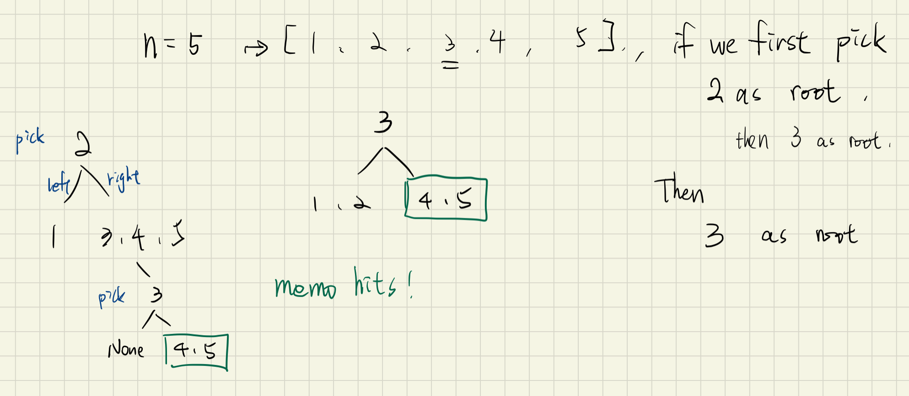

### 思路

如下圖，我們讓1~n的每個數當當看root，並回傳所有可能解
程式碼方面:
直覺的，i是root，而start ~ i-1是左子樹，i+1 ~ end 是右子樹
而左右子樹都可以再分別遞迴下去做切割成左及右子樹
當無法再切割時(start > end)時，就是NULL的狀態


### Code
TopDown with memo
```py
class Solution:
    def generateTrees(self, n: int) -> List[TreeNode]:
        memo = {}
        def gen_tree(start, end):
            if start > end:
                return [None]

            if (start, end) not in memo:
                res = []
                for i in range(start, end+1):
                    left_trees = gen_tree(start, i-1)
                    right_trees = gen_tree(i+1, end)

                    for left_tree in left_trees:
                        for right_tree in right_trees:
                            root = TreeNode(i)
                            root.left = left_tree
                            root.right = right_tree
                            res.append(root)
                memo[(start, end)] = res

            return memo[(start, end)]

        return gen_tree(1, n)
```

``` c++
class Solution {
public:
    vector<TreeNode*> generateTrees(int n) {
        if (n == 0)  return { };
        return generateTreesDFS(1, n);
    }

    vector<TreeNode*> generateTreesDFS(int start, int end){
        vector<TreeNode*> subtree;
        if (start > end){
            subtree.push_back(NULL);
        }
        else{
            for (int i=start; i<= end; ++i){
                vector<TreeNode*> left = generateTreesDFS( start, i-1 );
                vector<TreeNode*> right = generateTreesDFS( i+1, end );
                for (auto l:left){
                    for (auto r:right){
                        TreeNode* node = new TreeNode(i);   // generate the (sub)root
                        node -> left = l;
                        node -> right = r;
                        subtree.push_back(node);
                    }
                }
            } // end of start-to-end walkthrough
        }
        return subtree;
    }
};
```
### Tag: #DP #Recursive
---
## !842. Split Array into Fibonacci Sequence(Medium)｜ 4/22 | [Review*1]
Given a string S of digits, such as S = "123456579", we can split it into a Fibonacci-like sequence [123, 456, 579].

Formally, a Fibonacci-like sequence is a list F of non-negative integers such that:

0 <= F[i] <= 2^31 - 1, (that is, each integer fits a 32-bit signed integer type);
F.length >= 3;
and F[i] + F[i+1] = F[i+2] for all 0 <= i < F.length - 2.
Also, note that when splitting the string into pieces, each piece must not have extra leading zeroes, except if the piece is the number 0 itself.

Return any Fibonacci-like sequence split from S, or return [] if it cannot be done.

Example 1:

Input: "123456579"
Output: [123,456,579]
Example 2:

Input: "11235813"
Output: [1,1,2,3,5,8,13]
Example 3:

Input: "112358130"
Output: []
Explanation: The task is impossible.
Example 4:

Input: "0123"
Output: []
Explanation: Leading zeroes are not allowed, so "01", "2", "3" is not valid.
Example 5:

Input: "1101111"
Output: [110, 1, 111]
Explanation: The output [11, 0, 11, 11] would also be accepted.
Note:

1 <= S.length <= 200
S contains only digits.
### 4/28 review(X)

### 思路
符合題意的數列其實可能不止一種，但是本題就讓返回一個就行了。不管返回幾個，總之不是求極值，DP在這裡就不好使了，只能用遞歸了，由於不知道如何分割，所以肯定需要遍歷所有的情況。我們用一個數組out來記錄已經組成的序列，用結果res來保存結果。當out數組的個數大於等於3，並且已經遍歷完了字符串S，那麼此時就是可以把out數組中的內存賦值給結果res了，那麼之後只要檢測結果res不為空時，直接返回就可以了，這是個很好的剪枝操作，因為此題只需要一個正確答案即可

現在來考慮遞歸函數的主體該怎麼寫，既然不知道要如何分割，那麼就要嘗試所有的情況，一個數字，兩個數字，一直到末尾，那麼就可以遍歷字符串S，然後取子串即可。但從什麼位置開始呢，每次都從頭嗎，這道題都數字不能重複使用，所以應該用個變量start來記錄當前遍歷到的位置，那麼我們從start位置起，每次取 i-start+1 長度的子串 cur，此時在轉為int之前，需要先處理leading zeros的情況，判斷若cur長度大於1，且首字符為0，直接break，還就是 **若cur的長度大於10，也break，為啥呢？因為整型的最大值是 2147483647，只有10位，所以當cur長度大於10時，一定會溢出。** 當cur長度為10時，也有可能溢出，這個在之後處理。好，現在將cur轉為長整型 long，因為長度為10也可能溢出，所以要先轉為長整型，然後在判斷若大於整型最大值 INT_MAX，直接break。接下來就要考慮是否要加入out數組了，當out數字的個數不到2個的時候，我們可以直接加入當前數字，若大於等於2個，需要考慮是否滿足斐波納切數列的性質，即當前數字是否等於前兩個數字之和，滿足的話才加入，不然就跳過，注意這裡不能直接break，因為之後的數字也許可能滿足要求。加入out數組之後，就可以調用遞歸了，此時起始位置傳入 i+1，之後再恢復out的狀態即可
### Code
與 306 的做法類似，這題多加了 overflow 的限制
```py
class Solution:
    def splitIntoFibonacci(self, s: str) -> List[int]:
        res = []
        n = len(s)

        for i in range(1, 11):
            for j in range(i, i+11):
                comb = []
                num1, num2, other = s[:i], s[i:j+1], s[j+1:]

                if len(num1) > 1 and num1[0] == '0' or len(num2) > 1 and num2[0] == '0':
                    continue

                while other:
                    sum_num = int(num1) + int(num2)
                    if sum_num > 2147483647:
                        break
                    sum_str = str(sum_num)
                    if sum_str == other:
                        res += comb + [num1] + [num2] + [other]
                        return res
                    elif other.startswith(sum_str):
                        comb += [num1]
                        num1, num2, other = num2, sum_str, other[len(sum_str):]
                    else:
                        break
        return res
```

``` c++
class Solution {
public:
    vector<int> splitIntoFibonacci(string S) {
        vector<int> out, res;
        recursion(S, 0, out, res);
        return res;
    }

private:
    void recursion(string S, int start, vector<int>& out, vector<int>& res) {
        // as long as finding one solution, return
        if (!res.empty())    return;
        // out is more than three elements, and we walkthrough whole string, out is the result
        if (out.size() >= 3 && start >= S.length()){
            res = out;  return;
        }
        for (int i=start; i<S.length(); i++){
            // select at least 1 digit, but increasible depends on the increasing i in for-loop
            string s = S.substr(start, i-start+1);
            // leading zero or overflow with (longer)larger than INT_MAX(2147483647)
            if ( (s.length() > 1 && s[0] == '0'))  break;
            long num = stol(s);
            if (num >= INT_MAX) break;
            // if it is not an Feb seq, note: we shouldn't break here, cuz the possib of 下個數字的與當前數字的組合
            if (out.size() >= 2 && num != (long)out[out.size() - 1] + out[out.size() -2])   continue;
            out.push_back(num);
            recursion(S, i+1, out, res);
            out.pop_back();
        }
    }
};
```
### Tag: #Recursive
---
## 94. Binary Tree Inorder Traversal｜ 4/22 | [ Review * 1 ]
Given a binary tree, return the inorder traversal of its nodes' values.

Example:

Input: [1,null,2,3]
   1
    \
     2
    /
   3

Output: [1,3,2]
Follow up: Recursive solution is trivial, could you do it iteratively?
### 4/28 review

### 思路
Pre-order: Duplicate binary tree
In-order: Binary search tree
Post-order: Delete binary tree
__Binary tree ~> DFS ~> stack__
=> __Travesal order == code order__
公式：
``` c++
while(p||!stack.empty()){
    if(p){
        stack.push(p);
        // traversal order...
        // ...
    }
    else{
        p = stack.top(); stack.pop();
        /// traversal order...
        // ...
    }
}
```

空間複雜度更低的方法：Morris Traversal(不使用stack全部使用pointer)
### Code
```py
class Solution:
    def inorderTraversal(self, root: TreeNode) -> List[int]:
        if not root:
            return []
        stack, res = [], []
        while root or stack:
            while root:
                stack.append(root)
                root = root.left
            root = stack.pop()
            res.append(root.val)
            root = root.right
        return res
```

Model 版推推
```py
class Solution:
    def inorderTraversal(self, root: TreeNode) -> List[int]:
        stack = []
        res = []
        p = root

        while p or stack:
            if p:
                stack.append(p)
                p = p.left
            else:
                top = stack.pop()
                res.append(top.val)
                p = top.right

        return res
```
``` c++
/**
 * Definition for a binary tree node.
 * struct TreeNode {
 *     int val;
 *     TreeNode *left;
 *     TreeNode *right;
 *     TreeNode(int x) : val(x), left(NULL), right(NULL) {}
 * };
 */
class Solution {
public:
    vector<int> inorderTraversal(TreeNode* root) {
        vector<int> res;
        stack<TreeNode*> stack;
        TreeNode* p = root;
        while(p || !stack.empty()){
            if(p){
                stack.push(p);
                p = p -> left;
            }
            else{
                p = stack.top(); stack.pop();
                res.push_back(p->val);
                p = p -> right;
            }
        }
        return res;
    }
};
```
---
## 144. Binary Tree Preorder Traversal｜ 4/22 | [ Review * 1 ]
Given a binary tree, return the preorder traversal of its nodes' values.

Example:

Input: [1,null,2,3]
   1
    \
     2
    /
   3

Output: [1,2,3]
Follow up: Recursive solution is trivial, could you do it iteratively?

### 4/29 review
### 思路
children是vector型態直接用for迴圈走訪
與#589 的比較：589這題最大的不同是我們必須一次將所有的children全部放進stack裡，因此程式與輸出value的順序必須顛倒(因為stack的性質)
而#144: 一次push一個節點進stack，在下一次的迴圈我們希望輸出的value就是top，因此程式與輸出value的順序要一樣
### Code
```py
    # 中左右
class Solution:
    def preorderTraversal(self, root: TreeNode):
        stack = []
        res = []
        p = root

        while p or stack:
            if p:
                res.append(p.val) # 中
                stack.append(p)   # 左
                p = p.left        # 左
            else:
                top = stack.pop()
                p = top.right
        return res
```

``` c++
class Solution {
public:
    vector<int> preorderTraversal(TreeNode* root) {
        vector<int> res;
        stack<TreeNode*> stack;
        TreeNode* p = root;
        while (!stack.empty() || p){
            if (p){
                stack.push(p);
                res.push_back(p->val);
                p = p->left;
            }
            else{
                p = stack.top();    stack.pop();
                p = p->right;
            }
        }
        return res;
    }
};
```
---
## 145. Binary Tree Postorder Traversal｜ 4/22 | [ Review * 1 ]
Given a binary tree, return the postorder traversal of its nodes' values.

Example:

Input: [1,null,2,3]
   1
    \
     2
    /
   3

Output: [3,2,1]
Follow up: Recursive solution is trivial, could you do it iteratively?

### 4/29 review
### 思路
post traversal order: left->right->root
 can't directly code it cuz there are no pointer p in the else statement
 hence, reverse the traversal order to [root->right->left]
 and also reverse the push_back order in vector ( insert from begin )


### Code
模板版
```py
class Solution:
    def preorderTraversal(self, root: TreeNode) -> List[int]:
        stack = []
        res = []
        p = root

        while p or stack:
            if p:
                stack.append(p)
                res.append(p.val)
                p = p.left
            else:
                top = stack.pop()
                p = top.right
        return res
```
``` c++
/**
 * Definition for a binary tree node.
 * struct TreeNode {
 *     int val;
 *     TreeNode *left;
 *     TreeNode *right;
 *     TreeNode(int x) : val(x), left(NULL), right(NULL) {}
 * };
 */
/*
traversal order: left->right->root
 can't directly code it cuz the pointer will lose his parents
 hence, reverse the traversal order to [root->right->left]
 and also reverse the push_back order in vector ( insert from begin )
*/
class Solution {
public:
    vector<int> postorderTraversal(TreeNode* root) {
        vector<int> res;
        stack<TreeNode*> stack;
        TreeNode* p = root;
        while(p || !stack.empty()){
            if(p){
                stack.push(p);
                res.insert(res.begin(), p->val);
                p = p->right;
            }
            else{
                p = stack.top();    stack.pop();
                p = p->left;
            }
        }
        return res;
    }
};
```
---
## !589. N-ary Tree Preorder Traversal｜ 4/23
Given an n-ary tree, return the preorder traversal of its nodes' values.

For example, given a 3-ary tree:


Return its preorder traversal as: [1,3,5,6,2,4].

### 4/29 review
### 思路
children是vector型態直接用for迴圈走訪
與#144 的比較：這題最大的不同是我們必須一次將所有的children全部放進stack裡，因此程式與輸出value的順序必須顛倒(因為stack的性質)
而#144: 一次push一個節點進stack，在下一次的迴圈我們希望輸出的value就是top，因此程式與輸出value的順序要一樣
### Code
``` c++
/*
// Definition for a Node.
class Node {
public:
    int val;
    vector<Node*> children;

    Node() {}

    Node(int _val, vector<Node*> _children) {
        val = _val;
        children = _children;
    }
};
*/
// root, left, right
class Solution {
public:
    vector<int> preorder(Node* root) {
        if (!root)  return { };
        vector<int> res;
        stack<Node*> stack;
        stack.push(root);
        while(!stack.empty()){
            Node* p = stack.top(); stack.pop();
            res.push_back(p->val);
            // suppose the children vector order is left and right
            // with the stack, should push right first cuz we want left out first
            for(int i=p->children.size()-1; i>=0; i--){
                stack.push(p->children[i]);
            }
        }
        return res;
    }
};
```
---
## @590. N-ary Tree Postorder Traversal｜ 4/23
Given an n-ary tree, return the postorder traversal of its nodes' values.

For example, given a 3-ary tree:


Return its postorder traversal as: [5,6,3,2,4,1].


Note:

Recursive solution is trivial, could you do it iteratively?

### 4/29 review
### 思路
children是vector型態直接用for迴圈走訪即可
post order使用反轉手法
### Code
``` c++
/*
// Definition for a Node.
class Node {
public:
    int val;
    vector<Node*> children;

    Node() {}

    Node(int _val, vector<Node*> _children) {
        val = _val;
        children = _children;
    }
};
*/
// left, right, root ->(reverse)-> root, right, left
//
class Solution {
public:
    vector<int> postorder(Node* root) {
        if(!root)   return { };
        vector<int> res;
        stack<Node*> stack;
        stack.push(root);
        while (!stack.empty()){
            Node* p = stack.top(); stack.pop();
            res.insert(res.begin(), p->val); // could use push_back and reverse the res before return it.
            // want right come-out first so left first in
            for (int i=0; i< p->children.size(); i++){
                stack.push(p->children[i]);
            }
        }
        return res;
    }
};
```

---
## 100. Same Tree｜ 4/23 | [ Review * 2 ]
Given two binary trees, write a function to check if they are the same or not.

Two binary trees are considered the same if they are structurally identical and the nodes have the same value.


### 4/29 review
### 思路
iterative的手法，前中後序接可以應用來比較

### Code
Iterative DFS
```py
class Solution:

    def isSameTree(self, p, q):
        stack = [(p, q)]
        while stack:
            (p, q) = stack.pop()
            if p and q and p.val == q.val:
                stack.append((p.left,  q.left))
                stack.append((p.right, q.right))
            elif p or q:
                return False
        return True
```

Recursive
```py
class Solution:
    def isSameTree(self, p: TreeNode, q: TreeNode) -> bool:
        if not p and not q: return True
        if (not p and q) or (p and not q) or p.val != q.val: return False
        return self.isSameTree(p.left, q.left) and self.isSameTree(p.right, q.right)
```

Recursive
``` c++
class Solution {
public:
    bool isSameTree(TreeNode *p, TreeNode *q) {
        if (!p && !q) return true;
        if ((p && !q) || (!p && q) || (p->val != q->val)) return false;
        return isSameTree(p->left, q->left) && isSameTree(p->right, q->right);
    }
};
```

Iterative(faster)
``` c++
/**
 * Definition for a binary tree node.
 * struct TreeNode {
 *     int val;
 *     TreeNode *left;
 *     TreeNode *right;
 *     TreeNode(int x) : val(x), left(NULL), right(NULL) {}
 * };
 */
class Solution {
public:
    bool isSameTree(TreeNode* p, TreeNode* q) {
        stack<TreeNode*> stack;
        stack.push(p), stack.push(q);
        while(!stack.empty()){
            q = stack.top();  stack.pop();
            p = stack.top();  stack.pop();
            if (!p && !q)   continue;
            if ((!p && q) || (p && !q) || (p->val != q->val) )    return false;
            // 在前面兩個if完全過濾掉p的child有NULL的情形了，所以這邊才能放心push Note: stack can't push NULL
            stack.push(p->right), stack.push(q->right);
            stack.push(p->left), stack.push(q->left);
        }
        return true;
    }
};
```
### Tag: #Tree #BFS
---
## 101. Symmetric Tree｜ 4/23 | [ Review * 1 ]
Given a binary tree, check whether it is a mirror of itself (ie, symmetric around its center).

For example, this binary tree [1,2,2,3,4,4,3] is symmetric:


### 思路
切割成左右子樹比較
直覺上使用queue來處理
實測:Queue的速度比Stack快很多

### Code
Iterative
```py
class Solution:
    def isSymmetric(self, root: TreeNode) -> bool:
        que = deque([root.left, root.right])

        while que:
            layer_size = len(que)
            while layer_size > 0:
                p = que.popleft()
                q = que.popleft()
                layer_size -= 2
                if not p and not q:
                    continue

                if (not p and q) or (p and not q) or (p.val != q.val):
                    return False

                que.append(p.left)
                que.append(q.right)

                que.append(p.right)
                que.append(q.left)
        return True
```

Recursive
```py
class Solution:
    def isSymmetric(self, root: TreeNode) -> bool:
        if not root: return True
        return self.isSame(root.left, root.right)

    def isSame(self, left, right):
        if not left and not right: return True
        if (not left and right) or (left and not right) or (left.val != right.val): return False
        return self.isSame(left.left, right.right) and self.isSame(left.right, right.left)
```

Recursive
``` c++
class Solution {
public:
    bool isSymmetric(TreeNode* root) {
        if (!root) return true;
        return isSymmetric(root->left, root->right);
    }
    bool isSymmetric(TreeNode* left, TreeNode* right) {
        if (!left && !right) return true;
        if (left && !right || !left && right || left->val != right->val) return false;
        return isSymmetric(left->left, right->right) && isSymmetric(left->right, right->left);
    }

};
```
Iterative
``` c++
/**
 * Definition for a binary tree node.
 * struct TreeNode {
 *     int val;
 *     TreeNode *left;
 *     TreeNode *right;
 *     TreeNode(int x) : val(x), left(NULL), right(NULL) {}
 * };
 */
class Solution {
public:
    bool isSymmetric(TreeNode* root) {
        if(!root)   return true;
        TreeNode* left = root->left;
        TreeNode* right = root->right;
        queue<TreeNode*> queue;
        queue.push(left), queue.push(right);
        while(!queue.empty()){
            left = queue.front(); queue.pop();
            right = queue.front(); queue.pop();
            if (!left && !right)    continue;
            if ((!left && right) || (left &&!right) || (left->val != right->val) )  return false;
            queue.push(left->left), queue.push(right->right);
            queue.push(left->right),queue.push(right->left);
        }
        return true;
    }
};
```
### Tag: #Tree #BFS
---
## 104. Maximum Depth of Binary Tree｜ 4/23 | [ Review * 2 ]
Given a binary tree, find its maximum depth.

The maximum depth is the number of nodes along the longest path from the root node down to the farthest leaf node.

Note: A leaf is a node with no children.

Example:

Given binary tree [3,9,20,null,null,15,7]

return its depth = 3
### 解題分析
- Recursive 跟 iterative 的轉換
    - stack 裡面就是要放`狀態`跟`回傳`

### 思路

使用層序遍歷二叉樹，然後計數總層數，即為二叉樹的最大深度
### Code
Recursive to Iterative
```py
class Solution:
    def maxDepth2(self, root):
        stack = [(root, 1)] # stack 紀錄 recursive 的狀態跟回傳
        depth = 0
        while stack:
            cur_root, cur_depth = stack.pop()
            if cur_root:
                depth = max(depth, cur_depth)
                stack.append((cur_root.right, cur_depth+1))
                stack.append((cur_root.left, cur_depth+1))
        return depth

    def maxDepth(self, root: Optional[TreeNode]) -> int:
        if not root:
            return 0
        l = 1 + self.maxDepth(root.left)
        r = 1 + self.maxDepth(root.right)
        return max(l, r)
```


Recursive Post order
```py
class Solution:
    def maxDepth(self, root: TreeNode) -> int:
        if not root: return 0
        l = self.maxDepth(root.left)
        r = self.maxDepth(root.right)
        return max(l, r) +1
```

Iterative BFS
```py
class Solution:
    def maxDepth(self, root: TreeNode) -> int:
        if not root: return 0
        queue = deque([root])
        cnt = 0
        while queue:
            cnt += 1
            layer_size = len(queue)
            for _ in range(layer_size):
                node = queue.popleft()
                if node.left:
                    queue.append(node.left)
                if node.right:
                    queue.append(node.right)
        return cnt
```

Recursive
``` c++
class Solution {
public:
    int maxDepth(TreeNode* root) {
        if (!root) return 0;
        return 1 + max(maxDepth(root->left), maxDepth(root->right));
    }
};

```
Iterative
``` c++

class Solution {
public:
    int maxDepth(TreeNode* root) {
        if(!root)
            return 0;
        int res = 0;
        // We need to consider all the node in the layer, hence BFS
        queue<TreeNode*> queue;
        queue.push(root);
        while (!queue.empty()){
            ++res;
            // shouldn't inc counter if in the same layer, hence recourd their children & pop them all out
            for (int i=0, n=queue.size(); i<n; ++i){
        //  for (int i=0, i<queue.size(); ++i)  errors happen cuz the inc of queue.size()
        //  for (int i=queue.size(); i>0; i--)  THIS would be the safetest
                TreeNode* t = queue.front();
                queue.pop();
                if(t->left)
                    queue.push(t->left);
                if(t->right)
                    queue.push(t->right);
            }
        }
        return res;
    }
};

```
### Tag: #Tree #BFS
---
## 110. Balanced Binary Tree｜ 4/24 | [ Review * 1 ]
Given a binary tree, determine if it is height-balanced.

For this problem, a height-balanced binary tree is defined as:

a binary tree in which the left and right subtrees of every node differ in height by no more than 1.


Input: root = [3,9,20,null,null,15,7]

Output: true


Input: root = [1,2,2,3,3,null,null,4,4]

Output: false

Input: root = []

Output: true

### 思路

### Code
```py
class Solution:
    def isBalanced(self, root: TreeNode) -> bool:
        def maxDep(node):
            if not node:
                return 0
            left_cnt = maxDep(node.left)
            if left_cnt < 0: return -1
            right_cnt = maxDep(node.right)
            if right_cnt < 0: return -1

            if abs(left_cnt - right_cnt) > 1:
                return -1
            else:
                return max(left_cnt, right_cnt)+1

        return maxDep(root) >= 0
```

Solution1: calculate all the nodes
``` c++
/**
 * Definition for a binary tree node.
 * struct TreeNode {
 *     int val;
 *     TreeNode *left;
 *     TreeNode *right;
 *     TreeNode(int x) : val(x), left(NULL), right(NULL) {}
 * };
 */
class Solution {
public:
    bool isBalanced(TreeNode* root) {
        if (!root)  return true;
        if (abs(getDepth(root->left) - getDepth(root->right)) > 1)   return false;
        // need to check every node in this tree is all balanced tree, hence recursive it
        return isBalanced(root->left) && isBalanced(root->right);
    }

    int getDepth(TreeNode* root){
        if (!root)  return 0;
        return 1 + max(getDepth(root->left), getDepth(root->right));
    }
};
```
Solution2 做了一些計算上的優化
``` c++
/**
 * Definition for a binary tree node.
 * struct TreeNode {
 *     int val;
 *     TreeNode *left;
 *     TreeNode *right;
 *     TreeNode(int x) : val(x), left(NULL), right(NULL) {}
 * };
 */
class Solution {
public:
    bool isBalanced(TreeNode* root) {
        if (checkDepth(root) == -1) return false;
        return true;
    }
    int checkDepth(TreeNode* root){
        if (!root)  return 0;   // the depth of leaf child is zero
        // 只要一發現左右子樹有不平衡的狀況，直接返回-1，省去計算深度的步驟
        int left = checkDepth(root->left);
        if (left == -1) return -1;
        int right = checkDepth(root->right);
        if (right == -1)    return -1;
        // 精髓在此，把計算深度的過程放在最後面，只有當左右子樹都是平衡的情況下才有計算具體深度的必要
        if (abs(left-right) > 1)    return -1;
        return 1 + max(left, right);
    }
};
```
### Tag: #Tree
---
## 111. Minimum Depth of Binary Tree｜ 4/24 | [ Review * 1 ]
Given a binary tree, find its minimum depth.

The minimum depth is the number of nodes along the shortest path from the root node down to the nearest leaf node.

Note: A leaf is a node with no children.

Example:

Given binary tree [3,9,20,null,null,15,7],

return its minimum depth = 2.

### 解題分析
1. BFS
    1. 直觀來說這題就是在考 BFS 的逐層掃描，掃到夜節點就回傳
    2. 夜節點的定義就是沒有左子數跟右子數
2. DFS
    1. 這解法反而不好想到
    2. 如果找不到左節點，就找找看其右節點
    3. 如果找不到右節點，就找找看其左節點
    4. 如果都存在就找他們兩個的最小 +1
### 思路
Iterative的方法還是比Recursive快上不少
我們迭代來做，層序遍歷，記錄遍歷的層數，一旦我們遍歷到第一個葉結點，就將當前層數返回，即為二叉樹的最小深度
### Code
BFS
```py
from collections import deque
class Solution:
    def minDepth(self, root: TreeNode) -> int:
        if not root:
            return 0
        queue = deque([(0, root)])
        while queue:
            level, node = queue.popleft()
            if not node.left and not node.right:
                return level+1
            if node.left:
                queue.append((level+1, node.left))
            if node.right:
                queue.append((level+1, node.right))
```

DFS
```py
class Solution:
    def minDepth(self, root: TreeNode) -> int:
        if not root:
            return 0
        if not root.left:
            return 1 + self.minDepth(root.right)
        if not root.right:
            return 1 + self.minDepth(root.left)
        return 1 + min(self.minDepth(root.left), self.minDepth(root.right))
```

Recursive
``` c++
/**
 * Definition for a binary tree node.
 * struct TreeNode {
 *     int val;
 *     TreeNode *left;
 *     TreeNode *right;
 *     TreeNode(int x) : val(x), left(NULL), right(NULL) {}
 * };
 */
class Solution {
public:
    int minDepth(TreeNode* root) {
        if (!root)  return 0;
        if (!root->left)    return 1+minDepth(root->right);
        if (!root->right)   return 1+minDepth(root->left);
        return 1 + min(minDepth(root->left), minDepth(root->right));
    }
};
```
Iterative
``` c++
/**
 * Definition for a binary tree node.
 * struct TreeNode {
 *     int val;
 *     TreeNode *left;
 *     TreeNode *right;
 *     TreeNode(int x) : val(x), left(NULL), right(NULL) {}
 * };
 */
class Solution {
public:
    int minDepth(TreeNode* root) {
        if (!root)  return 0;
        int res = 0;
        queue<TreeNode*> queue;
        queue.push(root);
        while (!queue.empty()){
            res++;
            for (int i=queue.size(); i>0; i--){
                TreeNode* p = queue.front();  queue.pop();
                if (!p->left && !p->right)  return res; // in BFS, the first leaf we met is ans
                if (p->left)    queue.push(p->left);
                if (p->right)   queue.push(p->right);
            }
        }
        return -1;
    }
};
```
### Tag: #BFS #DFS #Tree
---
## 572. Subtree of Another Tree｜ 4/24 | [ Review * 1 ]
Given two non-empty binary trees s and t, check whether tree t has exactly the same structure and node values with a subtree of s. A subtree of s is a tree consists of a node in s and all of this node's descendants. The tree s could also be considered as a subtree of itself.


### 解題分析
1. Recursive
    - 我們必須走訪過所有 root 的節點, 把每一個都當頭看看, 因此這邊需要 recursive 自己
2. 序列化
    - 將 root, subRoot 的序列化值拿到
    - 再去比較是否 subRoot array 在 root array 裡
    - TODO: 找兩個 array 是否重合的優化解法

### Code
Recursive
```py
class Solution:
    def isSubtree(self, root: Optional[TreeNode], subRoot: Optional[TreeNode]) -> bool:
        if not root:
            return False
        if self.isSame(root, subRoot):
            return True
        return self.isSubtree(root.left, subRoot) or self.isSubtree(root.right, subRoot)

    def isSame(self, s, t):
        if not s and not t:
            return True
        elif (not s and t) or (not t and s):
            return False
        elif s.val != t.val:
            return False
        else:
            return self.isSame(s.left, t.left) and self.isSame(s.right, t.right)
```

Iterative (Better)
```py
class Solution:
    def isSubtree(self, root: Optional[TreeNode], subRoot: Optional[TreeNode]) -> bool:
        serial_root = self.get_serialize(root)
        serial_subroot = self.get_serialize(subRoot)

        len_i, len_j = len(serial_root), len(serial_subroot)

        for i in range(len_i):
            if serial_root[i] == serial_subroot[0]:
                temp_i = i+1
                for j in range(1, len_j):
                    if serial_root[temp_i] != serial_subroot[j]:
                        break
                    temp_i += 1
                if temp_i - i == len_j:
                    return True
        return False


    def get_serialize(self, root):
        data = []
        def rserialize(root):
            if not root:
                data.append('None')
                return
            data.append(str(root.val))
            rserialize(root.left)
            rserialize(root.right)

        rserialize(root)
        return data
```

Recursive
``` c++
/**
 * Definition for a binary tree node.
 * struct TreeNode {
 *     int val;
 *     TreeNode *left;
 *     TreeNode *right;
 *     TreeNode(int x) : val(x), left(NULL), right(NULL) {}
 * };
 */
class Solution {
public:
    bool isSubtree(TreeNode* s, TreeNode* t) {
        if (!s) return false;
        if (isSame(s, t))   return true;
        return isSubtree(s->left, t) || isSubtree(s->right, t);
    }
    bool isSame(TreeNode* s, TreeNode* t){
        if (!s && !t)   return true;
        if ((!s && t) || (s && !t)) return false;
        if (s->val != t->val)   return false;
        return isSame(s->left, t->left) && isSame(s->right, t->right);
    }
};
```
### Tag: #Tree
---
## @965. Univalued Binary Tree｜ 4/24
A binary tree is univalued if every node in the tree has the same value.

Return true if and only if the given tree is univalued.


### 思路

### Code
``` c++
/**
 * Definition for a binary tree node.
 * struct TreeNode {
 *     int val;
 *     TreeNode *left;
 *     TreeNode *right;
 *     TreeNode(int x) : val(x), left(NULL), right(NULL) {}
 * };
 */
class Solution {
public:
    bool isUnivalTree(TreeNode* root) {
        if (!root)  return true;
        if (root->left && root->val != root->left->val) return false;
        if (root->right && root->val != root->right->val) return false;
        return isUnivalTree(root->left) && isUnivalTree(root->right);

    }
};
```
---
## 102. Binary Tree Level Order Traversal｜ 4/25 | [ Review * 2 ]
Given a binary tree, return the level order traversal of its nodes' values. (ie, from left to right, level by level).

For example:


### 思路
Level order BFS
### Code
BFS
```py
def levelOrder(self, root):
    ret = []
    level = [root]

    while root and level:
        currentNodes = []
        nextLevel = []
        for node in level:
            currentNodes.append(node.val)
            if node.left:
                nextLevel.append(node.left)
            if node.right:
                nextLevel.append(node.right)
        ret.append(currentNodes)
        level = nextLevel

    return ret
```

DFS
```py
class Solution:
    def levelOrder(self, root: TreeNode) -> List[List[int]]:
        while not root:
            return []
        stack = [(root, 0)]
        levels = []

        while stack:
            node, level = stack.pop()
            if level == len(levels):
                levels.append([])

            levels[level].append(node.val)
            if node.right:
                stack.append((node.right, level+1))
            if node.left:
                stack.append((node.left, level+1))
        return levels
```

Iterative
``` c++
class Solution {
public:
    vector<vector<int>> levelOrder(TreeNode* root) {
        if (!root)  return {};
        vector<vector<int>> res;
        queue<TreeNode*> queue;
        queue.push(root);
        while(!queue.empty()){
            vector<int> thisLevel;
            for (int i=queue.size(); i>0; i--){
                TreeNode* p = queue.front();  queue.pop();
                thisLevel.push_back(p->val);

                if(p->left) queue.push(p->left);
                if(p->right)    queue.push(p->right);
            }
            res.push_back(thisLevel);
        }
        return res;
    }
};
```

Recursive:
``` c++
class Solution {
public:
    vector<vector<int>> levelOrder(TreeNode* root) {
        vector<vector<int>> res;
        recursion(root, 0, res);
        return res;
    }
private:
    void recursion(TreeNode* root, int level, vector<vector<int>>& res){
        if (!root)  return;
        if (res.size() == level)    res.push_back({});  // give new level a room
        res[level].push_back(root->val);
        recursion(root->left, level+1, res);
        recursion(root->right, level+1, res);
    }
};
```
### Tag: #BFS
---
## 107. Binary Tree Level Order Traversal II｜ 4/25 | [ Review * 1 ]
Given a binary tree, return the bottom-up level order traversal of its nodes' values. (ie, from left to right, level by level from leaf to root).

For example:
Given binary tree [3,9,20,null,null,15,7],


### 思路

### Code
Without using reverse
```py
class Solution:
    def levelOrderBottom(self, root: TreeNode) -> List[List[int]]:
        if not root: return []
        res, queue = deque(), deque([(root, 1)])

        while queue:
            node, level = queue.popleft()
            if level > len(res):
                res.appendleft([])

            res[-(level)].append(node.val)

            if node.left:
                queue.append((node.left, level+1))
            if node.right:
                queue.append((node.right, level+1))
        return res
```

Iterative:

``` c++
// 參考 #102 將push_back改成insert
```
Recursive:

``` c++
// 參考 #102 在return res之前將vector reverse
```
### Tag: #BFS
---
## @429. N-ary Tree Level Order Traversal｜ 4/25
Given an n-ary tree, return the level order traversal of its nodes' values. (ie, from left to right, level by level).

For example, given a 3-ary tree:


### 思路

### Code
``` c++
/*
// Definition for a Node.
class Node {
public:
    int val;
    vector<Node*> children;

    Node() {}

    Node(int _val, vector<Node*> _children) {
        val = _val;
        children = _children;
    }
};
*/
class Solution {
public:
    vector<vector<int>> levelOrder(Node* root) {
        if(!root)   return {};
        vector<vector<int>> res;
        queue<Node*> queue;
        queue.push(root);
        while (!queue.empty()){
            vector<int> oneLevel;
            for (int i=queue.size(); i>0; --i){
                root = queue.front(); queue.pop();
                oneLevel.push_back(root->val);
                if (!root->children.empty()){
                    for (auto child : root->children)   queue.push(child);
                }
            }
            res.push_back(oneLevel);
        }
        return res;
    }
};
```
---
## 872. Leaf-Similar Trees｜ 4/25 | [ Review * 1 ]
Consider all the leaves of a binary tree.  From left to right order, the values of those leaves form a leaf value sequence.

For example, in the given tree above, the leaf value sequence is (6, 7, 4, 9, 8).

Two binary trees are considered leaf-similar if their leaf value sequence is the same.

Return true if and only if the two given trees with head nodes root1 and root2 are leaf-similar.


### 思路

### Code
```py
class Solution:
    def leafSimilar(self, root1: TreeNode, root2: TreeNode) -> bool:
        return self.getLeaf(root1, []) == self.getLeaf(root2, [])

    def getLeaf(self, node, res):
        if not node: return res
        if not node.left and not node.right:
            res.append(node.val)
        self.getLeaf(node.left, res)
        self.getLeaf(node.right, res)
        return res
```
``` c++
/**
 * Definition for a binary tree node.
 * struct TreeNode {
 *     int val;
 *     TreeNode *left;
 *     TreeNode *right;
 *     TreeNode(int x) : val(x), left(NULL), right(NULL) {}
 * };
 */
class Solution {
public:
    bool leafSimilar(TreeNode* root1, TreeNode* root2) {
        string s1, s2;
        dfs(root1, s1);
        dfs(root2, s2);
        return s1==s2;
    }
private:
    void dfs(TreeNode* root, string& seq){
        if (!root)  return;
        if (!root->left && !root->right)    seq += to_string(root->val) + "# ";
        else{
            dfs(root->left, seq);
            dfs(root->right, seq);
        }
    }
};
```
### Tag: #DFS
---
## 987. Vertical Order Traversal of a Binary Tree｜ 4/25 | [ Review * 1 ]
Given a binary tree, return the vertical order traversal of its nodes values.

For each node at position (X, Y), its left and right children respectively will be at positions (X-1, Y-1) and (X+1, Y-1).

Running a vertical line from X = -infinity to X = +infinity, whenever the vertical line touches some nodes, we report the values of the nodes in order from top to bottom (decreasing Y coordinates).

If two nodes have the same position, then the value of the node that is reported first is the value that is smaller.

Return an list of non-empty reports in order of X coordinate.  Every report will have a list of values of nodes.


### 解題分析
1. 將需要排序的資料依序整理起來
    1. rank (左子數-1, 右+1)
    2. height
    3. value
2. 因此選擇用字典作為資料結構 {rank: [(height, value)]}

### 5/6 review
採用第二種寫法
學習到：
1. struct 重新賦予x, y值的手法
2. for迴圈走訪map的pair手法
3. append a vector to another vector的手法(vA.back().insert(vA.back().end(), vB.begin(), vB.end()))
### 思路
利用map去紀錄所有資料
### Code
```py
class Solution(object):
    def verticalTraversal(self, root):
        stack = [(root, 0, 0)]
        dic = {}

        while stack:
            node, rank, height = stack.pop()
            dic[rank] = dic[rank] + [(height, node.val)] if rank in dic else [(height, node.val)]
            if node.left:
                stack.append((node.left, rank-1, height+1))
            if node.right:
                stack.append((node.right, rank+1, height+1))
        return [[v for h, v in sorted(pair_list)] for rank, pair_list in sorted(dic.items())]
```

直覺的寫法
``` c++
/**
 * Definition for a binary tree node.
 * struct TreeNode {
 *     int val;
 *     TreeNode *left;
 *     TreeNode *right;
 *     TreeNode(int x) : val(x), left(NULL), right(NULL) {}
 * };
 */
class Solution {
public:
    vector<vector<int>> verticalTraversal(TreeNode* root) {
        vector<vector<int>> ans;
        int h_dist = 0, v_dist = 0;
        queue< pair<TreeNode*, pair<int, int>> > q; // queue of Node and (x,y)
        map<int, vector<pair<int, int>>> outMap;  // map of output order map<h_dist, vector<v_dist, val>>
        q.push(make_pair(root, make_pair(h_dist, v_dist))); // pushinto queue & init root to (0, 0)
        while(!q.empty()){
            /* update the map */
            auto front = q.front();     q.pop();
            auto node = front.first;      //get node
            auto curDis = front.second;    // get posi
            h_dist = curDis.first;
            v_dist = curDis.second;

            outMap[h_dist].push_back(make_pair(v_dist, node->val)); // update the output map

            /* update the queue */
            if (node->left) q.push( make_pair(node->left, make_pair(h_dist-1, v_dist+1)));
            if (node->right) q.push( make_pair(node->right, make_pair(h_dist+1, v_dist+1)));
        }

        ans.resize(outMap.size());  // give our answer vector enough space
        int index=0;

        for (auto elem: outMap){    // each round is the elem with same h_dist
            auto row_vec = elem.second;     // get the vector(v_dsit, val) in outMap
            sort(row_vec.begin(), row_vec.end()); // sort by the v_dist (if same, then by val)

            for (auto value: row_vec){
                ans[index].push_back(value.second);
            }
            index++;
        }

        return ans;
    }
};
```
利用structure 以及 map<x,map<y, vector(val)>
insert from back = push_back
``` c++
class Solution {
    struct Node {
        TreeNode* n;
        int x, y;
    };
public:
    vector<vector<int>> verticalTraversal(TreeNode* root) {
        vector<vector<int>> ans;
        map<int, map<int, vector<int>>> mp;
        queue<Node*> q;
        q.push(new Node{root, 0, 0});
        while(!q.empty()) {
            Node* node = q.front();
            q.pop();
            if(node->n->left) q.push(new Node{node->n->left, node->x - 1, node->y + 1});
            if(node->n->right) q.push(new Node{node->n->right, node->x + 1, node->y + 1});
            mp[node->x][node->y].push_back(node->n->val);
        }
        for(pair<int, map<int, vector<int>>> p1 : mp) {
            ans.push_back({}); // assign a room from back
            for(pair<int, vector<int>> p2 : p1.second) {
                vector<int> v = p2.second; // vector with all node which has same (x, y)
                sort(v.begin(), v.end());
                ans.back().insert(ans.back().end(), v.begin(), v.end());
            //  ans的最後面.插入(從ans最後面的最後面插入, value.begin()~end());
            // (即是指前面的room)
            }
        }
        return ans;
    }
};
```
### Tag: #DFS #HashMap
---
## 814. Binary Tree Pruning｜ 4/30 | [ Review * 1 ]
We are given the head node root of a binary tree, where additionally every node's value is either a 0 or a 1.

Return the same tree where every subtree (of the given tree) not containing a 1 has been removed.

(Recall that the subtree of a node X is X, plus every node that is a descendant of X.)


### 思路
對於例子2來說，如果移除了第三行的3個葉結點後，那麼第二行的那個值為0的結點也變成了葉結點，繼續移除即可，所以與其找值全為0的子樹，我們可以不斷的移除值為0的葉結點，全都移除後那麼值全為0的子樹也就都被移除了。
對於玩二叉樹的題，十有八九都是用遞歸，所以我們應該首先就考慮遞歸的解法，然後再想按什麼順序來遍歷二叉樹呢？層序，先序，中序，還是後序？根據這道題的特點，我們要從末尾來一層一層的移除值為0的葉結點，所以天然時候用後序遍歷。分別對左右子結點調用遞歸函數，此時判斷，如果當前結點是值為0的葉結點，那麼移除該結點，即返回空，否則返回原結點即可
### Code
```py
class Solution:
    def pruneTree(self, root: TreeNode) -> TreeNode:
        def contains_one(node: TreeNode) -> bool:
            if not node:
                return False

            left_contains_one = contains_one(node.left)
            right_contains_one = contains_one(node.right)

            if not left_contains_one:
                node.left = None
            if not right_contains_one:
                node.right = None

            return node.val or left_contains_one or right_contains_one

        return root if contains_one(root) else None
```
``` c
/**
 * Definition for a binary tree node.
 * struct TreeNode {
 *     int val;
 *     TreeNode *left;
 *     TreeNode *right;
 *     TreeNode(int x) : val(x), left(NULL), right(NULL) {}
 * };
 */
class Solution {
public:
    TreeNode* pruneTree(TreeNode* root) {
        if (!root)  return NULL;
        root->left = pruneTree(root->left);
        root->right = pruneTree(root->right);
        return (!root->left && !root->right && root->val == 0)? NULL:root;
    }
};
```
---
## 669. Trim a Binary Search Tree｜ 4/30 | [ Review * 1 ]
Given a binary search tree and the lowest and highest boundaries as L and R, trim the tree so that all its elements lies in [L, R] (R >= L). You might need to change the root of the tree, so the result should return the new root of the trimmed binary search tree.


### 思路
正確方法其實應該是在遍歷的過程中就修改二叉樹，移除不合題意的結點。當然對於二叉樹的題，十有八九都是要用遞歸來解的。首先判斷如果root為空，那麼直接返回空即可。然後就是要看根結點是否在範圍內，如果根結點值小於L，那麼返回對其右子結點調用遞歸函數的值；如果根結點大於R，那麼返回對其左子結點調用遞歸函數的值。如果根結點在範圍內，將其左子結點更新為對其左子結點調用遞歸函數的返回值，同樣，將其右子結點更新為對其右子結點調用遞歸函數的返回值。最後返回root即可
### Code
```py
class Solution:
    def trimBST(self, root: Optional[TreeNode], low: int, high: int) -> Optional[TreeNode]:
        if not root:
            return None
        if root.val < low:
            return self.trimBST(root.right, low, high)
        elif root.val > high:
            return self.trimBST(root.left, low, high)
        else:
            root.left = self.trimBST(root.left, low, high)
            root.right = self.trimBST(root.right, low, high)
            return root
```
``` c
/**
 * Definition for a binary tree node.
 * struct TreeNode {
 *     int val;
 *     TreeNode *left;
 *     TreeNode *right;
 *     TreeNode(int x) : val(x), left(NULL), right(NULL) {}
 * };
 */
class Solution {
public:
    TreeNode* trimBST(TreeNode* root, int L, int R) {
        if (!root)  return NULL;
        root->left = trimBST(root->left, L, R); // 遞迴走訪到葉節點
        root->right = trimBST(root->right, L, R);
        if (root->val < L)  return trimBST(root->right, L, R); // 修正節點，如果小於min，就要更正成右邊節點
        if (root->val > R)  return trimBST(root->left, L, R);
        return root;
    }
};
```
---
## 112. Path Sum｜ 4/30 | [ Review * 1 ]
Given a binary tree and a sum, determine if the tree has a root-to-leaf path such that adding up all the values along the path equals the given sum.

Note: A leaf is a node with no children.


### 思路

### Code
Recursive:
```py
class Solution:
    def hasPathSum(self, root: TreeNode, targetSum: int) -> bool:
        if not root:
            return False
        if not root.left and not root.right and root.val == targetSum:
            return True
        return self.hasPathSum(root.left, targetSum-root.val) or self.hasPathSum(root.right, targetSum-root.val)
```

Iterative with Preorder-template:
```py
class Solution:
    def hasPathSum(self, root: TreeNode, targetSum: int) -> bool:
        if not root:
            return False
        stack = [(root, targetSum)]
        while stack:
            node, target = stack.pop()
            if not node.left and not node.right and node.val == target:
                return True

            if node.left:
                stack.append((node.left, target - node.val))
            if node.right:
                stack.append((node.right, target - node.val))
        return False
```

Recursive:
``` c++
/**
 * Definition for a binary tree node.
 * struct TreeNode {
 *     int val;
 *     TreeNode *left;
 *     TreeNode *right;
 *     TreeNode(int x) : val(x), left(NULL), right(NULL) {}
 * };
 */
class Solution {
public:
    bool hasPathSum(TreeNode* root, int sum) {
        if (!root)  return false;
        if (!root->left && !root->right && root->val == sum)    return true;
        return hasPathSum(root->left, sum - root->val) || hasPathSum(root->right, sum - root->val);
    }
};
```
Iterative:

### Tag: #Tree #DFS
---
## 113. Path Sum II｜ 4/30 | [ Review * 1 ]
Given a binary tree and a sum, find all root-to-leaf paths where each path's sum equals the given sum.

Note: A leaf is a node with no children.


### 思路
找所有解，使用遞迴就對了！
### Code
Iterative:
```py
class Solution:
    def pathSum(self, root: TreeNode, targetSum: int) -> List[List[int]]:
        if not root: return []
        stack = [(root, targetSum, [])] # node, target, path
        res = []

        while stack:
            node, target, path = stack.pop()
            if not node.left and not node.right and node.val == target:
                res.append(path + [node.val])

            if node.left:
                stack.append((node.left, target - node.val, path+[node.val]))
            if node.right:
                stack.append((node.right, target - node.val, path+[node.val]))
        return res
```

Recursive:
``` c++
/**
 * Definition for a binary tree node.
 * struct TreeNode {
 *     int val;
 *     TreeNode *left;
 *     TreeNode *right;
 *     TreeNode(int x) : val(x), left(NULL), right(NULL) {}
 * };
 */
class Solution {
public:
    vector<vector<int>> pathSum(TreeNode* root, int sum) {
        vector<vector<int>> res;
        vector<int> comb;
        dfs(root, sum, res, comb);
        return res;
    }
    void dfs(TreeNode* root, int sum, vector<vector<int>>& res, vector<int>& comb){
        if (!root)  return;
        comb.push_back(root->val);

        if (!root->left && !root->right && root->val == sum){
            res.push_back(comb);
            /*comb.pop_back(); */
            //return;      這裡不能return! 會少了pop_back()，加上面那一行就會過
        }
        dfs(root->left, sum - root->val, res, comb);
        dfs(root->right, sum - root->val, res, comb);
        comb.pop_back();
    }
};
```
Iterative:
### Tag: #Tree #DFS
---
## 437. Path Sum III｜ 5/1 | [ Review * 1 ]
You are given a binary tree in which each node contains an integer value.

Find the number of paths that sum to a given value.

The path does not need to start or end at the root or a leaf, but it must go downwards (traveling only from parent nodes to child nodes).

The tree has no more than 1,000 nodes and the values are in the range -1,000,000 to 1,000,000.


### 解題分析
1. 此題的最佳解是使用 Prefix Sum 的概念來解題，基礎題詳見 LC560
    1. 維護一個 dict 紀錄之前走過的所有 accumulated sum
    2. 有兩種 case 可以 match 到 target sum
        1. 整條路徑的 match
            - 直接看 curSum 是否為 target
        2. 需截掉某段路的 match
            - 去 curSumHistory 裡面找找看有沒有曾經出現 curSum - target
            - 原理是，如果累積和中曾經出現過這個值，那我們把它截掉後，後半段就會等於 target 了
    3. 注意:
        1. 此題為 Tree 的結構，並且只能接受往下走，因此我們不希望左半邊的 curSum 被右半邊給使用到
        2. 因此我們在走訪完一個子樹就必須把其 curSum 給清掉
2. Naive 解法是紀錄從上到下的 path，每到一個新的點就依序把之前走過的依序拆掉去看值是否相等

### 思路
我們可以用遞歸來做，相當於先序遍歷二叉樹，對於每一個節點都有記錄了一條從根節點到當前節點到路徑，同時用一個變量curSum記錄路徑節點總和，然後我們看curSum和sum是否相等，相等的話結果res加1，不等的話我們來繼續查看子路徑和有沒有滿足題意的，做法就是每次去掉一個節點，看路徑和是否等於給定值，注意最後必須留一個節點，不能全去掉了，因為如果全去掉了，路徑之和為0，而如果假如給定值剛好為0的話就會有問題
__key: 維護一個從root到curNode的vector__

### Code

(Optimal) Prefix Sum
```py
from collections import defaultdict
class Solution:
    def pathSum(self, root: TreeNode, sum: int) -> int:
        self.res = 0
        sumHist = defaultdict(int)
        def recur(node, curSum):
            if not node:
                return

            curSum += node.val
            if curSum == sum:
                self.res += 1

            self.res += sumHist[curSum-sum]
            sumHist[curSum] += 1

            recur(node.left, curSum)
            recur(node.right, curSum)

            sumHist[curSum] -= 1 # don't mix the curSumCnts to different side of the tree
        recur(root, 0)
        return self.res
```

Naive Recursive
```py
class Solution:
    def pathSum(self, root: TreeNode, sum: int) -> int:
        self.res = 0
        def recur(node, curSum, path):
            if not node:
                return

            curSum += node.val
            if curSum == sum:
                self.res += 1

            tempSum = curSum
            for val in path:
                tempSum -= val
                if tempSum == sum:
                    self.res += 1

            recur(node.left, curSum, path+[node.val])
            recur(node.right, curSum, path+[node.val])
        recur(root, 0, [])
        return self.res
```

``` c++
/**
 * Definition for a binary tree node.
 * struct TreeNode {
 *     int val;
 *     TreeNode *left;
 *     TreeNode *right;
 *     TreeNode(int x) : val(x), left(NULL), right(NULL) {}
 * };
 */
class Solution {
public:
    int pathSum(TreeNode* root, int sum) {
        vector<TreeNode*> path;
        int cnter = 0;
        recur(root, sum, 0, cnter, path);
        return cnter;
    }

    void recur(TreeNode* node, int sum, int curSum, int& cnter, vector<TreeNode*>& path){
        if (!node)  return;
        curSum += node->val;
        path.push_back(node);   // construct a path from root to leaf
        if (curSum == sum)  cnter++;
        // check the curSum == sum if we remove some node in past path
        int temp = curSum; // we don't want to change the curSum, make a copy for it
        for (int i=0; i < path.size() -1; i++){  // we shouldn't remove current node, if the curSum=0 and curNode also is zero will comes out with problem
            temp -= path[i]->val;
            if (temp == sum)  cnter++;
        }
        // recursion
        recur(node->left, sum, curSum, cnter, path);
        recur(node->right, sum, curSum, cnter, path);
        path.pop_back();
    }
};

```
### Tag: #Tree #PrefixSum #DFS
---
## 543. Diameter of Binary Tree｜ 5/1 (W2D4) | [ Review * 2 ]
Given the root of a binary tree, return the length of the diameter of the tree.

The diameter of a binary tree is the length of the longest path between any two nodes in a tree. This path may or may not pass through the root.

The length of a path between two nodes is represented by the number of edges between them.

Example 1:


- Input: root = [1,2,3,4,5]
- Output: 3
- Explanation: 3 is the length of the path [4,2,1,3] or [5,2,1,3].

Example 2:

- Input: root = [1,2]
- Output: 1

Constraints:

- The number of nodes in the tree is in the range [1, 104].
- -100 <= Node.val <= 100

### 解題分析

1. Recursive function 能求的跟題目要求的結果不一樣, 因此我們必須傳入一個可被更新的變數
    - dfs(node.left): 求出左半邊的最長 path **不可轉彎**
        - 不可轉彎, 所以我們在 return 的時候只能用 max(l, r)
    - max_val: 左半邊+右半邊 **可轉彎**
        - 可轉彎, 所以我們直接把左右邊加起來
2. Iterative:
    - 在思考如何從 recursive 轉換過來, 我們可以發現 max_val 只能在 node.l, node.r 都已經做完的情況下才能被更新
    - 因此我們順著這個思路想到我們需要用一個 hashmap 去存 node -> depth
    - 並且在其左右邊都做完的情況下去更新該 node 的 depth
    - max_val 的更新則跟 recursive 一樣

### Code
Recursive
```py
class Solution:
    def diameterOfBinaryTree(self, root: Optional[TreeNode]) -> int:
        max_val = [0]
        self.dfs(root, max_val)
        return max_val[0]

    def dfs(self, node, max_val):
        if not node.left and not node.right:
            return 1
        left_val = self.dfs(node.left, max_val) if node.left else 0
        right_val = self.dfs(node.right, max_val) if node.right else 0
        max_val[0] = max(max_val[0], left_val+right_val)
        return max(left_val, right_val)+1
```

Iterative
```py
class Solution:
    def diameterOfBinaryTree(self, root: Optional[TreeNode]) -> int:
        stack = [root]
        depth_map = {}
        max_val = 0

        while stack:
            top = stack[-1]
            if top.left and top.left not in depth_map:
                stack.append(top.left)
            elif top.right and top.right not in depth_map:
                stack.append(top.right)
            else:
                node = stack.pop()
                l_val = depth_map[node.left] if node.left else 0
                r_val = depth_map[node.right] if node.right else 0
                max_val = max(max_val, l_val+r_val)
                depth_map[node] = max(l_val, r_val)+1
        return max_val
```
### Tag: #Tree
---
## 1522. Diameter of N-Ary Tree｜ 9/25
Given a root of an N-ary tree, you need to compute the length of the diameter of the tree.

The diameter of an N-ary tree is the length of the longest path between any two nodes in the tree. This path may or may not pass through the root.

(Nary-Tree input serialization is represented in their level order traversal, each group of children is separated by the null value.)

Example 1:


- Input: root = [1,null,3,2,4,null,5,6]
- Output: 3
- Explanation: Diameter is shown in red color.

Example 2:

- Input: root = [1,null,2,null,3,4,null,5,null,6]
- Output: 4

Example 3:

- Input: root = [1,null,2,3,4,5,null,null,6,7,null,8,null,9,10,null,null,11,null,12,null,13,null,null,14]
- Output: 7

Constraints:

- The depth of the n-ary tree is less than or equal to 1000.
- The total number of nodes is between [1, 104].
### 解題分析
1. 修改 LC543. Binary Tree 的版本, 成求前兩長的

### Code
``` py
class Solution:
    def diameter(self, root):
        res = 0
        def dfs(node):
            nonlocal res
            if not node:
                return 0

            first_max, second_max = 0, 0
            for child in node.children:
                child_len = dfs(child)
                if child_len > first_max:
                    second_max = first_max
                    first_max = child_len
                elif child_len > second_max:
                    second_max = child_len

            res = max(res, first_max+second_max)
            return first_max +1
        dfs(root)
        return res
```

### Tag: #Tree
---
## *687. Longest Univalue Path｜ 5/1
Given a binary tree, find the length of the longest path where each node in the path has the same value. This path may or may not pass through the root.

The length of path between two nodes is represented by the number of edges between them.


### 思路
解法1的思路：


解法2思路：


### Code
這個方法與上題的方法相似，是由父親節點往下看
``` c++
/**
 * Definition for a binary tree node.
 * struct TreeNode {
 *     int val;
 *     TreeNode *left;
 *     TreeNode *right;
 *     TreeNode(int x) : val(x), left(NULL), right(NULL) {}
 * };
 */
class Solution {
public:
    int longestUnivaluePath(TreeNode* root) {
        int res=0;
        getDepth(root, res); // use this func to "update" the max depth of each node, 同時, update the max depth of this tree
        return res;
    }
    int getDepth(TreeNode* node, int& res){
        if (!node)  return 0;
        int left = getDepth(node->left, res);
        int right = getDepth(node->right, res);
        left = (node->left && node->left->val == node->val) ? left+1:0;
        right = (node->right && node->right->val == node->val) ? right+1:0;
        res = max(res, left+right); // the longest path is the node's left + right
        return max(left, right);
    }
};
```
而這個方法是由子結點往父親節點看，回傳值包含父親節點
```c++
class Solution {
public:
    int longestUnivaluePath(TreeNode* root) {
        int res = 0;
        getDepth(root, res, root->val);
        return res;
    }
    int getDepth(TreeNode* node, int& res, int parentVal){
        if (!node)  return 0;
        int left = getDepth(node->left, res, node->val);// 其左邊孩子如果包含自己可以多長
        int right = getDepth(node->right, res, node->val);
        res = max(res, left+right);
        if (node->val == parentVal)
            return max(left, right)+1; //Note: we return the value which include the parent node if they are the same
        else
            return 0;
    }
};
```
---
## 124. Binary Tree Maximum Path Sum｜ 5/1 | [ Review * 2 ]
Given a non-empty binary tree, find the maximum path sum.

For this problem, a path is defined as any sequence of nodes from some starting node to any node in the tree along the parent-child connections. The path must contain at least one node and does not need to go through the root.


### 解題分析
0. 分析題目
    1. 一開始破題時不曉得怎麼去定義 helper function 的回傳
    2. 因為最大值可能會出現在 left+right+node，但這又不是一個合法的 path 回傳
    3. 可以做的就是回傳 valid 的 path 但同時做全域變數的更新
1. 我們用一個全域變數 res 去追蹤當前最大的 path
    1. 而當前最大的 path 的求法是用 左子數的最大 path 結果 + 右邊的 + 本身，但此種寫法有可能會加到負數導致結果變小，
    2. 因此在取各自最大的時候還要再與 0 去做比較，這樣做就可以直接放心加上去
2. 因此需要先求出左右，才能更新本身的作法為使用後序遍歷
3. 需要注意的是，更新此數值並不能作為回傳值，回傳值只能左邊、右邊選一邊加上自己的值
4. Iterative:
    1. 因為此題必須要用 post_order, 所以我們要馬要用 two stack 做, 要馬是先取得 order 再反轉
    2. 這邊選擇反轉的這種 post order traverse 的方法
    3. 取得 order 後我們就逐一拜訪, 理論上就會從業結點開始往上去走, 我們必須讓父節點能取得子結點的 max 值, 所以我們用一個 hashmap 去紀錄
    4. 再按照 recursive 的邏輯去更新 maximum 值跟 hashmap 裡的值就可以了

### 5/6review
在宣告result時要宣告成INT_MIN來防止[-3] 這種testcase

### 思路


### Code
```py
class Solution:
    def maxPathSum(self, root: TreeNode) -> int:
        self.res = float(-inf)

        def helper(node):
            if not node:
                return 0

            left = max(helper(node.left), 0)
            right = max(helper(node.right), 0)

            self.res = max(self.res, left+right+node.val)
            return node.val + max(left, right)

        helper(root)
        return self.res
```

Iterative
```py
def maxPathSum(self, root: TreeNode) -> int:
        def getPostorder(root):
            stack = [root]
            order = []
            while stack:
                top = stack.pop()
                order.append(top)
                if top.left:
                    stack.append(top.left)
                if top.right:
                    stack.append(top.right)
            return order[::-1]

        postorder = getPostorder(root)

        ans = float("-inf")
        hashmap = {}
        for node in postorder:
            leftmax = max(0, hashmap.get(node.left, 0))
            rightmax = max(0, hashmap.get(node.right, 0))
            hashmap[node] = max(leftmax, rightmax) + node.val
            ans = max(ans, leftmax + node.val + rightmax)
        return ans
```

``` c++
/**
 * Definition for a binary tree node
 * struct TreeNode {
 *     int val;
 *     TreeNode *left;
 *     TreeNode *right;
 *     TreeNode(int x) : val(x), left(NULL), right(NULL) {}
 * };
 */
class Solution {
public:
    int maxPathSum(TreeNode* root) {
        int res = INT_MIN;
        findMaxPath(root, res);
        return res;
    }

    int findMaxPath(TreeNode* node, int& res){
        if (!node)  return 0;
        int left = max(findMaxPath(node->left, res), 0);    //如果左邊的值有比0大，才加上去，否則寧可不加
        int right = max(findMaxPath(node->right, res), 0);

        res = max( res, left+right+ node->val);
        return max(left, right) + node->val;
    }
};
```
### Tag: #Tree #DFS
---
## 129. Sum Root to Leaf Numbers｜ 5/3 | [ Review * 2]
Given a binary tree containing digits from 0-9 only, each root-to-leaf path could represent a number.

An example is the root-to-leaf path 1->2->3 which represents the number 123.

Find the total sum of all root-to-leaf numbers.

Note: A leaf is a node with no children.


### 思路
這道求根到葉節點數字之和的題跟之前的求 Path Sum 很類似，都是利用DFS遞歸來解，這道題由於不是單純的把各個節點的數字相加，而是每遇到一個新的子結點的數字，要把父結點的數字擴大10倍之後再相加。
### Code
```py
class Solution:
    def sumNumbers(self, root: Optional[TreeNode]) -> int:
        cur_sum = 0
        stack = [(root, str(root.val))]
        while stack:
            node, cur_val = stack.pop()
            if not node.left and not node.right:
                cur_sum += int(cur_val)
                continue
            if node.left:
                stack.append((node.left, cur_val + str(node.left.val)))
            if node.right:
                stack.append((node.right, cur_val + str(node.right.val)))
        return cur_sum
```

```py
class Solution:
    def sumNumbers(self, root: TreeNode) -> int:
        self.res = 0
        def recur(root, path):
            if not root:
                return
            if not root.left and not root.right:
                self.res += path * 10 + root.val
                return

            recur(root.left, path*10+root.val)
            recur(root.right, path*10+root.val)
        recur(root, 0)
        return self.res
```

```py
class Solution:
    def sumNumbers(self, root: TreeNode) -> int:
        def recur(root, path):
            if not root:
                return 0
            path = path*10 + root.val
            if not root.left and not root.right:
                return path
            else:
                return recur(root.left, path) + recur(root.right, path)
        return recur(root, 0)
```

```py
class Solution:
    def sumNumbers(self, root: TreeNode) -> int:
        stack = [(root, 0)]
        res = 0

        while stack:
            node, path = stack.pop()
            if not node.left and not node.right:
                res += path*10 + node.val
            if node.left:
                stack.append((node.left, path*10 + node.val))
            if node.right:
                stack.append((node.right, path*10 + node.val))
        return res
```
Recursive:
``` c++
class Solution {
public:
    int sumNumbers(TreeNode* root) {
        int sum=0;
        sum = sumOFroot(root, sum);
        return sum;
    }

    int sumOFroot(TreeNode* p, int sum){
        if (!p)  return 0;
        sum = sum * 10 + p->val;
        if (!p->left && !p->right)  return sum;
        else    return sumOFroot(p->left, sum) + sumOFroot(p->right, sum);
    }
};
```
Iterative:
``` c++
class Solution {
public:
    int sumNumbers(TreeNode* root) {
        int sum=0;
        stack<TreeNode*> stack;
        stack.push(root);
        while(!stack.empty()){
            TreeNode* p = stack.top(); stack.pop();
            if (!p->left && !p->right)
                sum += p->val;
            if (p->right){
                p->right->val += p->val*10;
                stack.push(p->right);
            }
            if (p->left){
                p->left->val += p->val* 10;
                stack.push(p->left);
            }
        }
        return sum;
    }
};
```
### Tag: #Tree #DFS
---
## 257. Binary Tree Paths｜ 5/3 | [ Review * 1 ]
Given a binary tree, return all root-to-leaf paths.

Note: A leaf is a node with no children.


FB interview: recursive way may cause overflow when tree is super large.
Can you do it with iterative way?

### 思路
在遞歸函數中，當我們遇到葉結點的時候，即沒有左右子結點，那麼此時一條完整的路徑已經形成了，我們加上當前的葉結點後存入結果res中，然後回溯。注意這裡結果res需要reference，而out是不需要引用的，不然回溯回去還要刪除新添加的結點，很麻煩。為了減少判斷空結點的步驟，我們在調用遞歸函數之前都檢驗一下非空即可
### Code
```py
class Solution:
    def binaryTreePaths(self, root: TreeNode) -> List[str]:
        res = []
        def recur(node, path):
            if not node:
                return
            if not node.left and not node.right:
                res.append(path + str(node.val))
                return

            recur(node.left, path + str(node.val) + "->")
            recur(node.right, path + str(node.val) + "->")
        recur(root, "")
        return res
```

補充, 找特定節點的 path
```py
def get_path(self, node, target, path):
    if not node:
        return path, False

    if node == target:
        return path+[node], True

    left_path, is_find_left = self.get_path(node.left, target, path+[node])
    right_path, is_find_right = self.get_path(node.right, target, path+[node])
    if is_find_left:
        return left_path, True
    elif is_find_right:
        return right_path, True
    else:
        return path, False
```

Recursive:
``` c++
class Solution {
public:
    vector<string> binaryTreePaths(TreeNode* root) {
        if (!root)  return {};
        vector<string> res;
        dfs(root, res, "");
        return res;
    }
    void dfs(TreeNode* p, vector<string>& res, string out){
        if (!p->left && !p->right){
            res.push_back(out + to_string(p->val));
            return;
        }
        if (p->left)    dfs(p->left, res, out + to_string(p->val) + "->");
        if (p->right)   dfs(p->right, res, out + to_string(p->val) + "->");
    }
};
```

Iterative:
```c
class Solution {
public:
    vector<string> binaryTreePaths(TreeNode* root) {
        vector<string> res;
        if (!root)  return res;
        stack<TreeNode*> s;
        stack<string> ss;

        s.push(root);
        ss.push(to_string(root->val));

        while (!s.empty()){
            TreeNode* cur = s.top(); s.pop();
            string str = ss.top(); ss.pop();

            if (!cur->left && !cur->right){
                res.push_back(str);
                continue;
            }
            if (cur->left){
                s.push(cur->left);
                ss.push( str + "->" + to_string(cur->left->val));
            }
            if (cur->right){
                s.push(cur->right);
                ss.push( str + "->" + to_string(cur->right->val));
            }
        }
        return res;
    }

};
```
### Tag: #Tree #DFS
---
## 236. Lowest Common Ancestor of a Binary Tree｜ 5/28 | [ Review * 2 ]
Given a binary tree, find the lowest common ancestor (LCA) of two given nodes in the tree.

According to the definition of LCA on Wikipedia: “The lowest common ancestor is defined between two nodes p and q as the lowest node in T that has both p and q as descendants (where we allow a node to be a descendant of itself).”


### 解題分析
1. 解法1, Backtrack counting the True
    1. 原理就是我們使用 backtrack, 當找到 target 的時候沿路 return True 回去, 當有第一個 node 收到了兩個 True時, 其就是最小的 ancestor
    2. 因此把 recursive func 設為是否找到了, 並且分別找其左右
    3. 然後需要再多考慮一個狀況, 該 node 就是 target 的狀況
    4. 綜合三種 True/False, 我們把他們相加, 只要 >= 2, 就表示我們收到了兩票以上, 那我們就更新 global 的 res
    5. 圖示
        1. 
        2. 
        3. 

2. 解法2, Parent Pointer
    1. 先建立好 parent dict
    2. 把 p 到 root 的 path 使用 parent map tracing, 加入到一個 set 中
    3. 再換 q 開始走, 遇到的第一個出現在 set 裡的, 就是解

### 思路
由題可知，p和q只有三種情況
1. p q 分別在左和右，那此輪recursive的root便為解
2. p q 都在左，那我們便只需要找出p和q最高的位置，也就是遞迴第一個碰到p or q的root，此時left便等於該root，且right必為空
3. p q 都在右，(同上)，right便等於該root，且left必為空
### Code

Recursive by counting the True
```py
class Solution:
    def lowestCommonAncestor(self, root: 'TreeNode', p: 'TreeNode', q: 'TreeNode') -> 'TreeNode':
        res = None

        def is_found(node):
            if not node:
                return False

            find_l = is_found(node.left)
            find_r = is_found(node.right)
            find_myself = node == p or node == q

            if find_l + find_r + find_myself >= 2: # 此 node 收到兩個 true
                nonlocal res
                res = node
            return find_l or find_r or find_myself
        is_found(root)
        return res
```

Iterative by parent pointer
```py
class Solution:
    def lowestCommonAncestor(self, root: 'TreeNode', p: 'TreeNode', q: 'TreeNode') -> 'TreeNode':
        parents = self.build_parents(root)
        visited = set()
        parent = p
        while parent:
            visited.add(parent)
            parent = parents[parent]

        parent = q
        while parent and parent not in visited:
            parent = parents[parent]
        return parent

    def build_parents(self, root):
        parents = {root: None}
        todo = [root]
        while todo:
            node = todo.pop()
            if node.left:
                parents[node.left] = node
                todo.append(node.left)
            if node.right:
                parents[node.right] = node
                todo.append(node.right)
        return parents
```

Recursive 找 path (MLE)
```py
class Solution:
    def lowestCommonAncestor(self, root: 'TreeNode', p: 'TreeNode', q: 'TreeNode') -> 'TreeNode':
        path_p, _ = self.get_path(root, p, [])
        path_q, _ = self.get_path(root, q, [])
        set_p = set(path_p)

        for node in path_q[::-1]:
            if node in set_p:
                return node


    def get_path(self, node, target, path):
        if not node:
            return path, False

        if node == target:
            return path+[node], True

        left_path, is_find_left = self.get_path(node.left, target, path+[node])
        right_path, is_find_right = self.get_path(node.right, target, path+[node])
        if is_find_left:
            return left_path, True
        elif is_find_right:
            return right_path, True
        else:
            return path, False
```

``` c++
class Solution {
public:
    TreeNode* lowestCommonAncestor(TreeNode* root, TreeNode* p, TreeNode* q) {
        if (!root || root == p || root == q)    return root; // search
        TreeNode* left = lowestCommonAncestor(root->left, p, q);
        TreeNode* right = lowestCommonAncestor(root->right, p, q);
        if (left && right)  return root;
        return left ? left:right;   // if left exist, return left or otherwise
    }
};
```
### Tag: #Tree #Backtrack
---
## 235. Lowest Common Ancestor of a Binary Search Tree｜ 5/28 | [ Review * 1 ]
Given a binary search tree (BST), find the lowest common ancestor (LCA) of two given nodes in the BST.

According to the definition of LCA on Wikipedia: “The lowest common ancestor is defined between two nodes p and q as the lowest node in T that has both p and q as descendants (where we allow a node to be a descendant of itself).”


### 思路
因為是二元搜尋樹，因此判斷 p q 條件容易許多
若中間節點大於p跟q，表示pq均落在左子樹
若中間結點小於p跟q，表示pq均落在右子數
反之 p q 分布於左右兩邊，則此種情況，中間節點即為解
### Code
```py
class Solution:
    def lowestCommonAncestor(self, root: 'TreeNode', p: 'TreeNode', q: 'TreeNode') -> 'TreeNode':
        # fix p < q
        if p.val > q.val:
            return self.lowestCommonAncestor(root, q, p)

        if p.val < root.val < q.val:
            return root
        elif p.val > root.val: # 連最小的都比 root 大, 那其一定在右
            return self.lowestCommonAncestor(root.right, p, q)
        elif q.val < root.val: # 連最大的都比 root 小, 那其一定在左
            return self.lowestCommonAncestor(root.left, p, q)
        else: # 其他: p < root = q
            return root
```

Stack optimize
```py
class Solution:
    def lowestCommonAncestor(self, root: 'TreeNode', p: 'TreeNode', q: 'TreeNode') -> 'TreeNode':
        # fix p < q
        if p.val > q.val:
            return self.lowestCommonAncestor(root, q, p)

        stack = [root]
        while stack:
            node = stack.pop()
            if p.val < node.val < q.val:
                return node
            elif p.val > node.val:
                stack.append(node.right)
            elif q.val < node.val:
                stack.append(node.left)
            else:
                return node
```

``` c++
class Solution {
public:
    TreeNode* lowestCommonAncestor(TreeNode* root, TreeNode* p, TreeNode* q) {
        if (!root)  return NULL;

        // if the root val larger than p or q, means that p and q both in the left tree
        if (root->val > max(p->val, q->val))
            return lowestCommonAncestor(root->left, p, q);

        // Otherwise
        if (root->val < min(p->val, q->val))
            return lowestCommonAncestor(root->right, p, q);

        return root;
    }
};
```
---
## 297. Serialize and Deserialize Binary Tree｜ 5/28 | [ Review * 1 ]
Serialization is the process of converting a data structure or object into a sequence of bits so that it can be stored in a file or memory buffer, or transmitted across a network connection link to be reconstructed later in the same or another computer environment.

Design an algorithm to serialize and deserialize a binary tree. There is no restriction on how your serialization/deserialization algorithm should work. You just need to ensure that a binary tree can be serialized to a string and this string can be deserialized to the original tree structure.


### 解題分析
0. 分析
    1. 只要拜訪的規則一樣就可以了, 這邊採用先序
    2. 建樹的時候則是使用先進先出的觀念
        - 序列化 -> [Queue] -> 反序列化
1. Serialize:
    - 可使用 stack 版/ recursive 版的先序遍歷
2. Deserialize:
    - 使用 recursive 版的先序遍歷
    - 遍歷 data 可使用 idx access 或者 queue

### 思路
先序遍歷的遞歸解法，非常的簡單易懂，我們需要接入輸入和輸出字符串流istringstream和ostringstream，對於序列化，我們從根節點開始，如果節點存在，則將值存入輸出字符串流，然後分別對其左右子節點遞歸調用序列化函數即可。對於去序列化，我們先讀入第一個字符，以此生成一個根節點，然後再對根節點的左右子節點遞歸調用去序列化函數即可
### Code
More Clear both recursive
```py
class Codec:

    def serialize(self, root):
        """Encodes a tree to a single string.

        :type root: TreeNode
        :rtype: str
        """
        data = []
        def rserialize(root):
            if not root:
                data.append('None')
                return
            data.append(str(root.val))
            rserialize(root.left)
            rserialize(root.right)

        rserialize(root)
        return ','.join(data)

    def deserialize(self, data):
        """Decodes your encoded data to tree.

        :type data: str
        :rtype: TreeNode
        """
        nodes = data.split(',')
        self.idx = 0

        def rdeserialize():
            if nodes[self.idx] == 'None':
                self.idx += 1
                return None

            root = TreeNode(nodes[self.idx])
            self.idx += 1
            root.left = rdeserialize()
            root.right = rdeserialize()
            return root

        root = rdeserialize()
        return root
```

```py
class Codec:

    def serialize(self, root):
        """Encodes a tree to a single string.

        :type root: TreeNode
        :rtype: str
        """
        strs = ""
        stack, ptr = [], root
        while ptr or stack:
            if ptr:
                strs += str(ptr.val) + ','
                stack.append(ptr)
                ptr = ptr.left
            else:
                strs += 'None,'
                top = stack.pop()
                ptr = top.right

        return strs+'None'

    def deserialize(self, data):
        """Decodes your encoded data to tree.

        :type data: str
        :rtype: TreeNode
        """
        nodes = data.split(',')
        self.idx = 0

        def rdeserialize():
            if nodes[self.idx] == 'None':
                self.idx += 1
                return None

            root = TreeNode(nodes[self.idx])
            self.idx += 1
            root.left = rdeserialize()
            root.right = rdeserialize()
            return root

        root = rdeserialize()
        return root
```
``` c++
class Codec {
public:

    // Encodes a tree to a single string.
    string serialize(TreeNode* root) {
        ostringstream out;
        serialize(root, out);
        return out.str();
    }

    // Decodes your encoded data to tree.
    TreeNode* deserialize(string data) {
        istringstream in(data);
        return deserialize(in);
    }

private:
    void serialize(TreeNode* root, ostringstream& out){
        if (!root)  out << "# ";
        else{
            out << root->val << " ";
            serialize(root->left, out);
            serialize(root->right, out);
        }
        //return out.str(); // call by refrence will reduce time and space
    }

    TreeNode* deserialize(istringstream& in){
        string val;
        in >> val;
        if (val == "#") return nullptr;
        TreeNode* root = new TreeNode(stoi(val));
        // istringstream will automatically move forward
        root->left = deserialize(in);
        root->right = deserialize(in);
        return root;
    }
};

// Your Codec object will be instantiated and called as such:
// Codec codec;
// codec.deserialize(codec.serialize(root));
```
---
## 508. Most Frequent Subtree Sum｜ 5/28
Given the root of a tree, you are asked to find the most frequent subtree sum. The subtree sum of a node is defined as the sum of all the node values formed by the subtree rooted at that node (including the node itself). So what is the most frequent subtree sum value? If there is a tie, return all the values with the highest frequency in any order.


### 思路
根據subsum tree的定義可以發現，這棵樹由底下往上建可以減少重複運算的機會
因此在走訪這棵樹時我們採取post order。
函數回傳sum值，並recursive往上建樹，同時更新sum值出現頻率的map。
最後回到main function再根據頻率去更新res，即可求出答案。
(max count的計算可在函數中完成或者等到回main再求出)

### Code
``` c++
class Solution {
public:
    vector<int> findFrequentTreeSum(TreeNode* root) {
        vector<int> res;
        map<int, int> m;    // sum to cnt
        int cnt = 0;
        postorder(root, m, cnt);
        for (pair<int, int> i : m){
            if (i.second == cnt){
                res.push_back(i.first);
            }
        }
        return res;
    }
    int postorder(TreeNode* root, map<int, int>& m, int& cnt){
        if (!root)  return 0;
        int left = postorder(root->left, m, cnt);
        int right = postorder(root->right, m, cnt);
        int sum = left + right + root->val;
        cnt = max(cnt, ++m[sum]);
        return sum;
    }
};
```

優化：在跑完post order後再來將max cnt求出，減少function內的參數

``` c++
class Solution {
public:
    vector<int> findFrequentTreeSum(TreeNode* root) {
        vector<int> res;
        map<int, int> m;    // sum to cnt
        //int cnt = 0;
        postorder(root, m);
        int cnt = -1;
        for (pair<int, int> i : m){    // get the max count
            if (i.second > cnt) cnt = i.second;
        }
        //postorder(root, m, cnt);
        for (pair<int, int> i : m){
            if (i.second == cnt){
                res.push_back(i.first);
            }
        }
        return res;
    }
    int postorder(TreeNode* root, map<int,int>& m){
    //int postorder(TreeNode* root, map<int, int>& m, int& cnt){
        if (!root)  return 0;
        int left = postorder(root->left, m);
        int right = postorder(root->right, m);
        int sum = left + right + root->val;
        //cnt = max(cnt, ++m[sum]);
        m[sum] ++;
        return sum;
    }
};
```

---

## 337. House Robber III｜ 5/29 | [ Review * 1 ]
The thief has found himself a new place for his thievery again. There is only one entrance to this area, called the "root." Besides the root, each house has one and only one parent house. After a tour, the smart thief realized that "all houses in this place forms a binary tree". It will automatically contact the police if two directly-linked houses were broken into on the same night.

Determine the maximum amount of money the thief can rob tonight without alerting the police.


### 解題分析
1. 每個節點分為偷當前的, 或者不偷當前的繼承之前偷的
2. 因此我們需要先從底部開始做, 拿到以前的值才能決定當前要不要偷
3. 如果我們決定偷了當前, 那麼我們就不能選擇偷上一個的, 只能選擇偷上上個的
4. 如果我們決定不偷當前, 那麼我們就可以從上一個跟上上個中選出較大的
5. 可能犯的錯:
    - 本來是想說能不能把每一層樹的值記錄下來, 但後來發現這樣萬一: 左節點很大, 又節點很小, 但又節點的子節點很大, 這個 testcase 會不過
        - [1,4,1,1,1,null,5]
    - 所以還是只能 recursive, 然後 cur_not_rob 裡面要去看 prev_rob, prev_not_rob 誰大

### 思路
這題要求的其實本質上是sum of subtree，
只是這裡的sum有點限制。
這裡的限制所帶出來的概念就是，
選擇此root，或者選擇left or right。
這個概念可以運用到所有節點上，如何選擇才會讓這個sum最大。
因此比較的點落在：
1. root + left的left + left的right + right的left + right的right
    v.s.
2. left + right
並且在遞迴過程中，都會用一個hash map記錄怎麼選擇對於該節點會是最大的結果
並且讓樹由下往上生成，即可求解。

### Code
Optimal
```py
class Solution:
    def rob(self, root: TreeNode) -> int:
        return max(self.rob_helper(root))

    def rob_helper(self, node):
        if not node:
            return 0, 0
        l_rob, l_not_rob = self.rob_helper(node.left)
        r_rob, r_not_rob = self.rob_helper(node.right)

        cur_rob = node.val + l_not_rob + r_not_rob
        cur_not_rob = max(l_rob, l_not_rob) + max(r_rob, r_not_rob)
        return cur_rob, cur_not_rob
```

``` c
class Solution {
public:
    int rob(TreeNode* root) {
        unordered_map<TreeNode*, int> cache;  // cache of max_val of each node as root
        return getMax(root, cache);
    }

    int getMax(TreeNode* node, unordered_map<TreeNode*, int>& cache){
        if (!node)  return 0;
        if (cache.count(node)) return cache[node];
        int val = 0;
        if (node->left){
            val += getMax(node->left->left, cache) + getMax(node->left->right, cache);
        }
        if (node->right){
            val += getMax(node->right->left, cache) + getMax(node->right->right, cache);
        }
        val = max( val+node->val , getMax(node->left, cache) + getMax(node->right, cache));
        cache[node] = val;
        return val;
    }
};
```
### Tag: #DP
---

## 98. Validate Binary Search Tree｜ 5/30 | [ Review * 1 ]
Given a binary tree, determine if it is a valid binary search tree (BST).

Assume a BST is defined as follows:

-   The left subtree of a node contains only nodes with keys **less than** the node's key.
-   The right subtree of a node contains only nodes with keys **greater than** the node's key.
-   Both the left and right subtrees must also be binary search trees.


### 思路
這道驗證二叉搜索樹有很多種解法，可以利用它本身的性質來做，即左<根<右，也可以通過利用中序遍歷結果為有序數列來做，下面我們先來看最簡單的一種，就是利用其本身性質來做，初始化時帶入系統最大值和最小值，在遞歸過程中換成它們自己的節點值，用long代替int就是為了包括int的邊界條件

### 類似題
LC333. Largest BST Subtree

### Code
```py
class Solution:
    def isValidBST(self, root: TreeNode) -> bool:
        def helper(min, max, root):
            if not root:
                return True
            if root.val <= min or root.val >= max:
                return False
            return helper(min, root.val, root.left) and helper(root.val, max, root.right)
        return helper(float(-inf), float(inf), root)
```

```py
class Solution:
    def isValidBST(self, root: TreeNode) -> bool:
        arr = self.inorder(root)
        for i in range(1, len(arr)):
            if arr[i-1] >= arr[i]:
                return False
        return True
    def inorder(self, root):
        return self.inorder(root.left) + [root.val] + self.inorder(root.right) if root else []
```

runtime: 8ms
``` c++
/**
 * Definition for a binary tree node.
 * struct TreeNode {
 *     int val;
 *     TreeNode *left;
 *     TreeNode *right;
 *     TreeNode(int x) : val(x), left(NULL), right(NULL) {}
 * };
 */
class Solution {
public:
    bool isValidBST(TreeNode* root) {
        return validation(root, LONG_MIN, LONG_MAX);
    }
    bool validation(TreeNode* root, long min, long max){
        if (!root)  return true;
        else if (root->val <= min || root->val >= max)   return false;  // should larger than the lbnd you set and smaller than the upbnd you set
        else return validation(root->left, min, root->val) && validation(root->right, root->val, max); // as for left, shouldn't larger than the root itself, so change the upbnd to root
    }
};
```
24 ms
runtime 差三倍只差在有沒有用else if 跟 else

``` c++

/**
 * Definition for a binary tree node.
 * struct TreeNode {
 *     int val;
 *     TreeNode *left;
 *     TreeNode *right;
 *     TreeNode(int x) : val(x), left(NULL), right(NULL) {}
 * };
 */
class Solution {
public:
    bool isValidBST(TreeNode* root) {
        return validation(root, LONG_MIN, LONG_MAX);
    }
    bool validation(TreeNode* root, long min, long max){
        if (!root)  return true;
        if (root->val <= min || root->val >= max)   return false;  // should larger than the lbnd you set and smaller than the upbnd you set
        return validation(root->left, min, root->val) && validation(root->right, root->val, max); // as for left, shouldn't larger than the root itself, so change the upbnd to root
    }
};
```
### Tag: #Tree #DFS
---
## 530. Minimum Absolute Difference in BST｜ 5/30
Given a binary search tree with non-negative values, find the minimum absolute difference between values of any two nodes.


### 思路
這道題給了我們一棵二叉搜索樹，讓我們求任意個節點值之間的最小絕對差。由於BST的左<根<右的性質可知，如果按照中序遍歷會得到一個有序數組，那麼最小絕對差肯定在相鄰的兩個節點值之間產生。所以我們的做法就是對BST進行中序遍歷，然後當前節點值和之前節點值求絕對差並更新結果res。這裡需要注意的就是在處理第一個節點值時，由於其沒有前節點，所以不能求絕對差。這裡我們用變量pre來表示前節點值，這裡由於題目中說明了所以節點值不為負數，所以我們給pre初始化-1，這樣我們就知道pre是否存在。如果沒有題目中的這個非負條件，那麼就不能用int變量來，必須要用指針，通過來判斷是否為指向空來判斷前結點是否存在。還好這裡簡化了問題，用-1就能搞定了

### Code
``` c++
class Solution {
public:
    int getMinimumDifference(TreeNode* root) {
        int res = INT_MAX, pre = -1;
        inorder(root, pre, res);
        return res;
    }
    void inorder(TreeNode* root, int& pre, int& res){
        if (!root)  return;
        inorder(root->left, pre, res);
        if (pre != -1)  res = min(res, root->val-pre); // there are no pre in the first round
        pre = root->val;
        inorder(root->right, pre, res);
    }
};
```

---
## 700. Search in a Binary Search Tree｜ 6/3
Given the root node of a binary search tree (BST) and a value. You need to find the node in the BST that the node's value equals the given value. Return the subtree rooted with that node. If such node doesn't exist, you should return NULL.

### 思路
BST 性質
這不就是一個天然的二分麼，當仁不讓的二分搜索法呼之慾出啊～
### Code

``` c
class Solution {
public:
    TreeNode* searchBST(TreeNode* root, int val) {
        if (!root)  return NULL;
        if (root->val == val)   return root;
        return val >= root->val ? searchBST(root->right, val) : searchBST(root->left, val);
    }
};
```
---

## 701. Insert into a Binary Search Tree｜ 6/3
Given the root node of a binary search tree (BST) and a value to be inserted into the tree, insert the value into the BST. Return the root node of the BST after the insertion. It is guaranteed that the new value does not exist in the original BST.

Note that there may exist multiple valid ways for the insertion, as long as the tree remains a BST after insertion. You can return any of them.

### 思路
這道題讓我們在二叉搜索樹中插入結點，當前還需要保持二叉搜索樹的性質，那麼插入結點的方式就有多種，就像題目中給的那個例子。結點5可以有不同的方法，但是很顯然，放在結點7的左子結點比代替結點4成為根結點要來的簡單許多。怎麼簡單我們就怎麼來，所以還是按照簡單的來吧。由於二叉搜索樹自帶二分的性質，那麼首先根結點比較，如果大於根結點值的話，說明肯定要插入到右子樹中。所以接下來跟7比較，對於遞歸函數來說，結點7也可以當作是一個新的根結點，那麼由於結點7的值大於目標值5，所以要去其左子樹，我們發現其左子結點為空，那麼我們就可以根據目標值來生成一個新的結點，然後連到結點7的左子樹上即可。那麼在遞歸函數中，首先判斷當前結點是否為空，為空的話就新建一個結點返回。否則就判斷當前結點值是否大於目標值，是的話就對左子結點調用遞歸函數，並將返回值賦給當前結點的左子結點，否則就對右子結點調用遞歸函數，並將返回值賦給當前結點的右子結點，最後返回當前結點即可
### Code
Recursive:
``` c
class Solution {
public:
    TreeNode* insertIntoBST(TreeNode* root, int val) {
        if (!root)  return new TreeNode(val);
        if (root->val > val) root->left = insertIntoBST(root->left, val); // should assign to root->left here, therefore the tree can be updated
        if (root->val < val) root->right = insertIntoBST(root->right, val);
        return root;
    }
};
```

Iterative:
``` c
class Solution {
public:
    TreeNode* insertIntoBST(TreeNode* root, int val) {
        if (!root)  return NULL;
        TreeNode* cur = root;
        while(true){
            if (val > cur->val){
                if (!cur->right){
                    cur->right = new TreeNode(val);
                    break;
                }
                else    cur = cur->right;
            }
            else{
                if (!cur->left){
                    cur->left = new TreeNode(val);
                    break;
                }
                else    cur = cur->left;
            }
        }
        return root;
    }
};

```

---
## 230. Kth Smallest Element in a BST｜ 6/3 | [Review * 2]
Given a binary search tree, write a function kthSmallest to find the kth smallest element in it.

Note:
You may assume k is always valid, 1 ≤ k ≤ BST's total elements.


### 解題分析
1. 講到 Binary Search Tree 應該要想到他的 rank 的性質
2. 本題就是透過左子結點個數去得到當前結點的 rank 的基本題
3. 對於 follow-up，可以透過對每個節點增加`其子節點的個數`資訊，這樣就不用每次做增刪改查時都要從新跑 getCount 了
4. 或者樹節點中再存一個 node 節點的資訊, 然後把整個樹變成 doubly linked list, 這樣就可以做到 O(H) insert/delete, O(k) find kth smallest
    - 

### 思路
search in BST -> INORDER
both Recursive use counting way to find the answer
1. Recursive use counting-down way. Counting til zero, then returning that answer back to every state.
2. Iterative use counting-up way. Counting til k, then break the while-loop.
3. Divide and Conquer way is the optimal solution. If the k <= the number of node in the left tree means ans is on the left tree.
   if k > the number of node in the left tree means ans is on the right tree. if k = count + 1 means the root of this state is the ans.


### Code
Optimal, Inorder traversal
```py
class Solution:
    def kthSmallest(self, root, k):
        def inorder(r):
            return inorder(r.left) + [r.val] + inorder(r.right) if r else []

        return inorder(root)[k - 1]
```

```py
class Solution:
    def kthSmallest(self, root: TreeNode, k: int) -> int:
        root_rank = self.countChild(root.left) + 1
        if root_rank == k:
            return root.val
        if k < root_rank:
            return self.kthSmallest(root.left, k)
        else:
            return self.kthSmallest(root.right, k - root_rank)

    def countChild(self, root):
        if not root:
            return 0
        return 1 + self.countChild(root.left) + self.countChild(root.right)
```

Recursive:
``` c
class Solution {
public:
    int kthSmallest(TreeNode* root, int k) {
        return kthSmallestDFS(root, k);
    }
    int kthSmallestDFS(TreeNode* root, int& k){
        if (!root)  return -1;
        int val = kthSmallestDFS(root->left, k);
        if (k == 0) // have already find it from last state, so store at val, and return the same val to each of the previous state
            return val;
        if (--k == 0)   // this state find the answer, so return the last state
            return root->val;
        return kthSmallestDFS(root->right, k);
    }
};
```

Iterative:
```c
class Solution {
public:
    int kthSmallest(TreeNode* root, int k) {
        stack<TreeNode*> s;
        TreeNode* p = root;
        int cnt = 0;
        while(p || !s.empty()){
            while(p){
                s.push(p);
                p = p->left;
            }
            p = s.top(); s.pop();
            if (++cnt == k) return p->val;
            p = p->right;
        }
        return -1;
    }

};
```

Divide&Conquer:
```c
class Solution {
public:
    int kthSmallest(TreeNode* root, int k) {
        int cnt = countnode(root->left); // count the number of the node in left tree
        if (k <= cnt){  // means the target is on the left tree
            return kthSmallest(root->left, k);
        }
        else if (k > cnt+1){ // means the target is on the right tree
            return kthSmallest(root->right, k - cnt - 1);
        }
        else return root->val; // k = cnt + 1 is the answer
    }
    int countnode(TreeNode* t){
        if (!t) return 0;
        else return 1 + countnode(t->left) + countnode(t->right);
    }

};
```

Follow up:
      What if the BST is modified (insert/delete operations) often and you need to find the kth smallest frequently?
      How would you optimize the kthSmallest routine?

```c
class Solution {
public:
    struct MyTreeNode{
        int val;
        int count; // counting the total of child-nodes this node have
        MyTreeNode* left;
        MyTreeNode* right;
        MyTreeNode(int x): val(x), count(1), left(NULL), right(NULL){}
    };

    MyTreeNode* build(TreeNode* root){
        if (!root)  return NULL;
        MyTreeNode* node = new MyTreeNode(root->val);
        node->left = build(root->left);
        node->right = build(root->right);
        if (root->left)     node->count += node->left->count;
        if (root->right)    node->count += node->right->count;
        return node;
    }

    int kthSmallest(TreeNode* root, int k) {
        MyTreeNode* node = build(root); // updating node->count
        return dfs(node, k);
    }
    int dfs(MyTreeNode* node, int k){
        // step1: locate the ans -> left tree node counts
        if (node->left){
            int cnt = node->left->count;
            if (k <= cnt) {
                return dfs(node->left, k);
            }
            else if (k > cnt + 1){
                return dfs(node->right, k-cnt-1);
            }
            else return node->val;   // k = cnt + 1
        }
        else{
            if (k == 1) return node->val;
            else return dfs(node->right, k-1);
        }
    }
};
```
### Tag: #BinarySearchTree
---
## 99. Recover Binary Search Tree｜ 6/13
Two elements of a binary search tree (BST) are swapped by mistake.
Recover the tree without changing its structure.


### 解題分析
1. 當然可以用 sort 的，但只有兩個位置被 misplaced 不需要用到 sort, O(nlogn)
2. findSwapped 的方法不好想到
    0. nums[i] > nums[i+1] 觸發錯位事件
    1. 考慮以下 traverse 後的結果
    2. [1,2,5,3,6,7]
        1. 此為錯的位置是連續，我們必須用兩個變數 x, y 分別紀錄 5 跟 3
    3. [1,6,3,5,2,7]
        1. 但這個例子中 6 跟 2 錯位，錯位事件觸發在 i=1 時
        2. 如果永遠都是紀錄先後兩個，那 x 豈不是在第二次觸發錯位事件時被取代掉了嗎
        3. 因此我們需要針對 x 更新去設定條件
        4. 觀察觸發時間為 {6,3}, {5,2}, 我們要娶的是 {6,2}, 可以寫出演算法
            1. 當錯位事件發生時，永遠都要紀錄 y
            2. 但只有在第一次發生錯位時紀錄 x
3. 優化就是做 one pass, 一邊 traverse 一邊換
    1. swap 為一樣的作法就不討論
    2. Iterative 與 recursive 時多用一個 pred 去紀錄前一個 node
    3. 也因為我們是用 inorder traverse, pred.val always less than root.val
    4. 因此在 process current node 的階段時，若 pred.val > root.val -> 此時就觸發錯位事件

### 思路
We aren't actually swapping the node, what contains in nodes is not only the val but also the link,
the left and right pointer. At this point, we don't want to break the structure of the tree
by swapping the nodes directly. Instead, we only swap the value. Spcificaly, we need to list to do so.
First is the list which can memorize the tree's structure. And the second is the list to memorize
the value of the tree's order. Just before the end of the program, we sort the value list and assign
to the First list. And the first list is the final answer.

### Code
Time: O(n), Space O(2n)
```py
class Solution:
    def recoverTree(self, root: TreeNode) -> None:
        node_arr, val_arr = [], []
        self.inorder(root, node_arr, val_arr)
        x, y = self.findSwap(val_arr)
        for node in node_arr:
            if node.val == x:
                node.val = y
            elif node.val == y:
                node.val = x

    def findSwap(self, nums):
        x, y = -1, -1
        for i in range(len(nums)-1):
            if nums[i+1] < nums[i]:
                y = nums[i+1]
                if x == -1:
                    x = nums[i]
        return x, y

    def inorder(self, root, node_arr, val_arr):
        if not root:
            return
        self.inorder(root.left, node_arr, val_arr)
        node_arr.append(root)
        val_arr.append(root.val)
        self.inorder(root.right, node_arr, val_arr)
```

Iterative, one pass:
```py
class Solution:
    def recoverTree(self, root: TreeNode) -> None:
        stack = []
        x = y = pred = None
        while stack or root:
            while root:
                stack.append(root)
                root = root.left

            # deal w/ cur node
            root = stack.pop()
            if pred and pred.val > root.val:
                y = root
                if x == None:
                    x = pred
                else:
                    break # second time visited->exit, since there's only two node misplaced

            pred = root
            root = root.right
        x.val, y.val = y.val, x.val
```

Recursive, one pass:
```py
class Solution:
    def recoverTree(self, root):
        """
        :type root: TreeNode
        :rtype: void Do not return anything, modify root in-place instead.
        """
        def find_two_swapped(root: TreeNode):
            nonlocal x, y, pred
            if root is None:
                return

            find_two_swapped(root.left)
            if pred and root.val < pred.val:
                y = root
                # first swap occurence
                if x is None:
                    x = pred
                # second swap occurence
                else:
                    return
            pred = root
            find_two_swapped(root.right)

        x = y = pred = None
        find_two_swapped(root)
        x.val, y.val = y.val, x.val
```

``` c
class Solution {
public:
    void recoverTree(TreeNode* root) {
        vector<TreeNode*> tree;
        vector<int> vals;
        inorder(root, tree, vals);
        sort(vals.begin(), vals.end());
        for (int i=0; i<vals.size(); i++){
            tree[i]->val = vals[i];
        }
    }
    void inorder(TreeNode* root, vector<TreeNode*>& tree, vector<int>& vals){
        if(!root)   return;
        inorder(root->left, tree, vals);
        tree.push_back(root);
        vals.push_back(root->val);
        inorder(root->right, tree, vals);
    }
};
```
### Tag: #DFS #Tree
---
## 108. Convert Sorted Array to Binary Search Tree｜ 6/12 | [ Review * 1 ]
Given an array where elements are sorted in ascending order, convert it to a height balanced BST.
For this problem, a height-balanced binary tree is defined as a binary tree in which the depth of the two subtrees of every node never differ by more than 1.

### 思路
Based on the inorder of BST, we can get a sequential numbers.
So if we pick the center of a sequential number, we can get a height-balanced tree.
And recursively use this strategy to the left tree and the right one.

### Code
Naive:
```py
class Solution:
    def sortedArrayToBST(self, nums: List[int]) -> TreeNode:
        return self.recur(nums)

    def recur(self, leaves):
        if len(leaves) == 0:
            return None

        l, r = 0, len(leaves)-1
        mid = l + (r-l)//2
        root = TreeNode(leaves[mid])
        root.left = self.recur(leaves[:mid])
        root.right = self.recur(leaves[mid+1:])

        return root
```

Save Space and Increase Time:
```py
class Solution:
    def sortedArrayToBST(self, nums: List[int]) -> TreeNode:
        def recur(l, r):
            if l <= r:
                mid = l + (r-l)//2
                root = TreeNode(nums[mid])
                root.left = recur(l, mid-1)
                root.right = recur(mid+1, r)
                return root

        return recur(0, len(nums)-1)
```
``` c
class Solution {
public:
    TreeNode* sortedArrayToBST(vector<int>& nums) {
        return recursive(nums, 0, nums.size()-1);
    }
    TreeNode* recursive(vector<int>& nums, int left, int right){
        if (left > right)   return NULL;
        int mid = left + (right - left) / 2;
        TreeNode* node = new TreeNode(nums[mid]);
        node->left = recursive(nums, left, mid-1);
        node->right = recursive(nums, mid+1, right);
        return node;
    }
};
```
### Tag: #Tree
---
## 501. Find Mode in Binary Search Tree｜ 6/12
Given a binary search tree (BST) with duplicates, find all the mode(s) (the most frequently occurred element) in the given BST.

Assume a BST is defined as follows:

The left subtree of a node contains only nodes with keys less than or equal to the node's key.
The right subtree of a node contains only nodes with keys greater than or equal to the node's key.
Both the left and right subtrees must also be binary search trees.

### 思路
There are two solution.
First is use the hashmap to memorize the frequency of each number.
As for the follow up we should use the optimal of space solution.
We should give up the hashmap.
Thus, we should consider the attributes of the BST.
If we travel the tree with inorder, the number would be sequential.
Which means we can expect the same value number sequentially shows up,
when we travel the BST.
Specificly, we should use a "pre" to memorize the last node,
and comparing to the node in this state.
If same, than add 1 to the count, if not assign 1 to the count.
Meanwhile, we should also update the max count.
If larger, we clear the ans vector and push the new max into the ans vector.
If same large, we just push the new max into the ans vector.

### Code
``` c
class Solution {
public:
    vector<int> findMode(TreeNode* root) {
        vector<int> ans;
        int count = 1;
        int max = 0;
        TreeNode* pre = NULL;
        findmostfreq(root, ans, pre, count, max);
        return ans;
    }

    void findmostfreq(TreeNode* node, vector<int>& ans, TreeNode*& pre, int& count, int& max){
        if (!node)  return;
        findmostfreq(node->left, ans, pre, count, max);
        if (pre){
            count = (node->val == pre->val) ?  count+1 : 1;
        }
        if (count >= max){
            if (count > max)    ans.clear();
            ans.push_back(node->val);
            max = count;
        }
        pre = node;
        findmostfreq(node->right, ans, pre, count, max);
    }
};
```
---
## 450. Delete Node in a BST｜ 6/14
Given a root node reference of a BST and a key, delete the node with the given key in the BST. Return the root node reference (possibly updated) of the BST.

Basically, the deletion can be divided into two stages:

Search for a node to remove.
If the node is found, delete the node.
Note: Time complexity should be O(height of tree).

### 思路
steps of delete: 1.locate the object 2.replace the object with suitable node
1. locate the object: if-else statement with BST attrb
2. replace:
   the rule of replace:
   if the left and right of the object doesn't exsist -> assign the object to NULL and done
   if left or right exist -> assign to the exist node
   !! if left and right exist -> assign to the smallest node in the right tree !!

### Code
``` c
class Solution {
public:
    TreeNode* deleteNode(TreeNode* root, int key) {
        if (!root)   return NULL;
        if (key > root->val){
            root->right = deleteNode(root->right, key);
        }
        else if (key < root->val){
            root->left = deleteNode(root->left, key);
        }
        else{ // if locate the key, then do some replace
            if (!root->left || !root->right){  // combine rule 1 and 2 in same if
                root = (root->left)? root->left:root->right; // if both doesn't exist still sutible to assign to NULL
            }
            else {
                TreeNode* Rnode = root->right;
                while (Rnode->left)   Rnode = Rnode->left;    // locate the smallest node in the right tree
                root->val = Rnode->val;
                root->right = deleteNode(root->right, Rnode->val); // delete the smallest node in right tree
            }

        }
        return root;
    }
};
```
---

## ***[Start of the Binary Search]***
### Conclusion
https://segmentfault.com/a/1190000016825704

- What is the sign of Binary Search question:
  1. limitation of the time complexity O(log(n))
  2. given an (part of) sorted array

- Properties of Binary search
  1. if the the counts of array elems is even, then we pick the lower of the center(偏左)
  2. 除了查找右邊界的時候是要把mid變成偏右 (原本的mid算法+1)

### Conclusion Update
1. Always use right = len(nums) -1, because you may want to access arr[right]!
2. 最單純的binary search, 查找特定的值:
    - l <= r
    - mid == target: break
    - l = mid + 1
    - r = mid - 1
3. 查找左邊界:
    - l < r
    - l = mid +1
    - **r = mid**
4. 查找右邊界:
    - l < r
    - **mid = l + (r-l)//2 + 1**
    - **l = mid**
    - r = mid - 1
5. 注意查找左右邊界的if判斷式寫法:
    - **if 判斷式均要放 >= or <= 的情形**
    - 詳見LC34三刷code

- 

---
## 704. Binary Search｜ 6/15
Given a sorted (in ascending order) integer array nums of n elements and a target value, write a function to search target in nums. If target exists, then return its index, otherwise return -1.


### 思路

最基礎的Binary Search

### Code
``` c
class Solution {
public:
    int search(vector<int>& nums, int target) {
        if (nums.empty())   return -1;
        int left=0, right=nums.size();
        while (right > left){
            int mid = left + (right-left)/2;
            if (nums[mid] == target)    return mid;
            else if (nums[mid] > target){
                // means target is on the right of the mid
                right = mid;
            }
            else{
                left = mid + 1;
            }
        }
        // if (nums[left] != target)   return -1;
        // else return left;
        return -1;
    }
};
```
---
## 35. Search Insert Position｜ 6/14 | [Review * 1]
Given a sorted array and a target value, return the index if the target is found. If not, return the index where it would be if it were inserted in order.

You may assume no duplicates in the array.


### 解題思路

1. 這提要求我們找出數值的位置或者是正確的插入點
2. 根據這個測資 [1,3,5,6] 假設要求找出 t=2, t=3
3. 可以把此題歸類在尋找 *不大於target的右邊界*
    1. 那麼可以分成找到 target 了 => return l
    2. 沒找到 target
        1. 小於 target
        2. 大於 target
4. 最後再處理一些 edge case
    1. [1] t=0, t=2
    2. [1,2] t=0, t=3
5. 模板套好 最後還是需要處理edge case
6. 其實這題套 尋找特定值就完全不需要處理edge case了

Sign: 2020,1206

### 思路
We can use binary seach.
Use while-loop is okay here no need the recursion


### Code
三刷 找右邊界 (2020, 1206)
```py
class Solution:
    def searchInsert(self, nums: List[int], target: int) -> int:
        l, r = 0, len(nums)-1
        while l < r:
            mid = l + (r-l)//2 + 1
            if nums[mid] > target:
                r = mid-1
            else:
                l = mid
        if nums[l] != target and nums[l] < target:
            return l + 1
        else:
            return l
```

```py
class Solution:
def searchInsert(self, nums: List[int], target: int) -> int:
    left, right = 0, len(nums)-1

    while left <= right:
        mid = left + (right-left)//2

        if nums[mid] < target:
            left = mid + 1
        else:
            right = mid - 1

    return left
```
``` c
class Solution {
public:
    int searchInsert(vector<int>& nums, int target) {
        if (target > nums.back())   return nums.size();
        else{
            int left = 0, right = nums.size();
            while (right > left){ // stop at right = left
                int mid = left + (right-left)/2;
                if (nums[mid] == target) return mid;
                else if (nums[mid] > target){
                    right = mid;
                }
                else    left = mid + 1;
            }
            return left;
        }
    }
};
```
### Tag: #BinarySearch
---
## 34. Find First and Last Position of Element in Sorted Array｜ 6/15 (BS左右邊界) | [Review * 1]
Given an array of integers nums sorted in ascending order, find the starting and ending position of a given target value.

Your algorithm's runtime complexity must be in the order of O(log n).

If the target is not found in the array, return [-1, -1].


### 解題分析

1. 首先先嘗試著思考能不能一次binary search就找到，發現不可能
2. 做兩次binary search 一次找左邊屆一次找右邊界
3. 按照模板寫就ok

### 三刷思路

利用Binary search小結的模板公式, 一次AC好用！

注意 if 判斷式是固定寫法！

### 二刷思路更新

其實不需要像下面思考的這麼困難

原本的做法:

先用binary search找到target的前一個節點 -> right

那right+1就是第一個等於target的點

**注意: 如果right+1有可能會越界, 就這個需要檢查而已**

在用另一個binary seach找到大於target的節點 -> left

那left-1就是最後一個等於target的點


### 思路
This question asks us to find the head and the end of the sequential target
We can solve this by two ways
1. Find the target, then goes both side til encounter the difference ( O(n) )
2. use 2 Binary search to find head and the end. ( O(log(n)) )
We implement way2.

Step1: find the head or the begin of the range
  1. if A[mid] < target -> i = mid+1 (the head is on the right of the mid)
  2. if A[mid] > target -> j = mid-1 (the head is on the left of the mid)
  3. if A[mid] = target -> j = mid (the head is on the left of OR at the mid)
  Note: We can combine 2 and 3 to one equation
  If A[mid] >= target, j = mid;
        -----------------
        Surprisingly, 1 and 2* are the only logic you need to put in loop while (i < j).
        When the while loop terminates (i == j), the value of i/j is where the start of the range is. Why?

        No matter what the sequence originally is, as we narrow down the search range,
        eventually we will be at a situation where there are only two elements in the search range.
        Suppose our target is 5, then we have only 7 possible cases:
                 i j
        case 1: [5 7] (A[i] = target < A[j])
        case 2: [5 5] (A[i] = target = A[j])
        case 3: [5 3] (A[i] = target > A[j]) => this can't happen in while(i<j)
        case 4: [3 5] (A[j] = target > A[i])
        case 5: [3 7] (A[i] < target < A[j])
        case 6: [3 4] (A[i] < A[j] < target)
        case 7: [6 7] (target < A[i] < A[j])

        For case 1, 2, if we follow the above rule, since mid = i => A[mid] = target in these cases, then we would set j = mid. Now the loop terminates and i and j both point to the first 5.
        For case 4, since A[mid] < target, then set i = mid+1. The loop terminates and both i and j point to 5.
        For all other cases, by the time the loop terminates, A[i] is not equal to 5. So we can easily know 5 is not in the sequence if the comparison fails.
        -----------------
Step2: find the end of the range
  1. if A[mid] < target -> i = mid+1 (the end is on the right of the mid)
  2. if A[mid] > target -> j = mid-1 (the end is on the left of the mid)
  3. if A[mid] = target -> i = mid (the end is on the right of OR at the mid)
  Note: We can combine 1 and 3 to one equation
  If A[mid] <= target, then i = mid; HOWEVER it will caused problem:

This case will cause problem [5 7], target = 5
Now A[mid] = 5, then according to rule 2, we set i = mid. This practically does nothing because i is already equal to mid. As a result, the search range is not moved at all!

The solution is by using a small trick:
instead of calculating mid as mid = i+(j-i)/2, we now do: i + (j-i+1)/2
    When we use mid = i+(j-i)/2, the mid is rounded to the lowest integer.
    In other words, mid is always __biased towards the left__.
    So in order to keep the search range moving, make sure the new i is set to something different than mid
    Therefore, i + (j-i+1)/2 , __biased towards the right__

### Code
四刷 clean code binary search with 模板
```py
class Solution:
    def searchRange(self, nums: List[int], target: int) -> List[int]:
        if not nums:
            return [-1,-1]

        res = [-1, -1]
        l, r = 0, len(nums)-1
        while l < r:
            mid = l + (r-l)//2
            if nums[mid] >= target: # 欲求 >= target 的左邊界
                r = mid
            else:
                l = mid +1
        if nums[r] == target: # break 條件是 l = mid+1, 所以這邊取r當左邊界
            res[0] = r

        l, r = 0, len(nums)-1
        while l < r:
            mid = l + (r-l)//2+1
            if nums[mid] <= target: # 欲求 <= target 的右邊界
                l = mid
            else:
                r = mid - 1
        if nums[l] == target:
            res[1] = l

        return res
```


三刷, two binary search with 模板！
```py
class Solution:
    def searchRange(self, nums: List[int], target: int) -> List[int]:
        if not nums:
            return [-1,-1]
        # find left bound
        l, r = 0, len(nums)-1

        while l < r:
            mid = l + (r-l)//2
            if nums[mid] >= target:
                r = mid
            else:
                l = mid+1
        left = l if nums[l] == target else -1

        # find right bound
        l, r = 0, len(nums)-1
        while l < r:
            mid = l + (r-l)//2 +1
            if nums[mid] <= target:
                l = mid
            else:
                r = mid-1
        right = r if nums[r] == target else -1
        return [left, right]
```

Two binary search
```py
class Solution:
  def searchRange(self, nums: List[int], target: int) -> List[int]:

      if len(nums) == 0:
          return [-1,-1]

      # find the start of the target
      # = find the one less than target then plus one. That is the start
      left, right = 0, len(nums)-1

      while left <= right:
          mid = left + (right-left)//2
          if nums[mid] < target:
              left = mid + 1
          else:
              right = mid - 1

      start = right+1
      if start >= len(nums) or nums[start] != target:
          return [-1,-1] # can't find


      # Use another binary search to find the first different int from the num[start]

      left, right = start, len(nums) -1

      while left <= right:
          mid = left + (right-left) //2
          if nums[mid] == target:
              left = mid + 1
          else:
              right = mid - 1
      return [start, left-1]

```

Binary search + Iterating find
```py
class Solution:
    def searchRange(self, nums: List[int], target: int) -> List[int]:

        if len(nums) == 0:
            return [-1,-1]

        # find the start of the target
        # = find the one less than target then plus one. That is the start
        left, right = 0, len(nums)-1

        while left <= right:
            mid = left + (right-left)//2
            if nums[mid] < target:
                left = mid + 1
            else:
                right = mid - 1

        start = right+1
        end = start
        if start >= len(nums) or nums[start] != target:
            return [-1,-1] # can't find

        # iterating to find the position of the end of the target

        for i in range(start+1, len(nums)):
            if nums[i] != nums[start]:
                break
            else:
                end = i

        return [start, end]
```


``` c
class Solution {
public:
    vector<int> searchRange(vector<int>& nums, int target) {
        vector<int> res(2, -1);
        if (nums.empty())    return res;
        int left = 0, right = nums.size() - 1;
        // Search the head of the range
        while (left < right){
            int mid = left + (right-left)/2;
            if (nums[mid] < target){ // the head of range is on right
                left = mid + 1;
            }
            else{ // equation 2+3 -> nums[mid] >= mid
                right = mid;
            }
        }
        if (nums[left] != target)   return res; // can't find any target
        else res[0] = left;

        // Search the end of the range
        right = nums.size() -1; // reset the right position
        while (left < right){
            int mid = left + (right-left+1)/2; // BIASED TOWAEDS THE RIGHT to avoid stuck by the i==mid
            if (nums[mid] > target){ // the end of range is on the left
                right = mid - 1;
            }
            else{ // equation 1+3 -> nums[mid] >= mid
                left = mid;
            }
        }
        res[1] = right;

        return res;
    }
};
```
---
## 33. Search in Rotated Sorted Array｜ 6/17 | [Review * 3]
Suppose an array sorted in ascending order is rotated at some pivot unknown to you beforehand.

(i.e., [0,1,2,4,5,6,7] might become [4,5,6,7,0,1,2]).

You are given a target value to search. If found in the array return its index, otherwise return -1.

You may assume no duplicate exists in the array.

Your algorithm's runtime complexity must be in the order of O(log n).


### 思路
Ascending order is the important rule in Binary Search,
we have to find it out to enhance our efficient.
if we listed all the possibility of the rotation
0　　1　　2　　 4　　5　　6　　7

7　　0　　1　　 2　　4　　5　　6

6　　7　　0　　 1　　2　　4　　5

5　　6　　7　　 0　　1　　2　　4

4　　5　　6　　7　　0　　1　　2

2　　4　　5　　6　　7　　0　　1

1　　2　　4　　5　　6　　7　　0

0　　1　　2　　__4__　　_5_　　_6_　　_7_

7　　0　　1　　__2__　　_4_　　_5_　　_6_

6　　7　　0　　__1__　　_2_　　_4_　　_5_

5　　6　　7　　__0__　　_1_　　_2_　　_4_

_4_　　_5_　　_6_　　__7__　　0　　1　　2

_2_　　_4_　　_5_　　__6__　　7　　0　　1

_1_　　_2_　　_4_　　__5__　　6　　7　　0
we can find out:
 if the middle of the array if smaller than the rightest element
 then the right of the array is ascending order; otherwise the left is ascending order.
 therefore we can find if the target is in the ascending area,
 combining these two conditions, we can finally said that
 to decide whether the target is in the left or the right side of the array.

### 重刷盲點
1. 我們在判斷 mid 是否為 target 完很容易直接寫上判斷 mid 跟 target 的大小比較，但這個想法是錯的！
2. 最關鍵的原因是我們**只能在 sorted 的 list 裡面做搜索**, 因此我們應該先找出哪部分是 sorted 的
3. 找出來後試著在這半邊找解, 條件裡應該要包含 **mid, target, 邊界**

### 解題分析

1. 對於已經排序過的或部分排序的陣列 我們首先思考能不能使用binary search來解
2. 我們只能對完全排序的地方使用 BS, 所以第一步就是要去找出哪邊完全排序
3. 思考遞增排列的性質可以發現最右邊永遠大於最左邊
4. 找到哪邊是遞增之後就能進而去檢查此target在不在這半邊裡，如果不在的話就改到另一半邊去
5. 要注意 nums[r] 必須要是 inclusive的，不然像 [1,3] 這個例子就會爆
6. (應該說當我們宣告 r = len(nums)-1 的時候，在迴圈過程 nums[r] 永遠要被include進判斷式中)
7. 最後就是基本的找特定值的模板了

### Code
(Use this solution)
```py
class Solution:
    def search(self, nums: List[int], target: int) -> int:
        l, r = 0, len(nums)-1

        while l <= r:
            mid = l+(r-l)//2
            if nums[mid] == target:
                return mid
            # 一定要先確定搜尋的範圍是 sorted 的
            elif nums[mid] <= nums[r]:
                if nums[mid] < target <= nums[r]:
                    l = mid+1
                else:
                    r = mid-1
            else:
                if nums[l] <= target < nums[mid]:
                    r = mid-1
                else:
                    l = mid+1
        return -1
```
``` c
class Solution {
public:
    int search(vector<int>& nums, int target) {
        int left = 0, right = nums.size()-1; // have to use nums.size()-1 because we will access the right elem
        while (left <= right){               // have to use <=, because we use inclusive in the right elem
            int mid = left + (right-left)/2;
            if (nums[mid] == target)    return mid;
            else if (nums[mid] < nums[right]){   // check if the right part is ascending
                if (target <= nums[right] && target > nums[mid]){ // check if target is fall in right part
                    left = mid + 1;
                }
                else{
                    right = mid-1;
                }
            }
            else{   // left part is ascending order
                if (target >= nums[left] && target < nums[mid]){ // check if target is fall in left part
                    right = mid-1;
                }
                else{
                    left = mid +1;
                }
            }
        }
        return -1;
    }
};
```
### Tag: #BinarySearch
---
## 81. Search in Rotated Sorted Array II｜ 6/17 | [Review * 1]
Suppose an array sorted in ascending order is rotated at some pivot unknown to you beforehand.

(i.e., [0,0,1,2,2,5,6] might become [2,5,6,0,0,1,2]).

You are given a target value to search. If found in the array return true, otherwise return false.


### 解題分析

1. 若直接把 LC33的code搬過來，會在這個測資 [3, 1, 1] t=3 時return False
2. 因此我們必須另外處理重複的數字的情況，最直接的方式就是直接remove掉
3. 因此不再只是比較大於小於了，現在要處里當 mid == r 的狀況 -> r -= 1
4. 此時可以再提出一個可優化的狀況，如 [1,1,1,1,1] 找 t=2，這種狀況下會有 worst case O(n)

### 思路
the approach we use here is to find the ascending part
but the duplicate elem will affect this search approach
like the case [3,1,1], target=3 will return false,
because it will assume the left part is ascending, but can't find elem, so it stops and return false
Therefore, the direct way here is to remove the duplicate elem which show at leftest and the rightest,
then our approach work same well here.
Specifically, we eliminate all of the rightest duplicate item.

### Code
```py
class Solution:
    def search(self, nums: List[int], target: int) -> bool:
        l, r = 0, len(nums)-1

        while l <= r:
            mid = l + (r-l)//2
            if nums[mid] == target:
                return True

            elif nums[mid] < nums[r]:
                # right is ascending
                if nums[mid] < target <= nums[r]:
                    l = mid + 1
                else:
                    r = mid - 1
            elif nums[mid] > nums[r]:
                # left is ascending
                if nums[l] <= target < nums[mid]:
                    r = mid - 1
                else:
                    l = mid + 1
            else: # nums[mid] == nums[r]
                r -= 1
        return False
```
``` c
class Solution {
public:
    bool search(vector<int>& nums, int target) {
        int left = 0, right = nums.size()-1; // have to use nums.size()-1 because we will access the right elem
        while (left <= right){               // have to use <=, because we use inclusive in the right elem
            int mid = left + (right-left)/2;
            if (nums[mid] == target)    return true;
            else if (nums[mid] < nums[right]){   // check if the right part is ascending
                if (target <= nums[right] && target > nums[mid]){ // check if target is fall in right part
                    left = mid + 1;
                }
                else{
                    right = mid-1;
                }
            }
            else if (nums[mid] > nums[right]){   // left part is ascending order
                if (target >= nums[left] && target < nums[mid]){ // check if target is fall in left part
                    right = mid-1;
                }
                else{
                    left = mid +1;
                }
            }
            else{
                --right; // eleminate the rightest duplicate item until all gone
            }
        }
        return false;
    }
};
```
---
## 153. Find Minimum in Rotated Sorted Array｜ 6/17 | [Review * 3]
Suppose an array sorted in ascending order is rotated at some pivot unknown to you beforehand.

(i.e.,  [0,1,2,4,5,6,7] might become  [4,5,6,7,0,1,2]).

Find the minimum element.

You may assume no duplicate exists in the array.


### 解題分析

1. 此題不要糾結於到底要怎麼找左右邊界，因為並不符合我們的模板有給你一個特定的值要你去找左右邊界
2. 所以我們要站在更高的思維，利用維持 (l, r) 所包圍的區域是我們想要繼續尋找的區域去想
3. 那麼, 最小值會出現在哪裡呢? 懸崖處! (最大值的下一個值)
4. 那麼, 再不 revert 的狀況下, 何處是懸崖? nums[r], 所以我們應該是要讓我們的搜索範圍一直朝著懸崖靠近
5. 當 nums[mid] > nums[r] 時, 我們就可以知道這半邊怪怪的, 我們也就確定懸崖出現在這邊
6. 此時我們應該就要縮到這個範圍內, 且此時我們確定 nums[mid] 不可能是解, 所以我們可以 mid = l+1
7. 那麼 else 裡面就可以很自然的寫下 r = mid, 並且最後 return nums[r]

### 思路
We can find out the smallest elem at the reverting point or the decending point
like [2,3,4,5,1], from 2~5 is ascending, but 5,1 is the steep, the cliff
Then that is where the local max, min happened.
This rule is acceptable except [1,2,3,4,5], so return nums[0] if we can't find cliff.

Code:
right will be accessed, so the initialize should be n-1
mid should be included in next interation, so right = mid

### Code
```py
class Solution:
    def findMin(self, nums: List[int]) -> int:
        l, r = 0, len(nums)-1

        while l < r:
            mid = l + (r-l)//2
            if nums[mid] > nums[r]:
                l = mid + 1
            else:
                r = mid
        return nums[r]
```
``` c
class Solution {
public:
    int findMin(vector<int>& nums) {
        int left = 0, right = nums.size()-1, n = nums.size();
        while (left < right){
            int mid = left + (right-left)/2;
            if (mid+1 < n && nums[mid] > nums[mid+1]){ // nums[mid+1] is always larger than num[mids] except the reverting point
                return nums[mid+1];
            }
            else if (nums[mid] > nums[right]) { // the min falls on right
                left = mid + 1;
            }
            else{
                right = mid; // should include the mid point; otherwise will fail at like this [4,5,1,2,3]
            }
        }
        return nums[0];
    }
};
```
### Tag: #BinarySearch #Tricky
---
## 154. Find Minimum in Rotated Sorted Array II｜ 6/17
Suppose an array sorted in ascending order is rotated at some pivot unknown to you beforehand.

(i.e.,  [0,1,2,4,5,6,7] might become  [4,5,6,7,0,1,2]).

Find the minimum element.

The array may contain duplicates.

### 思路
The follow-up of 153, the solution is same as 81(follow-up of 33)
Duplicate item will destroy the judgement of left or right,
therefore we eleminate the duplicate item

### Code
``` c
class Solution {
public:
    int findMin(vector<int>& nums) {
        int left = 0, right = nums.size()-1, n = nums.size();
        while (left < right){
            int mid = left + (right-left)/2;
            if (mid+1 < n && nums[mid] > nums[mid+1]){ // nums[mid+1] is always larger than num[mids] except the reverting point
                return nums[mid+1];
            }
            else if (nums[mid] > nums[right]) { // the min falls on right
                left = mid + 1;
            }
            else if (nums[mid] < nums[left]){
                right = mid; // should include the mid point; otherwise will fail at like this [4,5,1,2,3]
            }
            else    right--;
        }
        return nums[0];
    }
};
```
---
## 162. Find Peak Element｜ 6/18 | [Review * 1]
A peak element is an element that is greater than its neighbors.
Given an input array nums, where nums[i] ≠ nums[i+1], find a peak element and return its index.
The array may contain multiple peaks, in that case return the index to any one of the peaks is fine.
You may imagine that nums[-1] = nums[n] = -∞.


### 解題分析

1. Intuitive Scan, O(n)
2. Smarter Scan
    1. 利用到頭跟末均為最小值，且緊鄰兩個數不為相同值，且僅需回傳其中一個 local min
    2. 頭是谷底，因此第一個數必為遞增起手，只要找到下個元素比他小，就可以回傳ㄌ
    3. 即便整個陣列都是遞增的，也會 return 最後一個元素，因為尾是谷底
3. Binary Search
    1. 尋找遞增的左邊界
    2. 對比 LC153
        1. LC153 是部分排序過的並尋找最小值，我們的解法是去尋找 pivot point
        2. 我們搜尋的目標是 mid 大於最右點的左邊界(因為已部分排序過)

### 思路
The peak might happen at the location where the number "start" to descend in an ascending order sorted array
thus, we should find the n where is nums[n] > nums[n+1]
However, we should care about the border of the array

### Code

Binary Search 尋找遞增的左邊界
```py
class Solution:
    def findPeakElement(self, nums: List[int]) -> int:
        l, r = 0, len(nums)-1

        while l < r:
            mid = l + (r-l)//2
            if nums[mid] < nums[mid+1]:
                l = mid+1
            else:
                r = mid
        return r
```

Smarter Scan
```py
class Solution:
    def findPeakElement(self, nums: List[int]) -> int:
        for i in range(1, len(nums)):
            if nums[i] < nums[i-1]:
                return i-1
        return len(nums)-1
```

``` c
class Solution {
public:
    int findPeakElement(vector<int>& nums) {
        if (nums.size() == 1)   return 0;
        else{
            for (int i=0; i<nums.size()-1; i++){ // shouldn't let let nums[i] = last elem of nums
                if (nums[i] > nums[i+1])    return i;
            }
            return nums.size()-1;  // assumed nums[n] = INT_MIN by question
        }
    }
};
```
### Tag: #BinarySearch
---
## 852. Peak Index in a Mountain Array｜ 6/18
Let's call an array A a mountain if the following properties hold:

A.length >= 3
There exists some 0 < i < A.length - 1 such that A[0] < A[1] < ... A[i-1] < A[i] > A[i+1] > ... > A[A.length - 1]
Given an array that is definitely a mountain, return any i such that A[0] < A[1] < ... A[i-1] < A[i] > A[i+1] > ... > A[A.length - 1].


### 思路
just another way to describe the sorted array peak question like 162

### Code
``` c
class Solution {
public:
    int peakIndexInMountainArray(vector<int>& A) {
        for (int i=0; i < A.size(); i++){
            if (A[i] > A[i+1])  return i;
        }
        return -1;
    }
};
```
---
## 69. Sqrt(x)｜ 6/18
Implement int sqrt(int x).

Compute and return the square root of x, where x is guaranteed to be a non-negative integer.

Since the return type is an integer, the decimal digits are truncated and only the integer part of the result is returned.

### 思路
Back to the native method of finding sqrt(x) is n^2 = x,
and keep trying the nearest n until n^2 is next to it.
Btw. the question asks us to find nearlest number which no larger than x
Therefore, the question can become find the largest n satisfied n^2 <= x
We can use Binary search to approach the nearlest n.

### Code
``` c
class Solution {
public:
    int mySqrt(int x) {
        if (x<=1)   return x;
        int left = 0, right = x;
        while (left < right){
            int mid = left + (right-left)/2;
            if (x/mid == mid)    return mid;
            else if (x/mid > mid){
                left = mid+1;
            }
            else {
                right = mid;
            }
        }
        return right-1; // testing with simple testcase to decide whether minus one or not
    }
};
```
---
## 74. Search a 2D Matrix｜ 7/2 | [Review * 1]
Write an efficient algorithm that searches for a value in an m x n matrix. This matrix has the following properties:

Integers in each row are sorted from left to right.
The first integer of each row is greater than the last integer of the previous row.


### 解題分析

1. 根據LC35，尋找插入點的那題，可以很快地想到要用 *尋找特定值* 的模板
2. 先對第一列進行搜索找到要尋找的行
3. 在對該行進行搜索

### 思路
It is S-shape sequence.
We can turn 2-D Matrix Search into 1-D by adopt this rule:
arr[i/n][i%n] => number i element in 1D

1. left = 0, right = n
2. left < right
3. left = mid + 1, right = mid

### Code
```py
class Solution:
    def searchMatrix(self, matrix: List[List[int]], target: int) -> bool:
        if not matrix or not matrix[0]:
            return False
        R, C = len(matrix), len(matrix[0])

        l, r = 0, R-1
        while r >= l:
            mid = l + (r-l)//2
            if matrix[mid][0] == target:
                return True
            if matrix[mid][0] > target:
                r = mid-1
            else:
                l = mid+1

        targetRow = l-1
        l, r = 0, C-1
        while r >= l:
            mid = l + (r-l)//2
            if matrix[targetRow][mid] == target:
                return True
            if matrix[targetRow][mid] > target:
                r = mid-1
            else:
                l = mid+1
        return False
```

``` c
class Solution {
public:
    bool searchMatrix(vector<vector<int>>& matrix, int target) {
        if (matrix.empty() || matrix[0].empty())    return false;
        if (target < matrix[0][0] || target > matrix.back().back()) return false;
        int m = matrix.size(), n = matrix[0].size();

        int left = 0, right = m*n;
        while (left < right) {
            int mid = left + (right - left)/2;
            if (matrix[mid / n][mid % n] == target)   return true;
            else{
                if (matrix[mid / n][mid % n] < target) {
                    left = mid+1;
                }
                else {
                    right = mid;
                }
            }
        }
        return false;
    }
};
```
### Tag: #BinarySearch
---
## 378. Kth Smallest Element in a Sorted Matrix｜ 7/2 | [ Review * 1 ]
Given a n x n matrix where each of the rows and columns are sorted in ascending order, find the kth smallest element in the matrix.

Note that it is the kth smallest element in the sorted order, not the kth distinct element.


### 思路
This question is different from above, it is not S-shape Sequence.
Therefore, we cannot use 2D to 1D array transformation.

Solution A uses priority_queue to deal with this problem,
because it is definitely a priority_queue properties question.
priority_queue in c++ can automatically sort the queue whenever you push into it.
This properties can make sure the very top of the queue is the largest element in every loop,
then we use size limitation to find the Top-k elements in the array.

### 解題分析
1. Heap 就很直覺不用解釋
    - 但可以注意的是每一行都 sorted 過, 因此其解法與 merge K sorted arr 很像
    - 若要妥善利用其已經 sorted 的性質, 不需要把所有的元素全部 push 進 heap
2. Binary Search
    0. 概念上很像 QuickSelect, 都是要找出小於 target 的數有幾個，差別在這邊是使用第二層 binary search 而不是 Partion Algorithm
    1. 因為此題非完全的排列, 因此我們不能使用 index based 的搜索, instead 我們使用 range based 的搜索
    2. initial range 就是 第一個元素 ~ 最後一個元素
    3. 那麼我們要怎麼定位到第 k 個元素呢? 我們去找出所有小於 mid 的數 的個數, 若等於 k 此時 smaller (小於等於mid的數) 就是解
        - 我們每次都從最後一行的第一個數開始找起, 如果太大, 就表示這整行都不可能, 因此直接退一行
        - 要是太小我們就往前一格, 並且可以加上從頭到現在的縱向 row 數(因為前面的一定都比較小!)
        - 同時去維護 smaller 跟 larger, smaller 為 最大的小於mid的數, larger 為 最小大於mid的數
    4. 否則我們去調整我們的左右邊界

### Code
Heap
```py
class Solution:
    def kthSmallest(self, matrix: List[List[int]], k: int) -> int:
        heap = []
        for li in matrix:
            for num in li:
                heappush(heap, -num)
                if len(heap) > k:
                    heappop(heap)
        return -heap[0]
```

Optimal heap
Time Complexity: let X= min(K, N);   X + K log(X)
```py
class Solution:
    def kthSmallest(self, matrix: List[List[int]], k: int) -> int:
        heap = []
        res = []
        C = len(matrix[0])
        for i in range(min(k, len(matrix))):
            heap.append((matrix[i][0], i, 0)) # no need to heappush since the order is sorted

        while k > 0:
            elem, list_idx, idx = heappop(heap)
            res.append(elem)

            if idx+1 < C:
                heappush(heap, (matrix[list_idx][idx+1], list_idx, idx+1))

            k -= 1
        return elem
```

BinarySearch
O(N log (Max-Min))
```py
class Solution:
    def kthSmallest(self, matrix: List[List[int]], k: int) -> int:
        self.R, self.C, self.matrix = len(matrix), len(matrix[0]), matrix

        l, r = matrix[0][0], matrix[-1][-1]
        while l < r:
            mid = l + (r-l)//2
            cnt, smaller, larger = self.count_less_than_mid(mid)

            if cnt == k:
                return smaller
            elif cnt < k:
                l = larger
            else:
                r = smaller
        return l

    def count_less_than_mid(self, mid): # O(n)
        cnt = 0
        r = self.R-1
        c = 0
        smaller, larger = self.matrix[0][0], self.matrix[-1][-1]

        while r >= 0 and c < self.C:
            if self.matrix[r][c] > mid:
                larger = min(larger, self.matrix[r][c])
                r -= 1
            else:
                smaller = max(smaller, self.matrix[r][c])
                cnt += r+1
                c += 1
        return cnt, smaller, larger
```

Sol A, Priority Queue:
``` c
class Solution {
public:
    int kthSmallest(vector<vector<int>>& matrix, int k) {
        priority_queue<int> pq;
        for (int i=0; i<matrix.size(); i++){
            for (int j=0; j<matrix[0].size(); j++){
                pq.push(matrix[i][j]);
                if (pq.size() > k)  pq.pop();
            }
        }
        return pq.top();
    }
};
```

### Tag: #Heap #BinarySearch
---

## ***[Start of the Linked List]***
### Dummy Node
Dummy node 是鏈表問題中一個重要的技巧，中文翻譯叫「啞節點」或者「假人頭結點」。

Dummy node 是一個虛擬節點，也可以認為是標竿節點。
Dummy node 就是在鏈表表頭 head 前加一個節點指向 head，即 dummy -> head。
Dummy node 的使用多針對單向鏈表沒有前向指標的問題，保證鏈表的 head 不會在刪除操作中遺失。
除此之外，還有一種用法比較少見，就是使用 dummy node 來進行head的刪除操作，
比如 Remove Duplicates From Sorted List II，
一般的方法current = current.next 是無法刪除 head 元素的，所以這個時候如果有一個dummy node在head的前面。

所以，當鏈表的 head 有可能變化（被修改或者被刪除）時，使用 dummy node 可以簡化程式碼及很多邊界情況的處理，最終返回 dummy.next 即新的鏈表。

---
## 2. Add Two Numbers｜ 7/3 | [Review * 1]
You are given two non-empty linked lists representing two non-negative integers. The digits are stored in reverse order and each of their nodes contain a single digit. Add the two numbers and return it as a linked list.

You may assume the two numbers do not contain any leading zero, except the number 0 itself.

### 思路
We consider to use dummy head if the head of the list may modify or delete.
We don't do any action on dummy, instead we do that on the pointer cur.
We need to consider the inbalance digits situation between two list,
 if the digit not exist we assign it with zero.
We count the carry with /10, and count the result with %10.
Finally, move forward the cur, and the two digits.
Note that we should check the digit exist before moving two lists.

Think about the edge case:
    99 + 01 = 901           // Carry
    99 + 1  = 99 + 10 = 001 // Unequal count between two list
    [] + 99 = 00 + 99 = 99  // Empty list


### Code
```py
def addTwoNumbers(self, l1, l2):
    dummy = cur = ListNode(0)
    carry = 0
    while l1 or l2 or carry:
        if l1:
            carry += l1.val
            l1 = l1.next
        if l2:
            carry += l2.val
            l2 = l2.next
        cur.next = ListNode(carry%10)
        cur = cur.next
        carry //= 10
    return dummy.next
```

``` c
/**
 * Definition for singly-linked list.
 * struct ListNode {
 *     int val;
 *     ListNode *next;
 *     ListNode(int x) : val(x), next(NULL) {}
 * };
 */
/*
    edge case:
    99 + 01 = 901           // Carry
    99 + 1  = 99 + 10 = 001 // Unequal count between two list
    [] + 99 = 00 + 99 = 99  // Empty list
*/
class Solution {
public:
    ListNode* addTwoNumbers(ListNode* l1, ListNode* l2) {
        ListNode* dummy = new ListNode(-1); // A ListNode type pointer to a dummy node -1.
        ListNode* cur = dummy; // use a pointer to move tho the list
        int carry = 0;
        while (l1 || l2){
            int val1 = l1 ? l1->val : 0;
            int val2 = l2 ? l2->val : 0;
            int sum = val1 + val2 + carry;
            carry = sum/10;
            cur -> next = new ListNode(sum % 10);
            cur = cur->next; // cur move to next
             list move next
            if (l1) l1 = l1->next;
            if (l2) l2 = l2->next;
        }
        // deal with edge case1
        if (carry == 1) cur->next = new ListNode(1);
        return dummy->next;
    }
};
```
---
## 445. Add Two Numbers II｜ 7/3 | [Review * 1]
You are given two non-empty linked lists representing two non-negative integers.
The most significant digit comes first and each of their nodes contain a single digit.
Add the two numbers and return it as a linked list.

You may assume the two numbers do not contain any leading zero, except the number 0 itself.

Follow up:
What if you cannot modify the input lists? In other words, reversing the lists is not allowed.


### 解題分析
1. 加法的操作一定要從最低位開始
2. 如果不能使用reverse linked list，當要反轉一個東西時第一個想到的就是stack
3. 在 return 時也要是正序的，此時只有一種方法，插入到此 node 之前
4. 這邊用的方法就是去更改 dummy node 的值，為此次要插入的值，隨後在插入一個新的dummy node供下次操作使用

### 思路
If we reverse the linked list, this question is as same as the #2.
However, we use stack to solve this question.
We first push all the node into each stack, cuz stack operation is like the plus op.
Different here is we have to insert from the front.
To implement insert from the front, we use the concept of swap.
res is the list we keep growing from the front.
We let head->next = res, then res = head.
By doing this, res will add the head->val at the front of it every loop.
We now can let head->val be the carry, if it is existed, to deal with 99 + 1 = 100
Note that, we don't want 098 as the answer
, we need to let output ignore the head in this case by return res->next.


Edge case:
    [1] + [2,3,4] = [1,0,0] + [2,3,4] = [3,3,4]
    [1] + [9,9] = [1,0] + [9,9] = [1,0,9]

### Code
```py
class Solution:
    def addTwoNumbers(self, l1: ListNode, l2: ListNode) -> ListNode:
        s1, s2 = self.toStack(l1), self.toStack(l2)
        head = ListNode(-1)
        carry = 0

        while s1 or s2:
            if s1:
                carry += s1.pop().val
            if s2:
                carry += s2.pop().val

            head.val = carry % 10 # replace the current dum value
            dum = ListNode(-1) # insert a new dum node for next op at prev of head
            dum.next = head
            head = dum

            carry //= 10
        if carry == 1:
            head.val = 1
            return head
        else:
            return head.next

    def toStack(self, l1):
        s1 = []
        while l1:
            s1.append(l1)
            l1 = l1.next
        return s1
```

``` c
class Solution {
public:
    ListNode* addTwoNumbers(ListNode* l1, ListNode* l2) {
        stack<int> s1, s2;
        while (l1){
            s1.push(l1->val);
            l1 = l1->next;
        }
        while (l2){
            s2.push(l2->val);
            l2 = l2->next;
        }
        int sum = 0;
        ListNode* res = new ListNode(0);
        while (!s1.empty() || !s2.empty()){
            if (!s1.empty())    { sum += s1.top();    s1.pop(); }
            if (!s2.empty())    { sum += s2.top();    s2.pop(); }
            res->val = sum%10;
            ListNode* head = new ListNode(sum/10); // node to insert from front (培養)
            head->next = res; // put the whole body of answer after the head node (寄生)
            res = head; // swap it (佔為己有)
            sum /= 10; // keep the carry to next round
        }
        return res->val == 0 ? res->next : res;

    }
};
```
### Tag: #LinkedList
---
## 24. Swap Nodes in Pairs｜ 7/4 | [Review * 1]
Given a linked list, swap every two adjacent nodes and return its head.

You may not modify the values in the list's nodes, only nodes itself may be changed.

Example:

Given 1->2->3->4, you should return the list as 2->1->4->3.

### 思路
We need to modify the head, therfore use a dummy head.
We used pre as the cursor, pre->next and pre->next->next is the target to swap.

Swap process is as below:


Plus step 5, move the cursor to next swap target.

### Code
```py
class Solution:
    def swapPairs(self, head: ListNode) -> ListNode:
        dum = ListNode(-1)
        dum.next = head
        cur = dum

        while cur.next and cur.next.next:
            fir = cur.next
            sec = cur.next.next
            fir.next = sec.next
            sec.next = fir
            cur.next = sec
            cur = fir
        return dum.next
```
``` c
/*
* Definition for singly-linked list.
* struct ListNode {
*     int val;
*     ListNode *next;
*     ListNode(int x) : val(x), next(NULL) {}
* };
*/
/*
   node temp
   temp = head -> next
   head -> next = temp -> next
   temp -> next = head
   head = temp
   ... /move the cursor
*/
class Solution {
public:
   ListNode* swapPairs(ListNode* head) {
       ListNode* dummy = new ListNode(-1);
       ListNode* pre = dummy; // pre->next == head
       dummy->next = head;
       while (pre->next && pre->next->next){
           ListNode* temp = pre->next->next;   // temp = 2
           pre->next->next = temp -> next;     // 1.next = 3
           temp -> next = pre->next;           // 2.next = 1
           pre->next = temp;                   // head = 2
           pre = temp->next;                   // move the cursor
       }
       return dummy->next;
   }
};
```
### Tag: #LinkedList
---
## 206. Reverse Linked List｜ 8/13 | [Review * 2]
Reverse a singly linked list.


### 思路

二刷：

Python's recursive is much easier!

Iterative是必須在這個loop更新此節點跟下個節點

Recursive的話只需要交換位置就可以了！

Recursive is much harder to imagine with.
1. Keep asking the next node to give me the reverse to myself.
2. If bump into the situation which no one answer it, he will start to return himself.
3. If someone receieve the return reply, he'll ask that adding the next pointer of his next, to point to him.
4. e.g. We are now at 3, 3 recieve the return from 4, which is itself, 'then' it opperates like: 1->2->3-> 4 --> NULL => 1->2->3 <-- 4 NULL
5. But remember, we still have the link 3 -> 4, we need to release it
6. Return the reverse list results to the upper caller.

### Code

``` py
"""
Solved: CAN YOU DO IT WITHOUT RETURN A NEWHEAD, RETURN THE ORIGINAL HEAD?
"""
def reverseList(self, head: ListNode) -> ListNode:
    # 1->2->3->4->5
    newHead = None
    while head:
        temp = head.next # record 2
        head.next = newHead # 1->NULL
        newHead = head # newHead = 1 (the next's parent)
        head = temp # head = 2
    return newHead
```

Recursive
``` py
class Solution:
    def reverseList(self, head: ListNode) -> ListNode:
        if not head or not head.next: # use not head.next to stand previously
            return head

        revHead = self.reverseList(head.next) # should not do any modify to it
        head.next.next = head # modify the second's next to first
        head.next = None # release the original pointer
        return revHead
```

Iterative:
``` c
class Solution {
public:
    ListNode* reverseList(ListNode* head) {
        ListNode* newHead = NULL;
        while (head){
            // Record the node that will be replaced
            // the head will be replaced, and we'll lose the link of the next node
            ListNode* temp = head->next;
            head->next = newHead;
            newHead = head;
            head = temp; // the next iteration
        }
        return newHead;
    }
};
```

Recursively:
```c
class Solution {
public:
    ListNode* reverseList(ListNode* head) {
        if (!head || !head->next)   return head; // if no one is your next, then return yourself
        ListNode* newHead = reverseList(head->next);
        head->next->next = head; // POINT your NEXT, to me
        head->next = NULL; // I'm now releasing you
        return newHead;
    }
};
```
---
## 141. Linked List Cycle｜ 7/4 | [ Review * 1 ]
Given a linked list, determine if it has a cycle in it.

To represent a cycle in the given linked list, we use an integer pos which represents the position (0-indexed) in the linked list where tail connects to. If pos is -1, then there is no cycle in the linked list.


### 思路

利用快慢指針，如果有環，快指針一定會追上慢指針
while( fast && fast->next )，why use fast and fast->next?
if we want to write something, we need to make sure it exist.
we write fast at " fast = "
and write fast->next at "fast->next->next"

### Code
```py
class Solution:
    def hasCycle(self, head: ListNode) -> bool:
        slow, fast = head, head
        while fast and fast.next:
            slow = slow.next
            fast = fast.next.next
            if slow == fast:
                return True
        return False
```
``` c
class Solution {
public:
    bool hasCycle(ListNode* head) {
        ListNode* slow = head;
        ListNode* fast = head;
        while (fast && fast->next) {
            slow = slow->next;
            fast = fast->next->next;
            if (slow == fast) return true;
        }
        return false;
    }
};
```
---
## 142. Linked List Cycle II｜ 7/5 | [Review * 1]
Given a linked list, return the node where the cycle begins. If there is no cycle, return null.

To represent a cycle in the given linked list, we use an integer pos which represents the position (0-indexed) in the linked list where tail connects to. If pos is -1, then there is no cycle in the linked list.

Note: Do not modify the linked list.


### 思路


假設快慢指針第一次相遇在Z點，
根據推導就可以打出 a = c，
利用這個性質我們將slow拉回原點出發，fast則停留在Z點
兩者一次走一步，第一次相遇的點便是環開始的位置。

遇到Y前的一個節點的next將他等於NULL，就解除環了。

透過 a = c 這個性質我們還能求出環的長度。

[詳細](https://www.cnblogs.com/hiddenfox/p/3408931.html)

**小心！ while loop不可以把 fast != slow 放在 while 的條件判斷式裡，因為 initial slow = fast = head !!**

### Code
```py
class Solution:
    def detectCycle(self, head: ListNode) -> ListNode:
        slow, fast = head, head

        while fast and fast.next:
            slow = slow.next
            fast = fast.next.next
            if fast == slow:
                break

        fast = head
        while fast != slow:
            fast = fast.next
            slow = slow.next
        return slow
```
``` c
class Solution {
public:
    ListNode* detectCycle(ListNode* head) {
        ListNode* slow = head;
        ListNode* fast = head;
        while (true){
            if (!fast || !fast->next)   return NULL;
            fast = fast->next->next;
            slow = slow->next;
            if (fast == slow)   break; // Point Z
        }
        // fast and slow both stop at point Z
        // bcuz a = c, we let fast start from point Z
        // and slow start from X
        // the point they met is the point Y, where the answer is
        slow = head;
        while (fast != slow){
            slow = slow->next;
            fast = fast->next;
        }
        return fast; // or slow
    }
};
```
---
## 21. Merge Two Sorted Lists｜ 7/5 | [Review * 1]
Merge two sorted linked lists and return it as a new list.
The new list should be made by splicing together the nodes of the first two lists.

Example:

Input: 1->2->4, 1->3->4
Output: 1->1->2->3->4->4

### 思路
Understand with Solution1 (Iterative Way). And learn to write Solution2 (Recursive Way).

### Code

```py
class Solution:
    def mergeTwoLists(self, l1: ListNode, l2: ListNode) -> ListNode:
        res = ListNode(-1)
        dum = res
        while l1 and l2:
            if l1.val < l2.val:
                res.next = l1
                l1 = l1.next
            else:
                res.next = l2
                l2 = l2.next
            res = res.next
        if l1:
            res.next = l1
        elif l2:
            res.next = l2
        return dum.next
```

Solution1:
``` c
class Solution {
public:
    ListNode* mergeTwoLists(ListNode* l1, ListNode* l2) {
        ListNode* dummy = new ListNode(-1);
        ListNode* cur = dummy;
        while (l1 && l2) {
            if (l1->val < l2->val) {
                cur -> next = l1;
                l1 = l1->next;
            } else{
                cur -> next = l2;
                l2 = l2->next;
            }
            cur = cur->next;
        }
        // Remain List
        if (l1)   cur -> next = l1;
        if (l2)   cur -> next = l2;
        return dummy->next;
    }
};
```

Solution2:

``` c
class Solution {
public:
    ListNode* mergeTwoLists(ListNode* l1, ListNode* l2) {
      if (!l1) return l2;
      if (!l2) return l1;
      if (l1->val < l2->val) {
          l1->next = mergeTwoLists(l1->next, l2);
          return l1;
      } else {
          l2->next = mergeTwoLists(l1, l2->next);
          return l2;
      }
    }
};
```
### Tag: #LinkedList
---
## 23. Merge k Sorted Lists｜ 7/5 | [Review * 1]
Merge k sorted linked lists and return it as one sorted list. Analyze and describe its complexity.


### 解題分析
1. Divide and Conquer
    1. 當 lists 長度為 1 的時候，長度為 2 的時候就跟LC21一樣
    2. 分割到最小單位即是一個Linklist, 所以 helper 的終止條件為當 l == r
    3. 若還可分割就繼續分割然後合併
2. PriorityQueue
    1. 這邊千萬別把所有的 node 都塞進 pq 裡，我們只在意各個 List 中的第一個 node
    2. python 的 pq 不能自定義compare rule，(因此不能pair node.val 跟 node), 所以這邊把此 node 的 idx pair 起來，以作後續的 mapping
    3. 在 pop pq 並依序用指針串起來後，再繼續 push 節點進 pq，並更新 mapping 到的頭節點為下個結點

### 思路

- Sol 1: Merge two list is easier to solve, so here we use divide and conquer to do.
  HOW TO DIVIDE?
    We did DIVIDE and MERGE together here.
    We don't want to use any other space for storing merged data.
    So, who split it, is the whom will store it.
    We calculate the size of the lists after doing this process. (int k)
    And use this size as the iterating numbers for split and merge.
    

- Sol 2: Priority Queue
  We don't push all the nodes into the queue one times, we push the head of the list instead.
  See this discussion for why.
  


### Code
Divide&Conquer
```py
class Solution:
    def mergeKLists(self, lists: List[ListNode]) -> ListNode:
        self.lists = lists
        return self.mergeHelper(0, len(lists)-1)

    def mergeHelper(self, l, r):
        if l == r:
            # Conquer
            return self.lists[l]
        # Divide
        mid = l + (r-l)//2
        leftStartNode = self.mergeHelper(l, mid)
        rightStartNode = self.mergeHelper(mid+1, r)

        # Merge
        return self.mergeTwoLists(leftStartNode, rightStartNode)

    # (same as LC21)
    def mergeTwoLists(self, l1, l2):
        res = ListNode(-1)
        dum = res
        while l1 and l2:
            if l1.val < l2.val:
                res.next = l1
                l1 = l1.next
            else:
                res.next = l2
                l2 = l2.next
            res = res.next
        if l1:
            res.next = l1
        elif l2:
            res.next = l2
        return dum.next
```

Priority Queue
```py
class Solution:
    def mergeKLists(self, lists: List[ListNode]) -> ListNode:
        pq, dum = [], ListNode(-1)
        head = dum
        for list_idx, node in enumerate(lists):
            if node:
                heapq.heappush(pq, (node.val, list_idx))
        while pq:
            _, list_idx = heapq.heappop(pq)
            node = lists[list_idx]
            head.next = node
            head = head.next

            if node.next:
                heapq.heappush(pq, (node.next.val, list_idx))
                lists[list_idx] = node.next
        return dum.next
```

Solution1 (Divide and Conquer) beat 99%:
``` c
class Solution {
public:
    ListNode* mergeKLists(vector<ListNode*>& lists) {
        if (lists.empty())  return NULL;
        int n = lists.size(), k = n;
        while ( n > 1 ){
            k = (k+1) / 2;
            for (int i=0; i < n/2; i++){
                lists[i] = mergeTwolists(lists[i], lists[i+k]);
            }
            n = k; // next merge iteration
        }
        return lists[0];
    }

    ListNode* mergeTwolists(ListNode* a, ListNode* b){
        ListNode* dummy = new ListNode(-1);
        ListNode* cur = dummy;
        while ( a && b ) {
            if ( a->val < b->val ){
                cur->next = a;
                a = a->next;
            }
            else {
                cur->next = b;
                b = b->next;
            }
            cur = cur->next;
        } // end if one lists is end
        // add remain nodes
        if ( a )    cur->next = a;
        if ( b )    cur->next = b;
        return dummy->next;
    }
};
```

Another Divide and Conquer way
``` c
class Solution {
public:
    ListNode* mergeKLists(vector<ListNode*>& lists) {
        return helper(lists, 0, (int)lists.size() - 1);
    }
    ListNode* helper(vector<ListNode*>& lists, int start, int end) {
        if (start > end) return NULL;
        if (start == end) return lists[start];
        int mid = start + (end - start) / 2;
        ListNode* left = helper(lists, start, mid);
        ListNode* right = helper(lists, mid + 1, end);
        return mergeTwoLists(left, right);
    }
    ListNode* mergeTwolists(ListNode* a, ListNode* b){
        ... // same as above
    }
};
```

Solution2 (priority_queue):
``` c
class Solution {
public:
    ListNode* mergeKLists(vector<ListNode*>& lists) {
        auto cmp = [](ListNode* &a, ListNode* &b){
            return a->val > b->val;
        };
        priority_queue<ListNode*, vector<ListNode*>, decltype(cmp) > q(cmp);

        // only push the head of each list, cuz of the efficiency
        for (auto node : lists) {
            if (node)   q.push(node);
        }

        ListNode* dummy = new ListNode(-1);
        ListNode* cur = dummy;
        while (!q.empty()){
            auto t = q.top(); q.pop();
            cur->next = t;
            cur = cur->next;
            if (cur->next)  q.push(cur->next); // push the next possible smaller num into queue
        }
        return dummy->next;
    }
};
```
### Tag: #DivideAndConquer #Recursive #LinkedList #PriorityQueue #Heap
---
## 147. Insertion Sort List｜ 7/8
Sort a linked list using insertion sort.


Algorithm of Insertion Sort:

Insertion sort iterates, consuming one input element each repetition, and growing a sorted output list.
At each iteration, insertion sort removes one element from the input data, finds the location it belongs within the sorted list, and inserts it there.
It repeats until no input elements remain.

### 思路
cur is the cursor to move tho the list.
pre is the cursor to find the position to insert.

cur.val should always < cur->next.val, OR we will exchange.
pre will find a pos, where the pre->next.val > inserting value.


### Code
``` c
class Solution {
public:
    ListNode* insertionSortList(ListNode* head) {
        ListNode* dummy = new ListNode(-1);
        dummy->next = head;
        ListNode* pre = dummy;
        ListNode* cur = dummy->next;

        while (cur) {
            // value exchange
            if (cur->next && cur->next->val < cur->val){ // cur->next should be relocate (is inserting value)
                // locating the pos to insert in from head
                while ( pre->next && pre->next->val < cur->next->val ) {
                    pre = pre->next;
                } // pre -> next is the pos to insert in

                ListNode* temp = pre->next; // original node
                pre->next = cur->next;
                cur->next = cur->next->next;
                pre->next->next = temp;
                pre = dummy; // return pre to the front
            }
            else {  // cur iterating
                cur = cur->next;
            }
        }
        return dummy->next;
    }
};
```
---
## 148. Sort List｜ 7/9 | [Review * 1]
Sort a linked list in O(n log n) time using constant space complexity.


### 解題分析
1. n log n 的排序只有 快速排序，歸併排序，堆排序
2. 而 LinkedList 的特性是無法透過 index access, 所以快排不適合
3. Heap sort 也不錯，但缺點是需要新建立節點
4. Merge sort 最適合

### 思路


常見排序方法有很多，插入排序，選擇排序，堆排序，快速排序，冒泡排序，歸併排序，桶排序等等。。它們的時間複雜度不盡相同，而這裡題目限定了時間必須為O(nlgn)，符合要求只有快速排序，歸併排序，堆排序，而根據單鏈表的特點，最適於用歸併排序。為啥呢？這是由於鏈表自身的特點決定的，由於不能通過坐標來直接訪問元素，所以快排什麼的可能不太容易實現（但是被評論區的大神們打臉，還是可以實現的），堆排序的話，如果讓新建結點的話，還是可以考慮的，若只能交換結點，最好還是不要用。而歸併排序（又稱混合排序）因其可以利用遞歸來交換數字，天然適合鏈表這種結構。
併排序的核心是一個 merge() 函數，其主要是合併兩個有序鏈表，這個在 LeetCode 中也有單獨的題目 Merge Two Sorted Lists。由於兩個鏈表是要有序的才能比較容易 merge，那麼對於一個無序的鏈表，如何才能拆分成有序的兩個鏈表呢？我們從簡單來想，什麼時候兩個鏈表一定都是有序的？就是當兩個鏈表各只有一個結點的時候，一定是有序的。而歸併排序的核心其實是分治法 Divide and Conquer，就是將鏈表從中間斷開，分成兩部分，左右兩邊再分別調用排序的遞歸函數 sortList()，得到各自有序的鏈表後，再進行 merge()，這樣整體就是有序的了。因為子鏈表的遞歸函數中還是會再次拆成兩半，當拆到鏈表只有一個結點時，無法繼續拆分了，而這正好滿足了前面所說的“一個結點的時候一定是有序的”，這樣就可以進行 merge 了。然後再回溯回去，每次得到的都是有序的鏈表，然後進行 merge，直到還原整個長度。這裡將鏈表從中間斷開的方法，採用的就是快慢指針，大家可能對快慢指針找鏈表中的環比較熟悉，其實找鏈表中的中點同樣好使，因為快指針每次走兩步，慢指針每次走一步，當快指針到達鏈表末尾時，慢指針正好走到中間位置

### Code
```py
class Solution:
    def sortList(self, head: ListNode) -> ListNode:
        if not head or not head.next:
            return head
        slow, fast = head, head.next
        while fast and fast.next:
            slow = slow.next
            fast = fast.next.next

        list1 = head
        list2 = slow.next
        slow.next = None
        return self.mergeSortedList(self.sortList(list1), self.sortList(list2))

    def mergeSortedList(self, l1, l2):
        head = ListNode(-1)
        dum = head
        while l1 and l2:
            if l1.val < l2.val:
                head.next = l1
                l1 = l1.next
            else:
                head.next = l2
                l2 = l2.next
            head = head.next
        if l1:
            head.next = l1
        elif l2:
            head.next = l2
        return dum.next
```
``` c
class Solution {
public:
    ListNode* sortList(ListNode* head) {
        if (!head || !head->next)   return head; // split the list until rest one point
        ListNode* slow = head;
        ListNode* fast = head;
        ListNode* pre = head;

        while (fast && fast->next){
            pre = slow; // record the last state of slow
            slow = slow->next;
            fast = fast->next->next;
        }
        pre->next = NULL; // So, head~pre->next is front part of list, and slow is the rest
        return merge(sortList(head), sortList(slow));
    }
    ListNode* merge(ListNode* l1, ListNode* l2) {
        if (!l1)    return l2;
        if (!l2)    return l1;

        if (l1->val < l2->val){
            l1->next = merge(l1->next, l2);
            return l1;
        } else{
            l2->next = merge(l1, l2->next);
            return l2;
        }
    }
};
```
### Tag: #Linklist #MergeSort
---
## 707. Design Linked List｜ 7/11
Design your implementation of the linked list. You can choose to use the singly linked list or the doubly linked list. A node in a singly linked list should have two attributes: val and next. val is the value of the current node, and next is a pointer/reference to the next node. If you want to use the doubly linked list, you will need one more attribute prev to indicate the previous node in the linked list. Assume all nodes in the linked list are 0-indexed.

Implement these functions in your linked list class:

get(index) : Get the value of the index-th node in the linked list. If the index is invalid, return -1.
addAtHead(val) : Add a node of value val before the first element of the linked list. After the insertion, the new node will be the first node of the linked list.
addAtTail(val) : Append a node of value val to the last element of the linked list.
addAtIndex(index, val) : Add a node of value val before the index-th node in the linked list. If index equals to the length of linked list, the node will be appended to the end of linked list. If index is greater than the length, the node will not be inserted.
deleteAtIndex(index) : Delete the index-th node in the linked list, if the index is valid.

### 思路

Design your Node structure first.

### Code
``` c
class MyLinkedList {
private:
    struct Node{
        int val;
        Node* next;
        Node(int x, Node* n): val(x), next(n) {}
    };
    Node* head;
    Node* tail;
    int size;
public:
    /** Initialize your data structure here. */
    MyLinkedList() {
        // Used the structure we define above
        head = NULL;
        size = 0;
    }

    /** Get the value of the index-th node in the linked list. If the index is invalid, return -1. */
    int get(int index) {
        if ( index < 0 || index >= size)    return -1;
        Node* cur = head;
        for (int i=0; i < index; i++)    cur = cur->next;
        return cur->val;
    }

    /** Add a node of value val before the first element of the linked list. After the insertion, the new node will be the first node of the linked list. */
    void addAtHead(int val) {
        Node* t = new Node(val, head); // t->val = val, t->next = head
        head = t;
        ++ size;
    }

    /** Append a node of value val to the last element of the linked list. */
    void addAtTail(int val) {
        Node* cur = head;
        while (cur->next)   cur = cur->next;
        cur->next = new Node(val, NULL);
        ++ size;
    }

    /** Add a node of value val before the index-th node in the linked list. If index equals to the length of linked list, the node will be appended to the end of linked list. If index is greater than the length, the node will not be inserted. */
    void addAtIndex(int index, int val) {
        if (index < 0 || index >= size)  return;
        else if (index == 0) return addAtHead(val);
        else if (index == size-1)  return addAtTail(val);
        else{
            Node* cur = head;
            for (int i=0; i < index-1; i++)   cur = cur->next;
            Node* temp = new Node(val, cur->next);
            cur->next = temp;
            ++ size;
        }

    }

    /** Delete the index-th node in the linked list, if the index is valid. */
    void deleteAtIndex(int index) {
        if (index < 0 || index >= size)  return;
        else{
            Node* dummy = new Node(-1, head);
            Node* cur = dummy;
            for (int i=0; i<index; i++) cur = cur->next;
            // after for-loop deleting target is cur->next
            cur->next = cur->next->next;
            -- size;
        }
    }
};

/**
 * Your MyLinkedList object will be instantiated and called as such:
 * MyLinkedList* obj = new MyLinkedList();
 * int param_1 = obj->get(index);
 * obj->addAtHead(val);
 * obj->addAtTail(val);
 * obj->addAtIndex(index,val);
 * obj->deleteAtIndex(index);
 */
```
---
## ***[Start of the Array]***
很少考: 118, 119, 169, 229, 219, 220
需訂閱: 244, 245
---
## 27. Remove Element｜ 7/11
Given an array nums and a value val, remove all instances of that value in-place and return the new length.

Do not allocate extra space for another array, you must do this by modifying the input array in-place with O(1) extra memory.

The order of elements can be changed. It doesn't matter what you leave beyond the new length.


### 思路
回傳的int會拿來當讀取這個陣列的元素數量
like [1,2,2,2,2,2] Output: [2,2,2,2,2]
like [1,2,2,2,2,1] Output: [2,2,2,2]

### Code
``` c
class Solution {
public:
    int removeElement(vector<int>& nums, int val) {
        int res = 0;
        for (int i=0; i< nums.size(); i++){
            if (nums[i] != val) nums[res++] = nums[i];
        }
        return res;
    }
};
```
---
## 26. Remove Duplicates from Sorted Array｜ 7/11
Given a sorted array nums, remove the duplicates in-place such that each element appear only once and return the new length.

Do not allocate extra space for another array, you must do this by modifying the input array in-place with O(1) extra memory.


### 思路
 remember to put on the last element in the list
 which is definetly will be miss by comparsion
 no matter what the last two element is the same or not

### Code
```py
class Solution:
    def removeDuplicates(self, nums: List[int]) -> int:
        if (len(nums) < 2):
            return len(nums)
        cur, nex = 0, 1
        while nex != len(nums):
            if nums[cur] != nums[nex]:
                nums[cur+1] = nums[nex]
                cur += 1
            else:
                nex += 1
        return cur+1
```
``` c
class Solution {
public:
    int removeDuplicates(vector<int>& nums) {
        if (nums.empty())   return 0;
        int res = 0;
        for (int i=0; i < nums.size() -1; i++){
            if (nums[i] != nums[i+1])   nums[res++] = nums[i];
        }
        // put on the last element in the last
        nums[res++] = nums[nums.size()-1];
        return res;
    }
};
```
---
## 80. Remove Duplicates from Sorted Array II｜ 7/12
Given a sorted array nums, remove the duplicates in-place such that duplicates appeared at most __twice__ and return the new length.

Do not allocate extra space for another array, you must do this by modifying the input array in-place with O(1) extra memory.
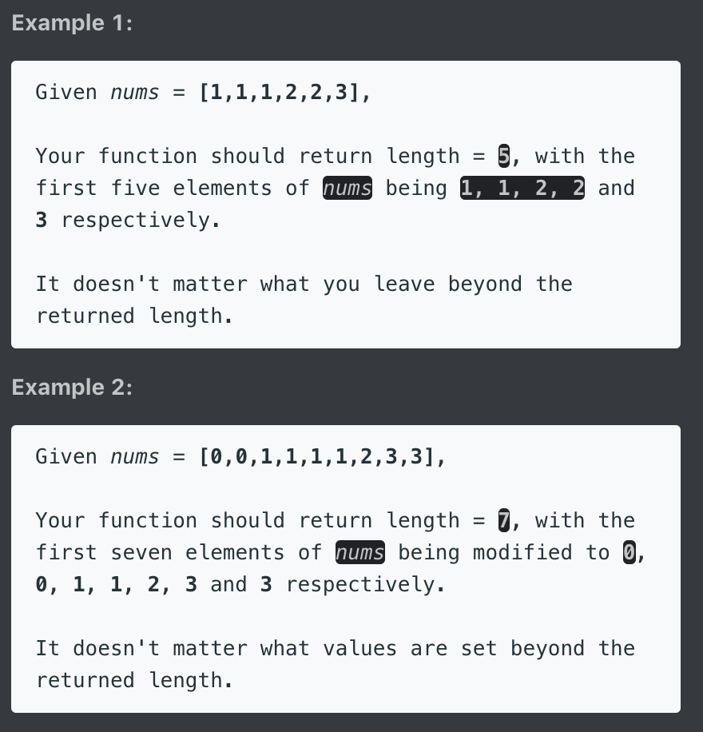

### 思路
Considering add elem into array, except for different element circumstance,
we have to find out the other circumstance to make sure we got __twice__.
The First i == i+1 is the circumstance we look for, so we use a flag to distinguish it.

### Code
``` c
class Solution {
public:
    int removeDuplicates(vector<int>& nums) {
        if (nums.empty())   return 0;
        int res=0;
        bool isExist = false;
        for (int i=0; i < nums.size()-1; i++){
            if (nums[i] != nums[i+1]){
                nums[res++] = nums[i];
                isExist = false;
            }
            else{
                if (!isExist){ // if i == i+1 but is the first two elem
                    nums[res++] = nums[i];
                    isExist = true;
                }
            }
        }
        nums[res++] = nums[nums.size()-1]; // add the last elem
        return res;
    }
};
```
---
## 189. Rotate Array｜ 7/12
Given an array, rotate the array to the right by k steps, where k is non-negative.


### 思路
為了讓取代的動作能夠持續地進行,
當我們這個state取代了某個數,
某個數就是下一輪即將取代別人的數.


How to change the elem?

    idx -> (idx + k) % n

Note: be careful for deadlock like
     e.g. [1,2,3,4] k=2
     start at idx = 0
     i=0: idx = 2
     i=1: idx = 0  // we can increase from 0 to 1 to avoid deadlock
     i=2: idx = 2
         .....

### Code
空間複雜度(1)的方法：
``` c
class Solution {
public:
    void rotate(vector<int>& nums, int k) {
        if (nums.empty() || k % nums.size() == 0)   return;
        int now = 0, next = nums[0], start = 0, idx = 0, n = nums.size();
        for (int i=0; i<n; i++){
            now = next; // assign the replacing value for this round
            idx = (idx+k) % n; // calc the position to be replaced
            next = nums[idx]; // stored the replaced value, which will be used for next round
            nums[idx] = now; // replacing the value

            // deadlock avoidance
            if (idx == start){
                start++;
                idx = start;
                next = nums[idx];
            }
        }
    }
};
```

時間複雜度低的方法：
``` c
class Solution {
public:
    void rotate(vector<int>& nums, int k) {
        vector<int> t = nums;
        for (int i = 0; i < nums.size(); ++i) {
            nums[(i + k) % nums.size()] = t[i];
        }
    }
};
```
---
## 41. First Missing Positive｜ 7/12


### 思路
We can't sort or find because of O(n) time limit.
So we use swap and array's index to solve.
We can know which is the least elem by refering to the index.
value 1 should be put at index = 0, value 5 at idx=4
value k at idx = nums[k-1]
after the positioning, we can find out the least postive int by walking through.

Note: might consider the range of the array otherwise overflowing.

### Code
``` c++
class Solution {
public:
    int firstMissingPositive(vector<int>& nums) {
        int n = nums.size();
        for (int i=0; i< n; i++){
            while (nums[i] > 0 && nums[i] <= n && nums[i] != nums[nums[i]-1]){
                swap (nums[i], nums[nums[i] -1]);
            } // positioning elem which >0 and <n at the 'right' position

        }
        for (int i=0; i< n; i++){
            if (nums[i] != i+1) return i+1;
        }
        return n+1;
    }
};
```
---
## 299. Bulls and Cows｜ 7/15 | [ Review * 1 ]
You are playing the following Bulls and Cows game with your friend: You write down a number and ask your friend to guess what the number is. Each time your friend makes a guess, you provide a hint that indicates how many digits in said guess match your secret number exactly in both digit and position (called "bulls") and how many digits match the secret number but locate in the wrong position (called "cows"). Your friend will use successive guesses and hints to eventually derive the secret number.

Write a function to return a hint according to the secret number and friend's guess, use A to indicate the bulls and B to indicate the cows.

Please note that both secret number and friend's guess may contain duplicate digits.


### 解題分析
1. Intuitive
    1. 必須儲存可使用的數量, e.g.: secret = "1123", guess = "0111", Output: "1A1B", 而不是 1A2B!
        - 所以在加 B 的數量的時候也要去判斷是否 useup 了
    2. 也有可能 secret = "2331", guess = "1231", 第一個 1 會先被判定成 B, 而最後一個 1 卻是 A, 此時要把 greedy 加上去的 B 給去掉
            - 所以在加完 A 的時候也要去判斷一下是否要把先加上去的扣回來
2. One pass
    1. 在上面那個解法中我們必須先 initial counter, 目的就是為了先把 secret 統計完, 目的是
        1. 讓新進來的 guess 知道, secret 有包含這個數字哦
            1. 有可以分成兩種情況, secret 先出了此數字 or guess 先出了此數字
        2. 因此我們如果要邊 count 邊做, 我們必須要能夠處理這兩種狀態
    2. 方法:
        1. 我們對於每個 secret 我們都讓他在字典裡 +1, (與上面的 counter 作法一樣)
        2. 不一樣的事, 我們對於每個 guess 都讓他在字典裡 -1
        3. 然後再判定 cow 是否要 +1 時,
            1. if h[s] < 0 -> 會通過這個 if 表示 guess 之前有出現過這個字, 只是 secret 的此數字還在後面而已, 因此要 cow要+1
            2. if h[g] > 0 -> 會通過這個 if 表示 secret 之前有出現過這個字, 只是 guess 的此數字還在後面而已, 因此 cow 也要 +1

### 思路
We firstly defined the conduct of the secret and guess in the map:
  - for secret: We Count it, so used the 'add' operation to define.
  - for guess : We Use it, so used the 'minus' operation to define.

Therefore, we can use only one for-loop to solve this question.
After the bull determine, we do the cow determine.
In the i round:
    If the number of the scret in the map is smaller than 0,
    means it showed in the guess before. We add the cows.
    But don't forget to Count or add to map.

    if the number of the guess in the map is larger than 0,
    means it showed in the secret before. We also add the cows.
    But don't forget to Use or minus to map.

Note:
remind, if (k++ > 0) , equal to determine if k is larger than 0 and no matter what the result is k+=1 after the determination.
remind, if (++k > 0) , equal to do k+=1 first, and determine if the k+=1 is larger than 0

### Code
Two Pass Intuitive
```py
class Solution:
    def getHint(self, secret: str, guess: str) -> str:
        counts = Counter(secret)

        bull, cow = 0, 0
        for i, c in enumerate(guess):
            if c in counts:
                if secret[i] == c:
                    bull += 1
                    if counts[c] <= 0: # use up the same char
                        cow -= 1
                else:
                    if counts[c] > 0:
                        cow += 1
                counts[c] -= 1
        return f"{bull}A{cow}B"
```

One Pass, Count During Processing (Optimal)
```py
class Solution:
    def getHint(self, secret: str, guess: str) -> str:
        cow, bull = 0, 0
        counts = [0 for _ in range(10)]

        for i in range(len(secret)):
            s = int(secret[i])
            g = int(guess[i])

            if s == g:
                bull += 1
            else:
                if counts[s] < 0:
                    cow += 1
                if counts[g] > 0:
                    cow += 1

                counts[s] += 1
                counts[g] -= 1
        return f"{bull}A{cow}B"
```

Advanced way:
``` c
class Solution {
public:
    string getHint(string secret, string guess) {
        int bull = 0, cow = 0;
        int m[10] = {0}; // question assumed all the input is digit
        for (int i=0; i < secret.size(); i++){
            if (secret[i] == guess[i])  bull++;
            else{
                if ( m[secret[i]-'0']++ < 0 ) cow++; // if showed in the guess before
                if ( m[guess[i]-'0']-- > 0 )  cow++; // if showed in the secret before
            }
        }
        return to_string(bull) + "A" + to_string(cow) + "B" ;
    }
};
```

Basic way:
``` c
class Solution {
public:
    string getHint(string secret, string guess) {
        int m[256] = {0}, bulls = 0, cows = 0;
        for (int i = 0; i < secret.size(); ++i) {
            if (secret[i] == guess[i]) ++bulls;
            else ++m[secret[i]];
        }
        for (int i = 0; i < secret.size(); ++i) {
            if (secret[i] != guess[i] && m[guess[i]]) {
                ++cows;
                --m[guess[i]];
            }
        }
        return to_string(bulls) + "A" + to_string(cows) + "B";
    }
};
```
### Tag: #HashTable #Counter
---
## 134. Gas Station｜ 7/16 | [ Review * 1 ]
There are N gas stations along a circular route, where the amount of gas at station i is gas[i].

You have a car with an unlimited gas tank and it costs cost[i] of gas to travel from station i to its next station (i+1). You begin the journey with an empty tank at one of the gas stations.

Return the starting gas station's index if you can travel around the circuit once in the clockwise direction, otherwise return -1.

Note:

If there exists a solution, it is guaranteed to be unique.
Both input arrays are non-empty and have the same length.
Each element in the input arrays is a non-negative integer.


### 解題分析
1. 什麼是最可能的起點?
    - **累積損失最多的節點之後的那個點**
    - why? 因為我們不希望我們中途就壞掉, 因此我們要期待從這點開始往後走之後能得到更多的油
2. 技巧:
    - 使用 `idx+1 % length` 來去做到 circular indexing. i.e. last index+1 % length == 0


### 思路
Assumed that we walk from station 0 to 3, then blocked at 4,
We don't have to try to start from point 1 or 2 or 3, CUZ:
the past path gives us more gas to pass the 4, but we still fail,
then start from 1,2,3 means we have less gas than start from 0.
Therefore, everytime we met the failure circumstance,
we start from the next station of the failure station.


If we start from 4 then We don't need to back to walk through 0123,
we just need to make sure the total fuel minus total cost of gas is >= 0,
if it is true, then sure the circuit is true; otherwise is false.


### Code
Python Easy Understand Solution
```py
class Solution:
    def canCompleteCircuit(self, gas: List[int], cost: List[int]) -> int:
        minimum, minimumIndex = float(inf), -1
        total = 0

        for i in range(len(gas)):
            total += gas[i] - cost[i]

            if total < minimum:
                minimum = total
                minimumIndex = i

        return -1 if total < 0 else (minimumIndex + 1) % len(gas) # to perform circular index
```

``` c
class Solution {
public:
    int canCompleteCircuit(vector<int>& gas, vector<int>& cost) {
        int net = 0; // net profit n. 淨利 (or total)
        int sum = 0; // current sum of net fuel
        int start = 0; // the start of path
        for (int i=0; i< gas.size(); i++){
            net += gas[i] - cost[i];
            sum += gas[i] - cost[i];
            if (sum < 0){
                start = i+1;
                sum = 0;
            }
        }
        return (net >= 0) ? start : -1;
    }
};
```
### Tag: #Greedy #Array
---
## 274. H-Index｜ 7/16 | [ Review * 1 ]
Given an array of citations (each citation is a non-negative integer) of a researcher, write a function to compute the researcher's h-index.

According to the definition of h-index on Wikipedia: "A scientist has index h if h of his/her N papers have at least h citations each, and the other N − h papers have no more than h citations each."


### 解題分析

1. Typical Sort
    1. 我們想要知道他到底有幾分 paper citation 是夠多的, 因此我們可以先將他的論文依照 citation 從大到小排序
    2. 並開始 for 迴圈, 此時的 index 即可以視為 "目前數過的 paper 數", n 跟 citation 的關係就可以解讀為, 有 n 份 paper 其引用數大於等於 citation
        - 
    3. 因此便可以直接寫出第一種解法

2. Counting Sort
    1. 那麼如果要優化此種做法只有採取更有效率的排序，也就是 counting sort
    2. 但 counting sort 的前提是我們陣列中元素的大小不能超過陣列大小
    3. 然而我們發現即便把那些大於 陣列大小的元素通通變小到陣列大小, 其答案還是不變, 因此可以採用 counting sort
        - 

### 思路
按照如下方法確定某人的H指數：
1、將其發表的所有SCI論文按被引次數從高到低排序；
2、從前往後查找排序後的列表，直到某篇論文的序號大於該論文被引次數。所得序號減一即為H指數。
我也就沒多想，直接按照上面的方法寫出了代碼：

### Code
Typical sort
```py
class Solution:
    def hIndex(self, citations: List[int]) -> int:
        citations = sorted(citations, reverse=True)

        for n, citation in enumerate(citations):
            if n >= citation:
                return n
        return len(citations)
```

Counting Sort
```py
class Solution:
    def hIndex(self, citations: List[int]) -> int:
        n = len(citations)
        counts = [0 for _ in range(n+1)] # index is the citation_count, i.e: counts[1] = 5 -> citation 為 1 的有 5 篇

        for c in citations:
            counts[min(n, c)] += 1

        paper_sum = 0
        for citation in range(n, -1, -1):
            paper_sum += counts[citation]
            if paper_sum >= citation:
                return citation
        return len(citations)
```

``` c
class Solution {
public:
    int hIndex(vector<int>& citations) {
        sort(citations.begin(), citations.end(), greater<int>());
        for (int i=0; i < citations.size(); i++){
            if ( i >= citations[i]) return i;
        }
        return citations.size();
    }
};
```
### Tag: #CountingSort #Sort
---
## 243. Shortest Word Distance ($)｜ 7/17
Given a list of words and two words word1 and word2, return the shortest distance between these two words in the list.

For example,
Assume that words = ["practice", "makes", "perfect", "coding", "makes"].

Given word1 = “coding”, word2 = “practice”, return 3.
Given word1 = "makes", word2 = "coding", return 1.

Note:
You may assume that word1 does not equal to word2, and word1 and word2 are both in the list.


### 思路
1. Naive solution is to memorize the index of each words.

2. We can optimize our solution with only one for-loop,
To do so, we can't memorize the index of each matching words,
instead we should calculate the min distance when we walk through the array.

We need two value to calculate the min distance, but we can use "i" as one value.
therefore, we just need to allocate one other variable idx.

### Code

Naive Solution:
``` c
class Solution {
public:
    int shortestDistance(vector<string>& words, string word1, string word2) {
        vector<int> idx1, idx2;
        int res = INT_MAX;
        for (int i=0; i < words.size(); i++){
          if (words[i] == word1)  idx1.push_back(i);
          else if (words[i] == word2) idx2.push_back(i);
        }

        for (int i=0; i < idx1.size(); i++){
          for (int j=0; j < idx2.size(); j++){
            res = min(res, abs(idx1[i]-idx2[j]));
          }
        }
        return res;
    }
};
```

Optimize Solution:
``` c
class Solution {
public:
    int shortestDistance(vector<string>& words, string word1, string word2) {
        int idx = -1, res = INT_MAX;
        for (int i=0; i < words.size(); i++){
          if (words[i] == word1 || words[i] == word2){
            if (idx != -1 && words[i] != words[idx]){
              res = min(res, i - idx );
            }
            idx = i; // update the idx fowardly
          }
        }
        return res;
    }
};

```
---
## 217. Contains Duplicate｜ 7/18 | [ Review * 1 ]
Given an array of integers, find if the array contains any duplicates.

Your function should return true if any value appears at least twice in the array, and it should return false if every element is distinct.


### 思路
Sort Solution 99% for time, 99% for space

### 類似題

LC136

### Code
```py
class Solution:
    def containsDuplicate(self, nums: List[int]) -> bool:
        return len(set(nums)) < len(nums)
```

Hash map solution:
``` c
class Solution {
public:
    bool containsDuplicate(vector<int>& nums) {
        unordered_map<int, int> m;
        for (int i=0; i < nums.size(); i++){
            if (m.find(nums[i]) != m.end()) return true;
            ++ m[nums[i]];
        }
        return false;
    }
};
```

Sort solution:
class Solution {
public:
    bool containsDuplicate(vector<int>& nums) {
        if (nums.empty())   return false;
        sort(nums.begin(), nums.end());
        for (int i=0; i<nums.size()-1; i++){
            if (nums[i] == nums[i+1])   return true;
        }
        return false;
    }
};
### Tag: #Set
---
## 55. Jump Game｜ 8/8 | [ Review * 1 ]
Given an array of non-negative integers, you are initially positioned at the first index of the array.

Each element in the array represents your maximum jump length at that position.

Determine if you are able to reach the last index.


### 解題分析
0. 可以去看 leetcode 的 solution, 演示了整個 thinking process (包含從 DP 的想法)
    - https://leetcode.com/problems/jump-game/solution/
1. 先思考, 如何定義 fail case?
    - 當當前的 index > max_jump that you can make from begin
2. 在思考, 如何定義 success?
    - 一種, 走完所有元素都沒有 fail
    - 一種, 當 max_jump 已經 > 陣列最後元素index時
3. 如何更新 max_jump?
    - i + nums[i]

### 思路
1. We care about the farthest distance we can reach.
2. the goal distance is n-1
3. how to determine that we can't walk further? next point's idx > max reach right now

We keep checking if we reach the goal in every iteration,
we can stop looping if 1. we reach the goal, or 2. we can't move.
we keep updating the farthest position in every iteration.

### Code
```py
class Solution:
    def canJump(self, nums: List[int]) -> bool:
        max_jump = 0
        for i, jump in enumerate(nums):
            if i > max_jump: # the max_jump from begin cannot reach this index
                return False
            max_jump = max(max_jump, i+jump)
        return True
```

寫的複雜一點的 DP
```py
class Solution(object):
    def canJump(self, nums):
        length = len(nums)
        dp = [0] * length

        dp[0] = nums[0]

        for i in range(1, length - 1):

            if dp[i - 1] < i:
                return False

            dp[i] = max(i + nums[i], dp[i - 1])

            if dp[i] >= length - 1:
                return True

        return dp[length - 2] >= length - 1
```

``` c
bool canJump(vector<int>& nums) {
    int n = nums.size(), reach = 0;
    for (int i=0; i < n-1; i++) {
        if (i > reach || reach >= n-1)  break;
        reach = max(reach, i+nums[i]);
    }
    return reach >= n-1;
}
```
### Tag: #Greedy
---
## 45. Jump Game II｜ 8/10 | [ Review * 1 ]
Given an array of non-negative integers, you are initially positioned at the first index of the array.

Each element in the array represents your maximum jump length at that position.

Your goal is to reach the last index in the minimum number of jumps.


### 解題分析
1. 我們用兩個 ptr, left 跟 riht, left 初始為0, right 初始化為第一個元素
2. 每個 step 我們都去尋找 left right 這個區間內最大的 step
3. 把 left 更新為 right, right 則更新為這個區間內找到最大的 step
4. r 每次都跨最大步的那步 + l 的持續檢查 window 就可以保證我們用最短的步伐到達終點

### 思路
We should use the Greedy's opinion to solve this question.
Predict the farthest destination this step can be (if not reach the goal).
Then calculate if there is opportunity to goal in next step between the last farthest step to this farthest step.
If there is, then the solution is don't go that far in this step, shorten it then move with the goal process.
If there is not, we still can find the farthest position we can reach.


### 類似題
1. LC 1326
2. LC 1024

### Code
```py
class Solution:
    def jump(self, nums: List[int]) -> int:
        if len(nums) <= 1: return 0

        l, r, step = 0, 0, 0
        while r < len(nums)-1:
            l, r = r, max(i+nums[i] for i in range(l, r+1))
            step += 1
        return step
```

``` c++
class Solution {
public:
    int jump(vector<int>& nums) {
        int n = nums.size();
        int cur = 0, res = 0, i = 0;
        while (i < n-1){
            res ++;
            int pre = cur; // setting the limitation of distance can walk
            for (; i <= pre; i++){
                cur = max(cur, i+nums[i]); // walk through, get the max distance it can reach for next round
                if (cur >= n-1) return res;
            }
        }
        return res; // question assume always reach the last index
    }
};
```
### Tag: #Greedy #TwoPointer #SlidingWindow
---
## 1306. Jump Game III｜ 4/24
Given an array of non-negative integers arr, you are initially positioned at start index of the array. When you are at index i, you can jump to i + arr[i] or i - arr[i], check if you can reach to any index with value 0.

Notice that you can not jump outside of the array at any time.

Example 1:

Input: arr = [4,2,3,0,3,1,2], start = 5

Output: true

Explanation:
- All possible ways to reach at index 3 with value 0 are:
- index 5 -> index 4 -> index 1 -> index 3
- index 5 -> index 6 -> index 4 -> index 1 -> index 3

Example 2:

Input: arr = [4,2,3,0,3,1,2], start = 0

Output: true

Explanation:
- One possible way to reach at index 3 with value 0 is:
- index 0 -> index 4 -> index 1 -> index 3

Example 3:

- Input: arr = [3,0,2,1,2], start = 2
- Output: false
- Explanation: There is no way to reach at index 1 with value 0.

Constraints:

- 1 <= arr.length <= 5 * 104
- 0 <= arr[i] < arr.length
- 0 <= start < arr.length

### 解題分析
1. 由 brute force 開始思考: 從 start 依序開始拜訪
2. 避免重複拜訪 -> Memorization


### Code
DFS
```py
class Solution:
    def canReach(self, arr: List[int], start: int) -> bool:
        if 0 <= start < len(arr):
            if arr[start] == 0:
                return True
        else:
            return False
        if arr[start] != -1:
            step = arr[start]
            arr[start] = -1
            return self.canReach(arr, start+step) or self.canReach(arr, start-step)
```

BFS
``` py
class Solution:
    def canReach(self, arr: List[int], start: int) -> bool:
        goal = set(i for i in range(len(arr)) if arr[i] == 0)
        visited = set()
        layer = [start]
        while layer:
            next_layer = []
            for idx in layer:
                forward, backward = idx + arr[idx], idx - arr[idx]
                if forward < len(arr):
                    if forward in goal:
                        return True
                    elif forward not in visited:
                        visited.add(forward)
                        next_layer.append(forward)
                if 0 <= backward:
                    if backward in goal:
                        return True
                    elif backward not in visited:
                        visited.add(backward)
                        next_layer.append(backward)
            layer = next_layer
        return False
```

### Tag: #BFS, #DFS
---
## ***[Start to preparing for FB interview]***
src 1: https://docs.google.com/document/d/1dlUOwN6ybeFb6PVMJdQF0QXoV6XYgchRhajNgu_LaRs/
from : https://www.1point3acres.com/bbs/interview/facebook-software-engineer-499038.html

重複出現: 273, 143, 253, 278, 560, 116, 117, 160
之後要重做: 34, 297, 101, 21. 23, 543, 243, 301(Hard)

---
## 273. Integer to English Words｜ 8/10
Convert a non-negative integer to its english words representation. Given input is guaranteed to be less than 2^31 - 1.


Follow up:
what if we want to print the number in reverse order without reversing the number itself.
For example, in this case : 124 will be given as input and output should be four hundred twenty one?
Constraint here is you are not allowed to reverse the number.

### 思路
Easy solution:
very easy!

Difficult solution:
1. 2^10 is 1000, 2^30 is 1000^3, num not greater than trillion, we can used up to billion
2. 3-digit each time -> translate 3-digit
    list the basic translation: 1~19 and 20~90
    deal with tenth number first, then put on hundred number
    deal with 0, 00, 000 case
        1. used ""
        2. res = t > 19 ? v2[t/10] + " " + v1[d] : v1[t]; -> WRONG; redundant space if d=0

3. check if the back has space
4. check if the input is zero

### Code
Directly & easy & fast solution:
``` c
class Solution {
 public:
    string digits[20] = {"Zero", "One", "Two", "Three", "Four", "Five", "Six", "Seven", "Eight", "Nine", "Ten", "Eleven", "Twelve", "Thirteen", "Fourteen", "Fifteen", "Sixteen", "Seventeen", "Eighteen", "Nineteen"};
    string tens[10] = {"Zero", "Ten", "Twenty", "Thirty", "Forty", "Fifty", "Sixty", "Seventy", "Eighty", "Ninety"};

    string int2string(int n) {
        if (n >= 1000000000) {
            return int2string(n / 1000000000) + " Billion" + int2string(n % 1000000000);
        } else if (n >= 1000000) {
            return int2string(n / 1000000) + " Million" + int2string(n % 1000000);
        } else if (n >= 1000) {
            return int2string(n / 1000) + " Thousand" + int2string(n % 1000);
        } else if (n >= 100) {
            return int2string(n / 100) + " Hundred" + int2string(n % 100);
        } else if (n >= 20) {
            return  " " + tens[n / 10] + int2string(n % 10);
        } else if (n >= 1) {
            return " " + digits[n];
        } else {
            return "";
        }
    }

    string numberToWords(int num) {
        if (num == 0) {
            return "Zero";
        } else {
            string ret = int2string(num);
            return ret.substr(1, ret.length() - 1);
        }
    }
};
```

Difficult strategy:
``` c
class Solution {
public:
    string numberToWords(int num) {
        if (num == 0)   return "Zero";
        string res = transHundred(num % 1000);
        vector<string> v = {"Thousand", "Million", "Billion"};
        for (int i=0; i<3; i++){
            num /= 1000;
            res = num % 1000 ? transHundred(num % 1000) + " " + v[i] + " "+ res : res;
        }
        if (res.back() == ' ')  res.pop_back();
        return res;
    }

    string transHundred(int num){
        vector<string> v1 = {"", "One", "Two", "Three", "Four", "Five", "Six", "Seven", "Eight", "Nine", "Ten", "Eleven", "Twelve", "Thirteen", "Fourteen", "Fifteen", "Sixteen", "Seventeen", "Eighteen", "Nineteen"};
        vector<string> v2 = {"","", "Twenty", "Thirty", "Forty", "Fifty", "Sixty", "Seventy", "Eighty", "Ninety"};

        int h = num/100; // hundred digit: 0~9
        int t = num % 100; // ten number: 0~99
        int d = num % 10; // digit: 0~9
        string res;

        // deal with ten number
        res = t > 19 ? v2[t/10] + (d ? " " + v1[d] : "")  : v1[t];
        // put hundred number up
        if (h > 0)
            res = v1[h] + " Hundred" + (t ? " "+ res : "");
        return res;
    }
};
```

Follow up:
```c
class Solution {

    private final String[] belowTen = new String[] {"", "One", "Two", "Three", "Four", "Five", "Six", "Seven", "Eight", "Nine"};
    private final String[] belowTwenty = new String[] {"Ten", "Eleven", "Twelve", "Thirteen", "Fourteen", "Fifteen", "Sixteen", "Seventeen", "Eighteen", "Nineteen"};
    private final String[] belowHundred = new String[] {"", "Ten", "Twenty", "Thirty", "Forty", "Fifty", "Sixty", "Seventy", "Eighty", "Ninety"};

    public String numberToWords(int num) {
        if(num == 0) {
            return "Zero";
        }
        return helper(num);
    }
    public String helper(int num) {
        String result = "";
        int length = (num+"").length();
        if(num < 10) {
            return belowTen[num];
        }
        else if(length < 3) {
            int d1 = num/10 , d2 = num%10;
            if(d2 == 1) {
            	return belowTwenty[d2];
            }
            else {
                result = belowHundred[d2] + " " + belowTen[d1];
            }
        }
        else if(length == 3) {
        		result = helper(num%10) + " Hundred " + helper(num/10);
        }
        else if(length == 4) {
        		result = belowTen[num%10] + " Thousand " + helper(num/10);
        }
        else if(length == 5) {
        		result = helper(num%100) + " Thousand " + helper(num/100);
        }
        else if(length == 6) {
        		result = helper(num%1000) + " Thousand " + helper(num/1000);
        }
        else if(length == 7) {
        		result = belowTen[num%10] + " Million " + helper(num/10);
        }
        else if(length == 8) {
        		result = helper(num%100) + " Million " + helper(num/100);
        }
        else if(length == 9) {
    			result = helper(num%1000) + " Million " + helper(num/1000);
        }
        else if(length == 10) {
    			result = belowTen[num%10] + " Billion " + helper(num/10);
        }
        else if(length == 11) {
    			result = helper(num%100) + " Billion " + helper(num/100);
        }
        else if(length == 12) {
			    result = helper(num%1000) + " Billion " + helper(num/1000);
        }
        return result.trim();
    }
}
```
---
---
## 57. Insert Interval｜ 7/18 | [ Review * 1 ]
Given a set of non-overlapping intervals, insert a new interval into the intervals (merge if necessary).

You may assume that the intervals were initially sorted according to their start times.


### 解題分析
1. 我們分析可能會有多種的 overlap 情況需要去處理, 比較好處理的方法就是透過更新 end 來做延伸
2. 要只關注 end 的話, 我們就必須先處理絕對不會有重疊的狀況, 也就是說我們必須先讓 front 小的進 output (也就是 sort by front 類似的概念)
3. 所以程式的第一部份就是先把 front < new_front 的部分都先放進去
4. 第二部分就要來討論 overlapping 的狀況了, 新的 interval 之於 output 的 end 有幾種狀況:
    1. 完全不重合
    2. 部分重合
    3. 完全重合
    4. 
5. 在這部分我們的目的是要插入 new_interval, 因此完全重合的狀況可以不用討論, 因為就直接被 output[-1] 給完全吃掉了
6. 插入完 new_interval 剩下的部分就是把後面的也都放進來, 我們也是透過延伸 end 去處理後段重合的狀況, 跟上一步的做法類似

### 思路

這道題讓我們在一系列非重疊的區間中插入一個新的區間，可能還需要和原有的區間合併，我們可以對給定的區間集進行一個一個的遍歷比較，那麼會有兩種情況，重疊或是不重疊，不重疊的情況最好，直接將新區間插入到對應的位置即可，重疊的情況比較複雜，有時候會有多個重疊，我們需要更新新區間的範圍以便包含所有重疊，之後將新區間加入結果 res，最後將後面的區間再加入結果 res 即可。具體思路是，我們用一個變量 cur 來遍歷區間，如果當前 cur 區間的結束位置小於要插入的區間的起始位置的話，說明沒有重疊，則將 cur 區間加入結果 res 中，然後 cur 自增1。直到有 cur 越界或有重疊 while 循環退出，然後再用一個 while 循環處理所有重疊的區間，每次用取兩個區間起始位置的較小值，和結束位置的較大值來更新要插入的區間，然後 cur 自增1。直到 cur 越界或者沒有重疊時 while 循環退出。之後將更新好的新區間加入結果 res，然後將 cur 之後的區間再加入結果 res 中即可，

### Code
```py
class Solution:
    def insert(self, intervals: List[List[int]], newInterval: List[int]) -> List[List[int]]:
        output = []
        idx = 0
        n = len(intervals)
        new_start, new_end = newInterval

        while idx < n and new_start > intervals[idx][0]:
            output.append(intervals[idx])
            idx += 1

        # deal with overlap
        if len(output) == 0 or new_start > output[-1][1]: # no overlap
            output.append(newInterval)
        elif new_end > output[-1][1]:
            output[-1][1] = new_end

        # deal with the rest
        while idx < n:
            if output[-1][1] < intervals[idx][0]:
                output.append(intervals[idx])
            elif intervals[idx][1] > output[-1][1]:
                output[-1][1] = intervals[idx][1]
            idx += 1
        return output
```

``` c
class Solution {
public:
    vector<vector<int>> insert(vector<vector<int>>& intervals, vector<int>& newInterval) {
        vector<vector<int>> res;
        vector<int> cur;
        int left=0, n = intervals.size();

        for (int i=0; i<n; i++){
            cur = intervals[i];
            if (newInterval[0] > cur[1]){ // the interval which don't need combination and smaller than newInterval
                left++;
                res.push_back(cur);
            }
            else if (newInterval[1] < cur[0]){ // the interval which don't need combination and larger than newInterval
                continue;
            }
            else{   // combination the interval
                left++;
                newInterval[0] = min(newInterval[0], cur[0]);
                newInterval[1] = max(newInterval[1], cur[1]);
            }
        }
        res.push_back(newInterval);
        for (int i=left; i<n; i++){ // push no combination and larger interval
            res.push_back(intervals[i]);
        }
        return res;
    }
};
```
### Tag: #Interval
---
## 766. Toeplitz Matrix｜ 8/11
A matrix is Toeplitz if every diagonal from top-left to bottom-right has the same element.

Now given an M x N matrix, return True if and only if the matrix is Toeplitz.


Note:

matrix will be a 2D array of integers.
matrix will have a number of rows and columns in range [1, 20].
matrix[i][j] will be integers in range [0, 99].

Follow up:

What if the matrix is stored on disk, and the memory is limited such that you can only load at most one row of the matrix into the memory at once?
What if the matrix is so large that you can only load up a partial row into the memory at once?

### 思路


### Code
Directly Solution:
``` c
class Solution {
public:
    bool isToeplitzMatrix(vector<vector<int>>& matrix) {
        int m = matrix.size(), n = matrix[0].size();
        for (int i=0; i< m-1; i++){
            for (int j=0; j< n-1; j++){
                if (matrix[i][j] != matrix[i+1][j+1]) return false;
            }
        }
        return true;
    }
};
```

Load two row solution:
```c
class Solution {
  public:
      bool isToeplitzMatrix(vector<vector<int>>& matrix) {
        int m = matrix.size();
        for(int i = 0; i < m-1; ++i ){
          vector<int> m1 = matrix[i];
          vector<int> m2 = matrix[i+1];
          m1.pop_back();
          m2.erase(m2.begin());
          if(m1!=m2) return false;
        }
        return true;
      }
   };
```
---
## 143. Reorder List(高頻難題!!)｜ 8/12 | [Review * 1]
Given a singly linked list L: L0→L1→…→Ln-1→Ln,
reorder it to: L0→Ln→L1→Ln-1→L2→Ln-2→…

You may not modify the values in the list's nodes, only nodes itself may be changed.


### 解題分析
1. 因為 LinkedList 無法使用 index 去 access 元素，因此我們必須先把插入的元素以及其順序給排好
2. 這邊首先先用快慢指針找中點的方式找到原始的list以及即將被拿來插入的list
3. 下一步就是去把要被拿來插入的順序給排好，這邊必須 reverse 這個 part
    1. 使用 stack reverse
    2. replace in place
        1. 首先我們必須先明確的切割兩個 list
        2. 因此我們在把 reverse 的開頭記錄下來後，先把第一個 list 給設結束
        3. 然後就使用到 reverse linked list 的模板手法
4. 最後就是依序將這先點穿插插入到 list 中


### 思路
The directly think of way is divided into three steps:
a. find out the mid
b. reverse the nodes after mid
c. insert to the front one intervally

The nodes after the mid need to be reversely add to the front list between original nodes
We can use the stack to imprement the "reverse" idea (First-in-last-out)
We can know exactly how much nodes need to be reversely added by getting the middle index of the stack.

### Code
use stack
```py
class Solution:
    def reorderList(self, head: ListNode) -> None:
        """
        Do not return anything, modify head in-place instead.
        """
        while not head:
            return
        mid = self.findMid(head)
        temp = mid
        stack = []
        while mid.next: # push the next of the mid
            stack.append(mid.next)
            mid.next = mid.next.next
        temp.next = None

        while head and stack:
            top = stack.pop()
            top.next = head.next
            head.next = top
            head = head.next.next

    def findMid(self, head):
        slow, fast = head, head
        while fast and fast.next:
            slow = slow.next
            fast = fast.next.next
        return slow
```

reverse in place
```py
class Solution:
    def reorderList(self, head: ListNode) -> None:
        """
        Do not return anything, modify head in-place instead.
        """
        while not head:
            return
        mid = self.findMid(head)
        ptr = mid.next
        mid.next = None # ended the orig list
        revHead = None # started of the reverse list

        while ptr:
            nxt = ptr.next
            ptr.next = revHead
            revHead = ptr
            ptr = nxt

        while head and revHead:
            nxtRev = revHead.next
            revHead.next = head.next
            head.next = revHead
            head = head.next.next
            revHead = nxtRev

    def findMid(self, head):
        slow, fast = head, head
        while fast and fast.next:
            slow = slow.next
            fast = fast.next.next
        return slow
```

```c
class Solution {
public:
    void reorderList(ListNode* head) {
        if (!head || !head->next || !head->next->next)  return; // testcase: 1 => 1, 1->2 => 1->2
        // use the slow fast pointer to find the mid point
        ListNode* slow = head;
        ListNode* fast = head;
        while (fast->next && fast->next->next){
            slow = slow->next;
            fast = fast->next->next;
        }
        // reverse the list after mid
        ListNode* mid = slow->next;
        slow->next = NULL; // cut off the post-mid list, and add an NULL to list head
        // Now, we have two list: a. head, b. mid
        // Then, we're going to reverse the list mid

        ListNode* insertingList = NULL; // need a new head for reversed list
        while (mid){
            ListNode* temp = mid->next;
            mid->next = insertingList;
            insertingList = mid;
            mid = temp;
        }
        // insert insertingList intervally to the front list(which is head list)
        while (insertingList && head){
            ListNode* next = head->next; // record the inserted node
            head->next = insertingList;  // replace with inserted node
            insertingList = insertingList->next; // iterating the next inserting node of insertingList
            head->next->next = next; // re-connected the head list
            head = next;// iterating the next inserted point of head
        }

    }
};
```

``` c
class Solution {
public:
    void reorderList(ListNode* head) {
        stack<ListNode*> s;
        ListNode* cur = head;
        while (cur){
            s.push(cur);
            cur = cur->next;
        }
        cur = head; // used to point the inserting pos
        int needReverse = (s.size()-1)/2;
        while (needReverse-- > 0){
            ListNode* top = s.top(); s.pop();
            ListNode* next = cur->next; // record the next of inserting point
            cur->next = top; // insert to the point
            top->next = next; // rebuild the link
            cur = next; // move to next inserting point
        }
        s.top()->next = NULL; // required this or it'll form circle
    }
};
```
### Tag: #LinkedList
---
## 67. Add Binary｜ 8/13
Given two binary strings, return their sum (also a binary string).

The input strings are both non-empty and contains only characters 1 or 0.

### 思路
1. should be the same Length
2. insert from front
3. deal with the carry

### Code
``` c
class Solution {
public:
    string addBinary(string a, string b) {
        string res;
        int na = a.length();
        int nb = b.length();
        int n = max(na, nb);
        if (na > nb){
            for (int i=0; i < na - nb; i++) b.insert(b.begin(), '0');
        }
        else if (nb > na){
            for (int i=0; i < nb - na; i++) a.insert(a.begin(), '0');
        }
        bool carry = false;
        for (int i = n-1; i >= 0; i--){
            int sum = 0;
            if (carry){
                sum = ( (a[i]-'0') + (b[i]-'0') + 1);
            }
            else{
                sum = ( (a[i]-'0') + (b[i]-'0'));
            }

            if (sum == 0){
                res.insert(res.begin(), '0');
                carry = false;
            }
            else if (sum == 1){
                res.insert(res.begin(), '1');
                carry = false;
            }
            else if (sum == 2){
                res.insert(res.begin(), '0');
                carry = true;
            }
            else if (sum == 3){
                res.insert(res.begin(), '1');
                carry = true;
            }
        }
        if (carry)  res.insert(res.begin(), '1');
        return res;
    }
};
```
---
## 76. Minimum Window Substring｜ 8/15 | [ Review * 2 ]
Given a string S and a string T, find the minimum window in S which will contain all the characters in T in complexity O(n).


### 解題分析
1. 這裡用了 sliding window 搭配 HashTable 來解題非常漂亮

2. 首先我們把題目拆成兩個部分
    1. 找出一個子字串可以包涵 target
    2. 這個子字串是否可以縮到更小

3. 那麼對於第一個問題我們可以用 Counter + 一個變數 miss 去追蹤
    - 先用 target 去 init 我們的 Counter, 此時 Counter 裡紀錄的正是我們缺乏的元素, miss 的數量也初始化為 target 的長度
    - 接著對於在 t 裡面的新元素我們把其 count -= 1, 再來討論兩種情況
        - 對的元素, 而且我們也缺:
            - miss -= 1
        - 對的元素, 但我們不缺:
            - do nothing

4. 此時如果 miss 已經歸零了, 表示我們找到了所有我們需要的元素, 但這裡面也許包含一些不必要的東西, 因此我們開始縮減 l:
    1. 如果當前長度比 global 還小, 我們更新 res
    2. 如同我們 r 遇到元素就把 count -= 1的操作, 我們這邊要把 l 遇到的元素都 += 1 回去
        - 縮到 target 的元素, 但我們 window 裡還足夠 (count 還是小於等於零)
            - do nothing
        - 縮到 target, 且已經不夠了 (count > 0):
            - miss += 1 -> 去 break while loop, 然後繼續擴展右邊


### 思路
目前在腦子一片漿糊的情況下，我們還是從簡單的例子來分析吧，題目例子中的S有點長，換個短的 S = "ADBANC"，T = "ABC"，那麼肉眼遍歷一遍S唄，首先第一個是A，嗯很好，T中有，第二個是D，T中沒有，不理它，第三個是B，嗯很好，T中有，第四個又是A，多了一個，禮多人不怪嘛，收下啦，第五個是N，一邊涼快去，第六個終於是C了，那麼貌似好像需要整個S串，其實不然，注意之前有多一個A，就算去掉第一個A，也沒事，因為第四個A可以代替之，第二個D也可以去掉，因為不在T串中，第三個B就不能再去掉了，不然就沒有B了。所以最終的答案就"BANC"了。通過上面的描述，你有沒有發現一個有趣的現象，先擴展，再收縮，就好像一個窗口一樣，先擴大右邊界，然後再收縮左邊界，上面的例子中右邊界無法擴大了後才開始收縮左邊界，實際上對於複雜的例子，有可能是擴大右邊界，然後縮小一下左邊界，然後再擴大右邊界等等。這就很像一個不停滑動的窗口了，這就是大名鼎鼎的滑動窗口 Sliding Window 了，簡直是神器啊，能解很多子串，子數組，子序列等等的問題，是必須要熟練掌握的啊！

- 先掃瞄一遍T，把對應的字符及其出現的次數存到 HashMap 中。

- 然後開始遍歷S，就把遍歷到的字母對應的 HashMap 中的 value 減一，如果減1後仍大於等於0，cnt 自增1。

- 如果 cnt 等於T串長度時，開始循環，紀錄一個字串並更新最小字串值。然後將子窗口的左邊界向右移，如果某個移除掉的字母是T串中不可缺少的字母，那麼 cnt 自減1，表示此時T串並沒有完全匹配。


### 類似題
LC 438


### Code
```py
class Solution:
    def minWindow(self, s: str, t: str) -> str:
        miss = len(t)
        miss_cnter = Counter(t)
        min_len = float("inf")
        l = 0
        res = ""

        for r, c in enumerate(s):
            if c in miss_cnter:
                if miss_cnter[c] > 0:
                    miss -= 1
                miss_cnter[c] -= 1

            while miss == 0:
                if r-l+1 < min_len:
                    res = s[l:r+1]
                    min_len = r-l+1

                if s[l] in miss_cnter:
                    miss_cnter[s[l]] += 1
                    if miss_cnter[s[l]] > 0:
                        miss += 1
                l += 1
        return res
```

``` c
/*
The sliding window strategy to solve:
  Current size of the window: right bound - left bound + 1
  The min size of the string: minStr
  The counter to make sure our window contain the string t: cnt
  The current left bound: left
  The current right bound: i
*/
class Solution {
public:
    string minWindow(string s, string t) {
        unordered_map<char, int> windowMap;
        string res = "";
        int minStr = INT_MAX;
        int cnt = 0;
        int left = 0;

        for (char c : t)    windowMap[c]++; // initial our window, telling what we lack now; See The status of Map in note
        for (int i=0; i < s.size(); i++){   // Walk through the string s, broaden & shorten our window at the same time
            // broaden our right-side
            if (-- windowMap[s[i]] >= 0)    cnt++;  // update the current map and cnt

            // if our current window include all the character we require
            while (cnt == t.size()){
                // record the current string if it is shorter than past one
                if (minStr > (i - left + 1) ){
                    minStr = i-left+1;
                    res = s.substr(left, minStr);
                }

                // start to shorten from left
                if (++ windowMap[s[left]] > 0)  cnt--; // means the window lack the required char; after cnt--, we will begin to broaden our right
                left++;
            }
        }
        return res;

    }
};
```
### Tag: #SlidingWindow, #HashTable
---
## 349. Intersection of Two Arrays｜ 8/15 | [Review * 1]
Given two arrays, write a function to compute their intersection.

### 思路
用Hashtable 去操作元素是否存在，以及各數為何
新增進res後可以將映射值還原成0，來避免下次的新增

- follow up:

They ask for the intersection, which has a trivial solution using a hash or a set.

Then they ask you to solve it under these constraints:
O(n) time and O(1) space (the resulting array of intersections is not taken into consideration).
You are told the lists are sorted.

Cases to take into consideration include:
duplicates, negative values, single value lists, 0's, and empty list arguments.
Other considerations might include
sparse arrays.

### Code
```py
class Solution:
    def intersection(self, nums1: List[int], nums2: List[int]) -> List[int]:
        a = set(nums1)
        b = set(nums2)

        inter = a - (a-b)
        return [e for e in inter]
```

Follow-up (two pointer)
```py
class Solution:
    def intersection(self, nums1: List[int], nums2: List[int]) -> List[int]:
        if not nums1 or not nums2:
            return []
        nums1, n1, p1 = sorted(nums1), len(nums1), 0
        nums2, n2, p2 = sorted(nums2), len(nums2), 0

        res = []
        while p1 < n1 and p2 < n2:
            if nums1[p1] == nums2[p2]:
                res.append(nums1[p1])
                p1 += 1
                p2 += 1
                while p1 < n1 and nums1[p1] == nums1[p1-1]:
                    p1 += 1
                while p2 < n2 and nums2[p2] == nums2[p2-1]:
                    p2 += 1
                continue

            if nums1[p1] < nums2[p2]:
                p1 += 1
            else:
                p2 += 1
        return res
```

Built-in python:
```py
def intersection(self, nums1, nums2):
    set1 = set(nums1)
    set2 = set(nums2)
    return list(set2 & set1)
```

self-implement:
```py
class Solution:
    def set_intersection(self, set1, set2):
        return [x for x in set1 if x in set2]

    def intersection(self, nums1, nums2):
        set1 = set(nums1)
        set2 = set(nums2)

        if len(set1) < len(set2):
            return self.set_intersection(set1, set2)
        else:
            return self.set_intersection(set2, set1)
```

優化: 只用一個set, 並去 loop 另一個去尋找是否存在set中
```py
class Solution:
    def intersection(self, nums1: List[int], nums2: List[int]) -> List[int]:
        if len(nums2) > len(nums1):
            return self.intersection(nums2, nums1)

        set1 = set(nums1)
        res = []
        for num in nums2:
            if num in set1:
                res.append(num)
                set1.remove(num)
        return res
```

``` c
class Solution {
public:
    vector<int> intersection(vector<int>& nums1, vector<int>& nums2) {
        vector<int> res;
        unordered_map<int, int> nums1_map;
        for (int i: nums1)   nums1_map[i]++;
        for (int i=0; i < nums2.size(); i++){
            if (-- nums1_map[nums2[i]] >= 0){
                res.push_back(nums2[i]);
                nums1_map[nums2[i]] = 0; // eliminate redundant element
            }
        }
        return res;
    }
};
```

unordered_set solution
``` c
class Solution {
public:
    vector<int> intersection(vector<int>& nums1, vector<int>& nums2) {
        unordered_set<int> m(nums1.begin(), nums1.end());
        vector<int> res;
        for (auto a : nums2)
            if (m.count(a)) {
                res.push_back(a);
                m.erase(a);
            }
        return res;
    }
};
```
### Tag: #Set #TwoPointer
---
## 15. 3Sum｜ 8/18 | [ Review * 2 ]
Given an array nums of n integers, are there elements a, b, c in nums such that a + b + c = 0? Find all unique triplets in the array which gives the sum of zero.

Note:

The solution set must not contain duplicate triplets.


### 解題分析
1. HashTable Solution (based on Two Sum) < *Most Intuitive* >
    1. 仿造 two sum 的解法, 只是這邊不需要回傳 index, 所以這邊只需要用 set 就好不用用到 dict
    2. 處理重複:
        1. 這邊採用直覺的 set, 但除了對 res 加set過濾外, 我們還可以多用一個 val1_dup 去過濾 val1 duplicate 的情形
        2. 這樣可以避免大量重複數的情況 [0,0, 0, 0 ... *3000]
        3. 其餘部分就跟 twoSum1 一樣, 每次都 new 新的 seen
        4. 再加入 res 的時候要將組合排序, 避免順序調換的重複情形沒被偵測到, ps.: tuplize使數組 hashable
    3. Complexity:
        1. Time: O(N^2)
        2. Space: O(N) for hashset

2. HashTable Solution (based on Two Sum) < *2nd Most Intuitive* >
    1. 仿造 two sum 的解法, 只是這邊不需要回傳 index, 所以這邊只需要用 set 就好不用用到 dict
    2. 一樣需要用到 sort 的技巧去規避掉重複元素
        1. 為了避免 index out of range, 我們先判斷後面是否可走 (先while), 再去做 最外層的 i+1
        2. 為了避免 少判斷到重複, 我們有兩種方法:
            1. 先確定`後面`的元素合法才去 +1 -> 使用 `while` (如 hashtable solution)
            2. 保證跟`前面`不一樣才做 -> 可使用 `for` (如 twoPointer solution)
            3. 注意: 不可使用 while + 判斷前面, `while i > 0 and nums[i] == nums[i-1]:`
                1. e.g.: [-1, -1, 2, 3], 這樣第二個 -1 還是不會被過濾掉
    3. Complexity:
        1. Time: O(N^2)
        2. Space: O(N) for hashset

3. Two Pointer Soltion - Fix one two find another two (based on Two Sum II)
    1. 我們先將陣列排序, 排序後就可以用 Two Sum II 的 two pointer 解法去解
    2. 要搭配 Two Sum II, 我們必須先將第一個數固定, 因此我們 iterate over the arr, 選定一個數 nums[i] 後, 把在其右邊的數丟給 twoSum function 去做, 此時 target 即為 -nums[i], 在這邊要跳過 duplicate 的數, 因此如果相鄰兩個數是一樣的, 我們就直接跳過
    3. 那基本上 twoSum function 寫法跟上提一樣, 只是這提要求出所有組合, 因此要改用 res 去存
        1. 還有一點不一樣的是, 這邊同樣也要做重複就跳過的判斷, 因為如果找到同樣的解搭配上故定的 nums[i] 結果還是重複了, 因此要加上重複就跳過的判斷, 那麼要加在哪裡呢?
        2. 不會是前面的 `if` 跟 `elif`, 因為那兩個推進, 就算一樣也不會影響我們的答案, 剩下就只能加在 `找到一組解` 的位置了, 這邊可以選擇判斷 `nums[l] == nums[l-1]`, 或者 r 跟 r+1, 因為只需要一邊不一樣, 就可以保證解會不一樣了
    4. Complexity:
        1. Time: O(N^2)
        2. Space: O(N) to O(logn) for sort

### 思路
對原數組進行排序，然後開始遍歷排序後的數組，這裡注意不是遍歷到最後一個停止，而是到倒數第三個就可以了。這裡可以先做個剪枝優化，就是當遍歷到正數的時候就 break，為啥呢，因為數組現在是有序的了，如果第一個要 fix 的數就是正數了，則後面的數字就都是正數，就永遠不會出現和為0的情況了。然後還要加上重複就跳過的處理，處理方法是從第二個數開始，如果和前面的數字相等，就跳過，因為不想把相同的數字fix兩次。對於遍歷到的數，用0減去這個 fix 的數得到一個 target，然後只需要再之後找到兩個數之和等於 target 即可。用兩個指針分別指向 fix 數字之後開始的數組首尾兩個數，如果兩個數和正好為 target，則將這兩個數和 fix 的數一起存入結果中。然後就是跳過重複數字的步驟了，兩個指針都需要檢測重複數字。如果兩數之和小於 target，則將左邊那個指針i右移一位，使得指向的數字增大一些。同理，如果兩數之和大於 target，則將右邊那個指針j左移一位，使得指向的數字減小一些

### Code
HashTable Solution based on Two Sum I: O(N^2)
(Use Set to avoid duplicate)
```py
class Solution:
    def threeSum(self, nums: List[int]) -> List[List[int]]:
        res, val1_dup = set(), set()

        for i, val1 in enumerate(nums):
            if val1 not in val1_dup:
                val1_dup.add(val1)

                target = -val1
                seen = set()
                for val2 in nums[i+1:]:
                    if target - val2 in seen:
                        res.add(tuple(sorted((val1, val2, target-val2))))

                    seen.add(val2)
        return res
```

HashTable Solution based on Two Sum I: O(N^2)
(Still need to sort in order to eliminate duplicate)
```py
class Solution:
    def threeSum(self, nums: List[int]) -> List[List[int]]:
        nums.sort()
        res = []

        i = 0
        while i < len(nums):
            if nums[i] > 0:
                break
            res += self.twoSum(nums, i)

            while i+1 < len(nums) and nums[i] == nums[i+1]:
                i += 1
            i += 1
        return res

    def twoSum(self, nums, idx):
        target = -nums[idx]
        sets = set()
        res = []
        i = idx+1
        while i < len(nums):
            if target - nums[i] in sets:
                res.append([nums[idx], nums[i], target-nums[i]])
                while i+1 < len(nums) and nums[i] == nums[i+1]: # 先確定後面那個數是可走的
                    i += 1

            sets.add(nums[i])
            i += 1 # 這邊才真的走

        return res
```

(Optimal)
Two Pointer+Sort Solution based on Two Sum II: O(N^2)
```py
class Solution:
    def threeSum(self, nums: List[int]) -> List[List[int]]:
        nums.sort()
        res = []
        for i in range(len(nums)):
            if nums[i] > 0:
                break
            if i == 0 or nums[i] != nums[i-1]:
                res += self.twoSum(nums, i)
        return res


    def twoSum(self, nums, idx):
        res = []
        target = -nums[idx]
        l, r = idx+1, len(nums)-1

        while l < r:
            if nums[l] + nums[r] > target:
                r -= 1
            elif nums[l] + nums[r] < target:
                l += 1
            else:
                res.append([nums[idx], nums[l], nums[r]])
                l, r = l+1, r-1
                while l < r and nums[l] == nums[l-1]: # 選一邊去跳過 duplicate 就可以了，因此同樣也可以去判斷 r 跟 r+1
                    l += 1
        return res
```

``` c
class Solution {
public:
    vector<vector<int>> threeSum(vector<int>& nums) {
        vector<vector<int>> res;
        sort(nums.begin(), nums.end());
        if (nums.size() < 3 || nums.back() < 0 || nums.front() > 0)   return res;

        for (int i=0; i < nums.size() - 2; i++){
            if (nums[i] > 0) break;
            if (i-1 >= 0 && nums[i] == nums[i-1])   continue;
            int target = 0 - nums[i]; // fix one nums and calculate the target of other two sum

            // use two pointer to converage and find if meet the target
            int left = i+1;
            int right = nums.size() - 1;
            while (left < right){
                int sum = nums[left] + nums[right];
                if (sum < target)   left += 1;
                else if (sum > target)   right -= 1;
                else {
                    vector<int> comb;
                    comb.push_back(nums[left]);
                    comb.push_back(nums[i]);
                    comb.push_back(nums[right]);
                    res.push_back(comb);

                    // 思考: 為什麼可以只在裡面做檢查就好
                    while (left < right && nums[left] == nums[left+1])  left++;
                    while (left < right && nums[right] == nums[right-1])    right--;
                    left++;
                    right--;
                } // end of else
            }// end of two pointer
        } // end of for
        return res;
    }
};
```
### Tag: #HashTable #TwoPointer
---
## 278. First Bad Version｜ 8/18
You are a product manager and currently leading a team to develop a new product. Unfortunately, the latest version of your product fails the quality check. Since each version is developed based on the previous version, all the versions after a bad version are also bad.

Suppose you have n versions [1, 2, ..., n] and you want to find out the first bad one, which causes all the following ones to be bad.

You are given an API bool isBadVersion(version) which will return whether version is bad. Implement a function to find the first bad version. You should minimize the number of calls to the API.


### 思路

典型binary search查找邊界問題:

可用茶左邊或右邊兩種解法來解

### Code

Find Left boarder version:
```py
class Solution:
    def firstBadVersion(self, n):
        """
        :type n: int
        :rtype: int
        """
        l, r = 0, n
        while l < r:
            mid = l + (r-l) // 2
            if isBadVersion(mid):
                r = mid
            else:
                l = mid +1
        return l
```

Find Right boarder version:
```py
class Solution:
    def firstBadVersion(self, n):
        """
        :type n: int
        :rtype: int
        """
        l, r = 0, n
        while l < r:
            mid = l + (r-l) // 2 + 1
            if not isBadVersion(mid):
                l = mid
            else:
                r = mid -1
        return r+1
```

``` c
// Forward declaration of isBadVersion API.
bool isBadVersion(int version);

class Solution {
public:
    int firstBadVersion(int n) {
        int left = 0, right = n;
        while (left < right) {
            int mid = left + (right-left)/2;
            if (isBadVersion(mid)) {
                if (mid > 0 && !isBadVersion(mid-1))    return mid;
                else    right = mid;
            }
            else {
                if (mid < n && isBadVersion(mid+1))     return mid+1;
                else    left = mid;
            }
        }
        return left;
    }
};
```
---
## 263. Graph Valid Tree｜ 8/19
Given n nodes labeled from 0 to n - 1 and a list of undirected edges (each edge is a pair of nodes), write a function to check whether these edges make up a valid tree.

For example:

Given n = 5 and edges = [[0, 1], [0, 2], [0, 3], [1, 4]], return true.

Given n = 5 and edges = [[0, 1], [1, 2], [2, 3], [1, 3], [1, 4]], return false.

Hint:

Given n = 5 and edges = [[0, 1], [1, 2], [3, 4]], what should your return? Is this case a valid tree?
According to the definition of tree on Wikipedia: “a tree is an undirected graph in which any two vertices are connected by exactly one path. In other words, any connected graph without simple cycles is a tree.”
Note: you can assume that no duplicate edges will appear in edges. Since all edges are undirected, [0, 1] is the same as [1, 0] and thus will not appear together in edges.
### 思路
find out how the false happened by graph.


_|0|1|2|3|_
0|_|T|_|_|_
1|_|_|T|T|_  conflict!
2|_|_|_|T|_  here !!
3| | | | |_

Note: "HOW to initiate the 2-D array!" => use memset(arr, value, n*n*sizeof(arr))
### Code
``` c
bool validTree(int n, vector<vector<int>> &edges) {
        if (n > 1 && edges.empty())  return false;
        bool check[n+1][n+1];
        memset(check, false, n+1*n+1*sizeof(check));
        for (int i=0; i<edges.size(); i++){
            int first = edges[i][0] + 1;
            int second = edges[i][1] + 1;
            if (first > second) swap(first,second);
            if ((first+1< n+1 && check[first+1][second]) || (first -1 > 1 && check[first-1][second])){
                return false;
            }
            check[first][second] = true;
        }
        return true;
    }
```
---
## 類似263
给一个TreeNode[], 检查是否能形成一颗无cycle的树，可以的话返回root，否则返回null
我用的hashmap存了每个的parent，面完了回想一下不需要hashmap，hashset就可以。
第二题我是这么想的，把node array中的所有node过一遍，current node的两个child如果不是null的话放在hashset里面，
iterate through的过程中如果有child已经在hashset中，证明这个child有两个parent返回null,
node array过完一遍后检查hashset，因为node[]包含的是所有node，检查有哪些没有在hashset里面（没有parent的node），
如果只有一个，那这个就是root
如果一个都没有，那就是有cycle
如果多于1个，就是有好几个root，不是single tree

---
## 791. Custom Sort String｜ 8/19
S and T are strings composed of lowercase letters. In S, no letter occurs more than once.

S was sorted in some custom order previously. We want to permute the characters of T so that they match the order that S was sorted. More specifically, if x occurs before y in S, then x should occur before y in the returned string.

Return any permutation of T (as a string) that satisfies this property.

### 思路
Need to know how many char in a string -> use unordered_map;
technique here: string(int n, char c) -> string s = string(2,'A') => "AA"

Clarify your concept: unordered_map no auto sort for sure

  PLUS: NO guarantee your input order is the output order EITHER!
### Code
``` c
class Solution {
public:
    string customSortString(string S, string T) {
        string res = "";
        unordered_map<char, int> m;
        for (char t: T) m[t]++;     // record the count of c in T
        for (char s: S){
            res += string(m[s], s);
            m[s] = 0;
        }
        for (auto a: m){
            res += string(a.second, a.first);
        }
        return res;
    }
};
```
---
## 173. Binary Search Tree Iterator｜ 8/21 | [ Review * 1 ]
Implement an iterator over a binary search tree (BST). Your iterator will be initialized with the root node of a BST.

Calling next() will return the next smallest number in the BST.

### 思路
這道題主要就是考二叉樹的中序遍歷的非遞歸形式，需要額外定義一個棧來輔助，二叉搜索樹的建樹規則就是左<根<右，用中序遍歷即可從小到大取出所有節點。

Way 1, 參考 https://leetcode.com/problems/binary-tree-inorder-traversal/ 的做法
Way 2, 更加快速
### Code

利用 inorder 的模板
```py
class BSTIterator:

    def __init__(self, root: TreeNode):
        self.stack = []
        self.cur = root

    def next(self) -> int:
        while self.cur:
            self.stack.append(self.cur)
            self.cur = self.cur.left

        top = self.stack.pop()
        self.cur = top.right
        return top.val

    def hasNext(self) -> bool:
        return self.cur or self.stack
```

Intuitive
```py
class BSTIterator:

    def __init__(self, root: TreeNode):
        self.stack = []
        while root:
            self.stack.append(root)
            root = root.left

    def next(self) -> int:
        if not self.stack:
            return
        top = self.stack.pop()
        ret = top.val
        node = top.right
        while node:
            self.stack.append(node)
            node = node.left
        return ret

    def hasNext(self) -> bool:
        return len(self.stack) != 0
```

``` c
class BSTIterator {
private:
    TreeNode* cur;
    stack<TreeNode*> sta;

public:
    BSTIterator(TreeNode* root) {
        cur = root;
    }

    // return the next smallest number
    int next() {
        while (cur){
            sta.push(cur);
            cur = cur->left;
        }
        cur = sta.top(); sta.pop();
        int value = cur->val;
        cur = cur->right;
        return value;
    }

    // return whether we have a next smallest number
    bool hasNext() {
        return cur || !sta.empty();
    }
};
```

Better way:

```c
class BSTIterator {
private:
    stack<TreeNode*> sta;

public:
    BSTIterator(TreeNode* root) {
        findLeft(root);
    }

    // return the next smallest number
    int next() {
        TreeNode* top = sta.top(); sta.pop();
        findLeft(top->right);

        return top->val;
    }

    // return whether we have a next smallest number
    bool hasNext() {
        if (sta.empty())  return false;
        else return true;
    }

    // GO EXTREMELY LEFT!
    void findLeft(TreeNode* root){
        while (root){
            sta.push(root);
            root = root->left;
        }
    }
};
```
### Tag: #Tree
---
## 101 Symmetric tree
follow up: use iterative to do
---
## 160. Intersection of Two Linked Lists｜ 8/21
Write a program to find the node at which the intersection of two singly linked lists begins.

For example, the following two linked lists:


### 技巧

兩個list不一樣是要讓其中一個先走的做法：

```py
for i in range(longerlist.length):
    if i >= longerlist.length - shorterlist.length:
        # comparison here
    else:
        longerlist = longerlist.next
```

### 思路

讓兩個節點從同樣剩餘長度的節點再開始比較即可
從例子一中可以看出來，相同的value的節點並不一定是相同的節點
需要考慮題目非input的skipA, skipB

### Code
``` c
class Solution {
public:
    ListNode* getIntersectionNode(ListNode* headA, ListNode* headB) {
        int lengthA = getLength(headA);
        int lengthB = getLength(headB);

        if (lengthA > lengthB)  return findSame(headA, lengthA, headB, lengthB);
        else return findSame(headB, lengthB, headA, lengthA);

    }

    ListNode* findSame(ListNode* longer, int longerint, ListNode* shorter, int shorterint){
        for (int i=0; i < longerint; i++){
            if ( i >= (longerint-shorterint)){
                // start comparing here
                if (!longer || !shorter)    return NULL;
                if (longer == shorter)  return longer;
                else{
                    longer = longer->next;
                    shorter = shorter->next;
                }
            }
            else{
                // let longer iterate first
                if (longer)
                    longer = longer->next;
            }
        }
        return NULL;
    }
    int getLength(ListNode* root){
        int count = 0;
        while (root){
            count ++;
            root = root->next;
        }
        return count;
    }
};
```
Python
``` py

class Solution(object):
    def getIntersectionNode(self, headA, headB):
        """
        :type head1, head1: ListNode
        :rtype: ListNode
        """
        lengthA = self.getlength(headA)
        lengthB = self.getlength(headB)

        if lengthA >= lengthB:
            return self.getInteraction(headA, headB, lengthA, lengthB)
        else:
            return self.getInteraction(headB, headA, lengthB, lengthA)


    def getInteraction(self, longer, shorter, longl, shortl):
        for i in range(longl):
            if i >= longl-shortl:
                if not longer or not shorter:
                    return None
                if longer == shorter:
                    return longer
                else:
                    longer = longer.next
                    shorter= shorter.next
            else:
                longer = longer.next
        return None


    def getlength(self, node):
        count = 0
        while node:
            count += 1
            node = node.next
        return count
```
---
## 116. Populating Next Right Pointers in Each Node｜ 8/24 | [ Review * 1 ]
You are given a perfect binary tree where all leaves are on the same level, and every parent has two children. The binary tree has the following definition:

struct Node {
  int val;
  Node* left;
  Node* right;
  Node* next;
}
Populate each next pointer to point to its next right node. If there is no next right node, the next pointer should be set to NULL.

Initially, all next pointers are set to NULL.


### 解題分析
1. queue 的解法就是用逐層 BFS
    - 注意連結的方式是當前 node 與 queue 中的下一個點做連結 (不能先 pop 否則迴圈進到下一次時會找錯點)
2. 不用 queue 的方法
    - 因為是完全二叉樹的關係，我們可以站在 parent 的位置往下去調整 node 的連結
    - 最外層的 while 必須是去判斷是否還有下一層，而進入的 while 後把 parent 設為此層
    - 然後就是站在此層，去調整下一層


### 思路
完全二叉樹，所以若節點的左子結點存在的話，其右子節點必定存在，所以左子結點的next指針可以直接指向其右子節點，對於其右子節點的處理方法是，判斷其父節點的next是否為空，若不為空，則指向其next指針指向的節點的左子結點，若為空則指向NULL

p.s. level order should use queue, instead of stack


### Code
queue
```py
from collections import deque
class Solution:
    def connect(self, root: 'Node') -> 'Node':
        if not root: return None
        queue = deque([root])
        while queue:
            level = len(queue)
            for i in range(level):
                curNode = queue.popleft()
                if i < level-1:
                    curNode.next = queue[0]
                else:
                    curNode.next = None

                if curNode.left:
                    queue.append(curNode.left)
                if curNode.right:
                    queue.append(curNode.right)
        return root
```

without queue
```py
class Solution:
    def connect(self, root: 'Node') -> 'Node':
        if not root: return None
        leftmost = root
        parent = None
        while leftmost.left:
            parent = leftmost

            while parent:
                if parent.left:
                    parent.left.next = parent.right
                if parent.next:
                    parent.right.next = parent.next.left
                parent = parent.next

            leftmost = leftmost.left
        return root
```

``` c
class Solution {
public:
    Node* connect(Node* root) {
        if (!root)  return NULL;
        queue<Node*> que;
        que.push(root);

        while (!que.empty()){
            int levelsize = que.size();
            for (int i=0; i<levelsize; i++){
                Node* cur = que.front(); que.pop();
                if (i < levelsize-1){
                    cur -> next = que.front(); // current node point the next node
                }
                else{
                    cur -> next = NULL;
                }

                // update child node
                if (cur->left)  que.push(cur->left);
                if (cur->right) que.push(cur->right);
            }
        }
        return root;
    }
};
```

Solve without queue:
``` c
/*
  use level->left to iterate the level
  to build the connection with the view of parent (seen from top to down)
*/
class Solution {
public:
    Node* connect(Node* root) {
        if (!root)  return NULL;
        Node* level = root;
        Node* parent = NULL;
        while (level->left){
            parent = level;
            while (parent){
                if (parent->left){
                    parent->left->next = parent->right;
                }
                if (parent->next){
                    parent->right->next = parent->next->left;
                }
                parent = parent->next;
            }
            level = level->left;
        }
        return root;
    }
};
```

Recursive way:
``` c
class Solution {
public:
    Node* connect(Node* root) {
        if (!root)  return NULL;
        if (root->left) root->left->next = root->right;
        if (root->right) root->right->next = root->next? root->next->left : NULL;
        connect(root->left);
        connect(root->right);
        return root;
    }
};
```
### Tag: #Tree #BFS
---
## 117. Populating Next Right Pointers in Each Node II｜ 8/24 | [ Review * 1 ]
Given a binary tree

struct Node {
  int val;
  Node* left;
  Node* right;
  Node* next;
}
Populate each next pointer to point to its next right node. If there is no next right node, the next pointer should be set to NULL.

Initially, all next pointers are set to NULL.


### 解題分析
1. 與上題 perfect tree 不一樣的地方在於
    1. leftMost.left 不再保證是下一層的開頭
    2. parent.left, parent.right 不一定存在
2. 因此我們必須透過一個 pointer: `prev` 去找下一個 leftMost & 去串聯
3. 解題
    1. 首先與之前一樣，我們是站在 parent 的位置去調整 child
    2. 我們先初始化 prev 跟 leftMost
    3. 這對這層的每個 parent 我們都分別去處理他們的 left, right
    4. leftMost 只會更新一次, 當 prev 還不存在時遇到的第一個合法的 child, 即為 leftMost
    5. 若 prev 存在了，便開始去串聯 prev 與 current child node
    6. 與上題需要改的地方也就只是更新 leftMost 的時機與 while parent 內的邏輯
4. p.s. 用 queue 的方法詳見上題, 可無痛搬移

### 思路

Non-recursive的方法很好解，並且是116&117的通解
要符合題目要求的constant space，就不能用queue

### Code
Constant Space
```py
class Solution:
    def connect(self, root: 'Node') -> 'Node':
        if not root: return None
        self.leftMost = root

        while self.leftMost:
            parent = self.leftMost
            self.prev = None # next level's prev node
            self.leftMost = None # next level's leftMost

            while parent:
                self.processChild(parent.left)
                self.processChild(parent.right)
                parent = parent.next
        return root

    # processChild(): to set the next leftMost or connect prev to childNode
    def processChild(self, childNode):
        if childNode:
            if not self.prev:
                self.leftMost = childNode
            else:
                self.prev.next = childNode
            self.prev = childNode
```

``` c
class Solution {
public:
    Node* connect(Node* root) {
        if (!root)  return NULL;
        queue<Node*> que;
        que.push(root);

        while (!que.empty()){
            int levelnodes = que.size();
            for (int i=0; i<levelnodes; i++){
                Node* front = que.front(); que.pop();
                if (i < levelnodes-1){
                    front->next = que.front();
                }
                else {
                    front->next = NULL;
                }

                // Update
                if (front->left)    que.push(front->left);
                if (front->right)   que.push(front->right);
            }
        }

        return root;
    }
};
```
### Tag: #Tree
---
## 621. Task Scheduler｜ 8/26 | [ Review * 1 ]
Given a char array representing tasks CPU need to do. It contains capital letters A to Z where different letters represent different tasks. Tasks could be done without original order. Each task could be done in one interval. For each interval, CPU could finish one task or just be idle.

However, there is a non-negative cooling interval n that means between two same tasks, there must be at least n intervals that CPU are doing different tasks or just be idle.

You need to return the least number of intervals the CPU will take to finish all the given tasks.

### 解題分析
1. Greedy
    0. 
    1. 首先我們先找出出現次數最多的那個數的次數, 其 (f-1) * n 及為所至多需要的 idle time
    2. 那麼 task 總數 + idle time 極為所求, 但 idle time 可以被其他的 task 所填入
        - idle -= min( max_cnt -1, freq_n )
            - 這邊之所以要跟 max_cnt-1 比是因為我們最多只有 max_cnt -1 個slot可以填
    3. 最後在 return 時在判斷一下 idle是否大於 0, 決定是否要加即可
2. Math
    0. 
    1. 可以分成兩種情況來討論這題
        1. slots 都被填滿
            - 這樣就直接 return len(tasks)
        2. slots 沒填滿
            - interval 長度 * interval 數量 + 剩餘的
            - 一樣由頻率最大的去分配 slot, 每個 interval 的長度為 (n+1)
            - 總共有 max_cnt - 1 個 slot
            - 最後加上 max_cnt 的數量
3. Follow Up: task 的順序不能變, 且需印出 result
    1. 用 map 去紀錄當前 task 上次出現的時間
    2. print result 用 prev 去比較下個 task 之間要填入多少個 E


### 思路
1.
[AAABBB]
A:3, B:3  Unordered map?
Need sorting => vector<int>

[AAABBBC] n = 2

AB-AB-AB => (2+1)* (3-1)  + 2 = 8

            "AB-" * "2個AB-" + AB

[AAABBBC] n = 3

AB--AB--AB => (3+1)* (3-1)+2 = 10

[AAAAABBBC], n =3

4 * 4 + 1 = 15

Equation: (n+1)* (max_count - 1) + (how_many_max_exist)

=> how_many_char_in_interval * how_many_interval + rest_char

edge case:
[AAABBB] n = 0

Equation: 1*2+2 = 4


- Follow up: return the string and keep the task order
    - https://www.1point3acres.com/bbs/forum.php?mod=viewthread&tid=323827
    - https://www.1point3acres.com/bbs/thread-492747-2-1.html
### Code
Greedy
```py
class Solution:
    def leastInterval(self, tasks: List[str], n: int) -> int:
        sorted_cnter = sorted(Counter(tasks).items(), key=lambda k: k[1])
        max_cnt = sorted_cnter.pop()[1]
        slots = (max_cnt-1) * n

        while sorted_cnter:
            if slots <= 0:
                break
            slots -= min(max_cnt-1, sorted_cnter.pop()[1])
        return len(tasks) + slots if slots > 0 else len(tasks)
```

Math
```py
class Solution:
    def leastInterval(self, tasks: List[str], n: int) -> int:
        cnter = Counter(tasks).items()
        max_cnt = max(cnter, key=lambda k: k[1])[1]
        max_elem_cnt = sum([1 for _, v in cnter if v == max_cnt])

        return max(len(tasks), (n+1) * (max_cnt-1) + max_elem_cnt)
```

FollowUP
```py
class Solution:
    def leastInterval(self, tasks: List[str], n: int) -> int:
        lastUsed = {}
        cur = 0
        for task in tasks:
            if task in lastUsed:
                cur = max(cur+1, lastUsed.get(task) + n)
            else:
                cur += 1
            lastUsed[task] = cur
        return cur
```

FollowUp and print result
```py
class Solution:
    def leastInterval(self, tasks: List[str], n: int) -> int:
        lastUsed = {}
        cur = 0
        res = ""
        for task in tasks:
            prev = cur
            if task in lastUsed:
                cur = max(cur+1, lastUsed.get(task) + n)
            else:
                cur += 1
            lastUsed[task] = cur
            res += (cur - prev - 1) * 'E'
            res += task
        print(res)
        return cur
```


``` c
class Solution {
public:
    int leastInterval(vector<char>& tasks, int n) {
        // count the char
        vector<int> count(26,0);
        for (char task: tasks){
            count[task-'A'] ++;
        }

        // get the max_count

        // sort the vector, no need to care about relationship btw char<->int
        sort(count.begin(), count.end());
        int max_count = count[25];
        int many_max = 0;
        int lens = tasks.size();
        // find how many same counts of max exist
        for (int i=25; i>=0; i--){
            if (count[i] == max_count)  many_max++;
            else break;
        }
        return max(lens, (n+1) * (max_count - 1) + many_max);   // dealing with edge case (n=0)
    }
};
```
### Tag: #Greedy
---
## 136. Single Number｜ 8/26 | [ Review * 1 ]
Given a non-empty array of integers, every element appears twice except for one. Find that single one.

Note:

Your algorithm should have a linear runtime complexity. Could you implement it without using extra memory?


### 思路
XOR solution:
{2,1,4,5,2,4,1}
=> ((2^2)^(1^1)^(4^4)^(5)) => (0^0^0^5) => 5.

Note: 2 ^ 1 ^ 2 = (2 ^ 2) ^ 1 = 0 ^ 1.

Math Solution:

- 2 * (a+b+c) + (a+a+b+b+c) = c

### 類似題
LC217

### Code
Bit Solution
```py
class Solution:
    def singleNumber(self, nums: List[int]) -> int:
        res = 0
        for num in nums:
            res ^= num
        return res
```

Math Solution
```py
class Solution(object):
    def singleNumber(self, nums):
        """
        :type nums: List[int]
        :rtype: int
        """
        return 2 * sum(set(nums)) - sum(nums)
```

``` c
class Solution {
public:
    int singleNumber(vector<int>& nums) {
        if (nums.empty()) return -1;
        unordered_map<int, int> counts; // integer<-> apperance time
        for (int i: nums){
            counts[i] ++;
        }
        for (auto c : counts){
            if (c.second == 1)   return c.first;
        }
        return -1;
    }
};
```

XOR:
```c
class Solution {
public:
    int singleNumber(vector<int>& nums) {
        int res = 0;
        for (int i: nums){
            res = res^i;
        }
        return res;
    }
};
```
### Tag: #Bit #Math
---
## 282. Expression Add Operators｜ 8/26 | [ Review * 1 ]
Given a string that contains only digits 0-9 and a target value, return all possibilities to add binary operators (not unary) +, -, or * between the digits so they evaluate to the target value.

Example 1:

Input: num = "123", target = 6

Output: ["1+2+3", "1*2*3"]

Example 2:

Input: num = "232", target = 8

Output: ["2*3+2", "2+3*2"]

Example 3:

Input: num = "105", target = 5

Output: ["1*0+5","10-5"]

Example 4:

Input: num = "00", target = 0

Output: ["0+0", "0-0", "0*0"]

Example 5:

Input: num = "3456237490", target = 9191

Output: []


Constraints:

- 0 <= num.length <= 10
- num only contain digits.

### 解題分析
1. 如果這題只需要在兩個字中間插入運算元，這題會很簡單，但因為每個數字都可以選擇雨下個數字相連，因此此題 recursion 的部分需要多一個 for-loop
2. 另外為了避免每次都要從 expression 計算 curSum 是否等於 target，我們在每次 recursion 的時候就計算
3. 每個 recursion node 有四種選擇
    1. 與下個數字連接 (繼續 loop)
    2. 加
    3. 減法
    4. 乘法:
        1. 此處更新 curSum 比較不同，需考慮到先乘除後加減的問題: preNum * int(num_str) < -需先計算
        2. 例: 假設前面為 2 + 3, num_str 此時為 4, 並選擇了乘法 -> 2 + 3 * 4, 此時 curSum(=5) 需先減掉 preNum(=3) 再加上乘完的結果
4. 再來就是需要注意過濾掉 leading zero 的部分
5. Time: O(4^N)
    - Explanation:
    - T(N) = 3T(N - 1) + 3T(N - 2) + 3T(N - 3) + .... 3T(0)
    - If we use first digit as an operand, total number of valid expressions would be T(N - 1) x 3. Three accounts
for our three operations. If we use first two digits as an operand, total number of valid expressions would be T(N - 2) x 3 and so on.
    - Now T(N - 1) = 3T(N - 2) + 3T(N - 3) + 3T(N - 4) + .... 3T(0)
    - if we put T(N - 1) in T(N) we'll get
        - T(N) = 3 x 4 ( T(N - 2) + T(N - 3) + T(N - 4) + .... T(0) )
    - If we put T(N - 2) in T(N) we'll get
        - T(N) = 3 x 4^2 ( T(N - 3) + T(N - 4) + T(N - 5) + .... T(0) )

### 思路

Note: 需要注意的是，如果輸入為"000",0的話，容易出現以下的錯誤：

Wrong：["0+0+0","0+0-0","0+0*0","0-0+0","0-0-0","0-0*0","0*0+0","0*0-0","0*0*0","0+00","0-00","0*00","00+0","00-0","00*0","000"]

Should eliminate 00 + 00

Correct：["0*0*0","0*0+0","0*0-0","0+0*0","0+0+0","0+0-0","0-0*0","0-0+0","0-0-0"]

### Code
Optimal
```py
class Solution:
    def addOperators(self, num: str, target: int) -> List[str]:
        res = []
        def recur(num, preNum, curSum, comb):
            if not num:
                if curSum == target:
                    res.append(comb[:])
                return

            for i in range(1, len(num)+1):
                num_str = num[:i]
                if len(num_str) > 1 and num_str[0] == "0":
                    continue

                recur(num[i:], int(num_str), curSum+int(num_str), comb+"+"+num_str)
                recur(num[i:], -int(num_str), curSum-int(num_str), comb+"-"+num_str)

                # 2+3 -> next(*2) -> (2-3) + 3*2
                recur(num[i:], preNum * int(num_str), curSum-preNum+preNum*int(num_str), comb+"*"+num_str)

        for i in range(1, len(num)+1):
            if i > 1 and num[0] == "0":
                continue
            recur(num[i:], int(num[:i]), int(num[:i]), num[:i])
        return res
```

Another optimal solution
```py
class Solution:
    def addOperators(self, num: str, target: int) -> List[str]:
        res = []
        def recur(num, preNum, curSum, comb):
            if not num:
                if curSum == target:
                    res.append(comb[:])
                return

            for i in range(1, len(num)+1):
                num_str = num[:i]
                if len(num_str) > 1 and num_str[0] == "0":
                    continue

                if len(comb) == 0: #first int
                    recur(num[i:], int(num_str), int(num_str), num_str)
                else:
                    recur(num[i:], int(num_str), curSum+int(num_str), comb+"+"+num_str)
                    recur(num[i:], -int(num_str), curSum-int(num_str), comb+"-"+num_str)

                    # 2+3 -> next(*2) -> (2-3) + 3*2
                    recur(num[i:], preNum * int(num_str), curSum-preNum+preNum*int(num_str), comb+"*"+num_str)
        recur(num, None, None, "")
        return res
```

``` c
class Solution {
public:
    vector<string> addOperators(string num, int target) {
        vector<string> res;
        recursive(num, target, 0, 0, "", res);
        return res;
    }

    void recursive(string num, int target, long laststep, long curnum, string out, vector<string>& res){

        if (num.size() == 0 && curnum == target){
            res.push_back(out);
            return;
        }
        // use substring to walk through each number combination from input
        for (int i=1; i<= num.size(); i++){
            string cur = num.substr(0, i);
            if (cur.size() > 1 && cur[0] == '0')    return; // eliminate edge case "00" + 0
            string next = num.substr(i); // update the new num
            if (out.size() > 0){
                recursive(next, target, +stoll(cur), curnum+stoll(cur), out + "+" + cur, res);
                recursive(next, target, -stoll(cur), curnum-stoll(cur), out + "-" + cur, res);
                recursive(next, target, laststep * stoll(cur), (curnum-laststep) + laststep*stoll(cur), out + "*" + cur, res);
                // Multiplication: 1+2*3 => curnum = (1+2), laststep = +2, the correct sum is (1+2-2) + (2*3)
            }
            else{
                recursive(next, target, stoll(cur), stoll(cur), cur, res);
            }

        }
    }
};
```
### Tag: #Recursive
---
## 898. LeftMost One (Lintcode) ｜ 8/26

* @param arr: The 2-dimension array
* @return: Return the column the leftmost one is located

### 思路

Haven't write it yet.

Leetcode don't have this question.
Lintcode need to pay.


### Code
``` java
public int getColumn(int[][] arr) {
    int leftMost = arr[0].length - 1;
    for (int r = 0; r < arr.length; r++) {
        // 每行不用从最右找，而是从之前行的left most找
        leftMost = binarySearch(arr[r], leftMost);
        if (leftMost <= 0) {
            return leftMost;
        }
    }
    return leftMost;
}

// 返回当前行的left most
public int binarySearch(int[] arr, int right) {
    int origRight = right;
    int left = 0;
    while (left + 1 < right) {
        int mid = (right - left) / 2 + left;
        if (arr[mid] == 1) {
            right = mid;
        } else {
            left = mid;
        }
    }
    if (arr[left] == 1) {
        return left;
    }
    if (arr[right] == 1) {
        return right;
    }
    return origRight;
}
```
---
## 301. Remove Invalid Parentheses | Re-do it later

In interview: only need to one valid parentheses

### 思路
### Code
``` c
```
---
## 560. Subarray Sum Equals K｜ 8/27 | [ Review * 1 ]
Given an array of integers and an integer k, you need to find the total number of continuous subarrays whose sum equals to k.

Example 1:

Input:nums = [1,1,1], k = 2

Output: 2

Note:

The length of the array is in range [1, 20,000].

The range of numbers in the array is [-1000, 1000] and the range of the integer k is [-1e7, 1e7].

### 解題分析
1. 此題的最佳解是使用 Prefix Sum 的概念來解題，基礎題詳見 LC560
    1. 維護一個 dict 紀錄之前走過的所有 accumulated sum
    2. 有兩種 case 可以 match 到 target sum
        1. 整條路徑的 match
            - 直接看 curSum 是否為 target
        2. 需截掉某段路的 match
            - 去 curSumHistory 裡面找找看有沒有曾經出現 curSum - target
            - 原理是，如果累積和中曾經出現過這個值，那我們把它截掉後，後半段就會等於 target 了
### 思路
反省：要把題目看完整，整數的範圍是什麼
舉testcase的時候也要包含完整

1. 一開始想用queue去解這題，遇到over target的value就pop，但這題用queue完全行不通

2. 也沒辦法用two pointer來解

原因都是：輸入有包含負整數

當你把數pop掉時，未來有可能出現負數使得"你可以不用pop"
如 [1,2,3,4,-3,4,-3] k=7

當你的queue為[4 3 2 1] 你再來就會把1 pop掉，但其實[-3 4 3 2 1] 是個解。

神解法(紀錄曾經走過的路):


### Code

Prefix Sum
```py
from collections import defaultdict
class Solution:
    def subarraySum(self, nums: List[int], k: int) -> int:
        sumHis = defaultdict(int)
        curSum = 0
        res = 0

        for num in nums:
            curSum += num
            if curSum == k:
                res += 1

            res += sumHis[curSum - k]
            sumHis[curSum] += 1
        return res
```

``` c
class Solution {
public:
    int subarraySum(vector<int>& nums, int k) {
        int res = 0;
        int sum = 0;
        unordered_map<int, int> path;
        path[0] = 1; // not eleminate any number, is also a solution, like [0,3,4] k=7

        for (int i=0; i<nums.size(); i++){
            sum += nums[i];
            res += path[sum - k]; // is there any path I can eleminate, to reach target?
            path[sum]++; // added this path
        }
        return res;
    }
};
```
### Tag: #PrefixSum #Array
---
## 54. Spiral Matrix｜ 8/28 | [ Review * 1 ]
Given a matrix of m x n elements (m rows, n columns), return all elements of the matrix in spiral order.


### 思路
Trick here: HOW TO INITIALIZE 2-D matrix

=> vector<vector<int>> path(row, vector<int> (column, 0));

本來想要用一個跟matrix一樣大小的二維vector去紀錄曾經走過的路線，

後來發現不用這麼麻煩，因為都是很規律地走。

不過也學習到如何初始化二維vector。

回到這題的思路：

這題的關鍵是，知道何時要轉彎，及更重要的，不再走過重複的點

右下左上的行走，分別是一個迴圈

那剩下的問題就剩下，標記走過的路線及何時停止

當往右走完時，再來要往下走，此時就是標記走過的時機，

方法是將上邊界下移一格，這樣再往上走時就不會再走到剛剛走過的這一條。

同理其他邊界。

如果不該超過的邊界，超過了，就是要break的時候了。

### Code
```py
class Solution:
    def spiralOrder(self, matrix: List[List[int]]) -> List[int]:
        ans = []
        si, sj, ei, ej = 0, 0, len(matrix)-1, len(matrix[0])-1

        while si <= ei and sj <= ej:
            if si <= ei and sj <= ej:
                for j in range(sj, ej+1): ans.append(matrix[si][j])
                si += 1

            if si <= ei and sj <= ej:
                for i in range(si, ei+1): ans.append(matrix[i][ej])
                ej -= 1

            if si <= ei and sj <= ej:
                for j in range(ej, sj-1, -1): ans.append(matrix[ei][j])
                ei -= 1

            if si <= ei and sj <= ej:
                for i in range(ei, si-1, -1): ans.append(matrix[i][sj])
                sj += 1

        return ans
```

``` c
/*
    edge case:

    [1],
    [2], => [1,2,3]
    [3]

    [1,2,3] => [1,2,3]
    [] => []
    [2] => [2]
    right -> down -> left -> up
*/
class Solution {
public:
    vector<int> spiralOrder(vector<vector<int>>& matrix) {
        if (matrix.empty() || matrix[0].empty())    return { };
        vector<int> res;
        int row = matrix.size();
        int column = matrix[0].size();

        int bR = column-1, bD = row-1, bL = 0, bU = 0; // set the boundary of each side
        while (true){
            // going right, when we bump into bR, we move the up boundary down.
            for (int i=bL; i <= bR; i++)    res.push_back(matrix[bU][i]);
            if (++bU > bD)  break; // move down the boundary up so that we don't bump into it afterward.

            // going down, when we bump into bD, we move the right boundary left.
            for (int j=bU; j <= bD; j++)    res.push_back(matrix[j][bR]);
            if (--bR < bL)  break;

            // going left, when we bump into bL, we move the down boundary up.
            for (int i=bR; i >= bL; i--)    res.push_back(matrix[bD][i]);
            if (--bD < bU)  break;

            // going up, when we bump into bU, we move the left boundary right.
            for (int j=bD; j >= bU; j--)    res.push_back(matrix[j][bL]);
            if (++bL > bR)  break;
        }
        return res;
    }
};
```

### Tag: #Array
---
## 885. Spiral Matrix III｜ 8/28
On a 2 dimensional grid with R rows and C columns, we start at (r0, c0) facing east.

Here, the north-west corner of the grid is at the first row and column, and the south-east corner of the grid is at the last row and column.

Now, we walk in a clockwise spiral shape to visit every position in this grid.

Whenever we would move outside the boundary of the grid, we continue our walk outside the grid (but may return to the grid boundary later.)

Eventually, we reach all R * C spaces of the grid.

Return a list of coordinates representing the positions of the grid in the order they were visited.


### 思路
1. Right -> Down -> Left -> Up

2. We don't walk for the same steps; our steps inc for each two turn

3. Right * step -> Down * step .....; step += 1 for each two turn.

i. x = [0  ,1  ,0  ,-1]

   y = [1  ,0  ,-1 , 0]

ii. module % 4 => each two turn, cur = (cur+1)%4

ii. when cur is 0 or 2 => we add our step.

iii. for-loop, to express total walk distance

Keep doing this, until the res is full which is R*C big.

### Code
``` c
class Solution {
public:
    vector<vector<int>> spiralMatrixIII(int R, int C, int r0, int c0) {
        vector<vector<int>> res;
        res.push_back({r0, c0}); // the initial step; first time goin to the for-loop need to turn down, so push it first
        int cur=0, step=0;
        int dx[4] = {0, 1, 0, -1};
        int dy[4] = {1, 0, -1, 0};

        while (res.size() < R*C){
            if (cur == 0 || cur == 2)   step++;
            for (int i=0; i<step; i++){
                r0 += dx[cur]; c0 += dy[cur];
                if (r0 >= 0 && r0 < R && c0 >= 0 && c0 < C)
                    res.push_back({r0, c0});
            }
            cur = (cur+1) % 4;
        }
        return res;
    }
};
```
---
## 56. Merge Intervals｜ 8/28 | [ Review * 1 ]
Given a collection of intervals, merge all overlapping intervals.


### 思路

Trick here:
若要排序雙層vector，vector<vector<int>>，default 是按照內層的vector的first element

[[2,5],[1,3]] => [[1,3],[2,5]]

區間合併 基礎題

把第一個區間存入結果中，然後從第二個開始遍歷區間集，如果結果中最後一個區間和遍歷的當前區間無重疊，直接將當前區間存入結果中，如果有重疊，將結果中最後一個區間的 end 值更新為結果中最後一個區間的 end 和當前 end 值之中的較大值，然後繼續遍歷區間集
### Code
```py
class Solution:
    def merge(self, intervals: List[List[int]]) -> List[List[int]]:
        intervals = sorted(intervals) # sort by front
        output = []
        for start, end in intervals:
            if not output or output[-1][1] < start:
                output.append([start, end])
            elif end > output[-1][1]:
                output[-1][1] = end
        return output
```
``` c
class Solution {
public:
    vector<vector<int>> merge(vector<vector<int>>& intervals) {
        vector<vector<int>> out;
        if (intervals.empty())  return out;
        sort(intervals.begin(), intervals.end());
        out.push_back(intervals[0]);

        for (int i=1; i<intervals.size(); i++){
            if (out.back()[1] < intervals[i][0]){
                out.push_back(intervals[i]);
            }
            else {
                out.back()[1] = max(out.back()[1], intervals[i][1]);
            }
        }
        return out;
    }
};
```
---
## ***[Start to Leetcode on high frequency question on tag:Amazon interview]***
---
## 1. Two Sum｜ 8/29  | [ Review * 1 ]
Given an array of integers, return indices of the two numbers such that they add up to a specific target.

You may assume that each input would have exactly one solution, and you may not use the same element twice.

Example:

Given nums = [2, 7, 11, 15], target = 9,

Because nums[0] + nums[1] = 2 + 7 = 9,

return [0, 1].
### 思路


### Code
One path O(n)
```py
class Solution:
    def twoSum(self, nums: List[int], target: int) -> List[int]:
        dic = {}
        for i, num in enumerate(nums):
            if target-num in dic:
                return [i, dic[target-num]]

            dic[num] = i
        raise 'no answer'
```

``` c
class Solution {
public:
    vector<int> twoSum(vector<int>& nums, int target) {
        vector<int> res;
        unordered_map<int, int> diff_map;
        for (int i=0; i<nums.size(); i++){
            diff_map[nums[i]] = i;
        }

        // can't use same value
        for (int i=0; i<nums.size(); i++){
            int diff = target - nums[i]; // i-1 is the fixed number
            if (diff_map[diff] != 0 && diff_map[diff] != i){
                res.push_back(i);
                res.push_back(diff_map[diff]);
                break;
            }
        }
        return res;
    }
};
```
### Tag: #Hashtable
---
## ***[Start to Leetcode with Python]***
---
## 146. LRU Cache｜ 8/29 | [Review * 1]
Design and implement a data structure for Least Recently Used (LRU) cache. It should support the following operations: get and put.

get(key) - Get the value (will always be positive) of the key if the key exists in the cache, otherwise return -1.
put(key, value) - Set or insert the value if the key is not already present. When the cache reached its capacity, it should invalidate the least recently used item before inserting a new item.

The cache is initialized with a positive capacity.

Follow up:
Could you do both operations in O(1) time complexity?

Example:


### 解題分析
1. 用LinkedList來實作 cache 的機制，但為了使新增與刪除更加快速，選擇使用雙頭LinkedList
2. 實作 put:
    1. Put 已存在
        1. 為了 O(1) 找到該資料在LinkedList的位置來`更新值`與`移動到頭`，使用 map 來存 {key: Node}
    2. Put 不存在
        1. 為了讓過舊的資料再刪除時(pop_tail)能一並更新 map(del cache[key]) ，所以 Node 的資料結構要加入 key, value

### 思路

- 用 head 和 tail 去指向linklist的頭尾, 以方便插入新結點以及移除過舊的節點
    - head -> entry -> entry -> entry -> tail
- 用雙向指針去刪除特定節點

### Code
```py
class DLinkedNode():
    def __init__(self):
        self.key = 0
        self.value = 0
        self.prev = None
        self.next = None

class LRUCache():
    def _add_node(self, node):
        """
        Always add the new node right after head.
        """
        node.prev = self.head
        node.next = self.head.next

        self.head.next.prev = node
        self.head.next = node

    def _remove_node(self, node):
        """
        Remove an existing node from the linked list.
        """
        prev = node.prev
        new = node.next

        prev.next = new
        new.prev = prev

    def _move_to_head(self, node):
        """
        Move certain node in between to the head.
        """
        self._remove_node(node)
        self._add_node(node)

    def _pop_tail(self):
        """
        Pop the current tail.
        """
        res = self.tail.prev
        self._remove_node(res)
        return res

    def __init__(self, capacity):
        """
        :type capacity: int
        """
        self.cache = {}
        self.size = 0
        self.capacity = capacity
        self.head, self.tail = DLinkedNode(), DLinkedNode()

        self.head.next = self.tail
        self.tail.prev = self.head


    def get(self, key):
        """
        :type key: int
        :rtype: int
        """
        node = self.cache.get(key, None)
        if not node:
            return -1

        # move the accessed node to the head;
        self._move_to_head(node)

        return node.value

    def put(self, key, value):
        """
        :type key: int
        :type value: int
        :rtype: void
        """
        node = self.cache.get(key)

        if not node:
            newNode = DLinkedNode()
            newNode.key = key
            newNode.value = value

            self.cache[key] = newNode
            self._add_node(newNode)

            self.size += 1

            if self.size > self.capacity:
                # pop the tail
                tail = self._pop_tail()
                del self.cache[tail.key]
                self.size -= 1
        else:
            # update the value.
            node.value = value
            self._move_to_head(node)
```
### Tag: #LinkedList #DoublyLinkedList
---

## 4. Median of Two Sorted Arrays｜ 8/30 | [Review * 1]
There are two sorted arrays nums1 and nums2 of size m and n respectively.

Find the median of the two sorted arrays. The overall run time complexity should be O(log (m+n)).

You may assume nums1 and nums2 cannot be both empty.

Example 1:

nums1 = [1, 3]
nums2 = [2]

The median is 2.0

Example 2:

nums1 = [1, 2]
nums2 = [3, 4]

The median is (2 + 3)/2 = 2.5

### 技巧

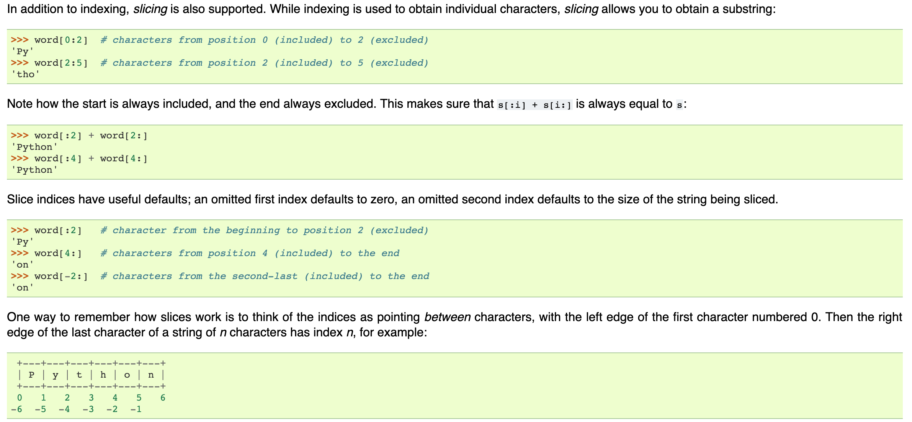

>>> word[0:2]  # characters from position 0 (included) to 2 (excluded)
'Py'
>>> word[2:5]  # characters from position 2 (included) to 5 (excluded)
'tho'
Note how the start is always included, and the end always excluded. This makes sure that s[:i] + s[i:] is always equal to s:
>>> word[:2]   # character from the beginning to position 2 (excluded)
'Py'
>>> word[4:]   # characters from position 4 (included) to the end
'on'
>>> word[-2:]  # characters from the second-last (included) to the end
'on'

 +---+---+---+---+---+---+
 | P | y | t | h | o | n |
 +---+---+---+---+---+---+
 0   1   2   3   4   5   6
-6  -5  -4  -3  -2  -1


### 思路

Binary Search

- https://www.youtube.com/watch?v=LPFhl65R7ww
- 
- Note in binary search right should be set to m, instead of m-1 because mid could be possibly equal to m (when using up all the element in nums1 or nums1 is empty)
- Note should add the *mid > lo* in the condition to avoid empty or index out of range

Recursive approach

這道題要求兩個已經排好序的數列的中位數。中位數的定義：如果數列有偶數個數，那麼中位數為中間兩個數的平均值；如果數列有奇數個數，那麼中位數為中間的那個數。比如{1，2，3，4，5}的中位數為3。{1，2，3，4，5，6}的中位數為（3+4）/ 2 = 3.5。那麼這題最直接的思路就是將兩個數列合併在一起，然後排序，然後找到中位數就行了。可是這樣最快也要O((m+n)log(m+n))的時間複雜度

首先我們來看如何找到兩個數列的第k小個數，即程序中getKth(A, B , k)函數的實現。用一個例子來說明這個問題：A = {1，3，5，7}；B = {2，4，6，8，9，10}；如果要求第7個小的數，A數列的元素個數為4，B數列的元素個數為6；k/2 = 7/2 = 3，而A中的第3個數A[2]=5；B中的第3個數B[2]=6；而A[2]< B[2]；則A[0]，A[1]，A[2]中必然不可能有第7個小的數。因為A[2]< B[2]，所以比A[2]小的數最多可能為A[0], A[1], B[0], B[1]這四個數，也就是說A[2]最多可能是第5個大的數，由於我們要求的是getKth(A, B, 7)；現在就變成了求getKth(A', B, 4)；即A' = {7}；B不變，求這兩個數列的第4個小的數，因為A[0]，A[1]，A[2]中沒有解，所以我們直接刪掉它們就可以了。


### 解題分析

1. Recursive:
    1. 首先我們先試著化簡這題
        1. 如果 A 的大小為零，那麼就是直接回傳 B[k]
        2. 如果 k == 1 就是直接回傳 min(A[0], B[0])
    2. 那麼我們可以來思考如何讓其中一個陣列變為零(or 變小): 篩選掉絕對不可能是答案的值, 直到其中一個陣列變為零 或是 k == 1
    3. 假設 k=7, A[2] < B[2], 那麼 A[0], A[1], A[2] 絕不可能是答案，且絕對是在 "前k小的陣列中"
    4. 根據此種性質我們可以設計我們的演算法:
        1. 條件: A 陣列小於等於 B陣列的 size, 因為我們要滿足條件 lenA == 0, return B[k]
        2. 我們使用 binary search 的概念操作 A 陣列, 我們先取出兩個標的 A[i], B[j]
        3. i=(k // 2)  ;  j=(k-i)
        4. 若 A[i] <= B[j] => 查詢條件變為 A[i:], B, k-i
        5. 反之 => 查詢條件變為 A, B[j:], k-j
    5. 此種算法適合當 k 是奇數的時候， 若 k 是偶數，我們要取出 第k個 跟 第k+1個 做平均

2. Binary Search:
    1. 假設我們知道該如何切割兩個陣列，那麼中位數就可以很容易取出來了
    2. 根據切割點我們可以得到 左半邊(x1, y1), 右半邊(x2, y2) => (舉個例子, 固定B陣列大於A陣列)
        1. 如果今天總長度是奇數 答案就是 minRight <min(x2, y2)> (B陣列大於A陣列的情況下)
        2. 如果今天總長度是偶數 答案就是 maxLeft + minRight 的平均
    3. 再來的目標就是要如何找出正確的 x1, y1, x2, y2
    4. 這四個點有一個原生的關係，x1 < x2; y1 < y2
    5. 那再來要產生的關係就是 x1 <= y2, y1 <= x2, 如此一來加上原生的關係就可以正確的切割左右半邊
    6. 那麼我們這邊就可以採用 **找出特定mid** 的 binarySearch 模板
        1. 我們假設 A[mid] 為 x2, A[mid-1] 為 x1
        2. 因此我們的 mid 是可以超過陣列大小的！(在 A所有元素均小於B的情況下)
        3. 所以我們這邊跟模板不一樣的地方就是 r 要設成模板+1, 也就是 len(A)
        4. 首先我們不停的更新我們的 i, j 直到分好組，(注意這邊要對 i 做限制 i > l, i < r)
        5. 分好組後開始尋找我們的 minRight 跟 maxLeft
        6. 如果有任何一個陣列元素全部用光了，那麼就可以直接找出 minRight, 跟 maxLeft了 (因為會overflow)
        7. 如果是奇數的長度，那麼minRight就可以直接回傳, 否則繼續找出maxLeft, 然後取平均回傳

### Code
Binary Search Aproach
```py
class Solution:
    def findMedianSortedArrays(self, A: List[int], B: List[int]) -> float:
        lenA, lenB = len(A), len(B)
        if lenA > lenB:
            return self.findMedianSortedArrays(B, A)

        half = (lenA+lenB)//2
        l, r = 0, len(A)

        # we let A[i]= x2, A[i-1]= x1
        # B[i]= y2, B[i-1]= y1
        while l <= r:
            i = l + (r-l)//2
            j = half-i

            if i > l and A[i-1] > B[j]:
                r = i-1
            elif i < r and B[j-1] > A[i]:
                l = i+1
            # successfully grouped
            else:
                # find minRight
                if i == lenA:
                    minRight = B[j] # bc A[i] will overflow
                elif j == lenB:
                    minRight = A[i]
                else:
                    minRight = min(A[i], B[j])

                if (lenA + lenB) % 2 !=0 :
                    return minRight

                # find maxLeft
                if i == 0:
                    maxLeft = B[j-1]
                elif j == 0:
                    maxLeft = A[i-1]
                else:
                    maxLeft = max(A[i-1], B[j-1])

                return (maxLeft+minRight) * 0.5
```

Recursive approach:
``` py
class Solution(object):
    def findKth(self, A, B, k):
        lenA = len(A); lenB = len(B)
        # fixed the B is the larger one
        if lenA > lenB:   return self.findKth(B, A, k)

        if lenA == 0:     return B[k-1]
        if k == 1:        return min(A[0], B[0])
        pa = min(k/2, lenA);    pb = k-pa
        if A[pa-1] <= B[pb-1]:
            return self.findKth(A[pa:], B, pb)
        else:
            return self.findKth(A, B[pb:], pa)


    def findMedianSortedArrays(self, nums1, nums2):
        """
        :type nums1: List[int]
        :type nums2: List[int]
        :rtype: float
        """
        lenA = len(nums1); lenB = len(nums2)
        if (lenA+lenB) % 2 == 1:
            return self.findKth(nums1, nums2, (lenA+lenB)/2 +1)
        else:
            return (self.findKth(nums1, nums2, (lenA+lenB)/2) + self.findKth(nums1, nums2, (lenA+lenB)/2+1)) * 0.5
```
### Tag: #BinarySearch

---
## 5. Longest Palindromic Substring｜ 8/31 | [ Review * 1 ]
Given a string s, find the longest palindromic substring in s. You may assume that the maximum length of s is 1000.


### 解題分析
0. Brute Force
    1. 直接嘗試所有 s[i:j] 的所有組合, 並檢查其是否為回文
    2. O(N^3)
1. DP
    1. 思考:
        1. 我們先從所求開始, str = s[i:j] 什麼情況為回文?
        2. 想到回文就要想到, 取出中心區域若是回文, 其前半部、後半部也均為回文
        3. 以例子 "babbab" -> 若以知 "abba" 為回文的狀況下, 又 "b" == "b" -> 其就是回文
    2. 狀態轉移式:
        1. dp[i][j] 為 s[i:j+1] 是否為回文
        2. dp[i][j] = dp[i+1][j-1] and dp[i] == dp[j]
    3. Base Case:
        1. `i == j`: "a" -> 直接為回文
        2. `i+1 == j` and `s[i+1] == s[j]`: "aa" -> 為回文
    4. 如何填表:
        1. 此題 tricky 的 part 就在於我們需要依賴的是未來的結果 (dp[i+1]), 因此我們必須要由後往前填
            - 因此外層 for loop 由後往前
        2. 只需填 右上半部的部份因為 `j >= i`
            - 因此內層 for loop j 由 i 開始填
    5. 例圖:
        - 
    6. 優化:
        - 因為只會用到上一層的結果, 我們就使用模版裡面使用的優化技巧
        - 結果竟然就 AC 了ㄎㄎ
    7. Time (優化後):
        - Time: O(N^2)
        - Space: O(N)


2. TwoPointer
    1. 透過回文的性質: 對稱中央, 來解題
    2. 我們透過把每一個點當作中央, 來向兩邊擴張, 求出此點作為中央可生成多大的回文的`開始點與結束點`
    3. 再將 start, end of 此回文記錄下來供最後回傳
    4. Time:
        - Time: O(N^2)
        - Space: O(1)

3. 馬拉車算法
    - 不想研究ㄎㄎ

### 思路
中心思想就是用迴圈去找到回文的中心點

並把回文長度分成奇數偶數兩個case去看

Time complexity O(n^n)

最佳解：

馬拉車算法

https://www.cnblogs.com/grandyang/p/4475985.html

### 類似題
LC647. Palindromic Substrings

### Code
DP Solution (TLE):
```py
class Solution:
    def longestPalindrome(self, s: str) -> str:
        dp = [[False for _ in range(len(s))] for _ in range(len(s))]
        max_str = ""
        for i in range(len(s)-1, -1, -1):
            for j in range(i, len(s)):
                if i == j:
                    dp[i][j] = True
                elif i+1 == j:
                    dp[i][j] = (s[i] == s[j])
                else:
                    dp[i][j] = (s[i] == s[j] and dp[i+1][j-1])

                if dp[i][j] and j-i+1 > len(max_str):
                    max_str = s[i:j+1]
        return max_str
```

DP Solution with Space Optimize (AC):
```py
class Solution:
    def longestPalindrome(self, s: str) -> str:
        dp = [False for _ in range(len(s))]
        prev = [False for _ in range(len(s))]
        max_str = ""
        for i in range(len(s)-1, -1, -1):
            for j in range(i, len(s)):
                if i == j:
                    dp[j] = True
                elif i+1 == j:
                    dp[j] = (s[i] == s[j])
                else:
                    dp[j] = (s[i] == s[j] and prev[j-1])

                if dp[j] and j-i+1 > len(max_str):
                    max_str = s[i:j+1]
            dp, prev = prev, dp
        return max_str
```

TwoPointer (Optimal)
```py
class Solution:
    def longestPalindrome(self, s: str) -> str:
        self.s = s
        start, end = 0, 0
        for i in range(len(s)):
            even_start, even_end = self.spand_from_center(i, i)
            if even_end-even_start+1 > end-start+1:
                start, end = even_start, even_end
            odd_start, odd_end = self.spand_from_center(i, i+1)
            if odd_end-odd_start+1 > end-start+1:
                start, end = odd_start, odd_end
        return s[start:end+1]

    def spand_from_center(self, l, r):
        s = self.s
        while l >= 0 and r < len(s) and s[l] == s[r]:
            l, r = l-1, r+1
        return l+1, r-1 # last state
```

TwoPointer(Naive):
``` py
class Solution(object):
    def longestPalindrome(self, s):
        res = ""
        """
        :type s: str
        :rtype: str
        """
        for i in range(len(s)):
            # check odd case
            temp = self.checkLR(s, i, i)
            if len(temp) > len(res):
                res = temp

            # check even case
            temp = self.checkLR(s, i, i+1)
            if len(temp) > len(res):
                res = temp

        return res

    def checkLR(self, s, l, r):
        while l >= 0 and r < len(s) and s[l] == s[r]:
            l -= 1; r += 1
        return s[l+1 : r]

```
### Tag: #DP #TwoPointer
---
## 200. Number of Islands｜ 8/31 | [ Review * 1 ]
Given a 2d grid map of '1's (land) and '0's (water), count the number of islands. An island is surrounded by water and is formed by connecting adjacent lands horizontally or vertically. You may assume all four edges of the grid are all surrounded by water.


### 技巧

1. 初始化二維陣列: [[0]* n for i in range m ] -> [[0,0,..n], [0,0,..n]...m]

https://blog.csdn.net/u012814856/article/details/78740043

2. 封裝: dirz = zip([1,0,-1,0], [0,1,0,-1])  -> dirz = [(1,0),(0,1),(-1,0),(0,-1)]

(在pair操作上可以用)

http://www.runoob.com/python/python-func-zip.html

3. 可以直接用 m > k >= 0

4. Use List as Stack: stack用pop()

5. Use List as Queue: queue用pop(0) -> slower than using deque

5. Use deque as Queue: queue = deque([List])
  - from collections import deque
  - queue.append(),   queue.popleft()


### 思路
Naive solution

 v.s.

clean and clear solution

### Code
``` py
class Solution(object):
    def numIslands(self, grid):
        """
        :type grid: List[List[str]]
        :rtype: int
        """
        ans = 0
        if not len(grid):   return ans

        m, n = len(grid), len(grid[0])
        visited = [[False]*n for x in range(m)] # [[False, False, ... n], [False, False, ...n] ... m]
        for x in range(m):
            for y in range(n):
                if grid[x][y] == '1' and not visited[x][y]:
                    ans += 1
                    self.bfs(grid, visited, x, y, m, n)
        return ans

    def bfs(self, grid, visited, x, y, m, n):
        dirz = zip([1,0,-1,0], [0,1,0,-1]) # the direction it walk
        queue = [(x,y)]
        visited[x][y] = True

        while queue:
            front = queue.pop(0)
            for p in dirz:  # why not "for p in range(dirz)"
                # px = p[0]+front[0], py = p[1]+front[1]      Wrong!!
                np = (front[0]+p[0], front[1]+p[1])
                if self.isValid(np, m, n) and not visited[np[0]][np[1]] and grid[np[0]][np[1]] == '1':
                    queue.append(np)
                    visited[np[0]][np[1]] = True

    def isValid(self, np, m, n):
        return m > np[0] >= 0 and n > np[1] >= 0
```

Beautiful code:
```py
class Solution(object):
    def numIslands(self, grid):
        if not grid:
            return 0

        count = 0
        for i in range(len(grid)):
            for j in range(len(grid[0])):
                if grid[i][j] == '1':
                    self.dfs(grid, i, j)
                    count += 1
        return count

    def dfs(self, grid, i, j):
        if i<0 or j<0 or i>=len(grid) or j>=len(grid[0]) or grid[i][j] != '1':
            return
        grid[i][j] = '#'
        self.dfs(grid, i+1, j)
        self.dfs(grid, i-1, j)
        self.dfs(grid, i, j+1)
        self.dfs(grid, i, j-1)
```
### Tag: #DFS
---
## 42. Trapping Rain Water｜ 9/1 | [ Review * 1 ]
Given n non-negative integers representing an elevation map where the width of each bar is 1, compute how much water it is able to trap after raining.


### 技巧

從後面loop回來 for(i in range(n-1, -1, -1)) -> 從 arr[n-1] ~ arr[0]

### 解題分析
1. MonoStack
    1. 
    2. 
        0. 求水平蓄水量
        1. 維護遞減 stack 因為是當此 bar 被『包』起來的時候才能求面積
        2. 左邊包的條件就由遞減 stack 來幫我們維護, 右邊的則是當偵測到暴增元素時
        3. deal 邏輯:
            1. 求長方形面積:
                0. 從 mono queue 被破壞時可形成的三個變數去找答案
                    1. poped_item
                    2. breaker -> R
                    3. top_after_poped -> L
                1. 寬: (L, R) 也就是兩個把中間包起來的 bar 的長度 (均不包括自己)
                    - R - L -1
                        - the length of [l, r] is r - l + 1, thus that of (l, r) is r - l + 1 - 2
                        - if you wanted to figure out how many bars are in between 1 and 4 (exclusively), we have indexes 2 and 3 (for a total of 2 bars) or 4 - 1 - 1 = 2.
                2. 高: min(height[L], height[R]) - height[popped_item]

2. Scan (DP)
    1. 
    2. 
    2. 求垂直蓄水量
        1. 求出每個位置往左看到的最高, 往右看到的最高, 並求兩者其小, 再減去自身的高度, 即可求出該位置的垂直蓄水量

3. Two Pointer
    1. 與 Scan 相同的概念, 左右邊求其小 - height
        - 反正都是要求其小, 所以根本不在意 max 有多大
        - 那對於當前 h, 若 `max > h` -> 可以積水
        - 若 `max < h` -> 無法積水, 且把 max 更新成當前 h
    2. 初始化 l_max 與 r_max 為頭尾元素
    3. 用兩個 ptr left, right 分別指向第一個元素及倒數第二個元素
    4. 如果 l_max 比較小, 我們就可以用其來算出該點的高
    5. 更新 l_max, 及 move left ptr

### 思路

我們觀察其中的一個位置，單獨考慮這個位置的容量是多少？

這個位置左邊最高的那個邊(含自己)，和右邊最高的那個邊(含自己)，兩者取小的，

然後再減去本身的大小，那麼結果就是這個位置的容量。所以，

（1）從左向右進行掃瞄，獲取每個位置的左邊最高的邊。

（2）從右向左進行掃瞄，獲取每個位置的右邊最高的邊。

（3）再遍歷一邊，計算出每個位置的容量，累加，即結果。


### Code
Mono Stack:
```py
class Solution:
    def trap(self, height: List[int]) -> int:
        stack = []
        res = 0
        for i, h in enumerate(height):
            while stack and h > height[stack[-1]]:
                deal = stack.pop()
                if stack:
                    _height = min(h, height[stack[-1]]) - height[deal]
                    _width = i - stack[-1] -1
                    res += _height * _width
            stack.append(i)
        return res
```

Two Pointer
```py
class Solution:
    def trap(self, height: List[int]) -> int:
        if not height or len(height) == 1:
            return 0

        l_max, r_max = height[0], height[-1]
        left, right = 1, len(height) - 2 # since we've finish the first and the last elem (by initiate with l_max, r_max)
        res = 0

        while left <= right:
            if l_max < r_max: # means l_max is smaller -> we could cal the height w/ l_max
                h = l_max - height[left]
                res += h if h > 0 else 0
                l_max = max(l_max, height[left]) # update the new l_max
                left += 1 # move the left and keep process with the rest element
            else:
                h = r_max - height[right]
                res += h if h > 0 else 0
                r_max = max(r_max, height[right])
                right -= 1
        return res
```

Scan (DP):
``` py
class Solution(object):
    def trap(self, height):
        """
        :type height: List[int]
        :rtype: int
        """
        if not height: return 0

        res, n = 0, len(height)
        left_max = [0] * n # the left highest of the point
        rigt_max = [0] * n # the right hightest of the point

        left_max[0] = height[0] # initialize
        for i in range (1,n):
            left_max[i] = max(left_max[i-1], height[i])

        rigt_max[n-1] = height[n-1]
        for i in range (n-2, -1, -1):
            rigt_max[i] = max(rigt_max[i+1], height[i])

        for i in range (1,n-1):
            res += min(left_max[i], rigt_max[i]) - height[i]

        return res
```
### Tag: #Stack #MonoStack #TwoPointer #DP
---
## 3. Longest Substring Without Repeating Characters｜ 9/1 | [ Review * 2 ]
Given a string, find the length of the longest substring without repeating characters.


### 解題分析
1. 不能用 Greedy approach `set` 去解
    - e.g.: "dvdfx" -> should return len("vdfx")=4, 但錯誤的答案會是 len("dfx") = 3
2. HashTable + Two Pointer
    - 先思考遇到重複的時候要怎麼更新?
        - 要更新到 前位置的下一個 (排除掉以重複的元素)
        - 因此我們必須 O(1) 的去 access 到那個位置的 index -> 用 hashtable
    - 在思考我們怎麼追蹤子序列的長度?
        - 可用 two pointer
    - 解法:
        - 用一個變數 left 紀錄 window 的 start, right 一直往後走
        - 如果遇到以重複的元素時 -> 更新 left 為重複的下一個
        - 但我們這邊須多做一個判斷是針對, 遇到已經不在此 frame 中的重複元素時呢？
            - "tmmzuxt"
            - 我們在遇到第二個 m 的時候其實已經把 left 更新到 2, 此時 t 已經被排除到我們拜訪過的元素中了
            - 但此時遇到最後一個 t 的時候, 會在 pos_map 被找到
            - 因此我們這邊需多加一個 `pos_map[c] >= left` 去表達重複元素必須要在 frame 中才去觸發 `找到重複元素的事件`
        - 如果沒遇到重複元素, 我們就去更新 res 的長度
        - 最後把元素更新到 pos_map 中
3. 複習盲點
    - 忘記要加上 `pos_map[c] >= left` 了


### 思路

利用字典紀錄目前此char的最高位置

利用滑動窗口原理，並只maintain tail

當 i (head)持續前進，

如果遇到已經存在的，

把前面吃下來，並且移動tail到 重複字元在字典中的位置+1

有可能會讓字串變小，但我們持續記錄最長字串所以無仿

### Code
``` py
class Solution(object):
    def lengthOfLongestSubstring(self, s):
        """
        :type s: str
        :rtype: int
        """
        charPos = {} # maintain the newest position of each char
        tail, ans = 0, 0

        # tail is the end of current str, i is the head
        for i in range(len(s)):
            if s[i] in charPos and tail <= charPos[s[i]]: # avoid move the tail to front
                tail = charPos[s[i]] + 1
            else:
                ans = max(ans, i - tail + 1)

            charPos[s[i]] = i # update the char
        return ans
```

運用enumerate改寫版:
```py
class Solution:
    def lengthOfLongestSubstring(self, s: str) -> int:
        pos_map = {}
        left = 0
        res = 0

        for right, c in enumerate(s):
            if c in pos_map and pos_map[c] >= left: # 避免 reset 到已經不在此 window 中的 c
                left = pos_map[c] + 1
            else:
                res = max(res, right-left+1)
            pos_map[c] = right
        return res

```

Greedy approach Wrong Answer
```py
class Solution:
    def lengthOfLongestSubstring(self, s: str) -> int:
        frame = set()
        res = 0
        for c in s:
            if c not in frame:
                frame.add(c)
            else:
                res = max(res, len(frame))
                frame = set(c)
        return max(res, len(frame))
```
### Tag: #HashTable #TwoPointer
---
## 973. K Closest Points to Origin｜ 9/1 | [ Review * 1 ]
We have a list of points on the plane.  Find the K closest points to the origin (0, 0).

(Here, the distance between two points on a plane is the Euclidean distance.)

You may return the answer in any order.  The answer is guaranteed to be unique (except for the order that it is in.)


### 技巧

終於自己用py寫出一題了！雖然TLE

0. enumerate: 在loop一個iterable的object，導入此函數可以讓你用index去存取
  - for i, point in enumerate(points):
  - print i, point => 0, (0,0)     1,(0,1) ...
  - for i, point in enumerate(points, 1):
  - print i, point => 1, (0,0)     2,(0,1) ...
  - 目前想到可用於陣列向後位移k個單位
  - 在第三題有個示範

1. heapq

2. 把點座標當作是dic的索引: dic[(list[0], list[1])]

3. 最大值: sys.maxint, 最小值: - (sys.maxint) -1

4. for entry in dict


### 思路

實作只取出前K小的數，雖然TLE不過還是可以學習

先取出最小，把最小刪掉，再搜索一次 => O(n!)


### Code
TLE: (75 / 83 test cases passed.)
``` py
class Solution(object):
    def kClosest(self, points, K):
        """
        :type points: List[List[int]]
        :type K: int
        :rtype: List[List[int]]
        """

        ans = []
        dic = {}
        for point in points:
            dic[(point[0], point[1])] = point[0]**2 + point[1]**2

        ansout = (-1,-1)
        for i in range(K):
            smallest = sys.maxint
            for entry in dic:
                if dic[entry] < smallest:
                    smallest = dic[entry]
                    ansout = entry
            ans.append(ansout)
            del dic[ansout]

        return ans
```

Heapq 解法
```py
from heapq import heappush, heappop
class Solution:
    def kClosest(self, points: List[List[int]], k: int) -> List[List[int]]:
        hp = []
        for point in points:
            val = point[0] ** 2 + point[1] ** 2
            heappush(hp, (-val, point))
            if len(hp) >= k:
                heappop(hp)

        return [point for _, point in hp]
```
### Tag: #Heap
---
## 53. Maximum Subarray｜ 9/2 | [Review *2]
Given an integer array nums, find the contiguous subarray (containing at least one number) which has the largest sum and return its sum.

Example:

Input: [-2,1,-3,4,-1,2,1,-5,4],

Output: 6

Explanation: [4,-1,2,1] has the largest sum = 6.

Follow up:

If you have figured out the O(n) solution, try coding another solution using the divide and conquer approach, which is more subtle.

Follow up:
    - find out the max subarray less than k
        - GO to #363, optimal solution's function.

### 複習
1. 複習1:
    1. 這次思考的是如何用 sliding window 解, 卻沒有想到用 kadane
    2. sliding window 應該思考的是, 什麼情況下需要去 shrink left
        - 當 next int > cur_sum + cur_num 時
    3. res 跟 cur_sum 都應該要初始化成 nums[0], 否則此 testcase
        - [-1] -> should return -1 instead of 0
    4. 計算 global_max 必須在 if else 外, 不能只放在累加 cur_sum 的那邊, 否則
        - [-2, 1] -> should return 1 instead of -2

### 思路

1, Kadne Algorithm(Dynamic Programming):

Compare this element vs this element + pastMax combination (curSum)

如果當前值比以前的總總加起來還大, 表示以前的都是累贅, 直接 cut off,

再搭配 global_max 去紀錄曾經的輝煌時期, 因此可以安心的 cut off.


2, Divide and Conquer:

Find the maximum subarray in nums[start ~ mid - 1].

Find the maximum subarray in nums[mid + 1 ~ end].

Find the maximum subarray which includes nums[mid];

Return the max of the above three.

Time complexity: We use O(n) operation and leave two T(n/2) problems.

T(n) = 2T(n/2) + O(n) => T(n) = O(nlogn)

3. Follow up:

- 如果數列中含有負數元素，允許返回長度為零的子數列

4. Follow up2:
- 印出該最大值得所屬區間
- 需用兩個 sliding window, local 跟 global, global 的跟著 global_max 一起更新

### Code

Sliding Window's way - easy to think
```py
def maxSubArray(self, nums: List[int]) -> int:
    res, cur_sum = nums[0], nums[0]

    for num in nums[1:]:
        if num > cur_sum + num:
            cur_sum = num
        else:
            cur_sum += num
        res = max(res, cur_sum)
    return res
```


Kadane
``` py
class Solution:
    def maxSubArray(self, nums: List[int]) -> int:
        max_global, max_current = nums[0], nums[0]
        for num in nums[1:]:
            max_current = max(num, num + max_current)
            max_global = max(max_global, max_current)
        return max_global
```

Kadane Follow-up
```py
class Solution:
    def maxSubArray(self, nums: List[int]) -> int:
        max_global, max_current = 0, 0
        for num in nums:
            max_current = max(0, num + max_current)
            max_global = max(max_global, max_current)
        return max_global
```

印出區間(Updating w/ Sliding Window)
```py
class Solution:
    def maxSubArray(self, nums: List[int]) -> int:
        local_max, global_max = nums[0], nums[0]
        start, end, g_start, g_end = 0, 0, 0, 0
        for i in range(1, len(nums)):
            num = nums[i]
            if num > local_max + num:
                local_max = num
                start, end = i, i
            else:
                local_max = local_max + num
                end = i

            if local_max > global_max:
                global_max = local_max
                g_start, g_end = start, end
        print(g_start, g_end)
        return global_max
```

Divide and Conquer Way:
```py
class Solution(object):
    def maxSubArray(self, nums):
        """
        :type nums: List[int]
        :rtype: int
        """
        return self.DandC(0, len(nums)-1, nums)

    def DandC(self, left, right, nums):

        if left >= right:   return nums[left]
        mid = left + (right-left)/2
        lmax = self.DandC(left, mid, nums) # find max in left
        rmax = self.DandC(mid+1, right, nums) # find max in right

        # find max includes nums[mid]
        mmax, t = nums[mid], nums[mid]
        for i in range(mid-1, left-1, -1):
            t += nums[i]
            mmax = max(mmax, t)

        t = mmax
        for i in range(mid+1, right+1):
            t += nums[i]
            mmax = max(mmax, t)

        return max(lmax, rmax, mmax)
```
### Tag: #SlidingWindow #DivideAndConquer #DP
---
## 20. Valid Parentheses｜ 9/2 | [ Review * 3 ]
Given a string containing just the characters '(', ')', '{', '}', '[' and ']', determine if the input string is valid.

An input string is valid if:

Open brackets must be closed by the same type of brackets.

Open brackets must be closed in the correct order.

Note that an empty string is also considered valid.


### 技巧

直接判斷dictionary裡面有沒有特定key或value:

- if char in dict.keys():
- if char in dict.values():

### 複習盲點
- 以為用 counter 去計算就可以了，但 `([)]` 這個例子應該要 return False,  因此還是得用 stack 來做

### 思路

雙Stack法:

先把原輸入推進inStack中，

再從inStack一個個pop出來，

如果pop出的是後標，先放進outStack中，

如果pop出的是前標，去outStack的頂端看是不是對應的前標，

如果不是，就是invalid

如果inStack run

### Code

大神版：
```py
class Solution:
    def isValid(self, s: str) -> bool:
        mapp = {'{':'}', '(':')', '[':']'}
        stack = []
        for c in s:
            if c in mapp:
                stack.append(c)
            else:
                if not stack or c != mapp[stack.pop()]:
                    return False
        return len(stack) == 0
```

Without Stack - Use pointer to simulate stack's top
```py
class Solution:
    def isValid(self, s: str) -> bool:
        mapp = {'}':'{', ')':'(', ']':'['}
        tops = ['' for _ in range(len(s))]
        top = 0

        for c in s:
            if c not in mapp: # it's ( or [ or {
                tops[top] = c
                top += 1
            else:
                need = mapp[c]
                top -= 1
                if top < 0 or tops[top] != need:
                    return False
        return top == 0
```

或者直接用 s 當作空間, 但因為 python 的 string 不能 assign, 因此要先轉乘 list
```py
class Solution:
    def isValid(self, s: str) -> bool:
        mapp = {'}':'{', ')':'(', ']':'['}
        s = list(s)
        top = 0

        for c in s:
            if c not in mapp: # it's ( or [ or {
                s[top] = c
                top += 1
            else:
                need = mapp[c]
                top -= 1
                if top < 0 or s[top] != need:
                    return False
        return top == 0
```

### Tag: #Stack
---
## 937. Reorder Log Files｜ 9/2
You have an array of logs.  Each log is a space delimited string of words.

For each log, the first word in each log is an alphanumeric identifier.  Then, either:

Each word after the identifier will consist only of lowercase letters, or;
Each word after the identifier will consist only of digits.
We will call these two varieties of logs letter-logs and digit-logs.  It is guaranteed that each log has at least one word after its identifier.

Reorder the logs so that all of the letter-logs come before any digit-log.  The letter-logs are ordered lexicographically ignoring identifier, with the identifier used in case of ties.  The digit-logs should be put in their original order.

Return the final order of the logs.


### 技巧

1. 客製化sort: list.sort(key=lambda x: {每個在list裡的元素x的排序規則})

2. str.split(): 會依照空格把字串切開，並回傳list格式

3. 思考：sort的順序(如程式碼末端)

### Code
``` py
class Solution(object):
    def reorderLogFiles(self, logs):
        """
        :type logs: List[str]
        :rtype: List[str]
        """
        if not logs:    return []
        letter = []
        digit = []

        for log in logs:
            if log.split()[1].isdigit(): # the first str after the identifier
                digit.append(log)
            else:
                letter.append(log)

        # firstly, sort by context, but
        # if the context is tie, sort by identifier

        # Note: in code, we have to sort by identifier first
        # Otherwise the outcome would reversely as our think
        letter.sort(key = lambda x: x.split()[0] )
        letter.sort(key = lambda x: x.split()[1:])

        return letter+digit

```
---
## 238. Product of Array Except Self｜ 9/2 | [ Review * 2 ]

Given an array nums of n integers where n > 1,  return an array output such that output[i] is equal to the product of all the elements of nums except nums[i].

Example:

Input:  [1,2,3,4]

Output: [24,12,8,6]

Note: Please solve it without division and in O(n).

Follow up:

Could you solve it with constant space complexity? (The output array does not count as extra space for the purpose of space complexity analysis.)

### 解題分析

1. 我們可以用累積乘積來解題
    - 對於位置 i, res[i] = product_sum_to_its_left[i-1] * product_sum_to_its_right[i+1]
    - 那麼我們只要走訪並求出 product_sum_to_its_left and right 就可以解了
2. 但題目 follow up 要求 constant space
    - 我們只能考慮用 return arr 去做操作
    - 初始化後, 我們首先先把 return_arr 當作是 product_sum_to_its_left
        - res[i] = res[i-1] * nums[i-1]
        - res[0] = 1
    - 然後再用一個常數存 product to its right, 然後用它來更新 res 使得 res 變成兩個方向都乘了
        - res[i] *= R
            - init R = 1
            - i from i-1 to 0, res[n-1] * 1, 因為在 nums[n-1] 右邊沒東西
        - 然後再更新常數 R
            - R *= nums[i]
3. 暴力解
    - 討論三種狀況
        - 沒有 0
            - total // nums[i]
        - 一個 0
            - 除了 0 的位置是乘積, 其餘都是 0
        - 一個以上 0
            - return 全零陣列

### 思路

__思考如何求出特定的數 A[3]__

對於某一個數字，如果我們知道其前面所有數字的乘積，同時也知道後面所有的數乘積，那麼二者相乘就是我們要的結果，所以我們只要分別創建出這兩個數組即可，分別從數組的兩個方向遍歷就可以分別創建出乘積累積數組。

__如果要求constant space, 表示不能有除了回傳陣列外多餘的陣列__

由於最終的結果都是要乘到結果 res 中，所以可以不用單獨的數組來保存乘積，而是直接累積到結果 res 中，我們先從前面遍歷一遍，將乘積的累積存入結果 res 中，然後從後面開始遍歷，用到一個臨時變量 right，初始化為1，然後每次不斷累積

### Code

Way1
```py
class Solution:
    def productExceptSelf(self, nums: List[int]) -> List[int]:
        n = len(nums)
        left = [None for _ in range(n)]
        right = [None for _ in range(n)]
        left[0], right[-1] = nums[0], nums[-1]
        for i in range(1, n):
            left[i] = nums[i] * left[i-1]

        for i in range(n-2, -1, -1):
            right[i] = nums[i] * right[i+1]

        res = [None for _ in range(n)]
        for i in range(n):
            if i == 0:
                res[i] = right[i+1]
            elif i == n-1:
                res[i] = left[i-1]
            else:
                res[i] = left[i-1] * right[i+1]
        return res
```

Way1 (Clean)
``` py
"""
    0 1 2 3 4 5 6 n-1

    A[3] = (A[0]*..A[2]) * (A[4]*...A[n-1])
               fwd              bwd

"""

class Solution(object):
    def productExceptSelf(self, nums):
        """
        :type nums: List[int]
        :rtype: List[int]
        """
        n = len(nums)
        fwd, bwd = [1]*n,[1]*n
        res = []
        for i in range(1, n):
            fwd[i] = fwd[i-1]*nums[i-1]

        for i in range(n-2, -1, -1):
            bwd[i] = bwd[i+1]*nums[i+1]

        for i in range(n):
            res.append(bwd[i]*fwd[i])
        return res
```

Way2, Optimal (Modify from Way1)
```py
class Solution:
    def productExceptSelf(self, nums: List[int]) -> List[int]:
        n = len(nums)
        left = [None for _ in range(n)]

        left[0] = 1
        for i in range(1, n):
            left[i] = nums[i-1] * left[i-1]

        cur_r = nums[-1]
        for i in range(n-2, -1, -1):
            left[i] = left[i] * cur_r
            cur_r *= nums[i]

        return left
```

Way2
```py
class Solution(object):
    def productExceptSelf(self, nums):
        """
        :type nums: List[int]
        :rtype: List[int]
        """
        n = len(nums)
        res = [1]*n

        for i in range(1, n):
            res[i] = res[i-1] * nums[i-1]

        afterMult = 1
        for i in range(n-2, -1, -1):
            afterMult *= nums[i+1]
            res[i] *=  afterMult

        return res
```

Naive 暴力解 O(1)
```py
class Solution:
    def productExceptSelf(self, nums: List[int]) -> List[int]:
        has_zero, zero_idx = False, 0
        _total = 1
        for i, num in enumerate(nums):
            if num == 0:
                if has_zero:
                    return [0] * len(nums)
                has_zero, zero_idx = True, i
            else:
                _total *= num
        res = []
        if has_zero:
            for i in range(len(nums)):
                if i != zero_idx:
                    res.append(0)
                else:
                    res.append(_total)
        else:
            for num in nums:
                res.append(_total // num)
        return res
```
---
## 7. Reverse Integer｜ 9/4
Given a 32-bit signed integer, reverse digits of an integer.

Example 1:

Input: 123

Output: 321

Example 2:

Input: -123

Output: -321

Example 3:

Input: 120

Output: 21

Note:
Assume we are dealing with an environment which could only store integers within the 32-bit signed integer range: [−231,  231 − 1]. For the purpose of this problem, assume that your function returns 0 when the reversed integer overflows.
### 思路


### Code
My code beat 96%
```py
from collections import deque
class Solution(object):
    def reverse(self, x):
        """
        :type x: int
        :rtype: int
        """
        res = 0
        queue = deque()
        symbol = 1
        if (x<0):
            symbol = -1
            x = -x

        while x != 0:
            queue.append(x%10)
            x /= 10
        while queue:
            res += queue.popleft() * pow(10, len(queue))

        if (res > pow(2,31) - 1 or res < pow(2,31) * -1):    return 0
        else: return res*symbol
```


Super smart:
``` py
class Solution:
    # @return an integer
    def reverse(self, x):
        result = 0

        if x < 0:
            symbol = -1
            x = -x
        else:
            symbol = 1

        while x:
            result = result * 10 + x % 10
            x /= 10

        return 0 if result > pow(2, 31) else result * symbol
```
---
## 121. Best Time to Buy and Sell Stock｜ 9/4 | [ Review * 1 ]
Say you have an array for which the ith element is the price of a given stock on day i.

If you were only permitted to complete at most one transaction (i.e., buy one and sell one share of the stock), design an algorithm to find the maximum profit.

Note that you cannot sell a stock before you buy one.

Example 1:

Input: [7,1,5,3,6,4]

Output: 5

Explanation: Buy on day 2 (price = 1) and sell on day 5 (price = 6), profit = 6-1 = 5.
             Not 7-1 = 6, as selling price needs to be larger than buying price.

Example 2:

Input: [7,6,4,3,1]

Output: 0

Explanation: In this case, no transaction is done, i.e. max profit = 0.
### 思路

- 
    - initial stage: 財富為零
    - hold: 為持有股票時的最高財富總額
    - not_hold: 為未持有股票時的最高財富總額
- 只能買一次
    - 維護一個有限狀態機 (2個狀態)
    - costdown the most
    - sell the most
- 帶入例子
    1. i = 0
        1. hold = -7
        2. not_hold = 0
    2. i = 1
        1. hold = -1
        2. not_hold = 0
    3. i = 2
        1. hold = -1
        2. not_hold = 4
    4. etc..

### Code
General Approach
```py
class Solution:
    def maxProfit(self, prices: List[int]) -> int:
        init, hold, not_hold = 0, float(-inf), 0

        for price in prices:

            hold = max(hold, init-price) # maximize hold -> spent less, since hold is always negative

            not_hold = max(not_hold, hold+price)

        return not_hold
```

``` py
class Solution(object):
    def maxProfit(self, prices):
        """
        :type prices: List[int]
        :rtype: int
        """
        maxprofit, minPrice = 0, float('inf')
        for price in prices:
            minPrice = min(minPrice, price)
            profit = price - minPrice
            maxprofit = max(maxprofit, profit)
        return maxprofit
```

Almost the same
``` py
class Solution:
    def maxProfit(self, prices: List[int]) -> int:
        cur_min = float(inf)
        res = 0
        for price in prices:
            if price < cur_min:
                cur_min = price
            elif price-cur_min > res:
                res = price-cur_min
        return res
```
### Tag: #DP
---
## 289. Game of Life｜ 9/6
According to the Wikipedia's article: "The Game of Life, also known simply as Life, is a cellular automaton devised by the British mathematician John Horton Conway in 1970."

Given a board with m by n cells, each cell has an initial state live (1) or dead (0). Each cell interacts with its eight neighbors (horizontal, vertical, diagonal) using the following four rules (taken from the above Wikipedia article):

1. Any live cell with fewer than two live neighbors dies, as if caused by under-population.

2. Any live cell with two or three live neighbors lives on to the next generation.

3. Any live cell with more than three live neighbors dies, as if by over-population..

4. Any dead cell with exactly three live neighbors becomes a live cell, as if by reproduction.

Write a function to compute the next state (after one update) of the board given its current state. The next state is created by applying the above rules simultaneously to every cell in the current state, where births and deaths occur simultaneously.


Follow up:

Could you solve it in-place? Remember that the board needs to be updated at the same time: You cannot update some cells first and then use their updated values to update other cells.
In this question, we represent the board using a 2D array. In principle, the board is infinite, which would cause problems when the active area encroaches the border of the array. How would you address these problems?

### 思路
"""
    Original thinking:
    Use 2D bool array to record change or not
    can use XOR

    After reading the discussion:
    We need two other states to tag "Change needed status"
    Which is live-to-die and die-to live
    But we should also consider the "states not change"
    so how can we do that? We use "Mod" to do both in a time

    0: mean died, 1 mean alive
    So we want the changed board(not Mod yet) to become the result of Mod we want
    2 % 2 = 0 -> so 2 mean live-to-died
    3 % 2 = 1 -> so 3 mean died-to-live

"""

### Code
``` py
class Solution(object):
    def gameOfLife(self, board):
        """
        :type board: List[List[int]]
        :rtype: None Do not return anything, modify board in-place instead.
        """
        M, N = len(board), len(board[0])
        dx = [1, 1, 0, -1, -1,  0,  1, -1]
        dy = [0, 1, 1,  0, -1, -1, -1,  1]

        for m in range(M):
            for n in range(N):
                count = 0
                for i in range(8):
                    x = m + dx[i]
                    y = n + dy[i]
                    # if is alive in cur state(no matter will die or not)
                    if self.isValid(x,y,M,N) and (board[x][y] == 1 or board[x][y] == 2):
                        count += 1

                # if is alive, but need to die
                if (board[m][n] == 1 or board[m][n] == 2) and (count < 2 or count > 3):
                    board[m][n] = 2
                # if is died, but need to revive
                elif (board[m][n] == 0 or board[m][n] == 3) and (count == 3):
                    board[m][n] = 3
        # mod back to output
        for m in range(M):
            for n in range(N):
                board[m][n] %= 2

    def isValid(self,x, y, M, N):
        return 0 <= x < M and 0 <= y < N
```
---
## 49. Group Anagrams｜ 9/7 | [ Review * 2 ]
Given an array of strings, group anagrams together.


Note:

All inputs will be in lowercase.
The order of your output does not matter.

### 技巧

sort a string in python: sorted_str = "".join(sorted(str))

sorted("apple") => ['a','e','l','p','p']

"-".join(['a','b','c']) => "a-b-c"


### 思路

    We want to sort string.

    but python string is unsortable (list is sortable)

    except using built-in func: sorted(),

    however, it will return list of the char after sort,

    sorted("apple") => ['a','e','l','p','p']

    So, we'd use join(), to help us collect them back to string

    "-".join(['a','b','c']) => "a-b-c"

- Update: just use tuple (or string) to make list hashable

### Code
Optimal
```py
class Solution:
    def groupAnagrams(self, strs: List[str]) -> List[List[str]]:
        dic = defaultdict(list)

        for str1 in strs:
            counts = [0] * 26
            for ch in str1:
                counts[ord(ch)-ord('a')] += 1
            dic[tuple(counts)].append(str1)
        return dic.values()
```

```py
class Solution:
    def groupAnagrams(self, strs: List[str]) -> List[List[str]]:
        dic = defaultdict(list)
        for str1 in strs:
            dic[tuple(sorted(str1))].append(str1)
        return dic.values()
```

``` py
class Solution(object):
    def groupAnagrams(self, strs):
        """
        :type strs: List[str]
        :rtype: List[List[str]]
        """
        _map = {}
        ret = []
        for _str in strs:
            key = "".join(sorted(_str))

            if key in _map.keys():
                _map[key].append(_str)
            else:
                _map[key] = [_str]  # if want to use 'append' should initial first

        #return [entry for entry in _map.values()]  # Can use the code below
        return _map.values()
```

Use defaultdic to assign initial status
``` py
class Solution(object):
    def groupAnagrams(self, strs):
        from collections import defaultdict
        """
        :type strs: List[str]
        :rtype: List[List[str]]
        """
        ret = defaultdict(list)

        for _str in strs:
            key = "".join(sorted(_str))
            ret[key].append(_str)

        return ret.values()
```
### Tag: #HashTable
---
## 336. Palindrome Pairs｜ 9/9 | [ Review * 1 ]
Given a list of unique words, find all pairs of distinct indices (i, j) in the given list, so that the concatenation of the two words, i.e. words[i] + words[j] is a palindrome.


### 解題分析

1. 我們首先要先想, 如何可以使兩個字成為一個合法的 palin
    1. Case1: 兩個字互為反字
        - "abc" vs "cba"
    2. Case2: 左邊那個字的 prefix 的 reverse 是右邊那個字, 且左邊那個字 prefix 以外的部分是回文
        - "abcdd" vs "cba"
        - 
    3. Case3: 右邊那個字的 suffix 的 reverse 是左邊那個字, 且右邊那個字 suffix 以外的部分是回文
        - "abc" vs "ddcba"
        - 
    4. EdgeCase: 左或右字為空, 另一字自己本身就是回文 -> 這可以被 case2 and case3 給包含

2. 如何證明我們已經涵蓋所有 testcase 了 ?
    - 兩個字的關係只有: 相等(case1), 左大(case2), 右大(case3)

3. 代碼:
    1. 我們首先先建立所有字跟他的 index 關係
    2. 對於 case1 我們直接檢查 rev_word 是否存在 map 裏
    3. 對於 case2 我們 call get_valid_prefix(), 去拿到這個字可能會合法的 prefixes 數組, 再去檢查 rev_prefix 是否存在
    4. 對於 case3 跟上面一樣, 但要注意, python 的 slice[:len(s)+1] 這樣才能取到整個字串

4. Time:
    - O(k^2 * n)
        - k 為 最大字長, n為數組長
        - 要嘗試 k 次來找 prefix, 然後再花 O(k) 來 reverse

5. 優化:
    1. 我們可以透過直接把 word 的 reverse 先求出來，並且拿來用在判斷 *剩餘的部分是否為 palin 的階段*, 就可以避免一直需要重複去算 palin 了
    2. 透過 `-j` 就可以用同一個 index 對付 prefix 和 suffix 了
    3. 整體邏輯變成, **如果某部分的字有在 reverse_map 裏, 且其他部分為 palin, 那就是合法的組合** <- *超好記得解題邏輯*

### Code
```py
class Solution:
    def palindromePairs(self, words: List[str]) -> List[List[int]]:
        res = []
        word_dic = {word: i for i, word in enumerate(words)}

        for i, word in enumerate(words):
            rev_word = word[::-1]
            if rev_word in word_dic and word_dic[rev_word] != i: # case1
                res.append([i, word_dic[rev_word]])

            for valid_prefix in self.get_valid_prefix(word):
                rev_prefix = valid_prefix[::-1]
                if rev_prefix in word_dic:
                    res.append([i, word_dic[rev_prefix]])

            for valid_suffix in self.get_valid_suffix(word):
                rev_suffix = valid_suffix[::-1]
                if rev_suffix in word_dic:
                    res.append([word_dic[rev_suffix], i])
        return res

    def get_valid_prefix(self, word): # lls -> [ll] + s
        valids = []
        for i in range(len(word)):
            # check if its suffix is palin
            suf = word[i:]
            if suf == suf[::-1]:
                valids.append(word[:i]) # append rest part as valid prefix
        return valids

    def get_valid_suffix(self, word): # sssll -> ss + [sll]
        valids = []
        for i in range(len(word)):
            pre = word[:i+1]
            if pre == pre[::-1]:
                valids.append(word[i+1:])
        return valids
```

極致精簡版 (Optimal) -> O(nk)
```py
class Solution(object):
    def palindromePairs(self, words):
        rev = {
            word[::-1]:i for i, word in enumerate(words)
        }
        result = []
        for i, word in enumerate(words):
            revs = word[::-1]
            if word in rev and i != rev[word]:
                result.append([i, rev[word]])

            for j in range(1, len(word)+1):
                if word[:-j] in rev and word[-j:] == revs[:j]:
                    result.append([i, rev[word[:-j]]])

                if word[j:] in rev and word[:j] == revs[-j:]:
                    result.append([rev[word[j:]], i])
        return result
```


``` py
class Solution(object):
    def palindromePairs(self, words):
        """
        :type words: List[str]
        :rtype: List[List[int]]
        """

        dic = { }
        ret = []
        for i, word in enumerate(words): #簡寫成 dic = {word: i for i, word in enumerate(words)}
            dic[word] = i

        for i, word in enumerate(words):
            n = len(word)
            for j in range(n+1):
                pre = word[:j] # the current prefix
                suf = word[j:] # the current suffix

                # fix the prefix, find reverse(sufix)
                if self.is_palind(pre):
                    reverse = suf[::-1]
                    if reverse != word and reverse in dic:
                        ret.append([dic[reverse], i])

                # fix the sufix, find reverse(prefix)
                if self.is_palind(suf) and j != n:  # duplicate find the whole word
                    reverse = pre[::-1]
                    if reverse != word and reverse in dic:
                        ret.append([i, dic[reverse]])

        return ret

    def is_palind(self,string):
        return string == string[::-1] # reverse the string
```
### Tag: #HashTable
---
## 11. Container With Most Water｜ 9/10 | [ Review * 1 ]
Given n non-negative integers a1, a2, ..., an , where each represents a point at coordinate (i, ai). n vertical lines are drawn such that the two endpoints of line i is at (i, ai) and (i, 0). Find two lines, which together with x-axis forms a container, such that the container contains the most water.

Note: You may not slant the container and n is at least 2.


### 解題分析

1. 只是要問切線過去的最大面積不需要使用到 mono-stack
2. 沒有什麼想法的話找最大值就試試看 greedy 吧
3. 面積長 * 寬, 我們能先固定的就是寬, 此時的寬是最大的, 那長就是頭尾高度取小
4. 要繼續 move 的話我們必須從 l 跟 r 裡面選一個前進
5. 我們選的是把小的那個去掉, 因為留下大的比較有可能繼續形成最大面積

### 思路

Since we know area = length * min (height_a, height_b), to maximize the area we want to maximize both height and length.

Width: We set two pointers, which are initialized as 0 and len(height) - 1 to get the max width.

Height: We move the left pointer and right pointer respectively to search for the next higher height.

有兩種最大值要找的時候，
先固定一種(寬度最大)，
然後一步一步向內縮，
同時持續搜尋最大值
### Code
``` py
class Solution(object):
    def maxArea(self, height):
        """
        :type height: List[int]
        :rtype: int
        """
        j = len(height) - 1
        i = 0
        res = 0
        while i < j:
            res = max(res, min(height[i],height[j]) * (j-i))
            if height[i] < height[j]:
                i+=1
            else:
                j-=1

        return res
```
### Tag: #Greedy
---
## ***[Start to LinkedIn High Freq]***
---
## 380. Insert Delete GetRandom O(1)｜ 9/10 | [Review * 1]
Design a data structure that supports all following operations in average O(1) time.

insert(val): Inserts an item val to the set if not already present.

remove(val): Removes an item val from the set if present.

getRandom: Returns a random element from current set of elements. Each element must have the same probability of being returned.


### 解題分析
1. remove 不能用 pop 特定 index 的方法，因為後面的元素也必須往前補
2. 但可以把 list 最後的元素的index換到要被刪掉那個的位置

### 技巧

1. 字典的set(), get() 都是O(1)
2. 如何刪除一個list只用O(1)複雜度？
  - 多用一個字典紀錄List element的位置
  - 刪除時先找出target的位置
  - 將target位置的值換成List最後一位的值
  - 更新字典中最後一位值的位置, (成原位置的值)
  - Pop list + del 字典的entry
### 思路

### Code
```py
class RandomizedSet:

    def __init__(self):
        self.list = []
        self.index = {}

    def insert(self, val: int) -> bool:
        if self.index.get(val) != None:
            return False
        next = len(self.list)
        self.index[val] = next
        self.list.append(val)
        return True

    def remove(self, val: int) -> bool:
        if self.index.get(val) == None:
            return False
        idx = self.index[val]
        del self.index[val]

        # replace with the last elem
        # can't use pop(idx) unless we move all elems after idx infront
        last = self.list.pop()
        self.list[idx] = last
        self.index[last] = idx
        return True

    def getRandom(self) -> int:
        rand_idx = random.randint(0, len(self.list)-1)
        return self.list[rand_idx]
```
``` py
"""
 Your RandomizedSet object will be instantiated and called as such:
 obj = RandomizedSet()
 param_1 = obj.insert(val)
 param_2 = obj.remove(val)
 param_3 = obj.getRandom()
"""
class RandomizedSet(object):

    def __init__(self):
        """
        Initialize your data structure here.
        """
        self.num = [] # the list of the number
        self.pos = {} # the position of each number in the list


    def insert(self, val):
        """
        Inserts a value to the set. Returns true if the set did not already contain the specified element.
        :type val: int
        :rtype: bool
        """
        if val not in self.pos:
            self.num.append(val)
            self.pos[val] = len(self.num) -1
            return True
        return False


    def remove(self, val):
        """
        Removes a value from the set. Returns true if the set contained the specified element.
        :type val: int
        :rtype: bool
        """
        if val in self.pos:
            idx = self.pos[val] # get the target index
            last = self.num[-1]     # get the last number in the list
            self.num[idx] = last # replace the target with last number
            self.pos[last] = idx # update the position with it's new home

            self.num.pop()  # pop the last elem(which has already moved to new house)
            del self.pos[val]
            return True
        return False


    def getRandom(self):
        """
        Get a random element from the set.
        :rtype: int
        """
        import random
        return random.choice(self.num)
```
### Tag: #Array #HashMap
---
## 324. Wiggle Sort II｜ 9/18
Given an unsorted array nums, reorder it such that nums[0] < nums[1] > nums[2] < nums[3]....


### 技巧
- 切片(Slice): arr[start:end:inc/dec], **由inc/dec決定方向**
    - e.g. nums = [1,2,3,4,5]
    - Step是正數
        - print(nums)             # 12345
        - print(nums[::2])        # 135
        - print(nums[1::2])       # 24
    - Step是負數
        - counts from the end of the array instead of the beginning. So:
            - a[-2:]   # last two items in the array
            - a[:-2]   # everything except the last two items
            - Similarly, step may be a negative number:

            - a[::-1]    # all items in the array, reversed
            - a[1::-1]   # the first two items, reversed
            - a[:-3:-1]  # the last two items, reversed
            - a[-3::-1]  # everything except the last two items, reversed
            - print(nums[2::-1])    # 321
            - print(nums[:2:-1])    # 54
  - 關於不指定的部分
    - decrease的狀況
      - 在end不指定, 就是指最前端
      - 在start不指定, 就是指最末端
    - increase的狀況
      - 在end不指定, 就是指最末端
      - 在start不指定, 就是指最前端

- ///////

- 這行：nums[::2], nums[1::2] = nums[mid::-1], nums[:mid:-1]
- 不等於這兩行, why?
- nums[::2] = nums[mid::-1]
- nums[1::2] = nums[:mid:-1]
- 因為當你執行完第一行時，nums裡的值已經被改變了！

### 思路
我們可以先給數組排序，然後在做調整。調整的方法是找到數組的中間的數，相當於把有序數組從中間分成兩部分，然後從前半段的末尾取一個，在從後半的末尾去一個，這樣保證了第一個數小於第二個數，然後從前半段取倒數第二個，從後半段取倒數第二個，這保證了第二個數大於第三個數，且第三個數小於第四個數，以此類推直至都取完


follow-up: T = O(n) -> 不能sort，解法有點複雜...
### Code
``` py
"""
Discuss how to find our mid point:

odd num: 5:  1 2 3 4 5
  odd digit:2   mid at idx= 2 -> 5,4
  even digit:3                -> 3,2,1

even num: 4: 1 2 3 4
  odd digit:  2  mid at idx=1 -> 4,3
  even didgit:2               -> 2,1
"""
class Solution(object):
    def wiggleSort(self, nums):
        """
        :type nums: List[int]
        :rtype: None Do not return anything, modify nums in-place instead.
        """
        mid = (len(nums)+1) / 2 -1 # 4/2=2, 5/2=2 -> floor(5/2)
        nums.sort()
        nums[::2], nums[1::2] = nums[mid::-1], nums[:mid:-1]


```
---
## ***[Start to Twitter High Freq]***
---
## Twitter. New Office Design｜ 9/19

給兩個int陣列分別代表位置 及 高度

pos[1, 10], hight[1, 5]

我們的任務是要在所有填空中回傳最高的填空高度,

填空： 1跟10中間有2~9的空可以填

限制：每個位置的高度，不能超過左右兩邊1

pos'[1,2,3,4,5,6,7,8,9,10]

hig'[1,2,3,4,5,6,7,7,6,5]

回傳 7

[](https://leetcode.com/discuss/interview-question/373110/Twitter-or-OA-2019-or-New-Office-Design)
### 思路
- Naive:
  - 用一個HashMap對應pos跟hight
  - 計算出每個位置, 回傳最高的

- O(n)解法, (假設pos有排序過)
  - The idea is to calculate maxHeight, given two heights and empty slots between them. Two cases :
    - [1] If both heights are same then meet in middle.
    - [2] If they are not same then
        - [2.A] check if we can make it same by advancing smaller height further and then go back to step [1].
        - [2.B] we cannot make it same , then its simply small height + empty slots.
### Code
``` c
int calculateHeight( int dist, int height1, int height2 )
{
    int  minH = min( height1, height2);
    int  maxH = max( height1, height2 );

    if( dist == 0 ) return 0;
    if( dist == 1 ) return minH + 1;

    // if both heights are same then meet in middle
    if(minH == maxH )
    {
        int add = ( dist%2 == 0 ) ? dist/2 : dist/2+1;
        return minH + add;
    }

    // See if we can make the height same
    int delta = maxH-minH;
    if( delta < dist )
    {
        dist -= delta;
        minH += delta;
        int add = ( dist%2 == 0 ) ? dist/2 : dist/2+1;
        return minH+add;
    }

    // for all cases where delta >= dist
    return minH+dist;
}

int getMaxHeight( const vector<int>& positions, const vector<int>& heights )
{
    if( positions.empty() || heights.empty() || positions.size() != heights.size() )
    {
        return 0;
    }

    int result = 0;
    for(int i=1; i<positions.size(); ++i )
    {
        int currMax = calculateHeight( positions[i]-positions[i-1]-1, heights[i], heights[i-1] );
        result = max( result, currMax);
    }
    return result;
}

int main() {
    cout << getMaxHeight({1,10}, {1,5}) << endl;
    cout << getMaxHeight({1,3,7},{4,3,3}) << endl;
    cout << getMaxHeight({1,2,4,7},{4,5,7,11}) << endl;
}
```

``` py

```
---
## Twitter. Efficient Job Processing Service｜ 8/29


01背包問題的變形
[](https://leetcode.com/discuss/interview-question/374446/Twitter-or-OA-2019-or-Efficient-Job-Processing-Service)
### 思路


### Code
``` py
"""
Complete the 'maximumTotalWeight' function below.

The function is expected to return an INTEGER.
The function accepts following parameters:
 1. INTEGER_ARRAY weights
 2. INTEGER_ARRAY tasks
 3. INTEGER p
"""
def maximumTotalWeight(weights, tasks, p):
    p = p
    l = len(weights)
    tasks = [2*i for i in tasks]
    K = [[0 for i in range(p+1)] for j in range(l+1)]
    for i in range(l+1):
        for j in range(p+1):
            if i == 0 or j == 0:
                K[i][j] = 0
            elif weights[i-1] <= j:
                K[i][j] = max(tasks[i-1]+K[i-1][j-weights[i-1]], K[i-1][j])
            else:
                K[i][j] = K[i-1][j]
    j = p
    s = 0
    result = K[l][p]
    for i in range(l, 0, -1):
        if result <= 0:
            break
        if result == K[i-1][j]:
            continue
        else:
            s += weights[i-1]
            print(weights[i-1], tasks[i-1])
            result -= tasks[i-1]
            j -= weights[i-1]
    return s


if __name__ == '__main__':
```
---
## Twitter. Game Events｜ 9/20

### 思路
常規表示式的字串處理....

[](https://docs.python.org/2/library/re.html)

先創造一個output字串陣列

針對其中一個事件

用常規表示式加入規則 -> split_event

過濾出可以排序的參數 -> record

把record加入game_details_list然後繼續加入其他事件

依據給訂規則排序 game_details_list 並回傳正確順序的list[]

### Code
``` py
import re


def getEventsOrder(team1, team2, events1, events2):
    # Write your code here
    football = list()
    football.append({"team": team1, "event": events1})
    football.append({"team": team2, "event": events2})

    game_details_list = list()
    original_event = list()
    event_priority = ['G', 'Y', 'R', 'S']

    for f in football:
        for event in f["event"]:
            original_event.append(f["team"]+" "+event)

            # split events string to get details
            pattern = re.compile("([a-zA-Z\s]*)(\d+)[+]?(\d*).([G,Y,R,S])([a-zA-Z\s]*)")
            split_event = pattern.search(event)

            # create a list of format ["team name", "player name", "time", "extra time", "event", "second player name"]
            record = list()
            record.append(f["team"])  # team name
            if split_event:
                record.append(split_event.group(1).strip())  # player name
                record.append(int(split_event.group(2).strip()))  # time
                record.append(int(split_event.group(3).strip()) if len(split_event.group(3).strip()) > 0 else 0)  # extra time
                record.append(event_priority.index(split_event.group(4).strip()))  # event
                record.append(split_event.group(5).strip())  # second player
            game_details_list.append(record)

    # sorting the list to return index position of the sorted list
    new_num_index_sorted = (sorted(range(len(game_details_list)),
                                   key=lambda k: (
                                       game_details_list[k][2],  # time
                                       game_details_list[k][3],  # extra time
                                       game_details_list[k][4],  # event
                                       game_details_list[k][0],  # team name
                                       game_details_list[k][1],  # player name
                                       game_details_list[k][5])))

    # based on the index position, fetching result from original event list and appending in answer
    answer = list()
    for i in new_num_index_sorted:
        answer.append(original_event[i])
    return answer


if __name__ == '__main__':
    team1 = "EDC"
    events1 = ['Name1 12 G', 'FirstName LastName 43 Y']
    team2 = "CDE"
    events2 = ['Name3 45+1 S SubName', 'Name4 46 G']
    getEventsOrder(team1, team2, events1, events2)
```
---
## Twitter. Unique Twitter User Id Set｜ 9/20


### 技巧

直接用 collections 裡的函數 Counter() 當作字典

### 思路

更正idTable裡的數之後，

要把舊的減少，新增加的增加

### Code
``` py
from collections import Counter

def getUniqueUserIdSum(arr):
    idTable = Counter(arr)
    lowestNum = 1
    returnSum = 0
    for i in arr:
        if idTable[i] > 1:
            lowestNum = i + 1
            while idTable[lowestNum] > 0:
                lowestNum += 1
            idTable[lowestNum] += 1
            idTable[i] -= 1
            returnSum += lowestNum
        else:
            returnSum += i
    return returnSum


if __name__ == '__main__':
    print(getUniqueUserIdSum([3,2,1,2,7]))
    print(getUniqueUserIdSum([1,1,1,1,1]))
    print(getUniqueUserIdSum([1,2,3,4,5]))
    print(getUniqueUserIdSum([1,100,1,1]))
    print(getUniqueUserIdSum([12,11,12,11]))
```
---
## Twitter. Partitioning array｜ 9/20

### 思路

 1. make sure numbers.length is divisible by k
 2. no element appears more than numbers.length/k times

### Code
``` py
from collections import Counter

def solve(k, nums):
    if k == 0 or len(nums) == 0:
        return "YES"
    if len(nums)%k != 0:
        return "NO"
    counter = Counter(nums)
    for entry in counter:
        if counter[entry] > len(nums)/k:
            return "NO"
    return "YES"


if __name__ == '__main__':
    print(solve(2,[1,2,3,4]))
    print(solve(2,[1,2,3,3]))
    print(solve(3,[1,2,3,4]))
    print(solve(3,[3,3,3,6,6,6,9,9,9]))
    print(solve(1,[]))
    print(solve(1,[1]))
    print(solve(2,[1,2]))
```
---
## Twitter. Autoscale Policy｜ 9/21


[](https://leetcode.com/discuss/interview-question/376019/Twitter-or-OA-2019-or-Autoscale-Policy)

### 技巧

- String format：
  - Python3
    - print(f'{i}-th second, utility is {A[i]}, instance number before action is {ans}')
  - Python2
    - print('{}-th second, utility is {}, instance number before action is {}'.format(i, A[i], ans))

### 思路

蠻簡單的問題

### Code
``` py
def autoScale(ins, A):
    lim_l, lim_h, th_l, th_h, idle = 1, int(1e8), 25, 60, 10
    i, n, ans = 0, len(A), ins
    while i < n:
        #print(f'{i}-th second, utility is {A[i]}, instance number before action is {ans}')
        print('{}-th second, utility is {}, instance number before action is {}'.format(i, A[i], ans))
        if A[i] < th_l and ans > lim_l:
            ans, i = (ans + 1) // 2, i + idle
        elif A[i] > th_h and ans <= lim_h:
            ans, i = ans * 2, i + idle
        i += 1
    return ans

ins, A = 1, [5, 10, 80]
print(autoScale(ins, A))
```
---
## Twitter. Authentication Tokens｜ 9/21


[](https://leetcode.com/discuss/interview-question/378237/Twitter-or-OA-2019-or-Authentication-Tokens)
### 技巧

- Count-up 特定條件：
  - count = sum(1 for i in values.values() if i >= time)

### 思路

簡單題

### Code
``` py
def numberOfTokens(expiryLimit, commands):
    # Write your code here
    values = dict()
    time = 0

    for c in commands:
        #  extraction values
        action = c[0]
        token_id = c[1]
        time = c[2]

        #  set token
        if action == 0:
            values[token_id] = expiryLimit + time

        #  reset token
        elif action == 1:
            # check if token exists
            if token_id in values.keys():
                expiry_time = values.get(token_id)
                if expiry_time >= time:
                    values[token_id] = time + expiryLimit

    # counting values alive after reading all the values
    count = sum(1 for i in values.values() if i >= time)
    return count
```
---
## 532. K-diff Pairs in an Array｜ 9/21
Given an array of integers and an integer k, you need to find the number of unique k-diff pairs in the array. Here a k-diff pair is defined as an integer pair (i, j), where i and j are both numbers in the array and their absolute difference is k.


### 思路
```py
"""
k > 0 -> subtract elem in key -> dic[find(elem+k)] > 0 ? count+1:count
    [3,1,4,1,5], k=2
        '1': 2
        '3': 1
        '4': 1
        '5': 1


k = 0 -> return duplicate elem count/2
    [1,1,2,2,2,3,3,3] -> 3: (1,1), (2,2), (3,3)
    [1,1,1,1,1] -> 1: (1,1)

edge:
    nums = [] or [1]
    k < 0
"""
```
### Code
``` py
from collections import Counter
class Solution(object):
    def findPairs(self, nums, k):
        """
        :type nums: List[int]
        :type k: int
        :rtype: int
        """
        if nums is None or len(nums) == 0 or len(nums) == 1 or k < 0 :
            return 0
        dicNum = Counter(nums)
        ret = 0
        if k == 0:
            for key in dicNum:
                if dicNum[key] >= 2:
                    ret += 1
            return ret
        else:
            for key in dicNum:
                if dicNum[key+k] > 0:
                    ret += 1
            return ret
```
---
## Twitter. Buying Show Tickets｜ 9/21


### 思路

Everyone before Alex will purchase the same amount as Alex or smaller, if their tickets number is smaller.

Everyone after Alex will purchase the amount than Alex or smaller if their number is smaller.

### Code
``` py

def waitingTime(tickets, p):
    if p > len(tickets) or p < 0:
        return -1
    total = tickets[p]
    for i in range(len(tickets)):
        # ppl in front of p
        if i < p:
            if tickets[i] < tickets[p]:
                total += tickets[i]
            else:
                total += tickets[p]
        # ppl behind p
        elif i > p:
            if tickets[i] < tickets[p]:
                total += tickets[i]
            else:
                total += tickets[p] - 1

    return total

if __name__ == '__main__':
    a = waitingTime([2,6,3,4,5],0)
    print(a)
    a = waitingTime([2,6,3,4,5],1)
    print(a)
    a = waitingTime([2,6,3,4,5],2)
    print(a)
    a = waitingTime([2,6,3,4,5],3)
    print(a)
    a = waitingTime([2,6,3,4,5],4)
    print(a)

    a = waitingTime([5,5,2,3],0)
    print(a)
    a = waitingTime([5,5,2,3],1)
    print(a)
    a = waitingTime([5,5,2,3],2)
    print(a)
    a = waitingTime([5,5,2,3],3)
    print(a)
```
---
## Twitter. Weird Faculty｜ 9/22


### 思路

- 一開始想說用二元搜尋，但發現有更簡單，但關鍵是要把0改成-1
- 解法：
  - 把0改成-1
  - 先把分界點設在index 0, left = 0, right = sum(v)
  - 向右移動分界點, 直到 left > right
### Code
``` py
def weirdFaculty(v):
  n = len(v)
  # Convert all the zeros to -1 as the zero gives us the negative score of -1

  for i in range(n):
    if not v[i]:
      v[i] = -1

   # Find the total sum

  rightSum = sum(v)
  leftSum = 0

  # Find the point where left sum is greater than the right sum
  for i in range(n):
    if leftSum > rightSum:
      return i
    leftSum += v[i]
    rightSum -= v[i]
  return n
```
---
## Akuna Capital OA｜ 9/23
選擇題:


程式題:


BADF005D

DF005D to Decimal = 14614741

1+4+6+1+4+7+4+1 = 28

28 to Hex = 1C

1C == BA ? invalid: valid

### 思路


### Code
``` py
"""
Input: BADF005D

DF005D to Decimal = 14614741

1+4+6+1+4+7+4+1 = 28

28 to Hex = 1C

1C == BA ? invalid: valid

"""

def isValid(line):
    if (line == "" or len(line) != 8):
        return False
    first2 = line[:2]
    last6 = line[2:]
    intLast6 = int(last6, 16) # Hex to int
    print intLast6

    sum = 0
    while intLast6 > 0:
        if intLast6 < 10:
            sum += intLast6
            break
        sum += intLast6 % 10
        intLast6 //= 10

    print sum
    first2 = ("0x" + first2).upper()
    last6 = (hex(sum)).upper()

    print ("first2: {}", first2)
    print ("last6: {}", last6)
    print ("-------------")
    return first2 == last6

if __name__ == "__main__":
    print(isValid("BADF00D5"))
    print(isValid("1CC0FfEE"))
    print(isValid("F10235FF"))

```
---
## Twitter. Activate Fountain｜ 9/25

### 技巧
- 兩次sort的先後順序: **先sort 盡量達成的條件, 再sort 必須達成的**
- 宣告二維list: **waterArea = [[0,0] for _ in range(n)]**

### 思路

* After observation of fountain range we can see if we find a fountain that covers max garden then we only add another fountain when previous fountain
* don't cover till this garden point.
* Means;
* Fountain A (x,y)
* and Fountain B (z,m)
* <p>
* if(x<=z and y>=m) then x,y already covering garden till point B
* <p>
* But if Fountain C ( q,r)
* <p>
* if(y < r ) then our fountain (x,y) is not covering till this point, Hence we need to increase its range by making (x,r)
* We don't need to worry about the x to change, since whatever the case, our minimum value in left is always 1, which is start of the garden.
*
* Complexity: O(n*log(n)) / O(n)
*  1 2 3 4 5  6
* [2,1,2,1,2,4] n = 6
*
* [(1,3),(1,3),(1,5),(3,5),(3,6), (2,6)]
*
* [(1,5),(1,3),(1,3),(2,6),(3,6),(3,5)] l = 1 and r = 5; i=0 F=1
* [(1,5),(1,3),(1,3),(2,6),(3,6),(3,5)] l = 1 and r = 5; i=1 {(1,3) is in (1,5)}
* [(1,5),(1,3),(1,3),(2,6),(3,6),(3,5)] l = 1 and r = 5; i=2 {(1,3) is in (1,5)}
* [(1,5),(1,3),(1,3),(2,6),(3,6),(3,5)] l = 1 and r = 6; i=3 {(2,6) is not in (1,5)} F = 2
* [(1,5),(1,3),(1,3),(2,6),(3,6),(3,5)] l = 1 and r = 6; i=4 {(3,6) is in (1,6)}
* [(1,5),(1,3),(1,3),(2,6),(3,6),(3,5)] l = 1 and r = 6; i=5 {(3,5) is in (1,6)}

### Code
``` py
def activateFountains(fountain):
    n = len(fountain)
    waterArea = [[0,0] for _ in range(n)]

    # calculate the most left and right this fountain can be
    for i in range(1,n+1):
        waterArea[i-1][0] = max(i - fountain[i-1], 1) # left-most of waterArea
        waterArea[i-1][1] = min(i+ fountain[i-1], n) # right-most of waterArea

    # two condition,
    # 1. try to have most right
    # 2. must have included the least one, cuz we will not update our left then
    # so we should let our 'must do', become the last sort
    waterArea.sort(key = lambda x: x[1],reverse = True)
    waterArea.sort(key = lambda x: x[0])

    # turn on the 'least left' but also with 'max right'
    minLeft = waterArea[0][0]
    maxRight= waterArea[0][1]
    neededFountain = 1  # cuz we turn it on, we should count from 1

    for i in range(1,n):
        thisLeft = waterArea[i][0]
        thisRight= waterArea[i][1]
        if thisLeft <= minLeft and thisRight >= maxRight:
            continue
        else:
            if thisRight > maxRight:
                maxRight = thisRight
                neededFountain += 1

    return neededFountain

if __name__ == '__main__':
    print(activateFountains([0,0,0,3,0,0,2,0,0]), 2)
    print(activateFountains([2,1,2,1,2,4]), 2)
    print(activateFountains([3,0,2,0,1,0]), 2)
    print(activateFountains([3,0,1,0,1,0]), 2)
    print(activateFountains([3,0,1,0,0,1]), 2)
    print(activateFountains([2,0,2,0,1,0]), 2)
    print(activateFountains([2,0,0,0,0]), 3)
    print(activateFountains([0,0,0,0,0]), 5)
    print(activateFountains([1,2,1]), 1)
    print(activateFountains([0,1,0]), 1)

```
---
## 739. Daily Temperatures｜ 9/26  | [ Review * 1 ]
Given a list of daily temperatures T, return a list such that, for each day in the input, tells you how many days you would have to wait until a warmer temperature. If there is no future day for which this is possible, put 0 instead.

For example, given the list of temperatures T = [73, 74, 75, 71, 69, 72, 76, 73], your output should be [1, 1, 4, 2, 1, 1, 0, 0].

Note: The length of temperatures will be in the range [1, 30000]. Each temperature will be an integer in the range [30, 100].

### 解題分析
1. 這種遇到破壞單一性要處理的，適合用 MonoStack 來解
2. MonoStack 裡只需要存 index 就好

### 思路

用到了遞減stack，

把元素擺在裡面，直到遇到比他大的，

再一次讓裡面比較小的全部出去

情境：大哥進監獄，把門打開讓小弟全部出去，再自己進去

### Code
``` py
class Solution:
    def dailyTemperatures(self, T: List[int]) -> List[int]:
        res = [0 for _ in range(len(T))]
        stack = []
        for i, t in enumerate(T):
            while stack and t > T[stack[-1]]:
                idx = stack.pop()
                res[idx] = i - idx
            stack.append(i)
        return res
```
### Tag: #Stack #MonoStack
---
## 780. Reaching Point｜ 9/27

### 思路

直接看是否是整數倍就可了

用反推的做

目標是(3,5) 前一個狀態是 (3,2)

再前一個狀態是(1,2)

可以用減法，但是取餘數更威猛

2 % 5 = 2

5 % 2 = 1

if x < y 我們去縮小y

if x > y 我們去縮小x

用mod，我們可以一個式子就做完兩件事！

### Code
TLE:
``` py
def ReachingPoint(sx, sy, tx, ty):
    if sx > tx or sy > ty:
         return False
    if sx == tx and sy == ty:
         return True

    if (ReachingPoint(sx+sy, sy, tx, ty)):
        return True
    else:
        return ReachingPoint(sx, sx+sy, tx, ty)
```

Smart - Recursive:
```py
def ReachingPoint(sx, sy, tx, ty):
    if sx > tx or sy > ty:
        return False
    if sx == tx and (ty-sy) % sx == 0:
        return True
    if sy == ty and (tx-sx) % sy == 0:
        return True

    return ReachingPoint(sx, sy, tx%ty, ty%tx)
```

Smart - Iterative:
```py
def ReachingPoint(sx, sy, tx, ty):
    if sx > tx and sy > ty:
        return False
    while (tx >= sx && ty >= sy):
        if (tx > ty):
            tx %= ty
        else:
            ty %= tx
    if tx == sx: return (ty-sy) % sx == 0
    if ty == sy: return (tx-sx) % sy == 0
    return False;
```
---
## 547. Friend Circles｜ 10/2  | [ Review * 1 ]
There are N students in a class. Some of them are friends, while some are not. Their friendship is transitive in nature. For example, if A is a direct friend of B, and B is a direct friend of C, then A is an indirect friend of C. And we defined a friend circle is a group of students who are direct or indirect friends.

Given a N*N matrix M representing the friend relationship between students in the class. If M[i][j] = 1, then the ith and jth students are direct friends with each other, otherwise not. And you have to output the total number of friend circles among all the students.


### 思路

盲點：誤以為這題有n*n個人，其實只有n個人

對於某個人，遍歷其好友，然後再遍歷其好友的好友，那麼就能把屬於同一個朋友圈的人都遍歷一遍，同時標記出已經遍歷過的人，然後累積朋友圈的個數，再去對於沒有遍歷到的人在找其朋友圈的人，這樣就能求出個數。

還沒有學習並查集(Union Find)解法
### Code
Union Find
```py
class Solution:
    def findCircleNum(self, isConnected: List[List[int]]) -> int:
        r, c = len(isConnected), len(isConnected[0])
        self.root_map = [n for n in range(r)]
        sizes = [1 for _ in range(r)]

        for x in range(r):
            for y in range(c):
                if isConnected[x][y] == 1:
                    root_x = self.find(x)
                    root_y = self.find(y)
                    if root_x != root_y:
                        if sizes[root_x] < sizes[root_y]:
                            self.root_map[root_x] = root_y
                            sizes[root_y] += root_x
                        else:
                            self.root_map[root_y] = root_x
                            sizes[root_x] += root_y
        return len([i for i in range(len(self.root_map)) if i == self.root_map[i]])

    def find(self, x):
        while self.root_map[x] != x:
            x = self.find(self.root_map[x])
        return x
```

Iterative DFS:
```py
class Solution:
    def findCircleNum(self, isConnected: List[List[int]]) -> int:
        r = len(isConnected)
        visited = set()
        res = 0
        for i in range(r):
            if i not in visited:
                stack = [i]
                visited.add(i)
                while stack:
                    n = stack.pop()
                    for neig, isConn in enumerate(isConnected[n]):
                        if isConn and neig not in visited:
                            stack.append(neig)
                            visited.add(neig)
                res += 1
        return res
```

Recursive:
會超過遞迴限制
``` py

class Solution(object):
    def findCircleNum(self, M):
        """
        :type M: List[List[int]]
        :rtype: int
        """
        n = len(M)
        visited = [False for _ in range(n)]
        count = 0
        for i in range(n):
            if visited[i] == True:
                continue
            self.dfs(M, visited, i)
            count += 1
        return count

    def dfs(self, M, visited, k):
        visited[k] = True
        for i in range(len(M)):
            if M[i][k] != 1 and visited[k] == True:
                continue
            self.dfs(M, visited, i)

```

Recursive:
不會超過遞迴限制！！
```py
class Solution(object):
    def findCircleNum(self, M):
        """
        :type M: List[List[int]]
        :rtype: int
        """
        def dfs(node):
            visited.add(node)
            for friend in xrange(len(M)):
                if M[node][friend] and friend not in visited:
                    dfs(friend)

        circle = 0
        visited = set()
        for node in xrange(len(M)):
            if node not in visited:
                dfs(node)
                circle += 1
        return circle
```

Iterative:
用queue來做，思路差不多
```c
class Solution {
public:
    int findCircleNum(vector<vector<int>>& M) {
        int n = M.size(), res = 0;
        vector<bool> visited(n, false);
        queue<int> q;
        for (int i = 0; i < n; ++i) {
            if (visited[i]) continue;
            q.push(i);
            while (!q.empty()) {
                int t = q.front(); q.pop();
                visited[t] = true;
                for (int j = 0; j < n; ++j) {
                    if (!M[t][j] || visited[j]) continue;
                    q.push(j);
                }
            }
            ++res;
        }
        return res;
    }
};
```
### Tag: #UnionFind #DFS
---
## 256. Paint House｜ 10/3 | [ Review * 1 ]
There are a row of n houses, each house can be painted with one of the three colors: red, blue or green. The cost of painting each house with a certain color is different. You have to paint all the houses such that no two adjacent houses have the same color.

The cost of painting each house with a certain color is represented by a n x 3 cost matrix. For example, costs[0][0] is the cost of painting house 0 with color red; costs[1][2] is the cost of painting house 1 with color green, and so on... Find the minimum cost to paint all houses.

Note:
All costs are positive integers.


### 思路

這道題說有n個房子，每個房子可以用紅綠藍三種顏色刷，每個房子的用每種顏色刷的花費都不同，限制條件是相鄰的房子不能用相同的顏色來刷，現在讓我們求刷完所有的房子的最低花費是多少。這題跟House Robber II和House Robber很類似，不過那題不是每個房子都搶，相鄰的房子不搶，而這道題是每個房子都刷，相鄰的房子不能刷同一種顏色。而Paint Fence那道題主要考察我們有多少種刷法，這幾道題很類似，但都不一樣，需要我們分別區分。但是它們的解題思想都一樣，需要用動態規劃Dynamic Programming來做，這道題我們需要維護一個二維的動態數組dp，其中dp[i][j]表示刷到第i+1房子用顏色j的最小花費，遞推式為:

dp[i][j] = dp[i][j] + min(dp[i - 1][(j + 1) % 3], dp[i - 1][(j + 2) % 3])；

**這個也比較好理解，如果當前的房子要用紅色刷，那麼上一個房子只能用綠色或藍色來刷，那麼我們要求刷到當前房子，且當前房子用紅色刷的最小花費就等於當前房子用紅色刷的錢加上刷到上一個房子用綠色和刷到上一個房子用藍色的較小值，這樣當我們算到最後一個房子時，我們只要取出三個累計花費的最小值即可**

### Code
DP ez
```py
class Solution:
    def minCost(self, costs: List[List[int]]) -> int:
        dp = costs[0]
        for i in range(1, len(costs)):
            new_dp = [0, 0, 0]
            new_dp[0] = min(dp[1], dp[2]) + costs[i][0]
            new_dp[1] = min(dp[0], dp[2]) + costs[i][1]
            new_dp[2] = min(dp[0], dp[1]) + costs[i][2]
            dp = new_dp
        return min(dp)
```

``` py
class Solution(object):
    def minCost(self, costs):
        """
        :type costs: List[List[int]]
        :rtype: int
        """
        if len(costs) == 0 or len(costs[0]) == 0:
            return 0
        dp = costs
        n = len(costs)
        for i in range(1,n):
            for j in range(3):
                dp[i][j] += min(dp[i-1][(j+1)%3], dp[i-1][(j+2)%3])

        return min(dp[n-1][0],min(dp[n-1][1],dp[n-1][2]))
```
### Tag: #DP
---
## 265. Paint House II｜ 7/10
There are a row of n houses, each house can be painted with one of the k colors. The cost of painting each house with a certain color is different. You have to paint all the houses such that no two adjacent houses have the same color.

The cost of painting each house with a certain color is represented by an n x k cost matrix costs.

For example, costs[0][0] is the cost of painting house 0 with color 0; costs[1][2] is the cost of painting house 1 with color 2, and so on...
Return the minimum cost to paint all houses.

Example 1:

- Input: costs = [[1,5,3],[2,9,4]]
- Output: 5
- Explanation:
- Paint house 0 into color 0, paint house 1 into color 2. Minimum cost: 1 + 4 = 5;
- Or paint house 0 into color 2, paint house 1 into color 0. Minimum cost: 3 + 2 = 5.

Example 2:

- Input: costs = [[1,3],[2,4]]
- Output: 5

Constraints:

- costs.length == n
- costs[i].length == k
- 1 <= n <= 100
- 1 <= k <= 20
- 1 <= costs[i][j] <= 20

### 解題分析
1. WA
    1. 這個寫法錯的地方就在於, 錯誤的定義 dp array
2. DP Intuitive
    1. 應該要站在選擇當前顏色的情況下, 去看上一層的最小
3. Opimize
    1. 不需要一直去重複計算 min, 因為只規定不能與旁邊相同, 也就是說我們只需要取出最小跟次小, 如果與最小相同就選擇次小


### Code

DP WA
```py
class Solution:
    def minCostII(self, costs: List[List[int]]) -> int:
        prev, dp = costs[0], costs[0]

        for i in range(1, len(costs)):
            for j in range(len(costs[0])):
                min_v = float(inf)
                for k in range(len(costs[0])):
                    if j != k:
                        min_v = min(min_v, costs[i][k])
                dp[j] = prev[j] + min_v
            prev, dp = dp, prev
        return min(dp)
```

DP Intuitive
```py
class Solution:
    def minCostII(self, costs: List[List[int]]) -> int:
        k = len(costs[0])
        n = len(costs)

        for house in range(1, n):
            for color in range(k):
                min_v = float(inf)
                for prev_color in range(k):
                    if color != prev_color:
                        min_v = min(min_v, costs[house-1][prev_color])
                costs[house][color] += min_v
        return min(costs[-1])
```

DP (Optimal)
``` py
class Solution:
    def minCostII(self, costs: List[List[int]]) -> int:
        k = len(costs[0])
        n = len(costs)

        for house in range(1, n):
            min_color = sec_min_color = None
            for prev_color in range(k):
                prev_cost = costs[house-1][prev_color]
                if min_color == None or prev_cost < costs[house-1][min_color]:
                    sec_min_color = min_color
                    min_color = prev_color
                elif sec_min_color == None or prev_cost < costs[house-1][sec_min_color]:
                    sec_min_color = prev_color

            for color in range(k):
                if color != min_color:
                    costs[house][color] += costs[house-1][min_color]
                else:
                    costs[house][color] += costs[house-1][sec_min_color]
        return min(costs[-1])
```

### Tag: #DP
---
## Twitter. Parking Dilemma｜ 10/3


有n台車分別停在a, b, c, d四個位置，給定一個目標k台車必須可以被屋頂遮住，

求最小的k

### 思路

先排序，再用滑動視窗解

### Code
``` py
def carParkingRoof(cars, k):
    result = float("inf")

    n = len(cars)
    # Sorting the array.
    cars.sort()

    # Find minimum value among
    # all K size subarray.
    for i in range(n - k + 1):
        result = int(min(result, cars[i + k - 1] - cars[i] + 1))
    return result
```
---
## 647. Palindromic Substrings｜10/3 | [ Review * 1 ]

Given a string, your task is to count how many palindromic substrings in this string.

The substrings with different start indexes or end indexes are counted as different substrings even they consist of same characters.


### 解題分析

1. DP
    1. 這題**無法**把 dp 陣列直接宣告成回傳, 本來是把 dp[i][j] 定義成 s[i:j] 所總共可以產生的回文數, 但好像這樣沒辦法解
    2. 而這邊則是把 dp[i][j] 定義成 s[i:j] 是否可以形成回文, 如果可以 cnt + 1
        - Base Case:
            - i == j: True
            - i+1 == j: True if s[i] == s[j]
        - Transition:
            - True if s[i] == s[j] and dp[i+1][j-1] == True
2. TwoPointer
    1. 把每個位置當作中點, 然後從中點向外擴張

### 思路

以前找回文的方式：找到中心點後，

l指針向左, r指針向右，找尋其他可能的解

並且奇數回文、偶數回文都要考慮

### 類似題
LC5. Longest Palindromic Substring

### Code

TwoPointer (Optimal)
``` py
class Solution:
    def countSubstrings(self, s: str) -> int:
        if len(s) <= 1:
            return len(s)

        count = 0
        def checkLR(s, l, r):
            count = 0
            while l >= 0 and r < len(s) and s[l] == s[r]:
                count += 1
                l -= 1; r += 1
            return count

        for i in range(len(s)):

            # odd case
            count += checkLR(s,i,i)

            # even case
            count += checkLR(s,i,i+1)

        return count
```

DP
```py
class Solution:
    def countSubstrings(self, s: str) -> int:
        n = len(s)
        dp = [[False for _ in range(n)] for _ in range(n)]
        cnt = 0

        for i in range(n-1, -1, -1):
            for j in range(i, n):
                if i == j:
                    dp[i][j] = True
                elif i+1 == j:
                    dp[i][j] = s[i] == s[j]
                else:
                    dp[i][j] = s[i] == s[j] and dp[i+1][j-1]

                cnt += 1 if dp[i][j] else 0
        return cnt
```

### Tag: #DP #TwoPointer
---
## Twitter. SubPalindrome｜ 10/3

給個字串

回傳他所有的回文子字串，且不能重複


### 技巧

- 自動檢查有沒有重複：set()
    - set.add()

### 思路

與前一提的基本回文找法一樣，並且使用set()去完成

### Code
``` py
class Solution:
    def countSubstrings(self, s: str) -> int:
        if len(s) <= 1:
            return len(s)

        ret = set()
        def checkLR(s, l, r, ret):
            count = 0
            while l >= 0 and r < len(s) and s[l] == s[r]:
                count += 1
                l -= 1; r += 1
                ret.add(s[l+1:r])

        for i in range(len(s)):

            # odd case
            checkLR(s,i,i,ret)

            # even case
            checkLR(s,i,i+1,ret)

        return ret

if __name__ == "__main__":
    s = Solution()
    print(s.countSubstrings("aabaa"))
    print(s.countSubstrings("aabbaa"))
```

---
## Twitter. Restocking the warehouse｜ 10/3

### 思路

easy 就不做了

---
## Twitter. Balanced Sales Array｜ 10/3

### 思路
easy 也不做

---

## Twitter. University Careerfair｜ 10/3


### 技巧

- 把兩個相關的元素綁在一起: zip(list1, list2); in our case: (arrival, duration)
- 兩次sort: key=lambda p: (p[0]+p[1], p[1])
    - sort的結果會是按照p[0]+p[1]去排，如果相同，再用p[1]去牌 <- 這個做法比拆開來做直觀！要學！
    - 回想：兩次sort的先後順序性 -> 次要條件先做, 主要條件後做
        - 所以要拆開來寫的話：
            - key=lambda p: (p[1])
            - key=lambda p: (p[0]+p[1])

### 思路

我在意的是：

你們什麼時候離開？早離開的先排入

如果同時離開？duration短的先排入


### Code
``` py
def universityCareerFair(arrival, duration):
    aux = sorted(
        list(zip(arrival, duration)),       # bind same index in two list into a pair
        key=lambda p: (p[0]+p[1], p[1])     # sort by 1. leave time 2. duration time
    )
    print(aux)
    ans, end = 0, -float('inf')
    for arr, dur in aux:
        if arr >= end:
            ans = ans + 1
            end = arr + dur # 更新時間
    return ans


print(universityCareerFair([1, 3, 3, 5, 7], [2, 2, 1, 2, 1])) # 4
print(universityCareerFair([1, 2], [7, 3])) # 1
print(universityCareerFair([1, 3, 4, 6], [4, 3, 3, 2])) # 2
print(universityCareerFair([1, 2,3,4,5], [3,1,1,1,1])) # 4
```
---
## Twitter_Anagram｜ 10/3
Two words are anagrams of one another if their letters can be rearranged to form the other word.

In this challenge, you will be given a string. You must split it into two contiguous substrings, then determine the minimum number of characters to change to make the two substrings into anagrams of one another.

For example, given the string 'abccde', you would break it into two parts: 'abc' and 'cde'. Note that all letters have been used, the substrings are contiguous and their lengths are equal. Now you can change 'a' and 'b' in the first substring to 'd' and 'e' to have 'dec' and 'cde' which are anagrams. Two changes were necessary.

Function Description

Complete the anagram function in the editor below. It should return the minimum number of characters to change to make the words anagrams, or  if it's not possible.

anagram has the following parameter(s):

s: a string
Input Format

The first line will contain an integer, , the number of test cases.
Each test case will contain a string  which will be concatenation of both the strings described above in the problem.
The given string will contain only characters in the range ascii[a-z].

Constraints


 consists only of characters in the range ascii[a-z].
Output Format

For each test case, print an integer representing the minimum number of changes required to make an anagram. Print  if it is not possible.
### 思路

統計成字典後就是分養樂多的概念：

你一瓶我一瓶，更快的做法是

所以我們不需要在意可以分成兩邊的養樂多，

我們只要在意那些"多出來的"，也就是奇數的

=> sum( each%2 ) / 2

結果我沒有搞清楚題目的意思，題目是說要連續的字串.......

我的作法是全部搞再一起 ==


### 技巧

- Convert a string to a list obj:
    - li = list(str)
- Access Dictionary by index:
    - Counter.most_common()[index]
- 存取字典裡不確定的存不存在的方法:
    - Counter.get(char, 0)
    - 回傳Counter[char], 如果不存在的話回傳0


### Code
字元位置可以調換的：
``` py
from collections import Counter

def anagram(input):
    if len(input)%2 != 0:
        return -1

    li = list(input)
    dic = Counter(li)
    count = 0
    for i in range(len(dic)):
        count += (dic.most_common()[i][1]) % 2
    return count//2


if __name__ == '__main__':

    print(anagram("aaaabbbccd"))#1
    print(anagram("xaxbbbxx"))#1
    print(anagram("xxxbba"))#1
    print(anagram("aaabbb")) #1
    print(anagram("mnop")) #2
    print(anagram("ab")) #1
    print(anagram("xyyx")) #0

```

字元位置固定的：(符合提議的)
```py
def anagram2(input):
    s = input
    l = len(s)
    if l % 2 == 1:
        return -1
    else:
        count = 0
        s1, s2 = Counter(s[:l//2]), Counter(s[l//2:])
        for char in s2:
            current = s2[char] - s1.get(char,0)
            if current > 0:
                count += current
        print(count)
```


---
## Flatiron_RenamePhoto｜ 10/5
輸入：一個超長字符串，包含換行，每行的格式一致為 name + city + date time

輸出：group by city，sort by date time，圖片重新命名為：city+index (按city groupby+時間順序 的第幾個）+ 後綴（.png / .jpg)
           其中，index的格式要 在前面適量的加0. 比如說 這個City一共有10張照片，那麼index為1-9的 分別應該為 01, 02, ... 09
           按input順序 輸出重新命名的名字（合為一個大string輸出）
### 思路

1. 用正規表示式切割出元素
2. 依據地點、時間去排序
3. 加入到key為地點的字典中
4. 重新組裝字串
    - 需要處理補0的部分
    - 假設101，表示這個地點的index需要用到三位去存
    - 1-9 補兩個0, 10-99補一個0, >100 不用補
    - 用兩個counter，一個是總位數，另一個是index i，總位數 - i//10，就可以知道這個index需要補多少零

### 技巧

1. 正則表達式其實不複雜，不要搞得太複雜！
    - patter = re.compile("你要的pattern")
        - pattern 其實不難，就像是我例子中的那樣
    - split_pic = pattern.search(str)
    - 根據你pattern中的()次序找出你要的東西
        - 第一個括號的東西在: split_pic.group(1)


### Code
``` py
import re
def rename(input):
    # Jeff_Taichung_20190804.jpg
    pattern = re.compile("([a-zA-z]+)_([a-zA-z]+)_([\d]+).(.+)")
    detailList = list()
    for pic in li:
        #pic = re.sub('[^a-zA-Z0-9 \n\.]', ' ', pic) # pic = Jeff Taichung 20190804.jpg
        split_pic = pattern.search(pic)
        picDetail = list()
        if split_pic:
            picDetail.append(split_pic.group(2)) # Location
            picDetail.append(split_pic.group(3)) # Time
            picDetail.append(split_pic.group(1)) # Name
            picDetail.append(split_pic.group(4)) # format
        detailList.append(picDetail)

    sortedDetailList = sorted(detailList, key=lambda k: (k[0],k[1]))

    locDic = dict()
    for entry in sortedDetailList:
        if entry[0] in locDic.keys():
            locDic[entry[0]].append(entry)
        else:
            locDic[entry[0]] = []
            locDic[entry[0]].append(entry)

    out = []
    for location in locDic:
        zero_counter = 0
        locCounter = len(locDic[location])
        while locCounter > 0:
            locCounter //= 10
            zero_counter += 1
        pic_counter = 0

        for pic in locDic[location]:
            pic_counter += 1
            num_zero = zero_counter - pic_counter//10
            str_zero = "0" * num_zero
            out.append(pic[0]+"_"+str_zero+str(pic_counter)+"_"+pic[2]+"."+pic[3])
    print(out)

if __name__ == "__main__":
    input = "Jeff_Taichung_20190804.jpg Ian_Taipei_20190801.jpg Eason_Taichung_20190802.png"
    # output: ['Taichung_01_Eason.png', 'Taichung_02_Jeff.jpg', 'Taipei_01_Ian.jpg']
    rename(input)
```
---
## 399. Evaluate Division｜ 10/7 | [ Review * 1 ]
Equations are given in the format A / B = k, where A and B are variables represented as strings, and k is a real number (floating point number). Given some queries, return the answers. If the answer does not exist, return -1.0.

Example:

Given a / b = 2.0, b / c = 3.0.

queries are: a / c = ?, b / a = ?, a / e = ?, a / a = ?, x / x = ? .

return [6.0, 0.5, -1.0, 1.0, -1.0 ].

The input is: vector<pair<string, string>> equations, vector<double>& values, vector<pair<string, string>> queries , where equations.size() == values.size(), and the values are positive. This represents the equations. Return vector<double>.


### 解題分析
1. 就是先建立圖, 在 dfs 去找答案
2. a/b=2, b/c=3, 我們可以建立
    1. 單向: a->b, b->c
    2. 迴向: b->a, c->b
3. 如果要找 a/c, 就是在單向裡面找
4. 如果要找 b/a, 就可以在迴向裡面找
5. 因為有迴向, 所以要用 visited 去紀錄路徑不然會變 cycle

### 思路

This code could be more concise.

Put every number into a two-layer dictionary to record it's multiply.

For each query pair, check whether they're in the dictionary or not.

If both exist => solution must exist.

Record the multiply and the number we've visited already, keep seeking the dictionary until find out the solution.

For example:

equation = [["a","e"],["b","e"]], value = [4,3], query = [["a", "b"]]

Construct a dictionary = {"a": {"a":1, "e":4}, "b": {"b":1, "e":3}, "e": {"a": 1/4, "b": 1/3} }

Follow the path: dct["a"] => dct["e"] => dct["b"], we have query [["a", "b"]] = 4 x 1/3 = 4/3

### Code
```py
class Solution:
    def calcEquation(self, equations: List[List[str]], values: List[float], queries: List[List[str]]) -> List[float]:
        dic = defaultdict(list)
        for eq, v in zip(equations, values):
            divider, divisor = eq
            dic[divider].append((divisor,v))
            dic[divisor].append((divider,1/v))

        res = []
        for divider, divisor in queries:
            if divider not in dic:
                res.append(-1.0)
                continue
            divisor_list = dic[divider]
            for cur_divisor, val in divisor_list:
                cur_res = self.dfs(divisor, cur_divisor, val, dic, set())
                if cur_res:
                    break
            if cur_res:
                res.append(cur_res)
            else:
                res.append(-1)
        return res

    def dfs(self, expected_divisor, divider, path_sum, dic, visited):
        if divider in visited or divider not in dic:
            return None
        visited.add(divider)
        if divider == expected_divisor:
            return path_sum

        divisor_list = dic[divider]
        for cur_divisor, val in divisor_list:
            res = self.dfs(expected_divisor, cur_divisor, path_sum*val, dic, visited)
            if res != None:
                return res
        return res
```

``` py
class Solution:
    def calcEquation(self, equations: List[List[str]], values: List[float], queries: List[List[str]]) -> List[float]:

        def dfs(a, b, visited):
            if b in mem[a]:
                return mem[a][b]
            for c in mem[a].keys():
                if c not in visited:
                    v = dfs(c, b, visited + [c])
                    if v != -1.0:
                        return mem[a][c] * v
            return -1.0
        mem = collections.defaultdict(dict)
        for i, pair in enumerate(equations):
            a, b, v = pair[0], pair[1], values[i]
            mem[a][b], mem[b][a] = v, 1/v
            mem[a][a], mem[b][b] = 1.0, 1.0
        return [dfs(q[0], q[1], []) if mem[q[0]] and mem[q[1]] else -1.0 for q in queries]
```

```py
class Solution(object):
    def calcEquation(self, equations, values, query):
    	def seeker(a, b, path=[]):
    		# seek the result of a/b
    		if a not in dct.keys() or b not in dct.keys():      # No solution
    			return 0
    		if b in dct[a]:                       # This is it!
    			return dct[a][b]
    		else:                                 # Keep looking for solution
    			tmp = []
    			for c in dct[a].keys():
    				if c not in path and (seeker(c, b, path+[c])):
    					return dct[a][c]*(seeker(c, b, path+[c]))

        dct = {}                              # Put every number into the dict
        for i in xrange(len(equations)):
        	nums = equations[i]
        	div = float(values[i])
        	if nums[0] in dct.keys():
        		dct[nums[0]][nums[1]] = div
        	else:
        		dct[nums[0]] = {nums[0]:1, nums[1]:div}
        	if nums[1] in dct.keys():
        		dct[nums[1]][nums[0]] = 1.0/div
        	else:
        		dct[nums[1]] = {nums[1]:1, nums[0]:1.0/div}

        res = []
        for pair in query:                    # seek the solution
        	if seeker(pair[0], pair[1]):
        		res += seeker(pair[0], pair[1]),
        	else:
        		res += -1,

        return [float(n) for n in res]
```
### Tag: #Graph
---
## 695. Max Area of Island｜ 10/8 | [ Review * 1 ]
Given a non-empty 2D array grid of 0's and 1's, an island is a group of 1's (representing land) connected 4-directionally (horizontal or vertical.) You may assume all four edges of the grid are surrounded by water.

Find the maximum area of an island in the given 2D array. (If there is no island, the maximum area is 0.)


### 思路

就是遍歷

注意可以用同個矩陣去省去visited的空間

與 Longest Increasing Path in a Matrix 的不同處是在:

此題符合遞迴開始條件的 pathCount 都要加上去, 而不是用 max.

### Code
``` py
class Solution:
    def maxAreaOfIsland(self, grid: List[List[int]]) -> int:
        def findIsland(i, j):
            count = 1
            grid[i][j] *= -1
            for dx, dy in [(0,1), (1,0), (0,-1), (-1,0)]:
                x, y = i+dx, j+dy
                if 0 <= x < col and 0 <= y < row and grid[x][y] == 1:
                    count += findIsland(x, y)
            return count

        if len(grid) == 0 or len(grid[0]) == 0:
            return 0
        row, col = len(grid[0]), len(grid)
        maxCount = 0
        for i in range(col):
            for j in range(row):
                if grid[i][j] == 1:
                    maxCount = max(maxCount, findIsland(i,j))
        return maxCount
```

Iterative:
```py
class Solution:
    def maxAreaOfIsland(self, grid: List[List[int]]) -> int:

        def bfs(i, j, count):
            queue = [(i,j)]
            grid[i][j] = 0
            while queue:
                i, j = queue.pop(0)
                count += 1
                for dx, dy in ((0,1), (1,0), (0,-1), (-1, 0)):
                    nx, ny = i+dx, j+dy
                    if 0 <= nx < len(grid) and 0 <= ny < len(grid[0]) and grid[nx][ny] == 1:
                        grid[nx][ny] = 0
                        queue.append((nx,ny))
            return count


        res = 0
        for i in range(len(grid)):
            for j in range(len(grid[0])):
                if grid[i][j] == 1:
                    res = max(res, bfs(i,j, 0))
        return res
```


短小精幹....
```py
def maxAreaOfIsland(self, grid):
    m, n = len(grid), len(grid[0])

    def dfs(i, j):
        if 0 <= i < m and 0 <= j < n and grid[i][j]:
            grid[i][j] = 0
            return 1 + dfs(i - 1, j) + dfs(i, j + 1) + dfs(i + 1, j) + dfs(i, j - 1)
        return 0

    areas = [dfs(i, j) for i in range(m) for j in range(n) if grid[i][j]]
    return max(areas) if areas else 0
```
### Tag: #DFS
---

## ***[Start Wayfair pre-OA]***

---
## 840. Magic Squares In Grid｜ 10/9
A 3 x 3 magic square is a 3 x 3 grid filled with distinct numbers from 1 to 9 such that each row, column, and both diagonals all have the same sum.

Given an grid of integers, how many 3 x 3 "magic square" subgrids are there?  (Each subgrid is contiguous).


### 思路


### Code
``` py
class Solution:
    def numMagicSquaresInside(self, grid: List[List[int]]) -> int:
        def isValid(i,j):
            exist = set()
            # see if k is only from 1~9 and appear once
            for x in range(i,i+3):
                for y in range(j,j+3):
                    k = grid[x][y]
                    if k < 1 or k > 9 or k in exist:
                        return False
                    exist.add(k)

            if (15 != grid[i][j] + grid[i][j + 1] + grid[i][j + 2]): return False;
            if (15 != grid[i + 1][j] + grid[i + 1][j + 1] + grid[i + 1][j + 2]): return False;
            if (15 != grid[i + 2][j] + grid[i + 2][j + 1] + grid[i + 2][j + 2]): return False;
            if (15 != grid[i][j] + grid[i + 1][j] + grid[i + 2][j]): return False;
            if (15 != grid[i][j + 1] + grid[i + 1][j + 1] + grid[i + 2][j + 1]): return False;
            if (15 != grid[i][j + 2] + grid[i + 1][j + 2] + grid[i + 2][j + 2]): return False;
            if (15 != grid[i][j] + grid[i + 1][j + 1] + grid[i + 2][j + 2]): return False;
            if (15 != grid[i + 2][j] + grid[i + 1][j + 1] + grid[i][j + 2]): return False;
            return True;


        count = 0
        m, n = len(grid), len(grid[0])
        for i in range(m-2):
            for j in range(n-2):
                if grid[i+1][j+1] == 5 and isValid(i,j):
                    count += 1

        return count
```
---
## 443. String Compression｜ 10/11
Given an array of characters, compress it in-place.

The length after compression must always be smaller than or equal to the original array.

Every element of the array should be a character (not int) of length 1.

After you are done modifying the input array in-place, return the new length of the array.


Follow up:
Could you solve it using only O(1) extra space?


### 思路

[a,b,b,b]

[a,b,b]

[a,b]

[a,b,3]

### Code
``` py
class Solution(object):
    def compress(self, chars):
        if len(chars) == 0 or len(chars) == 1:
            return len(chars)

        i = 0
        while i < len(chars)-1:
            count = 1
            while i < len(chars)-1 and chars[i] == chars[i+1]:
                count += 1
                del chars[i]

            if count > 1:
                count = str(count)
                n = len(count)
                for j in range(n):
                    chars.insert(i+1+j, count[j]) #insert the number after the letter
                i += n+1
            else:
                i += 1 # directly move on

        return len(chars)
```
---
## Flatiron. CityNetwork｜ 10/11

給一個城市與城市連結的關係：

[9,1,4,9,0,4,8,9,0,1]

index 為A城市，value為B城市

可以解讀成：0跟9相連、1跟1相連、2跟4相連....

定義首都為，city[i] = i

return 一個distance array

index為與首都的距離，value為距離首都此距離的城市個數

input:   [9, 1, 4, 9, 0, 4, 8, 9, 0, 1]
output:  [1, 1, 3, 2, 3, 0, 0, 0, 0]

### 思路

用queue去解

### Code
``` py
from collections import deque
def network(city):
    res = [0] * (len(city) -1)
    q = deque()
    for i in range(len(city)):
        if city[i] == i:
            q.append(i)
            res[0] = 1

    dis = 1
    while dis < len(city)-2:
        # 設定這次的目標城市(首都)
        num = []
        while q:
            num = num + [q.pop()]

        # 找出與此目標相連的城市(9)
        count = 0
        for i in range(len(num)):
            for j in range(len(city)):
                if city[j] == num[i] and j != num[i]:
                    count += 1 # 計算這個距離的城市個數
                    q.append(j) # 設定下一輪的目標 (9)

        res[dis] = count
        dis += 1
    return res


if __name__ == "__main__":
    print(network([9,1,4,9,0,4,8,9,0,1]))

```
---
## 215. Kth Largest Element in an Array｜ 10/11 | [ Review * 1 ]
Find the kth largest element in an unsorted array. Note that it is the kth largest element in the sorted order, not the kth distinct element.

Example 1:

Input: [3,2,1,5,6,4] and k = 2

Output: 5

Example 2:

Input: [3,2,3,1,2,4,5,5,6] and k = 4

Output: 4

Note:
You may assume k is always valid, 1 ≤ k ≤ array's length.

### 解題分析
1. Sort
2. Heap
3. Partition Algorithm in quicksort
    - 
    - Worst Case: O(N^2)
    - Avg Case: O(N)
### 技巧
- heap: import heapq
    - heapq.heapify(nums)
    - list = heapq.nlargest(k, list)

### Code
Heap: (n log k)
``` py
class Solution:
    def findKthLargest(self, nums: List[int], k: int) -> int:
        heap = []
        for num in nums:
            heappush(heap, num)
            if len(heap) > k:
                heappop(heap)
        return heappop(heap)
```

Partition algorithm in quicksort
```py
class Solution:
    def findKthLargest(self, nums: List[int], k: int) -> int:
        k_smallest = len(nums) - k

        def partition(l, r, p):
            pivot = nums[p]
            nums[p], nums[r] = nums[r], nums[p]

            rank = l
            for i in range(l, r):
                if nums[i] < pivot:
                    nums[rank], nums[i] = nums[i], nums[rank]
                    rank += 1
            nums[r], nums[rank] = nums[rank], nums[r]
            return rank

        def select(l, r):
            if l == r:
                return nums[l]

            p_idx = random.randint(l, r)
            rank = partition(l, r, p_idx)

            if rank == k_smallest:
                return nums[rank]
            elif rank > k_smallest:
                return select(l, rank-1)
            else:
                return select(rank+1, r)

        return select(0, len(nums)-1)
```
### Tag: #QuickSort #Recursive #DivideAndConquer
---
## Wayfair. Upsidedown the '6' and '9'｜ 10/11


### 技巧
python 不能支援string assignment
- astr[i] = "9"    <- Wrong
    - astr = astr[:i] + "9" + astr[i+1:]    <- Correct!

### 思路
把第一個遇到的6換成9就可以了

### Code
``` py
def upsidedown(A):
    astr = str(A)
    for i in range(len((astr))):
        if astr[i] == "6":
            astr = astr[:i] + '9' + astr[i+1:]
            return int(astr)
    return A


if __name__ == '__main__':
    print(upsidedown(99666)) # 99966
    print(upsidedown(696)) # 996
    print(upsidedown(699999999999999999)) # 99999999999999

```
---
## Wayfair. Binary to zero｜ 10/11


### 思路

第一個想法是轉成整數在弄成零，

但仔細觀察之後發現可以使用向右移的觀念。

遇到1的時候要先減一才能右移，零則可以直接移動。

最後一個leading 1只需要減一不需要右移

但要注意leading 1左邊的零是沒意義的所以要判斷掉

### Code
``` py
from collections import Counter
def steps(binary):
    lead = 0
    for i in range(len(binary)):
        if binary[i] == "1":
            lead = i
            break
        if i == len(binary)-1: # input = 00000
            return 0

    li = list(binary[lead:])
    dic = Counter(li)
    return dic['1']*2 + dic['0'] - 1


if __name__ == "__main__":
    print(steps("010100"))

```
---
## 1189. Maximum Number of Balloons｜ 10/11 | [ Review * 1 ]
Given a string text, you want to use the characters of text to form as many instances of the word "balloon" as possible.

You can use each character in text at most once. Return the maximum number of instances that can be formed.


### 思路


### Code
``` py
class Solution:
    def maxNumberOfBalloons(self, text: str) -> int:
        dic = Counter(list(text))
        single = min(dic['b'], dic['a'], dic['n'])
        double = min(dic['l'], dic['o'])
        return min(single, double//2)
```
### Tag: #HashTable
---
## 347. Top K Frequent Elements(Heap用法經典題)｜ 10/12 | [ Review * 1 ]
Given a non-empty array of integers, return the k most frequent elements.


### 技巧

- 一行建立 字典的頻率跟數字的pair
    - mydic = [(freq, num) for num, freq in Counter(nums).items()]
- heapq.heappushpop()
- 遞減排序 sorted(arr, key=lambda k:{}, reverse=True)
- Counter(arr).most_common(k)
    - heapq.nlargest(k, arr)

### 解題分析
1. 求前 k 大, 就要想到 quick select, Implement 詳見模板

### Code
QuickSelect O(N) in average case, O(N^2) in worst case
```py
class Solution:
    def topKFrequent(self, nums: List[int], k: int) -> List[int]:
        count = Counter(nums)
        unique = list(count.keys())

        def partition(l, r, p):
            pivot_freq = count[unique[p]]
            unique[r], unique[p] = unique[p], unique[r]

            idx = l
            for i in range(l, r):
                if count[unique[i]] < pivot_freq:
                    unique[idx], unique[i] = unique[i], unique[idx]
                    idx += 1

            unique[r], unique[idx] = unique[idx], unique[r]
            return idx

        def quickselect(l, r, k_smallest):
            if l == r:
                return
            p = random.randint(l, r)
            p = partition(l, r, p)
            if p == k_smallest:
                return
            elif p < k_smallest:
                quickselect(p+1, r, k_smallest)
            else:
                quickselect(l, p-1, k_smallest)

        n = len(unique)
        quickselect(0, n-1, n-k)
        return unique[n-k: ]
```

heap O(n log k)
``` py
from collections import Counter
import heapq

class Solution:
    def topKFrequent(self, nums: List[int], k: int) -> List[int]:
        mydic = [(freq, num) for num, freq in Counter(nums).items()]
        heap = []
        for entry in mydic:
            # always keep the most common k in heap by keeping the size of the heap
            if len(heap) >= k:
                heapq.heappushpop(heap, entry)
            else:
                heapq.heappush(heap, entry)
        res = [heap[i][1] for i in range(len(heap)) ]
        return res
```

O(nlogn)
``` py
from collections import Counter
class Solution:
    def topKFrequent(self, nums: List[int], k: int) -> List[int]:
        dict = Counter(nums)
        pair = []
        for entry in dict:
            pair.append([entry, dict[entry]])

        sortPair = sorted(pair, key=lambda n:n[1], reverse=True)
        res = []
        for i in range(k):
            res.append(sortPair[i][0])
        return res

```

O(nlogn)
```py
class Solution(object):
    def topKFrequent(self, nums, k):
        return [item[0] for item in collections.Counter(nums).most_common(k)]
```
### Tag: #Heap #QuickSelect
---
## 239. Sliding Window Maximum｜ 10/12 | [ Review * 1 ]
Given an array nums, there is a sliding window of size k which is moving from the very left of the array to the very right. You can only see the k numbers in the window. Each time the sliding window moves right by one position. Return the max sliding window.


Note:
You may assume k is always valid, 1 ≤ k ≤ input array's size for non-empty array.

Follow up:
Could you solve it in linear time?

Hint:

How about using a data structure such as deque (double-ended queue)?

The queue size need not be the same as the window’s size.

Remove redundant elements and the queue should store only elements that need to be considered.

### 解題分析
0. Brute force
    - N*k
    - 外面一層 for 去走訪所有元素, 每次去對 k個元素 getMax
1. Heap
    - 使用 heap 可以讓我們不用去 getMax
    - 然後此時必須思考如何在每次 window shift 的時候讓 heap 知道這個元素已經被 pop 掉了?
    - 此時可以用 dict, 去紀錄此元素是否還活著 (live), 當期 cnt 歸零的時候表示其已死
    - 我們不需要把已死的馬上從heap移掉, 除非他在我們可能會access的位置 (heap top)
2. Mono Queue
    - 根據提示，我們的 window 只需要放『可能的解』就好了
    - 考慮例子: [-1, 5, 4] => -1 不可能是解, 因為其後面 5 已經出現了, 4 有可能是解, 只要隨著 window 移動 5 被移掉的時候
    - 因此可以想到使用遞減單調 queue 來解, 其首放的即是當前 window 的最大
        1. 要插入前為了要維持單調性, 要先把大於此 num 的清掉
        2. 插入此 num 的 index
        3. 檢查目前 window 是否過大, 過大的話就要把首清掉
        4. 最後插入 res 前做檢查, 我們不想要還在 initial 的時候就加入元素

### 思路


### Code
``` py
from collections import deque
class Solution:
    def maxSlidingWindow(self, nums, k):
        orderQueue = deque() # ordered index by importance
        res = []

        for i in range(len(nums)):

            # keep the importance ordered
            while orderQueue and nums[orderQueue[-1]] <= nums[i]:
                orderQueue.pop()

            # append the item
            orderQueue.append(i)

            # keep the window size
            if i - orderQueue[0] >= k:
                orderQueue.popleft()

            # append the ans in to return list,
            # don't do this when still initialize the deque
            if i+1 >= k:
                res.append(nums[orderQueue[0]])

        return res
```

單純只用 Heap 的解法
- 複習時想出的
- 我們只在需要用到時才去檢查
```py
class Solution:
    def maxSlidingWindow(self, nums: List[int], k: int) -> List[int]:
        res = []
        heap = []

        for i, num in enumerate(nums):
            heappush(heap, (-num, i))

            if i+1 >= k:
                while heap[0][-1] < i-k+1:
                    heappop(heap)
                res.append(-heap[0][0])
        return res
```

Heap + Counter 的解法 (n log k)
```py
class Solution:
    def maxSlidingWindow(self, nums: List[int], k: int) -> List[int]:
        res = []
        heap = []
        live = Counter()

        for i, num in enumerate(nums):
            heappush(heap, -num)
            live[num] += 1

            while live[-heap[0]] == 0:
                heappop(heap)

            if i+1 >= k:
                res.append(-heap[0])
                live[nums[i-k+1]] -= 1
        return res
```

### Tag: #MonoStack #Heap
---
## Roblox. List Max｜ 10/14

### 思路


### Code
Naive:
``` py
def arrayManipulation(n, queries):
    arr = [0]*n
    for i in queries:
        for j in range(i[0], i[1] + 1):
            arr[j - 1] += i[2]
    return max(arr)
```

Best Solution:
``` py
def arrayManipulation(n, queries):
    arr = [0]*n
    for i in queries:
        arr[i[0] - 1] += i[2]
        if i[1] != len(arr):
            arr[i[1]] -= i[2]
    maxval= 0
    itt =0
    print(arr)
    for q in arr:
        itt += q
        if itt > maxval:
            maxval = itt
    return maxval
```
---
## Roblox. MostCommonSubstring｜ 10/14

### 技巧

- SubString in python: str[start, start+length]
- Counts of distinct char in str: len(set(str))
- Most Frequent var in dic: Counter().most_common(1)

### 思路


### Code
``` py
from collections import Counter

def MostCommonSubstring(str1, nl, xl, xu):
    dic = Counter()
    n = len(str1)
    for i in range(n):
        # i: start pos of substr
        if nl < n-i:
            maxB = xl
        else:
            maxB = n-1

        # j: length of substring
        for j in range(nl,maxB+1):
            if i+j <= n:
                substring = str1[i:i+j]
                distinctCount = len(set(substring))

                if len(substring) >= nl and len(substring) <= xl and distinctCount <= xu:
                    if substring in dic.keys():
                        dic[substring] += 1
                    else:
                        dic[substring] = 1
    print(dic)
    return dic.most_common(1)[0][1]


if __name__ == "__main__":
    print(MostCommonSubstring("abcde", 2, 4, 3))
    print(MostCommonSubstring("abcde", 2, 4, 26))
    print(MostCommonSubstring("ababab", 2, 3, 4))

```
---
## Roblox. Maximum Substring｜ 10/14
For this challenge, a substring is defined as any contiguous group of one or more characters of a string. For example, the unique substrings of 'baca' are [b,ba,bac,baca,a,ac,aca,c,ca]. The list in alphabetical order is [a,ac,aca,b,ba,bac,baca,c,ca]. In this case, the maximum substring alphabetically is 'ca'. Given a string, determine its maximum substring.

### 思路

直接找出所有最大的char的位置

加進去candidate list

再排序一次

### Code
``` py
def maxSubstring(s):
    mxChar = sorted(s, reverse=True)[0]
    cand = []
    for i in range(len(s)):
        if s[i] == mxChar:
            cand.append(s[i:])
    return(sorted(cand, reverse=True)[0])

if __name__ == "__main__":
    maxSubstring("cacbcbcb")
    maxSubstring("baca")

```
---
## Roblox. Segment｜ 10/14

1. 給一個數組arr和一個數x，‍‌‍‍‍‌‍‍‍‍‍‌‌‌‍‍‍‌‍找出所有長度為x的subarray的最小值，返回這些最小值中的最大值
    1. arr = [8,2,4,3]
    2. x = 2
    3. 那麼subarray就是[8,2]和[2,4]和[4,3]，對應的最小值是2, 2, 3，那麼返回值就是3

### 思路
### Code
``` py
def segment(arr, x):
    cand = []
    for i in range(len(arr)-x+1):
        cand.append(arr[i:i+x])

    minCand = []
    for can in cand:
        minCand.append(min(can))
    return max(minCand)

if __name__ == "__main__":
    print(segment([8,2,4,3],2))

```
---
## Roblox. Repeated Word｜ 10/14

找一句話裡第一個重複單詞， 比如 "We work hard because hard work pays", 返回hard，因為是第一個repeated words。這個是case sensitive的
### 思路
### Code
``` py
def RepeatedWord(str):
    dic = dict()
    li = str.split(" ")
    for l in li:
        if l not in dic.keys():
            dic[l] = l
        else:
            return l

if __name__ == "__main__":
    print(RepeatedWord("We work hard because hard work pays")) # hard
    print(RepeatedWord("We work Hard because hard work pays")) # ward

```
---
## Break Palindrome｜ 10/14

給一個palidrome 問怎麼變可以讓palidrome變成非palidrome 並且lexicoorder最小

### 技巧

- increment char: ch = chr(ord(str[i]) + 1)
- 確認是否是回文：
    - isPalind(str): return str == str[::-1]

### 思路
- 更改第一個字元即可，但還是多做了一些防無限迴圈的處理
### Code
``` py
def breakPalind(str):
    i = 0
    while isPalind(str):
        ch = chr(ord(str[i]) + 1)
        str = ch + str[1:]
        if not isPalind(str):
            return str
        elif ch == 'z':
            i += 1
            if i >= len(str):
                return "Unable to find the way to Break Palind"

def isPalind(str):
    return str == str[::-1]

if __name__ == "__main__":
    print(breakPalind("aabbaa"))
    print(breakPalind("aabaa"))

```
---
## Roblox. Prefix to Postfix Conversion｜ 10/14

Prefix : An expression is called the prefix expression if the operator appears in the expression before the operands. Simply of the form (operator operand1 operand2).
Example : *+AB-CD (Infix : (A+B) * (C-D) )

Postfix: An expression is called the postfix expression if the operator appears in the expression after the operands. Simply of the form (operand1 operand2 operator).
Example : AB+CD-* (Infix : (A+B * (C-D) )

Given a Prefix expression, convert it into a Postfix expression.

### 思路

不用先轉成Infix，效率比較好

- Algorithm for Prefix to Postfix:
    - Read the Prefix expression in reverse order (from right to left)
    - If the symbol is an operand, then push it onto the Stack
    - If the symbol is an operator, then pop two operands from the Stack
    - Create a string by concatenating the two operands and the operator after them.
        - string = operand1 + operand2 + operator
    - And push the resultant string back to Stack
    - Repeat the above steps until end of Prefix expression.

### Code
``` py
def prefix2postfix(str):
    stack = []
    operator = ['+', '-', '*', '/']
    for i in range(len(str)-1, -1, -1):
        if str[i] in operator:
            if stack:
                operand1 = stack.pop()
            else:
                print("cannot get op1");break
            if stack:
                operand2 = stack.pop()
            else:
                print("cannot get op2");break

            stack.append(operand1+operand2+str[i])
        else:
            stack.append(str[i])
    if len(stack) == 1:
        return stack[0]
    else:
        print("stack size error")


if __name__ == '__main__':
    print(prefix2postfix("*+AB-CD")) # AB+CD-*
    print(prefix2postfix("*-A/BC-/AKL")) # ABC/-AK/L-*

```
---
## Roblox. Postfix to Prefix｜ 10/14
follow-up
### 思路

### Code
``` py
def postfix2prefix(str):
    stack = []
    operator = ['+', '-', '*', '/']
    for i in range(len(str)):
        if str[i] in operator:
            if stack:
                operand1 = stack.pop()
            else:
                print("cannot get op1");break
            if stack:
                operand2 = stack.pop()
            else:
                print("cannot get op2");break

            stack.append(str[i] + operand2 + operand1)
        else:
            stack.append(str[i])
    if len(stack) == 1:
        return stack[0]
    else:
        print("stack size error")

if __name__ == '__main__':
    print(postfix2prefix("AB+CD-*")) #*+AB-CD
    print(postfix2prefix("ABC/-AK/L-*")) # *-A/BC-/AKL

```
---
## Pre/Post fix to Infix｜ 10/14
### 思路
### Code
``` py
def prefix2infix(str):
    stack = []
    operator = ['+', '-', '*', '/']
    for i in range(len(str)-1,-1,-1):
        if str[i] in operator:
            if stack:
                operand1 = stack.pop()
            else:
                print("cannot get op1");break
            if stack:
                operand2 = stack.pop()
            else:
                print("cannot get op2");break

            stack.append(operand1 + str[i] + operand2)
        else:
            stack.append(str[i])
    if len(stack) == 1:
        return stack[0]
    else:
        print("stack size error")


def postfix2infix(str):
    stack = []
    operator = ['+', '-', '*', '/']
    for i in range(len(str)):
        if str[i] in operator:
            if stack:
                operand1 = stack.pop()
            else:
                print("cannot get op1");break
            if stack:
                operand2 = stack.pop()
            else:
                print("cannot get op2");break

            stack.append(operand2 + str[i] + operand1)
        else:
            stack.append(str[i])
    if len(stack) == 1:
        return stack[0]
    else:
        print("stack size error")

if __name__ == '__main__':
    print(prefix2infix("*+AB-CD")) #((A+B)*(C-D))
    print(postfix2infix("AB+CD-*")) #((A+B)*(C-D))

```
---
## 總結Pre/Post/In Fix 轉換

- Prefix: *+AB-CD
- Postfix: AB+CD-*
- Infix: A+B * C-D

### 共同點:
    - 都可用stack實現
    - 遇到運算子就推進stack
    - 遇到運算元就Pop兩個運算子出來{做點事}，再推回去stack

### 不同點:
    - 從哪個方向讀起:
        - 從有運算子的方向讀
    - 合併運算子及運算元(做點事):
        - 轉Infix:
            - pre2in:
                - op1 + op + op2
            - pos2in:
                - op2 + op + op1
        - Pre/Post直接轉換:
            - pre2post:
                - op1 + op2 + op
            - post2pre:
                - op2 + op1 + op
        - 小節:
            - **不要死記，看著結果順序去思考**:
                - **哪個會先推進stack**
                - **輸出又應該是要長怎樣**
---
## Roblox. Number of subarrays w/ m odd numbers｜ 10/14
Given an array of n elements and an integer m, we need to write a program to find the number of contiguous subarrays in the array which contains exactly m odd numbers.


### 技巧

- inline condition assign(Ternary Operator):
    - total_so_far = m==0 ? 0: 1
    - => total_so_far = 0 if m == 0 else 1

### 思路
- Two pointer 去列舉所有可能解的base
    - 再從base去列舉所有可能解
- start只有遇到超過m個odd的時候需要移動


- another solution: https://www.geeksforgeeks.org/number-subarrays-m-odd-numbers/

### Code
``` py
def getSubarrayCount(a, m):
    start,end = 0, 0
    cnt = 0 # cnt for odd m
    total = 0
    while end < len(a):

        if a[end] % 2 != 0:
            cnt += 1
        end += 1
        while cnt > m:
            if a[start] % 2 != 0:
                cnt -= 1
            start += 1
        #print("start = ", start);print("end = ", end);print("array: ", a[start:end]);print("----")
        if cnt == m:
            #print("in coming!")
            total += getSubcount(a, start, end, m)
            #print(total);print("----")
    return total

def getSubcount(a, start, end, m):
    total_so_far = 0 if m == 0 else 1
    while start<end and a[start] %2 == 0:
        total_so_far += 1
        start += 1
    return total_so_far

if __name__ == '__main__':
    print(getSubarrayCount([2,5,6,9], 2))
    print(getSubarrayCount([2,2,5,6,9,2,11], 2))

```
---
## Roblox. Distinct Pairs｜ 10/14


### 技巧
- get the index of specific item in list:
    - list.index(item,{start}, {end})

### 思路
### Code
``` py
def distinctpair(arr, k):
    res = set()
    for elem in arr:
        if elem > k:
            continue
        if k - elem in arr:
            if k - elem > elem:
                res.add((elem, k - elem))
            else:
                res.add((k - elem, elem))
    return len(res)


if __name__ == '__main__':
    print(distinctpair([5,7,9,13,11,6,6,3,3],12))

```
---
## Roblox. Social Network｜ 10/14


### 技巧

- 不要輕易用int當作key，先轉成str
- 如果要用二維list
    - 先初始化: dic[size] = []
    - 再append: dic[size].append([i])

### 思路

### Code
``` py
def socialnetwork(arr):
    dic = dict()
    out = []
    for i in range(len(arr)):
        size = str(arr[i])
        if size in dic.keys():
            # 如果該group已滿，重新創一個group
            if len(dic[size][-1]) >= arr[i]:
                dic[size].append([i])
            else:
                dic[size][-1].append(i)
        else:
            dic[size] = [] # 二維list初始化
            dic[size].append([i])

        # 如果group已滿，加入輸出list中
        if len(dic[size][-1]) >= arr[i]:
            out.append(dic[size][-1])

    print(sorted(out))


if __name__ == '__main__':
    socialnetwork([2,1,1,2,1]) # 0 3 /n 1 /n 2 /n 4
    print("----")
    socialnetwork([3,3,3,3,3,1,3]) # 0 1 2 /n 3 4 6 /n 5
    print("----")
    socialnetwork([2,2,1,2,2]) # 0 1 /n 3 4 /n 2

```
---
## Google. Largest Subarray Length K｜ 10/17


follow-up: 如果數組可以重複
### 思路

不能重複就是找前k個的最大值，並以他為起點向後推k個回傳

如果數字可以重複就只能土法煉鋼幹

### Code

``` py
"""
https://leetcode.com/discuss/interview-question/352459/
if every elem in A is distinct
if there is duplicate
"""

def largest_subarray_nodup(A, k):
    n = len(A)
    if n == 0 or k <= 0 or k > n:
        return {}
    if k == n:
        return A
    cand = A[:n-k+2]
    start = A.index(max(cand))
    end = start + k
    print(A[start:start+k])

def largest_subarray_wtdup(A, k):
    n = len(A)
    if n == 0 or k <= 0 or k > n:
        return {}
    if k == n:
        return A
    idx, max, = -1, 0
    i = 0
    while i <= n-k:
        if A[i] > max:
            max, idx = A[i], i
        elif A[i] == max:
            # comparing the rest, see if there is bigger elem in subarr start from A[i]
            newidx = i
            oldidx = idx
            while newidx < i+k:
                if A[newidx] > A[oldidx]:
                    idx = i
                    break
                newidx, oldidx = newidx+1, oldidx+1
        i += 1
    print(A[idx:idx+k])


if __name__ == '__main__':
    largest_subarray_nodup([1,4,3,2,5,1], 4) # [4,3,2,5]
    largest_subarray_wtdup([1, 4, 3, 2, 1, 4, 5, 6, 7],4) # [4,5,6,7]
    largest_subarray_wtdup([8,7,6,5,4,3,2,1],4) # [8,7,6,5]
    largest_subarray_wtdup([1,1,1,1,1,1,1],4)

```
---
## Google. Maximum Time｜ 10/17

### 思路


### Code
``` py
def maximum_time(time):
    if time[0] == "2" or time[1] <= "3" or (time[0] == "?" and time[1] == "?"):
        ret = "23:59"
    else:
        ret = "19:59"
    for i in range(len(time)):
        if time[i] != "?":
            ret = ret[:i] + time[i] + ret[i+1:]
    print ret

if __name__ == '__main__':
    maximum_time("23:5?");# 23:59
    maximum_time("2?:22");# 23:22
    maximum_time("0?:??");# 09:59
    maximum_time("1?:??");# 19:59
    maximum_time("?4:??");# 14:59
    maximum_time("?3:??");# 23:59!
    maximum_time("??:??");# 23:59
    maximum_time("?4:5?"); #14:59
    maximum_time("?4:??"); #14:59
    maximum_time("23:5?"); #23:59
    maximum_time("2?:22"); #23:22
    maximum_time("0?:??"); #09:59
    maximum_time("1?:??"); #19:59
    maximum_time("?4:0?"); #14:09
    maximum_time("?9:4?"); #19:49

```
---
#### **Review Tree**
---
## 96. Unique Binary Search Trees｜ 10/18 | [ Review * 1 ]
Given n, how many structurally unique BST's (binary search trees) that store values 1 ... n?


### 解題分析
1. 
2. 參考 LC95 的概念, 1 ~ n, 把每一個都當當看 root, 遞迴左半部, 遞迴右半部
    - 而左半, 右半我們不在意裡面的值的時候, 我們關心的的就是 **到底 range 多廣**
    - 因此我們可以把該 range 結果(組合數), 用 dp array 存起來重複利用

### 思路
The problem is to get the number of unique structurally BST that stores 1...n.

If n = 1, there is only one BST.

If n > 1, each r for 1 <= r <= n can be root. Then the problem is divided into two subproblems

How many structurally unique BST's that store values 1 ... r-1? (subproblem overlap)

How many structurally unique BST's that store values r+1 ... n?

The answer is the same as How many structurally unique BST's that store values 1 ... n-r (subproblem overlap) because values in tree don't matter.

If we define
result[i] as number of unique structurally BST that stores 1...i

then,
result[i] = sum(result[r-1]* result[i-r]) for `1 <= r <= n`

base case result[0] = 1 which represents an empty tree

### Code
``` py
class Solution:
    def numTrees(self, n: int) -> int:
        dp = [0 for _ in range(n+1)]
        dp[0] = 1
        dp[1] = 1

        for i in range(2, n+1):
            for root in range(1, i+1):
                dp[i] += dp[root-1] * dp[i-root]
        return dp[n]
```
### Tag: #DP
---
## 105. Construct Binary Tree from Preorder and Inorder Traversal｜ 10/18 | [ Review * 1 ]
Given preorder and inorder traversal of a tree, construct the binary tree.

Note:
You may assume that duplicates do not exist in the tree.

For example, given

preorder = [3,9,20,15,7]

inorder = [9,3,15,20,7]


### 解題分析

1. 看了 106 的 Optimal 更新解法後，有了更高效的版本，先去看 106 的解法

### 思路

解題方向：

找出root, 找出左右子樹

1. preorder的頭一定是root
2. inorder中root以左是左子樹, 以右是右子數
    1. 同理亦可套用到 preorder 上，但要注意用過的不能再用，因此需要 pop(0)


注意:

在找preorder的頭的時候用pop(0), 用[0]遇到空子樹就會gg

傳入inorder的時候也要跳過root (+1)

### Code
高效
```py
class Solution:
    def buildTree(self, preorder: List[int], inorder: List[int]) -> TreeNode:
        inorder_map = {}
        for i, val in enumerate(inorder): inorder_map[val] = i
        def helper(l, r):
            if l > r: return None
            root = TreeNode(preorder.pop(0)) # 可以用 deque 更加優化
            mid = inorder_map[root.val]
            root.left = helper(l, mid-1)
            root.right = helper(mid+1, r)
            return root
        return helper(0, len(inorder)-1)
```

簡單但效能差
``` py
class Solution(object):
    def buildTree(self, preorder, inorder):
        """
        :type preorder: List[int]
        :type inorder: List[int]
        :rtype: TreeNode
        """
        if preorder and inorder:
            root_idx_in_inorder = inorder.index(preorder.pop(0)) # 如果用preorder[0] 在遇到空子樹時會出錯
            root = TreeNode(inorder[root_idx_in_inorder])

            root.left = self.buildTree(preorder[:root_idx_in_inorder], inorder[:root_idx_in_inorder])
            root.right = self.buildTree(preorder[root_idx_in_inorder:], inorder[root_idx_in_inorder+1:])
            return root
```
### Tag: #Tree #DFS
---
## Google. Compare Strings｜ 10/19 // TODO: More Testcase NEEDED


### 技巧

- 字串計算某字母出現的次數:
    - str.count()
- 回傳此字串中最小的字母
    - min(str)


### 思路

同個概念三種寫法
1. 徒法煉鋼
2. 漂亮解法
3. cache優化法

### Code

徒法煉鋼法:
``` py
def compare_string(A, B):

    freq_count_of_A = [0] * 11 # count of freq 1~10
    res = []
    cache = [0] * 11 # cache for sum of first i value in freq_count_of_A
    A = A.split(",")
    for str in A:
        count = get_smallest_count(str)
        freq_count_of_A[count] += 1

    B = B.split(",")
    for str in B:
        count = get_smallest_count(str)

        if cache[count] == 0:
            sum = 0
            for i in range(1,count):
                sum += freq_count_of_A[i]
            cache[count] = sum
        else:
            sum = cache[count]

        res.append(sum)
    return res

def get_smallest_count(str):
    str = sorted(str)
    i, count = 1, 1
    while i < len(str) and str[i] == str[i-1]:
        count, i = count+1, i+1

    return count

if __name__ == '__main__':
    print(compare_string("abcd,aabc,bd", "aaa,aa"))

```

漂亮的解法
``` py
def solve(A, B):
    wordsA = A.split(",")
    wordsB = B.split(",")
    freqCounter = [0] * 11

    for w in wordsA:
        minFreq = w.count(min(w))
        freqCounter[minFreq] += 1

    toReturn = []
    for w in wordsB:
        minFreq = w.count(min(w))
        toReturn.append(sum(freqCounter[:minFreq]))

    return toReturn
```

漂亮的解法+cache優化
``` py
def better_compare_string(A, B):
    A, B = A.split(","), B.split(",")
    freq_count_of_A, cache = [0] * 11, [0] * 11   # count of freq 1~10, cache for sum of first i value in freq array
    ret = []

    for str in A:
        min_freq = str.count(min(str))
        freq_count_of_A[min_freq] += 1

    for str in B:
        min_freq = str.count(min(str))
        if cache[min_freq] == 0:
            sum_f = sum(freq_count_of_A[:min_freq])
            ret.append(sum_f)
            cache[min_freq] = sum_f
        else:
            ret.append(cache[min_freq])

    return ret

```
---
## Google. Sum Of Leaves｜ 10/19 // TODO: Moris Traversal!

sum of leaf nodes of a binary tree
先寫出recursive DFS，然後問了iterative解法。寫出之後又問兩個解法的space complexity並要求寫出O(1) space解法。卡了一會兒，時間不夠了，在提示（給出helper function signature）下寫出pseudocode

### 思路

Follow-up: 查查Morris traversal，差不多就是那個思路，traverse下去的時候要把left改成parent

### Code
Recursive:
``` py
def add_leaves(root):
    if not root:
        return 0
    if not root.left and not root.right:
        return root.val
    return add_leaves(root.left) + add_leaves(root.right)


if not root:
    return 0
return add_leaves(root)
```

Iterative:
``` py
def iter_add_leaves(root):
    stack = []
    stack.append(root)
    val = 0
    while stack:
        top = stack.pop()
        if not top.left and not top.right:
            val += top.val

        if top.left:
            stack.append(top.left)
        if top.right:
            stack.append(top.right)
    return val
```
---
## 404. Sum of Left Leaves｜ 10/19
Find the sum of all left leaves in a given binary tree.


### 思路

Recursive: 用一個flag去標示是否為左子樹

Iterative: 查看這個節點的未來狀態

### Code
Recursive:
``` py
def sumOfLeftLeaves(self, root: TreeNode) -> int:
    def add_left_leaves(root, isLeft):
        if not root:
            return 0
        if not root.left and not root.right:
            #print(root.val)
            if isLeft:
                return root.val
            else:
                return 0

        return add_left_leaves(root.left, True) + add_left_leaves(root.right, False)

    if not root:   return 0
    val = 0
    return add_left_leaves(root.left, True) + add_left_leaves(root.right, False)
```

Iterative:
``` py
def iter_add_left_leaves(root):
    stack = []
    stack.append(root)
    val = 0
    while stack:
        top = stack.pop()
        if top.left:
            stack.append(top.left)
            if not top.left.left and not top.left.right:
                val += top.left.val

        if top.right:
            stack.append(top.right)
    return val
```
---
## Google. Sum of Sliding Window｜ 10/19

Follow-up: Max of Sliding window

詳情請見 Leetcode 239

### 技巧

記得也要把slice所造成的時間複雜度算進去！

```py
for i in range(len(nums)-k+1):
    res.append(sum(nums[i:i+k]))
```

### Code
Nearly brute force:
**竟然是O(n^2)!!**
因為slice的複雜度是O(k)
``` py
def sumSlidingWindow(self, nums, k):
    res = []
    for i in range(len(nums)-k+1):
        res.append(sum(nums[i:i+k]))
    print(res)
```

Better way (prefix sum):
``` py
def sumSlidingWindow2(self, nums, k):
    curSum = sum(nums[:k])
    res = [curSum]
    stack = [i for i in nums[:k]]
    print(stack)
    for i in range(k,len(nums)):
        num = stack.pop(0)
        curSum = curSum - num + nums[i]
        res.append(curSum)
        stack.append(nums[i])
    print(res)
```
---
## Google. Delete Alternate Linked List｜ 10/19 // Solved: 為什麼可以直接return head，明明沒有修改

刪除節點與節點中間的

https://www.geeksforgeeks.org/delete-alternate-nodes-of-a-linked-list/


### 思路

Keep track of previous of the node to be deleted.

**當你在修改prev.next的時候就等於在修改head.next**

### Code
``` py
def delAlternate(self,head):
    # given 1->2->3->4->5, return 1->3->5
    # given 1->2->3->4 return 1->3
    prev = head
    node = head.next # the node is the one to be deleted
    while prev and node:
        prev.next = node.next
        # free(node)
        prev = prev.next
        if prev:
            node = prev.next
    return head
```

``` py
def recur_delAlternate(self, head):
    if not head:
        return
    node = head.next

    if not node:
        return
    head.next = node.next
    # free node
    self.recur_delAlternate(head.next)
    return head
```
---
## Google. Locate Repeated 3 times or more word｜ 10/20

給一個string: abbbcccc, 標記出 連續重複三次或以上的 字母的初始位置和其實位置;

input: abbbcccc, output: [(1, 3), (4, 7)]

**follow-up**: 給出 一個 string 例如 hellllloooo, 求是否能通過remove 重複的字符得到 一個valid english word (assume we have all the english words)

### 思路

valid english word可以用trie解

https://www.geeksforgeeks.org/trie-insert-and-search/

所有的合法單詞先構建一個Trie, 通過第一問的function可以獲得重複字母的區間, 區間內的所有字符均可以滿足 **取或者不取**, 其它區間內為必須取, 然後用dfs找到是否有取完後tag為true的位置

### Code
``` py
def repeated3ormore(str):
    ret, i = [], 1
    while i < len(str):
        if str[i] == str[i-1]:
            start = i-1
            count = 1
            while i < len(str) and str[i] == str[i-1]:
                count, i = count+1, i+1
            end = i-1
            if count >= 3:
                ret.append((start, end))
        else:
            i += 1
    return ret

if __name__ == '__main__':
    print(repeated3ormore("abbbcccc"))
    print(repeated3ormore("a"))
    print(repeated3ormore("bbb"))
    print(repeated3ormore("abbccccbccc"))
    print(repeated3ormore(""))
```

follow-up, Sample code:
``` py
def dfs(self, s, lis, dic):
    self.dic = dic
    s = list(s)
    def recur(s, lis):
        if ''.join(s) in dic:
            return True
        if lis == []:
            return False
        start, end = lis.pop()
        for i in range(start, end):
            s.pop(start)
            if recur(s, lis):
                return True
        return False

    return recur(s, lis)

if __name__ == '__main__':
    lis = repeated3ormore("heelllloo")
    dic = {"hello"}
    dfs("heelllloo", lis, dic)
```
---
## 167. Two Sum II - Input array is sorted｜ 10/21 | [Review * 1]
Given an array of integers that is already sorted in ascending order, find two numbers such that they add up to a specific target number.

The function twoSum should return indices of the two numbers such that they add up to the target, where index1 must be less than index2.

Note:

Your returned answers (both index1 and index2) are not zero-based.

You may assume that each input would have exactly one solution and you may not use the same element twice.

Example:

Input: numbers = [2,7,11,15], target = 9

Output: [1,2]

Explanation: The sum of 2 and 7 is 9. Therefore index1 = 1, index2 = 2.
### 解題分析

1. 最一開始的想法是用 BS 找到 mid, 把 mid 當作其中一個點 然後下去找 target-nums[mid]
2. 但這種做法並無法去設定 left right 變化的條件
3. 那麼換作用有序掃描的方式去找即可，有兩種做法
    1. O(n) two pointer 作法
        1. 有序掃描分別從頭往尾，及從尾往頭掃過
    2. O(nlogn) Binary Search (真的有人遇到面試官要求用 nlogn 的做法)
        1. 掃過所有 index 並把 小index 設為 current index
        2. 那麼目標就是尋找 target - current index 的值了
        3. 注意，此時因為兩個數並不能重複，因此此時的 left 要設為 current index + 1
        4. 那麼問題就變成 在 [i+1, len(nums)-1] 中 尋找 target - current index 了
        5. 此為尋找特定值的模板
    3. O(log(n)^2)
        1. Binary Search 中的 Binary Search
        2. 最外層的 BS 就是`尋找特定值`的模板
            1. 如果等於 target 直接回傳
            2. 如果相加大於了 target
                1. 移動 r 直到 nums[l] + nums[r] <= target
                2. let 新目標 = target - nums[l]
                3. 也就是`尋找 <= 新目標的右邊界`
            3. 同理小於 target
                1. `尋找 >= 新目標的左邊界`

### Code
Binary search (log(n)^2)
```py
class Solution:
    def twoSum(self, nums: List[int], target: int) -> List[int]:
        self.nums = nums
        n = len(nums)
        l, r = 0, n-1
        while r >= l:
            sums = nums[l] + nums[r]
            if sums == target:
                return [l+1, r+1]
            elif sums > target:
                # too large, move the r until the sums <= target
                # which is, move the r until nums[r] <= target - nums[l]
                r = self.higherBound(l, r, target-nums[l])
            else:
                # move the l until sums >= target
                # which is, move the l until nums[l] >= target - nums[r]
                l = self.lowerBound(l, r, target-nums[r])
        return [-1, -1]

    def higherBound(self, l, r, target):
        nums = self.nums
        while r > l:
            mid = l + (r-l)//2+1
            if nums[mid] <= target:
                l = mid
            else:
                r = mid-1
        return l

    def lowerBound(self, l, r, target):
        nums = self.nums
        while r > l:
            mid = l + (r-l)//2
            if nums[mid] >= target:
                r = mid
            else:
                l = mid+1
        return r
```

Two pointer O(n)
``` py
def twoSum(self, numbers: List[int], target: int) -> List[int]:
    n = len(numbers)
    start, end = 0, n-1
    while end > start:
        if numbers[end] + numbers[start] > target:
            end -= 1
        elif numbers[end] + numbers[start] < target:
            start += 1
        else:
            return [start+1, end+1]
    return [-1,-1]
```

Binary search O(nlogn)
```py
class Solution:
    def twoSum(self, nums: List[int], target: int) -> List[int]:
        n = len(nums)
        for i in range(n):
            t = target - nums[i]
            l, r = i+1, n-1
            while r >= l:
                mid = l + (r-l)//2
                if nums[mid] == t:
                    return [i+1, mid+1]
                elif nums[mid] > t:
                    r = mid-1
                else:
                    l = mid+1
        return []
```
### Tag: #BinarySearch #TwoPointer
---
## Remove the end node from list｜ 10/23

### 思路


### Code
``` py
def removeEnd(self,head):
    if not head or not head.next:    return None
    prev = ListNode(-1)
    prev.next = head
    while head and head.next:
        if not head.next.next:
            head.next = None
        else:
            head = head.next
    return prev.next
```
---
## 19. Remove Nth Node From End of List｜ 10/21 | [Review * 2]
Given a linked list, remove the n-th node from the end of list and return its head.

Example:

Given linked list: 1->2->3->4->5, and n = 2.

After removing the second node from the end, the linked list becomes 1->2->3->5.

Note:

Given n will always be valid.

Follow up:

Could you do this in one pass?

### 解題分析

one-path的方法是先讓快指針走了n步

在開始同時讓快慢指針同時前進

當快指針走到底時，慢指針會剛好指導倒數第n個 linklist[-n]

再將此節點刪除即可

一樣需要用到dummy的觀念

### 思路

只要會刪除到頭節點，

永遠要用一個duminode指著頭節點，

回傳就回傳duminode.next

須考慮這些測資：

[1] 1

[1,2] 2

[1,2,3] 3

**follow-up:**

one-path的方法是先讓快指針走了n步

在開始同時讓快慢指針同時前進

當快指針走到底時，慢指針會剛好指導倒數第n個 linklist[-n]

再將此節點刪除即可

一樣需要用到dummy的觀念

**follow-up-up**

不使用dumy node.....

等於要自己想一個方式處理刪除頭節點的情況

### Code
``` py
class Solution:
    def removeNthFromEnd(self, head: ListNode, n: int) -> ListNode:
        if not head: return head

        size = self.listsize(head)
        target = size - n

        dum = ListNode(-1) # 只要會刪除到頭節點，就要用一個duminode指向頭節點
        dum.next = head
        prev = dum
        while head:
            if target != 0:
                prev = head # move prev
                head = head.next # move cur node
            else:
                prev.next = head.next # delete
                break
            target -= 1
        return dum.next

    def listsize(self, head):
        count = 0
        while head:
            count += 1
            head = head.next
        return count
```

one-path:
``` py
def removeNthFromEnd(self, head, n):
    dummy = ListNode(0)
    dummy.next = head
    fast = slow = dummy # Note here should be start at dum node
    for _ in xrange(n):
        fast = fast.next
    while fast and fast.next:
        fast = fast.next
        slow = slow.next
    slow.next = slow.next.next
    return dummy.next
```

one-path + space(1)
``` py
class Solution(object):
    def removeNthFromEnd(self, head, n):
        fast, slow = head, head
        for i in range(n):
            fast = fast.next

        if not fast: # deal with head deleting
            return slow.next

        while fast.next:
            fast = fast.next
            slow = slow.next

        slow.next = slow.next.next

        return head
```
### Tag: #LinkedList
---
## 24. Swap Nodes in Pairs｜ 10/22 // TODO: Figure out recursive way
Given a linked list, swap every two adjacent nodes and return its head.

You may not modify the values in the list's nodes, only nodes itself may be changed.

Example:

Given 1->2->3->4, you should return the list as 2->1->4->3.
### 思路

Linked list 修改的總結

1. 先寫出有幾個步驟要做(有幾條link)
2. 考慮哪條link先做(找等號左邊的(被賦值的)，沒有出現在右邊(副職給別人))


**Iterative 到 Recursive其實沒有這麼難！**

iterative的方法理解之後，

轉成recursive其實只是把要更新的值傳進function裡，

比如說這題，Iterative更新的方式是透過 py pre = pre.next.next

那要改成Recursive時只需要把這個步驟傳進Recursive function裡！

-> self.recurSwap(pre.next.next)，其他code都可以不變！！


### Code

Recursive
``` py
class Solution(object):
    def swapPairs(self, head):
        dum = ListNode(-1)
        dum.next = head
        pre = dum
        #self.iterSwap(pre)
        self.recurSwap(pre)
        return dum.next

    def recurSwap(self, pre):
        if not pre:
            return
        if pre.next and pre.next.next:
            first = pre.next
            second = pre.next.next

            pre.next = second
            first.next = second.next
            second.next = first
            self.recurSwap(pre.next.next)

    def iterSwap(self, pre):
        while pre.next and pre.next.next:
            first = pre.next
            second = pre.next.next

            pre.next = second
            first.next = second.next
            second.next = first
            pre = pre.next.next
```

Iterative
``` py
class Solution:
    def swapPairs(self, head: ListNode) -> ListNode:
        dum = ListNode(0)
        dum.next = head
        prev = dum
        while prev.next and prev.next.next:
            first = prev.next
            second = prev.next.next
            prev.next = second
            first.next = second.next
            second.next = first

            prev = prev.next.next
        return dum.next
```
---
## 30. Substring with Concatenation of All Words｜ 10/22 | [ Review * 1 ]
You are given a string, s, and a list of words, words, that are all of the same length. Find all starting indices of substring(s) in s that is a concatenation of each word in words exactly once and without any intervening characters.


### 解題分析
1. 必須逐字元當作開始搜尋, 搜尋到 match_length (所有 words 加總的長度) 即可
2. inner for loop 就是去逐字進行比較, j 一次跳躍 word_len 個字, 如果當前遇到的就已經不存在 counter 了就直接 break, 因為題目要求要連續出現有 match
3. 這邊必須用 counter 的原因是因為有可能會有重複字在 words 出現
4. 當 j 已經走到離原本出發的位置 i match_length 長度時表示已經 match 完了
5. python 的 map 型態是傳址呼叫, 所以要深拷貝
6. Time: O(n * len(words))
7. 優化: 不每次都 deep copy, 而是逐一新增進 cur_counter 裏


### 思路

由i挑選起點, 一次比對一個單詞長度, 每次移動一個單詞

計算總共需要的單詞長度 n

如果j迴圈執行完時，count的長度 等於n

表示這個區間的所有字都符合所需的字

### Code
```py
class Solution:
    def findSubstring(self, s: str, words: List[str]) -> List[int]:
        word_len = len(words[0])
        word_counter = Counter(words)
        match_length = word_len * len(words)
        res = []

        for i in range(len(s) - match_length + 1):
            cur_counter = word_counter.copy()
            j = i
            while j <= len(s):
                if j == i + match_length:
                    res.append(i)
                    break

                cur_word = s[j:j+word_len]
                if cur_counter.get(cur_word, 0) == 0:
                    break
                else:
                    cur_counter[cur_word] -= 1
                    j += word_len
        return res
```

優化
```py
class Solution:
    def findSubstring(self, s: str, words: List[str]) -> List[int]:
        word_len = len(words[0])
        word_counter = Counter(words)
        match_length = word_len * len(words)
        res = []

        for i in range(len(s) - match_length + 1):
            cur_counter = Counter()
            j = i
            while j <= len(s):
                if j == i + match_length:
                    res.append(i)
                    break

                cur_word = s[j:j+word_len]
                if cur_word not in word_counter or cur_counter[cur_word] >= word_counter[cur_word]:
                    break
                else:
                    cur_counter[cur_word] += 1
                    j += word_len
        return res
```

``` py
from collections import Counter
class Solution:
    def findSubstring(self, s: str, words: List[str]) -> List[int]:
        if not words:   return []
        leng = len(words[0])
        n = len(words)
        words_dic = Counter(words)
        res = []
        print(len(s) - leng*n)
        for i in range(len(s) - leng*n + 1):
            str_map = dict()
            count = 0
            for j in range(n): # 字典裡有幾個單詞
                word = s[i+ j*leng : i+j*leng + leng] # 一次比對一個單詞長度, 每次移動一個單詞
                if word not in words_dic:
                    break
                else:
                    if word not in str_map:
                        str_map[word] = 1
                    else:
                        str_map[word] += 1

                    if str_map[word] > words_dic[word]:
                        break
                count += 1
            if count == n: # find all word
                res.append(i)
        return res
```
### Tag: #HashTable
---
## 25. Reverse Nodes in k-Group｜ 10/23 | [Review * 1]

Given a linked list, reverse the nodes of a linked list k at a time and return its modified list.

k is a positive integer and is less than or equal to the length of the linked list. If the number of nodes is not a multiple of k then left-out nodes in the end should remain as it is.

Example:

Given this linked list: 1->2->3->4->5

For k = 2, you should return: 2->1->4->3->5

For k = 3, you should return: 3->2->1->4->5

Note:

Only constant extra memory is allowed.

You may not alter the values in the list's nodes, only nodes itself may be changed.

### 解題分析

1. 用 mod 來協助我們找出要 reverse 之 group
2. 由 pre 指著 group 的前一元素，找到 group 之後，cur.next 為 group 的下個節點(終止點)
3. 我們設計一個 reverse func 會回傳 reverse 後group的末節點，assign 其為下個group的前節點
4. reverse func 不要被嚇到，把圖畫出來，把線連起來，Easy
    1. 首先先確定我們的目標，pre 為永遠不動的指標，用來串上從list中拔出來往前移的節點
        1. PRE -> 1 -> 2 -> 3 -> 4 -> END
        2. PRE -> 2 -> 1 -> 3 -> 4 -> END
        3. PRE -> 3 -> 2 -> 1 -> 4 -> END
    2. fir 為第一次初始化的 pre.next，其之後也不會改變
    3. sec 為 fir.next，其為需移動到 group 頭的節點
    4. 反覆做直到走到 sec 碰到 END 的時候 (END 不需要被移動)
    5. 最後 return fir 成為下個 group 的 pre

### 思路

- 如何寫Reverse LinkedList的Template:
    - 找線索, 最後一行通常是移動目標
        - 比如說這題 cur 為下一次循環的判斷
            - cur = last.next <- 永久成立
    - 那麼第一行的開頭就是last.next
    - 後面的推演就如同:
        - while z
            - temp = x (x為第三個節點)
            - x = y
            - y = z
            - z = temp

### Code
``` py
class Solution:
    def reverseKGroup(self, head: ListNode, k: int) -> ListNode:
        if not head:    return head
        dum = ListNode(-1); dum.next = head
        pre, cur = dum, head
        i = 0
        while cur:
            i += 1
            if i % k == 0:
                pre = self.reverseOneGroup(pre, cur.next)
                cur = pre.next
            else:
                cur = cur.next
        return dum.next

    def reverseOneGroup(self, pre, nxt):
        fir = pre.next
        sec = fir.next

        while sec != nxt:
            fir.next = sec.next
            sec.next = pre.next
            pre.next = sec
            sec = fir.next

        return fir
```
---
## 237. Delete Node in a Linked List｜ 10/23
Write a function to delete a node (except the tail) in a singly linked list, given only access to that node.

Given linked list -- head = [4,5,1,9], which looks like following:


### 思路

沒有給head, 只給你刪除的節點叫你做操作

那就是把他的值覆蓋掉

並且也把他的next給覆蓋掉

### Code
``` py
def deleteNode(self, node):
    node.val = node.next.val
    node.next = node.next.next
```
---
## 92. Reverse Linked List II｜ 10/27 | [Review * 1]

Reverse a linked list from position m to n. Do it in one-pass.

Note: 1 ≤ m ≤ n ≤ length of list.

Example:

Input: 1->2->3->4->5->NULL, m = 2, n = 4

Output: 1->4->3->2->5->NULL

### 解題分析
1. 找出邊界: 旋轉開始的前一個點, 旋轉結束的後一個點
2. reverse

### 思路

reverse的寫法與上題一樣

但注意停止點應該要用second，

如果用first做停止點, second有機會是Null然後Null.next就爆了

### Code

```py
class Solution:
    def reverseBetween(self, head: ListNode, m: int, n: int) -> ListNode:
        dum = ListNode(-1)
        dum.next = head
        prev = dum

        # find the boundary
        for _ in range(n):
            m -= 1
            if m == 1:
                prev = head
            head = head.next

        # reverse from prev.next to the one before head
        first = prev.next
        target = first.next
        while target != head:
            first.next = target.next
            target.next = prev.next
            prev.next = target
            target = first.next
        return dum.next
```

``` py
class Solution:
    def reverseBetween(self, head: ListNode, m: int, n: int) -> ListNode:
        dum = ListNode(-1)
        dum.next = head
        pre = dum
        k = n-m
        while pre.next:
            m -= 1
            if m == 0:
                end = pre.next
                for _ in range(k+1): # Set the stop point to second
                    end = end.next
                pre = self.reverse(pre,end)
                break
            else:
                pre = pre.next
        return dum.next

    def reverse(self,pre,end):
        first = pre.next
        second = first.next

        while second != end:
            first.next = second.next
            second.next = pre.next
            pre.next = second
            second = first.next
        return second
```
### Tag: #LinkedList
---
## 339. Nested List Weight Sum｜ 10/27 | [ Review * 2 ]
Given a nested list of integers, return the sum of all integers in the list weighted by their depth.

Each element is either an integer, or a list -- whose elements may also be integers or other lists.

Example 1:

Input: [[1,1],2,[1,1]]

Output: 10
Explanation: Four 1's at depth 2, one 2 at depth 1.

Example 2:

Input: [1,[4,[6]]]

Output: 27

Explanation: One 1 at depth 1, one 4 at depth 2, and one 6 at depth 3; 1 + 4*2 + 6*3 = 27.

### 技巧

- in Recursive Part:
    - 注意呼叫遞迴時的sum值要傳現值還是傳0
- in Iterative Part:
    - 兩個有關聯的東西可以使用Tuple
        - 此例: sublist 跟 Depth深度

### 解題分析
1. 先確定 stack 裡面放的是什麼: List(NestedInt)
2. 所以我們 pop 出來的時候就是個 list, 因此可以直接走訪 (不用 getList)
    - 此時走訪的 item 就是個 nestedInt
    - 此時我們就可以調用 class 定義的方法
    - 遇到非 int 的我們要塞回去 stack, 但我們為了確保 stack element 的一致性 (List(NestedInt)), 因此塞的時候要 call getList()

### 思路

Recursive就是很Naive的思路

Iterative:

概念上就是使用tuple+stack

同一層的元素擁有同樣的深度

所以用Tuple把他們包在一起

### Code
```py
class NestedInteger:
   def __init__(self, value=None):
       """
       If value is not specified, initializes an empty list.
       Otherwise initializes a single integer equal to value.
       """

   def isInteger(self):
       """
       @return True if this NestedInteger holds a single integer, rather than a nested list.
       :rtype bool
       """

   def add(self, elem):
       """
       Set this NestedInteger to hold a nested list and adds a nested integer elem to it.
       :rtype void
       """

   def setInteger(self, value):
       """
       Set this NestedInteger to hold a single integer equal to value.
       :rtype void
       """

   def getInteger(self):
       """
       @return the single integer that this NestedInteger holds, if it holds a single integer
       Return None if this NestedInteger holds a nested list
       :rtype int
       """

   def getList(self):
       """
       @return the nested list that this NestedInteger holds, if it holds a nested list
       Return None if this NestedInteger holds a single integer
       :rtype List[NestedInteger]
       """
```

Iterative DFS:
``` py
class Solution:
    def depthSum(self, nestedList: List[NestedInteger]) -> int:
        stack = [(nestedList, 1)] # (List[NestedInt], depth)
        _sum = 0
        while stack:
            nested_list, depth = stack.pop()
            for item in nested_list:
                if item.isInteger():
                    _sum += item.getInteger() * depth
                else:
                    stack.append((item.getList(), depth+1))
        return _sum
```

Iterative BFS:
```py
class Solution:
    def depthSum(self, nestedList: List[NestedInteger]) -> int:
        queue = deque([(nestedList, 1)]) # (List[NestedInt], depth)
        _sum = 0
        while queue:
            nested_list, depth = queue.popleft()
            for nestedInt in nested_list:
                if nestedInt.isInteger():
                    _sum += nestedInt.getInteger() * depth
                else:
                    queue.append((nestedInt.getList(), depth+1))
        return _sum
```

Recursive DFS:
```py
class Solution:
    def depthSum(self, nestedList: List[NestedInteger]) -> int:
        _sum = 0
        def dfs(nested_list, depth):
            nonlocal _sum
            for nestedInt in nested_list:
                if nestedInt.isInteger():
                    _sum += nestedInt.getInteger() * depth
                else:
                    dfs(nestedInt.getList(), depth+1)
        dfs(nestedList, 1)
        return _sum
```

傳參數版 Recursive DFS:
```py
class Solution:
    def depthSum(self, nestedList: List[NestedInteger]) -> int:
        def dfs(nested_list, depth, _sum):
            for nestedInt in nested_list:
                if nestedInt.isInteger():
                    _sum += nestedInt.getInteger() * depth
                else:
                    _sum = dfs(nestedInt.getList(), depth+1, _sum)
            return _sum
        return dfs(nestedList, 1, 0)
```

### Tag: #Recursive, #DFS
---
## 70. Climbing Stairs｜ 10/28 | [ Review * 1 ]
You are climbing a stair case. It takes n steps to reach to the top.

Each time you can either climb 1 or 2 steps. In how many distinct ways can you climb to the top?

Note: Given n will be a positive integer.

Example 1:

Input: 2

Output: 2

Explanation: There are two ways to climb to the top.

1. 1 step + 1 step

2. 2 steps


Example 2:

Input: 3

Output: 3

Explanation: There are three ways to climb to the top.

1. 1 step + 1 step + 1 step

2. 1 step + 2 steps

3. 2 steps + 1 step


### 技巧

- 導入python 內建的cache:
    - from functools import lru_cache
    - @lru_cache(None)
        - 

### 解題分析
1. 首先先使用 Recursive 去解題, 再試著使用 memo 去優化, 最後再根據 memo 紀錄的東西當作線索來轉換成 bottom up 的狀態轉移方程式


### 思路

1. **Top Down** Brute Force, Recursive
找規律, 並記錄

4 = G(3) + G(2)

先知道了4，再從4開始往下拆解


2. **Bottom Up** DP
dp[i] = dp[i-1] + dp[i-2]

不管n是多少，從底下往上建上去


### Code
Recursive:
``` py
class Solution:
    def climbStairs(self, n: int) -> int:
        def climb_from(cur_pos):
            if cur_pos > n:
                return 0
            if cur_pos == n:
                return 1
            return climb(cur_pos+1) + climb(cur_pos+2)
        return climb_from(0)
```

Recursive w/ Memorization (TopDown):
```py
class Solution:
    def climbStairs(self, n: int) -> int:
        memo = {}
        def climb_from(cur_pos):
            if cur_pos > n:
                return 0
            if cur_pos == n:
                return 1
            if cur_pos not in memo:
                memo[cur_pos] = climb(cur_pos+1) + climb(cur_pos+2)
            return memo[cur_pos]
        return climb_from(0)
```

DP BottomUp
```py
class Solution:
    def climbStairs(self, n: int) -> int:
        if n == 1:
            return 1
        dp = [0 for _ in range(n+1)]
        dp[1] = 1
        dp[2] = 2

        for i in range(3, len(dp)):
            dp[i] = dp[i-1] + dp[i-2]
        return dp[-1]
```
### Tag: #DP
---
## 91. Decode Ways｜ 10/28 | [ Review * 1 ]
A message containing letters from A-Z is being encoded to numbers using the following mapping:

'A' -> 1

'B' -> 2

...

'Z' -> 26

Given a non-empty string containing only digits, determine the total number of ways to decode it.

Example 1:

Input: "12"
Output: 2

Explanation: It could be decoded as "AB" (1 2) or "L" (12).

Example 2:

Input: "226"

Output: 3

Explanation: It could be decoded as "BZ" (2 26), "VF" (22 6), or "BBF" (2 2 6).

### 解題分析
1. Recursive
    1. 有條件式的 Recursive
2. DP
    1. 由 recursive 可見後面的結果是前面的結果(idx+1, idx+2), 累加而來 (res += 1)
    2. 因此此題可以用 dp 去優化
    3. 那麼想法上就可以在做更明確的改變
        1. dp[i] 可由 dp[i-1] 再跨一步來
        2. 或由 dp[i-2] 再跨兩步來
        3. 因為我們討論的是方法數, 而不是步伐術, 因此這邊不用加上步數
        4. 所以理論上 dp[i] = dp[i-1] + dp[i-2], 然而卻不能直接加, 因為這題是有限制的
            1. dp[i] = dp[i-1] if s[i-1] != 0
                - 條件: 只有在此數不為零時才能繼承上一個狀態
            2. dp[i] += dp[i-2]
                - 條件: 前一數+此數, `>= 10`, 且 `<= 26`, 時才能
                - 注意加入 `>= 10`, 可以順邊幫我們處理掉 `"03"` 這種狀況
        5. Base Case:
            - 因為我們是 dp[i] = dp[i-1], 因此 i-1 必須要有值才能有累積的效果
            - 因此我們的 base case dp[0] 的意義就是, count, 而此題就是 1 or 0
                - 因此我們先判斷 s[0] 是否不為零, 如果為零的話, 整排都要是無效的結果, 不為零就要讓他有累積1 的效果
                - You have a string "12" , either you can decode it as '2' or '12'.
                - Now if you select "12" , then dp[2] += dp[0].
                - If dp[0] is 0, you wont count '12' as a way to decode. Hence dp[0] needs to be 1.
        6. Conter Case:
            - "2301" 的 dp array 會長什麼樣?
                - [1,1,2,0,0]
                - 當處理到 0 的時候, 他不會進任何的累加處, 因此會 remain zero

### 類似題
1. LC63 Unique Paths II
    - LC63 為由上, 左累加而來
    - 此題為由前, 前前累加而來

### 思路

這道題要求解碼方法，跟之前那道 Climbing Stairs 非常的相似，但是還有一些其他的限制條件，比如說一位數時不能為0，兩位數不能大於 26，其十位上的數也不能為0，除去這些限制條件，跟爬梯子基本沒啥區別

dp[i] 表示s中前i個字符組成的子串的解碼方法的個數，長度比輸入數組長多多1，並將 dp[0] 初始化為1

所以0是個很特殊的存在，若當前位置是0，那麼一定無法單獨拆分出來，即不能加上 dp[i-1]，就只能看否跟前一個數字組成大於等於 10 且小於等於 26 的數，能的話可以加上 dp[i-2]，否則就只能保持為0了

### Code
DP
``` py
class Solution:
    def numDecodings(self, s: str) -> int:
        dp = [0 for _ in range(len(s)+1)]
        dp[0] = 1 if s[0] != '0' else 0
        for i in range(1, len(s)+1):
            if s[i-1] != "0":
                dp[i] = dp[i-1]

            if i-2 >= 0 and "10" <= s[i-2] + s[i-1] <= "26": # 1103 -> 10 will fit, 03 will not fit
                dp[i] += dp[i-2]
        return dp[-1]
```

Recursive (TLE)
```py
class Solution:
    def numDecodings(self, s: str) -> int:
        self.res = 0
        def recur(idx):
            if idx > len(s):
                return
            if idx == len(s):
                self.res += 1
                return
            if s[idx] != '0':
                recur(idx+1)
            if "10" <= s[idx:idx+2] <= "26":
                recur(idx+2)
        recur(0)
        return self.res
```
### Tag: #DP
---
## 202. Happy Number｜ 11/3 | [ Review * 1 ]
(Easy)
Write an algorithm to determine if a number is "happy".

A happy number is a number defined by the following process: Starting with any positive integer, replace the number by the sum of the squares of its digits, and repeat the process until the number equals 1 (where it will stay), or it loops endlessly in a cycle which does not include 1. Those numbers for which this process ends in 1 are happy numbers.


### 思路


### Code
HashTable 解法
``` py
def isHappy(self, n: int) -> bool:

    def get_next(n):
        total_sum = 0
        while n > 0:
            n, digit = divmod(n, 10)
            total_sum += digit ** 2
        return total_sum

    seen = set()
    while n != 1 and n not in seen:
        seen.add(n)
        n = get_next(n)

    return n == 1
```

快慢指針找環解法
```py
class Solution:
    def isHappy(self, n: int) -> bool:
        def get_next(number):
            total_sum = 0
            while number > 0:
                number, digit = divmod(number, 10)
                total_sum += digit ** 2
            return total_sum

        slow_runner = n
        fast_runner = get_next(n)
        while fast_runner != 1 and slow_runner != fast_runner:
            slow_runner = get_next(slow_runner)
            fast_runner = get_next(get_next(fast_runner))
        return fast_runner == 1
```

### Tag: #HashTable
---
## 80. Remove Duplicates from Sorted Array II｜ 11/3

Given a sorted array nums, remove the duplicates in-place such that duplicates appeared at most twice and return the new length.

Do not allocate extra space for another array, you must do this by modifying the input array in-place with O(1) extra memory.


### 思路

把何時狀態該如何轉換要想清楚再開始作答！

### Code
``` py
"""
[1,1,2,2,2,3,3]

[1,1,2,2,3,3,3]

"""
class Solution:
    def removeDuplicates(self, nums):
        if (len(nums) < 2):

            return len(nums)
        cur, nex = 0, 1
        counter = 0
        while nex != len(nums):
            if nums[cur] == nums[nex]:
                if counter == 0:
                    counter += 1
                    nums[cur+1] = nums[nex]
                    cur += 1
            else:
                nums[cur + 1] = nums[nex]
                cur += 1
                counter = 0
            nex += 1

        return cur+1
```
---
## 394. Decode String｜ 11/4

Given an encoded string, return its decoded string.

The encoding rule is: k[encoded_string], where the encoded_string inside the square brackets is being repeated exactly k times. Note that k is guaranteed to be a positive integer.

You may assume that the input string is always valid; No extra white spaces, square brackets are well-formed, etc.

Furthermore, you may assume that the original data does not contain any digits and that digits are only for those repeat numbers, k. For example, there won't be input like 3a or 2[4].

Examples:

s = "3[a]2[bc]", return "aaabcbc".

s = "3[a2[c]]", return "accaccacc".

s = "2[abc]3[cd]ef", return "abcabccdcdcdef".

### 思路

DEBUG THIS

### Code
``` py
class Solution:
    def decodeString(self, s: str) -> str:
        int_stack, char_stack = [], []
        int_hold, char_hold = 0, ""
        reading_char = False

        for c in s:
            print(char_stack)
            if c == "[":
                int_stack.append(int_hold)
                int_hold = 0
                if reading_char:
                    char_stack.append(char_hold)
                    char_hold = ""
                    reading_char = False
                else:
                    reading_char = True

            elif c == "]":

                top_int = int_stack.pop()

                temp_str = char_hold * top_int
                if char_stack:
                    top_char = char_stack.pop()
                    temp_str = top_char + temp_str
                    char_hold = temp_str # TODO: DEBUG
                char_stack.append(temp_str)
                reading_char = False

            elif c.isdigit():
                int_hold = int_hold*10 + int(c)
            else:
                char_hold += c

        if len(int_stack) == 0 and len(char_stack) == 1:
            return char_stack.pop()
        else:
            return "WA"
```
---
## Mathwork.Custom Sorted Array｜ 11/12

Given an unsorted array,

Output an array which let all even number before odd number

And return the min move

https://www.geeksforgeeks.org/segregate-even-and-odd-numbers/

### 思路


### Code
``` py
"""
Given an unsorted array,
Output an array which let all even number before odd number
And return the min move

https://www.geeksforgeeks.org/segregate-even-and-odd-numbers/

"""

def even_before_odd(arr):
    print("original",arr)
    l, r = 0, len(arr)-1
    count = 0

    while l < r:

        while arr[l] % 2 == 0 and l < r:
            l += 1

        while arr[r] % 2 != 0 and l < r:
            r -= 1

        if r != l:
            count += 1
            arr[l], arr[r] = arr[r], arr[l]

    print(arr)
    print(count)
    print("---")

if __name__ == '__main__':
    even_before_odd([1,2,3]) # 1
    even_before_odd([1,2,3,4]) # 1
    even_before_odd([1,3,5]) # 0
    even_before_odd([1,3]) # 0
    even_before_odd([1]) # 0
    even_before_odd([2,4]) # 0
    even_before_odd([2,4,1,3]) # 0
    even_before_odd([]) # 0
    even_before_odd([2,4,1,3,6,8,10]) # 2

```
---
## 1130. Minimum Cost Tree From Leaf Values｜ 11/13 | [ Review * 1 ]

Given an array arr of positive integers, consider all binary trees such that:

Each node has either 0 or 2 children;
The values of arr correspond to the values of each leaf in an in-order traversal of the tree.  (Recall that a node is a leaf if and only if it has 0 children.)
The value of each non-leaf node is equal to the product of the largest leaf value in its left and right subtree respectively.
Among all possible binary trees considered, return the smallest possible sum of the values of each non-leaf node.  It is guaranteed this sum fits into a 32-bit integer.


### 解題分析
1. 分析題目
    - 我們可以把題目看作，給訂一個 arr, 選擇兩個鄰居 a 和 b, 我們可以選擇一個小的移除掉, 大的則保留在 arr 裡, 但我們必須付出 a * b 的代價, 求最小的代價
    - 假設 b > a, a 要必須被一個比她大的數給移除, 如果我們想得到最小的 cost, 最大的那個數就是要被最晚給拜訪 (否則他會是一直用來移除節點的 b)
    - b 有兩種選擇, a的左邊最大 及 右邊最大, 我們要選一邊來 build tree, 我們要選小的那個以免大的重複被一直用
2. 第一種比較 naive 的解法
    1. 從最小的開始移除, 分別找他的正左右的最小與其相乘後pop掉
    2. 這正是 find min and pop 的邏輯
3. 在上一種中, 我們不斷地去找最小, 這太耗時了, 如果我們能保證上一個數一定比他大, 然後下一個數也一定比他大, 那我們也就可以解題了
    1. 我們希望最大的那個數越晚被處理越好, 那這個想法正是 mono stack 的概念, 我們維繫一個遞減 stack -> 滿足了上一個數一定比他大, 當遇到下一個數比他大的時候, 就處理
    2. 而這個處理也就跟 cur_min * min(left, right) 一樣, 只是這邊的 min 是 stack.pop(), left 是 stack.pop()後的top(), right 就是新遇到的數
    3. 而最後 stack 可能還會有剩, 我們就從後面依序處理就行了(因為遞減stack保證了由大到小)
4. 類似題:
    1. LC503
### Code

Naive: O(N^2)
``` py
class Solution:
    def mctFromLeafValues(self, arr: List[int]) -> int:
        res = 0
        for a in sorted(arr)[:-1]:
            min_idx = arr.index(a)
            left = arr[min_idx-1] if min_idx > 0 else float(inf)
            right = arr[min_idx+1] if min_idx+1 < len(arr)  else float(inf)
            res += min(left, right) * arr[min_idx]
            arr.pop(min_idx)
        return res
```

MonoStack: O(N)
```py
class Solution:
    def mctFromLeafValues(self, arr: List[int]) -> int:
        res = 0
        stack = [float(inf)]
        for a in arr:
            while stack[-1] < a:
                cur_min = stack.pop()
                res += cur_min * min(stack[-1], a) # cur_min * min(left, right)
            stack.append(a)
        while len(stack) > 2:
            res += stack.pop() * stack[-1]
        return res
```

DP: O(N^3)
```py
class Solution:
    def mctFromLeafValues(self, arr: List[int]) -> int:
        return self.helper(arr, 0, len(arr) - 1, {})

    def helper(self, arr, l, r, cache):
        if (l, r) in cache:
            return cache[(l, r)]
        if l >= r:
            return 0

        res = float('inf')
        for i in range(l, r):
            rootVal = max(arr[l:i+1]) * max(arr[i+1:r+1])
            res = min(res, rootVal + self.helper(arr, l, i, cache) + self.helper(arr, i + 1, r, cache))

        cache[(l, r)] = res
        return res
```

### Tag: #MonoStack #Stack #DP
---
## Mathwork. Max Value Among Shortest Distance in a Matrix｜ 11/13

Given a grid with w as width, h as height.
Each cell of the grid represents a potential building lot and we will be adding "n" buildings inside this grid.
The goal is for the furthest of all lots to be as near as possible to a building.
Given an input n, which is the number of buildings to be placed in the lot,
determine the building placement to minimize the distance of the most distant empty lot is from the building.


### 思路


### Code
``` py

```
---
## 300. Longest Increasing Subsequence｜ 11/14 | [Review * 2]
Given an unsorted array of integers, find the length of longest increasing subsequence.

Example:

Input: [10,9,2,5,3,7,101,18]

Output: 4

Explanation: The longest increasing subsequence is [2,3,7,101], therefore the length is 4.

Note:

There may be more than one LIS combination, it is only necessary for you to return the length.
Your algorithm should run in O(n2) complexity.
Follow up: Could you improve it to O(n log n) time complexity?
### 思路

新的結果會需要依賴舊的, 用dp array把previous status 紀錄起來


LIS:


### Code
``` py
def lengthOfLIS(self, nums: List[int]) -> int:
    dp = [1] * len(nums)
    res = 0
    for i in range(len(nums)):
        for j in range(0, i):
            if nums[j] < nums[i]:
                dp[i] = max(dp[i], dp[j] + 1)

        res = max(res,dp[i])

    return res
```

Using libary (bisect), binary search
```py
class Solution:
    def lengthOfLIS(self, nums: List[int]) -> int:
        inc = []

        for num in nums:
            x = bisect.bisect_left(inc, num)
            if x == len(inc):
                inc.append(num)
            else:
                inc[x] = num
        return len(inc)
```

bisect, self implement
```py
class Solution:
    def lengthOfLIS(self, nums: List[int]) -> int:
        inc = []
        for num in nums:
            idx = self.bisect_left(inc, num)
            if idx == len(inc):
                inc.append(num)
            else:
                inc[idx] = num
        return len(inc)

    def bisect_left(self, a, x):
        l, r = 0, len(a)
        while l < r:
            mid = (l+r)//2
            if a[mid] < x:
                l = mid+1
            else:
                r = mid
        return l
```

Binary search with DP (same with above...)
```py
class Solution(object):
    def lengthOfLIS(self, nums):
        """
        :type nums: List[int]
        :rtype: int
        """
        def bSearch(arr, target):
            i = 0
            j = len(arr)
            while i < j:
                mid = (i+j) / 2
                if arr[mid] == target:
                    return mid
                elif arr[mid] < target:
                    i = mid+1
                else:
                    j = mid
            return i

        if not nums:
            return 0
        rec = [nums[0]]
        for i in range(1, len(nums)):
            index = bSearch(rec, nums[i])
            if index == len(rec):
                rec.append(nums[i])
            else:
                rec[index] = nums[i]
        return len(rec)
```

### Tag: #BinarySearch, #DP, #LIS
---

## ***Trie***

---
## 208. Implement Trie (Prefix Tree)｜ 11/17
Implement a trie with insert, search, and startsWith methods.

Example:

Trie trie = new Trie();

trie.insert("apple");

trie.search("apple");   // returns true

trie.search("app");     // returns false

trie.startsWith("app"); // returns true

trie.insert("app");

trie.search("app");     // returns true

Note:

You may assume that all inputs are consist of lowercase letters a-z.
All inputs are guaranteed to be non-empty strings.
### 思路

Trie 實作:

- 根節點為空
- 每個子結點都包含一個字典裝 (char: TrieNode)
- 每個子結點也包含一個isWord(), 來顯示是否已經形成一個單字

### Code
``` py
class Trie:

    def __init__(self):
        """
        Initialize your data structure here.
        """
        self.root = TrieNode()


    def insert(self, word: str) -> None:
        """
        Inserts a word into the trie.
        """
        cur = self.root
        for c in word:
            if c not in cur.dic.keys():
                cur.dic[c] = TrieNode()
            cur = cur.dic[c]
        cur.isWord = True


    def search(self, word: str) -> bool:
        """
        Returns if the word is in the trie.
        """
        cur = self.root
        for c in word:
            if c not in cur.dic.keys():
                return False
            cur = cur.dic[c]
        if cur.isWord:
            return True
        else:
            return False


    def startsWith(self, prefix: str) -> bool:
        """
        Returns if there is any word in the trie that starts with the given prefix.
        """
        cur = self.root
        for c in prefix:
            if c not in cur.dic.keys():
                return False
            cur = cur.dic[c]
        return True


class TrieNode():

    def __init__(self):
        self.dic = dict()
        self.isWord = False
"""
Your Trie object will be instantiated and called as such:
obj = Trie()
obj.insert(word)
param_2 = obj.search(word)
param_3 = obj.startsWith(prefix)
"""

```
---
## 212. Word Search II｜ 11/18 | [Review * 1]

### 技巧

- 在board裏搜尋出所有字串, 使用next()來取值:
```py
    m, n = len(board), len(board[0])
    for i in range(m):
        #print(board[i].index("a"))
        a = (j for j, n in enumerate(board[i]) if n == "a")
        while a:
            print(next(a)) #
```
### 思路

如果在board中搜尋字串複雜度太高

使用Trie + 反向思考來解

遍歷board裡的所有char 及其鄰居(dfs)

來試圖在Trie中匹配word

使用visited來記錄訪問過的位置及其代表的文字

當搜尋到isEnd()時把走過的字join起來後放進return set()中

### Code
``` py
class Trie:
    def __init__(self):
        self.root = TrieNode()

    def insert(self, word):
        cur = self.root

        for c in word:
            if c not in cur.children:
                cur.children[c] = TrieNode()
            cur = cur.children[c]
        cur.isEnd = True

class TrieNode:
    def __init__(self):
        self.children = dict()
        self.isEnd = False

class Solution:
    def findWords(self, board: List[List[str]], words: List[str]) -> List[str]:

        trie = Trie()
        for word in words:
            trie.insert(word)

        found = set()
        for r in range(len(board)):
            for c in range(len(board[0])):
                self.traverse(trie.root, r, c, found, dict(), board)
        return found


    def traverse(self, trie_node, r, c, found, visited, board):
        if trie_node.isEnd:
            found.add(''.join(visited.values()))

        if r < 0 or r >= len(board) or c < 0 or c >= len(board[0]) or (board[r][c] not in trie_node.children) or (r,c) in visited:
            return

        visited[(r,c)] = board[r][c]
        self.traverse(trie_node.children[board[r][c]], r+1 , c , found, visited, board)
        self.traverse(trie_node.children[board[r][c]], r-1 , c , found, visited, board)
        self.traverse(trie_node.children[board[r][c]], r , c+1 , found, visited, board)
        self.traverse(trie_node.children[board[r][c]], r , c-1 , found, visited, board)
        del visited[(r,c)]
```
### Tag: #Trie #Recursive
---
## 16. 3Sum Closest｜ 11/20 | [ Review * 1 ]

Given an array nums of n integers and an integer target, find three integers in nums such that the sum is closest to target. Return the sum of the three integers. You may assume that each input would have exactly one solution.

Example:

Given array nums = [-1, 2, 1, -4], and target = 1.

The sum that is closest to the target is 2. (-1 + 2 + 1 = 2).

### 解題分析
1. Two Pointer
    1. 3Sum 有 hashset解法 跟 twoPointer解法, 但這題沒有精確值可以求, 因此無法採用 hashset 法
    2. 一樣先 sort, 一樣固定一個數 nums[i], 然後去移動 l 跟 r, 那麼我們該如何移動呢?
        - 這邊大抵上可以用 new_closest 去紀錄當前總和, new_diff 去紀錄當前總和跟 target 的差值, 如果 new_diff 比較小, 我們就去更新 global closest
        - 因此我們的 twoPointer 移動的目標就是使得 new_diff 越來越小, 反過來說 new_closest 越來越接近 target
        - 因此如果當前總和是比 target 小的, 我們就讓 l 右移, 這樣可以使下一個總和變大, 下一個 diff 就有機會變小
    3. Time: O(N^2)

2. Binary Seach
    1. 跟 Two Pointer 不一樣，這個方法是固定兩個點，然後 binary search 找另一個點
    2. 演算法:
        1. Initialize the minimum difference diff with a large value.
        2. Sort the input array nums.
        3. Iterate through the array (outer loop):
            1. For the current position i, iterate through the array starting from j = i + 1 (inner loop):
                1. Binary-search for complement (target - nums[i] - nums[j]) in the rest of the array.
                2. For the next higher value, check its absolute difference with complement against diff.
                3. For the previous lower value, check its absolute difference with complement against diff.
                4. Update diff based on the smallest absolute difference.
            2. If diff is zero, break from the loop.
        4. Return the value of the closest triplet, which is target - diff.
    3. Time: O(N^2 log(n))
### 思路

跟3Sum一樣的解法

但這題不一定有正確的答案, 只求最接近的

因此需要另一個diff來幫助我們更新當前的closest

還需要一個if來判斷當下該移動left還是移動right

條件就是“下一個可能解會怎麼出現"

### Code
``` py
class Solution:
    def threeSumClosest(self, nums: List[int], target: int) -> int:
        nums.sort()
        closest, diff = float(inf), float(inf)

        for i in range(len(nums)-2):
            l, r = i+1, len(nums)-1
            while l < r:
                new_closest = nums[i] + nums[l] + nums[r]
                new_diff = abs(target - new_closest)

                if new_diff < diff:
                    closest = new_closest
                    diff = new_diff

                if new_closest < target:
                    l += 1
                else:
                    r -= 1
            if diff == 0:
                break
        return closest
```

Binary Search
```py
class Solution:
    def threeSumClosest(self, nums: List[int], target: int) -> int:
        diff = float('inf')
        nums.sort()
        for i in range(len(nums)):
            for j in range(i + 1, len(nums)):
                complement = target - nums[i] - nums[j]
                hi = bisect_right(nums, complement, j + 1) # search complement from nums[j+1:]
                lo = hi - 1
                if hi < len(nums) and abs(complement - nums[hi]) < abs(diff):
                    diff = complement - nums[hi]
                if lo > j and abs(complement - nums[lo]) < abs(diff):
                    diff = complement - nums[lo]
            if diff == 0:
                break
        return target - diff
```
### Tag: #TwoPointer #BinarySearch
---
## 18. 4Sum｜ 11/20 | [ Review * 1 ]

Given an array nums of n integers and an integer target, are there elements a, b, c, and d in nums such that a + b + c + d = target? Find all unique quadruplets in the array which gives the sum of target.

Note:

The solution set must not contain duplicate quadruplets.

Example:


### 解題分析
1. 多一層 for 一定能解題，但主考官如果從 2Sum 問到 3Sum 在問到這題時，他期待的不是你家一層 for 了, 而是如何讓他可以變成 k Sum
2. 這邊就要考慮到如何輸入一個 k 可以動態做 k-2 次? (若 k == 2 我們直接呼叫 2Sum 解了)
3. 這裡有個重要的技巧就是使用 recursive 去取代 for loop, 終止條件就是 k == 2時直接呼叫 twoSum 回傳結果
4. 而我們的 recursive 回傳的就是 list, 最底層的 twoSum 回兩個值, 往上丟回去的時候把當前的 item 加上上一層的回傳值
5. 主體完成了就可以來思考要用什麼解 twoSum, 這邊首推 twoPointer 的解法, 因為只需要一個 sort 我們就可以在主體與 twoSum 裡面使用比較前一個值的方式來過濾重複
6. twoSum 裡的過濾重複再隔一個禮拜之後寫錯了, 要特別注意!
    - 錯誤寫法:
        ```py
        if l-1 >= 0:
            while nums[l] == nums[l-1]:
                l += 1
        l += 1
        r -= 1
        ```
    - 上面這個寫法會在, 當 nums[0] == nums[1] 時漏掉過濾！！
    - 正確寫法:
        ```py
        l += 1
        r -= 1
        while l < r and nums[l] == nums[l-1]:
            l += 1
        ```

### 思路
基本上就是3Sum的延伸, 多一層for而已

難度在於該如何跳過重複

排序後要是起點一樣, 搜尋結果就會是一樣的, 因此可以在兩處加上檢查

檢查的概念是, 在第二次循環時, 起點不能跟上一次一樣

1. 在for(i)底下
    - 簡單用i>0就可以
2. 在for(j)底下
    - 不能使用j>0!! 在[0,0,0,0]這個測資會fail
    - 要使用j>i+1, 這個概念才是j的第二次循環

然而這兩個檢查點還不夠,

在while循環l跟r時還是可能會出現此l/r跟上個l/r是一樣的

因此在 total == target 條件底下還要放個跳過重複的循環

Tricky task case:

[-1,0,-5,-2,-2,-4,0,1,-2], t = -9

[0,0,0,0], t = 0

### Code
``` py
class Solution:
    def fourSum(self, nums: List[int], target: int) -> List[List[int]]:
        res = []
        nums = sorted(nums)
        for i in range(len(nums)-3):
            if i > 0 and nums[i] == nums[i-1]: continue
            for j in range(i+1, len(nums)-2):
                if j > i+1 and nums[j] == nums[j-1]: continue

                l, r = j+1, len(nums)-1

                while l < r:
                    total = nums[l] + nums[r] + nums[i] + nums[j]
                    if total == target:
                        comb = [nums[l]] + [nums[r]] + [nums[i]] + [nums[j]]
                        res.append(comb)
                        while l < r and nums[l] == nums[l+1]:   l+=1    # TODO: Tricky!!
                        while l < r and nums[r] == nums[r-1]:   r-=1
                        l += 1
                        r -= 1
                    elif total < target:
                        l += 1
                    else:
                        r -= 1
        return res
```

(Optimal) k-Sum solution
``` py
class Solution:
    def fourSum(self, nums: List[int], target: int) -> List[List[int]]:
        nums.sort()
        k = 4
        return self.ksum(nums, target, k)

    def ksum(self, nums, target, k):
        res = []
        if k == 2:
            return self.twoSum(nums, target)

        for i in range(len(nums)):
            if i == 0 or nums[i] != nums[i-1]:
                for subres in self.ksum(nums[i+1:], target-nums[i], k-1):
                    res.append([nums[i]] + subres)
        return res


    def twoSum(self, nums, target):
        l, r = 0, len(nums)-1
        res = []
        while r > l:
            cur = nums[l] + nums[r]
            if cur > target:
                r -= 1
            elif cur < target:
                l += 1
            else:
                res.append([nums[l], nums[r]])
                l += 1
                r -= 1
                while l < r and nums[l] == nums[l-1]:
                    l += 1
        return res
```
### Tag: #TwoPointer, #Recursive
---
## 31. Next Permutation｜ 11/21

Implement next permutation, which rearranges numbers into the lexicographically next greater permutation of numbers.

If such arrangement is not possible, it must rearrange it as the lowest possible order (ie, sorted in ascending order).

The replacement must be in-place and use only constant extra memory.

Here are some examples. Inputs are in the left-hand column and its corresponding outputs are in the right-hand column.

1,2,3 → 1,3,2

3,2,1 → 1,2,3

1,1,5 → 1,5,1

### 思路

這道題讓我們求下一個排列順序，由題目中給的例子可以看出來，如果給定數組是降序，則說明是全排列的最後一種情況，則下一個排列就是最初始情況，可以參見之前的博客 Permutations。再來看下面一個例子，有如下的一個數組

1　　2　　7　　4　　3　　1

下一個排列為：

1　　3　　1　　2　　4　　7

那麼是如何得到的呢，我們通過觀察原數組可以發現，如果從末尾往前看，數字逐漸變大，到了2時才減小的，然後再從後往前找第一個比2大的數字，是3，那麼我們交換2和3，再把此時3後面的所有數字轉置一下即可，步驟如下：

1　　*2*　　7　　4　　3　　1

1　　*2*　　7　　4　　*3*　　1

1　　*3*　　7　　4　　*2*　　1

1　　3　　*1*　　*2*　　*4*　　*7*
### Code
``` py
class Solution:
    def nextPermutation(self, nums: List[int]) -> None:
        """
        Do not return anything, modify nums in-place instead.
        """
        for i in range(len(nums)-1, -1, -1):
            if i == 0:
                mid = len(nums) // 2
                for j in range(mid):
                    nums[j], nums[-(j+1)] = nums[-(j+1)], nums[j]
            if i >= 0 and nums[i] > nums[i-1]:
                # Step1. Swapping
                for j in range(len(nums)-1, i-1, -1):
                    if nums[j] > nums[i-1]:
                        nums[i-1], nums[j] = nums[j], nums[i-1]
                        break
                # Step2. Reordering after swapping
                swap_times = (len(nums) - i +1) //2
                for j in range(swap_times):
                    nums[i+j], nums[-(j+1)] = nums[-(j+1)], nums[i+j]

                # Step3. Break
                break
```
---
## 32. Longest Valid Parentheses｜ 11/21 | [ Review * 1 ]
Given a string containing just the characters '(' and ')', find the length of the longest valid (well-formed) parentheses substring.

Example 1:

Input: "(()"

Output: 2

Explanation: The longest valid parentheses substring is "()"

Example 2:

Input: ")()())"

Output: 4

Explanation: The longest valid parentheses substring is "()()"

### 解題分析
1. DP
    - 
    - 求最大最小, 想到使用 DP
    - 但我們的 dp 陣列無法儲存最大值, 而是必須儲存到這個位置可以產生多少個左右瓜
    - 並且只有右瓜出現的時候我們才能夠去更新這個值, 但為了要能知道前面已經累積了多少, 我們必須*多看一個括號*去討論該如何更新
        0. 加設 i 都是指向當前最右邊的右瓜, i-1 那個括號是我們處理過的, dp[i-1] 就是個可以透露我們到它時已經累積了多少
        1. `()`
            - 這個狀況相對單純, 我們就是去看到 *前一個括弧狀態* 的總計, 加二就行
            - 而前一個括弧狀態指的是 i-2, 注意, 非 *i-1*, 因為 i-1 肯定為零的(左瓜)
            - dp[i] = dp[i-2] + 2
        2. `))`
            - 這個狀況就稍微複雜一點, 我們知道前一個括號已經被 match 了, 因此我們可以由他的左右瓜數量去求得*前面尚未被 match 的左瓜的位置*
            - 其 index 就是 `i - dp[i-1] -1`
                - 若該 potential_index 為左瓜, 表示我們又遇到一個新的 pair 了, 因此我們可以 *dp[i-1] + 2*
                - 然而這樣是不夠的, 因為前面新倍 match 的左瓜也許之前也有連續可被加入的括號
                    - 如這個情形 `)()(())`, 這題應該要回傳 6, 但我們如果只加新形成的 pair, 這樣只會回傳 4
                    - 因此 我們還要加上 dp[potential_index - 1]
            - dp[i] = dp[i-1] + 2 + dp[potential_match - 1] if s[potential_match] == "("
            - 注意, potential_match 有可能是負的, 這樣再 python 會 index 到倒數的元素, 因此我們需要加上 check >= 0
2. Stack
    - 我們透過左右瓜 match 的概念, 如果出現 invalid 的情況我們將連續 matching 的原點重置成該 invalid index
    - 

3. Two Pointer
    - 利用 left, right 數量要一致的方法去更新最大連續數量, 出現 invalid 的情況就都重置為零
    - 然而遇到如 `(()` 的這種狀況, l 與 r 最終都不會相等, 因此我們必須再從右向左 scan 一次把這種狀況給球出來

### 思路

是要求"連續合法的括號組合的最長"

反過來思考: 何時被中斷

1. 多餘的左瓜
    - 沒有右瓜可以配對, 在stack中剩下了
2. 多餘的右瓜
    - 沒有左瓜可以配對

那麼標記出多餘的位置就很重要, 因此stack裡放左瓜的index

標記完之後遍歷index_list, 求出最大的連續合法

### Code
DP
```py
class Solution:
    def longestValidParentheses(self, s: str) -> int:
        if not s:
            return 0
        dp = [0 for _ in range(len(s))]
        for i in range(1, len(s)):
            pattern = s[i-1] + s[i]
            if pattern == "()":
                dp[i] = dp[i-2] +2
            elif pattern == "))":
                potential_match = i-dp[i-1]-1
                if potential_match >= 0 and s[potential_match] == "(":
                    dp[i] = dp[i-1] + 2 + dp[potential_match -1]
        return max(dp)
```

Stack
``` py
class Solution:
    def longestValidParentheses(self, s: str) -> int:
        stack = [-1] # initail cnter from front
        res = 0
        for i, c in enumerate(s):
            if c == '(':
                stack.append(i)
            else:
                stack.pop()
                if not stack:
                    stack.append(i)
                else:
                    res = max(res, i-stack[-1])
        return res
```

Two Pointer
```py
class Solution:
    def longestValidParentheses(self, s: str) -> int:
        res = 0

        l, r = 0, 0
        for c in s:
            if c == "(":
                l += 1
            else:
                r += 1

            if l == r:
                res = max(res, l+r)
            elif r > l:
                l, r = 0, 0

        # scan from other side, for case like: "(()"
        l, r = 0, 0
        for c in s[::-1]:
            if c == "(":
                l += 1
            else:
                r += 1

            if l == r:
                res = max(res, l+r)
            elif l > r:
                l, r = 0, 0

        return res
```
### Tag: #DP #Stack #TwoPointer
---
## 36. Valid Sudoku(合法數獨)｜ 11/21 | [ Review * 1 ]
Determine if a 9x9 Sudoku board is valid. Only the filled cells need to be validated according to the following rules:

Each row must contain the digits 1-9 without repetition.

Each column must contain the digits 1-9 without repetition.

Each of the 9 3x3 sub-boxes of the grid must contain the digits 1-9 without repetition.


### 解題分析
1. Naive 的解法就是使用 27 個 set去解
2. 優化的方式就是只用一個 set, 但三個檢查都有自己獨特的樣式
    1. row 的: (row_num, str_num)
    2. col 的: (str_num, col_num)
    3. zone 的: (row_num//3, col_num//3, str_num)
3. 如此一來要是同 row 中有同樣的 str_num, 那麼他們的 pattern 就會被發現已存在 set 中了


### Code
Naive Set
```py
class Solution:
    def isValidSudoku(self, board: List[List[str]]) -> bool:
        row_set = [set() for _ in range(9)]
        col_set = [set() for _ in range(9)]
        zone_set = [set() for _ in range(9)]
        for r in range(9):
            for c in range(9):
                num = board[r][c]
                if num == '.':
                    continue
                zone = 3 * (r//3) + (c//3)
                if num in row_set[r] or num in col_set[c] or num in zone_set[zone]:
                    return False
                row_set[r].add(num)
                col_set[c].add(num)
                zone_set[zone].add(num)
        return True
```

Optimal One Set
```py
class Solution:
    def isValidSudoku(self, board: List[List[str]]) -> bool:
        square_set = set()
        for r in range(9):
            for c in range(9):
                num_str = board[r][c]
                if num_str == '.':
                    continue
                row_tag = (r, num_str) # (int, str)
                col_tag = (num_str, c)
                zone_tag = (r//3, c//3, num_str)
                if row_tag in square_set or col_tag in square_set or zone_tag in square_set:
                    return False
                square_set.add(row_tag)
                square_set.add(col_tag)
                square_set.add(zone_tag)
        return True
```

``` py
class Solution:
    def isValidSudoku(self, board: List[List[str]]) -> bool:
        if len(board) != 9 or len(board[0]) != 9:   return False

        # Sub-box check
        # Define Center
        center = [(1,1), (1,4), (1,7), (4,1), (4,4), (4,7), (7,1), (7,4), (7,7)]
        # Define Location
        direction = [(0,0), (0,1), (1,0), (0,-1), (-1,0), (1,1), (-1,-1), (1,-1), (-1,1)]
        # Check all Center with direction
        for c in center:
            visited = []
            for d in direction:
                x = c[0] + d[0]
                y = c[1] + d[1]
                if board[x][y] == ".":
                    continue
                if board[x][y] in visited:
                    return False
                else:
                    visited.append(board[x][y])
        # Row check
        for r in range(9):
            visited = []
            for c in range(9):
                if board[r][c] == ".":
                    continue
                if board[r][c] in visited:
                    return False
                else:
                    visited.append(board[r][c])
        # Column check
        for c in range(9):
            visited = []
            for r in range(9):
                if board[r][c] == ".":
                    continue
                if board[r][c] in visited:
                    return False
                else:
                    visited.append(board[r][c])
        return True
```
### Tag: #Set
---
## 37. Sudoku Solver｜ 11/21 | [Review * 1]

解一個數獨

保證有一解

### 解題分析

1. Recursive 解, 此題最關鍵的是如何快速的判斷 此row, 此col, 此grid 此元素已經被用過
2. 這邊可以用 set 解，但因為 num 只會介於 1~9 因此用 array 就可以處理了
    1. 這邊用三個 array, r_used, c_used, grid_used
    2. grid_used 用 row//3, col//3 去定位
3. dfs 的部分
    1. Goal: row 能走到 9 時
    2. Choice: num 1 ~ 9
    3. Constraint: 不能在那三個陣列被使用過
    4. Move:
        1. column: 向右走, 直到 c = 8 時歸零換下行
        2. row: 維持同行, 直到 column 換下行時
    5. 其他:
        1. 若此位置已經有數字了, 就直接進下一位
        2. dfs function 不要以為題目只需要改值不需要回傳就不回傳, 不然就算找到了最佳解, 還是會因為沒有適時回傳而又被還原了

### Code
``` py
class Solution:
    def solveSudoku(self, board: List[List[str]]) -> None:
        r_used = [[False for _ in range(10)] for _ in range(9)] # [row][num] -> used?
        c_used = [[False for _ in range(10)] for _ in range(9)] # [col][num] -> used?
        grid_used = [[[False for _ in range(10)] for _ in range(3)] for _ in range(3)] # [row//3][col//3][num] -> used?

        for r in range(9):
            for c in range(9):
                if board[r][c] != ".":
                    num = int(board[r][c])
                    r_used[r][num] = c_used[c][num] = grid_used[r//3][c//3][num] = True

        def dfs(r, c):
            if r == 9:
                return True

            next_c = c+1 if c < 8 else 0
            next_r = r+1 if next_c == 0 else r

            if board[r][c] != ".":
                return dfs(next_r, next_c)

            for num in range(1, 10):
                if r_used[r][num] or c_used[c][num] or grid_used[r//3][c//3][num]:
                    continue

                board[r][c] = str(num)
                r_used[r][num] = c_used[c][num] = grid_used[r//3][c//3][num] = True
                if dfs(next_r, next_c):
                    return True
                board[r][c] = "."
                r_used[r][num] = c_used[c][num] = grid_used[r//3][c//3][num] = False
            return False

        dfs(0, 0)
```

### Tag: #Recursive
---
## 43. Multiply Strings｜ 11/23

Given two non-negative integers num1 and num2 represented as strings, return the product of num1 and num2, also represented as a string.

Example 1:

Input: num1 = "2", num2 = "3"

Output: "6"

Example 2:

Input: num1 = "123", num2 = "456"

Output: "56088"

Note:

The length of both num1 and num2 is < 110.

Both num1 and num2 contain only digits 0-9.

Both num1 and num2 do not contain any leading zero, except the number 0 itself.

You must not use any built-in BigInteger library or convert the inputs to integer directly.


### 技巧

- map(func, list):
    - 功能: 將list(or other iterable)的元素帶入func運算
    - 回傳: 回傳一個map object, 需用一個container去承接
    - 應用: output_list = list(map(func, input_list))
    - 應用2: 將list中所有的int轉為str list
        - product = list(map(str, product[ptr:]))

### 思路

這種運算方式可以用於高位數的運算, 也不會overflow!!!

性質: num1*num2 的位數不會超過len(num1)+len(num2)

如註釋所示 把本來一行的sub_mult 拆成len(num2)行

然後再將pos_num1向左位移一位

簡潔漂亮! 牛逼!

### Code
Elegant Solution
```py
class Solution:
    def multiply(self, num1: str, num2: str) -> str:
        """
        num2:   1 2 3
        num1: x 6 7 8
              --------
                  2 4
                1 6
                8
             (n1_pos--)
                2 1
              1 4
              7
        """
        product = [0] * (len(num1)+len(num2))
        n1_pos = len(product) - 1

        for n1 in num1[::-1]:
            n2_pos = n1_pos
            for n2 in num2[::-1]:
                product[n2_pos] += int(n1) * int(n2) # ability to add the carry bit w/out store it
                product[n2_pos - 1] += product[n2_pos]//10 # carry bit
                product[n2_pos] %= 10 # digit
                n2_pos -= 1 # move from 3 -> 2
            n1_pos -=1

        # remove leading 0
        ptr = 0
        while ptr < len(product)-1 and product[ptr] == 0: # keep at least 1 zero for num1 or num2 = 0
            ptr += 1

        product = list(map(str, product[ptr:])) # map() return a map object, need a container to catch it
        return "".join(product)

```

Naive Elementary school math product
``` py
class Solution:
    def multiply(self, num1: str, num2: str) -> str:
        if num1 == "0" or num2 == "0":
            return "0"
        sub_mult_list = list()
        num1 = list(num1)[::-1]
        num2 = list(num2)[::-1]
        for i, d1 in enumerate(num1):
            sub_mult = []
            carry = 0
            for d2 in num2:
                mul = int(d2) * int(d1) + carry
                digit = mul%10
                carry = mul//10
                sub_mult.insert(0, str(digit))
            if carry != 0:
                sub_mult.insert(0, str(carry))

            # append 0
            for _ in range(i):
                sub_mult.append("0")
            sub_mult_list.append(sub_mult[:])

        # make every sub_mult in sub_mult_list have same digit
        max_lenth = len(sub_mult_list[-1])
        for sub_mult in sub_mult_list:
                while len(sub_mult) != max_lenth:
                    sub_mult.insert(0,"0")

        # add up all of the submult in submultlist
        ret = []
        carry = 0
        for k in range(max_lenth-1, -1, -1):
            add = 0
            add += carry
            for i in range(len(sub_mult_list)):
                add += int(sub_mult_list[i][k])
            digit = add%10
            ret.insert(0,str(digit))

            carry = add//10

        if carry != 0:
            ret.insert(0,str(carry))

        return "".join(ret)

```
---
## 48. Rotate Image｜ 11/23 | [ Review * 1 ]

You are given an n x n 2D matrix representing an image.

Rotate the image by 90 degrees (clockwise).

Note:

You have to rotate the image in-place, which means you have to modify the input 2D matrix directly. DO NOT allocate another 2D matrix and do the rotation.

Example 1:


### 解題分析
- 矩陣透過 swap 可以很容易做到逆時針旋轉
- 要順時針的話就是先逆，再 swap
- 注意 inner loop 的 j 是從 i+1 開始

### 思路


先將矩陣逆時針轉

再180度翻轉

### Code
``` py
class Solution:
    def rotate(self, matrix: List[List[int]]) -> None:
        """
        Step1:        Step2:
              1 4 7         7 4 1
              2 5 8         8 5 2
              3 6 9         9 6 3
        """
        for i in range(len(matrix)):
            for j in range(i+1, len(matrix[0])):
                matrix[i][j], matrix[j][i] = matrix[j][i], matrix[i][j]

        for i in range(len(matrix)):
            matrix[i] = matrix[i][::-1]

```

可將下面的for與上面的合併, 因為搞完第一層之後第一層的元素在下面不會用到了
因此可以直接翻轉
```py
class Solution:
    def rotate(self, matrix: List[List[int]]) -> None:
        """
        i=0:
              7 4 1
              2 5 8
              3 6 9
        """
        for i in range(len(matrix)):
            for j in range(i+1, len(matrix[0])):
                matrix[i][j], matrix[j][i] = matrix[j][i], matrix[i][j]
            matrix[i] = matrix[i][::-1]
```
### Tag: #Matrix
---
## 59. Spiral Matrix II｜ 11/24
Given a positive integer n, generate a square matrix filled with elements from 1 to n2 in spiral order.

Example:

Input: 3

Output:

[

 [ 1, 2, 3 ],

 [ 8, 9, 4 ],

 [ 7, 6, 5 ]

]
### 思路


### Code
``` py
class Solution:
    def generateMatrix(self, n: int) -> List[List[int]]:
        ret = [[0] * n for _ in range(n)]

        left, up, right, down, num = 0, 0, n-1, n-1, 1

        while left <= right and up <= down:

            for i in range(left, right+1):
                ret[up][i] = num
                num += 1
            up += 1

            for i in range(up, down+1):
                ret[i][right] = num
                num += 1
            right -= 1

            for i in range(right, left-1, -1):
                ret[down][i] = num
                num += 1
            down -= 1

            for i in range(down, up-1, -1):
                ret[i][left] = num
                num += 1
            left += 1

        return ret
```
---
## 61. Rotate List｜ 11/24 | [Review * 1]

Given a linked list, rotate the list to the right by k places, where k is non-negative.

Example 1:

Input: 1->2->3->4->5->NULL, k = 2

Output: 4->5->1->2->3->NULL

Explanation:

rotate 1 steps to the right: 5->1->2->3->4->NULL

rotate 2 steps to the right: 4->5->1->2->3->NULL

Example 2:

Input: 0->1->2->NULL, k = 4

Output: 2->0->1->NULL

Explanation:

rotate 1 steps to the right: 2->0->1->NULL

rotate 2 steps to the right: 1->2->0->NULL

rotate 3 steps to the right: 0->1->2->NULL

rotate 4 steps to the right: 2->0->1->NULL

### 解題分析
1. Rotate the LinkedList 就是把頭尾接在一起，再來做找新頭跟斷尾
2. 若是逆時針，則新頭的位置是在 k % length
3. 但因為這題是順時針的關係，新頭就變成 length - k % length
4. 斷尾
    1. 好理解版：斷尾跟找新頭分開來做，要多一個回圈
    2. 一起做版：
        1. 我們把 head 還原到一開始的位置，來找到新頭的 *前一個*，因此此處的 rotation times 要 -1
        2. 找到後，把 head.next 設為新頭
        3. 並把 head.next 指向空，即斷尾完成

### 思路

暴力法肯定超時,

又發現會有規律, 所以一定用得到mod,

用mod就得找這個list的長度,

這裡使用一個trick把頭尾接起來.

剩下的就是要找該在何處斷開.

由實驗反推推倒式:

1->2->3->4->5

time 為該斷開的點

k = 2, time = 2

k = 1, time = 3

我們要在前一個點斷開,

所以時機點為( length - k % length ) - 1
### Code

好理解版
```py
class Solution:
    def rotateRight(self, head: ListNode, k: int) -> ListNode:
        if not head:
            return None

        newHead = head
        length = 1

        # circlize the list
        while head.next:
            head = head.next
            length += 1
        head.next = newHead

        # find the new head
        rotate_times = length - k % length
        for _ in range(rotate_times):
            newHead = newHead.next

        # cut the tail
        cutTail = newHead
        for _ in range(length-1):
            cutTail = cutTail.next
        cutTail.next = None

        return newHead
```

少用一個回圈版
```py
def rotateRight(self, head: ListNode, k: int) -> ListNode:
    if not head:
        return None

    newHead = head
    length = 1

    # circlize the list
    while head.next:
        head = head.next
        length += 1
    head.next = newHead

    # find the node "before" new head
    rotate_times = length - k % length - 1
    head = head.next # move back the head to its original place
    for _ in range(rotate_times):
        head = head.next
    newHead = head.next
    head.next = None

    return newHead
```

``` py
class Solution:
    def rotateRight(self, head: ListNode, k: int) -> ListNode:
        if k == 0 or not head:
            return head

        length = self.get_list_length(head)
        time = length - k % (length) - 1

        self.connect_tail2head(head)

        for i in range(time):
            head = head.next
        newHead = head.next
        head.next = None

        return newHead

    def connect_tail2head(self, head):
        dum = head
        while head.next:
            head = head.next
        head.next = dum

    def get_list_length(self, head):
        count = 0
        while head:
            count += 1
            head = head.next
        return count
```
### Tag: #LinkedList
---
## 62. Unique Paths｜ 11/25 | [ Review * 1 ]
A robot is located at the top-left corner of a m x n grid (marked 'Start' in the diagram below).

The robot can only move either down or right at any point in time. The robot is trying to reach the bottom-right corner of the grid (marked 'Finish' in the diagram below).

How many possible unique paths are there?


### 思路

非常經典的題型

反覆思考

現態、次態


### Code
``` py
class Solution:
    def uniquePaths(self, m: int, n: int) -> int:
        dp = [[1 for _ in range(m)] for _ in range(n)]

        for i in range(1, n):
            for j in range(1, m):
                dp[i][j] = dp[i-1][j] + dp[i][j-1]
        return dp[-1][-1]
```
### Tag: #DP
---
## 63. Unique Paths II｜ 11/25 | [ Review * 1 ]
A robot is located at the top-left corner of a m x n grid (marked 'Start' in the diagram below).

The robot can only move either down or right at any point in time. The robot is trying to reach the bottom-right corner of the grid (marked 'Finish' in the diagram below).

Now consider if some obstacles are added to the grids. How many unique paths would there be?


### 思路


由於我們已經沒有辦法保證直走右或直走下，一定會只有一種解法(有可能出現障礙)

因此所有陣列數值只能初始化為0

意思就是沒有辦法初始化邊界，(邊界在這題也必須重新計算)

因此我們必須將起點往右下移動一個位置即(1,1)，所以陣列得多增加一個空間


### Code
``` py
class Solution:
    def uniquePathsWithObstacles(self, obstacleGrid: List[List[int]]) -> int:
        r, c = len(obstacleGrid), len(obstacleGrid[0])
        dp = [[0 for _ in range(c+1)] for _ in range(r+1)]

        for i in range(1, r+1):
            for j in range(1, c+1):
                if obstacleGrid[i-1][j-1] == 1:
                    dp[i][j] = 0
                elif i == 1 and j == 1:
                    dp[i][j] = 1
                else:
                    dp[i][j] = dp[i-1][j] + dp[i][j-1]
        return dp[-1][-1]
```
### Tag: #DP
---
## 64. Minimum Path Sum｜ 11/25 | [ Review * 1 ]

Given a m x n grid filled with non-negative numbers, find a path from top left to bottom right which minimizes the sum of all numbers along its path.

Note: You can only move either down or right at any point in time.

Example:


### 解題分析
1. DP
    1. 狀態轉移:
        - dp[i][j] = min(上, 左) + cur
    2. Base Case:
        - 第一行跟第一列: 均為累積數組 上 or 左 + cur
        - 這邊可以初始化邊界為 0 就不用去判斷該加上還是左了
    3. 優化
        1. 仿造 dp space model 優化空間
            - Space: O(len(col))
        2. 直接修改 grid array
            - Space: O(1)

### 思路

DP 思維:

初始化邊界

再寫dp推導式, 也就是把所有能知道的數字填上陣列

像這題，能一路走到右 或 一路走到底, 就是已知, 須先初始化

### Code
DP
``` py
class Solution:
    def minPathSum(self, grid: List[List[int]]) -> int:
        r, c = len(grid), len(grid[0])
        dp = [[0 for _ in range(c+1)] for _ in range(r+1)]

        for i in range(1, r+1):
            for j in range(1, c+1):
                if i == 1 or j == 1:
                    dp[i][j] = dp[i-1][j] + dp[i][j-1] + grid[i-1][j-1]
                else:
                    dp[i][j] = min(dp[i-1][j], dp[i][j-1]) + grid[i-1][j-1]
        return dp[-1][-1]
```

DP (Optimal)
```py
class Solution:
    def minPathSum(self, grid: List[List[int]]) -> int:
        r, c = len(grid), len(grid[0])
        dp = [0 for _ in range(c+1)]
        prev = [0 for _ in range(c+1)]

        for i in range(1, r+1):
            for j in range(1, c+1):
                if i == 1 or j == 1:
                    dp[j] = prev[j] + dp[j-1] + grid[i-1][j-1]
                else:
                    dp[j] = min(prev[j], dp[j-1]) + grid[i-1][j-1]
            dp, prev = prev, dp
        return prev[-1]
```

DP (Optimal)
```py
class Solution:
    def minPathSum(self, grid: List[List[int]]) -> int:
        r, c = len(grid), len(grid[0])

        for i in range(r-1, -1, -1):
            for j in range(c-1, -1, -1):
                if i == r-1 and j != c-1:
                    grid[i][j] += grid[i][j+1]
                elif i != r-1 and j == c-1:
                    grid[i][j] += grid[i+1][j]
                elif i != r-1 and j != c-1:
                    grid[i][j] += min(grid[i+1][j], grid[i][j+1])
        return grid[0][0]
```

### Tag: #DP
---
## 66. Plus One｜ 11/26
Given a non-empty array of digits representing a non-negative integer, plus one to the integer.

The digits are stored such that the most significant digit is at the head of the list, and each element in the array contain a single digit.

You may assume the integer does not contain any leading zero, except the number 0 itself.

Example 1:

Input: [1,2,3]
Output: [1,2,4]
Explanation: The array represents the integer 123.
Example 2:

Input: [4,3,2,1]
Output: [4,3,2,2]
Explanation: The array represents the integer 4321.
### 思路

Easy.

### Code
``` py
class Solution:
    def plusOne(self, digits: List[int]) -> List[int]:
        if digits[-1] < 9:
            digits[-1] += 1
            return digits

        else:
            carry = 1
            for i in range(len(digits)-1, -1, -1):
                if digits[i] + 1 > 9:
                    digits[i] = 0
                    carry = 1
                else:
                    digits[i] += 1
                    carry = 0
                    break
            if carry == 1:
                digits.insert(0,1)
            return digits
```
---
## 71. Simplify Path｜ 11/26 | [ Review * 1 ]
Given an absolute path for a file (Unix-style), simplify it. Or in other words, convert it to the canonical path.

In a UNIX-style file system, a period . refers to the current directory. Furthermore, a double period .. moves the directory up a level. For more information, see: Absolute path vs relative path in Linux/Unix

Note that the returned canonical path must always begin with a slash /, and there must be only a single slash / between two directory names. The last directory name (if it exists) must not end with a trailing /. Also, the canonical path must be the shortest string representing the absolute path.


### 技巧

- join():
    - "<split_pattern>".join(<Iterable>)
    - 將後面的<Iterable>用split_pattern分開
    - e.g.:
        - "-".join(['1','2','3','4'])
            - "1-2-3-4"
        - "".join(['1','2','3','4'])
            - "1234"

### 思路

使用 split('/'), 把每個item分隔出來

只取我們在意的, folder 及 ..

/folderA/../ 也就等於什麼都沒做, 因此可以把這個概念實踐:

1. 遇到folder就放進stack

2. 遇到 "..", 就把剛放進去的pop出 -> (什麼都沒做)

最後加上leading "/", 及使用"/” 分隔還在stack裡的元素即可

### Code
``` py
class Solution:
    def simplifyPath(self, path: str) -> str:
        stack = []
        for item in path.split('/'):
            # all we care is folder and ..
            # if "..", delete(pop) the last item push into stack
            if item not in ["", ".", ".."]:
                stack.append(item)

            if item == ".." and stack:
                stack.pop()
        return "/" + "/".join(stack)

```
### Tag: #Stack
---
## 72. Edit Distance｜ 11/26 | [Review * 1]

Given two words word1 and word2, find the minimum number of operations required to convert word1 to word2.

You have the following 3 operations permitted on a word:

1. Insert a character
2. Delete a character
3. Replace a character


### 解題分析

1. 這種字串處理十之八九都是 DP 問題
2. 把 DP 表格畫出來
    1. Base case:
        1. word1 為空字串的情況
            - 
        2. word2 為空字串的情況
            - 
    2. word1 = "R", word2 = "H"
        - 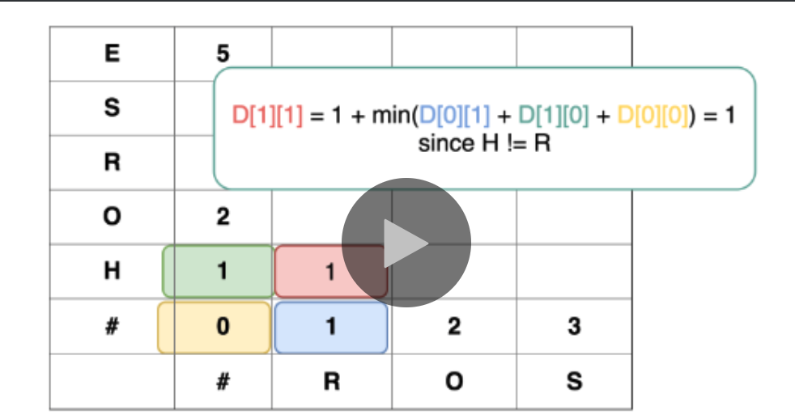
            - 取 1 + dp[-1][-1] => 表示取代當前
            - 取 1 + dp[-1][0] => 表示: H 先 變成空字串 -> 再新增 R
            - 取 1 + dp[0][-1] => 表示: R 先 變成空字串 -> 再新增 H
    3. word1 = "RO", word2 = "HO"
        - 
            - 取 1 + dp[1][1] -1 => 表示從上個最佳狀態(H 已變成 R or R 已變成 H)過來, 但字母一樣, 因此可以不必加上取代那一步
            - 取 1 + dp[1][2] => 表示: RO 先變成 H -> 再新增 O
            - 取 1 + dp[2][1] => 表示: HO 先變成 R -> 再新增 O

### 思路


這道題讓求從一個字符串轉變到另一個字符串需要的變換步驟，共有三種變換方式，插入一個字符，刪除一個字符，和替換一個字符。題目乍眼一看並不難，但是實際上卻暗藏玄機，對於兩個字符串的比較，一般都會考慮一下用 HashMap 統計字符出現的頻率，但是在這道題卻不可以這麼做，因為字符串的順序很重要。還有一種比較常見的錯誤，就是想當然的認為對於長度不同的兩個字符串，長度的差值都是要用插入操作，然後再對應每位字符，不同的地方用修改操作，但是其實這樣可能會多用操作，因為刪除操作有時同時可以達到修改的效果。比如題目中的例子1，當把 horse 變為 rorse 之後，之後只要刪除第二個r，跟最後一個e，就可以變為 ros。實際上只要三步就完成了，因為刪除了某個字母后，原來左右不相連的字母現在就連一起了，有可能剛好組成了需要的字符串。所以在比較的時候，要嘗試三種操作，因為誰也不知道當前的操作會對後面產生什麼樣的影響。對於當前比較的兩個字符 word1[i] 和 word2[j]，若二者相同，一切好說，直接跳到下一個位置。若不相同，有三種處理方法，首先是直接插入一個 word2[j]，那麼 word2[j] 位置的字符就跳過了，接著比較 word1[i] 和 word2[j+1] 即可。第二個種方法是刪除，即將 word1[i] 字符直接刪掉，接著比較 word1[i+1] 和 word2[j] 即可。第三種則是將 word1[i] 修改為 word2[j]，接著比較 word1[i+1] 和 word[j+1] 即可。分析到這裡，就可以直接寫出遞歸的代碼，但是很可惜會 Time Limited Exceed，所以必須要優化時間複雜度，需要去掉大量的重複計算，這裡使用記憶數組 memo 來保存計算過的狀態，從而可以通過 OJ，注意這裡的 insertCnt，deleteCnt，replaceCnt 僅僅是表示當前對應的位置分別採用了插入，刪除，和替換操作，整體返回的最小距離，後面位置的還是會調用遞歸返回最小的


### Code
TLE解法, Intuitive?
``` py
class Solution:
    def minDistance(self, word1: str, word2: str) -> int:

        m = len(word1)
        n = len(word2)

        if word1 == "":     return n
        if word2 == "":     return m

        if word1[0] == word2[0]:
            return self.minDistance(word1[1:], word2[1:])

        else:
            return 1 + min(self.minDistance(word1, word2[1:]),
                           self.minDistance(word1[1:], word2),
                           self.minDistance(word1[1:], word2[1:]))
```
從Recursive轉換過來的DP, 參考圖
```python
class Solution:
    def minDistance(self, word1: str, word2: str) -> int:
        m = len(word1)
        n = len(word2)

        # Initialize
        dp = [[0 for _ in range(n+1)] for _ in range(m+1)]
        dp[0][0] = 0

        for j in range (1,n+1):         dp[0][j] = j

        for i in range (1, m+1):        dp[i][0] = i

        # DP
        for i in range(1, m+1):
            for j in range(1, n+1):
                if word1[i-1] == word2[j-1]:
                    dp[i][j] = dp[i-1][j-1]
                else:
                    dp[i][j] = 1 + min(dp[i-1][j-1], dp[i][j-1], dp[i-1][j])

        return dp[-1][-1]
```
### Tag: #DP
---
## 73. Set Matrix Zeroes｜ 11/27 | [ Review * 1 ]
Given a m x n matrix, if an element is 0, set its entire row and column to 0. Do it in-place.

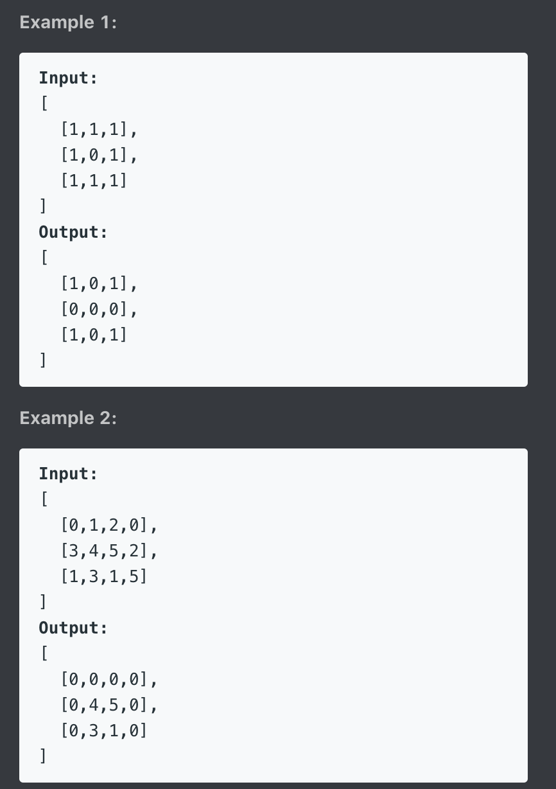

### 解題分析
1. O(1) Space 的方法
    1. 概念上就是我們要省下標記的 memory, 所以我們必須得用自身 matrix 內的空間來作為標記, 也就是用 0 row, 0 col 來作為標記區
    2. 但是如果我們先 process 了第0, 這樣會把整個 matrix 都變成 0, 所以我們必須先跳過第 0
    3. 然而我們也不想要標記區的結果讓我們忘記本來的 0rol 0col 是否需為零, 所以我們用了兩個 flag 先標好, 最後再來處理 0rol, 0col 的 assign
    4. 演算法
        1. 標記 0rol, 0col (外圈)
        2. 標記 rol[1:], col[1:] (內圈)
        3. 處理 rol[1:], col[1:]
        4. 處理 0rol, 0col

### 思路

空間複雜度 mn 的做法: 創一個等同大小的array,並一個一個assign值

空間複雜度 m+n的做法: 各創一個與行、列相同的array, 並只個別紀錄哪行哪列有出現0


### Code
``` py
class Solution:
    def setZeroes(self, matrix: List[List[int]]) -> None:
        """
        Do not return anything, modify matrix in-place instead.
        """
        m, n = len(matrix), len(matrix[0])
        row = [] #3
        col = [] #4

        for i in range(m):
            for j in range(n):
                if matrix[i][j] == 0:
                    row.append(i)
                    col.append(j)

        for zero_index in row:
            for j in range(n):
                matrix[zero_index][j] = 0

        for zero_index in col:
            for i in range(m):
                matrix[i][zero_index] = 0

        return matrix
```

Optimal Space
```py
class Solution:
    def setZeroes(self, m: List[List[int]]) -> None:
        # 因為我們要用第一行/列來作為此行/列是否需全為零的標記, 所以我們須先把這區是否為零的結果存下來, 最後再處理
        # 且在 process 內圈的過程中, 我們會把標記區跟資料區分開, 因此會從 1 開始往後檢查

        r, c = len(m), len(m[0])
        # Step1: 紀錄第一行/列是否在最後需要全部弄為零(標記外圈)
        should_first_row_zero, should_first_col_zero = False, False
        for i in range(r):
            if m[i][0] == 0:
                should_first_row_zero = True
                break

        for j in range(c):
            if m[0][j] == 0:
                should_first_col_zero = True
                break

        # Step2: 標記內圈
        for i in range(1, r):
            for j in range(1, c):
                if m[i][j] == 0: # 標記
                    m[0][j], m[i][0] = 0, 0

        # Step3: 給零內圈
        for i in range(1, r):
            for j in range(1, c):
                if m[0][j] == 0 or m[i][0] == 0: # assign
                    m[i][j] = 0

        # Step4: 給外圈零
        if should_first_row_zero:
            for i in range(r):
                m[i][0] = 0
        if should_first_col_zero:
            for j in range(c):
                m[0][j] = 0

```
### Tag: #Matrix
---
## 1087. Brace Expansion｜ 12/1
A string S represents a list of words.

Each letter in the word has 1 or more options.  If there is one option, the letter is represented as is.  If there is more than one option, then curly braces delimit the options.  For example, "{a,b,c}" represents options ["a", "b", "c"].

For example, "{a,b,c}d{e,f}" represents the list ["ade", "adf", "bde", "bdf", "cde", "cdf"].

Return all words that can be formed in this manner, in lexicographical order.


### 思路
Naive:
1. Make "{a,b}c{d,e}f" -> [[a,b],[c],[d,e],[f]]
2. DFS to find solution
3. Fail at "abcdefghijklmnopqrstuvw" testcase

Wonderful Solution:
Using helper function to:
1. fetch out the elem in braces,
2. split out the string before braces
3. split out the string after braces

And recursively bind them in main function until no braces, e.g.:
1. ac{d,e}f
    1. acdf -> return ["acdf"]
    2. acef -> return ["acef"]
2. bc{d,e}f


### Code
Wonderful Solution:
```py
    # from functools import lru_cache
class Solution:
    def expand(self, S: str) -> List[str]:
        #self.helper.cache_clear()
        if '{' not in S:
            return [S]
        else:
            a, opts, b = self.helper(S)

            res = []
            for o in opts:
                res += self.expand(a+o+b)
            return res

    #@lru_cache(maxsize=None)
    def helper(self, s):
        i, j = s.index('{'), s.index('}')
        return s[:i], sorted(s[i+1:j].split(',')), s[j+1:]
```

Naive beat 6%:
``` py
class Solution:
    def expand(self, S: str) -> List[str]:
        def find_comb(outer, inner, comb):
            while len(comb) == n:
                ret.add("".join(comb[:]))
                return
            for i in range(outer, len(src)):
                for j in range(inner, len(src[i])):
                    comb.append(src[i][j])
                    find_comb(i+1, 0, comb)
                    comb.pop()
        if '{' not in S:
            return [S]
        src, ret = [], set()
        i = 0
        while i < len(S):
            if S[i] == "{":
                br = []
                i += 1
                while S[i] != '}':
                    if S[i] == ',':
                        i += 1
                        continue
                    br.append(S[i])
                    i += 1
                src.append(br)
            elif S[i] != "}" and S[i] != ",":
                src.append([S[i]])
            i += 1

        n = len(src)
        find_comb(0, 0, [])
        return sorted(ret)
```
---
## 75. Sort Colors｜ 12/1
Given an array with n objects colored red, white or blue, sort them in-place so that objects of the same color are adjacent, with the colors in the order red, white and blue.

Here, we will use the integers 0, 1, and 2 to represent the color red, white, and blue respectively.

Note: You are not suppose to use the library's sort function for this problem.

Example:

Input: [2,0,2,1,1,0]

Output: [0,0,1,1,2,2]

Follow up:

A rather straight forward solution is a two-pass algorithm using counting sort.
First, iterate the array counting number of 0's, 1's, and 2's, then overwrite array with total number of 0's, then 1's and followed by 2's.
Could you come up with a one-pass algorithm using only constant space?
### 思路

如果要one path, 只能使用雙指針來搞

關鍵就是0一定在左, 2一定在右

所以可以使用兩個指針來記錄目前的最左跟最右在哪邊

遇到2就塞到目前的最右, 反之遇到0

注意while的check必須使用right而不是len(nums)

否則會把已經確定位置的2又換到錯的位置

### Code
``` py
class Solution:
    def sortColors(self, nums: List[int]) -> None:
        """
        Do not return anything, modify nums in-place instead.
        """
        # One Path:
        # self.sortColorsOptimap(nums)

        # Two Path:
        num_count_with_index = [0 for i in range(3)]
        for num in nums:
            num_count_with_index[num] += 1

        cur = 0
        for val, count in enumerate(num_count_with_index):
            for i in range(count):
                nums[cur+i] = val
            cur += count

    def sortColorsOptimap(self, nums):
        # One Path
        left, right = 0, len(nums)-1

        cur = 0
        while cur <= right: # Notice! Shouldn't use len(nums)
            if nums[cur] == 0:
                nums[cur], nums[left] = nums[left], nums[cur]
                cur += 1
                left += 1
            elif nums[cur] == 2:
                nums[cur], nums[right] = nums[right], nums[cur]
                right -= 1
            else:
                cur += 1
```
---
## 83. Remove Duplicates from Sorted List｜ 8/29 | [Review * 1]
Given the head of a sorted linked list, delete all duplicates such that each element appears only once. Return the linked list sorted as well.


### 思路


### Code
``` py
class Solution:
    def deleteDuplicates(self, head: ListNode) -> ListNode:
        dum = ListNode(-1)
        dum.next = head
        while head and head.next:
            cur = head
            next = head.next
            while next != None and cur.val == next.val:
                next = next.next

            head.next = next
            head = head.next
        return dum.next
```

Optimal
```py
class Solution:
    def deleteDuplicates(self, head: ListNode) -> ListNode:
        cur=head
        while cur:
            while cur.next and cur.next.val==cur.val:
                cur.next=cur.next.next
            cur=cur.next
        return head
```

### Tag: #LinkedList
---
## 82. Remove Duplicates from Sorted List II｜ 12/2 | [Review * 1]
Given a sorted linked list, delete all nodes that have duplicate numbers, leaving only distinct numbers from the original list.

Example 1:

Input: 1->2->3->3->4->4->5

Output: 1->2->5

Example 2:

Input: 1->1->1->2->3

Output: 2->3

### 解題分析
1. 如果需要連自己都 skip 掉的話，就必須站在前一個位置看自己
2. while loop 大致與 LC83 精簡寫法一樣
3. 在 進入到下次while前，不一樣的地方來了
    1. 如果有進到 remove process:
        1. 必須要再往前移一格 prev.next 指到的 elem, 因為在remove完所指到的是最後一個一樣的 elem, 但在這題連一個都不能留
        2. 因此用一個 flag 去紀錄是否有進到 remove process
        3. 並且我們 prev 的位置不用推進
    2. 沒遇到重複就如同一般推進 prev

### 思路
Iterative:

必須站在前一個節點往後看(並記錄這個節點為cur)

如果下兩個節點為一樣時, 進入刪除mode

使用while一直尋找到不同處

並把那個紀錄的cur與不同處連上

最後iterate prev, 就完成了

Recursive:
(no need the dummy node)
我們也可以使用遞歸來做，首先判空，如果 head 為空，直接返回。

然後判斷，若 head 之後的結點存在，且值相等，那麼先進行一個 while 循環，跳過後面所有值相等的結點，到最後一個值相等的點停下。

比如對於例子2來說，head 停在第三個結點1處，

然後對**後面一個結點調用遞歸函數**，即結點2，

這樣做的好處是，返回的值就完全把所有的結點1都刪掉了。

若 head 之後的結點值不同，

那麼還是對 head 之後的結點調用遞歸函數，

將返回值連到 head 的後面，這樣 head 結點還是保留下來了，因為值不同嘛，最後返回 head 即可

### Code

modify from LC83, optimal
```py
class Solution:
    def deleteDuplicates(self, head: ListNode) -> ListNode:
        dum = ListNode(-1)
        dum.next = head
        prev = dum

        while prev.next:
            flag = False
            while prev.next and prev.next.next and prev.next.val == prev.next.next.val:
                flag = True
                prev.next = prev.next.next

            if flag: # need to take one more step forward to remove the remain duplicate, but don't move the prev
                prev.next = prev.next.next
            else:
                prev = prev.next
        return dum.next
```

Iterative:
``` py
class Solution:
    def deleteDuplicates(self, head: ListNode) -> ListNode:
        dum = ListNode(-1)
        dum.next = head
        prev = dum
        while prev.next and prev.next.next:
            cur = prev
            if prev.next.val == prev.next.next.val:
                while prev.next.next and prev.next.val == prev.next.next.val:
                    prev = prev.next
                cur.next = prev.next.next
                prev = cur
            else:
                prev = prev.next
        return dum.next
```

Recursive:
```py
class Solution:
    def deleteDuplicates(self, head: ListNode) -> ListNode:
        if not head:
            return head

        if head.next and head.val == head.next.val:
            while head.next and head.val == head.next.val:
                head = head.next
            return self.deleteDuplicates(head.next)

        head.next = self.deleteDuplicates(head.next) # 用這樣串起來的！
        return head
```
### Tag: #LinkedList
---
## 84. Largest Rectangle in Histogram｜ 12/2 | [ Review * 1 ]
Given n non-negative integers representing the histogram's bar height where the width of each bar is 1, find the area of largest rectangle in the histogram.


### 解題分析
1. 如何想到 mono-stack 的方法的?
    1. 對於兩個以上的 pair 其最高有可能發生在 較小那個的高 * 寬度
    2. 因此我們推廣這個想法，對於每個 a[i], 假設此 a[i] 是某個 range 的最小, 那麼最大的面積有可能是什麼?
        1. a[i] * (R - L - 1)
            1. R 為 i 的右邊遇到的第一個比 a[i] 還小的位置
            2. L 為 i 的左邊遇到的第一個比 a[i] 還小的位置
    3. 如果此元素大於頂端元素，我們就把元素加入到 stack 中，因為我們的目標是要找到 R，持續地走直到我們找到了 R
    4. 那同時也代表我們同時找到了 a[i] (R的前一個數)，我們先把她 pop 出來，並取他的高
    5. OK，那 L 其實不用找, 因為遞增 stack 保證了 stack 的遞增性, 因此 pop 後的 stack 其頂端元素一定會比 pop 的還小, 而我們就持續的走到新進來的元素可以符合單調性為止
    6. 這邊解釋一下為什麼可以持續的 pop，因為依據我們的定義 `L 為 i 的左邊遇到的第一個比 a[i] 還小的位置`, 假設我們今天要把 a[i] 放到頂端那麼對於後面大於 a[i] 的樹，他們都肯定會大於這些的，因此我們不需要把這些已經確定大於 a[i] 的留在 stack 裡，我們只需要紀錄再前一個比較小的就行了 (到時候計算面積的時候，直接把那個比較小的 index 叫出來，那這段 range 一樣包含那些大於 a[i] 的路徑呀)
2. 過程
    - 
    - 
    - 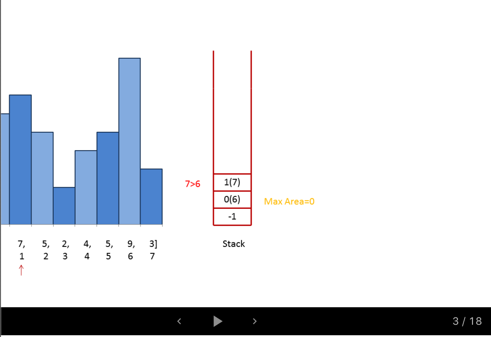
    - 
    - 
    - 
    - 
    - 
3. 比較
    1. 與 LC42 不同的地方在於
        1. 此題 stack 中的每個元素都有可能是解, 因此需要 push dum 元素以利最後再 stack 的元素也有被計算到


### 技巧

mono-stack, increase-stack/decrease-stack:
- 自私的新元素會為了自己把所有造成破壞單調性的元素給踢除
- 解決問題的核心就在處理這塊，當前數字如果破壞了單調性，就會觸發處理棧頂元素的操作，而觸發數字有時候是解決問題的一部分
- 線性的時間複雜度是其最大的優勢，每個數字只進棧並處理一次
- 使用: 對於玩數組的題，如果相互之間關聯很大，那麼就可以考慮考慮單調棧能否解題。
    - 如: 使用local max來協助解題的題型
- 模板(以遞增stack舉例):
    - 常常會使用dummy elem協助解, 如此題
```py
def Solution(nums):
    for i in range(nums):
        while stack and heights[stack[-1]] > heights[i]: # trigger of process
            a = stack.pop()
            self.process()
        stack.append(i)

def process():
    # do sth
```

[Grandyang總結](https://www.cnblogs.com/grandyang/p/8887985.html)

### 思路
1. find Local max

每找到一個局部峰值（只要當前的數字大於後面的一個數字，那麼當前數字就看作一個局部峰值，跟前面的數字大小無關），然後向前遍歷所有的值，算出共同的矩形面積，每次對比保留最大值。這裡再說下為啥要從局部峰值處理，看題目中的例子，局部峰值為 2，6，3，我們只需在這些局部峰值出進行處理，為啥不用在非局部峰值處統計呢，這是因為非局部峰值處的情況，後面的局部峰值都可以包括，比如1和5，由於局部峰值6是高於1和5的，所有1和5能組成的矩形，到6這裡都能組成，並且還可以加上6本身的一部分組成更大的矩形，那麼就不用費力氣去再統計一個1和5處能組成的矩形了。

2. 用mono-stack
那麼既然需要用單調棧來做，首先要考慮到底用遞增棧，還是用遞減棧來做。我們想啊，遞增棧是維護遞增的順序，當遇到小於棧頂元素的數就開始處理，而遞減棧正好相反，維護遞減的順序，當遇到大於棧頂元素的數開始處理。那麼根據這道題的特點，我們需要按從高板子到低板子的順序處理，先處理最高的板子，寬度為1，然後再處理旁邊矮一些的板子，此時長度為2，因為之前的高板子可組成矮板子的矩形 ，因此我們需要一個遞增棧，當遇到大的數字直接進棧，而當遇到小於棧頂元素的數字時，就要取出棧頂元素進行處理了，那取出的順序就是從高板子到矮板子了，於是乎遇到的較小的數字只是一個觸發，表示現在需要開始計算矩形面積了，為了使得最後一塊板子也被處理，這裡用了個小 trick，在高度數組最後面加上一個0，這樣原先的最後一個板子也可以被處理了。

### Code
find local max:
``` py
class Solution:
    def largestRectangleArea(self, heights: List[int]) -> int:
        # find local max: larger than the next elem
        # don't need to consider the previous elem, because you walk from there
        res = 0
        for i in range(len(heights)):
            if i+1 < len(heights) and heights[i] <= heights[i+1]:
                continue # Use continue here, because we need to consider the last elem as potential local Max

            minH = heights[i]
            for j in range(i, -1, -1):
                minH = min(minH, heights[j])
                area = minH * (i-j+1)
                res = max(res, area)
        return res
```

Using mono-stack(increased stack):
```py
class Solution:
    def largestRectangleArea(self, heights: List[int]) -> int:
        # find local max: larger than the next elem
        # don't need to consider the previous elem, because you walk from there

        res = 0
        # trick: need to consider the last elem, push 0 (dummy) to the last
        # Also push -1 in stack to indicate the last elem in heights(dummy), heights[-1] = 0
        stack = [-1]
        heights.append(0)

        for i, h in enumerate(heights):
            while stack and h < heights[stack[-1]]:
                deal = stack.pop()
                if stack:
                    _width = i - stack[-1] - 1
                    _height = heights[deal]
                    res = max(res, _width * _height)
            stack.append(i)
        return res

    def process(self, res, height, i, j):
        res = max(res, height * (i-j-1))
        return res

```

### 類似題

若此時題目改成要求求正方型

### 思路

- 正方形必須要等寬等高, 因此我們就對寬高取其小, 在更新 res 即可

### Code

```py
class Solution:
    def largestRectangleArea(self, heights: List[int]) -> int:
        stack = [-1]
        heights.append(0)
        res = 0
        for i, h in enumerate(heights):
            while stack and h < heights[stack[-1]]:
                deal = stack.pop()
                if stack:
                    _width = i - stack[-1] - 1
                    _height = heights[deal]
                    sq_len = min(_width, _height)
                    res = max(res, sq_len * sq_len)
            stack.append(i)
        return res
```

### Tag: #Stack #MonoStack
---
## 86. Partition List｜ 12/3 | [Review * 1]

Given a linked list and a value x, partition it such that **all nodes less than x** come before **nodes greater than or equal to x**.

You should preserve the original relative order of the nodes in each of the two partitions.

Example:

Input: head = 1->4->3->2->5->2, x = 3
Output: 1->2->2->4->3->5

這道題要求我們劃分鏈表，把所有小於給定值的節點都移到前面，大於該值的節點順序不變，相當於一個局部排序的問題。那麼可以想到的一種解法是首先找到第一個大於或等於給定值的節點，用題目中給的例子來說就是先找到4，然後再找小於3的值

### 技巧

在操作list時,

如果head的位置matter的話,

盡量使用cursor去操作list(以面誤動到head了)

像是方法中使用cur, new_cur去操作

而dum, new_dum永遠維持不變

### 解題分析
1. 要把所有小於 x 的點都集中到前面，那麼首先我們要先定義何謂前面？誰的前面？
2. 答案是第一個 大於等於 x 的點作為切割前後的標竿
3. 需要用一個 prev 去紀錄哪裡是標竿的前面，因為我們會從標竿後第一個節點開始找到尾巴，然後把小於x的點移到 prev 的下個點
    1. 要先把 prev.next 記錄下來，作為插入新節點後的 next
    2. 連接到 prev.next 後
    3. 跳過該節點
    4. 把插入的點的 next 連接到舊的 prev.next
    5. prev 往前移一格

### 思路
分割時,可以真的分割如1. 或者new一個新list來代表分割後的結果

1. 直接斷點法: (複雜)

斷點斷在第一個大於x的點,

分成:前半部(break_p), 後半部(new_head)

並將所有後半部mis-positioned的點放到break_p之後

2. (Better) 直接new一個新的list法:

直接在走訪時操作, 連接到新的list後面

走訪完後, 把兩個list連在一起

### Code
move in place
```py
class Solution:
    def partition(self, head: ListNode, x: int) -> ListNode:
        prev = ListNode(-1)
        prev.next = head
        dum = prev
        while head and head.val < x: # find the node who split front and back
            head = head.next
            prev = prev.next

        while head and head.next: # check from head.next since already check the front
            if head.next.val < x:
                old_prev_next = prev.next # memo the node after the insertion point
                prev.next = head.next # concat the node to front part
                head.next = head.next.next # remove the node in back part
                prev.next.next = old_prev_next # concat the original next node to the new node in front part
                prev = prev.next # move forward the node in front part
            else:
                head = head.next
        return dum.next
```

新list法:
``` py
class Solution:
    def partition(self, head: ListNode, x: int) -> ListNode:
        dum, new_dum = ListNode(-1), ListNode(-1)
        dum.next = head

        # Assign the cursor to do the operation
        # => dum, new_dum never move!!
        cur, new_cur = dum, new_dum

        while cur.next:
            if cur.next.val < x:
                new_cur.next = cur.next
                cur.next = cur.next.next

                # move the new_dum cursor
                new_cur = new_cur.next
            else:
                cur = cur.next

        # Connect two list together, Note: still use the cursor to do the op
        new_cur.next = dum.next
        return new_dum.next

```

斷點法:
``` py
class Solution:
    def partition(self, head: ListNode, x: int) -> ListNode:
        dum = ListNode(-1)
        dum.next = head
        prev = dum
        break_p, new_head = None, None

        # find the breaking point, and break the list into two
        while prev.next:
            if prev.next.val >= x:
                break_p = prev
                new_head = prev.next
                break
            else:
                prev = prev.next
        self.arrange(break_p, new_head, x)
        return dum.next

    def arrange(self,break_p, new_head, x):
        # link the misposition node in new_head list to break_p
        while new_head:
            if new_head.next and new_head.next.val < x:
                # keep the status
                b_next = break_p.next
                n_next = new_head.next.next

                # link that node to break_p
                break_p.next = new_head.next
                break_p.next.next = b_next
                break_p = break_p.next # don't forget to move forward the break_p ptr!!

                # fill the removed position
                new_head.next = n_next
            else:
                new_head = new_head.next
```
### Tag: #LinkedList
---
## 85. Maximal Rectangle｜ 12/4 | [ Review * 1 ]
Given a 2D binary matrix filled with 0's and 1's, find the largest rectangle containing only 1's and return its area.

Example:


### 解題分析
1. DP
    - 
    - 概念: 用 left[j], right[j], height[j] 去紀錄當前 col 的第 j row 先往上擴到最頂, 再去往左往右擴張, 可以擴張到的最大面積
        - 分別表達為第 j row 的左邊界、右邊界、上邊界
    - 而為了不重複去看之前的邊界值, 我們用 dp 去紀錄
        - 如圖中的 m[1][3]
            - 如果只看單行, 他的左邊界應該是 2, 右邊界應該是4
            - 然而我們的規則是要先衝到最頂, 因此 m[0][2], m[0][4] 都為 0 的狀況下, 其也不能擴張
            - 因此我們的轉移式可以寫成: `left[i] = max(left[i], cur_l)`
        - 用此概念由右到左計算出 right, 並計算出連續的 height, 便可計算出從 i=0 ~ 當前 i 所可形成的最大矩形面積
    - 需注意的是:
        - right 我們直接 initial 成 index+1, 方便我們 right-left 就直接求出寬度
        - 所以她 initial 的時候是 len(m[0])
        - 再調整 boundary 的時候也直接用 j, 而不是 j-1
    - 優化:
        - 內部 for loop 可以縮減成 1~2 個

### 思路
之前找histogram 長方形最大值的延伸版

轉換方法是把每一行看作新的一層, 並往上累加高度

累加高度的方法是：
對於每一個點，如果是 ‘0’，則賦0，如果是 ‘1’，就賦之前的 height 值加上1

### Code
``` py
class Solution(object):
    def maximalRectangle(self, matrix):
        """
        :type matrix: List[List[str]]
        :rtype: int
        """
        if not matrix:   return 0
        row, col = len(matrix), len(matrix[0])
        res, heights = 0, [0 for _ in range(col)]

        for i in range(row):
            for j in range(col):
                heights[j] = (1+heights[j]) if matrix[i][j] != '0' else 0
            res = max(res, self.largestRectangleArea(heights))
        return res

    def largestRectangleArea(self, heights):
        # [3, 1, 3, 2, 2]
        heights = list(map(int, heights))
        max_a = 0
        stack = [-1]
        heights.append(0)
        for i in range(len(heights)):
            if heights[i] < heights[stack[-1]]:
                while stack and heights[i] < heights[stack[-1]]:
                    h = heights[stack.pop()]
                    w = i - stack[-1] - 1
                    max_a = max(max_a, h*w)
            stack.append(i)
        return max_a
```

DP
```py
class Solution:
    def maximalRectangle(self, m: List[List[str]]) -> int:
        if not m:   return 0
        r, c = len(m), len(m[0])
        left, right, height = [0 for _ in range(c)], [c for _ in range(c)], [0 for _ in range(c)]
        max_a = 0

        for i in range(r):
            for j in range(c):
                if m[i][j] == '1':
                    height[j] += 1
                else:
                    height[j] = 0

            cur_l_bound = 0
            for j in range(c):
                if m[i][j] == '1':
                    left[j] = max(left[j], cur_l_bound)
                else: # adjust cur bound
                    cur_l_bound = j+1
                    left[j] = 0

            cur_r_bound = c
            for j in range(c-1, -1, -1):
                if m[i][j] == '1':
                    right[j] = min(right[j], cur_r_bound)
                else: # adjust cur bound
                    cur_r_bound = j
                    right[j] = c

            for j in range(c):
                max_a = max(max_a, (right[j]-left[j])*height[j])
        return max_a
```
### Tag: #Stack #MonoStack #DP
---
## 88. Merge Sorted Array｜ 12/5
Given two sorted integer arrays nums1 and nums2, merge nums2 into nums1 as one sorted array.

Note:

The number of elements initialized in nums1 and nums2 are m and n respectively.

You may assume that nums1 has enough space (size that is greater or equal to m + n) to hold additional elements from nums2.

Example:

Input:

nums1 = [1,2,3,0,0,0], m = 3

nums2 = [2,5,6],       n = 3

Output: [1,2,2,3,5,6]
### 思路

因為最終size是固定的,

因此從後往前比, 大的就放在最後面


### Code
``` py
class Solution(object):
    def merge(self, nums1, m, nums2, n):
        while m > 0 and n > 0:
            if nums2[n-1] > nums1[m-1]:
                nums1[m+n-1] = nums2[n-1]
                n -= 1
            else:
                nums1[m+n-1] = nums1[m-1]
                m -= 1
        if n > 0:
            nums1[:n] = nums2[:n]
```
精簡版, 加上要更新要把nums2放到nums1後的條件
```py
class Solution(object):
    def merge(self, nums1, m, nums2, n):
        while n > 0:
            if m <= 0 or nums2[n-1] > nums1[m-1]:
                nums1[m+n-1] = nums2[n-1]
                n -= 1
            else:
                nums1[m+n-1] = nums1[m-1]
                m -= 1
```
---
## 97. Interleaving String｜ 12/5 | [ Review * 1 ]
Given s1, s2, s3, find whether s3 is formed by the interleaving of s1 and s2.

Example 1:

Input: s1 = "aabcc", s2 = "dbbca", s3 = "aadbbcbcac"

Output: true

Example 2:

Input: s1 = "aabcc", s2 = "dbbca", s3 = "aadbbbaccc"

Output: false

### 解題分析
1. Recursive
    1. 一樣是 recursive, 然後試著用 memo 優化
        1. 這裡的 memo 比較不一樣, 因為我們在原始 recursive 的時候寫的是如果 true 直接 return, fail 的話我們嘗試其他的遞迴可能
        2. 因此我們只需要避免重複計算 fail 的狀況, 所以我們用一個 set 去追蹤處理過的 idx 即可 (如果已經知道是失敗的狀況根本不用再去遞迴嘗試)
2. DP BottomUp
    1. s1 = "a", s2 = "b", 可能為 True 的 s3 = "ab" or "ba"
    2. 我們將 DP[i][j] 定義為 s3[:i+j] 可以與 s1[j:], 與 s2[i:] matching
        - 也就是說 s3[i+j] 一定為 s1[j] or s2[i] 其中之一
        - 因為不管是交錯 or One over another, 最後一個字一定是兩種之一
    3. 轉移式
        1. dp[i][j] = (dp[i][j-1] and s1[j-1] == s3[i+j-1]) or (dp[i-1][j] and s2[i-1] == s3[i+j-1])
            - 此態 = 舊狀態 AND match (看圖比較好理解)
                - 要 match s1的現態, 要檢查 s1[i-1] 的舊狀態
                - 反之亦然
            - Base Case:
                - dp[0][0]
                    - s1[0:], s2[0:] 可以 match s3[:0]
                - dp[0][j]
                    - 只需考慮 j 的狀況
                - dp[i][0]
                    - 只需考慮 i 的狀況
    4. 
    5. 一樣可以只用一個一維去優化

### 技巧

1. Recursive 思路漏洞:

第一次的寫法:
```py
if m > 0 and s1[0] == s3[0]:
    return self.isInterleave(s1[1:], s2, s3[1:])
if n > 0 and s1[0] == s3[0]:
    return self.isInterleave(s1, s2[1:], s3[1:])
```

並考慮這個case:
```
s1 = aabbc
s2 = abbbc
s3 = abbbc
```
這種方式會造成s1與s3匹配過後發現沒有路了return False

然後就一直return False回上層導致s2與s3沒有機會嘗試到

2. 在用地迴時思考有沒有任何可能可以記錄重複的步驟以至於能優化，

像這題就是以紀錄兩個字串剩餘的長度來達成跳過重複

### 思路

就是遞迴逐一比對, 注意recursive的思路, 以及如何優化遞迴

### Code
在大數據時會TLE
``` py
class Solution:
    def isInterleave(self, s1: str, s2: str, s3: str) -> bool:
        if not s1 and not s2 and not s3:
            return True
        if s1 and s3 and s1[0] == s3[0]:
            if self.isInterleave(s1[1:], s2, s3[1:]):
                return True
        if s2 and s3 and s2[0] == s3[0]:
            if self.isInterleave(s1, s2[1:], s3[1:]):
                return True
        return False
```

優化, cache紀錄path, 用idx而不是一直slice
``` py
class Solution:
    def isInterleave(self, s1: str, s2: str, s3: str) -> bool:
        n1, n2, n3 = len(s1), len(s2), len(s3)
        memo = set()
        def helper(idx1, idx2, idx3):
            if idx1 == n1 and idx2 == n2 and idx3 == n3:
                return True
            if idx1 < n1 and idx3 < n3 and s1[idx1] == s3[idx3]:
                if (idx1+1, idx2) not in memo:
                    memo.add((idx1+1, idx2))
                    if helper(idx1+1, idx2, idx3+1):
                        return True
            if idx2 < n2 and idx3 < n3 and s2[idx2] == s3[idx3]:
                if (idx1, idx2+1) not in memo:
                    memo.add((idx1, idx2+1))
                    if helper(idx1, idx2+1, idx3+1):
                        return True
            return False
        return helper(0, 0, 0)
```

DP BottomUp (Optimal)
```py
class Solution:
    def isInterleave(self, s1: str, s2: str, s3: str) -> bool:
        if len(s1) + len(s2) != len(s3):
            return False
        dp = [[False for _ in range(len(s1)+1)] for _ in range(len(s2)+1)]

        for i in range(len(s2)+1):
            for j in range(len(s1)+1):
                if i == 0 and j == 0:
                    dp[i][j] = True
                elif i == 0:
                    dp[i][j] = dp[i][j-1] and s1[j-1] == s3[i+j-1]
                elif j == 0:
                    dp[i][j] = dp[i-1][j] and s2[i-1] == s3[i+j-1]
                else:
                    dp[i][j] = (dp[i][j-1] and s1[j-1] == s3[i+j-1]) or (dp[i-1][j] and s2[i-1] == s3[i+j-1])
        return dp[-1][-1]
```

BottomUp Optimize (Optimal)
```py
class Solution:
    def isInterleave(self, s1: str, s2: str, s3: str) -> bool:
        if len(s1) + len(s2) != len(s3):
            return False
        dp = [False for _ in range(len(s1)+1)]
        prev = [False for _ in range(len(s1)+1)]

        for i in range(len(s2)+1):
            for j in range(len(s1)+1):
                if i == 0 and j == 0:
                    dp[j] = True
                elif i == 0:
                    dp[j] = dp[j-1] and s1[j-1] == s3[i+j-1]
                elif j == 0:
                    dp[j] = prev[j] and s2[i-1] == s3[i+j-1]
                else:
                    dp[j] = (dp[j-1] and s1[j-1] == s3[i+j-1]) or (prev[j] and s2[i-1] == s3[i+j-1])
            dp, prev = prev, dp
        return prev[-1]
```

不使用遞迴, 用stack:
```py
def isInterleave4(self, s1, s2, s3):
    r, c, l= len(s1), len(s2), len(s3)
    if r+c != l:
        return False
    stack, visited = [(0, 0)], set((0, 0))
    while stack:
        x, y = stack.pop()
        if x+y == l:
            return True
        if x+1 <= r and s1[x] == s3[x+y] and (x+1, y) not in visited:
            stack.append((x+1, y)); visited.add((x+1, y))
        if y+1 <= c and s2[y] == s3[x+y] and (x, y+1) not in visited:
            stack.append((x, y+1)); visited.add((x, y+1))
    return False
```
### Tag: #DP #Recursive
---
## 103. Binary Tree Zigzag Level Order Traversal｜ 12/5 | [ Review * 1 ]
Given a binary tree, return the zigzag level order traversal of its nodes' values. (ie, from left to right, then right to left for the next level and alternate between).

For example:
Given binary tree [3,9,20,null,null,15,7],
```
    3
   / \
  9  20
    /  \
   15   7
```
return its zigzag level order traversal as:
[
  [3],
  [20,9],
  [15,7]
]

### 技巧

**層走訪:創空間+層參數**

### 思路

正確的level order走訪:

在push queue的時候多push level的參數,

並用level來決定是否要new一個新的room給this level

### Code
``` py
class Solution:
    def zigzagLevelOrder(self, root: TreeNode) -> List[List[int]]:
        if not root:
            return []
        flag, queue, res = 0, [], []

        queue.append(root);
        res.append([root.val])

        while queue:
            flag += 1 # flag to reverse the level_val
            level, level_val = [], []
            while queue: # to confine in this level
                top = queue.pop(0)
                if top.left:
                    level.append(top.left)
                if top.right:
                    level.append(top.right)

            while level: # repush into the queue for next level
                top = level.pop(0)
                level_val.append(top.val)
                queue.append(top)

            if flag%2 != 0:
                level_val = level_val[::-1]

            if len(level_val) != 0:
                res.append(level_val)
        return res
```

level order精簡版:
```py
class Solution:
    def zigzagLevelOrder(self, root: TreeNode) -> List[List[int]]:
        queue, res = deque([]), []

        queue.append((root, 0));

        while queue:
            top, level = queue.popleft()

            if top:
                if len(res) < level+1: # new a room for this level
                    res.append(deque([]))

                if level % 2 == 0:
                    res[level].append(top.val)
                else:
                    res[level].appendleft(top.val)
                queue.append((top.left, level+1))
                queue.append((top.right, level+1))
        return res
```

Recursive without queue
```py
from collections import deque

class Solution:
    def zigzagLevelOrder(self, root: TreeNode) -> List[List[int]]:
        levels = []

        if not root:
            return levels

        def helper(node, level):
            if len(levels) <= level:
                levels.append(deque([node.val]))
            else:
                if level % 2 == 0:
                    levels[level].append(node.val)
                else:
                    levels[level].appendleft(node.val)
            if node.left:
                helper(node.left, level + 1)
            if node.right:
                helper(node.right, level + 1)
        helper(root, 0)
        return levels
```
### Tag: #BFS #Tree
---
## 106. Construct Binary Tree from Inorder and Postorder Traversal｜ 12/6 | [ Review * 1 ]
Given inorder and postorder traversal of a tree, construct the binary tree.

Note:
You may assume that duplicates do not exist in the tree.

For example, given


### 解題分析
0. 上題與此題都一樣，先把 list 切割的位置找出來，把圖畫出一切都一目瞭然了
    - 
1. 簡單的解法, 但效能很差
    1. 與上題一樣，先找到 root 的位置，然後 pop 掉
    2. 剩下的 list range mapping 就是看著圖做了
2. Optimal: left, right pointer 切法
    1. 先建立 inorder {value:idx} 的 mapping 取代 .index()
    2. 然後使用原始 post order 的訪問順序, 因此只要一直取 postorder 的最後 -> 不用做切割
    3. left, right 的切割也可以適用上圖的位置概念 -> 用來終止遞迴
3. 複習時的疑問
    1. 為何我們必須先向右拜訪呢?
    2. 因為我們的拜訪順序是{左右中}, 現在我們用 pop 的從後面存取(逆序拜訪), 中現在拜訪完了 pop 出來, 下一個點就會是{右}, 因此我們遞迴時的邏輯也要符合這樣
    3. 而相反的, 105, preorder 我們是順序拜訪, 因此就符合{中左右}就可以了

### 思路

- 建樹大前提, 是否能從規則中找到root的位置？
    - 先序: root為第一個元素
    - 後序: root為最後個元素
- 把root位置訂出來後就可以透過中序來拉出左右子樹
- 再來使用左右子樹在中序中的**個數**來把後序也切割成對應的後序
- 遞迴解


### Code
與上題模板似的解法, 但效能太差了
```py
class Solution:
    def buildTree(self, inorder: List[int], postorder: List[int]) -> TreeNode:
        if inorder and postorder:
            root_idx = inorder.index(postorder.pop())
            root = TreeNode(inorder[root_idx])
            root.left = self.buildTree(inorder[:root_idx], postorder[:root_idx])
            root.right = self.buildTree(inorder[root_idx+1:], postorder[root_idx:])
            return root
```

Optimal, 用 postorder 訪問順序, 與 left right pointer 取代 list 的切割
```py
class Solution:
    def buildTree(self, inorder: List[int], postorder: List[int]) -> TreeNode:
        inorder_map = dict()
        for i, val in enumerate(inorder): inorder_map[val] = i
        def helper(l, r):
            if l > r: return None
            root = TreeNode(postorder.pop())
            mid = inorder_map[root.val]
            root.right = helper(mid+1, r)
            root.left = helper(l, mid-1)
            return root
        return helper(0, len(inorder)-1)
```

``` py
class Solution:
    def buildTree(self, inorder: List[int], postorder: List[int]) -> TreeNode:
        if not inorder or not postorder:
            return None
        root = ListNode(postorder[-1])
        idx = inorder.index(root.val)
        left_post = postorder[:idx]
        right_post = postorder[idx:-1]
        root.left = self.buildTree(inorder[:idx], left_post)
        root.right = self.buildTree(inorder[idx+1:], right_post)
        return root
```

也可以直接把最後的pop掉
```py
class Solution:
    def buildTree(self, inorder: List[int], postorder: List[int]) -> TreeNode:
        if not inorder or not postorder:
            return None
        root = ListNode(postorder.pop())
        idx = inorder.index(root.val)
        left_post = postorder[:idx]
        right_post = postorder[idx:]
        root.left = self.buildTree(inorder[:idx], left_post)
        root.right = self.buildTree(inorder[idx+1:], right_post)
        return root
```
Iterative: Hard to understand

```py
class Solution:
    def buildTree(self, inorder: List[int], postorder: List[int]) -> TreeNode:
        if not postorder:
            return None

        H = {val:idx for idx, val in enumerate(inorder)}
        stack = []
        root = None
        for node_val in reversed(postorder):
            node = TreeNode(node_val)
            if not stack:
                # only occurs for the postorder[-1], which is the root
                root = node
                stack.append(node)
            else:
                parent = stack[-1]
                if H[node.val] > H[prev.val]:
                    # right subtree of the previous node
                    parent.right = node
                else:
                    # left subtree of the previous node
                    while stack and H[node.val] < H[stack[-1].val]:
                        parent = stack.pop()
                    parent.left = node
                stack.append(node)

        return root
```
### Tag: #Tree #DFS
---
## 109. Convert Sorted List to Binary Search Tree｜ 12/6 | [Review * 2]
Given a singly linked list where elements are sorted in ascending order, convert it to a height balanced BST.

For this problem, a height-balanced binary tree is defined as a binary tree in which the depth of the two subtrees of every node never differ by more than 1.

Example:


### 解題分析
0. 精簡解法太美了
1. 從中間把整顆樹拉起來，因此必須先找到 list 的中點，用快慢指針找list中點法
2. 再分別對其左右半部的 list 進行遞迴
3. 找根節點的值
    1. 解法1, 2 都必須用到額外多一個點去紀錄 slow 前一個節點，才能透過 prev.next = None 去切割
    2. 精簡解法巧妙的將 fast 往前多移一格，當走到底的時後，root 的位置在 slow.next，因此可以直接 slow.next = None 去切

### 技巧

- 找list的中點使用快慢指針

### 思路

- 使用快慢指針來找到List的中點, 即root
- 並分成左list及右List繼續遞迴

### Code
``` py
class Solution:
    def sortedListToBST(self, head: ListNode) -> TreeNode:
        if not head:
            return None
        left, right, root_val = self.partList(head)

        root = TreeNode(root_val)
        root.left = self.sortedListToBST(left)
        root.right = self.sortedListToBST(right)
        return root

    # Part the list into: [Left List][root.val][Right List]
    def partList(self, head):
        if not head:
            return None, None, None
        elif not head.next:
            return None, None, head.val

        # To record the previous node of slow/center, in order to exclude center point in left list
        dum = ListNode(-1)
        dum.next = head

        # Center point(root) would be slow
        slow, fast = head, head
        while fast and fast.next:
            dum = dum.next
            slow = slow.next
            fast = fast.next.next

        root_val = slow.val
        right = slow.next

        dum.next = None # Exclude center point of left list
        left = head
        return left, right, root_val
```

用 pre 改寫slow前一個節點
```py
    def partList(self, head):
        if not head:
            return None, None, None
        elif not head.next:
            return None, None, head.val

        # Don't need to use dum to record the pre of slow
        pre, slow, fast = None, head, head
        while fast and fast.next:
            pre = slow # This line
            slow = slow.next
            fast = fast.next.next

        root_val = slow.val
        right = slow.next

        pre.next = None # This Line
        left = head
        return left, right, root_val
```

精簡寫法:
``` py
    # recursively
def sortedListToBST(self, head):
    if not head:
        return
    if not head.next:
        return TreeNode(head.val)

    slow, fast = head, head.next.next
    while fast and fast.next:
        fast = fast.next.next
        slow = slow.next
    # tmp points to root
    tmp = slow.next
    # cut down the left child
    slow.next = None
    root = TreeNode(tmp.val)
    root.left = self.sortedListToBST(head)
    root.right = self.sortedListToBST(tmp.next)
    return root
```
### Tag: #LinkedList #BST
---
## 114. Flatten Binary Tree to Linked List｜ 12/8 | [ Review * 1 ]
Given a binary tree, flatten it to a linked list in-place.

For example, given the following tree:


### 思路

Naive Solution:

先使用pre-order traversal 走過一遍樹

再將root重新產生，依序連上pre_traversal的list,

left為None, right為list的第一個

Replace in place solution:

先檢測其左子結點是否存在，如存在則將根節點和其右子節點斷開，將左子結點及其後面所有結構一起連到原右子節點的位置，把原右子節點連到元左子結點最後面的右子節點之後。


### Code
``` py
class Solution:
    def flatten(self, root: TreeNode) -> None:
        """
        Do not return anything, modify root in-place instead.
        """
        if not root: return None
        pre_list = []
        pre_list = self.pre_trav(root, pre_list)

        root.left = None
        root.right = self.build_new_tree(pre_list[1:])

    def pre_trav(self, root, pre_list):
        stack = []
        p = root
        while p or stack:
            if p:
                pre_list.append(p.val)
                stack.append(p)
                p = p.left
            else:
                top = stack.pop()
                p = top.right
        return pre_list

    def build_new_tree(self, pre_list):
        if not pre_list:
            return
        root = TreeNode(pre_list[0])
        root.left = None
        root.right = self.build_new_tree(pre_list[1:])
        return root
```
Without creating new list:
```py
class Solution:
    def flatten(self, root: TreeNode) -> None:
        while root:
            if root.left:
                node = root.left
                # find the point to connected with old right
                while node.right:
                    node = node.right

                node.right = root.right
                root.right = root.left
                root.left = None
            root = root.right
```
### Tag: #Tree
---
## 115. Distinct Subsequences｜ 12/9
Given a string S and a string T, count the number of distinct subsequences of S which equals T.

A subsequence of a string is a new string which is formed from the original string by deleting some (can be none) of the characters without disturbing the relative positions of the remaining characters. (ie, "ACE" is a subsequence of "ABCDE" while "AEC" is not).


### 思路

TODO: Find the way to cached so that will not TLE and WA

Potential Solution:
https://leetcode.com/problems/distinct-subsequences/discuss/147637/DP-Recursion-%2B-Memoization

### Code
TLE (51/63 test pass):
``` py
class Solution:
    def __init__(self):
        self.count = 0

    def numDistinct(self, s: str, t: str) -> int:
        self.isSub(s, t)
        return self.count

    def isSub(self, s, t):
        if not t:
            return True
        if not s:
            return False

        if s[0] == t[0]:
            if self.isSub(s[1:], t[1:]): # use this char
                self.count += 1
            if self.isSub(s[1:], t): # not use this char
                self.count += 1
        else:
            if self.isSub(s[1:], t): # not use this char
                self.count += 1

        return False
```

Cached but WA:
```py
class Solution:
    def __init__(self):
        self.count = 0
        self.path = set()

    def numDistinct(self, s: str, t: str) -> int:
        self.isSub(s, t)
        return self.count

    def isSub(self, s, t):
        if not t:
            return True
        if not s:
            return False
        i, j = len(s), len(t)

        if s[0] == t[0]:
            if (i-1,j-1) not in self.path:
                self.path.add((i-1,j-1))
                if self.isSub(s[1:], t[1:]): # use this char
                    self.count += 1

            if (i-1,j) not in self.path:
                self.path.add((i-1,j))
                if self.isSub(s[1:], t): # not use this char
                    self.count += 1

        else:
            if (i-1, j) not in self.path:
                self.path.add((i-1,j))
                if self.isSub(s[1:], t): # not use this char
                    self.count += 1

        return False
```
---
## 118. Pascal's Triangle｜ 1/26 | [ Review * 1 ]


In Pascal's triangle, each number is the sum of the two numbers directly above it.

Example:

Input: 5
Output:
[
     [1],
    [1,1],
   [1,2,1],
  [1,3,3,1],
 [1,4,6,4,1]
]

### 思路
找規律

### Code
Naive版:
``` py
class Solution:
    def generate(self, numRows: int) -> List[List[int]]:
        triangle = [[1]]
        for i in range(1, numRows):
            new_row = [1]
            cur_row = triangle[i-1]
            for i in range(1, len(cur_row)):
                new_row.append(cur_row[i] + cur_row[i-1])
            new_row.append(1)
            triangle.append(new_row)
        return triangle
```

精簡版
```py
class Solution:
    def generate(self, numRows: int) -> List[List[int]]:
        res = [[1 for _ in range(i+1)] for i in range(numRows)]
        for i in range(2, len(res)):
            for j in range(1, len(res[i-1])):
                res[i][j] = res[i-1][j-1] + res[i-1][j]
        return res
```
### Tag: #DP
---
## 119. Pascal's Triangle II｜ 1/26 | [ Review * 1 ]


### 思路
只維護上一層的數組
### Code
Naive:
``` py
class Solution:
    def getRow(self, numRows: int) -> List[int]:
        cur_row = [1]
        for i in range(1, numRows+1):
            new_row = [1]
            for i in range(1, len(cur_row)):
                new_row.append(cur_row[i] + cur_row[i-1])
            new_row.append(1)
            cur_row = new_row
        return cur_row
```

DP ways
build from buttom each row's end
```py
class Solution:
    def getRow(self, rowIndex: int) -> List[int]:
        # 1 0 0 0 0
        # 1 1 0 0 0
        # 1 2 1 0 0
        # 1 3 3 1 0
        # 1 4 6 4 1

        res = [0] * (rowIndex + 1)
        res[0] = 1
        for i in range(1, rowIndex+1):
            for j in range(i, 0, -1):
                res[j] = res[j] + res[j-1]

        return res
```
### Tag: #DP
---
## 120. Triangle｜ 1/26 | [ Review * 1 ]

Given a triangle, find the minimum path sum from top to bottom. Each step you may move to adjacent numbers on the row below.

For example, given the following triangle

[
     [2],
    [3,4],
   [6,5,7],
  [4,1,8,3]
]
The minimum path sum from top to bottom is 11 (i.e., 2 + 3 + 5 + 1 = 11).

Note:

Bonus point if you are able to do this using only O(n) extra space, where n is the total number of rows in the triangle.

### 解題分析

1. 如果我們知道未來的那條路有多困難, 我們現在就可以選比較好走的 -> 從後面走回去

### 思路

題目的例子容易引導你到陷阱的方向，greedy無法解這題 即:

第二層是[3,4], 第三層是[9998, 9999, 1], 那在選擇第二層的時候要選4而不是3

因此必須使用DP來解這題

- Top Down:

遇到這層的邊界時直接加上上一層的邊界元素，

否則加上上一層的左右元素，即轉移式

f[i][j] += min(f[i-1][j-1], f[i-1][j])


- Bottom-up: 不修改原數組的Space O(n):

倒過來想的方法:

 在Top down時，可能從上層走到下層的路徑是: 上層元素idx and 上層元素idx+1

 並隨著iteration的推進，有效的最小值會越來越靠近前面

 

 (最後一行DP的 -4是invalid)


### Code
DP Top down, Space O(1)但修改了原數組
``` py
"""
    f[i][j] += min(f[i-1][j-1], f[i-1][j])
"""
class Solution:
    def minimumTotal(self, triangle: List[List[int]]) -> int:
        for i in range(1, len(triangle)):
            for j in range(len(triangle[i])):
                if j == 0:
                    triangle[i][j] += triangle[i-1][j]
                elif j == len(triangle[i])-1:
                    triangle[i][j] += triangle[i-1][j-1]
                else:
                    triangle[i][j] += min(triangle[i-1][j], triangle[i-1][j-1])
        return min(triangle[-1])
```

DP Bottom-up, Space O(n):
```py
class Solution:
    def minimumTotal(self, triangle: List[List[int]]) -> int:
        dp = triangle[-1] # copy the last row and update it
        for i in range(len(triangle)-2, -1, -1): # loop from last two row
            for j in range(len(triangle[i])):
                dp[j] = min(dp[j], dp[j+1]) + triangle[i][j]
        return dp[0]
```
### Tag: #DP
---
## 122. Best Time to Buy and Sell Stock II｜ 1/27 | [ Review * 1 ]
Say you have an array for which the ith element is the price of a given stock on day i.

Design an algorithm to find the maximum profit. You may complete as many transactions as you like (i.e., buy one and sell one share of the stock multiple times).

Note: You may not engage in multiple transactions at the same time (i.e., you must sell the stock before you buy again).

Example 1:

Input: [7,1,5,3,6,4]
Output: 7
Explanation: Buy on day 2 (price = 1) and sell on day 3 (price = 5), profit = 5-1 = 4.
             Then buy on day 4 (price = 3) and sell on day 5 (price = 6), profit = 6-3 = 3.
Example 2:

Input: [1,2,3,4,5]
Output: 4
Explanation: Buy on day 1 (price = 1) and sell on day 5 (price = 5), profit = 5-1 = 4.
             Note that you cannot buy on day 1, buy on day 2 and sell them later, as you are
             engaging multiple transactions at the same time. You must sell before buying again.
Example 3:

Input: [7,6,4,3,1]
Output: 0
Explanation: In this case, no transaction is done, i.e. max profit = 0.

### 解題分析
1. 此題好像無法從 recursive 的方法加上 memo 來 AC
2. State Changing Machine:
    - 
    - 只用變數就能完成的 dp
    - 能買無限次
        - 維護一個無線狀態機 (2個狀態)
        - 每天都嘗試買賣看能不能拿到更高利潤 (奠基在舊狀態上去計算新狀態)
3. Greedy
    - 
    - 能賺先賺會比扣著等高價賺的還多
    - 前提, 能在同一天交易, 意義上就是遇到高價時賣了馬上買

### 思路
因為可以同一天買進賣出，

所以這種情況: [7, 3, 1, 5, 8000, 8001, 4]

可以買1賣5, 買5賣8000, 買8000賣8001; 與買1賣8001是一樣的結果

因此隔日比今日高就可以賣了不需要DP

### Code
Recursive Attempt TLE
```py
class Solution:
    def maxProfit(self, prices: List[int]) -> int:
        def buy(day, hold, summ):
            if day == len(prices):
                return summ
            res = 0
            for i in range(day, len(prices)):
                price = prices[i]
                if hold != None:
                    if price > hold:
                        res = max(res, buy(i+1, None, summ+price))
                    else:
                        res = max(res, buy(i+1, hold, summ))
                else:
                    res = max(res, buy(i+1, price, summ-price), buy(i+1, None, summ))
            return res

        return buy(0, None, 0)
```

General Approach (State Changing Machine)
```py
class Solution:
    def maxProfit(self, prices: List[int]) -> int:
        hold, not_hold = float(-inf), 0

        for price in prices:

            prev_hold, prev_not_hold = hold, not_hold

            hold = max(prev_hold, prev_not_hold - price)

            not_hold = max(prev_not_hold, prev_hold + price)

        return not_hold # max profit will always happen on not hold
```

``` py
class Solution:
    def maxProfit(self, prices: List[int]) -> int:
        profit = 0
        for i in range(1, len(prices)):
            if prices[i] > prices[i-1]:
                profit += (prices[i] - prices[i-1])
        return profit
```
### Tag: #DP #Greedy
---
## 123. Best Time to Buy and Sell Stock III｜ 1/28 | [ Review * 1 ]
Say you have an array for which the ith element is the price of a given stock on day i.

Design an algorithm to find the maximum profit. You may complete at most two transactions.

Note: You may not engage in multiple transactions at the same time (i.e., you must sell the stock before you buy again).

Example 1:

Input: [3,3,5,0,0,3,1,4]
Output: 6
Explanation: Buy on day 4 (price = 0) and sell on day 6 (price = 3), profit = 3-0 = 3.
             Then buy on day 7 (price = 1) and sell on day 8 (price = 4), profit = 4-1 = 3.
Example 2:

Input: [1,2,3,4,5]
Output: 4
Explanation: Buy on day 1 (price = 1) and sell on day 5 (price = 5), profit = 5-1 = 4.
             Note that you cannot buy on day 1, buy on day 2 and sell them later, as you are
             engaging multiple transactions at the same time. You must sell before buying again.
Example 3:

Input: [7,6,4,3,1]
Output: 0
Explanation: In this case, no transaction is done, i.e. max profit = 0.

### 解題分析
- 
- 僅能購買兩次
    - 維護一個有限狀態機 (4個狀態)

### 思路
DP(Dynamic Programming) 標準思路: https://leetcode-cn.com/problems/best-time-to-buy-and-sell-stock-iii/solution/yi-ge-tong-yong-fang-fa-tuan-mie-6-dao-gu-piao-wen/

筆記整理:


實際操作:


### Code
General Approach
```py
class Solution:
    def maxProfit(self, prices: List[int]) -> int:
        init = 0
        fst_hold, sec_hold = float(-inf), float(-inf)
        fst_not_hold, sec_not_hold = 0, 0

        for price in prices:
            fst_hold     = max(fst_hold, init-price)
            fst_not_hold = max(fst_not_hold, fst_hold+price)
            sec_hold     = max(sec_hold, fst_not_hold-price)
            sec_not_hold = max(sec_not_hold, sec_hold+price)
        return sec_not_hold
```

``` py
class Solution:
    def maxProfit(self, prices: List[int]) -> int:
        if len(prices) == 0:
            return 0
        max_day, max_trans = len(prices), 2

        # initialize
        dp = [[[-(sys.maxsize) for buy in range(2)] for trans in range(max_trans+1)] for _ in range(max_day)]
        for day in range(max_day):
            dp[day][0][0] = 0
            dp[day][0][1] = 0

        for day in range(max_day):
            for trans in range(1, 3):
                if day-1 == -1:
                    #                 = max(dp[-1][k][0], dp[-1][k][1] + prices[day]) = max(0, -undefined)
                    dp[day][trans][0] = 0
                    #                 = max(dp[-1][k][1], dp[-1][k][0] - prices[day]) = max(-undefined, 0 -prices[day])
                    dp[day][trans][1] = - prices[day]
                    continue
                dp[day][trans][0] = max(dp[day-1][trans][0], dp[day-1][trans][1] + prices[day])
                dp[day][trans][1] = max(dp[day-1][trans][1], dp[day-1][trans-1][0] - prices[day])

        return dp[max_day-1][max_trans][0]
```
### Tag: #DP
---
## 188. Best Time to Buy and Sell Stock IV｜ 7/1
You are given an integer array prices where prices[i] is the price of a given stock on the ith day, and an integer k.

Find the maximum profit you can achieve. You may complete at most k transactions.

Note: You may not engage in multiple transactions simultaneously (i.e., you must sell the stock before you buy again).

Example 1:

- Input: k = 2, prices = [2,4,1]
- Output: 2
- Explanation: Buy on day 1 (price = 2) and sell on day 2 (price = 4), profit = 4-2 = 2.

Example 2:

- Input: k = 2, prices = [3,2,6,5,0,3]
- Output: 7
- Explanation: Buy on day 2 (price = 2) and sell on day 3 (price = 6), profit = 6-2 = 4. Then buy on day 5 (price = 0) and sell on day 6 (price = 3), profit = 3-0 = 3.

Constraints:

- 0 <= k <= 100
- 0 <= prices.length <= 1000
- 0 <= prices[i] <= 1000

### 解題分析
- 
- 可以購買 k 次 -> 由購買2次 generalize 而來
    - 維護一個有限狀態機 (k*2 個狀態)
    - 實作上為求方便會把他變成 (k+1) *2 個狀態
        - k=0 就表達誠初始狀態 (相當於 hold=float(-inf), not_hold=0 )
        - k=1 ~ k 分別為: 在(持有/未持有股票)第 k 個 trans 時的最高財富額
        - 就像上題一樣, 對於每個 price 我們都讓每個狀態試著求到最大利潤
            - 唯一不一樣的, 對於 hold[i] 的狀態應該是要由 not_hold[i-1] 而來, 而不是 init

### Code
General Approach
``` py
class Solution:
    def maxProfit(self, k: int, prices: List[int]) -> int:
        hold = [float(-inf) for _ in range(k+1)]
        not_hold = [0 for _ in range(k+1)]

        for price in prices:
            for i in range(1, k+1):
                hold[i]     = max(hold[i], not_hold[i-1] - price)
                not_hold[i] = max(not_hold[i], hold[i]+price)
        return not_hold[-1]
```

### Tag: #DP
---
## 714. Best Time to Buy and Sell Stock with Transaction Fee｜ 7/1
You are given an array prices where prices[i] is the price of a given stock on the ith day, and an integer fee representing a transaction fee.

Find the maximum profit you can achieve. You may complete as many transactions as you like, but you need to pay the transaction fee for each transaction.

Note: You may not engage in multiple transactions simultaneously (i.e., you must sell the stock before you buy again).

Example 1:

- Input: prices = [1,3,2,8,4,9], fee = 2
- Output: 8
- Explanation: The maximum profit can be achieved by:
- Buying at prices[0] = 1
- Selling at prices[3] = 8
- Buying at prices[4] = 4
- Selling at prices[5] = 9
- The total profit is ((8 - 1) - 2) + ((9 - 4) - 2) = 8.

Example 2:

- Input: prices = [1,3,7,5,10,3], fee = 3
- Output: 6

Constraints:

- 1 <= prices.length <= 5 * 104
- 1 <= prices[i] < 5 * 104
- 0 <= fee < 5 * 104

### 思路
- 無限次交易, 但每次賣出要付手續費
    - 無限交易的code, 在賣出時多扣掉手續費即可

### Code
``` py
class Solution:
    def maxProfit(self, prices: List[int], fee: int) -> int:
        hold, not_hold = float(-inf), 0

        for price in prices:

            prev_hold, prev_not_hold = hold, not_hold

            hold = max(prev_hold, prev_not_hold - price)

            not_hold = max(prev_not_hold, prev_hold + price - fee)

        return not_hold # max profit will always happen on not hold
```

### Tag: #DP
---
## 139. Word Break｜ 1/29 | [Review * 1]
Given a non-empty string s and a dictionary wordDict containing a list of non-empty words, determine if s can be segmented into a space-separated sequence of one or more dictionary words.

Note:

The same word in the dictionary may be reused multiple times in the segmentation.
You may assume the dictionary does not contain duplicate words.

Example 1:

Input: s = "leetcode", wordDict = ["leet", "code"]
Output: true
Explanation: Return true because "leetcode" can be segmented as "leet code".


Example 2:

Input: s = "applepenapple", wordDict = ["apple", "pen"]
Output: true
Explanation: Return true because "applepenapple" can be segmented as "apple pen apple".
             Note that you are allowed to reuse a dictionary word.

Example 3:

Input: s = "catsandog", wordDict = ["cats", "dog", "sand", "and", "cat"]
Output: false

### 解題分析
1. Recursive with memo
    1. Goal: str 用完
    2. Choice: 所有 word 在 wordDict 中
    3. Constraint: str 必須 startswith 此 word
2. DP - BottonUp:
    1. 每個字元都有個狀態 True or False
    2. dp[i] = True
        - 代表 s[0:i] 都存在於 wordDict
    3. 用 Sliding Window 的方式去走訪所有可能
3. BFS
    - 

### 思路

Recursive法:

使用startwith來確定前半已可從字典中拼出, 並且遞迴後半

若後半也可以從遞迴拼出, 則此串即為valid

過程可用cached dict來記錄以這個字串開頭的, 是否會有結果

DP 法:

相同的概念, 但以兩個for迴圈遍歷所有可能


### Code
Concise, O(n^3)
```py
class Solution:
    def wordBreak(self, s: str, wordDict: List[str]) -> bool:
        memo = {}
        def backtrack(s):
            if not s:
                return True
            if s in memo:
                return memo[s]

            for word in wordDict:
                if s.startswith(word):
                    if backtrack(s[len(word):]):
                        memo[s] = True
                        return True
            memo[s] = False
            return memo[s]
        return backtrack(s)
```

DP BottomUp (Optimal), O(N^3)
```py
class Solution:
    def wordBreak(self, s: str, wordDict: List[str]) -> bool:
        word_set = set(wordDict)
        n = len(s)
        dp = [False for _ in range(n+1)]
        dp[0] = True

        for end in range(1, n+1):
            for start in range(end):
                if dp[start] and s[start:end] in word_set:
                    dp[end] = True
        return dp[-1]
```

BFS, O(N^3)
```py
class Solution:
    def wordBreak(self, s: str, wordDict: List[str]) -> bool:
        queue = deque([0])
        visited = set([0])
        word_set = set(wordDict)
        n = len(s)

        while queue:
            start = queue.popleft()
            if start == n:
                return True
            for end in range(start+1, n+1):

                if end not in visited:
                    frame = s[start:end]
                    if frame in word_set:
                        visited.add(end)
                        queue.append(end)
        return False
```

TLE, 且無法cached的方法
``` py
class Solution:
    def wordBreak(self, s: str, wordDict: List[str]) -> bool:
        return self.recur(s, wordDict, 1)

    def recur(self, totalstr, wordDict, n):
        if not totalstr:
            return True

        if n > len(totalstr):
            return False

        if totalstr[:n] not in wordDict:
            return self.recur(totalstr, wordDict, n+1)
        else:
            if self.recur(totalstr[n:], wordDict, 1):
                return True
            else:
                return self.recur(totalstr, wordDict, n+1)
```

### Tag: #Recursive #DP
---
## 540. Single Element in a Sorted Array｜ 1/31
You are given a sorted array consisting of only integers where every element appears exactly twice, except for one element which appears exactly once. Find this single element that appears only once.

Example 1:

Input: [1,1,2,3,3,4,4,8,8]
Output: 2
Example 2:

Input: [3,3,7,7,10,11,11]
Output: 10
### 思路

因為這題要求要O(log n)，那肯定是用binary search解

在討論case的時候需要討論mid的位置是偶數還是基數 (當初在解的時候沒有想到)

在宣告left right邊界的時候需想到答案可能會出現在極右, 那right就必須是right-1

還有mid本身就是exception的情框(如果外層if是使用nums[mid]會好處理一點)


### Code
O(log n)
``` py
"""
112334488
112233488
112234455

11223448899
11224455899


"""
class Solution:
    def singleNonDuplicate(self, nums: List[int]) -> int:
        l, r = 0, len(nums)-1

        while r > l: # equal or not?
            mid = l+(r-l)//2
            if mid % 2 == 0:
                if nums[mid-1] == nums[mid]:
                    r = mid-2 # 112
                elif nums[mid+1] != nums[mid]: # !mid+1 and !mid-1
                    return nums[mid]
                else:
                    l = mid+2
            else:
                if nums[mid+1] == nums[mid]:
                    r = mid-1 # 11223
                else:
                    l = mid+1
        return nums[r]
```
---
## 130. Surrounded Regions｜ 2/3 | [ Review * 1 ]
Given a 2D board containing 'X' and 'O' (the letter O), capture all regions surrounded by 'X'.

A region is captured by flipping all 'O's into 'X's in that surrounded region.


### 技巧

判斷區間:

`if (r in [0, len(board)-1] or c in [0, len(board[0])-1])`

### 思路

在Explanation中找到了靈感

如果不看explanation的話思路應該是:

問自己什麼情況下Ｏ要保留，就是跟邊界有聯通的要保留

那就可以從邊界去掃描，針對邊界是O的在對他進行DFS

先把所有他連結的標記成$，最後在遍歷一遍陣列，

將還是O的變為X，將是$變成O，完成。

BFS的解法大同小異，初步將邊界中的O丟入queue中，

將符合條件的更改標記，最後在遍歷，把標記的改回，完成。


### Code
DFS
``` py
class Solution:
    def solve(self, board: List[List[str]]) -> None:
        """
        Do not return anything, modify board in-place instead.
        """
        if not board:
            return
        m, n = len(board), len(board[0])

        # scan top
        for j in range(n):
            if board[0][j] == "O":
                self.dfs(board, 0, j)

        # scan right
        for i in range(m):
            if board[i][n-1] == "O":
                self.dfs(board, i, n-1)

        # scan bottom
        for j in range(n):
            if board[m-1][j] == "O":
                self.dfs(board, m-1, j)

        # scan left
        for i in range(m):
            if board[i][0] == "O":
                self.dfs(board, i, 0)

        # walk through
        for i in range(m):
            for j in range(n):
                if board[i][j] == "O":
                    board[i][j] = "X"
                elif board[i][j] == "$":
                    board[i][j] = "O"

    def dfs(self, board, i, j):
        if board[i][j] == "O":
            board[i][j] = "$"

        if i-1 > 0 and board[i-1][j] == "O":
            self.dfs(board, i-1, j)

        if j-1 > 0 and board[i][j-1] == "O":
            self.dfs(board, i, j-1)

        if i+1 < len(board) and board[i+1][j] == "O":
            self.dfs(board, i+1, j)

        if j+1 < len(board[0]) and board[i][j+1] == "O":
            self.dfs(board, i, j+1)
```

BFS:
```py
def solve(self, board):
    queue = collections.deque([])
    for r in xrange(len(board)):
        for c in xrange(len(board[0])):
            if (r in [0, len(board)-1] or c in [0, len(board[0])-1]) and board[r][c] == "O":
                queue.append((r, c))
    while queue:
        r, c = queue.popleft()
        if 0<=r<len(board) and 0<=c<len(board[0]) and board[r][c] == "O":
            board[r][c] = "$"
            queue.append((r-1, c)); queue.append((r+1, c))
            queue.append((r, c-1)); queue.append((r, c+1))

    for r in xrange(len(board)):
        for c in xrange(len(board[0])):
            if board[r][c] == "O":
                board[r][c] = "X"
            elif board[r][c] == "$":
                board[r][c] = "O"
```
### Tag: #Tree #DFS #BFS
---
## 140. Word Break II｜ 2/5 | [Review * 1]
Given a non-empty string s and a dictionary wordDict containing a list of non-empty words, add spaces in s to construct a sentence where each word is a valid dictionary word. Return all such possible sentences.

Note:

The same word in the dictionary may be reused multiple times in the segmentation.
You may assume the dictionary does not contain duplicate words.
Example 1:

Input:
s = "catsanddog"

wordDict = ["cat", "cats", "and", "sand", "dog"]

Output:
[
  "cats and dog",
  "cat sand dog"
]
Example 2:

Input:
s = "pineapplepenapple"

wordDict = ["apple", "pen", "applepen", "pine", "pineapple"]

Output:
[
  "pine apple pen apple",
  "pineapple pen apple",
  "pine applepen apple"
]
Explanation: Note that you are allowed to reuse a dictionary word.
Example 3:

Input:
s = "catsandog"

wordDict = ["cats", "dog", "sand", "and", "cat"]

Output:
[]

### 解題分析
1. 畢竟這題是屬於 follow up 的題型，那麼便比較推崇直接從上題的寫法改過來
2. 解法1 TopDown:
    1. 上題的 Memoization 是紀錄此 str 是否可被拼出來，那換到這題 memo 的項目要改成此 str可形成的 combination
    2. 那麼根據 LC131 的轉換方式:
        1. Goal 的狀況要先改成 base case
        2. 在 Choice 中去拿子 recursive 的總結果
        3. 把總結果加上 Choice 並更新到 res
        4. 更新 Memo
3. 解法2 BottonUp:
    1. DP 裡面記錄的就是最後的所求，因此本來只是紀錄 True False, 現在要改成紀錄 List，即 dp[i] 為 s[:i] 所可產生的 combination 組
    2. 本來只是從 dp[start] 裡面取 True False，現在要改成從裡面拿出所有結果並加上當前結果，然後更新到 dp[end]
    3. 當 "" + " " + str 會變成 " str", 因此需要 `.strip()`

### 思路

找組合的題，十之八九使用遞迴解，並且可以使用cache來優化。

TLE 那個解法也挺好，比較容易想到，仍缺cache優化法。

先把題目簡化成字串 "dogcat", {"dog", "cat"}

我們會先比對dog再比對cat，要是發現結束了，就將單字組拼起來

所以我們必須用一個文字標示結束($)

拼起來的部份是：此單字 + 空格(如果組合單字中的單字不是$) + 組合單字

並遞迴式回傳回去

以題目例子來看:  s = "catsanddog", wordDict = ["cat", "cats", "and", "sand", "dog"]

走到字串最後時 cur_comb = {"$"}，並進入for迴圈，最後res = {dog} 結束，並回傳到上一層

此層當前單字為sand，cur_comb = {"$"} ，將其組合得到res = {sand dog}回傳，

以此類推直到res = {cat sand dog}，此時繼續匹配下一個單字"cats"，並繼續剛剛的步驟直到最上層走完所有字典裡的字

### Code
直接用上題的 Topdown 寫法改寫
```py
class Solution:
    def wordBreak(self, s: str, wordDict: List[str]) -> List[str]:
        memo = {}
        def backtrack(s):
            if not s:
                return [""]
            if s not in memo:
                res = []
                for word in wordDict:
                    if s.startswith(word):
                        results = backtrack(s[len(word):])
                        for result in results:
                            res.append(word + " "+ result) # Could simplified to: (word + " "+ result).strip()
                memo[s] = res
            return memo[s]
        answers = backtrack(s)
        return [answer[:-1] for answer in answers]
```

直接用上題的 BottonUp 改寫
```py
class Solution:
    def wordBreak(self, s: str, wordDict: List[str]) -> bool:
        dic = set(wordDict)
        dp = [[] for _ in range(len(s)+1)]
        dp[0] = [""]

        for end in range(len(s)+1):
            subList = []
            for start in range(end):
                substr = s[start:end]
                if substr in dic:
                    for comb in dp[start]:
                        if comb != "":
                            subList.append((comb + " " + substr))
                        else:
                            subList.append(substr)
                    dp[end] = subList
        return dp[-1]
```

``` py
class Solution:
    def wordBreak(self, s: str, wordDict: List[str]) -> List[str]:
        return self.find_break(s, wordDict, {})

    def find_break(self, s, wordDict, mem):
        if s in mem:
            return mem[s]
        if s == "":
            return "$"

        res = []
        for word in wordDict:
            if not s.startswith(word):
                continue

            cur_comb = self.find_break(s[len(word):], wordDict, mem)

            for voc in cur_comb:
                res.append(word + (" " if voc != "$" else "") + (voc if voc != "$" else ""))

        mem[s] = res
        return res
```

TLE, but easy
Easy Understand Solution
``` py
class Solution:
    def wordBreak(self, s: str, wordDict: List[str]) -> List[str]:
        res = []
        self.find_res(s, wordDict, '', res)
        return res

    def find_res(self, s, wordDict, path, res):
        if not s:
            res.append(path[:-1]) # excluding the last space
            return

        for i in range(1, len(s)+1):
            if s[:i] in wordDict:
                self.find_res(s[i:], wordDict, path + s[:i] + ' ', res)
        return
```

以wordBreak1 作為剪枝，still TLE
```py
class Solution:
    def wordBreak(self, s: str, wordDict: List[str]) -> List[str]:
        res = []
        self.find_res(s, wordDict, '', res)
        return res

    def find_res(self, s, wordDict, path, res):
        if self.check_s:
            if not s:
                res.append(path[:-1]) # excluding the last space
                return

            for i in range(1, len(s)+1):
                if s[:i] in wordDict:
                    self.find_res(s[i:], wordDict, path + s[:i] + ' ', res)
            return

    # Same as wordBreak1
    def check_s(self, s, wordDict):
        # dp[i]: s[0:i] is in wordDict, find dp[n+1]
        dp = [False for _ in range(len(s)+1)]
        dp[0] = True

        for end in range(len(s)+1):
            for start in range(end):
                if dp[start] and s[start:end] in wordDict:
                    dp[end] = True
                    break
        return dp[-1]
```
### Tag: #Recursive #Memoization #DP
---
## 688. Knight Probability in Chessboard｜ 2/6 | [ Review * 1 ]
On an NxN chessboard, a knight starts at the r-th row and c-th column and attempts to make exactly K moves. The rows and columns are 0 indexed, so the top-left square is (0, 0), and the bottom-right square is (N-1, N-1).

A chess knight has 8 possible moves it can make, as illustrated below. Each move is two squares in a cardinal direction, then one square in an orthogonal direction.


Each time the knight is to move, it chooses one of eight possible moves uniformly at random (even if the piece would go off the chessboard) and moves there.

The knight continues moving until it has made exactly K moves or has moved off the chessboard. Return the probability that the knight remains on the board after it has stopped moving.

Example:

- Input: 3, 2, 0, 0
- Output: 0.0625
- Explanation: There are two moves (to (1,2), (2,1)) that will keep the knight on the board.
- From each of those positions, there are also two moves that will keep the knight on the board.
- The total probability the knight stays on the board is 0.0625.


Note:

- N will be between 1 and 25.
- K will be between 0 and 100.
- The knight always initially starts on the board.

### 解題分析
1. 最 Naive 的解法就是去算出總共有多少種走法可以不越界, 然後再除總共的走法, 也就是 `valid_cnt / N^8`, 但這種作法在其他種語言可能會超出 int_max
2. 那麼我們其實可以想像最後一步的八種走法都沒有超出界, 那 `這個位置` 的 `這個步伐` 機率就是 `8/8`, or `0.125 * 8`, 反推如果有一個會超出界, 那就是 `0.125*7`, 先除就可以避免 int 超界
3. 把 top down 的想法寫成 bottom up
    1. 
    2. top down memo 紀錄了 3 個資訊, 因此理論上 BottomUp 寫法也是要宣告三圍陣列, 但我們用兩個二維陣列 去做 space 優化, dp 紀錄的是當前的, new_dp 紀錄的是下一個 step 的
    3. initial start point 為機率 1, 然後由他開始往八個方向擴張, 每個位置被走到的機率就是 0.125
    4. 重複此擴張步驟 k 次, 並加總整個 dp 陣列答案極為所求

### Code
Naive TLE
``` py
class Solution:
    def __init__(self):
        self.cnt = 0
        self.dirs = [(1,2), (1,-2), (-1,2), (-1,-2), (2,1), (2,-1), (-2,1), (-2,-1)]

    def knightProbability(self, N: int, K: int, r: int, c: int) -> float:
        if K == 0:
            return 1.0
        self.recur(N, K, r, c)
        return self.cnt / (8**K)

    def recur(self, n, k, r, c):
        if k == 0:
            return
        for dir in self.dirs:
            if 0 <= r+dir[0] < n and 0 <= c+dir[1] < n:
                if k == 1:
                    self.cnt += 1
                self.recur(n, k-1, r+dir[0], c+dir[1])
        return
```

在其他語言會 int out of bound
```py
class Solution:
    def knightProbability(self, N: int, K: int, r: int, c: int) -> float:
        mem = {}
        return self.recur(N, K, r, c, mem) / 8**K

    def recur(self, n, k, r, c, mem):
        if k == 0:
            return 1.0
        if (k, r, c) not in mem:
            sm = 0
            for dir in ((1,2), (1,-2), (-1,2), (-1,-2), (2,1), (2,-1), (-2,1), (-2,-1)):
                if 0 <= r+dir[0] < n and 0 <= c+dir[1] < n:
                    sm += self.recur(n, k-1, r+dir[0], c+dir[1], mem)
            mem[(k,r,c)] = sm
        return mem[(k,r,c)]
```

TopDown 直接計算機率
```py
class Solution:
    def knightProbability(self, N: int, K: int, r: int, c: int) -> float:
        mem = {}
        def recur(k, r, c, P):
            if k == 0:
                return 1.0
            if (r, c, k) not in mem:
                res = 0.0
                for dx, dy in ((1,2), (1,-2), (-1,2), (-1,-2), (2,1), (2,-1), (-2,1), (-2,-1)):
                    nex_x, nex_y = r + dx, c + dy
                    if 0 <= nex_x < N and 0 <= nex_y < N:
                        res += 0.125 * recur(k-1, nex_x, nex_y, P)
                mem[(r, c, k)] = res
            return mem[(r, c, k)]
        return recur(K, r, c, 1.0)
```

BottomUp
```py
class Solution:
    def knightProbability(self, N: int, K: int, r: int, c: int) -> float:
        dirs = [(-1, -2), (-2, -1), (-2, 1), (-1, 2), (1, 2), (2, 1), (2, -1), (1, -2)]
        dp = [[0 for _ in range(N)] for _ in range(N)]
        dp[r][c] = 1

        for k in range(K):
            new_dp = [[0 for _ in range(N)] for _ in range(N)]
            for i in range(N):
                for j in range(N):
                    for dx, dy in dirs:
                        i2, j2 = i+dx, j+dy
                        if 0 <= i2 < N and 0 <= j2 < N:
                            new_dp[i2][j2] += 0.125 * dp[i][j]
            dp = new_dp
        return sum(sum(r) for r in dp)
```

### Tag: #DP #Recursive
---
## 863. All Nodes Distance K in Binary Tree｜ 2/27 | [ Review * 1 ]
We are given a binary tree (with root node root), a target node, and an integer value K.

Return a list of the values of all nodes that have a distance K from the target node.  The answer can be returned in any order.

Example 1:


### 解題分析
1. 除了向下走之外，還有可能可以往 parent 走，因此首要做的事就是建立 parent map
2. 剩下的任務就是遞迴去走了
3. 注意: 此處為了避免重複拜訪還需要多一個 set 去紀錄已經拜訪過的點

### 思路
對於這種還能往parent方向走的tree題，最快的方法就是建立一個跟parent的連結

最好的方式是直接在node裡面新增.parrent的參數但是leetcode不給這麼做

那就換一種方式建立一個孩子跟parent的map

並且在dfs的步驟中多一個走訪parent的步驟

### Code
DFS
``` py
class Solution:
    def distanceK(self, root: TreeNode, target: TreeNode, K: int) -> List[int]:
        if not root or not target: return []
        stack = [(root, None)]
        parents = {}
        while stack:
            node, parent = stack.pop()
            parents[node] = parent
            if node.left: stack.append((node.left, node))
            if node.right: stack.append((node.right, node))
        self.res = []
        self.parents = parents
        self.seen = set()
        self.helper(target, K)
        return self.res

    def helper(self, target, k):
        if target and target not in self.seen:
            self.seen.add(target)
            if k == 0:
                self.res.append(target.val)
                return
            self.helper(self.parents[target], k-1)
            self.helper(target.left, k-1)
            self.helper(target.right, k-1)
```

bfs
```py
class Solution:
    def distanceK(self, root: TreeNode, target: TreeNode, K: int) -> List[int]:
        if K == 0:
            return [target.val]
        self.markParents(root)
        queue = deque()
        queue.appendleft(target)
        visited = set()
        while len(queue):
            currentLevel = len(queue)
            for _ in range(currentLevel):
                currentNode = queue.pop()
                visited.add(currentNode)
                for node in [currentNode.parent, currentNode.left, currentNode.right]:
                    if node and node not in visited:
                        queue.appendleft(node)
            K -= 1
            if K == 0:
                return [node.val for node in queue]
        return []

    def markParents(self, root, parent = None):
        if root is None:
            return
        root.parent = parent
        self.markParents(root.left, root)
        self.markParents(root.right, root)
```
### Tag: #DFS #BFS #Tree
---
## 138. Copy List with Random Pointer｜ 3/2 | [Review * 1]

A linked list is given such that each node contains an additional random pointer which could point to any node in the list or null.

Return a deep copy of the list.

The Linked List is represented in the input/output as a list of n nodes. Each node is represented as a pair of [val, random_index] where:

val: an integer representing Node.val
random_index: the index of the node (range from 0 to n-1) where random pointer points to, or null if it does not point to any node.


### 解題分析

0. 這題的難點是在還必須維繫Random Pointer，也就是新的List中的Random pointer也是指向新的節點，做法有二
1. Neibor解法: 在旁邊複製一個新的
    1. 與舊 code 不一樣的地方是，新的寫法把 connect random and connect next 寫再一起了
    2. 重點有一個，因為 random 的資訊是存在 head, 但 head 的 copy 在 head.next，因此我們必須*站在 copy 的後面*去更改它
    3. 因此我們初始化 newHead 的時候是給予其 head, 這個值的意義僅僅在我們可以操作他的 next
    4. 因此在 while 回圈裡面操作新節點的部分都是操作 newHead.next (e.g. newHead.next.random = ... )
2. Dictionary 解法:
    1. 將新舊節點 mapping 起來
    2. 需注意在做串接的時候直接透過 dict 去操作新節點

### 思路

簡而言之這題就是要求你要完整(深度)複製一個LinkedList(每個節點都要複製)，

這題的難點是在還必須維繫Random Pointer，也就是新的List中的Random pointer也是指向新的節點

兩種做法：一個使用字典實現，另一個inline 空間複雜度O(1)的做法，

1. 字典做法：

把整個node當作key, value則是新的節點，即 Node(oldnode.val)

並在跑一遍node, 這次則是將所有節點的新節點加上`next`跟`random`

因為我們在上一步已經建立所有舊節點的新位置, 因此這個步驟就使用`dic.get()` 把值叫出來就可了

這邊注意一個trick，使用 dict().get()，來取值，可以避免遇到Null時會出錯

(default dict().get()不到東西時會回傳一個default的值)


2. O(1) 做法:

這邊的trick是直接在old node旁複製一個new node，

原列表(括弧內為random): 1(2) -> 2(3) -> 3(1)

新列表: 1(2) -> 1(null) -> 2(3) -> 2(null) -> 3(1) -> 3(null)

下個步驟就是將上面random為null的部分填上值，值為oldnode的random的下個節點，

這邊就是為什麼我們要把new node建在old node旁邊的原因，有個通則讓random不random

`node.next.random = node.random.next`

最後一個步驟就是將新的節點取出

### Code
Neighbor 解法:
```py
class Solution:
    def copyRandomList(self, head: 'Node') -> 'Node':
        self.addNeighbor(head)
        return self.connect(head)

    def addNeighbor(self, head):
        node = head
        while node:
            nxt = node.next
            newNode = Node(node.val)
            node.next = newNode
            newNode.next = nxt
            node = nxt
        return head

    def connect(self, head):
        if not head or not head.next:
            return
        newHead = head # work as dum node
        res = newHead.next

        while head and head.next:
            temp = head.next.next
            newHead.next = head.next
            if head.random:
                newHead.next.random = head.random.next
            else:
                newHead.next.random = None

            head = temp
            newHead = newHead.next

        return res
```

Dictionary 解法:
``` py
"""
    # Definition for a Node.
class Node:
    def __init__(self, val, next, random):
        self.val = val
        self.next = next
        self.random = random
"""
class Solution:
    def copyRandomList(self, head: 'Node') -> 'Node':
        dic = dict()
        node = head
        while node:
            dic[node] = Node(node.val)
            node = node.next

        node = head
        while node:
            dic[node].next = dic.get(node.next)
            dic[node].random = dic.get(node.random)
            node = node.next

        return dic.get(head)
```

O(1) space
```py
"""
    # Definition for a Node.
class Node:
    def __init__(self, val, next, random):
        self.val = val
        self.next = next
        self.random = random
"""
class Solution:
    def copyRandomList(self, head: 'Node') -> 'Node':
        if not head: return None
        # copy a new node next to original one
        node = head
        while node:
            new = Node(node.val)
            new.next = node.next
            node.next = new
            node = node.next.next

        # assign correct random pointer
        node = head
        while node:
            if node.random:
                node.next.random = node.random.next # could use .next because the new node is right next to original node
            node = node.next.next

        # create new list
        node = head
        newhead = node.next
        new = newhead
        while new.next:
            node.next = new.next
            new.next = node.next.next
            node = node.next
            new = new.next

        return newhead

```
### Tag: #LinkedList #Dictionary
---
## 137. Single Number II｜ 3/3
Given a non-empty array of integers, every element appears three times except for one, which appears exactly once. Find that single one.

Note:

Your algorithm should have a linear runtime complexity. Could you implement it without using extra memory?

Example 1:

Input: [2,2,3,2]

Output: 3

Example 2:

Input: [0,1,0,1,0,1,99]

Output: 99

### 思路

Go to approach three
https://leetcode.com/problems/single-number-ii/solution/

Only consider one table, do a ^ b


That's already great, so one could detect the bit which appears once, and the bit which appears three times. The problem is to distinguish between these two situations.


### Code
``` py
class Solution:
    def singleNumber(self, nums: List[int]) -> int:
        seen_once = seen_twice = 0

        for num in nums:
            # first appearance:
            # add num to seen_once
            # don't add to seen_twice because of presence in seen_once

            # second appearance:
            # remove num from seen_once
            # add num to seen_twice

            # third appearance:
            # don't add to seen_once because of presence in seen_twice
            # remove num from seen_twice
            seen_once = ~seen_twice & (seen_once ^ num)
            print("once  ", seen_once)
            seen_twice = ~seen_once & (seen_twice ^ num)
            print("twice  ", seen_twice)
        return seen_once
```
---
## 150. Evaluate Reverse Polish Notation｜ 3/3 | [ Review * 1 ]
Evaluate the value of an arithmetic expression in Reverse Polish Notation.

Valid operators are +, -, *, /. Each operand may be an integer or another expression.

Note:

Division between two integers should truncate toward zero.
The given RPN expression is always valid. That means the expression would always evaluate to a result and there won't be any divide by zero operation.


### 思路

唯一要注意的是除法，6//(-132) 在py3 是-1, 但這裡是要為0

### Code
``` py
class Solution:
    def evalRPN(self, tokens: List[str]) -> int:
        stack = []
        op = ["+", "-", "*", "/"]
        while tokens:
            nex = tokens.pop(0)
            if nex in op:
                num2 = int(stack.pop())
                num1 = int(stack.pop())
                if nex == "+":
                    num = num1+num2
                elif nex == "-":
                    num = num1-num2
                elif nex == "*":
                    num = num1*num2
                elif nex == "/":
                    if num1 * num2 < 0 and num1 % num2 != 0:
                        num = num1//num2 + 1
                    else:
                        num = num1//num2
                else:
                    print("op error")
                stack.append(num)
            else:
                stack.append(nex)
        if len(stack) != 1:
            print("error")
        return stack[0]
```
### Tag: #Stack
---
## 151. Reverse Words in a String｜ 3/3
Given an input string, reverse the string word by word.


### 技巧

使用`rstrip()` 來刪除字串最後的空白


### Code
``` py
class Solution:
    def reverseWords(self, s: str) -> str:
        temp = ""
        stack = []
        for ch in s:
            if ch == " ":
                if temp != "":
                    stack.append(temp)
                    temp = ""
                continue
            else:
                temp += ch
        if temp != "":
            stack.append(temp)

        res = ""
        while stack:
            res += (stack.pop()) + " "
        return res.rstrip()
```
---
## 152. Maximum Product Subarray｜ 3/3  | [ Review * 2 ]

Given an integer array nums, find the contiguous subarray within an array (containing at least one number) which has the largest product.

Example 1:

Input: [2,3,-2,4]

Output: 6

Explanation: [2,3] has the largest product 6.


Example 2:

Input: [-2,0,-1]

Output: 0

Explanation: The result cannot be 2, because [-2,-1] is not a subarray.

### 解題分析
1. 這邊與 53. Maximum Subarray Sum 類似的概念
    - 比較當前值 vs 含自己的累積
    - 如果當前的更適合, 果斷切斷
    - **max(num, ...)**
2. 而這題 tricky 的地方是因為是使用乘法, 這樣就得考慮 **負數** 跟 **零** 的情況
3. 如果此數為負數, 乘上之前最小的負數有機會變成最大的數, 因此我們也必須維持當前最小的數
4. 然後都乘乘看, 最後再用一個 global 去接著
5. 複習時盲點:
    1. cur_max跟 cur_min 的更新有可能來自 prev_max 跟 prev_min，不能只用 prev_max 去更新 cur_max
    2. cur_max, prev_max 必須分開, 用同一個值的話會有 side effect 到下面的 cur_min 運算中

### 思路

一眼就看出是DP題，感覺還跟背包問題有點關係，

但問題的條件沒有像背包問題那麼多(價值, 背包大小)

但複雜的方向是另一種，會有0跟負數的情況，

這種類型的問題沒辦法用一個陣列來記錄所有可能的最優解，

因為*最小的有能在下一個狀態變成最大的*，

因此我們必須使用兩個陣列來分別紀錄，目前的最大跟最小(必須包含當前的數)

即: f[i] 表示子數組 [0, i] 範圍內並且一定包含 nums[i] 數字的最大子數組乘積，g[i] 表示子數組 [0, i] 範圍內並且一定包含 nums[i] 數字的最小子數組乘積

### Code
``` py
class Solution:
    def maxProduct(self, nums: List[int]) -> int:
        global_max, prev_max, prev_min = nums[0], nums[0], nums[0]

        for num in nums[1:]:
            cur_max = max(num, num * prev_max, num * prev_min)
            cur_min = min(num, num * prev_max, num * prev_min)
            prev_max, prev_min = cur_max, cur_min
            global_max = max(global_max, prev_max)
        return global_max
```
### Tag: #DP
---
## 156. Binary Tree Upside Down｜ 3/7 (Tree 的右旋) <缺iterative>
Given a binary tree where all the right nodes are either leaf nodes with a sibling (a left node that shares the same parent node) or empty, flip it upside down and turn it into a tree where the original right nodes turned into left leaf nodes. Return the new root.

Example:


### 思路

首先先釐清題目！這題其實就是要我們將這棵樹右旋。

那就可以來思考什麼是右旋，右旋就是左變中，中遍右，右變左。

估計也是使用遞迴/iterative來解決這個問題，首先考慮遞迴。

我們可以先從左下角開始考慮。

程式上沒有所謂的旋轉，竟然知道左下那個節點會變成新的頭，

那我們如果從最左下開始調整，我們便可以利用4底下的 Null node來分別放置5跟2，使其好像旋轉了一般，

因此這時候的樹應該會長成這樣，如圖中的A

在思考時常會以為最後兩行root.left = None, root.right=None，不會造成遺失結點嗎？

但並不會的，我們已經透過把2擺在right就跟之前的節點建立了關聯，並且可以用遞迴迴到上一層

下一層回到舊的跟節點1，重複上面的步驟可以讓1 3 很自然的接到了2的下面。


**結論：樹的旋轉並不是真的選轉，只是將節點接在他該接的位置上而已**

### Code
``` py
class Solution:
    def upsideDownBinaryTree(self, root: TreeNode) -> TreeNode:
        if not root or not root.left:
            return root
        l = root.left # 待會要進行移動的動作，必須將他們與root一樣存起來
        r = root.right
        res = self.upsideDownBinaryTree(l)

        l.left = r
        l.right = root
        root.left = None
        root.right = None
        return res
```
---
## 159. Longest Substring with At Most Two Distinct Characters｜ 3/8 | [ Review * 1 ]
Given a string s , find the length of the longest substring t  that contains at most 2 distinct characters.

Example 1:

Input: "eceba"

Output: 3

Explanation: t is "ece" which its length is 3.

Example 2:

Input: "ccaabbb"

Output: 5

Explanation: t is "aabbb" which its length is 5.

### 思路

維繫字典大小為2

並維繫一個left，來標示目前在字典中的字母，最左邊的位置

Naive 的解法是字典裡存count，然後一個一個移動直到 left_most char 的 count 為零才能刪除，

Optimal 的解法是用字典裡存的 index，每次字典size > 2的時候刪除最小的

### Code

Sliding window (Naive)
``` py
class Solution:
    def lengthOfLongestSubstringTwoDistinct(self, s: str) -> int:
        dic = {}
        left = 0
        res = 0

        for i in range(0, len(s)):
            if s[i] in dic:
                dic[s[i]] += 1
            else:
                dic[s[i]] = 1

            while len(dic) > 2:
                dic[s[left]] -= 1
                if dic[s[left]] == 0:
                    del dic[s[left]]
                left += 1
            res = max(res, i-left + 1)

        return res
```

Sliding window (Optimal)
```py
class Solution:
    def lengthOfLongestSubstringTwoDistinct(self, s: str) -> int:
        if len(s) < 3:
            return len(s)
        left_most_map = {}
        l, r, max_len = 0, 0, 2

        for i, ch in enumerate(s):
            left_most_map[ch] = i
            r += 1

            if len(left_most_map) > 2:
                del_idx = min(left_most_map.values())
                del left_most_map[s[del_idx]]
                l = del_idx+1

            max_len = max(max_len, r-l)
        return max_len
```
### Tag: #SlidingWindow #TwoPointer
---
## 161. One Edit Distance｜ 3/9
Given two strings s and t, determine if they are both one edit distance apart.

Note:

There are 3 possiblities to satisify one edit distance apart:

Insert a character into s to get t

Delete a character from s to get t

Replace a character of s to get t

Example 1:

Input: s = "ab", t = "acb"

Output: true

Explanation: We can insert 'c' into s to get t.

Example 2:

Input: s = "cab", t = "ad"

Output: false

Explanation: We cannot get t from s by only one step.

Example 3:

Input: s = "1203", t = "1213"

Output: true

Explanation: We can replace '0' with '1' to get t.
### 思路


### Code
``` py
class Solution:
    def isOneEditDistance(self, s: str, t: str) -> bool:
        if len(t) > len(s):
            s, t = t, s
        diff = len(s) - len(t)

        if diff >= 2:
            return False
        elif diff == 0 :
            cnt = 0
            for i in range(len(t)):
                if s[i] != t[i]:
                    cnt += 1
            return cnt == 1
        else: # diff == 1
            for j in range(len(t)):
                if s[j] != t[j]:
                    return s[j+1:] == t[j:]
            return True
```
---
## 157. Read N Characters Given Read4｜ 3/9
Given a file and assume that you can only read the file using a given method read4, implement a method to read n characters.


Method read4:

The API read4 reads 4 consecutive characters from the file, then writes those characters into the buffer array buf.

The return value is the number of actual characters read.

Note that read4() has its own file pointer, much like FILE *fp in C.

Definition of read4:

    Parameter:  char[] buf
    Returns:    int

Note: buf[] is destination not source, the results from read4 will be copied to buf[]
Below is a high level example of how read4 works:

File file("abcdefghijk"); // File is "abcdefghijk", initially file pointer (fp) points to 'a'
char[] buf = new char[4]; // Create buffer with enough space to store characters
read4(buf); // read4 returns 4. Now buf = "abcd", fp points to 'e'
read4(buf); // read4 returns 4. Now buf = "efgh", fp points to 'i'
read4(buf); // read4 returns 3. Now buf = "ijk", fp points to end of file

Method read:

By using the read4 method, implement the method read that reads n characters from the file and store it in the buffer array buf. Consider that you cannot manipulate the file directly.

The return value is the number of actual characters read.


### 思路


### Code
``` py
"""
The read4 API is already defined for you.

    @param buf, a list of characters
    @return an integer
    def read4(buf):

        # Below is an example of how the read4 API can be called.
file = File("abcdefghijk") # File is "abcdefghijk", initially file pointer (fp) points to 'a'
buf = [' '] * 4 # Create buffer with enough space to store characters
read4(buf) # read4 returns 4. Now buf = ['a','b','c','d'], fp points to 'e'
read4(buf) # read4 returns 4. Now buf = ['e','f','g','h'], fp points to 'i'
read4(buf) # read4 returns 3. Now buf = ['i','j','k',...], fp points to end of file
"""
class Solution:
    def read(self, buf, n):
        """
        :type buf: Destination buffer (List[str])
        :type n: Number of characters to read (int)
        :rtype: The number of actual characters read (int)
        """
        idx = 0 # global idx for how far we write into buf
        while n > 0:
            buf4 = [""] * 4 # the buf we use to catch the data, and use to append to buf
            length = read4(buf4) # read into buf4
            if length == 0:
                return idx
            else:
                # Write into buf directly (we ask to make sure buf contain correct data)
                for i in range(min(length, n)):
                    buf[idx] = buf4[i]
                    idx += 1
                    n -= 1 # the maximum we still can read
        return idx

```
---
## 158. Read N Characters Given Read4 II - Call multiple times｜ 3/9
Given a file and assume that you can only read the file using a given method read4, implement a method read to read n characters. Your method read may be called multiple times.


Method read4:

The API read4 reads 4 consecutive characters from the file, then writes those characters into the buffer array buf.

The return value is the number of actual characters read.

Note that read4() has its own file pointer, much like FILE *fp in C.

Definition of read4:

    Parameter:  char[] buf
    Returns:    int

Note: buf[] is destination not source, the results from read4 will be copied to buf[]
Below is a high level example of how read4 works:

File file("abcdefghijk"); // File is "abcdefghijk", initially file pointer (fp) points to 'a'
char[] buf = new char[4]; // Create buffer with enough space to store characters
read4(buf); // read4 returns 4. Now buf = "abcd", fp points to 'e'
read4(buf); // read4 returns 4. Now buf = "efgh", fp points to 'i'
read4(buf); // read4 returns 3. Now buf = "ijk", fp points to end of file


Method read:

By using the read4 method, implement the method read that reads n characters from the file and store it in the buffer array buf. Consider that you cannot manipulate the file directly.

The return value is the number of actual characters read.

Definition of read:

    Parameters:	char[] buf, int n
    Returns:	int

Note: buf[] is destination not source, you will need to write the results to buf[]


Example 1:

File file("abc");
Solution sol;
// Assume buf is allocated and guaranteed to have enough space for storing all characters from the file.
sol.read(buf, 1); // After calling your read method, buf should contain "a". We read a total of 1 character from the file, so return 1.
sol.read(buf, 2); // Now buf should contain "bc". We read a total of 2 characters from the file, so return 2.
sol.read(buf, 1); // We have reached the end of file, no more characters can be read. So return 0.
Example 2:

File file("abc");
Solution sol;
sol.read(buf, 4); // After calling your read method, buf should contain "abc". We read a total of 3 characters from the file, so return 3.
sol.read(buf, 1); // We have reached the end of file, no more characters can be read. So return 0.


Note:

Consider that you cannot manipulate the file directly, the file is only accesible for read4 but not for read.
The read function may be called multiple times.
Please remember to RESET your class variables declared in Solution, as static/class variables are persisted across multiple test cases. Please see here for more details.
You may assume the destination buffer array, buf, is guaranteed to have enough space for storing n characters.
It is guaranteed that in a given test case the same buffer buf is called by read.
### 思路
這題就是在考JVM 讀檔案的方式，even今天使用者只說要讀3個字元，JVM會從Disk讀取一定的數量，並放在buffer中，這題考的就是你如何設計這個讀取頭

詳見：


### Code
``` py
"""
The read4 API is already defined for you.

    @param buf, a list of characters
    @return an integer
    def read4(buf):

        # Below is an example of how the read4 API can be called.
file = File("abcdefghijk") # File is "abcdefghijk", initially file pointer (fp) points to 'a'
buf = [' '] * 4 # Create buffer with enough space to store characters
read4(buf) # read4 returns 4. Now buf = ['a','b','c','d'], fp points to 'e'
read4(buf) # read4 returns 4. Now buf = ['e','f','g','h'], fp points to 'i'
read4(buf) # read4 returns 3. Now buf = ['i','j','k',...], fp points to end of file
"""
class Solution:
    def __init__(self):
        self.readPos = 0
        self.writePos = 0
        self.buffer = ["", "", "", ""]

    def read(self, buf, n):
        """
        :type buf: Destination buffer (List[str])
        :type n: Number of characters to read (int)
        :rtype: The number of actual characters read (int)
        """
        for i in range(n):
            if self.writePos == self.readPos:
                self.readPos = read4(self.buffer)
                self.writePos = 0
                if self.readPos == 0:
                    return i
            buf[i] = self.buffer[self.writePos]
            self.writePos += 1
        return n

```
---
## 163. Missing Ranges｜ 3/10
Given a sorted integer array nums, where the range of elements are in the inclusive range [lower, upper], return its missing ranges.

Example:

Input: nums = [0, 1, 3, 50, 75], lower = 0 and upper = 99,

Output: ["2", "4->49", "51->74", "76->99"]
### 思路


### Code
``` py
class Solution:
    def findMissingRanges(self, nums: List[int], lower: int, upper: int) -> List[str]:

        if not nums or nums[0] != lower:
            nums.insert(0, lower-1)
        nums.append(upper+1)
        res = []

        for i in range(1, len(nums)):
            if nums[i] - nums[i-1] > 1:
                if nums[i]-2 == nums[i-1]:
                    res.append(str(nums[i]-1))
                else:
                    res.append(f"{nums[i-1]+1}->{nums[i]-1}")
        return res
```

Deal with if the uppder is INT_MAX, we cannot add one on it
```py
class Solution:
    def findMissingRanges(self, nums: List[int], lower: int, upper: int) -> List[str]:
        res = []
        next_num = lower

        for i in range(len(nums)):
            if next_num > nums[i]: # not in the range
                continue

            if next_num == nums[i]:
                next_num = nums[i] + 1
                continue

            res = self.get_range(res, next_num, nums[i]-1)
            next_num = nums[i] + 1

        # deal with the last element upper
        if next_num <= upper:
            res = self.get_range(res, next_num, upper)
        return res

    def get_range(self, res, n1, n2):
        if n1 == n2:
            res.append(str(n1))
        else:
            res.append(f"{n1}->{n2}")
        return res
```
---
## 165. Compare Version Numbers｜ 3/10
Compare two version numbers version1 and version2.
If version1 > version2 return 1; if version1 < version2 return -1;otherwise return 0.

You may assume that the version strings are non-empty and contain only digits and the . character.

The . character does not represent a decimal point and is used to separate number sequences.

For instance, 2.5 is not "two and a half" or "half way to version three", it is the fifth second-level revision of the second first-level revision.

You may assume the default revision number for each level of a version number to be 0. For example, version number 3.4 has a revision number of 3 and 4 for its first and second level revision number. Its third and fourth level revision number are both 0.

Example 1:

Input: version1 = "0.1", version2 = "1.1"
Output: -1

Example 2:

Input: version1 = "1.0.1", version2 = "1"
Output: 1

Example 3:

Input: version1 = "7.5.2.4", version2 = "7.5.3"
Output: -1

Example 4:

Input: version1 = "1.01", version2 = "1.001"
Output: 0

Explanation: Ignoring leading zeroes, both “01” and “001" represent the same number “1”

Example 5:

Input: version1 = "1.0", version2 = "1.0.0"
Output: 0

Explanation: The first version number does not have a third level revision number, which means its third level revision number is default to "0"


Note:

Version strings are composed of numeric strings separated by dots . and this numeric strings may have leading zeroes.
Version strings do not start or end with dots, and they will not be two consecutive dots.
### 思路

 用split將所有的數字版號存進list裡，再把兩個list變得一樣長

 最後透過int(str) 來消去leading zero

### Code
``` py
class Solution:
    def compareVersion(self, version1: str, version2: str) -> int:
        num1 = version1.split('.')
        num2 = version2.split('.')
        num1, num2 = self.format_list_size(num1, num2)

        for i in range(len(num1)):
            a, b = int(num1[i]), int(num2[i])
            if a > b:
                return 1
            elif a < b:
                return -1
        return 0

    def format_list_size(self, num1, num2):
        while len(num1) != len(num2):
            if len(num1) > len(num2):
                num2.append('0')
            else:
                num1.append('0')
        return num1, num2
```
---
## 166. Fraction to Recurring Decimal｜ 3/11 | [ Review * 1 ]
Given two integers representing the numerator and denominator of a fraction, return the fraction in string format.

If the fractional part is repeating, enclose the repeating part in parentheses.

Example 1:

Input: numerator = 1, denominator = 2

Output: "0.5"

Example 2:

Input: numerator = 2, denominator = 1

Output: "2"

Example 3:

Input: numerator = 2, denominator = 3

Output: "0.(6)"

### 技巧

- 取代最後面的特定文字: rstrip('char')

### 思路

1. 小數點後的算法：我們要算出小數每一位，採取的方法是每次把餘數乘10，再除以除數，得到的商即為小數的下一位數字。

### Code
``` py
class Solution:
    def fractionToDecimal(self, numerator: int, denominator: int) -> str:
        n, r = divmod(abs(numerator), abs(denominator))
        sign = "-" if numerator*denominator < 0 else "" # 一定要用乘法, 因為 0 / -5 = 0, 但 1 / -5 = -0.2
        res = [sign + str(n), "."]
        r_table = {}

        if r == 0:
            return "".join(res[:-1]) # return if there's no remainder

        while r > 0 and r not in r_table:
            r_table[r] = len(res)
            n, r = divmod(r*10, abs(denominator))
            res.append(str(n))

        if r > 0:
            res.insert(r_table[r], "(")
            res.append(")")
        return "".join(res)
```
### Tag: #HashTable
---
## 179. Largest Number｜ 3/11
Given a list of non negative integers, arrange them such that they form the largest number.

Example 1:

Input: [10,2]

Output: "210"

Example 2:

Input: [3,30,34,5,9]

Output: "9534330"

Note: The result may be very large, so you need to return a string instead of an integer.

### 思路

 (a="2",b="11") a is bigger than b because "211" >"112"

### Code
Prefer this solution
``` py
class Solution:
    def largestNumber(self, nums: List[int]) -> str:
        numStrings = [Comparable(n) for n in nums]
        numStrings.sort()
        output = ''.join((e.value for e in numStrings))
        return output.lstrip('0') or '0'

class Comparable:
    # object that can be sorted thanks to magic methods.
    def __init__(self, num):
        self.value = str(num)
    def __lt__(self, other):
        # '82' is before '824' because '82|824' is greater than '824|82'
        return self.value + other.value > other.value + self.value
```

In python3, you cannot use `cmp`, so it's kinda hard to understand
```py
import functools
class Solution:
    def largestNumber(self, nums: List[int]) -> str:
        num = [str(x) for x in nums]
        num.sort(key = functools.cmp_to_key(lambda b, a: ((a+b)>(b+a))-((a+b)<(b+a)) ))
        return ''.join(num).lstrip('0') or '0'
```


---
## 186. Reverse Words in a String II｜ 3/12
Given an input string , reverse the string word by word.

Example:

Input:  ["t","h","e"," ","s","k","y"," ","i","s"," ","b","l","u","e"]

Output: ["b","l","u","e"," ","i","s"," ","s","k","y"," ","t","h","e"]

Note:

A word is defined as a sequence of non-space characters.

The input string does not contain leading or trailing spaces.

The words are always separated by a single space.

Follow up: Could you do it in-place without allocating extra space?

### 思路


### Code
Using stack:
``` py
class Solution:
    def reverseWords(self, s: List[str]) -> None:
        """
        Do not return anything, modify s in-place instead.
        """
        str1 = ""
        stack = []
        for i in range(len(s)):
            if s[i] == ' ':
                if str1 != "":
                    stack.append(str1)
                stack.append(" ")
                str1 = ""
            else:
                str1 += s[i]
        if str1 != "":
            stack.append(str1)

        i = 0
        while stack:
            word = stack.pop()
            for ch in word:
                s[i] = ch
                i += 1
```

In-place
```py
class Solution:
    def reverseWords(self, s: List[str]) -> None:
        """
        Do not return anything, modify s in-place instead.
        """
        self.reverse(s, 0, len(s)-1)
        idx = 0
        for i in range(len(s)):
            if s[i] == ' ':
                self.reverse(s, idx, i-1)
                idx = i+1
            if i == len(s)-1:
                self.reverse(s, idx, i)

    def reverse(self, s, start, end):
        while end > start:
            s[start], s[end] = s[end], s[start]
            start += 1
            end -= 1
```
---
## 187. Repeated DNA Sequences｜ 3/12 | [ Review * 1 ]
All DNA is composed of a series of nucleotides abbreviated as A, C, G, and T, for example: "ACGAATTCCG". When studying DNA, it is sometimes useful to identify repeated sequences within the DNA.

Write a function to find all the 10-letter-long sequences (substrings) that occur more than once in a DNA molecule.

Example:

Input: s = "AAAAACCCCCAAAAACCCCCCAAAAAGGGTTT"

Output: ["AAAAACCCCC", "CCCCCAAAAA"]
### 思路


### Code
``` py
class Solution:
    def findRepeatedDnaSequences(self, s: str) -> List[str]:
        dic = dict()
        res = set()
        for i in range(len(s)-10 +1):
            str1 = s[i:i+10]
            if str1 in dic:
                res.add(str1)
            else:
                dic[str1] = 1
        return res
```
### Tag: #HashTable
---
## 155. Min Stack｜ 3/16 | [ Review * 2 ]

Design a stack that supports push, pop, top, and retrieving the minimum element in constant time.

push(x) -- Push element x onto stack.
pop() -- Removes the element on top of the stack.
top() -- Get the top element.
getMin() -- Retrieve the minimum element in the stack.

### 思路
使用兩個stack，一個keep the order stack, 另一個 min stack

如何main tain min_stack?

push時，當新的value比現在這個value還小時push進min stack

pop時，如果要pop的是最小value，則min stack裡的也要跟著pop

### Code
Use One stack, 隨時記錄當前的最小
```py
class MinStack:
    def __init__(self):
        self.stack = []

    def push(self, x: int) -> None:
        # If the stack is empty, then the min value
        # must just be the first value we add
        if not self.stack:
            self.stack.append((x, x))
            return

        current_min = self.stack[-1][1]
        self.stack.append((x, min(x, current_min)))

    def pop(self) -> None:
        self.stack.pop()

    def top(self) -> int:
        return self.stack[-1][0]

    def getMin(self) -> int:
        return self.stack[-1][1]
```

Use two stack, 只記錄該紀錄的最小, 缺點重複的最小值一直出現
``` py
class MinStack:

    def __init__(self):
        """
        initialize your data structure here.
        """
        self.stack = []
        self.min_stack = []

    def push(self, x: int) -> None:
        self.stack.append(x)
        if not self.min_stack or x <= self.min_stack[-1]:
            self.min_stack.append(x)

    def pop(self) -> None:
        t = self.stack.pop()
        if t == self.min_stack[-1]:
            self.min_stack.pop()

    def top(self) -> int:
        return self.stack[-1]

    def getMin(self) -> int:
        return self.min_stack[-1]
```

Optimal
```py
class MinStack:

    def __init__(self):
        self.stack = []
        self.min_stack = []

    def push(self, x: int) -> None:
        self.stack.append(x)

        if not self.min_stack or x < self.min_stack[-1][0]:
            self.min_stack.append([x, 1])

        elif x == self.min_stack[-1][0]:
            self.min_stack[-1][1] += 1


    def pop(self) -> None:
        if self.min_stack[-1][0] == self.stack[-1]:
            self.min_stack[-1][1] -= 1

        if self.min_stack[-1][1] == 0:
            self.min_stack.pop()

        self.stack.pop()

    def top(self) -> int:
        return self.stack[-1]

    def getMin(self) -> int:
        return self.min_stack[-1][0]
```

### Tag: #Stack
---
## 131. Palindrome Partitioning<Backtrack>｜ 3/16 | [Review * 1]
Given a string s, partition s such that every substring of the partition is a palindrome.

Return all possible palindrome partitioning of s.

Example:

Input: "aab"
Output:
[
  ["aa","b"],
  ["a","a","b"]
]

### 解題分析
0. 解題步驟如下

1. Recursive
    1. Goal: s 用光
    2. Choice: s 的每個字元
    3. Constraint: 是回文

2. 優化 Memoization:
    1. 可以優化的部分就是遇到相同的字串時直接回傳他能生成的組合
    2. Base case 就是 length == 1 or 0 的時候
    3. Backtrack 之後的結果可能會有多個解，就要把這些解串上本來的選擇然後塞進 res，然後寫入 memo
    4. 可以關注一下怎麼從 recursive 轉換過來

3. 優化讓他不要一直 slice, 使用 str index 去傳遞
    - 其實就只是把 slice 過程全部換成 index操作

4. DP BottomUp
    1. s = "aab"
    2. dp = [[["a","a","b"],["aa","b"]],[["a","b"]],[["b"]],[[]]]
    3. 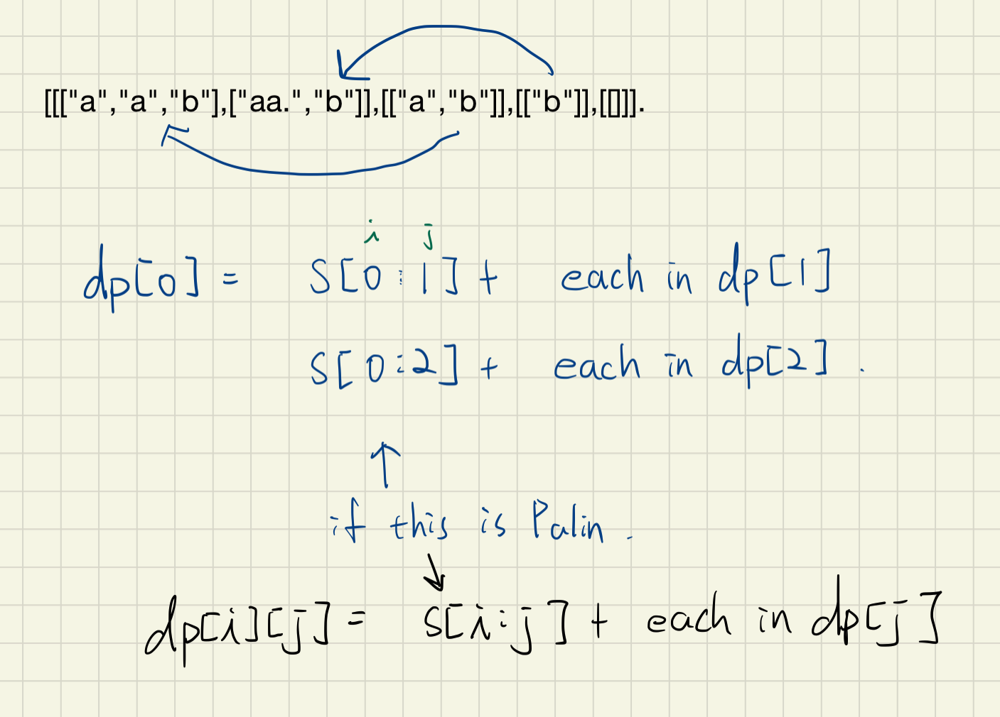

5. Complexity
    1. 對於每個字元都可以選擇要:
        1. 自己成為回文
        2. 跟前面成為回文
    2. 因此 recursion tree node 的總數是 2^N, 每個 node 都要去檢驗一次回文 N
    3. 所以總共是 N * 2^N
    4. 

### 技巧

- Backtracking 時注意`reference`的問題
    - deep copy the whole list: `comb[:]`
    - Reason
        - I have some discussion in other similar issue, and I think the reason should be that `if we use path during the recursive function call, it will use the reference of path, so if path is modified later, the content of res will be updated as well`. Thus we will get empty list in the end. But if we use path[:], it will create a new list and append it to res. The change of path will not affect the content of res

### 思路

Backtracking法: 直接看concise的解法

### Code
Concise using index
```py
class Solution:
    def partition(self, s: str) -> List[List[str]]:
        res = []
        def backtrack(s, comb):
            if not s:
                res.append(comb)
                return

            for i in range(1, len(s)+1):
                if self.isPalin(s[:i]):
                    backtrack(s[i:], comb + [s[:i]])
        backtrack(s, [])
        return res

    def isPalin(self, s):
        return s == s[::-1]
```

Memoization
```py
class Solution:
    def partition(self, s: str) -> List[List[str]]:
        res = []
        memo = {}

        def backtrack(s, comb):
            if len(s) == 1:
                return [[s]]
            if not s:
                return [[]]

            res = []
            if s not in memo:
                for i in range(1, len(s)+1):
                    if self.isPalin(s[:i]):
                        results = backtrack(s[i:], comb + [s[:i]])

                        for result in results:
                            res.append([s[:i]] + result)
                memo[s] = res
            return memo[s]

        return backtrack(s, [])

    def isPalin(self, s):
        return s == s[::-1]
```

Memoization with no-slice optimize
```py
class Solution:
    def partition(self, s: str) -> List[List[str]]:
        res = []
        memo = {}

        def backtrack(idx, comb):
            if idx == len(s)-1:
                return [[s[idx]]]
            if idx == len(s):
                return [[]]

            res = []
            if idx not in memo:
                for i in range(idx, len(s)+1):
                    if self.isPalin(s, idx, i+1):
                        cur = [s[idx:i+1]]
                        results = backtrack(i+1, comb + cur)

                        for result in results:
                            res.append(cur + result)
                memo[idx] = res
            return memo[idx]

        return backtrack(0, [])

    def isPalin(self, s, start, end):
        return s[start:end] == s[start:end][::-1]
```

DP BottomUp
```py
class Solution:
    def partition(self, s: str) -> List[List[str]]:
        dp = [[] for _ in range(len(s) + 1)]
        dp[-1] = [[]]
        for i in range(len(s) - 1, -1, -1):
            for j in range(i + 1, len(s) + 1):
                if s[i:j] == s[i:j][::-1]:
                    for each in dp[j]:
                        dp[i].append([s[i:j]] + each)
        return dp[0]
```
### Tag: #Recursive #Memoization #DP
---
## 132. Palindrome Partitioning II｜ 2/28
Given a string s, partition s such that every substring of the partition is a palindrome.

Return the minimum cuts needed for a palindrome partitioning of s.

Example 1:

Input: s = "aab"

Output: 1

Explanation: The palindrome partitioning ["aa","b"] could be produced using 1 cut.

Example 2:

Input: s = "a"

Output: 0

Example 3:

Input: s = "ab"

Output: 1


Constraints:

- 1 <= s.length <= 2000
- s consists of lower-case English letters only.

### 解題分析
1. 
2. 定義 dp[i] 為 s[0~i] 的最小切割
3. 狀態轉移:
    - 如何更新dp[i]呢，前面說過了其表示子串 [0, i] 範圍內的最小分割數。那麼這個區間的每個位置都可以嘗試分割開來，所以就用一個變量j來從0遍歷到i，這樣就可以把區間 [0, i] 分為兩部分，[0, j-1] 和 [j, i]，那麼suppose我們已經知道區間 [0, j-1] 的最小分割數 dp[j-1]，因為我們是從前往後更新的，而 j 小於等於 i，所以 dp[j-1] 肯定在 dp[i] 之前就已經算出來了。這樣我們就只需要判斷區間 [j, i] 內的子串是否為回文串了，是的話，dp[i] 就可以用 1 + dp[j-1] 來更新了。
4. Base case:
    - dp[0] = -1 比較難解釋一點，可以說 s[:0] 是不合法，或者直接 initial 成最多切割數，每個 char 一刀

### Code
``` py
class Solution:
    def minCut(self, s: str) -> int:
        if s == s[::-1]: return 0
        for i in range(1, len(s)):
            if s[:i]==s[:i][::-1] and s[i:]==s[i:][::-1]: return 1

        dp = [maxPossible for maxPossible in range(-1, len(s))]
        for i in range(0, len(s)):
            for j in range(i, len(s)):
                if s[i:j+1] == s[i:j+1][::-1]:
                    dp[j+1] = min(dp[j+1], dp[i]+1)
        return dp[-1]
```

嘗試從上題的改, TLE
```py
class Solution:
    def minCut(self, s: str) -> int:
        def recur(s, cut):
            if len(s) == 1:
                return cut

            res = float(inf)
            for i in range(1, len(s)+1):
                if s[:i] == s[:i][::-1]:
                    if not s[i:]:
                        res = min(res, cut)
                    else:
                        res = min(res, recur(s[i:], cut+1))
            return res

        return recur(s, 0)
```

加入 Memorization, 但 WA

- Case:
    - Input: "cabababcbc"
    - Output: 7
    - Expected: 3
```py
class Solution:
    def minCut(self, s: str) -> int:
        memo = {}
        def recur(s, cut):
            if s not in memo:
                if len(s) == 1:
                    return cut

                res = float(inf)
                for i in range(1, len(s)+1):
                    if s[:i] == s[:i][::-1]:
                        if not s[i:]:
                            res = min(res, cut)
                        else:
                            res = min(res, recur(s[i:], cut+1))
                memo[s] = res
            return memo[s]

        return recur(s, 0)
```

### Tag: #DP
---
## 198. House Robber｜ 3/16  | [ Review * 1 ] (DP 經典題！打通DP任督二脈)
You are a professional robber planning to rob houses along a street. Each house has a certain amount of money stashed, the only constraint stopping you from robbing each of them is that adjacent houses have security system connected and it will automatically contact the police if two adjacent houses were broken into on the same night.

Given a list of non-negative integers representing the amount of money of each house, determine the maximum amount of money you can rob tonight without alerting the police.

Example 1:

Input: [1,2,3,1]
Output: 4

Explanation: Rob house 1 (money = 1) and then rob house 3 (money = 3).
             Total amount you can rob = 1 + 3 = 4.
Example 2:

Input: [2,7,9,3,1]
Output: 12

Explanation: Rob house 1 (money = 2), rob house 3 (money = 9) and rob house 5 (money = 1).
             Total amount you can rob = 2 + 9 + 1 = 12.

### 技巧

- 如何思考DP題！
    - 題目要我們求出最大值，那我們可以定義dp[i] 為[0, i]區間的最大值
    - 維護一個一位數組 dp，其中 dp[i] 表示 [0, i] 區間可以搶奪的最大值，對當前i來說，有搶和不搶兩種互斥的選擇，不搶即為 dp[i-1]（等價於去掉 nums[i] 只搶 [0, i-1] 區間最大值），搶即為 dp[i-2] + nums[i]（等價於去掉 nums[i-1]）


### 思路

自己想出的dp題！！

靠測資寫出來的, [2,7,9,3,1]

要是靠greedy, 選擇了2跟7的最大值, 就會造成錯誤解

所以正確的方式其實是`max(a[i]+a[i+2], a[i+1])`

可寫出 a[0][0] = 0, a[0][1] = 2

a[1][0] = 2 ( max(a[0][0], a[0][1]) )

a[1][1] = 7 (a[0][0]+7)

a[2][0] = 7, a[2][1] = 2 + 9

由此推理可寫出轉移方程式。

並且透過多一個位置空間來更方便的initial

--

使用一維數組的DP:

維護一個一位數組 dp，其中 dp[i] 表示 [0, i] 區間可以搶奪的最大值，對當前i來說，有搶和不搶兩種互斥的選擇，不搶即為 dp[i-1]（等價於去掉 nums[i] 只搶 [0, i-1] 區間最大值），搶即為 dp[i-2] + nums[i]（等價於去掉 nums[i-1]）

### 類似題

LC740, Delete and Earn

### Code
``` py
class Solution:
    def rob(self, nums: List[int]) -> int:
        if not nums:
            return 0
        dp = [[0 for _ in range(len(nums)+1)] for i in range(len(nums)+1)]

        for i in range(1, len(nums)+1):
            dp[i][0] = max(dp[i-1][0], dp[i-1][1])
            dp[i][1] = dp[i-1][0] + nums[i-1]

        return max(dp[-1][0], dp[-1][1])
```

1-dimension dp
```py
class Solution:
    def rob(self, nums: List[int]) -> int:
        if len(nums) < 2:
            return nums[0]
        dp = [0 for _ in range(len(nums))]
        dp[0] = nums[0]
        dp[1] = max(dp[0], nums[1])
        for i in range(2, len(nums)):
            dp[i] = max(dp[i-1], nums[i]+dp[i-2])
        return dp[-1]
```

Two variables
```py
class Solution:
    def rob(self, nums: List[int]) -> int:
        if len(nums) < 2:
            return nums[0]
        pre_pre = nums[0]
        pre = max(pre_pre, nums[1])

        for i in range(2, len(nums)):
            cur = max(pre_pre+nums[i], pre)
            pre_pre, pre = pre, cur
        return pre
```
### Tag: #DP
---
## 199. Binary Tree Right Side View｜ 3/19 | [ Review * 2 ]
Given a binary tree, imagine yourself standing on the right side of it, return the values of the nodes you can see ordered from top to bottom.

Example:

### 思路

Level order traversal

### Code
dfs recursive
``` py
class Solution:
    def rightSideView(self, root: TreeNode) -> List[int]:
        res = []
        lev_node = []
        self.level_trav(root, 0, lev_node)

        for i in range(len(lev_node)):
            res.append(lev_node[i][-1])
        return res

    def level_trav(self, root, level, lev_node):
        if root:
            if level == len(lev_node):
                lev_node.append([])
            lev_node[level].append(root.val)
            self.level_trav(root.left, level+1, lev_node)
            self.level_trav(root.right, level+1, lev_node)
```

bfs iterative
```py
class Solution:
    def rightSideView(self, root: Optional[TreeNode]) -> List[int]:
        if not root: return []
        layer = [root]
        res = []
        while layer:
            new_layer = []
            res.append(layer[-1].val)
            for node in layer:
                if node.left:
                    new_layer.append(node.left)
                if node.right:
                    new_layer.append(node.right)
            layer = new_layer
        return res
```
### Tag: #Tree #BFS
---
## 201. Bitwise AND of Numbers Range｜ 3/25
Given a range [m, n] where 0 <= m <= n <= 2147483647, return the bitwise AND of all numbers in this range, inclusive.

Example 1:

Input: [5,7]
Output: 4

Example 2:

Input: [0,1]
Output: 0

Explanation:

[5,7] : 101 AND 110 AND 111 = 100 = 4

### 思路

由觀察得知我們要求的就是這個區間裡所有的數的共同left most bit，


然而我們不需要每個數都去考慮，只需考慮區間內的最大跟最小就行了，

因此可以得到將m跟n都同時right shift一位，然後判斷m跟n是否相等，

*並同時紀錄shift的量，if m = n時，此時的shift的量就是右邊該補0的量，*

*補零我們可以使用left shift來達成*

### Code
``` py
class Solution:
    def rangeBitwiseAnd(self, m: int, n: int) -> int:
        shift = 0
        while m < n:
            m = m >> 1
            n = n >> 1
            shift += 1
        return n << shift
```
---
## 203. Remove Linked List Elements｜ 3/25
Remove all elements from a linked list of integers that have value val.

Example:

Input:  1->2->6->3->4->5->6, val = 6

Output: 1->2->3->4->5

### 思路


### Code
``` py
class Solution:
    def removeElements(self, head: ListNode, val: int) -> ListNode:
        dum = ListNode(-1)
        dum.next = head
        cur = dum

        while cur.next:
            if cur.next.val == val:
                cur.next = cur.next.next
            else:
                cur = cur.next
        return dum.next
```
---
## 207. Course Schedule｜ 3/25 | [ Review * 2 ]
There are a total of numCourses courses you have to take, labeled from 0 to numCourses-1.

Some courses may have prerequisites, for example to take course 0 you have to first take course 1, which is expressed as a pair: [0,1]

Given the total number of courses and a list of prerequisite pairs, is it possible for you to finish all courses?


Example 1:

Input: numCourses = 2, prerequisites = [[1,0]]
Output: true
Explanation: There are a total of 2 courses to take.
             To take course 1 you should have finished course 0. So it is possible.
Example 2:

Input: numCourses = 2, prerequisites = [[1,0],[0,1]]
Output: false
Explanation: There are a total of 2 courses to take.
             To take course 1 you should have finished course 0, and to take course 0 you should
             also have finished course 1. So it is impossible.


Constraints:

The input prerequisites is a graph represented by a list of edges, not adjacency matrices. Read more about how a graph is represented.
You may assume that there are no duplicate edges in the input prerequisites.
1 <= numCourses <= 10^5


### 解題分析
- 基本的圖論找環
    1. 建立連結 (node -> list[node])
    2. 走訪所有節點
        3. backtrack 其子節點
        4. 如果出現在 visited 中, 表示有走過了 -> 找到環
    3. Note: 可用 cache 來剪枝

### 思路

Using `checked` as cache, if we don't use it we will encounter the worst case, chain,

which is: 1-2-3-4-5

we visit: 1-2-3-4-5, 2-3-4-5, 3-4-5 ...

so that we use cached to note that there is no cycle in 5, 4, 3, 2, 1

### Code
DFS without cache
```py
class Solution:
    def canFinish(self, numCourses: int, prerequisites: List[List[int]]) -> bool:
        graph = defaultdict(list)
        node_status = {} # 0: not visit, 1: visited

        # check if exist circle in all prerequest
        def exist_circle(node):
            if node_status.get(node) == 1:
                return True
            node_status[node] = 1

            # the next prerequest need to take
            for neib in graph[node]:
                if exist_circle(neib):
                    return True
            node_status[node] = 0
            return False

        for cur, pre in prerequisites:
            graph[pre].append(cur)

        for pre in list(graph.keys()):
            if exist_circle(pre):
                return False
        return True
```

DFS with cache (Optimal)
```py
class Solution:
    def canFinish(self, numCourses: int, prerequisites: List[List[int]]) -> bool:
        graph = defaultdict(list)
        node_status = {} # 0: not visit, 1: visited, -1: previous visit, but no cycle detect

        def exist_circle(node):
            if node_status.get(node) == 1:
                return True
            if node_status.get(node) == -1:
                return False
            node_status[node] = 1

            # the next prerequest need to take
            for neib in graph[node]:
                if exist_circle(neib):
                    return True
            node_status[node] = -1
            return False

        # build graph
        for cur, pre in prerequisites:
            graph[pre].append(cur)

        # check if exist circle in all prerequest
        for pre in list(graph.keys()):
            if exist_circle(pre):
                return False
        return True
```

### Tag: #Graph #DFS
---
## 210. Course Schedule II｜ 3/25
There are a total of n courses you have to take labelled from 0 to n - 1.

Some courses may have prerequisites, for example, if prerequisites[i] = [ai, bi] this means you must take the course bi before the course ai.

Given the total number of courses numCourses and a list of the prerequisite pairs, return the ordering of courses you should take to finish all courses.

If there are many valid answers, return any of them. If it is impossible to finish all courses, return an empty array.

Example 1:

- Input: numCourses = 2, prerequisites = [[1,0]]
- Output: [0,1]
- Explanation: There are a total of 2 courses to take. To take course 1 you should have finished course 0. So the correct course order is [0,1].

Example 2:

- Input: numCourses = 4, prerequisites = [[1,0],[2,0],[3,1],[3,2]]
- Output: [0,2,1,3]
- Explanation: There are a total of 4 courses to take. To take course 3 you should have finished both courses 1 and 2. Both courses 1 and 2 should be taken after you finished course 0.
- So one correct course order is [0,1,2,3]. Another correct ordering is [0,2,1,3].

Example 3:

- Input: numCourses = 1, prerequisites = []
- Output: [0]

Constraints:

- 1 <= numCourses <= 2000
- 0 <= prerequisites.length <= numCourses * (numCourses - 1)
- prerequisites[i].length == 2
- 0 <= ai, bi < numCourses
- ai != bi
- All the pairs [ai, bi] are distinct.

### 解題分析
- 一秒恢復記憶的圖
    - 
- 可以直接從找環的邏輯下去改
    - 分析:
        - 差別在走完 DFS 後的 set visited 部分!
        - 找環:
            - 確認每個 src 都不存在環, 因此只需要在確認沒環後, reset 就好
        - 找路徑:
            - 確定完當前不存在環不能 reset, 因為也許其他人也會連到他(這樣也不是環哦！只是連到不是繞一圈到自己)
            - 因此我們針對先前走過的筆畫, 若這條筆畫都是合法的, 我們必須把這沿途的所有節點都 mark 上特別的記號, 若有人走到這我們可以直接回傳合法
            - 那對於當前的此筆畫, 很遺憾的我們必須先把他 mark 上 visit, 若同一筆畫被我遇到, 直接 return 有環
- 跟找環一樣我們 loop 所有的點, 並對此點找環
    - 但這次我們傳入一個 stack, 去紀錄這筆畫畫過的點, 若此筆畫不存在環, 我們將其加入 res
    - existCircle 需要改的內容:
        1. 額外多增加一個狀態 `visited but not circle`
        2. 額外多維護一個 stack 去 append path
            - Note: 更新的時機是確定當前點的所有鄰居都不會產生環時

### Code
Modify from LC207 (Very Similar)

``` py
from collections import defaultdict
class Solution:
    def findOrder(self, numCourses: int, prerequisites: List[List[int]]) -> List[int]:
        self.order = defaultdict(list)
        for cur, pre in prerequisites:
            self.order[pre].append(cur)

        self.visited = {}
        res = []
        for pre in range(numCourses): # we could list(self.order.keys()), but testcase: (1, []), should return [0]
            tempStack = []
            if self.existCircle(pre, tempStack):
                return []
            res += tempStack
        return res[::-1]

    def existCircle(self, pre, tempStack):
        if self.visited.get(pre) == 1: # backEdge -> circle found
            return True
        if self.visited.get(pre) == -1: # crossEdge, forwardEdge
            return False

        self.visited[pre] = 1 # assume it's backedge
        for _next in self.order[pre]:
            if self.existCircle(_next, tempStack):
                return True
        self.visited[pre] = -1 # if it does not contain circle, then it's safe(cross or forward edge)
        tempStack.append(pre)
        return False
```

### Tag: #Graph #DFS #TopologicalSort
---

## 209. Minimum Size Subarray Sum｜ 3/26 | [Review * 1]
Given an array of n positive integers and a positive integer s, find the minimal length of a contiguous subarray of which the sum ≥ s. If there isn't one, return 0 instead.

Example:

Input: s = 7, nums = [2,3,1,2,4,3]
Output: 2
Explanation: the subarray [4,3] has the minimal length under the problem constraint.

Follow up:
If you have figured out the O(n) solution, try coding another solution of which the time complexity is O(n log n).

### 解題分析

1. Sliding Window(two pointer) O(n)
    1. 假設我們已經有了一個 >= s 的陣列了
    2. 那麼再來可以嘗試的是慢慢把尾巴縮短，若還是 >= s 表示我們找到一個更優解

2. Binary Search O(nlogn)
    1. 若要使用 BS 的條件是，此陣列必須是有序的
    2. 那我們能製造出有序陣列的方式就是 accumulated sum (前提是陣列中每個元素都是正數)
    3. 有了 acc sum array 後，我們便可以思考如何找到最短序列長
    4. acc[j]-acc[i] 為 i ~ j 的和，但有兩個變數無法使用 BS
    5. 因此我們用回圈並且固定 acc[i]，那麼條件就變成:
        1. 尋找在以此 acc[i] 為第一個元素, acc[j]-acc[i] 必須 >= s 的左邊界
        2. 帶入尋找左邊界的模板，注意 l 要設為 i+1 因為 j 跟 i 不能重複
### 思路

two solution: 1. two pointer, 2. binary search


### Code
Sliding Window
```py
class Solution:
    def minSubArrayLen(self, s: int, nums: List[int]) -> int:
        if not nums or sum(nums) < s:
            return 0
        n = len(nums)
        res = n+1
        cur_sum = 0
        l = 0

        for i in range(n):
            cur_sum += nums[i]

            while cur_sum >= s:
                res = min(res, i-l+1)
                cur_sum -= nums[l]
                l += 1
        return res
```

Two pointer
```py
class Solution:
    def minSubArrayLen(self, s: int, nums: List[int]) -> int:
        left, right, leng, sums, res = 0, 0, len(nums), 0, len(nums)+1

        while right < leng:
            while s > sums and right < leng:
                sums += nums[right]
                right += 1
            while s <= sums and left < leng: # note here should use <=, or if s==sum, the outer while loop won't stop
                res = min(res, right - left)
                sums -= nums[left]
                left += 1
        return res if res != len(nums) + 1 else 0

```

Binary Search
```py
class Solution:
    def minSubArrayLen(self, s: int, nums: List[int]) -> int:
        if not nums or sum(nums) < s:
            return 0

        # calculate the accumulated sum
        sums = [0]
        for num in nums:
            sums.append(sums[-1]+num)

        n = len(sums)
        res = float(inf)
        for i in range(n): # iterate through the sums array
            cur = sums[i] # fix the left one

            # 尋找在以此 cur 為第一個元素其最少能大於 s 的元素需要幾個
            # sums[k] - cur 為此連續元素的和
            # find left border of sums[k]-cur >= s
            # l = i+1, 因為不能與 cur 重複

            l, r = i+1, n-1
            while r > l:
                mid = l + (r-l) // 2
                if sums[mid] - cur >= s:
                    r = mid
                else:
                    l = mid+1
            if sums[r]-cur >= s:
                res = min(res, r-i)
        return res
```
### Tag: #SlidingWindow #TwoPointer #BinarySearch

### 類似題
1. Sliding Window 解法類似題
    1. 1248. Count Number of Nice Subarrays
    2. 1234. Replace the Substring for Balanced String
    3. 1004. Max Consecutive Ones III
    4. 930. Binary Subarrays With Sum
    5. 992. Subarrays with K Different Integers
    6. 904. Fruit Into Baskets
    7. 862. Shortest Subarray with Sum at Least K


---
## 210. Course Schedule II｜ 3/26 (Unfinished, need Topological sort to solve)
There are a total of n courses you have to take, labeled from 0 to n-1.

Some courses may have prerequisites, for example to take course 0 you have to first take course 1, which is expressed as a pair: [0,1]

Given the total number of courses and a list of prerequisite pairs, return the ordering of courses you should take to finish all courses.

There may be multiple correct orders, you just need to return one of them. If it is impossible to finish all courses, return an empty array.


### 思路

無法使用backtracking 來解這題

### 類似題

- Leetcode 953 Alien Dictionary (做完此題再回來改此題)

### Code
``` py
"""
Backtracking solution is not adoptable to this question.
For this question we need to know the depth of each node, so that we know where to start walking from.
NEED to use Topological Sort
"""

from collections import defaultdict
class Solution:
    def findOrder(self, numCourses: int, prerequisites: List[List[int]]) -> List[int]:
        courseDic = defaultdict(list)
        for relation in prerequisites:
            cur, prev = relation[0], relation[1]
            courseDic[prev].append(cur)

        path, checked, res = [False] * numCourses, [False] * numCourses, set()

        print(courseDic)
        for course in range(numCourses):
            hasCycle, res = self.isCycle(path, checked, res, course, courseDic)
            if hasCycle:
                return []
            if len(res) == numCourses:
                return res
    def isCycle(self, path, checked, res, course, courseDic):
        if path[course]:
            return True, res
        if checked[course]:
            return False, res

        path[course] = True
        hasCycle = False
        temp = res
        temp.add(course)
        for child in courseDic[course]:
            hasCycle, temp = self.isCycle(path, checked, temp, child, courseDic)
            if hasCycle:
                break

        path[course] = False # reset back tracking
        checked[course] = True

        if hasCycle == False:
            res = temp
        return hasCycle, res

```
---
## 204. Count Primes｜ 3/26 | [ Review * 1 ]
Count the number of prime numbers less than a non-negative number, n.

Example:

Input: 10 Output: 4

Explanation: There are 4 prime numbers less than 10, they are 2, 3, 5, 7.
### 思路

從2開始遍歷到n-1, 根據質數的數去把非質數的數標記出來

1. i=2 去更新 2, 4, 6, 8 ... 2n
2. 只要 i+1 沒有被標記成非質數, 他就是質數, 再用他的倍數去標記

### Code
``` py
class Solution:
    def countPrimes(self, n: int) -> int:
        if n <= 2:
            return 0

        not_prime = set()
        for number in range(2, int(sqrt(n))+1):
            if number not in not_prime:
                for not_prime_num in range(number*2, n, number): # find less than n
                    not_prime.add(not_prime_num)
        # minus 1 and itself
        return n - len(not_prime) - 2
```

```py
class Solution:
    def countPrimes(self, n: int) -> int:
        if n <= 2:
            return 0

        prime = [1 for _ in range(n)]
        prime[0] = prime[1] = 0
        for number in range(2, int(sqrt(n))+1):
            if prime[number] == 1:
                for not_prime_num in range(number*2, n, number): # find less than n
                    prime[not_prime_num] = 0
        return sum(prime)
```
### Tag: #Array
---
## 205. Isomorphic Strings｜ 3/26 | [ Review * 1 ]
Given two strings s and t, determine if they are isomorphic.

Two strings are isomorphic if the characters in s can be replaced to get t.

All occurrences of a character must be replaced with another character while preserving the order of characters. No two characters may map to the same character but a character may map to itself.


### 解題分析
1. 此題求 pattern 要相同, 因此在做 mapping 的時候是要做雙向的 mapping
    - 參考例子: s = badc, t = baba

### 思路

將其轉換成共同的形式

### 相似題

LC 1153. String Transforms Into Another String

### Code
General Approach for this and 1153
```py
class Solution:
    def isIsomorphic(self, s: str, t: str) -> bool:
        map_s2t = {}
        map_t2s = {}
        for s1, t1 in zip(s, t):
            if s1 not in map_s2t and t1 not in map_t2s:
                map_s2t[s1] = t1
                map_t2s[t1] = s1
            elif map_s2t.get(s1) != t1 or map_t2s.get(t1) != s1:
                return False
        return True
```

``` py
class Solution:
    def isIsomorphic(self, s: str, t: str) -> bool:
        return self.converter(s) == self.converter(t)

    def converter(self, s):
        dic = dict()
        str1 = ""
        for c in s:
            if c not in dic:
                dic[c] = str(len(dic)+1)
            str1 += dic[c]
        return str1
```
### Tag: #HashTable
---
## 211. Add and Search Word - Data structure design｜ 3/27 | [Review * 1]
Design a data structure that supports the following two operations:

void addWord(word)

bool search(word)

search(word) can search a literal word or a regular expression string containing only letters a-z or .. A . means it can represent any one letter.

Example:

addWord("bad")

addWord("dad")

addWord("mad")

search("pad") -> false

search("bad") -> true

search(".ad") -> true

search("b..") -> true

Note:
You may assume that all words are consist of lowercase letters a-z.

### 解題分析
1. Trie
    1. 談到高效的字串搜索, AutoComplete 就要想到 Trie
    2. Time:
        1. add:
            - O(M)
        2. search:
            - O(M) if well-defined words without dot
            - O(N * 26^M)
                - case s = "....", len(s) = `M`
                - there is `N` words being added
2. Set of length
    1. 當今天給定的搜索目標 "長度" 是固定的即可使用此法
    2. 但此方法的局限性比較高，缺點:
        1. 找符合的 Prefix
        2. 如果相同長度的字過多到 set 會發生 collision
        3. 插入的字重複 prefix 很多時， Trie 會比較省空間

### 思路
使用字典樹實踐

Trie結構: 一個dict{"char": TrieNode}, 一個isWord(bool)

### Code
Trie字典樹:
```py
class TrieNode:
        def __init__(self):
            self.ch_list = {}
            self.isWord = False

class WordDictionary:

    def __init__(self):
        """
        Initialize your data structure here.
        """
        self.root = TrieNode()

    def addWord(self, word: str) -> None:
        """
        Adds a word into the data structure.
        """
        root = self.root
        for ch in word:
            if ch not in root.ch_list:
                root.ch_list[ch] = TrieNode()
            root = root.ch_list[ch]
        root.isWord = True

    def search(self, word: str) -> bool:
        """
        Returns if the word is in the data structure. A word could contain the dot character '.' to represent any one letter.
        """
        return self.search_word(word, self.root)

    def search_word(self, word, root):
        if not word:
            return root.isWord:
        elif word[0] == ".":
            for entry in root.ch_list:
                if self.search_word(word[1:], root.ch_list[entry]):
                    return True
            return False
        elif word[0] in root.ch_list:
            return self.search_word(word[1:], root.ch_list[word[0]])
        else:
            return False
```

Optimal Solution Using set:
```py
from collections import defaultdict
class WordDictionary:

    def __init__(self):
        """
        Initialize your data structure here.
        """
        self.leng_set = defaultdict(set)


    def addWord(self, word: str) -> None:
        self.leng_set[len(word)].add(word)


    def search(self, word: str) -> bool:
        m = len(word)
        for dic_word in self.leng_set[m]:
            i = 0
            while i < m and word[i] in {dic_word[i], "."}:
                i += 1
            if i == m:
                return True
        return False
```

土法煉鋼法:
``` py
class WordDictionary:

    def __init__(self):
        """
        Initialize your data structure here.
        """
        self.dic = dict()

    def addWord(self, word: str) -> None:
        """
        Adds a word into the data structure.
        """
        self.dic[word] = len(word)

    def search(self, word: str) -> bool:
        """
        Returns if the word is in the data structure. A word could contain the dot character '.' to represent any one letter.
        """
        leng = len(word)

        if leng not in self.dic.values():
            return False
        else:

            cand = []
            for key in self.dic:
                if self.dic[key] == leng:
                    cand.append(key)
            return self.find(word, cand, 0)

    def find(self, word, cand, idx):

        if idx == len(word) or len(cand) == 0:
            if len(cand) > 0:
                return True
            else:
                return False

        if word[idx] == '.':
            return self.find(word, cand, idx+1)

        new_cand = []
        for entry in cand:
            if entry[idx] == word[idx]:
                new_cand.append(entry)
        return self.find(word, new_cand, idx+1)

        # Your WordDictionary object will be instantiated and called as such:
        # obj = WordDictionary()
        # obj.addWord(word)
        # param_2 = obj.search(word)
```
### Tag: #Trie #Recursive #Set
---
## 213. House Robber II｜ 3/27 | [ Review * 1 ]
You are a professional robber planning to rob houses along a street. Each house has a certain amount of money stashed. All houses at this place are arranged **in a circle.** That means the first house is the neighbor of the last one. Meanwhile, adjacent houses have security system connected and it will automatically contact the police if two adjacent houses were broken into on the same night.

Given a list of non-negative integers representing the amount of money of each house, determine the maximum amount of money you can rob tonight without alerting the police.

Example 1:

Input: [2,3,2]

Output: 3

Explanation: **You cannot rob house 1 (money = 2) and then rob house 3 (money = 2),because they are adjacent houses.**
Example 2:

Input: [1,2,3,1]

Output: 4

Explanation: Rob house 1 (money = 1) and then rob house 3 (money = 3).
             Total amount you can rob = 1 + 3 = 4.

### 解題分析
1. 題目給的提示已經夠明顯, 頭跟尾是鄰居, 表示要馬取頭, 要馬取尾, 也就是說相比與上一題, 我們這題限制是更多


### 思路

處理circle的狀況就是只能取頭，或只能取尾

但需要另外處理只有一間房子的情況(不能去頭 也不能去尾)

### Code
Using two dimension DP
```py
class Solution:
    def rob(self, nums: List[int]) -> int:
        if len(nums) <= 1:
            return nums[0] if len(nums) != 0 else 0
        return max(self.rob_hourse(nums[1:]), self.rob_hourse(nums[:-1]))
    def rob_hourse(self, nums):
        sums = [[0] * 2 for _ in range(len(nums)+1)]
        for i in range(1, (len(nums)+1) ):
            sums[i][0] = max(sums[i-1][0], sums[i-1][1])
            sums[i][1] = sums[i-1][0] + nums[i-1]
        return max(sums[-1][0], sums[-1][1])
```

dp based on last question (Optimal)
``` py
class Solution:
    def rob(self, nums: List[int]) -> int:
        if len(nums) < 2:
            return nums[0]
        rob_first = self.rob_simple(nums[:-1])
        rob_second = self.rob_simple(nums[1:])
        return max(rob_first, rob_second)

    def rob_simple(self, nums: List[int]) -> int:
        if len(nums) < 2:
            return nums[0]
        pre_pre = nums[0]
        pre = max(pre_pre, nums[1])

        for i in range(2, len(nums)):
            cur = max(pre_pre+nums[i], pre)
            pre_pre, pre = pre, cur
        return pre
```
### Tag: #DP
---
## 9. Palindrome Number｜ 3/28
Determine whether an integer is a palindrome. An integer is a palindrome when it reads the same backward as forward.

Example 1:

Input: 121

Output: true

Example 2:

Input: -121

Output: false

Explanation: From left to right, it reads -121. From right to left, it becomes 121-. Therefore it is not a palindrome.

Example 3:

Input: 10

Output: false

Explanation: Reads 01 from right to left. Therefore it is not a palindrome.

Follow up:

Coud you solve it without converting the integer to a string?
### 思路


### Code
``` py
class Solution:
    def isPalindrome(self, x: int) -> bool:
        if x < 0:
            return False
        div = 1
        while x//div >= 10:
            div *= 10

        while x > 0:
            left = x // div
            right = x % 10
            if left != right:
                return False
            x = (x % div) // 10
            div //= 100
        return True
```
---
## 12. Integer to Roman｜ 3/29


Example 5:

Input: 1994
Output: "MCMXCIV"
Explanation: M = 1000, CM = 900, XC = 90 and IV = 4.

### 思路


### Code
``` py
class Solution:
    def intToRoman(self, num: int) -> str:
        roman = [(1000, "M"), (900, "CM"), (500, "D"), (400, "CD"), (100, "C"), (90, "XC"), (50, "L"), (40, "XL"), (10, "X"), (9, "IX"), (5, "V"), (4, "IV"), (1, "I")]

        res = ""
        for val in roman:
            while num >= val[0]:
                num -= val[0]
                res += val[1]
        return res
```
---
## 214. Shortest Palindrome｜ 3/29
Given a string s, you are allowed to convert it to a palindrome by adding characters in front of it. Find and return the shortest palindrome you can find by performing this transformation.

Example 1:

Input: "aacecaaa"

Output: "aaacecaaa"

Example 2:

Input: "abcd"

Output: "dcbabcd"

### 思路

在考慮ex1的時候可以得出我們首先必須把此字串中包含的最長回文先找出來，再進行補全，

那如何找最長回文呢？ 一開始在想方法時覺得太複雜了，如果起點可以是字串中的任何起點的話，

但題目只允許從最前面去補全，這意味著，當我們在找原字串存在的最長回文時**必須要包含第一個字母**，

這樣就簡單許多了，我們依序將後面的字母加到第一個字母後，並紀錄最長的長度

第二個path則是將不全的字串補全，完整的字串則直接返回

### Code
``` py
class Solution:
    def shortestPalindrome(self, s: str) -> str:
        max_palin_leng = 0
        for i in range(len(s)+1):
            max_palin_leng = max(max_palin_leng, self.len_palin(s[:i]))
        if max_palin_leng == len(s):
            return s
        else:
            res_str = s[max_palin_leng:]
            return res_str[::-1] + s

    def len_palin(self, s):
        if s[::1] == s[::-1]:
            return len(s)
        return 0
```
---
## 219. Contains Duplicate II｜ 3/29 | [ Review * 1 ]
Given an array of integers and an integer k, find out whether there are two distinct indices i and j in the array such that nums[i] = nums[j] and the absolute difference between i and j is at most k.

Example 1:

Input: nums = [1,2,3,1], k = 3

Output: true

Example 2:

Input: nums = [1,0,1,1], k = 1

Output: true

Example 3:

Input: nums = [1,2,3,1,2,3], k = 2

Output: false
### 思路

建立元素與idx的hash

再去比較相同hash slot中的idx距離

### Code
``` py
class Solution:
    def containsNearbyDuplicate(self, nums: List[int], k: int) -> bool:
        idx_map = {}

        for i, num in enumerate(nums):
            if num in idx_map:
                if i - idx_map[num] <= k:
                    return True
            idx_map[num] = i
        return False
```
### Tag: #HashTable
---
## 220. Contains Duplicate III｜ 3/30 | [ Review * 1 ]
Given an array of integers, find out whether there are two distinct indices i and j in the array such that the absolute difference between nums[i] and nums[j] is at most t and the absolute difference between i and j is at most k.

Example 1:

Input: nums = [1,2,3,1], k = 3, t = 0

Output: true

Example 2:

Input: nums = [1,0,1,1], k = 1, t = 2

Output: true

Example 3:

Input: nums = [1,5,9,1,5,9], k = 2, t = 3

Output: false

### 技巧

Bucket Sort: 用來快速的將一個陣列分類，並找出特定range的

### 思路
- 用字典分類, 然後再根據key排序, 還是TLE

    - 會在key數量很大時fail

- 使用 TreeSet, or Balanced Binary tree
    - 使用滑動窗口處理index range
    - 再從這個逐漸變大的窗口中找出最大最小，判斷是否在區間內
    - 由於是逐漸擴大的窗口，每個存在tree中的元素都有經過檢驗，因此可以判斷成最大罪小不存在，則就是不存在
    - 詳見 LC 的官方solution

- Bucket Sort + Sliding Window
    - 我們可以先使用滑動窗口來處理index range的問題
    - 剩下的問題就是如何在 constant 時間中在這個window中找出，是否有符合range的數
    - 這時就可以使用 Bucket 法 (Range query 特別適用)
        - 
        - 我們一個 bucket 裡面只放一個 num
        - 針對每一個新遇到的 num, 我們先去取得他的 bucket_idx, 再去檢查這個 index 周邊(含自己) 的 bucket 裡是否有東西
        - 檢查周邊的這個動作就是 query range 的操作, 我們把題目要我們求的 range 變成 bucket_idx 的一個單位
        - 對於處理過期的元素, 我們首先是把這個 num 找出來, 也就是 curr_i - idx_diff, 再透過這個 num 去找出對應的 bucket 把它刪了

### Code
Bucket Sort
```py
class Solution:
    def containsNearbyAlmostDuplicate(self, nums: List[int], k: int, t: int) -> bool:
        if k<0 or t<0:
            return False
        bucket = dict()
        bucket_size = t
        for i, num in enumerate(nums):
            idx = num // bucket_size if bucket_size != 0 else num
            if idx in bucket:
                return True

            # check nearby bucket
            if idx-1 in bucket:
                that = bucket[idx-1]
                if abs(that - num) <= t:
                    return True
            if idx+1 in bucket:
                that = bucket[idx+1]
                if abs(that - num) <= t:
                    return True

            # move the window
            bucket[idx] = num
            if i >= k:
                expired_idx = nums[i-k] // bucket_size if bucket_size != 0 else nums[i-k]
                del bucket[expired_idx] # can delete a bucket bc only alow one elem in a bucket(if there is a num going to same bucket, we return True in advance)
        return False
```

Simplify Version
```py
class Solution:
    def containsNearbyAlmostDuplicate(self, nums: List[int], idx_diff: int, val_diff: int) -> bool:
        bucket_size = val_diff
        bucket = {} # b_idx -> num

        def get_bucket_idx(num):
            return num // bucket_size if bucket_size != 0 else num

        for i, num in enumerate(nums):
            b_idx = get_bucket_idx(num)

            for nearby_idx in [b_idx-1, b_idx, b_idx+1]:
                if nearby_idx in bucket and abs(bucket[nearby_idx] - num) <= val_diff:
                    return True

            bucket[b_idx] = num

            if i >= idx_diff:
                expired_num = nums[i-idx_diff]
                expired_idx = get_bucket_idx(expired_num)
                del bucket[expired_idx]

        return False
```


用字典分類, 然後再根據key排序, 還是TLE

``` py
from collections import defaultdict
class Solution:
    def containsNearbyAlmostDuplicate(self, nums: List[int], k: int, t: int) -> bool:
        if t < 0:
            return False
        num_idx_dict = defaultdict(list)
        for i, num in enumerate(nums):
            num_idx_dict[num].append(i)

        num_idx_list = []
        for entry in num_idx_dict:
            num_idx_list.append((entry, num_idx_dict[entry]))
        num_idx_list = sorted(num_idx_list)

        for i, entry in enumerate(num_idx_list):
            # self find
            if self.isLessK(entry[1], k):
                return True
            # find those idx whose key range is within t
            for j in range(i+1, len(num_idx_list)):
                if num_idx_list[j][0] - entry[0] <= t:
                    idx_list = entry[1] + num_idx_list[j][1]
                    if self.isLessK(sorted(idx_list), k):
                        return True
        return False

    def isLessK(self, idx_list, k):
        for i in range(len(idx_list)-1):
            if idx_list[i+1] - idx_list[i] <= k:
                return True
        return False
```
### Tag: #HashTable #Bucket
---
## 221. Maximal Square｜ 3/30 | [ Review * 1 ]
Given a 2D binary matrix filled with 0's and 1's, find the largest square containing only 1's and return its area.

Example:

Input:

1 0 1 0 0

1 0 1 1 1

1 1 1 1 1

1 0 0 1 0

Output: 4

### 解題分析
1. dp 的陣列大小, 應該多 1 因為我們也需要去判斷 first col and first row 是否有包含 '1'
    - 否則 [[0,1], [1,0]], 會 return 0, 應該要 return 1
    - 也不能把 maxlen init 為1, 因為 [[0,0], [0,0]] return 0
    - 見 WA 解法

### 思路

相對於之前找最大長方形的題，不曉得哪邊是長哪邊是寬，這題相對好處理

透過正方形的性質 長 = 寬 = 對角線

我們可以透過dp數組紀錄，以這個點為正方形右下角，所可以形成的最大正方形。

那麼我們就需要考慮此點的 [上, 左, 左上] 的dp值，三者取最小


### Code
``` py
class Solution:
    def maximalSquare(self, matrix: List[List[str]]) -> int:
        if not matrix or not matrix[0]:
            return 0
        r, c = len(matrix), len(matrix[0])
        dp = [[0 for _ in range(c+1)] for _ in range(r+1)]
        max_len = 0

        for i in range(1, r+1):
            for j in range(1, c+1):
                if matrix[i-1][j-1] == '1':
                    dp[i][j] = min(dp[i-1][j], dp[i][j-1], dp[i-1][j-1]) + 1
                    max_len = max(max_len, dp[i][j])
        return max_len**2
```

DP (Space Optimize)
```py
class Solution:
    def maximalSquare(self, matrix: List[List[str]]) -> int:
        r, c = len(matrix), len(matrix[0])
        prev = [0 for _ in range(c+1)]
        dp = [0 for _ in range(c+1)]
        max_len = 0

        for i in range(1, r+1):
            for j in range(1, c+1):
                if matrix[i-1][j-1] == "1":
                    dp[j] = min(prev[j], dp[j-1], prev[j-1]) + 1
                    max_len = max(max_len, dp[j])
                else:
                    dp[j] = 0 # Note need to assign to zero or this idx would be dirty
            dp, prev = prev, dp
        return max_len**2
```

WA 解法
```py
class Solution:
    def maximalSquare(self, matrix: List[List[str]]) -> int:
        if not matrix or not matrix[0]:
            return 0
        r, c = len(matrix), len(matrix[0])
        dp = [[0 if matrix[i][j] == '0' else 1 for j in range(c)] for i in range(r)]
        max_len = 0

        for i in range(1, r):
            for j in range(1, c):
                if dp[i][j] == 1:
                    dp[i][j] = min(dp[i-1][j], dp[i][j-1], dp[i-1][j-1]) + 1
                    max_len = max(max_len, dp[i][j])

        return max_len**2
```

修改WA的解法, Space(1) by 修改原陣列值
```py
class Solution:
    def maximalSquare(self, m: List[List[str]]) -> int:
        if not m or not m[0]:
            return 0
        r, c = len(m), len(m[0])
        for i in range(r):
            for j in range(c):
                m[i][j] = 0 if m[i][j] == '0' else 1
        max_len = 0

        for i in range(r):
            for j in range(c):
                if (i == 0 or j == 0) and m[i][j] == 1:
                    max_len = max(max_len, 1)
                elif m[i][j] == 1:
                    m[i][j] = min(m[i-1][j], m[i][j-1], m[i-1][j-1]) + 1
                    max_len = max(max_len, m[i][j])

        return max_len**2
```

### Tag: #DP
---
## 218. The Skyline Problem｜ 3/31 | [ Review * 1 ]
A city's skyline is the outer contour of the silhouette formed by all the buildings in that city when viewed from a distance. Now suppose you are given the locations and height of all the buildings as shown on a cityscape photo (Figure A), write a program to output the skyline formed by these buildings collectively (Figure B).


Notes:

The number of buildings in any input list is guaranteed to be in the range [0, 10000].

The input list is already sorted in ascending order by the left x position Li.

The output list must be sorted by the x position.

There must be no consecutive horizontal lines of equal height in the output skyline. For instance, [...[2 3], [4 5], [7 5], [11 5], [12 7]...] is not acceptable; the three lines of height 5 should be merged into one in the final output as such: [...[2 3], [4 5], [12 7], ...]

### 解題分析
0. 算法邏輯:
    1. 需定義一個事件, 且此事件出現的先後順序必須能讓我們貪婪的去畫出天際線
    2. 排序事件並走訪事件 -> 讓事件出現的順序按照我們希望的出現順序出現
        1. 發生時機 -> 高度 -> 隱沒時機(不重要)
    3. 用一個 heap 去維護:
        1. 直到當前掃描位置, 還沒隱沒的 building 高度
        2. 其隱沒的時機
    4. 進行 line sweep:
        1. 根據此事件的出現時機去移除掉已經過期的 building -> heappop
        2. 放入新的 building
        3. 試著畫線
            1. 此時掃描到的 pos, 如果看到的最高 building (heap top), 跟 res 李紀錄得不一樣, 就是畫線的時機了
1. 定義事件: 要求出天際線的點，首先必須先知道哪些位置有可能被畫出點來 -> building 的 start/end 位置
2. 定義畫線的規則
    1. 每個點位最多只畫一點，須符合規則
        1. 需與前一個點位的高度不一樣
            1. 因此 building 的隱沒位不會被畫，因為要馬與前一個點位一樣 (如 (7,15))
            2. 要馬 有更高的點已經出現
            3. 或者 直接落到地平面 (此時就會用到 defaut放在 heap 裡的點)
3. 定義如何操作 heap
    1. 放什麼?
        1. (高度, 隱沒位置)
    2. pop:
        1. 當此 building 已經結束
        2. 因此我們須在 event 中放入 building 的 ending place
    3. push:
        1. 當此 event 是有高度的 (非 ending event)
    4. top:
        1. 當此 position 時所看到的最大高度與前一個點不一樣

### 思路

1. Divide and conquer
    - Didn't implement myself
2. Max Heap (Priority Queue)
    - 
### Code
Heap Cleaner Solution
```py
from heapq import heappush, heappop
class Solution:
    def getSkyline(self, buildings: List[List[int]]) -> List[List[int]]:
        events = [(L, -H, R) for L, R, H in buildings]
        events += [(R, 0, 0) for _, R, _ in buildings]
        events = sorted(events)

        res = [[0, 0]]
        live = [(0, float(inf))]
        for pos, negH, R in events:
            while live[0][1] <= pos:
                heappop(live)

            if negH:
                heappush(live, (negH, R))

            if -live[0][0] != res[-1][1]:
                res.append([pos, -live[0][0]])
        return res[1:]
```

Heap
``` py
class Solution:
    def getSkyline(self, buildings: List[List[int]]) -> List[List[int]]:
        # possible corner positions
        position = set([b[0] for b in buildings] + [b[1] for b in buildings])

        hp = [] # heap store current still availible building (-height, right)
        sky = [[-1,0]]
        i = 0
        for p in sorted(position):

            # add the new buildings whose left side is lefter than position p
            # they are candidates for the current highest building
            while i < len(buildings) and buildings[i][0] <= p:
                heappush(hp, (-buildings[i][2], buildings[i][1]) )
                i += 1

            # remove the past buildings whose right side is lefter than position p
            # bc we need to access to the top of the heap(highest existing building) afterwards
            while hp and hp[0][1] <= p:
                heappop(hp)

            # pick the highest existing building at this moment, or 0 for ground
            height = -hp[0][0] if hp else 0
            self.add_sky(p, height, sky)

        return sky[1:]

    def add_sky(self, cur_p, height, sky):
        if height != sky[-1][1]:
            sky.append([cur_p, height])
```

參考：Divide and conquer
```py
class Solution(object):
    def getSkyline(self, blds):
        """
        :type blds: List[List[int]]
        :rtype: List[List[int]]
        """
        if not blds: return []
        if len(blds) == 1: return [[blds[0][0], blds[0][2]], [blds[0][1], 0]]
        mid = len(blds) // 2
        left = self.getSkyline(blds[:mid])
        right = self.getSkyline(blds[mid:])
        return self.merge(left, right)

    def merge(self, left, right):
        h1, h2, res = 0, 0, []
        while left and right:
            if left[0][0] < right[0][0]:
                pos, h1 = left[0]
                left = left[1:]
            elif left[0][0] > right[0][0]:
                pos, h2 = right[0]
                right = right[1:]
            else:
                pos, h1 = left[0]
                h2 = right[0][1]
                left = left[1:]
                right = right[1:]
            H = max(h1, h2)
            if not res or H != res[-1][1]:
                res.append([pos, H])
        if left:
            res += left
        if right:
            res += right
        return res
```
### Tag: #Heap #DivideandConquer #LineSweep
---
## *Heap 用途總結*
- heap 這個資料結構適合處理
    - 動態 新增/移除 的資料, Sweep
    - 同時又必須維持一定的順序
    - 例子:
        - keep track of top 1/3 scores
            - Use two heap, Max heap and min heap
        - 需要多少個月臺來容納火車, 給定每班車的進出時間
    - 設計:
        - Heap要存什麼, 以什麼做為排序基準
        - 什麼情況下可以 push
        - 什麼情況下要 pop
---
## 222. Count Complete Tree Nodes｜ 4/8 | [Review * 1]
Given a complete binary tree, count the number of nodes.

Note:

Definition of a complete binary tree from Wikipedia:
In a complete binary tree every level, except possibly the last, is completely filled, and all nodes in the last level are as far left as possible. It can have between 1 and 2h nodes inclusive at the last level h.


### 解題分析

1. Naive 的解法有兩種，其 TS 都是 O(n)
    1. 逐個逐個 recursively 數
    2. Inorder, Postorder, Preorder 數
2. 利用到 Complete Binary Tree (CBT) 的性質
    1. CBT 一定有一個半邊是 PBT (Perfect Binary Tree) <完全填滿的樹>
    2. PBT 的節點個數為 2^h -1
    3. 根據上述兩個性質我們可以很有效率的用到 BinarySearch 的特性
        1. 將問題切一半，其中一半的問題標示為已完成，專心處理剩下那一半
3. 偵測 PBT
    1. 要形成 PBT 其左右子結點的高度一定要相等
    2. 若是 PBT 則可以直接回傳 2^h -1
    3. 若不是，則分別對其左右子節點 recursively 去做偵測
4. 時間複雜度
    1. getHeight: O(log(n))
    2. 最糟要做 h 次的 getHeight => O( log(n)^2  )
    3. 詳細的分析 (https://youtu.be/CvrPf1-flAA?t=717)
5. 示意圖
    1. 


### 技巧

這題的技巧在於如何給定葉節點的index，規劃出從root到此節點的路徑

也是使用二元搜尋法(binary search)!

詳見: 

### 思路

Binary Search (這種太麻煩了，看解題分析):

首先先計算出樹的深度，再透過這個深度去得到這個深度最多有多少個葉節點

然後用二元搜尋法去判斷該節點是否存在

這題的技巧在於如何給定業節點的index，規劃出從root到此節點的路徑

也是使用二元搜尋法!

詳見: 

Naive:

用BFS找出 h-1 層的節點 有多少個孩子

用兩個queue 一個是current層, 另一個是next層

最後計算2^0 + 2^1 + ... 2^(h-1) + 葉節點 = 2^h -1 + 葉

### Code

2 刷，簡易版Binary Search
```py
class Solution:
    def countNodes(self, root: TreeNode) -> int:
        if not root:
            return 0

        h_left = 1
        pLeft = root.left
        while pLeft:
            h_left += 1
            pLeft = pLeft.left

        h_right = 1
        pRight = root.right
        while pRight:
            h_right += 1
            pRight = pRight.right

        if h_left == h_right: # perfect binary tree
            return (1 << h_left) - 1  # 2^h_left -1
        else:
            return 1 + self.countNodes(root.left) + self.countNodes(root.right)
```

Binary Search Solution
```py
class Solution:
    def countNodes(self, root: TreeNode) -> int:
        if not root:
            return 0
        d = self.compute_depth(root)
        if d == 0:
            return 1

        l, r = 0, 2**d -1 # the most possible right in the last level
        while l <= r:
            mid = l + (r-l) // 2
            if self.exist(mid, d, root): # find out mid is exist
                l = mid+1
            else:
                r = mid-1
        return (2**d - 1) + l

    def compute_depth(self, node):
        # find out the depth
        d = 0
        while node.left:
            d += 1
            node = node.left
        return d

    def exist(self, idx, d, root):
        # the tricky part of this question
        # using binary search to findout how to walk from root to idx
        l, r = 0, 2**d -1
        for _ in range(d):
            mid = l + (r-l) // 2
            if idx > mid:
                l = mid + 1
                root = root.right
            else:
                r = mid
                root = root.left
        return root is not None

```

Naive Solution
``` py
class Solution:
    def countNodes(self, root: TreeNode) -> int:
        if not root:
            return 0
        cur, nex = [], []
        h = 0
        cur.append((root, h))

        while cur:
            node, h = cur.pop(0)
            if node.left:
                nex.append((node.left, h+1))
            else:
                break
            if node.right:
                nex.append((node.right, h+1))
            else:
                break

            if not cur:
                cur = nex
                nex = []
                h += 1
        return 2 ** (h+1) - 1 + len(nex)
```
### Tag: #BinarySearch #BinaryTree #DividandConquer
---
## Leetcode 30 days challenge
---
## 876. Middle of the Linked List｜ 4/9 (W2D1)
Given a non-empty, singly linked list with head node head, return a middle node of linked list.

If there are two middle nodes, return the second middle node.

Example 1:

Input: [1,2,3,4,5]
Output: Node 3 from this list (Serialization: [3,4,5])
The returned node has value 3.  (The judge's serialization of this node is [3,4,5]).
Note that we returned a ListNode object ans, such that:
ans.val = 3, ans.next.val = 4, ans.next.next.val = 5, and ans.next.next.next = NULL.

Example 2:

Input: [1,2,3,4,5,6]
Output: Node 4 from this list (Serialization: [4,5,6])
Since the list has two middle nodes with values 3 and 4, we return the second one.


Note:

The number of nodes in the given list will be between 1 and 100.
### 思路

快慢指針找到Linkedlist中點

### Code
Optimal
```py
class Solution:
    def middleNode(self, head: ListNode) -> ListNode:
        fast, slow = head, head
        while fast and fast.next:
            slow = slow.next
            fast = fast.next.next
        return slow
```

Naive
``` py
class Solution:
    def middleNode(self, head: ListNode) -> ListNode:
        leng = self.get_len(head)
        target = leng//2 + 1

        for _ in range(target-1):
            head = head.next
        return head

    def get_len(self, head):
        i = 0
        while head:
            i += 1
            head = head.next
        return i
```
---
## 844. Backspace String Compare｜ 4/10 (W2D2) | [ Review * 1 ]
Given two strings S and T, return if they are equal when both are typed into empty text editors. # means a backspace character.

Example 1:

Input: S = "ab#c", T = "ad#c"
Output: true
Explanation: Both S and T become "ac".

Example 2:

Input: S = "ab##", T = "c#d#"
Output: true
Explanation: Both S and T become "".

Example 3:

Input: S = "a##c", T = "#a#c"
Output: true
Explanation: Both S and T become "c".
### 思路


### Code
``` py
class Solution:
    def backspaceCompare(self, S: str, T: str) -> bool:
        return self.stack_op(S) == self.stack_op(T)
    def stack_op(self, s):
        stack = []
        for c in s:
            if c == '#':
                if not stack:
                    continue
                else:
                    stack.pop()
            else:
                stack.append(c)
        return stack
```
---
## 525. Contiguous Array｜ 4/14  | [ Review * 1 ]
Given a binary array, find the maximum length of a contiguous subarray with equal number of 0 and 1.

Example 1:

Input: [0,1]
Output: 2

Explanation: [0, 1] is the longest contiguous subarray with equal number of 0 and 1.


Example 2:

Input: [0,1,0]
Output: 2

Explanation: [0, 1] (or [1, 0]) is a longest contiguous subarray with equal number of 0 and 1.
Note: The length of the given binary array will not exceed 50,000.

### 技巧

- Contiguous Subarray -> Acumulated Sum
- Hashmap 快速定位

### 思路

- 

- 初始相法是對的, 累積和, 但這邊用到了稍微不同的技巧
    - 如果遇到零 -1, 遇到一 +1
- 這樣遇到了之前出現過的sum時，可以使用`hash map`來快速定位第一次出現此sum的位置
- 藉由這兩個位置的diff 可以求出此種組合的長度
- 初始化在字典裡放入 (0, -1) 表示: 陣列一開始的和是0, 位置是-1
    - 假設遇到[0,1] 時sum又回到0, 此時index=1, 減去放在字典裡的-1 等於正確答案2
### Code
``` py
class Solution:
    def findMaxLength(self, nums: List[int]) -> int:
        sum_idx_map = {0: -1}
        _sum, res = 0, 0
        for i, num in enumerate(nums):
            _sum += num if num == 1 else -1
            if _sum not in sum_idx_map:
                sum_idx_map[_sum] = i
            else:
                res = max(res, i - sum_idx_map[_sum])
        return res
```
### Tag: #HashTable #AccumulatedSum
---
## Perform String Shifts｜ 4/15 (W2 D7)
You are given a string s containing lowercase English letters, and a matrix shift, where shift[i] = [direction, amount]:

direction can be 0 (for left shift) or 1 (for right shift).
amount is the amount by which string s is to be shifted.
A left shift by 1 means remove the first character of s and append it to the end.
Similarly, a right shift by 1 means remove the last character of s and add it to the beginning.
Return the final string after all operations.


Example 1:

Input: s = "abc", shift = [[0,1],[1,2]]

Output: "cab"

Explanation:

[0,1] means shift to left by 1. "abc" -> "bca"

[1,2] means shift to right by 2. "bca" -> "cab"

Example 2:

Input: s = "abcdefg", shift = [[1,1],[1,1],[0,2],[1,3]]

Output: "efgabcd"

Explanation:

[1,1] means shift to right by 1. "abcdefg" -> "gabcdef"

[1,1] means shift to right by 1. "gabcdef" -> "fgabcde"

[0,2] means shift to left by 2. "fgabcde" -> "abcdefg"

[1,3] means shift to right by 3. "abcdefg" -> "efgabcd"


Constraints:

1 <= s.length <= 100
s only contains lower case English letters.
1 <= shift.length <= 100
shift[i].length == 2
0 <= shift[i][0] <= 1
0 <= shift[i][1] <= 100
### 思路


### Code
``` py
class Solution:
    def stringShift(self, s: str, shift: List[List[int]]) -> str:
        cnt = 0
        for direction, amount in shift:
            if direction == 0:
                sign = -1
            else:
                sign = 1
            cnt += sign * amount
        cnt %= len(s)
        return s[-cnt:] + s[:-cnt]
```
---
## 223. Rectangle Area｜ 4/10
Find the total area covered by two rectilinear rectangles in a 2D plane.

Each rectangle is defined by its bottom left corner and top right corner as shown in the figure.


### 技巧

找尋四邊形的重疊:
- 

區間重疊:
- 假設 四個區間:(4,6), (7,9), (1,5), (6,7), 判斷是否重疊
    - 先依據區間左端點排序 -> (1,5), (4,6), (6,7), (7,9)
    - 要試下個端點的左 小於 上個端點的右 -> 重疊

### 思路


### Code
``` py
class Solution:
    def computeArea(self, A: int, B: int, C: int, D: int, E: int, F: int, G: int, H: int) -> int:
        left = max(A,E)
        right = max( min(C,G), left)
        bottom = max(B,F)
        top = max(min(D,H), bottom)

        return (C-A)*(D-B) - (right-left)*(top-bottom) + (G-E)*(H-F)
```
---
## 836. Rectangle Overlap｜ 4/10
A rectangle is represented as a list [x1, y1, x2, y2], where (x1, y1) are the coordinates of its bottom-left corner, and (x2, y2) are the coordinates of its top-right corner.

Two rectangles overlap if the area of their intersection is positive.  To be clear, two rectangles that only touch at the corner or edges do not overlap.

Given two (axis-aligned) rectangles, return whether they overlap.

Example 1:

Input: rec1 = [0,0,2,2], rec2 = [1,1,3,3]
Output: true

Example 2:

Input: rec1 = [0,0,1,1], rec2 = [1,0,2,1]
Output: false

Notes:

Both rectangles rec1 and rec2 are lists of 4 integers.
All coordinates in rectangles will be between -10^9 and 10^9.
### 思路


### Code
``` py
class Solution:
    def isRectangleOverlap(self, rec1: List[int], rec2: List[int]) -> bool:
        l = max(rec1[0], rec2[0])
        r = max(min(rec1[2], rec2[2]), l)
        t = max(rec1[1], rec2[1])
        b = max(min(rec1[3], rec2[3]), t)
        return (r-l)*(t-b) != 0
```
---
## 224. Basic Calculator ｜ 4/10 | [ Review * 2 ]

Implement a basic calculator to evaluate a simple expression string.

The expression string may contain open ( and closing parentheses ), the plus + or minus sign -, non-negative integers and empty spaces .

Example 1:

Input: "1 + 1"
Output: 2

Example 2:

Input: " 2-1 + 2 "
Output: 3

Example 3:

Input: "(1+(4+5+2)-3)+(6+8)"
Output: 23

Note:
You may assume that the given expression is always valid.
Do not use the eval built-in library function.

### 技巧

1. 遇到左括號相當於開啟子程序，必須maintain當前結果與left前的sign
2. 遇到右括號相當於結束子程序，將當前的結果與之前存起來的做運算
3. 利用operand 與 +/- 來維持當前結果

### 解題分析
0. 分析
    1. 操作符
        1. 遇到 + - 操作符視同這個操作符前面一個表達式的結束, 因此我們可以根據先前的操作符(注意不是當前的), 把 num 的結果更新到 curSum 裡面, 然後把 num 初始為零, op 更新為當前的操作符然後繼續循環
        2. 更新 global 的時機:
            - 因為 + - 是表達式的結束，因此此題我們不需要判斷就可以把 curSum 更新到 global 裡, 如果遇到的是 *, /, 就不行, 因為也許後面還有可能有更多的 * / 式子
    2. 左括號
        1. 左瓜可以視為新的子狀態，我們這邊用 recursive 去簡化
        2. 並且搭配 global 的 index 去 track 當前以 parse 的 char
    3. 右括號
        1. 遇到右瓜可以視為表達式的結束, 在我們的演算法裡就直接 break 並交由最後的 cal 去更新結果
    4. 數字，就直接累加到 num 裡面就可了
1. 時間複雜度
    1. 均為 O(n), 但 通解的方式會有 recursive call 產生

### 思路

思考這個例子: 33 - (2+4) + 5

1. 括號會影響減號計算，所以要用stack來處理
2. 數字不只一個位元所以要用operand來記錄當前數字
3. 遇到加減時，相當於當前的operand結束，此時更新sign跟res 並初始化operand
3. 遇到left parentheses(簡稱left) 時需要把目前的結果放進stack裡
    1. 此時必須要記錄left前的 sign, 因此需要一個變量sign來記錄最近一次的加減是什麼
    2. 把當前結果放盡stack之後就視同新的t程序開始, 因此要初始化
4. 遇到right的時候
    1. 表示括號內的程序結束，因此可以更新res
    2. 將新的res的結果 乘上 left旁的 sign
    3. 將上一部更新的res 加上 stack中的先前結果

- Solution2 通解, O(n), 但會有 recursive call

### Code
乾淨的寫法, 但不適用於乘除
``` py
class Solution:
    def calculate(self, s: str) -> int:
        cur_sum = 0
        digit = ""
        sign = 1
        stack = []

        for ch in s:
            if ch == ' ':
                continue
            if ch.isdigit():
                digit += ch
            else:
                if digit:
                    cur_sum += sign * int(digit)
                    digit = ""
                if ch == '+':
                    sign = 1
                elif ch == '-':
                    sign = -1
                elif ch == '(':
                    stack.append((cur_sum, sign))
                    cur_sum, sign = 0, 1
                elif ch == ')':
                    prev_sum, prev_sign = stack.pop()
                    cur_sum = cur_sum*prev_sign + prev_sum
        if digit:
            cur_sum += sign*int(digit)
        return cur_sum
```

General Solution
```py
class Solution:
    def __init__(self):
        self.i = 0

    def calculate(self, s: str) -> int:
        num, op, curSum, globalSum = 0, "+", 0, 0
        while self.i < len(s):
            c = s[self.i]
            self.i += 1
            if c.isnumeric():
                num = num*10 + int(c)
            elif c == '(':
                num = self.calculate(s) # use global i to track parsing index
            elif c == ')':
                break
            if c in ["+", "-"]:
                curSum = self.cal(curSum, num, op)
                globalSum += curSum
                num, op, curSum = 0, c, 0
        return globalSum + self.cal(curSum, num, op)

    def cal(self, curSum, num, op):
        if op == "+":
            curSum += num
        elif op == "-":
            curSum -= num
        return curSum
```
### Tag: #Recursive #Stack
---
## 227. Basic Calculator II｜ 4/14 | [ Review * 1 ]
Implement a basic calculator to evaluate a simple expression string.

The expression string contains only non-negative integers, +, -, *, / operators and empty spaces . The integer division should truncate toward zero.

Example 1:

Input: "3+2*2"
Output: 7

Example 2:

Input: " 3/2 "
Output: 1

Example 3:

Input: " 3+5 / 2 "
Output: 5

Note:

You may assume that the given expression is always valid.

### 技巧

- Python 除法請一律使用 int( a / b ) <- 負數除法也適用
    - a // b 會跟c++的結果不同 e.x: -3 // 2 = -2 instad of -1

### 思路

#### Naive:

- 這題與上一提的不同是這題沒有括號，但必須額外處理乘法除法必須先做的程序

- 用 for or 用 while:
    - 用 while : 可一次將數字讀完但須多處考慮 i 的變化
    - 用 for: 代碼比較漂亮

- 先思考何時停止:
    - 讀到下個 +/-/*// 的時候
    - 讀完運算數字的時候

- 遇到數字:
    - 連續讀到完，並且把數字*sign存進stack
- 遇到加減:
    - 單純變號
- 遇到乘除:
    - 先略過乘除後可能的leading space
    - 讀入下個數字
    - 與stack.top運算後放回stack
- 最後再將stack內的結果全部加起來，完工

#### General:

- 使用暫存器的概念來區分unfinished式子、finished式子
- 就需要curRes 與 previous operator (op) 來記錄這些事
- 如果 c 不是數字，或者是最後的字元
    - 更新暫存器裡的值 with previous operator
        - 如果是加減: 就相當於把 num 搬進去暫存器裡
        - 如果是乘除: 相當於對curRes 做累積乘法與除法
- 如果 c 是 '+', '-' 表示當前式子完成
    - 將暫存器的值，更新到global
- 如果 c 是 '*', '/' 表示當前式子未完成
    - 保留暫存器的值來為往後做累積


### Code
Naive:
``` py
class Solution:
    def calculate(self, s: str) -> int:
        i, operand, sign, stack = 0, 0, 1, []

        while i < len(s):
            if s[i].isdigit():
                while i < len(s) and s[i].isdigit():
                    operand = operand*10 + int(s[i])
                    i += 1
                stack.append(operand * sign)
                operand = 0

            elif s[i] == '+':
                sign = 1
                i += 1
            elif s[i] == '-':
                sign = -1
                i += 1
            elif s[i] == '*' or s[i] == '/':
                op = s[i] # save op
                while not s[i].isdigit(): # eliminate leading space
                    i += 1
                # read next number
                while i < len(s) and s[i].isdigit():
                    operand = operand*10 + int(s[i])
                    i += 1
                operand2 = stack.pop()

                if op == '*':
                    stack.append(operand2 * operand)
                else:
                    stack.append(int(operand2 / operand)) # python 除法請用
                operand = 0
            else:
                i += 1

        res = 0
        while stack: # add up the reamining elem in stack
            res += stack.pop()
        return res
```


General solution
``` py
class Solution:
    def __init__(self):
        self.i = 0 # 在此處可以不用使用到 global i, 因為沒有 括號產生的 recursive call

    def calculate(self, s: str) -> int:
        num, op, curSum, globalSum = 0, "+", 0, 0
        while self.i < len(s):
            c = s[self.i]
            self.i += 1
            if c.isnumeric():
                num = num*10 + int(c)
            if c in ["+", "-", "*", "/"]:
                curSum = self.cal(curSum, num, op)
                if c in ["+", "-"]:
                    globalSum += curSum
                    curSum = 0
                num, op = 0, c
        return globalSum + self.cal(curSum, num, op)

    def cal(self, curSum, num, op):
        if op == "+":
            curSum += num
        elif op == "-":
            curSum -= num
        elif op == "*":
            curSum *= num
        elif op == "/":
            curSum = int(curSum / num)
        return curSum
```
### Tag: #Recursive #Stack
---
## 772. Basic Calculator III｜ 4/14 | [ Review * 1 ]
mplement a basic calculator to evaluate a simple expression string.

The expression string may contain open ( and closing parentheses ), the plus + or minus sign -, non-negative integers and empty spaces .

The expression string contains only non-negative integers, +, -, *, / operators , open ( and closing parentheses ) and empty spaces . The integer division should truncate toward zero.

You may assume that the given expression is always valid. All intermediate results will be in the range of [-2147483648, 2147483647].

Some examples:

"1 + 1" = 2

" 6-4 / 2 " = 4

"2*(5+5*2)/3+(6/2+8)" = 21

"(2+6* 3+5- (3*14/7+2)*5)+3" = -12

### 思路

使用暫存器原理的General Solution

比上題只要將 for loop 改成 while loop,

並使用遞歸將( ) 視為子程序來處理

**此種寫法也可以處理負整數的情況！！**

### 類似題

Leetcode 1597

### Code
``` py
class Solution:
    def __init__(self):
        self.i = 0

    def calculate(self, s: str) -> int:
        num, op, curSum, globalSum = 0, "+", 0, 0
        while self.i < len(s):
            c = s[self.i]
            self.i += 1
            if c.isnumeric():
                num = num*10 + int(c)
            elif c == '(':
                num = self.calculate(s)
            elif c == ')':
                break
            if c in ["+", "-", "*", "/"]:
                curSum = self.cal(curSum, num, op)
                if c in ["+", "-"]:
                    globalSum += curSum
                    curSum = 0
                num, op = 0, c
        return globalSum + self.cal(curSum, num, op)

    def cal(self, curSum, num, op):
        if op == "+":
            curSum += num
        elif op == "-":
            curSum -= num
        elif op == "*":
            curSum *= num
        elif op == "/":
            curSum = int(curSum / num)
        return curSum
```
### Tag: #Recursive #Stack
---
## 228. Summary Ranges｜ 4/15
Given a sorted integer array without duplicates, return the summary of its ranges.

Example 1:

Input:  [0,1,2,4,5,7]

Output: ["0->2","4->5","7"]

Explanation: 0,1,2 form a continuous range; 4,5 form a continuous range.
Example 2:

Input:  [0,2,3,4,6,8,9]

Output: ["0","2->4","6","8->9"]

Explanation: 2,3,4 form a continuous range; 8,9 form a continuous range.
### 思路


### Code
``` py
class Solution:
    def summaryRanges(self, nums: List[int]) -> List[str]:
        temp = []
        res = []
        for i in range(len(nums)):
            if not temp:
                temp.append(nums[i])
            else:
                if nums[i] == temp[-1]+1:
                    temp.append(nums[i])
                else:
                    res.append(self.add_res(temp))
                    temp = [nums[i]]
        if temp:
            res.append(self.add_res(temp))
        return res
    def add_res(self, ranges):
        if not ranges:
            return
        elif len(ranges) == 1:
            return str(ranges[0])
        else:
            return str(ranges[0]) + "->" + str(ranges[-1])
```

Two pointer, space optimal
```py
class Solution:
    def summaryRanges(self, nums: List[int]) -> List[str]:
        if not nums:
            return []
        res = []
        start, end = 0, 0
        for i in range(len(nums)-1):
            if nums[i] != nums[i+1]-1:
                res.append(self.add_res(nums[start], nums[i]))
                start = i+1
        res.append(self.add_res(nums[start], nums[-1]))
        return res
    def add_res(self, start, end):
        if start == end:
            return str(start)
        else:
            return str(start) + "->" + str(end)
```
---
## 352. Data Stream as Disjoint Intervals｜ 4/15 (Very good question) | [Review * 1]
Given a data stream input of non-negative integers a1, a2, ..., an, ..., summarize the numbers seen so far as a list of disjoint intervals.

For example, suppose the integers from the data stream are 1, 3, 7, 2, 6, ..., then the summary will be:

[1, 1]

[1, 1], [3, 3]

[1, 1], [3, 3], [7, 7]

[1, 3], [7, 7]

[1, 3], [6, 7]


Follow up:

What if there are lots of merges and the number of disjoint intervals are small compared to the data stream's size?

### 解題分析
1. Design 類型的題目可以先詢問哪一隻 function 會比較頻繁的 call
    1. 若 addNum 比較常 call, 那麼可以把組 interval 的邏輯放在 getInterval 中，如 heap 的解法
    2. 反之，如 BS 的解法
2. 資料結構
    1. 遇到需要維持有序數組的題目要想到兩種解法，BS(bisect_left) 跟 heap
    2. Heap
        1. addNum: 需要維繫一個 heap interval, 並利用 set 去過濾掉重複的數字
        2. getInterval: 逐一將 heap 倒出來，看能不能 merge，最後更新回全域變數
    3. BS
        1. addNum:
            - 在 add 時就先用 BS (bisect_left) 找到一個插入後仍可以維持有序的點，並先暫時插入
            - 插入完時需要根據此 index 去 merge 其前後的 interval
            - 這邊可以固定 merge 其後，那麼對於 merge前的操作就只要 merge(index-1) 即可
        2. merge:
            - 注意 merge 的條件要設為 <= 1，因為也要處理重複插入的狀況
            - always merge 後面到前面，然後 pop 後面

### 思路
1. Heap + Set:
- Same idea with LC228, but our goal is to
    1. Keep the order, or at least keep the order of next element
    2. avoid duplicate
- therefore we have solution1,
- and build solution2 with more concise code and at little bit better efficiency
    - store the data with initialized interval
    - try to merge unmerged data into interval
    - 優化: 使用一個 bool 變數紀錄是否最近有新增資料，若有再去執行組interval，若沒有直接return

2. Binary Search:
- Find the position to insert
    - the interval whose start is larger than the value
    - then insert in front of it
- Merge with the inserting value with its next interval
    - [2,3], [4,4] => [2,4] and then pop [4,4]
    - [2,3], [3,3] => [2,3] and then pop [3,3]
- Merge with the previous interval
    - [1,1], [2,3]
    - [2,2], [2,3]

### Code
Extending with LC228:
``` py
class SummaryRanges:

    def __init__(self):
        self.data = []
        self.seen = set()

    def addNum(self, val: int) -> None:
        if val not in self.seen:
            self.seen.add(val)
            self.data.append(val)

    def getIntervals(self) -> List[List[int]]:
        temp = self.data[:] # avoid pop the real element in self.data
        heapq.heapify(temp)
        ranges = [heapq.heappop(temp)]
        res = []
        while temp:
            nexts = heapq.heappop(temp)
            if ranges[-1]+1 == nexts:
                ranges.append(nexts)
            else:
                res.append(self.build_range(ranges))
                ranges = [nexts]
        res.append(self.build_range(ranges))

        return res

    def build_range(self, ranges):
        if not ranges:
            return
        if len(ranges) == 1:
            return [ranges[0], ranges[0]]
        else:
            return [ranges[0], ranges[-1]]
```

Better One:
```py
class SummaryRanges:

    def __init__(self):
        self.intervals = []
        self.seen = set()

    def addNum(self, val):
        if val not in self.seen:
            self.seen.add(val)
            heapq.heappush(self.intervals, [val, val])

    def getIntervals(self):
        tmp = []

        while self.intervals:
            cur = heapq.heappop(self.intervals)

            if tmp and tmp[-1][1]+1 == cur[0]:
                tmp[-1][1] = cur[1] # merge
            else:
                tmp.append(cur)
        self.intervals = tmp
        return self.intervals
```

Binary Search:
```py
class SummaryRanges:
    def __init__(self):
        self.intervals = []

    def merge(self, idx):
        if idx+1 < len(self.intervals) and idx>=0 and self.intervals[idx+1][0]-self.intervals[idx][1]<=1:
            self.intervals[idx][1] = max(self.intervals[idx][1], self.intervals[idx+1][1])
            self.intervals.pop(idx+1)

    def addNum(self, val: int) -> None:
        l, r = 0, len(self.intervals)-1
        while l<=r:
            mid = (l+r)//2
            if self.intervals[mid][0] >= val:
                r = mid - 1
            else:
                l = mid + 1

        self.intervals.insert(l, [val, val])
        self.merge(l) # merge next [val, val], [next]
        self.merge(l-1) # merge prvious

    def getIntervals(self) -> List[List[int]]:
        return self.intervals
```
### Tag: #BinarySeach #Heap
---
## 983. Minimum Cost For Tickets｜ 4/26 | [ Review * 1 ]
In a country popular for train travel, you have planned some train travelling one year in advance.  The days of the year that you will travel is given as an array days.  Each day is an integer from 1 to 365.

Train tickets are sold in 3 different ways:

- a 1-day pass is sold for costs[0] dollars;
- a 7-day pass is sold for costs[1] dollars;
- a 30-day pass is sold for costs[2] dollars.
- The passes allow that many days of consecutive travel.  For example, if we get a 7-day pass on day 2, then we can travel for 7 days: day 2, 3, 4, 5, 6, 7, and 8.

Return the minimum number of dollars you need to travel every day in the given list of days.

Example 1:

- Input: days = [1,4,6,7,8,20], costs = [2,7,15]
- Output: 11

Explanation:

- For example, here is one way to buy passes that lets you travel your travel plan:
- On day 1, you bought a 1-day pass for costs[0] = $2, which covered day 1.
- On day 3, you bought a 7-day pass for costs[1] = $7, which covered days 3, 4, ..., 9.
- On day 20, you bought a 1-day pass for costs[0] = $2, which covered day 20.
- In total you spent $11 and covered all the days of your travel.

Example 2:

- Input: days = [1,2,3,4,5,6,7,8,9,10,30,31], costs = [2,7,15]
- Output: 17
- Explanation:
- For example, here is one way to buy passes that lets you travel your travel plan:
- On day 1, you bought a 30-day pass for costs[2] = $15 which covered days 1, 2, ..., 30.
- On day 31, you bought a 1-day pass for costs[0] = $2 which covered day 31.
- In total you spent $17 and covered all the days of your travel.

### 解題分析
1. 分析
    - dp[i] 表示: 截至第 i 天, 我們通勤的總花費
        - 我們可以買單日票, 那我們就必須拿出昨天的花費
        - 我們可以買周票, 那我們就必須拿出一週前的花費
        - ... 30日票
    - 因此我們的 dp 大小必須宣告為最後一日
    - 且每個位置都有可能被 access 到, 所以當此日期不是 travel 日時, 我們仍然要拿昨天的總額來
2. rolling array 優化
    - 因為我們最多只會 access 到 i-30, 因此我們可以把不會再用到的地方拿來存
    - 即把所有會 access 到的地方帶入我們的 lambda function 就可以了

### 思路
For each day,
- If you don't have to travel today, then it's strictly better to wait to buy a pass. If you have to travel today, you have up to 3 choices: you must buy either
- a 1-day on 1 day ago, or
- a 7-day,on 7 day ago, or
- a 30-day, on 30-day pass.

- dp(i)=min(dp(i-1)+costs[0],dp(i-7)+costs[1],dp(i-30)+costs[2])

### Code
``` py
class Solution:
    def mincostTickets(self, days, costs):
        days_dict = set(days) # for quick look-up
        dp = [0 for _ in range(days[-1]+1)]

        for i in range(days[0], days[-1]+1):
            # If the current day is not present in the travel days dictionary, it takes the previous value
            if i not in days_dict:
                dp[i] = dp[i-1]
            else:
                dp[i] = min(
                    # Used max to identify if the index exists
                    dp[max(0,i-1)] + costs[0], # per days value
                    dp[max(0,i-7)] + costs[1], # per 7days value
                    dp[max(0,i-30)]+ costs[2]
                )
        return dp[-1]
```

Optimal(Space Optimize by rolling array)
```py
class Solution:
    def mincostTickets(self, days: List[int], costs: List[int]) -> int:
        max_pass_days = 30
        roll = lambda d: d % max_pass_days
        days_set = set(days)
        dp = [0 for _ in range(max_pass_days)]

        for d in range(days[0], days[-1]+1):
            if d not in days_set:
                dp[roll(d)] = dp[roll(d-1)]
            else:
                dp[roll(d)] = min(
                    dp[roll(max(0, d-1))]+costs[0],
                    dp[roll(max(0, d-7))]+costs[1],
                    dp[roll(max(0, d-30))]+costs[2])
        return dp[roll(days[-1])]
```
### Tag: #DP
---
## 229. Majority Element II｜ 5/28 | [ Review * 1 ]
Given an integer array of size n, find all elements that appear more than ⌊ n/3 ⌋ times.

Note: The algorithm should run in linear time and in O(1) space.

Example 1:

Input: [3,2,3]
Output: [3]
Example 2:

Input: [1,1,1,3,3,2,2,2]
Output: [1,2]

### 解題分析
- KEY:
    - There can be at most one majority element which is more than ⌊n/2⌋ times.
    - There can be at most two majority elements which are more than ⌊n/3⌋ times.
    - There can be at most three majority elements which are more than ⌊n/4⌋ times.

- 
1. 此題問 n/3 以上，因此最多只有兩個可以達成，因此我們仿造上一題各用一個 cand, cnt 變數去追蹤
2. 當與 cand 相同, 該 cnt 就 +1, 不同就 -1
3. 當被扣到 0 了, 就重新指派 cand
4. 注意: 每個 num 只會有上面的其中一個狀態, 因此全部用 if 串起
5. 最後要記得去檢查是否有超過 1/3, 上一題是因為保證有一解所以可以跳過這個步驟, 但這個步驟在大部分的狀況都需要, 因為有可能會出現沒有多數的情況

### 思路

摩爾投票法

https://leetcode.com/problems/majority-element-ii/solution/

KEY: 最多只會有兩個candidate appear more than floor(n/3)

### Code
``` py
class Solution:
    def majorityElement(self, nums: List[int]) -> List[int]:
        # at most two number will appear more than floor(n/3)
        count1, count2, num1, num2 = 0, 0, None, None

        # find candidate
        for n in nums:
            if n == num1:
                count1 +=1
            elif n == num2:
                count2 +=1
            elif count1 == 0:
                count1, num1 = 1, n
            elif count2 == 0:
                count2, num2 = 1, n
            else:
                count1, count2 = count1-1, count2-1
        # check if quailfy more than 1/3
        return [n for n in (num1, num2) if nums.count(n) > len(nums)//3]
```
### Tag: #Array
---
## 234. Palindrome Linked List｜ 5/29
Given a singly linked list, determine if it is a palindrome.

Example 1:

Input: 1->2
Output: false
Example 2:

Input: 1->2->2->1
Output: true
Follow up:
Could you do it in O(n) time and O(1) space?
### 思路
不使用stack的:

用快慢指針找到中點後，針對中點後的list去reverse，然後比較

### Code
``` py
class Solution:
    def isPalindrome(self, head: ListNode) -> bool:
        li = []
        while head:
            li.append(head.val)
            head = head.next
        return self.isPalin(li)
    def isPalin(self,li):
        return li[::1] == li[::-1]
```

```py
class Solution:
    def isPalindrome(self, head: ListNode) -> bool:
        if not head:
            return True
        mid = self.getMid(head)
        list2 = self.reverseList(mid.next)

        while head and list2:
            if head.val != list2.val:
                return False
            head = head.next
            list2 = list2.next
        return True


    def getMid(self, head):
        slow, fast = head, head
        while fast.next and fast.next.next:
            slow = slow.next
            fast = fast.next.next
        return slow

    def reverseList(self, head):
        pre = None
        while head:
            nex = head.next
            head.next = pre
            pre = head
            head = nex
        return pre
```
---
## 240. Search a 2D Matrix II｜ 8/29 | [Review * 1]
Write an efficient algorithm that searches for a value in an m x n matrix. This matrix has the following properties:

Integers in each row are sorted in ascending from left to right.
Integers in each column are sorted in ascending from top to bottom.
Example:

Consider the following matrix:

[
  [1,   4,  7, 11, 15],
  [2,   5,  8, 12, 19],
  [3,   6,  9, 16, 22],
  [10, 13, 14, 17, 24],
  [18, 21, 23, 26, 30]
]
Given target = 5, return true.

Given target = 20, return false.

### 解題分析

1. 與系列題上一題不一樣的地方是上一題是屬於 snake 狀的陣列，因此我們上提我們可以透過類似把陣列展開的方式去進行搜尋
2. 對於此題最 Naive的方式是對每一行去進行 BS，複雜度為 n log m
3. 最優解
    1. 由於此陣列試左到右排序且上到下排序，因此我們永遠可以保證對於每個點其右大於其左，其上小於其下
    2. 因此我們可以從左下開始走，如果該點已經比target 大了，我們可以永遠保證其右邊都不會有解，因此果斷往上
    3. 同理往右
    4. 相當於 Zig-zag 走法的 binary search

### 思路

從左下開始找，要是比target小就往右，比target大就往上

### Code

Naive Binary Search O(m log n)
```py
class Solution(object):
def BinarySeach(self,matrix,target):
        low = 0
        high = len(matrix)-1

        while low <= high:
            mid = (low + high) // 2

            if target == matrix[mid]:
                return True
            elif target < matrix[mid]:
                high = mid -1
            else:
                low = mid + 1
        return False
def searchMatrix(self, matrix, target):

    for row in range(len(matrix)):
        if matrix[row][0] > target:
            return False
        if self.BinarySeach(matrix[row],target):
            return True
    return False
```

Optimal Solution O(m + n)
``` py
class Solution:
    def searchMatrix(self, matrix, target):
        R, C = len(matrix), len(matrix[0])
        r, c = R-1, 0 # Start adaptive search from bottom left corner

        while r >= 0 and c < C:
            cur = matrix[r][c]
            if cur == target:
                return True
            elif cur > target:
                # target is smaller, then go up
                r -= 1
            else:
                # target is larger, then go right
                c += 1
        return False
```
### Tag: #BinarySearch
---
## 242. Valid Anagram｜ 6/10 | [ Review * 2 ]
Given two strings s and t , write a function to determine if t is an anagram of s.

Example 1:

Input: s = "anagram", t = "nagaram"
Output: true
Example 2:

Input: s = "rat", t = "car"
Output: false
Note:
You may assume the string contains only lowercase alphabets.

Follow up:
What if the inputs contain unicode characters? How would you adapt your solution to such case?

### 解題分析
1. 這題不能用 sum(ord(c)) 去是否為解, 因為 ac != bb
2. for follow Up:
    - 直接用 hashtable 存吧

### 思路

記得判斷 s 跟 t 誰大，

不然這個測資就會錯

s = "ab", t = "a"

### Code
``` py
class Solution:
    def isAnagram(self, s: str, t: str) -> bool:
        if len(s) != len(t):
            return False

        to_idx = lambda c: ord(c) - 97
        arr = [0] * 26

        for c in s:
            arr[to_idx(c)] += 1

        for c in t:
            idx = to_idx(c)
            arr[idx] -= 1
            if arr[idx] < 0:
                return False
        return True
```
### Tag: #HashTable
---
## 243. Shortest Word Distance｜ 6/10 | [ Review * 1 ]
Given a list of words and two words word1 and word2, return the shortest distance between these two words in the list.

Example:
Assume that words = ["practice", "makes", "perfect", "coding", "makes"].

Input: word1 = “coding”, word2 = “practice”
Output: 3
Input: word1 = "makes", word2 = "coding"
Output: 1

Note:

You may assume that word1 does not equal to word2, and word1 and word2 are both in the list.

### 思路

固定一個, 另一個往後

### Code
``` py
class Solution:
    def shortestDistance(self, words: List[str], word1: str, word2: str) -> int:
        idx1, idx2 = -1, -1
        res = float(inf)
        for i, word in enumerate(words):
            if word == word1:
                idx1 = i
                if idx1 != -1 and idx2 != -1:
                    res = min(res, abs(idx1 - idx2))
            elif word == word2:
                idx2 = i
                if idx1 != -1 and idx2 != -1:
                    res = min(res, abs(idx1 - idx2))
        return res
```

Same code with 245(more scalable):
```py
class Solution:
    def shortestDistance(self, words: List[str], word1: str, word2: str) -> int:
        idx = -1
        res = float(inf)
        for i, word in enumerate(words):
            if word1 == word or word2 == word:
                if idx != -1 and (word1 == word2 or word != words[idx]):
                    res = min(res, abs(i - idx))
                idx = i
        return res
```
### Tag: #Array, #TwoPointer
---
## 244. Shortest Word Distance II｜ 6/10 | [ Review * 1 ]
Design a class which receives a list of words in the constructor, and implements a method that takes two words word1 and word2 and return the shortest distance between these two words in the list. Your method will be called repeatedly many times with different parameters.

Example:
Assume that words = ["practice", "makes", "perfect", "coding", "makes"].

Input: word1 = “coding”, word2 = “practice”
Output: 3

Input: word1 = "makes", word2 = "coding"
Output: 1

Note:
You may assume that word1 does not equal to word2, and word1 and word2 are both in the list.

### 解題分析
1. 因為會頻繁的 call shortest(), 所以我們希望他可以越省時間越好, 因此用 hashtable 是最好的解法去拿出這個 word 的所有 index 位置然後互相減去找最小

### 思路

將較小的那個往後移一位，使得 res 可能會變小(如果移動後還是比另一個不動的list的元素小)

### Code
``` py
class WordDistance:

    def __init__(self, wordsDict: List[str]):
        dic = defaultdict(list)
        for i, word in enumerate(wordsDict):
            dic[word].append(i)

        self.dic = dic

    def shortest(self, word1: str, word2: str) -> int:
        res = float(inf)
        i, j = 0, 0
        idx_i, idx_j = self.dic[word1], self.dic[word2]

        while i < len(idx_i) and j < len(idx_j):
            res = min(res, abs(idx_i[i] - idx_j[j]))

            if idx_i[i] < idx_j[j]:
                i += 1
            else:
                j += 1
        return res
```
### Tag: #HashTable
---
## 245. Shortest Word Distance III｜ 6/11 | [ Review * 1 ]
iven a list of words and two words word1 and word2, return the shortest distance between these two words in the list.

word1 and word2 may be the same and they represent two individual words in the list.

Example:
Assume that words = ["practice", "makes", "perfect", "coding", "makes"].

Input: word1 = “makes”, word2 = “coding”
Output: 1

Input: word1 = "makes", word2 = "makes"
Output: 3

Note:
You may assume word1 and word2 are both in the list.
### 思路


### Code
``` py
class Solution:
    def shortestWordDistance(self, words: List[str], word1: str, word2: str) -> int:
        idx = -1
        res = float(inf)
        for i, word in enumerate(words):
            if word1 == word or word2 == word:
                if idx != -1 and (word1 == word2 or word != words[idx]):
                    res = min(res, abs(i - idx))
                idx = i
        return res
```
### Tag: #Array, #TwoPointer
---
## 246. Strobogrammatic Number｜ 6/11 | [ Review * 1 ]
A strobogrammatic number is a number that looks the same when rotated 180 degrees (looked at upside down).

Write a function to determine if a number is strobogrammatic. The number is represented as a string.

Example 1:

Input:  "69"
Output: true
Example 2:

Input:  "88"
Output: true
Example 3:

Input:  "962"
Output: false
### 思路

注意test case: 609

### Code
``` py
class Solution:
    def isStrobogrammatic(self, num: str) -> bool:
        dic = {'0': '0', '1': '1', '6': '9', '8': '8', '9': '6'}

        for i, s in enumerate(num):
            if s not in dic or dic[s] != num[len(num) - i -1]:
                return False
        return True
```
---
## 247. Strobogrammatic Number II｜ 6/15
A strobogrammatic number is a number that looks the same when rotated 180 degrees (looked at upside down).

Find all strobogrammatic numbers that are of length = n.

Example:

Input:  n = 2
Output: ["11","69","88","96"]
### 思路

觀察：

n = 0:   none

n = 1:   0, 1, 8

n = 2:   11, 69, 88, 96

n = 3:   101, 609, 808, 906, 111, 619, 818, 916, 181, 689, 888, 986

n = 4:   1001, 6009, 8008, 9006, 1111, 6119, 8118, 9116, 1691, 6699, 8698, 9696, 1881, 6889, 8888, 9886, 1961, 6969, 8968, 9966

n = 2 時是在 n = 0 的元素的左右側加上 [0 0] [1 1] [8 8] [6 9] [9 6]

n = 4 時是在 n = 2 的元素的左右側加上 [0 0] [1 1] [8 8] [6 9] [9 6]

若此 n 為最後一階元素，則不加上 0 0

因此我們可以用遞迴來解，因為必須控制最後一層不加上 0 0，因此我們需要多傳一個本來的 n 作為flag，m 作為增減的標的

### Code
``` py
class Solution:
    def findStrobogrammatic(self, n: int) -> List[str]:
        return self.find(n, n)

    def find(self, m, n):
        if m == 0:
            return [""]
        if m == 1:
            return ["0", "1", "8"]

        base = self.find(m-2, n)
        res = []
        for num in base:
            if m != n:
                res.append("0" + num + "0")
            res.append("1" + num + "1")
            res.append("8" + num + "8")
            res.append("6" + num + "9")
            res.append("9" + num + "6")
        return res
```
---
## 250. Count Univalue Subtrees｜ 6/15
Given a binary tree, count the number of uni-value subtrees.

A Uni-value subtree means all nodes of the subtree have the same value.

Example :

Input:  root = [5,1,5,5,5,null,5]

              5
             / \
            1   5
           / \   \
          5   5   5

Output: 4
### 思路


### Code
``` py
class Solution:
    def __init__(self):
        self.cnt = 0

    def countUnivalSubtrees(self, root: TreeNode) -> int:
        if not root:
            return self.cnt
        if self.isUni(root, root.val):
            self.cnt += 1
        self.countUnivalSubtrees(root.left)
        self.countUnivalSubtrees(root.right)
        return self.cnt

    def isUni(self, node, val):
        if not node:
            return True
        else:
            return node.val == val and self.isUni(node.left, val) and self.isUni(node.right, val)
```

a little bit faster
```py
class Solution:
    def countUnivalSubtrees(self, root: TreeNode) -> int:
        self.cnt = 0
        self.isUni(root)
        return self.cnt

    def isUni(self, root):
        if not root:
            return True
        l, r = self.isUni(root.left), self.isUni(root.right)

        if l and r and (not root.left or root.left.val == root.val) and (not root.right or root.right.val == root.val):
            self.cnt += 1
            return True
        return False
```
---
## 251. Flatten 2D Vector｜ 6/17
Design and implement an iterator to flatten a 2d vector. It should support the following operations: next and hasNext.

Example:

Vector2D iterator = new Vector2D([[1,2],[3],[4]]);

iterator.next(); // return 1

iterator.next(); // return 2

iterator.next(); // return 3

iterator.hasNext(); // return true

iterator.hasNext(); // return true

iterator.next(); // return 4

iterator.hasNext(); // return false


Notes:

Please remember to RESET your class variables declared in Vector2D, as static/class variables are persisted across multiple test cases. Please see here for more details.
You may assume that next() call will always be valid, that is, there will be at least a next element in the 2d vector when next() is called.


Follow up:

As an added challenge, try to code it using only iterators in C++ or iterators in Java.

Seen this question in a real interview before?
### 思路


### Code
``` py
class Vector2D:

    def __init__(self, vec2d):
        self.col = 0
        self.row = 0
        self.vec = vec2d

    # @return {integer}
    def next(self):
        if self.hasNext():
            result = self.vec[self.row][self.col]
            self.col += 1
            return result

    # @return {boolean}
    def hasNext(self):
        while self.row < len(self.vec):
            if self.col < len(self.vec[self.row]):
                return True

            self.col = 0
            self.row += 1

        return False
```
---
## 252. Meeting Rooms｜ 6/17 | [ Review * 2 ]
Given an array of meeting time intervals consisting of start and end times [[s1,e1],[s2,e2],...] (si < ei), determine if a person could attend all meetings.

Example 1:

Input: [[0,30],[5,10],[15,20]]
Output: false
Example 2:

Input: [[7,10],[2,4]]
Output: true

### 解題分析
1. Sort by end
    1. 讓早結束的先出來, 因此我們可以用最緩慢的速度 (sort by end) 去更新 cur_end
    2. 如果都這麼緩慢的更新了, 還是有 start 會重疊到, 表示一定會有重疊
2. Sort by start
    1. 只維護一間 meeting room 並按時間軸去走, 如果下個 meeting 時間到了可是上一個還沒有結束就 gg
### Code
Sort by end
``` py
class Solution:
    def canAttendMeetings(self, intervals: List[List[int]]) -> bool:
        prev = 0
        for start, end in sorted(intervals, key=lambda k: k[1]):
            if prev > start:
                return False
            prev = end
        return True
```

Sort by start
``` py
class Solution:
    def canAttendMeetings(self, intervals: List[List[int]]) -> bool:
        prev = 0
        for start, end in sorted(intervals):
            if prev > start:
                return False
            prev = end
        return True
```

Heap
```py
import heapq

class Solution:
    def canAttendMeetings(self, intervals: List[List[int]]) -> bool:
        if not intervals:
            return True
        heapq.heapify(intervals)
        first = heapq.heappop(intervals)

        while intervals:
            current = heapq.heappop(intervals)
            if current[0] >= first[1]:
                first = current
            else:
                return False
        return True
```
### Tag: #Heap, #Sort, #Greedy
---
## 253. Meeting Rooms II｜ 6/17 | [ Review * 2 ]

Given an array of meeting time intervals consisting of start and end times [[s1,e1],[s2,e2],...] (si < ei), find the minimum number of conference rooms required.

Example 1:

Input: [[0, 30],[5, 10],[15, 20]]
Output: 2
Example 2:

Input: [[7,10],[2,4]]
Output: 1

### 思路

1. Heap:

- 需要 sort by start, 因為我們需要靠著下一個 start 去 pop 掉 outdated 的 room_end_time
- heap 裡面放此meeting 的結束時間，
- 如果下個開始時間彼此結束時間還要早，則必須再開一間

- 如果比這個時間還要晚，表時timeline已經移動到那個開始時間，則必須pop (否則timeline永遠不會前進)

2. TreeMap:

類似開啟與關閉room的概念，
我們用一個dict當作時間軸，開始會議就在該時間段+1, 關閉則-1

### Code
min Heap:
``` py
class Solution:
    def minMeetingRooms(self, intervals: List[List[int]]) -> int:
        intervals = sorted(intervals)
        heap = []
        res = 0
        for start, end in intervals:
            while heap and start >= heap[0]:
                heapq.heappop(heap) # outdated room
            heapq.heappush(heap, end)
            res = max(res, len(heap))
        return res
```

Line Sweep
```py
class Solution:
    def minMeetingRooms(self, intervals: List[List[int]]) -> int:
        OPEN, END = 1, 0 # [[[13,15],[1,13]]] ans=1 -> end meeting priority greater than open
        events = []
        for start, end in intervals:
            events.append((start, OPEN))
            events.append((end, END))

        res = 0
        balance = 0
        for _, cmd in sorted(events):
            balance += 1 if cmd == OPEN else -1
            res = max(res, balance)
        return res
```

self implement TreeMap:
```py
from collections import defaultdict
class Solution:
    def minMeetingRooms(self, intervals: List[List[int]]) -> int:
        timeline = defaultdict(int)
        room, res = 0, 0
        for i in intervals:
            timeline[i[0]] += 1
            timeline[i[1]] -= 1
        timeline = timeline.items()
        timeline = sorted(timeline) # converting the dict into sorted tuple

        for entry in timeline:
            room += entry[1]
            res = max(res, room)
        return res
```
### Tag: #Heap, #Greedy #LineSweep
---
## 254. Factor Combinations｜ 6/18 | [Review * 1]
Numbers can be regarded as product of its factors. For example,

8 = 2 x 2 x 2;
  = 2 x 4.
Write a function that takes an integer n and return all possible combinations of its factors.

Note:

You may assume that n is always positive.
Factors should be greater than 1 and less than n.
Example 1:

Input: 1
Output: []
Example 2:

Input: 37
Output:[]
Example 3:

Input: 12
Output:
[
  [2, 6],
  [2, 2, 3],
  [3, 4]
]
Example 4:

Input: 32
Output:
[
  [2, 16],
  [2, 2, 8],
  [2, 2, 2, 4],
  [2, 2, 2, 2, 2],
  [2, 4, 4],
  [4, 8]
]

### 解題分析

1. Goal: n == 1
2. Constraint: n % i
3. Choice:
    - start 到 (n+1) 的開平方, +1 是為了處理完全平方的狀況
    - 用 start 去往後看去掉重複的組合
4. Move:
    - 只要能整除，把當前解 push 進去 answer
        - n=12, comb=[] -> res.append([2,6])
        - 並往下遞迴 n=6, comb=[2]

### 思路

方法一：backtracking 時只向後看避免重複，另外題目不允許 [[]], 與 [n]，所以我們在push進去res的時候要判斷一下

方法二：

以12為例，當第一段我們發現 12 % 2 == 0 的時候就可以把 [2,6] 放進去了，

然後再進去backtrack 6，這種方式我們只需要 loop 到 sqrt(n)

### Code
Backtracking
``` py
class Solution:
    def getFactors(self, n: int) -> List[List[int]]:
        self.res = []
        self.helper(n, 2, [])
        return self.res

    def helper(self, n, start, comb):
        if n == 1:
            if len(comb) > 1: # not allow empty or [n]
                self.res.append(comb)
            return

        for i in range(start, n+1):
            if n % i == 0:
                self.helper( n//i, i, comb+[i])
```

Faster backtracking
```py
class Solution:
    def getFactors(self, n: int) -> List[List[int]]:
        res = []

        def recur(n, start, comb):
            if n == 1:
                return

            for i in range(start, int((n+1) ** 0.5)+1):
                if n % i == 0:
                    res.append(comb + [i, n//i]) # push [2, 6]
                    recur(n//i, i, comb+[i]) # recursive with n=6, comb=[2]
        recur(n, 2, [])
        return res
```
### Tag: #Recursive
---
## 255. Verify Preorder Sequence in Binary Search Tree｜ 6/18 | [ Review * 1 ]
Given an array of numbers, verify whether it is the correct preorder traversal sequence of a binary search tree.

You may assume each number in the sequence is unique.

Consider the following binary search tree:


### 解題分析
0. 
1. PreOrder 的性質是 中左右, 大小順序是 中小大，那麼我們首先先不斷地壓入左節點，直到遇到了第一個右點後，就可以開始來做處理了
2. 遇到右點後，我們必須先從剛剛被我們壓入的左點中找到右點的 parent, 所以必須先把其以下的左點全部 pop 出來
3. 在此 pop 的過程我們可以把 pop 出來的看成是當前的 lowerbound, 往後的點都不能比他小(因為我們已經把最小的都押進去了), pop 到最後的點就是 parent 了
4. 此時的 lowerbound 也就提升到 parent's value, stack的頂端, 也是放上 right, 並且繼續往上處理
5. 這種概念就可以透過 mono stack 來處理, 我們維繫一個 decreasing stack, 並且在破壞單調處理的時候去更新 lb 為此 right 的 parent, 往後的過程中的節點都不能比這個 lb 還小

### 思路

當前節點的值一定大於其左子樹中任何一個節點值，而且其右子樹中的任何一個節點值都不能小於當前節點值，可以用這個性質來驗證，

先設一個最小值 low，然後遍曆數組，如果當前值小於這個最小值 low，返回 false，對於根節點，將其壓入棧中，然後往後遍歷，*如果遇到的數字比棧頂元素小，說明是其左子樹的點*，繼續壓入棧中，直到遇到的數字比棧頂元素大，那麼就是右邊的值了，需要找到是哪個節點的右子樹，所以更新 low 值並刪掉棧頂元素，然後繼續和下一個棧頂元素比較，如果還是大於，則繼續更新 low 值和刪掉棧頂，直到棧為空或者當前棧頂元素大於當前值停止，壓入當前值，這樣如果遍歷完整個數組之前都沒有返回 false 的話，最後返回 true 即可

### Code

Using stack
``` py
class Solution:
    def verifyPreorder(self, preorder: List[int]) -> bool:
        if not preorder: return True

        lb = -float(inf) # initial lowerbound
        stack = [preorder[0]]

        for num in preorder[1:]:
            if num < lb:
                return False
            while stack and num > stack[-1]: # encounter right node
                lb = stack.pop() # try to find right's parent
            stack.append(num)
        return True
```

Without stack but using stack concept
```py
class Solution:
    def verifyPreorder(self, preorder: List[int]) -> bool:
        if not preorder:
            return True
        lb, ptr = -float(inf), -1 # ptr is for implement the top of the stack

        for num in preorder:
            if lb > num:
                return False
            while ptr >= 0 and num > preorder[ptr]:
                lb = preorder[ptr]
                ptr -= 1
            ptr += 1
            preorder[ptr] = num # will be different when going to different sub tree
        return True
```
### Tag: #MonoStack #Stack
---
## 258. Add Digits｜ 6/18
Given a non-negative integer num, repeatedly add all its digits until the result has only one digit.

Example:

Input: 38
Output: 2
Explanation: The process is like: 3 + 8 = 11, 1 + 1 = 2.
             Since 2 has only one digit, return it.
Follow up:
Could you do it without any loop/recursion in O(1) runtime?
### 思路

1~9 -> 1~9
10~18 -> 1~9

### Code
``` py
class Solution:
    def addDigits(self, num: int) -> int:
        return (num-1)%9 +1 if num != 0 else 0
```
---
## 259. 3Sum Smaller｜ 6/18 | [ Review * 1 ]
Given an array of n integers nums and a target, find the number of index triplets i, j, k with 0 <= i < j < k < n that satisfy the condition nums[i] + nums[j] + nums[k] < target.

Example:

Input: nums = [-2,0,1,3], and target = 2
Output: 2
Explanation: Because there are two triplets which sums are less than 2:
             [-2,0,1]
             [-2,0,3]
Follow up: Could you solve it in O(n2) runtime?

### 解題分析

1. Two Pointer
    - `cnt += (end - start)`
    - Explain: 如果此start 搭配此end 是小的，那麼搭配 end-1, end-2 ... start+1 都會是小的
    - Then start 往上調一格
2. BinarySeach, 解法類似於 16, 但這邊要注意要使用 bisect_left, 因為:
    - 我們的目標是尋找, 小於補數的, 因此要過濾等於, 所以要用 left

### Code
Two Pointer
``` py
class Solution:
    def threeSumSmaller(self, nums: List[int], target: int) -> int:
        nums.sort()
        res = 0
        for i in range(len(nums)-2):
            l, r = i+1, len(nums)-1
            while l < r:
                new_sum = nums[i]+nums[l]+nums[r]
                if new_sum < target:
                    res += (r-l) # 加入整排的結果
                    l += 1
                else:
                    r -= 1
        return res
```

Two Pointer (Generate all result)
```py
class Solution:
    def threeSumSmaller(self, nums: List[int], target: int) -> int:
        nums.sort()
        res = []
        for i in range(len(nums)-2):
            l, r = i+1, len(nums)-1
            while l < r:
                new_sum = nums[i]+nums[l]+nums[r]
                if new_sum < target:
                    j = r
                    while j != l:
                        res.append([nums[i], nums[l], nums[j]])
                        j -= 1
                    l += 1
                else:
                    r -= 1
        return len(res)
```

Binary Search
```py
class Solution:
    def threeSumSmaller(self, nums: List[int], target: int) -> int:
        nums.sort()
        res = 0
        for i in range(len(nums)):
            for j in range(i+1, len(nums)):
                complement = target - nums[i] - nums[j]
                idx = bisect.bisect_left(nums, complement, j+1)
                res += (idx-1 - j)
        return res
```

### Tag: #TwoPointer #BinarySeach
---
## 249. Group Shifted Strings｜ 7/11 | [ Review * 1 ]


計算每個字串的偏移量

### 思路

相同偏移量的字串相當於跟首字母差距一樣的字串

deal with ["abc","am"] -> 在每個字母差值背後加上一個分隔號

deal with ["az", "ba"] -> 把每個負數的偏移量加上26

### Code
``` py
class Solution:
    def groupStrings(self, strings: List[str]) -> List[List[str]]:
        dic = dict()
        for s in strings:
            thisDelta = self.getDif(s)
            if thisDelta not in dic:
                dic[thisDelta] = [s]
            else:
                dic[thisDelta].append(s)
        return [val for val in dic.values()]

    def getDif(self, s):
        base = ord(s[0])
        delta = ""
        for c in s:
            diff = ord(c) - base
            delta += str(diff) if diff > 0 else str(diff+26)
            delta += ','
        return delta
```
### Tag: #HashTable
---
## 261. Graph Valid Tree｜ 7/11 | [ Review * 2 ]
Given n nodes labeled from 0 to n-1 and a list of undirected edges (each edge is a pair of nodes), write a function to check whether these edges make up a valid tree.

Example 1:

Input: n = 5, and edges = [[0,1], [0,2], [0,3], [1,4]]

Output: true

Example 2:

Input: n = 5, and edges = [[0,1], [1,2], [2,3], [1,3], [1,4]]

Output: false

Note: you can assume that no duplicate edges will appear in edges. Since all edges are undirected, [0,1] is the same as [1,0] and thus will not appear together in edges.

### 解題分析
1. Union Find w/ Path Compress
    - Time: O(N⋅α(N))
2. Union Find
    - Time: O(N^2)
3. DFS
    - Time: O(N+E)

### 思路

用 DFS 來做，根據 pair 來建立一個圖的結構，用鄰接鏈表來表示，還需要一個一位數組v來記錄某個結點是否被訪問過，然後用 DFS 來搜索結點0，遍歷的思想是，當 DFS 到某個結點，先看當前結點是否被訪問過，如果已經被訪問過，說明環存在，直接返回 false，如果未被訪問過，現在將其狀態標記為已訪問過，然後到鄰接鏈表裡去找跟其相鄰的結點繼續遞歸遍歷，注意還需要一個變量 pre 來記錄上一個結點，以免回到上一個結點，這樣遍歷結束後，就把和結點0相鄰的節點都標記為 true，然後再看v裡面是否還有沒被訪問過的結點，如果有，則說明圖不是完全連通的，返回 false，反之返回 true

Iterative ：
沒有標記 pre ，作法是每次新增 neibor 後則要從 neibor 的map裡面移除掉自己，以免重複拜訪

Union Find:

Union Find 在這邊的應用就是找出共同的root 並assign給該root!

如果再 find 的過程中發現該edge的x跟y同屬於同個 group，表示環存在

比如: 0 <-> 1, 1 <-> 2 => 經過union find 之後會變成 0 <-> 1, 0 <-> 2

1. root_x = Find(0) = 0
2. root_y = Find(1) = 1
3. Union( root_x, root_y ) => {1: 0}: (1的root是0)

1. root_x = Find(1) = 0
2. root_y = Find(2) = 2
3. Union( root_x, root_y ) => {1: 0, 2: 0}: (1的root是0, 2的root是0)


### Code
dfs, 無向圖找環:
``` py
class Solution:
    def validTree(self, n: int, edges: List[List[int]]) -> bool:
        self.adj_list = defaultdict(list)
        for a, b in edges:
            self.adj_list[a].append(b)
            self.adj_list[b].append(a)

        self.visited = set()
        if self.exist_circle(cur=0, pre=None):
            return False

        return len(self.visited) == ns

    def exist_circle(self, cur, pre):
        if cur in self.visited:
            return True

        self.visited.add(cur)
        for neib in self.adj_list[cur]:
            if neib != pre and self.exist_circle(neib, cur):
                return True
        return False
```

dfs with iterative O(N+E):
```py
from collections import defaultdict
class Solution:
    def validTree(self, n: int, edges: List[List[int]]) -> bool:
        maps = defaultdict(set)
        for e in edges:
            maps[e[0]].add(e[1])
            maps[e[1]].add(e[0])
        stack = [0]
        visit = set()

        while stack:
            e = stack.pop()
            if e in visit:
                return False
            visit.add(e)
            for neibor in maps[e]:
                stack.append(neibor)
                maps[neibor].remove(e)
        return True if len(visit) == n else False
```

Union Find O(n^2):
```py
class Solution:
    def validTree(self, n: int, edges: List[List[int]]) -> bool:
        if len(edges) != n-1:
            return False

        self.roots = [-1 for _ in range(n)]
        for x, y in edges:
            root_x = self.find(x)
            root_y = self.find(y)
            if root_x == root_y:
                return False
            self.roots[root_x] = root_y # union
        return True

    def find(self, node):
        while self.roots[node] != -1:
            node = self.roots[node] # recursively find the root
        return node
```

Union Find w/ Path Compression O(N⋅α(N)) <Optimal>
```py
class Solution:
    def validTree(self, n: int, edges: List[List[int]]) -> bool:
        if len(edges) != n-1:
            return False

        self.root_map = [i for i in range(n)]
        self.sizes = [1] * n
        for x, y in edges:
            root_x = self.find_root(x)
            root_y = self.find_root(y)
            if root_x == root_y:
                return False

            # 3. phase3: largerSet remains root
            if self.sizes[root_x] < self.sizes[root_y]:
                self.root_map[root_x] = root_y
                self.sizes[root_y] += self.sizes[root_x]
            else:
                self.root_map[root_y] = root_x
                self.sizes[root_x] += self.sizes[root_y]

        return True

    def find_root(self, x):
        if self.root_map[x] != x:
            self.root_map[x] = self.find_root(self.root_map[x]) # path compression
        return self.root_map[x]

    def find_root_iterative(self, x):
        # 1. phase1: find root
        root = x
        while self.root_map[x] != root:
            root = self.root_map[x]

        # 2. phase2: path compress
        while x != root:
            next = self.root_map[x]
            self.root_map[x] = root
            x = next
        return root
```
### Tag: #Graph #UnionFind
---
## 263. Ugly Number｜ 7/13
Write a program to check whether a given number is an ugly number.

Ugly numbers are positive numbers whose prime factors only include 2, 3, 5.

Example 1:

Input: 6
Output: true
Explanation: 6 = 2 × 3
Example 2:

Input: 8
Output: true
Explanation: 8 = 2 × 2 × 2
Example 3:

Input: 14
Output: false
Explanation: 14 is not ugly since it includes another prime factor 7.
Note:

1 is typically treated as an ugly number.
Input is within the 32-bit signed integer range: [−2^31,  2^31 − 1].
### 思路


### Code
``` py
class Solution:
    def isUgly(self, num: int) -> bool:
        if num == 0:
            return False
        while num != 0:
            if num % 5 == 0:
                num = num //5
            elif num % 3 == 0:
                num = num // 3
            elif num % 2 == 0:
                num = num //2
            else:
                return num == 1

        return True
```
---
## 264. Ugly Number II｜ 7/13 | [ Review * 1 ]

Write a program to find the n-th ugly number.

Ugly numbers are positive numbers whose prime factors only include 2, 3, 5.

Example:

Input: n = 10

Output: 12

Explanation: 1, 2, 3, 4, 5, 6, 8, 9, 10, 12 is the sequence of the first 10 ugly numbers.

Note:

1 is typically treated as an ugly number.
n does not exceed 1690.
### 思路

heap:

第 n 個數，就想到使用 heap

但注意必須使用一個 seen 去追蹤哪些數被加進去 dic 過


DP:

使用三個指標去 maintain 三個被取出的位置，

要求的醜陋數就是從已經生成的序列中取出來的，每次都從三個列表中取出當前最小的那個加入序列，來形成醜陋數列

注意，三個都必須要用 if, 不然遇到 `2*3`, `3*2` 的情形就會讓 arr 出現重複的數導致答案錯

### Code
min heap solution:

O (n log n)
``` py
import heapq
class Solution:
    def nthUglyNumber(self, n: int) -> int:
        heap = [1]
        seen = {1}
        for _ in range(1,n):
            top = heapq.heappop(heap)

            for i in [2, 3, 5]:
                new_ugly = top * i
                if new_ugly not in seen:
                    heapq.heappush(heap, new_ugly)
                    seen.add(new_ugly)
        return heapq.heappop(heap)
```

dp solution:
O (n)
```py
def nthUglyNumber(self, n):
   if n <= 0:
       return 0
   ugly = [1] * n
   i2 = i3 = i5 = 0
   for i in xrange(1, n):
       ugly[i] = min(ugly[i2]*2, ugly[i3]*3, ugly[i5]*5)
       if ugly[i] == ugly[i2]*2:
           i2 += 1
       if ugly[i] == ugly[i3]*3:
           i3 += 1
       if ugly[i] == ugly[i5]*5:
           i5 += 1
   return ugly[-1]
```
### Tag: #Heap #DP
---
## 313. Super Ugly Number｜ 7/10
A super ugly number is a positive integer whose prime factors are in the array primes.

Given an integer n and an array of integers primes, return the nth super ugly number.

The nth super ugly number is guaranteed to fit in a 32-bit signed integer.

Example 1:

- Input: n = 12, primes = [2,7,13,19]
- Output: 32
- Explanation: [1,2,4,7,8,13,14,16,19,26,28,32] is the sequence of the first 12 super ugly numbers given primes = [2,7,13,19].

Example 2:

- Input: n = 1, primes = [2,3,5]
- Output: 1
- Explanation: 1 has no prime factors, therefore all of its prime factors are in the array primes = [2,3,5].

Constraints:

- 1 <= n <= 106
- 1 <= primes.length <= 100
- 2 <= primes[i] <= 1000
- primes[i] is guaranteed to be a prime number.
- All the values of primes are unique and sorted in ascending order.

### 解題分析
0. 分析
    1. 
    2. 拿本來的質數去乘 dp 的結果
1. DP + Scan Min
    1. 這個方法跟上一提的 Optimal 解法類似, 就只是把固定的 ptr 做成 array
2. DP + Heap
    1. 先初始化 heap 為 primes, 然後每次 pop 最小的出來 (log(N) better than Scan(O(n)))
    2. 然後再把拿出來的乘上 dp[idx+1] 塞回去 heap
    3. 但這裡可能會遇到重複值的情況, 因此還需要一個 seen 去過濾


### Code
DP, O(N*P)
``` py
class Solution:
    def nthSuperUglyNumber(self, n: int, primes: List[int]) -> int:
        ptrs = [0 for _ in range(len(primes))]
        dp = [float(inf) for _ in range(n)]
        dp[0] = 1

        for i in range(1, n):
            for p in range(len(ptrs)):
                dp[i] = min(dp[i], primes[p]*dp[ptrs[p]])
            for p in range(len(ptrs)):
                if dp[i] == primes[p]*dp[ptrs[p]]:
                    ptrs[p] += 1
        return dp[-1]
```

DP + Heap O(N * log(P)) (Optimal and Easy understand)
```py
class Solution:
    def nthSuperUglyNumber(self, n: int, primes: List[int]) -> int:
        heap = [(prime, prime, 0) for prime in primes]
        seen = set(primes)
        dp = [1 for _ in range(n)]

        for i in range(1, n):
            min_val, prime, idx = heappop(heap)
            dp[i] = min_val

            # add next
            while prime * dp[idx] in seen:
                idx += 1
            new_val = prime * dp[idx]
            seen.add(new_val) # skip duplicate
            heappush(heap, (new_val, prime, idx))
        return dp[-1]
```

### Tag: #DP #Heap
---
## 266. Palindrome Permutation｜ 7/19 | [Review * 1]
Given a string, determine if a permutation of the string could form a palindrome.

Example 1:

Input: "code"
Output: false

Example 2:

Input: "aab"
Output: true

Example 3:

Input: "carerac"
Output: true
### 思路


### Code
``` py
class Solution:
    def canPermutePalindrome(self, s: str) -> bool:
        mySet = set()
        for c in s:
            if c in mySet:
                mySet.remove(c)
            else:
                mySet.add(c)
        return len(mySet) <= 1 # equal to zero or one
```

Counter 解法
```py
class Solution:
    def canPermutePalindrome(self, s: str) -> bool:
        counter = Counter(s)
        is_odd = False
        for k, v in counter.items():
            if v % 2 != 0:
                if is_odd:
                    return False
                is_odd = True
        return True
```
### Tag: #Set
---
## 267. Palindrome Permutation II｜ 7/19 | [Review * 1]

Given a string s, return all the palindromic permutations (without duplicates) of it. Return an empty list if no palindromic permutation could be form.

Example 1:

Input: "aabb"
Output: ["abba", "baab"]
Example 2:

Input: "abc"
Output: []


### 解題分析
1. 這題用上題的 counter 解法去延伸
2. 首先我們先取出一半邊的元素, 若是基奇數字串有可能會有個 mid
3. 我們將這些元素去取得其 permutation (詳見 Palindrome Permutation II)
4. 最後串上回文的結果極為所求

### 思路

"aabbccc"

1. 找出生成回文的前段的元素 -> "abc"
    1. 需注意若是奇數字段的次數大於1, 需加入"一些"進入元素list中
2. 從元素去生成組合 -> ["abc", "acb", "bca", "bac", "cab", "cba"]
    1. 用 set() 去避免重複的組合生成
3. 組合成回文字段 -> ["abcccba", acbcbca ...]


### Code
Optimal Clean code:
```py
class Solution:
    def generatePalindromes(self, s: str) -> List[str]:
        counter = Counter(s)
        half_palin = []
        is_odd, mid = False, ""

        for k, v in counter.items():
            if v % 2 == 0:
                half_palin += [k] * (v//2)
            else:
                if is_odd:
                    return []
                is_odd, mid = True, k
                half_palin += [k] * (v//2)

        combs = self.permute(half_palin, "", len(half_palin))
        if is_odd:
            return [comb+mid+comb[::-1] for comb in combs]
        else:
            return [comb+comb[::-1] for comb in combs]

    def permute(self, source, comb, n):
        if len(comb) == n:
            return [comb]

        res = []
        for i in range(len(source)):
            if i > 0 and source[i] == source[i-1]:
                continue
            res += self.permute(source[:i]+source[i+1:], comb+source[i], n)
        return res
```

``` py
from collections import Counter
class Solution:
    def generatePalindromes(self, s: str) -> List[str]:
        counter = Counter(s)
        if len(counter) <= 1:
            return [s]
        is_odd_palin = False
        li, res = [], [] # list for generating palin combination

        # Step1: generate the element to produce combination
        for entry in counter:
            counts = counter[entry]
            if counts % 2 != 0:
                if is_odd_palin: # can't form any palin if more than one odd counts appear
                    return []
                else:
                    if counts >= 1: # should add into palin combination list
                        li += [entry for _ in range(counts // 2)] # aaaaa -> aa, mid: a
                    mid = entry
                    is_odd_palin = True
            else:
                li += [entry for _ in range(counts // 2)] # aaaabbbb -> aabb

        # Step2
        gen_palin = self.genComb(li) # return the combination

        # Step3
        for p in gen_palin:
            if is_odd_palin:
                res.append(p+mid+p[::-1])
            else:
                res.append(p+p[::-1])
        return res

    def genComb(self,li): # generating combination
        if len(li) == 1:
            return li
        res = set()
        for i, c in enumerate(li):
            li.pop(i)
            child = self.genComb(li)
            for str in child:
                res.add(c+str)
            li.insert(i, c)
        return res
```
### Tag: #Recursive
---
## 268. Missing Number｜ 7/19 | [ Review * 1 ]

Given an array containing n distinct numbers taken from 0, 1, 2, ..., n, find the one that is missing from the array.

Example 1:

Input: [3,0,1]
Output: 2
Example 2:

Input: [9,6,4,2,3,5,7,0,1]
Output: 8
Note:
Your algorithm should run in linear runtime complexity. Could you implement it using only constant extra space complexity?


### 思路

- Counting sort solution:

Since all numbers are unique, we can try placing each number at its correct place, for example, placing 0 at index 0, placing 1 at index 1, and so on.

Once we have every number in its correct place, we can iterate the array to find the index which does not have the correct number, and that index will be our missing number.

- Sum solution:

道題給我們n個數字，是0到n之間的數但是有一個數字去掉了，讓我們尋找這個數字，要求線性的時間複雜度和常數級的空間複雜度。那麼最直觀的一個方法是用等差數列的求和公式求出0到n之間所有的數字之和，然後再遍曆數組算出給定數字的累積和，然後做減法，差值就是丟失的那個數字，參見代碼如下

- 如果給定的數組是排序過的，使用binary search解

- Bit Solution:
    - 
    - 利用 a XOR b = 0 if a == b 的性質
    - 把每個值 xor 他的 index, 缺少的就是 missing number

### Code
Counting sort solution:
``` py
class Solution:
    def missingNumber(self, nums: List[int]) -> int:
        i = 0
        while i < len(nums):
            num = nums[i]
            if num == i or num == len(nums):
                i += 1
            else:
                nums[i], nums[num] = nums[num], nums[i]
        for i in range(len(nums)):
            if nums[i] != i:
                return i
        return len(nums)
```

Bit Solution:
```py
class Solution:
    def missingNumber(self, nums: List[int]) -> int:
        miss = len(nums)
        for i in range(len(nums)):
            miss = miss ^ i ^ nums[i]
        return miss
```

Sum solution:
```py
class Solution:
    def missingNumber(self, nums: List[int]) -> int:
        sums = 0
        n = len(nums)
        for num in nums:
            sums += num
        actual_sum = ((1 + n) * n) // 2
        return actual_sum - sums
```

Binary Search:
```py
class Solution:
    def missingNumber(self, nums: List[int]) -> int:
        nums = sorted(nums)
        l, r = 0, len(nums)
        while l < r:
            mid = l +(r-l)//2
            if mid < nums[mid]:
                r = mid
            else:
                l = mid+1
        return l
```
### Tag: #CountingSort, #BitManipulate
---
## 269. Alien Dictionary｜ 8/1 | [ Review * 1 ]
There is a new alien language which uses the latin alphabet. However, the order among letters are unknown to you. You receive a list of non-empty words from the dictionary, where words are sorted lexicographically by the rules of this new language. Derive the order of letters in this language.

Example 1:

Input:
[
  "wrt",
  "wrf",
  "er",
  "ett",
  "rftt"
]

Output: "wertf"
Example 2:

Input:
[
  "z",
  "x"
]

Output: "zx"
Example 3:

Input:
[
  "z",
  "x",
  "z"
]

Output: ""

Explanation: The order is invalid, so return "".
Note:

You may assume all letters are in lowercase.
If the order is invalid, return an empty string.
There may be multiple valid order of letters, return any one of them is fine.
### 解題分析
1. 破題:
    - 起初我認為這題是回傳 "知道的" order 就好，但其實題目是要你回傳所有`出現過字母`的順序，如果分辨不出來，任意順序都可以
2. 討論 case:
    1. ["ab", "abc"] -> ""
    2. ["abcd", "efghi"] -> return any order, iff a 比 e 早出現
    3. ["abbd", "dbba"] -> return any order, iff a 比 d 早出現
    4. ["z", "x", "z"] -> ""  (無法判別)
    5. ["z", "z"] -> "z"
3. 那麼此題其實就是 topological sort
    1. 建立 adjList:
        - 當我們找到第一個不同的字，就可以 determined order 了 (兩兩只會得出一個 order)
        - 當出現 ["ab", "abc"] 這種 case 直接回傳 "", 因為無法得出 order
    2. 建立需拜訪的節點 list:
        - 因為我們需回傳所有出現過字母的順序，因此我們 topo_sort 的對象應該要是所有節點，因此我們維護一個 node_set
    3. 剩下的就是經典的 topo sort, 與 LC210 一樣的作法

4. 複習盲點:
    1. 對於為什麼我們不用管拜訪 node 的順序, 可以直接將取得的順序加到 res 裡
        0. 題目對於無法判斷的順序, 放在哪個位置都沒差
        1. 因為 adj_list 幫我們維持順序
        2. 我們採取了倒著添加, 導致哪個點先拜訪都沒差
        3. 例子 A -> B -> C -> D, 正確應該要輸出 "ABCD"
            1. 今天假設我們先拜訪了 B
                - 我們可以得到 [D, C, B] 的 path
                - 我們直接加到 res 裡, res = "DCB"
                - 後面遇到了 A, 也會在嘗試 visit B 時被停下來, 導致 res 裡只再加一個 A, 變 DCBA
            2. 今天假設我們先拜訪 A
                - 那更好, 一次得到 res = DCBA
            3. 最後再將 res 整個反轉


### Code
``` py
class Solution:
    def alienOrder(self, words: List[str]) -> str:
        self.adjList, ok = self.build_adjList(words)
        if not ok:
            return ""

        node_set = {c for word in words for c in word} # Iterate over all possibility! but check in return part
        res = ""
        self.visited = {}
        for node in node_set:
            path = [] # to get the sorting order
            has_cycle = self.topo_sort(node, path)
            if has_cycle:
                return ""
            res += "".join(path)
        return res[::-1]

    def build_adjList(self, words):
        adjList = defaultdict(list)
        for i in range(len(words)-1):
            word1, word2 = words[i], words[i+1]
            if len(word1) > len(word2) and word1.startswith(word2): # not allow ["abc", "ab"]
                return None, False
            for j in range(len(word1)):
                if word1[j] != word2[j]:
                    adjList[word1[j]].append(word2[j])
                    break
        return adjList, True

    def topo_sort(self, node, path):
        if self.visited.get(node) == 1:
            return True
        if self.visited.get(node) == -1:
            return False

        self.visited[node] = 1
        for _next in self.adjList[node]:
            has_cycle = self.topo_sort(_next, path)
            if has_cycle:
                return True
        self.visited[node] = -1
        path += [node]
        return False
```
### Tag: #Graph #topologicalSort #DFS
---
## 270. Closest Binary Search Tree Value｜ 8/1 | [Review * 2]
Given a non-empty binary search tree and a target value, find the value in the BST that is closest to the target.

Note:

Given target value is a floating point.
You are guaranteed to have only one unique value in the BST that is closest to the target.
Example:

Input: root = [4,2,5,1,3], target = 3.714286

    4
   / \
  2   5
 / \
1   3

Output: 4

### 解題分析

1. 我們如何知道對於 3.7要return 3 or 4?
2. 我們需要同時 keep 住 diff 的資訊以此來決定是否更新 return 的值

### 思路
如果這個節點比跟結點小，可能的解一定是在其左，否則其右

### Code
``` py
class Solution:
    def closestValue(self, root: Optional[TreeNode], target: float) -> int:
        cur_min = [None, float("inf")]
        NODE, DIFF = 0, 1
        while root:
            if abs(root.val-target) < cur_min[DIFF]:
                cur_min = [root.val, abs(root.val-target)]
            if root.right and root.val < target:
                root = root.right
            else:
                root = root.left
        return cur_min[NODE]
```

求 low and high bound, 好像想複雜了
```py
class Solution:
    def closestValue(self, root: Optional[TreeNode], target: float) -> int:
        bound = [None, None]
        LOWER, UPPER = 0, 1
        todo = [root]
        while todo:
            node = todo.pop()
            if not node:
                continue
            if node.val >= target:
                if not bound[UPPER] or node.val - target < bound[UPPER]-target:
                    bound[UPPER] = node.val
                todo.append(node.left)
            else:
                if not bound[LOWER] or target - node.val < target - bound[LOWER]:
                    bound[LOWER] = node.val
                todo.append(node.right)

        res = float("inf")
        if bound[LOWER] != None:
            res = bound[LOWER]
        if bound[UPPER] != None:
            if bound[LOWER] == None:
                res = bound[UPPER]
            elif bound[UPPER] and bound[UPPER]-target < target-res:
                res = bound[UPPER]
        return res
```
### Tag: #BinarySeach #BinarySearchTree
---
## 705. Design HashSet｜ 8/11
Design a HashSet without using any built-in hash table libraries.

To be specific, your design should include these functions:

add(value): Insert a value into the HashSet.
contains(value) : Return whether the value exists in the HashSet or not.
remove(value): Remove a value in the HashSet. If the value does not exist in the HashSet, do nothing.

Example:

MyHashSet hashSet = new MyHashSet();
hashSet.add(1);
hashSet.add(2);
hashSet.contains(1);    // returns true
hashSet.contains(3);    // returns false (not found)
hashSet.add(2);
hashSet.contains(2);    // returns true
hashSet.remove(2);
hashSet.contains(2);    // returns false (already removed)

Note:

All values will be in the range of [0, 1000000].
The number of operations will be in the range of [1, 10000].
Please do not use the built-in HashSet library.
### 思路
考實作一個 Hash set 使用bucket chaning

### Code
``` py
class ListNode(object):
    def __init__(self,key,next):
        self.key = key
        self.next = next

class MyHashSet(object):

    def __init__(self):
        """
        Initialize your data structure here.
        """
        self.size = 10000
        self.buckets = [None]*self.size

    def add(self, key):
        """
        :type key: int
        :rtype: None
        """
        bucketCode = key % self.size
        cur = self.buckets[bucketCode]
        if not cur:
            self.buckets[bucketCode] = ListNode(key, None)
            return
        if cur.key == key:
            return
        while cur:
            if cur.key == key:
                return
            if not cur.next:
                cur.next = ListNode(key,None)
                return
            if cur.next:
                cur = cur.next
        return

    def remove(self, key):
        """
        :type key: int
        :rtype: None
        """
        bucketCode = key % self.size
        cur = self.buckets[bucketCode]
        if not cur:
            return
        if cur.key == key:
            self.buckets[bucketCode] = cur.next
        while cur.next:
            if cur.next.key == key:
                cur.next = cur.next.next
                return
            cur = cur.next
        return


    def contains(self, key):
        """
        Returns true if this set contains the specified element
        :type key: int
        :rtype: bool
        """
        bucketCode = key % self.size
        cur = self.buckets[bucketCode]
        while cur:
            if cur.key == key:
                return True
            cur = cur.next
        return False
```
---
## 271. Encode and Decode Strings｜ 8/11 | [ Review * 1 ]
Design an algorithm to encode a list of strings to a string. The encoded string is then sent over the network and is decoded back to the original list of strings.

Machine 1 (sender) has the function:

string encode(vector<string> strs) {
  // ... your code
  return encoded_string;
}
Machine 2 (receiver) has the function:
vector<string> decode(string s) {
  //... your code
  return strs;
}
So Machine 1 does:

string encoded_string = encode(strs);
and Machine 2 does:

vector<string> strs2 = decode(encoded_string);
strs2 in Machine 2 should be the same as strs in Machine 1.

Implement the encode and decode methods.


Note:

The string may contain any possible characters out of 256 valid ascii characters. Your algorithm should be generalized enough to work on any possible characters.
Do not use class member/global/static variables to store states. Your encode and decode algorithms should be stateless.
Do not rely on any library method such as eval or serialize methods. You should implement your own encode/decode algorithm.
### 思路

1. split it with non ascii chr: chr(257)
2. 不用 split 的, 就是得找出字串的資訊, 長度就是最好可以拿來用的方法
    - 因為題目說每個最長的長度都不會超過 200, 表示可以 fit 近一個 single byte
    - 因此我們可以用 chr(), 去把長度的資訊存起來, 注意事 chr(), 不是 str()
    - 然後在解譯的時候, 我們就是讀取一個 str 的長度, 這樣就算是雙數位的長度, 因為我們前面用的是 chr(), 所以這邊在讀取上不會有問題, 就是固定讀一個就對了, 然後再調整 offset 繼續讀
### Code
``` py
class Codec:
    def encode(self, strs):
        """Encodes a list of strings to a single string.
        :type strs: List[str]
        :rtype: str
        """

        return chr(257).join(x for x in strs)

    def decode(self, s):
        """Decodes a single string to a list of strings.
        :type s: str
        :rtype: List[str]
        """

        return s.split(chr(257))
```

不用 split 的
```py
class Codec:
    def encode(self, strs: [str]) -> str:
        """Encodes a list of strings to a single string.
        """
        msg = ''
        for s in strs:
            msg += chr(len(s))
            msg += s
        return msg


    def decode(self, s: str) -> [str]:
        """Decodes a single string to a list of strings.
        """
        ofs = 0
        strs = []
        while ofs < len(s):
            l = ord(s[ofs])
            ofs += 1
            strs.append(s[ofs:ofs+l])
            ofs += l
        return strs
```
---
## 277. Find the Celebrity｜ 8/11 | [ Review * 1 ]
Suppose you are at a party with n people (labeled from 0 to n - 1) and among them, there may exist one celebrity. The definition of a celebrity is that all the other n - 1 people know him/her but he/she does not know any of them.

Now you want to find out who the celebrity is or verify that there is not one. The only thing you are allowed to do is to ask questions like: "Hi, A. Do you know B?" to get information of whether A knows B. You need to find out the celebrity (or verify there is not one) by asking as few questions as possible (in the asymptotic sense).

You are given a helper function bool knows(a, b) which tells you whether A knows B. Implement a function int findCelebrity(n). There will be exactly one celebrity if he/she is in the party. Return the celebrity's label if there is a celebrity in the party. If there is no celebrity, return -1.


### 解題分析
1. 如果沒有 assumption 只有一個名人的話，這題會是 n^2 複雜度
2. 如果只有一個名人的話我們就可以用 greedy 解題，透過 API 的回傳結果我們先找出規則
    0. 名人的定義: 所有人都認識他，但他不認識任何人
    1. konws(A, B) = True:
        - A is not 名人, B可能是
    2. knows(A, B) = False:
        - B is not 名人, A可能是
3. 因此我們可以先假定一個候選人，然後對候選人 call knows(idx), 如果回傳 True, 則符合條件1, 我們就必須將目前的候選人更新成 idx, 如果 False, 我們就繼續檢查其他的
4. 最後倖存的就有可能是那個唯一候選人，但我們不能排除*更新到他前的狀態*, 因此我們必須在對他檢查一次，如果還是沒有問題那他就是唯一的解
5. 我們透過 (3.) 檢查了所有的人, 並每次都能排除掉其中一個人絕對不可能是名人
6. 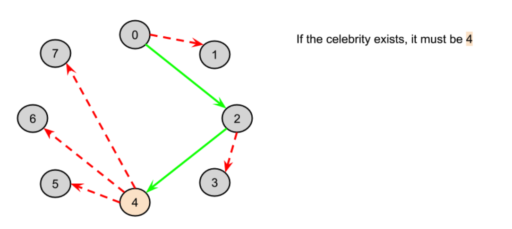
    - But do we actually know for sure that this person is a celebrity? (Remember, it's possible there's no celebrity, in which case we'd return -1).
    - Nope! It's still possible that 0 doesn't know 4, or perhaps 4 knows 3. We can't rule these possibilities out from the information we have uncovered so far.
    - So, what can we do? We can use our isCelebrity(...) function on 4 to check whether or not they are a celebrity. If they are, our function will return 4. If not, then it should return -1.

### 思路

設定候選人 res 為0，原理是先遍歷一遍，對於遍歷到的人i，若候選人 res 認識i，則將候選人 res 設為i，完成一遍遍歷後，來檢測候選人 res 是否真正是名人，如果判斷不是名人，則返回 -1，如果並沒有衝突，返回 res

注意測資 [[1,0],[0,1]]

### Code
``` py
class Solution:
    def findCelebrity(self, n: int) -> int:
        candidate = 0
        for i in range(1,n):
            if knows(candidate, i):
                candidate = i
        for i in range(n):
            if (knows(candidate, i) or not knows(i, candidate)) and res != i:
                return -1
        return candidate
```
### Tag: #Greedy #Graph
---
## 279. Perfect Squares｜ 8/12 | [ Review * 1 ]
Given a positive integer n, find the least number of perfect square numbers (for example, 1, 4, 9, 16, ...) which sum to n.

Example 1:

Input: n = 12
Output: 3
Explanation: 12 = 4 + 4 + 4.
Example 2:

Input: n = 13
Output: 2
Explanation: 13 = 4 + 9.

### 解題分析
1. 本題的最佳解為使用 BFS
    - 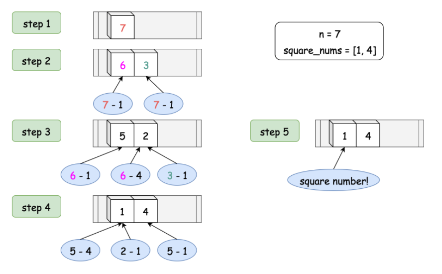
2. 從 n 開始往下用平方數去扣 parent node, BFS 求最短路徑, 只要第一個相遇的極為最短路徑
3. 用 set 去存可以避免重複元素出現
4. 時間複雜度為 N 的 二分之樹高次方
    - 

### 思路
dp[i] 可以去更新 dp[i + j*j]

### Code
(Optimal) BFS, O(N^(h/2))
```py
class Solution:
    def numSquares(self, n: int) -> int:
        squares = [i*i for i in range(1, int(n**0.5)+1)]
        queue = set([n])
        res = 1
        while queue:
            next_layer = set()
            for elem in queue:
                for square in squares:
                    if elem == square:
                        return res
                    elif elem > square:
                        next_layer.add(elem-square)
            queue = next_layer
            res += 1
        return res
```

DP BottonUP, O(N log N)
``` py
class Solution:
    def numSquares(self, n: int) -> int:
        dp = [float("inf") for _ in range(n+1)]
        dp[0] = 0
        for i in range(n): # 記得從0開始 iterate
            for j in range(1, n):
                if i + j*j > n:
                    break
                dp[i+j*j] = min(dp[i+j*j], dp[i]+1)
        return dp[n]
```

Better DP BottonUp, O(N log N)
```py
class Solution(object):
    def numSquares(self, n):
        square_nums = [i**2 for i in range(0, int(n**0.5)+1)]

        dp = [float('inf')] * (n+1)
        # bottom case
        dp[0] = 0

        for i in range(1, n+1):
            for square in square_nums:
                if i < square:
                    break
                dp[i] = min(dp[i], dp[i-square] + 1)

        return dp[-1]
```

數學解法(參考):
```c
class Solution {
public:
    int numSquares(int n) {
        while (n % 4 == 0) n /= 4;
        if (n % 8 == 7) return 4;
        for (int a = 0; a * a <= n; ++a) {
            int b = sqrt(n - a * a);
            if (a * a + b * b == n) {
                return !!a + !!b;
            }
        }
        return 3;
    }
};
```
### Tag: #DP #BFS
---
## 280. Wiggle Sort｜ 8/12
Given an unsorted array nums, reorder it in-place such that nums[0] <= nums[1] >= nums[2] <= nums[3]....

Example:

Input: nums = [3,5,2,1,6,4]

Output: One possible answer is [3,5,1,6,2,4]
### 思路

n log n:

在第一個數後 2跟3調換 4跟5調換

3 5 2 1 4 6

1 2 3 4 5 6

1 3 2 5 4 6


O(n):

經觀察知，

n = odd 時，nums[n] >= nums[n-1]

n = even 時，nums[n] <= nums[n-1]

### Code
O(nlog(n))
``` py
def wiggleSort(self, nums: List[int]) -> None:
    nums[:] = sorted(nums)
    for i in range(1, len(nums)-1, 2):
        nums[i], nums[i+1] = nums[i+1], nums[i]
```

O(n)
```py
def wiggleSort(self, nums: List[int]) -> None:
    if len(nums) <= 1:
        return
    for i in range(1, len(nums)):
        if (i % 2 == 0 and nums[i-1] < nums[i]) or (i % 2 == 1 and nums[i-1] > nums[i]):
            nums[i-1], nums[i] = nums[i], nums[i-1]
```

---
## 275. H-Index II｜ 8/13
Given an array of citations sorted in ascending order (each citation is a non-negative integer) of a researcher, write a function to compute the researcher's h-index.

According to the definition of h-index on Wikipedia: "A scientist has index h if h of his/her N papers have at least h citations each, and the other N − h papers have no more than h citations each."

Example:

Input: citations = [0,1,3,5,6]
Output: 3
Explanation: [0,1,3,5,6] means the researcher has 5 papers in total and each of them had
             received 0, 1, 3, 5, 6 citations respectively.
             Since the researcher has 3 papers with at least 3 citations each and the remaining
             two with no more than 3 citations each, her h-index is 3.
Note:

If there are several possible values for h, the maximum one is taken as the h-index.

Follow up:

This is a follow up problem to H-Index, where citations is now guaranteed to be sorted in ascending order.
Could you solve it in logarithmic time complexity?

直接套入公式:
這道題讓我們求H指數，這個質數是用來衡量研究人員的學術水平的質數，定義為一個人的學術文章有n篇分別被引用了n次，那麼H指數就是n。而且wiki上直接給出了算法，可以按照如下方法確定某人的H指數：1、將其發表的所有SCI論文按被引次數從高到低排序；2、從前往後查找排序後的列表，直到某篇論文的序號大於該論文被引次數。所得序號減一即為H指數。
### 思路

1. 根據公式由高到低排序，以及序號的關係，必須用 `長度-此題index` 來實現
2. 根據描述，歸類此題為尋找左邊界題
3. 帶入模板，最後回傳 長度-序號

注意此題，宣告right 的地方必須設為len(ci), 跟模板: len(ci)-1 不一樣

如不修正，也能通過大部分的側資，但測資 [0,0] 會fail

### Code
``` py
def hIndex(self, ci: List[int]) -> int:
    if not ci:
        return 0
    if len(ci) == 1:
        if ci[0] != 0:
            return 1
        else:
            return 0

    l, r, n = 0, len(ci), len(ci)
    while l < r:
        mid = l + (r-l)//2
        h = n-mid
        if h <= ci[mid]:
            r = mid
        else:
            l = mid+1
    return n-r
```
### Tag: #BinarySearch
---
## 281. Zigzag Iterator｜ 8/14

Given two 1d vectors, implement an iterator to return their elements alternately.
Example:

Input:
v1 = [1,2]
v2 = [3,4,5,6]
Output: [1,3,2,4,5,6]
Explanation: By calling next repeatedly until hasNext returns false, the order of elements returned by next should be: [1,3,2,4,5,6].


Follow up:

What if you are given k 1d vectors? How well can your code be extended to such cases?

Clarification for the follow up question:
The "Zigzag" order is not clearly defined and is ambiguous for k > 2 cases. If "Zigzag" does not look right to you, replace "Zigzag" with "Cyclic". For example:

Input:
[1,2,3]
[4,5,6,7]
[8,9]

Output: [1,4,8,2,5,9,3,6,7].

Your ZigzagIterator object will be instantiated and called as such:
i, v = ZigzagIterator(v1, v2), []
while i.hasNext(): v.append(i.next())

### 技巧

- iter(list) 去使用python iterator

- next(it) 去取值並遞增it

### 思路

Way1: Naive

用 cur 去控制位置，用 mod 去輪詢

用 failCount 去判斷是否所有list 都走完了

Way2: Queue

用一個queue去存 各個 list 的 iterator, 但必須保有 list 長度資訊

如果此list還沒有end, 就把此list 的it 再push進queue

### Code
``` py
class ZigzagIterator:
    def __init__(self, v1: List[int], v2: List[int]):
        self.cur = -1    # cursor pos
        self.count = 2  # two list
        self.v1 = v1
        self.v2 = v2

    def next(self) -> int:
        curListNum = self.cur % self.count
        if curListNum == 0:
            curList = self.v1
        else:
            curList = self.v2
        return curList.pop(0)

    def hasNext(self) -> bool:
        failCount = 0
        while failCount <= self.count:
            self.cur += 1
            curListNum = self.cur % self.count
            if curListNum == 0:
                curList = self.v1
            else:
                curList = self.v2
            if len(curList) > 0:
                return True
            else:
                failCount += 1
        return False
```
---
## 283. Move Zeroes｜ 8/14
Given an array nums, write a function to move all 0's to the end of it while maintaining the relative order of the non-zero elements.

Example:

Input: [0,1,0,3,12]
Output: [1,3,12,0,0]
Note:

You must do this in-place without making a copy of the array.
Minimize the total number of operations.
### 思路
需要用兩個指針，一個不停的向後掃，找到非零位置，然後和前面那個指針交換位置即可

### Code
``` py
def moveZeroes(self, nums: List[int]) -> None:
    zeroPtr, nonZeroPtr = 0, 0
    for nonZeroPtr in range(len(nums)):
        while zeroPtr < len(nums) and nums[zeroPtr] != 0:
            zeroPtr += 1
        if nums[nonZeroPtr] == 0 or nonZeroPtr < zeroPtr:
            continue
        else:
            nums[nonZeroPtr], nums[zeroPtr] = nums[zeroPtr], nums[nonZeroPtr]
```
---
## 284. Peeking Iterator｜ 8/16
Given an Iterator class interface with methods: next() and hasNext(), design and implement a PeekingIterator that support the peek() operation -- it essentially peek() at the element that will be returned by the next call to next().

Example:

Assume that the iterator is initialized to the beginning of the list: [1,2,3].

Call next() gets you 1, the first element in the list.
Now you call peek() and it returns 2, the next element. Calling next() after that still return 2.
You call next() the final time and it returns 3, the last element.
Calling hasNext() after that should return false.
Follow up: How would you extend your design to be generic and work with all types, not just integer?

### 思路

可以把.next() 直接給 peeked 使用, 但此時就必須用一個變量 isPeeked, peekElem 來儲存是否已經 call 過 peek

### Code
``` py
    # Below is the interface for Iterator, which is already defined for you.
    #
    # class Iterator:
    #     def __init__(self, nums):
    #         """
    #         Initializes an iterator object to the beginning of a list.
    #         :type nums: List[int]
    #         """
    #
    #     def hasNext(self):
    #         """
    #         Returns true if the iteration has more elements.
    #         :rtype: bool
    #         """
    #
    #     def next(self):
    #         """
    #         Returns the next element in the iteration.
    #         :rtype: int
    #         """

class PeekingIterator:
    def __init__(self, iterator):
        """
        Initialize your data structure here.
        :type iterator: Iterator
        """
        self.it = iterator
        self.isPeeked = False
        self.peekElem = None


    def peek(self):
        """
        Returns the next element in the iteration without advancing the iterator.
        :rtype: int
        """
        if not self.isPeeked:
            self.peekElem = self.it.next()
            self.isPeeked = True
        return self.peekElem


    def next(self):
        """
        :rtype: int
        """
        if not self.isPeeked:
            return self.it.next()
        else:
            self.isPeeked = False
            theNext = self.peekElem
            self.peekElem = None
            return theNext


    def hasNext(self):
        """
        :rtype: bool
        """
        return True if self.peekElem != None else self.it.hasNext()

    # Your PeekingIterator object will be instantiated and called as such:
    # iter = PeekingIterator(Iterator(nums))
    # while iter.hasNext():
    #     val = iter.peek()   # Get the next element but not advance the iterator.
    #     iter.next()         # Should return the same value as [val].
```
---
## 285. Inorder Successor in BST｜ 8/17
Given a binary search tree and a node in it, find the in-order successor of that node in the BST.

The successor of a node p is the node with the smallest key greater than p.val.

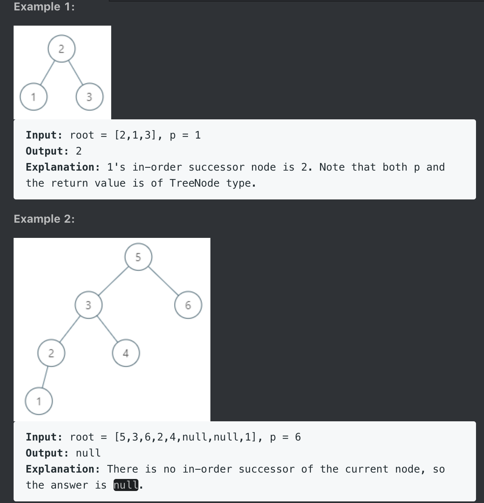

Note:

If the given node has no in-order successor in the tree, return null.
It's guaranteed that the values of the tree are unique.

### 思路

1. Way1: in-order traverse then iterate over the res
2. Way2: looking for target during traversal
3. Way3: 利用BST性質 <trickier but preferable>
    - 這種方法充分地利用到了 BST 的性質，首先看根節點值和p節點值的大小，如果根節點值大，說明p節點肯定在左子樹中，那麼此時先將 res 賦為 root，然後 root 移到其左子節點，循環的條件是 root 存在，再比較此時 root 值和p節點值的大小，如果還是 root 值大，重複上面的操作，如果p節點值，那麼將 root 移到其右子節點，這樣當 root 為空時，res 指向的就是p的後繼節點
### Code
``` py
def inorderSuccessor(self, root: 'TreeNode', p: 'TreeNode') -> 'TreeNode':
    stack, res = [], []
    node = root
    while node or stack:
        if node:
            stack.append(node)
            node = node.left
        else:
            node = stack.pop()
            res.append(node)
            node = node.right
    for i, node in enumerate(res):
        if node == p:
            if i < len(res)-1:
                return res[i+1]
            else:
                return None
    return None
```

Way2
```py
def inorderSuccessor(self, root: 'TreeNode', p: 'TreeNode') -> 'TreeNode':
    stack, found = [], False
    node = root
    while node or stack:
        if node:
            stack.append(node)
            node = node.left
        else:
            node = stack.pop()
            if found:
                return node
            if node == p:
                found = True
            node = node.right
    return None
```

Way3
```py
def inorderSuccessor(self, root: 'TreeNode', p: 'TreeNode') -> 'TreeNode':
    res = None
    while root:
        if root.val > p.val:
            res = root # record the potential next node of the root.left
            root = root.left
        else:
            root = root.right
    return res
```
---
## 286. Walls and Gates｜ 8/22 | [ Review * 1 ]
You are given a m x n 2D grid initialized with these three possible values.

-1 - A wall or an obstacle.
0 - A gate.
INF - Infinity means an empty room. We use the value 231 - 1 = 2147483647 to represent INF as you may assume that the distance to a gate is less than 2147483647.
Fill each empty room with the distance to its nearest gate. If it is impossible to reach a gate, it should be filled with INF.

Example:

Given the 2D grid:

INF  -1  0  INF

INF INF INF  -1

INF  -1 INF  -1

  0  -1 INF INF

After running your function, the 2D grid should be:

  3  -1   0   1

  2   2   1  -1

  1  -1   2  -1

  0  -1   3   4

### 思路

time: O(mn)
### Code
DFS
``` py
class Solution:
    def wallsAndGates(self, rooms: List[List[int]]) -> None:
        self.rooms = rooms
        self.dirs = [(1,0), (0,1), (0,-1), (-1,0)]
        for i in range(len(rooms)):
            for j in range(len(rooms[i])):
                if rooms[i][j] == 0:
                    self.dfs((i, j), 0)

    def dfs(self, pos, depth):
        x, y = pos[0], pos[1]
        if self.rooms[x][y] < depth:
            return
        else:
            self.rooms[x][y] = depth
            for dir in self.dirs:
                if 0 <= x+dir[0] < len(self.rooms) and 0 <= y+dir[1] < len(self.rooms[0]):
                    self.dfs((x+dir[0], y+dir[1]), depth+1)
```

BFS
```py
class Solution:
    def wallsAndGates(self, rooms: List[List[int]]) -> None:
        if not rooms:
            return
        ROW, COL = len(rooms), len(rooms[0])
        directions = [(1,0), (0,1), (-1,0), (0,-1)]
        queue = []
        for i in range(ROW):
            for j in range(COL):
                if rooms[i][j] == 0:
                    queue.append(((i,j),0))

        while queue:
            pos, depth = queue.pop(0)
            x, y = pos[0], pos[1]
            for dir_x, dir_y in directions:
                new_x, new_y = x+dir_x, y+dir_y
                if 0 <= new_x < ROW and 0 <= new_y < COL and depth < rooms[new_x][new_y]:
                    rooms[new_x][new_y] = depth+1
                    queue.append(((new_x, new_y), depth+1))
```

(Optimal) BFS 不記錄深度值，把自己當深度
```py
class Solution:
    def wallsAndGates(self, rooms: List[List[int]]) -> None:
        if not rooms:
            return
        ROW, COL = len(rooms), len(rooms[0])
        directions = [(1,0), (0,1), (-1,0), (0,-1)]
        queue = []
        for i in range(ROW):
            for j in range(COL):
                if rooms[i][j] == 0:
                    queue.append((i,j))

        while queue:
            pos = queue.pop(0)
            x, y = pos[0], pos[1]
            for dir_x, dir_y in directions:
                new_x, new_y = x+dir_x, y+dir_y
                if 0 <= new_x < ROW and 0 <= new_y < COL and rooms[new_x][new_y] == 2147483647:
                    rooms[new_x][new_y] = rooms[x][y]+1
                    queue.append((new_x, new_y))
```
### Tag: #DFS, #BFS
---
## 287. Find the Duplicate Number｜ 8/22 | [Review * 1]
Given an array nums containing n + 1 integers where each integer is between 1 and n (inclusive), prove that at least one duplicate number must exist. Assume that there is only one duplicate number, find the duplicate one.

Example 1:

Input: [1,3,4,2,2]
Output: 2
Example 2:

Input: [3,1,3,4,2]
Output: 3
Note:

You must not modify the array (assume the array is read only).
You must use only constant, O(1) extra space.
Your runtime complexity should be less than O(n2).
There is only one duplicate number in the array, but it could be repeated more than once.

### 解題分析
1. 先進行排序，尋找重複的值只需要看自己前面的是否與自己相等
    1. 允許修改陣列: T = O(nlogn), S = O(1)
    2. 不允許: 則 space 變為 O(n)
2. 把元素都加進去 set 中，並在下一個節點時判斷是否已在set 存在
    1. T = O(n), S = O(n)
3. Binary Search
    1. 以 1 ~ n-1 建立起 left, right 移動的位置表
    2. 我們不 BS nums陣列，instead 我們 search 這個位置表
    2. 首先先算出 mid, 並去 nums 中尋找 `lte` mid 的個數
    3. 若 `lte_cnt` <= mid 表示小於 mid 的左半部並沒有重複值
    4. 因此此題的目標是: 尋找 `lte_cnt` of k 大於 k 的左邊界
4. 快慢指針找 cycle 的進入點
    1. 使用 f(x) = nums[x] 去建立一個 LinkedList 序列
    2. x, nums[x], nums[nums[x]] ... (當前值 = 前一值在nums中的index)
    3. 因此當遇到重複的值的時候環就會出現了
    4. 因此此題就退化為在 list 中找環的起始點

### 思路

1. 暴力姐
2. Binary Search 模板：尋找左邊界
   - 由這三個例子可以知道當 lessCnt "<=" mid 該做什麼處理
   - 在宣告時就已經朝著 "l" 跟 "r" 都有可能是可能解的方向
       - [1,2,3,4,5,5]
         - lessCnt = 3 -> 可以排除掉1,2,3, 所以 l = mid+1
       - [1,2,3,3,4,5]
         - lessCnt = 4 -> 可以排除掉4,5, 所以 r = mid
       - [1,1,2,3,4,5]

3. 快慢指針尋找環的進入點 (BEST!)
    - 

### Code

暴力解:
```py
class Solution:
    def findDuplicate(self, nums: List[int]) -> int:
        RANG = len(nums)-1
        SUM = (1+RANG) * RANG // 2
        numSum = sum(nums)
        target = abs(numSum - SUM) % 2
        for i in range(target, RANG+1, 2):
            cnt = 0
            for num in nums:
                if num == i:
                    cnt += 1
            if cnt > 1:
                return i

        target = (target+1)%2
        for i in range(target, RANG+1, 2):
            cnt = 0
            for num in nums:
                if num == i:
                    cnt += 1
            if cnt > 1:
                return i
```

Binary Search 尋找左邊界:
``` py
class Solution:
    def findDuplicate(self, nums: List[int]) -> int:
        l, r = 0, len(nums)-1

        while l < r:
            lte_cnt = 0
            mid = l + (r-l)//2

            for num in nums:
                if num <= mid:
                    lte_cnt += 1

            if lte_cnt > mid:
                r = mid
            else:
                l = mid + 1
        return r
```

Binary Search 尋找特定值:
```py
class Solution:
    def findDuplicate(self, nums: List[int]) -> int:
        RANG = len(nums)-1
        l, r = 1, RANG

        while l <= r:
            mid = l + (r-l) // 2

            lessCnt = 0
            for num in nums:
                if num < mid:
                    lessCnt += 1
            if lessCnt < mid:
                l = mid +1
            else:
                r = mid -1
        return r
```

快慢指針
``` py
class Solution:
    def findDuplicate(self, nums: List[int]) -> int:
        slow_idx, fast_idx = nums[0], nums[nums[0]]

        # Phase1: find intersection
        while slow_idx != fast_idx:
            slow_idx = nums[slow_idx]
            fast_idx = nums[nums[fast_idx]]

        # Phase2: move tutle to start and let them met again
        # the point is the start of the cycle
        slow_idx = 0
        while slow_idx != fast_idx:
            slow_idx = nums[slow_idx]
            fast_idx = nums[fast_idx]
        return slow_idx
```
### Tag: #BinarySeach, #LinkedList
---
## 288. Unique Word Abbreviation(糞題)｜ 8/23 | [ Review * 1 ]
An abbreviation of a word follows the form <first letter><number><last letter>. Below are some examples of word abbreviations:

a) it                      --> it    (no abbreviation)

     1
     ↓
b) d|o|g                   --> d1g

              1    1  1
     1---5----0----5--8
     ↓   ↓    ↓    ↓  ↓
c) i|nternationalizatio|n  --> i18n

              1
     1---5----0
     ↓   ↓    ↓
d) l|ocalizatio|n          --> l10n

Additionally for any string s of size less than or equal to 2 their abbreviation is the same string s.
Find whether its abbreviation is unique in the dictionary. A word's abbreviation is called unique if any of the following conditions is met:

There is no word in dictionary such that their abbreviation is equal to the abbreviation of word.
Else, for all words in dictionary such that their abbreviation is equal to the abbreviation of word those words are equal to word.


Example 1:

Input
["ValidWordAbbr","isUnique","isUnique","isUnique","isUnique"]
[[["deer","door","cake","card"]],["dear"],["cart"],["cane"],["make"]]
Output
[null,false,true,false,true]

Explanation
ValidWordAbbr validWordAbbr = new ValidWordAbbr(["deer", "door", "cake", "card"]);
validWordAbbr.isUnique("dear"); // return False
validWordAbbr.isUnique("cart"); // return True
validWordAbbr.isUnique("cane"); // return False
validWordAbbr.isUnique("make"); // return True


Constraints:

Each word will only consist of lowercase English characters

### 思路

1. dictionary = {"dear"},  isUnique("door") -> false

2. dictionary = {"door", "door"}, isUnique("door") -> true

3. dictionary = {"dear", "door"}, isUnique("door") -> false

從上面三個例子可以看出，當縮寫一致的時候，字典中的單詞均和給定單詞相同時，返回 true。這裡需要用 HashMap 來建立縮寫形式和其對應的單詞的映射，把所有縮寫形式的相同單詞放到一個 HashSet 中，然後再判斷是否 unique 的時候只需要看給定單詞的縮寫形式的 HashSet 裡面該單詞的個數是否和 HashSet 中的元素總數相同，相同的話就是上面的第二種情況，返回 true。需要注意的是由於 HashSet 中不能有重複值，所有上面第二種情況只會有一個 door 存在 HashSet 裡，但是並不影響判斷結果

### Code
``` py
def __init__(self, dictionary):
    self.dic = collections.defaultdict(set)
    for s in dictionary:
        val = s
        if len(s) > 2:
            s = s[0]+str(len(s)-2)+s[-1]
        self.dic[s].add(val)

def isUnique(self, word):
    val = word
    if len(word) > 2:
        word = word[0]+str(len(word)-2)+word[-1]
    # if word abbreviation not in the dictionary, or word itself in the dictionary (word itself may
    # appear multiple times in the dictionary, so it's better using set instead of list)
    return len(self.dic[word]) == 0 or (len(self.dic[word]) == 1 and val == list(self.dic[word])[0])
```
---
## 290. Word Pattern｜ 8/23 | [Review * 1]
Given a pattern and a string str, find if str follows the same pattern.

Here follow means a full match, such that there is a bijection between a letter in pattern and a non-empty word in str.

Example 1:

Input: pattern = "abba", str = "dog cat cat dog"
Output: true
Example 2:

Input:pattern = "abba", str = "dog cat cat fish"
Output: false
Example 3:

Input: pattern = "aaaa", str = "dog cat cat dog"
Output: false
Example 4:

Input: pattern = "abba", str = "dog dog dog dog"
Output: false
Notes:
You may assume pattern contains only lowercase letters, and str contains lowercase letters that may be separated by a single space.
### 思路

matcher.values() -> is O(n), not a good idea

use another dictionary instead

死在測資:

"abba"

"dog dog dog dog"

### Code
``` py
class Solution:
    def wordPattern(self, pattern: str, str: str) -> bool:
        strs = str.split(' ')
        if len(strs) != len(pattern):
            return False

        matcher = dict()
        for i, str in enumerate(strs):
            if pattern[i] in matcher.keys():
                if str != matcher[pattern[i]]:
                    return False
            else:
                if str in matcher.values():
                    return False
                matcher[pattern[i]] = str
        return True
```
Optimal
```py
class Solution:
    def wordPattern(self, pattern: str, s: str) -> bool:
        li = s.split(" ")
        if len(li) != len(pattern):
            return False
        dicP = dict()
        dicW = dict()
        for i, p in enumerate(pattern):
            word = li[i]
            if p not in dicP and word not in dicW:
                dicP[p] = word
                dicW[word] = p
            elif (p in dicP and dicP[p] != word) or (word in dicW and dicW[word] != p):
                return False
        return True
```

Optimal defaultdict
```py
class Solution:
    def wordPattern(self, pattern: str, s: str) -> bool:
        li = s.split(" ")
        if len(li) != len(pattern):
            return False
        dicP = defaultdict(str)
        dicW = defaultdict(str)
        for i, p in enumerate(pattern):
            word = li[i]
            if p not in dicP and word not in dicW:
                dicP[p] = word
                dicW[word] = p
            elif dicP[p] != word or dicW[word] != p:
                return False

        return True
```

---
## 292. Nim Game｜ 8/23
You are playing the following Nim Game with your friend: There is a heap of stones on the table, each time one of you take turns to remove 1 to 3 stones. The one who removes the last stone will be the winner. You will take the first turn to remove the stones.

Both of you are very clever and have optimal strategies for the game. Write a function to determine whether you can win the game given the number of stones in the heap.

Example:

Input: 4
Output: false
Explanation: If there are 4 stones in the heap, then you will never win the game;
             No matter 1, 2, or 3 stones you remove, the last stone will always be removed by your friend.
### 思路

分析出是有規律的題, 找規律
### Code
``` py
class Solution:
    def canWinNim(self, n: int) -> bool:
        ans = [False, True, True, True]
        return ans[n%4]
```
---
## 291. Word Pattern II｜ 8/23 | [Review * 1]
Given a pattern and a string str, find if str follows the same pattern.

Here follow means a full match, such that there is a bijection between a letter in pattern and a non-empty substring in str.


Example 1:

Input: pattern = "abab", str = "redblueredblue"
Output: true
Example 2:

Input: pattern = "aaaa", str = "asdasdasdasd"
Output: true
Example 3:

Input: pattern = "aabb", str = "xyzabcxzyabc"
Output: false


Constraints:

You may assume both pattern and str contains only lowercase letters.

### 解題分析

1. Goal:
    1. s 跟 p 都用完 => return True
    2. p 剩餘的比 s 還多 => return False
2. Constraint and Choice:
    1. use this char as word:
        1. Constraint:
            1. isMatch
            2. isNew
    2. extend more char:
        1. Otherwise
3. 如果想不到 Optimal 的那個長度限制剪枝，則應該要在在判斷 False 處加 len(p) > len(s) 的長度檢查

### 思路

用遞歸解

O(n^2)
### Code
``` py
class Solution:
    def wordPatternMatch(self, pattern: str, str: str) -> bool:
        if len(pattern) > len(str):
            return False
        self.wordSet = set()
        self.matcher = dict()
        return self.helper(pattern, str)

    def helper(self, pattern, str):
        if len(pattern) == 0 and len(str) == 0:
            return True
        if len(pattern) == 0 or len(str) == 0: # one of each is not zero
            return False

        if pattern[0] in self.matcher.keys():
            word = self.matcher[pattern[0]]
            try:
                if str.index(word) != 0:
                    return False
                return self.helper(pattern[1:], str[len(word):])
            except: # cannot index
                return False
        else:
            for i in range(len(str)):
                word = str[:i+1]
                if word in self.wordSet:
                    continue
                self.wordSet.add(word)
                self.matcher[pattern[0]] = word
                if self.helper(pattern[1:], str[i+1:]):
                    return True
                self.wordSet.remove(word)
                del self.matcher[pattern[0]]
            return False
```

Little bit slower Optimal solution
```py
class Solution:
    def wordPatternMatch(self, pattern: str, s: str) -> bool:
        dic = dict()
        n = len(s)
        pn = len(pattern)

        def recur(p, s):
            if not s and not p:
                return True
            if s and not p or len(p) > len(s):
                return False

            for i in range(1, n+1):
                word = s[:i]
                if p[0] in dic and dic[p[0]] == word: # isMatch
                    if recur(p[1:], s[i:]):
                        return True
                elif p[0] not in dic and word not in dic.values(): # isNew
                    dic[p[0]] = word
                    if recur(p[1:], s[i:]):
                        return True
                    del dic[p[0]]
            return False
        return recur(pattern, s)
```

Optimal solution
```py
def wordPatternMatch(self, pattern, str):
    return self.dfs(pattern, str, {})

def dfs(self, pattern, str, dict):
    if len(pattern) == 0 and len(str) > 0:
        return False
    if len(pattern) == len(str) == 0:
        return True

    # abcde redblue
    # ^xxxx ^^^xxxx
    #   5       7
    # Try to match pattern `a` with at most 3 characters.
    # That is 7 - 5 + 1, and the last + 1 is for Python range.
    for end in range(1, len(str)-len(pattern)+2):
        if pattern[0] not in dict and str[:end] not in dict.values():
            dict[pattern[0]] = str[:end]
            if self.dfs(pattern[1:], str[end:], dict):
                return True
            del dict[pattern[0]]
        elif pattern[0] in dict and dict[pattern[0]] == str[:end]:
            if self.dfs(pattern[1:], str[end:], dict):
                return True
    return False
```

### Tag: #Recursive
---
## 293. Flip Game｜ 8/24 | [Review * 1]
You are playing the following Flip Game with your friend: Given a string that contains only these two characters: + and -, you and your friend take turns to flip two consecutive "++" into "--". The game ends when a person can no longer make a move and therefore the other person will be the winner.

Write a function to compute all possible states of the string after one valid move.

Example:

Input: s = "++++"
Output:

[
  "--++",
  "+--+",
  "++--"
]

Note: If there is no valid move, return an empty list [].
### 思路


### Code
``` py
def generatePossibleNextMoves(self, s: str) -> List[str]:
    if len(s) < 2:
        return []
    res = []
    for i in range(len(s)-1):
        if s[i:i+2] == '++':
            temp = s[:i] + '--' + s[i+2:]
            res.append(temp[:])
    return res
```
---

## 294. Flip Game II｜ 8/24 | [Review * 1]
You are playing the following Flip Game with your friend: Given a string that contains only these two characters: + and -, you and your friend take turns to flip two consecutive "++" into "--". The game ends when a person can no longer make a move and therefore the other person will be the winner.

Write a function to determine if the starting player can guarantee a win.

Example:

Input: s = "++++"
Output: true
Explanation: The starting player can guarantee a win by flipping the middle "++" to become "+--+".
Follow up:
Derive your algorithm's runtime complexity.

### 解題分析
1. 解法如思路
2. Time:
    1. Without memorization
        - T = N * T(N-2) = N * (N-2) * T(N-4) ... ~= N!
    2. With memorization
        - 每一種 s 的狀態都走過一次，因此總共可以產生 N^2 種狀態在 memo 裡

### 思路

第一手下去後，就必須造成 p2 每一種下法都會輸，問有沒有這樣的一手。

讓我們判斷先手的玩家是否能贏，可以窮舉所有的情況，用回溯法來解題，思路跟上面那題類似，也是從第二個字母開始遍歷整個字符串，如果當前字母和之前那個字母都是+，那麼遞歸調用將這兩個位置變為--的字符串，如果返回 false，說明當前玩家可以贏，結束循環返回 false。這裡同時貼上熱心網友 iffalse 的解釋，這道題 **不是問 “1p是否會怎麼選都會贏”，而是 “如果1p每次都選特別的兩個+，最終他會不會贏”** 。所以 canWin 這個函數的意思是 “在當前這種狀態下，至少有一種選法，能夠讓他贏”。而 (!canWin) 的意思就變成了 “在當前這種狀態下，無論怎麼選，都不能贏”。所以 1p 要看的是，是否存在這樣一種情況，無論 2p 怎麼選，都不會贏。所以只要有一個 (!canWin)，1p 就可以確定他會贏。這道題從博弈論的角度會更好理解。每個 player 都想讓自己贏，所以每輪他們不會隨機選+。每一輪的 player 會選能夠讓對手輸的+。如果無論如何都選不到讓對手輸的+，那麼只能是當前的 player 輸了
### Code

O(n!)
``` py
class Solution:
    def canWin(self, s: str) -> bool:
        if len(s) < 2:
            return False
        return self.getDerive(s)

    def getDerive(self, s):
        for i in range(len(s)-1):
            if s[i:i+2] == '++':
                temp = s[:i] + '--' + s[i+2:]
                if not self.getDerive(temp):
                    return True
        return False
```

with memorization,
O(n^2)
```py
class Solution:
    def canWin(self, s: str) -> bool:
        memo = {}
        def nextCanWin(s):
            if s not in memo:
                for i in range(len(s)-1):
                    if s[i] == s[i+1] == "+":
                        move = str(s[:i] + "--" + s[i+2:])
                        if not nextCanWin(move):
                            memo[s] = True
                            return True
                memo[s] = False
            return memo[s]
        return nextCanWin(s)
```
### Tag: #Recursive #Memorization
---
## 298. Binary Tree Longest Consecutive Sequence｜ 8/31 | [ Review * 1 ]
Given a binary tree, find the length of the longest consecutive sequence path.

The path refers to any sequence of nodes from some starting node to any node in the tree along the parent-child connections. The longest consecutive path need to be from parent to child (cannot be the reverse).

Example 1:

Input:

   1
    \
     3
    / \
   2   4
        \
         5

Output: 3

Explanation: Longest consecutive sequence path is 3-4-5, so return 3.
Example 2:

Input:

   2
    \
     3
    /
   2
  /
 1

Output: 2

Explanation: Longest consecutive sequence path is 2-3, not 3-2-1, so return 2.
### 思路
1. 先預設是可擴充的, 發現不可擴充再初始為零

### Code
``` py
class Solution:
    def longestConsecutive(self, root: TreeNode) -> int:
        res = 0
        def dfs(root):
            if not root:
                return 0

            nonlocal res
            l = dfs(root.left)+1
            r = dfs(root.right)+1

            if root.left and root.val+1 != root.left.val:
                l = 1
            if root.right and root.val+1 != root.right.val:
                r = 1

            length = max(l, r)
            res = max(res, length)
            return length
        dfs(root)
        return res
```
---
## 549. Binary Tree Longest Consecutive Sequence II｜ 9/25
Given the root of a binary tree, return the length of the longest consecutive path in the tree.

A consecutive path is a path where the values of the consecutive nodes in the path differ by one. This path can be either increasing or decreasing.

For example, [1,2,3,4] and [4,3,2,1] are both considered valid, but the path [1,2,4,3] is not valid.
On the other hand, the path can be in the child-Parent-child order, where not necessarily be parent-child order.

Example 1:


- Input: root = [1,2,3]
- Output: 2
- Explanation: The longest consecutive path is [1, 2] or [2, 1].

Example 2:

- Input: root = [2,1,3]
- Output: 3
- Explanation: The longest consecutive path is [1, 2, 3] or [3, 2, 1].

Constraints:

- The number of nodes in the tree is in the range [1, 3 * 104].
- -3 * 104 <= Node.val <= 3 * 104

### 思路


### Code
``` py
class Solution:
    def longestConsecutive(self, root: Optional[TreeNode]) -> int:
        res = 0
        def dfs(root):
            if not root:
                return 0, 0

            nonlocal res
            l = dfs(root.left)
            r = dfs(root.right)
            inc_l, dec_l = l[0]+1, l[1]+1
            inc_r, dec_r = r[0]+1, r[1]+1

            if root.left:
                if root.val+1 != root.left.val:
                    inc_l = 1
                if root.val-1 != root.left.val:
                    dec_l = 1
            if root.right:
                if root.val+1 != root.right.val:
                    inc_r = 1
                if root.val-1 != root.right.val:
                    dec_r = 1

            max_inc = max(inc_l, inc_r)
            max_dec = max(dec_l, dec_r)

            res = max(res, max_inc+max_dec-1)
            return max_inc, max_dec
        dfs(root)
        return res
```

### Tag: #Tree
---
## 303. Range Sum Query - Immutable｜ 8/31 | [ Review * 1 ]
Given an integer array nums, find the sum of the elements between indices i and j (i ≤ j), inclusive.

Example:

Given nums = [-2, 0, 3, -5, 2, -1]

sumRange(0, 2) -> 1
sumRange(2, 5) -> -1
sumRange(0, 5) -> -3


Constraints:

You may assume that the array does not change.
There are many calls to sumRange function.
0 <= nums.length <= 10^4
-10^5 <= nums[i] <= 10^5
0 <= i <= j < nums.length

### 思路


### Code
``` py
class NumArray:

    def __init__(self, nums: List[int]):
        self.sumList = []
        _sum = 0
        for num in nums:
            _sum = _sum+num
            self.sumList.append(_sum)
        self.sumList.append(0) # list[i=0] = list[-1] = 0

    def sumRange(self, i: int, j: int) -> int:
        return self.sumList[j] - self.sumList[i-1]
```
### Tag: #PrefixSum
---
## 1305. All Elements in Two Binary Search Trees｜ 9/6
Given two binary search trees root1 and root2.

Return a list containing all the integers from both trees sorted in ascending order.


Example 1:


Input: root1 = [2,1,4], root2 = [1,0,3]
Output: [0,1,1,2,3,4]
Example 2:

Input: root1 = [0,-10,10], root2 = [5,1,7,0,2]
Output: [-10,0,0,1,2,5,7,10]
Example 3:

Input: root1 = [], root2 = [5,1,7,0,2]
Output: [0,1,2,5,7]
Example 4:

Input: root1 = [0,-10,10], root2 = []
Output: [-10,0,10]


Input: root1 = [1,null,8], root2 = [8,1]
Output: [1,1,8,8]

Constraints:

Each tree has at most 5000 nodes.
Each node's value is between [-10^5, 10^5].
### 思路


### Code
One path solution
``` py
class Solution:
    def getAllElements(self, root1: TreeNode, root2: TreeNode) -> List[int]:
        res, stack1, stack2 = [], [], []

        while root1 or root2 or stack1 or stack2:

            # go as left as possible
            while root1:
                stack1.append(root1)
                root1 = root1.left

            while root2:
                stack2.append(root2)
                root2 = root2.left

            # choose from stack1
            if not stack2 or (stack1 and stack1[-1].val <= stack2[-1].val):
                top = stack1.pop()
                res.append(top.val)
                root1 = top.right
            else: # choose from stack 2
                top = stack2.pop()
                res.append(top.val)
                root2 = top.right
        return res
```

Iterative inorder + merge two list:
```py
def getAllElements(self, root1: TreeNode, root2: TreeNode) -> List[int]:
    list1 = self.inOrder(root1)
    list2 = self.inOrder(root2)

    return sorted(list1+list2)

def inOrder(self, root):
    stack, res = [], []

    while stack or root:
        while root:
            stack.append(root)
            root = root.left
        top = stack.pop()
        res.append(top.val)
        root = top.right
    return res
```

Recursive inorder + merge two list:
```py
class Solution:
    def getAllElements(self, root1: TreeNode, root2: TreeNode) -> List[int]:
        return sorted(self.inOrder(root1)+self.inOrder(root2))

    def inOrder(self, root):
        return self.inOrder(root.left) + [root.val] + self.inOrder(root.right) if root else []
```
---
## 835. Image Overlap｜ 9/7

Two images A and B are given, represented as binary, square matrices of the same size.  (A binary matrix has only 0s and 1s as values.)

We translate one image however we choose (sliding it left, right, up, or down any number of units), and place it on top of the other image.  After, the overlap of this translation is the number of positions that have a 1 in both images.

(Note also that a translation does not include any kind of rotation.)

What is the largest possible overlap?

Example 1:

Input: A = [[1,1,0],
            [0,1,0],
            [0,1,0]]
       B = [[0,0,0],
            [0,1,1],
            [0,0,1]]
Output: 3
Explanation: We slide A to right by 1 unit and down by 1 unit.
Notes:

1 <= A.length = A[0].length = B.length = B[0].length <= 30
0 <= A[i][j], B[i][j] <= 1

### 思路

- Naive:
    - 先得到兩個map的相對偏移量，再試著去將此偏移量位移
    - pass 48/49....

- 用字典統計 sliding pattern:
    - https://leetcode.com/problems/image-overlap/discuss/150504/Python-Easy-Logic
    - now the positions of 1's that are stored are for A and B are
        - positions of A -> (0,0), (0,1), (1,1), (2,1)
        - positions of B -> (1,1), (1,2), (2,2)
    - 取 t1 = (0,0),  t2 = (2,2) => d = (2-0,2-0)
    - 這表示如果我們要將 t1 t2 重合，須將圖1 右2 下2，我們把這個pattern儲存起來
    - 那麼爾後若有也是此 pattern 的點，我們就可知道 右2 下2 這個pattern可以使其他點也重合
### Code
Dict:
```py
class Solution:
    def largestOverlap(self, A, B):
        d = collections.defaultdict(int)
        a, b = [], []

        for i in range(len(A)):
            for j in range(len(A[0])):
                if(A[i][j] == 1):
                    a.append((i,j))
                if(B[i][j] == 1):
                    b.append((i,j))
        ans = 0
        for t1 in a:
            for t2 in b:
                t3 = (t2[0]-t1[0],t2[1]-t1[1])
                d[t3] += 1
                ans = max(ans, d[t3])
        return ans
```

Naive:
``` py
class Solution:
    def largestOverlap(self, A: List[List[int]], B: List[List[int]]) -> int:
        setA = self.getRelative(A)
        setB = self.getRelative(B)

        # choose the less one to be shifted
        if len(setA) > len(setB):
            setA, setB = setB, setA

        res = 0
        for i in range(len(A)):
            for j in range(len(A[0])):
                newSet = set()
                newSetLeft = set()
                for tup in setA:
                    newSet.add((tup[0]+i, tup[1]+j)) # shift up, right
                    newSetLeft.add((tup[0]-i, tup[1]-j)) # shift down, left
                res = max(res, len(newSet) - len(newSet-setB))
                res = max(res, len(newSetLeft) - len(newSetLeft-setB))
        return res

    def getRelative(self, pic):
        flag = False
        start = None
        setPic = set()

        for i in range(len(pic)):
            for j in range(len(pic[0])):
                if pic[i][j] == 1:
                    if not flag:
                        flag = True
                        start = (i, j)
                    setPic.add((i-start[0], j-start[1]))
        return setPic
```
---
## 346. Moving Average from Data Stream｜ 9/12
Given a stream of integers and a window size, calculate the moving average of all integers in the sliding window.

Example:

MovingAverage m = new MovingAverage(3);
m.next(1) = 1

m.next(10) = (1 + 10) / 2

m.next(3) = (1 + 10 + 3) / 3

m.next(5) = (10 + 3 + 5) / 3
### 思路

紀錄total 就不用每次都sum了
### Code
``` py
class MovingAverage:

    def __init__(self, size: int):
        """
        Initialize your data structure here.
        """
        self.queue = []
        self.total = 0
        self.size = size

    def next(self, val: int) -> float:

        if len(self.queue) == self.size:
            pop = self.queue.pop(0)
            self.total -= pop
        self.total += val
        self.queue.append(val)
        return self.total / len(self.queue)
```
---
## 459. Repeated Substring Pattern｜ 9/20
Given a non-empty string check if it can be constructed by taking a substring of it and appending multiple copies of the substring together. You may assume the given string consists of lowercase English letters only and its length will not exceed 10000.


Example 1:

Input: "abab"

Output: True

Explanation: It's the substring "ab" twice.

Example 2:

Input: "aba"

Output: False

Example 3:

Input: "abcabcabcabc"

Output: True

Explanation: It's the substring "abc" four times. (And the substring "abcabc" twice.)
### 思路

2. Optimal

smart solution:

s = abab

1. s重複兩次 -> abababab
2. 去頭去尾 bababa
3. 去尋找s b*abab*a

3. Regular expression

### Code
Naive:
``` py
class Solution:
    def repeatedSubstringPattern(self, s: str):
        for i in range(1,len(s)//2+1):
            if self.isSub(s[:i], s[i:]):
                return True
        return False

    def isSub(self, window, s):
        if len(s) == 0:
            return True
        if len(s) % len(window) != 0:
            return False
        if s[:len(window)] != window:
                return False
        else:
            return self.isSub(window, s[len(window):])
```

Optimal:
```py
class Solution:
    def repeatedSubstringPattern(self, s: str):
        if not s:
            return False
        ss = (s+s)[1:-1]
        return ss.find(s) != -1
```
---
## 949. Largest Time for Given Digits｜ 9/20

Given an array arr of 4 digits, find the latest 24-hour time that can be made using each digit exactly once.

24-hour times are formatted as "HH:MM", where HH is between 00 and 23, and MM is between 00 and 59. The earliest 24-hour time is 00:00, and the latest is 23:59.

Return the latest 24-hour time in "HH:MM" format.  If no valid time can be made, return an empty string.


Example 1:

Input: A = [1,2,3,4]
Output: "23:41"
Explanation: The valid 24-hour times are "12:34", "12:43", "13:24", "13:42", "14:23", "14:32", "21:34", "21:43", "23:14", and "23:41". Of these times, "23:41" is the latest.
Example 2:

Input: A = [5,5,5,5]
Output: ""
Explanation: There are no valid 24-hour times as "55:55" is not valid.
Example 3:

Input: A = [0,0,0,0]
Output: "00:00"
Example 4:

Input: A = [0,0,1,0]
Output: "10:00"


Constraints:

arr.length == 4
0 <= arr[i] <= 9


### 思路

Good example for learning permutation!

see this post approach 3!

https://leetcode.com/problems/largest-time-for-given-digits/solution/


The function can be implemented in recursion, due to its nature of divide-and-conquer and backtracking.

The base case of the function would be start == len(array), where we've fixed all the prefixes and reached the end of the combination. In this case, we simply add the current array as one of the results of combination.

When we still have some postfix that need to be permutated, i.e. start < len(array), we then apply backtracking to try out all possible permutations for the postfixes, i.e. permutate(array, start+1). More importantly, we need to swap the start element with each of the elements following the start index (including the start element). The goal is two-fold: 1). we generate different prefixes for the final combination; 2). we generate different lists of candidates in the postfixes, so that the permutations generated from the postfixes would vary as well.

At the end of backtracking, we will swap the start element back to its original position, so that we can try out other alternatives.

For each permutation, we apply the same logic as in the previous approach, i.e. check if the permutation is of valid time and update the maximum time.


T: O(1)

S: O(1)

### Code
``` py
class Solution:
    def largestTimeFromDigits(self, A: List[int]) -> str:
        A = sorted(A)[::-1]

        for i1, num1 in enumerate(A):
            if num1 > 2:
                continue
            dup = A[:]
            dup.pop(i1)

            for i2, num2 in enumerate(dup):
                if num1 == 2 and num2 > 3:
                    continue
                dup.pop(i2)

                for i3, num3 in enumerate(dup):
                    if num3 > 5:
                        continue
                    dup.pop(i3)
                    return str(num1)+str(num2)+":"+str(num3)+str(dup[-1])

                dup.append(num2)
            dup.append(num1)
        return ""
```

Permutation solution
```py
class Solution:
    def largestTimeFromDigits(self, A: List[int]) -> str:
        self.maxTime = -1
        self.permu(A, 0)

        minute = self.maxTime % 60
        hour = self.maxTime // 60

        return "{:02d}:{:02d}".format(hour, minute) if self.maxTime != -1 else ""

    def permu(self, array, start):
        if start == len(array):
            self.getTime(array)
        else:
            for idx in range(start, len(array)):
                array = self.swap(array, start, idx)
                self.permu(array, start+1)
                array = self.swap(array, start, idx) # clear state, swap back

    def swap(self, array, pos1, pos2):
        if pos1 != pos2:
            array[pos1], array[pos2] = array[pos2], array[pos1]
        return array

    def getTime(self, array):
        h1, h2, m1, m2 = array
        hour = h1*10 + h2
        minute = m1*10 + m2

        if hour < 24 and minute < 60:
            self.maxTime = max(self.maxTime, hour*60 + minute)
```
---
## 763. Partition Labels｜ 9/20 | [ Review * 1 ]
A string S of lowercase English letters is given. We want to partition this string into as many parts as possible so that each letter appears in at most one part, and return a list of integers representing the size of these parts.


Example 1:

Input: S = "ababcbacadefegdehijhklij"
Output: [9,7,8]
Explanation:
The partition is "ababcbaca", "defegde", "hijhklij".
This is a partition so that each letter appears in at most one part.
A partition like "ababcbacadefegde", "hijhklij" is incorrect, because it splits S into less parts.


Note:

S will have length in range [1, 500].
S will consist of lowercase English letters ('a' to 'z') only.

### 思路

查看range內是否有elem 是還在外的, 有的話就更新右邊界

如果i不斷遞增到了又邊界，表示這中間都沒有超過的，則此就為一個frame

### Code
clean code, two pointer, O(n)
``` py
class Solution:
    def partitionLabels(self, S: str) -> List[int]:
        last_idx = {c: i for i, c in enumerate(S)}
        l, r = 0, 0
        res = []
        for i, c in enumerate(S):
            r = max(r, last_idx[c])
            if i == r:
                res.append(r-l+1)
                l = i+1
        return res
```
### Tag: #Greedy
---
## 304. Range Sum Query 2D - Immutable｜ 10/9
Given a 2D matrix matrix, find the sum of the elements inside the rectangle defined by its upper left corner (row1, col1) and lower right corner (row2, col2).


### 思路

1. 第一個直覺一定是accumlated sum, 那有兩種解法
    1. 每一行各自維繫其行的sum 如上一題的方法，然後再把 m 行的行和加總
        1. The pre-computation in the constructor takes O(mn) time.
        2. The sumRegion query takes O(m) time.
    2. 維護二維的和，然後透過 A - B - C + D 求得區域和
        1. 
        2. Sum(ABCD)=Sum(OD)−Sum(OB)−Sum(OC)+Sum(OA)
        3. The pre-computation in the constructor takes O(mn) time.
        4. Each sumRegion query takes O(1)time.
2. 結論
    1. 第一種方法比較好寫但比較慢
    2. 第二種方法比較快但比較複雜
### Code
維護一維的和
```py
class NumMatrix:

    def __init__(self, matrix: List[List[int]]):
        if not matrix:
            return
        self.dp = []
        for i in range(len(matrix)):
            arr = []
            for j in range(len(matrix[0])):
                if j == 0:
                    arr.append(matrix[i][j])
                else:
                    arr.append(arr[j-1]+matrix[i][j])
            self.dp.append(arr)

    def sumRegion(self, row1: int, col1: int, row2: int, col2: int) -> int:
        _sum = 0
        for i in range(row1, row2+1):
            if col1 -1 < 0:
                _sum += self.dp[i][col2]
            else:
                _sum += self.dp[i][col2] - self.dp[i][col1-1]
        return _sum
```

維護二維的和
``` py
class NumMatrix:

    def __init__(self, matrix: List[List[int]]):
        if not matrix:
            return
        self.dp = [[0 for j in range(len(matrix[0])+1)] for i in range(len(matrix)+1)]
        for i in range(len(matrix)):
            for j in range(len(matrix[0])):
                self.dp[i+1][j+1] = matrix[i][j] + self.dp[i+1][j] + self.dp[i][j+1] - self.dp[i][j]

    def sumRegion(self, row1: int, col1: int, row2: int, col2: int) -> int:
        return self.dp[row2+1][col2+1] - self.dp[row1][col2+1] - self.dp[row2+1][col1] + self.dp[row1][col1]
```
---
## 624. Maximum Distance in Arrays｜ 10/8
You are given m arrays, where each array is sorted in ascending order. Now you can pick up two integers from two different arrays (each array picks one) and calculate the distance. We define the distance between two integers a and b to be their absolute difference |a - b|. Your task is to find the maximum distance.

Example 1:

Input: arrays = [[1,2,3],[4,5],[1,2,3]]

Output: 4
Explanation: One way to reach the maximum distance 4 is to pick 1 in the first or third array and pick 5 in the second array.

Example 2:

Input: arrays = [[1],[1]]
Output: 0

Example 3:

Input: arrays = [[1],[2]]
Output: 1

Example 4:

Input: arrays = [[1,4],[0,5]]
Output: 4

Constraints:

1. m == arrays.length
2. 2 <= m <= 104
3. 1 <= arrays[i].length <= 500
4. -104 <= arrays[i][j] <= 104
5. arrays[i] is sorted in ascending order.
6. There will be at most 105 integers in all the arrays.

### 思路
1. heapq
    1. 把每一個 (val, 所在行數)，分別塞進 max heap 跟 min heap
    2. 從 max heap 跟 min heap 取出比較，如果行數相等就必須找下一個
    3. 但不知道要找 max heap的還是min heap的，所以都找！
    4. return 最大的那個
    5. O(m log(n))
        1. heappush: log(n)
2. two pointer
    1. 用兩個 _min, _max 指針分別只到第一行的頭尾
    2. 走到下一個，分別用current _min 減去 此行的max, current _max 減去此行的min, 並與res 求大
    3. 走完 return
    4. O(m)

### Code
two pointer:
``` py
class Solution:
    def maxDistance(self, arrays: List[List[int]]) -> int:
        _min, _max, res = arrays[0][0], arrays[0][-1], -float(inf)

        for i in range(1, len(arrays)):
            res = max(
                res,
                abs(arrays[i][0] - _max),
                abs(arrays[i][-1]- _min)
            )
            _min = min(_min, arrays[i][0])
            _max = max(_max, arrays[i][-1])
        return res
```

heap:
``` py
import heapq
class Solution:
    def maxDistance(self, arrays: List[List[int]]) -> int:
        minList, maxList = [],[]
        for i in range(len(arrays)):
            heapq.heappush(minList, (arrays[i][0], i))
            heapq.heappush(maxList, (-1 * arrays[i][-1], i))


        if minList[0][1] != maxList[0][1]:
            return abs(-1*maxList[0][0]-minList[0][0])
        else:
            res = 0
            minList2 = minList[:]
            maxList2 = maxList[:]
            # fix min
            heapq.heappop(maxList)
            res = abs(minList[0][0] - maxList[0][0]* -1)

            #fix max
            heapq.heappop(minList2)
            res = max(res, abs(minList2[0][0] - maxList2[0][0]* -1))

            return res
```
---
## 701. Insert into a Binary Search Tree｜ 10/8
You are given the root node of a binary search tree (BST) and a value to insert into the tree. Return the root node of the BST after the insertion. It is guaranteed that the new value does not exist in the original BST.

Notice that there may exist multiple valid ways for the insertion, as long as the tree remains a BST after insertion. You can return any of them.

Example 1:


### 思路

1. 找到 val 該插入的位置
2. 並與其parent相連

### Code
``` py
class Solution:
    def insertIntoBST(self, root: TreeNode, val: int) -> TreeNode:
        if not root:
            return TreeNode(val)
        dum = root

        while root:
            parent = root
            if val > root.val:
                root = root.right
            else:
                root = root.left
        if val > parent.val:
            parent.right = TreeNode(val)
        else:
            parent.left = TreeNode(val)

        return dum
```
---
## 170. Two Sum III - Data structure design｜ 10/9 | [ Review * 1 ]
Design a data structure that accepts a stream of integers and checks if it has a pair of integers that sum up to a particular value.

Implement the TwoSum class:

TwoSum() Initializes the TwoSum object, with an empty array initially.
void add(int number) Adds number to the data structure.
boolean find(int value) Returns true if there exists any pair of numbers whose sum is equal to value, otherwise, it returns false.


Example 1:

Input
["TwoSum", "add", "add", "add", "find", "find"]
[[], [1], [3], [5], [4], [7]]
Output
[null, null, null, null, true, false]

Explanation
TwoSum twoSum = new TwoSum();
twoSum.add(1);   // [] --> [1]
twoSum.add(3);   // [1] --> [1,3]
twoSum.add(5);   // [1,3] --> [1,3,5]
twoSum.find(4);  // 1 + 3 = 4, return true
twoSum.find(7);  // No two integers sum up to 7, return false


Constraints:

-105 <= number <= 105
-231 <= value <= 231 - 1
At most 5 * 104 calls will be made to add and find.

### 解題分析
1. 這種題要討論哪個 function 作為 trade off
2. 一定要用 dict 去紀錄 count, 不能只用 set + count_zero 去處理 0 的例外情況

### 思路

0. 用 set() 去做會因為 call 太多次add而超時
1. 危險測資:
    1. ["TwoSum","add","find"], [[],[0],[0]]
    2. ["TwoSum","add","add","find"], [[],[0],[0],[0]]

### Code
Trade off find()
``` py
class TwoSum:
    def __init__(self):
        self.m = {}

    def add(self, number: int) -> None:
        self.m[number] = self.m.get(number, 0) + 1

    def find(self, value: int) -> bool:
        for v in self.m:
            t = value-v
            if t in self.m:
                if (t == v and self.m[t] > 1) or (t != v):
                    return True
        return False
```

Trade off add()
```py
class TwoSum:
    def __init__(self):

        self._set = set()
        self._sum = set()

    def add(self, number: int) -> None:

        for num in self._set:
            self._sum.add(num+number)
        self._set.add(number)

    def find(self, value: int) -> bool:

        return value in self._sum
```
### Tag: #HashTable
---
## 452. Minimum Number of Arrows to Burst Balloons(Proof of work 如何證明?)｜ 10/10 | [ Review * 1 ]

There are some spherical balloons spread in two-dimensional space. For each balloon, provided input is the start and end coordinates of the horizontal diameter. Since it's horizontal, y-coordinates don't matter, and hence the x-coordinates of start and end of the diameter suffice. The start is always smaller than the end.

An arrow can be shot up exactly vertically from different points along the x-axis. A balloon with xstart and xend bursts by an arrow shot at x if xstart ≤ x ≤ xend. There is no limit to the number of arrows that can be shot. An arrow once shot keeps traveling up infinitely.

Given an array points where points[i] = [xstart, xend], return the minimum number of arrows that must be shot to burst all balloons.

Example 1:

Input: points = [[10,16],[2,8],[1,6],[7,12]]

Output: 2

Explanation: One way is to shoot one arrow for example at x = 6 (bursting the balloons [2,8] and [1,6]) and another arrow at x = 11 (bursting the other two balloons).
Example 2:

Input: points = [[1,2],[3,4],[5,6],[7,8]]

Output: 4

Example 3:

Input: points = [[1,2],[2,3],[3,4],[4,5]]

Output: 2

Example 4:

Input: points = [[1,2]]

Output: 1

Example 5:

Input: points = [[2,3],[2,3]]

Output: 1

### 解題分析
1. Greedy problems usually look like "Find minimum number of something to do something" or "Find maximum number of something to fit in some conditions", and typically propose an unsorted input.

2. The idea of greedy algorithm is to pick the locally optimal move at each step, that will lead to the globally optimal solution.

3. proof of work:
    - use contradiction method

1. 我們第一支箭要怎麼射？
    - 我們希望這支箭越靠越中間越好因為可以 cover 越多的氣球 -> 因此我們遠永瞄準氣球的最右邊射
2. 如何知道我們需要新的劍？ (Traverse 的順序)
    - 必須 sort by end position 因為當我們在 traverse 的過程，我們必須確保這支箭已經沒有氣球可以被破了(start > arrow)，然後將 arrow 更新為新的 end，如果不 sort 的話，萬一後面遇到新的 end 是比目前新更新的還小的話，那我們就更新錯了
3. 如何 proof of work?
    - 假設我們的不是最小，而且你可以找到更少的劍去設完所有氣球
    - 把區間畫出來，把其中一支箭擦掉，發現會有漏掉的氣球 -> 不存在更少得劍

### 思路

arrow 為 區間的 end 值，下一個區間想要被這個 arrow 穿過 其區間必須包含此 arrow，

否則就必須 new 一隻新的arrow


### 類似題
- LC435. Non-overlapping Intervals

### Code
``` py
class Solution:
    def findMinArrowShots(self, points: List[List[int]]) -> int:
        arrow, res = None, 0
        for start, end in sorted(points, key = lambda k: k[1]):
            if not arrow or start > arrow:
                res += 1
                arrow = end
        return res
```
### Tag: #Sort #Greedy
---
## 307. Range Sum Query - Mutable｜ 10/11
Given an integer array nums, find the sum of the elements between indices i and j (i ≤ j), inclusive.

The update(i, val) function modifies nums by updating the element at index i to val.

Example:

Given nums = [1, 3, 5]

sumRange(0, 2) -> 9

update(1, 2)

sumRange(0, 2) -> 8

Constraints:

The array is only modifiable by the update function.

You may assume the number of calls to update and sumRange function is distributed evenly.

0 <= i <= j <= nums.length - 1
### 思路
1. Naive:
    - 更新就更新，求和時再加總回傳，暴力解
2. Naive Accumulated Sum:
    - 無法高效解，因為更新一個num後面整排sum都要跟著更新
3. Bucket Accumulated Sum:
    - 修正Naive sum的解法，使得不用更新後面整排Sum
    - 把一整串 Num 拆成平均的 bucketSize，並求sum，更新就只要更新那一個bucket sum就好
    - Time:
        - BuildTree: O(n)
        - Update: O(1)
        - Sum: O(sqrt(n))
4. Segement tree
    - 具有訊息的 Binary tree
    - 比較複雜，詳見 https://www.cnblogs.com/grandyang/p/4985506.html
    - Time(詳見 https://leetcode.com/problems/range-sum-query-mutable/solution/):
        - BuildTree: O(n)
        - Update: O(log(n))
        - Sum: O(log(n))

### Code
Bucket Accumulated Sum
``` py
class NumArray:

    def __init__(self, nums: List[int]):
        bucketSize = int(len(nums)**0.5)
        bucketSum = []

        for i, num in enumerate(nums):
            if i % bucketSize == 0:
                bucketSum.append(num)
            else:
                bucketSum[-1] += num

        self.bucketSize = bucketSize
        self.bucketSum = bucketSum
        self.nums = nums

    def update(self, i: int, val: int) -> None:
        bucket = i // self.bucketSize
        diff = val - self.nums[i]
        self.bucketSum[bucket] += diff
        self.nums[i] = val

    def sumRange(self, i: int, j: int) -> int:
        iBucket = i // self.bucketSize
        jBucket = j // self.bucketSize

        fullSum = sum(self.bucketSum[iBucket:jBucket]) # Note! no need to +1
        fullSum += sum(self.nums[jBucket*self.bucketSize:j+1]) # add the back rest
        fullSum -= sum(self.nums[iBucket*self.bucketSize:i]) # minus the first rest

        return fullSum
```
---
## 859. Buddy Strings| 10/12
Given two strings A and B of lowercase letters, return true if you can swap two letters in A so the result is equal to B, otherwise, return false.

Swapping letters is defined as taking two indices i and j (0-indexed) such that i != j and swapping the characters at A[i] and A[j]. For example, swapping at indices 0 and 2 in "abcd" results in "cbad".


Example 1:

Input: A = "ab", B = "ba"
Output: true
Explanation: You can swap A[0] = 'a' and A[1] = 'b' to get "ba", which is equal to B.
Example 2:

Input: A = "ab", B = "ab"
Output: false
Explanation: The only letters you can swap are A[0] = 'a' and A[1] = 'b', which results in "ba" != B.
Example 3:

Input: A = "aa", B = "aa"
Output: true
Explanation: You can swap A[0] = 'a' and A[1] = 'a' to get "aa", which is equal to B.
Example 4:

Input: A = "aaaaaaabc", B = "aaaaaaacb"
Output: true
Example 5:

Input: A = "", B = "aa"
Output: false


Constraints:

0 <= A.length <= 20000
0 <= B.length <= 20000
A and B consist of lowercase letters.

### 思路

首先字符串A和B长度必须要相等，不相等的话直接返回 false。假如起始时A和B就完全相等，那么只有当A中有重复字符出现的时候，才能返回 true。快速检测重复字符的方法就是利用 HashSet 的自动去重复功能，将A中所有字符存入 HashSet 中，若有重复字符，那么最终 HashSet 的大小一定会小于原字符串A的长度

### Code

```py
from collections import Counter
class Solution:
    def buddyStrings(self, A: str, B: str) -> bool:
        if len(A) != len(B):
            return False
        if A == B and len(set(A)) < len(A):
            return True

        listA, listB = [],[]
        for i in range(len(A)):
            if A[i] != B[i]:
                listA.append(A[i])
                listB.append(B[i])
        return len(listA) == 2 and listA == listB[::-1]
```

---
## 310. Minimum Height Tree｜ 10/15 | [ Review * 1 ]
A tree is an undirected graph in which any two vertices are connected by exactly one path. In other words, any connected graph without simple cycles is a tree.

Given a tree of n nodes labelled from 0 to n - 1, and an array of n - 1 edges where edges[i] = [ai, bi] indicates that there is an undirected edge between the two nodes ai and bi in the tree, you can choose any node of the tree as the root. When you select a node x as the root, the result tree has height h. Among all possible rooted trees, those with minimum height (i.e. min(h))  are called minimum height trees (MHTs).

Return a list of all MHTs' root labels. You can return the answer in any order.

The height of a rooted tree is the number of edges on the longest downward path between the root and a leaf.


### 解題分析
1. Solution2
    1. 先思考樹的定義，葉節點就是只有連結一邊的點，因此我們可以用 adjMap 先找出葉節點
    2. 然後使用撥洋蔥法 BFS, 從葉節點開始除去, 然後再去葉節點的鄰居(用 `set.pop()` ) 中把自己給除掉, 如果鄰居的連接也只剩一邊，那他就是下一層的葉節點
    3. 直到去除掉所有的節點的時候, 最後那層就是 root

### 思路

- 1. Meet in the middleNode
    - Our problem want us to find the minimum height trees and return their root labels. First we can think about a simple case -- a path graph.
    - For a path graph of n nodes, find the minimum height trees is trivial. Just designate the middle point(s) as roots.
    - Despite its triviality, let design a algorithm to find them.
    - Suppose we don't know n, nor do we have random access of the nodes. We have to traversal. It is very easy to get the idea of two pointers. One from each end and move at the same speed. When they meet or they are one step away, (depends on the parity of n), we have the roots we want.
- 2. 尋找根節點 -> 除去葉節點
    - 
    - 圖論中的葉節點即是只有一個 neibor 的節點 => 除去
    - 當除去第一層的葉節點, 必須去更新其鄰居, 鄰居也就是下一層的葉節點
    - 持續做直到根, 根可能有兩個, 因此 n > 2

- 小結: **圖論題優先想到建立 adjcent map, 然後從葉節點開始走訪**

### Code
``` py
class Solution:
    def findMinHeightTrees(self, n: int, edges: List[List[int]]) -> List[int]:
        if n == 1: return [0]
        adj = [set() for _ in range(n)]
        for a, b in edges:
            adj[a].add(b)
            adj[b].add(a)

        leaves = [i for i in range(len(adj)) if len(adj[i]) == 1]

        while n > 2: # the rest node
            n -= len(leaves) # remove leave, the rest node

            newLeaves = []
            # update adjList, queeue
            for i in leaves:
                nb = adj[i].pop() # neibor of leave
                adj[nb].remove(i)
                if len(adj[nb]) == 1:
                    newLeaves.append(nb)
            leaves = newLeaves
        return leaves
```

Solution2
```py
class Solution:
    def findMinHeightTrees(self, n, edges):
        graph = [set() for _ in range(n)]
        layer = []
        for x, y in edges:
            graph[x].add(y)
            graph[y].add(x)
        layer = [i for i in range(len(graph)) if len(graph[i]) == 1]
        while layer:
            new_layer = []
            for node in layer:
                if len(graph[node]) > 0:
                    neib = graph[node].pop()
                    graph[neib].remove(node)
                    if len(graph[neib]) == 1:
                        new_layer.append(neib)

            if len(new_layer) == 0:
                return layer # the last layer
            else:
                layer = new_layer
        return [0]
```
### Tag: #BFS
---
## 309. Best Time to Buy and Sell Stock with Cooldown｜ 10/19 | [ Review * 1 ]
Say you have an array for which the ith element is the price of a given stock on day i.

Design an algorithm to find the maximum profit. You may complete as many transactions as you like (ie, buy one and sell one share of the stock multiple times) with the following restrictions:

You may not engage in multiple transactions at the same time (ie, you must sell the stock before you buy again).
After you sell your stock, you cannot buy stock on next day. (ie, cooldown 1 day)
Example:

Input: [1,2,3,0,2]

Output: 3

Explanation: transactions = [buy, sell, cooldown, buy, sell]

### 解題分析
- 
- 在購買前要先 cooldown, 可無限次購買
    - 維護一個無限狀態機 (3個狀態)
    - 因為是無限狀態機, 操作上都要由上一個狀態而來去計算新的狀態, 因此cooldown要存的也是舊狀態
        - 換個角度想, cooldown 若拿來存 not_hold, 那等於就沒有 cooldown 了, 因為下個 loop 時, hold 又直接拿來減

### 思路

1. 使用狀態機轉換
    - 
2. 搭配 formula 去計算出每個狀態在每個時間點的價格
    - sold[i] = hold[i−1]+price[i]
        - 只有一種狀態，就是由 buy(hold) 轉來
    - held[i] = max(held[i−1],reset[i−1]−price[i])
    - reset[i] = max(reset[i−1],sold[i−1])
3. 得出狀態轉移表格
    - 箭頭方向即結果可能來源方向
    - 

4. 加分題
    - 如何得知transaction的path
    - In the above graph, by starting from the final state, and walking backward following the path, we could obtain a sequence of actions that leads to the maximal profits at the end, i.e. [buy, sell, cooldown, buy, sell].

股票系列總結帖:

https://leetcode.com/problems/best-time-to-buy-and-sell-stock-with-transaction-fee/discuss/108870/most-consistent-ways-of-dealing-with-the-series-of-stock-problems
### Code
General Appraoch
```py
class Solution:
    def maxProfit(self, prices: List[int]) -> int:
        hold, not_hold, cooldown = float(-inf), 0, 0

        for price in prices:
            prev_hold, prev_not_hold = hold, not_hold

            hold = max(prev_hold, cooldown - price)
            not_hold = max(prev_not_hold, prev_hold + price)
            cooldown = prev_not_hold
        return not_hold
```

``` py
class Solution:
    def maxProfit(self, prices: List[int]) -> int:
        sold, hold, reset = -float(inf), -float(inf), 0

        for price in prices:
            pre_sold = sold

            sold = hold + price
            hold = max(hold, reset - price)
            reset = max(reset, pre_sold)
        return max(sold, reset)
```
### Tag: #DP
---
## 311. Sparse Matrix Multiplication｜ 10/19 | [ Review * 1 ]
Given two sparse matrices A and B, return the result of AB.

You may assume that A's column number is equal to B's row number.

Example:

Input:

A = [
  [ 1, 0, 0],
  [-1, 0, 3]
]

B = [
  [ 7, 0, 0 ],
  [ 0, 0, 0 ],
  [ 0, 0, 1 ]
]

Output:

     |  1 0 0 |   | 7 0 0 |   |  7 0 0 |
AB = | -1 0 3 | x | 0 0 0 | = | -7 0 3 |
                  | 0 0 1 |


Constraints:

1 <= A.length, B.length <= 100
1 <= A[i].length, B[i].length <= 100
-100 <= A[i][j], B[i][j] <= 100

### 解題分析
1. 先了解到 result 每個位置的值是怎麼球出來的
    - A X B = C
    - sum (A[1][n] x B[n][2]) = C[1][2]
2. 所以我們先把 A B 中有值得地方全部存起來
3. 第三個 for 迴圈再去把 A[i] 中所有的元素 a[i][j] 取出來, 然後去跟 B[j] 中所有元素 B[j][k] 相乘 加到 result 裡

### 思路

1. Naive:
    - 過濾掉 A 為 0 的element
    - 過濾掉 B 為 0 的element
2. Dictionary:
    - 先把matrix中有值的放進 dictionary中

### Code
``` py
class Solution(object):
    def multiply(self, A, B):
        """
        :type A: List[List[int]]
        :type B: List[List[int]]
        :rtype: List[List[int]]
        """
        if A is None or B is None: return None
        m, n, l = len(A), len(A[0]), len(B[0])
        if len(B) != n:
            raise Exception("A's column number must be equal to B's row number.")
        C = [[0 for _ in range(l)] for _ in range(m)]
        for i, row in enumerate(A):
            for k, eleA in enumerate(row):
                if eleA:
                    for j, eleB in enumerate(B[k]):
                        if eleB: C[i][j] += eleA * eleB
        return C
```

Dict:
```py
class Solution(object):
    def multiply(self, A, B):
        """
        :type A: List[List[int]]
        :type B: List[List[int]]
        :rtype: List[List[int]]
        """
        if A is None or B is None: return None
        m, n = len(A), len(A[0])
        if len(B) != n:
            raise Exception("A's column number must be equal to B's row number.")
        l = len(B[0])
        table_A, table_B = {}, {}
        for i, row in enumerate(A):
            for j, ele in enumerate(row):
                if ele:
                    if i not in table_A: table_A[i] = {}
                    table_A[i][j] = ele
        for i, row in enumerate(B):
            for j, ele in enumerate(row):
                if ele:
                    if i not in table_B: table_B[i] = {}
                    table_B[i][j] = ele
        C = [[0 for j in range(l)] for i in range(m)]
        for i in table_A:
            for k in table_A[i]:
                if k not in table_B: continue
                for j in table_B[k]:
                    C[i][j] += table_A[i][k] * table_B[k][j]
        return C
```
### Tag: #HashTable #Array
---
## 312. Burst Balloons｜ 10/20 | [ Review * 1 ]

Given n balloons, indexed from 0 to n-1. Each balloon is painted with a number on it represented by array nums. You are asked to burst all the balloons. If the you burst balloon i you will get nums[left] * nums[i] * nums[right] coins. Here left and right are adjacent indices of i. After the burst, the left and right then becomes adjacent.

Find the maximum coins you can collect by bursting the balloons wisely.

Note:

You may imagine nums[-1] = nums[n] = 1. They are not real therefore you can not burst them.
0 ≤ n ≤ 500, 0 ≤ nums[i] ≤ 100


### 思路


這道題提出了一種打氣球的遊戲，每個氣球都對應著一個數字，每次打爆一個氣球，得到的金幣數是被打爆的氣球的數字和其兩邊的氣球上的數字相乘，如果旁邊沒有氣球了，則按1算，以此類推，求能得到的最多金幣數。參見題目中給的例子，題意並不難理解。那麼大家拿到題後，總是會習慣的先去想一下暴力破解法吧，這道題的暴力搜索將相當的複雜，因為每打爆一個氣球，斷開的地方又重新挨上，所有剩下的氣球又要重新遍歷，這使得分治法不能 work，整個的時間複雜度會相當的高，不要指望可以通過 OJ。而對於像這種求極值問題，一般都要考慮用動態規劃 Dynamic Programming 來做，維護一個二維動態數組 dp，其中 dp[i][j] 表示打爆區間 [i,j] 中的所有氣球能得到的最多金幣。題目中說明了邊界情況，當氣球周圍沒有氣球的時候，旁邊的數字按1算，這樣可以在原數組兩邊各填充一個1，方便於計算。這道題的最難點就是找狀態轉移方程，還是從定義式來看，假如區間只有一個數，比如 dp[i][i]，那麼計算起來就很簡單，直接乘以周圍兩個數字即可更新。如果區間裡有兩個數字，就要算兩次了，先打破第一個再打破了第二個，或者先打破第二個再打破第一個，比較兩種情況，其中較大值就是該區間的 dp 值。假如區間有三個數呢，比如 dp[1][3]，怎麼更新呢？如果先打破第一個，剩下兩個怎麼辦呢，難道還要分別再遍歷算一下嗎？這樣跟暴力搜索的方法有啥區別呢，還要 dp 數組有啥意思。所謂的狀態轉移，就是假設已知了其他狀態，來推導現在的狀態，現在是想知道 dp[1][3] 的值，那麼如果先打破了氣球1，剩下了氣球2和3，若之前已經計算了 dp[2][3] 的話，就可以使用其來更新 dp[1][3] 了，就是打破氣球1的得分加上 dp[2][3]。那假如先打破氣球2呢，只要之前計算了 dp[1][1] 和 dp[3][3]，那麼三者加起來就可以更新 dp[1][3]。同理，先打破氣球3，就用其得分加上 dp[1][2] 來更新 dp[1][3]。說到這裡，是不是感覺豁然開朗了 ^.^

那麼對於有很多數的區間 [i, j]，如何來更新呢？現在是想知道 dp[i][j] 的值，這個區間可能比較大，但是如果知道了所有的小區間的 dp 值，然後聚沙成塔，逐步的就能推出大區間的 dp 值了。還是要遍歷這個區間內的每個氣球，就用k來遍歷吧，k在區間 [i, j] 中，假如第k個氣球最後被打爆，那麼此時區間 [i, j] 被分成了三部分，[i, k-1]，[k]，和 [k+1, j]，只要之前更新過了 [i, k-1] 和 [k+1, j] 這兩個子區間的 dp 值，可以直接用 dp[i][k-1] 和 dp[k+1][j]，那麼最後被打爆的第k個氣球的得分該怎麼算呢，你可能會下意識的說，就乘以周圍兩個氣球被 nums[k-1] * nums[k] * nums[k+1]，但其實這樣是錯誤的，為啥呢？dp[i][k-1] 的意義是什麼呢，是打爆區間 [i, k-1] 內所有的氣球後的最大得分，此時第 k-1 個氣球已經不能用了，同理，第 k+1 個氣球也不能用了，相當於區間 [i, j] 中除了第k個氣球，其他的已經爆了，那麼周圍的氣球只能是第 i-1 個，和第 j+1 個了，所以得分應為 nums[i-1] * nums[k] * nums[j+1]，分析到這裡，狀態轉移方程應該已經躍然紙上了吧，如下所示：

dp[i][j] = max(dp[i][j], nums[i - 1] * nums[k] * nums[j + 1] + dp[i][k - 1] + dp[k + 1][j])                 ( i ≤ k ≤ j )

有了狀態轉移方程了，就可以寫代碼，下面就遇到本題的第二大難點了，區間的遍歷順序。一般來說，遍歷所有子區間的順序都是i從0到n，然後j從i到n，然後得到的 [i, j] 就是子區間。但是這道題用這種遍歷順序就不對，在前面的分析中已經說了，這裡需要先更新完所有的小區間，然後才能去更新大區間，而用這種一般的遍歷子區間的順序，會在更新完所有小區間之前就更新了大區間，從而不一定能算出正確的dp值，比如拿題目中的那個例子 [3, 1, 5, 8] 來說，一般的遍歷順序是：

[3] -> [3, 1] -> [3, 1, 5] -> [3, 1, 5, 8] -> [1] -> [1, 5] -> [1, 5, 8] -> [5] -> [5, 8] -> [8]

顯然不是我們需要的遍歷順序，正確的順序應該是先遍歷完所有長度為1的區間，再是長度為2的區間，再依次累加長度，直到最後才遍歷整個區間：

[3] -> [1] -> [5] -> [8] -> [3, 1] -> [1, 5] -> [5, 8] -> [3, 1, 5] -> [1, 5, 8] -> [3, 1, 5, 8]

這裡其實只是更新了 dp 數組的右上三角區域，最終要返回的值存在 dp[1][n] 中，其中n是兩端添加1之前數組 nums 的個數。參見代碼如下：

### Code
``` py
class Solution:
    def maxCoins(self, nums: List[int]) -> int:
        n = len(nums)
        nums = [1] + nums + [1]
        dp = [[0 for _ in range(n+2)] for _ in range(n+2)]

        for leng in range(n):
            for i in range(1, n-leng+1):

                j = i + leng
                for k in range(i, j+1): # iterate over k ballon in range(i, j)
                    bk = nums[i-1]*nums[k]*nums[j+1]
                    dp[i][j] = max(dp[i][j], bk + dp[i][k-1] + dp[k+1][j])

        return dp[1][n]
```

### Tag: #區間DP非常規走訪, #DP
---
## 314. Binary Tree Vertical Order Traversal｜ 10/20 | [ Review * 1 ]
Given a binary tree, return the vertical order traversal of its nodes' values. (ie, from top to bottom, column by column).

If two nodes are in the same row and column, the order should be from left to right.


### 解題分析
1. 類似題 LC987, 但這題規定 order 只需要是左, 右, 而不用是 value, 因此就用 queue 依序 中左右 拜訪就行.
2. 而 987 要求的是同個 row跟 column時要用值排序, 因此高度資訊也需要被加入進去一起排序

### 思路

回傳由左而右的樹垂直走訪，

層序遍歷，左節點-1，又節點+1

### Code
``` py
from collections import defaultdict
class Solution:
    def verticalOrder(self, root: TreeNode) -> List[List[int]]:
        if not root:
            return []
        dic = defaultdict(list)
        queue = [(root, 0)]

        while queue:
            node, column = queue.pop(0)
            dic[column].append(node.val)

            if node.left:
                queue.append((node.left, column-1))
            if node.right:
                queue.append((node.right, column+1))

        dic_item = dic.items()
        dic_item = sorted(dic_item, key=lambda x:x[0])
        return [x[1] for x in dic_item]
```
### Tag: #HashMap
---
## 316. Remove Duplicate Letters｜ 10/21 | [ Review * 1 ]

Given a string s, remove duplicate letters so that every letter appears once and only once. You must make sure your result is the smallest in lexicographical order among all possible results.

Note: This question is the same as 1081: https://leetcode.com/problems/smallest-subsequence-of-distinct-characters/

Example 1:

Input: s = "bcabc"

Output: "abc"

Example 2:

Input: s = "cbacdcbc"

Output: "acdb"

Constraints:

1 <= s.length <= 104

s consists of lowercase English letters.

### 解題分析
1. 我們思考，對於一個已建立好的字串，如何去讓字串最小？
    - 必要條件之一就是後面還會出現此字
    - 目前字串的最後字元小於當前字元

### 思路

這道題讓我們移除重複字母，使得每個字符只能出現一次，而且結果要按字母順序排，前提是不能打亂其原本的相對位置。

我們的解題思路是：

先建立一個哈希表來統計每個字母出現的次數，還需要一個visited數字來紀錄每個字母是否被訪問過

我們遍歷整個字符串，對於遍歷到的字符，先在哈希表中將其值減一，然後看visited中是否被訪問過，若訪問過則繼續循環，說明該字母已經出現在結果中並且位置已經安排妥當。

如果沒訪問過，我們和結果中最後一個字母比較，如果該字母的ASCII碼小並且結果中的最後一個字母在哈希表中的值不為0(說明後面還會出現這個字母)，

那麼我們此時就要在結果中刪去最後一個字母且將其標記為未訪問，然後加上當前遍歷到的字母，並且將其標記為已訪問，以此類推直至遍歷完整個字符串s，此時結果裡的字符串即為所求。

這裡有個小技巧，我們一開始給結果字符串res中放個"0"，就是為了在第一次比較時方便，如果為空就沒法和res中的最後一個字符比較了，而‘0’的ASCII碼要小於任意一個字母的，所以不會有問題。最後我們返回結果時再去掉開頭那個‘0’即可

### Code
``` py
class Solution:
    def removeDuplicateLetters(self, s: str) -> str:
        counters = collections.Counter(s)
        visited = set()
        res = "0" # dummy, since 'a-z' > '0'
        for c in s:
            counters[c] -= 1
            if c in visited:
                continue

            #Recursively to pop and find the smallest, if the poped item will show later
            while c < res[-1] and counters[res[-1]] > 0:
                visited.remove(res[-1])
                res = res[:-1]

            res += c
            visited.add(c)
        return res[1:]
```
### Tag: #Greedy
---
## 318. Maximum Product of Word Lengths | 10/21

Given a string array words, find the maximum value of length(word[i]) * length(word[j]) where the two words do not share common letters. You may assume that each word will contain only lower case letters. If no such two words exist, return 0.

Example 1:

Input: ["abcw","baz","foo","bar","xtfn","abcdef"]
Output: 16

Explanation: The two words can be "abcw", "xtfn".

Example 2:

Input: ["a","ab","abc","d","cd","bcd","abcd"]
Output: 4

Explanation: The two words can be "ab", "cd".

Example 3:

Input: ["a","aa","aaa","aaaa"]
Output: 0

Explanation: No such pair of words.


Constraints:

0 <= words.length <= 10^3

0 <= words[i].length <= 10^3

words[i] consists only of lowercase English letters.

### 技巧

1. 把第 idx 的 bit 設成 1:
    - 1 << idx
2. 把某個變數的第 idx 個 bit 設成1:
    - variable |= 1 << idx
3. 查看兩個 int 的二進位是否有交集:
    - int1 & int2
    - 4 & 2 == 0  (  (100) & (010)  )
4. lambda 的寫法:
    - lambda (變數): 針對變數做操作
        - bit_number_func = lambda ch : ord(ch) - ord('a')
        - func_return = bit_number_func(ch)

### 思路

这道题给我们了一个单词数组，让我们求两个没有相同字母的单词的长度之积的最大值。我开始想的方法是每两个单词先比较，如果没有相同字母，则计算其长度之积，然后每次更新结果就能找到最大值。但是我开始想的两个单词比较的方法是利用哈希表先将一个单词的所有出现的字母存入哈希表，然后检查另一个单词的各个字母是否在哈希表出现过，若都没出现过，则说明两个单词没有相同字母，则计算两个单词长度之积并更新结果。但是这种判断方法无法通过OJ的大数据集，上网搜大神们的解法，都是用了mask，因为题目中说都是小写字母，那么只有26位，一个整型数int有32位，我们可以用后26位来对应26个字母，若为1，说明该对应位置的字母出现过，那么每个单词的都可由一个int数字表示，两个单词没有共同字母的条件是这两个int数想与为0，用这个判断方法可以通过OJ，参见代码如下：

優化:

可以用 dic 去紀錄出現過的mask,

因為某些words的的mask是一樣的可以取兩者間的最大值紀錄即可,

如 "aabbbbcc" 跟 "bbcca" 紀錄前者即可

### Code

normal
```py
class Solution:
    def maxProduct(self, words: List[str]) -> int:
        n = len(words)
        masks = [0] * n
        lens = [0] * n
        bit_number = lambda ch : ord(ch) - ord('a')

        for i in range(n):
            bitmask = 0
            for ch in words[i]:
                # add bit number bit_number in bitmask
                bitmask |= 1 << bit_number(ch)
            masks[i] = bitmask
            lens[i] = len(words[i])

        max_val = 0
        for i in range(n):
            for j in range(i + 1, n):
                if masks[i] & masks[j] == 0:
                    max_val = max(max_val, lens[i] * lens[j])
        return max_val
```

優化
```py
from collections import defaultdict
class Solution:
    def maxProduct(self, words: List[str]) -> int:
        dic = defaultdict(int)
        for word in words:
            mask = 0
            for c in word:
                mask |= 1 << ord(c) - ord("a")
            dic[mask] = max(dic[mask], len(word))

        res = 0
        for x in dic:
            for y in dic:
                if x & y == 0:
                    res = max(res, dic[x]*dic[y])
        return res
```

### Tag: Bit操作, mask
---
## 319. Bulb Switcher｜ 10/22

There are n bulbs that are initially off. You first turn on all the bulbs. Then, you turn off every second bulb. On the third round, you toggle every third bulb (turning on if it's off or turning off if it's on). For the i-th round, you toggle every i bulb. For the n-th round, you only toggle the last bulb. Find how many bulbs are on after n rounds.

Example:

Input: 3
Output: 1

Explanation:
At first, the three bulbs are [off, off, off].

After first round, the three bulbs are [on, on, on].

After second round, the three bulbs are [on, off, on].

After third round, the three bulbs are [on, off, off].

So you should return 1, because there is only one bulb is on.

### 思路
這道題給了我們n個燈泡，第一次打開所有的燈泡，第二次每兩個更改燈泡的狀態，第三次每三個更改燈泡的狀態，以此類推，第n次每n個更改燈泡的狀態。讓我們求n次後，所有亮的燈泡的個數。此題是CareerCup 6.6 Toggle Lockers 切換鎖的狀態。

那麼我們來看這道題吧，還是先枚舉個小例子來分析下，比如只有5個燈泡的情況，'X'表示滅，‘√’表示亮，如下所示：

初始狀態：    X    X    X    X    X

第一次：      √    √    √    √    √

第二次：      √     X    √    X    √

第三次：      √     X    X    X    √

第四次：      √     X    X    √    √

第五次：      √     X    X    √    X

那麼最後我們發現五次遍歷後，只有1號和4號燈泡是亮的，而且很巧的是它們都是平方數，是巧合嗎，還是其中有什麼玄機。我們仔細想想，對於第n個燈泡，只有當次數是n的因子的之後，才能改變燈泡的狀態，即n能被當前次數整除，比如當n為36時，它的因數有(1,36), (2,18), (3,12), (4,9), (6,6), 可以看到前四個括號裡成對出現的因數各不相同，括號中前面的數改變了燈泡狀態，後面的數又變回去了，等於燈泡的狀態沒有發生變化，只有最後那個(6,6)，在次數6的時候改變了一次狀態，沒有對應其它的狀態能將其變回去了，所以燈泡就一直是點亮狀態的。所以所有平方數都有這麼一個相等的因數對，即所有平方數的燈泡都將會是點亮的狀態。

那麼問題就簡化為了求1到n之間完全平方數的個數，我們可以用force brute來比較從1開始的完全平方數和n的大小

討論：這道題有個follow up就是，如果我們toggle的順序不是1，2，3，4...，而是1，3，5，7...，或者是2，4，6，8... 的話，還怎麼做？博主想的是，比如對於1，3，5，7...，那麼就是先把所有的燈點亮，然後關掉3，6，9，12，15...等的燈，然後toggle的是5，10，15...等等，然後再toggle的是7，14，21...，我們發現，純2的倍數的燈永遠不會被改變，比如2，4，8，16... 這些燈狀態不會變，有些燈只會變一次，比如3，6，9等，而有些燈會變兩次，比如15（3x5），21（3x7），35（5x7）等，有些燈會變三次，比如105（3x5x7），那麼我們可以觀察出規律了，**toggle的次數跟奇數因子的數字有關（注意這裡的奇數因子不包括1）**，只要有奇數個奇因子，那麼燈就是滅的，只要有偶數個奇因子，那麼燈就是亮的。

### Code
``` py
class Solution:
    def bulbSwitch(self, n: int) -> int:
        return int(n ** (0.5))
```
### Tag: Math
---
## 320. Generalized Abbreviation｜ 10/27 | [Review * 1]
Write a function to generate the generalized abbreviations of a word.

Note: The order of the output does not matter.

Example:

Input: "word"

Output:

["word", "1ord", "w1rd", "wo1d", "wor1", "2rd", "w2d", "wo2", "1o1d", "1or1", "w1r1", "1o2", "2r1", "3d", "w3", "4"]

### 思路
1. 對於每個字母，都可以選擇自己要 數字化(skip) 或者 實體化
2. 數字化則要讓 skip_count+1
3. 實體化則要在目前實體化的字串後，先加上目前skip的數量，再加上實體化的自己，並把skip_count歸零
4. 如: w2d 為 實體->數字->數字->實體
5. 也可畫個樹狀圖輔助視覺
6. O(n * 2^n)

### Code
``` py
class Solution:
    def generateAbbreviations(self, word: str) -> List[str]:
        res = []
        def backtrack(idx, cur, skip_count):
            if idx == len(word):
                res.append(cur + str(skip_count) if skip_count > 0 else cur)
            else:
                # skip cur (數字化)
                backtrack(idx+1, cur, skip_count+1)

                # summarize the current count (實體化)
                backtrack(idx+1, cur + (str(skip_count) if skip_count > 0 else '') + word[idx], 0)

        backtrack(0, '', 0)
        return res
```

### Tag: backtrack
---
## 322. Coin Change｜ 10/28 | [ Review * 1 ]
You are given coins of different denominations and a total amount of money amount. Write a function to compute the fewest number of coins that you need to make up that amount. If that amount of money cannot be made up by any combination of the coins, return -1.

You may assume that you have an infinite number of each kind of coin.

Example 1:

Input: coins = [1,2,5], amount = 11
Output: 3
Explanation: 11 = 5 + 5 + 1
Example 2:

Input: coins = [2], amount = 3
Output: -1
Example 3:

Input: coins = [1], amount = 0
Output: 0
Example 4:

Input: coins = [1], amount = 1
Output: 1
Example 5:

Input: coins = [1], amount = 2
Output: 2


Constraints:

1 <= coins.length <= 12
1 <= coins[i] <= 231 - 1
0 <= amount <= 104

### 思路

1. DP bottom-up (faster)
2. Recursive (top-down)

### Code

DP:
```py
class Solution:
    def coinChange(self, coins: List[int], amount: int) -> int:
        dp = [float(inf) for _ in range(amount+1)]
        dp[0] = 0

        for i in range(1, amount+1):
            for coin in coins:
                if i - coin >= 0:
                    dp[i] = min(dp[i], dp[i-coin]+1)
        return dp[-1] if dp[-1] != float(inf) else -1
```


Recursive with memorization (Top-down):
``` py
class Solution:
    def coinChange(self, coins: List[int], amount: int) -> int:
        self.memo = {0:0}
        self.coins = coins
        return self.findMinChange(amount)

    def findMinChange(self, target):
        if target < 0:
            return -1
        if target in self.memo:
            return self.memo[target]

        cur = float(inf)
        for coin in self.coins:
            tmp = self.findMinChange(target-coin)
            if tmp >= 0:
                cur = min(cur, tmp+1)
        self.memo[target] = cur if cur != float(inf) else -1
        return self.memo[target]
```

### Tag: #DP
---
## 323. Number of Connected Components in an Undirected Graph｜ 10/28 | [ Review * 2 ]
Given n nodes labeled from 0 to n - 1 and a list of undirected edges (each edge is a pair of nodes), write a function to find the number of connected components in an undirected graph.


### 解題分析
1. 就是直接使用 union find, 但是最後再判斷 connected component 的時候不能直接去判斷 set(root_map.values()) 的數量
    1. 例子: [[0,1], [2,3], [1,2]]
        - 這個如果直接去拿 value裡的長度, 會得到 2
        - 原因: 0跟1 建立, 2跟3 建立, 1再去連2的時候並不會改到 2跟3建立的
2. 正確的作法應該是去看有多少的 key 是等於 value 的 (root的數量)

### 思路

1. Way1: 圖論先建立 adjList, 然後考慮用 DFS or BFS 解
2. Way2: UnionFind
3. Way3: BFS

### Code
DFS:
``` py
from collections import defaultdict
class Solution:
    def countComponents(self, n: int, edges: List[List[int]]) -> int:
        adjList = [[] for _ in range(n)]
        visited = [False for _ in range(n)]

        for x, y in edges:
            adjList[x].append(y)
            adjList[y].append(x)

        res = 0
        for i in range(n):
            if not visited[i]:
                res += 1
                self.dfs(adjList, visited, i)
        return res

    def dfs(self, adjList, visited, i):
        if visited[i]:
            return
        visited[i] = True

        for e in adjList[i]:
            self.dfs(adjList, visited, e) # visited its connected point
```

UnionFind:
```py
class Solution:
    def countComponents(self, n: int, edges: List[List[int]]) -> int:
        self.rootMap = [i for i in range(n)] # initialize every node's root is itself
        res = n # therefore, there are n region

        for x, y in edges:
            rootX, rootY = self.find(x), self.find(y)
            if rootX != rootY:
                self.rootMap[rootY] = rootX
                res -= 1
        return res

    # find i's root
    def find(self, i):
        while self.rootMap[i] != i:
            i = self.rootMap[i]
        return self.rootMap[i]
```

Union Find Path Compression:
```py
class Solution:
    def countComponents(self, n: int, edges: List[List[int]]) -> int:
        self.root_map = {i: i for i in range(n)}
        self.sizes = {i: 1 for i in range(n)}
        for a, b in edges:
            self.union(a, b)

        # return len(set(self.root_map.values()))
        return len([k for k, v in self.root_map.items() if k == v])

    def union(self, x, y):
        root_x, root_y = self.find(x), self.find(y)
        if root_x == root_y:
            return
        if self.sizes[root_x] >= self.sizes[root_y]:
            self.root_map[root_y] = root_x
            self.sizes[root_x] += self.sizes[root_y]
        else:
            self.root_map[root_x] = root_y
            self.sizes[root_y] += self.sizes[root_x]

    def find(self, x):
        if self.root_map[x] != x:
            self.root_map[x] = self.find(self.root_map[x])
        return self.root_map[x]
```

BFS:
```py
class Solution:
    def countComponents(self, n: int, edges: List[List[int]]) -> int:
        adjList = [[] for _ in range(n)]
        seen = set()
        component = 0
        queue = []

        for x, y in edges:
            adjList[x].append(y)
            adjList[y].append(x)

        for i in range(n):
            if i not in seen:
                seen.add(i)
                queue.append(i)
                self.bfs(queue, adjList, seen)
                component +=1
        return component

    def bfs(self, queue, adjList, seen):
        while queue:
            top = queue.pop(0)
            for neibor in adjList[top]:
                if neibor not in seen:
                    seen.add(neibor)
                    queue.append(neibor)
```

### Tag: #Graph, #DFS, #UnionFind, #BFS
---
## 325. Maximum Size Subarray Sum Equals k｜ 8/29 | [ Review * 1 ]

Given an array nums and a target value k, find the maximum length of a subarray that sums to k. If there isn't one, return 0 instead.

Note:
The sum of the entire nums array is guaranteed to fit within the 32-bit signed integer range.

Example 1:

Input: nums = [1, -1, 5, -2, 3], k = 3
Output: 4

Explanation: The subarray [1, -1, 5, -2] sums to 3 and is the longest.

Example 2:

Input: nums = [-2, -1, 2, 1], k = 1
Output: 2

Explanation: The subarray [-1, 2] sums to 1 and is the longest.

Follow Up:
Can you do it in O(n) time?

### 解題分析
1. subarray sum -> 聯想到要用 accumlated sum 的概念
2. 那就可以來考慮什麼情況下可以達成 k
    1. 從頭一直累積就剛好成 k
    2. 從中間某個數開始累積, 剛好成k
3. 第一點我們可以用一行 if 就判斷出來
4. 第二點就必須藉助 HashTable 來達到 O(1) 的 access
    - 因此我們把當前的 acc_sum : index 存成 dictionary
5. 記得如果有同樣的 accSum 出現要存最一開始出現的，這樣才能保證最長

### 思路

1. 基本的思路就是accumulated sum
2. 但題目要求O(n)，hashmap就是解
3. 此外此題也不需要使用一個陣列去存 accSum, 維繫一個目前累計和的變數即可
4. accSum在hashmap重複時只存第一個 i, (因為這樣才會是最長)

### Code
``` py
class Solution:
    def maxSubArrayLen(self, nums: List[int], k: int) -> int:
        cur_sum, acc_map, res = 0, {}, 0

        for i, num in enumerate(nums):
            cur_sum += num
            compliment = cur_sum - k
            if cur_sum == k:
                res = i+1
            elif compliment in acc_map:
                res = max(res, i - acc_map[compliment])

            if cur_sum not in acc_map:
                acc_map[cur_sum] = i
        return res
```

### Tag: #AccumulatedSum, #HashTable
---
## 328. Odd Even Linked List｜ 10/30 | [Review * 1]
Given a singly linked list, group all odd nodes together followed by the even nodes. Please note here we are talking about the node number and not the value in the nodes.

You should try to do it in place. The program should run in O(1) space complexity and O(nodes) time complexity.

Example 1:

Input: 1->2->3->4->5->NULL

Output: 1->3->5->2->4->NULL

Example 2:

Input: 2->1->3->5->6->4->7->NULL

Output: 2->3->6->7->1->5->4->NULL


Constraints:

The relative order inside both the even and odd groups should remain as it was in the input.

The first node is considered odd, the second node even and so on ...

The length of the linked list is between [0, 10^4].

### 思路


### Code
``` py
class Solution:
    def oddEvenList(self, head: ListNode) -> ListNode:
        if not head or not head.next:
            return head
        first, second, secondHead = head, head.next, head.next
        while second and second.next:
            first.next = second.next
            second.next = first.next.next
            first = first.next
            second = second.next
        first.next = secondHead
        return head
```
### Tag: Linkedlist
---
## 331. Verify Preorder Serialization of a Binary Tree｜ 10/30 | [ Review * 1 ]

One way to serialize a binary tree is to use pre-order traversal. When we encounter a non-null node, we record the node's value. If it is a null node, we record using a sentinel value such as #.

         _9_
        /   \
       3     2
      / \   / \
     4   1  #  6
    / \ / \   / \
    # # # #   # #
For example, the above binary tree can be serialized to the string "9,3,4,#,#,1,#,#,2,#,6,#,#", where # represents a null node.

Given a string of comma separated values, verify whether it is a correct preorder traversal serialization of a binary tree. Find an algorithm without reconstructing the tree.

Each comma separated value in the string must be either an integer or a character '#' representing null pointer.

You may assume that the input format is always valid, for example it could never contain two consecutive commas such as "1,,3".

Example 1:

Input: "9,3,4,#,#,1,#,#,2,#,6,#,#"
Output: true

Example 2:

Input: "1,#"
Output: false

Example 3:

Input: "9,#,#,1"
Output: false

### 思路

1. 每讀一個元素 capacity - 1
2. 每多一個數字 capacity + 2
3. 不可多不可少一定要填滿

### Code
``` py
class Solution:
    def isValidSerialization(self, preorder: str) -> bool:
        capacity = 1
        preorder = preorder.split(',')
        for c in preorder:
            capacity -= 1
            if capacity < 0:
                return False
            if c != '#':
                capacity += 2
        return capacity == 0
```

### Tag: #BinaryTree concept
---
## 332. Reconstruct Itinerary| 10/30 | [ Review * 2 ]

Given a list of airline tickets represented by pairs of departure and arrival airports [from, to], reconstruct the itinerary in order. All of the tickets belong to a man who departs from JFK. Thus, the itinerary must begin with JFK.

Note:

- If there are multiple valid itineraries, you should return the itinerary that has the smallest lexical order when read as a single string. For example, the itinerary ["JFK", "LGA"] has a smaller lexical order than ["JFK", "LGB"].

- All airports are represented by three capital letters (IATA code).

- You may assume all tickets form at least one valid itinerary.

- One must use all the tickets once and only once.

Example 1:

Input: [["MUC", "LHR"], ["JFK", "MUC"], ["SFO", "SJC"], ["LHR", "SFO"]]

Output: ["JFK", "MUC", "LHR", "SFO", "SJC"]

Example 2:

Input: [["JFK","SFO"],["JFK","ATL"],["SFO","ATL"],["ATL","JFK"],["ATL","SFO"]]

Output: ["JFK","ATL","JFK","SFO","ATL","SFO"]

Explanation: Another possible reconstruction is ["JFK","SFO","ATL","JFK","ATL","SFO"].
             But it is larger in lexical order.

### 解題分析
1. 拓樸排序
    0. 求各節點 visit 的順序就是使用拓樸排序
    1. 與 Course Schedule II 不同處:
        1. 此題確定有一條路, 可以走到底
        2. 此題有指定一個開始點
            - 1+2 -> 可以不用 check existCircle
        3. 此題有可能會回到同一個點再出發
            - 不能用 visited 去紀錄走過的點, 否則就無法處理 JFK -> ATL -> JFK -> SFO
            - 也不能用 pre+cur 存進 visited, 不曉得為啥QQ
            - 用一個 queue 去 pop 掉已經用掉的機票
2. Heap

### 思路

1. getNextStop 中要使用 while 而不是 if
    - [["JFK","KUL"],["JFK","NRT"],["NRT","JFK"]] 這個例子
    - 如果使用 if 結果會是 ["JFK", "KUL"]
    - 如果用 while, 可以讓錯序的點先插入到最後:
        - ["KUL"] -> ["NRT","KUL"] -> ["JFK","NRT","KUL"]

2. Iterative 要注意在拿stack裡的元素的時候不能直接 pop(), 否則就無法將先拜訪的元素插入到res當中了
### Code
Topological sort
```py
from collections import deque, defaultdict
class Solution:
    def findItinerary(self, tickets: List[List[str]]) -> List[str]:
        tickets = sorted(tickets, key=lambda k: k[1])
        self.order = defaultdict(deque)
        for f, t in tickets:
            self.order[f].append(t)

        path = []
        self.existCircle("JFK", path)
        return path[::-1]

    def existCircle(self, start, path):
        while self.order[start]:
            _next = self.order[start].popleft()
            self.existCircle(_next, path)
        path.append(start)
```

Recursive:
```py
import heapq
class Solution:
    def findItinerary(self, tickets: List[List[str]]) -> List[str]:
        self.res = []
        dic = dict()
        for start, end in tickets:
            if start not in dic:
                dic[start] = [end]
            else:
                heapq.heappush(dic[start], end)
        self.dic = dic
        self.getNextStop("JFK")
        return self.res

    def getNextStop(self, curStop):
        while curStop in self.dic and len(self.dic[curStop]) != 0:
            nextStop = heapq.heappop(self.dic[curStop])
            self.getNextStop(nextStop)
        self.res.insert(0,curStop)
```

Iterative
```py
import heapq
class Solution:
    def findItinerary(self, tickets: List[List[str]]) -> List[str]:
        res = []
        dic = dict()
        for start, end in tickets:
            if start not in dic:
                dic[start] = [end]
            else:
                heapq.heappush(dic[start], end)

        stack = ["JFK"]
        while stack:
            curStop = stack[-1] # cannot pop here
            if curStop not in dic or len(dic[curStop]) == 0:
                res.insert(0, curStop)
                stack.pop()
            else:
                nextStop = heapq.heappop(dic[curStop])
                stack.append(nextStop)
        return res
```

### Tag: #Backtrack, #Heap, #Hash, #TopologicalSort
---
## 333. Largest BST Subtree｜ 11/5 | [ Review * 1 ]
Given the root of a binary tree, find the largest subtree, which is also a Binary Search Tree (BST), where the largest means subtree has the largest number of nodes.

A Binary Search Tree (BST) is a tree in which all the nodes follow the below-mentioned properties:

The left subtree values are less than the value of their parent (root) node's value.
The right subtree values are greater than the value of their parent (root) node's value.
Note: A subtree must include all of its descendants.

Follow up: Can you figure out ways to solve it with O(n) time complexity?


### 解題分析
1. 解題關鍵:
    1. 要知道左右子樹是否是 valid 的
    2. 要知道是否是 valid 就必須要能拿到各自的 min, max, 才能去判斷 `left_max < root.val < right_min`
    3. 因此我們的 recursive function 回傳: cnt, min, max
2. Recursive 分析:
    0. Purpose: 回傳以當前節點為 root, 可以產生的最大子樹的大小, 以及此數中最小/最大的數字
    1. Goal: not root
    2. Choice: root.left, root.right
    3. Constraint:
        1. left tree and right tree are valid
3. 實作
    1. Naive:
        - 我們可以透過分別 call dfs(left), dfs(right) 拿回來的資訊去判斷 left/right 是否 valid, 並且維護 current_min, max 以供上層使用
    2. Optimal:
        - 我們透過調整回傳的 min, max 去縮減程式碼
        - 說明詳見思路

### 思路

1. Topdown:
    - 先確認整棵樹是否合法，若合法直接計算所有節點 (左+右全取)
    - 若不合法則就要分別檢查左子跟右子，取其大
2. BottonUp:
    - Divide and Conquer 法去從leftMost node 往上
    - 注意 if not root 那邊的判斷式
    - 如果當前是葉結點，其也算是 BST，那麼肯定希望能進入 if 從句，從而使得回傳的三元組的第一項能加1，但是 if 的條件是當前結點值要大於左子樹中的最大值，現在左子結點是空的，為了保證條件能通過，我們將空的左子樹的最大值設置為整型最小值，這樣一定能通過，同理，將空的右子樹的最小值設置為整型最大值，這就是空結點的三元組的作用
    - 相反的如果違反BST rule, 就要回應相對的leftMax, rightMin來破壞進入if條件，如Example1中的7，回應到上層的rightMin為 float(-inf)，肯定可以破壞if條件

### Code
Top down, seeing every node as root: O(n^2)
``` py
class Solution:
    def largestBSTSubtree(self, root: TreeNode) -> int:
        if not root: return 0
        # Need to first check if root isValid, if yes, return whole tree
        # if not, return the max of left or right tree
        if self.isValid(root, -float(inf), float(inf)):
            return self.count(root)
        return max(self.largestBSTSubtree(root.left), self.largestBSTSubtree(root.right))

    def isValid(self, root, minBound, maxBound) -> bool:
        if not root: return True
        if root.val <= minBound or root.val >= maxBound:
            return False
        # for left child, the only bound is cannot over the parent's value
        return self.isValid(root.left, minBound, root.val) and self.isValid(root.right, root.val, maxBound)

    def count(self, root) -> int:
        if not root: return 0
        return self.count(root.left) + self.count(root.right) + 1
```

Bottom Up (Naive)
```py
class Solution:
    def largestBSTSubtree(self, root: TreeNode) -> int:
        self.res = 0
        def dfs(node):
            if not node:
                return 0, None, None # cnt, min, max

            lcnt, lmin, lmax = dfs(node.left)
            rcnt, rmin, rmax = dfs(node.right)

            lvalid, rvalid, curmin, curmax = False, False, None, None
            if lcnt >= 0:
                lvalid = lmax < node.val if lmax else True
                curmin = lmin if lcnt > 0 else node.val

            if rcnt >= 0:
                rvalid = node.val < rmin if rmin else True
                curmax = rmax if rcnt > 0 else node.val

            if lvalid and rvalid:
                n = lcnt+rcnt+1
                self.res = max(self.res, n)
                return n, curmin, curmax
            else:
                return -1, None, None
        dfs(root)
        return self.res
```

Button Up (Optimal)
```py
class Solution:
    def largestBSTSubtree(self, root: TreeNode) -> int:
        return self.divideAndConquer(root)[0]

    def divideAndConquer(self, root):
        if not root:
            return 0, float(inf), -float(inf) # Notice!! this condition is BST
        leftCount, leftMin, leftMax = self.divideAndConquer(root.left)
        rightCount, rightMin, rightMax = self.divideAndConquer(root.right)

        if leftMax < root.val < rightMin:
            return leftCount+rightCount+1, min(leftMin, root.val), max(rightMax, root.val) # isBST
        return max(leftCount, rightCount), -float(inf), float(inf) # notBST
```
### Tag: Recursive, divideAndConquer, BST
---
## 334. Increasing Triplet Subsequence｜ 11/7
Given an unsorted array return whether an increasing subsequence of length 3 exists or not in the array.

Formally the function should:

Return true if there exists i, j, k
such that arr[i] < arr[j] < arr[k] given 0 ≤ i < j < k ≤ n-1 else return false.
Note: Your algorithm should run in O(n) time complexity and O(1) space complexity.

Example 1:

Input: [1,2,3,4,5]
Output: true

Example 2:

Input: [5,4,3,2,1]
Output: false

### 技巧
1. bisect_left(array, num, [lo, hi]): 回傳插入此num到以排序到array可以使得array不需要重新被排序的index
    - bisect_left 其實就是binary search!!

### 思路
1. 兩變數解法:
    - 用兩個變數 small, medium
    - 兩個變數存完若下個數 > medium，return True
2. 兩陣列解法:
    - 一個陣列往後去存當前所遇到的最小值
    - 一個陣列往前去存當前所遇到的最大值
    - 若是 maxArray > nums[i] > minArray
    - 表示 後面還有比nums[i]大的，前面也有筆nums[i]小的，return True
    - 例子
        - nums:        8  3  5  1  6
        - foward:      8  3  3  1  1
        - backward:  8  6  6  6  6
        - 我們發現數字5滿足forward[i] < nums[i] < backward[i]，所以三元子序列存在。
3. Lower bound 作法 (Inspiration from LIS):
    - 透過 bisect.bisect_left 回傳插入的位置來得知目前有多少數小於此數
    - Generalized 的解法

### Code
T(n), S(1)
``` py
class Solution:
    def increasingTriplet(self, nums: List[int]) -> bool:
        small, medium = float(inf), float(inf)
        for num in nums:
            if num < small:
                small = num
            elif small < num < medium:
                medium = num
            elif num > medium:
                return True
        return False
```

T(n), S(2n)
```py
class Solution:
    def increasingTriplet(self, nums: List[int]) -> bool:
        if not nums:
            return False
        n = len(nums)
        min_forward, max_backward = [nums[0]]*n, [nums[-1]]*n

        for i in range(1, n):
            min_forward[i] = min(nums[i], min_forward[i-1])

        for i in range(n-2, -1, -1):
            max_backward[i] = max(nums[i], max_backward[i+1])

        for i in range(n):
            if max_backward[i] > nums[i] > min_forward[i]:
                return True
        return False
```


LIS 的方法(可generalize 到 k 個)
```py
class Solution:
    def increasingSubsequence(self, nums, k):
        k = 3
        inc = [float('inf')] * (k - 1)
        for x in nums:
            i = bisect.bisect_left(inc, x)
            if i >= k - 1:
                return True
            inc[i] = x
        return False
```

### Tag: #LIS, #array, #bisect, #binarySearch
---
## 329. Longest Increasing Path in a Matrix｜ 11/7 | [ Review * 1 ]

Given an integer matrix, find the length of the longest increasing path.

From each cell, you can either move to four directions: left, right, up or down. You may NOT move diagonally or move outside of the boundary (i.e. wrap-around is not allowed).


### 思路

1. DP+recursive
    - 那麼這道題的解法要用遞歸和DP來解，用DP的原因是為了提高效率，避免重複運算。我們需要維護一個二維動態數組dp，其中dp[i][j]表示數組中以(i,j)為起點的最長遞增路徑的長度，初始將dp數組都賦為0，當我們用遞歸調用時，遇到某個位置(x, y), 如果dp[x][y]不為0的話，我們直接返回dp[x][y]即可，不需要重複計算。我們需要以數組中每個位置都為起點調用遞歸來做，比較找出最大值。在以一個位置為起點用DFS搜索時，對其四個相鄰位置進行判斷，如果相鄰位置的值大於上一個位置，則對相鄰位置繼續調用遞歸，並更新一個最大值，搜素完成後返回即可
### Code
O(mn)
``` py
class Solution:
    def longestIncreasingPath(self, matrix: List[List[int]]) -> int:
        if not matrix: return 0
        R, C = len(matrix), len(matrix[0])
        memo, res = [[0 for _ in range(C)] for _ in range(R)], 0
        dirs = [(1,0), (0,1), (-1,0), (0, -1)]

        def dfs(i, j):
            if memo[i][j] == 0:
                cnt = 1
                for dx, dy in dirs:
                    x, y = i+dx, j+dy
                    if 0 <= x < R and 0 <= y < C and matrix[x][y] > matrix[i][j]:
                        cnt = max(cnt, 1 + dfs(x, y))
                memo[i][j] = cnt
            return memo[i][j]

        for i in range(R):
            for j in range(C):
                res = max(res, dfs(i, j))
        return res
```

### Tag: #DP, #Memorization #DFS
---
## 338. Counting Bits｜ 11/7 | [ Review * 2 ]
Given a non negative integer number num. For every numbers i in the range 0 ≤ i ≤ num calculate the number of 1's in their binary representation and return them as an array.

Example 1:

Input: 2
Output: [0,1,1]

Example 2:

Input: 5
Output: [0,1,1,2,1,2]

Follow up:

It is very easy to come up with a solution with run time O(n*sizeof(integer)). But can you do it in linear time O(n) /possibly in a single pass?
Space complexity should be O(n).
Can you do it like a boss? Do it without using any builtin function like __builtin_popcount in c++ or in any other language.
### 思路

1. 長度為 3 的 bit (4->7), 其bit排列是 0->3的結果前面加一個1
    - 把每個階段(總bit位數+1)的結果拿出來+1加到result裡就行
2. DP 解法
    - 一樣是由前面的結果去更新後面的概念，但不需要多new一個prev陣列
    - res[4] = res[0]+1, res[4+1] = res[1]+1 ...
    - 每個階段的開始都是2的倍數 (1, 2, 4,...)
3. DP 解法 (Use this)
    - 
    - 後面的結果可以由前面得出
        - P(n) = P(n//2) + n%2
        - 先找出最接近該數的 2 的倍數
        - 餘數只可能是 0 或 1
    - P(0) = 0
    - P(1) = 1 => P(1 // 2) + (1 % 2) **1**
    - P(2) = 1 => P(2 // 2) + (2 % 2) **10**
    - P(3) = 2 => P(3 // 2) + (3 % 2) **11**
    - P(4) = 1 => P(4 // 2) + (4 % 2) **100**
    - P(5) = 2 => P(5 // 2) + (5 % 2) **101**
    - P(6) = 2 => P(6 // 2) + (6 % 2) **110**

### Code
``` py
class Solution:
    def countBits(self, num: int) -> List[int]:
        res = [0]
        if num == 0:
            return res

        while True:
            prev = res[:]
            for prev_cnt in prev:
                if len(res) > num:
                    return res
                res.append(prev_cnt+1)
        return res
```

```py
class Solution:
    def countBits(self, num: int) -> List[int]:
        res = [0] * (num+1)

        i, b = 0, 1
        while b <= num:
            while i < b and i + b <= num:
                res[i + b] = res[i] + 1
                i += 1
            i = 0
            b <<= 1
        return res
```

Follow up solution of LC191. Number of 1 bits
O(n log n) not the best
```py
class Solution:
    def countBits(self, n: int) -> List[int]:

        def pop_count(x: int) -> int:
            count = 0
            while x != 0:
                x &= x - 1 # zeroing out the least significant nonzero bit
                count += 1
            return count

        ans = [0] * (n + 1)
        for x in range(n + 1):
            ans[x] = pop_count(x)

        return ans
```

Optimal
```py
class Solution:
    def countBits(self, num: int) -> List[int]:
        res = [0] * (num+1)

        for i in range(1, num+1):
            res[i] = res[i >> 1] + (i & 1) # x / 2 is x >> 1; x % 2 is x & 1
        return res
```

### Tag: #BitManipulate #DP
---
## 191. Number of 1 Bits｜ 11/7 | [ Review * 1 ]

Write a function that takes an unsigned integer and returns the number of '1' bits it has (also known as the Hamming weight).

Example 1:

Input: n = 00000000000000000000000000001011

Output: 3

Explanation: The input binary string 00000000000000000000000000001011 has a total of three '1' bits.

Example 2:

Input: n = 00000000000000000000000010000000

Output: 1

Explanation: The input binary string 00000000000000000000000010000000 has a total of one '1' bit.

Example 3:

Input: n = 11111111111111111111111111111101

Output: 31

Explanation: The input binary string 11111111111111111111111111111101 has a total of thirty one '1' bits.


Constraints:

The input must be a binary string of length 32

### 思路
1. Naive, using mask
    - 用 mask 每次乘2 去做逐一由右檢查到左
2. n & (n-1) 可以 take out 1 最右邊的數(least significant bit)
    - 111 & 110 = 110
    - 110 & 101 = 100
    - 100 & 011 = 000
3. Follow Up
    - Precompute each number to result in O(1) solution
    - LC338 is the answer

### Code
```py
class Solution:
    def hammingWeight(self, n: int) -> int:
        bits, mask = 0, 1

        # 32 = max length of n in bit
        for i in range(32):
            if n & mask != 0:
                bits += 1
            mask <<= 1
        return bits
```

``` py
class Solution:
    def hammingWeight(self, n: int) -> int:
        sum = 0
        while n != 0:
            n &= (n-1)
            sum += 1
        return sum
```

### Tag: #BitManipulate
---
## 341. Flatten Nested List Iterator｜ 11/9 | [ Review * 1 ]

Given a nested list of integers, implement an iterator to flatten it.

Each element is either an integer, or a list -- whose elements may also be integers or other lists.

Example 1:

Input: [[1,1],2,[1,1]]
Output: [1,1,2,1,1]
Explanation: By calling next repeatedly until hasNext returns false,
             the order of elements returned by next should be: [1,1,2,1,1].
Example 2:

Input: [1,[4,[6]]]
Output: [1,4,6]
Explanation: By calling next repeatedly until hasNext returns false,
             the order of elements returned by next should be: [1,4,6].

```py
    # """
    # This is the interface that allows for creating nested lists.
    # You should not implement it, or speculate about its implementation
    # """
    #class NestedInteger:
    #    def isInteger(self) -> bool:
    #        """
    #        @return True if this NestedInteger holds a single integer, rather than a nested list.
    #        """
    #
    #    def getInteger(self) -> int:
    #        """
    #        @return the single integer that this NestedInteger holds, if it holds a single integer
    #        Return None if this NestedInteger holds a nested list
    #        """
    #
    #    def getList(self) -> [NestedInteger]:
    #        """
    #        @return the nested list that this NestedInteger holds, if it holds a nested list
    #        Return None if this NestedInteger holds a single integer
    #        """

    # Your NestedIterator object will be instantiated and called as such:
    # i, v = NestedIterator(nestedList), []
    # while i.hasNext(): v.append(i.next())
```

### 解題分析
1. 記得在 hasNext 的時候就要整理好 call next 的時候要回傳的東西, 不然如果只是用 stack 的長度去判斷的話會在 `[[]]` 這種 testcase fail 掉
    - 因為遇到這種 testcase 理當 hasNext 就要回傳 false 了！
    - 其餘就是不停的對頂端去做檢查是否為數字, 不停的解偶到出現數字為止

### 思路

1. 巢狀、有序地走訪想到使用DFS，可以用 Recursive 或者 stack 解
2. 除了stack之外另外new一個list去接unpack的int，如果unpack後仍然是list，就在push回stack
3. 加完所有int之後再把list反轉

### Code
More concise iterative (Beat 98%)
```py
class NestedIterator(object):
    def __init__(self, nestedList):
        self.queue = nestedList[::]

    def next(self):
        return self.queue.pop(0).getInteger()

    def hasNext(self):
        while self.queue:
            peek = self.queue[0]
            if peek.isInteger():
                return True
            self.queue = peek.getList() + self.queue[1:] # pop and appendleft
        return False
```

Recursive
```py
class NestedIterator:
    def __init__(self, nestedList: [NestedInteger]):
        def flatten_list(nested_list):
            for nested_integer in nested_list:
                if nested_integer.isInteger():
                    self._integers.append(nested_integer.getInteger())
                else:
                    flatten_list(nested_integer.getList())
        self._integers = []
        self._position = -1 # Pointer to previous returned.
        flatten_list(nestedList)

    def next(self) -> int:
        self._position += 1
        return self._integers[self._position]

    def hasNext(self) -> bool:
        return self._position + 1 < len(self._integers)
```
### Tag: #DFS, #Stack #Queue
---
## 348. Design Tic-Tac-Toe｜ 11/10

Assume the following rules are for the tic-tac-toe game on an n x n board between two players:

A move is guaranteed to be valid and is placed on an empty block.
Once a winning condition is reached, no more moves are allowed.
A player who succeeds in placing n of their marks in a horizontal, vertical, or diagonal row wins the game.
Implement the TicTacToe class:

TicTacToe(int n) Initializes the object the size of the board n.
int move(int row, int col, int player) Indicates that player with id player plays at the cell (row, col) of the board. The move is guaranteed to be a valid move.
Follow up:
Could you do better than O(n2) per move() operation?

Player {player} makes a move at ({row}, {col}).
@param row The row of the board.
@param col The column of the board.
@param player The player, can be either 1 or 2.
@return The current winning condition, can be either:
        0: No one wins.
        1: Player 1 wins.
        2: Player 2 wins.


### 思路

1. Naive:
    - 針對下下去的點去對其的上下左右and對角線掃描
2. 我們建立一個大小為n的一維數組rows和cols，還有變量對角線diag和逆對角線rev_diag，這種方法的思路是，如果玩家1在第一行某一列放了一個子，那麼rows[0]自增1，如果玩家2在第一行某一列放了一個子，則rows[0]自減1，那麼只有當rows[0]等於n或者-n的時候，表示第一行的子都是一個玩家放的，則遊戲結束返回該玩家即可，其他各行各列，對角線和逆對角線都是這種思路

### Code
O(1)
``` py
class TicTacToe:

    def __init__(self, n: int):
        self.rows = [0] * n
        self.cols = [0] * n
        self.diag = 0
        self.rev_diag = 0

    def move(self, row: int, col: int, player: int) -> int:
        n = len(self.rows)
        add = 1 if player == 1 else -1
        self.rows[row] += add
        self.cols[col] += add
        self.diag += add if row == col else 0
        self.rev_diag += add if row == (n - col - 1) else 0
        if (abs(self.rows[row]) == n or abs(self.cols[col]) == n or abs(self.diag) == n or abs(self.rev_diag) == n):
            return player
        else:
            return 0
```

### Tag: #Array
---
## 340. Longest Substring with At Most K Distinct Characters｜ 11/13 | [ Review * 2 ]
Given a string, find the length of the longest substring T that contains at most k distinct characters.

Example 1:

Input: s = "eceba", k = 2

Output: 3

Explanation: T is "ece" which its length is 3.

Example 2:

Input: s = "aa", k = 1

Output: 2

Explanation: T is "aa" which its length is 2.

### 解題分析
1. 這種連續子序列會讓我想到要用 sliding window 解, 這是個對的方向
2. 再來考慮如何擴張, 只要新進的元素並不會使 set 超過 k, 那就可以擴張
3. 再來考慮何時縮編, 如果超過 k
4. 再來考慮如何縮編, 一開始是想說是縮 l 那個元素的最新的位置, 但這個縮法會有錯誤
    - "eceeeeeebbbbb", k=2 -> 如果按照我們的縮法, 會直接把 left 移到 b 的位址
5. 正確的做法, 因為 e 在後面還會出現, 我們也要給他機會跟後面的字組合, 這邊讓我們終止的其實是 c, 也就是*最近遇到的字元中最小的那個 index* (e 在後面被更新所以大於 c)
6. Optimal 優化:
    - 我們就操控 k 代表我們還可以允許多個 different ch 在我們的 frame 中
    - 如果 k 還 >= 0 表示目前是 valid 的 window, 就可以計算 res
    - 而如果 k < 0 我們就必須要移動 l
    - 然而我們並不用使用 while 一次把 l 移到正確的位置, 因為我們求的是最大 frame, 我們就讓這個 frame 持續移動就行 (右1左1), 直到我們左邊已經完全移出不合的 char 時, 此時我們就可以不用再縮左, 在 sliding window 中這個技巧蠻常見的

### 思路

第159題的延伸

### Code
Optimal
```py
class Solution:
    def lengthOfLongestSubstringKDistinct(self, s: str, k: int) -> int:
        if k == 0:
            return 0
        frame = defaultdict(int)
        l, res = 0, 0
        for r, ch in enumerate(s):
            if frame[ch] == 0:
                k -= 1
            frame[ch] += 1
            if k >= 0:
                res = max(res, r-l+1)
            else:
                frame[s[l]] -= 1
                if frame[s[l]] == 0:
                    k += 1
                l += 1
        return res
```

``` py
class Solution:
    def lengthOfLongestSubstringKDistinct(self, s: str, k: int) -> int:
        if len(s) <= k:
            return len(s)
        l, res = 0, 0
        latest_char_map = {}

        for r, c in enumerate(s):
            latest_char_map[c] = r

            if len(latest_char_map) > k:
                min_idx = min(latest_char_map.values())
                del latest_char_map[s[min_idx]]
                l = min_idx+1
            res = max(res, r-l+1)
        return res
```

### Tag: #SlidingWindow #DictSize
---
## 353. Design Snake Game｜ 11/15
Design a Snake game that is played on a device with screen size = width x height. Play the game online if you are not familiar with the game.

The snake is initially positioned at the top left corner (0,0) with length = 1 unit.

You are given a list of food's positions in row-column order. When a snake eats the food, its length and the game's score both increase by 1.

Each food appears one by one on the screen. For example, the second food will not appear until the first food was eaten by the snake.

When a food does appear on the screen, it is guaranteed that it will not appear on a block occupied by the snake.

Example:

Given width = 3, height = 2, and food = [[1,2],[0,1]].

Snake snake = new Snake(width, height, food);

Initially the snake appears at position (0,0) and the food at (1,2).

|S| | |
| | |F|

snake.move("R"); -> Returns 0

| |S| |
| | |F|

snake.move("D"); -> Returns 0

| | | |
| |S|F|

snake.move("R"); -> Returns 1 (Snake eats the first food and right after that, the second food appears at (0,1) )

| |F| |
| |S|S|

snake.move("U"); -> Returns 1

| |F|S|
| | |S|

snake.move("L"); -> Returns 2 (Snake eats the second food)

| |S|S|
| | |S|

snake.move("U"); -> Returns -1 (Game over because snake collides with border)

### 思路

- pop the tail, if eat a food then push it back


### Code
``` py
class SnakeGame:

    def __init__(self, width: int, height: int, food: List[List[int]]):
        """
        Initialize your data structure here.
        @param width - screen width
        @param height - screen height
        @param food - A list of food positions
        E.g food = [[1,1], [1,0]] means the first food is positioned at [1,1], the second is at [1,0].
        """
        self.snake = [[0,0]]
        self.food = food
        self.w, self.h = width, height
        self.score = 0

    def move(self, direction: str) -> int:
        """
        Moves the snake.
        @param direction - 'U' = Up, 'L' = Left, 'R' = Right, 'D' = Down
        @return The game's score after the move. Return -1 if game over.
        Game over when snake crosses the screen boundary or bites its body.
        """
        head, tail = self.snake[0], self.snake.pop()
        if direction == 'U':
            newHead = [head[0] -1 , head[1]]
        elif direction == 'D':
            newHead = [head[0] +1 , head[1]]
        elif direction == 'L':
            newHead = [head[0], head[1] -1]
        elif direction == 'R':
            newHead = [head[0], head[1] +1]

        if not (0 <= newHead[0] < self.h and 0 <= newHead[1] < self.w) or (newHead in self.snake):
            return -1
        self.snake.insert(0, newHead)
        if len(self.food) > 0 and self.food[0] == newHead:
            self.food.pop(0)
            self.score += 1
            self.snake.append(tail) # append back the tail

        return self.score
```

### Tag:
---
## 345. Reverse Vowels of a String｜ 11/15
Write a function that takes a string as input and reverse only the vowels of a string.

Example 1:

Input: "hello"
Output: "holle"

Example 2:

Input: "leetcode"
Output: "leotcede"
Note:
The vowels does not include the letter "y".

### 思路


### Code
``` py
class Solution:
    def reverseVowels(self, s: str) -> str:
        vowel = set(['a', 'e', 'i', 'o', 'u', 'A', 'E', 'I', 'O', 'U'])
        l, r = 0, len(s)-1
        s = list(s)
        while l < r:
            if s[l] in vowel and s[r] in vowel:
                s[l], s[r] = s[r], s[l]
                l += 1
                r -= 1
            elif s[l] in vowel:
                r -= 1
            else:
                l += 1
        return "".join(s)
```

```py
class Solution:
    def reverseVowels(self, s: str) -> str:
        vowel = set(['a', 'e', 'i', 'o', 'u', 'A', 'E', 'I', 'O', 'U'])
        index = []
        for i in range(len(s)):
            if s[i] in vowel:
                index.append(i)
        s = list(s)
        n = len(index)
        for i in range(n//2):
            s[index[i]], s[index[n-i-1]] = s[index[n-i-1]], s[index[i]]
        return "".join(s)
```
### Tag:
---
## 350. Intersection of Two Arrays II｜ 11/16 | [ Review * 1 ]
Given two arrays, write a function to compute their intersection.

Example 1:

Input: nums1 = [1,2,2,1], nums2 = [2,2]
Output: [2,2]
Example 2:

Input: nums1 = [4,9,5], nums2 = [9,4,9,8,4]
Output: [4,9]
Note:

Each element in the result should appear as many times as it shows in both arrays.
The result can be in any order.

Follow up:

What if the given array is already sorted? How would you optimize your algorithm?

What if nums1's size is small compared to nums2's size? Which algorithm is better?

What if elements of nums2 are stored on disk, and the memory is limited such that you cannot load all elements into the memory at once?

### 思路

- Thinking process:
1. If an interviewer gives you this problem, your first question should be - how should I handle duplicates? Your second question, perhaps, can be about the order of inputs and outputs. Such questions manifest your problem-solving skills, and help you steer to the right solution.
2.

- follow-up answer:

1. Approach 2
2. Appraach 1 is better cuz we can choose the smallest to be stored in HashMap
3. Three choice
    1. 如果只有nums2不能放在內存中，則將nums1做成哈希表，nums2分批加載到內存中處理。(If only nums2 cannot fit in memory, put all elements of nums1 into a HashMap, read chunks of array that fit into the memory, and record the intersections.)

    2. 如果nums1和nums2都很大，都不適合儲存在內存，那麼就用外部排序分別來sort它們。將每2G(舉例)讀入內存，使用2指針技術，然後從內存中讀取更多的2G。重複此操作，直到沒有更多數據從磁盤讀取。(If both nums1 and nums2 are so huge that neither fit into the memory, sort them using external sort, read (let’s say) 2G of each into memory and then using the 2 pointer technique, then read 2G more from the array that has been exhausted. Repeat this until no more data to read from disk.)

    3. 還有一種思路是將這兩個字符串存放在分佈式系統中（不管是否自設計），然後使用MapReduce技術來解決問題。


### Code
Hashmap (優化: 先判斷兩個array的大小，將小的做成hashmap，減少內存消耗)
``` py
from collections import Counter
class Solution:
    def intersect(self, nums1: List[int], nums2: List[int]) -> List[int]:
        _counter = Counter(nums1)
        res = []
        for num in nums2:
            if _counter[num] > 0:
                _counter[num] -= 1
                res.append(num)
        return res
```

TwoPointer
```py
class Solution:
    def intersect(self, nums1: List[int], nums2: List[int]) -> List[int]:
        nums1 = sorted(nums1)
        nums2 = sorted(nums2)

        p1, p2 = 0, 0
        res = []
        while p1 < len(nums1) and p2 < len(nums2):
            if nums1[p1] == nums2[p2]:
                res.append(nums1[p1])
                p1 += 1
                p2 += 1
            elif nums1[p1] > nums2[p2]:
                p2 += 1
            else:
                p1 += 1
        return res
```

### Tag: #Hashmap, #TwoPinter
---
## 360. Sort Transformed Array｜ 11/19
Given a sorted array of integers nums and integer values a, b and c. Apply a quadratic function of the form f(x) = ax2 + bx + c to each element x in the array.

The returned array must be in sorted order.

Expected time complexity: O(n)

Example 1:

Input: nums = [-4,-2,2,4], a = 1, b = 3, c = 5
Output: [3,9,15,33]
Example 2:

Input: nums = [-4,-2,2,4], a = -1, b = 3, c = 5
Output: [-23,-5,1,7]

### 思路

拋物線性質，a>0 開口向上，兩邊直大於中間

Note: 用一個 index 去控制填入陣列的順序

### Code
``` py
class Solution:
    def sortTransformedArray(self, nums: List[int], a: int, b: int, c: int) -> List[int]:
        def quadratic(x):
            return a*x*x + b*x + c
        n = len(nums)
        index = 0 if a < 0 else n-1
        l, r, ans = 0, n-1, [0] * n
        while l <= r:
            l_val, r_val = quadratic(nums[l]), quadratic(nums[r])
            if a >= 0:
                if l_val > r_val:
                    ans[index] = l_val
                    l += 1
                else:
                    ans[index] = r_val
                    r -= 1
                index -= 1
            else:
                if l_val > r_val:
                    ans[index] = r_val
                    r -= 1
                else:
                    ans[index] = l_val
                    l += 1
                index += 1
        return ans
```

### Tag: #TwoPointer, #Math
---
## 362. Design Hit Counter｜ 11/19
Design a hit counter which counts the number of hits received in the past 5 minutes.

Each function accepts a timestamp parameter (in seconds granularity) and you may assume that calls are being made to the system in chronological order (ie, the timestamp is monotonically increasing). You may assume that the earliest timestamp starts at 1.

It is possible that several hits arrive roughly at the same time.

Example:

HitCounter counter = new HitCounter();

// hit at timestamp 1.
counter.hit(1);

// hit at timestamp 2.
counter.hit(2);

// hit at timestamp 3.
counter.hit(3);

// get hits at timestamp 4, should return 3.
counter.getHits(4);

// hit at timestamp 300.
counter.hit(300);

// get hits at timestamp 300, should return 4.
counter.getHits(300);

// get hits at timestamp 301, should return 3.
counter.getHits(301);
Follow up:
What if the number of hits per second could be very large? Does your design scale?

### 思路
- 解法1
    - 這道題讓我們設計一個點擊計數器，能夠返回五分鐘內的點擊數，提示了有可能同一時間內有多次點擊。由於操作都是按時間順序的，下一次的時間戳都會大於等於本次的時間戳，那麼最直接的方法就是用一個隊列queue，每次點擊時都將當前時間戳加入queue中，然後在需要獲取點擊數時，我們從隊列開頭開始看，如果開頭的時間戳在5分鐘以外了，就刪掉，直到開頭的時間戳在5分鐘以內停止，然後返回queue的元素個數即為所求的點擊數
- 解法2: 如果需要keep所以hit的紀錄
    - 下面這種方法和上面的方法很像，用了一個數組保存所有的時間戳，然後要返回點擊數時，只需要從開頭找到第一個在5分鐘的時間戳的坐標，然後用數組總長度減去這個坐標即可，和上面的方法不同的是，這個方法不刪掉之前的時間戳，缺點是會很佔空間，而且越到後面效率越低，參見代碼如下：
- 解法3: 如果hit很大量
    - 由於Follow up中說每秒中會有很多點擊，下面這種方法就比較巧妙了，定義了兩個大小為300的一維數組times和hits，分別用來保存時間戳和點擊數，在點擊函數中，將時間戳對300取餘，然後看此位置中之前保存的時間戳和當前的時間戳是否一樣，一樣說明是同一個時間戳，那麼對應的點擊數自增1，如果不一樣，說明已經過了五分鐘了，那麼將對應的點擊數重置為1。那麼在返回點擊數時，我們需要遍歷times數組，找出所有在5分中內的位置，然後把hits中對應位置的點擊數都加起來即可

### Code
解法1
``` py
class HitCounter:

    def __init__(self):
        """
        Initialize your data structure here.
        """
        self.queue = []


    def hit(self, timestamp: int) -> None:
        """
        Record a hit.
        @param timestamp - The current timestamp (in seconds granularity).
        """
        self.queue.append(timestamp)


    def getHits(self, timestamp: int) -> int:
        """
        Return the number of hits in the past 5 minutes.
        @param timestamp - The current timestamp (in seconds granularity).
        """
        while self.queue and timestamp >= self.queue[0]+300:
            self.queue.pop(0)
        return len(self.queue)
```

解法2
```py
class HitCounter:

    def __init__(self):
        """
        Initialize your data structure here.
        """
        self.queue = []


    def hit(self, timestamp: int) -> None:
        """
        Record a hit.
        @param timestamp - The current timestamp (in seconds granularity).
        """
        self.queue.append(timestamp)


    def getHits(self, timestamp: int) -> int:
        """
        Return the number of hits in the past 5 minutes.
        @param timestamp - The current timestamp (in seconds granularity).
        """
        latest = 0
        while latest < len(self.queue) and timestamp >= self.queue[latest]+300:
            latest += 1
        return len(self.queue) - latest
```

FollowUp
```py
class HitCounter:

    def __init__(self):
        """
        Initialize your data structure here.
        """
        self.ts_idx_map = {}
        self.hit_count = {}


    def hit(self, timestamp: int) -> None:
        """
        Record a hit.
        @param timestamp - The current timestamp (in seconds granularity).
        """
        idx = timestamp % 300
        if (idx in self.ts_idx_map and self.ts_idx_map[idx] != timestamp) or (idx not in self.ts_idx_map): # already pass 300s or first met -> initial
            self.ts_idx_map[idx] = timestamp
            self.hit_count[idx] = 1
        else:
            self.hit_count[idx] += 1

    def getHits(self, timestamp: int) -> int:
        """
        Return the number of hits in the past 5 minutes.
        @param timestamp - The current timestamp (in seconds granularity).
        """
        count = 0
        for key in self.ts_idx_map:
            if self.ts_idx_map[key]+300 > timestamp:
                count += self.hit_count[key]
        return count
```

### Tag: #Design #Queue #HashMap
---
## 363. Max Sum of Rectangle No Larger Than K｜ 11/28
Given a non-empty 2D matrix matrix and an integer k, find the max sum of a rectangle in the matrix such that its sum is no larger than k.

Example:

Input: matrix = [[1,0,1],[0,-2,3]], k = 2
Output: 2
Explanation: Because the sum of rectangle [[0, 1], [-2, 3]] is 2,
             and 2 is the max number no larger than k (k = 2).
Note:

The rectangle inside the matrix must have an area > 0.

What if the number of rows is much larger than the number of columns?

### 思路

- Optimal:
    1. Two pointer to scan all the possibility (horizontal)
        - fixed left, right walk through the end
        - left++, right move back to left
    2. scan all the column and add them up to the `columnSum`(1D)
    3. find out the max sub sum that less than k in this 1D columnSum
        0. in Java, one can just use `TreeSet` to find out the result
        1. in Python, using `insort`, and `bisect_left` to maintain the TreeSet
            0. Note: Python's `insort` is O(n)
            1. sum up the current element
            2. then our target turn into `find out the max sub sum that less than curSum-k`
            3. find out the index that satisfy above condition
            4. update the res
    4. find out the max sub sum in all the possiblity of 1D columnSum
    5. https://www.youtube.com/watch?v=yCQN096CwWM&ab_channel=TusharRoy-CodingMadeSimple
        1. 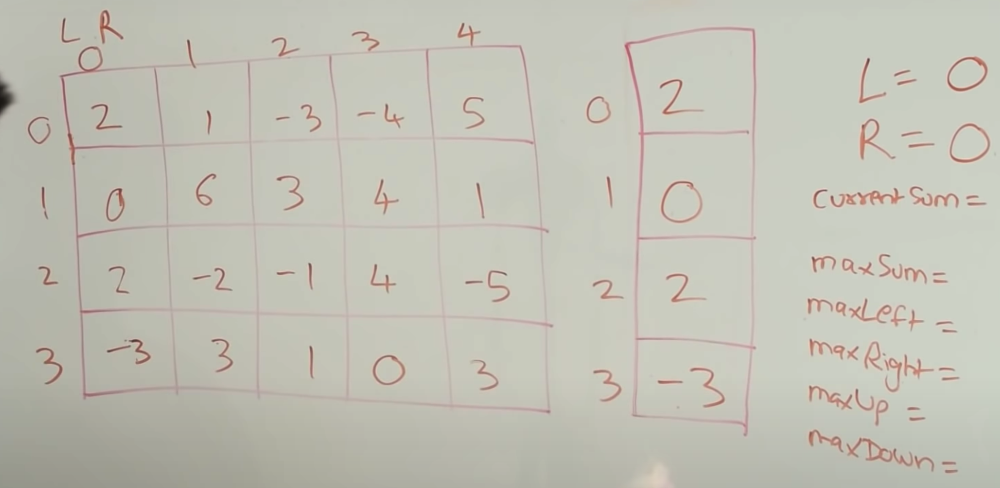
        2. 
        3. 
        4. 

- complexity:
    - in Java:
        - Space: O(row)
        - Time: O(col * col * row)
    - in Python
        - Space: O(row)
        - Time: O(col * col * row * row)
        - Since `insort` takes O(n) comparing to `TreeSet.add`

### Code
Accumulated Sum (TLE):
``` py
class Solution:
    def maxSumSubmatrix(self, matrix, k):
        r, c = len(matrix), len(matrix[0])
        acc_sum = [[0 for _ in range(c+1)] for _ in range(r+1)]
        res = float('-inf')
        for i in range(1, r+1):
            for j in range(1, c+1):
                acc_sum[i][j] = matrix[i-1][j-1] + acc_sum[i-1][j] + acc_sum[i][j-1] - acc_sum[i-1][j-1]

                # Iterate over all the combination of the sub-sum
                for i2 in range(1, i+1):
                    for j2 in range(1, j+1):
                        sub_sum = acc_sum[i][j] - acc_sum[i2-1][j] - acc_sum[i][j2-1] + acc_sum[i2-1][j2-1]
                        if sub_sum <= k:
                            res = max(res, sub_sum)
        return res
```

Optimal
```py
class Solution:
    def maxSumSubmatrix(self, matrix: List[List[int]], k: int) -> int:
        if not matrix or not matrix[0]:
            return 0

        R, C = len(matrix), len(matrix[0])
        res = float('-inf')

        for left in range(C):

            # new column sum array for each sliding window iteration
            columnSum = [0] * R

            for right in range(left, C):
                for column in range(R):
                    columnSum[column] += matrix[column][right]
                res = max(res, self.oneDsubMatrixLessThanK(columnSum, k))
        return res


    def oneDsubMatrixLessThanK(self, matrix, k):
        curSum, curSumArray, res = 0, [0], float('-inf')

        for i in range(len(matrix)):
            curSum += matrix[i]

            # find out the max previous subSum's index can sum up with curSum and less than k
            idx = bisect.bisect_left(curSumArray, curSum - k)

            if 0 <= idx < len(curSumArray): # avoid index out of range
                res = max(res, curSum - curSumArray[idx])

            # sorted insert the curSum into curSumArray
            bisect.insort(curSumArray, curSum)
        return res
```
### Tag: #Kadane #TwoPointer #TreeSet #divideAndConquer

---
## 355. Design Twitter｜ 11/28 | [ Review * 1 ]
Design a simplified version of Twitter where users can post tweets, follow/unfollow another user and is able to see the 10 most recent tweets in the user's news feed. Your design should support the following methods:

postTweet(userId, tweetId): Compose a new tweet.
getNewsFeed(userId): Retrieve the 10 most recent tweet ids in the user's news feed. Each item in the news feed must be posted by users who the user followed or by the user herself. Tweets must be ordered from most recent to least recent.
follow(followerId, followeeId): Follower follows a followee.
unfollow(followerId, followeeId): Follower unfollows a followee.
Example:

Twitter twitter = new Twitter();

// User 1 posts a new tweet (id = 5).
twitter.postTweet(1, 5);

// User 1's news feed should return a list with 1 tweet id -> [5].
twitter.getNewsFeed(1);

// User 1 follows user 2.
twitter.follow(1, 2);

// User 2 posts a new tweet (id = 6).
twitter.postTweet(2, 6);

// User 1's news feed should return a list with 2 tweet ids -> [6, 5].
// Tweet id 6 should precede tweet id 5 because it is posted after tweet id 5.
twitter.getNewsFeed(1);

// User 1 unfollows user 2.
twitter.unfollow(1, 2);

// User 1's news feed should return a list with 1 tweet id -> [5],
// since user 1 is no longer following user 2.
twitter.getNewsFeed(1);

### 思路

- 缺點:
    - 萬一follower 一多getNewsFeed會需要很大的記憶體空間，instead, 可動態去維護heap的大小為10。
    - 萬一很常去call getNewsFeed，為了不每次都要merge，可以維護一個 userId 所有的getNewsFeed要回傳的list，用 ETL 的概念
### Code
Heapq (Nlog10)
``` py
class Twitter:

    def __init__(self):
        """
        Initialize your data structure here.
        """
        self.follower_map = defaultdict(set)
        self.tweets_map = defaultdict(list)
        self.ts = 0

    def postTweet(self, userId: int, tweetId: int) -> None:
        """
        Compose a new tweet.
        """
        self.tweets_map[userId].append((self.ts, tweetId))
        self.ts += 1

    def getNewsFeed(self, userId: int) -> List[int]:
        """
        Retrieve the 10 most recent tweet ids in the user's news feed. Each item in the news feed must be posted by users who the user followed or by the user herself. Tweets must be ordered from most recent to least recent.
        """
        all_feed = []
        self.follower_map[userId].add(userId)

        for follwer in self.follower_map[userId]:
            for ts, tweetId in self.tweets_map[follwer]:
                heapq.heappush(all_feed, (ts, tweetId))
                if len(all_feed) > 10:
                    heapq.heappop(all_feed)

        return [heapq.heappop(all_feed)[1] for _ in range(len(all_feed))][::-1]

    def follow(self, followerId: int, followeeId: int) -> None:
        """
        Follower follows a followee. If the operation is invalid, it should be a no-op.
        """
        self.follower_map[followerId].add(followeeId)

    def unfollow(self, followerId: int, followeeId: int) -> None:
        """
        Follower unfollows a followee. If the operation is invalid, it should be a no-op.
        """
        if followeeId in self.follower_map[followerId]:
            self.follower_map[followerId].remove(followeeId)
```

OOD Solution
```py
import heapq

class Tweet(object):
    timestamp = 0
    def __init__(self, tid):
        self.id = tid
        self.timestamp = Tweet.timestamp
        Tweet.timestamp += 1

class User(object):
    def __init__(self, uid):
        self.id = uid
        self.following = set()
        self.tweets = []
        self.following.add(uid)

    def follow(self, uid):
        if uid not in self.following:
            self.following.add(uid)

    def unfollow(self, uid):
        if uid in self.following:
            self.following.remove(uid)

    def post(self, tid):
        self.tweets.append(Tweet(tid))

class Twitter(object):

    def __init__(self):
        """
        Initialize your data structure here.
        """
        self.id_to_user = {}


    def postTweet(self, userId, tweetId):
        """
        Compose a new tweet.
        :type userId: int
        :type tweetId: int
        :rtype: void
        """
        if userId not in self.id_to_user:
            self.id_to_user[userId] = User(userId)

        user = self.id_to_user[userId]
        user.post(tweetId)

    def getNewsFeed(self, userId):
        """
        Retrieve the 10 most recent tweet ids in the user's news feed. Each item in the news feed must be posted by users who the user followed or by the user herself. Tweets must be ordered from most recent to least recent.
        :type userId: int
        :rtype: List[int]
        """
        if userId not in self.id_to_user:
            self.id_to_user[userId] = User(userId)

        user = self.id_to_user[userId]
        following_ids = user.following

        res = self.mergeFollowingNews(following_ids)
        return res

    def mergeFollowingNews(self, following_ids):
        heap, res, following_lists = [], [], []

        for fid in following_ids:
            fuser = self.id_to_user[fid]
            following_lists.append(fuser.tweets)

        for i, flist in enumerate(following_lists):
            if flist:
                tweet = flist[-1]
                heapq.heappush(heap, (-tweet.timestamp, i, len(flist)-1, tweet.id) )

        n = 10
        while heap and n > 0:
            n_time, outer_i, local_i, tid = heapq.heappop(heap)
            res.append(tid) # tweet.id
            if local_i > 0: # element index
                tweet = following_lists[outer_i][local_i-1]
                heapq.heappush(heap, (-tweet.timestamp, outer_i, local_i-1, tweet.id) )
            n -= 1

        return res

    def follow(self, followerId, followeeId):
        """
        Follower follows a followee. If the operation is invalid, it should be a no-op.
        :type followerId: int
        :type followeeId: int
        :rtype: void
        """
        if followerId not in self.id_to_user:
            self.id_to_user[followerId] = User(followerId)

        if followeeId not in self.id_to_user:
            self.id_to_user[followeeId] = User(followeeId)

        follower = self.id_to_user[followerId]
        follower.follow(followeeId)

    def unfollow(self, followerId, followeeId):
        """
        Follower unfollows a followee. If the operation is invalid, it should be a no-op.
        :type followerId: int
        :type followeeId: int
        :rtype: void
        """
        if followerId == followeeId:
            return

        if followerId not in self.id_to_user:
            self.id_to_user[followerId] = User(followerId)

        if followeeId not in self.id_to_user:
            self.id_to_user[followeeId] = User(followeeId)

        follower = self.id_to_user[followerId]
        follower.unfollow(followeeId)
```

### Tag: #Design #heap
---
## 365. Water and Jug Problem｜ 11/28
You are given two jugs with capacities x and y litres. There is an infinite amount of water supply available. You need to determine whether it is possible to measure exactly z litres using these two jugs.

If z liters of water is measurable, you must have z liters of water contained within one or both buckets by the end.

Operations allowed:

Fill any of the jugs completely with water.
Empty any of the jugs.
Pour water from one jug into another till the other jug is completely full or the first jug itself is empty.
Example 1: (From the famous "Die Hard" example)

Input: x = 3, y = 5, z = 4
Output: True
Example 2:

Input: x = 2, y = 6, z = 5
Output: False


Constraints:

0 <= x <= 10^6
0 <= y <= 10^6
0 <= z <= 10^6

### 思路

1. 雖然是BFS的解法超時了，但這才是這題的精髓，面試時根本想不出來數學的解法
2. GCD solution:
    - solve: ax + by = z, if (x,y) exist
    - e.g.: `4 = (-2) * 3 + 2 * 5`

### Code
``` py
class Solution:
    def canMeasureWater(self, x: int, y: int, z: int) -> bool:
        # initial the states of two cup
        visited, queue = {(0, 0)}, [(0, 0)]

        while queue:
            # process current node
            a, b = queue.pop(0)
            if a == z or b == z or a+b == z:
                return True

            # gen more node
            states = self.gen_states(a, b, x, y)

            # check visited
            for state in states:
                if state not in visited:
                    queue.append(state)
                    visited.add(state)
        return False
    def gen_states(self, a, b, x, y):
        states = []

        # fill one of the cup
        states.append((a, y))
        states.append((x, b))

        # empty one of the cup
        states.append((0, b))
        states.append((a, 0))

        # poor one cup to the other
        if a+b < y:
            states.append((0, a+b))
        else:
            states.append((a-(y-b), y)) # can only poor y-b to b

        if a+b < x:
            states.append((a+b, 0))
        else:
            states.append((x, b-(x-a))) # can only poor x-a to a

        return states
```

Math solution:
```py
class Solution(object):
    def canMeasureWater(self, x, y, z):
        """
        :type x: int
        :type y: int
        :type z: int
        :rtype: bool
        """
        a,b=x,y
        while y:
            r=x%y
            x=y
            y=r
        return bool(not z or (x and z<=a+b and not z%x))
```

### Tag: #Math, #BFS
---
## 364. Nested List Weight Sum II｜ 11/29 | [ Review * 1 ]
Given a nested list of integers, return the sum of all integers in the list weighted by their depth.

Each element is either an integer, or a list -- whose elements may also be integers or other lists.

Different from the previous question where weight is increasing from root to leaf, now the weight is defined from bottom up. i.e., the leaf level integers have weight 1, and the root level integers have the largest weight.

Example 1:

Input: [[1,1],2,[1,1]]
Output: 8
Explanation: Four 1's at depth 1, one 2 at depth 2.
Example 2:

Input: [1,[4,[6]]]
Output: 17
Explanation: One 1 at depth 3, one 4 at depth 2, and one 6 at depth 1; 1*3 + 4*2 + 6*1 = 17.
### 思路

1. BFS:
    - 用 queue 存尚未處理完的
2. DFS:
    - 靠著不停的遞迴child, 來增加mother的depth
3. Optimal:
    - 靠著不停的加上unweighted, 來增加先放進去的元素的權重

### Code
BFS
``` py
class Solution:
    def depthSumInverse(self, nestedList: List[NestedInteger]) -> int:
        process_q, int_list = [(e, 0) for e in nestedList], []
        maxLevel = 0
        while process_q:
            top, level = process_q.pop()
            if top.isInteger():
                int_list.append((top, level))
            else:
                for e in top.getList():
                    process_q.append((e, level+1))
                maxLevel = max(maxLevel, level+1)
        res = 0
        for i, level in int_list:
            res += i.getInteger() * (maxLevel+1-level)
        return res
```

DFS
```py
class Solution:
    def depthSumInverse(self, nestedList: List[NestedInteger]) -> int:
        return self.dfs(nestedList)[0]
    def dfs(self, nestedList):
        cur_sum, child_list = 0, []

        for elem in nestedList:
            if elem.isInteger():
                cur_sum += elem.getInteger()
            else:
                child_list.extend(elem.getList())
        if len(child_list) == 0:
            return cur_sum, 1

        child_sum, depth = self.dfs(child_list)

        return cur_sum*(depth+1) + child_sum, depth+1
```

Optimal:
```py
class Solution:
    def depthSumInverse(self, nestedList: List[NestedInteger]) -> int:
        weighted, unweighted = 0, 0
        while len(nestedList) > 0:
            nextLevel = []
            for elem in nestedList:
                if elem.isInteger():
                    unweighted += elem.getInteger()
                else:
                    nextLevel.extend(elem.getList())
            weighted += unweighted
            nestedList = nextLevel
        return weighted
```

### Tag: #BFS, #DFS
---
## 366. Find Leaves of Binary Tree｜ 11/29 | [ Review * 1 ]

Given a binary tree, collect a tree's nodes as if you were doing this: Collect and remove all leaves, repeat until the tree is empty.

Example:

Input: [1,2,3,4,5]

          1
         / \
        2   3
       / \
      4   5

Output: [[4,5,3],[2],[1]]


Explanation:

1. Removing the leaves [4,5,3] would result in this tree:

          1
         /
        2


2. Now removing the leaf [2] would result in this tree:

          1


3. Now removing the leaf [1] would result in the empty tree:

          []
[[3,5,4],[2],[1]], [[3,4,5],[2],[1]], etc, are also consider correct answers since per each level it doesn't matter the order on which elements are returned.


### 解題分析
1. 撥洋蔥法:
    - main function 控制 level
    - remove function 去做遞迴 當掃描到跟節點的時候
        - 更新leaves
        - 更新完後此節點必須清掉, 清掉的方法就是返回 None, 並且讓 call 他的自己接 None
        - 最後返回更新後的節點 node

2. 相對高度:
    - 後序走訪 <- 我們需要先知道左右子節點的高度我才能定調自己的高度
    - 
    - 利用相對高度的原理來找到此leave應該放在哪個位置
### Code
撥洋蔥法:
``` py
class Solution:
    def findLeaves(self, root: TreeNode) -> List[List[int]]:
        res = []
        while root:
            self.leaves = []
            root = self.remove(root)
            res.append(self.leaves)
        return res

    def remove(self, node):
        if not node:
            return None

        if not node.left and not node.right:
            self.leaves.append(node.val)
            return None

        node.left = self.remove(node.left)
        node.right= self.remove(node.right)

        return node
```

相對高度法
```py
class Solution:
    def findLeaves(self, root: TreeNode) -> List[List[int]]:
        self.res = []
        _ = self.getHeight(root)

        return self.res

    def getHeight(self, node):
        if not node:
            return 0

        left = self.getHeight(node.left)
        right = self.getHeight(node.right)

        max_height = max(left, right)+1

        if max_height > len(self.res):
            self.res.append([])

        self.res[max_height-1].append(node.val)

        return max_height
```

相對高度 optimal
```py
class Solution:
    def findLeaves(self, root: TreeNode) -> List[List[int]]:
        level_map = collections.defaultdict(list)
        def dfs(root):
            if not root:
                return 0
            depth = max(dfs(root.left), dfs(root.right)) + 1
            level_map[depth].append(root.val)
            return depth
        dfs(root)
        return level_map.values()
```

### Tag: #DFS #BinaryTree
---
## 343. Integer Break｜ 11/29 | [ Review * 1 ]

Given a positive integer n, break it into the sum of at least two positive integers and maximize the product of those integers. Return the maximum product you can get.

Example 1:

- Input: 2
- Output: 1
- Explanation: 2 = 1 + 1, 1 × 1 = 1.

Example 2:

- Input: 10
- Output: 36
- Explanation: 10 = 3 + 3 + 4, 3 × 3 × 4 = 36.
- Note: You may assume that n is not less than 2 and not larger than 58.

### 思路

1. DP:
    - 類似 collect coin 那提的概念，如果知道了前面，就可以很快速的算出後面
    - 用button up DP, 從3開始循環到n，並且對於每個數從 1 開始拆分到 i-1
    - 裡面的 j*(i-j) 是拆分為兩個數的情形
        - 我們在切割時, dp[i] 紀錄的是至少拆成 1 * (i-1), 並沒有紀錄 0 * i, 因此 dp[i-j] 同樣也沒有包含 `i-j` 不拆分的情形, 因此 我們需要額外考慮 j * (i-j)
    - j * dp[i-j] 是拆分為多個數字的情況
2. Math:
    - 題目提示中讓用 O(n) 的時間複雜度來解題，而且告訴我們找7到 10 之間的規律，那麼我們一點一點的來分析：

    - 正整數從1開始，但是1不能拆分成兩個正整數之和，所以不能當輸入。

    - 那麼2只能拆成 1+1，所以乘積也為1。

    - 數字3可以拆分成 2+1 或 1+1+1，顯然第一種拆分方法乘積大為2。

    - 數字4拆成 2+2，乘積最大，為4。

    - 數字5拆成 3+2，乘積最大，為6。

    - 數字6拆成 3+3，乘積最大，為9。

    - 數字7拆為 3+4，乘積最大，為 12。

    - 數字8拆為 3+3+2，乘積最大，為 18。

    - 數字9拆為 3+3+3，乘積最大，為 27。

    - 數字10拆為 3+3+4，乘積最大，為 36。

    - 那麼通過觀察上面的規律，我們可以看出從5開始，數字都需要先拆出所有的3，一直拆到剩下一個數為2或者4，因為剩4就不用再拆了，拆成兩個2和不拆沒有意義，而且4不能拆出一個3剩一個1，這樣會比拆成 2+2 的乘積小。這樣我們就可以寫代碼了，先預處理n為2和3的情況，然後先將結果 res 初始化為1，然後當n大於4開始循環，結果 res 自乘3，n自減3，根據之前的分析，當跳出循環時，n只能是2或者4，再乘以 res 返回即可

### Code
DP solution
``` py
class Solution:
    def integerBreak(self, n: int) -> int:
        dp = [0] * (n+1)
        dp[1], dp[2] = 1, 1

        for i in range(3, n+1):
            for j in range(1, i):
                dp[i] = max(dp[i], max( j*(i-j) , j*dp[i-j]))
        return dp[n]
```

Math
```py
class Solution:
    def integerBreak(self, n: int) -> int:
        if n == 2:
            return 1
        elif n == 3:
            return 2

        res = 1
        while n > 4:
            n -= 3
            res *= 3
        return res * n
```

### Tag: #DP, #Math
---
## 361. Bomb Enemy｜ 11/29
Given a 2D grid, each cell is either a wall 'W', an enemy 'E' or empty '0' (the number zero), return the maximum enemies you can kill using one bomb.
The bomb kills all the enemies in the same row and column from the planted point until it hits the wall since the wall is too strong to be destroyed.
Note: You can only put the bomb at an empty cell.

Example:

Input: [["0","E","0","0"],["E","0","W","E"],["0","E","0","0"]]
Output: 3

Explanation: For the given grid,

0 E 0 0

E 0 W E

0 E 0 0

Placing a bomb at (1,1) kills 3 enemies.

### 思路

1. 累計數組
    - 建立四個累加數組 v1, v2, v3, v4，
    - 其中 v1 是水平方向從左到右的累加數組，v2 是水平方向從右到左的累加數組，v3 是豎直方向從上到下的累加數組，v4 是豎直方向從下到上的累加數組，
    - 建立好這個累加數組後，對於任意位置 (i, j)，其可以炸死的最多敵人數就是 v1[i][j] + v2[i][j] + v3[i][j] + v4[i][j]，最後通過比較每個位置的累加和，就可以得到結果
2. DP
    - 
    - 主要透過兩個變數 rowCount 跟 colCount[] + 水平掃描整個 map
    - 優化上面的解法
        - 思路: 為了不使用那麼多的空間去存, 我們希望能 1 pass 就解, 那這樣就必須要一次就算出整行的 E 數 + 整列的 E 數, 並且要使這些結果可被復用
            - 這樣聽起來是 O(M * N * (M+N))
            - 然而其實還是 O(M * N), 準確點來說 O(3 * M * N)
                - 我們從每個點實際需要去被拜訪幾次來算
                    1. `if grid[i][j] == '0':` 這行
                    2. 計算 rowCount 時, (只會有一次!)
                    3. 計算 colCount 時, (只會有一次!)
        - 我們一次就去計算此行及此點有多少個 E, 直到撞到牆
        - 又因為我們是水平掃描, 因此我們除非遇到 W, 不然此行的 enemy 數可以直接用 rowCount 存下, 然而垂直的數量就必須要用 array 保存了,
        - rowCount 迴圈的去計算此行的 E 數
        - colCount[j] 迴圈的去計算此列的 E 數
        - 何時需重新計數?
            - 行、列的起頭
            - 上一行或上一列是 Wall

### Code
``` py
class Solution:
    def maxKilledEnemies(self, grid: List[List[str]]) -> int:
        if not grid or not grid[0]:
            return 0
        R, C = len(grid), len(grid[0])
        v1 = [[0 for _ in range(C)] for _ in range(R)] # count from left to right
        v2 = [[0 for _ in range(C)] for _ in range(R)] # count from right to left
        v3 = [[0 for _ in range(C)] for _ in range(R)] # count from up to down
        v4 = [[0 for _ in range(C)] for _ in range(R)] # count from down to up

        for i in range(R):

            for j in range(C):
                if j == 0 or grid[i][j] == 'W':
                    k = 0
                else:
                    k = v1[i][j-1]
                v1[i][j] = k+1 if grid[i][j] == 'E' else k

            for j in range(C-1, -1, -1):
                if j == C-1 or grid[i][j] == 'W':
                    k = 0
                else:
                    k = v2[i][j+1]
                v2[i][j] = k+1 if grid[i][j] == 'E' else k

        for j in range(C):

            for i in range(R):
                if i == 0 or grid[i][j] == 'W':
                    k = 0
                else:
                    k = v3[i-1][j]
                v3[i][j] = k+1 if grid[i][j] == 'E' else k

            for i in range(R-1, -1, -1):
                if i == R-1 or grid[i][j] == 'W':
                    k = 0
                else:
                    k = v4[i+1][j]
                v4[i][j] = k+1 if grid[i][j] == 'E' else k

        res = 0
        for i in range(R):
            for j in range(C):
                if grid[i][j] == '0':
                    res = max(res, v1[i][j]+v2[i][j]+v3[i][j]+v4[i][j])
        return res
```

DP: (Optimal O(MN))
```py
class Solution:
    def maxKilledEnemies(self, grid: List[List[str]]) -> int:
        if not grid or not grid[0]:
            return 0

        R, C = len(grid), len(grid[0])

        rowCount = 0
        colCount = [0]*C
        res = 0

        for i in range(R):
            for j in range(C):

                # horizontal
                if j == 0 or grid[i][j-1] == 'W':
                    rowCount = 0
                    for j1 in range(j, C):
                        if grid[i][j1] == 'W':
                            break
                        rowCount += 1 if grid[i][j1] == 'E' else 0

                # vertical
                if i == 0 or grid[i-1][j] == 'W':
                    colCount[j] = 0
                    for i1 in range(i, R):
                        if grid[i1][j] == 'W':
                            break
                        colCount[j] += 1 if grid[i1][j] == 'E' else 0

                if grid[i][j] == '0':
                    res = max(res, rowCount+colCount[j])
        return res
```

### Tag: #DP, #Grid
---
## 367. Valid Perfect Square｜ 11/30
Given a positive integer num, write a function which returns True if num is a perfect square else False.

Follow up: Do not use any built-in library function such as sqrt.

Example 1:

Input: num = 16
Output: true
Example 2:

Input: num = 14
Output: false


Constraints:

1 <= num <= 2^31 - 1

### 思路

Binary Search model usage.

Find specific value:
    - left <= right
    - left = mid+1
    - right = mid-1

### Code
``` py
class Solution:
    def isPerfectSquare(self, num: int) -> bool:
        if num == 1:
            return True

        left, right = 0, num
        while right >= left:
            mid = left + (right-left)//2
            guess = mid*mid
            if guess == num:
                return True

            if guess > num:
                right = mid-1
            else:
                left = mid+1
        return False
```

### Tag: #BinarySearch
---
## 368. Largest Divisible Subset｜ 11/30

Given a set of distinct positive integers, find the largest subset such that every pair (Si, Sj) of elements in this subset satisfies:

Si % Sj = 0 or Sj % Si = 0.

If there are multiple solutions, return any subset is fine.

Example 1:

Input: [1,2,3]
Output: [1,2] (of course, [1,3] will also be ok)
Example 2:

Input: [1,2,4,8]
Output: [1,2,4,8]

### 思路

1. DP:
    - https://youtu.be/Wv6DlL0Sawg?t=518
    - 我們初始化我們的 DP 陣列為所有的 [num], 因為每個數可以被自己整除
    - 然後從第二個元素 i 開始 loop 到最後
        - 再來我們試著在 i 之前的元素嘗試看看能不能將 i 加入其陣列中
        - 我們都去試著用 i 去對他取餘看是否等於零，若等於零則表示可加入
        - 但我們 dp[i] 只要放最長的數組就好，所以我們還要去檢查是否 dp[j]+1 > dp[i]
        - 若大於 我們更新 dp[i] = dp[j] + [num]
    - 這題其實是 LIS 的變形
    - complexity
        - Time: O(N^2)
        - Space: O(N)

2. DP 優化:
    - 我們可以進一步優化空間
    - 想法是, 我們不直接保存結果, 我們只記錄到該 index 所可形成的最大 subset 的長度, 並同步更新當前最大的 subset 大小及其 index為何
    - 走完一遍之後, 我們在透過 maxSize, maxIndex 去 `trace back` 來重新建造這個最大的 subset
    - 如何 reconstruct?
        - 我們 dp[i] 紀錄的是 nums[i] 所屬的最大 subset 的 size
        - 我們可以從後往前去尋找元素, 每找到一個`符合`的元素, 就去更新 currSize 跟 currTail, 以讓我們去尋找下一個, 符合的條件如下
            1. currSize == dp[i]
            2. currTail % nums[i] == 0
        - 當找到元素後我們要更新這兩個變數, 遞減 currSize, 更新 currTail

- Followup:
    - why we need to sort?
    - a % b == 0, only if a == b or a > b.
    - yes, we don't need sort or we compare both a % b or b % a == 0,
    - and this will result in n^2 other comparation, which is slower than we sort.

### Code
TLE
``` py
class Solution:
    def largestDivisibleSubset(self, nums: List[int]) -> List[int]:
        if not nums:
            return []
        nums = sorted(nums)
        groups = [[nums[0]]]

        for num in nums[1:]:
            flag = False
            new_groups = []
            for group in groups:
                if num > group[-1] and num % group[-1] == 0:
                    new_groups.append(group+[num])
                elif group[-1] > num > group[0] and group[-1] % num == 0 and num % group[0] == 0:
                    new_groups.append(group+[num])
                elif group[0] > num and group[0] % num == 0:
                    new_groups.append(group+[num])
            new_groups.append([num])
            groups += new_groups
        res = []
        for group in groups:
            if len(group) > len(res):
                res = group
        return res
```

DP
```py
class Solution:
    def largestDivisibleSubset(self, nums: List[int]) -> List[int]:
        if not nums:
            return []

        nums = sorted(nums)
        N = len(nums)
        dp = [[num] for num in nums]
        maxDP = []

        for i in range(N):
            for j in range(i):
                if nums[i] % nums[j] == 0 and len(dp[j])+1 > len(dp[i]):
                    dp[i] = dp[j] + [nums[i]]
            if len(dp[i]) > len(maxDP):
                maxDP = dp[i]
        return maxDP
```

DP (Space Optimize)
```py
class Solution:
    def largestDivisibleSubset(self, nums: List[int]) -> List[int]:
        if not nums:
            return []

        nums = sorted(nums)
        N = len(nums)
        dp = [1 for _ in range(N)]
        maxSize, maxIdx = 1, 0

        for i in range(N):
            for j in range(i):
                if nums[i] % nums[j] == 0 and dp[j]+1 > dp[i]:
                    dp[i] = dp[j]+1
                if dp[i] >= maxSize:
                    maxSize, maxIdx = dp[i], i

        # reconstruct max subset
        res = []
        currSize, currTail = maxSize, nums[maxIdx]
        for i in range(maxIdx, -1, -1):
            if dp[i] == currSize and currTail % nums[i] == 0:
                res.append(nums[i])
                currSize, currTail = currSize-1, nums[i]
        return res
```
### Tag: #DP, #LIS
---
## 369. Plus One Linked List｜ 12/1
Given a non-negative integer represented as non-empty a singly linked list of digits, plus one to the integer.

You may assume the integer do not contain any leading zero, except the number 0 itself.

The digits are stored such that the most significant digit is at the head of the list.

Example :

Input: [1,2,3]
Output: [1,2,4]
### 思路

- 把 dum new 成 1 來做需要進位的準備
### Code
``` py
class Solution:
    def plusOne(self, head: ListNode) -> ListNode:
        dum = ListNode(val=1, next=head)
        stack = []
        while head:
            stack.append(head)
            head = head.next

        carry = False
        while stack:
            top = stack.pop()

            if top.val != 9:
                top.val += 1
                carry = False
                break
            else:
                top.val = 0
                carry = True
        if carry:
            return dum
        else:
            return dum.next
```

### Tag: #Stack #LinkedList
---
## 829. Consecutive Numbers Sum｜ 1/30

Given a positive integer N, how many ways can we write it as a sum of consecutive positive integers?

Example 1:

- Input: 5
- Output: 2
- Explanation: 5 = 5 = 2 + 3


Example 2:

- Input: 9
- Output: 3
- Explanation: 9 = 9 = 4 + 5 = 2 + 3 + 4


Example 3:

- Input: 15
- Output: 4
- Explanation: 15 = 15 = 8 + 7 = 4 + 5 + 6 = 1 + 2 + 3 + 4 + 5

Note: 1 <= N <= 10 ^ 9.

### 思路

1. N 為連續整數的和，因此我們可以寫成表達式: N = (x+1) + (x+2) + ... (x+k)
    - 
2. 化簡後可以得到 N = xk + k(k+1) // 2
3. 從 xk 可以發覺，假設知道了 k，我們可以用 N % k 是否等於零來知道這個 x 是否有可能為一種解
4. 這個 k 就是一個範圍，我們在這個範圍嘗試所有的k 並判斷是否為整除，因此下個步驟就是找出這個 k
5. 數學化簡詳見筆記 or Leetcode Solution
    - 
6. 優化:
    1. N = xk + (1+ 2+ ... +k) 在我們的回圈中的意義就是
        1. 設 k = 1 : N = x*1 + (1) -> (N-1)%1 是否為整數
        2. 設 k = 2 : N = x*2 + (1+2) -> (N-1-2)%2 是否為整數
    2. 從 k=1 到 k=2 就是多減了 k，因此我們可以利用遞減 k 來進行優化
### Code
``` py
class Solution:
    def consecutiveNumbersSum(self, N: int) -> int:
        res = 0
        limit = math.ceil((2 * N + 0.25) ** 0.5 - 0.5)

        for k in range(1, limit+1):
            if (N - k*(k+1)//2) % k == 0:
                res += 1
        return res
```

Optimize
```py
class Solution:
    def consecutiveNumbersSum(self, N: int) -> int:
        res = 0
        limit = math.ceil((2 * N + 0.25)**0.5 - 0.5) + 1
        for k in range(1, limit):
            N -= k
            if N % k == 0:
                res += 1
        return res
```

### Tag: #Math
---
## 68. Text Justification｜ 1/30 | [ Review * 1 ]
Given an array of words and a width maxWidth, format the text such that each line has exactly maxWidth characters and is fully (left and right) justified.

You should pack your words in a greedy approach; that is, pack as many words as you can in each line. Pad extra spaces ' ' when necessary so that each line has exactly maxWidth characters.

Extra spaces between words should be distributed as evenly as possible. If the number of spaces on a line do not divide evenly between words, the empty slots on the left will be assigned more spaces than the slots on the right.

For the last line of text, it should be left justified and no extra space is inserted between words.

Note:

A word is defined as a character sequence consisting of non-space characters only.
Each word's length is guaranteed to be greater than 0 and not exceed maxWidth.
The input array words contains at least one word.


Example 1:

Input: words = ["This", "is", "an", "example", "of", "text", "justification."], maxWidth = 16
Output:
[
   "This    is    an",
   "example  of text",
   "justification.  "
]
Example 2:

Input: words = ["What","must","be","acknowledgment","shall","be"], maxWidth = 16
Output:
[

  "What   must   be",

  "acknowledgment  ",

  "shall be        "

]
Explanation: Note that the last line is "shall be    " instead of "shall     be", because the last line must be left-justified instead of fully-justified.
Note that the second line is also left-justified becase it contains only one word.
Example 3:

Input: words = ["Science","is","what","we","understand","well","enough","to","explain","to","a","computer.","Art","is","everything","else","we","do"], maxWidth = 20
Output:
[

  "Science  is  what we",

  "understand      well",

  "enough to explain to",

  "a  computer.  Art is",

  "everything  else  we",

  "do                  "

]


Constraints:

1 <= words.length <= 300
1 <= words[i].length <= 20
words[i] consists of only English letters and symbols.
1 <= maxWidth <= 100
words[i].length <= maxWidth

### 解題分析
1. 每行的最後一個字不能分配空白, 因此我們在判斷是否超過的時候先預設分配一個空白給每個再 list 裡的字, 再去加上目前想加入的字去判斷是否超過
2. 如果超過了我們就先不加入此字, 就剩下的去分配空白
3. 分配的方式是用 mod 去做 round robin, 但這邊我們需要 mod `len(cur_line) -1`, 因為我們不打算分配給最後一個字
    - 三個字, 3-1 = 2, mod 2 的話只會有 0, 1 的結果
4. 分配好之後就可以加進去 res 裡了, 因為我們這邊自己手動插入空格所以用 `"".join` 就可
5. 都處理完之後就剩下最後一行
6. 最後一行每個都只有一個空白, 其餘的空白加到最後面, 所以我們這邊用 `" ".join`

### 思路

1. 先把這行所能用的字取出來
2. 然後用 round robin 去分配空白字元到本來的字串後面 (題目提到如果分配不均由左到右)
    1. or 1 的部分是為了處理 curCnt = 1 時會出現的 % 0 錯誤
3. 分配完之後將字串塞回去 res 裡，然後初始化 curWords, curLen, 並繼續循環
    1. 這裏新增 word, 更新 len 的位置非常美，可以在做完一行初始化後繼續把 word 給加進去
4. 保留住最後一行的字元，在回圈外特殊的去處裡最後一行特殊的邏輯

### Code
``` py
class Solution:
    def fullJustify(self, words: List[str], maxWidth: int) -> List[str]:
        res = []
        cur_line, cur_len = [], 0

        for word in words:
            cur_len_with_space = cur_len + len(cur_line)
            if len(word) + cur_len_with_space > maxWidth:
                remain_space = maxWidth - cur_len
                for i in range(remain_space):
                    cur_line[i % (len(cur_line)-1 or 1)] += ' ' # -1 for ignore the last word
                res.append("".join(cur_line))
                cur_line, cur_len = [], 0

            cur_line.append(word)
            cur_len += len(word)

        # parse last line
        last_line = " ".join(cur_line)
        for _ in range(maxWidth - len(last_line)):
            last_line += ' '
        res.append(last_line)
        return res
```

### Tag: #Array #String
---
## 10. Regular Expression Matching｜ 1/31 | [Review * 1]

Given an input string (s) and a pattern (p), implement regular expression matching with support for '.' and '*' where:

- '.' Matches any single character.​​​​
- '*' Matches zero or more of the preceding element.
- The matching should cover the entire input string (not partial).

- Example 1:

    - Input: s = "aa", p = "a"
    - Output: false
    - Explanation: "a" does not match the entire string "aa".

- Example 2:

    - Input: s = "aa", p = "a*"
    - Output: true
    - Explanation: '*' means zero or more of the preceding element, 'a'. Therefore, by repeating 'a' once, it becomes "aa".

- Example 3:

    - Input: s = "ab", p = ".*"
    - Output: true
    - Explanation: ".* " means "zero or more (*) of any character (.)".

- Example 4:

    - Input: s = "aab", p = "c* a *b"
    - Output: true
    - Explanation: c can be repeated 0 times, a can be repeated 1 time. Therefore, it matches "aab".
- Example 5:

    - Input: s = "mississippi", p = "mis* is * p *."
    - Output: false


### 思路
0. 題目分析
    1. 如果沒有 * 的存在情況會變成只需要掃描一遍就行
    2. 但因為有 * 的情況會出現許多後綴 (suffix) 匹配的問題，因此我們選擇 recursive 來解題
1. p 的情況比較複雜因此我們以 p 作為操作的基礎，首先針對 p 長度 = {0 or 1} 的狀況去做處理，因為後面就得面對出現 * 的狀況需要 *2* 個字元一起看
2. 首先處理 p 的第二個元素不是 * 的狀況
    1. 首先判斷 s 是否為空，因為如果不是 * ，那麼第一或第二一定都是 char，如 ["", ".."] should return False
    2. 再來去做 `single 元素的匹配` {s[0] == p[0] or p[0] == '.'}, 如果一樣那麼繼續 recursive 個去掉第一個字元繼續配
3. 剩下的狀況就是 p[1] == * 的狀況了:
    1. 這種狀況下我們首要要解決的問題就是 s 有很多重複的字必須先消除, 如 ["aaaaaaa", "a*"], 做法就是不停的做 `single 元素匹配`
    2. 但只是這樣做的話少考慮到，萬一這個 * 只是拿來 `消除字元`，如 ["ab", "a*ab"]
    3. 因此我們需要針對每一種狀態去做假設他是消除字元的用途的猜測，即直接把 p[0], p[1] 消掉匹配剩下的
4. 該消除的都消除之後，我們始可以直接推進 p (s 如果需要推進早就在 while 裡面推進過了)

5. 上面的解法搞懂後可以進一步將代碼寫的更簡單，邏輯是一樣的
    1. first_match 就是 single 元素匹配
    2. 把 while 回圈中的邏輯用成 recursive 去實作
6. 寫出簡潔的 recursive code 之後可以更進一步將代碼改寫成 DP (top-down)
    1. 透過 i, j 分別去紀錄各個字串的位置可以省去 slice 字串的時間
    2. memorize(i, j) 在這邊好像不會有特別的作用 ... 因為各個recursive都是直線前進，不太會去存取重複的
7. top-down 可以在精簡化 recursive call 寫成 bottom-up
    1. 
    3. 大意上還是狀態轉移
        1. p[j] = s[i] or "." => 直接轉移上個狀態，也就是 dp[i-1][j-1]
        2. p[j] = "*":
            1. 此 * 是用來 match 空的, 因此從 `p 的上上個` 狀態轉移過來, dp[i][j-2]
            2. 或者前一個狀態是 match 的狀況下, 從 `s 的上一個` 狀態轉移過來, dp[i-1][j]
    4. 然後, BottomUp 不同的是, 我們是需要預處理陣列的 (否則 當 i = 1, dp[i-1][j] 會吃不到正確的值):
        - 目標是解決 * 拿來處理 leading word 的 case: ["aab", "c*aab"]
        - 

8. 與 LC44 相似的通解 (BottomUp)
    - 使用 BottomUp DP 解
        - Default DP Base Case Value
            - 主要都是針對 dp[0][j] 去 設定初始值, 意義就是 **s 為空字串時, 與 p 的 matching**
            - 因此我們在寫這段的時候就去想 s 為空字串, p[j] 的值怎麼推到 dp 去, 間單來說就是, **星號是否可以把整個 p 變成空字串**
                - e.g.: s = "", p = `"a*b*ab*c"`
                - ..........a, *, b, *, a, b, *, c
                - dp = [[T, F, T, F, T, F, F, F, F]] (第一個 T 為 initial value)
                - 因此, 只有 `p[j-1] == "*" 且 dp[j-2] == True`, 才能把 dp[0][j] 設為 True
            - 主迴圈
                - 當前相同或可 by pass
                    - 直接 assign 成 dp[i-1][j-1]
                - 當前是 *
                    - 可能用來刪除前一個 p, "ac", "b*ac"
                        - dp[i][j-2]
                    - 或者在前一個 p 的值 match 當前的 s 的狀況下, 去 match 任何字 (ignore current i)
                        - 其實整句話就等價於 `* 用來 match 它前一個字`
                        - `p[j-2] in {s[i-1], '.'}`
                        - `and dp[i-1][j]`
                        - e.g.:
                            - "aa", "a*"
                                - True
                            - "ab", "b*"
                                - False
                            - "aaaaa", "a*"
                                - True
                            - "aa", "a*****"
                    - 或者 match nothing
                        - "a", "a*"

### Code
Recursive:
``` py
class Solution:
    def isMatch(self, s: str, p: str) -> bool:
        if len(p) == 0:
            return len(s) == 0
        if len(p) == 1:
            return len(s) == 1 and (s[0] == p[0] or p[0] == '.')

        if p[1] != '*':
            if len(s) == 0:
                return False
            return (s[0] == p[0] or p[0] =='.') and self.isMatch(s[1:], p[1:])

        while len(s) != 0 and (s[0] == p[0] or p[0] == '.'):
            if self.isMatch(s, p[2:]): # * use as eliminate, ["ab", "a*ab"], ["ab", "a*ac"]
                return True
            s = s[1:] # already match p[0]

        # use for the rest match, assume p has matched all it can
        return self.isMatch(s, p[2:])

    # ("ab", "c*ab")
    # ("a*b", "ab")
    # ("a*", "aa")
    # ("a*", "ab")
    # ("a", "*")
```

Recursive, concise:
```py
class Solution(object):
    def isMatch(self, text, pattern):
        if not pattern:
            return not text

        first_match = bool(text) and pattern[0] in {text[0], '.'}

        if len(pattern) >= 2 and pattern[1] == '*':
            return (self.isMatch(text, pattern[2:]) or
                    first_match and self.isMatch(text[1:], pattern))
        else:
            return first_match and self.isMatch(text[1:], pattern[1:])
```

DP top-down (memorize of recursive solution):
```py
class Solution:
    def isMatch(self, s: str, p: str) -> bool:
        memo = {}

        def dp(i, j):
            if (i, j) not in memo:
                if j == len(p):
                    ans = (i == len(s))
                else:
                    first_match = i < len(s) and p[j] in {s[i], '.'}

                    if j+1 < len(p) and p[j+1] == '*':
                        ans = dp(i, j+2) or (first_match and dp(i+1, j))
                    else:
                        ans = first_match and dp(i+1, j+1)

                memo[(i,j)] = ans
            return memo[(i,j)]

        return dp(0, 0)
```

DP bottom-up 與 TopDown 相近的寫法！ (Optimal)
```py
class Solution:
    def isMatch(self, s: str, p: str) -> bool:
        s_len, p_len = len(s), len(p)
        dp = [[False for _ in range(p_len+1)] for _ in range(s_len+1)]
        dp[0][0] = True

        for j in range(1, p_len+1):
            if p[j-1] == '*' and dp[0][j-2]:
                dp[0][j] = True # pre-process for dp[i-1][j]

        for i in range(1, s_len+1):
            for j in range(1, p_len+1):
                if p[j-1] == '*':
                    dp[i][j] = dp[i][j-2] or (p[j-2] in {s[i-1], '.'} and dp[i-1][j]) or dp[i][j-1]
                else:
                    dp[i][j] = p[j-1] in {s[i-1], '.'} and dp[i-1][j-1]
        return dp[-1][-1]
```

### Tag: #Recursive, #DP #TopDown #BottomUp
---
## 44. Wildcard Matching｜ 2/7 | [ Review * 1 ]
Given an input string (s) and a pattern (p), implement wildcard pattern matching with support for '?' and '*' where:

'?' Matches any single character.
'*' Matches any sequence of characters (including the empty sequence).
The matching should cover the entire input string (not partial).

Example 1:

Input: s = "aa", p = "a"
Output: false
Explanation: "a" does not match the entire string "aa".
Example 2:

Input: s = "aa", p = "*"
Output: true
Explanation: '*' matches any sequence.
Example 3:

Input: s = "cb", p = "?a"
Output: false
Explanation: '?' matches 'c', but the second letter is 'a', which does not match 'b'.
Example 4:

Input: s = "adceb", p = "*a*b"
Output: true
Explanation: The first '* ' matches the empty sequence, while the second '*' matches the substring "dce".
Example 5:

Input: s = "acdcb", p = "a*c?b"
Output: false


Constraints:

0 <= s.length, p.length <= 2000
s contains only lowercase English letters.
p contains only lowercase English letters, '?' or '*'.

### 類似題
1. LC10
2. LC72

### 思路

1. 比起 LC10, 這題算是比較親民版的, 關鍵在於 * 有可能有多個, 要預處理重複 * 的情形 e.g.: ["", "****"]
2. 一樣優先考慮用 recursive 去解, 然後再進行 memorization 優化, recursive 的解法就是先把條件列完整:
    1. not P and not S => True
    2. not S and P = * => True
    3. p[0] != *
        -  s[0] = p[0] or p[0] = ? => recur(s[1:], p[1:])
    4. p[0] == *
        1. "*" use to Match Empty => recur(s, p[1:])
        2. "*" use to Match One (or more) => recur(s[1:], p)
3. 用 i, j 去進行 memorization 的優化
    1. 就是將本來用字串操作判斷式的邏輯改為以 index 存取，並多加一層判斷是否已經 memo 過
4. BottonUp solution:
    0. 寫法幾乎跟 LC10 一饃一樣
    1. Memorization 最大的缺點就是, recursive 階層還是太多了
    2. 那麼我們只能透過 ButtonUp 的 DP, 也就是狀態的轉移
    3. 首先定義我們的 DP[s_idx][p_idx] 為 s[s_idx] 與 p[p_idx] 是否匹配
    4. 最大原則: 如果當前的狀態是 match 的，我們就把上一個狀態搬過來，即: dp[i][j] = dp[i-1][j-1]
    5. 這種方法可以只利用上面第二點列出的 規則3 and 規則4, 直接改寫成狀態轉移的形式
    6. 關於規則4 在 dp 的改寫:
        1. isMatch(s[1:], p) 即為 dp[i][j-1], p 保留現在的狀態而 s 推進到下個狀態
        2. 同理 isMatch(s, p[1:])
    7. 唯一需要注意的是，此種寫法必須針對領頭 "*" 用來 match 空的狀況，將其狀態初始化為 True
    8. 
5. 還有一種 backtrack(without recursive) 的解法才是最優解
    1. 概念來自於我們不需要每種狀態都用 recursive 去解, 也可以直接去猜 "*" 到底 match 幾個？
    2. 遇到 * 的處理
        1. 當我們遇到 star 的時候, 把當前的 star 的 idx 記錄下來, 並猜測此 star match 0 個 e.g.: p_idx +1, s_idx 不動
        2. 那如果其實這個 star 不只是 match 一個呢？就會進入到最後一個 else
            1. 在這裡換成 p_idx 還原至 star_idx + 1
            2. s_idx 則是不停的 +1 直到沒有出現 unmatch 的情況才停止
            3. 若是 match 後右 unmatch 則又會再進入到這個狀態, 此時又會回到猜測此 star 應該 match 更多
            4. 因此若是永遠都找不到解 s_idx 就會不停的 +1 直到結束, 而 p_idx 會永遠停在 star_idx + 1
            5. 因此最後判定 p 從 p_idx 的剩餘是否只存在 star，就結束了
        3. 另外需處理根本沒有 * 卻出現 unmatch 的狀況，不能讓他進入到最後一個 else


6. 與 LC10 相似的通解 (BottomUp)
    - Default DP Base Case Value
        - 主要都是針對 dp[0][j] 去 設定初始值, 意義就是 **s 為空字串時, 與 p 的 matching**
        - 因此我們在寫這段的時候就去想 s 為空字串, p[j] 的值怎麼推到 dp 去, 簡單來說就是, **星號是否可以把整個 p 變成空字串**
            - e.g.: s = "", p = `"***ab*c"`
            - ..........*, *, *, a, b, *, c
            - dp = [[T, T, T, T, F, F, F, F]] (第一個 T 為 initial value)
            - 因此, 只有 `p[j-1] == "*" 且 dp[j-1] == True`, 才能把 dp[0][j] 設為 True
    - 主迴圈
        - 當前相同或可 by pass
            - 直接 assign 成 dp[i-1][j-1]
        - 當前是 *
            - 可能用來 match 0 個
                - dp[i][j-1]
            - 或者 match 任何字 (ignore current i)
                - dp[i-1][j]

### Code
TLE Recursive
``` py
class Solution:
    def isMatch(self, s: str, p: str) -> bool:
        if p:
            # remove duplicate star
            # for case: ["", "****"]
            newP = [p[0]]
            for c in p[1:]:
                if c != "*" or c != newP[-1]:
                    newP.append(c)
            p = "".join(newP)
        return self.isMatchHelper(s, p)

    def isMatchHelper(self, s, p):
        if not p:
            return not s
        if not s:
            return p == "*"

        if p[0] != "*":
            first_match = p[0] in {s[0], "?"}
            return first_match and self.isMatchHelper(s[1:], p[1:])
        else:
            return self.isMatchHelper(s, p[1:]) or self.isMatchHelper(s[1:], p)
```

Optimize with Memorization
```py
class Solution:
    def isMatch(self, s: str, p: str) -> bool:
        memo = {}
        def isMatchHelper(i, j):
            if (i,j) not in memo:
                if j == len(p):
                    ans = (i == len(s))
                elif i == len(s):
                    ans = (p[j:] == "*")
                else:
                    if p[j] != "*":
                        first_match = i < len(s) and p[j] in {s[i], "?"}
                        ans = first_match and isMatchHelper(i+1, j+1)
                    else:
                        ans = isMatchHelper(i, j+1) or isMatchHelper(i+1, j)
                memo[(i,j)] = ans
            return memo[(i,j)]


        if p:
            # remove duplicate star
            newP = [p[0]]
            for c in p[1:]:
                if c != "*" or c != newP[-1]:
                    newP.append(c)
            p = "".join(newP)
        return isMatchHelper(0, 0)
```

Optimal Solution DP BottonUp:
```py
class Solution:
    def isMatch(self, s: str, p: str) -> bool:
        len_s, len_p = len(s), len(p)

        dp = [[False for _ in range(len_p+1)] for _ in range(len_s+1)]
        dp[0][0] = True
        for j in range(1, len_p+1):
            if p[j-1] == "*" and dp[0][j-1]:
                dp[0][j] = True # allow * in the front part of p could be used as match empty

        for i in range(1, len_s+1):
            for j in range(1, len_p+1):
                if p[j-1] == "*":
                    dp[i][j] = dp[i-1][j] or dp[i][j-1]
                else:
                    dp[i][j] = p[j-1] in {s[i-1], '?'} and dp[i-1][j-1]
        return dp[-1][-1]
```

Tricky best solution
```py
class Solution:
    def isMatch(self, s: str, p: str) -> bool:
        s_len, p_len = len(s), len(p)
        s_idx, p_idx = 0, 0
        star_idx, s_tmp_idx = -1, -1

        while s_idx < s_len:
            if p_idx < p_len and p[p_idx] in {s[s_idx], "?"}:
                p_idx += 1
                s_idx += 1
            elif p_idx < p_len and p[p_idx] == "*":
                # record current status
                # p_idx + 1 => start with match empty
                star_idx = p_idx
                s_tmp_idx = s_idx
                p_idx += 1
            elif star_idx == -1:
                # the first match was failed
                return False
            else:
                p_idx = star_idx + 1 # always point to the next char of *
                s_idx = s_tmp_idx + 1
                s_tmp_idx = s_idx # but keep move forward s_idx pointer => means match 1, match 2 ... match n
        return all(x == '*' for x in p[p_idx:]) # the rest of the p should be "*" or empty
```

### Tag: #DP #Recursive #TopDown #BottonUp
---
## 306. Additive Number｜ 2/28 | [ Review * 1 ]
Additive number is a string whose digits can form additive sequence.

A valid additive sequence should contain at least three numbers. Except for the first two numbers, each subsequent number in the sequence must be the sum of the preceding two.

Given a string containing only digits '0'-'9', write a function to determine if it's an additive number.

Note: Numbers in the additive sequence cannot have leading zeros, so sequence 1, 2, 03 or 1, 02, 3 is invalid.

Example 1:

Input: "112358"

Output: true

Explanation: The digits can form an additive sequence: 1, 1, 2, 3, 5, 8.
             1 + 1 = 2, 1 + 2 = 3, 2 + 3 = 5, 3 + 5 = 8
Example 2:

Input: "199100199"

Output: true

Explanation: The additive sequence is: 1, 99, 100, 199.
             1 + 99 = 100, 99 + 100 = 199


Constraints:

- num consists only of digits '0'-'9'.
- 1 <= num.length <= 35
- Follow up:
- How would you handle overflow for very large input integers?

### 解題分析
1. Recursive
    1. 一開始在思考這題的時候卡在 initial states of num1 and num2 不知道怎麼設
    2. 因為此題的 Recursive 連 initial state 都有可能不一樣，因此做法是嘗試各種 initial state
    3. 進了 recursive 後不需要一個一個去選 sum, 直接取跟 sum 一樣長的字串是否相同，不同就表示此種 initial states 不行
    4. 因此這題有點像是在選 initial state, 那麼可以改寫成 iterative 的方法
2. Iterative


### Code
Recursive
``` py
class Solution:
    def isAdditiveNumber(self, num: str) -> bool:
        def recur(num1, num2, num):
            if (len(num1) > 1 and num1[0] == '0') or (len(num2) > 1 and num2[0] == '0'):
                return False
            sum_num = int(num1) + int(num2)
            sum_str = str(sum_num)
            if sum_str == num:
                return True

            sum_length = len(sum_str)
            if sum_length > len(num) or num[:sum_length] != sum_str:
                return False
            return recur(num2, sum_str, num[sum_length:])

        # cannot decide num1 and num2, therefore need to iterate over all possible initial states
        n = len(num)
        for i in range(1, n//2 + 1):
            num1 = num[:i]
            for j in range(i, n):
                num2 = num[i: j+1]
                if recur(num1, num2, num[j+1:]):
                    return True
        return False
```

Iterative
```py
class Solution:
    def isAdditiveNumber(self, num: str) -> bool:
        n = len(num)
        for i in range(1, n//2 + 1):
            for j in range(i, n):
                num1, num2, others = num[:i], num[i: j+1], num[j+1:]

                if len(num1) > 1 and num1[0] == '0' or len(num2) > 1 and num2[0] == '0':
                    continue
                while others:
                    sum_num = int(num1) + int(num2)
                    sum_str = str(sum_num)
                    if sum_str == others:
                        return True
                    elif others.startswith(sum_str):
                        num1, num2, others = num2, sum_str, others[len(sum_str):]
                    else:
                        break
        return False
```

### Tag: #Recursive
---
## 169. Majority Element｜ 3/4 | [ Review * 2 ]
Given an array nums of size n, return the majority element.

The majority element is the element that appears more than ⌊n / 2⌋ times. You may assume that the majority element always exists in the array.

Example 1:

Input: nums = [3,2,3]

Output: 3

Example 2:

Input: nums = [2,2,1,1,1,2,2]

Output: 2

Constraints:

- n == nums.length
- 1 <= n <= 5 * 104
- -231 <= nums[i] <= 231 - 1


- Follow-up: Could you solve the problem in linear time and in O(1) space?
### 解題分析

1. Sort
2. HashMap
3. Divide and Conquer
    1. 切分的時候把 nums[mid] 給左邊
    2. 若有共識則直接回傳該數字
    3. 沒共識就必須全部數過一次
        1. 這裡本來想說是不是可以將 majority count 一併傳回就可以不用全部數了
        2. 但考慮此例子，此做法行不通: left = [1,1,2], right = [2,2,3]
        3. 這兩邊回傳的 count 都一樣，不完整掃描根本找不出答案
4. Voting Algorithm
    1. 因為本題有說出現頻率最高的數，一定超過本身長度的一半
        1. [2,2,1,1,1,2,2] 合法
        2. [2,2,1,1,1,2,2,3] 不合法
    2. 所以假設我們能知道出現最多的數是哪個，一遇到他就 +1, 遇到其他的就 -1, 這樣最後的結果一定可以保證是正的
    3. 演算法核心，如何找出 candidate:
        1. **只要遇到 count 為 0 時, 當前的數就是目前的候選人**

### Code
divideAndConquer
``` py
class Solution:
    def majorityElement(self, nums: List[int]) -> int:
        def dandc(l, r):
            if l >= r:
                return nums[l]

            mid = l + (r-l)//2
            numL = dandc(l, mid)
            numR = dandc(mid+1, r)

            # aggreement
            if numL == numR:
                return numL

            # otherwise calculate the count
            l_count = sum(1 for i in range(l, r+1) if nums[i] == numL)
            r_count = sum(1 for i in range(l, r+1) if nums[i] == numR)

            return numL if l_count > r_count else numR
        return dandc(0, len(nums)-1)
```

Boyer-Moore majority voting
```py
class Solution:
    def majorityElement(self, nums: List[int]) -> int:
        candidate, count = None, 0
        for num in nums:
            if count == 0:
                candidate = num

            count += 1 if num == candidate else -1
        return candidate
```

### Tag: #divideAndConquer #Boyer-Moore
---
## 315. Count of Smaller Numbers After Self｜ 3/6 | [ Review * 2 ]
You are given an integer array nums and you have to return a new counts array. The counts array has the property where counts[i] is the number of smaller elements to the right of nums[i].

Example 1:

Input: nums = [5,2,6,1]

Output: [2,1,1,0]

Explanation:

To the right of 5 there are 2 smaller elements (2 and 1).

To the right of 2 there is only 1 smaller element (1).

To the right of 6 there is 1 smaller element (1).

To the right of 1 there is 0 smaller element.

Example 2:

Input: nums = [-1]

Output: [0]

Example 3:

Input: nums = [-1,-1]

Output: [0,0]


Constraints:

1 <= nums.length <= 105

-104 <= nums[i] <= 104

### 解題分析
0. 類似題: LC493
1. MergeSort
    0. 
    1. 我們可以透過 Merge Sort 在插入至新陣列時的 左右比較，去追蹤*比當前 left[i] 還小的 right[j] 有多少個 count*
        1. 若是插入 right[j] (右邊比左邊小)，此時 count+1
        2. 若是插入 left[i]  (左邊比右邊小)，此時就要把之前累積的 count 加回 result
            1. 由於 mergeSort 的過程中數字會因被排序而移動，因此我們需額外用一個 tuple 去 binding 值與原始的 index，這樣才能夠 mapping 到正確的 index 上
    2. 整個演算法的運作流程與 mergeSort 一模一樣，我們只多了:
        1. 一個變數去追縱 右邊以插入的 count
        2. 對每個值去 binding 其原始的 index，以作累加的 mapping
    3. Time: O(nlogn)
2. Binary Search
    1. 把整個 nums 倒轉過來
    2. 並試著依序插入到新的陣列裡
    3. 插入的點的 index 即為小於此數的個數
    4. 最後回傳時再轉回來
    5. Time: O(n^2)
        - 走訪所有元素 -> n
        - 找到該 idx -> log(n)
        - 插入到該位置 -> n
3. Binary Search Tree
    1. 建立一個 Binary Search Tree 但每個節點多一個資訊 *比她小的節點個數*
    2. 隨著插入節點的過程中去更新沿途的節點的資訊
    3. Time:
        - Worst Case: O(N^2) -> 傾斜樹

### Code
Merge Sort Solution
``` py
class Solution:
    def countSmaller(self, nums: List[int]) -> List[int]:
        res = [0] * len(nums)
        nums = [(nums[i], i) for i in range(len(nums))] # for mapping back to original order after we did the merge sort

        def mergeSort(l, r):
            if l >= r:
                return [nums[l]]
            mid = l + (r-l) // 2
            left = mergeSort(l, mid)
            right = mergeSort(mid+1, r)
            return merge(left, right)

        def merge(left, right):
            i, j = 0, 0
            rightSmallerCnt = 0
            merged = []

            while i < len(left) or j < len(right):
                if i == len(left):
                    merged.append(right[j])
                    j += 1
                elif j == len(right):
                    index = left[i][1]
                    res[index] += rightSmallerCnt
                    merged.append(left[i])
                    i += 1
                elif right[j][0] < left[i][0]:
                    rightSmallerCnt += 1
                    merged.append(right[j])
                    j += 1
                else:
                    index = left[i][1]
                    res[index] += rightSmallerCnt
                    merged.append(left[i])
                    i += 1
            return merged
        mergeSort(0, len(nums)-1)
        return res
```

Binary Search
```py
def countSmaller(self, nums):
    counts = []
    done = []
    for num in nums[::-1]:
        idx = bisect.bisect_left(done, num)
        counts.append(idx)
        bisect.insort(done, num)
    return counts[::-1]
```

Binary Search Tree:
```py
class BNode(object):
    def __init__(self, val):
        self.val = val
        self.left = None
        self.right = None
        self.less_than_or_equal_count = 1


def insert(node, val):
    curr_count = 0
    while True:
        if val <= node.val:
            node.less_than_or_equal_count += 1
            if node.left:
                node = node.left
            else:
                node.left = BNode(val)
                break
        else:
            curr_count += node.less_than_or_equal_count
            if node.right:
                node = node.right
            else:
                node.right = BNode(val)
                break
    return curr_count


class Solution(object):
    def countSmaller(self, nums):
        """
        :type nums: List[int]
        :rtype: List[int]
        """
        if not nums:
            return []
        n = len(nums)
        root = BNode(nums[n - 1])
        counts = [0]
        for i in range(n-2, -1,  -1):
            c = insert(root, nums[i])
            counts.append(c)
        return counts[::-1]
```

### Tag: #MergeSort #divideAndConquer #BST
---
## 493. Reverse Pairs｜ 3/6 | [ Review * 1 ]
Given an array nums, we call (i, j) an important reverse pair if i < j and nums[i] > 2*nums[j].

You need to return the number of important reverse pairs in the given array.

Example1:

Input: [1,3,2,3,1]

Output: 2

Example2:

Input: [2,4,3,5,1]

Output: 3

Note:
- The length of the given array will not exceed 50,000.
- All the numbers in the input array are in the range of 32-bit integer.

### 解題分析
1. MergeSort
    0. 
        1. 破題:
            1. naive 的解法是把每個 i 與其後 的 j 做比較
            2. 但假設我們有 [30, 40, 50, 1, 2, 3]
                1. 若能切割在中間
                2. 那麼對於 1 我們得出 30, 40, 50 完全不用比較
    1. 此題與 LC315 非常類似，都是要我們計算 arr 裡 element 之間的個數關係
    2. 因此我們也透過 divide and conquer 的概念，在維持元素之間 index 關係的同時去進行驗證值
        1. 注意 這邊我們沒辦法一邊進行 count 一邊去 merge，因為條件不一樣
        2. 所以在這邊我們不再自己 implement merge sort 了，只使用其概念
        3. 我們先過濾不合法的條件，篩到出現第一個合法的 l，此時此範圍內的剩餘 l 均會大於此 r ，因為剩餘的 l 均會大於此 l
            - 因此我們將 count 加上此範圍內剩餘的 l => len(left) - l
            - 並將 r ++
        4. 最後我們還是要維持陣列的有序，因此進行 count 完還要再一個 sort
    3. Time: O(nlogn)
2. BST
    1. Worst: O(N^2) will TLE
3. BIT (Binary Indexed Tree)
    1. 沒有涉略
    2. Time: O(nlogn)


### Code
``` py
class Solution:
     def reversePairs(self, nums):
        """
        :type nums: List[int]
        :rtype: int
        """
        self.cnt = 0

        def merge(nums):
            if len(nums) <= 1: return nums

            left, right = merge(nums[:len(nums)//2]), merge(nums[len(nums)//2:])
            l = r = 0

            while l < len(left) and r < len(right):
                if left[l] <= 2 * right[r]:
                    l += 1
                else:
                    self.cnt += len(left) - l
                    r += 1
            return sorted(left+right)

        merge(nums)
        return self.cnt
```

### Tag: #MergeSort #divideAndConquer
---
## 426. Convert Binary Search Tree to Sorted Doubly Linked List｜ 3/7 | [ Review * 2 ]

Convert a Binary Search Tree to a sorted Circular Doubly-Linked List in place.

You can think of the left and right pointers as synonymous to the predecessor and successor pointers in a doubly-linked list. For a circular doubly linked list, the predecessor of the first element is the last element, and the successor of the last element is the first element.

We want to do the transformation in place. After the transformation, the left pointer of the tree node should point to its predecessor, and the right pointer should point to its successor. You should return the pointer to the smallest element of the linked list.

Example1:


Example2:


Constraints:

- -1000 <= Node.val <= 1000
- Node.left.val < Node.val < Node.right.val
- All values of Node.val are unique.
- 0 <= Number of Nodes <= 2000

### 解題分析
1. 由方便記憶的 traverse func 來改
    ```py
    def inorder(root):
        return inorder(root.left) + [root.val] + inorder(root.right) if root else []
    ```
2. 方便記憶的部分拆開來後就是
    ```py
    def inorder(root):
        if root:
            left_list = inorder(root.left)
            node_list = [root.val]
            right_list = inorder(root.right)

            return left_list + node_list + right_list
        else:
            return []
    ```
3. 而唯一差一就是針對 current node 需要做的處理
4. 此題需要做的就是去連接上個點 (last) 跟這個點 (node), 難點在於想到用 last 在 inorder 過程中連結
    - 如果 last 不存在 -> 表示此點是最左下的點，此時設定其為 first
    - 如果存在: 與現在的點互相連接
    - 更新 last 為 current node
5. 最後再繼續往右走
6. 當裡面的 Node 的連結好後，最後再把 last 跟 first 連一起形成一個環

### Code
``` py
"""
    # Definition for a Node.
class Node:
    def __init__(self, val, left=None, right=None):
        self.val = val
        self.left = left
        self.right = right
"""

class Solution:
    def treeToDoublyList(self, root: 'Node') -> 'Node':
        if not root:
            return None
        self.last, self.first = None, None
        def inorder(node):
            if not node:
                return
            inorder(node.left)

            if self.first == None:
                self.first = node
            else:
                self.last.right = node
                node.left = self.last
            self.last = node

            inorder(node.right)

        inorder(root)
        self.last.right = self.first
        self.first.left = self.last
        return self.first
```

### Tag: #DFS #BST
---
## 417. Pacific Atlantic Water Flow｜ 3/7 | [ Review * 1 ]
Given an m x n matrix of non-negative integers representing the height of each unit cell in a continent, the "Pacific ocean" touches the left and top edges of the matrix and the "Atlantic ocean" touches the right and bottom edges.

Water can only flow in four directions (up, down, left, or right) from a cell to another one with height equal or lower.

Find the list of grid coordinates where water can flow to both the Pacific and Atlantic ocean.

Note:

The order of returned grid coordinates does not matter.
Both m and n are less than 150.


Example:

Given the following 5x5 matrix:

  Pacific ~   ~   ~   ~   ~

       ~  1   2   2   3  (5) *

       ~  3   2   3  (4) (4) *

       ~  2   4  (5)  3   1  *

       ~ (6) (7)  1   4   5  *

       ~ (5)  1   1   2   4  *

          *   *   *   *   * Atlantic

Return:

[[0, 4], [1, 3], [1, 4], [2, 2], [3, 0], [3, 1], [4, 0]] (positions with parentheses in above matrix).

### 解題分析

1. 一開始看不懂題目，題目是指 grid coordinates 是否可以連到 both ocean
2. 處理方式就是個別求出可以通到該 ocean 的點，然後再求出兩者的交集
3. Trick 就是從邊界往內走，這樣就可以保證此點一定可以通到海

### Code
``` py
class Solution:
    def pacificAtlantic(self, matrix: List[List[int]]) -> List[List[int]]:
        if not matrix:
            return []
        dirs = [(0,1), (1,0), (0,-1), (-1,0)]
        R, C = len(matrix), len(matrix[0])

        def dfs(row, col, reachable):
            reachable.add((row, col))
            for x, y in dirs:
                new_row, new_col = row + x, col + y
                if new_row not in range(0, R) or new_col not in range(0, C) or (new_row, new_col) in reachable or matrix[new_row][new_col] < matrix[row][col]:
                    continue
                dfs(new_row, new_col, reachable)

        pacific_reachable, atlantic_reachable = set(), set()
        for i in range(R):
            dfs(i, 0, pacific_reachable)
            dfs(i, C-1, atlantic_reachable)

        for j in range(C):
            dfs(0, j, pacific_reachable)
            dfs(R-1, j, atlantic_reachable)

        return list(pacific_reachable.intersection(atlantic_reachable))
```

### Tag: #DFS
---
## 1382. Balance a Binary Search Tree｜ 3/7 | [ Review * 2 ]
Given a binary search tree, return a balanced binary search tree with the same node values.

A binary search tree is balanced if and only if the depth of the two subtrees of every node never differ by more than 1.

If there is more than one answer, return any of them.


### 解題分析
1. 先用 inorder 把排序後的值取出來
2. 那麼此題就變成 LC 108, convert sorted arr to BST
3. Time: O(N)
4. Iterative 版 build tree:
    - 需要先創立新節點並建立好連結, 再把此新節點送進 stack 裡

### Code
``` py
class Solution:
    def balanceBST(self, root: TreeNode) -> TreeNode:
        inorder = self.get_inorder(root)
        n = len(inorder)
        new_root = self.build_tree(inorder)
        return new_root

    def build_tree(self, order):
        if len(order) == 0:
            return None
        mid = len(order)//2
        root = TreeNode(order[mid])
        root.left = self.build_tree(order[:mid])
        root.right = self.build_tree(order[mid+1:])
        return root

    def get_inorder(self, root):
        res = []
        p, stack = root, []
        while p or stack:
            if p:
                stack.append(p)
                p = p.left
            else:
                node = stack.pop()
                res.append(node.val)
                p = node.right
        return res
```

Iterative 版的 build tree
```py
class Solution:
    def balanceBST(self, root: TreeNode) -> TreeNode:
        inorder = self.get_inorder(root)
        return self.build_tree(inorder)

    def build_tree(self, order):
        n = len(order)
        l, r = 0, n-1
        mid = l+(r-l)//2
        root = TreeNode(order[mid])
        stack = [(root, l, r)]
        while stack:
            node, l, r = stack.pop()
            mid = l+(r-l)//2
            if mid != l:
                new_l, new_r = l, mid-1
                new_mid = new_l+ (new_r-new_l)//2
                node.left = TreeNode(order[new_mid])
                stack.append((node.left, new_l, new_r))
            else:
                node.left = None

            if mid != r:
                new_l, new_r = mid+1, r
                new_mid = new_l+ (new_r-new_l)//2
                node.right = TreeNode(order[new_mid])
                stack.append((node.right, new_l, new_r))
            else:
                node.right = None
        return root

    def get_inorder(self, root):
        res = []
        p, stack = root, []
        while p or stack:
            if p:
                stack.append(p)
                p = p.left
            else:
                node = stack.pop()
                res.append(node.val)
                p = node.right
        return res
```

### Tag: #BST
---
## 930. Binary Subarrays With Sum｜ 3/21 | [ Review * 1 ]
In an array A of 0s and 1s, how many non-empty subarrays have sum S?

Example 1:

Input: A = [1,0,1,0,1], S = 2

Output: 4

Explanation:

The 4 subarrays are bolded below:
1. [1,0,1    ]
2. [1,0,1,0  ]
3. [ 0,1,0,1]
4. [    1,0,1]

Note:

A.length <= 30000
0 <= S <= A.length
A[i] is either 0 or 1.

### 解題分析
1. 這題有許多種解法
    1. 最容易懂的 prefixSum
    2. Two Pointer
        1. 第一種直接求出 sum = k 的解法, 需考慮的 case 比較多, 特別注意移動完 l 有可能還是不等於 S
            1. 當 l == r, preSum != S 時
            2. case: A = [0,0,0,0,0,0,1,0,0,0], S = 0
        2. 第二種解法似乎處理起來相對容易而且可應用的地方比較多, 但較不直覺
            0. 參考 LC992 去理解為何 atMost 中 (為何要累加長度?)
            1. 注意 preSum > S 那邊不該加 boundary
            2. 不然在這個 case 還是會噴掉 A = [0,0,0,0,0,0,1,0,0,0], S = 0

### Code
Same approach with 437
(could improve by using array instead of dict)
``` py
from collections import defaultdict
class Solution:
    def numSubarraysWithSum(self, A: List[int], S: int) -> int:
        sumDict = defaultdict(int)
        asum, cnt = 0, 0
        for num in A:
            asum += num
            if asum == S:
                cnt += 1

            cnt += sumDict[asum - S]
            sumDict[asum] += 1
        return cnt
```

Two pointer direct solve
(Lots of edge case needed to think of)
```py
class Solution:
    def numSubarraysWithSum(self, A: List[int], S: int) -> int:
        preSum, res, l = 0, 0, 0
        for r in range(len(A)):
            preSum += A[r]
            while l < r and preSum > S:
                preSum -= A[l]
                l += 1

            if preSum < S:
                continue

            if preSum == S: # Note should added! 因為有可能 l == r , preSum != S
                res += 1

            # count leading zero
            for i in range(l, r):
                if A[i] == 0:
                    res += 1
                else:
                    break
        return res
```

Two pointer with more general solution
count of atMost(k) - count of atMost(k-1) = count of sum k
```py
class Solution:
    def numSubarraysWithSum(self, A: List[int], S: int) -> int:
        def atMost(S):
            if S < 0:
                return 0
            preSum, res, l = 0, 0, 0
            for r in range(len(A)):
                preSum += A[r]
                while preSum > S: # should not set the boundary of l < r
                    preSum -= A[l]
                    l += 1
                res += r - l + 1
            return res
        return atMost(S) - atMost(S-1)
```

### Tag: #PrefixSum #TwoPointer #SlidingWindow
---
## 904. Fruit Into Baskets｜ 3/21 | [ Review * 1 ]
In a row of trees, the i-th tree produces fruit with type tree[i].

You start at any tree of your choice, then repeatedly perform the following steps:

Add one piece of fruit from this tree to your baskets.  If you cannot, stop.
Move to the next tree to the right of the current tree.  If there is no tree to the right, stop.
Note that you do not have any choice after the initial choice of starting tree: you must perform step 1, then step 2, then back to step 1, then step 2, and so on until you stop.

You have two baskets, and each basket can carry any quantity of fruit, but you want each basket to only carry one type of fruit each.

What is the total amount of fruit you can collect with this procedure?

Example 1:

- Input: [1,2,1]
- Output: 3
- Explanation: We can collect [1,2,1].

Example 2:

- Input: [0,1,2,2]
- Output: 3
- Explanation: We can collect [1,2,2].
- If we started at the first tree, we would only collect [0, 1].

Example 3:

- Input: [1,2,3,2,2]
- Output: 4
- Explanation: We can collect [2,3,2,2].
- If we started at the first tree, we would only collect [1, 2].

Example 4:

- Input: [3,3,3,1,2,1,1,2,3,3,4]
- Output: 5
- Explanation: We can collect [1,2,1,1,2].
- If we started at the first tree or the eighth tree, we would only collect 4 fruits.


Note:

1 <= tree.length <= 40000
0 <= tree[i] < tree.length


### 思路
與 LC159 一模一樣，只是概念被題目隱藏起來而已

### Code
Better
``` py
class Solution:
    def totalFruit(self, tree: List[int]) -> int:
        if len(tree) < 3:
            return len(tree)
        left_most_map = {}
        l, r, max_len = 0, 0, 2

        for i, ch in enumerate(tree):
            left_most_map[ch] = i
            r += 1

            if len(left_most_map) > 2:
                del_idx = min(left_most_map.values())
                del left_most_map[tree[del_idx]]
                l = del_idx+1

            max_len = max(max_len, r-l)
        return max_len
```

Shrink the left
```py
class Solution:
    def totalFruit(self, tree: List[int]) -> int:
        count, l, res = {}, 0, 0
        for r, t in enumerate(tree):
            count[t] = count.get(t, 0) + 1
            # above is short-cut of if t not in count: count[t] = 1 else count[t] += 1
            while len(count) > 2:
                count[tree[l]] -= 1
                if count[tree[l]] == 0:
                    del count[tree[l]]
                l += 1
            res = max(res, r-l+1)
        return res
```

### Tag: #SlidingWindow #TwoPinter
---
## 992. Subarrays with K Different Integers｜ 3/21 | [ Review * 1 ]
Given an array A of positive integers, call a (contiguous, not necessarily distinct) subarray of A good if the number of different integers in that subarray is exactly K.

(For example, [1,2,3,1,2] has 3 different integers: 1, 2, and 3.)

Return the number of good subarrays of A.

Example 1:

- Input: A = [1,2,1,2,3], K = 2
- Output: 7
- Explanation: Subarrays formed with exactly 2 different integers: [1,2], [2,1], [1,2], [2,3], [1,2,1], [2,1,2], [1,2,1,2].

Example 2:

- Input: A = [1,2,1,3,4], K = 3
- Output: 3
- Explanation: Subarrays formed with exactly 3 different integers: [1,2,1,3], [2,1,3], [1,3,4].

Note:

1 <= A.length <= 20000
1 <= A[i] <= A.length
1 <= K <= A.length

### 解題分析
0. 
1. SlidingWindow 求 exact 條件的典型題 -> 用 atMost 去解
    1. 用 sliding window 可以提升時間複雜度, 但求 exact 的時候會漏掉
    2. 然而 sliding window 求 atMost 的時候卻不會
    3. 所以可以利用 atMost(n) - atMost(n-1) = exact(n)
    4. **而在 atMost 裡 window 的意義是此次增加的長度可以多產生的 combination 數量**

### 相似題
- LC904
    - 一模一樣解法
- LC159
    - 僅求 max

### Code
Same as LC930!!
``` py
class Solution:
    def subarraysWithKDistinct(self, A: List[int], K: int) -> int:
        def atMost(k):
            count, l, res = {}, 0, 0
            for r, num in enumerate(A):
                count[num] = count.get(num, 0) + 1
                while len(count) > k:
                    count[A[l]] -= 1
                    if count[A[l]] == 0:
                        del count[A[l]]
                    l += 1
                res += r-l+1
            return res
        return atMost(K) - atMost(K-1)
```

### Tag: #SlidingWindow #TwoPinter
---
## 485. Max Consecutive Ones｜ 3/22 | [ Review * 1 ]
Given a binary array, find the maximum number of consecutive 1s in this array.

Example 1:

- Input: [1,1,0,1,1,1]
- Output: 3
- Explanation: The first two digits or the last three digits are consecutive 1s.
    The maximum number of consecutive 1s is 3.
Note:

- The input array will only contain 0 and 1.
- The length of input array is a positive integer and will not exceed 10,000

### 思路


### Code
殺雞不需用牛刀
``` py
class Solution:
    def findMaxConsecutiveOnes(self, nums: List[int]) -> int:
        l = res = 0
        for r, num in enumerate(nums):
            if num == 1:
                r += 1
                res = max(res, r-l)
            else:
                l = r+1
        return res
```

```py
class Solution:
    def findMaxConsecutiveOnes(self, nums: List[int]) -> int:
        n = len(nums)
        cnt = 0
        _max = 0

        for num in nums:
            if num == 1:
                cnt += 1
            else:
                # track longest consecutive 1s so far
                _max = max(_max, cnt)
                cnt = 0
        return max(_max, cnt)
```

### Tag: #SlidingWindow #TwoPinter
---
## 133. Clone Graph｜ 3/27 | [ Review * 1 ]
Given a reference of a node in a connected undirected graph.

Return a deep copy (clone) of the graph.

Each node in the graph contains a val (int) and a list (List[Node]) of its neighbors.

class Node {
    public int val;
    public List<Node> neighbors;
}


Test case format:

For simplicity sake, each node's value is the same as the node's index (1-indexed). For example, the first node with val = 1, the second node with val = 2, and so on. The graph is represented in the test case using an adjacency list.

Adjacency list is a collection of unordered lists used to represent a finite graph. Each list describes the set of neighbors of a node in the graph.

The given node will always be the first node with val = 1. You must return the copy of the given node as a reference to the cloned graph.


### 解題分析
1. 複習盲點
    1. DFS 的 iterative 寫不出來
    2. Recursive 的解法:
        - `self.map[node] = newNode` 這行不能放在遞迴 neighbor 之後, 否則會無窮 recursive

### Code
DFS recursive:
```py
class Solution:
    def cloneGraph(self, node: 'Node') -> 'Node':
        if not node: return None
        self.map = {}
        newNode = self.clone(node)
        return newNode

    def clone(self, node):
        if node in self.map:
            return self.map[node]
        newNode = Node(node.val, [])
        self.map[node] = newNode
        for neib in node.neighbors:
            newNode.neighbors.append(self.clone(neib))
        return newNode
```

DFS iterative
``` py
class Solution:
    def cloneGraph(self, node: 'Node') -> 'Node':
        if not node: return None
        map = {}
        stack = [node]
        while stack:
            _node = stack.pop()
            if _node not in map:
                map[_node] = Node(_node.val, [])
                for neib in _node.neighbors:
                    stack.append(neib)

        for origin in list(map.keys()):
            for neib in origin.neighbors:
                map[origin].neighbors.append(map[neib])

        return map[node]
```

BFS
```py
from collections import deque
class Solution:
    def cloneGraph(self, node: 'Node') -> 'Node':
        if not node: return None
        map = {node: Node(node.val, [])}
        queue = deque([node])
        while queue:
            _node = queue.popleft()

            for neib in _node.neighbors:
                if neib not in map:
                    map[neib] = Node(neib.val, [])
                    queue.append(neib)
                map[_node].neighbors.append(map[neib])
        return map[node]
```

### Tag: #DFS #Graph #BFS
---
## 394. Decode String｜ 4/4

Given an encoded string, return its decoded string.

The encoding rule is: k[encoded_string], where the encoded_string inside the square brackets is being repeated exactly k times. Note that k is guaranteed to be a positive integer.

You may assume that the input string is always valid; No extra white spaces, square brackets are well-formed, etc.

Furthermore, you may assume that the original data does not contain any digits and that digits are only for those repeat numbers, k. For example, there won't be input like 3a or 2[4].

Example 1:

- Input: s = "3[a]2[bc]"
- Output: "aaabcbc"

Example 2:

- Input: s = "3[a2[c]]"
- Output: "accaccacc"

Example 3:

- Input: s = "2[abc]3[cd]ef"
- Output: "abcabccdcdcdef"

Example 4:

- Input: s = "abc3[cd]xyz"
- Output: "abccdcdcdxyz"

Constraints:

- 1 <= s.length <= 30
- s consists of lowercase English letters, digits, and square brackets '[]'.
- s is guaranteed to be a valid input.
- All the integers in s are in the range [1, 300].

### 解題分析
1. 此類型的題目就是用 stack 來解
2. stack 的目的就是紀錄當前狀態, 而此題的當前狀態有兩個
    1. curStr
    2. curNum
    3. curStr 是用來儲存目前已經 decode 完的 str
    4. curNum 是用來 *跟子str生成子程序的回傳*
3. 運算符:
    1. 左瓜 -> 進入子程序
    2. 右瓜 -> 結束子程序, 並將舊狀態與子程序的回傳組合生成新狀態

### Code
``` py
class Solution:
    def decodeString(self, s: str) -> str:
        stack = []
        curNum, curStr = 0, ""

        for c in s:
            if c == "[":
                stack.append((curNum, curStr))
                curNum, curStr = 0, ""
            elif c == "]":
                prevNum, prevStr = stack.pop()
                curStr = prevStr + prevNum * curStr
            elif c.isnumeric():
                curNum = curNum * 10 + int(c)
            else:
                curStr += c
        return curStr
```

### Tag: #Stack
---
## 721. Accounts Merge｜ 4/5
Given a list of accounts where each element accounts[i] is a list of strings, where the first element accounts[i][0] is a name, and the rest of the elements are emails representing emails of the account.

Now, we would like to merge these accounts. Two accounts definitely belong to the same person if there is some common email to both accounts. Note that even if two accounts have the same name, they may belong to different people as people could have the same name. A person can have any number of accounts initially, but all of their accounts definitely have the same name.

After merging the accounts, return the accounts in the following format: the first element of each account is the name, and the rest of the elements are emails in sorted order. The accounts themselves can be returned in any order.

Example 1:

- Input: accounts = [["John","johnsmith@mail.com","john_newyork@mail.com"],["John","johnsmith@mail.com","john00@mail.com"],["Mary","mary@mail.com"],["John","johnnybravo@mail.com"]]
- Output: [["John","john00@mail.com","john_newyork@mail.com","johnsmith@mail.com"],["Mary","mary@mail.com"],["John","johnnybravo@mail.com"]]
- Explanation:

The first and third John's are the same person as they have the common email "johnsmith@mail.com".
The second John and Mary are different people as none of their email addresses are used by other accounts.
We could return these lists in any order, for example the answer [['Mary', 'mary@mail.com'], ['John', 'johnnybravo@mail.com'],
['John', 'john00@mail.com', 'john_newyork@mail.com', 'johnsmith@mail.com']] would still be accepted.

Example 2:

- Input: accounts = [["Gabe","Gabe0@m.co","Gabe3@m.co","Gabe1@m.co"],["Kevin","Kevin3@m.co","Kevin5@m.co","Kevin0@m.co"],["Ethan","Ethan5@m.co","Ethan4@m.co","Ethan0@m.co"],["Hanzo","Hanzo3@m.co","Hanzo1@m.co","Hanzo0@m.co"],["Fern","Fern5@m.co","Fern1@m.co","Fern0@m.co"]]
- Output: [["Ethan","Ethan0@m.co","Ethan4@m.co","Ethan5@m.co"],["Gabe","Gabe0@m.co","Gabe1@m.co","Gabe3@m.co"],["Hanzo","Hanzo0@m.co","Hanzo1@m.co","Hanzo3@m.co"],["Kevin","Kevin0@m.co","Kevin3@m.co","Kevin5@m.co"],["Fern","Fern0@m.co","Fern1@m.co","Fern5@m.co"]]

Constraints:

- 1 <= accounts.length <= 1000
- 2 <= accounts[i].length <= 10
- 1 <= accounts[i][j] <= 30
- accounts[i][0] consists of English letters.
- accounts[i][j] (for j > 0) is a valid email.

### 解題分析
0. 對於每個 email 都看作一個圖的節點, 那麼此題就變成『找出所有 connected component』
    - 
1. DFS
    1. 我們將所有的 email 都與第一個email (acc[1])連接
    2. em_to_name: 儲存 email 與 accountName 的對應
    3. 再來就是用 dfs 把屬於相同 component 的 email 加在 combined 裡
2. UnionFind
    1. 因為我們習慣用 int 去操作 UnionFind, 所以我們額外用一個 map 去儲存 email -> id 的對應
    2. UnionFind 的建立圖的步驟就是在建立 root_map, 我們這邊一樣用第一個 email 作為連接點
    3. 都 Union 完後此時 root_map 已經被正確匹配, 再來就是在訪問過所有的 email, 找出其 email_root, 並用這個 email_root 去整理 {emailID: [emails]}
    4. 最後再把 id 換成名稱就能輸出了


### Code
DFS
``` py
class Solution:
    def accountsMerge(self, accounts: List[List[str]]) -> List[List[str]]:
        em_to_name = {}
        self.graph = collections.defaultdict(list)
        self.seen = set()
        for acc in accounts:
            for email in acc[1:]:
                self.graph[email].append(acc[1])
                self.graph[acc[1]].append(email)
                em_to_name[email] = acc[0]

        res = []
        for email in self.graph.keys():
            if email not in self.seen:
                combined = []
                self.dfs(email, combined)
                res.append([em_to_name[email]] + sorted(combined))
        return res

    def dfs(self, email, combined):
        self.seen.add(email)
        combined.append(email)
        for neig in self.graph[email]:
            if neig not in self.seen:
                self.dfs(neig, combined)
        return
```

UnionFind
```py
class Solution:
    def accountsMerge(self, accounts: List[List[str]]) -> List[List[str]]:
        id_to_name = {}
        em_to_id = {}
        self.root_map = []
        id = 0
        for acc in accounts:
            for email in acc[1:]:
                if email not in em_to_id:
                    # build new node in graph
                    em_to_id[email] = id
                    id_to_name[id] = acc[0]
                    self.root_map.append(id)
                    id += 1
                self.union(em_to_id[acc[1]], em_to_id[email]) # always union w/ first email

        res = collections.defaultdict(list)
        for email, id in em_to_id.items(): # iterate over all nodes and assign to its master
            master = self.find(id)
            res[master].append(email)
        return [ [id_to_name[master]] + sorted(emails) for master, emails in res.items()]

    def union(self, x, y):
        self.root_map[self.find(y)] = self.find(x) # for simplicity, didn't compare the size

    def find(self, x):
        if self.root_map[x] != x:
            self.root_map[x] = self.find(self.root_map[x])
        return self.root_map[x]
```

### Tag: #UnionFind #DFS #Graph
---
## 128. Longest Consecutive Sequence｜ 4/12 | [ Review * 1 ]
Given an unsorted array of integers nums, return the length of the longest consecutive elements sequence.

Example 1:

- Input: nums = [100,4,200,1,3,2]
- Output: 4
- Explanation: The longest consecutive elements sequence is [1, 2, 3, 4]. Therefore its length is 4.

Example 2:

- Input: nums = [0,3,7,2,5,8,4,6,0,1]
- Output: 9

Constraints:

- 0 <= nums.length <= 104
- -109 <= nums[i] <= 109

### 解題分析
1. Two Pointer
    - 最 Naive 的方法, 由每個點向其左右邊持續發展, 然後去求出區間的長度 (兩邊都不包含, 所以是 r-l-1)
    - 透過從 set 移除來處理重複的狀況
2. UnionFind
    - 由每個點都向其兩旁的數圈地盤 (union), 這邊不能把左右兩旁的 remove掉, 因為會造成斷了連結,
        - e.g.: union(3,2), union(1,2), 2如果在一式就被清掉, 那麼也不會進到二式了(因為 `nxt not in num_set`)
    - 但是還是必須處理重複的狀況,
        - e.g. union(1,2), union(2,1)
            - 在一式中已經把 2 加給 1 了, 二式 root_x = root_y = 1, 不應該再加一次

### Code
Two Pointer + Set
``` py
class Solution:
    def longestConsecutive(self, nums: List[int]) -> int:
        if not nums: return 0
        num_set = set(nums)
        res = 1
        for num in nums:
            if num not in num_set:
                continue
            pre, nxt = num-1, num+1
            while pre in num_set:
                num_set.remove(pre)
                pre -= 1
            while nxt in num_set:
                num_set.remove(nxt)
                nxt += 1
            res = max(res, nxt - pre - 1) # find range (pre, nxt)
        return res
```

UnionFind 簡化版
```py
class Solution:
    def longestConsecutive(self, nums: List[int]) -> int:
        if not nums:
            return 0
        self.root_map = {num: num for num in nums}
        self.size = {num: 1 for num in nums}

        for num in nums:
            if num - 1 in self.root_map:
                self.union(num, num-1)

            if num + 1 in self.root_map:
                self.union(num, num+1)
        return max(self.size.values())

    def union(self, x, y):
        root_x, root_y = self.find(x), self.find(y)
        if root_x == root_y:
            return
        self.root_map[root_y] = self.root_map[root_x]
        self.size[root_x] += self.size[root_y]

    def find(self, x):
        if self.root_map[x] != x:
            self.root_map[x] = self.find(self.root_map[x])
        return self.root_map[x]
```

UnionFind Size比較優化版
```py
class Solution:
    def longestConsecutive(self, nums: List[int]) -> int:
        if not nums:
            return 0

        self.root_map = {num: num for num in nums}
        self.sizes = {num: 1 for num in nums}

        for num in nums:
            if num-1 in self.root_map:
                self.union(num, num-1)

            if num+1 in self.root_map:
                self.union(num, num+1)
        return max(self.sizes.values())

    def union(self, x, y):
        root_x, root_y = self.find(x), self.find(y)

        if root_x == root_y:
            # Should not process with this condition since we've process w/ it before and it will make the size go wrong e.g. union(1, 2) and union(2, 1)
            return

        if self.sizes[root_x] >= self.sizes[root_y]:
            self.root_map[root_y] = root_x
            self.sizes[root_x] += self.sizes[root_y]
        else:
            self.root_map[root_x] = root_y
            self.sizes[root_y] += self.sizes[root_x]

    def find(self, x):
        if self.root_map[x] != x:
            self.root_map[x] = self.find(self.root_map[x])
        return self.root_map[x]
```

### Tag: #UnionFind #Set
---
## 1192. Critical Connections in a Network｜ 4/17

There are n servers numbered from 0 to n-1 connected by undirected server-to-server connections forming a network where connections[i] = [a, b] represents a connection between servers a and b. Any server can reach any other server directly or indirectly through the network.

A critical connection is a connection that, if removed, will make some server unable to reach some other server.

Return all critical connections in the network in any order.

Example 1:


- Input: n = 4, connections = [[0,1],[1,2],[2,0],[1,3]]
- Output: [[1,3]]
- Explanation: [[3,1]] is also accepted.

- Constraints:

- 1 <= n <= 10^5
- n-1 <= connections.length <= 10^5
- connections[i][0] != connections[i][1]
- There are no repeated connections.


### 解題分析
0. 
1. 由圖中我們可以推論出，除了環中的邊之外，其餘的邊都是屬於 critical edges
2. 因此我們可以用一個 set 去紀錄所有的 edge, 當這個 node 發現這 connection to its neibor, 是屬於 cycle 的, 那麼就把這條 conn 移除, 最後在 set 中存活的就都是屬於 critical edges
    - 這裡用了一個 trick (min(u, v), max(u, v)) -> 這樣能夠幫助我們一致化, 刪到正確的邊
3. 那現在問題剩下，我們如何發現環的存在？我們聯想到有向圖 detect cycle 的方法，當重複 visit 的時候就是出現 cycle，然而這種做法只能把當前的線段給移除，我們需要告訴整條路徑上的人說 hey, 你是屬於 cycle 的一部分你必須被移除！
4. 我們透過 rank 來幫助, 隨著拜訪鄰居讓 cur_rank+1, 當拜訪到重複的時, 表示 cycle出現, 此時此 neib 的 rank 肯定會比當前還低, 因此我們就知道這個邊必須移除
5. 那麼如何刪除整條路徑呢？我們透過 recursive call 去 trace `min_rank in its neibor`, 當他發現他的neib傳了一個很小的 rank 回來, 他就知道他的鄰居出事了, 那他也必須被移除
    - 
6. Time: O(V+E)
7. Space: 2E + E + V ~= O(E)

### Code
``` py
class Solution:
    def criticalConnections(self, n: int, connections: List[List[int]]) -> List[List[int]]:
        self.adj_map = defaultdict(list)
        self.conn_set = set()
        self.rank = [None] * n
        self.build_graph(connections)

        self.dfs(0, 0) # 只需要從 0 開始就好, 因為 len(connections) >= n-1 -> 表示沒有孤立節點
        return list(self.conn_set)


    def build_graph(self, connections):
        for x, y in connections:
            self.adj_map[x].append(y)
            self.adj_map[y].append(x)

            self.conn_set.add((min(x, y), max(x,y)))

    def dfs(self, node, cur_rank):
        if self.rank[node] != None:
            return self.rank[node]

        self.rank[node] = cur_rank
        min_rank = float(inf)
        for neib in self.adj_map[node]:
            if self.rank[neib] == cur_rank - 1:
                continue # skip direct parent

            neib_rank = self.dfs(neib, cur_rank+1)
            if neib_rank <= cur_rank: # cycle detected
                self.conn_set.remove((min(node, neib), max(node, neib)))
            min_rank = min(min_rank, neib_rank) # to notify ancestor
        return min_rank
```

### Tag: #Graph #Recursive
---
## 1242. Web Crawler Multithreaded｜ 4/18
Given a url startUrl and an interface HtmlParser, implement a Multi-threaded web crawler to crawl all links that are under the same hostname as startUrl.

Return all urls obtained by your web crawler in any order.

Your crawler should:

Start from the page: startUrl
Call HtmlParser.getUrls(url) to get all urls from a webpage of given url.
Do not crawl the same link twice.
Explore only the links that are under the same hostname as startUrl.

As shown in the example url above, the hostname is example.org. For simplicity sake, you may assume all urls use http protocol without any port specified. For example, the urls http://leetcode.com/problems and http://leetcode.com/contest are under the same hostname, while urls http://example.org/test and http://example.com/abc are not under the same hostname.

The HtmlParser interface is defined as such:

interface HtmlParser {
  // Return a list of all urls from a webpage of given url.
  // This is a blocking call, that means it will do HTTP request and return when this request is finished.
  public List<String> getUrls(String url);
}

Note that getUrls(String url) simulates performing a HTTP request. You can treat it as a blocking function call which waits for a HTTP request to finish. It is guaranteed that getUrls(String url) will return the urls within 15ms.  Single-threaded solutions will exceed the time limit so, can your multi-threaded web crawler do better?

Below are two examples explaining the functionality of the problem, for custom testing purposes you'll have three variables urls, edges and startUrl. Notice that you will only have access to startUrl in your code, while urls and edges are not directly accessible to you in code.


Follow up:

- Assume we have 10,000 nodes and 1 billion URLs to crawl. We will deploy the same software onto each node. The software can know about all the nodes. We have to minimize communication between machines and make sure each node does equal amount of work. How would your web crawler design change?
- What if one node fails or does not work?
- How do you know when the crawler is done?


Example 1:


Input:
urls = [
  "http://news.yahoo.com",
  "http://news.yahoo.com/news",
  "http://news.yahoo.com/news/topics/",
  "http://news.google.com",
  "http://news.yahoo.com/us"
]
edges = [[2,0],[2,1],[3,2],[3,1],[0,4]]
startUrl = "http://news.yahoo.com/news/topics/"
Output: [
  "http://news.yahoo.com",
  "http://news.yahoo.com/news",
  "http://news.yahoo.com/news/topics/",
  "http://news.yahoo.com/us"
]

Example2:


Input:

urls = [
  "http://news.yahoo.com",
  "http://news.yahoo.com/news",
  "http://news.yahoo.com/news/topics/",
  "http://news.google.com"
]

edges = [[0,2],[2,1],[3,2],[3,1],[3,0]]

startUrl = "http://news.google.com"

Output: ["http://news.google.com"]

Explanation: The startUrl links to all other pages that do not share the same hostname.


Constraints:

- 1 <= urls.length <= 1000
- 1 <= urls[i].length <= 300
- startUrl is one of the urls.
- Hostname label must be from 1 to 63 characters long, including the dots, may contain only the ASCII letters from 'a' to 'z', digits from '0' to '9' and the hyphen-minus character ('-').
- The hostname may not start or end with the hyphen-minus character ('-').
- See:  https://en.wikipedia.org/wiki/Hostname#Restrictions_on_valid_hostnames
- You may assume there're no duplicates in url library.


### 思路

考點:

- 每個 worker 去Queue裡面拿 url 來進行擴展的動作, 再把 nextURL 重新塞進 queue 裡
- 在 seen 的地方要加 lock
- python thread 介紹:
    - https://blog.gtwang.org/programming/python-threading-multithreaded-programming-tutorial/
    - https://docs.python.org/zh-cn/3/library/queue.html

### Code
``` py
import threading
from queue import Queue

class Solution:
    def crawl(self, startUrl: str, htmlParser: 'HtmlParser') -> List[str]:
        def hostname(url):
            start = len("http://")
            i = start
            while i < len(url) and url[i] != "/":
                i += 1
            return url[start:i]

        queue = Queue()
        seen = {startUrl}
        start_hostname = hostname(startUrl)
        seen_lock = threading.Lock()

        def worker():
            while True:
                url = queue.get()
                if url is None:
                    return

                for next_url in htmlParser.getUrls(url):
                    if next_url not in seen and hostname(next_url) == start_hostname:
                        seen_lock.acquire()
                        # Acquire lock to ensure urls are no enqueed multiple times
                        if next_url not in seen:
                            seen.add(next_url)
                            queue.put(next_url)
                        seen_lock.release()
                queue.task_done()

        num_workers = 8
        workers = []
        queue.put(startUrl)

        for i in range(num_workers):
            t = threading.Thread(target=worker)
            t.start()
            workers.append(t)

        # Wait until empty
        queue.join()

        for i in range(num_workers):
            queue.put(None)
        for t in workers:
            t.join()

        return list(seen)
```

### Tag: #Thread
---
## 1153. String Transforms Into Another String｜ 8/29

Given two strings str1 and str2 of the same length, determine whether you can transform str1 into str2 by doing zero or more conversions.

In one conversion you can convert all occurrences of one character in str1 to any other lowercase English character.

Return true if and only if you can transform str1 into str2.

Example 1:

- Input: str1 = "aabcc", str2 = "ccdee"
- Output: true
- Explanation: Convert 'c' to 'e' then 'b' to 'd' then 'a' to 'c'. Note that the order of conversions matter.

Example 2:

- Input: str1 = "leetcode", str2 = "codeleet"
- Output: false
- Explanation: There is no way to transform str1 to str2.

Constraints:

- 1 <= str1.length == str2.length <= 104
- str1 and str2 contain only lowercase English letters.

### 解題分析
1. 這題並不能使用 encode 的方式去做 mapping, 如以下例子
    - "abcdefghijklmnopqrstuvwxyz"
    - "bcadefghijklmnopqrstuvwxzz"
    - Should return True
        - *關鍵: 要從後面換回來*
        - y -> z (wxzz)
        - c -> y (aby)
        - b -> c (acy)
        - a -> b (bcy)
        - y -> a (bca)
    - 但我們的 encode 會得到
        - 1234567891011121314151617181920212223242526
        - 1234567891011121314151617181920212223242525
2. Solution with bridge
    - 這題的轉換是需要 "橋" 的, 我們來看看什麼事 bridge 的概念
    - 例子 ("ab", "ba")
        - 錯誤示範: a 直接變 b, bb -> 這樣 b在變a 的時候會變成 aa
        - 相當於 swap 時需要一個 tmp 來暫存: a->x, b->a, x->b
    - 例子 ("abc", "bca")
        - c->x, b->c, a->b, x->a
        - 把 c 放到 tmp 之後, *要從後面往回做*
    - 結論: 只要存在一個 tmp 可以讓我們當暫存, 就可以保證轉換過程中不被潑及
    - 那麼我們就可以用 greedy 的方法去強制把當前的 str1 map 到 str2 的元素, 如果當中出現 1要對多的 mapping 就直接回錯
    - 但最後要對這個 mapping 去做檢查, 檢查是否還有空間給這個 bridge
3. Good Testcase
    1. ab, ba
    2. abc, bca
    3. return True
        - str1 = "abcdefghijklmnopqrstuvwxyz"
        - str2 = "bcadefghijklmnopqrstuvwxzz"
    4. return False (因為 str2 並沒有 tmp 的空間給 str1)
        - str1 = "bcadefghijklmnopqrstuvwxzz"
        - str2 = "abcdefghijklmnopqrstuvwxyz"
### Code
```py
class Solution:
    def canConvert(self, str1: str, str2: str) -> bool:
        mapp = {}
        for char1, char2 in zip(str1, str2):
            if char1 not in mapp:
                mapp[char1] = char2
            elif mapp[char1] != char2:
                return False
        return len(set(str2)) < 26 or str1 == str2 # str1 == str2 的時候不用 bridge 也沒關係
```

encode way (not passed)
``` py
class Solution:
    def canConvert(self, str1: str, str2: str) -> bool:
        return self.encode(str1) == self.encode(str2)

    def encode(self, s):
        d = 0
        m = {}
        res = ""
        for i, c in enumerate(s):
            if c not in m:
                d += 1
                m[c] = d
            res += str(d)
        return res
```

### Tag: #Greedy #Graph
---
## 785. Is Graph Bipartite?｜ 4/18
There is an undirected graph with n nodes, where each node is numbered between 0 and n - 1. You are given a 2D array graph, where graph[u] is an array of nodes that node u is adjacent to.

More formally, for each v in graph[u], there is an undirected edge between node u and node v. The graph has the following properties:

- There are no self-edges (graph[u] does not contain u).
- There are no parallel edges (graph[u] does not contain duplicate values).
- If v is in graph[u], then u is in graph[v] (the graph is undirected).
- The graph may not be connected, meaning there may be two nodes u and v such that there is no path between them.
A graph is bipartite if the nodes can be partitioned into two independent sets A and B such that every edge in the graph connects a node in set A and a node in set B.

Return true if and only if it is bipartite.

### 解題分析
0. 
1. 題目要求求出給定的圖是否可以形成兩個 set, 而且每一個 edge 都是連到對方 set 的
2. 換個角度想，每個在 setA 中的點, 其edge所連出去的 neibor 都要是屬於別的 set
3. 因此我們可以用 1, -1 去給每個點上色，這層上完去上其鄰居，如果下一層的點已經被上過，而且還是上相反的，那就表示有其他同 set 的點也連到他，return False
4. 注意，因為每個點都有可能不含 edge, 所以我們必須把每個點都看作起點去走走看

### Code
BFS
``` py
class Solution:
    def isBipartite(self, graph: List[List[int]]) -> bool:
        visited = {}
        for i in range(len(graph)):
            if i not in visited:
                if not self.check([(i, 1)], visited, graph):
                    return False
        return True

    def check(self, layer, visited, graph):
        while layer:
            new_layer = []
            for node, color in layer:
                if node in visited:
                    if visited[node] != color:
                        return False
                    continue

                visited[node] = color
                for neib in graph[node]:
                    new_layer.append((neib, color * -1))
            layer = new_layer
        return True
```

DFS
```py
class Solution:
    def isBipartite(self, graph: List[List[int]]) -> bool:
        color = {}
        for node in range(len(graph)):
            if node not in color:
                color[node] = 1
                stack = [node]
                while stack:
                    cur = stack.pop()
                    for nei in graph[cur]:
                        if nei not in color:
                            stack.append(nei)
                            color[nei] = color[cur] * -1
                        elif color[nei] == color[cur]:
                            return False
        return True
```

### Tag: #Graph, #DFS, #BFS
---
## 886. Possible Bipartition｜ 4/18

Given a set of N people (numbered 1, 2, ..., N), we would like to split everyone into two groups of any size.

Each person may dislike some other people, and they should not go into the same group.

Formally, if dislikes[i] = [a, b], it means it is not allowed to put the people numbered a and b into the same group.

Return true if and only if it is possible to split everyone into two groups in this way.

Example 1:

- Input: N = 4, dislikes = [[1,2],[1,3],[2,4]]
- Output: true
- Explanation: group1 [1,4], group2 [2,3]

Example 2:

- Input: N = 3, dislikes = [[1,2],[1,3],[2,3]]
- Output: false

Example 3:

- Input: N = 5, dislikes = [[1,2],[2,3],[3,4],[4,5],[1,5]]
- Output: false

Constraints:

- 1 <= N <= 2000
- 0 <= dislikes.length <= 10000
- dislikes[i].length == 2
- 1 <= dislikes[i][j] <= N
- dislikes[i][0] < dislikes[i][1]
- There does not exist i != j for which dislikes[i] == dislikes[j].

### 解題分析
1. 這題也可以看做 二分 group 題, 與 LC785 一饃一樣，唯一不一樣的是我們要自己建圖
2. 一樣可以寫作 BFS 與 DFS


### Code
``` py
class Solution:
    def possibleBipartition(self, N: int, dislikes: List[List[int]]) -> bool:
        graph = [[] for _ in range(N+1)]
        for x, y in dislikes:
            graph[x].append(y)
            graph[y].append(x)

        visited = {}
        for i in range(N):
            if i not in visited:
                if not self.check([(i, 1)], visited, graph):
                    return False
        return True

    def check(self, layer, visited, graph):
        while layer:
            new_layer = []
            for node, color in layer:
                if node not in visited:
                    visited[node] = color
                    for neib in graph[node]:
                        new_layer.append((neib, color * -1))
                elif visited[node] != color:
                    return False
            layer = new_layer
        return True
```

### Tag: #Graph, #DFS, BFS
---
## 797. All Paths From Source to Target｜ 4/18

Given a directed acyclic graph (DAG) of n nodes labeled from 0 to n - 1, find all possible paths from node 0 to node n - 1, and return them in any order.

The graph is given as follows: graph[i] is a list of all nodes you can visit from node i (i.e., there is a directed edge from node i to node graph[i][j]).


- Input: graph = [[1,2],[3],[3],[]]
- Output: [[0,1,3],[0,2,3]]
- Explanation: There are two paths: 0 -> 1 -> 3 and 0 -> 2 -> 3.


- Input: graph = [[4,3,1],[3,2,4],[3],[4],[]]
- Output: [[0,4],[0,3,4],[0,1,3,4],[0,1,2,3,4],[0,1,4]]

Example 3:

- Input: graph = [[1],[]]
- Output: [[0,1]]

Example 4:

- Input: graph = [[1,2,3],[2],[3],[]]
- Output: [[0,1,2,3],[0,2,3],[0,3]]

Example 5:

- Input: graph = [[1,3],[2],[3],[]]
- Output: [[0,1,2,3],[0,3]]

Constraints:

- n == graph.length
- 2 <= n <= 15
- 0 <= graph[i][j] < n
- graph[i][j] != i (i.e., there will be no self-loops).
- The input graph is guaranteed to be a DAG.

### 思路
找 path 的問題 -> backtrack

### Code
BFS
```py
class Solution:
    def allPathsSourceTarget(self, graph):
        res = []
        q = deque([(0,[])])
        n = len(graph)

        while q:
            tempNode, route = q.popleft()

            if tempNode == n - 1:
                res.append(route + [tempNode])
                continue

            for neighbor in graph[tempNode]:
                q.append([neighbor, route + [tempNode]])

        return res
```

Backtrack
``` py
class Solution:
    def allPathsSourceTarget(self, graph: List[List[int]]) -> List[List[int]]:
        target = len(graph) - 1
        results = []

        def backtrack(currNode, path):
            if currNode == target:
                results.append(list(path))
                return True

            for nextNode in graph[currNode]:
                path.append(nextNode)
                backtrack(nextNode, path)
                path.pop()

        path = deque([0])
        backtrack(0, path)

        return results
```

### Tag: #Backtrack #Graph
---
## 490. The Maze｜ 4/18
There is a ball in a maze with empty spaces (represented as 0) and walls (represented as 1). The ball can go through the empty spaces by rolling up, down, left or right, but it won't stop rolling until hitting a wall. When the ball stops, it could choose the next direction.

Given the m x n maze, the ball's start position and the destination, where start = [startrow, startcol] and destination = [destinationrow, destinationcol], return true if the ball can stop at the destination, otherwise return false.

You may assume that the borders of the maze are all walls (see examples).


- Input: maze = [[0,0,1,0,0],[0,0,0,0,0],[0,0,0,1,0],[1,1,0,1,1],[0,0,0,0,0]], start = [0,4], destination = [4,4]
- Output: true
- Explanation: One possible way is : left -> down -> left -> down -> right -> down -> right.


- Input: maze = [[0,0,1,0,0],[0,0,0,0,0],[0,0,0,1,0],[1,1,0,1,1],[0,0,0,0,0]], start = [0,4], destination = [3,2]
- Output: false
- Explanation: There is no way for the ball to stop at the destination. Notice that you can pass through the destination but you cannot stop there.

Example 3:

- Input: maze = [[0,0,0,0,0],[1,1,0,0,1],[0,0,0,0,0],[0,1,0,0,1],[0,1,0,0,0]], start = [4,3], destination = [0,1]
- Output: false


Constraints:

- m == maze.length
- n == maze[i].length
- 1 <= m, n <= 100
- maze[i][j] is 0 or 1.
- start.length == 2
- destination.length == 2
- 0 <= startrow, destinationrow <= m
- 0 <= startcol, destinationcol <= n
- Both the ball and the destination exist in an empty space, and they will not be in the same position initially.
- The maze contains at least 2 empty spaces.

### 思路

用 while 去做到走到底

### Code
``` py
class Solution:
    def hasPath(self, maze, start, destination):
        m, n, stopped = len(maze), len(maze[0]), set()
        def dfs(x, y):
            if (x, y) in stopped:
                return False
            stopped.add((x, y))
            if [x, y] == destination:
                return True
            for i, j in (-1, 0) , (1, 0), (0, -1), (0, 1):
                newX, newY = x, y
                while 0 <= newX + i < m and 0 <= newY + j < n and maze[newX + i][newY + j] != 1:
                    newX += i
                    newY += j
                if dfs(newX, newY):
                    return True
            return False
        return dfs(start[0], start[1])
```

BFS
```py
class Solution:
    def hasPath(self, maze, start, destination):
        Q = deque([start])
        m, n = len(maze), len(maze[0])
        dirs = ((0, 1), (0, -1), (1, 0), (-1, 0))

        while Q:
            i, j = Q.popleft()
            maze[i][j] = 2

            if i == destination[0] and j == destination[1]:
                return True

            for x, y in dirs:
                row, col = i, j
                while 0 <= row+x < m and 0 <= col+y < n and maze[row+x][col+y] != 1:
                    row += x
                    col += y
                if maze[row][col] == 0:
                    Q.append([row, col])

        return False
```

### Tag: #DFS, #BFS
---
## 529. Minesweeper｜ 4/18

Let's play the minesweeper game (Wikipedia, online game)!

You are given a 2D char matrix representing the game board. 'M' represents an unrevealed mine, 'E' represents an unrevealed empty square, 'B' represents a revealed blank square that has no adjacent (above, below, left, right, and all 4 diagonals) mines, digit ('1' to '8') represents how many mines are adjacent to this revealed square, and finally 'X' represents a revealed mine.

Now given the next click position (row and column indices) among all the unrevealed squares ('M' or 'E'), return the board after revealing this position according to the following rules:

- If a mine ('M') is revealed, then the game is over - change it to 'X'.
- If an empty square ('E') with no adjacent mines is revealed, then change it to revealed blank ('B') and all of its adjacent unrevealed squares should be revealed recursively.
- If an empty square ('E') with at least one adjacent mine is revealed, then change it to a digit ('1' to '8') representing the number of adjacent mines.
- Return the board when no more squares will be revealed.


### 解題分析


### Code
``` py
class Solution:
    def updateBoard(self, board, click):
        rows, cols = len(board), len(board[0])
        dirs = [(0, 1), (1, 0), (0, -1), (-1, 0), (-1, -1), (-1, 1), (1, -1), (1, 1)]
        def DFS(r, c):
            count = 0
            for i, j in dirs:
                if (0 <= r+i < rows) and (0 <= c+j < cols) and board[r+i][c+j] == "M":
                    count += 1
            if count != 0:
                board[r][c] = str(count)
            else:
                board[r][c] = "B"
                for i, j in dirs:
                    if (0 <= r+i < rows) and (0 <= c+j < cols) and board[r+i][c+j] == "E":
                        DFS(r+i, c+j)
        if board[click[0]][click[1]] == "M":
            board[click[0]][click[1]] = "X"
        else:
            DFS(click[0], click[1])
        return board
```

### Tag: #DFS
---
## 694. Number of Distinct Islands｜ 4/24
representing land) connected 4-directionally (horizontal or vertical.) You may assume all four edges of the grid are surrounded by water.

Count the number of distinct islands. An island is considered to be the same as another if and only if one island can be translated (and not rotated or reflected) to equal the other.

Example 1:
```py
11000
11000
00011
00011
```

Given the above grid map, return 1.

Example 2:
```py
11011
10000
00001
11011
```

Given the above grid map, return 3.

Notice that:
```py
11
1
```
and
```py
 1
11
```
are considered different island shapes, because we do not consider reflection / rotation.
Note: The length of each dimension in the given grid does not exceed 50.

### 解題分析
1. 利用相對位置的概念去新增的到 set 裡面, 這邊用了一個 trick `tuplize`, 因為 list 是 unhashable type, 所以要加到 set 裡面必須要 tuplize first

### Code
``` py
class Solution:
    def numDistinctIslands(self, grid: List[List[int]]) -> int:
        islands = set()
        R, C = len(grid), len(grid[0])

        def dfs(x0, y0, x, y, island):
            grid[x][y] = -1
            island.append((x0-x, y0-y))
            for dx, dy in [(0,1), (1,0), (0,-1), (-1,0)]:
                newX, newY = x+dx, y+dy
                if 0 <= newX < R and 0 <= newY < C and grid[newX][newY] == 1:
                    dfs(x0, y0, newX, newY, island)

        for i in range(R):
            for j in range(C):
                if grid[i][j] == 1:
                    island = []
                    dfs(i, j, i, j, island)
                    islands.add(tuple(island))
        return len(islands)
```

### Tag: #DFS
---
## 994. Rotting Oranges｜ 4/24

You are given an m x n grid where each cell can have one of three values:

0 representing an empty cell,

1 representing a fresh orange, or

2 representing a rotten orange.

Every minute, any fresh orange that is 4-directionally adjacent to a rotten orange becomes rotten.

Return the minimum number of minutes that must elapse until no cell has a fresh orange. If this is impossible, return -1.


Constraints:

- m == grid.length
- n == grid[i].length
- 1 <= m, n <= 10
- grid[i][j] is 0, 1, or 2.

### 思路

必須要去追蹤 fresh 的剩餘狀況

### Code
``` py
class Solution:
    def orangesRotting(self, grid: List[List[int]]) -> int:
        R, C = len(grid), len(grid[0])
        rotting, fresh = set(), set()
        for i in range(R):
            for j in range(C):
                if grid[i][j] == 1:
                    fresh.add((i,j))
                if grid[i][j] == 2:
                    rotting.add((i,j))

        timer = 0
        while fresh:
            if not rotting: return -1
            rotting = {(i+di, j+dj) for i, j in rotting for di, dj in [(0, 1), (1, 0), (0, -1), (-1, 0)] if (i+di, j+dj) in fresh}
            fresh -= rotting
            timer += 1
        return timer
```

### Tag: #BFS #Set
---
## 225. Implement Stack using Queues｜ 4/24

Implement a last in first out (LIFO) stack using only two queues. The implemented stack should support all the functions of a normal queue (push, top, pop, and empty).

Implement the MyStack class:

- void push(int x) Pushes element x to the top of the stack.
- int pop() Removes the element on the top of the stack and returns it.
- int top() Returns the element on the top of the stack.
- boolean empty() Returns true if the stack is empty, false otherwise.
Notes:

You must use only standard operations of a queue, which means only push to back, peek/pop from front, size, and is empty operations are valid.

Depending on your language, the queue may not be supported natively. You may simulate a queue using a list or deque (double-ended queue), as long as you use only a queue's standard operations.

Example 1:

Input

["MyStack", "push", "push", "top", "pop", "empty"]

[[], [1], [2], [], [], []]

Output

[null, null, null, 2, 2, false]

Explanation
- MyStack myStack = new MyStack();
- myStack.push(1);
- myStack.push(2);
- myStack.top(); // return 2
- myStack.pop(); // return 2
- myStack.empty(); // return False

Constraints:

- 1 <= x <= 9
- At most 100 calls will be made to push, pop, top, and empty.
- All the calls to pop and top are valid.

- Follow-up: Can you implement the stack such that each operation is amortized O(1) time complexity? In other words, performing n operations will take overall O(n) time even if one of those operations may take longer. You can use more than two queues.

### 思路

- 用 nested queue 去維持 stack 的順序


### Code
O(1) solution
``` py
class MyStack:

    def __init__(self):
        self.queue = None

    def push(self, x: int) -> None:
        q = collections.deque()
        q.append(x)
        q.append(self.queue)
        self.queue = q

    def pop(self) -> int:
        val = self.queue.popleft()
        self.queue = self.queue.popleft()
        return val


    def top(self) -> int:
        return self.queue[0]

    def empty(self) -> bool:
        return not self.queue
```

O(N) solution w/ one queue
```py
class MyStack:

    def __init__(self):
        self.queue = collections.deque()

    def push(self, x: int) -> None:
        self.queue.append(x)
        for _ in range(len(self.queue) - 1):
            self.queue.append(self.queue.popleft())

    def pop(self) -> int:
        return self.queue.popleft()

    def top(self) -> int:
        return self.queue[0]

    def empty(self) -> bool:
        return not self.queue
```

### Tag: #Queue
---
## 232. Implement Queue using Stacks｜ 4/23
Implement a first in first out (FIFO) queue using only two stacks. The implemented queue should support all the functions of a normal queue (push, peek, pop, and empty).

Implement the MyQueue class:

- void push(int x) Pushes element x to the back of the queue.
- int pop() Removes the element from the front of the queue and returns it.
- int peek() Returns the element at the front of the queue.
- boolean empty() Returns true if the queue is empty, false otherwise.

Notes:

You must use only standard operations of a stack, which means only push to top, peek/pop from top, size, and is empty operations are valid.
Depending on your language, the stack may not be supported natively. You may simulate a stack using a list or deque (double-ended queue) as long as you use only a stack's standard operations.

Follow-up: Can you implement the queue such that each operation is amortized O(1) time complexity? In other words, performing n operations will take overall O(n) time even if one of those operations may take longer.

Example 1:

Input

["MyQueue", "push", "push", "peek", "pop", "empty"]

[[], [1], [2], [], [], []]

Output

[null, null, null, 1, 1, false]

Explanation
- MyQueue myQueue = new MyQueue();
- myQueue.push(1); // queue is: [1]
- myQueue.push(2); // queue is: [1, 2] (leftmost is front of the queue)
- myQueue.peek(); // return 1
- myQueue.pop(); // return 1, queue is [2]
- myQueue.empty(); // return false

Constraints:

- 1 <= x <= 9
- At most 100 calls will be made to push, pop, peek, and empty.
- All the calls to pop and peek are valid.

### 思路

記得一定要在 peek 的地方先判斷 output 是否是空的, 如果不是空的就先不要從 input 移進來

### Code
O(1)
``` py
class MyQueue:

    def __init__(self):
        self.input = []
        self.output = []

    def push(self, x: int) -> None:
        self.input.append(x)

    def pop(self) -> int:
        self.peek()
        return self.output.pop()

    def peek(self) -> int:
        if len(self.output) == 0:
            while self.input:
                self.output.append(self.input.pop())
        return self.output[-1]

    def empty(self) -> bool:
        return not self.input and not self.output
```

### Tag: #Stack
---
## 272. Closest Binary Search Tree Value II (Very good question)｜ 4/25
Given the root of a binary search tree, a target value, and an integer k, return the k values in the BST that are closest to the target. You may return the answer in any order.

You are guaranteed to have only one unique set of k values in the BST that are closest to the target.


Example1

- Input: root = [4,2,5,1,3], target = 3.714286, k = 2
- Output: [4,3]

Example 2:

- Input: root = [1], target = 0.000000, k = 1
- Output: [1]

Constraints:

The number of nodes in the tree is n.
- 1 <= k <= n <= 104.
- 0 <= Node.val <= 109
- -109 <= target <= 109


Follow up: Assume that the BST is balanced. Could you solve it in less than O(n) runtime (where n = total nodes)?

1. hint1: Consider implement these two helper functions:
    - getPredecessor(N), which returns the next smaller node to N.
    - getSuccessor(N), which returns the next larger node to N.
2. hint2: Try to assume that each node has a parent pointer, it makes the problem much easier.
3. hint3: Without parent pointer we just need to keep track of the path from the root to the current node using a stack.
4. hint4: You would need two stacks to track the path in finding predecessor and successor node separately.

### 解題分析
1. Heap
    - 最簡單的方式當然就是維持固定大小的 heap, 但注意必須 traverse all tree 不能跟上題一樣只盡可能網 target 靠近, 因為你不知道 k 要求多少
    - Time: O(n log k)
2. QuickSelect
    - 這種取前 k sth 的提最適合用 quick select 來做
    - 基本上就跟單純的 QuickSelect 一樣, 只要先把 tree 轉成 array 格式
    - Time: O(n)
3. Two Stack
    - 
    - 可以優化的地方就在不要一次 traverse 整個 tree, 所以我們仿造上一提的 traverse 方式不斷靠近 target
    - 但這題要求 k 個最小, 因此我們必須要用兩個 stack去紀錄比 target 小跟比 target大的 node, 這兩個 stack 的頂端存的是當前最靠近 target 的點
    - 藉由每次比較兩個 stack 的 top 來決定誰要先放進 result 裡面 (先放的一定是最小的！)
    - 但我們的 initial traverse 方式會有漏掉的節點(diff 可能更小), 這邊就要靠在 pop 頂端出來後繼續去 extend
    - Time: O(k + log(n))


### Code
(Optimal) Tree Traversal + two stack, O(k + log(n))
```py
class Solution:
    def closestKValues(self, root: TreeNode, target: float, k: int) -> List[int]:
        res = []
        succStack, predStack = [], []

        # 1. initialize two stack, in both stack's top are the closest node to target
        while root:
            if root.val < target:
                predStack.append(root)
                root = root.right # to get closer to target val
            else:
                succStack.append(root)
                root = root.left

        # 2. however, we don't know the size of k, therefore we have to have the helper function to extend the stack once the top get poped out.
        while k > 0:
            if not succStack and not predStack:
                break
            elif not succStack:
                res.append(self.getAndExtendPred(predStack))
            elif not predStack:
                res.append(self.getAndExtendSucc(succStack))
            elif abs(succStack[-1].val - target) < abs(predStack[-1].val - target):
                res.append(self.getAndExtendSucc(succStack))
            else:
                res.append(self.getAndExtendPred(predStack))
            k -= 1
        return res

    def getAndExtendPred(self, predStack):
        pred = predStack.pop()
        node = pred.left # go to other side(compare to initialize)
        while node:
            predStack.append(node)
            node = node.right # getting closer
        return pred.val

    def getAndExtendSucc(self, succStack):
        succ = succStack.pop()
        node = succ.right
        while node:
            succStack.append(node)
            node = node.left
        return succ.val
```

Quick Select, O(N) on avg, O(N^2) on worst
``` py
class Solution:
    def closestKValues(self, root: TreeNode, target: float, k: int) -> List[int]:
        def inorder(r: TreeNode):
            return inorder(r.left) + [r.val] + inorder(r.right) if r else []

        def partition(pivot_idx, left, right):
            pivot_dist = dist(pivot_idx)

            nums[right], nums[pivot_idx] = nums[pivot_idx], nums[right]

            store_idx = left
            for i in range(left, right):
                if dist(i) < pivot_dist:
                    nums[i], nums[store_idx] = nums[store_idx], nums[i]
                    store_idx += 1

            nums[right], nums[store_idx] = nums[store_idx], nums[right]

            return store_idx

        def quickselect(left, right):
            if left == right:
                return

            pivot_idx = randint(left, right)
            true_idx = partition(pivot_idx, left, right)
            if true_idx == k:
                return

            if true_idx < k:
                quickselect(true_idx, right)
            else:
                quickselect(left, true_idx)

        nums = inorder(root)
        dist = lambda idx : abs(nums[idx] - target)
        quickselect(0, len(nums) - 1)
        return nums[:k]
```

Heap
```py
class Solution:
    def closestKValues(self, root: TreeNode, target: float, k: int) -> List[int]:
        heap = []
        def preorder(node):
            if not node:
                return
            diff = abs(node.val - target)
            heappush(heap, (-diff, node.val))
            if len(heap) > k:
                heappop(heap)
            preorder(node.left)
            preorder(node.right)
        preorder(root)
        return [v for _, v in heap]
```

### Tag: #Heap #QuickSelect #Tree #Stack
---
## 752. Open the Lock｜ 4/25
You have a lock in front of you with 4 circular wheels. Each wheel has 10 slots: '0', '1', '2', '3', '4', '5', '6', '7', '8', '9'. The wheels can rotate freely and wrap around: for example we can turn '9' to be '0', or '0' to be '9'. Each move consists of turning one wheel one slot.

The lock initially starts at '0000', a string representing the state of the 4 wheels.

You are given a list of deadends dead ends, meaning if the lock displays any of these codes, the wheels of the lock will stop turning and you will be unable to open it.

Given a target representing the value of the wheels that will unlock the lock, return the minimum total number of turns required to open the lock, or -1 if it is impossible.

Example 1:

- Input: deadends = ["0201","0101","0102","1212","2002"], target = "0202"
- Output: 6
- Explanation:
- A sequence of valid moves would be "0000" -> "1000" -> "1100" -> "1200" -> "1201" -> "1202" -> "0202".
- Note that a sequence like "0000" -> "0001" -> "0002" -> "0102" -> "0202" would be invalid,
- because the wheels of the lock become stuck after the display becomes the dead end "0102".

Example 2:

- Input: deadends = ["8888"], target = "0009"
- Output: 1
- Explanation:
- We can turn the last wheel in reverse to move from "0000" -> "0009".

Example 3:

- Input: deadends = ["8887","8889","8878","8898","8788","8988","7888","9888"], target = "8888"
- Output: -1
- Explanation:
- We can't reach the target without getting stuck.

Example 4:

- Input: deadends = ["0000"], target = "8888"
- Output: -1

Constraints:

- 1 <= deadends.length <= 500
- deadends[i].length == 4
- target.length == 4
- target will not be in the list deadends.
- target and deadends[i] consist of digits only.

### 解題分析
1. BFS + set
    1. 可以把死路直接放到 seen 裡面, 就不用多存一個 set
    2. 把 moves 用 dict 定義起來, 減少字串拼接還在那邊判斷所需要的時間
    3. 注意判斷等於 target 的時間點應該放在 pop 的時候, 以避免遇到 target 就是起點的 testcase
2. 稍微改寫用 TwoEndBFS
    1. 把一個 queue 換成兩個 set
    2. 在推進新的 layer 的時候進行大小判斷

### Code
(Optimal) Two ends bfs
```py
class Solution:
    def openLock(self, deadends: List[str], target: str) -> int:
        if target == '0000':
            return 0

        moves = {'0':['1','9'], '1':['0','2'], '2':['1','3'], '3':['2','4'], '4':['3','5'], \
                 '5':['4','6'], '6':['5','7'], '7':['6','8'], '8':['7','9'], '9':['8','0']}
        seen = set(deadends)
        if target in seen or '0000' in seen:
            return -1
        seen.add('0000')
        fronts = set(['0000'])
        backs = set([target])

        res = 1
        while fronts:
            new_fronts = set()
            for s in fronts:
                for i, num in enumerate(s):
                    for turn in moves[num]:
                        ss = s[:i] + turn + s[i+1:]
                        if ss in backs:
                            return res
                        if ss not in seen:
                            new_fronts.add(ss)
                            seen.add(ss)
            if len(backs) < len(new_fronts):
                new_fronts, backs = backs, new_fronts
            fronts = new_fronts
            res += 1
        return -1
```

BFS
``` py
class Solution:
    def openLock(self, deadends: List[str], target: str) -> int:
        moves = {'0':['1','9'], '1':['0','2'], '2':['1','3'], '3':['2','4'], '4':['3','5'], \
                 '5':['4','6'], '6':['5','7'], '7':['6','8'], '8':['7','9'], '9':['8','0']}
        seen = set(deadends)
        if target in seen or '0000' in seen:
            return -1
        seen.add('0000')
        queue = ['0000']

        res = 0
        while queue:
            next_layer = []
            for s in queue:
                if s == target:
                    return res
                for i, num in enumerate(s):
                    for turn in moves[num]:
                        ss = s[:i] + turn + s[i+1:]
                        # if ss == target: # will fail on test case target='0000'
                        #     return res
                        if ss not in seen:
                            next_layer.append(ss)
                            seen.add(ss)
            queue = next_layer
            res += 1
        return -1
```

### Tag: #BFS #TwoEndBFS
---
## 429. N-ary Tree Level Order Traversal｜ 4/25
Given an n-ary tree, return the level order traversal of its nodes' values.

Nary-Tree input serialization is represented in their level order traversal, each group of children is separated by the null value (See examples).


- Input: root = [1,null,3,2,4,null,5,6]
- Output: [[1],[3,2,4],[5,6]]


- Input: root = [1,null,2,3,4,5,null,null,6,7,null,8,null,9,10,null,null,11,null,12,null,13,null,null,14]
- Output: [[1],[2,3,4,5],[6,7,8,9,10],[11,12,13],[14]]

Constraints:

- The height of the n-ary tree is less than or equal to 1000
- The total number of nodes is between [0, 104]

### 思路


### Code
``` py
class Solution(object):
    def levelOrder(self, root):
        output, queue = [], [root] if root else []
        while queue:
            output.append([node.val for node in queue])
            queue = [child for node in queue for child in node.children]
        return output
```

### Tag: #BFS
---
## 496. Next Greater Element I｜ 4/25
You are given two integer arrays nums1 and nums2 both of unique elements, where nums1 is a subset of nums2.

Find all the next greater numbers for nums1's elements in the corresponding places of nums2.

The Next Greater Number of a number x in nums1 is the first greater number to its right in nums2. If it does not exist, return -1 for this number.

Example 1:

- Input: nums1 = [4,1,2], nums2 = [1,3,4,2]
- Output: [-1,3,-1]
- Explanation:
- For number 4 in the first array, you cannot find the next greater number for it in the second array, so output -1.
- For number 1 in the first array, the next greater number for it in the second array is 3.
- For number 2 in the first array, there is no next greater number for it in the second array, so output -1.

Example 2:

- Input: nums1 = [2,4], nums2 = [1,2,3,4]
- Output: [3,-1]
- Explanation:
- For number 2 in the first array, the next greater number for it in the second array is 3.
- For number 4 in the first array, there is no next greater number for it in the second array, so output -1.

Constraints:

- 1 <= nums1.length <= nums2.length <= 1000
- 0 <= nums1[i], nums2[i] <= 104
- All integers in nums1 and nums2 are unique.
- All the integers of nums1 also appear in nums2.

Follow up: Could you find an O(nums1.length + nums2.length) solution?

### 思路


### Code
``` py
class Solution:
    def nextGreaterElement(self, nums1: List[int], nums2: List[int]) -> List[int]:
        stack = []
        nextGreaterMap = {}
        for num in nums2:
            while stack and stack[-1] < num:
                nextGreaterMap[stack.pop()] = num
            stack.append(num)

        return [nextGreaterMap.get(num, -1) for num in nums1]
```

### Tag: #MonoStack
---
## 503. Next Greater Element II｜ 4/25
Given a circular integer array nums (i.e., the next element of nums[nums.length - 1] is nums[0]), return the next greater number for every element in nums.

The next greater number of a number x is the first greater number to its traversing-order next in the array, which means you could search circularly to find its next greater number. If it doesn't exist, return -1 for this number.

Example 1:

- Input: nums = [1,2,1]
- Output: [2,-1,2]
- Explanation: The first 1's next greater number is 2;
- The number 2 can't find next greater number.
- The second 1's next greater number needs to search circularly, which is also 2.

Example 2:

- Input: nums = [1,2,3,4,3]
- Output: [2,3,4,-1,4]

Constraints:

- 1 <= nums.length <= 104
- -109 <= nums[i] <= 109

### 思路

再走一次, 就可以仿造出 circular 的感覺, 但這次不用 append element

### Code
``` py
class Solution:
    def nextGreaterElements(self, nums: List[int]) -> List[int]:
        stack = []
        res = [-1 for _ in range(len(nums))]
        for i, num in enumerate(nums):
            while stack and nums[stack[-1]] < num:
                res[stack.pop()] = num
            stack.append(i)

        # iterate again for performing the circular, but this time we don't update the stack
        for num in nums:
            while stack and nums[stack[-1]] < num:
                res[stack.pop()] = num
        return res
```

### Tag: #MonoStack
---
## 135. Candy(待理解 Tricky O(1)Space Version)｜ 4/28
There are n children standing in a line. Each child is assigned a rating value given in the integer array ratings.

You are giving candies to these children subjected to the following requirements:

Each child must have at least one candy.
Children with a higher rating get more candies than their neighbors.
Return the minimum number of candies you need to have to distribute the candies to the children.

Example 1:

- Input: ratings = [1,0,2]
- Output: 5
- Explanation: You can allocate to the first, second and third child with 2, 1, 2 candies respectively.

Example 2:

- Input: ratings = [1,2,2]
- Output: 4
- Explanation: You can allocate to the first, second and third child with 1, 2, 1 candies respectively.
The third child gets 1 candy because it satisfies the above two conditions.

Constraints:

- n == ratings.length
- 1 <= n <= 2 * 104
- 0 <= ratings[i] <= 2 * 104

### 解題分析
1. 首先要先思考如何手動找出解, 我們可以發現要依序由最小拜訪到最大, 每次去檢查他左右鄰居手上的糖果數是不是符合條件
    - 這邊就可以用 heap 解, 詳見 Solution2
    - 注意鄰居必須跟他自己取max, 不能直接+1 因為也許他已經被另一側的鄰居給更新到更大
    - Heap pop -> O(n) * n 次操作
2. 我們也可以專注更新其中一側, 然後左到右掃描, 再右到左掃一次, 這樣同樣也可以找出正確的糖果數 -> 即 Line Sweep 法
    - Thinking process:
        - 如果 ratings 是持續遞增 ratings = [1,2,3,4,5  ... n] 那麼糖果也就可以很簡單的知道是 [1,2,3,4,5 ... n],
        - 相反的如果是 ratings = [n, n-1, n-2 ... 1], 那麼我們就必須從最後面開始往前掃去甜如 [... 5, 4, 3, 2, 1]
        - 那麼這種想法就可以聯想到左右掃描, 每次只關注一邊的遞增趨勢
    - 注意一下有沒有類似題
3. 無法用 MonoStack 解

### Code
Two Sweep
Time: O(n), Space: O(n)
``` py
class Solution:
    def candy(self, ratings: List[int]) -> int:
        n = len(ratings)
        candies = [1] * n

        for i in range(n):
            if i+1 < n and ratings[i+1] > ratings[i]:
                candies[i+1] = candies[i] + 1

        for i in range(n-1, -1, -1):
            if i-1 >= 0 and ratings[i-1] > ratings[i]:
                candies[i-1] = max(candies[i-1], candies[i] + 1)

        return sum(candies)
```

Heap
Time: n log n
Space: n
```py
class Solution:
    def candy(self, ratings: List[int]) -> int:
        n = len(ratings)
        candies = [1] * n
        heap = [(elem, idx) for idx, elem in enumerate(ratings)]
        heapq.heapify(heap)

        while heap:
            min_elem, i = heapq.heappop(heap)
            if i + 1 < n and ratings[i+1] > ratings[i]:
                candies[i+1] = max(candies[i+1], candies[i]+1)
            if i - 1 >= 0 and ratings[i-1] > ratings[i]:
                candies[i-1] = max(candies[i-1], candies[i]+1)

        return sum(candies)
```


Time: O(N), Space: O(1)
解釋參考官方 solution 或者 CNBlog
```py
class Solution:
    def candy(self, ratings: List[int]) -> int:
        up = 1
        down = 0
        rat = 1
        peak = 0

        for i in range(1,len(ratings)):

            if ratings[i]>ratings[i-1]:
                up+=1
                down =  0
                rat+=up
                peak = up

            elif ratings[i]==ratings[i-1]:
                down = 0
                peak = 0
                up = 1
                rat+=1

            else:
                down+=1
                up = 1
                rat+=down
                if peak<=down:
                    rat+=1

        return rat
```

### Tag: #Greedy #Sweep #Heap
---
## 767. Reorganize String｜ 4/28
iven a string S, check if the letters can be rearranged so that two characters that are adjacent to each other are not the same.

If possible, output any possible result.  If not possible, return the empty string.

Example 1:

Input: S = "aab"
Output: "aba"

Example 2:

Input: S = "aaab"
Output: ""

Note:
S will consist of lowercase letters and have length in range [1, 500].

### 解題分析
1. 很直覺的是用穿插字元去解
    1. 取最大
        1. 我們先取出最大的當隊長
        2. 再依序將剩下的隊員分配下去給隊長
        3. 最後再把所有隊伍串起來
    2. 排序
        1. 我們必須要先擺字元出現最高的, 因此必須用到排序
        2. 這邊先將字元排序過: "abb" -> ['a', 'b', 'b']
        3. 最後輸出前再重新變換位置到 ans 中, 後半段的(字元多) 放在偶數位, 前半段的隨便放在基數位
        4. Time: O(N + AlogA) ~= O(N) 因為 A 是字母數量 which 最多 26位
    2. Heap
        1. 每次取出最多及次多的來加入到 ans 裡面, 然後 cnt-1 (-cnt+1) for Max Heap
        2. Time: O(N + AlogA) ~= O(N) 因為 A 是字母數量 which 最多 26位

### Code
Max Solution
```py
class Solution:
    def reorganizeString(self, S: str) -> str:
        n = len(S)
        counters = collections.Counter(list(S))
        max_char, max_cnt = max(counters.items(), key = lambda x: x[1])
        if max_cnt > (n+1)//2: return ""

        res_arr = [max_char for _ in range(max_cnt)]
        idx = 0
        for ch, cnt in counters.items():
            if ch != max_char:
                for _ in range(cnt):
                    res_arr[idx % max_cnt] += ch
                    idx += 1
        return "".join(res_arr)
```

Sort Solution
``` py
class Solution:
    def reorganizeString(self, S: str) -> str:
        n = len(S)
        counters = [(S.count(ch), ch) for ch in set(S)]

        arr = []
        for counts, ch in sorted(counters):
            if counts > (n+1) // 2:
                return ""
            arr.extend(ch*counts) # ['b', 'a', 'a']

        ans = [None] * n
        ans[::2], ans[1::2] = arr[n//2:], arr[:n//2]
        return "".join(ans)
```

Heap
```py
class Solution:
    def reorganizeString(self, S: str) -> str:
        n = len(S)
        heap = []
        for ch in set(S):
            counts = S.count(ch)
            if counts > (n+1)//2:
                return ""
            heapq.heappush(heap, [-counts, ch])

        ans = ""
        while len(heap) >= 2:
            cnt1, ch1 = heapq.heappop(heap)
            cnt2, ch2 = heapq.heappop(heap)

            ans += ch1+ch2
            if cnt1+1 != 0:
                heapq.heappush(heap, [cnt1+1, ch1])
            if cnt2+1 != 0:
                heapq.heappush(heap, [cnt2+1, ch2])

        return ans + heap[0][1] if heap else ans
```

### Tag: #Heap #Greedy
---
## 759. Employee Free Time｜ 4/29
We are given a list schedule of employees, which represents the working time for each employee.

Each employee has a list of non-overlapping Intervals, and these intervals are in sorted order.

Return the list of finite intervals representing common, positive-length free time for all employees, also in sorted order.

(Even though we are representing Intervals in the form [x, y], the objects inside are Intervals, not lists or arrays. For example, schedule[0][0].start = 1, schedule[0][0].end = 2, and schedule[0][0][0] is not defined).  Also, we wouldn't include intervals like [5, 5] in our answer, as they have zero length.

Example 1:

- Input: schedule = [[[1,2],[5,6]],[[1,3]],[[4,10]]]
- Output: [[3,4]]
- Explanation: There are a total of three employees, and all common
free time intervals would be [-inf, 1], [3, 4], [10, inf].
We discard any intervals that contain inf as they aren't finite.

Example 2:

- Input: schedule = [[[1,3],[6,7]],[[2,4]],[[2,5],[9,12]]]
- Output: [[5,6],[7,9]]

Constraints:

- 1 <= schedule.length , schedule[i].length <= 50
- 0 <= schedule[i].start < schedule[i].end <= 10^8

### 解題分析
- 典型 interval 區間問題, 這題的考點應該是把 object 拆出來
    - cur.start > prev.end 表示有空間
    - 但前提是必須讓時間段有序 -> 排序 or Heap
- 似乎! 所有 interval 的問題都可以用 line sweep + 事件，去解 (Solution3)

### Code
Sort Solution
```py
class Solution:
    def employeeFreeTime(self, schedule: '[[Interval]]') -> '[Interval]':
        intvs = sorted([(intv.start, intv.end) for emp in schedule for intv in emp ])
        res, prev = [], intvs[0][1]
        for start, end in intvs[1:]:
            if start > prev:
                res.append(Interval(prev, start))
            prev = max(prev, end)
        return res
```

Heap Solution
```py
class Solution:
    def employeeFreeTime(self, schedule: '[[Interval]]') -> '[Interval]':
        heap = [(intv.start, intv.end) for emp in schedule for intv in emp ]
        heapq.heapify(heap)

        res, prev = [], None
        while heap:
            start, end = heapq.heappop(heap)
            if prev != None and start > prev:
                res.append(Interval(prev, start))
            prev = end if prev == None else max(prev, end)
        return res
```

Line Sweep Solution
``` py
    # [[[1,2],[5,6]],[[1,3]],[[4,10]]]
    # [[3,4]]
    # [[1,O], [1,O], [2,E], [3,E], [4,O], [5,O], [6,E], [10,E]]
class Solution:
    def employeeFreeTime(self, schedule: '[[Interval]]') -> '[Interval]':
        OPEN, END = 0, 1
        events = []
        for ppl in schedule:
            for interval in ppl:
                events.append((interval.start, OPEN))
                events.append((interval.end, END))

        events.sort()
        res, prev, balance = [], None, 0
        for time, cmd in events:
            if balance == 0 and prev != None:
                res.append(Interval(prev, time))

            balance += 1 if cmd == OPEN else -1
            prev = time
        return res
```

### Tag: #Greedy #Heap #LineSweep
---
## 1326. Minimum Number of Taps to Open to Water a Garden｜ 5/3 | [ Review * 1 ]

There is a one-dimensional garden on the x-axis. The garden starts at the point 0 and ends at the point n. (i.e The length of the garden is n).

There are n + 1 taps located at points [0, 1, ..., n] in the garden.

Given an integer n and an integer array ranges of length n + 1 where ranges[i] (0-indexed) means the i-th tap can water the area [i - ranges[i], i + ranges[i]] if it was open.

Return the minimum number of taps that should be open to water the whole garden, If the garden cannot be watered return -1.

Example 1:


- Input: n = 5, ranges = [3,4,1,1,0,0]
- Output: 1
- Explanation: The tap at point 0 can cover the interval [-3,3]
- The tap at point 1 can cover the interval [-3,5]
- The tap at point 2 can cover the interval [1,3]
- The tap at point 3 can cover the interval [2,4]
- The tap at point 4 can cover the interval [4,4]
- The tap at point 5 can cover the interval [5,5]
- Opening Only the second tap will water the whole garden [0,5]

Example 2:

- Input: n = 3, ranges = [0,0,0,0]
- Output: -1
- Explanation: Even if you activate all the four taps you cannot water the whole garden.

Example 3:

- Input: n = 7, ranges = [1,2,1,0,2,1,0,1]
- Output: 3

Example 4:

- Input: n = 8, ranges = [4,0,0,0,0,0,0,0,4]
- Output: 2

Example 5:

- Input: n = 8, ranges = [4,0,0,0,4,0,0,0,4]
- Output: 1

Constraints:

- 1 <= n <= 10^4
- ranges.length == n + 1
- 0 <= ranges[i] <= 100


Hints:
1. Create intervals of the area covered by each tap, sort intervals by the left end.
2. We need to cover the interval [0, n]. we can start with the first interval and out of all intervals that intersect with it we choose the one that covers the farthest point to the right.
3. What if there is a gap between intervals that is not covered ? we should stop and return -1 as there is some interval that cannot be covered.

### 解題分析
1. 我們可以算出每個 interval 的 leftmost 跟 rightmost, 並且把他們正規劃 left 不小於 0, right 不大於 n
2. 然後用一個 arr 去紀錄每個位置, 可以透過一個 tap 去 reach 到其右邊幾個位置
3. 那麼這個問題就變成了 Jump Game II
    - 唯一不一樣的是, jump game ii 保證了我們一定可以到底, 那這題就加上個檢查 l >= r 時表示這個區間內沒有可以進展的
4. Time:
    - O(N)

### 類似題
1. LC45
2. LC1024

### Code
``` py
class Solution:
    def minTaps(self, n, ranges):
        max_reach = [0] * (n+1)
        for i, r in enumerate(ranges):
            leftmost, rightmost = max(0, i-r), min(n, i+r)
            max_reach[leftmost] = max(max_reach[leftmost], rightmost-leftmost) # max more steps from leftmost idx

        # jump game II start
        l, r, step = 0, 0, 0
        while r < n:
            step += 1
            l, r = r, max(i + max_reach[i] for i in range(l, r+1))
            if l >= r:
                return -1 # cant reach more
        return step
```

複習時寫法, AC
- arr 直接存最遠的到達位置, 而不是最遠能多走幾步, 因此在 while 的 for 裡也不用再 + i
- 忘記要加上 if break 的邏輯!
- **註, 這個寫法才與 LC1024 相同**
```py
class Solution:
    def minTaps(self, n, ranges):
        max_reach = [0] * (n+1)
        for i, r in enumerate(ranges):
            leftmost, rightmost = max(0, i-r), min(n, i+r)
            max_reach[leftmost] = max(max_reach[leftmost], rightmost) # max more steps from leftmost idx

        # jump game II start
        l, r, step = 0, 0, 0
        while r < n:
            step += 1
            l, r = r, max(max_reach[i] for i in range(l, r+1))
            if l >= r:
                return -1
        return step
```

### Tag: #Greedy
---
## 1024. Video Stitching｜ 5/3
You are given a series of video clips from a sporting event that lasted T seconds.  These video clips can be overlapping with each other and have varied lengths.

Each video clip clips[i] is an interval: it starts at time clips[i][0] and ends at time clips[i][1].  We can cut these clips into segments freely: for example, a clip [0, 7] can be cut into segments [0, 1] + [1, 3] + [3, 7].

Return the minimum number of clips needed so that we can cut the clips into segments that cover the entire sporting event ([0, T]).  If the task is impossible, return -1.

Example 1:

- Input: clips = [[0,2],[4,6],[8,10],[1,9],[1,5],[5,9]], T = 10
- Output: 3
- Explanation:
We take the clips [0,2], [8,10], [1,9]; a total of 3 clips.
Then, we can reconstruct the sporting event as follows:
We cut [1,9] into segments [1,2] + [2,8] + [8,9].
Now we have segments [0,2] + [2,8] + [8,10] which cover the sporting event [0, 10].

Example 2:

- Input: clips = [[0,1],[1,2]], T = 5
- Output: -1
- Explanation:
We can't cover [0,5] with only [0,1] and [1,2].

Example 3:

- Input: clips = [[0,1],[6,8],[0,2],[5,6],[0,4],[0,3],[6,7],[1,3],[4,7],[1,4],[2,5],[2,6],[3,4],[4,5],[5,7],[6,9]], T = 9
- Output: 3
- Explanation:
We can take clips [0,4], [4,7], and [6,9].

Example 4:

- Input: clips = [[0,4],[2,8]], T = 5
- Output: 2
- Explanation:
Notice you can have extra video after the event ends.

Constraints:

- 1 <= clips.length <= 100
- 0 <= clips[i][0] <= clips[i][1] <= 100
- 0 <= T <= 100

### 解題分析
0. 解題分析
    1. 若是有多個 starting point 都相同的時候, 我們取最大的那個
        - [0,3],[0,7],[0,5] -> We pick [0,7]
    2. 當我們決定好第一部的時候, 下一步就是從我們可到達的區域內選出最大的作為下一步, 然後更新 cnt
1. Greedy
    1. 與 LC1326 相同解法, 唯一不同處在 clips 的 start 可能會大於 T 導致 index outof range
    2. O(max(N, T))

### 類似題
1. LC45
2. LC1326

### Code
``` py
class Solution:
    def videoStitching(self, clips: List[List[int]], T: int) -> int:
        max_reach = [0] * (T+1)
        for left, right in clips:
            if left > T: continue
            max_reach[left] = max(max_reach[left], right)

        l, r, steps = 0, 0, 0
        while r < T:
            steps += 1
            l, r = r, max(max_reach[i] for i in range(l, r+1))
            if l >= r:
                return -1
        return steps
```

### Tag: #Greedy
---
## 295. Find Median from Data Stream｜ 5/3
The median is the middle value in an ordered integer list. If the size of the list is even, there is no middle value and the median is the mean of the two middle values.

For example, for arr = [2,3,4], the median is 3.

For example, for arr = [2,3], the median is (2 + 3) / 2 = 2.5.

Implement the MedianFinder class:

- MedianFinder() initializes the MedianFinder object.
- void addNum(int num) adds the integer num from the data stream to the data structure.
- double findMedian() returns the median of all elements so far. Answers within 10^-5 of the actual answer will be accepted.

Example 1:

Input

- ["MedianFinder", "addNum", "addNum", "findMedian", "addNum", "findMedian"]
- [[], [1], [2], [], [3], []]

Output
- [null, null, null, 1.5, null, 2.0]

Explanation
- MedianFinder medianFinder = new MedianFinder();
- medianFinder.addNum(1);    // arr = [1]
- medianFinder.addNum(2);    // arr = [1, 2]
- medianFinder.findMedian(); // return 1.5 (i.e., (1 + 2) / 2)
- medianFinder.addNum(3);    // arr[1, 2, 3]
- medianFinder.findMedian(); // return 2.0

Constraints:

- -10^5 <= num <= 10^5
- There will be at least one element in the data structure before calling findMedian.
- At most 5 * 104 calls will be made to addNum and findMedian.

Follow up:

1. If all integer numbers from the stream are in the range [0, 100], how would you optimize your solution?
    - We can maintain an integer array of length 100 to store the count of each number along with a total count. Then, we can iterate over the array to find the middle value to get our median.
    - Time and space complexity would be O(100) = O(1).

2. If 99% of all integer numbers from the stream are in the range [0, 100], how would you optimize your solution?

3. What if the data is very very large. How would you handle it?
    - sampling/statistical methods?
    - solution similar to #3, but using two TreeMaps storing "histograms": how many times each element has been encountered.
    - bucket sort, Reservoir Sampling?

### 解題分析
1. Two Heap
    1. 左小半部用 max_heap 存
    2. 右大半部用 min_heap 存
    3. size property: 左半部不能小於右半部
    4. findMed:
        - 奇數個時 (左半部比右半部多1): return 左半部
        - 偶數個時: return (top(左) + top(右)) / 2
    5. addNum:
        - 每次新增都先放進左半部
        - 然後進行平衡
        - 若破壞了 size property, 再平衡一次
    6. complexity:
        - Time: O(5log(n)) + O(1)
            - worst case: 5 heap operation
        - Space: O(n)
2. Follow Up:
    1. If all integer numbers from the stream are in the range [0, 100], how would you optimize your solution?
        1. 用一個大小為100的陣列存
        2. 紀錄 total count
        3. 取的時候用 total count 去算出中位數
    2. If 99% of all integer numbers from the stream are in the range [0, 100], how would you optimize your solution?
        0. 有兩種說法
        1. 中位數並不會存在 out of [0,100] range 的地方 (一直add, 然後才取中位數)
            0. 原理: 因為中位數不會出現在 out of range 的地方, 所以我們只在意到底有多少而已, 至於大於100的也不用存, 因為不會數到那邊
            1. 用一個大小為100 的陣列存
            2. 紀錄 total count
            3. 紀錄 小於 0 的 count
            4. 取的時候先加上 less_than_0 count 後再去找出中位數
        2. 中位數可能存在 out of range 的地方 (在前面幾次 add < 0 的數的時候就去 getMed)
            - 用 c++ 的 multiset 特別存 less_than_0 and greater_than_100 的 (O(logn))
            - 且因為這些數的數量相對小, 所以overhead 效能不會太差
    3. What if the data is very very large. How would you handle it?
        1. 如果要回傳 exact number, 那我們就必須儲存所有數字, 因此我們只能依靠寫入 disk 之類的方法來完成
        2. 如果可以回傳 approximate number, 那我們就可以存到 bucket 裡面, 存到滿的時候就紀錄一下該 bucket 的 metadata
            - bucket_range, bucket_count

### Code
Two Heap
``` py
class MedianFinder:

    def __init__(self):
        self.max_heap = []
        self.min_heap = []

    def addNum(self, num):
        heapq.heappush(self.max_heap, -num)
        heapq.heappush(self.min_heap, -heapq.heappop(self.max_heap)) # balance
        if len(self.max_heap) < len(self.min_heap): # maintain size property
            heapq.heappush(self.max_heap, -(heapq.heappop(self.min_heap)))

    def findMedian(self):
        if len(self.max_heap) > len(self.min_heap):
            return -(self.max_heap[0])
        else:
            return (-(self.max_heap[0]) + self.min_heap[0]) / 2
```

FollowUp 1
```java
class MedianFinder {
    int A[] = new int[101], n = 0;

    // O(1)
    public void addNum(int num) {
        A[num]++;
        n++;
    }

    // O(100) = O(1)
    public double findMedian() {

        // find 1st median number
        int count = 0, i = 0;
        while (count < n/2) count += A[i++];

        // find 2nd median number
        int j = i;
        while (count < n/2+1) count += A[j++];

        return (n%2 == 1) ? i : (i-1+j-1) / 2.0;
    }
}
```

FollwUp 2-1
```java
class MedianFinder {
    int A[] = new int[101], n = 0;
    int countLessZero = 0;
    // int countGreater100 = 0; // not needed

    // O(1)
    public void addNum(int num) {
        if (num < 0) countLessZero++;
        // else if (num > 100) countGreater100++;
        else A[num]++;
        n++;
    }

    // O(100) = O(1)
    public double findMedian() {

        // find 1st median number
        int count = countLessZero, i = 0;
        while (count < /2) count += A[i++];

        // find 2nd median number
        int j = i;
        while (count < n/2+1) count += A[j++];

        return (n%2 == 1) ? i : (i-1+j-1) / 2.0;
    }
}
```

### Tag: #Heap
---
## 692. Top K Frequent Words｜ 5/5
Given a non-empty list of words, return the k most frequent elements.

Your answer should be sorted by frequency from highest to lowest. If two words have the same frequency, then the word with the lower alphabetical order comes first.

Example 1:

- Input: ["i", "love", "leetcode", "i", "love", "coding"], k = 2
- Output: ["i", "love"]
- Explanation: "i" and "love" are the two most frequent words.
- Note that "i" comes before "love" due to a lower alphabetical order.

Example 2:
- Input: ["the", "day", "is", "sunny", "the", "the", "the", "sunny", "is", "is"], k = 4
- Output: ["the", "is", "sunny", "day"]
- Explanation: "the", "is", "sunny" and "day" are the four most frequent words, with the number of occurrence being 4, 3, 2 and 1 respectively.

Note:
- You may assume k is always valid, 1 ≤ k ≤ number of unique elements.
- Input words contain only lowercase letters.

Follow up:
- Try to solve it in O(n log k) time and O(n) extra space.

### 解題分析
1. Max-heap
    - 用 max heap 依據 count 押入 heap, output 前 k 個就是答案, 但這樣複雜度是 n log n => 押入 heap 的count要取負
        - 且針對相同 count 的不需要去重新定義排序規則, 因為 python heap 的實作適用 min-heap, 因此預設的規則就是小字母的先出
2. Min-Heap
    - 相反過來我們要維持 k 大小的 heap, 裡面撐到最後的就是我們的答案, 因此這樣就是要維持 min heap (小的會先被 pop 掉) => 押入 heap 的count不用取負
        - 針對相同 count 的就需要去重新定義排序規則了, 因為 min heap 小的會先出掉
            - ["i", "love", "leetcode", "i", "love", "coding"],  k=1
            - 當 i 跟 love count 都是 2 的時候, 此時 heap 爆掉了, 要先 pop 掉一個, 那此時若沒有重新定義排序, i 在頂端會先被出掉
            - 因此我們必須重新定義 `__lt__`: 去告訴 heap, self 何時會小於 other
                1. self.count < other .count 的時候
                2. self.word > other.word 的時候
    - 那麼對於答案的輸出我們就是 pop 出 k 個 element, 並且 reverse, 即為所求


### Code
(optimal) Min-Heap (n log k)
``` py
class Element:
    def __init__(self, count, word):
        self.count = count
        self.word = word

    def __lt__(self, other):
        if self.count == other.count:
            return self.word > other.word
        return self.count < other.count

class Solution(object):
    def topKFrequent(self, words, k):
        counts = Counter(words)

        heap = []
        for word, count in counts.items():
            heappush(heap, Element(count, word))
            if len(heap) > k:
                heappop(heap)

        return [heappop(heap).word for _ in range(k)][::-1]
```

MaxHeap (n log n)
```py
class Solution(object):
    def topKFrequent(self, words, k):
        count = collections.Counter(words)
        heap = [(-freq, word) for word, freq in count.items()]
        heapq.heapify(heap)
        return [heapq.heappop(heap)[1] for _ in range(k)]
```

### Tag: #Heap
---
## 149. Max Points on a Line｜ 5/7
Given an array of points where points[i] = [xi, yi] represents a point on the X-Y plane, return the maximum number of points that lie on the same straight line.

Example 1:

- Input: points = [[1,1],[2,2],[3,3]]
- Output: 3

Example 2:

- Input: points = [[1,1],[3,2],[5,3],[4,1],[2,3],[1,4]]
- Output: 4

Constraints:

- 1 <= points.length <= 300
- points[i].length == 2
- -10^4 <= xi, yi <= 10^4
- All the points are unique.

### 解題分析
1. 最單純的從 points i 出發到其他點的斜率的count 用 hashmap 存起來, 並維護一個 local max, 當其他點都traverse 完再統計到 global, 當所有點 i 都走完，就相當於走訪了所有可能連線, 即為所求
2. 例外處理
    1. 點 i 與 點 j 重合
        - 這邊用一個 overlap 變數去統計, 最後直接加到 local_max 裡
    2. 垂直線
        - 當 dx = 0 時, 這邊用 'inf' 去避免除零
    3. 水平線
        - 當 dy = 0 時, 這邊就是單純的斜率 = 0時
3. Trick 剪支
    - 點 j 不需要去訪問所有點, 只需要從 i+1 訪問起就可以了, 因為前面的點比如 i-2, 已經被從 i=i-2 出發的點給計算過了

### Code
``` py
class Solution(object):
    def maxPoints(self, points):
        if len(points) <= 2:
            return len(points)

        d = defaultdict(int)
        res = 0
        for i in range(len(points)-1):
            d.clear()
            local_max_slope, overlap = 0, 0
            for j in range(i+1, len(points)):
                dx, dy = points[i][0] - points[j][0], points[i][1] - points[j][1]
                if dx == 0 and dy == 0:
                    overlap += 1
                    continue
                slope = dy * (1.0) / dx if dx != 0 else 'inf'
                d[slope] += 1
                local_max_slope = max(local_max_slope, d[slope])
            res = max(res, local_max_slope+overlap+1)
        return res
```

### Tag: #HashMap
---
## 356. Line Reflection｜ 6/18
Given n points on a 2D plane, find if there is such a line parallel to y-axis that reflect the given points symmetrically, in other words, answer whether or not if there exists a line that after reflecting all points over the given line the set of the original points is the same that the reflected ones.

Note that there can be repeated points.

Follow up:
Could you do better than O(n2) ?


Input: points = [[1,1],[-1,1]]

Output: true

Explanation: We can choose the line x = 0.


Input: points = [[1,1],[-1,-1]]

Output: false

Explanation: We can't choose a line.

Constraints:

- n == points.length
- 1 <= n <= 10^4
- -10^8 <= points[i][j] <= 10^8

### 解題分析
1. 此題不能用 counter of same y value 去解:
    - [[1,1],[0,0],[-1,1]] -> True
    - 因為 [0,0] 位於對稱軸上

2. 因此我們需要先去找出那條對稱軸, 也就是 (min(x) + max(x)) // 2

3. 再去計算出每個點的對稱點是誰, 並且其是否存在在圖中


### Code
``` py
class Solution:
    def isReflected(self, points):
        if not points: return True # very weird, but this is the expected answer of the OJ...
        points = set([ tuple(p) for p in points])
        mid = (min(x for x,y in points) + max(x for x,y in points))/2

        for x, y in points:
            mirror_x = mid + (mid-x)
            if (mirror_x, y) not in points: return False

        return True
```

Wrong Solution
```py
class Solution:
    def isReflected(self, points: List[List[int]]) -> bool:
        if len(points) == 1:
            return True

        counters = defaultdict(set)
        for x, y in points:
            counters[y].add(x)

        for entry in counters:
            if len(counters[entry]) %2 != 0:
                return False
        return True
```

### Tag: #HashTable
---
## 359. Logger Rate Limiter｜ 6/18  | [ Review * 1 ]
Design a logger system that receives a stream of messages along with their timestamps. Each unique message should only be printed at most every 10 seconds (i.e. a message printed at timestamp t will prevent other identical messages from being printed until timestamp t + 10).

All messages will come in chronological order. Several messages may arrive at the same timestamp.

Implement the Logger class:

Logger() Initializes the logger object.
bool shouldPrintMessage(int timestamp, string message) Returns true if the message should be printed in the given timestamp, otherwise returns false.


Example 1:

- Input
- ["Logger", "shouldPrintMessage", "shouldPrintMessage", "shouldPrintMessage", "shouldPrintMessage", "shouldPrintMessage", "shouldPrintMessage"]
- [[], [1, "foo"], [2, "bar"], [3, "foo"], [8, "bar"], [10, "foo"], [11, "foo"]]
- Output
- [null, true, true, false, false, false, true]

- Explanation
- Logger logger = new Logger();
- logger.shouldPrintMessage(1, "foo");  // return true, next allowed timestamp for "foo" is 1 + 10 = 11
- logger.shouldPrintMessage(2, "bar");  // return true, next allowed timestamp for "bar" is 2 + 10 = 12
- logger.shouldPrintMessage(3, "foo");  // 3 < 11, return false
- logger.shouldPrintMessage(8, "bar");  // 8 < 12, return false
- logger.shouldPrintMessage(10, "foo"); // 10 < 11, return false
- logger.shouldPrintMessage(11, "foo"); // 11 >= 11, return true, next allowed timestamp for "foo" is
                                      // 11 + 10 = 21


Constraints:

- 0 <= timestamp <= 109
- Every timestamp will be passed in non-decreasing order (chronological order).
- 1 <= message.length <= 30
- At most 104 calls will be made to shouldPrintMessage.

### 思路


### Code
``` py
class Logger:

    def __init__(self):
        self.nextPrint = defaultdict(int)

    def shouldPrintMessage(self, timestamp: int, message: str) -> bool:
        if timestamp >= self.nextPrint[message]:
            self.nextPrint[message] = timestamp+10
            return True
        else:
            return False
```

Queue+Set
```py
class Logger(object):

    def __init__(self):
        self._msg_set = set()
        self._msg_queue = deque()

    def shouldPrintMessage(self, timestamp, message):
        while self._msg_queue:
            msg, ts = self._msg_queue[0]
            if timestamp - ts >= 10:
                self._msg_queue.popleft()
                self._msg_set.remove(msg)
            else:
                break

        if message not in self._msg_set:
            self._msg_set.add(message)
            self._msg_queue.append((message, timestamp))
            return True
        else:
            return False
```

### Tag: #
---
## 381. Insert Delete GetRandom O(1) - Duplicates allowed｜ 6/18
Implement the RandomizedCollection class:

- RandomizedCollection() Initializes the RandomizedCollection object.
- bool insert(int val) Inserts an item val into the multiset if not present. Returns true if the item was not present, false otherwise.
- bool remove(int val) Removes an item val from the multiset if present. Returns true if the item was present, false otherwise. Note that if val has multiple occurrences in the multiset, we only remove one of them.
- int getRandom() Returns a random element from the current multiset of elements (it's guaranteed that at least one element exists when this method is called). The probability of each element being returned is linearly related to the number of same values the multiset contains.
You must implement the functions of the class such that each function works in average O(1) time complexity.


- Example 1:

- Input
- ["RandomizedCollection", "insert", "insert", "insert", "getRandom", "remove", "getRandom"]
- [[], [1], [1], [2], [], [1], []]
- Output
- [null, true, false, true, 2, true, 1]

- Explanation
- RandomizedCollection randomizedCollection = new RandomizedCollection();
- randomizedCollection.insert(1);   // return True. Inserts 1 to the collection. Returns true as the collection did not contain 1.
- randomizedCollection.insert(1);   // return False. Inserts another 1 to the collection. Returns false as the collection contained 1. Collection now contains [1,1].
- randomizedCollection.insert(2);   // return True. Inserts 2 to the collection, returns true. Collection now contains [1,1,2].
- randomizedCollection.getRandom(); // getRandom should return 1 with the probability 2/3, and returns 2 with the probability 1/3.
- randomizedCollection.remove(1);   // return True. Removes 1 from the collection, returns true. Collection now contains [1,2].
- randomizedCollection.getRandom(); // getRandom should return 1 and 2 both equally likely.


- Constraints:

- -231 <= val <= 231 - 1
- At most 2 * 105  calls will be made to insert, remove, and getRandom.
- There will be at least one element in the data structure when getRandom is called.

### 解題分析
1. 比起上題, 我們需要額外更多的資訊來處理 duplicate element, 那這個資訊便可以是此 element 在 list 中的 index
2. 那在刪除時, 我們一樣是把最後面的元素拿來補前面, 然後再去把最後面的元素在 map 中的位址值改成被刪除的 index 就可以了
    - 那這邊可能會有個問題, 那如果被刪除的是最後一個元素呢?
        - 我們可以透過先 add 再 remove 去處理這塊, 也就是把 pop() 出來的 index 加回去, 然後再 remove 掉


### Code
``` py
class RandomizedCollection:

    def __init__(self):
        self.val_pos = defaultdict(set)
        self.values = []


    def insert(self, val: int) -> bool:
        self.val_pos[val].add(len(self.values))
        self.values.append(val)
        return len(self.val_pos[val]) == 1


    def remove(self, val: int) -> bool:
        if val not in self.val_pos or len(self.val_pos[val]) == 0:
            return False

        rm_idx = self.val_pos[val].pop()
        last_val = self.values[-1]

        self.values[rm_idx] = last_val
        self.val_pos[last_val].add(rm_idx)
        self.val_pos[last_val].remove(len(self.values)-1)

        self.values.pop()
        return True


    def getRandom(self) -> int:
        return choice(self.values)
```

### Tag: #HashTable
---
## 387. First Unique Character in a String｜ 6/18
Given a string s, return the first non-repeating character in it and return its index. If it does not exist, return -1.

Example 1:

Input: s = "leetcode"

Output: 0

Example 2:

Input: s = "loveleetcode"

Output: 2

Example 3:

Input: s = "aabb"

Output: -1


Constraints:

1 <= s.length <= 105

s consists of only lowercase English letters.

### 思路

好像只有 Java 的 LinkedHashMap 才能做到 One Pass

### Code
``` py
class Solution:
    def firstUniqChar(self, s: str) -> int:
        count = collections.Counter(s)

        for idx, ch in enumerate(s):
            if count[ch] == 1:
                return idx
        return -1
```

### Tag: #
---
## 438. Find All Anagrams in a String｜ 6/18
Given two strings s and p, return an array of all the start indices of p's anagrams in s. You may return the answer in any order.

Example 1:

- Input: s = "cbaebabacd", p = "abc"
- Output: [0,6]
- Explanation:
- The substring with start index = 0 is "cba", which is an anagram of "abc".
- The substring with start index = 6 is "bac", which is an anagram of "abc".

Example 2:

- Input: s = "abab", p = "ab"
- Output: [0,1,2]
- Explanation:
- The substring with start index = 0 is "ab", which is an anagram of "ab".
- The substring with start index = 1 is "ba", which is an anagram of "ab".
- The substring with start index = 2 is "ab", which is an anagram of "ab".

Constraints:

- 1 <= s.length, p.length <= 3 * 104
- s and p consist of lowercase English letters.

### 解題分析
這題規定比 76嚴格, 要完全 match, 因此 sliding window 只需往右擴1 往左縮1

### 類似題

LC76

### Code
Naive Counter
``` py
class Solution:
    def findAnagrams(self, s: str, p: str) -> List[int]:
        len_s, len_p = len(s), len(p)
        count_s, count_p = Counter(), Counter(p)
        res = []

        for i, ch in enumerate(s):
            count_s[ch] += 1

            if i >= len_p:
                leftest = s[i-len_p]
                if count_s[leftest] == 1:
                    del count_s[leftest]
                else:
                    count_s[leftest] -= 1
            if count_s == count_p:
                res.append(i-len_p+1)
        return res
```

Optimize with FixSized Array
```py
class Solution:
    def findAnagrams(self, s: str, p: str) -> List[int]:
        len_s, len_p = len(s), len(p)
        count_s, count_p = [0] * 26, [0] *26
        char2int = lambda ch: ord(ch) - ord('a')

        for ch in p:
            count_p[char2int(ch)] += 1

        res = []

        for i, ch in enumerate(s):
            count_s[char2int(ch)] += 1

            if i >= len_p:
                leftest = s[i-len_p]
                count_s[char2int(leftest)] -= 1

            if count_s == count_p:
                res.append(i-len_p+1)
        return res
```

### Tag: #HashTable
---
## 454. 4Sum II｜ 6/21
Given four integer arrays nums1, nums2, nums3, and nums4 all of length n, return the number of tuples (i, j, k, l) such that:

- 0 <= i, j, k, l < n
- nums1[i] + nums2[j] + nums3[k] + nums4[l] == 0


Example 1:

- Input: nums1 = [1,2], nums2 = [-2,-1], nums3 = [-1,2], nums4 = [0,2]
- Output: 2
- Explanation:
- The two tuples are:
- 1. (0, 0, 0, 1) -> nums1[0] + nums2[0] + nums3[0] + nums4[1] = 1 + (-2) + (-1) + 2 = 0
- 2. (1, 1, 0, 0) -> nums1[1] + nums2[1] + nums3[0] + nums4[0] = 2 + (-1) + (-1) + 0 = 0

Example 2:

- Input: nums1 = [0], nums2 = [0], nums3 = [0], nums4 = [0]
- Output: 1


Constraints:

- n == nums1~nums4.length
- 1 <= n <= 200
- -228 <= nums1[i], nums2[i], nums3[i], nums4[i] <= 228

### 解題分析

1. 題目中 i,j,k,l 不是 1
2. 思考之前的做法, 此題無法使用 two pointer 因為必須取自不同陣列
3. 但可採用 hashtable, 只要把 nums1, nums2 的各種組合算出來並統計成 counter
4. 再用 nums3 + nums4 的補數去找即可求得解, 這邊要加上該補數的 cnt 因為我們統計的是組合數
5. 這邊只需要固定 count nums1, nums2, 然後用 nums3, nums4去找就可 (不必 nums1配nums3 ...etc), 因為加法的交換率


### Code
``` py
class Solution:
    def fourSumCount(self, nums1: List[int], nums2: List[int], nums3: List[int], nums4: List[int]) -> int:
        plus_1_2_table = {}
        for num1 in nums1:
            for num2 in nums2:
                plus_1_2_table[num1+num2] = plus_1_2_table.get(num1+num2, 0) + 1

        cnt = 0
        for num3 in nums3:
            for num4 in nums4:
                comp = -(num3+num4)
                cnt += plus_1_2_table.get(comp, 0)
        return cnt
```

### Tag: #HashTable
---
## 535. Encode and Decode TinyURL｜ 6/21
Note: This is a companion problem to the System Design problem: Design TinyURL.
TinyURL is a URL shortening service where you enter a URL such as https://leetcode.com/problems/design-tinyurl and it returns a short URL such as http://tinyurl.com/4e9iAk. Design a class to encode a URL and decode a tiny URL.

There is no restriction on how your encode/decode algorithm should work. You just need to ensure that a URL can be encoded to a tiny URL and the tiny URL can be decoded to the original URL.

Implement the Solution class:

- Solution() Initializes the object of the system.
- String encode(String longUrl) Returns a tiny URL for the given longUrl.
- String decode(String shortUrl) Returns the original long URL for the given shortUrl. It is guaranteed that the given shortUrl was encoded by the same object.


Example 1:

- Input: url = "https://leetcode.com/problems/design-tinyurl"
- Output: "https://leetcode.com/problems/design-tinyurl"

Explanation:
- Solution obj = new Solution();
- string tiny = obj.encode(url); // returns the encoded tiny url.
- string ans = obj.decode(tiny); // returns the original url after deconding it.


Constraints:

- 1 <= url.length <= 104
- url is guranteed to be a valid URL.

### 解題分析
1. Simple Counter
    1. 缺點
        - 會暴露目前所使用的加密數量
        - 重複 url 被加密成不同的缺點
        - 為了拿到漂亮的數字而重複的一直打
        - 只用數字會減少同樣長度可生成的 tinyURL 數量
2. 使用固定的長度, 與更廣的字元集
    1. 優點
        - 可生成 (10 + 26*2)^ 6 個 url
        - 同樣的 url 共用同樣的 tinyURL


### Code
Simple Counter
```py
class Codec:

    def __init__(self):
        self.urls = []

    def encode(self, longUrl):
        self.urls.append(longUrl)
        return 'http://tinyurl.com/' + str(len(self.urls) - 1)

    def decode(self, shortUrl):
        return self.urls[int(shortUrl.split('/')[-1])]
```

Optimal
``` py
class Codec:

    alphabet = "0123456789abcdefghijklmnopqrstuvwxyzABCDEFGHIJKLMNOPQRSTUVWXYZ"
    codeSize = 6

    def __init__(self):
        self.url2code = {}
        self.code2url = {}

    def encode(self, longUrl):
        while longUrl not in self.url2code:
            code = ''.join(random.choice(Codec.alphabet) for _ in range(Codec.codeSize))
            if code not in self.code2url:
                self.code2url[code] = longUrl
                self.url2code[longUrl] = code
        return 'http://tinyurl.com/' + self.url2code[longUrl]

    def decode(self, shortUrl):
        return self.code2url[shortUrl[-Codec.codeSize:]]
```

### Tag: #HashTable
---
## 609. Find Duplicate File in System｜ 6/21
Given a list paths of directory info, including the directory path, and all the files with contents in this directory, return all the duplicate files in the file system in terms of their paths. You may return the answer in any order.

A group of duplicate files consists of at least two files that have the same content.

A single directory info string in the input list has the following format:

"root/d1/d2/.../dm f1.txt(f1_content) f2.txt(f2_content) ... fn.txt(fn_content)"
It means there are n files (f1.txt, f2.txt ... fn.txt) with content (f1_content, f2_content ... fn_content) respectively in the directory "root/d1/d2/.../dm". Note that n >= 1 and m >= 0. If m = 0, it means the directory is just the root directory.

The output is a list of groups of duplicate file paths. For each group, it contains all the file paths of the files that have the same content. A file path is a string that has the following format:

"directory_path/file_name.txt"


Example 1:

- Input: paths = ["root/a 1.txt(abcd) 2.txt(efgh)","root/c 3.txt(abcd)","root/c/d 4.txt(efgh)","root 4.txt(efgh)"]
- Output: [["root/a/2.txt","root/c/d/4.txt","root/4.txt"],["root/a/1.txt","root/c/3.txt"]]

Example 2:

- Input: paths = ["root/a 1.txt(abcd) 2.txt(efgh)","root/c 3.txt(abcd)","root/c/d 4.txt(efgh)"]
- Output: [["root/a/2.txt","root/c/d/4.txt"],["root/a/1.txt","root/c/3.txt"]]


Constraints:

- 1 <= paths.length <= 2 * 104
- 1 <= paths[i].length <= 3000
- 1 <= sum(paths[i].length) <= 5 * 105
- paths[i] consist of English letters, digits, '/', '.', '(', ')', and ' '.
- You may assume no files or directories share the same name in the same directory.
- You may assume each given directory info represents a unique directory. A single blank space separates the directory path and file info.

Follow up:

- Imagine you are given a real file system, how will you search files? DFS or BFS?
- If the file content is very large (GB level), how will you modify your solution?
- If you can only read the file by 1kb each time, how will you modify your solution?
- What is the time complexity of your modified solution? What is the most time-consuming part and memory-consuming part of it? How to optimize?
- How to make sure the duplicated files you find are not false positive?

### 解題分析
1. 如果是樹的深度不大, 會選擇使用 DFS
2. 把 dict 的 key 改成 md5 hash of content 或者是 checksum (GFS 會把大資料切成多個 chunk, 每個 chunk 有自己的 checksum紀錄著 metadata)
3. 如果只能讀 1kb 則需要再把 key 改成 metaData, e.g.: fileSize
    - 需要檢查重複的部分的時候再根據 fileSize 底下的所有 file 去 get 他們的 hash value 跟 input hash value 做比較
4. 上面的做法需要去 loop 所有等 size 的 file 這邊最耗時間了, 我們可以多加一層 size -> checksum 來避免需要 loop all file
5. md5 hash 並不會發生 false positive, 只有 checksum 才會, 那麼針對 checksum 我們必須去比較所有 chunk 的 checksum


### Code
``` py
class Solution(object):
    def findDuplicate(self, paths):
        groups = collections.defaultdict(list)
        for path in paths:
            splits = path.split(" ")
            directory = splits[0]
            for file in splits[1:]:
                name, content = file.split('(')
                groups[content].append(directory + '/' + name)
        return [g for g in groups.values() if len(g) > 1]
```

### Tag: #HashTable #Design
---
## 718. Maximum Length of Repeated Subarray｜ 6/21
Given two integer arrays nums1 and nums2, return the maximum length of a subarray that appears in both arrays.

Example 1:

- Input: nums1 = [1,2,3,2,1], nums2 = [3,2,1,4,7]
- Output: 3
- Explanation: The repeated subarray with maximum length is [3,2,1].

Example 2:

- Input: nums1 = [0,0,0,0,0], nums2 = [0,0,0,0,0]
- Output: 5

Constraints:

- 1 <= nums1.length, nums2.length <= 1000
- 0 <= nums1[i], nums2[i] <= 100
### 解題分析
1. Naive indexing
    1. 有自己寫出 Naive 的寫法, 不錯
    2. 我們的解題大綱就是 先找到某個位置是互相相等的，在不停地往後移動指針，看能走多遠
    3. 利用這個概念我們可以用 DP 優化解法
2. DP
    0. 
    1. 由上述的概念我們可以發現, 兩個新指針指到的值若是一樣, 我們就可以將 k+1, 而這個 k 我們其實可以重複利用不必每次都從零計算起, 只要我們能夠取得這兩個新指針各自的前一位所算出的 k
    2. 由上述的想法可以得到 `dp[i+1][j+1] = dp[i][j] + 1 if nums1[i] == nums2[j]`
3. Sliding Window
    0. 
    1. 本題最漂亮的解法
    2. 我們一開始先把 A 的尾, 與 Ｂ的頭接在一起 (此時重合的部分k 只有1)
    3. 經過平移後 k 變成 2, 依此類推直到 k = m 時, A的頭對上了 B的頭(ptrA=0, ptrB=0)
    4. 接著變這樣 (自己操作一次就懂了＠＠)
        ```py
        #                [1,2,3,2,1]      -->
        #     <--      [3,2,1,4,7]
        ```
    5. 由上述概念我們可以寫出架構
        1. 首先這個平移操作共要有幾個? 畫圖就可得知是: `m+n-1` 個
            - 因此我們用一個回圈去操控這個平移
            - 那麼底下兩個 ptr 的 starting index 要指定成什麼?
                - 上面: 從上面的尾開始, 每次遞進 `index-1`, 直到變零後就一直保持零直到下面走到他的尾巴
                - 下面: 從頭開始, 前 `m-1` 次都不遞進, `m-1次後`開始遞進到下面的尾巴
                - 上面那個的尾先碰下面的頭, 然後下次回圈就從尾-1, 下下次由尾-2..., 所以上面的尾是 `max(0, (m-1)-i)` (i start from 0)
                - 而下面則是從零, 經過了 m-1 次的循環後開始遞增,  `max(0, i-(m-1))`
                    - `i-(m-1)`, 為上面的表達式取補數, 並表達著經過 m-1 次的巡迴後會變成正的
    5. 因此我們可以接著 ptrA, ptrB 的移動, 去求出所有的重合可能 (frames), 並且在每個 frame 裡面試著找出最大的 cnt
    6. 需要小心的地方是, 這種做法 cnt 是不能累積的, 一遇到不合的就要 reset 成 0 (也合理)

### Code
Naive TLE
``` py
class Solution(object):
    def findLength(self, A, B):
        ans = 0
        Bstarts = collections.defaultdict(list)
        for j, y in enumerate(B):
            Bstarts[y].append(j)

        for i, x in enumerate(A):
            for j in Bstarts[x]:
                k = 0
                while i + k < len(A) and j + k < len(B) and A[i + k] == B[j + k]:
                    k += 1
                ans = max(ans, k)
        return ans
```

DP (Optimal)
```py
class Solution:
    def findLength(self, nums1: List[int], nums2: List[int]) -> int:
        dp = [[0 for _ in range(len(nums1)+1)] for _ in range(len(nums2)+1)]

        for i in range(1, len(nums2)+1):
            for j in range(1, len(nums1)+1):
                if nums2[i-1] == nums1[j-1]:
                    dp[i][j] = dp[i-1][j-1] + 1
        return max(max(row) for row in dp)
```

Sliding Window (Optimal)
```py
class Solution(object):
    def findLength(self, A, B):
        m = len(A)
        n = len(B)
        maxLen = 0
        for i in range(m+n-1):
            ptrA = max(0, (m-1)-i) # start from last idx of A
            ptrB = max(0, i-(m-1)) # always start from zero until m iterations
            cnt = 0
            while ptrA < m and ptrB < n:
                cnt = cnt + 1 if A[ptrA] == B[ptrB] else 0 # reset to zero if found not equal
                maxLen = max(maxLen, cnt)
                ptrA, ptrB = ptrA+1, ptrB+1
        return maxLen
```

### Tag: #DP #HashTable #SlidingWindow
---
## 720. Longest Word in Dictionary｜ 6/22
Given an array of strings words representing an English Dictionary, return the longest word in words that can be built one character at a time by other words in words.

If there is more than one possible answer, return the longest word with the smallest lexicographical order. If there is no answer, return the empty string.

Example 1:

- Input: words = ["w","wo","wor","worl","world"]
- Output: "world"
- Explanation: The word "world" can be built one character at a time by "w", "wo", "wor", and "worl".

Example 2:

- Input: words = ["a","banana","app","appl","ap","apply","apple"]
- Output: "apple"
- Explanation: Both "apply" and "apple" can be built from other words in the dictionary. However, "apple" is lexicographically smaller than "apply".

Constraints:

- 1 <= words.length <= 1000
- 1 <= words[i].length <= 30
- words[i] consists of lowercase English letters.

### 解題分析
1. Sort 法
    1. 我們必須從 1個字元慢慢判斷到 n個, 因為這樣才能保證整條路都是完整的
    2. 因此我們必須先對 words 進行排序
    3. 並初始化一個 set 裡面是只含有一個空字元 (意義: 所有字元都可由空字元演化來)
    4. 然後逐一比對 word, 如果 word[:-1] 已經存在在 set, 表示此 word 是合法的, 加進去 set 中, 並判斷其是否為最長字串
2. Trie 法
    1. 對整個陣列建 Trie
    2. 用 BFS 走訪, 只把 isEnd=True 的孩子加進去 queue 裏
    3. 在 `len(n.word)>len(res) or n.word<res`, 可以直接判斷 `n.word < res` 是因為我們前面的 isEnd 保證了越長的字越晚出現


### Code

AC, sort
```py
class Solution:
    def longestWord(self, words: List[str]) -> str:
        word_set, longest = {""}, ""
        for word in sorted(words):
            if word[:-1] in word_set:
                word_set.add(word)
                if len(word) > len(longest):
                    longest = word
        return longest
```

Trie (Optimal)
```py
class TrieNode(object):
    def __init__(self):
        self.children=collections.defaultdict(TrieNode)
        self.isEnd=False
        self.word =''

class Trie(object):
    def __init__(self):
        self.root=TrieNode()

    def insert(self, word):
        node=self.root
        for c in word:
            node =node.children[c]
        node.isEnd=True
        node.word=word

    def bfs(self):
        q=collections.deque([self.root])
        res=''
        while q:
            cur=q.popleft()
            for n in cur.children.values():
                if n.isEnd:
                    q.append(n)
                    if len(n.word)>len(res) or n.word<res:
                        res=n.word
        return res

class Solution(object):
    def longestWord(self, words):
        trie = Trie()
        for w in words: trie.insert(w)
        return trie.bfs()
```

WA,
不能從後面判斷起, 因為就算 word[:-1] 存在也不保證 word[:-2~n]存在
``` py
class Solution:
    def longestWord(self, words: List[str]) -> str:
        word_set = set(words)
        words = sorted(words, key=lambda k: (-len(k), k))
        for word in words:
            if word[:-1] in word_set:
                return word
        return words[-1]
```

### Tag: #Set #Sort #HashTable
---
## 726. Number of Atoms｜ 6/22
Given a chemical formula (given as a string), return the count of each atom.

The atomic element always starts with an uppercase character, then zero or more lowercase letters, representing the name.

One or more digits representing that element's count may follow if the count is greater than 1. If the count is 1, no digits will follow. For example, H2O and H2O2 are possible, but H1O2 is impossible.

Two formulas concatenated together to produce another formula. For example, H2O2He3Mg4 is also a formula.

A formula placed in parentheses, and a count (optionally added) is also a formula. For example, (H2O2) and (H2O2)3 are formulas.

Given a formula, return the count of all elements as a string in the following form: the first name (in sorted order), followed by its count (if that count is more than 1), followed by the second name (in sorted order), followed by its count (if that count is more than 1), and so on.

Example 1:

- Input: formula = "H2O"
- Output: "H2O"
- Explanation: The count of elements are {'H': 2, 'O': 1}.

Example 2:

- Input: formula = "Mg(OH)2"
- Output: "H2MgO2"
- Explanation: The count of elements are {'H': 2, 'Mg': 1, 'O': 2}.

Example 3:

- Input: formula = "K4(ON(SO3)2)2"
- Output: "K4N2O14S4"
- Explanation: The count of elements are {'K': 4, 'N': 2, 'O': 14, 'S': 4}.

Example 4:

- Input: formula = "Be32"
- Output: "Be32"

Constraints:

- 1 <= formula.length <= 1000
- formula consists of English letters, digits, '(', and ')'.
- formula is always valid.

### 解題分析
1. 曾經有想過用 recursion 去做, 遇到括號時呼叫子程序 (如同我們計算機模板一樣), 但在處理係數時好像會導致時間複雜度變成 O(N^2)
2. 大神的 O(N) 解法
    1. 想法:
        1. 最初始的觀察我們可以發現我們在看一個 formula 的時候是先看他的係數, 然後再去看裡面有什麼元素, 把個數乘上係數就是我們的總數
        2. 但如果從頭開始往後走變成我們要先計算出括號內的元素總類後, 才能去拿外面的係數, 此時又要 loop 一次已經拿到的 dict 把裡面的 count 乘上係數
        3. 因此如果可以從後面開始反著讀, 就可以在這點上面做到優化
    2. 實作:
        1. 數字:
            - 我們一樣用 cnt 去存數字, 那反著讀在處理 cnt 時就需要去多存一個 '位數', e.g. 49 -> 先讀到9, 在讀到4 -> 9 + 4 * `1` * 10
        2. 係數轉換:
            - 當遇到 `)` 的時候, 我們需要把當前的係數值乘上 cnt (因為有可能當前不是在第一層)
            - reset cnt, digit
        3. 係數還原:
            - 當遇到 `(` 的時候, 表示我們已經結束當前的括號了, 係數必須還原成轉換前的樣子, 因此我們在這邊必須用 stack 在轉換時存入乘上的數的次序, 在還原時才能取出來還原
        4. 遇到大寫字:
            - 遇到大寫表示我們可以將當前的字與次數統計回字典了
            - reset cnt, digit, element
        5. 遇到小寫字:
            - 直接加上, 表示還沒結束
    3. 變數
        1. cnt: 紀錄數字
        2. digit: 協助紀錄數字目前 parse 的第幾位
        3. coeff: 係數
        4. stack: 在巢狀的狀況下, 用來還原原係數
        5. atom: 紀錄字串


### Code
``` py
class Solution:
    def countOfAtoms(self, formula: str) -> str:
        dic, cnt, digit, coeff, stack, atom = defaultdict(int), 0, 0, 1, [], ""

        for c in formula[::-1]:
            if c.isdigit():
                cnt += int(c) * (10 ** digit)
                digit += 1
            elif c == ')':
                stack.append(cnt or 1) # for testcase: '(H)'
                coeff *= (cnt or 1)
                digit, cnt = 0, 0
            elif c == '(':
                coeff //= stack.pop()
            elif c.isupper():
                atom += c
                dic[atom[::-1]] += coeff * cnt if cnt > 1 else coeff
                cnt, digit, atom = 0, 0, ""
            elif c.islower():
                atom += c

        return "".join(k + str(v) if v > 1 else k for k, v in sorted(dic.items()))
```

### Tag: #HashTable #Calculator #Stack
---
## 706. Design HashMap｜ 6/23
Design a HashMap without using any built-in hash table libraries.

Implement the MyHashMap class:

- MyHashMap() initializes the object with an empty map.
- void put(int key, int value) inserts a (key, value) pair into the HashMap. If the key already exists in the map, update the corresponding value.
- int get(int key) returns the value to which the specified key is mapped, or -1 if this map contains no mapping for the key.
- void remove(key) removes the key and its corresponding value if the map contains the mapping for the key.

Example 1:

- Input
- ["MyHashMap", "put", "put", "get", "get", "put", "get", "remove", "get"]
- [[], [1, 1], [2, 2], [1], [3], [2, 1], [2], [2], [2]]
- Output
- [null, null, null, 1, -1, null, 1, null, -1]

Explanation
- MyHashMap myHashMap = new MyHashMap();
- myHashMap.put(1, 1); // The map is now [[1,1]]
- myHashMap.put(2, 2); // The map is now [[1,1], [2,2]]
- myHashMap.get(1);    // return 1, The map is now [[1,1], [2,2]]
- myHashMap.get(3);    // return -1 (i.e., not found), The map is now [[1,1], [2,2]]
- myHashMap.put(2, 1); // The map is now [[1,1], [2,1]] (i.e., update the existing value)
- myHashMap.get(2);    // return 1, The map is now [[1,1], [2,1]]
- myHashMap.remove(2); // remove the mapping for 2, The map is now [[1,1]]
- myHashMap.get(2);    // return -1 (i.e., not found), The map is now [[1,1]]

Constraints:

- 0 <= key, value <= 106
- At most 104 calls will be made to put, get, and remove.

### 解題分析

1. 首先我們要先思考 HashTable 的一些特點
    1. O(1) Access
        - 思考有哪種 data structure 可以提供我們 O(1) 的儲存體 -> Array
        - 我們可以使用 array 的 idx 當 key
        - Array Size? depends on our Hash Function
    2. Hash Function
        - 必須 mapping 出來的值要小於 array size
        - mapping 出來的值必須大於零
        - 這邊我們選用簡單的 module: `key % size`
        - 教科書是教最好使用 prime number 當 module 的數, 那同時也必須去改 array size
    3. Collidsion Handling
        - Chaining
            - Bucket method
            - 比較好實作, 這邊選用這個
            - 有可能會導致所有 key 都 map 到同一個 slot 上, 此時可以選擇修正 hash function
        - Open Address
            - 不停持續的 probe 直到找到空的 slot 來 insert
2. Time:
    - O(N/M) for all function
    - 假設我們的 hash function 足夠好 -> 那麼 complexity 就會降到 O(1), 即所有slot上都只有一個節點


### Code
``` py
class TreeNode:
    def __init__(self, key, value):
        self.pair = (key, value)
        self.next = None

class MyHashMap:

    def __init__(self):
        self.size = 1000
        self.table = [None for _ in range(self.size)]

    def put(self, key: int, value: int) -> None:
        hash_key = self.get_hash_key(key)

        if self.table[hash_key] == None:
            self.table[hash_key] = TreeNode(key, value)
        else:
            node = self.table[hash_key]
            while True:
                if node.pair[0] == key:
                    node.pair = (key, value)
                    break
                elif node.next == None:
                    node.next = TreeNode(key, value)
                    break
                node = node.next


    def get(self, key: int) -> int:
        hash_key = self.get_hash_key(key)

        node = self.table[hash_key]
        while node:
            if node.pair[0] == key:
                return node.pair[1]
            node = node.next
        return -1

    def remove(self, key: int) -> None:
        hash_key = self.get_hash_key(key)

        prev = node = self.table[hash_key]
        if not node:
            return
        if node.pair[0] == key:
            self.table[hash_key] = node.next # remove from head
        else:
            node = node.next
            while node:
                if node.pair[0] == key:
                    prev.next = node.next
                    break
                prev, node = prev.next, node.next


    def get_hash_key(self, key):
        return key % self.size
```

### Tag: #LinkedList #HashTable
---
## 811. Subdomain Visit Count｜ 6/23
A website domain like "discuss.leetcode.com" consists of various subdomains. At the top level, we have "com", at the next level, we have "leetcode.com", and at the lowest level, "discuss.leetcode.com". When we visit a domain like "discuss.leetcode.com", we will also visit the parent domains "leetcode.com" and "com" implicitly.

Now, call a "count-paired domain" to be a count (representing the number of visits this domain received), followed by a space, followed by the address. An example of a count-paired domain might be "9001 discuss.leetcode.com".

We are given a list cpdomains of count-paired domains. We would like a list of count-paired domains, (in the same format as the input, and in any order), that explicitly counts the number of visits to each subdomain.

Example 1:
- Input:
- ["9001 discuss.leetcode.com"]
- Output:
- ["9001 discuss.leetcode.com", "9001 leetcode.com", "9001 com"]
- Explanation:
- We only have one website domain: "discuss.leetcode.com". As discussed above, the subdomain "leetcode.com" and "com" will also be visited. So they will all be visited 9001 times.

Example 2:
- Input:
- ["900 google.mail.com", "50 yahoo.com", "1 intel.mail.com", "5 wiki.org"]
- Output:
- ["901 mail.com","50 yahoo.com","900 google.mail.com","5 wiki.org","5 org","1 intel.mail.com","951 com"]
- Explanation:
- We will visit "google.mail.com" 900 times, "yahoo.com" 50 times, "intel.mail.com" once and "wiki.org" 5 times. For the subdomains, we will visit "mail.com" 900 + 1 = 901 times, "com" 900 + 50 + 1 = 951 times, and "org" 5 times.

Notes:

- The length of cpdomains will not exceed 100.
- The length of each domain name will not exceed 100.
- Each address will have either 1 or 2 "." characters.
- The input count in any count-paired domain will not exceed 10000.
- The answer output can be returned in any order.

### 解題分析
1. Time
    - 我們只會處理每個 domain 一次 -> O(n)
    - 精確一點說, 是 O(3 * n * d)
        - 3 是 3個操作: split, split loop
        - d 是 每個 domain 的長度
        - 題目有說 d <= 100, 因此 O(300n) = O(n)


### Code
``` py
class Solution:
    def subdomainVisits(self, cpdomains: List[str]) -> List[str]:
        dic = {}

        for cpdomain in cpdomains:
            count, address = cpdomain.split(' ')
            splits = address.split('.')
            domain = ""
            for split in splits[::-1]:
                domain = split + domain if domain == "" else split + '.' + domain
                dic[domain] = dic.get(domain, 0) + int(count)
        return [str(v) + ' ' + k for k, v in dic.items()]
```

Optimal
```py
class Solution:
    def subdomainVisits(self, cpdomains: List[str]) -> List[str]:
        dic = {}

        for cpdomain in cpdomains:
            count, address = cpdomain.split(' ')

            for i in range(len(address)):
                if address[i] == '.':
                    domain = address[i+1:]
                    dic[domain] = dic.get(domain, 0) + int(count)
            dic[address] = dic.get(address, 0) + int(count)
        return [str(v) + ' ' + k for k, v in dic.items()]
```

### Tag: #
---
## 895. Maximum Frequency Stack｜ 6/23
Design a stack-like data structure to push elements to the stack and pop the most frequent element from the stack.

Implement the FreqStack class:

- FreqStack() constructs an empty frequency stack.
- void push(int val) pushes an integer val onto the top of the stack.
- int pop() removes and returns the most frequent element in the stack.
- If there is a tie for the most frequent element, the element closest to the stack's top is removed and returned.

Example 1:

- Input
- ["FreqStack", "push", "push", "push", "push", "push", "push", "pop", "pop", "pop", "pop"]
- [[], [5], [7], [5], [7], [4], [5], [], [], [], []]
- Output
- [null, null, null, null, null, null, null, 5, 7, 5, 4]

Explanation
- FreqStack freqStack = new FreqStack();
- freqStack.push(5); // The stack is [5]
- freqStack.push(7); // The stack is [5,7]
- freqStack.push(5); // The stack is [5,7,5]
- freqStack.push(7); // The stack is [5,7,5,7]
- freqStack.push(4); // The stack is [5,7,5,7,4]
- freqStack.push(5); // The stack is [5,7,5,7,4,5]
- freqStack.pop();   // return 5, as 5 is the most frequent. The stack becomes [5,7,5,7,4].
- freqStack.pop();   // return 7, as 5 and 7 is the most frequent, but 7 is closest to the top. The stack becomes [5,7,5,4].
- freqStack.pop();   // return 5, as 5 is the most frequent. The stack becomes [5,7,4].
- freqStack.pop();   // return 4, as 4, 5 and 7 is the most frequent, but 4 is closest to the top. The stack becomes [5,7].

Constraints:

- 0 <= val <= 109
- At most 2 * 104 calls will be made to push and pop.
- It is guaranteed that there will be at least one element in the stack before calling pop.

### 解題分析

1. Map of Stack
    1. 用一個變數 max_freq, counter 去紀錄當前的狀態這個我有想到
    2. 那麼剩下的問題是如何 access 到 max_freq 的元素 (同時有可能有多個, 且必須保持插入的次序)
        - 首先先想到字典, key 就是 frequency, value 是 list
        - 這樣做既可以 O(1) access max_freq, 又可以透過不停的 append 新 item 維持次序
    3. 實作
        1. push
            1. 我們更新 counter, 且注意新的freq是否有超過 max_freq, 有的話就更新
            2. 並且都將當前的 freq 插入到該 list 中, 沒錯, 隨著 freq 增加需要插入到不同 key, 你可能會想說比如 a元素 freq 已經更新到 5了, 那為什麼要留 4, 因為當持續的 pop 導致 max_freq 降到4的時候, 我們才還可以 access 到
        2. pop
            1. 透過 max_freq 去 access 到該freq下最近的元素
            2. 將 counter -1
            3. 如果該 freq 已經沒有元素了, 表示 max_freq 該降了
2. Heap
    1. 這個方法本來有想到, 但想不到要如何進去 heap 裡面去修改數字的值, 後來看解答其實不用進去修改, 一直往 heap 裡面堆東西就對了, 即使是相同 element 但不同 freq

### Code
Optimal, Map of Stack
``` py
class FreqStack:

    def __init__(self):
        self.max_freq = 0
        self.counter = Counter()
        self.freq_history = defaultdict(list)

    def push(self, val: int) -> None:
        new_fq = self.counter[val] + 1
        self.counter[val] = new_fq

        if new_fq > self.max_freq:
            self.max_freq = new_fq

        self.freq_history[new_fq].append(val)

    def pop(self) -> int:
        max_item = self.freq_history[self.max_freq].pop()
        self.counter[max_item] -= 1
        if len(self.freq_history[self.max_freq]) == 0:
            self.max_freq -= 1

        return max_item
```

Heap
```py
class FreqStack:

    def __init__(self):
        self.ts = 0
        self.counter = Counter()
        self.heap = []

    def push(self, val: int) -> None:
        self.counter[val] += 1
        heappush(self.heap, (-self.counter[val], -self.ts, val))
        self.ts += 1

    def pop(self) -> int:
        _, _, item = heappop(self.heap)
        self.counter[item] -= 1
        return item
```

### Tag: #HashTable #Stack #Heap
---
## 953. Verifying an Alien Dictionary｜ 6/23
In an alien language, surprisingly they also use english lowercase letters, but possibly in a different order. The order of the alphabet is some permutation of lowercase letters.

Given a sequence of words written in the alien language, and the order of the alphabet, return true if and only if the given words are sorted lexicographicaly in this alien language.

Example 1:

- Input: words = ["hello","leetcode"], order = "hlabcdefgijkmnopqrstuvwxyz"
- Output: true
- Explanation: As 'h' comes before 'l' in this language, then the sequence is sorted.

Example 2:

- Input: words = ["word","world","row"], order = "worldabcefghijkmnpqstuvxyz"
- Output: false
- Explanation: As 'd' comes after 'l' in this language, then words[0] > words[1], hence the sequence is unsorted.

Example 3:

- Input: words = ["apple","app"], order = "abcdefghijklmnopqrstuvwxyz"
- Output: false
- Explanation: The first three characters "app" match, and the second string is shorter (in size.) According to lexicographical rules "apple" > "app", because 'l' > '∅', where '∅' is defined as the blank character which is less than any other character (More info).

Constraints:

- 1 <= words.length <= 100
- 1 <= words[i].length <= 20
- order.length == 26
- All characters in words[i] and order are English lowercase letters.

### 思路


### Code
Naive
``` py
class Solution:
    def isAlienSorted(self, words: List[str], order: str) -> bool:
        dic = {c: i for i, c in enumerate(order)}

        for i in range(1, len(words)):
            p_word, word = words[i-1], words[i]
            j = 0
            while j < len(word) and j < len(p_word):
                if dic[p_word[j]] > dic[word[j]]:
                    return False
                elif dic[p_word[j]] < dic[word[j]]:
                    break
                elif j == len(word)-1 and len(p_word) > len(word):
                    return False
                j += 1
        return True
```

Optimal Elegant
```py
class Solution:
    def isAlienSorted(self, words: List[str], order: str) -> bool:
        dic = {c: i for i, c in enumerate(order)}

        for i in range(len(words)-1):
            for j in range(len(words[i])):
                if j >= len(words[i+1]): # ["apple", "app"]
                    return False
                if words[i][j] != words[i+1][j]:
                    if dic[words[i][j]] > dic[words[i+1][j]]:
                        return False
                    break
        return True
```

### Tag: #HashTable
---
## 981. Time Based Key-Value Store｜ 6/23
Create a timebased key-value store class TimeMap, that supports two operations.

1. set(string key, string value, int timestamp)
    - Stores the key and value, along with the given timestamp.

2. get(string key, int timestamp)
    - Returns a value such that set(key, value, timestamp_prev) was called previously, with timestamp_prev <= timestamp.
    - If there are multiple such values, it returns the one with the largest timestamp_prev.
    - If there are no values, it returns the empty string ("").

Example 1:

- Input: inputs = ["TimeMap","set","get","get","set","get","get"], inputs = [[],["foo","bar",1],["foo",1],["foo",3],["foo","bar2",4],["foo",4],["foo",5]]
- Output: [null,null,"bar","bar",null,"bar2","bar2"]
- Explanation:
- TimeMap kv;
- kv.set("foo", "bar", 1); // store the key "foo" and value "bar" along with timestamp = 1
- kv.get("foo", 1);  // output "bar"
- kv.get("foo", 3); // output "bar" since there is no value corresponding to foo at timestamp 3 and timestamp 2, then the only value is at timestamp 1 ie "bar"
- kv.set("foo", "bar2", 4);
- kv.get("foo", 4); // output "bar2"
- kv.get("foo", 5); //output "bar2"

Example 2:

- Input: inputs = ["TimeMap","set","set","get","get","get","get","get"], inputs = [[],["love","high",10],["love","low",20],["love",5],["love",10],["love",15],["love",20],["love",25]]
- Output: [null,null,null,"","high","high","low","low"]


Note:

- All key/value strings are lowercase.
- All key/value strings have length in the range [1, 100]
- The timestamps for all TimeMap.set operations are strictly increasing.
- 1 <= timestamp <= 10^7
- TimeMap.set and TimeMap.get functions will be called a total of 120000 times (combined) per test case.

### 解題分析
1. 看似與 LC895 Maximum Frequency Stack 有點像, 但這題更要求在 get 的時候要取出 <= ts 的, 因此需要額外存 ts 資訊也不能直接用 pop 的那麼簡單了
2. 因為保證 set 的 ts 會越來越大, 因此我們在 set 的時候不用去找插入點, 直接 append 就行了, append 的內容即是 (timestamp, value)
3. 在 get 的時候我們則先去把該 key 底下的 array 取出來, 然後對其進行 binary search
    - 這邊要討論的即是找左右邊界的模板了, 複習一下模板中的 if 條件判斷式一定要是帶有等號的
    - 因此根據題意我們可以有兩種表達法
        1. 尋找不大於 ts 的右邊界
        2. 尋找大於 ts 的左邊界
    - 在這邊我們要選 1
    - 那麼根據模板, 我們就可以把 while loop 寫出來
4. 最後在輸出前要再去判斷一下取出來的 ts 是否真的小於 input
    - case: `set("a", "aa", 10), get("a", 5)` should return ""


### Code
Binary Serach
``` py
class TimeMap:

    def __init__(self):
        self.table = defaultdict(list)

    def set(self, key: str, value: str, timestamp: int) -> None:
        self.table[key].append((timestamp, value))

    def get(self, key: str, timestamp: int) -> str:
        if not self.table[key]:
            return ""
        cur_list = self.table[key]
        l, r = 0, len(cur_list)-1

        while l < r:
            mid = l + (r-l)//2+1
            mid_ts = cur_list[mid][0]
            if mid_ts <= timestamp:
                l = mid
            else:
                r = mid-1

        return cur_list[l][1] if cur_list[l][0] <= timestamp else ""
```

Using lib better
```py
class TimeMap:

    def __init__(self):
        self.table = {}

    def set(self, key: str, value: str, timestamp: int) -> None:
        if key not in self.table:
            self.table[key] = [[int(timestamp)], [value]]
        else:
            self.table[key][0].append(int(timestamp))
            self.table[key][1].append(value)

    def get(self, key: str, timestamp: int) -> str:
        if key not in self.table:
            return ""
        times, vals = self.table[key]
        pos = bisect.bisect_right(times, timestamp)

        return vals[pos-1] if times[pos-1] <= timestamp else ""
```

Using lib
```py
class TimeMap:

    def __init__(self):
        self.table = defaultdict(list)

    def set(self, key: str, value: str, timestamp: int) -> None:
        self.table[key].append((timestamp, value))

    def get(self, key: str, timestamp: int) -> str:
        if not self.table[key]:
            return ""
        cur_list = self.table[key]
        pos = bisect.bisect_right(cur_list, (timestamp, "~")) # "~" is greater than A-Z a-z

        return cur_list[pos-1][1] if cur_list[pos-1][0] <= timestamp else ""
```

### Tag: #HashTable #BinarySeach
---
## 1086. High Five｜ 6/23
Given a list of the scores of different students, items, where items[i] = [IDi, scorei] represents one score from a student with IDi, calculate each student's top five average.

Return the answer as an array of pairs result, where result[j] = [IDj, topFiveAveragej] represents the student with IDj and their top five average. Sort result by IDj in increasing order.

A student's top five average is calculated by taking the sum of their top five scores and dividing it by 5 using integer division.

Example 1:

- Input: items = [[1,91],[1,92],[2,93],[2,97],[1,60],[2,77],[1,65],[1,87],[1,100],[2,100],[2,76]]
- Output: [[1,87],[2,88]]
- Explanation:
- The student with ID = 1 got scores 91, 92, 60, 65, 87, and 100. Their top five average is (100 + 92 + 91 + 87 + 65) / 5 = 87.
- The student with ID = 2 got scores 93, 97, 77, 100, and 76. Their top five average is (100 + 97 + 93 + 77 + 76) / 5 = 88.6, but with integer division their average converts to 88.
Example 2:

Input: items = [[1,100],[7,100],[1,100],[7,100],[1,100],[7,100],[1,100],[7,100],[1,100],[7,100]]
Output: [[1,100],[7,100]]


Constraints:

- 1 <= items.length <= 1000
- items[i].length == 2
- 1 <= IDi <= 1000
- 0 <= scorei <= 100
- For each IDi, there will be at least five scores.

### 思路


### Code
``` py
class Solution:
    def highFive(self, items: List[List[int]]) -> List[List[int]]:
        d = collections.defaultdict(list)

        for idx, val in items:
            heapq.heappush(d[idx], val)

            if len(d[idx]) > 5:
                heapq.heappop(d[idx])

        res = [[i, sum(d[i]) // len(d[i])] for i in sorted(d)]

        return res
```

### Tag: #
---
## 1152. Analyze User Website Visit Pattern｜ 6/24
We are given some website visits: the user with name username[i] visited the website website[i] at time timestamp[i].

A 3-sequence is a list of websites of length 3 sorted in ascending order by the time of their visits.  (The websites in a 3-sequence are not necessarily distinct.)

Find the 3-sequence visited by the largest number of users. If there is more than one solution, return the lexicographically smallest such 3-sequence.

Example 1:

- Input:
    - username = ["joe","joe","joe","james","james","james","james","mary","mary","mary"]
    - timestamp = [1,2,3,4,5,6,7,8,9,10]
    - website = ["home","about","career","home","cart","maps","home","home","about","career"]
- Output: ["home","about","career"]
- Explanation:
- The tuples in this example are:
    - ["joe", 1, "home"]
    - ["joe", 2, "about"]
    - ["joe", 3, "career"]
    - ["james", 4, "home"]
    - ["james", 5, "cart"]
    - ["james", 6, "maps"]
    - ["james", 7, "home"]
    - ["mary", 8, "home"]
    - ["mary", 9, "about"]
    - ["mary", 10, "career"]
    - The 3-sequence ("home", "about", "career") was visited at least once by 2 users.
    - The 3-sequence ("home", "cart", "maps") was visited at least once by 1 user.
    - The 3-sequence ("home", "cart", "home") was visited at least once by 1 user.
    - The 3-sequence ("home", "maps", "home") was visited at least once by 1 user.
    - The 3-sequence ("cart", "maps", "home") was visited at least once by 1 user.

Note:

- 3 <= N = username.length = timestamp.length = website.length <= 50
- 1 <= username[i].length <= 10
- 0 <= timestamp[i] <= 10^9
- 1 <= website[i].length <= 10
- Both username[i] and website[i] contain only lowercase characters.
- It is guaranteed that there is at least one user who visited at least 3 websites.
No user visits two websites at the same time.

### 解題分析

1. 首先我們必須先分類每個 User 瀏覽網站的紀錄(須按照時間), 這邊就用 dic of list 就可以了
2. 再來題目只要求求次序最高, 因此哪個 user 瀏覽已經不重要了, 瀏覽紀錄才是我們要關注的點
3. 由題目的例子可以知道 [a, b, c, d] 可以被視為 [abc, abd, acd, bcd], 也就是題目要考我們產生 combination 的能力
4. 這邊參照 python build-in lib 的 api `combination(arr=[], leng=0)`自己寫了 recursive 版的 combination (could be general use!)
    - 註: 這邊因為不行重複所以一定只能用 set 來處理
5. 然後 call dic.update 將生成的 set 更新回 global
6. 最後在 return 前要先 sorted by keyname, 因為當兩個 pattern 的次序相等時, 要回傳 lexicographical 較小的那個

### Code
``` py
class Solution:
    def mostVisitedPattern(self, username: List[str], timestamp: List[int], website: List[str]) -> List[str]:

        users = defaultdict(list)

        for user, time, site in sorted(zip(username, timestamp, website), key = lambda x: (x[0],x[1])):
            users[user].append(site)

        patterns = Counter()

        for user, sites in users.items():
            combs = self.combinations(sites, 3)
            patterns.update(Counter(combs))

        return max(sorted(patterns), key=patterns.get)

    def combinations(self, arr, leng):
        res = set()
        def helper(idx, comb, leng):
            if leng == 0:
                res.add(tuple(comb))
                return

            for i in range(idx, len(arr)):
                helper(i+1, comb+[arr[i]], leng-1)

        helper(0, [], leng)
        return res
```

### Tag: #Recursive #HashTable #Combination
---
## 1048. Longest String Chain｜ 6/24
You are given an array of words where each word consists of lowercase English letters.

wordA is a predecessor of wordB if and only if we can insert exactly one letter anywhere in wordA without changing the order of the other characters to make it equal to wordB.

For example, "abc" is a predecessor of "abac", while "cba" is not a predecessor of "bcad".

A word chain is a sequence of words [word1, word2, ..., wordk] with k >= 1, where word1 is a predecessor of word2, word2 is a predecessor of word3, and so on. A single word is trivially a word chain with k == 1.

Return the length of the longest possible word chain with words chosen from the given list of words.

Example 1:

- Input: words = ["a","b","ba","bca","bda","bdca"]
- Output: 4
- Explanation: One of the longest word chains is ["a","ba","bda","bdca"].

Example 2:

- Input: words = ["xbc","pcxbcf","xb","cxbc","pcxbc"]
- Output: 5
- Explanation: All the words can be put in a word chain ["xb", "xbc", "cxbc", "pcxbc", "pcxbcf"].

Example 3:

- Input: words = ["abcd","dbqca"]
- Output: 1
- Explanation: The trivial word chain ["abcd"] is one of the longest word chains.
- ["abcd","dbqca"] is not a valid word chain because the ordering of the letters is changed.

Constraints:

- 1 <= words.length <= 1000
- 1 <= words[i].length <= 16
- words[i] only consists of lowercase English letters.

### 解題分析

1. 一開始的想法是從最長的字母往前做 DFS, 然後用 recursive 的方式做
    - cnt_cache: 用來存該字最大可有多深的 depth
    - gen_cache: 用來存由 word 可生成的子字
    - helper function:
        - 先判斷是否在cache裡有
        - 再試著從 gen_cache 拿出他的子字
        - 如果此子字存在在我們的 word_set 中, 且cache中沒有, 就對此子字做 recursive call, 並且攜帶的 depth + 1
        - 拿回來更新一下 ans
        - 最後寫回 cache

2. 而其實可以使用 Bottom Up 的方式, 就不用 Recursive 了
    - 我們用 path 存此字的最長 depth, 首先先 initial 每個字的深度為 1
    - 然後由短到長排序, 短的先做
    - 若他的子字存在, 他就是子字長度+1


### Code
Self Written DFS + Cache (Top-Down)
``` py
class Solution:
    def longestStrChain(self, words: List[str]) -> int:
        cnt_cache = {} # str -> int
        gen_cache = {} # str -> str
        word_set = set(words)

        def helper(word, depth):
            if word in cnt_cache:
                return cnt_cache[word]

            cut_words = gen_cache.get(word, None)
            if cut_words == None:
                cut_words = self.gen_cut_words(word)
                gen_cache[word] = cut_words

            ans = depth
            for cut_word in cut_words:
                if cut_word in word_set and cut_word not in cnt_cache:
                    cnt_cache[cut_word] = helper(cut_word, depth+1)
                    ans = max(ans, cnt_cache[cut_word])

            cnt_cache[word] = ans
            return ans

        for word in sorted(words, key=lambda k: len(k), reverse=True):
            helper(word, 1)
        return max(cnt_cache.values())

    def gen_cut_words(self, word):
        res = []
        for i in range(len(word)):
            res.append(word[:i] + word[i+1:])
        return res
```

Optimal DP(Bottom-UP)
```py
class Solution:
    def longestStrChain(self, words: List[str]) -> int:
        path = {word: 1 for word in words}

        longest = 1
        for word in sorted(words, key=len):
            for i in range(len(word)):
                prev = word[:i] + word[i+1:]
                if prev in path:
                    path[word] = max(path[word], path[prev]+1)
                    longest = max(longest, path[word])
        return longest
```

### Tag: #DP #HashTable
---
## 588. Design In-Memory File System｜ 6/24
Design a data structure that simulates an in-memory file system.

Implement the FileSystem class:

- FileSystem()
    - Initializes the object of the system.
- List<String> ls(String path)
    - If path is a file path, returns a list that only contains this file's name.
    - If path is a directory path, returns the list of file and directory names in this directory.
    - The answer should in lexicographic order.
- void mkdir(String path)
    - Makes a new directory according to the given path.
    - The given directory path does not exist. If the middle directories in the path do not exist, you should create them as well.
- void addContentToFile(String filePath, String content)
    - If filePath does not exist, creates that file containing given content.
    - If filePath already exists, appends the given content to original content.
- String readContentFromFile(String filePath)
    - Returns the content in the file at filePath.

Example 1:

- Input
- ["FileSystem", "ls", "mkdir", "addContentToFile", "ls", "readContentFromFile"]
- [[], ["/"], ["/a/b/c"], ["/a/b/c/d", "hello"], ["/"], ["/a/b/c/d"]]
- Output
- [null, [], null, null, ["a"], "hello"]

Explanation
- FileSystem fileSystem = new FileSystem();
- fileSystem.ls("/");                         // return []
- fileSystem.mkdir("/a/b/c");
- fileSystem.addContentToFile("/a/b/c/d", "hello");
- fileSystem.ls("/");                         // return ["a"]
- fileSystem.readContentFromFile("/a/b/c/d"); // return "hello"

Constraints:

- 1 <= path.length, filePath.length <= 100
- path and filePath are absolute paths which begin with '/' and do not end with '/' except that the path is just "/".
- You can assume that all directory names and file names only contain lowercase letters, and the same names will not exist in the same directory.
- You can assume that all operations will be passed valid parameters, and users will not attempt to retrieve file content or list a directory or file that does not exist.
- 1 <= content.length <= 50
- At most 300 calls will be made to ls, mkdir, addContentToFile, and readContentFromFile

### 解題分析

1. 應用 Trie 的模板
    1. 修改 insert:
        1. 多增加 word != None 去區分為單純 mkdir 還是去 addContent
        2. 去判斷 node.isEnd 是否已經被設過了, 來判斷是要 append file 還是 new File
    2. 修改 search:
        1. 多增加根目錄的判斷, 並將 return 值改為找到的節點
            2. path.split 要跳過第一個 elem, 因為會是空字元
            3. 因此我們的 `ls "/"` 要特別判斷掉

### Code
``` py
class TrieNode(object):
    def __init__(self):
        self.children = collections.defaultdict(TrieNode)
        self.isEnd = False
        self.word = ''

class Trie(object):
    def __init__(self):
        self.root = TrieNode()

    def insert(self, path, word):
        node = self.root
        for c in path.split("/")[1:]:
            node = node.children[c]

        if word != None: # is not dir
            if node.isEnd:
                node.word += word
            else:
                node.isEnd = True
                node.word = word

    def search(self, path):
        node = self.root
        if path == "/":
            return node

        for c in path.split("/")[1:]:
            if c not in node.children:
                raise "path not found"
                return
            node = node.children[c]
        return node

class FileSystem:

    def __init__(self):
        self.trie = Trie()

    def ls(self, path: str) -> List[str]:
        node = self.trie.search(path)
        if node.isEnd:
            return [path.split("/")[-1]]
        else:
            return sorted(node.children.keys())


    def mkdir(self, path: str) -> None:
        self.trie.insert(path, None)

    def addContentToFile(self, filePath: str, content: str) -> None:
        self.trie.insert(filePath, content)

    def readContentFromFile(self, filePath: str) -> str:
        return self.trie.search(filePath).word
```

### Tag: #Trie
---
## 460. LFU Cache｜ 6/25
Design and implement a data structure for a Least Frequently Used (LFU) cache.

Implement the LFUCache class:

- LFUCache(int capacity)
    - Initializes the object with the capacity of the data structure.
- int get(int key)
    - Gets the value of the key if the key exists in the cache. Otherwise, returns -1.
- void put(int key, int value)
    - Update the value of the key if present, or inserts the key if not already present. When the cache reaches its capacity, it should invalidate and remove the least frequently used key before inserting a new item. For this problem, when there is a tie (i.e., two or more keys with the same frequency), the least recently used key would be invalidated.

Hint:

To determine the least frequently used key, a use counter is maintained for each key in the cache. The key with the smallest use counter is the least frequently used key.

When a key is first inserted into the cache, its use counter is set to 1 (due to the put operation). The use counter for a key in the cache is incremented either a get or put operation is called on it.

The functions get and put must each run in O(1) average time complexity.

Example 1:

- Input
- ["LFUCache", "put", "put", "get", "put", "get", "get", "put", "get", "get", "get"]
- [[2], [1, 1], [2, 2], [1], [3, 3], [2], [3], [4, 4], [1], [3], [4]]
- Output
- [null, null, null, 1, null, -1, 3, null, -1, 3, 4]

Explanation

- // cnt(x) = the use counter for key x
- // cache=[] will show the last used order for tiebreakers (leftmost element is  most recent)
- LFUCache lfu = new LFUCache(2);
- lfu.put(1, 1);   // cache=[1,_], cnt(1)=1
- lfu.put(2, 2);   // cache=[2,1], cnt(2)=1, cnt(1)=1
- lfu.get(1);      // return 1
-                  // cache=[1,2], cnt(2)=1, cnt(1)=2
- lfu.put(3, 3);   // 2 is the LFU key because cnt(2)=1 is the smallest, invalidate 2.
-                  // cache=[3,1], cnt(3)=1, cnt(1)=2
- lfu.get(2);      // return -1 (not found)
- lfu.get(3);      // return 3
-                  // cache=[3,1], cnt(3)=2, cnt(1)=2
- lfu.put(4, 4);   // Both 1 and 3 have the same cnt, but 1 is LRU, invalidate 1.
-                  // cache=[4,3], cnt(4)=1, cnt(3)=2
- lfu.get(1);      // return -1 (not found)
- lfu.get(3);      // return 3
-                  // cache=[3,4], cnt(4)=1, cnt(3)=3
- lfu.get(4);      // return 4
-                  // cache=[3,4], cnt(4)=2, cnt(3)=3

Constraints:

- 0 <= capacity <= 104
- 0 <= key <= 105
- 0 <= value <= 109
- At most 2 * 105 calls will be made to get and put.

### 解題分析
1. 此題靈感取自於 LC895, 用變數去紀錄題目所要求的 pop item 的規則
2. 之前那題並沒有要求需要去刪除元素, e.g.:  frequency use 的更新 及 capacity 的限制
    - 所以我們可以用 stack 的後進先出的概念去達成
3. 這題需要用到的是先進先出的概念, 可能會想那就用 deque 就可以了, 但 deque 就沒辦法做到 frequency use 的更新, 因為不知道要更新的 node 在 queue 的哪個位置
4. 所以結論上來說我們需要 delete 可以做到 O(1) 的先進先出的資料格式, 那就只能透過 `dict + doubly linked list` 了
    - dict 紀錄 node 的記憶體位置
    - delete 時直接把要刪除的 node 傳進去
5. DoubleLinkedList Class:
    1. 需要一個 master node 去指向 list 的 頭尾
    2. 需要一個 size 變數去紀錄目前 list 中的元素多寡
    3. 去繼承 `__len__` 回傳 size
    4. append 函式去從`頭`插入一個節點
    5. pop 函式去 pop 特定的 node, 或從尾巴 pop 出來
6. 程式碼大綱:
    0. 變數:
        1. least_freq: 紀錄當前最小的 freq
        2. capacity: 紀錄題目規定的最大空間大小
        3. table: 紀錄 key -> Node
        4. freq_table: 紀錄 freq -> DoubleLinkedList
    1. get(key)
        1. 將 node 的位置從 table 取出
        2. 呼叫 `adjust_freq(node)` 去更新該 node 與 freq_table
    2. put(key, val)
        1. 若 key 不存在
            1. 先檢查是否達到上限了, 因為我們待會會+1
            2. 若達到了就要先清一個位置出來, 這裡呼叫 `retention()`
            3. 然後就插入一個節點, 並同步更新所有 table
        2. 若 key 已存在
            1. 這裡就不用檢查上線了
            2. 直接把 node 取出來更新
            3. 並且再去 `adjust_freq(node)`
    3. retention():
        1. 把最小 freq 的 List pop 掉一個元素
        2. 並把該元素的 key 從 table 中刪除
        3. 如果最小的已經空了, least_freq 就要+1
    4. adjust_freq(node):
        1. 存下原本的 freq 作為後續使用
        2. 把該 node 的 freq +1
        3. 把該 node 從原本的 freq list 刪除, 並插入新的 freq+1 的 list
        4. 如果舊的 list 已經空了就把 least_freq +1

7. 另外可以用 Build-in 的 OrderedDict
    1. 一樣一個 table `key2node` 用來直接回傳 value
    2. 另一個 table `cnt2node` 是存 freq, 只是這邊的 value 不是 doublelinkedList, 而是 OrderedDict
        - OrderedDict 是 dict + DoublyLinkedList
            - key 這邊用的就是此節點的 key, value 就是 node
    3. 其餘的邏輯則跟上面雷同
        1. get:
            1. 把節點拿出來調整他的 freq, 並移到正確的 cnt_table 的 key 上
            2. 檢查 minCnt 是否要更新了
        2. put:
            1. 如果 key 已存在, 則更新
                1. 這邊 call 一次 get 是因為 get 可幫我們對節點做更新
            2. 如果不存在
                1. 檢查 cap, 如果超過則要從 minCount 對應到的 OrderedDict 裡面 pop 掉一個東西, 並把對應的 key 刪除
                2. 然後插入新的節點到 cnt=1, 並更新 minCount = 1

### 類似題
1. LC895. Maximum Frequency Stack

### Code
DoublyLinkedList
``` py
class Node:
    def __init__(self, key, val):
        self.key = key
        self.val = val
        self.freq = 1
        self.prev = None
        self.next = None

class DoubleLinkedList:
    def __init__(self):
        self.master = Node(None, None)
        self.master.next = self.master
        self.master.prev = self.master
        self._size = 0

    def __len__(self):
        return self._size

    def append(self, node):
        node.next = self.master.next
        node.prev = self.master
        self.master.next = node
        node.next.prev = node
        self._size += 1

    def pop(self, node=None):
        if self._size == 0:
            return

        if node == None: # pop from back
            node = self.master.prev

        node.prev.next = node.next
        node.next.prev = node.prev
        self._size -= 1
        return node

class LFUCache:

    def __init__(self, capacity: int):
        self.least_freq = 1
        self.capacity = capacity
        self.table = {} # key -> Node
        self.freq_table = defaultdict(DoubleLinkedList)

    def get(self, key: int) -> int:
        if key not in self.table:
            return -1
        node = self.table[key]
        self.adjust_freq(node)
        return node.val

    def put(self, key: int, value: int) -> None:
        if self.capacity == 0:
            return

        if key not in self.table:   # create
            if len(self.table) == self.capacity:
                self.retention()
            node = Node(key, value)
            self.table[key] = node
            self.freq_table[1].append(node)
            self.least_freq = 1
        else:                       # update
            node = self.table[key]
            node.val = value
            self.adjust_freq(node)

    def retention(self):
        least_freq = self.least_freq
        node = self.freq_table[least_freq].pop()
        del self.table[node.key]
        if len(self.freq_table[least_freq]) == 0:
            self.least_freq += 1

    def adjust_freq(self, node):
        freq = node.freq
        node.freq += 1
        self.freq_table[freq].pop(node)
        self.freq_table[freq+1].append(node)
        if freq == self.least_freq and len(self.freq_table[freq]) == 0:
            self.least_freq += 1
```

Use library
```py
class Node:
    def __init__(self, val, count):
        self.val = val
        self.count = count

class LFUCache(object):
    def __init__(self, capacity):
        self.cap = capacity
        self.key2node = {}
        self.count2node = defaultdict(OrderedDict)
        self.minCount = None

    def get(self, key):
        if key not in self.key2node:
            return -1

        node = self.key2node[key]
        del self.count2node[node.count][key]

        node.count += 1
        self.count2node[node.count][key] = node

        # NOTICE check minCount!!!
        if not self.count2node[self.minCount]:
            self.minCount += 1

        return node.val

    def put(self, key, value):
        if not self.cap:
            return

        if key in self.key2node:
            self.key2node[key].val = value
            self.get(key) # NOTICE, put makes count+1 too
            return

        if len(self.key2node) == self.cap:
            # popitem(last=False) is FIFO, like queue
            # it return key and value!!!
            k, n = self.count2node[self.minCount].popitem(last=False)
            del self.key2node[k]

        self.count2node[1][key] = self.key2node[key] = Node(value, 1)
        self.minCount = 1
        return
```
### Tag: #LinkedList #HashTable #DoubleLinkedList
---
## 1396. Design Underground System｜ 6/25
An underground railway system is keeping track of customer travel times between different stations. They are using this data to calculate the average time it takes to travel from one station to another.

Implement the UndergroundSystem class:

- void checkIn(int id, string stationName, int t)
    - A customer with a card ID equal to id, checks in at the station stationName at time t.
    - A customer can only be checked into one place at a time.
- void checkOut(int id, string stationName, int t)
    - A customer with a card ID equal to id, checks out from the station stationName at time t.
- double getAverageTime(string startStation, string endStation)
    - Returns the average time it takes to travel from startStation to endStation.
    - The average time is computed from all the previous traveling times from startStation to endStation that happened directly, meaning a check in at startStation followed by a check out from endStation.
    - The time it takes to travel from startStation to endStation may be different from the time it takes to travel from endStation to startStation.
    - There will be at least one customer that has traveled from startStation to endStation before getAverageTime is called.
    - You may assume all calls to the checkIn and checkOut methods are consistent. If a customer checks in at time t1 then checks out at time t2, then t1 < t2. All events happen in chronological order.

Example 1:

- Input
- ["UndergroundSystem","checkIn","checkIn","checkIn","checkOut","checkOut","checkOut","getAverageTime","getAverageTime","checkIn","getAverageTime","checkOut","getAverageTime"]
- [[],[45,"Leyton",3],[32,"Paradise",8],[27,"Leyton",10],[45,"Waterloo",15],[27,"Waterloo",20],[32,"Cambridge",22],["Paradise","Cambridge"],["Leyton","Waterloo"],[10,"Leyton",24],["Leyton","Waterloo"],[10,"Waterloo",38],["Leyton","Waterloo"]]

- Output
- [null,null,null,null,null,null,null,14.00000,11.00000,null,11.00000,null,12.00000]

- Explanation
- UndergroundSystem undergroundSystem = new UndergroundSystem();
- undergroundSystem.checkIn(45, "Leyton", 3);
- undergroundSystem.checkIn(32, "Paradise", 8);
- undergroundSystem.checkIn(27, "Leyton", 10);
- undergroundSystem.checkOut(45, "Waterloo", 15);  // Customer 45 "Leyton" -> "Waterloo" in 15-3 = 12
- undergroundSystem.checkOut(27, "Waterloo", 20);  // Customer 27 "Leyton" -> "Waterloo" in 20-10 = 10
- undergroundSystem.checkOut(32, "Cambridge", 22); // Customer 32 "Paradise" -> "Cambridge" in 22-8 = 14
- undergroundSystem.getAverageTime("Paradise", "Cambridge"); // return 14.00000. One trip "Paradise" -> "Cambridge", (14) / 1 = 14
- undergroundSystem.getAverageTime("Leyton", "Waterloo");    // return 11.00000. Two trips "Leyton" -> "Waterloo", (10 + 12) / 2 = 11
- undergroundSystem.checkIn(10, "Leyton", 24);
- undergroundSystem.getAverageTime("Leyton", "Waterloo");    // return 11.00000
- undergroundSystem.checkOut(10, "Waterloo", 38);  // Customer 10 "Leyton" -> "Waterloo" in 38-24 = 14
- undergroundSystem.getAverageTime("Leyton", "Waterloo");    // return 12.00000. Three trips "Leyton" -> "Waterloo", (10 + 12 + 14) / 3 = 12

Constraints:

- 1 <= id, t <= 106
- 1 <= stationName.length, startStation.length, endStation.length <= 10
- All strings consist of uppercase and lowercase English letters and digits.
- There will be at most 2 * 104 calls in total to checkIn, checkOut, and getAverageTime.
- Answers within 10-5 of the actual value will be accepted.

### 解題分析
1. 學習使用 defaultdict with lambda function
2. clean up unused data

### Code
``` py
class UndergroundSystem:

    def __init__(self):
        self.check_in_data = {}
        self.journey_data = defaultdict(lambda : [0, 0])

    def checkIn(self, id: int, stationName: str, t: int) -> None:
        self.check_in_data[id] = [stationName, t]

    def checkOut(self, id: int, end_station: str, t: int) -> None:
        # clean-up unused data
        start_station, start_time = self.check_in_data.pop(id)
        self.journey_data[(start_station, end_station)][0] += (t - start_time)
        self.journey_data[(start_station, end_station)][1] += 1

    def getAverageTime(self, start_station: str, end_station: str) -> float:
        total_time, total_trips = self.journey_data[(start_station, end_station)]
        return total_time / total_trips
```

### Tag: #HashTable
---
## 1348. Tweet Counts Per Frequency｜ 6/25
A social media company is trying to monitor activity on their site by analyzing the number of tweets that occur in select periods of time. These periods can be partitioned into smaller time chunks based on a certain frequency (every minute, hour, or day).

For example, the period [10, 10000] (in seconds) would be partitioned into the following time chunks with these frequencies:

- Every minute (60-second chunks): [10,69], [70,129], [130,189], ..., [9970,10000]
- Every hour (3600-second chunks): [10,3609], [3610,7209], [7210,10000]
- Every day (86400-second chunks): [10,10000]
- Notice that the last chunk may be shorter than the specified frequency's chunk size and will always end with the end time of the period (10000 in the above example).

Design and implement an API to help the company with their analysis.

Implement the TweetCounts class:

- TweetCounts() Initializes the TweetCounts object.
- void recordTweet(String tweetName, int time) Stores the tweetName at the recorded time (in seconds).
- List<Integer> getTweetCountsPerFrequency(String freq, String tweetName, int startTime, int endTime)
    - Returns a list of integers representing the number of tweets with tweetName in each time chunk for the given period of time [startTime, endTime] (in seconds) and frequency freq.
- freq is one of "minute", "hour", or "day" representing a frequency of every minute, hour, or day respectively.


Example:

- Input
- ["TweetCounts","recordTweet","recordTweet","recordTweet","getTweetCountsPerFrequency","getTweetCountsPerFrequency","recordTweet","getTweetCountsPerFrequency"]
- [[],["tweet3",0],["tweet3",60],["tweet3",10],["minute","tweet3",0,59],["minute","tweet3",0,60],["tweet3",120],["hour","tweet3",0,210]]

- Output
- [null,null,null,null,[2],[2,1],null,[4]]

- Explanation
- TweetCounts tweetCounts = new TweetCounts();
- tweetCounts.recordTweet("tweet3", 0);                              // New tweet "tweet3" at time 0
- tweetCounts.recordTweet("tweet3", 60);                             // New tweet "tweet3" at time 60
- tweetCounts.recordTweet("tweet3", 10);                             // New tweet "tweet3" at time 10
- tweetCounts.getTweetCountsPerFrequency("minute", "tweet3", 0, 59); // return [2]; chunk [0,59] had 2 tweets
- tweetCounts.getTweetCountsPerFrequency("minute", "tweet3", 0, 60); // return [2,1]; chunk [0,59] had 2 tweets, chunk [60,60] had 1 tweet
- tweetCounts.recordTweet("tweet3", 120);                            // New tweet "tweet3" at time 120
- tweetCounts.getTweetCountsPerFrequency("hour", "tweet3", 0, 210);  // return [4]; chunk [0,210] had 4 tweets

Constraints:

- 0 <= time, startTime, endTime <= 109
- 0 <= endTime - startTime <= 104
- There will be at most 104 calls in total to recordTweet and getTweetCountsPerFrequency.

### 解題分析
1. Bucket 法
    1. Write: O(1)
    2. Read: O(n)
2. BinarySeach 法
    1. Write: O(n) for insort
        - O(logn) for find the poition, O(n) for insert
    2. Read: O(log(n))


### Code
``` py
class TweetCounts:

    def __init__(self):
        self.tweets = defaultdict(list)

    def recordTweet(self, tweetName: str, time: int) -> None:
        self.tweets[tweetName].append(time)

    def getTweetCountsPerFrequency(self, freq: str, tweetName: str, startTime: int, endTime: int) -> List[int]:
        if freq == "minute":
            freq_int = 60
        elif freq == "hour":
            freq_int = 3600
        elif freq == "day":
            freq_int = 21600
        else:
            raise "freq not found"
            return

        bucket_size = freq_int
        bucket_len = (endTime-startTime) // bucket_size +1
        buckets = [0 for _ in range(bucket_len)]

        if tweetName not in self.tweets:
            return buckets

        for time in self.tweets[tweetName]:
            if time >= startTime and time <= endTime:
                buckets[(time-startTime)//bucket_size] += 1
        return buckets
```

BinarySeach
```py
import bisect

class TweetCounts:
    SECONDS = {
        'minute': 60,
        'hour': 60*60,
        'day': 60*60*24
    }

    def __init__(self):
        self.store = defaultdict(list)

    def recordTweet(self, tweetName: str, time: int) -> None:
        bisect.insort(self.store[tweetName], time)

    def getTweetCountsPerFrequency(self, freq: str, tweetName: str, startTime: int, endTime: int) -> List[int]:

        cur_store = self.store[tweetName]
        partition = self.SECONDS[freq]
        lo = bisect.bisect_left(self.store[tweetName], startTime)
        hi = bisect.bisect_right(self.store[tweetName], endTime)

        buckets = [0] * (((endTime-startTime) // partition) + 1)

        for i in range(lo, hi):
            idx = (cur_store[i] - startTime) // partition
            buckets[idx] += 1

        return buckets
```

### Tag: #HashTable #BinarySearch
---
## 740. Delete and Earn｜ 6/28
Given an array nums of integers, you can perform operations on the array.

In each operation, you pick any nums[i] and delete it to earn nums[i] points. After, you must delete every element equal to nums[i] - 1 or nums[i] + 1.

You start with 0 points. Return the maximum number of points you can earn by applying such operations.

Example 1:

- Input: nums = [3,4,2]
- Output: 6
- Explanation: Delete 4 to earn 4 points, consequently 3 is also deleted.
- Then, delete 2 to earn 2 points.
- 6 total points are earned.

Example 2:

- Input: nums = [2,2,3,3,3,4]
- Output: 9
- Explanation: Delete 3 to earn 3 points, deleting both 2's and the 4.
- Then, delete 3 again to earn 3 points, and 3 again to earn 3 points.
- 9 total points are earned.

Constraints:

- 1 <= nums.length <= 2 * 104
- 1 <= nums[i] <= 104

### 思路
1. 想法:
    1. 一開始的想法就是要先統計Count 並排序, 然後去算出選了這個可以得到多少, 必須失去多少
    2. 這時候就剩下 `如何求出剩餘的部分`, 而這部分就是跟 DP 的概念類似了, 後面的結果是由前面的東西`操作`而來, 這裡的操作指的就是`累加`
2. 解題:
    1. Solution1
        0. rob house 規定只能隔間偷, 並且已經給我們每一間房子的價值, 而此題也同樣是必須跳著選數字, 此題的價值就是 nums[i] * `counts of nums[i]`
        1. 假使在 nums 裡面的數字都不會太大, 我們可以運用 counting sort 的概念, 用空間換取時間, 就不用 sort了
        2. 演算法
            1. 這邊運用 House Robber 的概念, 隔間偷
            2. 這邊把 dp[i] 定義為, 直到 bucket[i] 我所可以得到的最大價值
            3. 要求出 dp[i] 有兩種可能, 從這兩種取出最大的價值
                1. 拿 dp[i-2] + bucket[i] -> 跳過前一格, 去取前前一格最大的累積價值
                2. 拿 dp[i-1] -> 不拿此 bucket[i] 了
            4. bucket 放的就是所謂的價值, bucket[k] 就是 `k * counts of k`
        3. 複雜度:
            - Time: O(N)
            - Space: O(max(nums))
    2. Solution2
        1. 如果 nums 中的最大值超級大, bucket 就必須跟著宣告很大, 此時 sort 的方法可能會好一點
        2. 而這邊也不用 dp array 了, 我們只需要維護三個變數R
            1. cur_max_earn: 當前的最大收入 (dp[i-1])
            2. prev_max_earn: 先前的最大收入 (dp[i-2])
            3. prev_idx: 先前最大收入的 index (i-1)
        3. 透過判斷當前的 index 是否為 prev_idx + 1 即可決定我們要怎麼計算新的當前值
            1. 若不是
                - 把當前值先丟給 prev
                - 更新當前值為: 原本的當前值+ 此時新增的
            2. 若是的話, `表示我們不能使用原本的當前值`
                - 把當前值先丟給 prev
                - 此時的當前值只能是:
                    1. prev + 此時新增的
                    2. 原本的當前值
            3. 複雜度:
                - Time: O(N log N)
                - Space: O(1)

### 類似題
LC198. House Robber

### Code
Solution1
Similar to LC198. House Robber
``` py
class Solution:
    def deleteAndEarn(self, nums: List[int]) -> int:
        _size = max(nums)+1
        dp = buckets = [0 for _ in range(_size)]

        for num in nums:
            buckets[num] += num

        dp[0] = buckets[0]
        dp[1] = max(dp[0], buckets[1])

        for i in range(2, _size):
            dp[i] = max(dp[i-1], dp[i-2] + buckets[i])

        return dp[-1]
```

Solution2
```py
class Solution:
    def deleteAndEarn(self, nums: List[int]) -> int:
        counters = Counter(nums)

        prev_idx, prev_max_earn, cur_max_earn = -1, 0, 0
        for k, count in sorted(counters.items()):
            if k - 1 != prev_idx:
                prev_max_earn, cur_max_earn = cur_max_earn, cur_max_earn + k*count
            else:
                prev_max_earn, cur_max_earn = cur_max_earn, max(prev_max_earn + k*count, cur_max_earn)

            prev_idx = k
        return cur_max_earn
```

### Tag: #HashTable #DP
---
## 13. Roman to Integer｜ 6/28
Roman numerals are represented by seven different symbols: I, V, X, L, C, D and M.

- Symbol       Value
- I             1
- V             5
- X             10
- L             50
- C             100
- D             500
- M             1000

For example, 2 is written as II in Roman numeral, just two one's added together. 12 is written as XII, which is simply X + II. The number 27 is written as XXVII, which is XX + V + II.

Roman numerals are usually written largest to smallest from left to right. However, the numeral for four is not IIII. Instead, the number four is written as IV. Because the one is before the five we subtract it making four. The same principle applies to the number nine, which is written as IX. There are six instances where subtraction is used:

- I can be placed before V (5) and X (10) to make 4 and 9.
- X can be placed before L (50) and C (100) to make 40 and 90.
- C can be placed before D (500) and M (1000) to make 400 and 900.

Given a roman numeral, convert it to an integer.

Example 1:

- Input: s = "III"
- Output: 3

Example 2:

- Input: s = "IV"
- Output: 4

Example 3:

- Input: s = "IX"
- Output: 9

Example 4:

- Input: s = "LVIII"
- Output: 58
- Explanation: L = 50, V= 5, III = 3.

Example 5:

- Input: s = "MCMXCIV"
- Output: 1994
- Explanation: M = 1000, CM = 900, XC = 90 and IV = 4.

Constraints:

- 1 <= s.length <= 15
- s contains only the characters ('I', 'V', 'X', 'L', 'C', 'D', 'M').
- It is guaranteed that s is a valid roman numeral in the range [1, 3999].

### 思路


### Code
Naive
``` py
class Solution:
    def romanToInt(self, s: str) -> int:
        dic = {
            "I": 1,
            "V": 5,
            "X": 10,
            "L": 50,
            "C": 100,
            "D": 500,
            "M": 1000
        }
        res, i = 0, 0
        while i < len(s):
            if i+1 >= len(s):
                res += dic[s[i]]
                i += 1
            else:
                if dic[s[i]] >= dic[s[i+1]]:
                    res += dic[s[i]]
                    i += 1
                else:
                    res += dic[s[i+1]] - dic[s[i]]
                    i += 2
        return res
```

減少一層 if else
```py
class Solution:
    def romanToInt(self, s: str) -> int:
        dic = {
            "I": 1,
            "V": 5,
            "X": 10,
            "L": 50,
            "C": 100,
            "D": 500,
            "M": 1000
        }
        res, i = 0, 0
        while i+1 < len(s):
            if dic[s[i]] >= dic[s[i+1]]:
                res += dic[s[i]]
                i += 1
            else:
                res += dic[s[i+1]] - dic[s[i]]
                i += 2
        if i < len(s):
            res += dic[s[i]]
        return res
```

### Tag: #
---
## 1010. Pairs of Songs With Total Durations Divisible by 60｜ 6/28
You are given a list of songs where the ith song has a duration of time[i] seconds.

Return the number of pairs of songs for which their total duration in seconds is divisible by 60. Formally, we want the number of indices i, j such that i < j with (time[i] + time[j]) % 60 == 0.

Example 1:

- Input: time = [30,20,150,100,40]
- Output: 3
- Explanation: Three pairs have a total duration divisible by 60:
- (time[0] = 30, time[2] = 150): total duration 180
- (time[1] = 20, time[3] = 100): total duration 120
- (time[1] = 20, time[4] = 40): total duration 60

Example 2:

- Input: time = [60,60,60]
- Output: 3
- Explanation: All three pairs have a total duration of 120, which is divisible by 60.

Constraints:

- 1 <= time.length <= 6 * 104
- 1 <= time[i] <= 500

### 思路


### Code
Naive
```py
class Solution:
    def numPairsDivisibleBy60(self, time: List[int]) -> int:
        counter = defaultdict(int)
        res = 0

        for i in range(len(time)-1, -1, -1):
            t = time[i]
            comp = 60 - t
            for k in range(20):
                target = comp + 60*k
                if target in counter:
                    res += counter[target]
            counter[t] += 1
        return res
```

Optimal
``` py
class Solution:
    def numPairsDivisibleBy60(self, time: List[int]) -> int:
        candidate = collections.defaultdict(int)
        ans = 0
        for i in range(len(time) - 1, -1, -1):
            modulo = time[i] % 60
            if modulo == 0:
                ans += candidate[0]
            else:
                ans += candidate[60 - modulo]
            candidate[modulo] += 1
        return ans
```

### Tag: #HashTable
---
## 1570. Dot Product of Two Sparse Vectors｜ 6/28 | [ Review * 1 ]
Given two sparse vectors, compute their dot product.

Implement class SparseVector:

- SparseVector(nums) Initializes the object with the vector nums
- dotProduct(vec) Compute the dot product between the instance of SparseVector and vec
- A sparse vector is a vector that has mostly zero values, you should store the sparse vector efficiently and compute the dot product between two SparseVector.

Follow up: What if only one of the vectors is sparse?

Example 1:

- Input: nums1 = [1,0,0,2,3], nums2 = [0,3,0,4,0]
- Output: 8
- Explanation: v1 = SparseVector(nums1) , v2 = SparseVector(nums2)
- v1.dotProduct(v2) = 1*0 + 0*3 + 0*0 + 2*4 + 3*0 = 8

Example 2:

- Input: nums1 = [0,1,0,0,0], nums2 = [0,0,0,0,2]
- Output: 0
- Explanation: v1 = SparseVector(nums1) , v2 = SparseVector(nums2)
- v1.dotProduct(v2) = 0*0 + 1*0 + 0*0 + 0*0 + 0*2 = 0

Example 3:

- Input: nums1 = [0,1,0,0,2,0,0], nums2 = [1,0,0,0,3,0,4]
- Output: 6

Constraints:

- n == nums1.length == nums2.length
- 1 <= n <= 10^5
- 0 <= nums1[i], nums2[i] <= 100

### 思路


### Code
``` py
class SparseVector:
    def __init__(self, nums: List[int]):
        self.num_dic = {i: num for i, num in enumerate(nums) if num != 0}

    # Return the dotProduct of two sparse vectors
    def dotProduct(self, vec: 'SparseVector') -> int:
        res = 0
        for i, num in self.num_dic.items():
            if i in vec.num_dic:
                res += num * vec.num_dic[i]
        return res
```

Optimal, 先比較大小
```py
class SparseVector:
    def __init__(self, nums: List[int]):
        self.num_dic = {i: num for i, num in enumerate(nums) if num != 0}

    # Return the dotProduct of two sparse vectors
    def dotProduct(self, vec: 'SparseVector') -> int:
        if len(self.num_dic) < len(vec.num_dic):
            this, that = self.num_dic, vec.num_dic
        else:
            this, that = vec.num_dic, self.num_dic

        res = 0
        for i, num in this.items():
            if i in that:
                res += num * that[i]
        return res
```

### Tag: #HashTable
---
## 1650. Lowest Common Ancestor of a Binary Tree III｜ 6/28
Given two nodes of a binary tree p and q, return their lowest common ancestor (LCA).

Each node will have a reference to its parent node. The definition for Node is below:

class Node {
    public int val;
    public Node left;
    public Node right;
    public Node parent;
}

According to the definition of LCA on Wikipedia: "The lowest common ancestor of two nodes p and q in a tree T is the lowest node that has both p and q as descendants (where we allow a node to be a descendant of itself)."

Example 1:


- Input: root = [3,5,1,6,2,0,8,null,null,7,4], p = 5, q = 1
- Output: 3
- Explanation: The LCA of nodes 5 and 1 is 3.

Example 2:

- Input: root = [3,5,1,6,2,0,8,null,null,7,4], p = 5, q = 4
- Output: 5
- Explanation: The LCA of nodes 5 and 4 is 5 since a node can be a descendant of itself according to the LCA definition.

Example 3:

- Input: root = [1,2], p = 1, q = 2
- Output: 1

Constraints:

- The number of nodes in the tree is in the range [2, 105].
- -109 <= Node.val <= 109
- All Node.val are unique.
- p != q
- p and q exist in the tree.

### 解題分析

1. Optimal Space(1)
    - If the distance from p1 to c1 is the same as the distance from q1 to c1, it's pretty obvious this algorithm will find when c1 == c1.
        - p1 -> p2 -> p3 -> c1 -> c2 -> c3
        - q1 -> q2 -> q3 -> c1 -> c2 -> c3
    - But now imagine those distances are different.
        - p1 -> p2 -> p3 -> c1 -> c2 -> c3
        - ........... q1 -> c1 -> c2 -> c3
            - If you force them to switch paths after they reach c3:
            - P Travels: (3 steps to c1), (3 common steps to q1), (1 step to c1)
            - Q Travels: (1 step to c1), (3 common steps to p1), (3 steps to c1)
    - OR put another way
        - P Travels: PC, C, QC
        - Q Travels: QC, C, PC
        - where C is the common paths. PC is p's unique path to the common ancestor. QC is q's unique path.

### Code
``` py
class Solution:
    def lowestCommonAncestor(self, p: 'Node', q: 'Node') -> 'Node':
        path_p, path_q = deque(), deque()
        while p != None:
            path_p.append(p)
            p = p.parent

        while q != None:
            path_q.append(q)
            q = q.parent

        while path_p[0] != path_q[0]:
            if len(path_p) > len(path_q):
                path_p.popleft()
            else:
                path_q.popleft()
        return path_p[0]
```

Better
```py
class Solution:
    def lowestCommonAncestor(self, p: 'Node', q: 'Node') -> 'Node':
        set_p = set()
        while p != None:
            if p == q:
                return p
            else:
                set_p.add(p)
                p = p.parent

        while q != None:
            if q in set_p:
                return q
            q = q.parent

        return None
```

Optimal
```py
class Solution:
    def lowestCommonAncestor(self, p: 'Node', q: 'Node') -> 'Node':
        p1, p2 = p, q
        while p1 != p2:
            p1 = p1.parent if p1.parent else q
            p2 = p2.parent if p2.parent else p

        return p1
```

### Tag: #Set #LinkedList
---
## 1178. Number of Valid Words for Each Puzzle｜ 6/29
- With respect to a given puzzle string, a word is valid if both the following conditions are satisfied:
1. word contains the first letter of puzzle.
2. For each letter in word, that letter is in puzzle.

- For example, if the puzzle is "abcdefg", then valid words are "faced", "cabbage", and "baggage"; while invalid words are "beefed" (doesn't include "a") and "based" (includes "s" which isn't in the puzzle).
- Return an array answer, where answer[i] is the number of words in the given word list words that are valid with respect to the puzzle puzzles[i].


Example :

- Input:
- words = ["aaaa","asas","able","ability","actt","actor","access"],
- puzzles = ["aboveyz","abrodyz","abslute","absoryz","actresz","gaswxyz"]
- Output: [1,1,3,2,4,0]
- Explanation:
- 1 valid word for "aboveyz" : "aaaa"
- 1 valid word for "abrodyz" : "aaaa"
- 3 valid words for "abslute" : "aaaa", "asas", "able"
- 2 valid words for "absoryz" : "aaaa", "asas"
- 4 valid words for "actresz" : "aaaa", "asas", "actt", "access"
- There're no valid words for "gaswxyz" cause none of the words in the list contains letter 'g'.

Constraints:

- 1 <= words.length <= 10^5
- 4 <= words[i].length <= 50
- 1 <= puzzles.length <= 10^4
- puzzles[i].length == 7
- words[i][j], puzzles[i][j] are English lowercase letters.
- Each puzzles[i] doesn't contain repeated characters.

### 解題分析
1. 分析題目
    1. 題目要求
        1. word 的所有字都要在 puzzle 出現
        2. puzzle 的第一個字要在 word 中出現
        3. 每個 puzlle 的長度固定是 7
    2. 那麼根據第一點我們可以想到把 word 中所出現的字做成 key (必須sort過)
    3. 根據第二、三點, 我們可以想到用 puzzle 所可能產出的 combination (並且要固定第一個字是 puzzle[0])
        - 這邊的 combination 用 conbination.BFS 的模板去改
    4. 最後再去看看 word 中有幾個 key 符合這些 combination

2. Bit manipulation 優化
    1. 可以優化的地方是在我們可以不必使用 `sorted(set(str))` 當作 key, instead, 使用 Mask (詳見 model)
        - Input: get_str_mask("apple")
        - Output:
        - 0 0 0 0 0 0 0 0 0 0 1 0 0 0 1 0 0 0 0 0 0 1 0 0 0 1
        - z y x w v u t s r q p o n m l k j i h g f e d c b a
    2. 所以需要修改的地方即時生成 word key 的地方, 以及生成 combination 的地方 (因為 bit mask 的操作, 生成combination 即是key了)


### Code
``` py
class Solution:
    def findNumOfValidWords(self, words: List[str], puzzles: List[str]) -> List[int]:
        count_wordset = Counter()
        for word in words:
            key = self.get_count_key(set(word))
            count_wordset[key] += 1

        res = [0 for _ in range(len(puzzles))]
        for i, puzzle in enumerate(puzzles):
            combs = self.find_comb(puzzle)
            for comb in combs:
                key = self.get_count_key(comb)
                res[i] += count_wordset[key]
        return res

    def get_count_key(self, iterable):
        return "".join(sorted(iterable))

    def find_comb(self, source):
        bfs = [source[0]]
        for c in source[1:]:
            bfs += [s+c for s in bfs]
        return bfs
```

Bit manipulation (Optimal)
```py
class Solution:
    def findNumOfValidWords(self, words: List[str], puzzles: List[str]) -> List[int]:
        count_wordset = Counter()
        for word in words:
            key = self.get_count_key(word)
            count_wordset[key] += 1

        res = [0 for _ in range(len(puzzles))]
        for i, puzzle in enumerate(puzzles):
            combs = self.find_comb(puzzle)
            for key in combs:
                res[i] += count_wordset[key]
        return res

    def get_count_key(self, iterable):
        m = 0
        for c in iterable:
            m |= self.get_mask(c)
        return m

    def get_mask(self, char):
        return 1 << (ord(char)-97)

    def find_comb(self, source):
        bfs = [self.get_mask(source[0])]
        for c in source[1:]:
            bfs += [m | self.get_mask(c) for m in bfs]
        return bfs
```

### Tag: #HashTable #Combination #BitManipulation
---
## 523. Continuous Subarray Sum｜ 6/29
Given an integer array nums and an integer k, return true if nums has a continuous subarray of size at least two whose elements sum up to a multiple of k, or false otherwise.

An integer x is a multiple of k if there exists an integer n such that x = n * k. 0 is always a multiple of k.

Example 1:

- Input: nums = [23,2,4,6,7], k = 6
- Output: true
- Explanation: [2, 4] is a continuous subarray of size 2 whose elements sum up to 6.

Example 2:

- Input: nums = [23,2,6,4,7], k = 6
- Output: true
- Explanation: [23, 2, 6, 4, 7] is an continuous subarray of size 5 whose elements sum up to 42.
- 42 is a multiple of 6 because 42 = 7 * 6 and 7 is an integer.

Example 3:

- Input: nums = [23,2,6,4,7], k = 13
- Output: false

Constraints:

- 1 <= nums.length <= 105
- 0 <= nums[i] <= 109
- 0 <= sum(nums[i]) <= 231 - 1
- 1 <= k <= 231 - 1

### 解題分析
1. Naive Subarray Sum
    1. 先算出 accSum
    2. 再從 i+2 以上的位置去求 accSum[i:j] 的餘, 非常直觀
    3. 然而這樣 O(N^2)
2. Optimal Subarray Sum
    1. sum[i:j] = sum[:j] - sum[:i]
    2. sum[i:j] % k = 0 => return True, which equal to
        1. => (sum[:j] - sum[:i]) % k = 0
        2. => sum[:j] % k == sum[:i] % k
        3. 所以只要 sum[:j] % k 曾經出現過, 就表示 sum[i:j] % k = 0 -> return True

### Code
Naive Acc Sum
```py
class Solution:
    def checkSubarraySum(self, nums: List[int], k: int) -> bool:
        acc_sum = [0]
        for i in range(1, len(nums)+1):
            acc_sum.append(nums[i-1] + acc_sum[i-1])

        for i in range(len(acc_sum)):
            for j in range(i+2, len(acc_sum)):
                if k == 0:
                    if acc_sum[j] - acc_sum[i] == 0:
                        return True
                elif (acc_sum[j] - acc_sum[i]) % k == 0:
                    return True
        return False
```

Optimal
``` py
class Solution:
    def checkSubarraySum(self, nums: List[int], k: int) -> bool:
        dic = {}
        dic[0] = -1 # init remainder=0 with index = -1, states nums[:i] is multiple of k

        summ = 0
        for j, num in enumerate(nums):
            summ += num
            r = summ % k if k != 0 else summ
            if r not in dic:
                dic[r] = j
            elif j - dic[r] >= 2:
                return True
        return False
```

### Tag: #HashTable #Accumulated
---
## 442. Find All Duplicates in an Array｜ 6/30
Given an integer array nums of length n where all the integers of nums are in the range [1, n] and each integer appears once or twice, return an array of all the integers that appears twice.

You must write an algorithm that runs in O(n) time and uses only constant extra space.

Example 1:

- Input: nums = [4,3,2,7,8,2,3,1]
- Output: [2,3]

Example 2:

- Input: nums = [1,1,2]
- Output: [1]

Example 3:

- Input: nums = [1]
- Output: []

Constraints:

- n == nums.length
- 1 <= n <= 105
- 1 <= nums[i] <= n
- Each element in nums appears once or twice.

### 解題分析
0. 當然可以用 sort, hashtable 之類的來解, 但要求要 O(1) Space
1. 利用題目中的關鍵資訊: 只出現一次或兩次, 且每個數的大小不超過陣列大小 1 <= num <= len(arr)
    1. 第一句讓我們想到了正反號
    2. 第二句讓我們想到了 index (num-1 一定是合法的 index 範圍)
2. 那本題的目的就是要標記出重複的元素，再不用 extra space 的情況下，等於我們只能在 array 裡面去做這個標記的動作
3. 綜合以上兩點提示就是在 index 的位置變換正反號來達到標示的動作
4. Naive 的做法就是 iterate through array 並且把 nums[num-1] 給flip `*= -1`，那麼如果有重複的元素時他就會被翻了兩次變成正
5. 那第二次回圈就可以把正的數找出來，其 index 即為重複的點，但我們不想要答案裡有兩個重複的，所以我們要再一次的把它變號
6. 優化: 這兩個 pass 可以合併成一個
7. 注意: 過程中的 num - 1, num 都要加上 abs, 因為有可能先前的 num 已經把此 num 給變號了


### Code
Two Pass
``` py
class Solution:
    def findDuplicates(self, nums: List[int]) -> List[int]:
        res = []
        for num in nums:
            nums[abs(num)-1] *= -1

        for num in nums:
            if nums[abs(num)-1] > 0:
                res.append(abs(num))
                nums[abs(num)-1] *= -1
        return res
```

One Pass
``` py
class Solution:
    def findDuplicates(self, nums: List[int]) -> List[int]:
        res = []
        for num in nums:
            if nums[abs(num)-1] < 0:
                res.append(abs(num))
            nums[abs(num)-1] *= -1
        return res
```

### Tag: #Array
---
## 392. Is Subsequence｜ 7/2
Given two strings s and t, return true if s is a subsequence of t, or false otherwise.

A subsequence of a string is a new string that is formed from the original string by deleting some (can be none) of the characters without disturbing the relative positions of the remaining characters. (i.e., "ace" is a subsequence of "abcde" while "aec" is not).

Example 1:

- Input: s = "abc", t = "ahbgdc"
- Output: true

Example 2:

- Input: s = "axc", t = "ahbgdc"
- Output: false

Constraints:

- 0 <= s.length <= 100
- 0 <= t.length <= 104
- s and t consist only of lowercase English letters.

Follow up: Suppose there are lots of incoming s, say s1, s2, ..., sk where k >= 109, and you want to check one by one to see if t has its subsequence. In this scenario, how would you change your code?

### 解題分析
1. Greedy (Optimal)
    - 題目要求求出一個 match, 因此我們這裡的策略應該要是 **match as early as possible**
    - proof of work:
        - 如果 s 中有個元素是在 t 中沒有包含的
            - 那麼我們的演算法永遠不會回傳錯的解
        - 如果 s[i] == t[j]
            - 那麼此時我們有兩種選擇
                1. 跳過 (j+1)
                2. 判定成 match (i+1, j+1)
            - 而第一個選項會在此例子中失敗, s = "aabc", t = "axabc"
            - 也就是說跳過元素會使我們失敗的機會增加
    - O(len(t))
2. DP
    - 靈感來自於 LC72. Edit Distance
    - 
    - dp[i][j] 代表 s[:i] 與 t[:j] 最大可 match 的數量
    - 如果 s[i] 與 t[j] match
        - dp[i-1][j-1] + 1
    - 如果不 match
        - 我們就不能 match+1, 只好取以下兩者的 max
            - target without this char and source with this char, or
            - source without this char and target with this char
        - 即 dp[i-1][j], dp[i][j-1]
    - O(len(s)*len(t))
    - 討論:
        - 一開始想說要使用 DP 2D-array 存 boolean
            - 靈感來自於 LC10. Regular Expression Matching
        - 但後來發現會遇到無法沿用前面的結果
            - 像是我們這題紀錄了 count, 之前運算的結果就可以被後面沿用
            - 而這邊 dp[i-1][j-1], dp[i-1][j], dp[i][j-1] 好像沒什麼意義
3. HashTable + BinarySeach
    - FollowUp 的問題, s 有很多種, t 只有固定一種時
    - 這時候就可以考慮可以把 t 存成 HashTable
    - 然後對於 s 中的每個 char 去 table 中找出 **大於前一個 match_index 的最小 index**
    - 所以這邊要使用 bisect_right 來跳過重複的可能如 s = "aabc" t = "xaabc", 的第二個 a 處理時可能會遇到的狀況
    - O(len(s) * log(len(t)))

### 類似題
- LC72. Edit Distance
- LC1143. Longest Common Subsequence

- 很像但不一樣
    - LC10. Regular Expression Matching

### Code
Naive
``` py
class Solution:
    def isSubsequence(self, s: str, t: str) -> bool:
        i, j = 0, 0
        while i < len(s) and j < len(t):
            if s[i] == t[j]:
                i, j = i+1, j+1
            else:
                j += 1
        if i == len(s):
            return True
        elif j == len(t):
            return False
```

Greedy
``` py
class Solution:
    def isSubsequence(self, s: str, t: str) -> bool:
        i, j = 0, 0
        while i < len(s) and j < len(t):
            if s[i] == t[j]:
                i += 1
            j += 1
        return i == len(s)
```

DP
``` py
class Solution:
    def isSubsequence(self, s: str, t: str) -> bool:
        if not s:
            return True
        dp = [[0 for _ in range(len(t)+1)] for _ in range(len(s)+1)]
        max_count = 0
        for i in range(1, len(s)+1):
            for j in range(1, len(t)+1):
                if s[i-1] == t[j-1]:
                    dp[i][j] = dp[i-1][j-1] + 1
                    if dp[i][j] == len(s):
                        return True
                else:
                    dp[i][j] = max(dp[i][j-1], dp[i-1][j])
        return False
```

BinarySeach + HashTable -> good for FollowUp
```py
class Solution:
    def isSubsequence(self, s: str, t: str) -> bool:
        char2index = defaultdict(list)
        for i, c in enumerate(t):
            char2index[c].append(i)

        prev_match = -1
        for char in s:
            if char not in char2index:
                return False
            indexs = char2index[char]
            pos = bisect.bisect_right(indexs, prev_match)
            if pos == len(indexs): # find till the end
                return False
            prev_match = indexs[pos]
        return True
```

### Tag: #DP #BinarySeach #HashTable
---
## 1143. Longest Common Subsequence｜ 7/2
Given two strings text1 and text2, return the length of their longest common subsequence. If there is no common subsequence, return 0.

A subsequence of a string is a new string generated from the original string with some characters (can be none) deleted without changing the relative order of the remaining characters.

For example, "ace" is a subsequence of "abcde".
A common subsequence of two strings is a subsequence that is common to both strings.

Example 1:

- Input: text1 = "abcde", text2 = "ace"
- Output: 3
- Explanation: The longest common subsequence is "ace" and its length is 3.

Example 2:

- Input: text1 = "abc", text2 = "abc"
- Output: 3
- Explanation: The longest common subsequence is "abc" and its length is 3.

Example 3:

- Input: text1 = "abc", text2 = "def"
- Output: 0
- Explanation: There is no such common subsequence, so the result is 0.

Constraints:

- 1 <= text1.length, text2.length <= 1000
- text1 and text2 consist of only lowercase English characters.

### 解題分析
- Space 優化
    1. 我們可以發現我們需要的資訊只來自於 dp[i], 跟 dp[i-1], 所以理論上我們可以不用整個 dp array 來存, 只要維持這兩個 col 就可以了
    2. previous 就相當於 dp[i-1], current 就相當於 dp[i]
    3. 在完成這個 col 後就把 previous 丟給 column, 然後 new 一個新的 column (見註解)
        0. 
        1. previous = current, 這個沒問題, 但此時我們若不對 cuurent 做任何改變, 他們兩個指針將會指到同一個位址, 這樣後續的修改將會有 side effect
            1. 做 swap: previous, current = current, previous
            2. 做 深拷貝: previous = current.copy()
            3. 或者直接在 new 一個新的 current

### 類似題
- LC392
- LC72

### Code
``` py
class Solution:
    def longestCommonSubsequence(self, s: str, t: str) -> int:
        if not s:
            return True
        dp = [[0 for _ in range(len(t)+1)] for _ in range(len(s)+1)]
        for i in range(1, len(s)+1):
            for j in range(1, len(t)+1):
                if s[i-1] == t[j-1]:
                    dp[i][j] = dp[i-1][j-1] + 1
                else:
                    dp[i][j] = max(dp[i][j-1], dp[i-1][j])
        return dp[-1][-1]
```

Space 優化版 (Optimal)
```py
class Solution:
    def longestCommonSubsequence(self, s: str, t: str) -> int:
        if not s:
            return True
        if len(s) < len(t):
            s, t = t, s

        previous = [0 for _ in range(len(t)+1)]
        current = [0 for _ in range(len(t)+1)]
        for i in range(1, len(s)+1):
            for j in range(1, len(t)+1):
                if s[i-1] == t[j-1]:
                    current[j] = previous[j-1] + 1
                else:
                    current[j] = max(previous[j], current[j-1])
            previous, current = current, previous # make previous take current's value, and current's should not point to the same array as previous did!
            ## this would be more clear though need to create array each iteration
            # previous = current
            # current = [0 for _ in range(len(t)+1)]
            ## OR
            # previous = current.copy()
        return previous[-1]
```

### Tag: #DP
---
## 980. Unique Paths III｜ 7/6
On a 2-dimensional grid, there are 4 types of squares:

- 1 represents the starting square.  There is exactly one starting square.
- 2 represents the ending square.  There is exactly one ending square.
- 0 represents empty squares we can walk over.
- -1 represents obstacles that we cannot walk over.
- Return the number of 4-directional walks from the starting square to the ending square, that walk over every non-obstacle square exactly once.

Example 1:

- Input: [[1,0,0,0],[0,0,0,0],[0,0,2,-1]]
- Output: 2
- Explanation: We have the following two paths:
- 1. (0,0),(0,1),(0,2),(0,3),(1,3),(1,2),(1,1),(1,0),(2,0),(2,1),(2,2)
- 2. (0,0),(1,0),(2,0),(2,1),(1,1),(0,1),(0,2),(0,3),(1,3),(1,2),(2,2)

Example 2:

- Input: [[1,0,0,0],[0,0,0,0],[0,0,0,2]]
- Output: 4
- Explanation: We have the following four paths:
- 1. (0,0),(0,1),(0,2),(0,3),(1,3),(1,2),(1,1),(1,0),(2,0),(2,1),(2,2),(2,3)
- 2. (0,0),(0,1),(1,1),(1,0),(2,0),(2,1),(2,2),(1,2),(0,2),(0,3),(1,3),(2,3)
- 3. (0,0),(1,0),(2,0),(2,1),(2,2),(1,2),(1,1),(0,1),(0,2),(0,3),(1,3),(2,3)
- 4. (0,0),(1,0),(2,0),(2,1),(1,1),(0,1),(0,2),(0,3),(1,3),(1,2),(2,2),(2,3)

Example 3:

- Input: [[0,1],[2,0]]
- Output: 0
- Explanation:
- There is no path that walks over every empty square exactly once.
- Note that the starting and ending square can be anywhere in the grid.

Note:

- 1 <= grid.length * grid[0].length <= 20

### 解題分析
1. 前兩個系列都是 DP, 這題該用 DP 還是 backtrack?
    1. grid size is no more than 20
        - 表示 recursion tree 的深度是足夠小可以不會 overflow 的
        - 那這裡又要提問了, 什麼樣叫做足夠小呢?
    2. 因為這題可允許4個方向, 且起點也不在 (0, 0)
        - 這兩個因素加起來會導致無法定義舊狀態與新狀態的關係
    3. 因此使用 backtrack 才是最正確的解法
2. 小細節
    1. 在統計 empty 作為 countdown 時要注意應該要從 1 開始
    2. 因為我們在最後一步 reach 終點時, empty 也會跟著減1, 這一步也必須算進去
3. complexity
    1. Time: 3^n
        - 理論上應該是 4 個方向, 但其中一個方向 is where we come, 因此那個方向會直接 return
    2. Space: O(1)
        - 因為我們用 in memory modify visit, 因此不需額外弄個 visited

### Code
``` py
class Solution:
    def uniquePathsIII(self, grid: List[List[int]]) -> int:
        def dfs(x0, y0, empty):
            if not (0 <= x0 < r and 0 <= y0 < c and grid[x0][y0] >= 0):
                return

            if grid[x0][y0] == 2:
                self.res += empty == 0
                return
            else:
                grid[x0][y0] = -2
                dfs(x0+1, y0, empty-1)
                dfs(x0-1, y0, empty-1)
                dfs(x0, y0+1, empty-1)
                dfs(x0, y0-1, empty-1)
                grid[x0][y0] = 0

        self.res = 0
        x, y, empty = None, None, 1 # empty should set to 1 not 0, since end should be counted
        r, c = len(grid), len(grid[0])
        for i in range(r):
            for j in range(c):
                if grid[i][j] == 1:
                    x, y = i, j
                elif grid[i][j] == 0:
                    empty += 1
        dfs(x, y, empty)
        return self.res
```

### Tag: #Recursive
---
## 276. Paint Fence｜ 7/10
You are painting a fence of n posts with k different colors. You must paint the posts following these rules:

- Every post must be painted exactly one color.
- There cannot be three or more consecutive posts with the same color.
- Given the two integers n and k, return the number of ways you can paint the fence.
- 

- Input: n = 3, k = 2
- Output: 6
- Explanation: All the possibilities are shown.
- Note that painting all the posts red or all the posts green is invalid because there cannot be three posts in a row with the same color.

Example 2:

- Input: n = 1, k = 1
- Output: 1

Example 3:

- Input: n = 7, k = 2
- Output: 42

Constraints:

- 1 <= n <= 50
- 1 <= k <= 105
- The testcases are generated such that the answer is in the range [0, 231 - 1] for the given n and k.

### 解題分析
1. 寫出無法 memorize 的 recursive
2. 改成可 memo 的 recursive
    - 需要把 termination 的地方改成可回傳值的
    - 注意, memorize 的時候也需要把 cnt 考慮進去
3. Top-Down
    - 首先要先找到 relation
    - 假設 dp[i] 為 i 個 post 所可產生組合的總數
    - 即可得, dp[1] = k 種, dp[2] = k * k 種
    - 那 dp[3] 呢？
        - dp[3] = 與2不同色的方法 + 與2同色的方法
            - 不同色: k-1 種塗法
                - dp[i-1] * k-1
            - 同色: 1種塗法
                - 但題目要求不能連續三個同色, 因此這種圖法只能奠基在 i-1 與 i-2 不同色的狀況下
                - 那麼有多少種狀況呢? 根據上面的不同色塗法, 答案就是 k-1
                - 1 * dp[i-2] * k-1
            - `dp[3] = (dp[i-1] * k-1) + (1 * dp[i-2] * k-1)`
4. 最後在進行 space 優化

### Code
Cannot Memorization (TLE)
```py
class Solution:
    def numWays(self, n: int, k: int) -> int:
        self.res = 0
        def paint(prev, cnt, n):
            if n == 0:
                self.res += 1
                return

            for i in range(k):
                if i == prev:
                    if cnt != 0:
                        paint(i, cnt-1, n-1)
                else:
                    paint(i, 1, n-1)
        paint(None, 0, n)
        return self.res
```

Change to memorizable (AC)
``` py
class Solution:
    def numWays(self, n: int, k: int) -> int:
        memo = {}
        def paint(prev, cnt, n):
            if (n, cnt) not in memo:
                if n == 1:
                    if cnt+1 < 3:
                        return k
                    else:
                        return k-1

                res = 0
                for i in range(k):
                    if i == prev:
                        if cnt+1 < 3:
                            res += paint(i, cnt+1, n-1)
                    else:
                        res += paint(i, 1, n-1)
                memo[(n, cnt)] = res
            return memo[(n, cnt)]
        return paint(None, 1, n)
```

Top Down
```py
class Solution:
    def numWays(self, n: int, k: int) -> int:
        if n == 1:
            return k
        elif n == 2:
            return k*k
        dp = [0 for _ in range(n)]
        dp[0] = k
        dp[1] = k*k
        for i in range(2, n):
            # dp[i] = (dp[i-1] * (k-1)) + (1 * dp[i-2] * (k-1)) # diff than i-1 + same as i-1 while i-1 diff from i-2
            dp[i] = (k-1) * (dp[i-1]+dp[i-2])
        return dp[n-1]
```

Top Down Space Optimze(Optimal)
```py
class Solution:
    def numWays(self, n: int, k: int) -> int:
        if n == 1:
            return k
        elif n == 2:
            return k*k
        prev_prev, prev = k, k*k
        for i in range(2, n):
            cur = (k-1) * (prev + prev_prev)
            prev, prev_prev = cur, prev
        return prev
```

### Tag: #DP #Recursive
---
## 351. Android Unlock Patterns｜ 7/12
Android devices have a special lock screen with a 3 x 3 grid of dots. Users can set an "unlock pattern" by connecting the dots in a specific sequence, forming a series of joined line segments where each segment's endpoints are two consecutive dots in the sequence. A sequence of k dots is a valid unlock pattern if both of the following are true:

- All the dots in the sequence are distinct.
- If the line segment connecting two consecutive dots in the sequence passes through the center of any other dot, the other dot must have previously appeared in the sequence. No jumps through the center non-selected dots are allowed.
- For example, connecting dots 2 and 9 without dots 5 or 6 appearing beforehand is valid because the line from dot 2 to dot 9 does not pass through the center of either dot 5 or 6.
- However, connecting dots 1 and 3 without dot 2 appearing beforehand is invalid because the line from dot 1 to dot 3 passes through the center of dot 2.

Here are some example valid and invalid unlock patterns:


- The 1st pattern [4,1,3,6] is invalid because the line connecting dots 1 and 3 pass through dot 2, but dot 2 did not previously appear in the sequence.
- The 2nd pattern [4,1,9,2] is invalid because the line connecting dots 1 and 9 pass through dot 5, but dot 5 did not previously appear in the sequence.
- The 3rd pattern [2,4,1,3,6] is valid because it follows the conditions. The line connecting dots 1 and 3 meets the condition because dot 2 previously appeared in the sequence.
- The 4th pattern [6,5,4,1,9,2] is valid because it follows the conditions. The line connecting dots 1 and 9 meets the condition because dot 5 previously appeared in the sequence.
- Given two integers m and n, return the number of unique and valid unlock patterns of the Android grid lock screen that consist of at least m keys and at most n keys.

Two unlock patterns are considered unique if there is a dot in one sequence that is not in the other, or the order of the dots is different.

Example 1:

- Input: m = 1, n = 1
- Output: 9

Example 2:

- Input: m = 1, n = 2
- Output: 65

Constraints:

- 1 <= m, n <= 9

### 思路


### Code
``` py
class Solution(object):
    def __init__(self):
        self.has_obstacle = {(1,3):2, (1,7):4, (1,9):5, (2,8):5, (3,7):5, (3,1):2, (3,9):6, (4,6):5, (6,4):5, (7,1):4, (7,3):5, (7,9):8, (8,2):5, (9,7):8, (9,3):6, (9,1):5}

    def numberOfPatterns(self, m, n):
        self.validPatterns = 0
        for num in range(1, 10):
            self.visited = set()
            self._getValidWays(num, 1, m, n)
        return self.validPatterns

    def _getValidWays(self, num, count, m, n):
		# consider the valid patterns only in length (m to n)
        if m <= count <= n:
            self.validPatterns += 1
		# after reaching path count 'n', we need not go on any further.
        if count == n:
            return

        self.visited.add(num)
        for nextNum in range(1, 10):
            if nextNum not in self.visited:
				# if a nextNum has an obstacle while starting from num, and is not visited previously, don't consider this path.
                if (num, nextNum) in self.has_obstacle and self.has_obstacle[(num, nextNum)] not in self.visited:
                    continue
                self._getValidWays(nextNum, count+1, m, n)
        self.visited.remove(num)
```

### Tag: #Recursive #HashTable
---
## 357. Count Numbers with Unique Digits｜ 7/12
Given an integer n, return the count of all numbers with unique digits, x, where 0 <= x < 10n.

Example 1:

- Input: n = 2
- Output: 91
- Explanation: The answer should be the total numbers in the range of 0 ≤ x < 100, excluding 11,22,33,44,55,66,77,88,99

Example 2:

- Input: n = 0
- Output: 1

Constraints:

- 0 <= n <= 8

### 解題分析
1. 換個角度想, 給定一個3位數, 求有多少個 Unique Digit
    - 最左邊: 1~9
    - 中間: 0~9 扣掉最左邊
    - 最旁變 0~9 扣掉前面兩個選擇的
    - ans = `9 * 9 * 8`
2. 那麼就是把這些 cnt 加總到第 n 位數


### Code
``` py
class Solution:
    def countNumbersWithUniqueDigits(self, n: int) -> int:
        cnt, digit_n_cnt = 1, 1 # only contain 1 num: 0
        choice = [9, 9, 8, 7, 6, 5, 4, 3, 2, 1]

        for i in range(min(n, 10)): # should not exceed 10
            digit_n_cnt *= choice[i]
            cnt += digit_n_cnt
        return cnt
```

### Tag: #DP
---
## 374. Guess Number Higher or Lower｜ 7/12
We are playing the Guess Game. The game is as follows:

I pick a number from 1 to n. You have to guess which number I picked.

Every time you guess wrong, I will tell you whether the number I picked is higher or lower than your guess.

You call a pre-defined API int guess(int num), which returns 3 possible results:

- -1: The number I picked is lower than your guess (i.e. pick < num).
- 1: The number I picked is higher than your guess (i.e. pick > num).
- 0: The number I picked is equal to your guess (i.e. pick == num).
- Return the number that I picked.

Example 1:

- Input: n = 10, pick = 6
- Output: 6

Example 2:

- Input: n = 1, pick = 1
- Output: 1

Example 3:

- Input: n = 2, pick = 1
- Output: 1

Example 4:

- Input: n = 2, pick = 2
- Output: 2

Constraints:

- 1 <= n <= 231 - 1
- 1 <= pick <= n

### 思路


### Code
``` py
class Solution(object):
    def guessNumber(self, n):
        """
        :type n: int
        :rtype: int
        """
        low = 1
        high = n
        while low <= high:
            mid = low + (high-low)//2
            res =  guess(mid)
            if res == 0 :
                return mid
            elif res == -1:
                high = mid - 1
            else:
                low = mid + 1
```

### Tag: #BinarySearch
---
## 376. Wiggle Subsequence｜ 7/12
A wiggle sequence is a sequence where the differences between successive numbers strictly alternate between positive and negative. The first difference (if one exists) may be either positive or negative. A sequence with one element and a sequence with two non-equal elements are trivially wiggle sequences.

- For example, [1, 7, 4, 9, 2, 5] is a wiggle sequence because the differences (6, -3, 5, -7, 3) alternate between positive and negative.
- In contrast, [1, 4, 7, 2, 5] and [1, 7, 4, 5, 5] are not wiggle sequences. The first is not because its first two differences are positive, and the second is not because its last difference is zero.
- A subsequence is obtained by deleting some elements (possibly zero) from the original sequence, leaving the remaining elements in their original order.

Given an integer array nums, return the length of the longest wiggle subsequence of nums.

Example 1:

- Input: nums = [1,7,4,9,2,5]
- Output: 6
- Explanation: The entire sequence is a wiggle sequence with differences (6, -3, 5, -7, 3).

Example 2:

- Input: nums = [1,17,5,10,13,15,10,5,16,8]
- Output: 7
- Explanation: There are several subsequences that achieve this length.
- One is [1, 17, 10, 13, 10, 16, 8] with differences (16, -7, 3, -3, 6, -8).

Example 3:

- Input: nums = [1,2,3,4,5,6,7,8,9]
- Output: 2

Constraints:

- 1 <= nums.length <= 1000
- 0 <= nums[i] <= 1000

Follow up: Could you solve this in O(n) time?

### 解題分析
1. 對於每個 nums[i] 與 nums[i-1] 的關係都有大於小於等於三種狀況, 再來就是找出其與 wiggle 的關係
2. 如果 nums[i] > nums[i-1], 如果要將這個狀態加入到當前的 wiggle, 就必須要前一個 wiggle 的狀態是 down, 那假設我們知道他是 down, 且他當前的長度為 N, 我們就能更新我們的最長串列為 N+1, 並且繼續推導下去, 因此我們可以想到使用 兩個 dp array 來做
    - 這種變號會影響後面結果的, 就必須用兩個 dp array 來做 (之前有某一題也是, 待捕)
        - up[i] 紀錄到 index i 最大的 wiggle 長度, 且當前的 trend 是 up 的
        - down[i] 紀錄到 index i 最大的 wiggle 長度, 且當前的 trend 是 down 的
3. 轉移
    - 如果 nums[i] > nums[i-1], 那麼我們就能去拿 down 裡面的最長長度來更新為 up 最長長度, 而 down 的最新長度保持不變
    - 反之亦然
    - 相等時, 則是都從舊狀態直接拖曳
4. Space 優化, 用兩個變數存前一個狀態

### Code
``` py
class Solution:
    def wiggleMaxLength(self, nums: List[int]) -> int:
        up, down = [1 for _ in range(len(nums))], [1 for _ in range(len(nums))]

        for i in range(1, len(nums)):
            if nums[i] > nums[i-1]:
                up[i] = down[i-1] + 1
                down[i] = down[i-1]
            elif nums[i] < nums[i-1]:
                up[i] = up[i-1]
                down[i] = up[i-1]+1
            else:
                up[i] = up[i-1]
                down[i] = down[i-1]

        return max(up[-1], down[-1])
```

Space Optimize
```py
class Solution:
    def wiggleMaxLength(self, nums: List[int]) -> int:
        up, down = 1, 1

        for i in range(1, len(nums)):
            if nums[i] > nums[i-1]:
                up = down + 1
            elif nums[i] < nums[i-1]:
                down = up+1
        return max(up, down)
```

### Tag: #DP
---
## 377. Combination Sum IV｜ 7/13
Given an array of distinct integers nums and a target integer target, return the number of possible combinations that add up to target.

The answer is guaranteed to fit in a 32-bit integer.

Example 1:

- Input: nums = [1,2,3], target = 4
- Output: 7
- Explanation:
- The possible combination ways are:
- (1, 1, 1, 1)
- (1, 1, 2)
- (1, 2, 1)
- (1, 3)
- (2, 1, 1)
- (2, 2)
- (3, 1)
- Note that different sequences are counted as different combinations.

Example 2:

- Input: nums = [9], target = 3
- Output: 0

Constraints:

- 1 <= nums.length <= 200
- 1 <= nums[i] <= 1000
- All the elements of nums are unique.
- 1 <= target <= 1000

Follow up: What if negative numbers are allowed in the given array? How does it change the problem? What limitation we need to add to the question to allow negative numbers?

### 解題分析
1. 很直覺的就把這題拿來用 BottomUp 做了, 但其實是個非常好的例子可以先從 top down 下手
2. Top Down
    1. Base Case: remain 等於 0 時, return 1 (共一種方法)
    2. Choice: 所有在 nums 中的 num
    3. Constraint: remain - num >= 0
    4. Start: target
3. BottomUp
    1. Base Case: dp[0] = 1
    2. 範圍: 要計算到 target+1 (Recursive 的 start)
    3. Choice: 所有在 nums 中的 num
    4. Constraint: remain - num >= 0
4. 結論:
    1. TopDown:
        - 從後往前不停的 recursive 直到 base case, 將結果累積到 result, 最後由前往後存到 memo 中
    2. BottomUp:
        - 從 base case 往後做 iterative, 並由前往後累積到 dp 數組中
5. 本題的 follow up:
    1. 如果允許負數, 極有可能存在無限多組解, 如 [-1, 1] target = 0
        - [-1,1], [-1,-1,1,1] ... etc
    2. 因此我們需要限制 output 數組的最大長度

### 類似題
與 LC322. Coin Change 一模一樣

### Code
TopDown
```py
class Solution:
    def combinationSum4(self, nums: List[int], target: int) -> int:
        memo = {}
        def combs(remain):
            if remain not in memo:
                if remain == 0:
                    return 1

                result = 0
                for num in nums:
                    if remain - num >= 0:
                        result += combs(remain - num)

                memo[remain] = result
            return memo[remain]
        return combs(target)
```

BottomUp
``` py
class Solution:
    def combinationSum4(self, nums: List[int], target: int) -> int:
        dp = [0 for _ in range(target+1)]
        dp[0] = 1
        for i in range(1, target+1):
            for num in nums:
                if i-num >= 0:
                    dp[i] += dp[i-num]
        return dp[-1]
```

FollowUp
```py
class Solution(object):
    def combinationSum4WithLength(self, nums, target, length, memo=collections.defaultdict(int)):
        if length <= 0: return 0
        if length == 1: return 1 * (target in nums)
        if (target, length) not in memo:
            for num in nums:
                memo[target, length] += self.combinationSum4(nums, target - num, length - 1)
        return memo[target, length]
```

### Tag: #DP #Recursive
---
## 396. Rotate Function｜ 7/13
You are given an integer array nums of length n.

Assume arrk to be an array obtained by rotating nums by k positions clock-wise. We define the rotation function F on nums as follow:

- F(k) = 0 * arrk[0] + 1 * arrk[1] + ... + (n - 1) * arrk[n - 1].
- Return the maximum value of F(0), F(1), ..., F(n-1).

The test cases are generated so that the answer fits in a 32-bit integer.

Example 1:

- Input: nums = [4,3,2,6]
- Output: 26
- Explanation:
- F(0) = (0 * 4) + (1 * 3) + (2 * 2) + (3 * 6) = 0 + 3 + 4 + 18 = 25
- F(1) = (0 * 6) + (1 * 4) + (2 * 3) + (3 * 2) = 0 + 4 + 6 + 6 = 16
- F(2) = (0 * 2) + (1 * 6) + (2 * 4) + (3 * 3) = 0 + 6 + 8 + 9 = 23
- F(3) = (0 * 3) + (1 * 2) + (2 * 6) + (3 * 4) = 0 + 2 + 12 + 12 = 26
- So the maximum value of F(0), F(1), F(2), F(3) is F(3) = 26.

Example 2:

- Input: nums = [100]
- Output: 0

Constraints:

- n == nums.length
- 1 <= n <= 105
- -100 <= nums[i] <= 100

### 解題分析
- 
- 思考方向:
    - 如何在不在重複走訪新的次序的狀況下得到答案? -> 找關係

### Code
``` py
class Solution:
    def maxRotateFunction(self, nums: List[int]) -> int:
        n = len(nums)
        f = [0 for _ in range(len(nums))]
        summ = sum(nums)

        for i in range(len(nums)):
            if i == 0:
                for j in range(len(nums)):
                    f[i] += j * nums[j]
            else:
                f[i] = f[i-1] + summ - n * nums[n-i]
        return max(f)
```

Optimize
```py
class Solution:
    def maxRotateFunction(self, nums: List[int]) -> int:
        n = len(nums)
        prev = sum(i*num for i, num in enumerate(nums))
        summ = sum(nums)
        res = prev

        for i in range(1, len(nums)):
            prev = prev + summ - n * nums[n-i]
            res = max(res, prev)
        return res
```

### Tag: #DP
---
## 397. Integer Replacement｜ 7/13
Given a positive integer n, you can apply one of the following operations:

- If n is even, replace n with n / 2.
- If n is odd, replace n with either n + 1 or n - 1.
- Return the minimum number of operations needed for n to become 1.

Example 1:

- Input: n = 8
- Output: 3
- Explanation: 8 -> 4 -> 2 -> 1

Example 2:

- Input: n = 7
- Output: 4
- Explanation: 7 -> 8 -> 4 -> 2 -> 1
- or 7 -> 6 -> 3 -> 2 -> 1

Example 3:

- Input: n = 4
- Output: 2

Constraints:

- 1 <= n <= 231 - 1

### 解題分析
1. Bit 觀念解題
    - 
    - 首先先觀察題目, 如果是偶數的話無懸念直接除2, 那麼如果是奇數的話, 要選 +1 還是 -1 呢？
    - 我們用 Bit 的觀念來看, 莫兩數總共有四種可能, 詳見圖
    - 結論是: 3 是特例, 其餘的狀況除非除四餘 1 要用撿的, 其他都是 +1 會比較好

### Code
BitManipulation
``` py
class Solution:
    def integerReplacement(self, n: int) -> int:
        cnt = 0

        while n != 1:
            if n % 2 == 0:
                n //= 2
            elif n == 3 or n % 4 == 1:
                n -= 1
            else:
                n += 1
            cnt += 1
        return cnt
```

DP Top-Down memo
```py
class Solution(object):
    def integerReplacement(self, n):
        memo = {}
        def helper(n):
            if n == 1:
                return 0

            if n not in memo:
                if n%2 == 0:
                    res =  1 + helper(n//2)
                else:
                    res = 1 + min(helper(n-1), helper(n+1))
                memo[n] = res
            return memo[n]
        return helper(n)
```

DP ButtomUP
```py
class Solution:
    def integerReplacement(self, n: int) -> int:
        dp = [0 for _ in range(n+1)]

        for i in range(2, n+1):
            if i % 2 == 0:
                dp[i] = dp[i//2] +1
            else:
                dp[i] = 1 + min(dp[i-1], 1 + dp[(i+1)//2]) # 直接計算到 (i+1) // 2 所以要多一個 // 2 的 operation 因此要 +1
        return dp[-1]
```

### Tag: #BitManipulation #DP
---
## 354. Russian Doll Envelopes｜ 7/16
You are given a 2D array of integers envelopes where envelopes[i] = [wi, hi] represents the width and the height of an envelope.

One envelope can fit into another if and only if both the width and height of one envelope are greater than the other envelope's width and height.

Return the maximum number of envelopes you can Russian doll (i.e., put one inside the other).

Note: You cannot rotate an envelope.

Example 1:

- Input: envelopes = [[5,4],[6,4],[6,7],[2,3]]
- Output: 3
- Explanation: The maximum number of envelopes you can Russian doll is 3 ([2,3] => [5,4] => [6,7]).

Example 2:

- Input: envelopes = [[1,1],[1,1],[1,1]]
- Output: 1

Constraints:

- 1 <= envelopes.length <= 5000
- envelopes[i].length == 2
- 1 <= wi, hi <= 104

### 解題分析
1. DP TopDown
    - Recursive 包含哪些參數, memo 就要記錄哪些
    - Time: O(N^2)
2. DP BottomUp
    - LC300. 的 BottomUp 寫法也差不多長這樣, 因此這題絕對有辦法用 LIS 去解
    - Time: O(N^2)
3. LIS (Longest Increasing Subsequence)
    - 這題並不像 typical 的 LIS 不能重新調整順序, 這題是可以的, 唯一的限制就是每個紅包的寬跟高必須綁在一起, 那麼既然可以調整, 現在的問題就是我們該如何調整可以讓我們的 LIS 找到最佳解
    - arr = [3,5,4,1,2] 如何可以得到最大長度的 LIS, 如果可以調整順序的話? 答案就是排序
    - 那麼這題我們如果只是單純的排序, 然後再對 arr[1] 去取 LIS, 在 arr[0] 相等的紅包會不符合題意, 題目不准等於
        - e.g. [[1,2], [1,3], [1,4]], 我們只對 [2,3,4] 取 lis 會得到 3
        - 但這個例子正確應該要是 1
    - 因此我們需要額外的規則來導致 lis 能夠幫我們自動處理這個 case, 這邊利用到的就是 lis 裡面的 `inc[x] = num`
    - 當如果比較大的元素先出現, 遇到下一個數出現時 lic 就不會去 append 這個元素, 反而是取代
    - 所以我們這邊在加入`由大到小排序 arr[1]`


### Code
TLE Top-Down
``` py
class Solution:
    def maxEnvelopes(self, envelopes: List[List[int]]) -> int:
        n = len(envelopes)
        sorted_envelopes = sorted(envelopes)
        memo = {}
        def helper(idx, last_max_idx):
            if idx == n:
                return 0
            add, not_add = 0, 0
            if (idx, last_max_idx) not in memo:
                if last_max_idx == None or self.can_fit(sorted_envelopes[idx], sorted_envelopes[last_max_idx]):
                    add = 1 + helper(idx+1, idx)
                not_add = helper(idx+1, last_max_idx)

                memo[(idx, last_max_idx)] = max(add, not_add)
            return memo[(idx, last_max_idx)]
        return helper(0, None)

    def can_fit(self, a, b):
        return a[0] > b[0] and a[1] > b[1]
```

TLE BottomUp
```py
class Solution:
    def maxEnvelopes(self, envelopes: List[List[int]]) -> int:
        n = len(envelopes)
        sorted_envelopes = sorted(envelopes)
        dp = [1 for _ in range(n)]

        for i in range(n):
            for j in range(i):
                if self.can_fit(sorted_envelopes[i], sorted_envelopes[j]):
                    dp[i] = max(dp[i], 1+dp[j])
        return max(dp)

    def can_fit(self, a, b):
        return a[0] > b[0] and a[1] > b[1]
```

Sort + LIS (Optimal)
```py
class Solution:
    def maxEnvelopes(self, arr: List[List[int]]) -> int:
        sorted_arr = sorted(arr, key=lambda k: (k[0], -k[1]))
        return self.lis([elem2 for _, elem2 in sorted_arr])

    def lis(self, nums):
        inc = []
        for num in nums:
            x = bisect.bisect_left(inc, num)
            if x == len(inc):
                inc.append(num)
            else:
                inc[x] = num
        return len(inc)
```

### Tag: #DP #LIS #Sort
---
## 1235. Maximum Profit in Job Scheduling｜ 7/22
We have n jobs, where every job is scheduled to be done from startTime[i] to endTime[i], obtaining a profit of profit[i].

You're given the startTime, endTime and profit arrays, return the maximum profit you can take such that there are no two jobs in the subset with overlapping time range.

If you choose a job that ends at time X you will be able to start another job that starts at time X.

Example 1:


- Input: startTime = [1,2,3,3], endTime = [3,4,5,6], profit = [50,10,40,70]
- Output: 120
- Explanation: The subset chosen is the first and fourth job.
- Time range [1-3]+[3-6] , we get profit of 120 = 50 + 70.

Example 2:


- Input: startTime = [1,2,3,4,6], endTime = [3,5,10,6,9], profit = [20,20,100,70,60]
- Output: 150
- Explanation: The subset chosen is the first, fourth and fifth job.
- Profit obtained 150 = 20 + 70 + 60.

Example 3:


- Input: startTime = [1,1,1], endTime = [2,3,4], profit = [5,6,4]
- Output: 6

Constraints:

- 1 <= startTime.length == endTime.length == profit.length <= 5 * 104
- 1 <= startTime[i] < endTime[i] <= 109
- 1 <= profit[i] <= 104

### 解題分析
0. 
1. 破題
    - 首先我們應該舉個例子, 思考決策的過程是怎樣, 假設我們站在時間 t, 這個位置是某個 job 的結束時間, 我們現在要考慮要不要接受這個 job, 那麼該如何決定呢?
    - 假設我們要接受, 我們就必須放棄這個 job startTime 以後所獲得的所有利益, 因此我們必須先知道要放棄多少利益 -> dp array 存的東西
    - 為了確定我們有考量到所有必須放棄的情形, 因此我們必須 **Sort by endTime**, 來保證所有在這個時間之前結束的事件我們都有處理過了
    - 變數 st, et, vt 為此 job 的開始時間, 結束時間, 價值
    - 那我們現在就是要比較 vt + dp[st] v.s. dp[t-1] 誰大來決定我們要不要接這個工作, 知道了這個關係之後就可以開始寫 code 了
        - 有個重點, 這個 st 並不一定存在 dp 陣列裡, 因為我們是根據 endTime 去存, 因此我們才必須使用 BinarySeach 來找到這個最好的 index
2. Naive 實現
    - 如果按照我們的想法, 這樣必須宣告出長度為 maxEndTime 的 dp 陣列, 不太高校, 我們也能存我們需要的東西就好: EndTime, TotalValue
    - 所以我們 init 我們的 dp 為 [0, 0], 表示在 EndTime=0 時, TotalValue=0
    - 面對每個 job, 我們都去先前計算過的 dp 陣列中找出 <= startTime 的最大 value 並加上此 job 的價值, 然後跟目前的最大 value dp[-1][1] 比
3. BinarySeach 優化
    - 因為每次都要 linear search 整個 dp 陣列, 因為我們的 dp 陣列是有序的, 因此我們可以用 BinarySearch startTime 來優化
    - 我們的 search 目標, 小於等於 st 的最大 index, 兩種寫法:
        - bisect_left(dp, [st+1]) -1
            - 比較高效
        - bisect_left(dp, [st, float("inf")]) -1
4. 其他說明:
    - 為何要 bisect_left(dp, [st+1])?
        - 
        - 我們的目標是找到 max index, which startTime <= st
        - 假設我們現在 st=3, 我們真正想找的是 [3, 300] 也就是index=3, 所以 idx-1 之前我們期待的值應該要是 4
        - 但如果我們只找 `[3]`, 會找到 [3, 250], 因為 [3] < [3, 250]
        - 因此我們要馬找 [3, float("inf")] or [4]


### Code
Naive TLE (N^2)
``` py
class Solution:
    def jobScheduling(self, startTime: List[int], endTime: List[int], profit: List[int]) -> int:

        jobs = sorted(zip(startTime, endTime, profit), key=lambda k: k[1])

        dp = [[0, 0]] # inital endTime=0, sumProfit=0

        for st, et, vt in jobs:
            max_prev_vt = 0 # we want to accept this job, so we need to find max profit before st
            for prev_et, prev_vt in dp:
                if prev_et <= st: # prev_job need to end before this start
                    max_prev_vt = max(max_prev_vt, prev_vt)
            if max_prev_vt+vt > dp[-1][1]:
                dp.append([et, max_prev_vt+vt])
        return dp[-1][1]
```

Optize w/ BinarySeach (Optimal)
```py
class Solution:
    def jobScheduling(self, startTime: List[int], endTime: List[int], profit: List[int]) -> int:

        jobs = sorted(zip(startTime, endTime, profit), key=lambda k: k[1])

        dp = [[0, 0]] # inital endTime=0, sumProfit=0

        for st, et, vt in jobs:
            prev_idx_lte_st = bisect.bisect_left(dp, [st, float("inf")])-1
            # prev_idx_lte_st = bisect.bisect_left(dp, [st+1])-1 # Better Performance
            if dp[prev_idx_lte_st][1]+vt > dp[-1][1]:
                dp.append([et, dp[prev_idx_lte_st][1]+vt])
        return dp[-1][1]
```

### Tag: #DP #BinarySeach
---
## 646. Maximum Length of Pair Chain｜ 7/22
You are given an array of n pairs pairs where pairs[i] = [lefti, righti] and lefti < righti.

A pair p2 = [c, d] follows a pair p1 = [a, b] if b < c. A chain of pairs can be formed in this fashion.

Return the length longest chain which can be formed.

You do not need to use up all the given intervals. You can select pairs in any order.

Example 1:

- Input: pairs = [[1,2],[2,3],[3,4]]
- Output: 2
- Explanation: The longest chain is [1,2] -> [3,4].

Example 2:

- Input: pairs = [[1,2],[7,8],[4,5]]
- Output: 3
- Explanation: The longest chain is [1,2] -> [4,5] -> [7,8].

Constraints:

- n == pairs.length
- 1 <= n <= 1000
- -1000 <= lefti < righti < 1000

### 解題分析
1. 如果每個 pair 沒有權重之分, 只求越多越好, 那我們可以用 greedy 來解
2. 要形成 chain 前提是 p1.end < p2.start, 但我們無從比較起, **因此我們只能先固定一個順序 -> sort by end, 然後再去討論 start**
3. 那現在 p1.end < p2.end, 我們可以討論情況:
    1. p1.start < p2.start -> 那我們肯定直接選 p1 來加
    2. p1.start >= p2.start, 這個情況就只能擇其一 p1 or p2 來加, 而且任何一種選法都是讓 chain +1, 那我們怎麼選呢？
    3. **我們肯定要選 p1, 因為他的 end 較小, 會讓 current tail 較小, 給後面更多的機會去 append**

### 類似題
1. LC1235. Maximum Profit In Job Scheduling

### Code
``` py
class Solution:
    def findLongestChain(self, pairs: List[List[int]]) -> int:
        pairs = sorted(pairs, key=lambda k: k[1])
        last_end, cnt = float(-inf), 0

        for st, et in pairs:
            if st > last_end:
                cnt += 1
                last_end = et
        return cnt
```

### Tag: #Greedy
---
## 871. Minimum Number of Refueling Stops｜ 7/22
A car travels from a starting position to a destination which is target miles east of the starting position.

There are gas stations along the way. The gas stations are represented as an array stations where stations[i] = [positioni, fueli] indicates that the ith gas station is positioni miles east of the starting position and has fueli liters of gas.

The car starts with an infinite tank of gas, which initially has startFuel liters of fuel in it. It uses one liter of gas per one mile that it drives. When the car reaches a gas station, it may stop and refuel, transferring all the gas from the station into the car.

Return the minimum number of refueling stops the car must make in order to reach its destination. If it cannot reach the destination, return -1.

Note that if the car reaches a gas station with 0 fuel left, the car can still refuel there. If the car reaches the destination with 0 fuel left, it is still considered to have arrived.

Example 1:

- Input: target = 1, startFuel = 1, stations = []
- Output: 0
- Explanation: We can reach the target without refueling.

Example 2:

- Input: target = 100, startFuel = 1, stations = [[10,100]]
- Output: -1
- Explanation: We can not reach the target (or even the first gas station).

Example 3:

- Input: target = 100, startFuel = 10, stations = [[10,60],[20,30],[30,30],[60,40]]
- Output: 2
- Explanation: We start with 10 liters of fuel.
- We drive to position 10, expending 10 liters of fuel.  We refuel from 0 liters to 60 liters of gas.
- Then, we drive from position 10 to position 60 (expending 50 liters of fuel), and refuel from 10 liters to 50 liters of gas.  We then drive to and reach the target.
- We made 2 refueling stops along the way, so we return 2.

Constraints:

- 1 <= target, startFuel <= 109
- 0 <= stations.length <= 500
- 0 <= positioni <= positioni+1 < target
- 1 <= fueli < 109

### 解題分析
1. DP
    0. 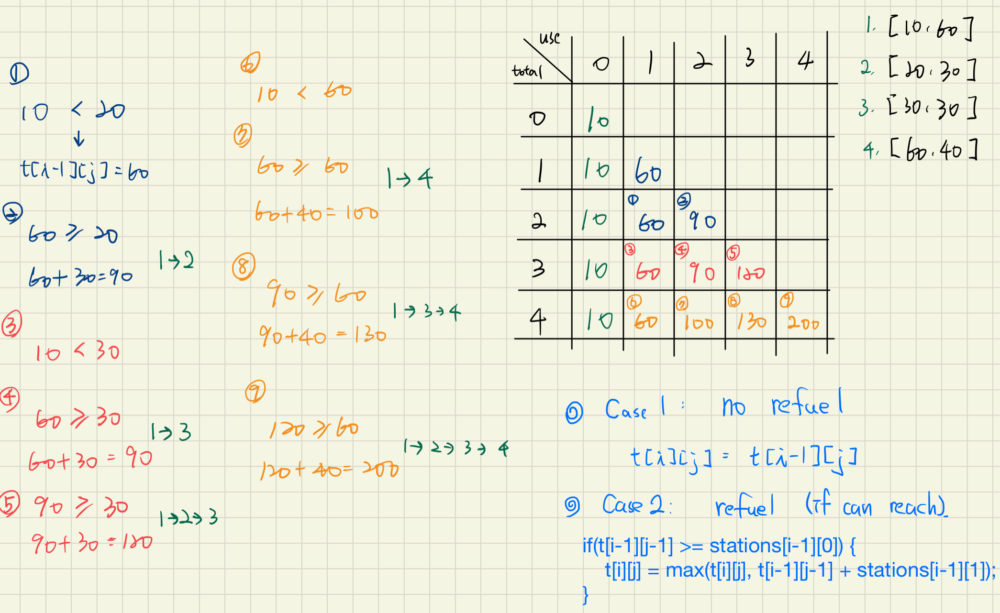
    1. 可能會想說我的 dp 陣列要存答案, 也就是 dp[target] = k, k 即是次數, target 為 position, 但這種方式沒辦法寫轉移式, 且要耗費相當大的 dp 空間(target)
    2. 所以換一個角度想, 我的 dp 可以存花費多少次數可以到達的最遠距離
        - 但有可能會有反悔的可能性, 比如我今天怎麼知道其實 [10, 60] 就可以接到後面的 [60, 40] 而不用考慮中間的 station?
        - 因此我們就需要用到二維陣列+窮舉取此 station or not 的所有可能性
    3. dp[i][j] 表達的是, 總共用 i 個 station, 我只用 j 個時可以走到的最遠距離是多少 (因為只考慮距離, 所以不用紀錄花費的油m, 只需要在轉移式中判斷是否能到達即可)
        - 因此解為 dp[n] 中, 最小的 j 其值 >= target
        - 我們想的是, 上一個狀態可以走的最遠距離, 是否能夠達到當前的 station 並且能取這裡的油呢
        - dp[i-1][j]: 表達我選擇跳過這個 station
        - dp[i-1][j-1] + stations[i-1][1]: 表達我接受這個 station 的 fuel
            - 但有個前提是上一個狀態所能走的距離要能夠到達這個 station
                - dp[i-1][j-1] >= stations[i-1][0]

2. Heap + Gready
    1. 其實有更貪婪的做法, 如果可以允許我們回朔, 我們其實只要油還夠, 就繼續往前開就行了, 等到真的不夠了, 我們再把當初已經經過能加最多油的地方取出來
    2. 這樣能保證我們使用最少的加油站, 因為我們每次都只取最多油的加
    3. 我們需要:
        1. 一個 capacity, 去紀錄我們還剩下多少油, 如果小於零了就必須取
        2. 一個 max-heap, 去取出最大的加油站
        3. 一個 prev, 來標示我們上一個 station 到這裡走了多少路程, 才能去更新 cap
        4. 我們不需要去判斷是否到達終點了, 我們只要在 stations 中增加了 target, 並把其 fuel 量設為無限大, 那我們就可以把它當作 station 的一種來跑判斷式
            1. dist-prev: 去判斷之前的油夠不夠跑到這裡
            2. cap < 0: 此題不會用到, 因為保證了所有的 station 都在 target 之前, 但如果有些 station 在 target 之後, 這邊也會直接將 cap 加到無限大讓後面的不再進來

### Code
DP (N^2)
``` py
class Solution:
    def minRefuelStops(self, target: int, startFuel: int, stations: List[List[int]]) -> int:
        n = len(stations)
        dp = [[0 for _ in range(n+1)] for _ in range(n+1)] # refuel j times of total i stations -> ans: min of j where dp[n][j] >= target

        for i in range(n+1): # initial refuel zero times(j=0) for there's total 0~n stations
            dp[i][0] = startFuel

        for i in range(1, n+1):
            for j in range(1, i+1):
                # case1, no new station taken
                dp[i][j] = dp[i-1][j]

                # case2, take this station from #j-1 times
                if dp[i-1][j-1] >= stations[i-1][0]:
                    dp[i][j] = max(dp[i][j], dp[i-1][j-1] + stations[i-1][1])

        for j, max_reach in enumerate(dp[n]):
            if max_reach >= target:
                return j
        return -1
```

(Optimal)Heap + Greedy (N log N)
```py
class Solution:
    def minRefuelStops(self, target: int, startFuel: int, stations: List[List[int]]) -> int:
        cnt = 0
        cap = startFuel
        prev = 0
        heap = []
        # to let the dist-prev find out if target is reachable, and set the gas to float(inf) to mark it's already goal and no cap < 0 will ever met
        stations.append([target, float(inf)])

        for dist, fuel in stations:
            cap -= (dist - prev)
            while cap < 0:
                if heap:
                    cap += heapq.heappop(heap) * -1
                    cnt += 1
                else:
                    return -1
            heapq.heappush(heap, -1 * fuel)
            prev = dist
        return cnt
```

### Tag: #DP
---

## 371. Sum of Two Integers｜ 8/29
Given two integers a and b, return the sum of the two integers without using the operators + and -.

Example 1:

Input: a = 1, b = 2

Output: 3

Example 2:

Input: a = 2, b = 3

Output: 5

Constraints:

-1000 <= a, b <= 1000

### 解題分析
1. 不能用 + - , 應該就是 bit 的題型
2. 不知道怎麼做就先用 XOR, 我們先假設 a b 都是正數的情況
    1. a XOR b 就是 a + b 不考慮進位的情況
        - 

3. 下一步就是找出進位, 會出現要進位的地方就是當 a b 的該位置都是 1 的時候, 我們先用 AND 把那些位置找出來, 並把他向左平移一位, 來形成我們做加法時會做的操作 (寫 0 進 1)
    1. (a AND b) << 1
        - 

4. 我們把 2 的結果加上 3 的結果就是所求
    - 因此我們可以把 2 的結果 assign 給 a
    - 3的結果 assign 給b
    - 並用一個 while 一直對新 ab 操作直到進位 bit 為零

5. 以上的情形是 a b 均為正數的情況, 負數的話會有以下的情況需要討論
    1. a, b 都是負
        - 我們可以用一個 sign 去標示, 並 abs(a) + abs(b), 最後再加上 sign 就好, 操作跟上面一樣
    2. a, b 其中一個為負
        - 
        - 我們希望用補數的方式去做, 所以我們希望 a 永遠是正的
        - 跟加法一樣, a ^ b 是減法未考慮 borrow bit 的情況
        - 因此我們要想, 在哪個狀況下會去借, a 的 bit 為`0`, b 的 bit 為`1`的情況下
            - 第一步就是先找出此位置
                - 我們透過 (~a) & b 可以找到哪些位置需要借(先把 a 零的地方變成 1, 再跟 b 的 1 的位置 and)
            - 然後向左平移
                - 這個操作是為了下個 iteration 鋪路, 因為變 1 之後, 在下次的 xor 該位置就會被歸零了 (見圖)


### Code
``` py
class Solution:
    def getSum(self, a: int, b: int) -> int:
        x, y = abs(a), abs(b) # 我們希望都對正數操作
        if x < y:
            return self.getSum(b, a) # 並且希望 abs(a) > abs(b)

        sign = 1 if a > 0 else -1 # 但還是要記錄結果的正負

        if a * b > 0: # 兩個正, 兩個負 的情況
            while y != 0:
                x, y = x^y, (x&y) << 1
        else: # 一正一負
            while y != 0:
                x, y = x^y, ((~x) & y) << 1

        return sign * x
```

### Tag: #BitManipulation
---
## 190. Reverse Bits｜ 8/29
Reverse bits of a given 32 bits unsigned integer.

Follow up:

If this function is called many times, how would you optimize it?

Example 1:

Input: n = 00000010100101000001111010011100

Output:    964176192 (00111001011110000010100101000000)

Explanation: The input binary string 00000010100101000001111010011100 represents the unsigned integer 43261596, so return 964176192 which its binary representation is 00111001011110000010100101000000.

Example 2:

Input: n = 11111111111111111111111111111101

Output:   3221225471 (10111111111111111111111111111111)

Explanation: The input binary string 11111111111111111111111111111101 represents the unsigned integer 4294967293, so return 3221225471 which its binary representation is 10111111111111111111111111111111.

Constraints:

The input must be a binary string of length 32

### 解題分析
1. 要 reverse 其實就是把 index=0 的位置的 bit 移動到 index=31
2. 所以我們每次 `AND 1` 取出來的是否為1的值在 left shift `power` 個位
3. 最後把 n 右移1, power -1


### Code
``` py
class Solution:
    def reverseBits(self, n: int) -> int:
        res, power = 0, 31

        while n > 0:
            res += (n & 1) << power
            n = n >> 1
            power -= 1
        return res
```

### Tag: #BitManipulation
---
## 435. Non-overlapping Intervals｜ 9/5
Given an array of intervals intervals where intervals[i] = [starti, endi], return the minimum number of intervals you need to remove to make the rest of the intervals non-overlapping.

Example 1:

- Input: intervals = [[1,2],[2,3],[3,4],[1,3]]
- Output: 1
- Explanation: [1,3] can be removed and the rest of the intervals are non-overlapping.

Example 2:

- Input: intervals = [[1,2],[1,2],[1,2]]
- Output: 2
- Explanation: You need to remove two [1,2] to make the rest of the intervals non-overlapping.

Example 3:

- Input: intervals = [[1,2],[2,3]]
- Output: 0
- Explanation: You don't need to remove any of the intervals since they're already non-overlapping.

Constraints:

- 1 <= intervals.length <= 105
- intervals[i].length == 2
- -5 * 104 <= starti < endi <= 5 * 104

### 解題分析
1. 此題屬於經典的 Greedy 問題: interval schedule problem
2. 我們希望最小化 removal 的數量, 換個角度想就是最大化無覆蓋區域
3. 這個想法可以讓要求的解回到 interval 身上, 那我們如何最大化無覆蓋呢？
4. 我們可以 sort by endtime, 並維護一個 cur_end 來追蹤目前處理到的 interval 中最晚結束的時間
5. 這樣就可以讓早結束的先用掉, 這樣可以保證我們可以盡可能的不要讓我們的 cur_end 擴張的太快
6. 證明:
    1. 如果有兩個 event x 跟 y, 結束時間是 y 比較晚
    2. 那麼我們就沒有道理選 y, 因為 y 肯定比 x 更高機率的會覆蓋到其他人

### 類似題
- LC452. Minimum Number of Arrows to Burst Balloons

### Code
``` py
class Solution:
    def eraseOverlapIntervals(self, intervals: List[List[int]]) -> int:
        intervals = sorted(intervals, key=lambda k: k[1])
        cur_end = float("-inf")
        removal = 0

        for start, end in intervals:
            if start >= cur_end:
                cur_end = end
            else:
                removal += 1
        return removal
```

### Tag: #Interval #Greedy
---
## 424. Longest Repeating Character Replacement｜ 9/7
You are given a string s and an integer k. You can choose any character of the string and change it to any other uppercase English character. You can perform this operation at most k times.

Return the length of the longest substring containing the same letter you can get after performing the above operations.

Example 1:

- Input: s = "ABAB", k = 2
- Output: 4
- Explanation: Replace the two 'A's with two 'B's or vice versa.

Example 2:

- Input: s = "AABABBA", k = 1
- Output: 4
- Explanation: Replace the one 'A' in the middle with 'B' and form "AABBBBA".
- The substring "BBBB" has the longest repeating letters, which is 4.

Constraints:

- 1 <= s.length <= 105
- s consists of only uppercase English letters.
- 0 <= k <= s.length

### 解題分析

1. 用 sliding window 解的話我們目標是盡可能的有最大的 frame, 並且裡面的 non-reapeated elem == k, 這樣就能定義出 left 的縮時機
2. 剩下的就是去定義 non-repeated elem, 為 `r-l+1 - the_most_freq_elem_cnt`
3. 我們用 most_fq_char 去記錄目前最大的 cnt, 並去算出 non-reapeated-elem 的值, 只要其大於 k, l 就不用縮
4. 而 cnter 紀錄的是當前 frame 裡面 char 的 cnter
5. 可能會有疑問為什麼不用一直去更新 most_fq_char
    1. most_fq_char 沒有因為縮左邊而更新? 沒關係不影響我們的答案, 因為當我們需要縮左邊時, 表示我們可能已經找到一個最大的答案了, 縮了左邊之後下一次右邊又+1, 這樣相當於保持當前的 window 繼續往後平移, 就是說會一直 right 1 left 1, 直到 **我們累積比當前 most_fq_char 還多的 repeated char**, 只有在這個時候我們的 l 才不需要繼續平移, 此時才有可能出現下一個最佳解

### Code
``` py
class Solution:
    def characterReplacement(self, s: str, k: int) -> int:
        most_fq_char = 0
        cnter = Counter()
        l = 0
        res = 0

        for r, ch in enumerate(s):
            cnter[ch] += 1
            most_fq_char = max(most_fq_char, cnter[ch])

            needed_to_change = (r-l+1) - most_fq_char
            if needed_to_change > k:
                cnter[s[l]] -= 1
                l += 1
            else:
                res = max(res, r-l+1)
        return res
```

### Tag: #SlidingWindow
---
## 226. Invert Binary Tree｜ 9/12
Given the root of a binary tree, invert the tree, and return its root.

Example 1:


- Input: root = [4,2,7,1,3,6,9]
- Output: [4,7,2,9,6,3,1]

Example 2:


- Input: root = [2,1,3]
- Output: [2,3,1]

Example 3:

- Input: root = []
- Output: []

Constraints:

- The number of nodes in the tree is in the range [0, 100].
- -100 <= Node.val <= 100

### 思路


### Code
``` py
class Solution:
    def invertTree(self, root: Optional[TreeNode]) -> Optional[TreeNode]:
        stack = [root]

        while stack:
            cur_node = stack.pop()
            if cur_node:
                cur_node.left, cur_node.right = cur_node.right, cur_node.left
                stack.append(cur_node.left)
                stack.append(cur_node.right)
        return root
```

### Tag: #Tree
---
## 1109. Corporate Flight Bookings｜ 9/18
There are n flights that are labeled from 1 to n.

You are given an array of flight bookings bookings, where bookings[i] = [firsti, lasti, seatsi] represents a booking for flights firsti through lasti (inclusive) with seatsi seats reserved for each flight in the range.

Return an array answer of length n, where answer[i] is the total number of seats reserved for flight i.

Example 1:

- Input: bookings = [[1,2,10],[2,3,20],[2,5,25]], n = 5
- Output: [10,55,45,25,25]
- Explanation:
- Flight labels:        1   2   3   4   5
- Booking 1 reserved:  10  10
- Booking 2 reserved:      20  20
- Booking 3 reserved:      25  25  25  25
- Total seats:         10  55  45  25  25
- Hence, answer = [10,55,45,25,25]

Example 2:

- Input: bookings = [[1,2,10],[2,2,15]], n = 2
- Output: [10,25]
- Explanation:
- Flight labels:        1   2
- Booking 1 reserved:  10  10
- Booking 2 reserved:      15
- Total seats:         10  25
- Hence, answer = [10,25]

Constraints:

- 1 <= n <= 2 * 104
- 1 <= bookings.length <= 2 * 104
- bookings[i].length == 3
- 1 <= firsti <= lasti <= n
- 1 <= seatsi <= 104

### 解題分析
1. 如果暴力解會超時, 就要來想想看哪裡還能優化
2. 能優化的地方就是第二層的 for loop, 我們能不能想到什麼方法可以不去 loop 每個位置
3. 就是透過標記 start, end+1 的地方去做 +cnt 跟 -cnt, 然後再一次跑 cumulative
4. [[1,2,10]], n=5，正確的return 應該是 [10,10,0,0,0], 但在我們的標記之下會變成 [10, 0, -10, 0, 0]
5. 對所有的 bookings 都標記過後, 再一次跑 cumulative 就可以得到答案
6. Trick 是這題給的數字是 index=1 based, 所以我們的 `start` 要變成 `n-1`, 標記 `end+1`的地方就維持 end
7. 因此我們要宣告 n+1 的 array, 但只 return 前 n 個

### Code
Cumulative Sum
```py
class Solution:
    def corpFlightBookings(self, bookings: List[List[int]], n: int) -> List[int]:
        reserves = [0 for _ in range(n+1)]
        for first, last, cnt in bookings:
            reserves[first-1] += cnt
            reserves[last] -= cnt

        for i in range(1, n):
            reserves[i] += reserves[i-1]
        return reserves[:n]
```

Naive TLE
``` py
class Solution:
    def corpFlightBookings(self, bookings: List[List[int]], n: int) -> List[int]:
        reserves = [0 for _ in range(n)]
        for first, last, cnt in bookings:
            for j in range(first-1, last):
                reserves[j] += cnt
        return reserves
```

### Tag: #CumulativeSum
---
## 696. Count Binary Substrings｜ 9/18
Give a binary string s, return the number of non-empty substrings that have the same number of 0's and 1's, and all the 0's and all the 1's in these substrings are grouped consecutively.

Substrings that occur multiple times are counted the number of times they occur.

Example 1:

- Input: s = "00110011"
- Output: 6
- Explanation: There are 6 substrings that have equal number of consecutive 1's and 0's: "0011", "01", "1100", "10", "0011", and "01".
- Notice that some of these substrings repeat and are counted the number of times they occur.
- Also, "00110011" is not a valid substring because all the 0's (and 1's) are not grouped together.

Example 2:

- Input: s = "10101"
- Output: 4
- Explanation: There are 4 substrings: "10", "01", "10", "01" that have equal number of consecutive 1's and 0's.

Constraints:

- 1 <= s.length <= 105
- s[i] is either '0' or '1'.

### 解題分析
1. 先看個簡單的例子, 000111 有多少 cnt呢?
    - 從中間往外擴張 01 -> 0011 -> 000111, 共 3 個 cnt
2. 那 0001111 呢?
    - 跟上面的解是一樣的, 也是三個
3. 我們可以把 000 當作是一個長度為 3 的group, 1111 當作是另一個長度為 4 的group
4. 這兩個 group 可以形成的解的總數就是 min(3,4) = 3
5. 因此我們可以先把所有的東西 group 起來, 然後再求 min(group[i], group[i-1])
6. 並且可以進一步用兩個變數優化
    - prev 紀錄 group[i-1], 而 current 就是 group[i], 這樣就可以將兩個 for loop 合再一起

### Code
``` py
class Solution:
    def countBinarySubstrings(self, s: str) -> int:
        groups = [1]
        for i in range(1, len(s)):
            if s[i] != s[i-1]:
                groups.append(1)
            else:
                groups[-1] += 1
        res = 0
        for i in range(1, len(groups)):
            res += min(groups[i], groups[i-1])
        return res
```

Optimize
```py
class Solution(object):
    def countBinarySubstrings(self, s):
        ans, prev, cur = 0, 0, 1
        for i in range(1, len(s)):
            if s[i-1] != s[i]:
                ans += min(prev, cur)
                prev, cur = cur, 1
            else:
                cur += 1

        return ans + min(prev, cur)
```

### Tag: #Array
---
## 1710. Maximum Units on a Truck｜ 9/18
You are assigned to put some amount of boxes onto one truck. You are given a 2D array boxTypes, where boxTypes[i] = [numberOfBoxesi, numberOfUnitsPerBoxi]:

- numberOfBoxesi is the number of boxes of type i.
- numberOfUnitsPerBoxi is the number of units in each box of the type i.
- You are also given an integer truckSize, which is the maximum number of boxes that can be put on the truck. You can choose any boxes to put on the truck as long as the number of boxes does not exceed truckSize.

Return the maximum total number of units that can be put on the truck.

Example 1:

- Input: boxTypes = [[1,3],[2,2],[3,1]], truckSize = 4
- Output: 8

Explanation: There are:
- 1 box of the first type that contains 3 units.
- 2 boxes of the second type that contain 2 units each.
- 3 boxes of the third type that contain 1 unit each.
- You can take all the boxes of the first and second types, and one box of the third type.
- The total number of units will be = (1 * 3) + (2 * 2) + (1 * 1) = 8.

Example 2:

- Input: boxTypes = [[5,10],[2,5],[4,7],[3,9]], truckSize = 10
- Output: 91

Constraints:

- 1 <= boxTypes.length <= 1000
- 1 <= numberOfBoxesi, numberOfUnitsPerBoxi <= 1000
- 1 <= truckSize <= 106

### 思路


### Code
``` py
class Solution:
    def maximumUnits(self, boxTypes: List[List[int]], truckSize: int) -> int:
        boxTypes.sort(key=lambda x: -x[1])
        cur_size = 0
        max_units = 0
        for num_box, unit in boxTypes:
            max_units += unit * min(truckSize - cur_size, num_box)
            cur_size += min(truckSize - cur_size, num_box)
        return max_units
```

### Tag: #
---
## 2018. Check if Word Can Be Placed In Crossword｜ 9/26
You are given an m x n matrix board, representing the current state of a crossword puzzle. The crossword contains lowercase English letters (from solved words), ' ' to represent any empty cells, and '#' to represent any blocked cells.

A word can be placed horizontally (left to right or right to left) or vertically (top to bottom or bottom to top) in the board if:

It does not occupy a cell containing the character '#'.
The cell each letter is placed in must either be ' ' (empty) or match the letter already on the board.
There must not be any empty cells ' ' or other lowercase letters directly left or right of the word if the word was placed horizontally.
There must not be any empty cells ' ' or other lowercase letters directly above or below the word if the word was placed vertically.
Given a string word, return true if word can be placed in board, or false otherwise.

Example 1:

- Input: board = [["#", " ", "#"], [" ", " ", "#"], ["#", "c", " "]], word = "abc"
- Output: true
- Explanation: The word "abc" can be placed as shown above (top to bottom).

Example 2:

- Input: board = [[" ", "#", "a"], [" ", "#", "c"], [" ", "#", "a"]], word = "ac"
- Output: false
- Explanation: It is impossible to place the word because there will always be a space/letter above or below it.

Example 3:

- Input: board = [["#", " ", "#"], [" ", " ", "#"], ["#", " ", "c"]], word = "ca"
- Output: true
- Explanation: The word "ca" can be placed as shown above (right to left).

Constraints:

- m == board.length
- n == board[i].length
- 1 <= m * n <= 2 * 105
- board[i][j] will be ' ', '#', or a lowercase English letter.
- 1 <= word.length <= max(m, n)
- word will contain only lowercase English letters.

### 解題分析
1. 只做左到右的字串匹配, 方向性的問題透過字串反轉、`zip(*arr_2d)` 來實現
    1. 填字的方向性: 字串反轉
    2. 垂直填或水平填: zip(*arr_2d)
2. 匹配邏輯
    1. 用 join 把這整行 join 起來, 並且用井字號分開
        - [" ", " ", "c", "#", " ", " ", "#"]
        - 會得到 ["  c", "  "]
    2. 然後先判斷是否長度跟目標相等, 在比較每個 char 是否相等或 " "


### Code
``` py
class Solution:
    def placeWordInCrossword(self, board: List[List[str]], word: str) -> bool:
        words=[word,word[::-1]]
        n=len(word)
        for B in board,zip(*board):
            for row in B:
                q=''.join(row).split('#')
                for w in words:
                    for s in q:
                        if len(s)==n:
                            if all(s[i]==w[i] or s[i]==' ' for i in range(n)):
                                return True
        return False
```

### Tag: #Array #String
---
## 2017. Grid Game｜ 9/26
You are given a 0-indexed 2D array grid of size 2 x n, where grid[r][c] represents the number of points at position (r, c) on the matrix. Two robots are playing a game on this matrix.

Both robots initially start at (0, 0) and want to reach (1, n-1). Each robot may only move to the right ((r, c) to (r, c + 1)) or down ((r, c) to (r + 1, c)).

At the start of the game, the first robot moves from (0, 0) to (1, n-1), collecting all the points from the cells on its path. For all cells (r, c) traversed on the path, grid[r][c] is set to 0. Then, the second robot moves from (0, 0) to (1, n-1), collecting the points on its path. Note that their paths may intersect with one another.

The first robot wants to minimize the number of points collected by the second robot. In contrast, the second robot wants to maximize the number of points it collects. If both robots play optimally, return the number of points collected by the second robot.

Example 1:


- Input: grid = [[2,5,4],[1,5,1]]
- Output: 4
- Explanation: The optimal path taken by the first robot is shown in red, and the optimal path taken by the second robot is shown in blue.
- The cells visited by the first robot are set to 0.
- The second robot will collect 0 + 0 + 4 + 0 = 4 points.

Example 2:


- Input: grid = [[3,3,1],[8,5,2]]
- Output: 4
- Explanation: The optimal path taken by the first robot is shown in red, and the optimal path taken by the second robot is shown in blue.
- The cells visited by the first robot are set to 0.
- The second robot will collect 0 + 3 + 1 + 0 = 4 points.

Example 3:


- Input: grid = [[1,3,1,15],[1,3,3,1]]
- Output: 7
- Explanation: The optimal path taken by the first robot is shown in red, and the optimal path taken by the second robot is shown in blue.
- The cells visited by the first robot are set to 0.
- The second robot will collect 0 + 1 + 3 + 3 + 0 = 7 points.

Constraints:

- grid.length == 2
- n == grid[r].length
- 1 <= n <= 5 * 104
- 1 <= grid[r][c] <= 105

### 解題分析
1. 一開始的做法是用機器人走迷宮先求出 A 的 max 路徑, 然後把沿路都標成 0, 然後再求一次 B 的路徑
2. 但這樣做有可能會忽略掉有多條路線都是可以讓 A 拿到最大的, 但是只有一條是可以讓 B 也拿到最少
3. 正確的做法是用 prefix_sum
    1. 因為題目說只有上下兩排, 因此我們只要考慮 A 什麼時候往下切
        1. 如果再 m[1][0] 的時候就往下切, 那麼此時 B 的 sum 就是 m[0][1:n]
        2. 如果再 m[1][1] 的時候就往下切, 那麼此時 B 的 sum 就是 max(m[1][:1] ,m[0][2:n])
    2. 因此所求就是求出 B 的最小, 我們用 cur_min 去維護

### Code
``` py
class Solution:
    def gridGame(self, grid: List[List[int]]) -> int:
        upper_sum = sum(grid[0])
        lower_sum = 0
        cur_min = upper_sum
        for i, lower_num in enumerate(grid[1]):
            upper_sum -= grid[0][i]
            cur_min = min(cur_min, max(upper_sum, lower_sum))
            lower_sum += lower_num
        return cur_min
```

### Tag: #AccumulatedSum
---
## 2034. Stock Price Fluctuation｜ 10/10
You are given a stream of records about a particular stock. Each record contains a timestamp and the corresponding price of the stock at that timestamp.

Unfortunately due to the volatile nature of the stock market, the records do not come in order. Even worse, some records may be incorrect. Another record with the same timestamp may appear later in the stream correcting the price of the previous wrong record.

Design an algorithm that:

- Updates the price of the stock at a particular timestamp, correcting the price from any previous records at the timestamp.
- Finds the latest price of the stock based on the current records. The latest price is the price at the latest timestamp recorded.
- Finds the maximum price the stock has been based on the current records.
- Finds the minimum price the stock has been based on the current records.

Implement the StockPrice class:

- StockPrice() Initializes the object with no price records.
- void update(int timestamp, int price) Updates the price of the stock at the given timestamp.
- int current() Returns the latest price of the stock.
- int maximum() Returns the maximum price of the stock.
- int minimum() Returns the minimum price of the stock.

Example 1:

Input
- ["StockPrice", "update", "update", "current", "maximum", "update", "maximum", "update", "minimum"]
- [[], [1, 10], [2, 5], [], [], [1, 3], [], [4, 2], []]

Output
- [null, null, null, 5, 10, null, 5, null, 2]

Explanation
- StockPrice stockPrice = new StockPrice();
- stockPrice.update(1, 10); // Timestamps are [1] with corresponding prices [10].
- stockPrice.update(2, 5);  // Timestamps are [1,2] with corresponding prices [10,5].
- stockPrice.current();     // return 5, the latest timestamp is 2 with the price being 5.
- stockPrice.maximum();     // return 10, the maximum price is 10 at timestamp 1.
- stockPrice.update(1, 3);  // The previous timestamp 1 had the wrong price, so it is updated to 3.
                          // Timestamps are [1,2] with corresponding prices [3,5].
- stockPrice.maximum();     // return 5, the maximum price is 5 after the correction.
- stockPrice.update(4, 2);  // Timestamps are [1,2,4] with corresponding prices [3,5,2].
- stockPrice.minimum();     // return 2, the minimum price is 2 at timestamp 4.

Constraints:

- 1 <= timestamp, price <= 109
- At most 105 calls will be made in total to update, current, maximum, and minimum.
- current, maximum, and minimum will be called only after update has been called at least once.
### 思路
- 反正就是一直往 heap 裡塞
- 取的時候再跟 map 對比一下確定當前的狀態是否是乾淨的值

### Code
``` py
class StockPrice:

    def __init__(self):
        self.timestamps = {}
        self.highestTimestamp = 0
        self.minHeap = []
        self.maxHeap = []

    def update(self, timestamp: int, price: int) -> None:
	    #Keep track of current prices
        self.timestamps[timestamp] = price
        self.highestTimestamp = max(self.highestTimestamp, timestamp)

		#For maximum/minimum
        heappush(self.minHeap, (price, timestamp))
        heappush(self.maxHeap, (-price, timestamp))

    def current(self) -> int:
	    #Just return the highest timestamp in O(1)
        return self.timestamps[self.highestTimestamp]

    def maximum(self) -> int:
        currPrice, timestamp = heappop(self.maxHeap)

		#If the price from the heap doesn't match the price the timestamp indicates, keep popping from the heap
        while -currPrice != self.timestamps[timestamp]:
            currPrice, timestamp = heappop(self.maxHeap)

        heappush(self.maxHeap, (currPrice, timestamp))
        return -currPrice

    def minimum(self) -> int:
        currPrice, timestamp = heappop(self.minHeap)

		#If the price from the heap doesn't match the price the timestamp indicates, keep popping from the heap
        while currPrice != self.timestamps[timestamp]:
            currPrice, timestamp = heappop(self.minHeap)

        heappush(self.minHeap, (currPrice, timestamp))
        return currPrice
```

### Tag: #Heap
---
## 2033. Minimum Operations to Make a Uni-Value Grid｜ 10/10
You are given a 2D integer grid of size m x n and an integer x. In one operation, you can add x to or subtract x from any element in the grid.

A uni-value grid is a grid where all the elements of it are equal.

Return the minimum number of operations to make the grid uni-value. If it is not possible, return -1.

Example 1:

- Input: grid = [[2,4],[6,8]], x = 2
- Output: 4
- Explanation: We can make every element equal to 4 by doing the following:
- Add x to 2 once.
- Subtract x from 6 once.
- Subtract x from 8 twice.
- A total of 4 operations were used.

Example 2:

- Input: grid = [[1,5],[2,3]], x = 1
- Output: 5
- Explanation: We can make every element equal to 3.

Example 3:

- Input: grid = [[1,2],[3,4]], x = 2
- Output: -1
- Explanation: It is impossible to make every element equal.

Constraints:

- m == grid.length
- n == grid[i].length
- 1 <= m, n <= 105
- 1 <= m * n <= 105
- 1 <= x, grid[i][j] <= 104

### 思路
- 一群人要會合, 找到最中間的那個人家

### Code
``` py
class Solution:
    def minOperations(self, grid: List[List[int]], x: int) -> int:
        li = []
        for col in grid:
            for row in col:
                li.append(row)
        li = sorted(li)
        for i in range(1, len(li)):
            if (li[i] - li[i-1])%x != 0:
                return -1

        mid = li[len(li) // 2]
        return sum(abs(num-mid)//x for num in li)
```

### Tag: #
---
## 1197. Minimum Knight Moves｜ 10/10
In an infinite chess board with coordinates from -infinity to +infinity, you have a knight at square [0, 0].

A knight has 8 possible moves it can make, as illustrated below. Each move is two squares in a cardinal direction, then one square in an orthogonal direction.

Return the minimum number of steps needed to move the knight to the square [x, y]. It is guaranteed the answer exists.

Example 1:

- Input: x = 2, y = 1
- Output: 1
- Explanation: [0, 0] → [2, 1]

Example 2:

- Input: x = 5, y = 5
- Output: 4
- Explanation: [0, 0] → [2, 1] → [4, 2] → [3, 4] → [5, 5]

Constraints:

- -300 <= x, y <= 300
- 0 <= |x| + |y| <= 300

### 解題分析
0. 第一個方法就是 plane BFS, 但 TLE
1. 第二個方法透過 Symmetric 優化
    - 將 target 映射到第一象限
    - 連帶著可以減少 dirs 數量
    - 並且可以用 Prune 去減少 search space
2. 加入 Visited 的時機優化
    - 盡早入 set 來避免同一輪的其他點又再把它加入一次
3. 想法:
    - search problem 的優化不外乎就是減少 search space
    - 這題減少的方式就是透過映射到第一象限, 來限縮有效的走訪範圍
4. Prune 優化
    - 
    - 假設:   已知目標在原點的右上方
    - Claim: 若是要移動到 x<-1 or y<-1, 都是無意義的移動
    - 理由:   假設第一部移動到 (-2,1), 下一步正方向最多走到 (0,2) or (-1, 3)
        - (0,2) : 可透過 (2,1) -> dx(-2,-1) 到達
        - (-1,3): 不可能是解 (因為我們的假設)
    - 但 -1 是有意義的移動喔！
        - 因為假設我們的目標在 (1,1), 那我們只能透過先去(-1,2) -> dx(2,-1) or (2,-1) -> dx(-1,2) 到達
        - 因此 -1 的邊界是我們必須 include 的
    - 同樣的道理可以 apply 到終點
        - 對於終點來說超過 2 的位置就是無效 move, 因為其再來產生的 move space 是可由更小的位置來形成
5. FollowUp
    - 如果棋盤中有障礙物, 那麼就不能用映射+剪枝了, 因為兩邊方向的障礙物也必須 symetric


### Code
TLE
``` py
class Solution:
    def minKnightMoves(self, x: int, y: int) -> int:
        layer = [(0, 0)]
        step = 0
        visited = set()
        dirs = [(1,2), (1,-2), (-1,2), (2,1), (2,-1), (-2,1), (-1, -2), (-2,-1)]

        while layer:
            new_layer = []
            for x0, y0 in layer:
                if (x0, y0) == (x,y):
                    return step
                visited.add((x0, y0))
                for dx, dy in dirs:
                    new_node = (x0+dx, y0+dy)
                    if new_node not in visited:
                        new_layer.append(new_node)
            layer = new_layer
            step += 1
        return -1
```

Search Space Optimization
```py
class Solution:
    def minKnightMoves(self, x: int, y: int) -> int:
        layer = [(0, 0)]
        step = 0
        visited = set([(0,0)])
        dirs = [(1,2), (1,-2), (-1,2), (2,1), (2,-1), (-2,1)] # eliminate (-1, -2), (-2,-1) since we symetric x, y
        x, y = abs(x), abs(y)

        while layer:
            new_layer = []
            for x0, y0 in layer:
                if (x0, y0) == (x,y):
                    return step
                for dx, dy in dirs:
                    new_node = (x0+dx, y0+dy)
                    # 我們賭定 -1, target+2 以外的位置都是無效的移動, 見圖
                    if new_node not in visited and -1 <= new_node[0] <= x+2 and -1 <= new_node[1] <= y+2:
                        visited.add(new_node) # 應該要越早加入 visited 越好, 避免其他點的不同方向走法又讓他入queue一次
                        new_layer.append(new_node)
            layer = new_layer
            step += 1
        return -1
```

### Tag: #BFS
---
## 887. Super Egg Drop｜ 10/17
You are given k identical eggs and you have access to a building with n floors labeled from 1 to n.

You know that there exists a floor f where 0 <= f <= n such that any egg dropped at a floor higher than f will break, and any egg dropped at or below floor f will not break.

Each move, you may take an unbroken egg and drop it from any floor x (where 1 <= x <= n). If the egg breaks, you can no longer use it. However, if the egg does not break, you may reuse it in future moves.

Return the minimum number of moves that you need to determine with certainty what the value of f is.

Example 1:

- Input: k = 1, n = 2
- Output: 2
- Explanation:
- Drop the egg from floor 1. If it breaks, we know that f = 0.
- Otherwise, drop the egg from floor 2. If it breaks, we know that f = 1.
- If it does not break, then we know f = 2.
- Hence, we need at minimum 2 moves to determine with certainty what the value of f is.

Example 2:

- Input: k = 2, n = 6
- Output: 3

Example 3:

- Input: k = 3, n = 14
- Output: 4

Constraints:

- 1 <= k <= 100
- 1 <= n <= 104
### 思路
1. dp[m][k] 的定義:
    - 給我 k 個蛋, 讓我丟 m 次, 我最多可以 confirm 的最高樓層
    - 那麼 dp[m][k] 只要 >= N, 那麼我們就能確定 m 就是個最小需要嘗試的次數
    - dp[m][k] = dp[m - 1][k - 1] + dp[m - 1][k] + 1,
    - assume, dp[m-1][k-1] = n0, dp[m-1][k] = n1
    - the first floor to check is n0+1.
        - if egg breaks, F must be in [1,n0] floors, we can use m-1 moves and k-1 eggs to find out F is which one.
        - if egg doesn't breaks and F is in [n0+2, n0+n1+1] floors, we can use m-1 moves and k eggs to find out F is which one.
    - So, with m moves and k eggs, we can find out F in n0+n1+1 floors, whichever F is.

2. Time:
    - K log N
        - dp[m][k] is the number of combinations and it increase exponentially to N

### Code
``` py
class Solution:
    def superEggDrop(self, K: int, N: int) -> int:
        dp = [[0 for _ in range(K+1)] for _ in range(N+1)]

        for m in range(1, N+1):
            for k in range(1, K+1):
                dp[m][k] = dp[m-1][k-1] + dp[m-1][k] +1

                if dp[m][k] >= N:
                    return m
```

### Tag: #DP
---
## 14. Longest Common Prefix｜ 10/18
Write a function to find the longest common prefix string amongst an array of strings.

If there is no common prefix, return an empty string "".

Example 1:

- Input: strs = ["flower","flow","flight"]
- Output: "fl"

Example 2:

- Input: strs = ["dog","racecar","car"]
- Output: ""
- Explanation: There is no common prefix among the input strings.

Constraints:

- 1 <= strs.length <= 200
- 0 <= strs[i].length <= 200
- strs[i] consists of only lower-case English letters.

### 思路


### Code
``` py
class Solution:
    def longestCommonPrefix(self, strs: List[str]) -> str:
        its = [iter(str1) for str1 in strs]
        res = ""
        while len(its) > 0:
            first_val = next(its[0], None)
            if first_val == None:
                break
            for it in its[1:]:
                next_val = next(it, None)
                if next_val != first_val or next_val == None:
                    return res
            res += first_val
        return res
```

```py
class Solution:
    def longestCommonPrefix(self, strs: List[str]) -> str:
        strs.sort()
        res = ""
        for x, y in zip(strs[0], strs[-1]):
            if x == y:
                res += x
            else:
                break
        return res
```

### Tag: #
---
## 545. Boundary of Binary Tree｜ 10/18
The boundary of a binary tree is the concatenation of the root, the left boundary, the leaves ordered from left-to-right, and the reverse order of the right boundary.

The left boundary is the set of nodes defined by the following:

- The root node's left child is in the left boundary. If the root does not have a left child, then the left boundary is empty.
- If a node in the left boundary and has a left child, then the left child is in the left boundary.
- If a node is in the left boundary, has no left child, but has a right child, then the right child is in the left boundary.
- The leftmost leaf is not in the left boundary.
- The right boundary is similar to the left boundary, except it is the right side of the root's right subtree. Again, the leaf is not part of the right boundary, and the right boundary is empty if the root does not have a right child.

- The leaves are nodes that do not have any children. For this problem, the root is not a leaf.

- Given the root of a binary tree, return the values of its boundary.

Example 1:


- Input: root = [1,null,2,3,4]
- Output: [1,3,4,2]
- Explanation:
    - The left boundary is empty because the root does not have a left child.
    - The right boundary follows the path starting from the root's right child 2 -> 4.
      4 is a leaf, so the right boundary is [2].
    - The leaves from left to right are [3,4].
- Concatenating everything results in [1] + [] + [3,4] + [2] = [1,3,4,2].

Example 2:


- Input: root = [1,2,3,4,5,6,null,null,null,7,8,9,10]
- Output: [1,2,4,7,8,9,10,6,3]
- Explanation:
    - The left boundary follows the path starting from the root's left child 2 -> 4.
      4 is a leaf, so the left boundary is [2].
    - The right boundary follows the path starting from the root's right child 3 -> 6 -> 10.
      10 is a leaf, so the right boundary is [3,6], and in reverse order is [6,3].
    - The leaves from left to right are [4,7,8,9,10].
- Concatenating everything results in [1] + [2] + [4,7,8,9,10] + [6,3] = [1,2,4,7,8,9,10,6,3].

Constraints:

- The number of nodes in the tree is in the range [1, 104].
- -1000 <= Node.val <= 1000

### 思路

- 就是按照他給的規則去寫
- 注意左到右的 leaf 應該要用 stack 而非 queue

### Code
``` py
class Solution:
    def boundaryOfBinaryTree(self, root: TreeNode) -> List[int]:
        left_bound = self.__get_left_bound(root.left)
        right_bound = self.__get_right_bound(root.right)
        leaves = self.__get_leaves(root)
        return [root.val] + left_bound + leaves + right_bound

    def __is_leaf(self, node):
        return not node.left and not node.right

    def __get_left_bound(self, left_node):
        if not left_node:
            return []
        node = left_node
        order = []
        while not self.__is_leaf(node):
            order.append(node.val)
            if node.left:
                node = node.left
            else:
                node = node.right
        return order

    def __get_right_bound(self, right_node):
        if not right_node:
            return []
        node = right_node
        order = []
        while not self.__is_leaf(node):
            order.append(node.val)
            if node.right:
                node = node.right
            else:
                node = node.left
        return order[::-1]

    def __get_leaves(self, root):
        if self.__is_leaf(root): # mark only root is not leaf
            return []
        stack = [root]
        res = []
        while stack:
            node = stack.pop()
            if self.__is_leaf(node):
                res.append(node.val)
            else:
                if node.right:
                    stack.append(node.right)
                if node.left:
                    stack.append(node.left)
        return res
```

### Tag: #Tree
---
## 1249. Minimum Remove to Make Valid Parentheses｜ 10/19
Given a string s of '(' , ')' and lowercase English characters.

Your task is to remove the minimum number of parentheses ( '(' or ')', in any positions ) so that the resulting parentheses string is valid and return any valid string.

Formally, a parentheses string is valid if and only if:

- It is the empty string, contains only lowercase characters, or
- It can be written as AB (A concatenated with B), where A and B are valid strings, or
- It can be written as (A), where A is a valid string.

Example 1:

- Input: s = "lee(t(c)o)de)"
- Output: "lee(t(c)o)de"
- Explanation: "lee(t(co)de)" , "lee(t(c)ode)" would also be accepted.

Example 2:

- Input: s = "a)b(c)d"
- Output: "ab(c)d"

Example 3:

- Input: s = "))(("
- Output: ""
- Explanation: An empty string is also valid.

Example 4:

- Input: s = "(a(b(c)d)"
- Output: "a(b(c)d)"

Constraints:

- 1 <= s.length <= 105
- s[i] is either'(' , ')', or lowercase English letter.

### 思路
1. 按照 LC20 的概念, 這題甚至還不需要考慮其他種括號匹配的方式
2. 那麼下一步想的是我們該怎麼保留括號? 本來是想說只要符合就 append 上去但這樣字串的順序都亂了
3. 那就回過頭來想, 我們該怎麼把這個括號標記成 valid 的括號呢? 記下 index 是一種方式
4. 沒辦法一邊押入 stack 一邊組字串, 那就分成兩步驟進行

- Note: 盡量不要用 str += ch, 因為這樣時間複雜度較高 (複製字串 O(N))
- 應該使用 list.append, 最後再一次 join 起來

### Code
Naive
``` py
class Solution:
    def minRemoveToMakeValid(self, s: str) -> str:
        stack = []
        res = []
        NEEDED, IDX = 0, 1
        should_keep = set()
        for i, ch in enumerate(s):
            if ch == "(":
                stack.append(i)
            elif ch == ")" and stack:
                idx = stack.pop()
                should_keep.add(i)
                should_keep.add(idx)

        for i, ch in enumerate(s):
            if ch.isalpha() or i in should_keep:
                res.append(ch)
        return "".join(res)
```

Optimal
```py
class Solution:
    def minRemoveToMakeValid(self, s: str) -> str:
        s = list(s)
        stack = []
        for i, char in enumerate(s):
            if char == '(':
                stack.append(i)
            elif char == ')':
                if stack:
                    stack.pop()
                else:
                    s[i] = ''
        while stack:
            s[stack.pop()] = ''
        return ''.join(s)
```

### Tag: #Stack
---
## 463. Island Perimeter｜ 10/23
You are given row x col grid representing a map where grid[i][j] = 1 represents land and grid[i][j] = 0 represents water.

Grid cells are connected horizontally/vertically (not diagonally). The grid is completely surrounded by water, and there is exactly one island (i.e., one or more connected land cells).

The island doesn't have "lakes", meaning the water inside isn't connected to the water around the island. One cell is a square with side length 1. The grid is rectangular, width and height don't exceed 100. Determine the perimeter of the island.

Example 1:


- Input: grid = [[0,1,0,0],[1,1,1,0],[0,1,0,0],[1,1,0,0]]
- Output: 16
- Explanation: The perimeter is the 16 yellow stripes in the image above.

Example 2:

- Input: grid = [[1]]
- Output: 4

Example 3:

- Input: grid = [[1,0]]
- Output: 4

Constraints:

- row == grid.length
- col == grid[i].length
- 1 <= row, col <= 100
- grid[i][j] is 0 or 1.
- There is exactly one island in grid.

### 思路
1. Intuitive
    - 只要連接觸不是陸地就能+1邊
    - 優化:
        - 與其做 8 個 if, 可以只做 4 個
2. Optimal
    - 
    - 

### Code
Intuitive
``` py
class Solution:
    def islandPerimeter(self, grid: List[List[int]]) -> int:
        m, n = len(grid), len(grid[0])
        res = 0
        for i in range(m):
            for j in range(n):
                if grid[i][j] == 1:
                    cnt = self.get_boarder_and_water_cnt(i, j, grid)
                    res += cnt
        return res

    def get_boarder_and_water_cnt(self, i, j, grid):
        m, n = len(grid), len(grid[0])
        boarder_cnt = 0
        boarder_cnt += 1 if i == m-1 else 0
        boarder_cnt += 1 if j == n-1 else 0
        boarder_cnt += 1 if i == 0 else 0
        boarder_cnt += 1 if j == 0 else 0
        water_cnt = 0
        if i+1 < m and grid[i+1][j] == 0:
            water_cnt += 1
        if 0 <= i-1 and grid[i-1][j] == 0:
            water_cnt += 1
        if j+1 < n and grid[i][j+1] == 0:
            water_cnt += 1
        if 0 <= j-1 and grid[i][j-1] == 0:
            water_cnt += 1
        return water_cnt + boarder_cnt
```

Intuitive Optimize
```py
class Solution:
    def islandPerimeter(self, grid: List[List[int]]) -> int:

        rows = len(grid)
        cols = len(grid[0])

        result = 0

        for r in range(rows):
            for c in range(cols):
                if grid[r][c] == 1:
                    if r == 0:
                        up = 0
                    else:
                        up = grid[r-1][c]
                    if c == 0:
                        left = 0
                    else:
                        left = grid[r][c-1]
                    if r == rows-1:
                        down = 0
                    else:
                        down = grid[r+1][c]
                    if c == cols-1:
                        right = 0
                    else:
                        right = grid[r][c+1]

                    result += 4-(up+left+right+down)

        return result
```

只比較兩邊 (optimal)
```py
class Solution:
    def islandPerimeter(self, grid: List[List[int]]) -> int:
        rows = len(grid)
        cols = len(grid[0])

        result = 0

        for r in range(rows):
            for c in range(cols):
                if grid[r][c] == 1:
                    result += 4

                    if r > 0 and grid[r-1][c] == 1:
                        result -= 2

                    if c > 0 and grid[r][c-1] == 1:
                        result -= 2

        return result
```

### Tag: #
---
## 636. Exclusive Time of Functions｜ 10/24
On a single-threaded CPU, we execute a program containing n functions. Each function has a unique ID between 0 and n-1.

Function calls are stored in a call stack: when a function call starts, its ID is pushed onto the stack, and when a function call ends, its ID is popped off the stack. The function whose ID is at the top of the stack is the current function being executed. Each time a function starts or ends, we write a log with the ID, whether it started or ended, and the timestamp.

You are given a list logs, where logs[i] represents the ith log message formatted as a string "{function_id}:{"start" | "end"}:{timestamp}". For example, "0:start:3" means a function call with function ID 0 started at the beginning of timestamp 3, and "1:end:2" means a function call with function ID 1 ended at the end of timestamp 2. Note that a function can be called multiple times, possibly recursively.

A function's exclusive time is the sum of execution times for all function calls in the program. For example, if a function is called twice, one call executing for 2 time units and another call executing for 1 time unit, the exclusive time is 2 + 1 = 3.

Return the exclusive time of each function in an array, where the value at the ith index represents the exclusive time for the function with ID i.

Example 1:


- Input: n = 2, logs = ["0:start:0","1:start:2","1:end:5","0:end:6"]
- Output: [3,4]
- Explanation:
- Function 0 starts at the beginning of time 0, then it executes 2 for units of time and reaches the end of time 1.
- Function 1 starts at the beginning of time 2, executes for 4 units of time, and ends at the end of time 5.
- Function 0 resumes execution at the beginning of time 6 and executes for 1 unit of time.
So function 0 spends 2 + 1 = 3 units of total time executing, and function 1 spends 4 units of total time executing.

Example 2:

- Input: n = 1, logs = ["0:start:0","0:start:2","0:end:5","0:start:6","0:end:6","0:end:7"]
- Output: [8]
- Explanation:
- Function 0 starts at the beginning of time 0, executes for 2 units of time, and recursively calls itself.
- Function 0 (recursive call) starts at the beginning of time 2 and executes for 4 units of time.
- Function 0 (initial call) resumes execution then immediately calls itself again.
- Function 0 (2nd recursive call) starts at the beginning of time 6 and executes for 1 unit of time.
- Function 0 (initial call) resumes execution at the beginning of time 7 and executes for 1 unit of time.
- So function 0 spends 2 + 4 + 1 + 1 = 8 units of total time executing.

Example 3:

- Input: n = 2, logs = ["0:start:0","0:start:2","0:end:5","1:start:6","1:end:6","0:end:7"]
Output: [7,1]
- Explanation:
- Function 0 starts at the beginning of time 0, executes for 2 units of time, and recursively calls itself.
- Function 0 (recursive call) starts at the beginning of time 2 and executes for 4 units of time.
- Function 0 (initial call) resumes execution then immediately calls function 1.
- Function 1 starts at the beginning of time 6, executes 1 units of time, and ends at the end of time 6.
- Function 0 resumes execution at the beginning of time 6 and executes for 2 units of time.
- So function 0 spends 2 + 4 + 1 = 7 units of total time executing, and function 1 spends 1 unit of total time executing.

Example 4:

- Input: n = 2, logs = ["0:start:0","0:start:2","0:end:5","1:start:7","1:end:7","0:end:8"]
- Output: [8,1]

Example 5:

- Input: n = 1, logs = ["0:start:0","0:end:0"]
- Output: [1]

Constraints:

- 1 <= n <= 100
- 1 <= logs.length <= 500
- 0 <= function_id < n
- 0 <= timestamp <= 109
- No two start events will happen at the same timestamp.
- No two end events will happen at the same timestamp.
- Each function has an "end" log for each "start" log.

### 解題分析
1. 就只是用 stack 去解就好了
2. 比較難的是題目很難理解 ...
    1. 進行中的如果被另一個進行中的打斷, 那麼 time 只能加 new_start - prev_start
    2. 如果進行中的被自己的給結束, 那麼 time 就能夠加 end - prev_start `+ 1`


### Code
``` py
class Solution:
    def exclusiveTime(self, n: int, logs: List[str]) -> List[int]:
        stack = []
        ans = [0 for _ in range(n)]
        prev_t = 0
        for log in logs:
            fn, op, time = log.split(":")
            fn, time = int(fn), int(time)
            if op == "start":
                if stack:
                    ans[stack[-1]] += time-prev_t
                stack.append(fn)
                prev_t = time
            else:
                ans[stack.pop()] += time-prev_t+1
                prev_t = time+1
        return ans
```

### Tag: #Stack
---
## 1762. Buildings With an Ocean View｜ 10/25
There are n buildings in a line. You are given an integer array heights of size n that represents the heights of the buildings in the line.

The ocean is to the right of the buildings. A building has an ocean view if the building can see the ocean without obstructions. Formally, a building has an ocean view if all the buildings to its right have a smaller height.

Return a list of indices (0-indexed) of buildings that have an ocean view, sorted in increasing order.

Example 1:

- Input: heights = [4,2,3,1]
- Output: [0,2,3]
- Explanation: Building 1 (0-indexed) does not have an ocean view because building 2 is taller.

Example 2:

- Input: heights = [4,3,2,1]
- Output: [0,1,2,3]
- Explanation: All the buildings have an ocean view.

Example 3:

- Input: heights = [1,3,2,4]
- Output: [3]
- Explanation: Only building 3 has an ocean view.

Example 4:

- Input: heights = [2,2,2,2]
- Output: [3]
- Explanation: Buildings cannot see the ocean if there are buildings of the same height to its right.

Constraints:

- 1 <= heights.length <= 105
- 1 <= heights[i] <= 109
### 思路


### Code
``` py
class Solution:
    def findBuildings(self, heights: List[int]) -> List[int]:
        prev = 0
        res = []
        for i in range(len(heights)-1, -1, -1):
            if heights[i] > prev:
                res.append(i)
                prev = heights[i]
        return res[::-1]
```

### Tag: #
---
## 1047. Remove All Adjacent Duplicates In String｜ 10/25
You are given a string s consisting of lowercase English letters. A duplicate removal consists of choosing two adjacent and equal letters and removing them.

We repeatedly make duplicate removals on s until we no longer can.

Return the final string after all such duplicate removals have been made. It can be proven that the answer is unique.

Example 1:

- Input: s = "abbaca"
- Output: "ca"
- Explanation:
- For example, in "abbaca" we could remove "bb" since the letters are adjacent and equal, and this is the only possible move.  The result of this move is that the string is "aaca", of which only "aa" is possible, so the final string is "ca".

Example 2:

- Input: s = "azxxzy"
- Output: "ay"

Constraints:

- 1 <= s.length <= 105
- s consists of lowercase English letters.
### 思路
- 跟 match 括號的想法一樣

### Code
``` py
class Solution:
    def removeDuplicates(self, s: str) -> str:
        stack = []
        for ch in s:
            if not stack or ch != stack[-1]:
                stack.append(ch)
            else:
                stack.pop()
        return "".join(stack)
```

### Tag: #Stack
---
## 1091. Shortest Path in Binary Matrix｜ 10/25
Given an n x n binary matrix grid, return the length of the shortest clear path in the matrix. If there is no clear path, return -1.

A clear path in a binary matrix is a path from the top-left cell (i.e., (0, 0)) to the bottom-right cell (i.e., (n - 1, n - 1)) such that:

- All the visited cells of the path are 0.
- All the adjacent cells of the path are 8-directionally connected (i.e., they are different and they share an edge or a corner).
- The length of a clear path is the number of visited cells of this path.

Example 1:

- Input: grid = [[0,1],[1,0]]
- Output: 2

Example 2:


- Input: grid = [[0,0,0],[1,1,0],[1,1,0]]
- Output: 4

Example 3:

- Input: grid = [[1,0,0],[1,1,0],[1,1,0]]
- Output: -1

Constraints:

- n == grid.length
- n == grid[i].length
- 1 <= n <= 100
- grid[i][j] is 0 or 1

### 思路

1. bfs
2. 雙向 BFS
3. A*
4. 錯誤想法
    1. 不能用 DP, 因為 DP 須保證上到下的順序拜訪
        ```
        [
        [0,1,1,0,0,0],
        [0,1,0,1,1,0],
        [0,1,1,0,1,0],
        [0,0,0,1,1,0],
        [1,1,1,1,1,0],
        [1,1,1,1,1,0]]
        ```
    2. 下面這個例子在 (3,2) 這個位置就沒辦法讓 DP 往上走

### Code
``` py
class Solution:
    def shortestPathBinaryMatrix(self, grid: List[List[int]]) -> int:
        if grid[0][0] == 1 or grid[-1][-1] == 1:
            return -1

        m, n = len(grid), len(grid[0])
        def is_valid(i, j):
            return 0 <= i < m and 0 <= j < n and grid[i][j] != 1

        dirs = [(0,1),(1,0), (0,-1), (-1,0), (1,1), (1,-1), (-1,1), (-1,-1)]
        layer, cnt = [(0,0)], 0
        grid[0][0] = 1 # mark visited
        while layer:
            new_layer = []
            for node in layer:
                if node == (m-1, n-1):
                    return cnt+1
                for dx, dy in dirs:
                    if is_valid(node[0]+dx, node[1]+dy):
                        x1, y1 = node[0]+dx, node[1]+dy
                        grid[x1][y1] = 1 # mark visited
                        new_layer.append((x1, y1))
            layer, cnt = new_layer, cnt+1
        return -1
```

DP, Wrong Answer
```py
class Solution:
    def shortestPathBinaryMatrix(self, grid: List[List[int]]) -> int:
        if grid[0][0] == 1 or grid[-1][-1] == 1:
            return -1

        m, n = len(grid), len(grid[0])
        def is_valid(i, j):
            return 0 <= i < m and 0 <= j < n and grid[i][j] != 1

        dp = [[float(inf) for _ in range(n)] for _ in range(m)]
        dirs = [(0,1),(1,0), (0,-1), (-1,0), (1,1), (1,-1), (-1,1), (-1,-1)]
        for i in range(m):
            for j in range(n):
                if i == 0 and j == 0:
                    dp[i][j] = 1
                else:
                    for dx, dy in dirs:
                        x1, y1 = i+dx, j+dy
                        if is_valid(x1, y1):
                            dp[i][j] = min(dp[i][j], dp[x1][y1]+1)
        return dp[-1][-1] if dp[-1][-1] != float(inf) else -1
```

### Tag: #BFS
---
## 1209. Remove All Adjacent Duplicates in String II｜ 10/25
You are given a string s and an integer k, a k duplicate removal consists of choosing k adjacent and equal letters from s and removing them, causing the left and the right side of the deleted substring to concatenate together.

We repeatedly make k duplicate removals on s until we no longer can.

Return the final string after all such duplicate removals have been made. It is guaranteed that the answer is unique.

Example 1:

- Input: s = "abcd", k = 2
- Output: "abcd"
- Explanation: There's nothing to delete.

Example 2:

- Input: s = "deeedbbcccbdaa", k = 3
- Output: "aa"

Explanation:
- First delete "eee" and "ccc", get "ddbbbdaa"
- Then delete "bbb", get "dddaa"
- Finally delete "ddd", get "aa"

Example 3:

- Input: s = "pbbcggttciiippooaais", k = 2
- Output: "ps"

Constraints:

- 1 <= s.length <= 105
- 2 <= k <= 104
- s only contains lower case English letters.

### 解題分析
1. 如何從 TLE 優化過來?
    - 我們在 TLE 的解法中用兩個 q 去追蹤, 並且只用一個 has_dup 去紀錄這輪是否有操作, 這樣時間複雜度是 O(N^2)
    - 要優化就只能朝如何掃描一次就把所有 dup 處理完
    - 那 TLE 的侷限就在, 我們只能關注當前的 dup_cnt, 當當前的 pop 完之後我們不知道前一組的 dup_cnt 是多少
    - 因此只要可以記錄每個元素在 stack 裡的 dup_cnt 狀態, 就能掃一次就找到答案

2. 那麼與其每個元素都 append 一個, 我們可以多用一個 freq 狀態去紀錄當前字母的 freq 狀況, 有遇到一樣的我們就累加 freq 就好了


### Code
``` py
class Solution:
    def removeDuplicates(self, s: str, k: int) -> str:
        stack = []
        CHAR, FREQ = 0, 1
        for ch in s:
            if stack and stack[-1][CHAR] == ch:
                stack[-1][FREQ] += 1
            else:
                stack.append([ch, 1])

            if stack[-1][FREQ] == k:
                stack.pop()

        return "".join(ch * freq for ch, freq in stack)
```

Naive TLE
```py
class Solution:
    def removeDuplicates(self, s: str, k: int) -> str:
        src = deque(s)
        dst = deque([])
        has_dup = True
        while has_dup:
            has_dup, dup_cnt = False, 1
            while src:
                pop_item = src.popleft()
                if dst and pop_item == dst[-1]:
                    dup_cnt += 1
                else:
                    dup_cnt = 1
                dst.append(pop_item)
                if dup_cnt == k:
                    has_dup = True
                    for _ in range(k):
                        dst.pop()
            src, dst = dst, deque([])
        return "".join(src)
```

### Tag: #Stack
---
## 1614. Maximum Nesting Depth of the Parentheses｜ 10/25

求一個字串表達式中的括號最大深度

### 思路


### Code
``` py
class Solution:
    def maxDepth(self, s: str) -> int:
        max_depth = 0
        cur_depth = 0
        for ch in s:
            if ch == "(":
                cur_depth += 1
                max_depth = max(max_depth, cur_depth)
            elif ch == ")":
                cur_depth -= 1
        return max_depth
```

### Tag: #
---
## 921. Minimum Add to Make Parentheses Valid｜ 8/29
A parentheses string is valid if and only if:

- It is the empty string,
- It can be written as AB (A concatenated with B), where A and B are valid strings, or
- It can be written as (A), where A is a valid string.

You are given a parentheses string s. In one move, you can insert a parenthesis at any position of the string.

For example, if s = "()))", you can insert an opening parenthesis to be "(()))" or a closing parenthesis to be "())))".
Return the minimum number of moves required to make s valid.

Example 1:

- Input: s = "())"
- Output: 1

Example 2:

- Input: s = "((("
- Output: 3

Example 3:

- Input: s = "()"
- Output: 0

Example 4:

- Input: s = "()))(("
- Output: 4

Constraints:

- 1 <= s.length <= 1000
- s[i] is either '(' or ')'.

### 思路


### Code
``` py
class Solution:
    def minAddToMakeValid(self, s: str) -> int:
        res = 0
        stat = 0
        for ch in s:
            if ch == "(":
                stat += 1
            else:
                if stat == 0:
                    res += 1
                else:
                    stat -= 1
        return res + stat
```

### Tag: #
---
## 939. Minimum Area Rectangle｜ 10/25
You are given an array of points in the X-Y plane points where points[i] = [xi, yi].

Return the minimum area of a rectangle formed from these points, with sides parallel to the X and Y axes. If there is not any such rectangle, return 0.

Example 1:


- Input: points = [[1,1],[1,3],[3,1],[3,3],[2,2]]
- Output: 4

Example 2:


- Input: points = [[1,1],[1,3],[3,1],[3,3],[4,1],[4,3]]
- Output: 2

Constraints:

- 1 <= points.length <= 500
- points[i].length == 2
- 0 <= xi, yi <= 4 * 104
- All the given points are unique.

### 解題分析
1. 把遇到的點都加進 sets, 並假設之前的點是對角線的點 x1, y1
2. 如果真的是, 那我們可以再接著尋找 (x, y1), (x1, y), 如果這些點也都存在於 sets 中表示我們可以計算面積了
3. `if (x, y1) in sets and (x1, y) in sets`, 這行的意義在於尋找三個東西
    1. 先猜測 x1, y1 即是對腳點
    2. 交換雙方的 x, y 來尋找另外兩點是否存在在 sets 中

4. Time: O(N^2)


### Code
``` py
class Solution:
    def minAreaRect(self, points: List[List[int]]) -> int:
        sets = set()
        res = float(inf)
        for x, y in points:
            for x1, y1 in sets:
                if (x, y1) in sets and (x1, y) in sets:
                    area = abs(x-x1) * abs(y-y1)
                    if area < res:
                        res = area
            sets.add((x,y))
        return res if res < float(inf) else 0
```

### Tag: #Set
---
## 680. Valid Palindrome II｜ 10/25
Given a string s, return true if the s can be palindrome after deleting at most one character from it.

Example 1:

- Input: s = "aba"
- Output: true

Example 2:

- Input: s = "abca"
- Output: true
- Explanation: You could delete the character 'c'.

Example 3:

- Input: s = "abc"
- Output: false

Constraints:

- 1 <= s.length <= 105
- s consists of lowercase English letters.

### 思路

- Time: O(2N)
- General Approach: Time: O(N*2^k)

### Code
``` py
class Solution:
    def validPalindrome(self, s: str) -> bool:
        i, j = 0, len(s)-1
        while i < j:
            if s[i] == s[j]:
                i, j = i+1, j-1
            else:
                return self.rest_validPalindrome(s, i+1, j) or self.rest_validPalindrome(s, i, j-1)
        return True

    def rest_validPalindrome(self, s, i, j):
        while i < j:
            if s[i] == s[j]:
                i, j = i+1, j-1
            else:
                return False
        return True
```

推廣到 k
```py
class Solution:
    def validPalindrome(self, s: str, k: int) -> bool:

        def helper(left, right, errorLimit):
            while left < right:
                if s[left] != s[right]:
                    if errorLimit == 0:
                        return False
                    else:
                        return helper(left + 1, right, errorLimit - 1) or helper(left, right - 1, errorLimit - 1)
                left += 1
                right -= 1
            return True

        k = 1 # k is the number of replacement we can have
        return helper(0, len(s) - 1, k)
```

### Tag: #
---
## 1004. Max Consecutive Ones III｜ 10/25
Given a binary array nums and an integer k, return the maximum number of consecutive 1's in the array if you can flip at most k 0's.

Example 1:

- Input: nums = [1,1,1,0,0,0,1,1,1,1,0], k = 2
- Output: 6
- Explanation: [1,1,1,0,0,1,1,1,1,1,1]
- Bolded numbers were flipped from 0 to 1. The longest subarray is underlined.

Example 2:

- Input: nums = [0,0,1,1,0,0,1,1,1,0,1,1,0,0,0,1,1,1,1], k = 3
- Output: 10
- Explanation: [0,0,1,1,1,1,1,1,1,1,1,1,0,0,0,1,1,1,1]
- Bolded numbers were flipped from 0 to 1. The longest subarray is underlined.

Constraints:

- 1 <= nums.length <= 105
- nums[i] is either 0 or 1.
- 0 <= k <= nums.length

### 解題分析
1. Optimal
    - 概念上就是我們不需在意當 k<0 時每次左邊只移動一格, 移動的到底是不是 0 (不需要 while loop 到 0)
    - 因為我們只是要求最大的 frame, 那麼就算沒有 pop 到 0, 我們還是繼續用這個 frame 的大小往右移
    - 那麼我們可以期待有一天左邊的部分消耗掉夠多 0 之後, k 就不會再 < 0, 而我們也不需要再 left += 1, 此時的窗口才會變大


### Code
``` py
class Solution:
    def longestOnes(self, A: List[int], K: int) -> int:
        zero_frame = deque([])
        last_1 = deque([])
        res = 0

        for i, num in enumerate(A):
            if num == 1:
                last_1.append(i)
            else:
                if len(zero_frame) < K:
                    zero_frame.append(i)
                else:
                    zero_frame.append(i)
                    poped = zero_frame.popleft()
                    while last_1 and last_1[0] < poped:
                        last_1.popleft()
            if zero_frame:
                res = max(res, i-zero_frame[0]+1)
            if last_1:
                res = max(res, i-last_1[0]+1)
        return res
```

Sliding Window, Space Optimize from previous Approach
```py
class Solution:
    def longestOnes(self, A: List[int], K: int) -> int:
        res = 0
        l = 0
        cur_cnt = 0

        for r, num in enumerate(A):
            if num != 1:
                cur_cnt += 1
                while l <= r and cur_cnt > K:
                    if A[l] == 0:
                        cur_cnt -= 1
                    l += 1
            res = max(res, r-l+1)
        return res
```

Optimal
```py
class Solution:
    def longestOnes(self, nums: List[int], k: int) -> int:
        left = 0
        for right in range(len(nums)):
            # If we included a zero in the window we reduce the value of k.
            # Since k is the maximum zeros allowed in a window.
            k -= 1 - nums[right]
            # A negative k denotes we have consumed all allowed flips and window has
            # more than allowed zeros, thus increment left pointer by 1 to keep the window size same.
            if k < 0:
                # If the left element to be thrown out is zero we increase k.
                k += 1 - nums[left]
                left += 1
        return right - left + 1
```

### Tag: #SlidingWindow
---
## 670. Maximum Swap｜ 10/25
You are given an integer num. You can swap two digits at most once to get the maximum valued number.

Return the maximum valued number you can get.

Example 1:

- Input: num = 2736
- Output: 7236
- Explanation: Swap the number 2 and the number 7.

Example 2:

- Input: num = 9973
- Output: 9973
- Explanation: No swap.

Constraints:

- 0 <= num <= 108

### 解題分析
1. 我們的目標就是要找最靠右邊的最大數值, 跟最左邊小於此數值的交換
2. Naive 的寫法就是先從右到左掃描, 再從左到右找第一個小於的
3. One pass:
    - 從右到左掃, 維護一個 max_idx
    - 當找到比她小的時, 紀錄一下當前的狀態 x, y 用於後續的更新
    - 錯誤的做法:
        - 直接拿 max_idx 來做更新, 這樣在 98368 這個 testcase 也會錯
            - 因為 max_idx 到最後更新的位置是 i=0, 9的位置
            - 但我們其實預期的是 x=2, y=4
4. 錯誤的想法: 直接在陣列裡找 max, 然後跟最左邊的交換
    - 98368 正確答案應該是 98863


### Code
Naive
``` py
class Solution:
    def maximumSwap(self, num: int) -> int:
        num_char = list(str(num))
        n = len(num_char)
        right_scan = [""] * n
        right_scan[-1] = (num_char[-1], n-1)

        for i in range(n-2, -1, -1):
            if num_char[i] > right_scan[i+1][0]:
                right_scan[i] = (num_char[i], i)
            else:
                right_scan[i] = right_scan[i+1]

        for i in range(n):
            if num_char[i] < right_scan[i][0]:
                idx = right_scan[i][1]
                num_char[i], num_char[idx] = num_char[idx], num_char[i]
                break
        return "".join(num_char)
```

WA
```py
class Solution:
    def maximumSwap(self, num: int) -> int:
        num_char = list(str(num))
        max_num = max(num_char)
        for i in range(len(num_char)-1, -1, -1):
            if num_char[i] == max_num:
                num_char[0], num_char[i] = num_char[i], num_char[0]
        return "".join(num_char)
```

Optimal
```py
class Solution:
    def maximumSwap(self, num: int) -> int:
        num_char = list(str(num))
        n = len(num_char)
        max_idx = n-1
        x, y = 0, 0
        for i in range(n-1, -1, -1):
            if num_char[i] > num_char[max_idx]:
                max_idx = i
            elif num_char[i] < num_char[max_idx]:
                x, y = i, max_idx
        num_char[x], num_char[y] = num_char[y], num_char[x] # 不能直接用 max_idx 來更新, 因為我們要更新的是一個合法的狀態

        return "".join(num_char)
```

### Tag: #
---
## 1331. Rank Transform of an Array｜ 10/25
Given an array of integers arr, replace each element with its rank.

The rank represents how large the element is. The rank has the following rules:

- Rank is an integer starting from 1.
- The larger the element, the larger the rank. If two elements are equal, their rank must be the same.
- Rank should be as small as possible.

Example 1:

- Input: arr = [40,10,20,30]
- Output: [4,1,2,3]
- Explanation: 40 is the largest element. 10 is the smallest. 20 is the second smallest. 30 is the third smallest.

Example 2:

- Input: arr = [100,100,100]
- Output: [1,1,1]
- Explanation: Same elements share the same rank.

Example 3:

- Input: arr = [37,12,28,9,100,56,80,5,12]
- Output: [5,3,4,2,8,6,7,1,3]

Constraints:

- 0 <= arr.length <= 105
- -109 <= arr[i] <= 109

### 思路

- 先 set 再 sort 因為同個數字必須輸出同個 rank

### Code
``` py
class Solution:
    def arrayRankTransform(self, arr: List[int]) -> List[int]:
        dic_arr = {num: i+1 for i, num in enumerate(sorted(set(arr)))}
        res = []
        for num in arr:
            res.append(dic_arr[num])
        return res
```

### Tag: #
---
## 528. Random Pick with Weight｜ 10/26
You are given a 0-indexed array of positive integers w where w[i] describes the weight of the ith index.

You need to implement the function pickIndex(), which randomly picks an index in the range [0, w.length - 1] (inclusive) and returns it. The probability of picking an index i is w[i] / sum(w).

For example, if w = [1, 3], the probability of picking index 0 is 1 / (1 + 3) = 0.25 (i.e., 25%), and the probability of picking index 1 is 3 / (1 + 3) = 0.75 (i.e., 75%).

Example 1:

- Input
- ["Solution","pickIndex"]
- [[[1]],[]]
- Output
- [null,0]

Explanation
- Solution solution = new Solution([1]);
- solution.pickIndex(); // return 0. The only option is to return 0 since there is only one element in w.

Example 2:

- Input
- ["Solution","pickIndex","pickIndex","pickIndex","pickIndex","pickIndex"]
- [[[1,3]],[],[],[],[],[]]
- Output
- [null,1,1,1,1,0]

Constraints:

- 1 <= w.length <= 104
- 1 <= w[i] <= 105
- pickIndex will be called at most 104 times.

### 解題分析
1. 反正題意就是要我們做 sample, 一開始的想法是擴張 array, [1,3] -> [0,1,1,1], 然後再從這個 array 裡面取樣
2. 這想法很直覺但可以用相同概念很容易的優化
3. 上面的想法是
    1. 0~3 的範圍隨便挑一個 idx
    2. 0 的話就是回傳 0, 1~3的話就是回傳 1
4. 那我們稍微調整範圍成 1~4, 如果 1的話就是 0, 2~4的話就是1
5. 這樣可以用 prefix sum + binary search


### Code
``` py
class Solution:

    def __init__(self, w: List[int]):
        self.prefix_weight = []
        self.prefix_sum = 0
        for weight in w:
            self.prefix_sum += weight
            self.prefix_weight.append(self.prefix_sum)

    def pickIndex(self) -> int:
        target = self.prefix_sum * random.random()
        idx = bisect.bisect_left(self.prefix_weight, target)
        return idx
```

### Tag: #
---
## 398. Random Pick Index｜ 10/26
Given an integer array nums with possible duplicates, randomly output the index of a given target number. You can assume that the given target number must exist in the array.

Implement the Solution class:

- Solution(int[] nums) Initializes the object with the array nums.
- int pick(int target) Picks a random index i from nums where nums[i] == target. If there are multiple valid i's, then each index should have an equal probability of returning.

Example 1:

- Input
- ["Solution", "pick", "pick", "pick"]
- [[[1, 2, 3, 3, 3]], [3], [1], [3]]
- Output
- [null, 4, 0, 2]

- Explanation
- Solution solution = new Solution([1, 2, 3, 3, 3]);
- solution.pick(3); // It should return either index 2, 3, or 4 randomly. Each index should have equal probability of returning.
- solution.pick(1); // It should return 0. Since in the array only nums[0] is equal to 1.
- solution.pick(3); // It should return either index 2, 3, or 4 randomly. Each index should have equal probability of returning.

Constraints:

- 1 <= nums.length <= 2 * 104
- -231 <= nums[i] <= 231 - 1
- target is an integer from nums.
- At most 104 calls will be made to pick.
### 思路


### Code
``` py
class Solution:

    def __init__(self, nums: List[int]):
        self.collect = defaultdict(list)
        for i, num in enumerate(nums):
            self.collect[num].append(i)

    def pick(self, target: int) -> int:
        n = len(self.collect[target])
        return self.collect[target][random.randint(0, n-1)]
```

### Tag: #
---
## 938. Range Sum of BST｜ 10/26
Given the root node of a binary search tree and two integers low and high, return the sum of values of all nodes with a value in the inclusive range [low, high].

Example 1:

- Input: root = [10,5,15,3,7,null,18], low = 7, high = 15
- Output: 32
- Explanation: Nodes 7, 10, and 15 are in the range [7, 15]. 7 + 10 + 15 = 32.

Example 2:

- Input: root = [10,5,15,3,7,13,18,1,null,6], low = 6, high = 10
- Output: 23
- Explanation: Nodes 6, 7, and 10 are in the range [6, 10]. 6 + 7 + 10 = 23.

Constraints:

- The number of nodes in the tree is in the range [1, 2 * 104].
- 1 <= Node.val <= 105
- 1 <= low <= high <= 105
- All Node.val are unique.
### 思路


### Code
Iterative Optimal
``` py
class Solution:
    def rangeSumBST(self, root: Optional[TreeNode], low: int, high: int) -> int:
        cur_sum = 0
        stack = [root]
        while stack:
            node = stack.pop()
            if not node:
                continue
            if low <= node.val <= high:
                cur_sum += node.val
                stack.append(node.left)
                stack.append(node.right)
            elif node.val < low:
                stack.append(node.right)
            elif node.val > high:
                stack.append(node.left)
        return cur_sum
```

Recursive
```py
class Solution:
    def rangeSumBST(self, root: Optional[TreeNode], low: int, high: int) -> int:
        cur_sum = [0]
        self.find_sum(root, low, high, cur_sum)
        return cur_sum[0]

    def find_sum(self, node, l, h, cur_sum):
        if l <= node.val <= h:
            cur_sum[0] += node.val
            if node.left:
                self.find_sum(node.left, l, h, cur_sum)
            if node.right:
                self.find_sum(node.right, l, h, cur_sum)
        elif node.val < l and node.right:
                self.find_sum(node.right, l, h, cur_sum)
        elif node.val > h and node.left:
                self.find_sum(node.left, l, h, cur_sum)
```

### Tag: #Tree
---
## 415. Add Strings｜ 10/26
Given two non-negative integers, num1 and num2 represented as string, return the sum of num1 and num2 as a string.

You must solve the problem without using any built-in library for handling large integers (such as BigInteger). You must also not convert the inputs to integers directly.

Example 1:

- Input: num1 = "11", num2 = "123"
- Output: "134"

Example 2:

- Input: num1 = "456", num2 = "77"
- Output: "533"

Example 3:

- Input: num1 = "0", num2 = "0"
- Output: "0"

Constraints:

- 1 <= num1.length, num2.length <= 104
- num1 and num2 consist of only digits.
- num1 and num2 don't have any leading zeros except for the zero itself.
### 思路


### Code
Naive
``` py
class Solution:
    def addStrings(self, num1: str, num2: str) -> str:
        carry = 0
        num1 = num1[::-1]
        num2 = num2[::-1]
        n1, n2 = len(num1), len(num2)
        i, j = 0, 0
        res = []
        while i < n1 or j < n2:
            if i < n1 and j < n2:
                _sum = int(num1[i]) + int(num2[j]) + carry
                i, j = i+1, j+1
            elif i < n1:
                _sum = int(num1[i]) + carry
                i = i+1
            else:
                _sum = int(num2[j]) + carry
                j = j+1

            res.append(str(_sum % 10))
            carry = _sum // 10
        if carry != 0:
            res.append(str(carry))
        return "".join(res[::-1])
```

Beautiful
```py
class Solution:
    def addStrings(self, num1: str, num2: str) -> str:
        res = []

        carry = 0
        p1 = len(num1) - 1
        p2 = len(num2) - 1
        while p1 >= 0 or p2 >= 0:
            x1 = ord(num1[p1]) - ord('0') if p1 >= 0 else 0
            x2 = ord(num2[p2]) - ord('0') if p2 >= 0 else 0
            value = (x1 + x2 + carry) % 10
            carry = (x1 + x2 + carry) // 10
            res.append(str(value))
            p1 -= 1
            p2 -= 1

        if carry:
            res.append(str(carry))

        return ''.join(res[::-1])
```

### Tag: #
---
## 1353. Maximum Number of Events That Can Be Attended｜ 10/26
Given an array of events where events[i] = [startDayi, endDayi]. Every event i starts at startDayi and ends at endDayi.

You can attend an event i at any day d where startTimei <= d <= endTimei. Notice that you can only attend one event at any time d.

Return the maximum number of events you can attend.

- Input: events = [[1,2],[2,3],[3,4]]
- Output: 3
- Explanation: You can attend all the three events.
- One way to attend them all is as shown.
- Attend the first event on day 1.
- Attend the second event on day 2.
- Attend the third event on day 3.

Example 2:

- Input: events= [[1,2],[2,3],[3,4],[1,2]]
- Output: 4

Example 3:

- Input: events = [[1,4],[4,4],[2,2],[3,4],[1,1]]
- Output: 4

Example 4:

- Input: events = [[1,100000]]
- Output: 1

Example 5:

- Input: events = [[1,1],[1,2],[1,3],[1,4],[1,5],[1,6],[1,7]]
- Output: 7

Constraints:

- 1 <= events.length <= 105
- events[i].length == 2
- 1 <= startDayi <= endDayi <= 105

### 解題分析
1. 越早開始的先拜訪, 這沒問題, 所以我們 sortby start time
2. 那我們該怎麼決定要在哪天拜訪哪個 event 呢?
    - 因此我們也許可以用一個變數 day 去當作 current time
    - 那 start time 相同的 event 我們該先拜訪誰? 因為每拜訪了一個, time 都會 +1, [[1,2],[1,1]] 這個條件下我們一定得先拜訪 [1,1], 不然我們要是給 [1,2] day=1, 到了 [1,1] 就會被我們誤判為過期
    - 因此, **越早結束的越早拜訪**
    - 那是不是 sort 就好?
        - [[1,2],[1,2],[3,3],[1,5],[1,5]]
        - 這個例子下, 如果只 sort 然後順序走放, 我們會先把 day3, day4 分配給[1,5], 然後 [3,3] 就沒有空間了
    - 因此我們大概有個雛形了, 我們不能用 for 迴圈拜訪, 我們必須用 while day 拜訪
    - 然後在該 day 時, 我們把當天開始的所有 event.end 放進 heap 裡, 然後越早結束的越早拜訪
    - 在注意下有可能會有過期的 event 要先 pop 掉
3. 總結:
    - sort event, 可以讓我們越早把 event 加進 heap 裡面去規劃執行順序
    - 當 heap 裡面有眾多 event 可以執行時, 我們選一個最早結束的執行, 這樣可以保證後面比較有可能還有空間執行其他 event
    - 每分配一個 event, day+1, 當已經沒有 event 可分配時(heap空), 直接跳到下一個未入 heap 的時間
    - 如果我們已經把所有 event 都入 heap 過了, 就可以提前結束了


### Code
``` py
class Solution:
    def maxEvents(self, events: List[List[int]]) -> int:
        attend_cnt = 0
        events = sorted(events)
        n = len(events)
        event_id = 0
        day, max_day = events[event_id][0], max(event[1] for event in events)
        heap = []

        while day <= max_day:
            while event_id < n and events[event_id][0] <= day:
                heappush(heap, events[event_id][1])
                event_id += 1

            while heap and heap[0] < day: # 過期
                heappop(heap)

            if heap:
                heappop(heap)
                attend_cnt += 1
            day += 1
        return attend_cnt
```

Optimal (加入一些剪枝)
```py
class Solution:
    def maxEvents(self, events: List[List[int]]) -> int:
        attend_cnt = 0
        events = sorted(events)
        n = len(events)
        event_id = 0
        day, max_day = events[event_id][0], max(event[1] for event in events)
        heap = []

        while day <= max_day:
            while event_id < n and events[event_id][0] <= day:
                heappush(heap, events[event_id][1])
                event_id += 1

            while heap and heap[0] < day:
                heappop(heap)

            if heap:
                heappop(heap)
                attend_cnt += 1
                day += 1
            elif event_id < n: # heap 缺乏 event 的情況下直接 move to that day
                day = events[event_id][0]
            else: # heap 是空的, 且最後一個 event 也已經被 process了, 直接結束
                break
        return attend_cnt
```

### Tag: #Heap #Greedy
---
## 862. Shortest Subarray with Sum at Least K｜ 10/26
Given an integer array nums and an integer k, return the length of the shortest non-empty subarray of nums with a sum of at least k. If there is no such subarray, return -1.

A subarray is a contiguous part of an array.

Example 1:

- Input: nums = [1], k = 1
- Output: 1

Example 2:

- Input: nums = [1,2], k = 4
- Output: -1

Example 3:

- Input: nums = [2,-1,2], k = 3
- Output: 3

Constraints:

- 1 <= nums.length <= 105
- -105 <= nums[i] <= 105
- 1 <= k <= 109
### 思路
1. 基本想法:
    - 如果這題改成沒有負數的情況, 那就是用基本的 SlidingWindow + AccumulatedSum (見LC209)
        - 關鍵就在沒有負數時, 我們縮左邊可以保證我們正在朝最佳解前進 (總合變小了, 但長度也變短了, 然後看看這個總合能不能 fit answer), 也跟都是正數時累積和一定是正成長有關, 所以我們可以這樣比較武斷的搞
    - 但現在是負數, 有可能我們現在是負數的和, 扣掉前面正數的和反而越來越小, 但我們的目標是要 >= K
        - 因此我們現在需要一個數據結構能夠幫我們達成
            1. 當前的值是否可以透過扣掉前面的和後還能夠 >= K, 不管前面是正數還是負數
            2. 因此我們需要一種部份排序的演算法, 來讓我們知道扣到何時該停
        - 那麼就是用 heap 把前面的累積和還有其對應的 idx 記錄下來
2. 雙向隊列的解法
    - 沒看懂...
    - Explanation
        - Calculate prefix sum B of list A.
        - B[j] - B[i] represents the sum of subarray A[i] ~ A[j-1]
        - Deque d will keep indexes of increasing B[i].
        - For every B[i], we will compare B[i] - B[d[0]] with K.
    - Complexity:
        - Every index will be pushed exactly once.
        - Every index will be popped at most once.

        - Time O(N)
        - Space O(N)

    - How to think of such solutions?
        - Basic idea, for array starting at every A[i], find the shortest one with sum at leat K.
        - In my solution, for B[i], find the smallest j that B[j] - B[i] >= K.
        - Keep this in mind for understanding two while loops.

    - What is the purpose of first while loop?
        - For the current prefix sum B[i], it covers all subarray ending at A[i-1].
        - We want know if there is a subarray, which starts from an index, ends at A[i-1] and has at least sum K.
        - So we start to compare B[i] with the smallest prefix sum in our deque, which is B[D[0]], hoping that [i] - B[d[0]] >= K.
        - So if B[i] - B[d[0]] >= K, we can update our result res = min(res, i - d.popleft()).
        - The while loop helps compare one by one, until this condition isn't valid anymore.

    - Why we pop left in the second while loop?
        - This the most tricky part that improve my solution to get only O(N).
        - D[0] exists in our deque, it means that before B[i], we didn't find a subarray whose sum at least K.
        - B[i] is the first prefix sum that valid this condition.
        - In other words, A[D[0]] ~ A[i-1] is the shortest subarray starting at A[D[0]] with sum at least K.
        - We have already find it for A[D[0]] and it can't be shorter, so we can drop it from our deque.

    - What is the purpose of second while loop?
        - To keep B[D[i]] increasing in the deque.

    - Why keep the deque increase?
        - If B[i] <= B[d.back()] and moreover we already know that i > d.back(), it means that compared with d.back(),
        - B[i] can help us make the subarray length shorter and sum bigger. So no need to keep d.back() in our deque.

### Code
O(NlogN)
``` py
from heapq import heappush, heappop
class Solution:
    def shortestSubarray(self, A: List[int], K: int) -> int:
        curSum, res = 0, float("inf")
        heap = []
        for i, num in enumerate(A):
            curSum += num
            if curSum >= K:
                res = min(res, i+1)
            while heap and curSum - heap[0][0] >= K:
                _sum, idx = heappop(heap)
                res = min(res, i-idx)
            heappush(heap, (curSum, i))
        return res if res < float("inf") else -1
```

O(N)
```py
class Solution:
    def shortestSubarray(self, A, K):
        d = collections.deque([[0, 0]]) # idx, accSum
        res, cur = float('inf'), 0
        for i, a in enumerate(A):
            cur += a
            while d and cur - d[0][1] >= K:
                res = min(res, i + 1 - d.popleft()[0])
            while d and cur <= d[-1][1]:
                d.pop()
            d.append([i + 1, cur])
        return res if res < float('inf') else -1
```

### Tag: #
---
## 1060. Missing Element in Sorted Array｜ 10/31
Given an integer array nums which is sorted in ascending order and all of its elements are unique and given also an integer k, return the kth missing number starting from the leftmost number of the array.

Example 1:

- Input: nums = [4,7,9,10], k = 1
- Output: 5
- Explanation: The first missing number is 5.

Example 2:

- Input: nums = [4,7,9,10], k = 3
- Output: 8
- Explanation: The missing numbers are [5,6,8,...], hence the third missing number is 8.

Example 3:

- Input: nums = [1,2,4], k = 3
- Output: 6
- Explanation: The missing numbers are [3,5,6,7,...], hence the third missing number is 6.

Constraints:

- 1 <= nums.length <= 5 * 104
- 1 <= nums[i] <= 107
- nums is sorted in ascending order, and all the elements are unique.
- 1 <= k <= 108

Follow up: Can you find a logarithmic time complexity (i.e., O(log(n))) solution?
### 思路
1. O(N) 解法
    - 就是最簡單的想法一直扣 k 直到不夠扣
2. O(Nlog(N))
    - 一開始認為這個方法行不通, 因為我們得先求出 missing numb 的 array, 這樣掃描一遍是 O(N)
    - 後來發現可以用 num2 - num1 - num2.index(), 這樣我們就求得出前面共有多少 missing 了
    - 那麼我們就可以用 BinarySeach 定位出我們要從哪個位置往上加 missing
        - orig_arr = [4, 7, 9, 10]
        - miss_arr = [0, 2, 3, 3]
    - 搜索完後 r 會停在 9 的位置, 那麼我們要的是 7+(3-2) 也就是 num[r-1] + (k-missing(r-1))

### Code
O(N)
``` py
class Solution:
    def missingElement(self, nums: List[int], k: int) -> int:
        for i in range(1, len(nums)):
            cur, nxt = nums[i-1], nums[i]
            if k > nxt-cur-1:
                k -= (nxt-cur-1)
            else:
                return cur+k
        return nums[-1]+k
```

Optimal, O(Nlog(N))
```py
class Solution:
    def missingElement(self, nums: List[int], k: int) -> int:
        missing = lambda idx: nums[idx]-nums[0]-idx
        l, r = 0, len(nums)-1
        if missing(r) < k:
            return nums[r] + (k-missing(r))

        while l < r:
            mid = l +(r-l)//2
            if missing(mid) < k:
                l = mid+1
            else:
                r = mid
        return nums[r-1] + (k-missing(r-1))
```

### Tag: #BinarySeach
---
## 1428. Leftmost Column with at Least a One｜ 8/29
A row-sorted binary matrix means that all elements are 0 or 1 and each row of the matrix is sorted in non-decreasing order.

Given a row-sorted binary matrix binaryMatrix, return the index (0-indexed) of the leftmost column with a 1 in it. If such an index does not exist, return -1.

You can't access the Binary Matrix directly. You may only access the matrix using a BinaryMatrix interface:

- BinaryMatrix.get(row, col) returns the element of the matrix at index (row, col) (0-indexed).
- BinaryMatrix.dimensions() returns the dimensions of the matrix as a list of 2 elements [rows, cols], which means the matrix is rows x cols.
- Submissions making more than 1000 calls to BinaryMatrix.get will be judged Wrong Answer. Also, any solutions that attempt to circumvent the judge will result in disqualification.

For custom testing purposes, the input will be the entire binary matrix mat. You will not have access to the binary matrix directly.

Example 1:


- Input: mat = [[0,0],[1,1]]
- Output: 0

Example 2:

- Input: mat = [[0,0],[0,1]]
- Output: 1

Example 3:

- Input: mat = [[0,0],[0,0]]
- Output: -1

Example 4:

- Input: mat = [[0,0,0,1],[0,0,1,1],[0,1,1,1]]
- Output: 1

Constraints:

- rows == mat.length
- cols == mat[i].length
- 1 <= rows, cols <= 100
- mat[i][j] is either 0 or 1.
- mat[i] is sorted in non-decreasing order.
### 思路


### Code

Bisect Left 的寫法 (Recommend)
``` py
class Solution:
    def leftMostColumnWithOne(self, binaryMatrix: 'BinaryMatrix') -> int:
        row, col = binaryMatrix.dimensions()
        min_idx = col-1
        found = False
        for r in range(row):
            idx, is_found = self.get_first_1(min_idx, r, binaryMatrix, False)
            if is_found:
                found = True
            if idx == 0:
                return 0
            elif idx < min_idx:
                min_idx = idx
        return min_idx if found else -1

    def get_first_1(self, right, row, bm, found):
        l, r = 0, right+1
        while l < r:
            mid = (l+r)//2
            if bm.get(row, mid) == 1:
                found = True
                r = mid
            else:
                l = mid+1
        return l, found
```

查找特定值模板的寫法 (雖然模板是直接 retrun mid, 但這邊用可以推導出 return l)
```py
class Solution:
    def leftMostColumnWithOne(self, binaryMatrix: 'BinaryMatrix') -> int:
        row, col = binaryMatrix.dimensions()
        min_idx = col-1
        found = False
        for r in range(row):
            idx, is_found = self.get_first_1(min_idx, r, binaryMatrix, False)
            if is_found:
                found = True
            if idx == 0:
                return 0
            elif idx < min_idx:
                min_idx = idx
        return min_idx if found else -1

    def get_first_1(self, right, row, bm, found):
        l, r = 0, right
        while l <= r:
            mid = l + (r-l)//2
            if bm.get(row, mid) == 1:
                found = True
                r = mid-1
            else:
                l = mid+1
        return l, found
```

### Tag: #BinarySearch
---
## 1424. Diagonal Traverse II｜ 11/2
Given a list of lists of integers, nums, return all elements of nums in diagonal order as shown in the below images.

Example 1:


- Input: nums = [[1,2,3],[4,5,6],[7,8,9]]
- Output: [1,4,2,7,5,3,8,6,9]

Example 2:


- Input: nums = [[1,2,3,4,5],[6,7],[8],[9,10,11],[12,13,14,15,16]]
- Output: [1,6,2,8,7,3,9,4,12,10,5,13,11,14,15,16]

Example 3:

- Input: nums = [[1,2,3],[4],[5,6,7],[8],[9,10,11]]
- Output: [1,4,2,5,3,8,6,9,7,10,11]

Example 4:

- Input: nums = [[1,2,3,4,5,6]]
- Output: [1,2,3,4,5,6]

Constraints:

- 1 <= nums.length <= 10^5
- 1 <= nums[i].length <= 10^5
- 1 <= nums[i][j] <= 10^9
- There at most 10^5 elements in nums.

### 解題分析
1. 技巧: 2D陣列, 在同一對角線的元素他們 index(i, j) 的 sum 是一樣的
    - 
2. 最後再為了題目要求的順序 reverse 一下就行了

### Code
Optimal
```py
class Solution:
    def findDiagonalOrder(self, nums: List[List[int]]) -> List[int]:
        res = []
        for i in range(len(nums)):
            for j in range(len(nums[i])):
                if len(res) <= i+j:
                    res.append([])
                res[i+j].append(nums[i][j])

        return [num for row in res for num in row[::-1]]
```

TLE, 當陣列很稀疏 [[1],[2],[3] ...]
``` py
class Solution:
    def findDiagonalOrder(self, nums: List[List[int]]) -> List[int]:
        if len(nums) == 1:
            return nums[0]
        R = len(nums)
        C = max(len(nums[i]) for i in range(R))
        len_map = {i:len(nums[i]) for i in range(R)}
        res = []

        for i in range(R+C):
            r = i if i < R else R-1
            c = 0 if i < R else i-R+1
            while r > -1 and c < C:
                if c < len_map[r]:
                    res.append(nums[r][c])
                r, c = r-1, c+1
        return res
```

### Tag: #Array
---
