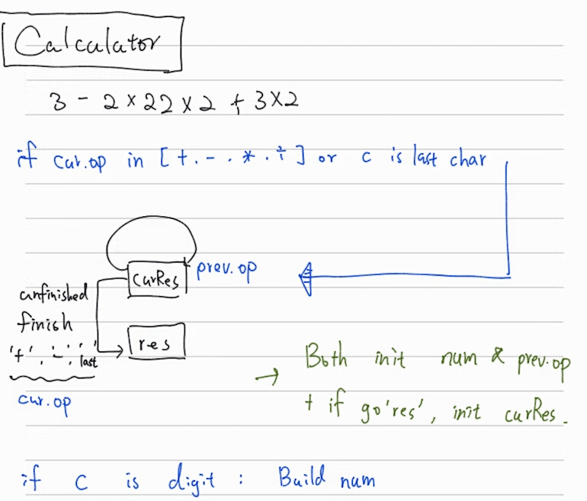
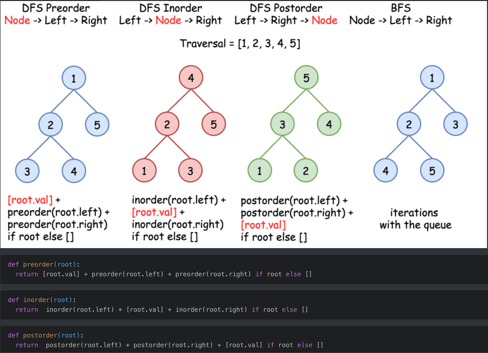

Solution Model
===
## Calculator
- for `224`, `227`, `772`, `770`
- 

### model
```py

while i < len(s):
    c = s[i]
    if isdigit():
        # build-digit()
    elif c == '(':
        cnt = 0
        for j in range(i, len(s)):
            if s[j] == '(':
                cnt += 1
            if s[j] == ')':
                cnt -= 1
            if cnt == 0:
                break
        num = self.calculate(s[i+1:j])
        i = j

    if c is not digit or i is last digit:
        switch(op) to update curRes
        update res if c is + or -
            init curRes
        update op and init num
    inc i
```

### example:
```py
    def calculate(self, s: str) -> int:
        res, curRes, num, op = 0, 0, 0, '+'
        i = 0

        while i < len(s):
            c = s[i]
            if c.isdigit():
                num = num*10 + int(c)
            elif c == '(':
                cnt = 0
                for j in range(i, len(s)):
                    if s[j] == '(':
                        cnt += 1
                    if s[j] == ')':
                        cnt -= 1
                    if cnt == 0:
                        break
                num = self.calculate(s[i+1:j])
                i = j


            if c in ['+', '-', '*', '/'] or i == len(s)-1:
                # update curRes
                if op == '+':
                    curRes += num
                elif op == '-':
                    curRes -= num
                elif op == '*':
                    curRes *= num
                elif op == '/':
                    curRes = int(curRes / num)

                # determine whether update res from curRes
                if c in ['+', '-'] or i == len(s)-1:
                    res += curRes
                    curRes = 0

                # update
                op, num = c, 0

            i += 1
        return res
```

---

## Accumulated Sum

- 累積陣列值的技巧

### 技巧變形1: +1 -1

- `525`
- binary array:
    - 遇到0: sum-1
    - 遇到1: sum+1

---

## Binary Search

1. Always use right = len(nums) -1, because you may want to access arr[right]!
    - 在宣告時就已經朝著 "l" 跟 "r" 都有可能是可能解的方向, 所以在限縮左右邊界時也要保持這個特性
2. 最單純的binary search, 查找特定的值:
    - l <= r
    - mid == target: break
    - l = mid + 1
    - r = mid - 1
3. 查找左邊界:
    - l < r
    - l = mid +1
    - **r = mid**
4. 查找右邊界:
    - l < r
    - **mid = l + (r-l)//2 + 1**
    - **l = mid**
    - r = mid - 1
5. 注意查找左右邊界的if判斷式寫法:
    - **if 判斷式均要放 >= or <= 的情形 (因配合我們宣告 r = len(nums)-1)**
    - 詳見LC34三刷code


---

## LinkedList
1. 快慢指針找環
    1. phase1: 快慢指針找出重合點
    2. phase2: 另一個指針從起始點出發, 與慢指針一步步前進, 重合處即是環的開始
    3. 見 LC142, 287

---

## Bit manipulate

1. https://medium.com/techie-delight/bit-manipulation-interview-questions-and-practice-problems-27c0e71412e7

---

## Binary Tree Traversal

- One line python(Pretty useful!)
    - 
    -

---

## BFS

```py
def bfs():
    # initialize
    visited, queue = {}, []

    while queue:
        # process current node
        var = queue.pop(0)

        # gen more node
        more_nodes = self.gen_more_node(var)

        # check visited
        for next_node in more_nodes:
            if next_node not in visited:
                queue.append(next_node)
                visited.add(next_node)
```

## DFS

Recursive:
```py
visited = set()

def dfs(node, visited):
    if node in visited:
        return # already visited, terminated

    # process current node here

    # gen more node
    more_nodes = self.gen_more_node(node)

    for next_node in more_nodes:
        if not next_node in visted:
            dfs(next_node, visited)
```

Iterative:
```py

def DFS(tree):
    visited, stack = [], [tree.root]

    while stack:
        node = stack.pop()

        # process current node

        # gen more node
        more_nodes = self.gen_more_node(node)

        for next_node in more_nodes:
            if not next_node in visted:
                stack.append(next_node)
                visited.add(next_node)
```

## 總結 BFS, DFS 五部曲
1. 建立 queue/stack, visited set
2. while queue/stack not empty {
3.       處理當前節點
4.       擴展節點
5.       入 queue/stack, 更新 visited
6. }

---
