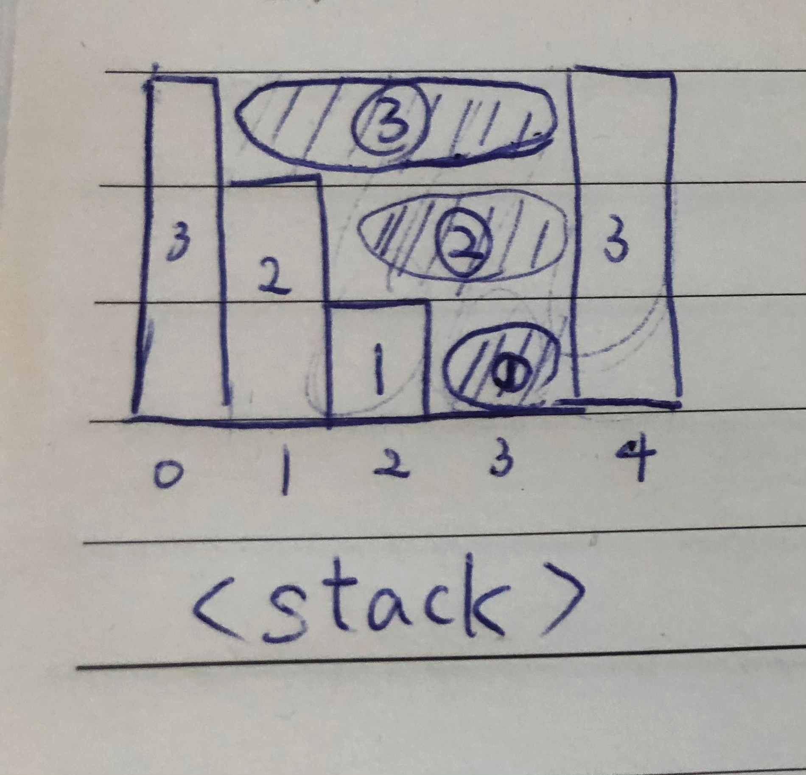

Solution Model
===
## Python Trick
1. Dictionary
    1. iterate over keys:
        - `for k in list(dict.keys())`
        - Note: should listify!
    2. secure way to visit dict:
        - `dict.get(k)`
        - `dict.get(k, defaultvalue)` with default value
        - Benifit:
            - no need to initialize dict
            - no need to write `if k in dict: ...`
    3. add two dict:
        - `dict1.update(dict2)`
        - Note: cannot use `+`
    4. inline initialize:
        - `dict = {c: True for c in boolTable}`
    5. get key:value pair
        - `pairs = dic.itmes()`
    6. defaultdict default value with customize type
        - `dict = defaultdict(lambda: expression)`
            - `dict = defaultdict(lambda : [0, 0])`
            - default value will be array of two element
2. Sort by key
    1. `intervals = sorted(intervals, key=lambda x: x[0])`
    2. `intervals = sorted(intervals, key=lambda x: (x[0], x[1], x[2], ...))`
    3. max 也可用: `max(counters.items(), key = lambda x: x[1])`
3. 利用 tuple 的性質讓 unhashable type 變成 hashable
    1. `set.add(tuple(list))`
4. 要取出一個整數中的各個位數，使用 `while n > 0: n, digit = divmod(n, 10)`
5. 取出 dic 中 value 最大的 key
    - `max(dic, key=dic.get)`
6. 矩陣旋轉
    1. `np.transporse(arr_2d)`
    2. `zip(*arr_2d)`
        - `*` 是解偶
            - `*[[1,2,3], [4,5,6]]` = [1,2,3], [4,5,6]
        - 再 zip 起來就會變成
            - [(1,4), (2,5), (3,6)]

## Combination
1. 固定長度
    1. DFS
        - 參考 python build-in function `combinations(arr, length)`, 自己寫的 general usage recursive 版本
        ```py
        def combinations(self, arr, leng):
            res = set()
            def helper(idx, comb, leng):
                if leng == 0:
                    res.add(tuple(comb))
                    return

                for i in range(idx, len(arr)):
                    helper(i+1, comb+[arr[i]], leng-1)

            helper(0, [], leng)
            return res
        ```
    2. BFS
        - 
        ```py
        def combinations(self, source, length):
            bfs = [""]
            for c in source:
                bfs += [s+c for s in bfs]

            return set(b for b in bfs if len(b) == length)
        ```
    - 使用方式:
        - 如果允許重複, 請把 res 型態宣告成 list
    - 技術學習:
        - 這邊用 helper 的 design pattern, 暴露了簡單的使用方式給外面
            - 主要因為面對求 combination 的題, 這個 result 要使用 pass by reference 的方式會比較方便
            - 但如果我不想讓 user 在使用這個 function 的時候還要帶一個 result 進來, 我們直接幫 user 創, 然後用 inline function 直接往幫他創的 result 塞東西, 最後回傳給他
            - inline function 還有好處是不用一直傳遞 arr
        - 這邊用 idx, 取代了一直切割字串
2. 不固定長度
    1. BFS
        ```py
        def combinations(self, source):
            bfs = [""]
            for c in source:
                bfs += [s+c for s in bfs]
            return bfs[1:]
        ```
    2. DFS
        ```py
        def combinations2(self, arr):
            res = set()
            def helper(idx, comb):
                for i in range(idx, len(arr)):
                    res.add(tuple(comb+[arr[i]]))
                    helper(i+1, comb+[arr[i]])

            helper(0, [])
            return res
        ```

## Permutation
    - perfer 使用 dfs + set(indexes)
    1. DFS
        ```py
        def permute(self, nums: List[int]) -> List[List[int]]:
            res = []
            n = len(nums)

            def helper(comb, visited):
                if len(comb) == n:
                    res.append(comb)
                    return

                for num in nums:
                    if num not in visited:
                        visited.add(num)
                        helper(comb + [num], visited)
                        visited.remove(num)

            if nums:
                helper([], set())
            return res
        ```

## Greedy
1. Greedy problems usually look like "Find minimum number of something to do something" or "Find maximum number of something to fit in some conditions", and typically propose an unsorted input.

2. The idea of greedy algorithm is to pick the locally optimal move at each step, that will lead to the globally optimal solution.
3. How to provide Proof of Work?
    - 通常是使用反證法
        - 假設我的事並不是最佳解, (假設此題是找用最少的 ... 去做到 ...)
        - 那就把答案 -1, 然後想辦法去證明真的沒辦法用這個數量去找到解 -> 因此我們的是最佳解

## Calculator
- for `224`, `227`, `772`
- 對於負整數也能解
- 
- 變化題: `726 化學式`

### model
```py
    def __init__(self):
        self.i = 0

    def calculate(self, s: str) -> int:
        num, op, curSum, globalSum = 0, "+", 0, 0
        while self.i < len(s):
            c = s[self.i]
            self.i += 1 # note increase i here
            if c.isnumeric():
                num = num*10 + int(c)
            elif c == '(':
                num = self.calculate(s) # use global i to track progress
            elif c == ')':
                break # simply break and rely on return to update the correct global
            if c in ["+", "-", "*", "/"]:
                # update curSum
                # update globalSum and reset curSum if c is + or -
                # reset num and update op
        return globalSum + self.cal(curSum, num, op)

    def cal(self, curSum, num, op):
        if op == "+":
            curSum += num
        elif op == "-":
            curSum -= num
        elif op == "*":
            curSum *= num
        elif op == "/":
            curSum = int(curSum / num)
        return curSum
```

### example:
```py
class Solution:
    def __init__(self):
        self.i = 0

    def calculate(self, s: str) -> int:
        num, op, curSum, globalSum = 0, "+", 0, 0
        while self.i < len(s):
            c = s[self.i]
            self.i += 1
            if c.isnumeric():
                num = num*10 + int(c)
            elif c == '(':
                num = self.calculate(s)
            elif c == ')':
                break
            if c in ["+", "-", "*", "/"]:
                curSum = self.cal(curSum, num, op)
                if c in ["+", "-"]:
                    globalSum += curSum
                    curSum = 0
                num, op = 0, c
        return globalSum + self.cal(curSum, num, op)

    def cal(self, curSum, num, op):
        if op == "+":
            curSum += num
        elif op == "-":
            curSum -= num
        elif op == "*":
            curSum *= num
        elif op == "/":
            curSum = int(curSum / num)
        return curSum
```

---

## Accumulated Sum

- 累積陣列值的技巧

### 技巧變形1: +1 -1

- `525`
- binary array:
    - 遇到0: sum-1
    - 遇到1: sum+1

---

## Sliding Window

0. 要 apply sliding window 的思考點
    1. 何時縮左邊 -> 最關鍵
    2. 縮了左邊要做什麼事
    3. global_max 該在哪裡維持 -> 最好就是放最外面
0. 模板
    ```py
    # LC904
    for r, t in enumerate(tree):
        dic[t] += 1 # update條件
        while len(dic) > 2: # 檢查條件
            dic[tree[l]] -= 1 # 縮左邊
            if dic[tree[l]] == 0:
                del dic[tree[l]] # 更新條件
            l += 1
        res = max(res, r-l+1)
    ```
1. Window 形成一個合法的狀態，我們透過其他資料結構 (如dict, 變數) 去協助我們伸縮子集合的長度，如果不用此方法變成我們必須要去先取得所有可能的組合
2. Sliding window 求 subarray combination 的時候適合使用 atMost 的技巧, 如 LC930 求 =k 時, 用 atMost(k) - atMost(k-1)
    ```py
    def atMost(S):
        cnt, _sum, l = 0, 0, 0

        for r, a in enumerate(A):
            _sum += a
            while _sum > S:
                _sum -= A[l]
                l += 1
            cnt += (r-l+1)
        return cnt
    ```
3. Sliding 的對象 arrray 必須是非負陣列，否則會破壞 window
4. 題型總和
    0. 209. Minimum Size Subarray Sum
    1. 1248. Count Number of Nice Subarrays
    2. 1234. Replace the Substring for Balanced String
    3. 1004. Max Consecutive Ones III
    4. 930. Binary Subarrays With Sum
    5. 992. Subarrays with K Different Integers
    6. 904. Fruit Into Baskets
    7. 862. Shortest Subarray with Sum at Least K - too hard
    8. 76. Minimum Window Substring

---

## Binary Search

1. 性質
    1. (l, r) 所匡起來的區域，都要是可能的解
        1. 所以初始化 r 為 `len(nums) - 1`
        2. `l+1`, `r-1` 是用來協助我們排除已知不可能的部分，因此其 condition 須為`確切排除`
        3. `l = mid`, `r = mid` 此為合法條件，因此在跳出 while loop 後回傳他就對了
    2. 查找什麼就縮什麼
        1. 查找左邊界 -> `l = mid+1`
        2. 查找右邊界 -> `r = mid-1`

2. 最單純的binary search, 查找特定的值:
    - l <= r
    - mid == target: break
    - l = mid + 1
    - r = mid - 1

3. 查找左邊界:
    - l < r
    - l = mid +1
    - **r = mid**
        - 其所屬的條件及為言語上的所求，例如 LC34 的第一個 bs
        - 我想找『大於等於 target 的左邊界』=> 就要想到
            1. 我要 return r
            2. r = mid，並且進入此表達式的條件要是『大於等於 target』
    - **return r**
4. 查找右邊界:
    - l < r
    - **mid = l + (r-l)//2 + 1**
        - 倘若被問到為何這邊要+1, 因為 在偶數個個數的情況下, 我們本來的公式 mid 的選擇是偏左, 再搭配上我們 `l = mid`, 會導致 l == mid == k, 然後 nums[mid] 又一直進到 `l=mid` 形成無窮迴圈
            - [0, 1, 2, 3, 4, 5],倘若一直進到 `l=mid`, mid 的變化 2->3->4->4->4...4
    - **l = mid**
        - 同上，其所屬的條件及為言語上的所求，例如 LC34 的第二個 bs
    - r = mid - 1
    - **return l**

5. 實作 bisect (使用查找特定值模板)
    - 官方 implement https://github.com/python/cpython/blob/3.9/Lib/bisect.py#L15-L35
    - 記憶:
        - 宣告時, lo 是合法, hi 是不合法
        - 我們都是 return lo
        - 我們都是對 lo 做 mid+1
        - 都使用絕對小於
        - left -> a[mid] 在左; right -> a[mid] 在右
    - 比較
        ```py
        from bisect import bisect_left, bisect_right
        a = [0,2,2,2,5]
        bisect_left(a,2)  # return 1
        bisect_right(a,2) # return 4
        ```
    - biset_left
        ```py
        def bisect_left(a, x):
            lo, hi = 0, len(a)

            while lo < hi:
                mid = (lo+hi)//2
                if a[mid] < x:
                    lo = mid+1
                else:
                    hi = mid
            return lo
        ```

    - biset_right
        ```py
        def bisect_right(a, x):
            lo, hi = 0, len(a)

            while lo < hi:
                mid = (lo+hi)//2
                if x < a[mid]:
                    hi = mid
                else:
                    lo = mid+1
            return lo
        ```

---

## LIS (Longest Increasing Subsequence)

```py
class Solution:
    def lengthOfLIS(self, nums: List[int]) -> int:
        inc = []

        for num in nums:
            x = bisect.bisect_left(inc, num)
            if x == len(inc):
                inc.append(num)
            else:
                inc[x] = num
        return len(inc)
```

---

## LinkedList
1. 快慢指針找環
    1. phase1: 快慢指針找出重合點
    2. phase2: 另一個指針從起始點出發, 與慢指針一步步前進, 重合處即是環的開始
    3. 見 LC142, 287
2. 快慢指針找 List 中點 <LC109>
    1. 寫法1: head 多先走一步，就可以不需要用到 dum
    2. 寫法2: 遇到需要切割 fast 宣告成 head.next.next，就可以直接用 slow.next 去切
        ```py
        slow, fast = head, head.next.next
        while fast and fast.next:
            slow = slow.next
            fast = fast.next.next

        mid = slow.next # <- center
        slow.next = None # <- cut the front
        right = mid.next # <- new head of right
        ```
2. Doubly LinkedList
    1. Insert, Delete: O(1)
    2. Example: LRU cache <LC146>
3. 在某個節點前插入新結點
    1. 修改current dummy 的值
    2. 插入新的dummy 並指向舊的dummy
    3. Example: <LC445>
4. 快慢指針存取*倒數第 n 個*節點
    1. 快指針先走 n 步, 再讓兩者同時前進
    2. 當快指針走到底時，慢指針的位置即為所求
    3. 如果需要站在倒數第 n+1 個點, 那就是判斷 fast.next 走到盡頭, 此時的 slow.next 就是倒數第n (LC19)
5. 旋轉 LinkedList
    1. 頭尾相接，然後做兩件事：找出新頭, 斷尾
6. 跳者走訪 LinkedList
    1. 用兩個指標 first, second
    2. first.next = second.next, second.next = first.next.next
7. Reverse list
    1. stack 協助
    2. reverse in place
        ```py
        ptr = head
        revHead = None # started of the reverse list

        while ptr:
            nxt = ptr.next
            ptr.next = revHead
            revHead = ptr
            ptr = nxt
        ```
    3. Recursively
        ```py
        if not head or not head.next: # use not head.next to stand previously
            return head

        revHead = self.reverseList(head.next) # should not do any modify to it
        head.next.next = head # modify the second's next to first
        head.next = None # release the original pointer
        return revHead
        ```
---

## Bit manipulate

1. 可用於 O(1) 判斷一個集合曾經出現與否, e.g.: set("apple") == set("apppple")
    ```py
    def get_str_mask(self, iterable):
        m = 0
        for c in iterable:
            m |= self.get_char_mask(c)
        return m

    def get_char_mask(self, char):
        return 1 << (ord(char)-97)

    # Input: get_str_mask("apple")
    # Output:
    # 0 0 0 0 0 0 0 0 0 0 1 0 0 0 1 0 0 0 0 0 0 1 0 0 0 1
    # z y x w v u t s r q p o n m l k j i h g f e d c b a
    # ps: get_str_mask("apple") == get_str_mask("apppppple") -> True
    ```
2. 當沒有想法的時候先試試看 XOR 吧!
    - a ^ b 的意義
        1. a + b 不考慮 carry
            - carry = (a & b) << 1
        2. a - b 不考慮 borrow
            - borrow = ((~a) & b) << 1
1. https://medium.com/techie-delight/bit-manipulation-interview-questions-and-practice-problems-27c0e71412e7

---

## Binary Tree Traversal

- One line python(Pretty useful!)
    - 

    精簡版
    ```py
    def inorder(root):
        return inorder(root.left) + [root.val] + inorder(root.right) if root else []
    ```

    可拓展版 (可用於對於 node 需要進行的不同操作)
    ```py
    def inorder(root):
        if root:
            left_list = inorder(root.left)
            node_list = [root.val]
            right_list = inorder(root.right)

            return left_list + node_list + right_list
        else:
            return []
    ```

- 使用Iterative 避免 stackoverflow
    - 
- Note:
    - 遇到 preorder 可解的優先採用 iterative 寫法 (高效)

1. Iterative 版 inorder (左中右)
    ```py
    # 左中右
    class Solution:
        def inorderTraversal(self, root: TreeNode):
            stack = []
            res = []
            p = root

            while p or stack:
                if p:
                    stack.append(p)
                    p = p.left
                else:
                    top = stack.pop()
                    res.append(top.val)
                    p = top.right
            return res
    ```

    一般版
    ```py
    def inorder(root):
        stack = []
        inorder = []
        while stack or root:
            while root:
                stack.append(root)
                root = root.left
            root = stack.pop()
            inorder.append(root.val)
            root = root.right
        return inorder
    ```

2. Iterative 版 preorder (中左右)
    ```py
    # 中左右
    class Solution:
        def preorderTraversal(self, root: TreeNode):
            stack = []
            res = []
            p = root

            while p or stack:
                if p:
                    res.append(p.val) # 中
                    stack.append(p)   # 左
                    p = p.left        # 左
                else:
                    top = stack.pop()
                    p = top.right
            return res
    ```

    一般版
    ```py
    def preorderTraversal(self, root):
        if root is None:
            return []
        stack = [root]
        preorder = []
        while stack:
            node = stack.pop()
            preorder.append(node.val)
            if node.right:
               stack.append(node.right)
            if node.left:
               stack.append(node.left)
        return preorder
    ```

3. Iterative 版 postorder (左右中)
    ```py
    # 左右中 -> 中右左 -> return 時再反轉
    class Solution:
        def postorderTraversal(self, root: TreeNode):
            stack = []
            res = []
            p = root

            while p or stack:
                if p:
                    res.append(p.val)  # 中
                    stack.append(p)    # 右
                    p = p.right        # 右
                else:
                    top = stack.pop()  # 左
                    p = top.left       # 左
            return res[::-1]           # 反轉
    ```

    two stack version
    ```py
    # 1. Push root to first stack.
    # 2. Loop while first stack is not empty
    #    2.1 Pop a node from first stack and push it to second stack
    #    2.2 Push left and right children of the popped node to first
    #        stack
    # 3. Print contents of second stack
    def postOrder(self, root):
        if root is None:
            return

        s1 = []
        s2 = []
        postOrder = []

        s1.append(root)

        while s1: # append 到 s2 的順序 中左右
            node = s1.pop()
            s2.append(node)

            if node.left:
                s1.append(node.left)
            if node.right:
                s1.append(node.right)

        while s2:
            node = s2.pop()
            postOrder.append(node.val)
        return postOrder
    ```
- Optimal Traversal strategy: Morris Traversal (not required)
    - see article: https://leetcode.com/problems/recover-binary-search-tree/solution/

---

## Trie
```py
class TrieNode(object):
    def __init__(self):
        self.children = collections.defaultdict(TrieNode)
        self.isEnd = False
        self.word = ''

class Trie(object):
    def __init__(self):
        self.root = TrieNode()

    def insert(self, word):
        node = self.root
        for c in word:
            ## Nomral Dictionary implement
            # if c not in node.children:
            #     node.children[c] = TrieNode()
            node = node.children[c]
        node.isEnd = True
        node.word = word

    def search(self, word):
        node = self.root
        for c in word:
            if c not in node.children:
                return False
            node = node.children[c]
        return node.isEnd
```
---

## Recursive
- Prefer 用 global var 去紀錄, recursive function 內部寫 return statement
    - inner function 可以用 `nonlocal`
    - outer function 可以用 `self`
- 完整的 iterative -> recursive 寫法變化可以參考 LC339. Nested List Weight Sum


---

## BFS

```py
def bfs():
    # initialize
    visited, queue = {}, []

    while queue:
        # process current node
        var = queue.pop(0)

        # gen more node
        more_nodes = self.gen_more_node(var)

        # check visited
        for next_node in more_nodes:
            if next_node not in visited:
                queue.append(next_node)
                visited.add(next_node)
```

1. 一次拜訪整層 => 可用於 BFS 求最短路徑 (LC126. Word Ladder II), (LC301. Remove Invalid Parentheses)
2. p.s. 額外展示 Set 反向操作技巧，如果已經知道哪些點會出現在 set 時
```py
canVisit = set(wordList)
while layer:
    next_layer = []
    for var in layer:
        more_nodes = self.gen_more_node(var)
        for next_node in more_nodes:
            if next_node in canVisit:
                next_layer.append(next_node)

    canVisit -= set(next_layer)
    layer = next_layer
```

3. Two-ends BFS
    - 適用於終點也能擴展的題目 e.g.: LC752
    - 概念:
        - 用兩個 set, 每次選擇用小的去 extend 進 new_front
        - 檢查這個 extend 的有沒有存在 back 裡面, 有就找到了, 沒有就繼續
        - 整層都沒找到後, 判斷現在的 back 跟new_front誰小, 如果 back 比較小, 則做 swap
    - 模板:
        ```py
        seen = set()
        front, back = set(), set()
        while front:
            new_front = set()
            for e in front:
                new_e = process(e)
                if new_e in back:
                    return res
                elif new_e not in seen:
                    seen.add(new_e)
                    new_front.add(new_e)
            if len(back) < len(new_front):
                back, new_front = new_front, back
            front = new_front
        ```

## DFS

Recursive:
```py
visited = set()

def dfs(node, visited):
    if node in visited:
        return # already visited, terminated

    # process current node here

    # gen more node
    more_nodes = self.gen_more_node(node)

    for next_node in more_nodes:
        if not next_node in visted:
            dfs(next_node, visited)
```

Iterative:
```py

def DFS(tree):
    visited, stack = [], [tree.root]

    while stack:
        node = stack.pop()

        # process current node

        # gen more node
        more_nodes = self.gen_more_node(node)

        for next_node in more_nodes:
            if not next_node in visted:
                stack.append(next_node)
                visited.add(next_node)
```

## 總結 BFS, DFS 五部曲
1. 建立 queue/stack, visited set
2. while queue/stack not empty {
3.       處理當前節點
4.       擴展節點
5.       入 queue/stack, 更新 visited
6. }

---

## Mono Stack

1. 可以透過維持/破壞 stack 單調性來解題
2. 例題: LC42 trapping water
    - 
        - 兩邊高、中間低，而我們對中間低窪的地區有興趣 -> 可以維持 遞減 stack
        - 當暴增的元素出現時，我們就可以把頂端元素弄出來處理了，因為我們找到右邊的封口了 (左邊的封口由遞減 stack 所自然形成)
    ```py
    class Solution:
        def trap(self, height: List[int]) -> int:
            stack = []
            res = 0
            for i, h in enumerate(height):
                while stack and h > height[stack[-1]]:
                    deal = stack.pop()
                    if stack:
                        # processing w/ deal, could be any logic
                        _height = min(h, height[stack[-1]]) - height[deal]
                        _width = i - stack[-1] -1
                        res += _height * _width
                stack.append(i)
            return res
    ```
3. 所有例題: LC42, LC84, LC85, LC255, LC739(典型), LC1130, LC496, LC503


---

## Backtrack
1. 先得到三要素
    1. Goal (終止條件)
    2. Constraint and Choice
    3. 模板
    ```py
    def main():
        def helper(states):
            if Goal:
                # do terminatation e.g. add to result
            for c in Choice:
                if Constraint:
                    helper(states + c)
    ```
2. Combination 中不重複的 Trick
    1. <Basic> Choice 無重複:
        - 加入 idx 進 states 去遞迴, 在找 choice 時只往 idx 後面的看
    2. <Advance> Choice 會重複:
        1. Counter + Frequency Backtrack *(Better)*
        2. Sort + If
        3. 例題:
            1. LC40 Combination Sum II
            2. LC90 Subsets II
3. Time complexity:
    - O( (bn)^d ) *bn 的 d 次方*
        - b (base): 為一層的節點數, 也就是 choice的數量
        - n : 為每個節點內所需操作的時間(通常為 constant time)
        - d : 為此 recursion tree 的深度(最大)
    - 或者用最簡單的例子, 去算總共的節點數, 再用 N 去推
4. Recursive 加入 Memorization 的範例:
    1. LC131
        1. Goal 的狀況要先改成 base case
        2. 在 Choice 中去拿 `子recursive` 的總結果
        3. 把總結果加上 Choice 並更新到 res
        4. 更新 Memo
    2. LC140 (LC139 follow-up)
        -  Memorization 的項目由單個結果轉換成 Combination
        -  DP 儲存的內容由單個結果轉換成 Combination

---

## Graph
1. 有向圖
    1. 有向圖找環 (黑白大法)
        1. 建立連結 (node -> list[node])
        2. 走訪所有節點
            1. backtrack 其子節點
            2. 如果出現在 visited 中, 表示有走過了 -> 找到環
        3. Example: LC207. Course Schedule I
    2. 拓樸排序 (黑白灰大法)
        1. 從圖找環去改
            1. 額外多傳入一個 stack 去 append path
                - Note: 更新的時機是確定當前點的所有鄰居都不會產生環時
        2. 差別詳見 LC210. Course Schedule II
        3. 視要求決定如何 loop (有可能出現孤島節點時):
            1. 如 LC269 要求輸出所有出現過的 char, 但無法排序的話任何順序都可以, 此時我們 loop 的對象應該是 "所有節點"
            2. 但像是如果單純找環, 那麼孤島節點肯定沒有環，因此也不需要去 loop 了
2. 無向圖
    0. Union Find
    1. Time: O(theta(N)), theta很小, 所以通常是說 O(N)
        ```py
        def init(self, node_cnt):
            self.root_map = [id for id in range(node_cnt)] # each node points to itself, (could also use dict)
            self.sizes = [1 for id in range(node_cnt)]

        def union(self, x, y):
            root_x, root_y = self.find(x), self.find(y)
            if root_x == root_y:
                return
            self.root_map[root_y] = root_x # for simplicity, didn't compare the size
            self.sizes[root_x] += self.sizes[root_y]
            # # Size compare optimize:
            # if root_x == root_y:
            #     # Should not process with this condition since we've process w/ it before and it will make the size go wrong e.g. union(1, 2) and union(2, 1)
            #     return
            #
            # if self.sizes[root_x] >= self.sizes[root_y]:
            #     self.root_map[root_y] = root_x
            #     self.sizes[root_x] += self.sizes[root_y]
            # else:
            #     self.root_map[root_x] = root_y
            #     self.sizes[root_y] += self.sizes[root_x]

        def find(self, x):
            if self.root_map[x] != x:
                self.root_map[x] = self.find(self.root_map[x])
            return self.root_map[x]
        ```
    1. 無向圖找環
        1. UnionFind (找你爸法)
            0. Time:
                1. Naive: O(N^2)
                2. Path Compression: O(N⋅α) ~= O(N)
                3. Find 本身 ~= O(α(N)) ~= O(1)
            1. 初始化 root_map (每個點的root都是自己), 連續的點用 arr, 不連續的點用 dict
            2. 對每對 connected component, 分別找到其 root
            3. 如果他們的 root 相同, (如圖 [2,3] 為 connected component, 他們的root 都是1) -> 表示有環存在
                 ```
                 1 - 2
                   \ |
                     3
                 ```
            4. 如果不同, 則進行 union 的動作(把 `y的root` 連到 `x的root` 下)
            5. Example: LC261
            6. 優化: 此種簡單版，會變成 LinkedList, 但我們可以讓樹不要長這麼高
                1. Path Compression
                2. 在 找到 root 後, 把路途中的所有節點全部修正指向 root
                3. 在 union 的階段, 不直接 hard-code root_map[root_y] = root_x, 而是 phase3 先判斷各自樹的大小, 再把小的依附到大的下
        2. DFS
            1. edge 的兩端各自建立對對方的連線
            2. 跟有向圖找環一樣, DFS with visited set 去檢測是否拜訪過了
            3. DFS 要帶入 cur, pre, 用來避免把 backedge 誤判為 cycle
            4. 例題 LC261

    2. 無向圖找 connected component
        1. Union Find
            1. 可利用 UnionFind 找, **去算有多少節點的 root 還是本身** (LC323)
                `len([i for i in range(len(self.root_map)) if i == self.root_map[i]])`
---

## DP
- Thinking process:
    1. 先用遞迴/backtrack 解題
    2. 用 Memorization 改良 (Topdown DP)
    3. 試著去想如何可以不使用 recursive call (BottonUp DP)
        - 試著用 memo 紀錄的資訊當作線索來思考 dp[i][j] 的定義
        - 試著用 此態到下態的變化方式作為狀態轉移方程式
        - 這邊常用到的技巧是用 dp[i-1] 去更新 dp[i] *(在這個階段請試著往這個方向思考)*
        - **我們的 Recursive 的作法是從大的階段往前求到 base case 再return回來, 而現在我們就只是要換個方向, 由 base case 出發做到後面**
            - 轉換的概念詳見 LC377. Combination Sum IV/LC322 Coin Change
            - 或者 LC688. Knight Probability in Chessboard
    4. Space 優化: 看看 dp 陣列是否有辦法降維a
    5. Reference article: https://leetcode.com/problems/jump-game/solution/
    6. 結論:
        1. TopDown:
            - 從後往前不停的 recursive 直到 base case, 將結果累積到 result, 最後由前往後存到 memo 中
        2. BottomUp:
            - 從 base case 往後做 iterative, 並由前往後累積到 dp 數組中

1. TopDown
    0. 求所有情況的(combination) 類型的題
    1. 可以從 Recursive 的解法演化而來
    2. 缺點: 依舊存在 recursive 過多的問題
    3. 題目: LC10, LC44

2. BottonUp
    0. 求極值的題, 保存中間狀態從而更新出最大最小
    1. 需直接思考到`如何定義子問題`
        - 直接把 dp[-1][-1] 當作最後要 return 的東西
        - 這樣就可以定義出 dp[i][j] 的意義了
    2. `子問題的狀態如何轉移`
        - 站在 dp[i][j], 去看 dp[i-1][j], dp[i][j-1], dp[i-1][j-1] 搭配題目的要求看怎麼轉移
        - 直接套 example 去想轉移式
    3. 大部分的題
    4. 範例 LC 718. Maximum Length of Repeated Subarray
        1. 
            ```py
            class Solution:
                def findLength(self, nums1: List[int], nums2: List[int]) -> int:
                    dp = [[0 for _ in range(len(nums1)+1)] for _ in range(len(nums2)+1)]

                    for i in range(1, len(nums2)+1):
                        for j in range(1, len(nums1)+1):
                            if nums2[i-1] == nums1[j-1]:
                                dp[i][j] = dp[i-1][j-1] + 1
                    return max(max(row) for row in dp)
            ```
    5. 空間優化
        - 寫完後我們可以觀察我們的狀態轉移會使用到過去的值是不是很少, 如果只會用到前 1 個 column, 那麼我們其實可以不用用 2D array 去存所有值
        - 用兩個一維陣列, previous and current 即可去代表 dp[i-1], dp[i]
        - 詳見例題: LC1143

---

## Heap

```py
    # LeetCode 218
from heapq import heappush, heappop
class Solution:
    def getSkyline(self, buildings: List[List[int]]) -> List[List[int]]:
        # 1. define sources
        events = [(L, -H, R) for L, R, H in buildings]
        events += [(R, 0, 0) for _, R, _ in buildings]
        events = sorted(events)

        # 2. initialize heap -> try to keep at least one elem in heap, in order not to out of range in step4
        live = [(0, float(inf))]

        # 3. iterate over sources
        for pos, negH, R in events:

            # 4. pop-out useless elem in heap
            while live[0][1] <= pos:
                heappop(live)

            # 5. push new elem into heap
            if negH:
                heappush(live, (negH, R))

            # 6. decide if it's the right elem to output
            if -live[0][0] != res[-1][1]:
                res.append([pos, -live[0][0]])
        return res[1:]
```

---

## QuickSelect

- 針對尋找前 k sth 的題
- 快速回憶: divideAndConquer -> partition -> pivot -> swap with back -> iterate to find perfect index for pivot -> swap it back -> decide we need to add more elem in front or delete some -> divideAndConquer ...

1. QuickSelect k smallest
    1. 從 l, r 隨機找出一個 index 當 pivot
    2. 去進行 partition algorithm
    3. 如果回傳的 perfect pivot 位置 == k -> 即為所求
    4. 位置 < k -> 還需要補入更多數 -> 對右半邊運算, 反之左半邊
    5. **特別注意, 如果我們要尋找第 k 小的數, 第一次傳入 quickselect 的數應該要是 `k-1`, 主因是我們 partition 回傳的是 idx, 是 based-0 的!**
2. Partion Algorithm
    1. Work for unique elem
        1. 先紀錄 pivot index 所代表的意義 (frequency or sth)
        2. 把 p 跟 r 交換
        3. 初始化 store_idx 為 l
        4. 對區間 (l, r) 去 for-loop
            1. 如果 freq[i] < freq_p -> swap(i, store_idx++)
        5. 最後再把 r 跟 store_idx 調換 (p換回到 perfect index)
        6. return store_idx

```py
class Solution:
    def topKFrequent(self, nums: List[int], k: int) -> List[int]:
        count = Counter(nums)
        unique = list(count.keys())

        def partition(l, r, p):
            pivot_freq = count[unique[p]]
            unique[r], unique[p] = unique[p], unique[r]

            idx = l
            for i in range(l, r):
                if count[unique[i]] < pivot_freq:
                    unique[idx], unique[i] = unique[i], unique[idx]
                    idx += 1

            unique[r], unique[idx] = unique[idx], unique[r]
            return idx

        def quickselect(l, r, k_smallest):
            if l == r:
                return
            p = random.randint(l, r)
            p = partition(l, r, p)
            if p == k_smallest:
                return
            elif p < k_smallest:
                quickselect(p+1, r, k_smallest)
            else:
                quickselect(l, p-1, k_smallest)

        n = len(unique)
        quickselect(0, n-1, n-k)
        return unique[n-k: ]
```

---

## Prefix Sum

- Good question:
    - LC930. Binary Subarrays With Sum
    - LC437. Path Sum III
    - LC560. Subarray Sum Equals K
- Array 類型的可用 sliding window 來解

https://leetcode.com/discuss/general-discussion/563022/prefix-sum-problems


## LineSweep
1. 題型特徵: Interval
2. 解題邏輯:
    - 把 Interval 中的 Start, End 分成兩種 Event，並將 (Pos, EventType) 存入 events<arr> 中
    - 排序 Event，並順序拜訪
        - 需搭配 Heap 的題型
            - Pop Heap: Pos 是用來篩選掉在 Heap 中已過時的資料
            - Insert Heap: 將 (Data, Pos) 存入 Heap 中
            - Do the logic (通常都是拿 Heap 中的 Top 的 Data 來做事)
        - 無需搭配的
            - Do the logic (拿 EventType 來做事)
3. 例題:
    - 需 Heap
        - 218
    - 無須 Heap
        - 253
        - 759
