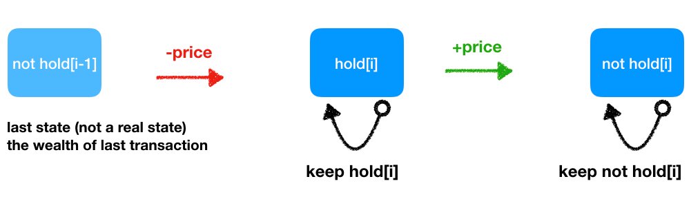
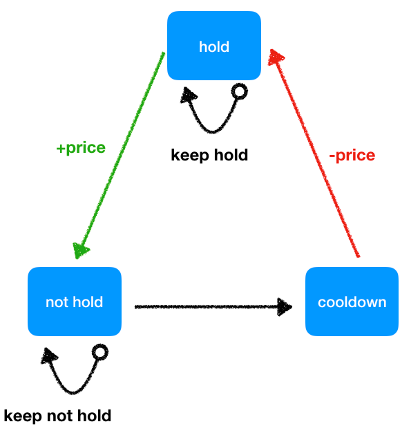

# Similar Problem

## Binary Tree Path Sum
### Questions
- LC112, LC113, LC437, LC124

1. LC112 Path Sum I
    1. 題目:
        - Given a binary tree and a sum, determine if the tree has a root-to-leaf path such that adding up all the values along the path equals the given sum.
    2. 分析:
        - 相對嚴格的條件從 root to leaf, 因此我們只需要維護一個 curSum 到 leaf 在判斷是否為 target 即可
    3. 解法:
        - 前序遍歷
2. LC113 Path Sum II
    1. 題目:
        - Given a binary tree and a sum, find all root-to-leaf paths where each path's sum equals the given sum.
    2. 分析:
        - 與上題一樣的條件，只是這題必須要求出所有路徑，因此只需要在上題的基礎上多維護一個 path arrays 去更新即可
    3. 解法:
        - 前序遍歷
3. LC437 Path Sum III
    1. 題目:
        - You are given a binary tree in which each node contains an integer value. Find the number of paths that sum to a given value. The path does not need to start or end at the root or a leaf, but it must go downwards (traveling only from parent nodes to child nodes).
    2. 分析:
        - 因為不需要從 root 開始 Naive 的作法是維護 path, 並且走到新的節點就把舊的節點一個一個扣掉，看是否有等於 target 的點，但這種作法需要一直重複加減太不高笑。可以使用 prefix sum dictionary，去紀錄該 accumulated sum 出現的次數，到了新的節點只需要求出加上此節點後跟 target 的差距，再去這個 dict 找出此 sum 的出現次數再加上去即可
    3. 解法:
        - 前序遍歷 + prefix sum
4. LC124 Binary Tree Maximum Path Sum
    1. 題目:
        - Given a non-empty binary tree, find the maximum path sum. For this problem, a path is defined as any sequence of nodes from some starting node to any node in the tree along the parent-child connections. The path must contain at least one node and does not need to go through the root.
    2. 分析:
        - 此題要求的就不是是否等於某個 target，而是此 tree 所能產生的最大值
        - 因此前序已經不適用於此了，因為左右邊的值會影響我們的選擇
    3. 解法:
        - 後序遍歷 + global max update

## 在 array 中 count 符合條件的元素數量
- 共通點:
    1. 對於元素間的 index 關係有要求 (e.g. 後要比前的值小)
    2. 若我們已經處理完各個半部，我們就能夠直接加上剩餘的部分 (因為我們知道剩下的都會符合)，前提是我們要確定剩餘的一定能符合 (with the help of sorted array)

1. LC315
    - Classic Merge Sort
    - 後要比前小
2. LC493
    - 閹割版 Merge Sort (Divide and Conquer)
    - 前要比後的兩倍還大

## SlidingWindow 求符合條件的 Combination 數
- 均要用 atMost 去解, 至於為什麼, 詳見 992 的圖
    - 概念上就是: 如果求 exact 會漏, 那就全部取 atMost(n), 再去扣掉不合的 atMost(n-1)
1. LC930, LC992
    - 這兩題在 atMost中 window 的意義是**本此增加的 combination 個數**
2. 比較: Sliding Window 求極值的
    1. LC159, LC904
        1. 此題 window 的長度意義就是所求的長度

## Union Find and DFS
1. 找 Circle: LC261
2. 找 Connected Graph 數量: LC323

- Union Find:
    1. 找 Circle
        - 求 是否有共同 root
    2. 找 Connected Graph
        - 求 root 的數量
- DFS:
    1. 找 Circle
        - 遞迴求 是否重複 visited, (必須 exclude back_edge, 因此需要多傳一個 pre 來避免錯誤判斷)
    2. 找 Connected Graph
        - 遞迴去把所有連結的 mark 起來, 並遞增 cnt

## TopologicalSort
1. LC269. Alien Dictionary, LC210. Course Schedule II, LC332. Reconstruct Itinerary
2. 比較
    - 269 與 210 只有在建立 adjList 不一樣而已
    - 跟 332 的不同處是在 332 給定有限的拜訪路徑, 且次數可能 > 1, 換句話說可能出現有限的環
        - 因此我們在處理時，不用 visited 去追蹤, 而是直接把用過的路徑 pop 掉

## Two Sum Similar

### 1. Two Sum

- 描述: 給定一個未排序的數組, 找出隨便兩數的 index 加起來為 target
- 解法: HashTable

### 167. Two Sum II

- 描述: 給定一個排序好的數組, 找出隨便兩數的 index 加起來為 target
- 解法:
    1. Two Pointer
    2. Binary Search

### 15. 3Sum

- 描述: 給定一個未排序的數組, 找出所有數字組合, 加總起來為零, 且不能重複
- 解法大綱, 找出一個數, 並將其右的數組找出 2Sum

1. 處理未排序的組合:
    1. 使用排序
        - 可使用剪枝, 可在第一個數大於零後判斷後面不會再有解了
        - 並可使用 Two Sum II 的 two Pointer 解法
    2. 使用 set
        - 比較直覺, 且可以使用 Two Sum I 的解法
2. 處理 2Sum:
    1. 使用 Two Pointer, 此種方法只能搭配排序使用
    2. 使用 Set

### 259. 3Sum smaller

- 描述: 給定一個未排序的數組, 找出小於 target 的組合數量
- 比較: 這題不是找特定值, 因此 HashTable 法無法使用
- 解法:
    1. Two Pointer, 若是當前 l, r 組合是符合的, 那麼固定此 nums[i], nums[l] 去搭配 nums[l+1:r] 都是符合的
    2. BinarySeach, 解法類似於 16, 但這邊要注意要使用 bisect_left, 因為:
        - 我們的目標是尋找, 小於補數的, 因此要過濾等於, 所以要用 left

### 16. 3Sum Closest

- 描述: 給定一個未排序的數組, 找出最接近 target 的組合
- 比較: 這題不是找特定值, 因此 HashTable 法無法使用
- 解法:
    1. Two Pointer, 使用 cusSum 大於或小於 target 去移動 l, r
    2. BinarySearch, 固定兩個點, 去找第三個點, 這邊使用的是 biset_right, 因為要找出下個大於補數的位置

### 18. 4Sum (kSum)

- 描述: 3Sum 的延伸, 就是加個for
- 比較: 更高階的寫法應該要寫 kSum 的方法了
- 解法:
    - 用 recursive 的方法去避免不停地加上 for 迴圈上去
    - 維護變數 k, 逐層遞減, 直到 k == 2 時呼叫 twoSum 終止遞迴

## Line Sweep Similar
- 253 與 759
    1. 都需要 EventType、Balance、Prev
    2. Balance 紀錄目前讀到多少個 Open brackets
- 218
    1. 同樣需要將 Start, End 拆分成不同事件
    2. 多用一個 Heap 來去幫助我們做邏輯的處理(Get Heighest Building)
    3. 這時的 End 事件就是來幫我們去除掉 Heap 中已過期的事件

### 253. Meeting Rooms II
- 找出 Interval 間最大同時重合數
- 找出最大的 Open Brackets 數量

### 759. Employee Free Time
- 找出 Interval 間的空白處
- 當 Balance 為零時，表示找到新的 Free time 了 -> (Prev, CurrentTime)

### 218. The Skyline Problem
- 只用到事件的特性
- 後續的邏輯處理為 heap 的概念

## String Convert/Pattern
### LC205. Isomorphic Strings
- 此題求的是字串 pattern是否相同, 也就是去看相同字母其出現在兩個字串的位置是否相同
- 例子
    - s = "badc", t = "baba"
    - return False
- 解法: 要用雙向的 map

### LC1153. String Transforms Into Another String
- 而此題求的是字串A是否能 convert 成字串B, 彈性較大, 而且方向固定
- 例子
    - s = "badc", t = "baba"
    - return True
- 解法: 單向的 map, 但最後要加上檢查是否有橋可以去做 tmp char 的放置

## Duplicate Element in List
### LC136. Single Number
- 此題為 List 中只有一個重複的元素, 求出來
- 因此可以用 XOR 的方式去解

### LC217. Contains Duplicate
- 而此題是要求 List 中是否有包含重複的元素
- XOR 派不上用場

## Best Time to Buy and Sell Stock

- 來源:
    - https://leetcode-cn.com/problems/best-time-to-buy-and-sell-stock-iii/solution/zui-jian-dan-2-ge-bian-liang-jie-jue-suo-71fe/
- 由狀態機的概念去想
    - initial stage: 財富為零
    - hold: 為持有股票時的最高財富總額
    - not_hold: 為未持有股票時的最高財富總額
- 畫出狀態機
    - 有限 or 無限?
    - 想法應該是, 這個狀態該由誰怎樣而來 -> 直接可以反應到寫 code 時的邏輯順序

### LC121. Best Time to Buy and Sell Stock

- 
- 只能買一次
    - 維護一個有限狀態機 (2個狀態)
    - costdown the most
    - sell the most

```py
class Solution:
    def maxProfit(self, prices: List[int]) -> int:
        init, hold, not_hold = 0, float(-inf), 0

        for price in prices:

            hold = max(hold, init-price) # maximize hold -> spent less, since hold is always negative

            not_hold = max(not_hold, hold+price)

        return not_hold
```

### LC122. Best Time to Buy and Sell Stock II

- 
- 能買無限次
    - 維護一個無線狀態機 (2個狀態)
    - 每天都嘗試買賣看能不能拿到更高利潤 (奠基在舊狀態上去計算新狀態)

```py
class Solution:
    def maxProfit(self, prices: List[int]) -> int:
        hold, not_hold = float(-inf), 0

        for price in prices:

            prev_hold, prev_not_hold = hold, not_hold

            hold = max(prev_hold, prev_not_hold - price)

            not_hold = max(prev_not_hold, prev_hold + price)

        return not_hold # max profit will always happen on not hold
```

### LC123. Best Time to Buy and Sell Stock III

- 
- 僅能購買兩次
    - 維護一個有限狀態機 (4個狀態)

```py
class Solution:
    def maxProfit(self, prices: List[int]) -> int:
        init = 0
        fst_hold, sec_hold = float(-inf), float(-inf)
        fst_not_hold, sec_not_hold = 0, 0

        for price in prices:
            fst_hold     = max(fst_hold, init-price)
            fst_not_hold = max(fst_not_hold, fst_hold+price)
            sec_hold     = max(sec_hold, fst_not_hold-price)
            sec_not_hold = max(sec_not_hold, sec_hold+price)
        return sec_not_hold
```

### LC188. Best Time to Buy and Sell Stock IV

- 
- 可以購買 k 次 -> 由購買2次 generalize 而來
    - 維護一個有限狀態機 (k*2 個狀態)
    - 實作上為求方便會把他變成 (k+1) *2 個狀態
        - k=0 就表達誠初始狀態 (相當於 hold=float(-inf), not_hold=0 )
        - k=1 ~ k 分別為: 在(持有/未持有股票)第 k 個 trans 時的最高財富額
        - 就像上題一樣, 對於每個 price 我們都讓每個狀態試著求到最大利潤
            - 唯一不一樣的, 對於 hold[i] 的狀態應該是要由 not_hold[i-1] 而來, 而不是 init

```py
class Solution:
    def maxProfit(self, k: int, prices: List[int]) -> int:
        hold = [float(-inf) for _ in range(k+1)]
        not_hold = [0 for _ in range(k+1)]

        for price in prices:
            for i in range(1, k+1):
                hold[i]     = max(hold[i], not_hold[i-1] - price)
                not_hold[i] = max(not_hold[i], hold[i]+price)
        return not_hold[-1]
```

### LC309. Best Time to Buy and Sell Stock with Cooldown

- 
- 在購買前要先 cooldown, 可無限次購買
    - 維護一個無限狀態機 (3個狀態)
    - 因為是無限狀態機, 操作上都要由上一個狀態而來去計算新的狀態, 因此cooldown要存的也是舊狀態
        - 換個角度想, cooldown 若拿來存 not_hold, 那等於就沒有 cooldown 了, 因為下個 loop 時, hold 又直接拿來減
```py
class Solution:
    def maxProfit(self, prices: List[int]) -> int:
        hold, not_hold, cooldown = float(-inf), 0, 0

        for price in prices:
            prev_hold, prev_not_hold = hold, not_hold

            hold = max(prev_hold, cooldown - price)
            not_hold = max(prev_not_hold, prev_hold + price)
            cooldown = prev_not_hold
        return not_hold
```

### LC714. Best Time to Buy and Sell Stock with Transaction Fee

- 無限次交易, 但每次賣出要付手續費
    - 無限交易的code, 在賣出時多扣掉手續費即可

```py
class Solution:
    def maxProfit(self, prices: List[int], fee: int) -> int:
        hold, not_hold = float(-inf), 0

        for price in prices:

            prev_hold, prev_not_hold = hold, not_hold

            hold = max(prev_hold, prev_not_hold - price)

            not_hold = max(prev_not_hold, prev_hold + price - fee)

        return not_hold # max profit will always happen on not hold
```

## String Subsequence

### LC392. Is Subsequence
- 給兩個字串, 問後者是否可由刪除元素來變成前者
- 可用 greedy 解, 因為只問 True False
- 或用 DP 存 s[:i], t[:j] 最大可 match 的數量

### LC1143. Longest Common Subsequence
- 與 392 一樣, 但這題不僅問 True, False, 還問數量, 因此不能用 greedy 去解
- match 的時候拿過去的 +1
- 不 match 的時候取最大的

### LC718. Maximum Length of Repeated Subarray
- 跟上面兩題只差在這題要求連續的長度, 因此我們在不 match 的情況下不用做任何更新 (讓該位置保持 0)

### LC97. Interleaving String
- 這題要求兩個字串穿插排列是否可以變成第三個字串
- dp[i][j] -> s1[:i] + s2[:j] 交錯排列是否能成為 s3[:i+j]
    - 有可能是 s1[i] == s3[i+j] and dp[i-1][j]
        - 要 match s1 的第 i 個字, s1 的 第 i-1 必須被 match
    - 也有可能是 s2[j] == s3[i+j] and dp[i][j-1]

### LC72. Edit Distance
- 給兩個字串, 透過對任何一個進行增刪改使其變成另一個字串, 問最少的 operation 數
- 這題 tricky 的地方就在於 intialize dp array 的時候邊界要調整成遞增
- 這題相反過來 match 的時候直接拿舊的值
- 不 match 的時候, 編編取小的+1

### LC44. Wildcard Matching
- 給 s 跟 p, 問 s 是否可與 p matching
    - `?` match 一個 char
    - `*` match 任何字元
- 使用 BottomUp DP 解
    - Default DP Base Case Value
        - 主要都是針對 dp[0][j] 去 設定初始值, 意義就是 **s 為空字串時, 與 p 的 matching**
        - 因此我們在寫這段的時候就去想 s 為空字串, p[j] 的值怎麼推到 dp 去, 簡單來說就是, **星號是否可以把整個 p 變成空字串**
            - e.g.: s = "", p = `"***ab*c"`
            - ..........*, *, *, a, b, *, c
            - dp = [[T, T, T, T, F, F, F, F]] (第一個 T 為 initial value)
            - 因此, 只有 `p[j-1] == "*" 且 dp[j-1] == True`, 才能把 dp[0][j] 設為 True
        - 主迴圈
            - 當前相同或可 by pass
                - 直接 assign 成 dp[i-1][j-1]
            - 當前是 *
                - 可能用來 match nothing
                    - dp[i][j-1]
                - 或者 match 任何字 (ignore current i)
                    - dp[i-1][j]

### LC10. Regular Expression Matching
- 給 s 跟 p, 問 s 是否可與 p matching
    - `.` match 一個 char
    - `*` match 0個/多個其前方的字元
- 使用 BottomUp DP 解
    - Default DP Base Case Value
        - 主要都是針對 dp[0][j] 去 設定初始值, 意義就是 **s 為空字串時, 與 p 的 matching**
        - 因此我們在寫這段的時候就去想 s 為空字串, p[j] 的值怎麼推到 dp 去, 間單來說就是, **星號是否可以把整個 p 變成空字串**
            - e.g.: s = "", p = `"a*b*ab*c"`
            - ..........a, *, b, *, a, b, *, c
            - dp = [[T, F, T, F, T, F, F, F, F]] (第一個 T 為 initial value)
            - 因此, 只有 `p[j-1] == "*" 且 dp[j-2] == True`, 才能把 dp[0][j] 設為 True
    - 主迴圈
        - 當前相同或可 by pass
            - 直接 assign 成 dp[i-1][j-1]
        - 當前是 *
            - 可能用來刪除前一個 p, "ac", "b*ac"
                - dp[i][j-2]
            - 或者在前一個 p 的值 match 當前的 s 的狀況下, 去 match 任何字 (ignore current i)
                - 其實整句話就等價於 `* 用來 match 它前一個字`
                - `p[j-2] in {s[i-1], '.'}`
                - `and dp[i-1][j]`
                - e.g.:
                    - "aa", "a*"
                        - True
                    - "ab", "b*"
                        - False
                    - "aaaaa", "a*"
                        - True
                    - "aa", "a*****"
            - 或者 match nothing
                - "a", "a*"

### 比較 LC10, LC44
1. Default Base Case
    1. 參見上面
2. 主迴圈
    1. LC10 的 * 是需要去參考到他前一個值, 並且可用來
        1. match 前一字
            - `p[j-2] in {s[i-1], '.'} and dp[i-1][j]`
        2. match nothing
            - `dp[i][j-1]`
        3. 刪除前一字
            - `dp[i][j-2]`

    2. LC44 的 * 可以 用來
        1. match 任何字
            - `dp[i-1][j]`
        2. match nothing
            - `dp[i][j-1]`

## Palindrome DP Problem
- 通常都要 dp[i][j], i 都要從尾巴往回走, j 則是從 i 走到 len+1
- 檢查 Substring 是否為回文兩種方法
    1. DP 紀錄 s[i:j] 是否可以形成回文
        - i == j: dp[i][j] = True
        - i == j+1: dp[i][j] = s[i] == s[j+1]
        - dp[i][j] = dp[i+1][j-1] and s[i] == s[j]
    2. 輪流當中心擴散法
        - spand_from_center(left=i, right=i)
        - spand_from_center(left=i, right=i+1)

### LC5. Longest Palindromic Substring
- 求最長的回文子字串
1. `if dp[i][j] and j-i-1 > len(max_str)` -> update
2. 擴張法回傳 new_start, new_end
    - `if new_end - new_start +1 > g_end - g_start +1` -> update start, end

### LC647. Palindromic Substrings
- 求總共可以形成多少子回文字串
1. `if dp[i][j]` -> cnt += 1
2. 擴張法回傳 new_cnt
    - `cnt += new_cnt`

## Coin Add-up DP Problem

### LC377. Combination Sum IV
- 給一個數字, 給你幾種硬幣幣值, 問有幾種方法可以形成該數字
- 與 LC322. Coin Change 一模一樣
- 解法
    - dp[i] += dp[i-coin]

### LC343. Integer Break
- 給一個數字, 讓你去拆成多個數的和, 問這些數的最大乘積
- 分析:
    - 這題沒有給 coin base, 所以 base 就是從 1 ~ i
    - 且我們在切割時, dp[i] 紀錄的是至少拆成 1 * (i-1), 並沒有紀錄 0 * i, 因此 dp[i-j] 同樣也沒有包含 `i-j` 單獨成立的情形, 因此 我們需要額外考慮 j * (i-j)
- 解法
    - 需分兩種 case 討論, 兩數 及 大於兩數
    - dp[i] = max(dp[i], j * (i-j), j * dp[i-j]), j in range (1, i)
